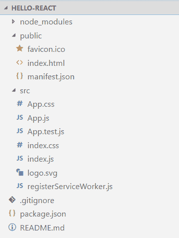
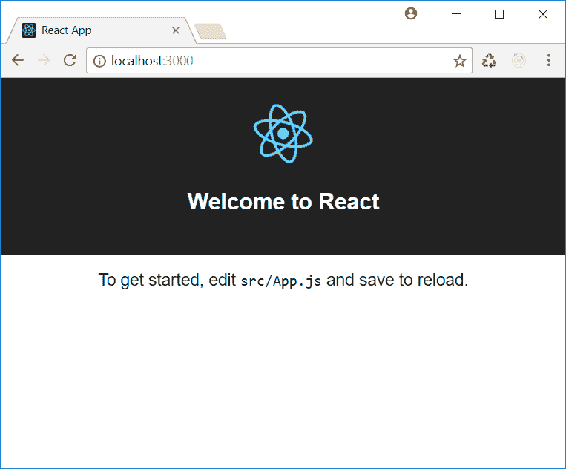
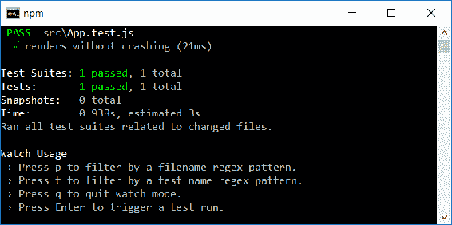
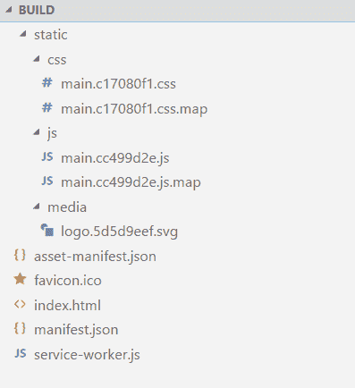
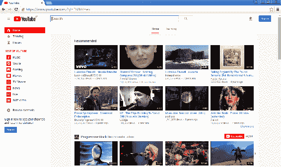
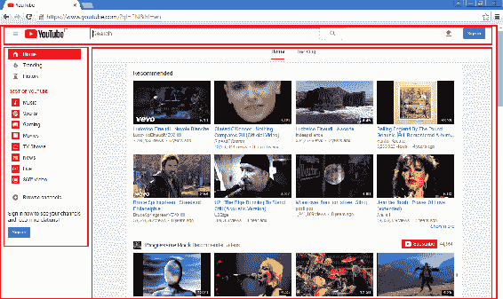
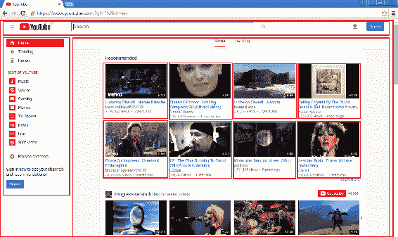
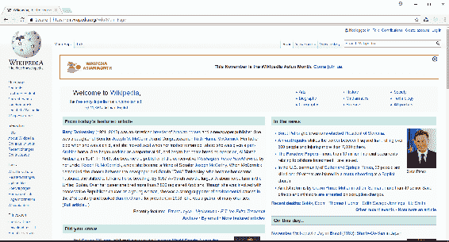

# 第一章：介绍 React 和用户界面设计

React 无疑是网络上讨论最多的库之一。它已经变得像 jQuery 在其鼎盛时期一样流行，越来越多的开发者选择它来构建他们的网页应用程序的用户界面。为什么它变得如此流行？为什么这个 JavaScript 库与其他库相比如此创新？

我们将在本书中尝试回答这些问题，展示该库提供的内容，并使用它来构建高效的网页用户界面。

在本章中，我们将介绍 React，并开始构建基于 React 的应用程序的基本基础设施。然后，我们将分析如何设计用户界面，以便它可以轻松映射到 React 组件，充分利用 React 的内部架构。

在本章结束时，你将能够：

+   描述 React 是什么以及它在你的应用程序开发中的作用

+   搭建基于 React 的应用程序的基础设施

+   设计你的应用程序的用户界面，并优化其在 React 中的使用

# 什么是 React？

简而言之，React 是一个用于构建可组合用户界面的 JavaScript 库。这意味着我们可以通过组合称为**组件**的项来构建用户界面。组件是构建用户界面的元素。它可以是一个文本框、一个按钮、一个完整的表单、一组其他组件，等等。甚至整个应用程序的用户界面也是一个组件。因此，React 鼓励创建组件来构建用户界面；如果这些组件是可重用的，那就更好了。

React 组件有能力展示随时间变化，并且当我们遵循一些指导原则时，该变化数据的可视化是自动的。

由于该库涉及用户界面，你可能会好奇 React 受到了哪些展示设计模式的影响：**模型-视图-控制器**、**模型-视图-展示器**、**模型-视图-视图模型**，还是其他。React 并不局限于特定的展示模式。React 实现了最常见模式中的*视图*部分，让开发者自由选择最佳方法来实现模型、展示器以及构建应用程序所需的其他一切。这一点很重要，因为它使我们能够将其归类为库，而不是框架；因此，与 Angular 等框架的比较可能会出现一些不一致之处。

# 如何搭建基于 React 的应用程序

React 是一个 JavaScript 库，因此我们应该能够通过 HTML 页面中的`<script>`标签引用它并开始编写我们的 Web 应用程序。然而，这种方法会阻止我们利用现代 JavaScript 开发环境提供的一些功能——这些功能使我们的生活更轻松。例如，我们将无法使用 ECMAScript 2015+的最新功能，如类、模块、箭头函数、`let`和`const`语句等。或者，我们可以使用这些功能，但只有最近的浏览器才会支持它们。

**ECMAScript 与 JavaScript 的关系**

使用最新的 ECMAScript 功能需要一个真正的开发环境，允许我们将代码转换为 ECMAScript 5 版本的 JavaScript 代码，以便即使旧的浏览器也能够运行我们的应用程序。设置现代 JavaScript 开发环境需要安装和配置一些工具：一个转换器、一个语法检查器、一个模块捆绑器、一个任务运行器等。学习正确使用这些工具需要大量时间，甚至在开始编写一行代码之前。

# **安装 create-react-app**

幸运的是，我们可以使用`create-react-app`，这是一个**命令行界面**（**CLI**）工具，它允许我们无需配置任何上述工具即可设置基于 React 的应用程序。它基于 Node.js，并提供命令以即时方式设置和修改 React 应用程序。

为了安装`create-react-app`，您需要在您的机器上安装 Node.js。您可以在控制台窗口中输入以下命令来安装 CLI：

```jsx
npm install -g create-react-app
```

安装后，您可以通过输入以下命令来验证是否已正确安装：

```jsx
create-react-app --version
```

如果一切正常，将显示已安装的`create-react-app`版本。

# **创建您的第一个 React 应用程序**

既然开发环境已安装，让我们创建我们的第一个 React 应用程序。我们可以在控制台窗口中输入以下命令来执行此操作：

```jsx
create-react-app hello-react
```

此命令告诉`create-react-app`为名为`hello-react`的 React 应用程序设置所有先决条件。创建过程可能需要几分钟，因为它必须下载项目所需的 npm 包。

npm 是 Node.js 环境的默认包管理器。当进程结束时，您将在屏幕上找到可用于管理项目的可用命令列表。我们稍后会回到这一点。项目创建的结果将是一个名为`hello-react`的文件夹，在其中您将找到构成一个虚拟的——但可工作的——基于 React 的应用程序的项。

# **活动：使用 create-react-app 创建应用程序**

**场景**

我们需要设置一个开发环境，以便创建一个使用 React 构建的产品目录应用程序。

**目的**

活动的目的是开始熟悉`create-react-app`及其创建的内容。

**完成步骤**

1.  使用 `create-react-app` 创建开发环境

1.  将示例应用程序命名为 `my-shop`

**解决方案**

没有正式的解决方案。你应该专注于由 `create-react-app` 创建的内容，因为接下来我们将在以下部分中分析它。

# 探索生成的内容

让我们来看看 `create-react-app` 生成的文件，以便我们能够理解基于 React 的应用程序的结构。我们将在 `HELLO-REACT` 文件夹中找到这些文件和文件夹，如下面的截图所示：



在根文件夹中，我们可以看到一个 `README.md` 文件、`package.json` 文件和 `.gitignore` 文件。

`README` 文档包含开始构建基于 React 的应用程序所需的所有引用。它是以 Markdown 格式编写的，你可以将其与自己的文档集成或覆盖。

Markdown 是一种简单的标记语言，常用于创建软件库的技术文档。它只需要一个简单的文本编辑器，并且可以将 Markdown 文档转换为 HTML。

`package.json` 文件包含有关项目的信息，如名称、版本等，以及对当前项目使用的所有 npm 包的引用。这是一个 Node.js 资源，允许你在将项目复制到另一台机器时下载所需的包。它还包含允许我们管理项目本身的脚本定义。

以下是 `package.json` 文件内容的示例：

```jsx
{
  "name": "hello-react",
  "version": "0.1.0",
  "private": true,
  "dependencies": {
    "react": "¹⁶.0.0",
    "react-dom": "¹⁶.0.0",
    "react-scripts": "1.0.14"
  },
  "scripts": {
    "start": "react-scripts start",
    "build": "react-scripts build",
    "test": "react-scripts test --env=jsdom",
    "eject": "react-scripts eject"
  }
}
```

正如我们所见，文件内容是一个 JSON 对象，有几个易于识别的属性。特别是，我们可以识别项目的名称、版本和包依赖项。除了名称和版本属性外，通常你不需要手动更改这些设置。

`.gitignore` 文件是 Unix 系统中的隐藏文件，它允许我们跟踪在使用 Git 作为版本控制系统时要忽略的文件。`create-react-app` 工具添加了这个文件，因为现在，将项目置于版本控制之下是必不可少的。它建议使用 Git，因为它是目前最流行的版本控制系统之一。

`public` 文件夹包含我们应用程序的静态部分：

+   `favicon`：这是在浏览器地址栏中显示的图标，用于书签

+   `index.html`：这是包含对我们的 React 代码的引用并提供 React 渲染上下文的 HTML 页面

+   `manifest.json`：这是一个根据 **渐进式 Web 应用**（**PWA**）标准包含元数据的配置文件

特别是，`index.html` 文件是我们应用程序的起点。让我们来看看它，以便我们能够理解它的特别之处：

```jsx
<!doctype html>
<html lang="en">
  <head>
    <meta charset="utf-8">
    <meta name="viewport" content="width=device-width, initial-scale=1, shrink-to-fit=no">
    <meta name="theme-color" content="#000000">
    <link rel="manifest" href="%PUBLIC_URL%/manifest.json">
...
    <title>React App</title>
  </head>
  <body>
    <noscript>
      You need to enable JavaScript to run this app.
    </noscript>
  <div id="root"></div>
...
</html>
```

正如我们所见，它是一个标准的 HTML 页面；然而，有几点需要注意。首先，我们看到一个指向 `manifest.json` 文件的链接：

```jsx
<link rel="manifest" href="%PUBLIC_URL%/manifest.json">
```

这个清单包含将我们的应用配置为 PWA 的元数据。

渐进式 Web 应用是适用于每个浏览器和平台的 Web 应用，甚至可以离线工作。它们的基本原则是响应性和渐进增强。

我们注意到的第二件事是两个链接引用中都存在的`%PUBLIC_URL%`占位符。

```jsx
<link rel="manifest" href="%PUBLIC_URL%/manifest.json">
<link rel="shortcut icon" href="%PUBLIC_URL%/favicon.ico">
```

这个占位符将在构建过程中被`public`文件夹的实际 URL 替换。

HTML 页面的主体包含一个带有根标识符的空`div`。这是我们 React 应用程序正确设置的一个重要项目，我们很快就会看到。除了`<noscript>`标签外，我们在主体中看不到其他元素。然而，我们需要在 HTML 页面和 JavaScript 之间建立绑定。构建过程将负责向主体添加所需的脚本。

我们可以向 HTML 页面添加任何其他必需的项目，例如元标签、网络字体等。但是，请记住，HTML 标记中引用的文件应该放在`public`文件夹中。`node_modules`文件夹包含项目使用的 npm 包。通常，您不需要直接管理这些文件。

开发我们应用程序最重要的文件夹是`src`文件夹。它包含我们可以根据需要修改的基本文件和代码。

特别是，我们将找到以下文件：

+   `index.js`：包含我们应用程序的启动点。

+   `index.css`：存储我们应用程序的基本样式。

+   `App.js`：包含示例应用程序的主要组件的定义。

+   `App.css`：包含`App`组件的样式。

+   `logo.svg`：这是 React 的标志。

+   `App.test.js`：存储涉及`App`组件的基本单元测试。

+   `registerServiceWorker.js`：包含注册服务工作者的代码，以便允许离线行为，符合 PWA 的要求。

让我们分析一下这些文件的内容，因为它们的代码对于理解 React 应用程序的启动方式至关重要。

让我们从`index.js`文件开始。其内容如下所示：

```jsx
import React from 'react';
import ReactDOM from 'react-dom';
import './index.css';
import App from './App';
import registerServiceWorker from './registerServiceWorker';

ReactDOM.render(<App />, document.getElementById('root'));
registerServiceWorker();
```

它是一个 ECMAScript 2015 模块，导入其他模块。特别是，它从`react`和`react-dom`模块分别导入`React`和`ReactDOM`对象。这两个模块都是 React 库的一部分，存储在`node_modules`文件夹中。

`react`模块提供组件创建和状态管理的功能。`react-dom`模块是 React 组件和 HTML DOM 之间的粘合剂。React 库被分为两个模块，以将组件管理与实际渲染分离。当我们想要针对的不是 Web 的渲染平台时，这种分离可能会有用；例如，如果我们想要针对原生移动渲染。

其他模块从与`index.js`文件相同的文件夹中导入。特别是，我们从`App`模块导入`App`组件。`App`组件由`ReactDOM`对象的`render()`方法使用，以便将其绑定到 HTML 页面中的`div`元素。这个魔法是通过以下语句实现的：

```jsx
ReactDOM.render(<App />, document.getElementById('root'));
```

目前，我们先忽略用于渲染`App`组件的语法。这将在下一章中介绍。这个语句的含义是将`App`模块内部定义的 React`App`组件与`root`ID 标识的 HTML 元素关联起来。

`registerServiceWorker()`函数的导入和调用启用了离线行为支持，符合 PWA 规范，而`index.css`的导入使 CSS 样式对应用程序可用。

`App.js`文件包含了代表应用程序的 React 组件的定义。其内容如下所示：

```jsx
import React, { Component } from 'react';
import logo from './logo.svg';
import './App.css';

class App extends Component {
  render() {
    return (
      <div className="App">
        <header className="App-header">
          
          <h1 className="App-title">Welcome to React</h1>
        </header>
        <p className="App-intro">
...
export default App;
```

让我们快速看一下代码，因为它将在下一章中详细介绍。目前，我们只想对 React 组件的定义有一个非常基本的了解。在这里，我们看到一个模块从其他模块导入一些项目，通过继承`Component`类定义`App`类，并将`App`类本身作为默认导出。目前就是这样。我们将在下一章中深入介绍这段代码，详细理解其含义。

# create-react-app 命令

`create-react-app` CLI 提供了几个命令来管理我们的 React 项目。这些命令以`npm <command>`的形式出现，因为它们基于 npm。

如果你更喜欢使用 YARN 作为包管理器，你应该在任何地方找到`npm`时替换为`yarn`。

# npm start 命令

我们将介绍的第一个命令是`npm start`。这个命令启动一个开发 Web 服务器，接受`http://localhost:3000`的请求。

因此，在启动这个命令后，我们可以在浏览器中看到以下结果：



开发 Web 服务器有一个热重载系统，允许我们更改应用程序的代码并在保存文件后在浏览器中刷新页面。

# 更改文件内容并查看结果

以下步骤展示了如何通过更改文件内容来使应用程序在浏览器中重新加载：

1.  打开一个控制台窗口。

1.  转到`hello-react`文件夹。

1.  运行`npm start`。

1.  启动浏览器并访问`http://localhost:3000`。

1.  启动文本编辑器并打开`App.js`文件。

1.  查找以下代码行：

```jsx
To get started, edit <code>src/App.js</code> and save to reload.
```

1.  将第 6 步中提到的代码替换为以下代码行：

```jsx
Hello React!
```

1.  保存文件。

1.  检查浏览器内容。现在它应该显示新文本。

# 活动：启动和更改应用程序

**场景**

我们想要更改在前一个活动中创建的应用程序的标题。

**目的**

活动的目的是熟悉启动应用程序并欣赏热重载功能。

**完成步骤**

1.  启动应用程序，以便您可以在浏览器中看到它

1.  编辑`App.js`文件并将标题设置为`My Shop`

**解决方案**

没有正式的解决方案。您应该专注于正确更改标题并使应用程序运行。

# npm 测试命令

`create-react-app`通过生成一个示例单元测试文件（我们已经看到过）并提供一组工具来运行这些测试，从而推广使用单元测试。

这些工具基于**Jest**，我们可以通过运行以下命令来运行我们应用程序中编写的测试：

```jsx
npm test
```

这个命令将开始运行我们的测试，并显示结果，如以下截图所示：



# npm 运行构建命令

当我们准备好将应用程序移动到生产环境时，我们需要发布工件。我们可以通过运行以下命令来生成这些工件：

```jsx
npm run build
```

运行此命令的结果是一个新的`BUILD`文件夹，我们将在这里找到所有需要移动到生产环境的文件。该命令对我们的开发环境文件进行一些处理。简单来说，它将我们编写的所有 ES2015 代码转换为与 ES5 兼容的代码，以便它也可以用于旧版浏览器。这个过程称为**转译**。此外，它还减小了代码本身的大小，允许通过网络更快地下载。这个过程称为**压缩**。最后，它将我们开发环境中的文件合并为几个文件，称为捆绑包，以减少网络请求。

以下截图显示了示例应用程序的`BUILD`文件夹的内容：



要发布我们应用程序的生产构建，我们只需将`BUILD`文件夹的内容复制到生产服务器的文件夹中。

生产构建的结果假设工件将被发布到 Web 服务器根目录，也就是说，在一个位置，应用程序将通过一个 URL（如`http://www.myapplication.com`）访问。

如果我们需要在根目录的子文件夹中发布应用程序，也就是说，在一个位置，应用程序将通过一个 URL（如`http://www.myapplication.com/app`）访问，我们需要对`package.json`文件进行轻微更改。

在这种情况下，我们需要在配置 JSON 中添加一个`homepage`键，其值为 URL，如下所示：

`"homepage": "http://www.myapplication.com/app"`。

# npm 运行 eject 命令

我们要介绍的最后一个命令是`eject`命令：

```jsx
npm run eject
```

当我们对使用`create-react-app`底层工具充满信心并且需要自定义环境配置时，我们可以使用此命令。此命令将我们的应用程序从 CLI 上下文中移出，并赋予我们管理和负责它的能力。

这是一个单向过程。如果我们为应用程序离开`create-react-app`上下文，我们就无法返回。

# 如何设计 UI

现在，我们将看到如何设计我们的应用程序，以便它在用 React 实现时很好地适应。

# 一切都是组件

在用户界面设计和实现中引入的主要概念是 React 的组件概念。用户界面是组件的聚合，整个 React 应用程序是组件的聚合。现在我们将更详细地了解从设计角度来看组件是什么。

从设计的角度来看，我们可以说组件是用户界面的一部分，具有特定的作用。组件的层次结构通常被称为组件树。

考虑网页中的一个表单。它可以被视为一个组件，因为它有一个特定的作用：收集数据并将其发送到服务器。此外，表单内的文本框也可以被视为一个组件。它有一个特定的作用：收集单个数据片段，该数据将被发送到服务器。因此，一个组件可能包含其他组件。这通常是发生的情况：用户界面是组件的层次结构，其中一些组件包含其他组件。

记住这个概念，因为它将有助于实现高效和可重用的用户界面。

# 分解用户界面

为了更好地理解如何设计用户界面以及如何创建组件来实现它们，我们将尝试分解一个广为人知的网页用户界面——YouTube 主页：



我们可以检测到页面上的多个项目，每个项目都有特定的作用，从页面本身开始，其作用是允许用户与系统交互。

如果我们考虑页眉、左侧边栏和主区域，所有这些项目都是页面的组件。您可以在下面的截图中看到它们被突出显示：



当然，我们可以继续识别其他组件。例如，我们可以将主区域中的每个视频预览框视为一个组件。您可以在下面的截图中看到它们：



这个分解过程使我们能够专注于界面中每个项目的特定作用，以便我们可以尝试隔离每个功能并创建可重用的组件，即只具有真正重要的依赖关系的组件。

# 容器和展示组件

我们可以将用户界面中的组件分为容器组件和展示组件。

容器组件是那些没有显著视觉效果的组件。它们的主要作用是组合其他组件，即*包含*其他组件。例如，一个表单通常是容器组件，因为它的主要作用是包含其他组件，如文本框、标签、按钮等。

展示组件是那些以某种图形形式显示数据的组件。文本框、日期选择器和工具栏都是展示组件的例子。

区分容器组件和展示组件对于在 React 中创建高效的用户界面非常重要。我们将在学习管理组件状态和通过组件传播数据时利用这种区分。

# 活动：在网页用户界面中识别组件

**场景**

我们需要将维基百科网站的用户界面（[`en.wikipedia.org`](https://en.wikipedia.org)）转换为 React 组件。

**目标**

该活动的目的是解决在实现基于 React 的用户界面时的设计过程。

**完成步骤**

1.  分析页面的当前结构并识别可以作为组件实现的项目

1.  指出了哪些是容器组件，哪些是展示组件

**解决方案**

假设以下是当前的维基百科首页：



可能的解决方案如下。

我们可以识别以下组件：

+   *首页*组件包含*左侧边栏*组件、*头部*组件和*主区域*组件。所有这些组件都是容器组件。

+   *左侧边栏*组件包含*徽标*组件（展示型）和一组*节*组件（展示型）。

+   *头部*组件包含一组*链接*组件（展示型），指向一般的功能块。

+   *主区域*组件包含一组*标签*组件（容器型）和一个*搜索*组件（展示型）。

+   *主标签*组件包含一个*横幅*组件（展示型），一个*主题索引*组件（展示型），以及一组*块*组件（展示型）。

# **总结**

在本章中，我们开始探索 React 世界。特别是，我们：

+   确定了 React 是一个用户界面库，用于实现各种 MV*设计模式中的视图部分

+   介绍了`create-react-app`工具，它帮助我们设置一个开发环境来构建基于 React 的应用程序

+   探索了构成典型基于 React 的应用程序的各个部分

+   分析了最适合 React 世界的用户界面设计方法

在下一章中，我们将学习如何创建 React 组件来构建我们应用程序的用户界面。
