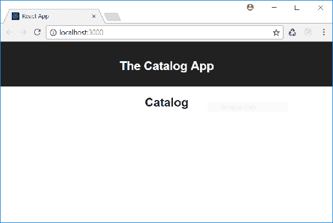
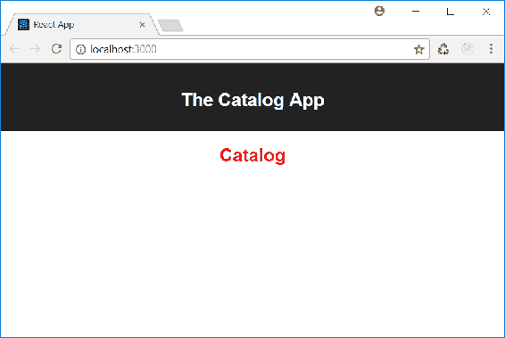
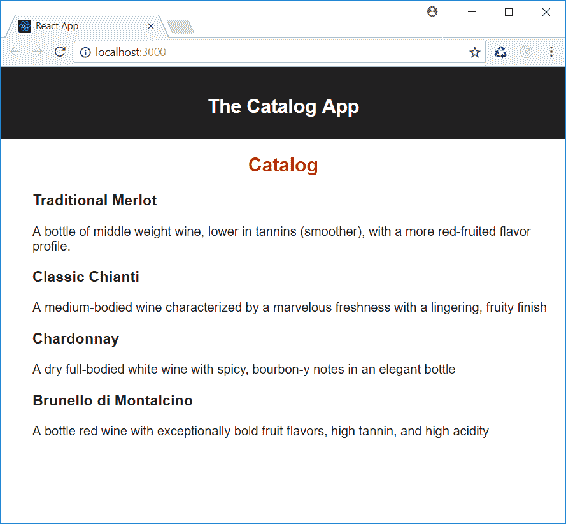
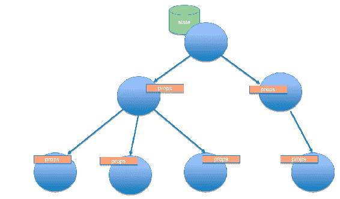

# 第二章：创建组件

在本章中，我们将学习如何实现 React 组件，如何将多个组件组合成一个，以及如何管理它们的内部状态。我们将通过构建一个简单的应用程序来探索 React 组件的实现。这个应用程序将逐步实现，以便将概述的概念付诸实践。

在本章结束时，您将能够：

+   创建基本的 React 组件

+   使用 JSX 来定义组件的标记

+   组合多个 React 组件以创建复杂的 UI 元素

+   管理 React 组件的内部状态

# 组件定义

如前一章所定义，组件是 React 的基本构建块。用户界面中的几乎任何视觉项都可以是一个组件。从正式的角度来看，我们会说一个 React 组件是一段定义用户界面一部分的 JavaScript 代码。

考虑以下代码文件：

```jsx
import React from 'react';

class Catalog extends React.Component {
  render() {
    return <div><h2>Catalog</h2></div>;
  }
}

export default Catalog;
```

这是一个 ECMAScript 2015 模块，定义了一个基本的 React 组件。

它从 `react` 模块导入 `React` 命名空间，并通过扩展 `React.Component` 类来定义 `Catalog` 类。该模块将 `Catalog` 类作为默认导出。

这个定义的有趣之处在于 `render()` 方法的实现。

`render()` 方法定义了组件的视觉部分。它可以执行任何 JavaScript 代码，并应返回一个定义其视觉输出的标记表达式。`render()` 方法对于 React 组件是强制性的。在我们的示例中，`render()` 方法返回以下标记：

```jsx
<div><h2>Catalog</h2></div>
```

它看起来像 HTML；尽管它使用类似的语法，但它定义了称为 **元素** 的普通对象。React 元素类似于 **文档对象模型** (**DOM**) 元素，但更轻便且更高效。因此，React 组件生成一组将由库引擎映射到 DOM 元素的 React 元素。这组 React 元素称为 **虚拟 DOM**，是浏览器 DOM 的轻量级表示。React 负责更新 DOM 以匹配虚拟 DOM，仅在严格必要时进行。这种方法使得 React 在渲染用户界面时具有非常高的性能。

`render()` 方法必须遵守一些约束：

+   它是强制性的；也就是说，每个 React 组件都必须实现它

+   它必须返回一个 React 元素；也就是说，一个带有任何嵌套元素的单个标记项

+   它应该是纯函数；也就是说，它不应该改变组件的内部状态（我们将在下一节详细讨论这个话题）

+   它不应该直接与浏览器交互；也就是说，它不应该包含试图访问 DOM 的语句

纯函数是指其输出结果仅依赖于输入数据，且执行过程中没有副作用，例如，不会更新全局变量。给定一个输入值，纯函数总是返回相同的结果。

纯组件是一种像纯函数一样工作的组件。这意味着，给定相同的初始条件，它总是渲染相同的输出。保持`render()`方法为纯函数非常重要。这样可以避免我们在下一章中看到的奇怪的错误。

一旦我们定义了组件，我们就可以在任何其他 React 组件中将其作为 React 元素使用。例如，我们知道 React 应用程序本身已经是一个 React 组件。让我们回顾一下`create-react-app`工具在`App.js`文件中生成的代码：

```jsx
import React, { Component } from 'react';
import logo from './logo.svg';
import './App.css';

class App extends Component {
  render() {
    return (
      <div className="App">
        <header className="App-header">
          
          <h1 className="App-title">Welcome to React</h1>
        </header>
        <p className="App-intro">
          To get started, edit <code>src/App.js</code> and save to reload.
        </p>
      </div>
    );
  }
}

export default App;
```

我们可以看到这段代码与我们所定义的`Catalog`组件具有相同的结构。让我们更改这段代码，以便在`App`组件内部使用我们的组件：

```jsx
import React, { Component } from 'react';
import './App.css';
import Catalog from './Catalog';

class App extends Component {
  render() {
    return (
      <div className="App">
        <header className="App-header">
          <h1 className="App-title">The Catalog App</h1>
        </header>
        <Catalog />
      </div>
    );
  }
}

export default App;
```

我们通过删除一些自动生成的标记简化了代码。然后导入`Catalog`组件，并将`<Catalog />`元素放入应用程序`render()`方法返回的`<div>`元素中。

# 构建我们的第一个 React 组件

打开现有项目`my-shop-01`，以展示之前代码更改的结果：

1.  打开一个控制台窗口

1.  转到`my-shop-1`文件夹

1.  运行`npm install`

1.  运行`npm start`

以下是我们在浏览器窗口中将看到的一个示例：



我们已经构建了我们的第一个 React 组件，并且可以看到它在运行！

# 管理样式

也许您已经注意到，在`App`组件模块中有一个关于 CSS 文件的`import`语句：

```jsx
import React, { Component } from 'react';
import './App.css';
import Catalog from './Catalog';
```

这可能看起来有点奇怪，因为`import`语句应该只适用于 JavaScript 代码。然而，由于`create-react-app`提供的开发环境，我们甚至可以使用相同的语法，即使对于 CSS 文件也是如此。这允许我们在组件中使用`App.css`中定义的类和其他 CSS 定义，将组件特定的样式保持在组件定义本身附近。例如，如果我们想让`Catalog`组件的标题为红色，我们可以按照以下步骤进行。

# 添加 CSS

我们现在将更改现有项目`my-shop-01`的内容，以便添加一些 CSS 代码并将目录标题显示为红色：

1.  打开一个控制台窗口。

1.  转到`my-shop-1/src`文件夹。

1.  创建一个文件，`Catalog.css`，并添加以下代码：

```jsx
h2 { color: red }
```

1.  打开`Catalog.js`文件并添加以下语句以导入`Catalog.css`模块：

```jsx
import React from 'react';
import './Catalog.css';

class Catalog extends React.Component {
  render() {
    return <div><h2>Catalog</h2></div>;
  }
}
export default Catalog;
```

1.  运行`npm start`并查看结果。

您可以在`Code/Chapter-2`中的`my-shop-02`文件夹中找到一个准备好的项目。

浏览器将显示红色 Catalog 标题：

CSS 导入不是 React 的特性，也不是 React 所必需的。它是开发环境提供的一种便利，由`create-react-app`构建。特别是，这个特性是由**webpack**提供的，**webpack**是最常用的打包器和模块加载器之一。

当你想将应用程序迁移到一个不基于 webpack 的开发环境时，应该考虑这一点。

# 活动：定义购物车

**场景**

我们的电子商店需要一个购物车。

**目标**

此活动的目的是开始使用 React 定义一个组件。

**完成步骤**

1.  我们应该定义一个作为购物车基础的 React 组件

1.  它应该是一个仅显示字符串`Cart`的组件。

使用`create-react-app`创建一个新的 React 应用程序，并按照当前章节所示进行更改。

**解决方案**

一个可能的解决方案包含在`Code/Chapter-2/`下的`my-cart-01`文件夹中。

# 使用 JSX

在前面的示例中，我们使用类似 HTML 的标记表达式定义了组件的`render()`方法返回的视觉输出。例如，让我们看看`Catalog`组件的定义：

```jsx
import React from 'react';
import './Catalog.css';

class Catalog extends React.Component {
  render() {
    return <div><h2>Catalog</h2></div>;
  }
}

export default Catalog;
```

标记表达式并未使用 JavaScript 语法，但它被包含在一个 JavaScript 代码片段内。我们为什么要混合 HTML 和 JavaScript 语法？这是如何实现的？

首先，我们要说的是，描述 React 组件视觉输出的类似 HTML 的语言被称为**JSX**。这种语言通过在 JavaScript 代码中添加 XML 表达式来简化 HTML 元素的创建。你可以将其视为一种`document.write("...")`，但功能更强大。实际上，在构建 React 应用程序时，JSX 标记由特定的解析器预处理，以生成纯 JavaScript 代码。因此，我们可以利用使用声明性标记语言的简单性，该语言将自动转换为优化的 JavaScript 代码。

如前所述，JSX 表达式创建了一个 React 元素，它是 HTML 元素的对应物。从语法角度来看，JSX 表达式是一个带有任何嵌套元素的单个标记项。因此，以下是一个有效的 JSX 表达式：

```jsx
<div><h2>Catalog</h2></div>
```

以下不是一个有效的 JSX 表达式，因为它包含两个标记项：

```jsx
<div><h2>Catalog</h2></div>
<div></div>
```

JSX 表达式是 XML 片段，因此它们遵循 XML 语法规则。这意味着，除其他事项外，标记是区分大小写的，并且所有标签都必须关闭。

例如，以下 JSX 表达式是无效的：

``

其有效版本如下：

``

我们可以将 JSX 表达式赋值给一个变量，如下例所示：

```jsx
import React from 'react';
import './Catalog.css';

class Catalog extends React.Component {
  render() {
    let output = <div><h2>Catalog</h2></div>;
    return output;
  }
}

export default Catalog;
```

我们还可以在 JSX 表达式中嵌入任何 JavaScript 表达式，方法是将其用大括号包裹，如下例所示：

```jsx
import React from 'react';
import './Catalog.css';

class Catalog extends React.Component {
  render() {
    let title = "Catalog";
    return <div><h2>{title}</h2></div>;
  }
}
export default Catalog;
```

当然，JavaScript 表达式可以像我们需要的那样复杂，如下面的组件定义所示：

```jsx
import React from 'react';
import './Catalog.css';

class Catalog extends React.Component {
  render() {
    let title = "The Catalog of today " + new Date().toDateString();
    return <div><h2>{title}</h2></div>;
  }
}

export default Catalog;
```

除了优化输出渲染，JSX 还提供支持以防止注入攻击。实际上，任何嵌入 JSX 表达式的值在被渲染之前都会被转义。例如，这可以防止用户输入的恶意代码被插入。

结合 JavaScript 和 JSX 表达式的常见用法称为**条件渲染**；也就是说，一种根据某些布尔条件生成 JSX 表达式的技术。考虑以下示例：

```jsx
import React from 'react';
import './Message.css';

class Message extends React.Component {
  render() {
    let message;
    let today = new Date().getDay();

    if (today == 0) {
 message = <div className="sorry">We are closed on Sunday...</div>;
 } else {
 message = <div className="happy">How can we help you?</div>
 }

    return message;
  }
}

export default Message;
```

在前面的示例中，`render()`方法根据当前星期几返回一条不同的消息，这导致生成具有不同消息和 CSS 类的 React 元素，但我们甚至可以返回完全不同的标记。

您可以将 JSX 表达式放在多行中，如下所示：

```jsx
import React from 'react';
import './Catalog.css';

class Catalog extends React.Component {
  render() {
    let title = "Catalog";

    return <div>
 <h2>{title}</h2>
 </div>;
  }
}

export default Catalog;
```

当返回 JSX 表达式时，在`return`语句的同一行开始它非常重要，如前一个示例所示。如果您想在新行开始 JSX 表达式，则需要将其括在圆括号中，并将左括号放在与`return`语句相同的行上，如下所示：

`return (`

`  <div>`

`    <h2>Catalog</h2>`

`  </div>);`

您可以使用 JavaScript 语法将注释放在 JSX 表达式中，用大括号括起来。以下是带有注释的 JSX 表达式的示例：

```jsx
<div>
  <h2>Catalog</h2>
  {//This is a comment}
 {/* This is a comment, too */}
</div>;
```

JSX 标签匹配 HTML 标签，这就是为什么我们可以使用整个 HTML 语法来定义 JSX 元素。但是，有一些限制：

+   所有 HTML 标签均为小写

+   您需要使用`className`而不是`class`属性

+   您需要使用`htmlFor`而不是`for`属性

以下示例展示了使用`className`属性而不是`class`：

```jsx
<div className="catalog-style">
  <h2>Catalog</h2>
</div>;
```

JSX 使用`className`和`htmlFor`属性而不是`class`和`for`，因为 JSX 表达式在 JavaScript 内部，`class`和`for`可能与相应的保留关键字冲突。

# 活动：将 HTML 转换为 JSX

**场景**

图形部门已向您提供了一个 HTML 片段，您需要将其翻译为 JSX 以创建 React 组件。

**目标**

此活动的目的是了解 HTML 和 JSX 之间的区别。

**完成步骤**

1.  打开`Code02.txt`文件

1.  将包含的 HTML 代码转换为 JSX

**解决方案**

可能的解决方案是包含在`Code/Chapter-2/`中的`activity-b.html`文件。

# 组合组件

在定义 React 组件时，我们可以将它们用作另一个组件的子组件，方法是将其作为 React 元素使用。当我们包含`Catalog`组件在`App`组件内部时，我们已经看到了这一点，但是让我们进一步分析这种组合。

# 组合组件

现在我们将看到如何组合组件以创建新的、复杂的组件：

1.  在`my-shop-03`文件夹中打开`src/ProductList.js`文件

1.  按照文本直到本节结束

让我们考虑以下组件：

```jsx
import React from 'react';
class ProductList extends React.Component {
  render() {
    return <ul>
      <li>
        <h3>Traditional Merlot</h3>
        <p>A bottle of middle weight wine, lower in tannins (smoother), 
           with a more red-fruited flavor profile.</p>
      </li>
      <li>
        <h3>Classic Chianti</h3>
        <p>A medium-bodied wine characterized by a marvelous freshness with 
           a lingering, fruity finish</p>
      </li>
      <li>
        <h3>Chardonnay</h3>
        <p>A dry full-bodied white wine with spicy, bourbon-y notes in an 
           elegant bottle</p>
      </li>
      <li>
 <h3>Brunello di Montalcino</h3> <p>A bottle red wine with exceptionally bold fruit flavors, 
           high tannin, and high acidity</p>
      </li>
    </ul>;
  }
}
export default ProductList; 
```

该组件定义了酒名和描述的列表。

我们希望将我们的`Catalog`组件与酒单集成。由于我们已经创建了`ProductList`组件，因此我们可以将其用作`Catalog`组件的 JSX 标记中的标签，如下所示：

```jsx
import React from 'react';
import ProductList from './ProductList';

class Catalog extends React.Component {
  render() {
    return <div>
      <h2>Catalog</h2>
      <ProductList />
    </div>;
  }
}

export default Catalog;
```

如您所见，我们只需导入`ProductList`组件，以便在`Catalog`组件的模块中使其可用，并在我们希望酒单出现的地方使用`ProductList`标签。

运行`npm start`以启动应用程序。生成的页面将如下所示：



我们说过，JSX 表达式中的 HTML 标签应该始终是小写的。然而，我们在 Pascal case 中使用了`ProductList`标签。

对应于组件的标签必须遵循类定义中使用的案例，并且按照惯例，组件类名使用 Pascal case，尽管这不是 React 所要求的。

React 组件的组合简便性使得创建用户界面变得非常简单，遵循上一章提供的指导原则。我们可以将页面布局分解为一系列层次化的组件，每个组件又由其他组件组成。这种方法使我们能够专注于单个组件的行为，并促进其可重用性。

# 活动：定义一个组合的购物车

**场景**

我们想要为我们的购物车创建一些内容。

**目的**

这项活动的目的是组合 React 组件。

**完成步骤**

将之前创建的`Cart`组件整合，以便包含一个显示两个项目的`CartList`组件。

**解决方案**

可能的解决方案是包含在`Code/Chapter-2/`下的`my-cart-02`文件夹中的方案。

# 数据传播

`ProductList`组件，我们在上一节中定义的，是不切实际的。让我们再次看看它：

```jsx
import React from 'react';
import './ProductList.css';

class ProductList extends React.Component {
  render() {
    return <ul>
      <li>
        <h3>Traditional Merlot</h3>
        <p>A bottle of middle weight wine, lower in tannins (smoother), 
           with a more red-fruited flavor profile.</p>
      </li>
      <li>
        <h3>Classic Chianti</h3>
        <p>A medium-bodied wine characterized by a marvelous freshness with 
           a lingering, fruity finish</p>
      </li>
      <li>
        <h3>Chardonnay</h3>
        <p>A dry full-bodied white wine with spicy, bourbon-y notes in an 
           elegant bottle</p>
      </li>
      <li>
        <h3>Brunello di Montalcino</h3>
        <p>A bottle of red wine with exceptionally bold fruit flavors, high 
           tannin, and high acidity</p>
      </li>
      </ul>;
   }
}

export default ProductList;
```

列表项都是作为 JSX 标记定义的，因此，如果您需要更改目录产品的图形外观，则需要更改每个`<li>`元素的所有出现位置。

我们可以通过进一步分解用户界面来实现更好的实现。我们可以将每个列表项视为一个组件，并将`Product`组件视为以下代码定义的组件：

```jsx
import React from 'react';

class Product extends React.Component {
  render() {
    return <li>
      <h3>Product name</h3>
      <p>Product description</p>
    </li>;
  }
}

export default Product;
```

这段代码作为每个列表项的模板，以便我们可以动态构建我们的产品列表，如下所示：

```jsx
import React from 'react';
import './ProductList.css';
import Product from './Product';

class ProductList extends React.Component {
  render() {
    let products = [
      {code:"P01", name: "Traditional Merlot", description: "A bottle 
       of middle weight wine, lower in tannins (smoother), with a 
       more red-fruited flavor profile."},
      {code:"P02", name: "Classic Chianti", description: "A medium-bodied
       wine characterized by a marvelous freshness with a lingering, 
       fruity finish"},
      {code:"P03", name: "Chardonnay", description: "A dry full-bodied
       white wine with spicy, bourbon-y notes in an elegant bottle"},
      {code:"P04", name: "Brunello di Montalcino", description: "A bottle
       of red wine with exceptionally bold fruit flavors, high tannin,
       and high acidity"}
    ];
    let productComponents = [];

    for (let product of products) {
      productComponents.push(<Product/>);
    }

    return <ul>{productComponents}</ul>;
  }
}

export default ProductList;
```

我们可以看到一个对象数组的定义，`products`，包含每个产品的相关数据。第二个数组，`productComponents`，将包含由合并产品数据与`Product`组件的标记创建的 React 组件列表。`for`循环旨在执行此类合并。最后，将返回包围在`<ul>`元素中的结果`productComponents`数组。

即使代码结构看起来是正确的，结果也不会如预期。实际上，我们将得到一个具有固定名称和描述的项列表，这些名称和描述是我们放在`Product`组件定义中的。换句话说，数据与组件定义的合并没有发生。

实际上，我们需要一种方法将每个产品的数据传递给`Component`类。让我们将 React 组件视为普通的 JavaScript 函数。它们可以实现为返回 React 元素的函数，并且，与任何函数一样，组件可以有数据输入。这种数据输入通过 JSX 属性传递，并且可以在组件内部通过一个特殊的对象`**props**`访问。让我们更改`ProductList`组件的代码，以便通过 JSX 属性传递数据：

```jsx

import React from 'react';
import Product from './Product';

class ProductList extends React.Component {
  render() {
    let products = [
      {code:"P01", name: "Traditional Merlot", description: "A bottle
       of middle weight wine, lower in tannins (smoother), with a 
       more red-fruited flavor profile."},
      {code:"P02", name: "Classic Chianti", description: "A medium-bodied
       wine characterized by a marvelous freshness with a lingering, 
       fruity finish"},
      {code:"P03", name: "Chardonnay", description: "A dry full-bodied
       white wine with spicy, bourbon-y notes in an elegant bottle"},
      {code:"P04", name: "Brunello di Montalcino", description: "A bottle
       of red wine with exceptionally bold fruit flavors, high tannin, 
       and high acidity"}
    ];

    let productComponents = [];

    for (let product of products) {
      productComponents.push(<Product
      item={product}/>);
    }

    return <ul>{productComponents}</ul>;
  }
}

export default ProductList;
```

我们在`<Product>`标签上添加了一个`item`属性，并将`products`数组中的单个对象分配给它。这允许我们将每个产品的数据传递给`Product`组件。

另一方面，我们修改了`Product`组件的代码，以便接收和管理传递的数据：

```jsx
import React from 'react';

class Product extends React.Component {
  render() {
    return <li>
      <h3>{this.props.item.name}</h3>
      <p>{this.props.item.description}</p>
    </li>;
  }
}

export default Product;
```

你可以在`Code/Chapter-2/my-shop-04`文件夹中找到一个准备好的项目。

每个 React 组件都有一个`props`属性。这个属性的目的是收集传递给组件本身的数据输入。每当将 JSX 属性附加到 React 元素时，具有相同名称的属性就会附加到`props`对象上。因此，我们可以通过使用附加的属性来访问传递的数据。在我们的例子中，我们找到了通过`item`属性传递的产品数据映射到`this.props.item`属性。

`props`是不可变的；也就是说，它们是只读属性。

这种新的实现方式允许目录像以前一样显示，但使图形标记独立于产品的数据。

在组件层次结构中，数据传播非常重要。它允许我们将组件视为具有输入和输出的函数。此外，`props`的不变性允许我们将组件视为纯函数，这些函数是没有副作用的函数（因为它们不改变其输入数据）。我们可以将从一个组件到另一个组件的数据传递视为**单向数据流**，从父组件流向子组件。这为我们提供了一个更可控的系统。

下图显示了我们如何理想地想象组件层次结构中的数据传播：



状态的变化会导致数据通过`props`属性向子组件传播。

# 活动：创建购物车项组件

**场景**

我们希望将`CartList`组件变为一个动态组件，以便它能够根据接收到的数据调整其内容。

**目标**

这项活动的目的是组合 React 组件并在它们之间传递数据。

**完成步骤**

1.  创建一个显示商品名称的`CartItem`组件。

1.  更改之前创建的`CartList`组件，使其根据`items`数组动态地由`CartItem`实例组成。

**解决方案**

一个可能的解决方案是包含在`Code/Chapter-2/my-cart-03`文件夹中的那个。

# 管理内部状态

组件具有存储随时间变化的数据的能力。

当组件显示随时间变化，的数据时，我们希望尽快显示更改。例如，考虑`ProductList`组件：它显示`products`数组中的产品列表。如果向数组添加新产品，我们希望它立即显示。React 提供了一种机制来支持数据变化时组件的自动渲染。这种机制基于**状态**的概念。

React `state`是一个代表随时间变化的数据的属性。每个组件都支持`state`属性，但应谨慎使用。

再次考虑`ProductList`组件：

```jsx
import React from 'react';
import Product from './Product';

class ProductList extends React.Component {
  render() {
    let products = [
      {code:"P01", name: "Traditional Merlot", description: "A bottle
       of middle weight wine, lower in tannins (smoother), with a more 
       red-fruited flavor profile."},
      {code:"P02", name: "Classic Chianti", description: "A medium-bodied
       wine characterized by a marvelous freshness with a lingering, 
       fruity finish"},
      {code:"P03", name: "Chardonnay", description: "A dry full-bodied 
       white wine with spicy, bourbon-y notes in an elegant bottle"},
      {code:"P04", name: "Brunello di Montalcino", description: "A bottle
       of red wine with exceptionally bold fruit flavors, high tannin, 
       and high acidity"}
    ];

    let productComponents = [];

    for (let product of products) {
      productComponents.push(<Product item={product}/>);
    }

    return <ul>{productComponents}</ul>;
  }
}

export default ProductList;
```

从实用的角度来看，这并不那么有用。它显示了一个硬编码的产品列表。如果我们想添加新产品，我们需要修改组件源代码。

在现实世界场景中，我们希望保持组件代码独立于产品数据。例如，我们会通过向 Web 服务器发出 HTTP 请求来获取产品数据。在这种情况下，`products`数组代表随时间变化，的数据：最初是一个空数组，然后会填充从服务器接收的产品数据，并且可以通过后续对服务器的请求再次更改。

存储随时间变化，的数据的组件被称为**有状态组件**。有状态组件将状态存储在`this.state`属性中。要通知组件状态已更改，必须使用`setState()`方法。此方法为组件设置新状态；它不更新它。状态的变化触发组件的渲染；即`render()`方法的自动执行。

让我们看看如何通过更改`ProductList`组件定义来管理状态：

```jsx
import React from 'react';
import Product from './Product';

class ProductList extends React.Component {
  constructor() {
 super();
 this.state = { products: [] };

 fetch("products.json")
 .then(response => response.json())
 .then(json => {this.setState({products: json})})
 .catch(error => console.log(error));
 }

  render() {
    let productComponents = [];

    for (let product of this.state.products) {
      productComponents.push(<Product item={product}/>);
    }
    return <ul>{productComponents}</ul>;
  }
}
export default ProductList;
```

我们向组件添加了构造函数。构造函数运行超类构造函数，并将组件的初始状态设置为具有`products`属性的空数组的对象。

然后，通过`fetch()`向服务器发送 GET HTTP 请求。由于请求是异步的，组件的初始渲染将是一个空的产品列表。

状态初始化是唯一可以不使用`setState()`而直接给`this.state`属性赋值的情况。

当接收到 HTTP 响应时，它用于通过`setState()`更改组件的状态。这种状态变化导致`render()`的自动执行，这将显示从服务器接收的产品列表。

既然我们已经知道如何管理组件的状态，那么在使用`setState()`方法时，有几点需要记住：

+   `setState()`将新数据与状态中已有的旧数据合并，并覆盖先前的状态。

+   `setState()`触发`render()`方法的执行，因此您永远不应该显式调用`render()`。

组件状态管理看似非常简单。然而，在决定什么应该被视为状态以及哪个组件应该是有状态的时，很容易陷入困境。

以下是关于状态的一些建议：

+   状态应包含 UI 中随时间变化，所需的最小数据；任何可以从这些最小数据中推导出的信息都应在`render()`方法内部计算。

+   应尽可能避免使用状态，因为它会给组件增加复杂性。

+   有状态的组件应该位于 UI 组件层次结构的高层。

我们可以将最后一条建议视为第二条建议的后果。如果我们应该限制使用状态，我们应该减少有状态组件的数量。因此，将状态组件的角色分配给用户界面中组件层次结构的根组件是一个很好的规则。你还记得我们在上一章中讨论的将组件分为展示组件和容器组件的分类吗？通常，容器组件是有状态组件的良好候选者。

在我们的示例应用程序中，我们将有状态组件的角色分配给了`ProductList`组件。即使它是一个容器组件，它也不是应用程序组件层次结构中最高的。也许这个角色更适合`Catalog`组件。在这种情况下，我们应该将获取数据的逻辑移到`Catalog`组件内部，如下面的代码所示：

```jsx
import React from 'react';
import './Catalog.css';
import ProductList from './ProductList';

class Catalog extends React.Component {
  constructor() {
    super();
    this.state = { products: [] };

    fetch("products.json")
      .then(response => response.json())
      .then(json => {this.setState({products: json})})
      .catch(error => console.log(error));
  }

  render() {
    return <div><h2>Wine Catalog</h2><ProductList 
 items={this.state.products}/></div>;
  }
}

export default Catalog;
```

你可以在`Code/Chapter-2`下的`my-shop-05`文件夹中找到一个准备好的项目。

# 活动：向购物车组件添加状态管理。

**场景**

为了使`Cart`组件准备好投入生产，我们添加了状态管理和动态数据加载。

**目标**

该活动的目的是熟悉组件状态管理。

**完成步骤**

将之前创建的`Cart`组件更改为添加状态管理，以便通过 HTTP 请求加载数据，并且购物车的内容会自动更新。

**解决方案**

一个可能的解决方案包含在`Code/Chapter-2/`下的`my-cart-04`文件夹中。

# 总结

在本章中，我们开始创建 React 组件并探索它们的基本功能。特别是，我们：

+   学习了如何将组件定义为从`React.Component`派生的类，以及如何导入特定的 CSS 样式。

+   探索了 JSX 语法，它允许我们快速定义组件的图形方面，并使用在其他地方定义的 React 组件。

+   组合 React 组件以构建其他组件。

+   使用状态管理功能，以便 React 组件在数据变化时自动更新其视觉表示。

在下一章中，我们将分析如何管理用户与基于 React 的应用程序的交互；换句话说，如何捕获事件并使 UI 对这些事件做出反应。
