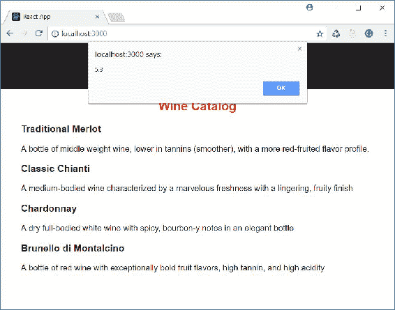
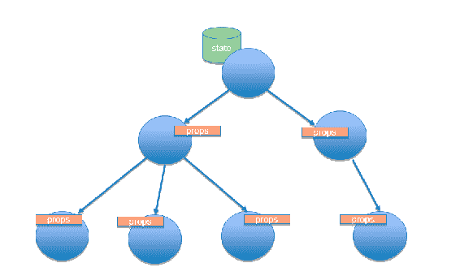
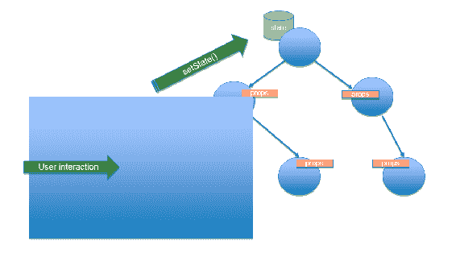
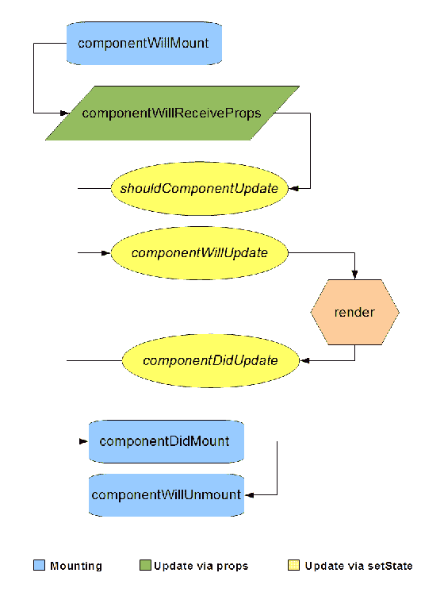
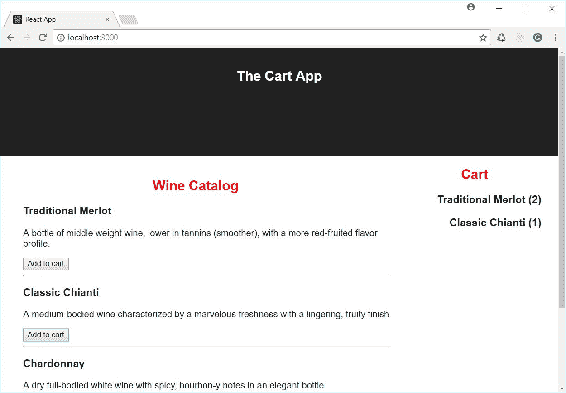
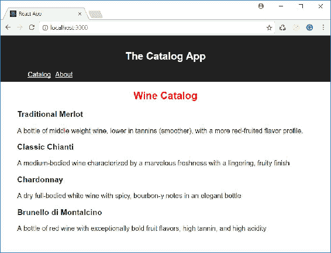
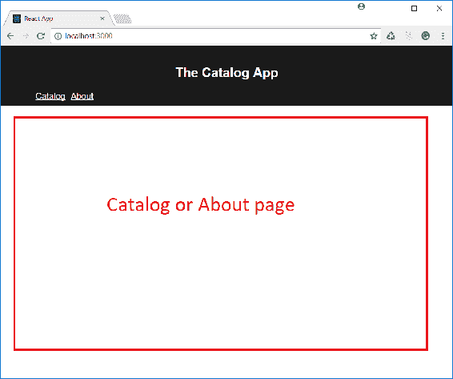
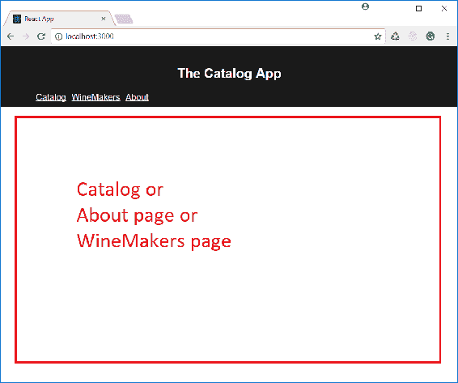

# 第三章：管理用户交互性

在本章中，我们将学习如何管理由用户与 React 基础用户界面的组件交互产生的事件。我们将探讨在 React 组件生命周期中触发的事件，并学习如何利用它们来创建高效的组件。最后，我们将使用 React Router 库来允许在由组件实现的不同的视图之间轻松导航。

在本章结束时，你将能够：

+   处理由用户交互产生的事件

+   在事件触发时更改组件的状态

+   使用组件的生命周期事件以获得更好的用户体验

+   配置路由以允许通过组件进行导航

# 管理用户交互

任何 Web 应用程序都需要用户与**用户界面**（**UI**）之间的交互。没有交互的应用程序不是真正的应用程序；交互性是一个基本要求。

我们在上一章构建的应用程序不允许交互。它只是显示数据，用户无法对其进行任何操作（除了查看）。

假设我们想在上一章开始构建的目录应用程序中引入一点交互。例如，也许我们想在用户点击产品区域时显示一个带有产品价格的警告。

假设产品数据包括价格，如下面的 JSON 对象所示：

```jsx
[
  {"code":"P01", 
   "name": "Traditional Merlot", 
   "description": "A bottle of middle weight wine, lower in tannins
      (smoother), with a more red-fruited flavor profile.", 
   "price": 4.5, "selected": false},
  {"code":"P02", 
   "name": "Classic Chianti", 
   "description": "A medium-bodied wine characterized by a marvelous
      freshness with a lingering, fruity finish", 
   "price": 5.3, "selected": false},
  {"code":"P03", 
   "name": "Chardonnay", 
   "description": "A dry full-bodied white wine with spicy, 
      bourbon-y notes in an elegant bottle", 
   "price": 4.0, "selected": false},
  {"code":"P04", 
   "name": "Brunello di Montalcino", 
   "description": "A bottle of red wine with exceptionally bold fruit 
      flavors, high tannin, and high acidity", 
   "price": 7.5, "selected": false}
]
```

我们可以如下实现这种行为：

```jsx
import React from 'react';

class Product extends React.Component {
  showPrice() {
 alert(this.props.item.price);
 }

  render() {
    return <li onClick={() => this.showPrice()}>
      <h3>{this.props.item.name}</h3>
      <p>{this.props.item.description}</p>
    </li>;
  }
}

export default Product;
```

让我们分析组件的代码，并强调与前一个版本的不同之处。

首先，我们添加了`showPrice()`方法，通过一个警告框显示当前产品实例的价格。这个方法在箭头函数内部被调用，该箭头函数被分配给`<li>`标签的`onClick`属性。

这些简单的更改允许`Product`组件捕获`click`事件并执行`showPrice()`方法。

现在我们将打开现有的项目`my-shop-01`，以展示之前的代码更改的结果：

1.  打开一个控制台窗口

1.  转到`my-shop-01`文件夹

1.  运行`npm install`

1.  运行`npm start`

点击产品的结果显示在以下截图中：



# HTML 事件与 React 事件

正如我们所见，React 处理事件的方法与 HTML 中的经典事件管理非常相似。然而，有一些细微的差别需要注意。

HTML 事件使用小写字母命名，而 JSX 事件使用驼峰命名法。例如，在 HTML 中，你应该使用以下语法：

```jsx
<li onclick="...">...</li>
```

但在 JSX 中，你使用这种语法：

```jsx
<li onClick=...>...</li>
```

在 HTML 中，你分配一个代表函数调用的字符串，而在 JSX 中，你分配一个函数，如下所示：

```jsx
<li onclick="showPrice()">...</li>
<li onClick={showPrice}>...</li>
```

当然，你可以分配任何返回或代表函数的 JavaScript 表达式，如下例所示：

```jsx
<li onClick={() => this.showPrice()}>
```

最后，您可以通过返回`false`来阻止大多数 HTML 事件的默认行为，而在 JSX 事件中，您需要显式调用`preventDefault`。以下是一个典型示例：

```jsx
<a href="#" onClick={(e) => { e.preventDefault();
console.log("Clicked");}}>Click</a>
```

# Event Handlers 和 this 关键字

在前面的定义`Product`组件的示例中，我们将箭头函数分配给了`onClick`属性，而不是简单的`showPrice()`方法。这不仅仅是一个偏好问题。这是必要的，因为我们使用了`showPrice()`方法内部的`this`关键字。

实际上，当事件处理程序执行时，`this`关键字不再绑定到`Product`类，因为它是在不同的上下文中异步执行的。这种行为不依赖于 React，而是依赖于 JavaScript 的工作方式。

为了将方法绑定到当前类，我们有几个选项：

1.  使用箭头函数并在其体内调用方法，如下例所示：

```jsx
<li onClick={() => this.showPrice()}>
```

1.  使用`bind()`方法将方法绑定到当前类上下文，如下例所示：

```jsx
<li onClick={this.showPrice.bind(this)}>
```

1.  您可以在类构造函数中使用`bind()`，而不是在将方法分配给事件属性时内联使用。以下是这种方法的示例：

```jsx
constructor() {
this.showPrice = this.showPrice.bind(this);
}
...
<li onClick={this.showPrice}>
```

# 更改状态

我们看过的这个事件管理示例非常简单，但它只展示了 React 事件管理的基础。这个示例不涉及状态，其管理是直接的。在许多现实世界的情况下，一个事件导致应用程序状态的变化，这意味着组件状态的变化。

假设，例如，您想允许从目录中选择产品。为此，我们为每个产品对象添加`selected`属性，如下面的数组所示：

```jsx
[
  {"code":"P01", 
   "name": "Traditional Merlot", 
   "description": "A bottle of middle weight wine, lower in tannins
      (smoother), with a more red-fruited flavor profile.", 
   "price": 4.5, "selected": false},
  {"code":"P02", 
   "name": "Classic Chianti", 
   "description": "A medium-bodied wine characterized by a marvelous
      freshness with a lingering, fruity finish", 
   "price": 5.3, "selected": false},
  {"code":"P03", 
   "name": "Chardonnay", 
   "description": "A dry full-bodied white wine with spicy, bourbon-y
      notes in an elegant bottle", 
   "price": 4.0, "selected": false},
  {"code":"P04", 
   "name": "Brunello di Montalcino", 
   "description": "A bottle of red wine with exceptionally bold fruit
      flavors, high tannin, and high acidity", 
   "price": 7.5, "selected": false}
]  
```

当用户点击产品区域时，`selected`属性的值会切换，并且区域背景颜色会改变。以下代码片段展示了`Product`组件的新版本：

```jsx
import React from 'react';
import './Product.css'

class Product extends React.Component {
  select() {
 this.props.item.selected = !this.props.item.selected;
 }

  render() {
    let classToApply = this.props.item.selected? "selected": "";

    return <li onClick={() => this.select()} className={classToApply}>
             <h3>{this.props.item.name}</h3>
             <p>{this.props.item.description}</p>
           </li>;
  }
}

export default Product;
```

`select()`方法切换`selected`属性的值，而在渲染方法中，我们根据`selected`属性的值计算要应用的类的名称。然后，生成的类名被分配给`className`属性。

意外地，这段代码没有正确工作。您可以通过执行以下步骤来验证。我们可以打开现有项目`my-shop-02`，以便查看之前代码的结果。请按照以下步骤操作：

1.  打开一个控制台窗口

1.  转到`my-shop-02`文件夹

1.  运行`npm install`

1.  运行`npm start`

代码没有按预期工作，因为`select()`方法没有改变组件的状态，所以`render()`方法没有被触发。此外，请记住`props`属性是只读的，因此对其的任何更改都不会产生影响。

`Product`组件是一个无状态组件，因此我们没有状态需要改变。产品的数据来自通过`props`传递的`Catalog`根组件。那么，我们如何从`Product`组件实例触发的事件开始改变`Catalog`组件的状态呢？

具体来说，子组件如何改变其父组件的状态？

实际上，子组件没有机会改变父组件的状态，因为在 React 组件层次结构中，数据以单向方式流动，从父组件流向子组件。我们在下面的图表中说明了这种流动：



我们不能将数据从子组件推送到父组件。为了让子组件改变父组件的状态，我们需要获取一个方法来操作该状态。由于组件状态只能由组件本身访问，因此父组件必须通过`props`属性向其子组件提供该方法。

考虑以下代码：

```jsx
import React from 'react';
import './Catalog.css';
import ProductList from './ProductList';

class Catalog extends React.Component {
  constructor() {
    super();
    this.state = { products: [] };

    fetch("products.json")
      .then(response => response.json())
      .then(json => {this.setState({products: json})})
      .catch(error => console.log(error));
  }

  select(productCode) {
 let productList = this.state.products.map(function(p) {
 if (p.code === productCode) {
 p.selected = (!p.selected);
 }
 return p;
 });
 this.setState({products: productList});
 }

  render() {
    return <div><h2>Wine Catalog</h2><ProductList 
      items={this.state.products} selectHandler={this.select}/></div>;
  }
}

export default Catalog;
```

前面的代码将`select()`方法添加到`Catalog`组件中。该方法接受一个产品代码作为输入参数，从组件的状态中获取产品列表，并更新相应产品的`selected`属性。然后使用新的产品列表更新组件的状态。

`select()`方法被分配给`ProductList`标签中的新`selectHandler`属性，因此相应的组件可以通过`props`属性访问它。

以下代码展示了如何将`this.props.selectHandler`从`ProductList`组件传递到`Product`组件，通过`selectHandler`属性：

```jsx
import React from 'react';
import './ProductList.css';
import Product from './Product';

class ProductList extends React.Component {
  render() {
    let products = [];

    for (let product of this.props.items) {
      products.push(<Product item={product} 
 selectHandler={this.props.selectHandler}/>);
    }

    return <ul>{products}</ul>;
  }
}

export default ProductList;
```

最后，`Product`组件通过调用通过`this.props.selectHandler`属性传递的`select()`方法来处理`onClick`事件，并使用适当的产品代码：

```jsx
import React from 'react';
import './Product.css'

class Product extends React.Component {
  render() {
    let classToApply = this.props.item.selected? "selected": ""; 
 return <li onClick={() => this.props.selectHandler 
    (this.props.item.code)} className={classToApply}>
      <h3>{this.props.item.name}</h3>
      <p>{this.props.item.description}</p>
    </li>
  }
}

export default Product;
```

现在我们将打开现有的项目`my-shop-03`，以便查看之前代码的结果。请按照以下步骤操作：

1.  打开一个控制台窗口

1.  转到`my-shop-03`文件夹

1.  运行`npm install`

1.  运行`npm start`

我们可以得出结论，子组件上的事件触发了通过`props`传递的父组件方法的执行。该方法改变了父组件的状态，这种变化的效果再次通过`props`传播到子组件。以下图表说明了这种行为：



# 活动：将商品添加到购物车

**场景**

我们希望允许用户从产品目录中选择商品并将其添加到购物车中。

**目标**

此活动的目的是熟悉 React 中的事件管理。

**完成步骤**

1.  考虑`my-cart-01`文件夹中的现有项目

1.  处理`Product`组件的“添加到购物车”按钮的点击事件，以便将该商品添加到购物车中

**解决方案**

一个可能的解决方案包含在`Code/Chapter-3/`下的`my-cart-02`文件夹中。

# 组件生命周期事件

在 React 应用程序中，组件根据应用程序运行时的演变动态创建。用户的交互启动了组件的创建、屏幕上的可视化、更新和销毁。

因此，组件在应用程序执行期间经历不同的阶段：这些阶段代表了它们的生命周期。

React 允许我们以自定义的方式拦截和管理组件生命周期的各个阶段，这得益于我们可以通过实现特定方法来处理的一组事件。

在分析组件的生命周期事件之前，我们应该强调，创建组件的第一步是执行其构造函数。虽然它不是 React 生命周期阶段的一部分，但它是组件生命的第一步。在组件构造函数执行期间，DOM 不可用，也无法访问任何子组件。构造函数执行是执行不涉及图形渲染或子组件操作的初始化的正确时机。

组件创建后，React 将触发几个对应于组件生命周期相应阶段的事件。我们可以捕获这些事件并通过在我们的组件中实现一些方法来处理它们。考虑以下方法：

```jsx
componentWillMount
```

这种方法在组件即将被插入到 DOM 中时执行。它只被调用一次，就在初始渲染发生之前。通常，这个方法用于执行与 DOM 无关的组件初始化，例如初始化组件的属性或本地变量。

你可以在`componentWillMount()`中使用`setState()`方法，但它不会触发组件的重新渲染，所以要谨慎使用。

`componentWillReceiveProps`是在组件通过`props`从父组件接收到新值之前渲染时调用的方法。这个方法接收新值作为参数，我们可以通过`this.props`访问旧值。

如果我们尝试在这个方法执行期间改变组件状态，我们将不会触发任何额外的渲染。此外，`componentWillReceiveProps()`在初始渲染时不会被调用。

`shouldComponentUpdate`方法应该返回一个布尔值，表示组件是否应该被渲染（`true`）或不渲染（`false`）。如果该方法返回`false`，则不会调用下一个方法，包括`render()`。

它有两个参数：`nextProps`，包含`props`的新值，以及`nextState`，包含组件状态的新值。

`componentWillUpdate`在`render()`方法之前立即被调用，因此它是更新组件之前执行某些处理的最后机会。

在`shouldComponentUpdate()`的实现中不能使用`setState()`。

`componentDidUpdate`在渲染发生后立即调用，在其执行期间，我们可以访问 DOM 中组件的新版本。该方法有两个参数：之前的`props`和之前的状态。

`componentDidMount`在组件被插入到 DOM 后调用，并且只调用一次。

`componentWillUnmount`在组件从 DOM 中移除之前立即调用。

在这个方法执行期间，你不能使用`setState()`。

我们可以将组件生命周期事件分为三个主要区域：

+   **挂载**：这个`props`组包含与 DOM 操作相关的事件：`componentWillMount`、`componentDidMount`和`componentWillUnmount`

+   **通过 props 更新**：这个组包含当组件通过其父组件传递的`props`更新时触发的事件，包括：`componentWillReceiveProps`、`shouldComponentUpdate`、`componentWillUpdate`和`componentDidUpdate`。

+   **通过 setState()更新**：在这个组中，我们找到当组件通过`setState()`更新时触发的事件：`shouldComponentUpdate`、`componentWillUpdate`和`componentDidUpdate`。

下面的图表说明了事件流，并使用不同的颜色突出了我们刚刚讨论的三个区域：



# 活动：显示添加到购物车的商品数量

**场景**

我们希望避免购物车中出现同一产品的多个实例。相反，我们希望购物车中只有单一产品及其数量的出现，如下面的截图所示：



**目标**

这个活动的目的是利用 React 组件的生命周期事件。

**完成步骤**

1.  利用在前一个活动中更改的项目（或在`my-cart-02`文件夹中的现有项目）。

1.  更改`Cart`组件以显示一个无重复产品的列表及其相关出现次数。

处理`componentWillReceiveProps`事件，为`Cart`组件的内部状态准备数据。

**解决方案**

一个可能的解决方案是在`Code/Chapter-3`中的`my-cart-03`文件夹中包含的解决方案。

# 管理路由

基于单页应用程序模型的现代 Web 应用程序，不能没有路由机制，这是一种在同一 HTML 页面上浏览视图的方式。

我们可以将视图视为 UI 中的一个占位符，在其中我们可以动态地渲染一个组件或另一个组件，以独占的方式。让我们尝试用一个例子来澄清这个概念。

假设我们想在我们的*葡萄酒目录*应用程序中添加一个导航栏。在最简单的实现中，我们想交替显示目录和一个关于部分，提供一些关于应用程序本身的信息。新的 UI 将如下面的截图所示：



当点击菜单项时，我们希望主区域发生变化，而头部保持不变。在这种情况下，主区域将是我们显示`Catalog`组件或`About`组件的视图，具体取决于我们点击的菜单项。

我们如何在 React 中实现路由机制？

# 安装 React Router

我们可以通过使用**React Router**，一个为我们提供特定 React 组件的包，来启用基于 React 的应用程序的路由，这些组件允许我们设置一个完整的路由系统。

我们在应用程序的文件夹中输入以下命令来安装该包：

```jsx
npm install --save react-router-dom
```

React Router 提供了三个包：

+   `react-router`

+   `react-router-dom`

+   `react-router-native`

第一个包提供了核心路由组件和功能。第二个包为浏览器环境提供了特定组件，第三个包支持`react-native`，这是一个将 React 组件映射到原生移动 UI 小部件的环境。`react-router-dom`和`react-router-native`都使用`react-router`功能。

# 使用路由器

一旦我们在环境中安装了 React Router 包，我们需要在应用程序中使用提供的组件。

首先，我们需要为应用程序添加路由功能。我们可以通过更改`index.js`文件的代码来实现这一点，如下所示：

```jsx
import React from 'react';
...
import { BrowserRouter } from 'react-router-dom'

ReactDOM.render(
  <BrowserRouter>
    <App />
  </BrowserRouter>
  , document.getElementById('root'));
registerServiceWorker();
```

我们强调了与前一版本代码的主要区别。如您所见，我们从`react-router-dom`模块导入了`BrowserRouter`组件，并将其包裹在`App`组件内部。

通过包装`App`组件，`BrowserRouter`组件为其赋予了路由功能。

这是一个组件组合，因此我们称之为组件包装。

# 定义视图

现在，我们需要创建一个视图来显示`Catalog`组件或关于页面，如下所示：



我们可以通过更改`App.js`代码来实现这一点，如下所示：

```jsx
import React, { Component } from 'react';
import './App.css';
import Catalog from './Catalog';
import About from './About';
import { Switch, Route } from 'react-router-dom'

class App extends Component {
  render() {
    return (
      <div className="App">
        <header className="App-header">
          <h1 className="App-title">The Catalog App</h1>
          <nav>
            <ul>
              <li><Link to='/'>Catalog</Link></li>
              <li><Link to='/about'>About</Link></li>
            </ul>
          </nav>
        </header>
        <Switch>
 <Route exact path='/' component={Catalog}/>
 <Route path='/about' component={About}/>
 </Switch>
      </div>
    );
  }
}

export default App;
```

我们从`react-router-dom`模块导入了`Switch`和`Route`组件，并在 JSX 表达式中使用了它们，该表达式曾经是`Catalog`元素所在的位置。

`Switch`组件允许我们定义一个视图，即我们将在其中切换组件的区域。`Route`组件用作`Switch`的子元素，它们允许我们将 URL 映射到组件。在我们的示例中，我们将根 URL（`/`）映射到`Catalog`组件，将`/about` URL 映射到`About`组件。这意味着当`BrowserRouter`拦截到移动到这些 URL 之一的请求时，它将在视图中渲染适当的组件。

允许我们显示目录或应用程序信息的导航栏实现如下：

```jsx
import React, { Component } from 'react';
import './App.css';
import Catalog from './Catalog';
import About from './About';
import { Switch, Route, Link } from 'react-router-dom'

class App extends Component {
  render() {
    return (
      <div className="App">
        <header className="App-header">
          <h1 className="App-title">The Catalog App</h1>
          <nav>
 <ul>
 <li><Link to='/'>Catalog</Link></li>
 <li><Link to='/about'>About</Link></li>
 </ul>
 </nav>        </header>
        <Switch>
          <Route exact path='/' component={Catalog}/>
          <Route path='/about' component={About}/>
        </Switch>
      </div>
    );
  }
}

export default App;
```

在这里，我们添加了对`Link`组件的导入，并在突出显示的标记中使用了它。`Link`组件允许我们创建一个超链接元素，该元素将被`BrowserRouter`组件捕获。

这些更改为我们的应用程序添加了一个可用的导航栏。您可以通过执行以下步骤来查看这些更改的结果。

我们将打开现有的项目`my-shop-04`，以展示前面代码的结果：

1.  打开一个控制台窗口

1.  转到`my-shop-04`文件夹

1.  运行`npm install`

1.  运行`npm start`

# 关于路由组件的一些注意事项

请注意，`Route`组件具有`path`属性（允许我们指定要映射的 URL）和`component`属性（允许我们分配要在当前视图中渲染的组件）：

```jsx
<Switch>
<Route exact path='/' component={Catalog}/>
<Route path='/about' component={About}/>
</Switch>
```

`path`属性用于 React Router 来检测要渲染的组件，如相应的`component`属性所指定。

在前面的路由映射中，如果我们点击与`/about` URL 关联的`Link`组件，具有根路径（`/`）的路由将匹配`/about`的起始部分，并且`Catalog`组件将被渲染。

当用户通过点击`Link`组件请求 URL 时，路由列表会按顺序扫描以找到与 URL 起始部分匹配的路径值。第一个匹配的值决定了要渲染的组件。

如果我们想要在`path`属性的值和 URL 之间进行严格比较，我们需要指定`exact`属性，如下所示：

```jsx
<Switch>
<Route exact path='/' component={Catalog}/>
<Route path='/about' component={About}/>
</Switch>
```

这可以防止任何以`/`开头的 URL 被第一个路由捕获。

`Route`组件的`component`属性允许我们指定要渲染的组件。或者，我们可以使用`render`属性来指定调用一个返回 React 元素的函数，如下例所示：

```jsx
<Route path='/about' render={() => (<About data={someData}/>)}/>
```

这种方法类似于使用`component`属性，但它可能对于内联渲染和当我们需要向元素传递值时很有用。

路由组件还允许我们指定`children`属性。与`render`一样，我们可以将一个函数赋给这个属性，但该函数返回的元素将*始终*被渲染，无论路径是否匹配。

考虑以下示例：

```jsx
<Switch>
<Route exact path='/' component={Catalog}/>
<Route path='/about' component={About}/>
<Route path='/footer' children={() => (<Footer />)}/>
</Switch>
```

`Footer`组件将始终被渲染，即使路径`/footer`不匹配。

# 嵌套视图

在前面的示例中，我们通过使用 React Router 提供的`Switch`、`Route`和`Link`组件，在`App`组件中实现了视图导航。我们可以在任何其他组件中使用这些路由组件，以便我们可以构建嵌套视图和嵌套路由。

让我们尝试用一个例子来说明这一点。假设我们想在我们的应用程序中添加一个酿酒师列表。我们可以在导航栏中添加一个新项，允许我们导航到一个显示该列表的页面。

以下屏幕截图显示了新布局的外观：



因此，让我们更改`App`组件的 JSX 标记，如下所示：

```jsx
import React, { Component } from 'react';
import './App.css';
import Catalog from './Catalog';
import About from './About';
import WineMakers from './WineMakers';
import { Switch, Route, Link } from 'react-router-dom';

class App extends Component {
  render() {
    return (
      <div className="App">
        <header className="App-header">
          <h1 className="App-title">The Catalog App</h1>
          <nav>
            <ul>
              <li><Link to='/'>Catalog</Link></li>
              <li><Link to='/winemakers'>WineMakers</Link></li>
              <li><Link to='/about'>About</Link></li>
            </ul>
          </nav>
        </header>
        <Switch>
          <Route exact path='/' component={Catalog}/>
          <Route path='/winemakers' component={WineMakers}/>
          <Route path='/about' component={About}/>
        </Switch>
      </div>
    );
  }
}

export default App;
```

我们导入了`WineMakers`组件，定义了一个将`/winemakers`路径映射到新组件的路由，并添加了一个链接以导航到它。

我们可以如下实现酿酒师列表：

```jsx
import React from 'react';
import WineMaker from './WineMaker';
import { Switch, Route, Link } from 'react-router-dom';

class WineMakers extends React.Component {
  renderWineMakersList() {
    return <ul>
  ...
        <Link to="/winemakers/WM2">Wine & Co</Link>
      </li>
    </ul>;
  }

  render() {
    return <Switch>
    ...

export default WineMakers;
```

`WineMakers`组件具有`renderWineMakersList()`方法，该方法返回实现每个酿酒师链接列表的 React 元素。此方法用作组件`render()`方法中与`/winemakers`路径匹配的路由的`render`属性的值。其他路由获取指向每个特定酿酒师的路径，并根据标识码渲染`WineMaker`组件。

您可能会注意到，我们正在`WineMakers`组件中实现一个视图，该视图显示在`App`组件中实现的视图内。换句话说，我们通过组合实现视图的组件来实现嵌套视图。

# 路径参数

`WineMakers`组件的`render()`方法如下实现最终视图：

```jsx
render() {
  return <Switch>
    <Route exact path='/winemakers' render={this.renderWineMakersList}/>
    <Route path='/winemakers/WM1' render={() => (<WineMaker code='WM1' />}/>
    <Route path='/winemakers/WM2' render={() => (<WineMaker code='WM2' />}/>
  </Switch>;
}
```

这段代码很简单，而且有效，但它迫使我们每当在我们的列表中添加新的酿酒师时都要添加一个新的路由。

我们可以通过使用`path`参数来避免这种情况，如下面的代码所示：

```jsx
render() {
  return <Switch>
    <Route exact path='/winemakers' render={this.renderWineMakersList}/>
    <Route path='/winemakers/:code' component={WineMaker}/>
  </Switch>;
}
```

如您所见，我们现在可以通过指定`:code`参数来使用指向特定酿酒师的单个路由。路径表达式中的冒号表示 URL 的后续部分是变量值。您可能还会注意到，我们使用了`component`属性而不是`render`属性。实际上，在这种情况下，我们不需要将酿酒师的代码显式传递给`WineMaker`组件。React Router 为我们做到了这一点，通过在`props`属性中提供一个特殊对象。

让我们看一下`WineMaker`组件的实现：

```jsx
import React from 'react';

class WineMaker extends React.Component {
  constructor() {
    super();
    this.wineMakers = [
      {code: "WM1", name: "Wine & Wine", country: "Italy",
      description:"Wine & Wine produces an excellent Italian wine..."},

export default WineMaker;
```

在组件的构造函数中，我们将酿酒师列表定义为对象数组。

在`render()`方法中，我们通过将数组中每个`winemaker`对象的`code`属性与`match.params.code`属性（由`this.props`提供）进行比较来查找要显示的酿酒师。

我们将`winemakers`列表实现为`WineMaker`组件的属性，而不是`state`对象的属性，因为由于列表嵌入到代码中并且不应该更改，我们不需要将其实现为`state`属性。请记住，我们只将随时间变化，我们只将随时间变化的数据标识为状态。

我们找到的对象用于适当地渲染有关`WineMaker`的数据。

通常，通过路由到达的 React 组件在`this.props`属性中接收`match`对象。该对象包含有关`Route`定义中匹配路径的信息。特别是，`match`对象的以下属性可用：

+   `params`：这是一个对象，其属性与路径中的参数匹配；也就是说，动态部分，前面有冒号

+   `isExact`：这是一个布尔值，指示 URL 是否与路径匹配

+   `path`：这是分配给所选路由的`path`属性的字符串

+   `url`：这是与路由路径匹配的 URL

通过执行以下步骤，我们可以看到最终结果。我们打开现有的项目`my-shop-05`，以展示之前代码的结果：

1.  打开一个控制台窗口

1.  转到`my-shop-05`文件夹

1.  运行`npm install`

1.  运行`npm start`

# 活动：添加有关运输方法的视图

**场景**

我们希望在我们的目录应用中添加一个包含有关可用运输方法信息的章节。

**目标**

本活动的目的是探索 React 路由提供的组件。

**完成步骤**

1.  考虑在前一活动中更改的项目（或位于`my-cart-03`文件夹中的现有项目）。

1.  创建一个`ShippingMethods`组件，显示可用运输方法的列表，以及一个`ShippingMethod`组件，根据通过`props`传递的代码显示每个运输方法的详细信息（可用的运输方法包括**经济配送**（**ECO**）、**标准配送**（**STD**）和**快递配送**（**EXP**））。

1.  创建一个导航栏和一个路由配置，允许我们在`Catalog`和`Shipping`方法视图之间导航。

**解决方案**

一个可能的解决方案是位于`Code/Chapter-3`中的`my-cart-04`文件夹中的那个。

# 总结

在本章中，我们学习了如何管理用户交互。特别是，我们涵盖了以下内容：

+   管理不涉及组件状态变化的事件

+   处理涉及组件状态变化的事件

+   探索了组件生命周期并学习了如何自定义每个阶段

+   使用 React Router 的组件来配置组件之间的导航

本章为本书的结尾。它提供了理解 React 工作原理以及如何构建基于 React 的应用程序的基础知识。我们从 React 的简介开始，然后详细探讨了创建组件的过程。最后，我们研究了如何使用 React 管理用户交互。
