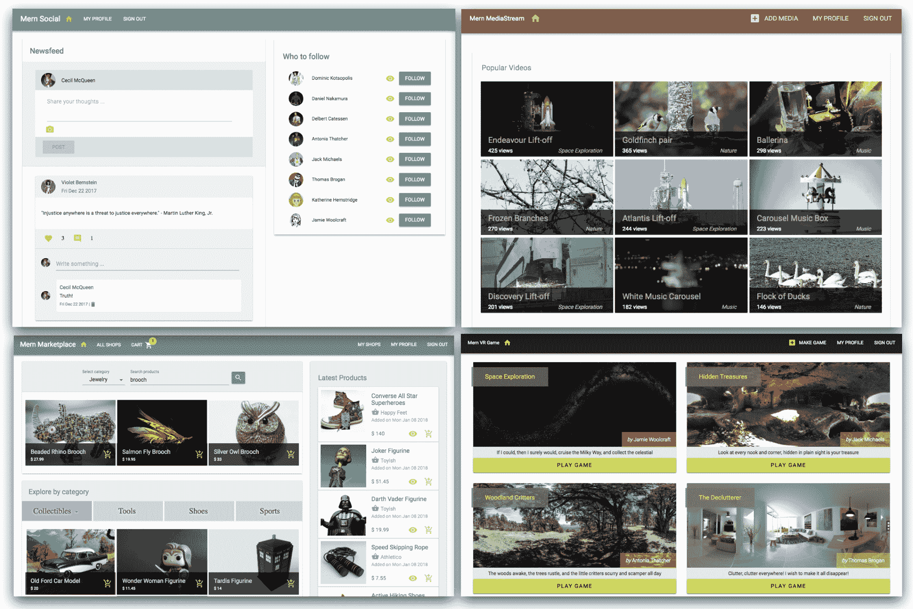
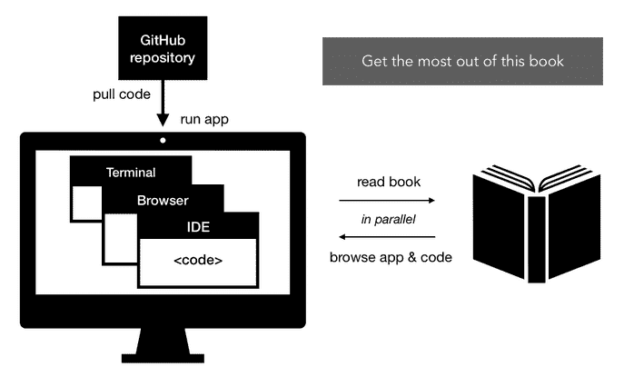

# 第一章：使用 MERN 释放 React 应用程序

React 可能已经为前端 Web 开发开辟了新的领域，并改变了我们编写 JavaScript 用户界面的方式，但我们仍然需要一个坚实的后端来构建完整的 Web 应用程序。尽管在选择后端技术时有很多选择，但使用完整的 JavaScript 堆栈的好处和吸引力是不可否认的，特别是当有像 Node、Express 和 MongoDB 这样强大且被广泛采用的后端技术时。将 React 的潜力与这些经过行业测试的服务器端技术相结合，可以在开发现实世界 Web 应用程序时创造多样的可能性。

本书将指导您进行基于 MERN 的 Web 开发设置，以构建不同复杂性的实际 Web 应用程序。

在深入开发这些 Web 应用程序之前，我们将在本章中回答以下问题，以便为使用 MERN 设置背景：

+   什么是 MERN 堆栈？

+   为什么 MERN 如今仍然相关？

+   MERN 何时适合开发 Web 应用程序？

+   这本书如何组织以帮助掌握 MERN？

# MERN 堆栈

MongoDB、Express、React 和 Node 一起被用来构建 Web 应用程序，并组成了 MERN 堆栈。在这个组合中，Node 和 Express 将 Web 后端绑在一起，MongoDB 作为 NoSQL 数据库，React 构建用户看到并与之交互的前端。

这四种技术都是免费的、开源的、跨平台的，基于 JavaScript，并得到了广泛的社区和行业支持。每种技术都有一套独特的属性，当它们集成在一起时，就可以构建一个简单但有效的完整 JavaScript 堆栈，用于 Web 开发。

# Node

Node 是建立在 Chrome 的 V8 JavaScript 引擎上的 JavaScript 运行时环境。Node 使得在服务器端使用 JavaScript 来构建各种工具和应用成为可能，而不再局限于浏览器内的先前用例。

Node 具有事件驱动的架构，能够进行异步、非阻塞的 I/O。它独特的非阻塞 I/O 模型消除了等待请求的方式。这使得构建可扩展和轻量级的实时 Web 应用程序成为可能，可以高效地处理许多请求。

Node 的默认包管理系统，Node 包管理器或 npm，已捆绑在 Node 安装中。Npm 提供了数十万个由世界各地的开发人员构建的可重用 Node 包，并自称目前是世界上最大的开源库生态系统。

在[`nodejs.org/en/`](https://nodejs.org/en/)了解更多关于 Node，并浏览可用的 npm 模块在[`www.npmjs.com/`](https://www.npmjs.com/)。

# Express

Express 是一个用于构建带有 Node 服务器的 Web 应用程序和 API 的基本框架。它提供了一层简单的基本 Web 应用程序功能，可以补充 Node。

在使用 Node 开发的任何 Web 应用程序中，Express 可以用作路由和中间件 Web 框架，具有自己的最小功能-Express 应用程序本质上是一系列中间件函数调用。

**中间件**函数是具有对 HTTP 请求和响应对象的访问权限，以及 Web 应用程序请求-响应周期中的下一个中间件函数的访问权限的函数。

可以将几乎任何兼容的中间件插入到请求处理链中，几乎可以按任何顺序进行，使 Express 非常灵活易用。

在[expressjs.com](http://expressjs.com)上了解 Express.js 的可能性。

# MongoDB

在决定用于任何应用程序的 NoSQL 数据库时，MongoDB 是首选。它是一个面向文档的数据库，可以将数据存储在灵活的类 JSON 文档中。这意味着字段可以在文档之间变化，并且数据模型可以随着应用程序要求的变化而随时间演变。

将高可用性和可扩展性放在首位的应用程序受益于 MongoDB 的分布式架构功能。它内置支持高可用性，使用分片进行水平扩展，并且可以跨地理分布进行多数据中心的可扩展性。

MongoDB 具有表达丰富的查询语言，可以进行即席查询，索引以实现快速查找，并提供实时聚合，从而提供了强大的访问和分析数据的方式，即使数据量呈指数级增长，也能保持性能。

在[`www.mongodb.com/`](https://www.mongodb.com/)上探索 MongoDB 的功能和服务。

# React

React 是一个声明式的、基于组件的 JavaScript 库，用于构建用户界面。它的声明式和模块化特性使开发人员能够轻松创建和维护可重用、交互式和复杂的用户界面。

如果使用 React 构建，显示大量变化数据的大型应用程序可以快速响应，因为它会在特定数据更改时高效地更新和渲染正确的 UI 组件。React 通过其对虚拟 DOM 的显著实现进行高效渲染，这使其与其他处理页面更新的 Web UI 库有所区别，后者直接在浏览器的 DOM 中进行昂贵的操作。

使用 React 开发用户界面也迫使前端程序员编写合理和模块化的代码，这些代码是可重用的，更容易调试、测试和扩展。

在[`reactjs.org/`](https://reactjs.org/)上查看有关 React 的资源。

由于所有四种技术都是基于 JavaScript 的，它们本质上都是为集成进行了优化。然而，实际上如何将它们组合在一起形成 MERN 堆栈可能会根据应用程序要求和开发者偏好而有所不同，使 MERN 可以根据特定需求进行定制和扩展。

# MERN 的相关性

自 JavaScript 诞生以来，它已经走过了很长的路，而且它还在不断发展。MERN 堆栈技术挑战了现状，并为 JavaScript 的可能性开辟了新的领域。但是，当涉及到开发需要可持续的真实应用程序时，选择 MERN 是否是一个值得的选择呢？以下简要概述了选择 MERN 作为下一个 Web 应用程序的强有力理由。

# 技术堆栈的一致性

由于 JavaScript 一直在使用，开发人员不需要频繁学习和切换到使用非常不同的技术。这也促进了在不同部分的 Web 应用程序上工作的团队之间更好的沟通和理解。

# 学习、开发、部署和扩展所需的时间更少

技术堆栈的一致性也使学习和使用 MERN 变得更加容易，减少了采用新堆栈的开销和开发工作的时间。一旦建立了 MERN 应用程序的工作基础并建立了工作流程，复制、进一步开发和扩展任何应用程序就需要更少的工作量。

# 在行业中被广泛采用

基于其需求，各种规模的组织一直在采用此堆栈中的技术，因为他们可以更快地构建应用程序，处理高度多样化的需求，并在规模上更有效地管理应用程序。

# 社区支持和增长

围绕非常流行的 MERN 堆栈技术的开发者社区非常多样化，并且定期增长。由于有很多人不断使用、修复、更新，并愿意帮助发展这些技术，支持系统在可预见的未来将保持强大。这些技术将继续得到维护，并且在文档、附加库和技术支持方面很可能会提供资源。

使用这些技术的便利性和好处已经被广泛认可。由于继续采用和适应的知名公司，以及不断增加的为代码库做出贡献、提供支持和创建资源的人数，MERN 堆栈中的技术将在很长一段时间内继续保持相关性。

# MERN 应用范围

考虑到每种技术的独特特性，以及通过集成其他技术来扩展此堆栈的功能的便利性，可以使用此堆栈构建的应用程序范围实际上非常广泛。

如今，网络应用程序默认应该是丰富的客户端应用程序，具有沉浸式、互动性，并且在性能和可用性上不会逊色。MERN 的优势组合使其非常适合开发满足这些方面和需求的网络应用程序。

此外，一些技术的新颖和即将推出的特性，例如使用 Node 进行低级操作操作、使用 MongoDB GridFS 进行大文件流传输功能，以及使用 React 360 在网络上实现虚拟现实功能，使得可以使用 MERN 构建更复杂和独特的应用程序。

挑选 MERN 技术中的特定功能，并论述为什么这些功能不适用于某些应用可能看起来是合理的。但考虑到 MERN 堆栈如何灵活地组合和扩展，这些问题可以在 MERN 中逐案解决。在本书中，我们将演示在构建应用程序时如何考虑特定要求和需求。

# 本书中开发的 MERN 应用程序

为了展示 MERN 的广泛可能性以及如何轻松开始构建具有不同功能的 Web 应用程序，本书将展示日常使用的 Web 应用程序以及复杂和罕见的 Web 体验：

上述截图展示了本书其余部分开发的四个不同的 MERN 应用程序

# 社交媒体平台

对于第一个 MERN 应用程序，我们将构建一个受 Twitter 和 Facebook 启发的基本社交媒体应用程序。这个社交媒体平台将实现诸如帖子分享、点赞和评论、关注朋友以及聚合新闻源等简单功能。

# 在线市场

各种类型的电子商务 Web 应用程序在互联网上随处可见，而且这些应用程序在短期内不会过时。使用 MERN，我们将构建一个在线市场应用程序，涵盖核心方面，如支持卖家账户、产品列表、顾客购物车和支付处理。

# 媒体流应用程序

为了测试一些高级的 MERN 功能，下一个选择是更加沉浸式的应用程序，比如媒体流应用程序。受 Netflix 和 YouTube 的功能启发，该应用程序将实现内容上传和查看功能，为内容提供者提供媒体内容上传功能，并为观众提供实时内容流。

# Web 的 VR 游戏

React 360 的发布使得将 Web VR 功能应用于 React 用户界面成为可能。我们将探索如何在 MERN 中使用 React 360 创建罕见的 Web 体验，通过组合基本的虚拟现实游戏应用程序。用户将能够制作和玩 VR 游戏，每个游戏都将有动画的 VR 对象，玩家可以收集以完成游戏。

# 书的结构

这本书旨在帮助那些对 MERN 堆栈有零到一些经验的 JavaScript 开发人员，设置并开始开发不同复杂性的 Web 应用程序。它包括构建和运行不同应用程序的指南，以及代码片段和关键概念的解释。

这本书分为五个部分，从基础到高级主题逐步展开，带领你一路构建 MERN，然后利用它开发具有简单到复杂功能的不同应用程序，同时演示如何根据应用程序要求扩展 MERN 堆栈的功能。

# 开始使用 MERN

*第一章*，*释放 MERN 的 React 应用程序*和*第二章*，*准备开发环境*为在 MERN 堆栈中开发 Web 应用程序设定了背景，并指导您设置开发环境。

# 从头开始构建 MERN——一个骨架应用程序

*第三章*，*使用 MongoDB、Express 和 Node 构建后端*和*第四章*，*添加 React 前端以完成 MERN*展示了如何将 MERN 堆栈技术结合起来形成一个具有最少和基本功能的骨架 Web 应用程序。这个骨架 MERN 应用程序作为本书其余部分开发的四个主要应用程序的基础。

# 使用 MERN 开发基本 Web 应用程序

在这一部分，您将通过构建两个真实世界的应用程序——一个简单的社交媒体平台（第五章）*，从一个简单的社交媒体应用开始*，和一个在线市场（第六章）*，通过在线市场锻炼新的 MERN 技能*和*第七章*，*扩展订单和支付的市场*来熟悉 MERN 堆栈 Web 应用程序的核心属性。

# 深入复杂的 MERN 应用

*第八章*，*构建媒体流应用程序*，*第九章*，*自定义媒体播放器和改善 SEO*，*第十章*，*开发基于 Web 的 VR 游戏*和*第十一章*，*使用 MERN 使 VR 游戏动态*展示了这个堆栈如何用于开发具有更复杂和沉浸式功能的应用程序，例如使用 React 360 进行媒体流和虚拟现实。

# 继续前进与 MERN

最后*第十二章*，*遵循最佳实践并进一步开发 MERN*总结了前面的章节和应用程序，通过扩展最佳实践来开发成功的 MERN 应用程序，提出改进建议和进一步发展。

您可以根据自己的经验水平和偏好，选择是否按照规定的顺序使用本书。对于一个对 MERN 非常陌生的开发人员，可以按照本书中的路径进行。对于更有经验的 JS 开发人员，*从零开始构建 MERN* - *一个骨架应用程序* 部分的章节将是开始设置基础应用程序的好地方，然后选择任何四个应用程序进行构建和扩展。

# 充分利用本书

这本书的内容是以实践为导向的，涵盖了构建每个 MERN 应用程序所需的实施步骤、代码和相关概念。建议您不要仅仅试图通读章节，而是应该并行运行相关代码，并在阅读书中的解释时浏览应用程序的功能。

讨论代码实现的章节将指向包含完整代码及其运行说明的 GitHub 存储库。您可以在阅读章节之前拉取代码、安装并运行它：

您可以考虑按照本书中概述的推荐步骤来实施：

+   在深入讨论章节中的实施细节之前，从相关的 GitHub 存储库中拉取代码

+   按照代码的说明安装和运行应用程序

+   在阅读相关章节中的功能描述时，浏览正在运行的应用程序的功能

+   在开发模式下运行代码并在编辑器中打开后，参考书中的步骤和解释，以更深入地理解实施细节

本书旨在为每个应用程序提供快速的入门指南和工作代码。您可以根据需要对此代码进行实验、改进和扩展。为了获得积极的学习体验，鼓励您在遵循本书的同时重构和修改代码。在一些示例中，本书选择冗长的代码而不是简洁和更清晰的代码，因为对于新手来说更容易理解。在一些其他实现中，本书坚持使用更广泛使用的传统约定，而不是现代和即将到来的 JavaScript 约定。这样做是为了在您自行研究讨论的技术和概念时，最小化参考在线资源和文档时的差异。本书中代码可以更新的这些实例，是探索和发展超出本书涵盖范围的技能的好机会。

# 摘要

在本章中，我们了解了在 MERN 堆栈中开发 Web 应用程序的背景，以及本书将如何帮助您使用该堆栈进行开发。

MERN 堆栈项目集成了 MongoDB、Express、React 和 Node，用于构建 Web 应用程序。该堆栈中的每种技术在 Web 开发领域都取得了相关进展。这些技术被广泛采用，并在不断壮大的社区支持下不断改进。可以开发具有不同需求的 MERN 应用程序，从日常使用的应用程序到更复杂的 Web 体验。本书中的实用导向方法可用于从基础到高级的 MERN 技能成长，或者直接开始构建更复杂的应用程序。

在下一章中，我们将开始为 MERN 应用程序开发做准备，通过设置开发环境。
