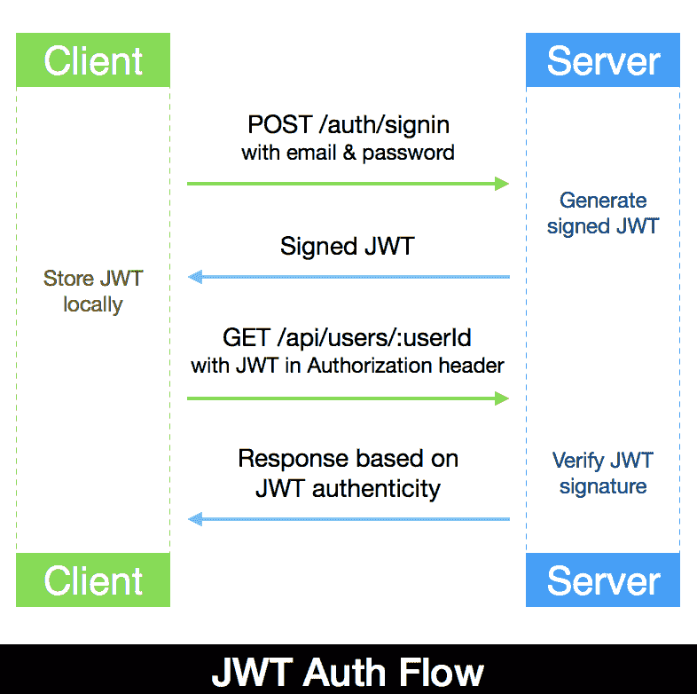
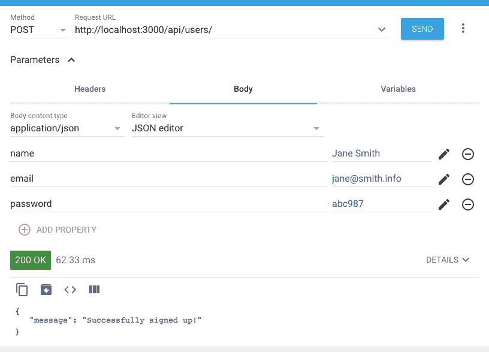
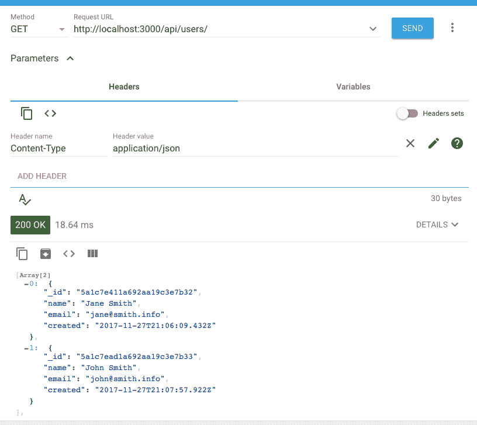
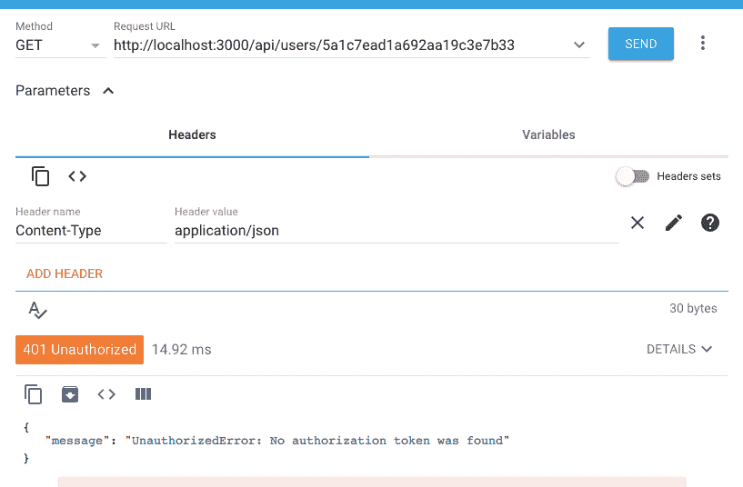
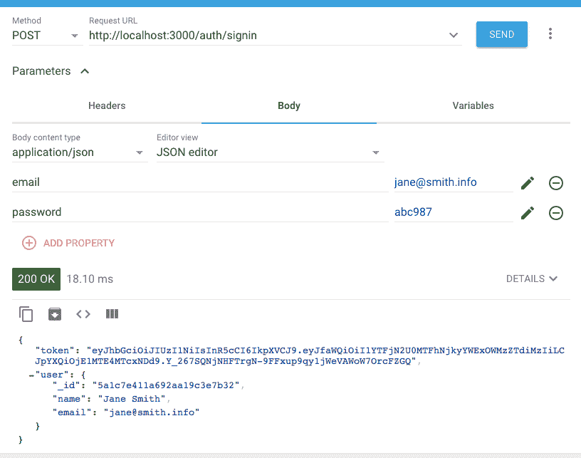
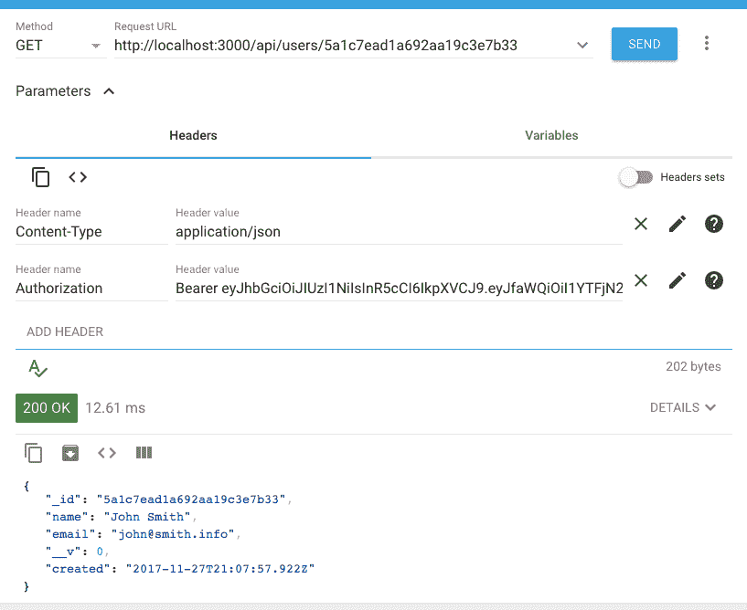

# 第三章：使用 MongoDB、Express 和 Node 构建后端

在大多数 Web 应用程序的开发过程中，存在常见任务、基本功能和实现代码的重复。这本书中开发的 MERN 应用程序也是如此。考虑到这些相似之处，我们将首先为一个骨架 MERN 应用程序奠定基础，该应用程序可以轻松修改和扩展，以实现各种 MERN 应用程序。

在本章中，我们将涵盖以下主题，并从 MERN 骨架的后端实现开始，使用 Node、Express 和 MongoDB：

+   MERN 应用程序中的用户 CRUD 和 auth

+   使用 Express 服务器处理 HTTP 请求

+   使用 Mongoose 模式进行用户模型

+   用户 CRUD 和 auth 的 API

+   用 JWT 进行受保护路由的身份验证

+   运行后端代码并检查 API

# 骨架应用程序概述

骨架应用程序将封装基本功能和一个在大多数 MERN 应用程序中重复的工作流程。我们将构建骨架本质上作为一个基本但完全功能的 MERN Web 应用程序，具有用户创建（CRUD）和身份验证-授权（auth）功能，这也将展示如何开发、组织和运行使用这个堆栈构建的一般 Web 应用程序的代码。目标是保持骨架尽可能简单，以便易于扩展，并可用作开发不同 MERN 应用程序的基础应用程序。

# 功能分解

在骨架应用程序中，我们将添加以下用例，其中包括用户 CRUD 和 auth 功能的实现：

+   **注册**：用户可以通过使用电子邮件地址注册创建新帐户

+   **用户列表**：任何访问者都可以看到所有注册用户的列表

+   **身份验证**：注册用户可以登录和退出

+   **受保护的用户资料**：只有注册用户可以在登录后查看个人用户详细信息

+   **授权用户编辑和删除**：只有注册和经过身份验证的用户才能编辑或删除自己的用户帐户详细信息

# 本章重点-后端

在本章中，我们将专注于使用 Node、Express 和 MongoDB 构建骨架应用程序的工作后端。完成的后端将是一个独立的服务器端应用程序，可以处理 HTTP 请求以创建用户、列出所有用户，并在考虑用户身份验证和授权的情况下查看、更新或删除数据库中的用户。

# 用户模型

用户模型将定义要存储在 MongoDB 数据库中的用户详细信息，并处理与用户相关的业务逻辑，如密码加密和用户数据验证。这个骨架版本的用户模型将是基本的，支持以下属性：

| **字段名称** | **类型** | **描述** |
| --- | --- | --- |
| `name` | String | 存储用户姓名的必需字段 |
| `email` | String | 必需的唯一字段，用于存储用户的电子邮件并标识每个帐户（每个唯一电子邮件只允许一个帐户） |
| `password` | String | 用于身份验证的必需字段，数据库将存储加密后的密码而不是实际字符串，以确保安全性 |
| `created` | Date | 当创建新用户帐户时自动生成的时间戳 |
| `updated` | Date | 当现有用户详细信息更新时自动生成的时间戳 |

# 用户 CRUD 的 API 端点

为了在用户数据库上启用和处理用户 CRUD 操作，后端将实现并公开 API 端点，供前端在视图中使用，如下所示：

| **操作** | **API 路由** | **HTTP 方法** |
| --- | --- | --- |
| 创建用户 | `/api/users` | `POST` |
| 列出所有用户 | `/api/users` | `GET` |
| 获取用户 | `/api/users/:userId` | `GET` |
| 更新用户 | `/api/users/:userId` | `PUT` |
| 删除用户 | `/api/users/:userId` | `DELETE` |
| 用户登录 | `/auth/signin` | `POST` |
| 用户退出登录（可选） | `/auth/signout` | `GET` |

其中一些用户 CRUD 操作将具有受保护的访问权限，这将要求请求的客户端进行身份验证、授权或两者都要求。最后两个路由用于身份验证，将允许用户登录和退出登录。

# 使用 JSON Web Tokens 进行身份验证

为了根据骨架特性限制和保护对用户 API 端点的访问，后端需要整合身份验证和授权机制。在实现 Web 应用程序的用户身份验证时有许多选择。最常见和经过时间考验的选项是使用会话在客户端和服务器端存储用户状态。但是，一种较新的方法是使用**JSON Web Token**（**JWT**）作为无状态身份验证机制，不需要在服务器端存储用户状态。

这两种方法在相关的真实用例中都有优势。然而，为了简化本书中的代码，并且因为它与 MERN 堆栈和我们的示例应用程序配合得很好，我们将使用 JWT 进行身份验证实现。此外，本书还将在未来章节中提出安全增强选项。

# JWT 的工作原理

当用户成功使用其凭据登录时，服务器端会生成一个使用秘钥和唯一用户详细信息签名的 JWT。然后，将此令牌返回给请求的客户端，以便在本地保存，可以保存在`localStorage`、`sessionStorage`或浏览器的 cookie 中，从根本上将维护用户状态的责任交给客户端：



对于成功登录后进行的 HTTP 请求，特别是对受保护且具有受限访问权限的 API 端点的请求，客户端必须将此令牌附加到请求中。更具体地说，`JSON Web Token`必须包含在请求的`Authorization`头部中作为`Bearer`：

```jsx
Authorization: Bearer <JSON Web Token>
```

当服务器收到对受保护的 API 端点的请求时，它会检查请求的`Authorization`头部是否包含有效的 JWT，然后验证签名以识别发送者，并确保请求数据未被损坏。如果令牌有效，则请求的客户端将被授予对关联操作或资源的访问权限，否则将返回授权错误。

在骨架应用程序中，当用户使用电子邮件和密码登录时，后端将使用仅在服务器上可用的秘钥生成带有用户 ID 的签名 JWT。然后，当用户尝试查看任何用户配置文件、更新其帐户详细信息或删除其用户帐户时，将需要此令牌进行验证。

实现用户模型来存储和验证用户数据，然后将其与 API 集成以基于 JWT 执行 CRUD 操作，将产生一个功能齐全的独立后端。在本章的其余部分，我们将看看如何在 MERN 堆栈和设置中实现这一点。

# 实现骨架后端

为了开始开发 MERN 骨架的后端部分，我们将首先设置项目文件夹，安装和配置必要的 npm 模块，然后准备运行脚本以帮助开发和运行代码。然后，我们将逐步通过代码实现用户模型、API 端点和基于 JWT 的身份验证，以满足我们之前为面向用户的功能定义的规范。

本章讨论的代码以及完整的骨架应用程序的代码可在 GitHub 的存储库[github.com/shamahoque/mern-skeleton](https://github.com/shamahoque/mern-skeleton)中找到。仅后端的代码可在同一存储库的名为`mern-skeleton-backend`的分支中找到。您可以克隆此代码，并在阅读本章其余部分的代码解释时运行应用程序。

# 文件夹和文件结构

以下文件夹结构仅显示与 MERN 骨架后端相关的文件。有了这些文件，我们将生成一个功能齐全的独立服务器端应用程序：

```jsx
| mern_skeleton/
   | -- config/
      | --- config.js
   | -- server/
      | --- controllers/
         | ---- auth.controller.js
         | ---- user.controller.js
      | --- helpers/
         | ---- dbErrorHandler.js
      | --- models/
         | ---- user.model.js
      | --- routes/
         | ---- auth.routes.js
         | ---- user.routes.js
      | --- express.js
      | --- server.js
  | -- .babelrc
  | -- nodemon.json
  | -- package.json
  | -- template.js
  | -- webpack.config.server.js
```

这个结构将在下一章进一步扩展，在那里我们通过添加`React`前端来完成骨架应用程序。

# 项目设置

如果开发环境已经设置好，我们可以初始化 MERN 项目以开始开发后端。首先，我们将在项目文件夹中初始化`package.json`，配置和安装开发依赖项，设置用于代码的配置变量，并更新`package.json`以帮助开发和运行代码的运行脚本。

# 初始化`package.json`

我们需要一个`package.json`文件来存储有关项目的元信息，列出模块依赖项及其版本号，并定义运行脚本。要在项目文件夹中初始化`package.json`文件，请从命令行转到项目文件夹并运行`npm init`，然后按照说明添加必要的细节。有了`package.json`文件后，我们可以继续设置和开发，并在代码实现过程中根据需要更新文件。

# 开发依赖项

为了开始开发并运行后端服务器代码，我们将配置和安装 Babel、Webpack 和 Nodemon，如第二章中所讨论的那样，对于仅后端，进行一些微小的调整。

# Babel

由于我们将使用 ES6 编写后端代码，我们将配置和安装 Babel 模块来转换 ES6。

首先，在`.babelrc`文件中配置 Babel，使用最新 JS 特性的预设和一些目前未在`babel-preset-env`下覆盖的 stage-x 特性。

`mern-skeleton/.babelrc`：

```jsx
{
    "presets": [
      "env",
      "stage-2"
    ]
}
```

接下来，我们从命令行安装 Babel 模块作为`devDependencies`：

```jsx
npm install --save-dev babel-core babel-loader babel-preset-env babel-preset-stage-2
```

一旦模块安装完成，您会注意到`package.json`文件中的`devDependencies`列表已更新。

# Webpack

我们需要 Webpack 使用 Babel 编译和捆绑服务器端代码，并且对于配置，我们可以使用在第二章中讨论的相同的`webpack.config.server.js`。

从命令行运行以下命令来安装`webpack`，`webpack-cli`和`webpack-node-externals`模块：

```jsx
npm install --save-dev webpack webpack-cli webpack-node-externals
```

这将安装 Webpack 模块并更新`package.json`文件。

# Nodemon

为了在开发过程中更新代码时自动重新启动 Node 服务器，我们将使用 Nodemon 来监视服务器代码的更改。我们可以使用与第二章中讨论的相同的安装和配置指南，*准备开发环境*。

# 配置变量

在`config/config.js`文件中，我们将定义一些与服务器端配置相关的变量，这些变量将在代码中使用，但不应作为最佳实践硬编码，也是出于安全目的。

`mern-skeleton/config/config.js`：

```jsx
const config = {
  env: process.env.NODE_ENV || 'development',
  port: process.env.PORT || 3000,
  jwtSecret: process.env.JWT_SECRET || "YOUR_secret_key",
  mongoUri: process.env.MONGODB_URI ||
    process.env.MONGO_HOST ||
    'mongodb://' + (process.env.IP || 'localhost') + ':' +
    (process.env.MONGO_PORT || '27017') +
    '/mernproject'
}

export default config
```

定义的配置变量有：

+   `env`：区分开发和生产模式

+   `端口`：定义服务器的监听端口

+   `jwtSecret`：用于签署 JWT 的秘钥

+   `mongoUri`：项目的 MongoDB 数据库位置

# 运行脚本

为了在开发后端代码时运行服务器，我们可以从`package.json`文件中的`npm run development`脚本开始。对于完整的骨架应用程序，我们将使用第二章中定义的相同的运行脚本，*准备开发环境*。

`mern-skeleton/package.json`：

```jsx
"scripts": {
    "development": "nodemon"
 }
```

`npm run development`：从项目文件夹的命令行中运行此命令基本上会根据`nodemon.js`中的配置启动 Nodemon。配置指示 Nodemon 监视服务器文件的更新，并在更新时重新构建文件，然后重新启动服务器，以便立即使用更改。

# 准备服务器

在本节中，我们将集成 Express、Node 和 MongoDB，以在开始实现特定于用户的功能之前运行完全配置的服务器。

# 配置 Express

要使用 Express，我们将首先安装 Express，然后在`server/express.js`文件中添加和配置它。

从命令行运行以下命令来安装带有`--save`标志的`express`模块，以便`package.json`文件会自动更新：

```jsx
npm install express --save
```

一旦 Express 安装完成，我们可以将其导入到`express.js`文件中，并根据需要进行配置，并使其对整个应用程序可用。

`mern-skeleton/server/express.js`：

```jsx
import express from 'express'
const app = express()
  /*... configure express ... */
export default app
```

为了正确处理 HTTP 请求并提供响应，我们将使用以下模块来配置 Express：

+   `body-parser`：用于处理流式请求对象解析复杂性的主体解析中间件，以便我们可以通过在请求主体中交换 JSON 来简化浏览器-服务器通信：

+   安装`body-parser`模块：`npm install body-parser --save`

+   配置 Express：`bodyParser.json()`和`bodyParser.urlencoded({ extended: true })`

+   `cookie-parser`：用于解析和设置请求对象中的 cookie 的 cookie 解析中间件：

安装`cookie-parser`模块：`npm install cookie-parser --save`

+   `压缩`：压缩中间件，将尝试压缩所有通过中间件传递的请求的响应主体：

安装`compression`模块：`npm install compression --save`

+   `头盔`：一组中间件函数，通过设置各种 HTTP 头部来帮助保护 Express 应用程序：

安装`头盔`模块：`npm install helmet --save`

+   `cors`：中间件以启用**CORS**（**跨源资源共享**）：

安装`cors`模块：`npm install cors --save`

在安装了上述模块之后，我们可以更新`express.js`来导入这些模块并在导出到服务器其余代码中使用之前配置 Express 应用程序。

更新后的`mern-skeleton/server/express.js`代码应该如下所示：

```jsx
import express from 'express'
import bodyParser from 'body-parser'
import cookieParser from 'cookie-parser'
import compress from 'compression'
import cors from 'cors'
import helmet from 'helmet'

const app = express()

app.use(bodyParser.json())
app.use(bodyParser.urlencoded({ extended: true }))
```

```jsx
app.use(cookieParser())
app.use(compress())
app.use(helmet())
app.use(cors())

export default app
```

# 启动服务器

通过配置 Express 应用程序来接受 HTTP 请求，我们可以继续使用它来实现服务器以监听传入的请求。

在`mern-skeleton/server/server.js`文件中，添加以下代码来实现服务器：

```jsx
import config from './../config/config'
import app from './express'

app.listen(config.port, (err) => {
  if (err) {
    console.log(err)
  }
  console.info('Server started on port %s.', config.port)
})
```

我们首先导入配置变量来设置服务器将监听的端口号，然后配置 Express 应用程序以启动服务器。

要使此代码运行并继续开发，现在可以从命令行运行`npm run development`。如果代码没有错误，服务器应该开始运行，并且 Nodemon 会监视代码更改。

# 设置 Mongoose 并连接到 MongoDB

我们将使用`Mongoose`模块来在此骨架中实现用户模型，以及我们 MERN 应用程序的所有未来数据模型。在这里，我们将首先配置 Mongoose，并利用它来定义与 MongoDB 数据库的连接。

首先，要安装`mongoose`模块，请运行以下命令：

```jsx
npm install mongoose --save
```

然后，更新`server.js`文件以导入`mongoose`模块，配置它以使用原生的 ES6 promises，并最终使用它来处理与项目的 MongoDB 数据库的连接。

`mern-skeleton/server/server.js`：

```jsx
import mongoose from 'mongoose'

mongoose.Promise = global.Promise
mongoose.connect(config.mongoUri)

mongoose.connection.on('error', () => {
  throw new Error(`unable to connect to database: ${mongoUri}`)
})
```

如果您在开发中运行代码，则保存此更新应重新启动现在已集成了 Mongoose 和 MongoDB 的服务器。

Mongoose 是一个 MongoDB 对象建模工具，它提供了基于模式的解决方案来对应用程序数据进行建模。它包括内置的类型转换、验证、查询构建和业务逻辑钩子。在此后端堆栈中使用 Mongoose 提供了对 MongoDB 的更高层次的功能，包括将对象模型映射到数据库文档。因此，使用 Node 和 MongoDB 后端进行开发变得更简单和更高效。要了解有关 Mongoose 的更多信息，请访问[mongoosejs.com](http://mongoosejs.com)。

# 在根 URL 上提供 HTML 模板

现在，具有 Node、Express 和 MongoDB 功能的服务器正在运行，我们可以扩展它以响应根 URL`/`的传入请求并提供 HTML 模板。

在`template.js`文件中，添加一个 JS 函数，该函数返回一个简单的 HTML 文档，该文档将在浏览器屏幕上呈现`Hello World`。

`mern-skeleton/template.js`：

```jsx
export default () => {
    return `<!doctype html>
      <html lang="en">
          <head>
             <meta charset="utf-8">
             <title>MERN Skeleton</title>
          </head>
          <body>
            <div id="root">Hello World</div>
          </body>
      </html>`
}
```

要在根 URL 上提供此模板，请更新`express.js`文件以导入此模板，并在对`'/'`路由的 GET 请求的响应中发送它。

`mern-skeleton/server/express.js`：

```jsx
import Template from './../template'
...
app.get('/', (req, res) => {
  res.status(200).send(Template())
})
...
```

通过这个更新，在浏览器中打开根 URL 应该显示“Hello World”在页面上呈现。

如果您在本地机器上运行代码，根 URL 将是`http://localhost:3000/`。

# 用户模型

我们将在`server/models/user.model.js`文件中实现用户模型，使用 Mongoose 来定义包含必要用户数据字段的模式，为字段添加内置验证，并整合密码加密、认证和自定义验证等业务逻辑。

我们将首先导入`mongoose`模块，并使用它来生成一个`UserSchema`。

`mern-skeleton/server/models/user.model.js`:

```jsx
import mongoose from 'mongoose'

const UserSchema = new mongoose.Schema({ … })
```

`mongoose.Schema()`函数以模式定义对象作为参数，生成一个新的 Mongoose 模式对象，可以在后端代码的其余部分中使用。

# 用户模式定义

生成新的 Mongoose 模式所需的用户模式定义对象将声明所有用户数据字段和相关属性。

# 名称

`name`字段是一个必填字段，类型为`String`。

`mern-skeleton/server/models/user.model.js`:

```jsx
name: {
   type: String,
   trim: true,
   required: 'Name is required'
 },
```

# 电子邮件

`email`字段是一个必填字段，类型为`String`，必须匹配有效的电子邮件格式，并且在用户集合中也必须是“唯一”的。

`mern-skeleton/server/models/user.model.js`:

```jsx
email: {
  type: String,
  trim: true,
  unique: 'Email already exists',
  match: [/.+\@.+\..+/, 'Please fill a valid email address'],
  required: 'Email is required'
},
```

# 创建和更新时间戳

`created`和`updated`字段是`Date`值，将被程序生成以记录用户创建和更新的时间戳。

`mern-skeleton/server/models/user.model.js`:

```jsx
created: {
  type: Date,
  default: Date.now
},
updated: Date,
```

# 哈希密码和盐

`hashed_password`和`salt`字段代表我们将用于认证的加密用户密码。

`mern-skeleton/server/models/user.model.js`:

```jsx
hashed_password: {
    type: String,
    required: "Password is required"
},
salt: String
```

出于安全目的，实际密码字符串不会直接存储在数据库中，而是单独处理。

# 用于认证的密码

密码字段对于在任何应用程序中提供安全用户认证非常重要，它需要作为用户模型的一部分进行加密、验证和安全认证。

# 作为虚拟字段

用户提供的`password`字符串不会直接存储在用户文档中。相反，它被处理为一个“虚拟”字段。

`mern-skeleton/server/models/user.model.js`:

```jsx
UserSchema
  .virtual('password')
  .set(function(password) {
    this._password = password
    this.salt = this.makeSalt()
    this.hashed_password = this.encryptPassword(password)
  })
  .get(function() {
    return this._password
  })
```

当在用户创建或更新时接收到`password`值时，它将被加密为一个新的哈希值，并设置为`hashed_password`字段，以及在`salt`字段中设置`salt`值。

# 加密和认证

加密逻辑和盐生成逻辑，用于生成代表`password`值的`hashed_password`和`salt`值，被定义为`UserSchema`方法。

`mern-skeleton/server/models/user.model.js`：

```jsx
UserSchema.methods = {
  authenticate: function(plainText) {
    return this.encryptPassword(plainText) === this.hashed_password
  },
  encryptPassword: function(password) {
    if (!password) return ''
    try {
      return crypto
        .createHmac('sha1', this.salt)
        .update(password)
        .digest('hex')
    } catch (err) {
      return ''
    }
  },
  makeSalt: function() {
    return Math.round((new Date().valueOf() * Math.random())) + ''
  }
}
```

此外，`authenticate`方法也被定义为`UserSchema`方法，用于在用户提供的密码必须进行验证以进行登录时使用。

Node 中的`crypto`模块用于将用户提供的密码字符串加密为带有随机生成的`salt`值的`hashed_password`。当用户详细信息在创建或更新时保存到数据库中，`hashed_password`和 salt 将存储在用户文档中。在用户登录时，需要`hashed_password`和 salt 值来匹配和验证提供的密码字符串，使用之前定义的`authenticate`方法。

# 密码字段验证

为了在最终用户选择的实际密码字符串上添加验证约束，我们需要添加自定义验证逻辑并将其与模式中的`hashed_password`字段关联起来。

`mern-skeleton/server/models/user.model.js`：

```jsx
UserSchema.path('hashed_password').validate(function(v) {
  if (this._password && this._password.length < 6) {
    this.invalidate('password', 'Password must be at least 6 characters.')
  }
  if (this.isNew && !this._password) {
    this.invalidate('password', 'Password is required')
  }
}, null)
```

为了确保在创建新用户或更新现有密码时确实提供了密码值，并且长度至少为六个字符，我们添加了自定义验证以在 Mongoose 尝试存储`hashed_password`值之前检查密码值。如果验证失败，逻辑将返回相关的错误消息。

一旦`UserSchema`被定义，并且所有与密码相关的业务逻辑都像之前讨论的那样被添加，我们最终可以在`user.model.js`文件的底部导出模式，以便在后端代码的其他部分中使用它。

`mern-skeleton/server/models/user.model.js`：

```jsx
export default mongoose.model('User', UserSchema) 
```

# Mongoose 错误处理

向用户模式字段添加的验证约束将在将用户数据保存到数据库时引发错误消息。为了处理这些验证错误以及我们向数据库查询时可能引发的其他错误，我们将定义一个辅助方法来返回相关的错误消息，以便在请求-响应周期中适当地传播。

我们将在`server/helpers/dbErrorHandler.js`文件中添加`getErrorMessage`辅助方法。该方法将解析并返回与使用 Mongoose 查询 MongoDB 时发生的特定验证错误或其他错误相关联的错误消息。

`mern-skeleton/server/helpers/dbErrorHandler.js`：

```jsx
const getErrorMessage = (err) => {
  let message = ''
  if (err.code) {
      switch (err.code) {
          case 11000:
          case 11001:
              message = getUniqueErrorMessage(err)
              break
          default:
              message = 'Something went wrong'
      }
  } else {
      for (let errName in err.errors) {
          if (err.errors[errName].message)
          message = err.errors[errName].message
      }
  }
  return message
}

export default {getErrorMessage}
```

不是因为 Mongoose 验证器违规而抛出的错误将包含错误代码，并且在某些情况下需要以不同方式处理。例如，由于违反唯一约束而导致的错误将返回一个与 Mongoose 验证错误不同的错误对象。唯一选项不是验证器，而是用于构建 MongoDB 唯一索引的便捷助手，因此我们将添加另一个`getUniqueErrorMessage`方法来解析与唯一约束相关的错误对象，并构造适当的错误消息。

`mern-skeleton/server/helpers/dbErrorHandler.js`：

```jsx
const getUniqueErrorMessage = (err) => {
  let output
  try {
      let fieldName =   
      err.message.substring(err.message.lastIndexOf('.$') + 2,                                             
      err.message.lastIndexOf('_1'))
      output = fieldName.charAt(0).toUpperCase() + fieldName.slice(1) +   
      ' already exists'
  } catch (ex) {
      output = 'Unique field already exists'
  }
  return output
}
```

通过使用从此辅助文件导出的`getErrorMessage`函数，我们将在处理 Mongoose 执行的用户 CRUD 操作引发的错误时添加有意义的错误消息。

# 用户 CRUD API

Express 应用程序公开的用户 API 端点将允许前端对根据用户模型生成的文档执行 CRUD 操作。为了实现这些工作端点，我们将编写 Express 路由和相应的控制器回调函数，当这些声明的路由收到 HTTP 请求时应该执行这些函数。在本节中，我们将看看这些端点在没有任何身份验证限制的情况下如何工作。

用户 API 路由将在`server/routes/user.routes.js`中使用 Express 路由器声明，然后挂载到我们在`server/express.js`中配置的 Express 应用程序上。

`mern-skeleton/server/express.js`：

```jsx
import userRoutes from './routes/user.routes'
...
app.use('/', userRoutes)
...
```

# 用户路由

`user.routes.js`文件中定义的用户路由将使用`express.Router()`来声明具有相关 HTTP 方法的路由路径，并分配应该在服务器接收到这些请求时调用的相应控制器函数。

我们将通过以下方式保持用户路由简单：

+   `/api/users`用于：

+   使用 GET 列出用户

+   使用 POST 创建新用户

+   `/api/users/:userId`用于：

+   使用 GET 获取用户

+   使用 PUT 更新用户

+   使用 DELETE 删除用户

生成的`user.routes.js`代码将如下所示（不包括需要为受保护的路由添加的身份验证考虑）。

`mern-skeleton/server/routes/user.routes.js`：

```jsx
import express from 'express'
import userCtrl from '../controllers/user.controller'

const router = express.Router()

router.route('/api/users')
  .get(userCtrl.list)
  .post(userCtrl.create)

router.route('/api/users/:userId')
  .get(userCtrl.read)
  .put(userCtrl.update)
  .delete(userCtrl.remove)

router.param('userId', userCtrl.userByID)

export default router
```

# 用户控制器

`server/controllers/user.controller.js`文件将包含在前面的用户路由声明中使用的控制器方法，作为服务器接收到路由请求时的回调。

`user.controller.js`文件将具有以下结构：

```jsx
import User from '../models/user.model'
import _ from 'lodash'
import errorHandler from './error.controller'

const create = (req, res, next) => { … }
const list = (req, res) => { … }
const userByID = (req, res, next, id) => { … }
const read = (req, res) => { … }
const update = (req, res, next) => { … }
const remove = (req, res, next) => { … }

export default { create, userByID, read, list, remove, update }
```

控制器将使用`errorHandler`助手来在 Mongoose 发生错误时响应路由请求并提供有意义的消息。在更新具有更改值的现有用户时，它还将使用一个名为`lodash`的模块。

`lodash`是一个 JavaScript 库，提供常见编程任务的实用函数，包括对数组和对象的操作。要安装`lodash`，请从命令行运行`npm install lodash --save`。

先前定义的每个控制器函数都与路由请求相关，并将根据每个 API 用例进行详细说明。

# 创建新用户

创建新用户的 API 端点在以下路由中声明。

`mern-skeleton/server/routes/user.routes.js`：

```jsx
router.route('/api/users').post(userCtrl.create)
```

当 Express 应用程序在`'/api/users'`处收到 POST 请求时，它会调用控制器中定义的`create`函数。

`mern-skeleton/server/controllers/user.controller.js`：

```jsx
const create = (req, res, next) => {
  const user = new User(req.body)
  user.save((err, result) => {
    if (err) {
      return res.status(400).json({
        error: errorHandler.getErrorMessage(err)
      })
    }
    res.status(200).json({
      message: "Successfully signed up!"
    })
  })
}
```

此函数使用从前端收到的用户 JSON 对象在`req.body`中创建新用户。`user.save`尝试在 Mongoose 对数据进行验证检查后将新用户保存到数据库中，因此将向请求的客户端返回错误或成功响应。

# 列出所有用户

获取所有用户的 API 端点在以下路由中声明。

`mern-skeleton/server/routes/user.routes.js`：

```jsx
router.route('/api/users').get(userCtrl.list)
```

当 Express 应用程序在`'/api/users'`处收到 GET 请求时，它会执行`list`控制器函数。

`mern-skeleton/server/controllers/user.controller.js`：

```jsx
const list = (req, res) => {
  User.find((err, users) => {
    if (err) {
      return res.status(400).json({
        error: errorHandler.getErrorMessage(err)
      })
    }
    res.json(users)
  }).select('name email updated created')
}
```

`list`控制器函数从数据库中找到所有用户，仅填充结果用户列表中的名称、电子邮件、创建和更新字段，然后将这些用户列表作为 JSON 对象数组返回给请求的客户端。

# 按 ID 加载用户以进行读取、更新或删除

读取、更新和删除的所有三个 API 端点都需要根据正在访问的用户的用户 ID 从数据库中检索用户。在响应特定的读取、更新或删除请求之前，我们将编程 Express 路由器执行此操作。

# 加载

每当 Express 应用程序收到与路径中包含`:userId`参数匹配的路由的请求时，该应用程序将首先执行`userByID`控制器函数，然后传播到传入请求特定的`next`函数。

`mern-skeleton/server/routes/user.routes.js`：

```jsx
router.param('userId', userCtrl.userByID)
```

`userByID`控制器函数使用`:userId`参数中的值来查询数据库的`_id`，并加载匹配用户的详细信息。

`mern-skeleton/server/controllers/user.controller.js`：

```jsx
const userByID = (req, res, next, id) => {
  User.findById(id).exec((err, user) => {
    if (err || !user)
      return res.status('400').json({
        error: "User not found"
      })
    req.profile = user
    next()
  })
}
```

如果在数据库中找到匹配的用户，则用户对象将附加到请求对象的`profile`键中。然后，使用`next()`中间件将控制传播到下一个相关的控制器函数。例如，如果原始请求是读取用户配置文件，则`userById`中的`next()`调用将转到`read`控制器函数。

# 阅读

声明了读取单个用户数据的 API 端点在以下路由中。

`mern-skeleton/server/routes/user.routes.js`：

```jsx
router.route('/api/users/:userId').get(userCtrl.read)
```

当 Express 应用程序在`'/api/users/:userId'`接收到 GET 请求时，它执行`userByID`控制器函数，通过参数中的`userId`值加载用户，然后执行`read`控制器函数。

`mern-skeleton/server/controllers/user.controller.js`：

```jsx
const read = (req, res) => {
  req.profile.hashed_password = undefined
  req.profile.salt = undefined
  return res.json(req.profile)
}
```

`read`函数从`req.profile`中检索用户详细信息，并在将用户对象发送到请求客户端的响应之前删除敏感信息，如`hashed_password`和`salt`值。

# 更新

声明了更新单个用户的 API 端点在以下路由中。

`mern-skeleton/server/routes/user.routes.js`：

```jsx
router.route('/api/users/:userId').put(userCtrl.update)
```

当 Express 应用程序在`'/api/users/:userId'`接收到 PUT 请求时，类似于`read`，它首先加载具有`:userId`参数值的用户，然后执行`update`控制器函数。

`mern-skeleton/server/controllers/user.controller.js`：

```jsx
const update = (req, res, next) => {
  let user = req.profile
  user = _.extend(user, req.body)
  user.updated = Date.now()
  user.save((err) => {
    if (err) {
      return res.status(400).json({
        error: errorHandler.getErrorMessage(err)
      })
    }
    user.hashed_password = undefined
    user.salt = undefined
    res.json(user)
  })
}
```

`update`函数从`req.profile`中检索用户详细信息，然后使用`lodash`模块来扩展和合并请求体中的更改以更新用户数据。在将此更新后的用户保存到数据库之前，`updated`字段将填充为当前日期以反映最后更新的时间戳。成功保存此更新后，更新后的用户对象将通过删除敏感数据，如`hashed_password`和`salt`，然后将用户对象发送到请求客户端的响应中。

# 删除

声明了删除用户的 API 端点在以下路由中。

`mern-skeleton/server/routes/user.routes.js`：

```jsx
router.route('/api/users/:userId').delete(userCtrl.remove)
```

当 Express 应用程序在`'/api/users/:userId'`接收到 DELETE 请求时，类似于读取和更新，它首先通过 ID 加载用户，然后执行`remove`控制器函数。

`mern-skeleton/server/controllers/user.controller.js`：

```jsx
const remove = (req, res, next) => {
  let user = req.profile
  user.remove((err, deletedUser) => {
    if (err) {
      return res.status(400).json({
        error: errorHandler.getErrorMessage(err)
      })
    }
    deletedUser.hashed_password = undefined
    deletedUser.salt = undefined
    res.json(deletedUser)
  })
}
```

`remove`函数从`req.profile`中检索用户，并使用`remove()`查询从数据库中删除用户。成功删除后，将在响应中返回已删除的用户对象。

到目前为止，通过实现 API 端点，任何客户端都可以对用户模型执行 CRUD 操作，但我们希望通过认证和授权来限制对其中一些操作的访问。

# 用户认证和受保护的路由

为了限制用户操作（如用户资料查看、用户更新和用户删除），我们将实现 JWT 的登录认证，然后保护和授权读取、更新和删除路由。

登录和登出的认证相关 API 端点将在`server/routes/auth.routes.js`中声明，然后挂载到`server/express.js`中的 Express 应用程序上。

`mern-skeleton/server/express.js`：

```jsx
import authRoutes from './routes/auth.routes'
  ...
  app.use('/', authRoutes)
  ...
```

# 认证路由

使用`express.Router()`在`auth.routes.js`文件中定义了两个认证 API，以声明具有相关 HTTP 方法的路由路径，并分配了应在收到这些路由的请求时调用的相应认证控制器函数。

认证路由如下：

+   `'/auth/signin'`：使用电子邮件和密码进行用户认证的 POST 请求

+   `'/auth/signout'`：GET 请求以清除包含在登录后设置在响应对象上的 JWT 的 cookie

生成的`mern-skeleton/server/routes/auth.routes.js`文件将如下所示：

```jsx
import express from 'express'
import authCtrl from '../controllers/auth.controller'

const router = express.Router()

router.route('/auth/signin')
  .post(authCtrl.signin)
router.route('/auth/signout')
  .get(authCtrl.signout)

export default router
```

# 认证控制器

`server/controllers/auth.controller.js`中的认证控制器函数不仅处理登录和登出路由的请求，还提供 JWT 和`express-jwt`功能，以启用受保护的用户 API 端点的认证和授权。

`auth.controller.js`文件将具有以下结构：

```jsx
import User from '../models/user.model'
import jwt from 'jsonwebtoken'
import expressJwt from 'express-jwt'
import config from './../../config/config'

const signin = (req, res) => { … }
const signout = (req, res) => { … }
const requireSignin = … 
const hasAuthorization = (req, res) => { … }

export default { signin, signout, requireSignin, hasAuthorization }
```

以下详细说明了四个控制器函数，以展示后端如何使用 JSON Web Tokens 实现用户认证。

# 登录

在以下路由中声明了用于登录用户的 API 端点。

`mern-skeleton/server/routes/auth.routes.js`：

```jsx
router.route('/auth/signin').post(authCtrl.signin)
```

当 Express 应用程序在`'/auth/signin'`收到 POST 请求时，它会执行`signin`控制器函数。

`mern-skeleton/server/controllers/auth.controller.js`：

```jsx
const signin = (req, res) => {
  User.findOne({
    "email": req.body.email
  }, (err, user) => {
    if (err || !user)
      return res.status('401').json({
        error: "User not found"
      })

    if (!user.authenticate(req.body.password)) {
      return res.status('401').send({
        error: "Email and password don't match."
      })
    }

    const token = jwt.sign({
      _id: user._id
    }, config.jwtSecret)

    res.cookie("t", token, {
      expire: new Date() + 9999
    })

    return res.json({
      token,
      user: {_id: user._id, name: user.name, email: user.email}
    })
  })
}
```

`POST`请求对象在`req.body`中接收电子邮件和密码。该电子邮件用于从数据库中检索匹配的用户。然后，`UserSchema`中定义的密码验证方法用于验证从客户端`req.body`中接收的密码。

如果密码成功验证，JWT 模块将用秘密密钥和用户的`_id`值生成一个签名的 JWT。

安装`jsonwebtoken`模块，通过在命令行中运行`npm install jsonwebtoken --save`来使其在导入此控制器时可用。

然后，签名的 JWT 将与用户详细信息一起返回给经过身份验证的客户端。可选地，我们还可以将令牌设置为响应对象中的 cookie，以便在客户端选择 JWT 存储的情况下可用。在客户端，当从服务器请求受保护的路由时，必须将此令牌附加为`Authorization`头。

# 登出

在以下路由中声明了用于登出用户的 API 端点。

`mern-skeleton/server/routes/auth.routes.js`:

```jsx
router.route('/auth/signout').get(authCtrl.signout)
```

当 Express 应用程序在`'/auth/signout'`处收到 GET 请求时，它会执行`signout`控制器函数。

`mern-skeleton/server/controllers/auth.controller.js`:

```jsx
const signout = (req, res) => {
  res.clearCookie("t")
  return res.status('200').json({
    message: "signed out"
  })
}
```

`signout`函数清除包含签名 JWT 的响应 cookie。这是一个可选的端点，如果前端根本不使用 cookie，则对身份验证没有真正必要。使用 JWT，用户状态存储是客户端的责任，并且除了 cookie 之外，客户端存储的选择有多种选项。在登出时，客户端需要在客户端删除令牌，以确立用户不再经过身份验证。

# 使用 express-jwt 保护路由

为了保护对读取、更新和删除路由的访问，服务器需要检查请求的客户端是否真的是经过身份验证和授权的用户。

在访问受保护的路由时，我们将使用`express-jwt`模块来检查请求用户是否已登录并具有有效的 JWT。

`express-jwt`模块是验证 JSON Web 令牌的中间件。运行`npm install express-jwt --save`来安装`express-jwt`。

# 要求登录

`auth.controller.js`中的`requireSignin`方法使用`express-jwt`来验证传入请求的`Authorization`头中是否有有效的 JWT。如果令牌有效，它会将经过验证的用户 ID 附加在请求对象的`'auth'`键中，否则会抛出身份验证错误。

`mern-skeleton/server/controllers/auth.controller.js`：

```jsx
const requireSignin = expressJwt({
  secret: config.jwtSecret,
  userProperty: 'auth'
})
```

我们可以将`requireSignin`添加到任何应受保护免受未经身份验证访问的路由。

# 授权已登录用户

对于一些受保护的路由，如更新和删除，除了检查身份验证外，我们还希望确保请求的用户只能更新或删除自己的用户信息。为了实现这一点，在`auth.controller.js`中定义的`hasAuthorization`函数在允许相应的 CRUD 控制器函数继续之前，检查经过身份验证的用户是否与正在更新或删除的用户相同。

`mern-skeleton/server/controllers/auth.controller.js`：

```jsx
const hasAuthorization = (req, res, next) => {
  const authorized = req.profile && req.auth && req.profile._id == 
  req.auth._id
  if (!(authorized)) {
    return res.status('403').json({
      error: "User is not authorized"
    })
  }
  next()
}
```

`req.auth`对象由`express-jwt`在身份验证验证后的`requireSignin`中填充，而`req.profile`由`user.controller.js`中的`userByID`函数填充。我们将在需要身份验证和授权的路由中添加`hasAuthorization`函数。

# 保护用户路由

我们将在需要受到身份验证和授权保护的用户路由声明中添加`requireSignin`和`hasAuthorization`。

更新`user.routes.js`中的读取、更新和删除路由如下。

`mern-skeleton/server/routes/user.routes.js`：

```jsx
import authCtrl from '../controllers/auth.controller'
...
router.route('/api/users/:userId')
    .get(authCtrl.requireSignin, userCtrl.read)
    .put(authCtrl.requireSignin, authCtrl.hasAuthorization, 
     userCtrl.update)
    .delete(authCtrl.requireSignin, authCtrl.hasAuthorization, 
     userCtrl.remove)
...
```

只需要身份验证验证的用户信息读取路由，而更新和删除路由在执行这些 CRUD 操作之前应检查身份验证和授权。

# 对于 express-jwt 的身份验证错误处理

处理由`express-jwt`抛出的与验证传入请求中的 JWT 令牌相关的错误时，我们需要在 Express 应用程序配置中添加以下错误捕获代码，该配置位于`mern-skeleton/server/express.js`中的代码末尾，在挂载路由之后并在导出应用程序之前：

```jsx
app.use((err, req, res, next) => {
  if (err.name === 'UnauthorizedError') {
    res.status(401).json({"error" : err.name + ": " + err.message})
  }
})
```

当令牌由于某种原因无法验证时，`express-jwt`会抛出一个名为`UnauthorizedError`的错误。我们在这里捕获此错误，以便向请求的客户端返回`401`状态。

通过实施用户身份验证来保护路由，我们已经涵盖了骨架 MERN 应用程序的所有期望功能。在下一节中，我们将看看如何在不实施前端的情况下检查这个独立后端是否按预期运行。

# 检查独立后端

在选择用于检查后端 API 的工具时，有许多选项，从命令行工具 curl（[`github.com/curl/curl`](https://github.com/curl/curl)）到 Advanced REST Client（[`chrome.google.com/webstore/detail/advanced-rest-client/hgmloofddffdnphfgcellkdfbfbjeloo`](https://chrome.google.com/webstore/detail/advanced-rest-client/hgmloofddffdnphfgcellkdfbfbjeloo)）—一个具有交互式用户界面的 Chrome 扩展程序应用。

要检查本章实现的 API，首先从命令行运行服务器，并使用这些工具之一请求路由。如果您在本地计算机上运行代码，则根 URL 为`http://localhost:3000/`。

使用 ARC，我们将展示检查实现的 API 端点的五个用例的预期行为。

# 创建新用户

首先，我们将使用`/api/users`的 POST 请求创建一个新用户，并在请求体中传递名称、电子邮件和密码值。当用户在数据库中成功创建且没有任何验证错误时，我们将看到一个 200 OK 的成功消息，如下面的屏幕截图所示：



# 获取用户列表

我们可以通过对`/api/users`进行`GET`请求来查看数据库中是否有新用户。响应应包含存储在数据库中的所有用户对象的数组：



# 尝试获取单个用户

接下来，我们将尝试在未登录的情况下访问受保护的 API。对任何一个用户进行`GET`请求将返回 401 未经授权，例如，在以下示例中，对`/api/users/5a1c7ead1a692aa19c3e7b33`的`GET`请求将返回 401：



# 登录

为了能够访问受保护的路由，我们将使用第一个示例中创建的用户的凭据进行登录。要登录，需要在`/auth/signin`发送带有电子邮件和密码的 POST 请求。成功登录后，服务器将返回一个签名的 JWT 和用户详细信息。我们将需要这个令牌来访问获取单个用户的受保护路由：



# 成功获取单个用户

使用登录后收到的令牌，我们现在可以访问之前失败的受保护路由。在向`/api/users/5a1c7ead1a692aa19c3e7b33`发出 GET 请求时，令牌以 Bearer 方案设置在`Authorization`标头中，这次用户对象成功返回。



# 总结

在本章中，我们使用 Node、Express 和 MongoDB 开发了一个完全独立的服务器端应用程序，涵盖了 MERN 骨架应用程序的第一部分。在后端，我们实现了以下功能：

+   用 Mongoose 实现的用于存储用户数据的用户模型

+   使用 Express 实现的用户 API 端点执行 CRUD 操作

+   使用 JWT 和`express-jwt`实现受保护路由的用户认证

我们还通过配置 Webpack 编译 ES6 代码和 Nodemon 在代码更改时重新启动服务器来设置开发流程。最后，我们使用 Chrome 的高级 Rest API 客户端扩展应用程序检查了 API 的实现。

我们现在准备在下一章中扩展这个后端应用程序代码，添加 React 前端，并完成 MERN 骨架应用程序。
