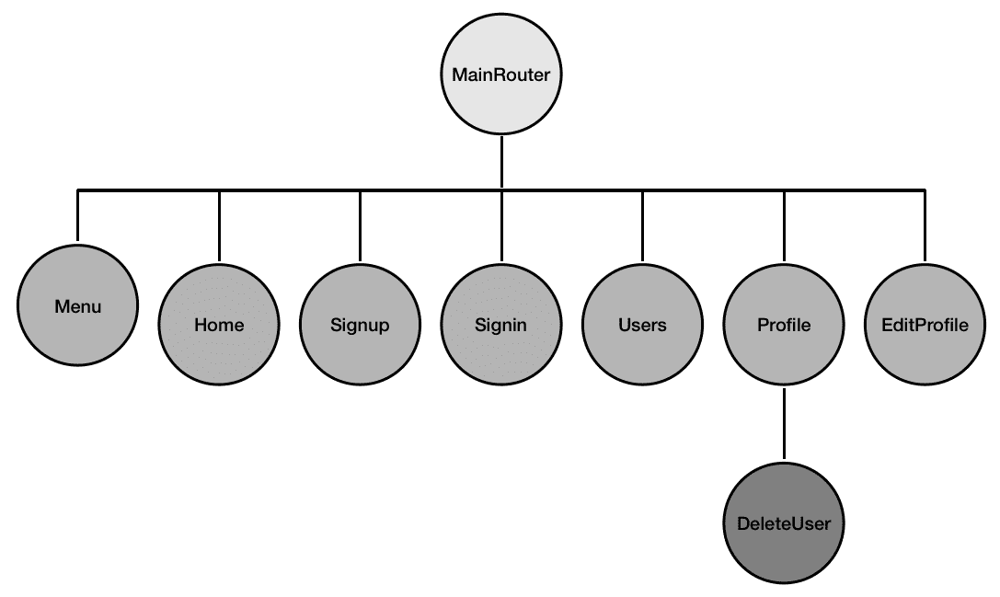
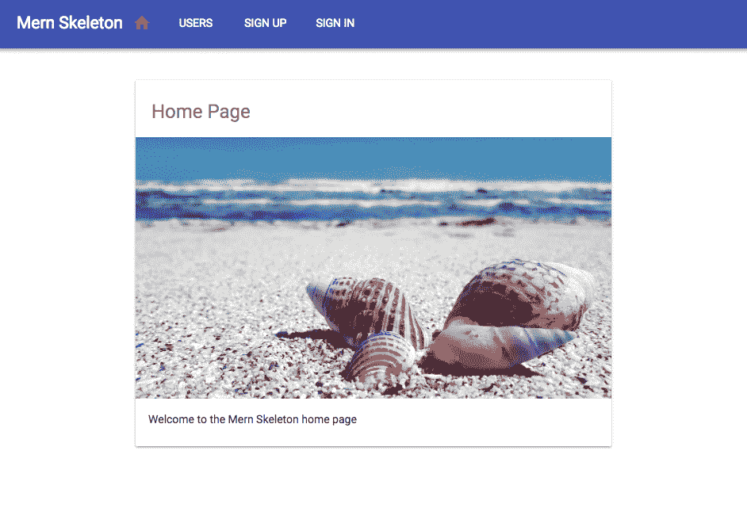
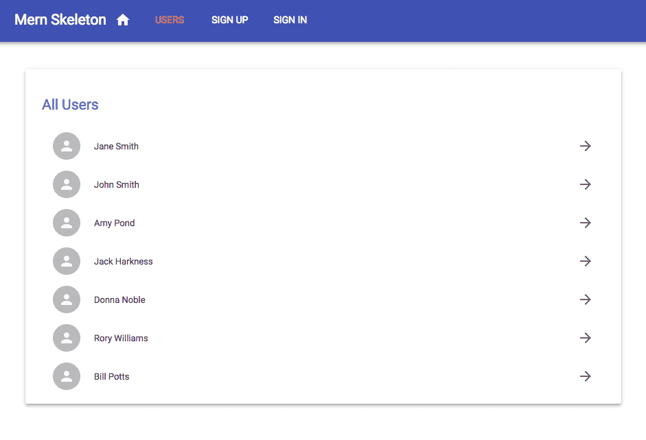
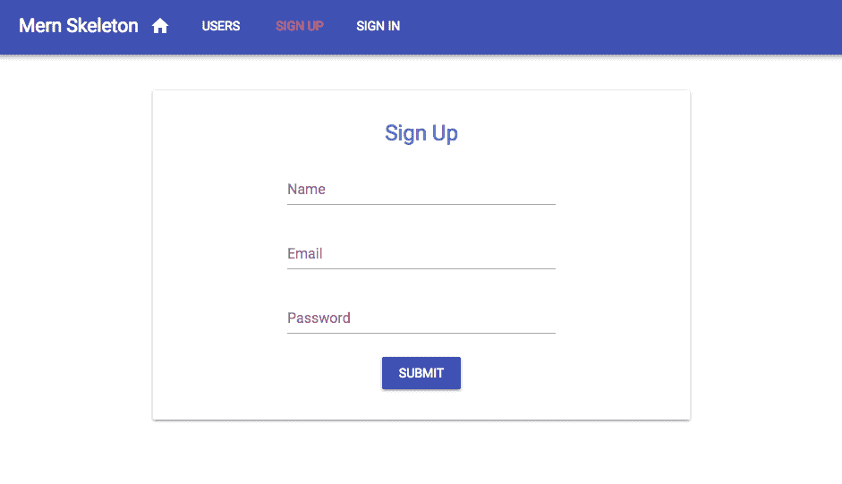
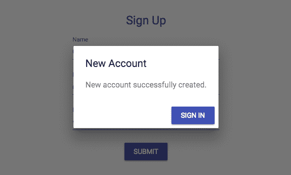
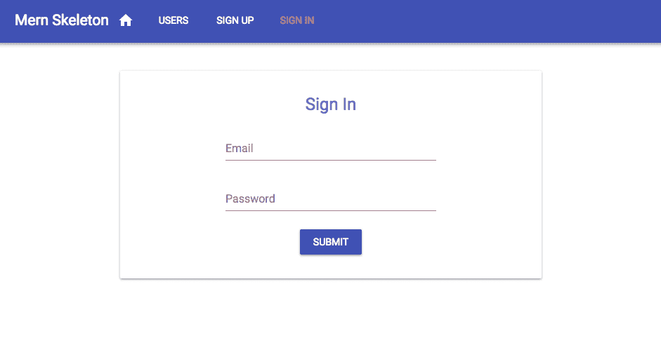
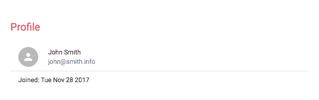
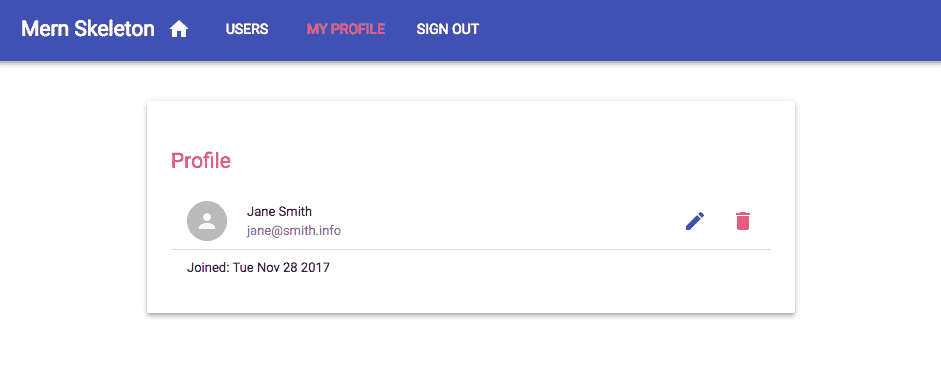
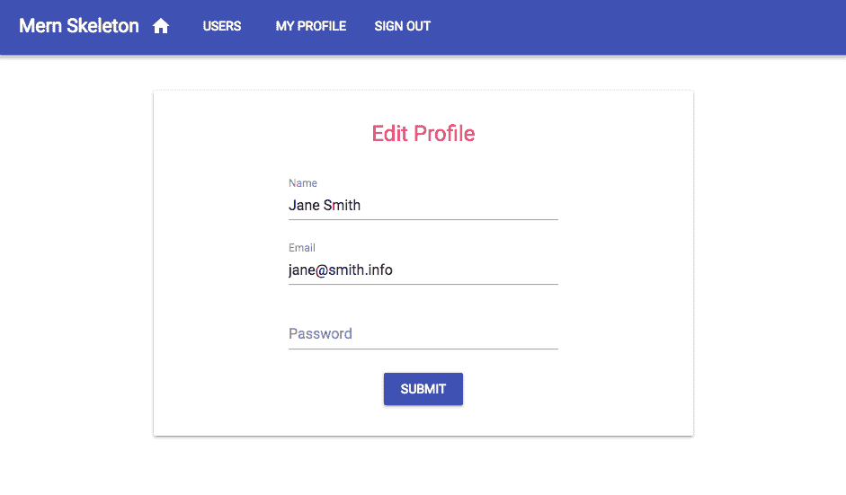
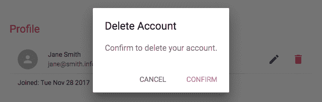

# 第四章：添加 React 前端以完成 MERN

没有前端的 Web 应用程序是不完整的。这是用户与之交互的部分，对于任何 Web 体验都至关重要。在本章中，我们将使用 React 为我们在上一章开始构建的 MERN 骨架应用程序的后端实现的基本用户和认证功能添加交互式用户界面。

我们将涵盖以下主题，以添加一个可工作的前端并完成 MERN 骨架应用程序：

+   骨架的前端特性

+   使用 React、React Router 和 Material-UI 进行开发设置

+   后端用户 API 集成

+   认证集成

+   主页、用户、注册、登录、用户资料、编辑和删除视图

+   导航菜单

+   基本的服务器端渲染

# 骨架前端

为了完全实现在第三章的*功能拆分*部分中讨论的骨架应用程序功能，即使用 MongoDB、Express 和 Node 构建后端，我们将向基本应用程序添加以下用户界面组件：

+   主页：在根 URL 上呈现的视图，欢迎用户访问 Web 应用程序

+   用户列表页面：获取并显示数据库中所有用户列表的视图，并链接到单个用户资料

+   注册页面：一个带有用户注册表单的视图，允许新用户创建用户账户，并在成功创建后将他们重定向到登录页面

+   登录页面：带有登录表单的视图，允许现有用户登录，以便他们可以访问受保护的视图和操作

+   个人资料页面：获取并显示单个用户信息的组件，只有已登录用户才能访问，并且还包含编辑和删除选项，仅当已登录用户查看自己的个人资料时才可见

+   编辑个人资料页面：一个表单，获取用户的信息，允许他们编辑信息，并且仅当已登录用户尝试编辑自己的个人资料时才可访问

+   删除用户组件：一个选项，允许已登录用户在确认意图后删除自己的个人资料

+   菜单导航栏：列出所有可用和相关的视图的组件，还帮助指示用户在应用程序中的当前位置

以下 React 组件树图显示了我们将开发的所有 React 组件，以构建出这个基本应用程序的视图：



**MainRouter**将是根 React 组件，其中包含应用程序中的所有其他自定义 React 视图。**Home**，**Signup**，**Signin**，**Users**，**Profile**和**EditProfile**将在使用 React Router 声明的各个路由上呈现，而**Menu**组件将在所有这些视图中呈现，**DeleteUser**将成为**Profile**视图的一部分。

本章讨论的代码以及完整的骨架代码都可以在 GitHub 的存储库中找到，网址为[github.com/shamahoque/mern-skeleton](https://github.com/shamahoque/mern-skeleton)。您可以克隆此代码，并在本章的其余部分中阅读代码解释时运行应用程序。

# 文件夹和文件结构

以下文件夹结构显示了要添加到骨架中的新文件夹和文件，以完成具有 React 前端的骨架：

```jsx
| mern_skeleton/
   | -- client/
      | --- assets/
         | ---- images/
      | --- auth/
         | ---- api-auth.js
         | ---- auth-helper.js
         | ---- PrivateRoute.js
         | ---- Signin.js
      | --- core/
         | ---- Home.js
         | ---- Menu.js
      | --- user/
         | ---- api-user.js
         | ---- DeleteUser.js
         | ---- EditProfile.js
         | ---- Profile.js
         | ---- Signup.js
         | ---- Users.js
      | --- App.js
      | --- main.js
      | --- MainRouter.js
  | -- server/
      | --- devBundle.js
  | -- webpack.config.client.js
  | -- webpack.config.client.production.js
```

客户端文件夹将包含 React 组件，辅助程序和前端资产，例如图像和 CSS。除了这个文件夹和用于编译和捆绑客户端代码的 Webpack 配置之外，我们还将修改一些其他现有文件，以整合完整的骨架。

# 为 React 开发设置

在我们可以在现有的骨架代码库中开始使用 React 进行开发之前，我们首先需要添加配置来编译和捆绑前端代码，添加构建交互式界面所需的与 React 相关的依赖项，并在 MERN 开发流程中将所有这些联系在一起。

# 配置 Babel 和 Webpack

为了在开发期间编译和捆绑客户端代码并在生产环境中运行它，我们将更新 Babel 和 Webpack 的配置。

# Babel

为了编译 React，首先安装 Babel 的 React 预设模块作为开发依赖项：

```jsx
npm install babel-preset-react --save-dev
```

然后，更新`.babelrc`以包括该模块，并根据需要配置`react-hot-loader` Babel 插件。

`mern-skeleton/.babelrc`：

```jsx
{
    "presets": [
      "env",
      "stage-2",
      "react"
    ],
    "plugins": [
 "react-hot-loader/babel"
 ]
}
```

# Webpack

在使用 Babel 编译后捆绑客户端代码，并为更快的开发启用`react-hot-loader`，安装以下模块：

```jsx
npm install --save-dev webpack-dev-middleware webpack-hot-middleware file-loader
npm install --save react-hot-loader
```

然后，为了配置前端开发的 Webpack 并构建生产捆绑包，我们将添加一个`webpack.config.client.js`文件和一个`webpack.config.client.production.js`文件，其中包含与第二章中描述的相同配置代码，*准备开发环境*。

# 加载 Webpack 中间件进行开发

在开发过程中，当我们运行服务器时，Express 应用程序应加载与客户端代码设置的配置相关的 Webpack 中间件，以便集成前端和后端开发工作流程。为了实现这一点，我们将使用第二章中讨论的`devBundle.js`文件，*准备开发环境*，设置一个`compile`方法，该方法接受 Express 应用程序并配置它使用 Webpack 中间件。`server`文件夹中的`devBundle.js`将如下所示。

`mern-skeleton/server/devBundle.js`：

```jsx
import config from './../config/config'
import webpack from 'webpack'
import webpackMiddleware from 'webpack-dev-middleware'
import webpackHotMiddleware from 'webpack-hot-middleware'
import webpackConfig from './../webpack.config.client.js'

const compile = (app) => {
  if(config.env === "development"){
    const compiler = webpack(webpackConfig)
    const middleware = webpackMiddleware(compiler, {
      publicPath: webpackConfig.output.publicPath
    })
    app.use(middleware)
    app.use(webpackHotMiddleware(compiler))
  }
}

export default {
  compile
}
```

然后，通过添加以下突出显示的行，导入并调用`express.js`中的`compile`方法，仅在开发时添加。 

`mern-skeleton/server/express.js`：

```jsx
**import devBundle from './devBundle'**
const app = express()
**devBundle.compile(app)** 
```

这两行突出显示的代码仅用于开发模式，在构建生产代码时应将其注释掉。此代码将在 Express 应用程序以开发模式运行时导入中间件和 Webpack 配置，然后启动 Webpack 编译和捆绑客户端代码。捆绑后的代码将放置在`dist`文件夹中。

# 使用 Express 提供静态文件

为了确保 Express 服务器正确处理对静态文件（如 CSS 文件、图像或捆绑的客户端 JS）的请求，我们将通过在`express.js`中添加以下配置来配置它从`dist`文件夹中提供静态文件。

`mern-skeleton/server/express.js`：

```jsx
import path from 'path'
const CURRENT_WORKING_DIR = process.cwd()
app.use('/dist', express.static(path.join(CURRENT_WORKING_DIR, 'dist')))
```

# 更新模板以加载捆绑的脚本

为了在 HTML 视图中添加捆绑的前端代码，我们将更新`template.js`文件，将脚本文件从`dist`文件夹添加到`<body>`标签的末尾。

`mern-skeleton/template.js`：

```jsx
...
<body>
    <div id="root"></div>
    **<script type="text/javascript" src="/dist/bundle.js"></script>**
</body>
```

# 添加 React 依赖项

前端视图将主要使用 React 实现。此外，为了实现客户端路由，我们将使用 React Router，并且为了增强用户体验，使其看起来更加流畅，我们将使用 Material-UI。

# React

在本书中，我们将使用 React 16 来编写前端代码。要开始编写`React`组件代码，我们需要安装以下模块作为常规依赖项：

```jsx
npm install --save react react-dom
```

# React Router

React Router 提供了一组导航组件，可以在 React 应用程序的前端进行路由。为了利用声明式路由并拥有可书签的 URL 路由，我们将添加以下 React Router 模块：

```jsx
npm install --save react-router react-router-dom
```

# Material-UI

为了保持我们的 MERN 应用程序中的 UI 简洁，而不过多涉及 UI 设计和实现，我们将利用`Material-UI`库。它提供了可立即使用和可定制的`React`组件，实现了谷歌的材料设计。要开始使用 Material-UI 组件制作前端，我们需要安装以下模块：

```jsx
npm install --save material-ui@1.0.0-beta.43 material-ui-icons
```

在撰写本文时，Material-UI 的最新预发布版本是`1.0.0-beta.43`，建议安装此确切版本，以确保示例项目的代码不会中断。

将`Roboto`字体按照 Material-UI 的建议添加，并使用`Material-UI`图标，我们将在`template.js`文件的 HTML 文档的`<head>`部分中添加相关的样式链接：

```jsx
<link rel="stylesheet" href="https://fonts.googleapis.com/css?family=Roboto:100,300,400">
<link href="https://fonts.googleapis.com/icon?family=Material+Icons" rel="stylesheet">
```

随着开发配置的全部设置和必要的 React 模块添加到代码库中，我们现在可以开始实现自定义的 React 组件。

# 实现 React 视图

一个功能齐全的前端应该将 React 组件与后端 API 集成，并允许用户根据授权在应用程序中无缝导航。为了演示如何为这个 MERN 骨架实现一个功能齐全的前端视图，我们将从详细说明如何在根路由处呈现主页组件开始，然后涵盖后端 API 和用户认证集成，然后突出实现剩余视图组件的独特方面。

# 呈现主页

在根路由处实现和呈现一个工作的`Home`组件的过程也将暴露骨架中前端代码的基本结构。我们将从顶级入口组件开始，该组件包含整个 React 应用程序，并呈现链接应用程序中所有 React 组件的主路由器组件。

# 在`main.js`的入口点

客户端文件夹中的`client/main.js`文件将是渲染完整 React 应用程序的入口点。在这段代码中，我们导入将包含完整前端并将其呈现到在`template.js`中指定的 HTML 文档中的`div`元素的根或顶级 React 组件。

`mern-skeleton/client/main.js`：

```jsx
import React from 'react'
import { render } from 'react-dom'
import App from './App'

render(<App/>, document.getElementById('root'))
```

# 根 React 组件

定义应用程序前端所有组件的顶层 React 组件在`client/App.js`文件中。在这个文件中，我们配置 React 应用程序以使用定制的 Material-UI 主题渲染视图组件，启用前端路由，并确保 React Hot Loader 可以在我们开发组件时立即加载更改。

# 定制 Material-UI 主题

可以使用`MuiThemeProvider`组件轻松定制 Material-UI 主题，并通过在`createMuiTheme()`中配置自定义值来设置主题变量。

`mern-skeleton/client/App.js`：

```jsx
import {MuiThemeProvider, createMuiTheme} from 'material-ui/styles'
import {indigo, pink} from 'material-ui/colors'

const theme = createMuiTheme({
  palette: {
    primary: {
    light: '#757de8',
    main: '#3f51b5',
    dark: '#002984',
    contrastText: '#fff',
  },
  secondary: {
    light: '#ff79b0',
    main: '#ff4081',
    dark: '#c60055',
    contrastText: '#000',
  },
    openTitle: indigo['400'],
    protectedTitle: pink['400'],
    type: 'light'
  }
}) 
```

对于骨架，我们只需进行最少的定制，通过将一些颜色值设置为 UI 中使用的值。在这里生成的主题变量将传递给我们构建的所有组件，并在其中可用。

# 用 MUI 主题和 BrowserRouter 包装根组件

我们创建的自定义 React 组件将通过`MainRouter`组件中指定的前端路由进行访问。基本上，这个组件包含了为应用程序开发的所有自定义视图。在`App.js`中定义根组件时，我们使用`MuiThemeProvider`将`MainRouter`组件包装起来，以便让它可以访问 Material-UI 主题，并使用`BrowserRouter`启用 React Router 的前端路由。之前定义的自定义主题变量作为 prop 传递给`MuiThemeProvider`，使主题在所有自定义 React 组件中可用。

`mern-skeleton/client/App.js`：

```jsx
import React from 'react'
import MainRouter from './MainRouter'
import {BrowserRouter} from 'react-router-dom'

const App = () => (
  <BrowserRouter>
    <MuiThemeProvider theme={theme}>
      <MainRouter/>
    </MuiThemeProvider>
  </BrowserRouter>
)
```

# 将根组件标记为热导出

在`App.js`中的最后一行代码导出`App`组件使用`react-hot-loader`中的`hot`模块将根组件标记为`hot`。这将在开发过程中启用 React 组件的实时重新加载。

`mern-skeleton/client/App.js`：

```jsx
import { hot } from 'react-hot-loader'
...
export default hot(module)(App)
```

对于我们的 MERN 应用程序，在这一点之后，我们不需要太多更改`main.js`和`App.js`的代码，可以继续通过在`MainRouter`组件中注入新组件来构建 React 应用程序的其余部分。

# 向 MainRouter 添加主页路由

`MainRouter.js`代码将帮助根据应用程序中的路由或位置渲染我们的自定义 React 组件。在这个第一个版本中，我们只会添加根路由来渲染`Home`组件。

`mern-skeleton/client/MainRouter.js`：

```jsx
import React, {Component} from 'react'
import {Route, Switch} from 'react-router-dom'
import Home from './core/Home'
class MainRouter extends Component {
  render() {
    return (<div>
      <Switch>
        <Route exact path="/" component={Home}/>
      </Switch>
    </div>)
  }
}
export default MainRouter
```

随着我们开发更多的视图组件，我们将更新`MainRouter`以在`Switch`组件中为新组件添加路由。

React Router 中的`Switch`组件专门用于呈现路由。换句话说，它只呈现与请求的路由路径匹配的第一个子组件。而不在`Switch`中嵌套时，每个`Route`组件在路径匹配时都会进行包容性渲染。例如，对`'/'`的请求也会匹配`'/contact'`的路由。

# Home 组件

当用户访问根路由时，`Home`组件将在浏览器上呈现，并且我们将使用 Material-UI 组件来组合它。以下屏幕截图显示了`Home`组件和稍后在本章中作为独立组件实现的`Menu`组件，以提供应用程序中的导航：



`Home`组件和其他视图组件将按照通用的代码结构在浏览器中呈现给用户进行交互，该结构包含以下部分，按照给定的顺序。

# 导入

组件文件将从 React、Material-UI、React Router 模块、图像、CSS、API fetch 和我们代码中的 auth helpers 中导入所需的特定组件。例如，在`Home.js`中的`Home`组件代码中，我们使用以下导入。

`mern-skeleton/client/core/Home.js`:

```jsx
import React, {Component} from 'react'
import PropTypes from 'prop-types'
import {withStyles} from 'material-ui/styles'
import Card, {CardContent, CardMedia} from 'material-ui/Card'
import Typography from 'material-ui/Typography'
import seashellImg from './../assets/images/seashell.jpg'
```

图像文件保存在`client/assets/images/`文件夹中，并被导入/添加到`Home`组件中。

# 样式声明

在导入之后，我们将根据需要使用`Material-UI`主题变量来定义 CSS 样式，以便对组件中的元素进行样式设置。对于`Home.js`中的`Home`组件，我们有以下样式。

`mern-skeleton/client/core/Home.js`:

```jsx
const styles = theme => ({
  card: {
    maxWidth: 600,
    margin: 'auto',
    marginTop: theme.spacing.unit * 5
  },
  title: {
    padding:`${theme.spacing.unit * 3}px ${theme.spacing.unit * 2.5}px 
    ${theme.spacing.unit * 2}px`,
    color: theme.palette.text.secondary
  },
  media: {
    minHeight: 330
  }
}) 
```

在这里定义的 JSS 样式对象将被注入到组件中，并用于对组件中的元素进行样式设置，就像下面的`Home`组件定义中所示。

Material-UI 使用 JSS，这是一种 CSS-in-JS 的样式解决方案，用于向组件添加样式。JSS 使用 JavaScript 作为描述样式的语言。本书不会详细介绍 CSS 和样式实现，而是更多地依赖于 Material-UI 组件的默认外观和感觉。要了解更多关于 JSS 的信息，请访问[`cssinjs.org/?v=v9.8.1`](http://cssinjs.org/?v=v9.8.1)。要了解如何自定义`Material-UI`组件样式的示例，请查看 Material-UI 文档[`material-ui-next.com/`](https://material-ui-next.com/)。 

# 组件定义

在组件定义中，我们将组合组件的内容和行为。`Home`组件将包含一个 Material-UI 的`Card`，其中包括一个标题、一个图像和一个标题，所有这些都使用之前定义的类进行样式设置，并作为 props 传递进来。

`mern-skeleton/client/core/Home.js`：

```jsx
class Home extends Component {
  render() {
    const {classes} = this.props 
    return (
      <div>
        <Card className={classes.card}>
          <Typography type="headline" component="h2" className=
          {classes.title}>
            Home Page
          </Typography>
          <CardMedia className={classes.media} image={seashellImg} 
          title="Unicorn Shells"/>
          <CardContent>
            <Typography type="body1" component="p">
              Welcome to the Mern Skeleton home page
            </Typography>
          </CardContent>
        </Card>
      </div>
    )
  }
}
```

# PropTypes 验证

为了验证将样式声明作为 props 注入到组件中的要求，我们向已定义的组件添加了`PropTypes`要求验证器。

`mern-skeleton/client/core/Home.js`：

```jsx
Home.propTypes = {
  classes: PropTypes.object.isRequired
}
```

# 导出组件

最后，在组件文件的最后一行代码中，我们将使用`Material-UI`中的`withStyles`导出组件并传递定义的样式。像这样使用`withStyles`创建了一个具有对定义样式对象的访问权限的**Higher-order component** (**HOC**)。

`mern-skeleton/client/core/Home.js`：

```jsx
export default withStyles(styles)(Home)
```

导出的组件现在可以在其他组件中进行组合使用，就像我们在之前讨论的`MainRouter`组件中的路由中使用`Home`组件一样。

在我们的 MERN 应用程序中要实现的其他视图组件将遵循相同的结构。在本书的其余部分，我们将主要关注组件定义，突出已实现组件的独特方面。

# 捆绑图像资源

我们导入到`Home`组件视图中的静态图像文件也必须与编译后的 JS 代码一起包含在捆绑包中，以便代码可以访问和加载它。为了实现这一点，我们需要更新 Webpack 配置文件，添加一个模块规则来加载、捆绑和发射图像文件到输出目录中，该目录包含编译后的前端和后端代码。

更新`webpack.config.client.js`，`webpack.config.server.js`和`webpack.config.client.production.js`文件，在使用`babel-loader`后添加以下模块规则：

```jsx
[ …
    {
       test: /\.(ttf|eot|svg|gif|jpg|png)(\?[\s\S]+)?$/,
       use: 'file-loader'
    }
]
```

这个模块规则使用 Webpack 的`file-loader` npm 模块，需要安装为开发依赖，如下所示：

```jsx
npm install --save-dev file-loader
```

# 运行并在浏览器中打开

到目前为止，客户端代码可以运行，以在根 URL 的浏览器中查看`Home`组件。要运行应用程序，请使用以下命令：

```jsx
npm run development
```

然后，在浏览器中打开根 URL（`http://localhost:3000`）以查看`Home`组件。

这里开发的`Home`组件是一个基本的视图组件，没有交互功能，不需要使用后端 API 来进行用户 CRUD 或身份验证。然而，我们骨架前端的其余视图组件将需要后端 API 和身份验证。

# 后端 API 集成

用户应该能够使用前端视图根据身份验证和授权从数据库中获取和修改用户数据。为了实现这些功能，React 组件将使用 Fetch API 访问后端暴露的 API 端点。

Fetch API 是一个较新的标准，用于发出类似于**XMLHttpRequest**（**XHR**）的网络请求，但使用 promise，从而实现了更简单和更清晰的 API。要了解有关 Fetch API 的更多信息，请访问[`developer.mozilla.org/en-US/docs/Web/API/Fetch_API`](https://developer.mozilla.org/en-US/docs/Web/API/Fetch_API)。

# 用户 CRUD 的获取

在`client/user/api-user.js`文件中，我们将添加用于访问每个用户 CRUD API 端点的方法，React 组件可以使用这些方法与服务器和数据库交换用户数据。

# 创建用户

`create`方法将从视图组件获取用户数据，使用`fetch`进行`POST`调用，在后端创建一个新用户，最后将来自服务器的响应作为一个 promise 返回给组件。

`mern-skeleton/client/user/api-user.js`：

```jsx
const create = (user) => {
  return fetch('/api/users/', {
      method: 'POST',
      headers: {
        'Accept': 'application/json',
        'Content-Type': 'application/json'
      },
      body: JSON.stringify(user)
    })
    .then((response) => {
      return response.json()
    }).catch((err) => console.log(err))
}
```

# 列出用户

`list`方法将使用 fetch 进行`GET`调用，以检索数据库中的所有用户，然后将来自服务器的响应作为 promise 返回给组件。

`mern-skeleton/client/user/api-user.js`：

```jsx
const list = () => {
  return fetch('/api/users/', {
    method: 'GET',
  }).then(response => {
    return response.json()
  }).catch((err) => console.log(err))
}
```

# 读取用户配置文件

`read`方法将使用 fetch 进行`GET`调用，按 ID 检索特定用户。由于这是一个受保护的路由，除了将用户 ID 作为参数传递之外，请求组件还必须提供有效的凭据，这种情况下将是成功登录后收到的有效 JWT。

`mern-skeleton/client/user/api-user.js`：

```jsx
const read = (params, credentials) => {
  return fetch('/api/users/' + params.userId, {
    method: 'GET',
    headers: {
      'Accept': 'application/json',
      'Content-Type': 'application/json',
      'Authorization': 'Bearer ' + credentials.t
    }
  }).then((response) => {
    return response.json()
  }).catch((err) => console.log(err))
}
```

JWT 附加到`GET` fetch 调用中的`Authorization`标头，使用`Bearer`方案，然后将来自服务器的响应作为 promise 返回给组件。

# 更新用户数据

`update`方法将从视图组件获取特定用户的更改用户数据，然后使用`fetch`进行`PUT`调用，更新后端现有用户。这也是一个受保护的路由，需要有效的 JWT 作为凭据。

`mern-skeleton/client/user/api-user.js`：

```jsx
const update = (params, credentials, user) => {
  return fetch('/api/users/' + params.userId, {
    method: 'PUT',
    headers: {
      'Accept': 'application/json',
      'Content-Type': 'application/json',
      'Authorization': 'Bearer ' + credentials.t
    },
    body: JSON.stringify(user)
  }).then((response) => {
    return response.json()
  }).catch((err) => {
    console.log(err)
  })
}
```

# 删除用户

`remove`方法将允许视图组件使用 fetch 来删除数据库中的特定用户，发出`DELETE`调用。同样，这是一个受保护的路由，将需要有效的 JWT 作为凭据，类似于`read`和`update`方法。服务器对删除请求的响应将以 promise 的形式返回给组件。

`mern-skeleton/client/user/api-user.js`：

```jsx
const remove = (params, credentials) => {
  return fetch('/api/users/' + params.userId, {
    method: 'DELETE',
    headers: {
      'Accept': 'application/json',
      'Content-Type': 'application/json',
      'Authorization': 'Bearer ' + credentials.t
    }
  }).then((response) => {
    return response.json()
  }).catch((err) => {
    console.log(err)
  }) 
}
```

最后，将用户 API 辅助方法导出，以便根据需要被导入和使用 React 组件。

`mern-skeleton/client/user/api-user.js`：

```jsx
export { create, list, read, update, remove }
```

# 用于认证 API 的 fetch

为了将服务器的认证 API 端点与前端 React 组件集成，我们将在`client/auth/api-auth.js`文件中添加用于获取登录和登出 API 端点的方法。

# 登录

`signin`方法将从视图组件获取用户登录数据，然后使用`fetch`发出`POST`调用来验证后端的用户。服务器的响应将以 promise 的形式返回给组件，其中可能包含 JWT 如果登录成功的话。

`mern-skeleton/client/user/api-auth.js`：

```jsx
const signin = (user) => {
  return fetch('/auth/signin/', {
      method: 'POST',
      headers: {
        'Accept': 'application/json',
        'Content-Type': 'application/json'
      },
      credentials: 'include',
      body: JSON.stringify(user)
    })
    .then((response) => {
      return response.json()
    }).catch((err) => console.log(err))
}
```

# 登出

`signout`方法将使用 fetch 来向服务器的 signout API 端点发出 GET 调用。

`mern-skeleton/client/user/api-auth.js`：

```jsx
const signout = () => {
  return fetch('/auth/signout/', {
    method: 'GET',
  }).then(response => {
      return response.json()
  }).catch((err) => console.log(err))
}
```

在`api-auth.js`文件的末尾，导出`signin`和`signout`方法。

`mern-skeleton/client/user/api-auth.js`：

```jsx
export { signin, signout }
```

有了这些 API fetch 方法，React 前端可以完全访问后端可用的端点。

# 前端的认证

如前一章所讨论的，使用 JWT 实现认证将责任转移到客户端来管理和存储用户认证状态。为此，我们需要编写代码，允许客户端存储从服务器成功登录时收到的 JWT，在访问受保护的路由时使其可用，当用户退出时删除或使令牌无效，并且还根据用户认证状态限制前端的视图和组件访问。

使用 React Router 文档中的认证工作流示例，我们将编写辅助方法来管理组件之间的认证状态，并且还将使用自定义的`PrivateRoute`组件来向前端添加受保护的路由。

# 管理认证状态

在`client/auth/auth-helper.js`中，我们将定义以下辅助方法来从客户端`sessionStorage`中存储和检索 JWT 凭据，并在用户退出时清除`sessionStorage`：

+   `authenticate(jwt, cb)`: 在成功登录时保存凭据：

```jsx
authenticate(jwt, cb) {
    if(typeof window !== "undefined")
        sessionStorage.setItem('jwt', JSON.stringify(jwt))
    cb()
}
```

+   `isAuthenticated()`: 如果已登录，则检索凭据：

```jsx
isAuthenticated() {
    if (typeof window == "undefined")
      return false

    if (sessionStorage.getItem('jwt'))
      return JSON.parse(sessionStorage.getItem('jwt'))
    else
      return false
}
```

+   `signout(cb)`: 删除凭据并退出登录：

```jsx
signout(cb) {
      if(typeof window !== "undefined")
        sessionStorage.removeItem('jwt')
      cb()
      signout().then((data) => {
          document.cookie = "t=; expires=Thu, 01 Jan 1970 00:00:00 
          UTC; path=/;"
      })
}
```

使用这里定义的方法，我们构建的 React 组件将能够检查和管理用户认证状态，以限制前端的访问，就像在自定义的`PrivateRoute`中所示的那样。

# PrivateRoute 组件

`client/auth/PrivateRoute.js`中定义了`PrivateRoute`组件，如 React Router 文档中的认证流程示例所示。它将允许我们声明受保护的路由，以便前端根据用户认证限制视图访问。

`mern-skeleton/client/auth/PrivateRoute.js`:

```jsx
import React, { Component } from 'react'
import { Route, Redirect } from 'react-router-dom'
import auth from './auth-helper'

const PrivateRoute = ({ component: Component, ...rest }) => (
  <Route {...rest} render={props => (
    auth.isAuthenticated() ? (
      <Component {...props}/>
    ) : (
      <Redirect to={{
        pathname: '/signin',
        state: { from: props.location }
      }}/>
    )
  )}/>
)

export default PrivateRoute
```

在`PrivateRoute`中呈现的组件只有在用户经过认证时才会加载，否则用户将被重定向到`Signin`组件。

随着后端 API 的集成，和认证管理辅助方法在组件中准备就绪，我们可以开始构建剩余的视图组件。

# 用户和认证组件

本节中描述的 React 组件完成了骨架定义的交互功能，允许用户查看、创建和修改存储在数据库中的用户数据，同时考虑认证限制。对于以下每个组件，我们将介绍每个组件的独特方面，以及如何将组件添加到应用程序中的`MainRouter`中。

# Users 组件

`client/user/Users.js`中的`Users`组件显示了从数据库中获取的所有用户的名称，并将每个名称链接到用户配置文件。任何访问应用程序的访问者都可以查看此组件，并且将在路径`'/users'`上呈现：



在组件定义中，我们首先使用空数组初始化状态。

`mern-skeleton/client/user/Users.js`:

```jsx
class Users extends Component {
  state = { users: [] }
...
```

接下来，在`componentDidMount`中，我们使用`api-user.js`中的`list`方法，从后端获取用户列表，并通过更新状态将用户数据加载到组件中。

`mern-skeleton/client/user/Users.js`:

```jsx
  componentDidMount = () => {
    list().then((data) => {
      if (data.error)
        console.log(data.error)
      else
        this.setState({users: data})
    })
  }
```

`render`函数包含`Users`组件的实际视图内容，并与 Material-UI 组件（如`Paper`、`List`和`ListItems`）组合在一起。这些元素使用定义的 CSS 进行样式化，并作为 props 传递。

`mern-skeleton/client/user/Users.js`：

```jsx
render() {
    const {classes} = this.props
    return (
      <Paper className={classes.root} elevation={4}>
        <Typography type="title" className={classes.title}>
          All Users
        </Typography>
        <List dense>
          {this.state.users.map(function(item, i) {
              return <Link to={"/user/" + item._id} key={i}>
                <ListItem button="button">
                  <ListItemAvatar>
                    <Avatar>
                      <Person/>
                    </Avatar>
                  </ListItemAvatar>
                  <ListItemText primary={item.name}/>
                  <ListItemSecondaryAction>
                    <IconButton>
                      <ArrowForward/>
                    </IconButton>
                  </ListItemSecondaryAction>
                </ListItem>
              </Link>
            })}
        </List>
      </Paper>
    )
  }
```

为了生成每个列表项，我们使用 map 函数遍历状态中的用户数组。

要将此`Users`组件添加到 React 应用程序中，我们需要使用`Route`更新`MainRouter`组件，在`'/users'`路径处呈现此组件。在`Home`路由之后，在`Switch`组件内添加`Route`。

`mern-skeleton/client/MainRouter.js`：

```jsx
<Route path="/users" component={Users}/>
```

要在浏览器中看到此视图呈现，可以暂时在`Home`组件中添加一个`Link`组件，以路由到`Users`组件：

```jsx
<Link to="/users">Users</Link>
```

# 注册组件

`client/user/Signup.js`中的`Signup`组件向用户呈现一个带有名称、电子邮件和密码字段的表单，用于在`'/signup'`路径上注册。



在组件定义中，我们首先使用空输入字段值，空错误消息和将对话框打开变量设置为 false 来初始化状态。

`mern-skeleton/client/user/Signup.js`：

```jsx
  constructor() {
    state = { name: '', password: '', email: '', open: false, error: '' }
  ...
```

我们还定义了两个处理函数，当输入值更改或单击提交按钮时将被调用。`handleChange`函数获取输入字段中输入的新值，并将其设置为`state`。

`mern-skeleton/client/user/Signup.js`：

```jsx
handleChange = name => event => {
    this.setState({[name]: event.target.value})
}
```

当表单提交时，将调用`clickSubmit`函数。它从状态中获取输入值，并调用`create`获取方法来注册用户。然后，根据服务器的响应，要么显示错误消息，要么显示成功对话框。

`mern-skeleton/client/user/Signup.js`：

```jsx
  clickSubmit = () => {
    const user = {
      name: this.state.name || undefined,
      email: this.state.email || undefined,
      password: this.state.password || undefined
    } 
    create(user).then((data) => {
      if (data.error)
        this.setState({error: data.error})
      else
        this.setState({error: '', open: true})
    })
  }
```

在`render`函数中，我们使用诸如来自 Material-UI 的`TextField`等组件来组成和样式化注册视图中的表单组件。

`mern-skeleton/client/user/Signup.js`：

```jsx
  render() {
    const {classes} = this.props
    return (<div>
      <Card className={classes.card}>
        <CardContent>
          <Typography type="headline" component="h2" 
                      className={classes.title}>
            Sign Up
          </Typography>
          <TextField id="name" label="Name" 
          className={classes.textField} 
                     value={this.state.name} 
                     onChange={this.handleChange('name')} 
                     margin="normal"/> <br/>
          <TextField id="email" type="email" label="Email" 
                     className={classes.textField} value=
                     {this.state.email} 
                     onChange={this.handleChange('email')}
                     margin="normal"/><br/>
          <TextField id="password" type="password"
          label="Password" className={classes.textField} 
                     value={this.state.password} 
                     onChange={this.handleChange('password')} 
                     margin="normal"/><br/> 
          {this.state.error && ( <Typography component="p" 
           color="error">
              <Icon color="error" 
              className={classes.error}>error</Icon>
              {this.state.error}</Typography>)}
        </CardContent>
        <CardActions>
          <Button color="primary" raised="raised"
                  onClick={this.clickSubmit} 
           className={classes.submit}>Submit</Button>
        </CardActions>
      </Card>
      <Dialog> ... </Dialog>
    </div>)
  }
```

渲染还包含一个错误消息块，以及一个`Dialog`组件，根据服务器的注册响应条件渲染。`Signup.js`中的`Dialog`组件组成如下。

`mern-skeleton/client/user/Signup.js`：

```jsx
<Dialog open={this.state.open} disableBackdropClick={true}>
   <DialogTitle>New Account</DialogTitle>
   <DialogContent>
      <DialogContentText>
         New account successfully created.
      </DialogContentText>
   </DialogContent>
   <DialogActions>
      <Link to="/signin">
         <Button color="primary" autoFocus="autoFocus" variant="raised">
            Sign In
```

```jsx
         </Button>
      </Link>
   </DialogActions>
</Dialog>
```

成功创建帐户后，用户将收到确认，并被要求使用此`Dialog`组件登录，该组件链接到`Signin`组件：



要将`Signup`组件添加到应用程序中，在`Switch`组件中添加以下`Route`到`MainRouter`中。

`mern-skeleton/client/MainRouter.js`：

```jsx
<Route path="/signup" component={Signup}/>
```

这将在`'/signup'`处呈现`Signup`视图。

# 登录组件

`client/auth/Signin.js`中的`Signin`组件也是一个只有电子邮件和密码字段的登录表单。该组件与`Signup`组件非常相似，并将在`'/signin'`路径下呈现。主要区别在于成功登录后重定向和接收 JWT 的存储实现：



对于重定向，我们将使用 React Router 中的`Redirect`组件。首先，在状态中将`redirectToReferrer`值初始化为`false`，并与其他字段一起使用：

`mern-skeleton/client/auth/Signin.js`：

```jsx
class Signin extends Component {
  state = { email: '', password: '', error: '', redirectToReferrer: false } 
...
```

当用户成功提交表单并且接收到 JWT 存储在`sessionStorage`中时，`redirectToReferrer`应设置为`true`。为了存储 JWT 并在之后重定向，我们将调用`auth-helper.js`中定义的`authenticate()`方法。这段代码将放在`clickSubmit()`函数中，在表单提交时调用。

`mern-skeleton/client/auth/Signin.js`：

```jsx
clickSubmit = () => {
    const user = {
      email: this.state.email || undefined,
      password: this.state.password || undefined
    }
    signin(user).then((data) => {
      if (data.error) {
        this.setState({error: data.error})
      } else {
        auth.authenticate(data, () => {
 this.setState({redirectToReferrer: true})
 })
      }
    })
}
```

基于`redirectToReferrer`值的条件，重定向将在`render`函数中的`Redirect`组件中发生。在返回之前，在 render 函数中添加重定向代码如下：

`mern-skeleton/client/auth/Signin.js`：

```jsx
render() {
    const {classes} = this.props
    const {from} = this.props.location.state || {
 from: {pathname: '/' }
 } 
 const {redirectToReferrer} = this.state
 if (redirectToReferrer)
 return (<Redirect to={from}/>)
    return (...)
  }
}
```

如果渲染`Redirect`组件，将会将应用程序带到上次的位置或根目录下的`Home`组件。

返回将包含类似于`Signup`的表单元素，只有`email`和`password`字段，条件错误消息和`submit`按钮。

要将`Signin`组件添加到应用程序中，在`Switch`组件的`MainRouter`中添加以下路由。

`mern-skeleton/client/MainRouter.js`：

```jsx
<Route path="/signin" component={Signin}/>
```

这将在`"/signin"`处呈现`Signin`组件。

# Profile 组件

`client/user/Profile.js`中的`Profile`组件在`'/user/:userId'`路径中显示单个用户的信息，其中`userId`参数表示特定用户的 ID：



只有在用户登录后，才能从服务器获取此配置文件信息，并且为了验证这一点，组件必须向`read`获取调用提供 JWT，否则用户应该被重定向到登录视图。

在`Profile`组件定义中，我们首先需要用空用户初始化状态，并将`redirectToSignin`设置为`false`。

`mern-skeleton/client/user/Profile.js`：

```jsx
class Profile extends Component {
  constructor({match}) {
    super()
    this.state = { user: '', redirectToSignin: false }
    this.match = match 
  } ...
```

我们还需要访问由`Route`组件传递的匹配 props，其中将包含`:userId`参数值，并且在组件挂载时可以作为`this.match.params.userId`进行访问。

`Profile`组件应在路由中的`userId`参数更改时获取用户信息并呈现它。然而，当应用程序从一个配置文件视图切换到另一个配置文件视图时，只是路由路径中的参数更改，React 组件不会重新挂载。相反，它会在`componentWillReceiveProps`中传递新的 props。为了确保组件在路由参数更新时加载相关用户信息，我们将在`init()`函数中放置`read`获取调用，然后可以在`componentDidMount`和`componentWillReceiveProps`中调用它。

`mern-skeleton/client/user/Profile.js`：

```jsx
init = (userId) => {
    const jwt = auth.isAuthenticated()
    read({
      userId: userId
    }, {t: jwt.token}).then((data) => {
      if (data.error)
        this.setState({redirectToSignin: true})
      else
        this.setState({user: data})
    })
}
```

`init(userId)`函数接受`userId`值，并调用读取用户获取方法。由于此方法还需要凭据来授权登录用户，因此 JWT 是使用`auth-helper.js`中的`isAuthenticated`方法从`sessionStorage`中检索的。一旦服务器响应，要么更新状态与用户信息，要么将视图重定向到登录视图。

`init`函数在`componentDidMount`和`componentWillReceiveProps`中被调用，并传入相关的`userId`值作为参数，以便在组件中获取和加载正确的用户信息。

`mern-skeleton/client/user/Profile.js`：

```jsx
componentDidMount = () => {
  this.init(this.match.params.userId)
}
componentWillReceiveProps = (props) => {
  this.init(props.match.params.userId)
}
```

在`render`函数中，我们设置了条件重定向到登录视图，并返回`Profile`视图的内容：

`mern-skeleton/client/user/Profile.js`：

```jsx
render() {
   const {classes} = this.props
   const redirectToSignin = this.state.redirectToSignin
   if (redirectToSignin)
     return <Redirect to='/signin'/>
   return (...)
 }
```

如果当前登录的用户正在查看另一个用户的配置文件，则`render`函数将返回`Profile`视图，并包含以下元素。

`mern-skeleton/client/user/Profile.js`：

```jsx
<div>
  <Paper className={classes.root} elevation={4}>
    <Typography type="title" className={classes.title}> Profile </Typography>
      <List dense>
        <ListItem>
          <ListItemAvatar>
             <Avatar>
               <Person/>
             </Avatar>
          </ListItemAvatar>
          <ListItemText primary={this.state.user.name} 
                       secondary={this.state.user.email}/>
        </ListItem>
        <Divider/>
        <ListItem>
          <ListItemText primary={"Joined: " + 
              (new Date(this.state.user.created)).toDateString()}/>
        </ListItem>
      </List>
  </Paper>
</div>
```

但是，如果当前登录的用户正在查看自己的配置文件，则可以在`Profile`组件中看到编辑和删除选项，如下截图所示：



要实现此功能，在`Profile`中的第一个`ListItem`组件中添加一个包含`Edit`按钮和`DeleteUser`组件的`ListItemSecondaryAction`组件，根据当前用户是否查看自己的配置文件来有条件地呈现。

`mern-skeleton/client/user/Profile.js`：

```jsx
{ auth.isAuthenticated().user && auth.isAuthenticated().user._id == this.state.user._id &&
    (<ListItemSecondaryAction>
       <Link to={"/user/edit/" + this.state.user._id}>
         <IconButton color="primary">
           <Edit/>
         </IconButton>
       </Link>
       <DeleteUser userId={this.state.user._id}/>
    </ListItemSecondaryAction>)}
```

`Edit`按钮将路由到`EditProfile`组件，此处使用的自定义`DeleteUser`组件将处理传递给它的`userId`的删除操作。

要将`Profile`组件添加到应用程序中，请将`Route`添加到`Switch`组件中的`MainRouter`中。

`mern-skeleton/client/MainRouter.js`：

```jsx
<Route path="/user/:userId" component={Profile}/>
```

# EditProfile 组件

`client/user/EditProfile.js`中的`EditProfile`组件在实现上与`Signup`和`Profile`组件都有相似之处。它将允许授权用户在类似注册表单的表单中编辑自己的个人资料信息：



在`'/user/edit/:userId'`加载时，组件将通过验证 JWT 以获取 ID 的用户信息，然后使用接收到的用户信息加载表单。表单将允许用户仅编辑和提交更改的信息到`update` fetch 调用，并在成功更新后将用户重定向到具有更新信息的`Profile`视图。

`EditProfile`将以与`Profile`组件相同的方式加载用户信息，通过在`componentDidMount`中使用`read`从`this.match.params`获取`userId`参数，并使用`auth.isAuthenticated`的凭据。表单视图将具有与`Signup`组件相同的元素，输入值在更改时更新状态。

在表单提交时，组件将使用`userId`、JWT 和更新后的用户数据调用`update` fetch 方法。

`mern-skeleton/client/user/EditProfile.js`：

```jsx
clickSubmit = () => {
    const jwt = auth.isAuthenticated()
    const user = {
      name: this.state.name || undefined,
      email: this.state.email || undefined,
      password: this.state.password || undefined
    }
    update({
      userId: this.match.params.userId
    }, {
      t: jwt.token
    }, user).then((data) => {
      if (data.error) {
        this.setState({error: data.error})
      } else {
        this.setState({'userId': data._id, 'redirectToProfile': true})
      }
    })
}
```

根据服务器的响应，用户将要么看到错误消息，要么在渲染函数中使用以下`Redirect`组件重定向到更新后的 Profile 页面。

`mern-skeleton/client/user/EditProfile.js`：

```jsx
if (this.state.redirectToProfile)
   return (<Redirect to={'/user/' + this.state.userId}/>)
```

要将`EditProfile`组件添加到应用程序中，这次我们将使用`PrivateRoute`，以限制用户未登录时根本不加载组件。在`MainRouter`中的放置顺序也很重要。

`mern-skeleton/client/MainRouter.js`：

```jsx
<Switch>
  ... <PrivateRoute path="/user/edit/:userId" component={EditProfile}/><>
  <Route path="/user/:userId" component={Profile}/>
</Switch>
```

具有路径`'/user/edit/:userId'`的路由需要放置在具有路径`'/user/:userId'`的路由之前，以便在请求此路由时，编辑路径首先在 Switch 组件中独占匹配，不会与`Profile`路由混淆。

# DeleteUser 组件

`client/user/DeleteUser.js`中的`DeleteUser`组件基本上是一个按钮，我们将其添加到 Profile 视图中，当点击时会打开一个要求用户确认`delete`操作的`Dialog`组件：



该组件首先使用`open`设置为`false`来初始化`Dialog`组件的状态，并且还将`redirect`设置为`false`，因此首先不会被渲染。

`mern-skeleton/client/user/DeleteUser.js`：

```jsx
class DeleteUser extends Component {
  state = { redirect: false, open: false } 
...
```

接下来，我们需要处理打开和关闭`dialog`按钮的方法。当用户点击`delete`按钮时，对话框将被打开。

`mern-skeleton/client/user/DeleteUser.js`：

```jsx
clickButton = () => {
    this.setState({open: true})
}
```

当用户在对话框上点击`cancel`时，对话框将被关闭。

`mern-skeleton/client/user/DeleteUser.js`：

```jsx
  handleRequestClose = () => {
    this.setState({open: false})
  }
```

该组件将从`Profile`组件中作为属性传递的`userId`，这是调用`remove` fetch 方法所需的，同时还需要 JWT，用户在对话框中确认`delete`操作后。

`mern-skeleton/client/user/DeleteUser.js`：

```jsx
deleteAccount = () => {
    const jwt = auth.isAuthenticated() 
    remove({
      userId: this.props.userId
    }, {t: jwt.token}).then((data) => {
      if (data.error) {
        console.log(data.error)
      } else {
        auth.signout(() => console.log('deleted'))
 this.setState({redirect: true})
      }
    }) 
  }
```

确认后，`deleteAccount`函数使用来自属性的`userId`和来自`isAuthenticated`的 JWT 调用`remove` fetch 方法。在服务器成功删除后，用户将被注销并重定向到主页视图。

渲染函数包含对主页视图的条件性`Redirect`，并返回`DeleteUser`组件元素、`DeleteIcon`按钮和确认`Dialog`：

`mern-skeleton/client/user/DeleteUser.js`：

```jsx
render() {
    const redirect = this.state.redirect
    if (redirect) {
      return <Redirect to='/'/>
    }
    return (<span>
      <IconButton aria-label="Delete" onClick={this.clickButton} 
      color="secondary">
        <DeleteIcon/>
      </IconButton>
      <Dialog open={this.state.open} onClose={this.handleRequestClose}>
        <DialogTitle>{"Delete Account"}</DialogTitle>
        <DialogContent>
          <DialogContentText>
            Confirm to delete your account.
          </DialogContentText>
        </DialogContent>
        <DialogActions>
          <Button onClick={this.handleRequestClose} color="primary">
            Cancel
          </Button>
          <Button onClick={this.deleteAccount} color="secondary" 
          autoFocus="autoFocus">
            Confirm
          </Button>
        </DialogActions>
      </Dialog>
    </span>)
}
```

`DeleteUser`将`userId`作为属性传递，用于`delete` fetch 调用，因此我们为所需的属性`userId`添加了`propType`检查。

`mern-skeleton/client/user/DeleteUser.js`：

```jsx
DeleteUser.propTypes = {
  userId: PropTypes.string.isRequired
}
```

由于我们在`Profile`组件中使用`DeleteUser`组件，所以当`Profile`添加到`MainRouter`中时，它将被添加到应用视图中。

# 菜单组件

`Menu`组件将作为整个前端应用程序的导航栏，提供到所有可用视图的链接，并指示应用程序中的当前位置。

为了实现这些导航栏功能，我们将使用 React Router 中的 HOC `withRouter`来访问历史对象的属性。`Menu`组件中的以下代码仅添加了标题、与根路由相关联的`Home`图标以及与`'/users'`路由相关联的`Users`按钮。

`mern-skeleton/client/core/Menu.js`：

```jsx
const Menu = withRouter(({history}) => (<div>
  <AppBar position="static">
    <Toolbar>
      <Typography type="title" color="inherit">
        MERN Skeleton
      </Typography>
      <Link to="/">
        <IconButton aria-label="Home" style={isActive(history, "/")}>
          <HomeIcon/>
        </IconButton>
      </Link>
      <Link to="/users">
        <Button style={isActive(history, "/users")}>Users</Button>
      </Link>
    </Toolbar>
  </AppBar>
</div>))
```

为了指示应用程序的当前位置在`Menu`上，我们将通过条件性地改变颜色来突出显示与当前位置路径匹配的链接。

`mern-skeleton/client/core/Menu.js`：

```jsx
const isActive = (history, path) => {
  if (history.location.pathname == path)
    return {color: '#ff4081'}
  else
    return {color: '#ffffff'}
}
```

`isActive`函数用于在`Menu`中为按钮应用颜色，如下所示：

```jsx
style={isActive(history, "/users")}
```

剩下的链接，如 SIGN IN、SIGN UP、MY PROFILE 和 SIGN OUT，将根据用户是否已登录显示在`Menu`上：


例如，当用户未登录时，注册和登录的链接应该只显示在菜单上。因此，我们需要在`Menu`组件中添加它，并在`Users`按钮之后加上条件。

`mern-skeleton/client/core/Menu.js`：

```jsx
{!auth.isAuthenticated() && (<span>
    <Link to="/signup">
       <Button style={isActive(history, "/signup")}> Sign Up </Button>
    </Link>
    <Link to="/signin">
       <Button style={isActive(history, "/signin")}> Sign In </Button>
    </Link>
</span>)}
```

类似地，只有当用户已登录时，`MY PROFILE`链接和`SIGN OUT`按钮才应该显示在菜单上，并且应该根据这个条件检查添加到`Menu`组件中。

`mern-skeleton/client/core/Menu.js`：

```jsx
{auth.isAuthenticated() && (<span>
   <Link to={"/user/" + auth.isAuthenticated().user._id}>
      <Button style={isActive(history, "/user/" + auth.isAuthenticated().user._id)}>
           My Profile 
      </Button>
   </Link>
   <Button color="inherit" 
           onClick={() => { auth.signout(() => history.push('/')) }}>
        Sign out
   </Button>
 </span>)}
```

`MY PROFILE`按钮使用已登录用户的信息链接到用户自己的个人资料，并且`SIGN OUT`按钮在点击时调用`auth.signout()`方法。当用户已登录时，菜单将如下所示：


为了在所有视图中显示`Menu`导航栏，我们需要在`MainRouter`中添加它，放在所有其他路由之前，并且在`Switch`组件之外。

`mern-skeleton/client/MainRouter.js`：

```jsx
 <Menu/>
    <Switch>
    …
    </Switch>
```

当在路由上访问组件时，这将使`Menu`组件呈现在所有其他组件的顶部。

骨架前端已经完整，包括所有必要的组件，以便用户可以在后端注册、查看和修改用户数据，并考虑到认证和授权限制。然而，目前还不能直接在浏览器地址栏中访问前端路由，只能在前端视图内部链接时访问。为了在骨架应用程序中实现此功能，我们需要实现基本的服务器端渲染。

# 基本的服务器端渲染

目前，当 React Router 路由或路径名直接输入到浏览器地址栏，或者刷新不在根路径的视图时，URL 无法工作。这是因为服务器无法识别 React Router 路由。我们需要在后端实现基本的服务器端渲染，以便服务器在收到对前端路由的请求时能够响应。

在服务器接收到前端路由的请求时，我们需要根据 React Router 和 Material-UI 组件在服务器端正确渲染相关的 React 组件。

React 应用程序服务器端渲染的基本思想是使用`react-dom`中的`renderToString`方法将根 React 组件转换为标记字符串，并将其附加到服务器在接收到请求时渲染的模板上。

在`express.js`中，我们将用代码替换对`'/'`的`GET`请求返回`template.js`的代码，该代码在接收到任何传入的 GET 请求时，生成相关 React 组件的服务器端渲染标记，并将此标记添加到模板中。此代码将具有以下结构：

```jsx
app.get('*', (req, res) => {
     // 1\. Prepare Material-UI styles
     // 2\. Generate markup with renderToString
     // 3\. Return template with markup and CSS styles in the response
})
```

# 用于服务器端渲染的模块

为了实现基本的服务器端渲染，我们需要将以下 React、React Router 和 Material-UI 特定模块导入到服务器代码中。在我们的代码结构中，这些模块将被导入到`server/express.js`中：

+   **React 模块**：用于渲染 React 组件和使用`renderToString`：

```jsx
import React from 'react'
import ReactDOMServer from 'react-dom/server'
```

+   **Router 模块**：`StaticRouter`是一个无状态路由器，它接受请求的 URL 以匹配前端路由和`MainRouter`组件，这是我们前端的根组件：

```jsx
import StaticRouter from 'react-router-dom/StaticRouter'
import MainRouter from './../client/MainRouter'
```

+   **Material-UI 模块**：以下模块将帮助基于前端使用的 Material-UI 主题为前端组件生成 CSS 样式：

```jsx
import { SheetsRegistry } from 'react-jss/lib/jss'
import JssProvider from 'react-jss/lib/JssProvider'
import { MuiThemeProvider, createMuiTheme, createGenerateClassName } from 'material-ui/styles'
import { indigo, pink } from 'material-ui/colors'
```

有了这些模块，我们可以准备、生成和返回服务器端渲染的前端代码。

# 为 SSR 准备 Material-UI 样式

当服务器接收到任何请求时，在响应包含 React 视图的生成标记之前，我们需要准备应该添加到标记中的 CSS 样式，以便 UI 在初始渲染时不会中断。

`mern-skeleton/server/express.js`：

```jsx
const sheetsRegistry = new SheetsRegistry()
const theme = createMuiTheme({
    palette: {
      primary: {
      light: '#757de8',
      main: '#3f51b5',
      dark: '#002984',
      contrastText: '#fff',
    },
    secondary: {
      light: '#ff79b0',
      main: '#ff4081',
      dark: '#c60055',
      contrastText: '#000',
    },
      openTitle: indigo['400'],
      protectedTitle: pink['400'],
      type: 'light'
    },
})
const generateClassName = createGenerateClassName()
```

为了注入 Material-UI 样式，在每个请求上，我们首先生成一个新的`SheetsRegistry`和 MUI 主题实例，与前端代码中使用的相匹配。

# 生成标记

使用`renderToString`的目的是生成要响应请求的用户显示的 React 组件的 HTML 字符串版本：

`mern-skeleton/server/express.js`：

```jsx
const context = {} 
const markup = ReactDOMServer.renderToString(
      <StaticRouter location={req.url} context={context}>
        <JssProvider registry={sheetsRegistry} generateClassName=
 {generateClassName}>
          <MuiThemeProvider theme={theme} sheetsManager={new Map()}>
            <MainRouter/>
          </MuiThemeProvider>
        </JssProvider>
      </StaticRouter>
) 
```

客户端应用程序的根组件`MainRouter`被 Material-UI 主题和 JSS 包裹，以提供`MainRouter`子组件所需的样式属性。在这里使用无状态的`StaticRouter`代替客户端使用的`BrowserRouter`，来包裹`MainRouter`并提供在实现客户端组件时使用的路由属性。基于这些值，例如请求的`location`路由和作为属性传递给包装组件的主题，`renderToString`将返回包含相关视图的标记。

# 发送包含标记和 CSS 的模板

一旦生成了标记，我们首先检查组件中是否有渲染的`redirect`，以便在标记中发送。如果没有重定向，那么我们从`sheetsRegistry`生成 CSS 字符串，并在响应中发送带有标记和注入的 CSS 的模板。

`mern-skeleton/server/express.js`：

```jsx
if (context.url) {
   return res.redirect(303, context.url)
}
const css = sheetsRegistry.toString()
res.status(200).send(Template({
   markup: markup,
   css: css
}))
```

在组件中渲染重定向的一个例子是尝试通过服务器端渲染访问`PrivateRoute`时。由于服务器端无法从客户端的`sessionStorage`访问 auth 令牌，`PrivateRoute`中的重定向将被渲染。在这种情况下，`context.url`将具有`'/signin'`路由，因此不会尝试渲染`PrivateRoute`组件，而是重定向到`'/signin'`路由。

# 更新 template.js

在服务器上生成的标记和 CSS 必须添加到`template.js`的 HTML 代码中，以便在服务器渲染模板时加载。

`mern-skeleton/template.js`：

```jsx
export default ({markup, css}) => {
    return `...
           <div id="root">${markup}</div>
           <style id="jss-server-side">${css}</style> 
           ...`
}
```

# 更新 MainRouter

一旦在服务器端渲染的代码到达浏览器，并且前端脚本接管后，我们需要在主组件挂载时移除服务器端注入的 CSS。这将完全控制 React 应用程序的渲染权力交给客户端：

`mern-skeleton/client/MainRouter.js`：

```jsx
componentDidMount() {
   const jssStyles = document.getElementById('jss-server-side')
   if (jssStyles && jssStyles.parentNode)
      jssStyles.parentNode.removeChild(jssStyles)
}
```

# 用 hydrate 代替 render

现在 React 组件将在服务器端渲染，我们可以更新`main.js`代码，使用`ReactDOM.hydrate()`代替`ReactDOM.render()`：

```jsx
import React from 'react'
import { hydrate } from 'react-dom'
import App from './App'

hydrate(<App/>, document.getElementById('root'))
```

`hydrate`函数用于给已由`ReactDOMServer`渲染的 HTML 内容进行水合。这意味着服务器端渲染的标记将被保留，只有当 React 在浏览器中接管时才会附加事件处理程序，从而使初始加载性能更好。

通过实现基本的服务器端渲染，服务器现在可以正确处理浏览器地址栏对前端路由的直接请求，从而可以将 React 前端视图加入书签。

这里开发的骨架 MERN 应用程序现在是一个具有基本用户功能的完全功能的 MERN Web 应用程序。我们可以扩展这个骨架中的代码，为不同的应用程序添加各种功能。

# 总结

在本章中，我们通过添加一个工作的 React 前端完成了 MERN 骨架应用程序，包括前端路由和 React 视图的基本服务器端渲染。

我们首先更新了开发流程，以包括用于 React 视图的客户端代码捆绑。我们更新了 Webpack 和 Babel 的配置以编译 React 代码，并讨论了如何从 Express 应用程序加载配置的 Webpack 中间件，以便在开发过程中从一个地方启动服务器端和客户端代码的编译。

在更新开发流程并构建前端之前，我们添加了相关的 React 依赖项，以及用于前端路由的 React Router 和用于在骨架应用程序的用户界面中使用现有组件的 Material-UI。

然后，我们实现了顶层根 React 组件，并集成了 React Router，这使我们能够添加用于导航的客户端路由。使用这些路由，我们加载了使用 Material-UI 组件开发的自定义 React 组件，以构成骨架应用程序的用户界面。

为了使这些 React 视图能够与从后端获取的数据动态交互，我们使用 Fetch API 连接到后端用户 API。然后，我们使用`sessionStorage`存储用户特定的细节和从服务器成功登录时获取的 JWT，还通过使用`PrivateRoute`组件限制对某些视图的访问来在前端视图上实现身份验证和授权。

最后，我们修改了服务器代码，实现了基本的服务器端渲染，允许在服务器识别到传入请求实际上是针对 React 路由时，在浏览器中直接加载经服务器端渲染的标记。

在下一章中，我们将利用开发这个基本的 MERN 应用程序时学到的概念，扩展骨架应用程序的代码，构建一个功能齐全的社交媒体应用程序。
