# 第五章：从一个简单的社交媒体应用程序开始

社交媒体是当今网络的一个重要组成部分，我们构建的许多以用户为中心的网络应用程序最终都需要社交组件来推动用户参与。

对于我们的第一个真实世界 MERN 应用程序，我们将修改和扩展上一章开发的 MERN 骨架应用程序，以构建一个简单的社交媒体应用程序。

在本章中，我们将介绍以下社交媒体风格功能的实现：

+   带有描述和照片的用户个人资料

+   用户互相关注

+   关注建议

+   发布带有照片的消息

+   来自关注用户的帖子的新闻订阅

+   按用户列出帖子

+   点赞帖子

+   评论帖子

# MERN Social

MERN Social 是一个受现有社交媒体平台（如 Facebook 和 Twitter）启发的具有基本功能的社交媒体应用程序。该应用程序的主要目的是演示如何使用 MERN 堆栈技术来实现允许用户在内容上连接和互动的功能。您可以根据需要进一步扩展这些实现，以实现更复杂的功能：

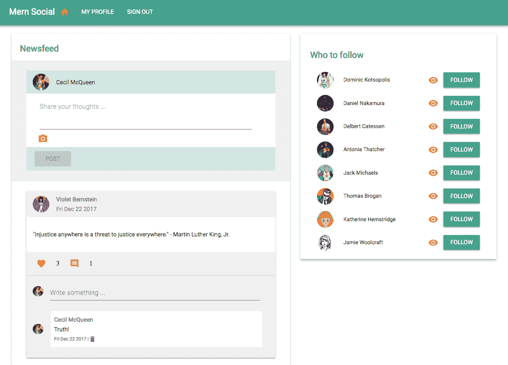完整的 MERN Social 应用程序代码可在 GitHub 的[github.com/shamahoque/mern-social](https://github.com/shamahoque/mern-social)存储库中找到。您可以在阅读本章其余部分的代码解释时，克隆此代码并运行应用程序。

MERN Social 应用程序所需的视图将通过扩展和修改 MERN 骨架应用程序中的现有 React 组件来开发。我们还将添加新的自定义组件来组成视图，包括一个新闻订阅视图，用户可以在其中创建新帖子，并浏览 MERN Social 上关注的所有人的帖子列表。以下组件树显示了构成 MERN Social 前端的所有自定义 React 组件，还公开了我们将用于构建本章其余部分视图的组合结构：

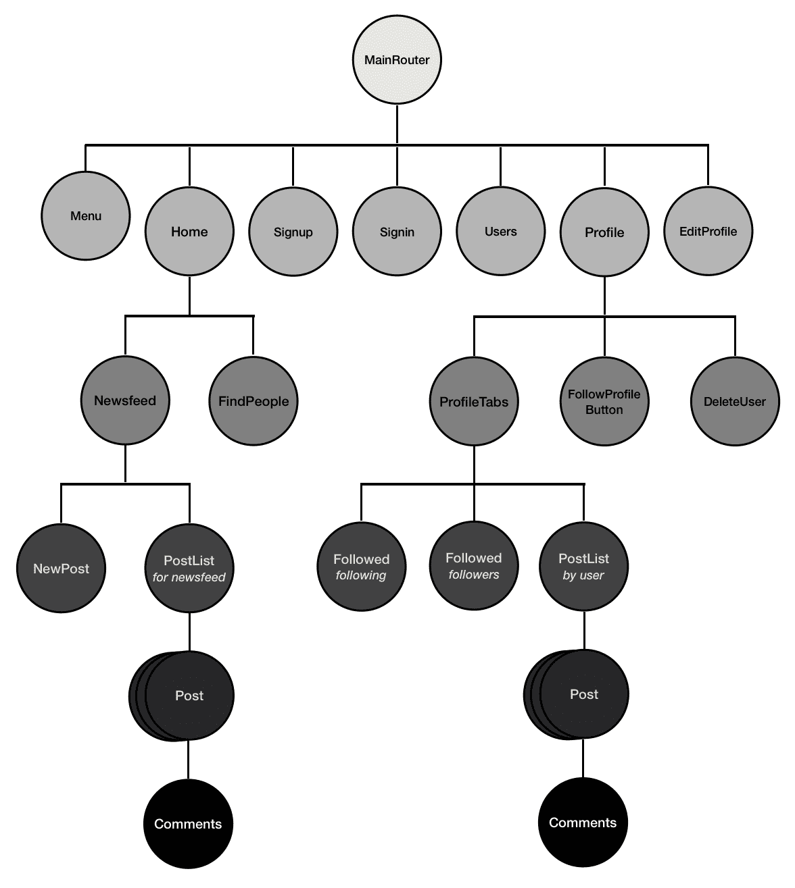

# 更新用户个人资料

骨架应用程序只支持用户的姓名、电子邮件和密码。但在 MERN Social 中，我们将允许用户在注册后编辑个人资料时添加关于自己的描述，并上传个人资料照片：


# 添加关于描述

为了存储用户在“关于”字段中输入的描述，我们需要在`server/models/user.model.js`中的用户模型中添加一个`about`字段：

```jsx
about: {
    type: String,
    trim: true
  }
```

然后，为了从用户那里获取描述作为输入，我们在`EditProfile`表单中添加一个多行的`TextField`，并且处理值的变化方式与我们为用户的名称输入所做的方式相同。

`mern-social/client/user/EditProfile.js`：

```jsx
  <TextField
      id="multiline-flexible"
      label="About"
      multiline
      rows="2"
      value={this.state.about}
      onChange={this.handleChange('about')}
   />
```

最后，为了显示添加到用户个人资料页面的“关于”字段的描述文本，我们可以将其添加到现有的个人资料视图中。

`mern-social/client/user/Profile.js`：

```jsx
<ListItem> <ListItemText primary={this.state.user.about}/> </ListItem>
```

通过对 MERN 骨架代码中用户功能的修改，用户现在可以添加和更新有关自己的描述，以便在其个人资料上显示。

# 上传个人资料照片

允许用户上传个人资料照片将需要我们存储上传的图像文件，并在请求时检索它以在视图中加载。考虑到不同的文件存储选项，有多种实现此上传功能的方法：

+   **服务器文件系统**：上传并将文件保存到服务器文件系统，并将 URL 存储到 MongoDB 中

+   **外部文件存储**：将文件保存到外部存储（如 Amazon S3），并将 URL 存储在 MongoDB 中

+   **将数据存储在 MongoDB 中**：将小型文件（小于 16 MB）保存到 MongoDB 中作为缓冲区类型的数据

对于 MERN Social，我们将假设用户上传的照片文件将是小型的，并演示如何将这些文件存储在 MongoDB 中以实现个人资料照片上传功能。在第八章中，*构建媒体流应用程序*，我们将讨论如何使用 GridFS 在 MongoDB 中存储较大的文件。

# 更新用户模型以在 MongoDB 中存储照片

为了直接将上传的个人资料照片存储在数据库中，我们将更新用户模型以添加一个`photo`字段，该字段将文件作为`Buffer`类型的`data`存储，并附带其`contentType`。

`mern-social/server/models/user.model.js`：

```jsx
photo: {
    data: Buffer,
    contentType: String
}
```

# 从编辑表单上传照片

用户将能够在编辑个人资料时从其本地文件中上传图像文件。我们将在`client/user/EditProfile.js`中更新`EditProfile`组件，添加一个上传照片选项，然后将用户选择的文件附加到提交给服务器的表单数据中。

# 使用 Material-UI 的文件输入

我们将利用 HTML5 文件输入类型，让用户从其本地文件中选择图像。当用户选择文件时，文件输入将在更改事件中返回文件名。

`mern-social/client/user/EditProfile.js`：

```jsx
<input accept="image/*" type="file"
       onChange={this.handleChange('photo')} 
       style={{display:'none'}} 
       id="icon-button-file" />
```

为了将此文件`input`与 Material-UI 组件集成，我们将`display:none`应用于隐藏`input`元素，然后在此文件输入的标签中添加一个 Material-UI 按钮。这样，视图将显示 Material-UI 按钮，而不是 HTML5 文件输入元素。

`mern-social/client/user/EditProfile.js`：

```jsx
<label htmlFor="icon-button-file">
   <Button variant="raised" color="default" component="span">
      Upload <FileUpload/>
   </Button>
</label>
```

将`Button`的组件属性设置为`span`，`Button`组件将呈现为`label`元素内的`span`元素。单击`Upload` span 或 label 将由具有与 label 相同 ID 的文件输入注册，因此将打开文件选择对话框。用户选择文件后，我们可以在调用`handleChange(...)`中将其设置为状态，并在视图中显示名称。

`mern-social/client/user/EditProfile.js`：

```jsx
<span className={classes.filename}>
    {this.state.photo ? this.state.photo.name : ''}
</span>
```

# 带有附加文件的表单提交

通过表单将文件上传到服务器需要一个多部分表单提交，与之前的实现中发送的`stringed`对象形成对比。我们将修改`EditProfile`组件，使用`FormData` API 将表单数据存储在编码类型`multipart/form-data`所需的格式中。

首先，我们需要在`componentDidMount()`中初始化`FormData`。

`mern-social/client/user/EditProfile.js`：

```jsx
this.userData = new FormData() 
```

接下来，我们将更新输入`handleChange`函数，以存储文本字段和文件输入的输入值在`FormData`中。

`mern-social/client/user/EditProfile.js`：

```jsx
handleChange = name => event => {
  const value = name === 'photo'
    ? event.target.files[0]
    : event.target.value
  this.userData.set(name, value)
  this.setState({ [name]: value })
}
```

然后在提交时，`this.userData`将与 fetch API 调用一起发送到更新用户。由于发送到服务器的数据的内容类型不再是`'application/json'`，因此我们还需要修改`api-user.js`中的`update` fetch 方法，以在`fetch`调用中从标头中删除`Content-Type`。

`mern-social/client/user/api-user.js`：

```jsx
const update = (params, credentials, user) => {
  return fetch('/api/users/' + params.userId, {
    method: 'PUT',
    headers: {
      'Accept': 'application/json',
      'Authorization': 'Bearer ' + credentials.t
    },
    body: user
  }).then((response) => {
    return response.json()
  }).catch((e) => {
    console.log(e)
  })
}
```

现在，如果用户选择在编辑配置文件时上传个人资料照片，服务器将收到附加文件的请求以及其他字段值。

在[developer.mozilla.org/en-US/docs/Web/API/FormData](https://developer.mozilla.org/en-US/docs/Web/API/FormData)上了解有关 FormData API 的更多信息。

# 处理包含文件上传的请求

在服务器上，为了处理可能包含文件的更新 API 的请求，我们将使用`formidable` npm 模块：

```jsx
npm install --save formidable
```

Formidable 将允许我们读取`multipart`表单数据，从而访问字段和文件（如果有）。如果有文件，`formidable`将在文件系统中临时存储它。我们将从文件系统中读取它，使用`fs`模块检索文件类型和数据，并将其存储到用户模型中的照片字段中。`formidable`代码将放在`user.controller.js`中的`update`控制器中。

`mern-social/server/controllers/user.controller.js`：

```jsx
import formidable from 'formidable'
import fs from 'fs'
const update = (req, res, next) => {
  let form = new formidable.IncomingForm()
  form.keepExtensions = true
  form.parse(req, (err, fields, files) => {
    if (err) {
      return res.status(400).json({
        error: "Photo could not be uploaded"
      })
    }
    let user = req.profile
    user = _.extend(user, fields)
    user.updated = Date.now()
    if(files.photo){
      user.photo.data = fs.readFileSync(files.photo.path)
      user.photo.contentType = files.photo.type
    }
    user.save((err, result) => {
      if (err) {
        return res.status(400).json({
          error: errorHandler.getErrorMessage(err)
        })
      }
      user.hashed_password = undefined
      user.salt = undefined
      res.json(user)
    })
  })
}
```

这将把上传的文件存储为数据库中的数据。接下来，我们将设置文件检索以能够在前端视图中访问和显示用户上传的照片。

# 检索个人资料照片

从数据库中检索文件并在视图中显示的最简单选项是设置一个路由，该路由将获取数据并将其作为图像文件返回给请求的客户端。

# 个人资料照片 URL

我们将为每个用户在数据库中存储的照片设置一个路由，并添加另一个路由，如果给定用户没有上传个人资料照片，则将获取默认照片。

`mern-social/server/routes/user.routes.js`：

```jsx
router.route('/api/users/photo/:userId')
  .get(userCtrl.photo, userCtrl.defaultPhoto)
router.route('/api/users/defaultphoto')
  .get(userCtrl.defaultPhoto)
```

我们将在`photo`控制器方法中查找照片，如果找到，就将其发送到照片路由的请求中作为响应，否则我们调用`next()`来返回默认照片。

`mern-social/server/controllers/user.controller.js`：

```jsx
const photo = (req, res, next) => {
  if(req.profile.photo.data){
    res.set("Content-Type", req.profile.photo.contentType)
    return res.send(req.profile.photo.data)
  }
  next()
}
```

默认照片是从服务器的文件系统中检索并发送的。

`mern-social/server/controllers/user.controller.js`：

```jsx
import profileImage from './../../client/assets/images/profile-pic.png'
const defaultPhoto = (req, res) => {
  return res.sendFile(process.cwd()+profileImage)
}
```

# 在视图中显示照片

设置照片 URL 路由以检索照片后，我们可以简单地在`img`元素的`src`属性中使用这些路由来加载视图中的照片。例如，在`Profile`组件中，我们从状态中获取用户 ID 并使用它来构建照片 URL。

`mern-social/client/user/Profile.js`：

```jsx
const photoUrl = this.state.user._id
          ? `/api/users/photo/${this.state.user._id}?${new Date().getTime()}`
          : '/api/users/defaultphoto'
```

为了确保在编辑中更新照片后`Profile`视图中的`img`元素重新加载，我们还向照片 URL 添加了一个时间值，以绕过浏览器的默认图像缓存行为。

然后，我们可以将`photoUrl`设置为 Material-UI 的`Avatar`组件，该组件在视图中呈现链接的图像：

```jsx
  <Avatar src={photoUrl}/>
```

在 MERN Social 中更新的用户个人资料现在可以显示用户上传的个人资料照片和`about`描述：

！[](assets/8e568b24-3f3c-4d32-aabb-f2eaabbeca3a.png)

# 在 MERN Social 中关注用户

在 MERN Social 中，用户将能够互相关注。每个用户将拥有一个关注者列表和一个他们关注的人的列表。用户还将能够看到他们可以关注的用户列表；换句话说，MERN Social 中他们尚未关注的用户。

# 关注和取消关注

为了跟踪哪个用户正在关注哪些其他用户，我们将不得不为每个用户维护两个列表。当一个用户关注或取消关注另一个用户时，我们将更新一个用户的`following`列表和另一个用户的`followers`列表。

# 更新用户模型

为了在数据库中存储`following`和`followers`列表，我们将使用两个用户引用数组更新用户模型。

`mern-social/server/models/user.model.js`:

```jsx
following: [{type: mongoose.Schema.ObjectId, ref: 'User'}],
followers: [{type: mongoose.Schema.ObjectId, ref: 'User'}]
```

这些引用将指向正在被关注或正在关注给定用户的集合中的用户。

# 更新`userByID`控制器方法

当从后端检索到单个用户时，我们希望`user`对象包括`following`和`followers`数组中引用的用户的名称和 ID。为了检索这些详细信息，我们需要更新`userByID`控制器方法以填充返回的用户对象。

`mern-social/server/controllers/user.controller.js`:

```jsx
const userByID = (req, res, next, id) => {
  User.findById(id)
    .populate('following', '_id name')
    .populate('followers', '_id name')
    .exec((err, user) => {
    if (err || !user) return res.status('400').json({
      error: "User not found"
    })
    req.profile = user
    next()
  })
}
```

我们使用 Mongoose 的`populate`方法来指定从查询返回的用户对象应包含`following`和`followers`列表中引用的用户的名称和 ID。这将在我们使用读取 API 调用获取用户时，给我们`followers`和`following`列表中的用户引用的名称和 ID。

# 关注和取消关注的 API

当用户从视图中关注或取消关注另一个用户时，数据库中的两个用户记录将响应`follow`或`unfollow`请求而更新。

我们将在`user.routes.js`中设置`follow`和`unfollow`路由如下。

`mern-social/server/routes/user.routes.js`:

```jsx
router.route('/api/users/follow')
  .put(authCtrl.requireSignin, userCtrl.addFollowing, userCtrl.addFollower)
router.route('/api/users/unfollow')
  .put(authCtrl.requireSignin, userCtrl.removeFollowing, userCtrl.removeFollower)
```

用户控制器中的`addFollowing`控制器方法将通过将被关注用户的引用推入数组来更新当前用户的`'following'`数组。

`mern-social/server/controllers/user.controller.js`:

```jsx
const addFollowing = (req, res, next) => {
  User.findByIdAndUpdate(req.body.userId, {$push: {following: req.body.followId}}, (err, result) => {
    if (err) {
      return res.status(400).json({
        error: errorHandler.getErrorMessage(err)
      })
    }
    next()
  })
}
```

在`following`数组成功更新后，将执行`addFollower`方法，将当前用户的引用添加到被关注用户的`'followers'`数组中。

`mern-social/server/controllers/user.controller.js`:

```jsx
const addFollower = (req, res) => {
  User.findByIdAndUpdate(req.body.followId, {$push: {followers: req.body.userId}}, {new: true})
  .populate('following', '_id name')
  .populate('followers', '_id name')
  .exec((err, result) => {
    if (err) {
      return res.status(400).json({
        error: errorHandler.getErrorMessage(err)
      })
    }
    result.hashed_password = undefined
    result.salt = undefined
    res.json(result)
  })
}
```

对于取消关注，实现方式类似。`removeFollowing`和`removeFollower`控制器方法通过使用`$pull`而不是`$push`从相应的`'following'`和`'followers'`数组中删除用户引用。

`mern-social/server/controllers/user.controller.js`:

```jsx
const removeFollowing = (req, res, next) => {
  User.findByIdAndUpdate(req.body.userId, {$pull: {following: req.body.unfollowId}}, (err, result) => {
    if (err) {
      return res.status(400).json({
        error: errorHandler.getErrorMessage(err)
      })
    }
    next()
  })
}
const removeFollower = (req, res) => {
  User.findByIdAndUpdate(req.body.unfollowId, {$pull: {followers: req.body.userId}}, {new: true})
  .populate('following', '_id name')
  .populate('followers', '_id name')
  .exec((err, result) => {
    if (err) {
      return res.status(400).json({
        error: errorHandler.getErrorMessage(err)
      })
    }
    result.hashed_password = undefined
    result.salt = undefined
    res.json(result)
  })
}
```

# 在视图中访问关注和取消关注的 API

为了在视图中访问这些 API 调用，我们将使用`api-user.js`更新`follow`和`unfollow` fetch 方法。`follow`和`unfollow`方法将类似，使用当前用户的 ID 和凭据以及被关注或取消关注的用户的 ID 调用相应的路由。`follow`方法将如下所示。

`mern-social/client/user/api-user.js`:

```jsx
const follow = (params, credentials, followId) => {
  return fetch('/api/users/follow/', {
    method: 'PUT',
    headers: {
      'Accept': 'application/json',
      'Content-Type': 'application/json',
      'Authorization': 'Bearer ' + credentials.t
    },
    body: JSON.stringify({userId:params.userId, followId: followId})
  }).then((response) => {
    return response.json()
  }).catch((err) => {
    console.log(err)
  }) 
}
```

`unfollow`的 fetch 方法类似，它获取取消关注的用户 ID，并调用`unfollow` API。

`mern-social/client/user/api-user.js`:

```jsx
const unfollow = (params, credentials, unfollowId) => {
  return fetch('/api/users/unfollow/', {
    method: 'PUT',
    headers: {
      'Accept': 'application/json',
      'Content-Type': 'application/json',
      'Authorization': 'Bearer ' + credentials.t
    },
    body: JSON.stringify({userId:params.userId, unfollowId: unfollowId})
  }).then((response) => {
    return response.json()
  }).catch((err) => {
    console.log(err)
  })
}
```

# 关注和取消关注按钮

该按钮将允许用户有条件地关注或取消关注另一个用户，具体取决于当前用户是否已关注该用户：


# FollowProfileButton 组件

我们将为关注按钮创建一个单独的组件，称为`FollowProfileButton`，它将添加到`Profile`组件中。该组件将根据当前用户是否已关注个人资料中的用户来显示`Follow`或`Unfollow`按钮。`FollowProfileButton`组件将如下所示。

`mern-social/client/user/FollowProfileButton.js`:

```jsx
class FollowProfileButton extends Component {
  followClick = () => {
    this.props.onButtonClick(follow)
  }
  unfollowClick = () => {
    this.props.onButtonClick(unfollow)
  }
  render() {
    return (<div>
      { this.props.following
        ? (<Button variant="raised" color="secondary" onClick=
       {this.unfollowClick}>Unfollow</Button>)
        : (<Button variant="raised" color="primary" onClick=
       {this.followClick}>Follow</Button>)
      }
    </div>)
  }
}
FollowProfileButton.propTypes = {
  following: PropTypes.bool.isRequired,
  onButtonClick: PropTypes.func.isRequired
}
```

当`FollowProfileButton`添加到个人资料时，`'following'`值将从`Profile`组件确定并作为 prop 发送到`FollowProfileButton`，同时还会发送点击处理程序，该处理程序将特定的`follow`或`unfollow` fetch API 作为参数调用：

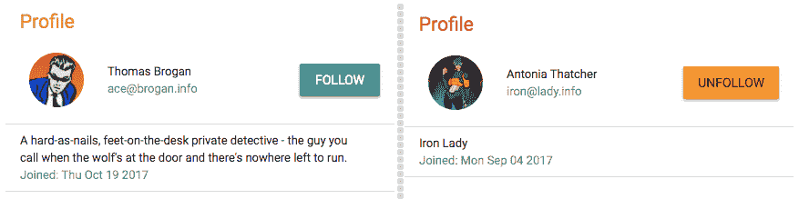

# 更新个人资料组件

在`Profile`视图中，只有在用户查看其他用户的个人资料时才应显示`FollowProfileButton`，因此我们需要修改在查看个人资料时显示`Edit`和`Delete`按钮的条件如下：

```jsx
{auth.isAuthenticated().user && auth.isAuthenticated().user._id == this.state.user._id 
    ? (edit and delete buttons) 
    : (follow button)
}
```

在`Profile`组件中，在`componentDidMount`成功获取用户数据后，我们将检查已登录用户是否已关注个人资料中的用户，并将`following`值设置为状态。

`mern-social/client/user/Profile.js`:

```jsx
let following = this.checkFollow(data) 
this.setState({user: data, following: following}) 
```

为了确定在`following`中设置的值，`checkFollow`方法将检查登录用户是否存在于获取的用户的关注者列表中，如果找到，则返回`match`，否则如果找不到匹配，则返回`undefined`。

`mern-social/client/user/Profile.js`：

```jsx
checkFollow = (user) => {
    const jwt = auth.isAuthenticated()
    const match = user.followers.find((follower)=> {
      return follower._id == jwt.user._id
    })
    return match
}
```

`Profile`组件还将为`FollowProfileButton`定义点击处理程序，因此当关注或取消关注操作完成时，可以更新`Profile`的状态。

`mern-social/client/user/Profile.js`：

```jsx
clickFollowButton = (callApi) => {
    const jwt = auth.isAuthenticated()
    callApi({
      userId: jwt.user._id
    }, {
      t: jwt.token
    }, this.state.user._id).then((data) => {
      if (data.error) {
        this.setState({error: data.error})
      } else {
        this.setState({user: data, following: !this.state.following})
      }
    })
}
```

点击处理程序定义将获取 API 调用作为参数，并在将其添加到`Profile`视图时，将其与`following`值一起作为 prop 传递给`FollowProfileButton`。

`mern-social/client/user/Profile.js`：

```jsx
<FollowProfileButton following={this.state.following} onButtonClick={this.clickFollowButton}/>
```

# 列出关注者和粉丝

在每个用户的个人资料中，我们将添加一个关注者列表和他们正在关注的人的列表：

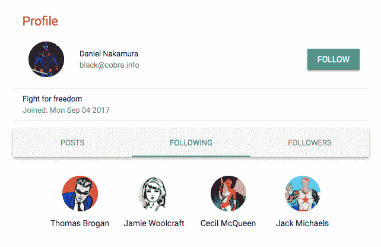

在使用`read` API 加载个人资料时，`following`和`followers`列表中引用的用户的详细信息已经在用户对象中。为了呈现这些单独的关注者和正在关注的人列表，我们将创建一个名为`FollowGrid`的新组件。

# FollowGrid 组件

`FollowGrid`组件将接受用户列表作为 props，显示用户的头像和名称，并链接到每个用户的个人资料。我们可以根据需要将此组件添加到`Profile`视图中，以显示`followings`或`followers`。

`mern-social/client/user/FollowGrid.js`：

```jsx
class FollowGrid extends Component {
  render() {
    const {classes} = this.props
    return (<div className={classes.root}>
      <GridList cellHeight={160} className={classes.gridList} cols={4}>
        {this.props.people.map((person, i) => {
           return <GridListTile style={{'height':120}} key={i}>
              <Link to={"/user/" + person._id}>
                <Avatar src={'/api/users/photo/'+person._id} className=
               {classes.bigAvatar}/>
                <Typography className={classes.tileText}>{person.name}
               </Typography>
              </Link>
            </GridListTile>
        })}
      </GridList>
    </div>)
  }
}

FollowGrid.propTypes = {
  classes: PropTypes.object.isRequired,
  people: PropTypes.array.isRequired
}
```

要将`FollowGrid`组件添加到`Profile`视图中，我们可以根据需要将其放置在视图中，并将`followers`或`followings`列表作为`people` prop 传递：

```jsx
<FollowGrid people={this.state.user.followers}/>
<FollowGrid people={this.state.user.following}/>
```

如前所述，在 MERN 社交中，我们选择在`Profile`组件内的选项卡中显示`FollowGrid`组件。我们使用 Material-UI 选项卡组件创建了一个单独的`ProfileTabs`组件，并将其添加到`Profile`组件中。这个`ProfileTabs`组件包含两个`FollowGrid`组件，其中包含关注者和粉丝列表，以及一个`PostList`组件，显示用户的帖子。这将在本章后面讨论。

# 寻找要关注的人

“谁来关注”功能将向登录用户显示 MERN 社交中他们当前未关注的人的列表，提供关注他们或查看他们的个人资料的选项：

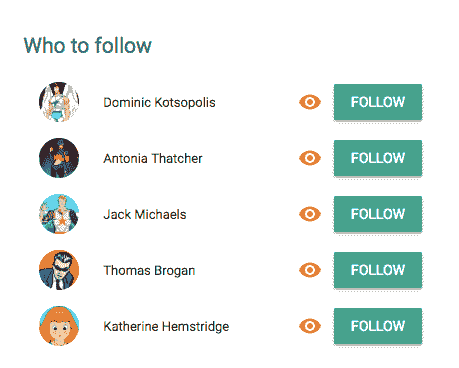

# 获取未关注的用户

我们将在服务器上实现一个新的 API 来查询数据库并获取当前用户未关注的用户列表。

`mern-social/server/routes/user.routes.js`:

```jsx
router.route('/api/users/findpeople/:userId')
   .get(authCtrl.requireSignin, userCtrl.findPeople)
```

在`findPeople`控制器方法中，我们将查询数据库中的用户集合，以查找当前用户`following`列表中没有的用户。

`mern-social/server/controllers/user.controller.js`:

```jsx
const findPeople = (req, res) => {
  let following = req.profile.following
  following.push(req.profile._id)
  User.find({ _id: { $nin : following } }, (err, users) => {
    if (err) {
      return res.status(400).json({
        error: errorHandler.getErrorMessage(err)
      })
    }
    res.json(users)
  }).select('name')
}
```

为了在前端使用这个用户列表，我们将更新`api-user.js`以添加对这个查找用户 API 的获取。

`mern-social/client/user/api-user.js`:

```jsx
const findPeople = (params, credentials) => {
  return fetch('/api/users/findpeople/' + params.userId, {
    method: 'GET',
    headers: {
      'Accept': 'application/json',
      'Content-Type': 'application/json',
      'Authorization': 'Bearer ' + credentials.t
    }
  }).then((response) => {
    return response.json()
  }).catch((err) => console.log(err))
}
```

# FindPeople 组件

为了显示*谁来关注*功能，我们将创建一个名为`FindPeople`的组件，可以添加到任何视图中或单独呈现。在这个组件中，我们将首先通过调用`componentDidMount`中的`findPeople`方法来获取未关注的用户。

`mern-social/client/user/FindPeople.js`:

```jsx
componentDidMount = () => {
   const jwt = auth.isAuthenticated()
   findPeople({
     userId: jwt.user._id
   }, {
     t: jwt.token
   }).then((data) => {
     if (data.error) {
       console.log(data.error)
     } else {
       this.setState({users: data})
     }
   })
}
```

获取的用户列表将被迭代并呈现在 Material-UI 的`List`组件中，每个列表项包含用户的头像、名称、到个人资料页面的链接和`Follow`按钮。

`mern-social/client/user/FindPeople.js`:

```jsx
<List>{this.state.users.map((item, i) => {
          return <span key={i}>
             <ListItem>
                <ListItemAvatar className={classes.avatar}>
                   <Avatar src={'/api/users/photo/'+item._id}/>
                </ListItemAvatar>
                <ListItemText primary={item.name}/>
                <ListItemSecondaryAction className={classes.follow}>
                  <Link to={"/user/" + item._id}>
                    <IconButton variant="raised" color="secondary" 
                     className={classes.viewButton}>
                      <ViewIcon/>
                    </IconButton>
                  </Link>
                  <Button aria-label="Follow" variant="raised" 
                    color="primary" 
                    onClick={this.clickFollow.bind(this, item, i)}>
                    Follow
                  </Button>
                </ListItemSecondaryAction>
             </ListItem>
          </span>
        })
      }
</List>
```

点击`Follow`按钮将调用关注 API，并通过删除新关注的用户来更新要关注的用户列表。

`mern-social/client/user/FindPeople.js`:

```jsx
clickFollow = (user, index) => {
    const jwt = auth.isAuthenticated()
    follow({
      userId: jwt.user._id
    }, {
      t: jwt.token
    }, user._id).then((data) => {
      if (data.error) {
        this.setState({error: data.error})
      } else {
        let toFollow = this.state.users
 toFollow.splice(index, 1)
 this.setState({users: toFollow, open: true, followMessage: 
       `Following ${user.name}!`})
      }
    })
}
```

我们还将添加一个 Material-UI 的`Snackbar`组件，当用户成功关注时会临时打开，告诉用户他们开始关注这个新用户。

`mern-social/client/user/FindPeople.js`:

```jsx
<Snackbar
  anchorOrigin={{ vertical: 'bottom', horizontal: 'right'}}
  open={this.state.open}
  onClose={this.handleRequestClose}
  autoHideDuration={6000}
  message={<span className={classes.snack}>{this.state.followMessage}</span>}
/>
```

`Snackbar`将在页面的右下角显示消息，并在设置的持续时间后自动隐藏：

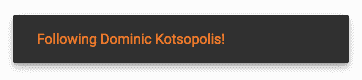

MERN Social 用户现在可以互相关注，查看每个用户的关注和粉丝列表，还可以看到他们可以关注的人的列表。在 MERN Social 中关注另一个用户的主要目的是跟踪他们的社交帖子，所以下一步我们将看一下帖子功能的实现。

# 帖子

MERN Social 中的发布功能将允许用户在 MERN Social 应用平台上分享内容，并通过评论或点赞帖子与其他用户互动：

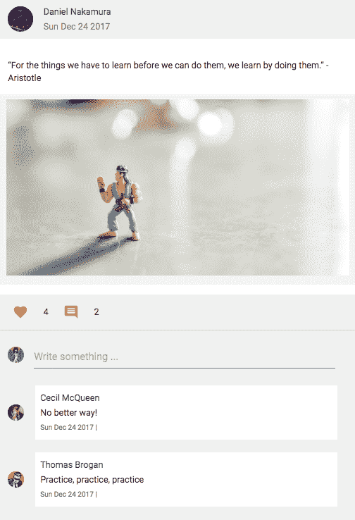

# 用于 Post 的 Mongoose 模式模型

为了存储每个帖子，我们将首先在`server/models/post.model.js`中定义 Mongoose 模式。帖子模式将存储帖子的文本内容、照片、发布者的引用、创建时间、用户对帖子的喜欢以及用户对帖子的评论：

+   **帖子文本**：`文本`将是用户在新帖子创建视图中提供的必填字段：

```jsx
text: {
  type: String,
  required: 'Name is required'
}
```

+   **帖子照片**：`照片`将在帖子创建时从用户的本地文件上传，并类似于用户个人资料照片上传功能存储在 MongoDB 中。每个帖子的照片将是可选的：

```jsx
photo: {
  data: Buffer,
  contentType: String
}
```

+   **发布者**：创建帖子将需要用户首先登录，因此我们可以在`postedBy`字段中存储发布帖子的用户的引用：

```jsx
postedBy: {type: mongoose.Schema.ObjectId, ref: 'User'}
```

+   **创建时间**：`创建`时间将在帖子创建时自动生成在数据库中：

```jsx
created: { type: Date, default: Date.now }
```

+   **喜欢**：喜欢特定帖子的用户的引用将存储在`likes`数组中：

```jsx
likes: [{type: mongoose.Schema.ObjectId, ref: 'User'}]
```

+   **评论**：每条帖子上的评论将包含文本内容、创建时间和发布评论的用户的引用。每个帖子将有一个`comments`数组：

```jsx
comments: [{
    text: String,
    created: { type: Date, default: Date.now },
    postedBy: { type: mongoose.Schema.ObjectId, ref: 'User'}
  }]
```

这个模式定义将使我们能够在 MERN Social 中实现所有与帖子相关的功能。

# 新闻订阅组件

在进一步深入 MERN Social 中的发布功能实现之前，我们将查看 Newsfeed 视图的组成，以展示如何设计共享状态的嵌套 UI 组件的基本示例。`Newsfeed`组件将包含两个主要的子组件——一个新帖子表单和来自关注用户的帖子列表：

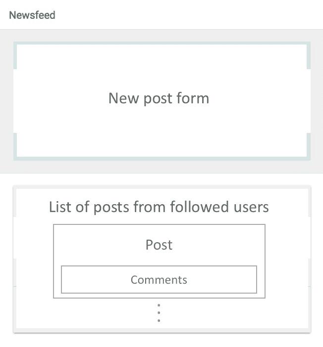

`Newsfeed`组件的基本结构将如下所示，包括`NewPost`组件和`PostList`组件。

`mern-social/client/post/Newsfeed.js`：

```jsx
<Card>
   <Typography type="title"> Newsfeed </Typography>
   <Divider/>
   <NewPost addUpdate={this.addPost}/>
   <Divider/>
   <PostList removeUpdate={this.removePost} posts={this.state.posts}/>
</Card>
```

作为父组件，`Newsfeed`将控制在子组件中呈现的帖子数据的状态。当在子组件中修改帖子数据时，例如在`NewPost`组件中添加新帖子或在`PostList`组件中删除帖子时，它将提供一种更新跨组件的帖子状态的方法。

在这里，Newsfeed 中的`loadPosts`函数首先调用服务器以从当前登录用户关注的人那里获取帖子列表，并将其设置为状态以在`PostList`组件中呈现。 `Newsfeed`组件提供了`addPost`和`removePost`函数给`NewPost`和`PostList`，当创建新帖子或删除现有帖子时，将用于更新`Newsfeed`状态中的帖子列表，并最终在`PostList`中反映出来。

在`Newsfeed`组件中定义的`addPost`函数将获取`NewPost`组件中创建的新帖子，并将其添加到状态中的帖子中。

`mern-social/client/post/Newsfeed.js`：

```jsx
addPost = (post) => {
    const updatedPosts = this.state.posts
    updatedPosts.unshift(post)
    this.setState({posts: updatedPosts})
}
```

在`Newsfeed`组件中定义的`removePost`函数将从`PostList`中的`Post`组件中获取已删除的帖子，并从状态中删除它。

`mern-social/client/post/Newsfeed.js`：

```jsx
removePost = (post) => {
    const updatedPosts = this.state.posts
    const index = updatedPosts.indexOf(post)
    updatedPosts.splice(index, 1)
    this.setState({posts: updatedPosts})
}
```

由于帖子是通过这种方式在`Newsfeed`的状态中更新的，`PostList`将向观众呈现已更改的帖子列表。这种从父组件到子组件再到父组件的状态更新机制将应用于其他功能，例如帖子中的评论更新，以及在`Profile`组件中为单个用户呈现`PostList`时。

# 列出帖子

在 MERN Social 中，我们将在`Newsfeed`和每个用户的个人资料中列出帖子。我们将创建一个通用的`PostList`组件，该组件将呈现提供给它的任何帖子列表，并且我们可以在`Newsfeed`和`Profile`组件中都使用它。

`mern-social/client/post/PostList.js`：

```jsx
class PostList extends Component {
  render() {
    return (
      <div style={{marginTop: '24px'}}>
        {this.props.posts.map((item, i) => {
            return <Post post={item} key={i} 
                         onRemove={this.props.removeUpdate}/>
          })
        }
      </div>
    )
  }
}
PostList.propTypes = {
  posts: PropTypes.array.isRequired,
  removeUpdate: PropTypes.func.isRequired
}
```

`PostList`组件将遍历从`Newsfeed`或`Profile`传递给它的帖子列表，并将每个帖子的数据传递给`Post`组件，该组件将呈现帖子的详细信息。 `PostList`还将传递从父组件作为 prop 发送到`Post`组件的`removeUpdate`函数，以便在删除单个帖子时更新状态。

# 在 Newsfeed 中列出

我们将在服务器上设置一个 API，该 API 查询帖子集合，并从指定用户关注的人那里返回帖子。因此，这些帖子可能会在`Newsfeed`的`PostList`中显示。

# 帖子的 Newsfeed API

这个特定于 Newsfeed 的 API 将在以下路由接收请求，该路由将在`server/routes/post.routes.js`中定义：

```jsx
router.route('/api/posts/feed/:userId')
  .get(authCtrl.requireSignin, postCtrl.listNewsFeed)
```

我们在这条路线中使用`:userID`参数来指定当前登录的用户，并且我们将利用`user.controller`中的`userByID`控制器方法来获取用户详细信息，就像之前一样，并将它们附加到在`listNewsFeed`中访问的请求对象中。因此，还要将以下内容添加到`mern-social/server/routes/post.routes.js`中：

```jsx
router.param('userId', userCtrl.userByID)
```

`post.routes.js`文件将与`user.routes.js`文件非常相似，为了在 Express 应用程序中加载这些新路线，我们需要像对 auth 和 user 路线一样在`express.js`中挂载 post 路线。

`mern-social/server/express.js`：

```jsx
app.use('/', postRoutes)
```

`post.controller.js`中的`listNewsFeed`控制器方法将查询数据库中的 Post 集合以获取匹配的帖子。

`mern-social/server/controllers/post.controller.js`：

```jsx
const listNewsFeed = (req, res) => {
  let following = req.profile.following
  following.push(req.profile._id)
  Post.find({postedBy: { $in : req.profile.following } })
   .populate('comments', 'text created')
   .populate('comments.postedBy', '_id name')
   .populate('postedBy', '_id name')
   .sort('-created')
   .exec((err, posts) => {
     if (err) {
       return res.status(400).json({
         error: errorHandler.getErrorMessage(err)
       })
     }
     res.json(posts)
   })
}
```

在对 Post 集合的查询中，我们找到所有具有与当前用户的关注和当前用户匹配的`postedBy`用户引用的帖子。

# 在视图中获取 Newsfeed 帖子

为了在前端使用此 API，我们将在`client/post/api-post.js`中添加一个获取方法：

```jsx
const listNewsFeed = (params, credentials) => {
  return fetch('/api/posts/feed/'+ params.userId, {
    method: 'GET',
    headers: {
      'Accept': 'application/json',
      'Content-Type': 'application/json',
      'Authorization': 'Bearer ' + credentials.t
    }
  }).then(response => {
    return response.json()
  }).catch((err) => console.log(err))
}
```

这是将加载在`PostList`中呈现的帖子的获取方法，它作为`Newsfeed`组件的子组件添加。因此，需要在`Newsfeed`组件的`loadPosts`方法中调用此获取方法。

`mern-social/client/post/Newsfeed.js`：

```jsx
 loadPosts = () => {
    const jwt = auth.isAuthenticated()
    listNewsFeed({
      userId: jwt.user._id
    }, {
      t: jwt.token
    }).then((data) => {
      if (data.error) {
        console.log(data.error)
      } else {
        this.setState({posts: data})
      }
    })
 }
```

`loadPosts`方法将在`Newsfeed`组件的`componentDidMount`中调用，以最初加载呈现在`PostList`组件中的帖子的状态：

！[](assets/c75625f8-f71b-4493-b7f1-421d636be764.png)

# 在 Profile 中按用户列出

获取特定用户创建的帖子列表并在`Profile`中显示的实现将类似于前一部分中的讨论。我们将在服务器上设置一个 API，该 API 查询 Post 集合，并将特定用户的帖子返回到`Profile`视图。

# 用户的帖子 API

将接收查询以返回特定用户发布的帖子的路线添加到`mern-social/server/routes/post.routes.js`中：

```jsx
router.route('/api/posts/by/:userId')
    .get(authCtrl.requireSignin, postCtrl.listByUser)
```

`post.controller.js`中的`listByUser`控制器方法将查询 Post 集合，以查找在路线中指定的用户的`userId`参数与`postedBy`字段中的匹配引用的帖子。

`mern-social/server/controllers/post.controller.js`：

```jsx
const listByUser = (req, res) => {
  Post.find({postedBy: req.profile._id})
  .populate('comments', 'text created')
  .populate('comments.postedBy', '_id name')
  .populate('postedBy', '_id name')
  .sort('-created')
  .exec((err, posts) => {
    if (err) {
      return res.status(400).json({
        error: errorHandler.getErrorMessage(err)
      })
    }
    res.json(posts)
  })
}
```

# 在视图中获取用户帖子

为了在前端使用此 API，我们将在`mern-social/client/post/api-post.js`中添加一个获取方法：

```jsx
const listByUser = (params, credentials) => {
  return fetch('/api/posts/by/'+ params.userId, {
    method: 'GET',
    headers: {
      'Accept': 'application/json',
      'Content-Type': 'application/json',
      'Authorization': 'Bearer ' + credentials.t
    }
  }).then(response => {
    return response.json()
  }).catch((err) => console.log(err))
}
```

这个`fetch`方法将加载添加到`Profile`视图的`PostList`所需的帖子。我们将更新`Profile`组件以定义一个`loadPosts`方法，该方法调用`listByUser`获取方法。

`mern-social/client/user/Profile.js`：

```jsx
loadPosts = (user) => {
    const jwt = auth.isAuthenticated()
    listByUser({
      userId: user
    }, {
      t: jwt.token
    }).then((data) => {
      if (data.error) {
        console.log(data.error)
      } else {
        this.setState({posts: data})
      }
    })
}
```

在`Profile`组件中，当从服务器中的`init()`函数中获取用户详细信息后，将调用`loadPosts`方法，并传入正在加载的用户的用户 ID。为特定用户加载的帖子将设置为状态，并在添加到`Profile`组件的`PostList`组件中呈现。`Profile`组件还提供了一个`removePost`函数，类似于`Newsfeed`组件，作为`PostList`组件的属性，以便在删除帖子时更新帖子列表。

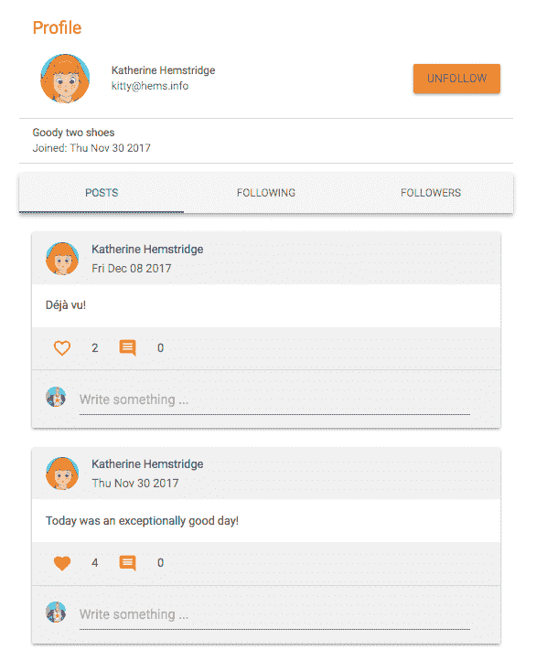

# 创建新帖子

创建新帖子功能将允许已登录用户发布消息，并可选择从本地文件上传图片到帖子中。

# 创建帖子 API

在服务器上，我们将定义一个 API 来在数据库中创建帖子，首先声明一个路由，以接受`/api/posts/new/:userId`的 POST 请求，位于`mern-social/server/routes/post.routes.js`中。

```jsx
router.route('/api/posts/new/:userId')
  .post(authCtrl.requireSignin, postCtrl.create)
```

`post.controller.js`中的`create`方法将使用`formidable`模块来访问字段和图像文件（如果有），就像我们为用户配置文件照片更新一样。

`mern-social/server/controllers/post.controller.js`：

```jsx
const create = (req, res, next) => {
  let form = new formidable.IncomingForm()
  form.keepExtensions = true
  form.parse(req, (err, fields, files) => {
    if (err) {
      return res.status(400).json({
        error: "Image could not be uploaded"
      })
    }
    let post = new Post(fields)
    post.postedBy= req.profile
    if(files.photo){
      post.photo.data = fs.readFileSync(files.photo.path)
      post.photo.contentType = files.photo.type
    }
    post.save((err, result) => {
      if (err) {
        return res.status(400).json({
          error: errorHandler.getErrorMessage(err)
        })
      }
      res.json(result)
    })
  })
}
```

# 检索帖子的照片

为了检索上传的照片，我们还将设置一个`photo`路由 URL，以返回具有特定帖子的照片。

`mern-social/server/routes/post.routes.js`：

```jsx
router.route('/api/posts/photo/:postId').get(postCtrl.photo)
```

`photo`控制器将返回存储在 MongoDB 中的`photo`数据作为图像文件。

`mern-social/server/controllers/post.controller.js`：

```jsx
const photo = (req, res, next) => {
    res.set("Content-Type", req.post.photo.contentType)
    return res.send(req.post.photo.data)
}
```

由于照片路由使用`:postID`参数，我们将设置一个`postByID`控制器方法来通过其 ID 获取特定帖子，然后返回给照片请求。我们将在`post.routes.js`中添加 param 调用。

`mern-social/server/routes/post.routes.js`：

```jsx
  router.param('postId', postCtrl.postByID)
```

`postByID`将类似于`userByID`方法，并且它将把从数据库中检索到的帖子附加到请求对象中，以便由`next`方法访问。在此实现中附加的帖子数据还将包含`postedBy`用户引用的 ID 和名称。

`mern-social/server/controllers/post.controller.js`：

```jsx
const postByID = (req, res, next, id) => {
  Post.findById(id).populate('postedBy', '_id name').exec((err, post) => {
    if (err || !post)
      return res.status('400').json({
        error: "Post not found"
      })
    req.post = post
    next()
  })
}
```

# 在视图中获取创建帖子的 API

我们将更新`api-post.js`，添加一个`create`方法来调用创建 API 的`fetch`请求。

`mern-social/client/post/api-post.js`:

```jsx
const create = (params, credentials, post) => {
  return fetch('/api/posts/new/'+ params.userId, {
    method: 'POST',
    headers: {
      'Accept': 'application/json',
      'Authorization': 'Bearer ' + credentials.t
    },
    body: post
  }).then((response) => {
    return response.json()
  }).catch((err) => {
    console.log(err)
  })
}
```

这种方法，就像用户`edit` fetch 一样，将使用一个`FormData`对象发送一个多部分表单提交，其中可以包含文本字段和图像文件。

# NewPost 组件

在`Newsfeed`组件中添加的`NewPost`组件将允许用户撰写包含文本消息和可选图像的新帖子：

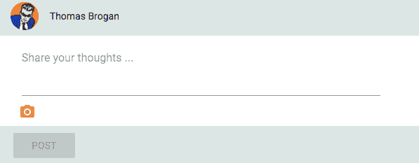

`NewPost`组件将是一个标准表单，其中包括一个 Material-UI 的`TextField`和一个文件上传按钮，就像在`EditProfile`中实现的那样，它会获取这些值并将它们设置在一个`FormData`对象中，以便在提交帖子时传递给`create` fetch 方法。

`mern-social/client/post/NewPost.js`:

```jsx
clickPost = () => {
    const jwt = auth.isAuthenticated()
    create({
      userId: jwt.user._id
    }, {
      t: jwt.token
    }, this.postData).then((data) => {
      if (data.error) {
        this.setState({error: data.error})
      } else {
        this.setState({text:'', photo: ''})
        this.props.addUpdate(data)
      }
    })
}
```

`NewPost`组件被添加为`Newsfeed`中的子组件，并且作为一个 prop 给予`addUpdate`方法。在成功创建帖子后，表单视图将被清空，并且将执行`addUpdate`，以便在`Newsfeed`中更新帖子列表。

# 帖子组件

每个帖子中的帖子详细信息将在`Post`组件中呈现，该组件将从`PostList`组件中接收帖子数据作为 props，以及`onRemove` prop，以便在删除帖子时应用。

# 布局

`Post`组件布局将包括一个显示发帖人详细信息的标题，帖子内容，带有赞和评论计数的操作栏，以及*评论*部分：

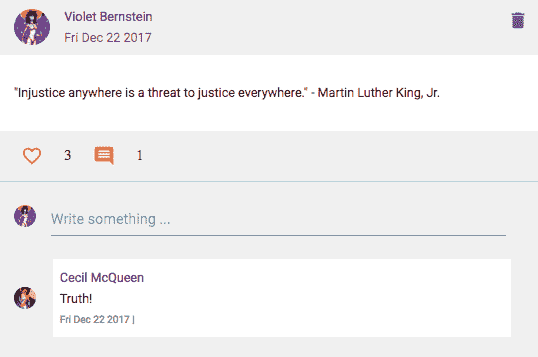

# 标题

标题将包含诸如姓名、头像、指向发帖用户个人资料的链接以及帖子创建日期等信息。

`mern-social/client/post/Post.js`:

```jsx
<CardHeader
  avatar={<Avatar src={'/api/users/photo/'+this.props.post.postedBy._id}/>}
       action={this.props.post.postedBy._id ===   
           auth.isAuthenticated().user._id &&
           <IconButton onClick={this.deletePost}>
             <DeleteIcon />
           </IconButton>
          }
         title={<Link to={"/user/" + this.props.post.postedBy._id}>
            {this.props.post.postedBy.name}
         </Link>}
    subheader={(new Date(this.props.post.created)).toDateString()}
  className={classes.cardHeader}
/>
```

标题还将有条件地显示一个“删除”按钮，如果已登录用户正在查看自己的帖子。

# 内容

内容部分将显示帖子的文本内容以及帖子包含照片的情况。

`mern-social/client/post/Post.js`:

```jsx
<CardContent className={classes.cardContent}>
  <Typography component="p" className={classes.text}> 
    {this.props.post.text} 
  </Typography>
  {this.props.post.photo && 
    (<div className={classes.photo}>
       
    </div>)
  }
</CardContent>
```

# 操作

操作部分将包含一个交互式的“喜欢”选项，显示帖子上的总赞数，以及一个评论图标，显示帖子上的总评论数。

`mern-social/client/post/Post.js`:

```jsx
<CardActions>
  { this.state.like
    ? <IconButton onClick={this.like} className={classes.button}
     aria-label="Like" color="secondary">
        <FavoriteIcon />
      </IconButton>
    :<IconButton onClick={this.like} className={classes.button}
     aria-label="Unlike" color="secondary">
        <FavoriteBorderIcon />
      </IconButton> 
  } <span> {this.state.likes} </span>
  <IconButton className={classes.button}
   aria-label="Comment" color="secondary">
     <CommentIcon/>
  </IconButton> <span>{this.state.comments.length}</span>
</CardActions>
```

# 评论

评论部分将包含`Comments`组件中的所有与评论相关的元素，并将获得诸如`postId`和`comments`数据等`props`，以及一个`state`更新方法，当在`Comments`组件中添加或删除评论时可以调用。

`mern-social/client/post/Post.js`:

```jsx
<Comments postId={this.props.post._id} 
          comments={this.state.comments} 
          updateComments={this.updateComments}/>
```

# 删除帖子

只有在登录用户和`postedBy`用户对于正在呈现的特定帖子是相同时，`delete`按钮才可见。为了从数据库中删除帖子，我们将不得不设置一个删除帖子 API，该 API 在单击`delete`时也将在前端应用中有一个 fetch 方法。

`mern-social/server/routes/post.routes.js`:

```jsx
router.route('/api/posts/:postId')
    .delete(authCtrl.requireSignin, 
              postCtrl.isPoster, 
                  postCtrl.remove)
```

删除路由将在调用帖子上的`remove`之前检查授权，通过确保经过身份验证的用户和`postedBy`用户是相同的用户。`isPoster`方法在执行`next`方法之前检查登录用户是否是帖子的原始创建者。

`mern-social/server/controllers/post.controller.js`:

```jsx
const isPoster = (req, res, next) => {
  let isPoster = req.post && req.auth &&
  req.post.postedBy._id == req.auth._id
  if(!isPoster){
    return res.status('403').json({
      error: "User is not authorized"
    })
  }
  next()
}
```

删除 API 的其余实现与其他 API 实现相同，具有`remove`控制器方法和用于前端的 fetch 方法。在删除帖子功能中的重要区别在于，在成功删除时在`Post`组件中调用`onRemove`更新方法。`onRemove`方法作为 prop 从`Newsfeed`或`Profile`发送，以在成功删除时更新状态中的帖子列表。

在`Post`组件中定义的以下`deletePost`方法在单击帖子上的`delete`按钮时被调用。

`mern-social/client/post/Post.js`:

```jsx
deletePost = () => {
    const jwt = auth.isAuthenticated()
    remove({
      postId: this.props.post._id
    }, {
      t: jwt.token
    }).then((data) => {
      if (data.error) {
        console.log(data.error)
      } else {
        this.props.onRemove(this.props.post)
      }
    })
}
```

此方法调用删除帖子 API 的 fetch 调用，并在成功时通过执行从父组件接收的`onRemove`方法更新状态中的帖子列表。

# 喜欢

`Post`组件操作栏部分的喜欢选项将允许用户喜欢或取消喜欢帖子，并显示帖子的总喜欢数。为了记录喜欢，我们将不得不设置可以在视图中调用的喜欢和取消喜欢 API。

# 喜欢 API

喜欢的 API 将是一个 PUT 请求，用于更新`Post`文档中的`likes`数组。请求将在路由`api/posts/like`接收。

`mern-social/server/routes/post.routes.js`:

```jsx
  router.route('/api/posts/like')
    .put(authCtrl.requireSignin, postCtrl.like)
```

在`like`控制器方法中，将使用请求体中接收的帖子 ID 来查找帖子文档，并通过将当前用户的 ID 推送到`likes`数组来更新它。

`mern-social/server/controllers/post.controller.js`:

```jsx
const like = (req, res) => {
  Post.findByIdAndUpdate(req.body.postId,
 {$push: {likes: req.body.userId}}, {new: true})
  .exec((err, result) => {
    if (err) {
      return res.status(400).json({
        error: errorHandler.getErrorMessage(err)
      })
    }
    res.json(result)
  })
}
```

为了使用此 API，将在`api-post.js`中添加一个名为`like`的 fetch 方法，当用户点击`like`按钮时将使用该方法。

`mern-social/client/post/api-post.js`:

```jsx
const like = (params, credentials, postId) => {
  return fetch('/api/posts/like/', {
    method: 'PUT',
    headers: {
      'Accept': 'application/json',
      'Content-Type': 'application/json',
      'Authorization': 'Bearer ' + credentials.t
    },
    body: JSON.stringify({userId:params.userId, postId: postId})
  }).then((response) => {
    return response.json()
  }).catch((err) => {
    console.log(err)
  })
}
```

# 取消喜欢 API

“不喜欢”API 将类似于喜欢 API 进行实现，其自己的路由在`mern-social/server/routes/post.routes.js`中：

```jsx
  router.route('/api/posts/unlike')
    .put(authCtrl.requireSignin, postCtrl.unlike)
```

控制器中的“不喜欢”方法将通过其 ID 找到帖子，并使用`$pull`而不是`$push`更新`likes`数组，从而删除当前用户的 ID。

`mern-social/server/controllers/post.controller.js`：

```jsx
const unlike = (req, res) => {
  Post.findByIdAndUpdate(req.body.postId, {$pull: {likes: req.body.userId}}, {new: true})
  .exec((err, result) => {
    if (err) {
      return res.status(400).json({
        error: errorHandler.getErrorMessage(err)
      })
    }
    res.json(result)
  })
}
```

不喜欢 API 还将有一个类似于`api-post.js`中的`like`方法的对应获取方法。

# 检查是否喜欢并计算喜欢的数量

当渲染`Post`组件时，我们需要检查当前登录的用户是否喜欢帖子，以便显示适当的`like`选项。

`mern-social/client/post/Post.js`：

```jsx
checkLike = (likes) => {
    const jwt = auth.isAuthenticated()
    let match = likes.indexOf(jwt.user._id) !== -1
    return match
}
```

`checkLike`函数可以在`Post`组件的`componentDidMount`和`componentWillReceiveProps`期间调用，以在检查当前用户是否在帖子的`likes`数组中引用后为帖子设置`like`状态：

！[](assets/93a0e91b-5080-41d1-8d30-777ca5e05b08.png)

使用`checkLike`方法在状态中设置的`like`值可以用于渲染心形轮廓按钮或完整的心形按钮。如果用户尚未喜欢帖子，将呈现心形轮廓按钮，点击后将调用`like`API，显示完整的心形按钮，并增加`likes`计数。完整的心形按钮将指示当前用户已经喜欢了这篇帖子，点击这将调用`unlike`API，呈现心形轮廓按钮，并减少`likes`计数。

当`Post`组件挂载并且通过设置`this.props.post.likes.length`将`likes`值设置为状态时，`likes`计数也会最初设置。

`mern-social/client/post/Post.js`：

```jsx
componentDidMount = () => {
    this.setState({like:this.checkLike(this.props.post.likes), 
                   likes: this.props.post.likes.length, 
                   comments: this.props.post.comments})
}
componentWillReceiveProps = (props) => {
    this.setState({like:this.checkLike(props.post.likes), 
                   likes: props.post.likes.length, 
                   comments: props.post.comments})
}
```

当喜欢或不喜欢操作发生时，更新帖子数据并从 API 调用返回时，`likes`相关的值也会再次更新。

# 处理类似点击

为了处理对“喜欢”和“不喜欢”按钮的点击，我们将设置一个“喜欢”方法，该方法将根据是喜欢还是不喜欢操作调用适当的获取方法，并更新帖子的“喜欢”和“喜欢”计数的状态。

`mern-social/client/post/Post.js`：

```jsx
like = () => {
    let callApi = this.state.like ? unlike : like 
    const jwt = auth.isAuthenticated()
    callApi({
      userId: jwt.user._id
    }, {
      t: jwt.token
    }, this.props.post._id).then((data) => {
      if (data.error) {
        console.log(data.error)
      } else {
        this.setState({like: !this.state.like, likes: 
       data.likes.length})
      }
    }) 
  }
```

# 评论

每篇帖子中的评论部分将允许已登录用户添加评论，查看评论列表，并删除自己的评论。评论列表的任何更改，例如新添加或删除，都将更新评论，以及`Post`组件的操作栏部分中的评论计数：

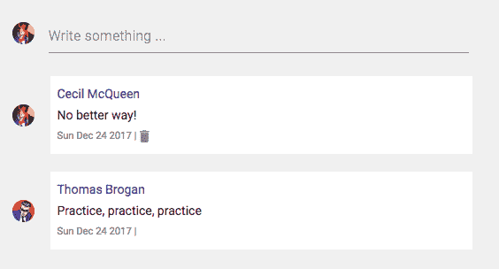

# 添加评论

当用户添加评论时，帖子文档将在数据库中更新为新评论。

# 评论 API

为了实现添加评论 API，我们将设置一个`PUT`路由如下以更新帖子。

`mern-social/server/routes/post.routes.js`:

```jsx
router.route('/api/posts/comment')
    .put(authCtrl.requireSignin, postCtrl.comment)
```

`comment`控制器方法将通过其 ID 找到要更新的相关帖子，并将收到的评论对象推送到帖子的`comments`数组中。

`mern-social/server/controllers/post.controller.js`:

```jsx
const comment = (req, res) => {
  let comment = req.body.comment
  comment.postedBy = req.body.userId
  Post.findByIdAndUpdate(req.body.postId,
 {$push: {comments: comment}}, {new: true})
  .populate('comments.postedBy', '_id name')
  .populate('postedBy', '_id name')
  .exec((err, result) => {
    if (err) {
      return res.status(400).json({
        error: errorHandler.getErrorMessage(err)
      })
    }
    res.json(result)
  })
}
```

在响应中，更新后的帖子对象将与帖子和评论中的`postedBy`用户的详细信息一起发送回来。

要在视图中使用此 API，我们将在`api-post.js`中设置一个 fetch 方法，该方法获取当前用户的 ID、帖子 ID 和视图中的`comment`对象，以便与添加评论请求一起发送。

`mern-social/client/post/api-post.js`:

```jsx
const comment = (params, credentials, postId, comment) => {
  return fetch('/api/posts/comment/', {
    method: 'PUT',
    headers: {
      'Accept': 'application/json',
      'Content-Type': 'application/json',
      'Authorization': 'Bearer ' + credentials.t
    },
    body: JSON.stringify({userId:params.userId, postId: postId, 
    comment: comment})
  }).then((response) => {
    return response.json()
  }).catch((err) => {
    console.log(err)
  })
}
```

# 在视图中写一些东西

`Comments`组件中的*添加评论*部分将允许已登录用户输入评论文本：

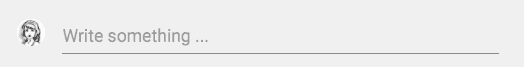

它将包含一个带有用户照片的头像和一个文本字段，当用户按下*Enter*键时，将添加评论。

`mern-social/client/post/Comments.js`:

```jsx
<CardHeader
   avatar={<Avatar className={classes.smallAvatar} 
              src={'/api/users/photo/'+auth.isAuthenticated().user._id}/>}
   title={<TextField
             onKeyDown={this.addComment}
             multiline
             value={this.state.text}
             onChange={this.handleChange('text')}
             placeholder="Write something ..."
             className={classes.commentField}
             margin="normal"/>}
   className={classes.cardHeader}
/>
```

当值改变时，文本将存储在状态中，并且在`onKeyDown`事件上，如果按下*Enter*键，`addComment`方法将调用`comment` fetch 方法。

`mern-social/client/post/Comments.js`:

```jsx
addComment = (event) => {
    if(event.keyCode == 13 && event.target.value){
      event.preventDefault()
      const jwt = auth.isAuthenticated()
      comment({
        userId: jwt.user._id
      }, {
        t: jwt.token
      }, this.props.postId, {text: this.state.text}).then((data) => {
        if (data.error) {
          console.log(data.error)
        } else {
          this.setState({text: ''})
          this.props.updateComments(data.comments)
        }
      })
    }
}
```

`Comments`组件从`Post`组件中作为 prop 接收`updateComments`方法（在上一节中讨论）。当添加新评论时，将执行此方法，以更新帖子视图中的评论和评论计数。

# 列出评论

`Comments`组件从`Post`组件中作为 prop 接收特定帖子的评论列表，然后迭代每个评论以呈现评论者的详细信息和评论内容。

`mern-social/client/post/Comments.js`:

```jsx
{this.props.comments.map((item, i) => {
                return <CardHeader
                      avatar={
                        <Avatar src=  
                     {'/api/users/photo/'+item.postedBy._id}/>
                      }
                      title={commentBody(item)}
                      className={classes.cardHeader}
                      key={i}/>
              })
}
```

`commentBody`呈现内容，包括评论者的姓名链接到其个人资料、评论文本和评论创建日期。

`mern-social/client/post/Comments.js`:

```jsx
const commentBody = item => {
  return (
     <p className={classes.commentText}>
        <Link to={"/user/" + item.postedBy._id}>{item.postedBy.name}
        </Link><br/>
        {item.text}
        <span className={classes.commentDate}>
          {(new Date(item.created)).toDateString()} |
          {auth.isAuthenticated().user._id === item.postedBy._id &&
            <Icon onClick={this.deleteComment(item)} 
                  className={classes.commentDelete}>delete</Icon> }
        </span>
     </p>
   )
}
```

如果评论的`postedBy`引用与当前已登录用户匹配，`commentBody`还将呈现评论的删除选项。

# 删除评论

在评论中点击删除按钮将通过从数据库中的`comments`数组中移除评论来更新帖子：

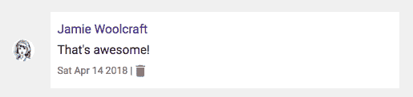

# 取消评论 API

我们将在以下 PUT 路由上实现一个`uncomment` API。

`mern-social/server/routes/post.routes.js`：

```jsx
router.route('/api/posts/uncomment')
    .put(authCtrl.requireSignin, postCtrl.uncomment)
```

`uncomment`控制器方法将通过 ID 找到相关的帖子，然后从帖子的`comments`数组中拉取具有已删除评论 ID 的评论。

`mern-social/server/controllers/post.controller.js`：

```jsx
const uncomment = (req, res) => {
  let comment = req.body.comment
  Post.findByIdAndUpdate(req.body.postId, {$pull: {comments: {_id: comment._id}}}, {new: true})
  .populate('comments.postedBy', '_id name')
  .populate('postedBy', '_id name')
  .exec((err, result) => {
    if (err) {
      return res.status(400).json({
        error: errorHandler.getErrorMessage(err)
      })
    }
    res.json(result)
  })
}
```

更新后的帖子将像评论 API 中一样在响应中返回。

为了在视图中使用这个 API，我们还将在`api-post.js`中设置一个 fetch 方法，类似于添加`comment`的 fetch 方法，该方法需要当前用户的 ID、帖子 ID 和已删除的`comment`对象，以发送`uncomment`请求。

# 从视图中移除评论

当评论者点击评论的删除按钮时，`Comments`组件将调用`deleteComment`方法来获取`uncomment` API，并在评论成功从服务器中移除时更新评论以及评论计数。

`mern-social/client/post/Comments.js`：

```jsx
deleteComment = comment => event => {
    const jwt = auth.isAuthenticated()
    uncomment({
      userId: jwt.user._id
    }, {
      t: jwt.token
    }, this.props.postId, comment).then((data) => {
      if (data.error) {
        console.log(data.error)
      } else {
        this.props.updateComments(data.comments)
      }
    })
  }
```

# 评论计数更新

`updateComments`方法用于在`Post`组件中定义，并作为 prop 传递给`Comments`组件，以便在添加或删除评论时更新`comments`和评论计数。

`mern-social/client/post/Post.js`：

```jsx
updateComments = (comments) => {
    this.setState({comments: comments})
}
```

该方法将更新后的评论列表作为参数，并更新保存在视图中的评论列表的状态。当`Post`组件挂载时，评论的初始状态在`Post`组件中设置，并作为 props 接收帖子数据。这里设置的评论作为 props 发送到`Comments`组件，并用于在帖子布局的操作栏中渲染评论计数旁边的点赞操作。

`mern-social/client/post/Post.js`：

```jsx
<IconButton aria-label="Comment" color="secondary">
  <CommentIcon/>
</IconButton> <span>{this.state.comments.length}</span>
```

`Post`组件中评论计数与`Comments`组件中渲染和更新的评论之间的关系，再次简单演示了在 React 中如何在嵌套组件之间共享更改的数据，以创建动态和交互式用户界面。

MERN 社交应用程序已经完整地具备了我们之前为应用程序定义的功能集。用户可以更新其个人资料，上传照片和描述，在应用程序上互相关注，并创建带有照片和文字的帖子，以及对帖子点赞和评论。这里展示的实现可以进一步调整和扩展，以添加更多功能，利用 MERN 堆栈的工作机制。

# 总结

本章开发的 MERN 社交应用程序演示了如何将 MERN 堆栈技术一起使用，构建出具有社交媒体功能的功能齐全的网络应用程序。

我们首先更新了骨架应用程序中的用户功能，允许在 MERN 社交上拥有账户的任何人添加关于自己的描述，并从本地文件上传个人资料图片。在上传个人资料图片的实现中，我们探讨了如何从客户端上传多部分表单数据，然后在服务器上接收它，直接将文件数据存储在 MongoDB 数据库中，然后能够检索回来进行查看。

接下来，我们进一步更新了用户功能，允许用户在 MERN 社交平台上互相关注。在用户模型中，我们添加了维护用户引用数组的功能，以表示每个用户的关注者和关注者列表。扩展了这一功能，我们在视图中加入了关注和取消关注选项，并显示了关注者、被关注者甚至尚未关注的用户列表。

然后，我们添加了允许用户发布内容并通过点赞或评论进行互动的功能。在后端，我们设置了帖子模型和相应的 API，能够存储可能包含或不包含图像的帖子内容，并记录任何用户在帖子上产生的点赞和评论。

最后，在实现发布、点赞和评论功能的视图时，我们探讨了如何使用组件组合和共享组件之间的状态值来创建复杂和交互式视图。

在下一章中，我们将进一步扩展 MERN 堆栈的这些能力，并在扩展 MERN 骨架应用程序的同时，开启新的可能性，开发一个在线市场应用程序。
