# 第六章：通过在线市场锻炼新的 MERN 技能

随着越来越多的企业继续转向网络，能够在在线市场环境中进行买卖已经成为许多网络平台的核心要求。在本章和下一章中，我们将利用 MERN 堆栈技术开发一个在线市场应用程序，其中包括使用户能够买卖的功能。

在本章中，我们将通过扩展 MERN 骨架来构建在线市场，添加以下功能：

+   具有卖家账户的用户

+   商店管理

+   产品管理

+   按名称和类别搜索产品

# MERN Marketplace

MERN Marketplace 应用程序将允许用户成为卖家，他们可以管理多个商店，并在每个商店中添加他们想要出售的产品。访问 MERN Marketplace 的用户将能够搜索和浏览他们想要购买的产品，并将产品添加到购物车中以下订单：

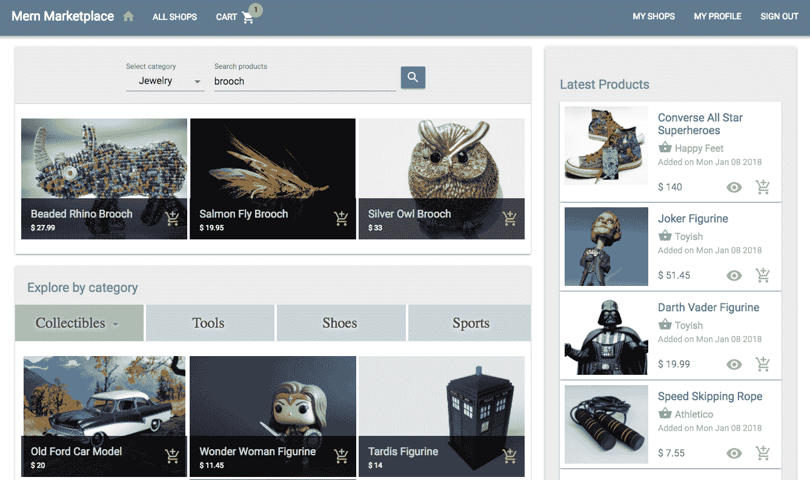完整的 MERN Marketplace 应用程序的代码可在 GitHub 上找到：[github.com/shamahoque/mern-marketplace](https://github.com/shamahoque/mern-marketplace)。本章讨论的实现可以在存储库的 seller-shops-products 分支中访问。您可以在阅读本章其余部分的代码解释时，克隆此代码并运行应用程序。

与卖家账户、商店和产品相关的功能所需的视图将通过扩展和修改 MERN 骨架应用程序中的现有 React 组件来开发。下图显示的组件树展示了本章中开发的 MERN Marketplace 前端中的所有自定义 React 组件：

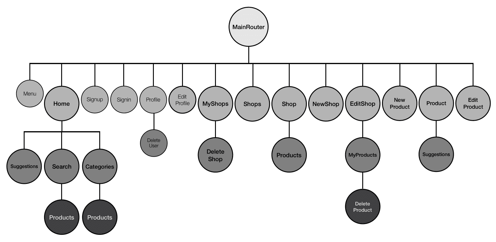

# 用户作为卖家

在 MERN Marketplace 注册的任何用户都可以选择通过更新其个人资料成为卖家：

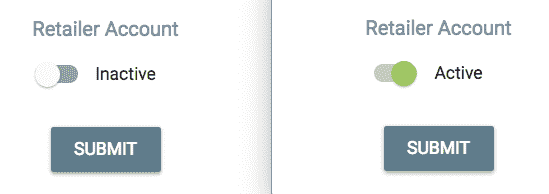

与成为普通用户相比，成为卖家将允许用户创建和管理自己的商店，他们可以在其中管理产品：


为了添加这个卖家功能，我们需要更新用户模型、编辑个人资料视图，并在菜单中添加一个“我的商店”链接，只有卖家才能看到。

# 更新用户模型

用户模型将需要一个卖家值，默认情况下将其设置为`false`以表示普通用户，并且可以将其设置为`true`以表示也是卖家的用户。

`mern-marketplace/server/models/user.model.js`:

```jsx
seller: {
    type: Boolean,
    default: false
}
```

卖家值必须与成功登录时收到的用户详细信息一起发送到客户端，以便视图可以相应地呈现与卖家相关的信息。

# 更新编辑个人资料视图

已登录用户将在编辑个人资料视图中看到一个切换按钮，用于激活或停用卖家功能。我们将更新`EditProfile`组件，在`FormControlLabel`中添加`Material-UI`的`Switch`组件。

`mern-marketplace/client/user/EditProfile.js`:

```jsx
<Typography type="subheading" component="h4" className={classes.subheading}>
    Seller Account
</Typography>
<FormControlLabel
    control = { <Switch classes={{ checked: classes.checked, bar: classes.bar}}
                  checked={this.state.seller}
                  onChange={this.handleCheck}
                /> }
    label={this.state.seller? 'Active' : 'Inactive'}
/>
```

通过调用`handleCheck`方法，对切换进行的任何更改都将设置为状态中`seller`的值。

`mern-marketplace/client/user/EditProfile.js`:

```jsx
handleCheck = (event, checked) => {
    this.setState({'seller': checked})
} 
```

提交时，`seller`值将被添加到发送到服务器的详细信息中。

`mern-marketplace/client/user/EditProfile.js`:

```jsx
clickSubmit = () => {
    const jwt = auth.isAuthenticated() 
    const user = {
      name: this.state.name || undefined,
      email: this.state.email || undefined,
      password: this.state.password || undefined,
      seller: this.state.seller
    }
    update({
      userId: this.match.params.userId
    }, {
      t: jwt.token
    }, user).then((data) => {
      if (data.error) {
        this.setState({error: data.error})
      } else {
        auth.updateUser(data, ()=> {
 this.setState({'userId':data._id,'redirectToProfile':true})
 })
      }
    })
  }
```

成功更新后，存储在`sessionStorage`中的用户详细信息也应该更新。调用`auth.updateUser`方法来进行`sessionStorage`的更新。它与其他`auth-helper.js`方法一起定义，并传递更新后的用户数据和一个更新视图的回调函数作为参数。

`mern-marketplace/client/auth/auth-helper.js`:

```jsx
updateUser(user, cb) {
  if(typeof window !== "undefined"){
    if(sessionStorage.getItem('jwt')){
       let auth = JSON.parse(sessionStorage.getItem('jwt'))
       auth.user = user
       sessionStorage.setItem('jwt', JSON.stringify(auth))
       cb()
     }
  }
}
```

# 更新菜单

在导航栏中，为了有条件地显示一个链接到*我的商店*，该链接只对已登录的也是卖家的用户可见，我们将更新`Menu`组件，如下所示，在先前的代码中只有在用户登录时才会呈现。

`mern-marketplace/client/core/Menu.js`:

```jsx
{auth.isAuthenticated().user.seller && 
  (<Link to="/seller/shops">
  <Button color = {isPartActive(history, "/seller/")}> My Shops </Button>
   </Link>)
}
```

# 市场中的商店

MERN Marketplace 上的卖家可以创建商店，并向每个商店添加产品。为了存储商店数据并启用商店管理，我们将实现一个用于商店的 Mongoose 模式，用于访问和修改商店数据的后端 API，以及用于商店所有者和买家浏览市场的前端视图。

# 商店模型

在`server/models/shop.model.js`中定义的商店模式将具有简单的字段来存储商店详细信息，以及一个标志图像和拥有该商店的用户的引用。

+   **商店名称和描述**：名称和描述字段将是字符串类型，其中`name`是一个必填字段：

```jsx
name: { 
    type: String, 
    trim: true, 
    required: 'Name is required' 
},
description: { 
    type: String, 
    trim: true 
},
```

+   **商店标志图像**：`image`字段将存储用户上传的标志图像文件，作为 MongoDB 数据库中的数据：

```jsx
image: { 
    data: Buffer, 
    contentType: String 
},
```

+   **商店所有者**：所有者字段将引用创建商店的用户：

```jsx
owner: {
    type: mongoose.Schema.ObjectId, 
    ref: 'User'
}
```

+   **创建和更新时间**：`created`和`updated`字段将是`Date`类型，`created`在添加新商店时生成，`updated`在修改任何商店详情时更改。

```jsx
updated: Date,
created: { 
    type: Date, 
    default: Date.now 
},
```

此模式定义中的字段将使我们能够在 MERN Marketplace 中实现所有与商店相关的功能。

# 创建新商店

在 MERN Marketplace 中，已登录并且也是卖家的用户将能够创建新的商店。

# 创建商店 API

在后端，我们将添加一个 POST 路由，验证当前用户是否为卖家，并使用请求中传递的商店数据创建一个新的商店。

`mern-marketplace/server/routes/shop.routes.js`：

```jsx
router.route('/api/shops/by/:userId')
    .post(authCtrl.requireSignin,authCtrl.hasAuthorization, 
           userCtrl.isSeller, shopCtrl.create)
```

`shop.routes.js`文件将与`user.routes`文件非常相似，为了在 Express 应用程序中加载这些新路由，我们需要在`express.js`中挂载商店路由，就像我们为 auth 和 user 路由所做的那样。

`mern-marketplace/server/express.js`：

```jsx
app.use('/', shopRoutes)
```

我们将更新用户控制器以添加`isSeller`方法，这将确保当前用户实际上是卖家，然后才创建新的商店。

`mern-marketplace/server/controllers/user.controller.js`：

```jsx
const isSeller = (req, res, next) => {
  const isSeller = req.profile && req.profile.seller
  if (!isSeller) {
    return res.status('403').json({
      error: "User is not a seller"
    })
  }
  next()
}
```

商店控制器中的`create`方法使用`formidable` npm 模块来解析可能包含用户上传的商店标志图片文件的多部分请求。如果有文件，`formidable`将在文件系统中临时存储它，然后我们将使用`fs`模块来读取它，以检索文件类型和数据，以将其存储到商店文档中的`image`字段中。

`mern-marketplace/server/controllers/shop.controller.js`：

```jsx
const create = (req, res, next) => {
  let form = new formidable.IncomingForm()
  form.keepExtensions = true
  form.parse(req, (err, fields, files) => {
    if (err) {
      res.status(400).json({
        message: "Image could not be uploaded"
      })
    }
    let shop = new Shop(fields)
    shop.owner= req.profile
    if(files.image){
      shop.image.data = fs.readFileSync(files.image.path)
      shop.image.contentType = files.image.type
    }
    shop.save((err, result) => {
      if (err) {
        return res.status(400).json({
          error: errorHandler.getErrorMessage(err)
        })
      }
      res.status(200).json(result)
    })
  })
}
```

商店的标志图片文件由用户上传，并以数据形式存储在 MongoDB 中。然后，为了在视图中显示，它将作为一个单独的 GET API 从数据库中检索为图像文件。GET API 设置为 Express 路由在`/api/shops/logo/:shopId`，它从 MongoDB 获取图像数据，并将其作为文件发送到响应中。文件上传、存储和检索的实现步骤在第五章的*上传个人资料照片*部分中有详细说明，*从简单的社交媒体应用开始*。

# 在视图中获取创建 API

在前端，为了使用这个创建 API，我们将在`client/shop/api-shop.js`中设置一个`fetch`方法，通过传递多部分表单数据向创建 API 发出 POST 请求：

```jsx
const create = (params, credentials, shop) => {
  return fetch('/api/shops/by/'+ params.userId, {
      method: 'POST',
      headers: {
        'Accept': 'application/json',
        'Authorization': 'Bearer ' + credentials.t
      },
      body: shop
    })
    .then((response) => {
      return response.json()
    }).catch((err) => console.log(err))
}
```

# NewShop 组件

在`NewShop`组件中，我们将呈现一个表单，允许卖家输入名称和描述，并从其本地文件系统上传商店的标志图像文件：

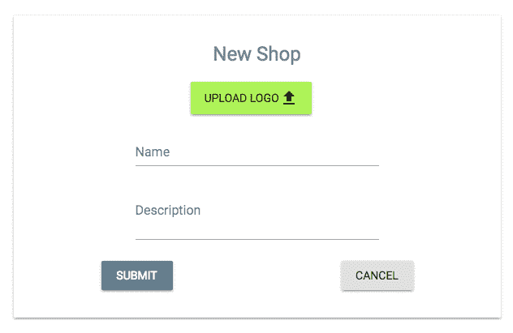

我们将使用 Material-UI 按钮和 HTML5 文件输入元素添加文件上传元素。

`mern-marketplace/client/shop/NewShop.js`：

```jsx
<input accept="image/*" onChange={this.handleChange('image')} 
       style={display:'none'} id="icon-button-file" type="file" />
<label htmlFor="icon-button-file">
   <Button raised color="secondary" component="span">
      Upload Logo <FileUpload/>
   </Button>
</label> 
<span> {this.state.image ? this.state.image.name : ''} </span>
```

名称和描述表单字段将使用`TextField`组件添加。

`mern-marketplace/client/shop/NewShop.js`：

```jsx
<TextField 
    id="name" 
    label="Name" 
    value={this.state.name} 
    onChange={this.handleChange('name')}/> <br/>
<TextField 
    id="multiline-flexible" 
    label="Description"
    multiline rows="2" 
    value={this.state.description}
    onChange={this.handleChange('description')}/>
```

这些表单字段的更改将通过`handleChange`方法进行跟踪。

`mern-marketplace/client/shop/NewShop.js`：

```jsx
handleChange = name => event => {
    const value = name === 'image'
      ? event.target.files[0]
      : event.target.value
    this.shopData.set(name, value)
    this.setState({ [name]: value })
}
```

`handleChange`方法更新状态并填充`shopData`，这是一个`FormData`对象，确保数据以`multipart/form-data`编码类型存储在正确的格式中。`shopData`对象在`componentDidMount`中初始化。

`mern-marketplace/client/shop/NewShop.js`：

```jsx
componentDidMount = () => {
  this.shopData = new FormData()
}
```

在表单提交时，`clickSubmit`函数中将调用`create` fetch 方法。

`mern-marketplace/client/shop/NewShop.js`：

```jsx
  clickSubmit = () => {
    const jwt = auth.isAuthenticated()
    create({
      userId: jwt.user._id
    }, {
      t: jwt.token
    }, this.shopData).then((data) => {
      if (data.error) {
        this.setState({error: data.error})
      } else {
        this.setState({error: '', redirect: true})
      }
    })
 }
```

在成功创建商店后，用户将被重定向回`MyShops`视图。

`mern-marketplace/client/shop/NewShop.js`：

```jsx
if (this.state.redirect) {
      return (<Redirect to={'/seller/shops'}/>)
}
```

`NewShop`组件只能由已登录的卖家用户查看。因此，我们将在`MainRouter`组件中添加一个`PrivateRoute`，该组件将仅在`/seller/shop/new`路径上为经过授权的用户呈现此表单。

`mern-marketplace/client/MainRouter.js`：

```jsx
<PrivateRoute path="/seller/shop/new" component={NewShop}/>
```

此链接可以添加到卖家可能访问的任何视图组件中。

# 列出商店

在 MERN Marketplace 中，普通用户将能够浏览平台上所有商店的列表，商店所有者将管理他们自己商店的列表。

# 列出所有商店

所有商店的列表将从后端获取并显示给最终用户。

# 商店列表 API

在后端，当服务器在`'/api/shops'`路径接收到 GET 请求时，我们将在`server/routes/shop.routes.js`中添加一个路由来检索数据库中存储的所有商店：

```jsx
router.route('/api/shops')
    .get(shopCtrl.list)
```

`shop.controller.js`中的`list`控制器方法将查询数据库中的商店集合，以返回所有商店。

`mern-marketplace/server/controllers/shop.controller.js`：

```jsx
const list = (req, res) => {
  Shop.find((err, shops) => {
    if (err) {
      return res.status(400).json({
        error: errorHandler.getErrorMessage(err)
      })
    }
    res.json(shops)
  })
}
```

# 获取视图的所有商店

在前端，为了使用此列表 API 获取商店，我们将在`client/shop/api-shop.js`中设置一个`fetch`方法：

```jsx
const list = () => {
  return fetch('/api/shops', {
    method: 'GET',
  }).then(response => {
    return response.json()
  }).catch((err) => console.log(err))
}
```

# 商店组件

在“商店”组件中，我们将在 Material-UI`List`中呈现商店列表，在组件挂载时获取数据并将数据设置为状态：

！[](assets/c67be761-9fe9-4ad4-bd31-e1f4418fb682.png)

在`componentDidMount`中调用`loadShops`方法以在组件挂载时加载商店。

`mern-marketplace/client/shop/Shops.js`：

```jsx
componentDidMount = () => {
    this.loadShops()
}
```

它使用`list`fetch 方法来检索商店列表并将数据设置为状态。

`mern-marketplace/client/shop/Shops.js`：

```jsx
loadShops = () => {
    list().then((data) => {
      if (data.error) {
        console.log(data.error)
      } else {
        this.setState({shops: data})
      }
    })
 }
```

在“商店”组件中，使用`map`迭代检索到的商店数组，每个商店的数据在视图中以 Material-UI`ListItem`的形式呈现，每个`ListItem`也链接到单独的商店视图。

`mern-marketplace/client/shop/Shops.js`：

```jsx
{this.state.shops.map((shop, i) => {
  return <Link to={"/shops/"+shop._id} key={i}>
          <Divider/>
          <ListItem button>
            <ListItemAvatar>
            <Avatar src={'/api/shops/logo/'+shop._id+"?" + new 
            Date().getTime()}/>
            </ListItemAvatar>
            <div>
              <Typography type="headline" component="h2" 
             color="primary">
                {shop.name}
              </Typography>
              <Typography type="subheading" component="h4">
                {shop.description}
              </Typography>
            </div>
           </ListItem><Divider/>
         </Link>})}
```

“商店”组件将由最终用户在`/shops/all`访问，使用 React Router 设置并在`MainRouter.js`中声明。

`mern-marketplace/client/MainRouter.js`：

```jsx
 <Route path="/shops/all" component={Shops}/>
```

# 按所有者列出商店

经授权的卖家将看到他们创建的商店列表，他们可以通过编辑或删除列表上的任何商店来管理。

# 按所有者查询商店 API

我们将在后端声明的商店路由中添加一个 GET 路由，以检索特定用户拥有的商店。

`mern-marketplace/server/routes/shop.routes.js`：

```jsx
router.route('/api/shops/by/:userId')
    .get(authCtrl.requireSignin, authCtrl.hasAuthorization, shopCtrl.listByOwner)
```

为了处理`:userId`参数并从数据库中检索关联的用户，我们将在用户控制器中利用`userByID`方法。我们将在`shop.routes.js`的`Shop`路由中添加以下内容，以便用户作为`profile`在`request`对象中可用。

`mern-marketplace/server/routes/shop.routes.js`：

```jsx
router.param('userId', userCtrl.userByID) 
```

`shop.controller.js`中的`listByOwner`控制器方法将查询数据库中的`Shop`集合以获取匹配的商店。

`mern-marketplace/server/controllers/shop.controller.js`：

```jsx
const listByOwner = (req, res) => {
  Shop.find({owner: req.profile._id}, (err, shops) => {
    if (err) {
      return res.status(400).json({
        error: errorHandler.getErrorMessage(err)
      })
    }
    res.json(shops)
  }).populate('owner', '_id name')
}
```

在对商店集合的查询中，我们找到所有`owner`字段与使用`userId`参数指定的用户匹配的商店。

# 获取用户拥有的所有商店以供查看

在前端，为了使用此按所有者列表 API 获取特定用户的商店，我们将在`client/shop/api-shop.js`中添加一个 fetch 方法：

```jsx
const listByOwner = (params, credentials) => {
  return fetch('/api/shops/by/'+params.userId, {
    method: 'GET',
    headers: {
      'Accept': 'application/json',
      'Authorization': 'Bearer ' + credentials.t
    }
  }).then((response) => {
    return response.json()
  }).catch((err) => {
    console.log(err)
  })
}
```

# MyShops 组件

`MyShops`组件类似于`Shops`组件，它在`componentDIdMount`中获取当前用户拥有的商店列表，并在`ListItem`中呈现每个商店：

！[](assets/616c4231-1720-4919-beac-fe405b705498.png)

此外，每个商店都有“编辑”和“删除”选项，而不像“商店”中的物品列表。

`mern-marketplace/client/shop/MyShops.js`：

```jsx
<ListItemSecondaryAction>
   <Link to={"/seller/shop/edit/" + shop._id}>
       <IconButton aria-label="Edit" color="primary">
             <Edit/>
       </IconButton>
   </Link>
   <DeleteShop shop={shop} onRemove={this.removeShop}/>
</ListItemSecondaryAction>
```

`编辑`按钮链接到编辑商店视图。`DeleteShop`组件处理删除操作，并通过调用从`MyShops`传递的`removeShop`方法来更新列表，以更新当前用户的修改后的商店列表状态。

`mern-marketplace/client/shop/MyShops.js`：

```jsx
removeShop = (shop) => {
    const updatedShops = this.state.shops
    const index = updatedShops.indexOf(shop)
    updatedShops.splice(index, 1)
    this.setState({shops: updatedShops})
}
```

`MyShops`组件只能被已登录且也是卖家的用户查看。因此，我们将在`MainRouter`组件中添加一个`PrivateRoute`，仅为授权用户在`/seller/shops`处呈现此组件。

`mern-marketplace/client/MainRouter.js`：

```jsx
<PrivateRoute path="/seller/shops" component={MyShops}/>
```

# 展示一个商店

任何浏览 MERN Marketplace 的用户都可以浏览每个单独的商店。

# 读取商店 API

在后端，我们将添加一个`GET`路由，用 ID 查询`Shop`集合并在响应中返回商店。

`mern-marketplace/server/routes/shop.routes.js`：

```jsx
router.route('/api/shop/:shopId')
    .get(shopCtrl.read)
router.param('shopId', shopCtrl.shopByID)
```

路由 URL 中的`:shopId`参数将调用`shopByID`控制器方法，类似于`userByID`控制器方法，从数据库中检索商店，并将其附加到请求对象中，以便在`next`方法中使用。

`mern-marketplace/server/controllers/shop.controller.js`：

```jsx
const shopByID = (req, res, next, id) => {
  Shop.findById(id).populate('owner', '_id name').exec((err, shop) => {
    if (err || !shop)
      return res.status('400').json({
        error: "Shop not found"
      })
    req.shop = shop
    next()
  })
}
```

然后`read`控制器方法将这个`shop`对象返回给客户端的响应中。

`mern-marketplace/server/controllers/shop.controller.js`：

```jsx
const read = (req, res) => {
  return res.json(req.shop)
}
```

# 在视图中获取商店

在`api-shop.js`中，我们将添加一个`fetch`方法来在前端使用这个读取 API。

`mern-marketplace/client/shop/api-shop.js`：

```jsx
const read = (params, credentials) => {
  return fetch('/api/shop/' + params.shopId, {
    method: 'GET'
  }).then((response) => {
    return response.json()
  }).catch((err)  => console.log(err) )
}
```

# 商店组件

`Shop`组件将呈现商店的详细信息，还使用产品列表组件呈现指定商店的产品列表，这将在*产品*部分讨论：

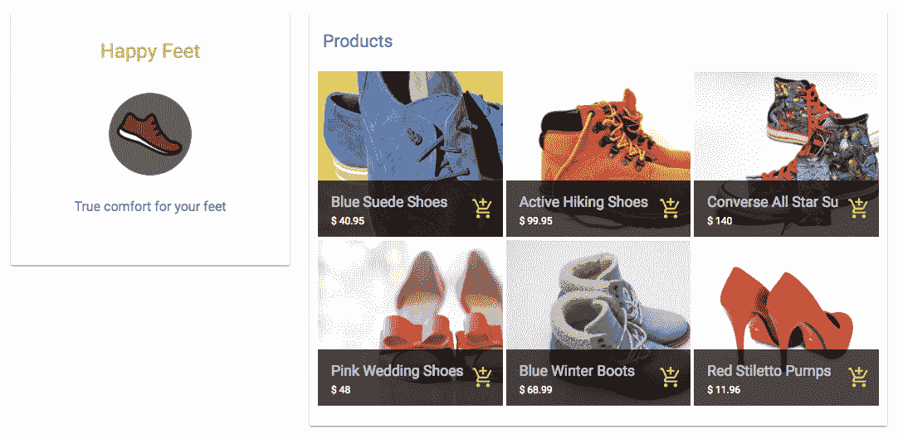

`Shop`组件可以在浏览器中通过`/shops/:shopId`路由访问，该路由在`MainRouter`中定义如下。

`mern-marketplace/client/MainRouter.js`：

```jsx
<Route path="/shops/:shopId" component={Shop}/>
```

在`componentDidMount`中，使用`api-shop.js`中的`read`方法获取商店详情。

`mern-marketplace/client/shop/Shop.js`：

```jsx
componentDidMount = () => {
    read({
      shopId: this.match.params.shopId
    }).then((data) => {
      if (data.error) {
        this.setState({error: data.error})
      } else {
        this.setState({shop: data})
      }
    })
}
```

检索到的商店数据被设置为状态，并在视图中呈现以显示商店的名称、logo 和描述。

`mern-marketplace/client/shop/Shop.js`：

```jsx
<CardContent>
   <Typography type="headline" component="h2">
       {this.state.shop.name}
   </Typography><br/>
   <Avatar src={logoUrl}/><br/>
   <Typography type="subheading" component="h2">
       {this.state.shop.description}
   </Typography><br/>
</CardContent>
```

如果存在，`logoUrl`指向从数据库中检索 logo 图像的路由，并定义如下。

`mern-marketplace/client/shop/Shop.js`：

```jsx
const logoUrl = this.state.shop._id
 ? `/api/shops/logo/${this.state.shop._id}?${new Date().getTime()}`
 : '/api/shops/defaultphoto'
```

# 编辑一个商店

授权卖家也可以编辑他们拥有的商店的详细信息。

# 编辑商店 API

在后端，我们将添加一个`PUT`路由，允许授权的卖家编辑他们的商店之一。

`mern-marketplace/server/routes/shop.routes.js`：

```jsx
router.route('/api/shops/:shopId')
    .put(authCtrl.requireSignin, shopCtrl.isOwner, shopCtrl.update)
```

`isOwner`控制器方法确保已登录的用户实际上是正在编辑的商店的所有者。

`mern-marketplace/server/controllers/shop.controller.js`：

```jsx
const isOwner = (req, res, next) => {
  const isOwner = req.shop && req.auth && req.shop.owner._id == 
   req.auth._id
  if(!isOwner){
    return res.status('403').json({
      error: "User is not authorized"
    })
  }
  next()
}
```

`update`控制器方法将使用`formidable`和`fs`模块，如前面讨论的`create`控制器方法一样，解析表单数据并更新数据库中的现有商店。

`mern-marketplace/server/controllers/shop.controller.js`：

```jsx
const update = (req, res, next) => {
  let form = new formidable.IncomingForm()
  form.keepExtensions = true
  form.parse(req, (err, fields, files) => {
    if (err) {
      res.status(400).json({
        message: "Photo could not be uploaded"
      })
    }
    let shop = req.shop
    shop = _.extend(shop, fields)
    shop.updated = Date.now()
    if(files.image){
      shop.image.data = fs.readFileSync(files.image.path)
      shop.image.contentType = files.image.type
    }
    shop.save((err) => {
      if (err) {
        return res.status(400).send({
          error: errorHandler.getErrorMessage(err)
        })
      }
      res.json(shop)
    })
  })
}
```

# 在视图中获取编辑 API

在视图中使用`fetch`方法调用编辑 API，该方法获取表单数据并将多部分请求发送到后端。

`mern-marketplace/client/shop/api-shop.js`：

```jsx
const update = (params, credentials, shop) => {
  return fetch('/api/shops/' + params.shopId, {
    method: 'PUT',
    headers: {
      'Accept': 'application/json',
      'Authorization': 'Bearer ' + credentials.t
    },
    body: shop
  }).then((response) => {
    return response.json()
  }).catch((err) => {
    console.log(err)
  })
}
```

# EditShop 组件

`EditShop`组件将显示一个类似于创建新商店表单的表单，预先填充现有商店的详细信息。该组件还将显示该商店中的产品列表，将在*产品*部分中讨论：

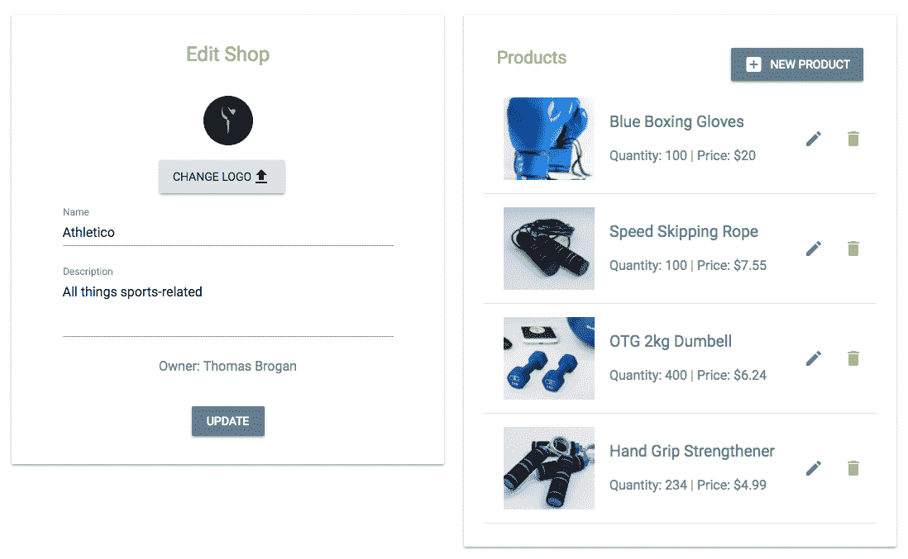

表单部分类似于`NewShop`组件中的表单，具有相同的表单字段和一个`formData`对象，该对象保存了与`update` fetch 方法一起发送的多部分表单数据。

`EditShop`组件只能被授权的商店所有者访问。因此，我们将在`MainRouter`组件中添加一个`PrivateRoute`，该组件将仅为`/seller/shop/edit/:shopId`上的授权用户呈现此组件。

`mern-marketplace/client/MainRouter.js`：

```jsx
<PrivateRoute path="/seller/shop/edit/:shopId" component={EditShop}/>
```

这个链接是在`MyShops`组件中为每个商店添加的编辑图标。

# 删除商店

授权的卖家可以从`MyShops`列表中删除他们自己的任何商店。

# 删除商店 API

在后端，我们将添加一个`DELETE`路由，允许授权的卖家删除他们自己的商店之一。

`mern-marketplace/server/routes/shop.routes.js`：

```jsx
router.route('/api/shops/:shopId')
    .delete(authCtrl.requireSignin, shopCtrl.isOwner, shopCtrl.remove)
```

`remove`控制器方法从数据库中删除指定的商店，如果`isOwner`确认已登录的用户是商店的所有者。

`mern-marketplace/server/controllers/shop.controller.js`：

```jsx
const remove = (req, res, next) => {
  let shop = req.shop
  shop.remove((err, deletedShop) => {
    if (err) {
      return res.status(400).json({
        error: errorHandler.getErrorMessage(err)
```

```jsx
      })
    }
    res.json(deletedShop)
  })
}
```

# 在视图中获取删除 API

我们将在前端添加一个相应的方法，向删除 API 发出删除请求。

`mern-marketplace/client/shop/api-shop.js`：

```jsx
const remove = (params, credentials) => {
  return fetch('/api/shops/' + params.shopId, {
    method: 'DELETE',
    headers: {
      'Accept': 'application/json',
      'Content-Type': 'application/json',
      'Authorization': 'Bearer ' + credentials.t
    }
  }).then((response) => {
    return response.json()
  }).catch((err) => {
    console.log(err)
  })
}
```

# DeleteShop 组件

`DeleteShop`组件添加到`MyShops`组件中，用于列表中的每个商店。它从`MyShops`中获取`shop`对象和`onRemove`方法作为 props：


该组件基本上是一个图标按钮，点击后会打开一个确认对话框，询问用户是否确定要删除他们的商店。

`mern-marketplace/client/shop/DeleteShop.js`：

```jsx
<IconButton aria-label="Delete" onClick={this.clickButton} color="secondary">
   <DeleteIcon/>
</IconButton>
<Dialog open={this.state.open} onRequestClose={this.handleRequestClose}>
   <DialogTitle>{"Delete "+this.props.shop.name}</DialogTitle>
      <DialogContent>
         <DialogContentText>
            Confirm to delete your shop {this.props.shop.name}.
         </DialogContentText>
      </DialogContent>
      <DialogActions>
         <Button onClick={this.handleRequestClose} color="primary">
            Cancel
         </Button>
         <Button onClick={this.deleteShop} color="secondary" 
          autoFocus="autoFocus">
            Confirm
         </Button>
      </DialogActions>
</Dialog>
```

在对话框中用户确认删除后，将调用`deleteShop`中的`delete`获取方法。

`mern-marketplace/client/shop/DeleteShop.js`：

```jsx
  deleteShop = () => {
    const jwt = auth.isAuthenticated()
    remove({
      shopId: this.props.shop._id
    }, {t: jwt.token}).then((data) => {
      if (data.error) {
        console.log(data.error)
      } else {
        this.setState({open: false}, () => {
          this.props.onRemove(this.props.shop)
        })
      }
    })
 }
```

成功删除后，对话框将关闭，并通过调用`onRemove`属性更新`MyShops`中的商店列表，该属性从`MyShops`中作为属性传递的`removeShop`方法获取。

这些商店视图将允许买家和卖家与商店互动。商店还将拥有产品，接下来将讨论，业主将管理这些产品，买家将通过浏览并选择添加到购物车的选项。

# 产品

产品是市场应用程序中最关键的方面。在 MERN Marketplace 中，卖家可以管理他们商店中的产品，访问者可以搜索和浏览产品。

# 产品模型

产品将存储在数据库中的产品集合中，使用 Mongoose 定义的模式。对于 MERN Marketplace，我们将保持产品模式简单，支持诸如产品名称、描述、图像、类别、数量、价格、创建时间、更新时间以及对商店的引用等字段。

+   **产品名称和描述**：`name`和`description`字段将是`String`类型，`name`为`required`字段：

```jsx
name: { 
    type: String, 
    trim: true, 
    required: 'Name is required' 
},
description: { 
    type: String, 
    trim: true 
},
```

+   **产品图片**：`image`字段将存储用户上传的图像文件作为 MongoDB 数据库中的数据：

```jsx
image: { 
    data: Buffer, 
    contentType: String 
},
```

+   **产品类别**：`category`值将允许将相同类型的产品分组在一起：

```jsx
category: { 
    type: String 
},
```

+   **产品数量**：`quantity`字段将表示商店中可供销售的数量：

```jsx
quantity: { 
    type: Number, 
    required: "Quantity is required" 
},
```

+   **产品价格**：`price`字段将保存该产品的单价：

```jsx
price: { 
    type: Number, 
    required: "Price is required" 
},
```

+   **产品商店**：`shop`字段将引用产品所添加的商店：

```jsx
shop: {
    type: mongoose.Schema.ObjectId, 
    ref: 'Shop'
}
```

+   **创建和更新时间**：`created`和`updated`字段将是`Date`类型，`created`在添加新产品时生成，当修改同一产品的详细信息时，`updated`时间会改变。

```jsx
updated: Date,
created: { 
    type: Date, 
    default: Date.now 
},
```

这个模式定义中的字段将使我们能够在 MERN Marketplace 中实现所有与产品相关的功能。

# 创建新产品

在 MERN Marketplace 中，卖家将能够向他们拥有的商店和平台上创建的商店添加新产品。

# 创建产品 API

在后端，我们将在`/api/products/by/:shopId`添加一个路由，接受包含产品数据的`POST`请求，以创建一个与`:shopId`参数标识的商店相关联的新产品。处理这个请求的代码将首先检查当前用户是否是将要添加新产品的商店的所有者，然后在数据库中创建新产品。

这个创建产品 API 路由在`product.routes.js`文件中声明，并利用了商店控制器中的`shopByID`和`isOwner`方法来处理`:shopId`参数，并验证当前用户是否为商店所有者。

`mern-marketplace/server/routes/product.routes.js`:

```jsx
router.route('/api/products/by/:shopId')
  .post(authCtrl.requireSignin, 
            shopCtrl.isOwner, 
                productCtrl.create)
router.param('shopId', shopCtrl.shopByID)
```

`product.routes.js`文件将与`shop.routes.js`文件非常相似，为了在 Express 应用程序中加载这些新路由，我们需要像为商店路由一样，在`express.js`中挂载产品路由。

在前端，为了使用这个创建 API，我们将在`client/product/api-product.js`中设置一个`fetch`方法，通过传递视图中的多部分表单数据，向创建 API 发起 POST 请求。

```jsx
app.use('/', productRoutes)
```

在产品控制器中，`create`方法使用`formidable` npm 模块来解析可能包含用户上传的图像文件和产品字段的多部分请求。然后将解析的数据保存到`Product`集合中作为新产品。

`mern-marketplace/server/controllers/product.controller.js`:

```jsx
const create = (req, res, next) => {
  let form = new formidable.IncomingForm()
  form.keepExtensions = true
  form.parse(req, (err, fields, files) => {
    if (err) {
      return res.status(400).json({
        message: "Image could not be uploaded"
      })
    }
    let product = new Product(fields)
    product.shop= req.shop
    if(files.image){
      product.image.data = fs.readFileSync(files.image.path)
      product.image.contentType = files.image.type
    }
    product.save((err, result) => {
      if (err) {
        return res.status(400).json({
          error: errorHandler.getErrorMessage(err)
        })
      }
      res.json(result)
    })
  })
}
```

# 在视图中获取创建 API

NewProduct 组件

在 MERN Marketplace 中，产品将以多种方式呈现给用户，两个主要区别在于产品在卖家列表和买家列表中的呈现方式。

```jsx
const create = (params, credentials, product) => {
  return fetch('/api/products/by/'+ params.shopId, {
      method: 'POST',
      headers: {
        'Accept': 'application/json',
        'Authorization': 'Bearer ' + credentials.t
      },
      body: product
    })
    .then((response) => {
      return response.json()
    }).catch((err) => console.log(err))
}
```

# 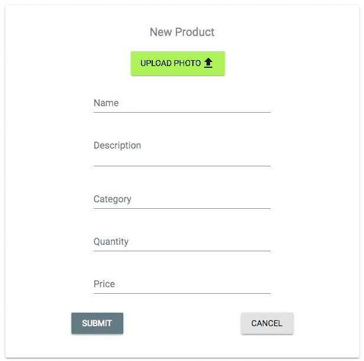

`NewProduct`组件将类似于`NewShop`组件。它将包含一个表单，允许卖家输入名称、描述、类别、数量和价格，并从本地文件系统上传产品图像文件。

列出产品

这个`NewProduct`组件只会在与特定商店相关联的路由上加载，因此只有已登录的卖家用户才能向他们拥有的商店添加产品。为了定义这个路由，我们在`MainRouter`组件中添加了一个`PrivateRoute`，它只会在`/seller/:shopId/products/new`上为经过授权的用户渲染这个表单。

`mern-marketplace/client/MainRouter.js`:

```jsx
<PrivateRoute path="/seller/:shopId/products/new" component={NewProduct}/>
```

# `mern-marketplace/server/express.js`:

`mern-marketplace/client/product/api-product.js`:

# 按商店列出

市场的访问者将浏览每个店铺中的产品，卖家将管理他们各自店铺中的产品列表。

# 按店铺 API

为了从数据库中检索特定店铺的产品，我们将在`/api/products/by/:shopId`设置一个 GET 路由，如下所示。

`mern-marketplace/server/routes/product.routes.js`:

```jsx
router.route('/api/products/by/:shopId')
    .get(productCtrl.listByShop)
```

对这个请求执行的`listByShop`控制器方法将查询产品集合，返回与给定店铺引用匹配的产品。

`mern-marketplace/server/controllers/product.controller.js`:

```jsx
const listByShop = (req, res) => {
  Product.find({shop: req.shop._id}, (err, products) => {
    if (err) {
      return res.status(400).json({
        error: errorHandler.getErrorMessage(err)
      })
    }
    res.json(products)
  }).populate('shop', '_id name').select('-image')
}
```

在前端，使用此列表按店铺 API 获取特定店铺的产品，我们将在`api-product.js`中添加一个 fetch 方法。

`mern-marketplace/client/product/api-product.js`:

```jsx
const listByShop = (params) => {
  return fetch('/api/products/by/'+params.shopId, {
    method: 'GET'
  }).then((response) => {
    return response.json()
  }).catch((err) => {
    console.log(err)
  }) 
}
```

# 买家的产品组件

`Products`组件主要用于向访问者展示可能购买的产品。我们将使用此组件来呈现与买家相关的产品列表。它将从显示产品列表的父组件中作为 props 接收产品列表。

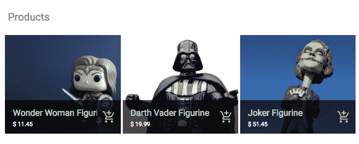

店铺中的产品列表将显示给用户在单独的`Shop`视图中。因此，将此`Products`组件添加到`Shop`组件中，并将相关产品列表作为 props 传递。`searched` prop 传递了这个列表是否是产品搜索的结果，因此可以呈现适当的消息。

`mern-marketplace/client/shop/Shop.js`:

```jsx
<Products products={this.state.products} searched={false}/></Card>
```

在`Shop`组件中，我们需要在`componentDidMount`中添加对`listByShop` fetch 方法的调用，以检索相关产品并将其设置为状态。

`mern-marketplace/client/shop/Shop.js`:

```jsx
listByShop({
      shopId: this.match.params.shopId
    }).then((data)=>{
      if (data.error) {
        this.setState({error: data.error})
      } else {
        this.setState({products: data})
      }
}) 
```

在`Products`组件中，如果 props 中发送的产品列表包含产品，那么将对列表进行迭代，并在 Material-UI 的`GridListTile`中呈现每个产品的相关细节，同时提供到单个产品视图的链接和一个`AddToCart`组件（其实现在第七章中讨论，*扩展订单和支付的市场*）。

`mern-marketplace/client/product/Products.js`:

```jsx
{this.props.products.length > 0 ?
   (<div><GridList cellHeight={200} cols={3}>
       {this.props.products.map((product, i) => (
          <GridListTile key={i}>
            <Link to={"/product/"+product._id}>
              
            </Link>
            <GridListTileBar
              title={<Link to={"/product/"+product._id}>{product.name}
           </Link>}
              subtitle={<span>$ {product.price}</span>}
              actionIcon={<AddToCart item={tile}/>}
             />
          </GridListTile>
       ))}
    </GridList></div>) : this.props.searched && 
      (<Typography type="subheading" component="h4">
                         No products found! :(</Typography>)}
```

这个`Products`组件用于呈现商店中的产品，按类别的产品以及搜索结果中的产品。

# 店主的 MyProducts 组件

与`Products`组件相比，`client/product/MyProducts.js`中的`MyProducts`组件仅用于向卖家展示产品，以便他们可以管理每个店铺中的产品。

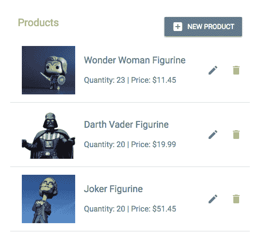

`MyProducts`组件被添加到`EditShop`视图中，这样卖家就可以在一个地方管理商店及其内容。它通过一个 prop 提供了商店的 ID，以便可以获取相关产品。

`mern-marketplace/client/shop/EditShop.js`:

```jsx
<MyProducts shopId={this.match.params.shopId}/>
```

在`MyProducts`中，相关产品首先在`componentDidMount`中加载。

`mern-marketplace/client/product/MyProducts.js`:

```jsx
componentDidMount = () => {
   this.loadProducts()
}
```

`loadProducts`方法使用相同的`listByShop`获取方法来检索商店中的产品，并将其设置为状态。

`mern-marketplace/client/product/MyProducts.js`:

```jsx
loadProducts = () => {
    listByShop({
      shopId: this.props.shopId
    }).then((data)=>{
      if (data.error) {
        this.setState({error: data.error})
      } else {
        this.setState({products: data})
      }
    })
}
```

遍历产品列表，并在`ListItem`中呈现每个产品，同时提供编辑和删除选项，类似于`MyShops`列表视图。编辑按钮链接到编辑产品视图。`DeleteProduct`组件处理删除操作，并通过调用从`MyProducts`传递的`onRemove`方法重新加载列表，以更新当前商店的产品列表状态。

`removeProduct`方法在`MyProducts`中定义，并作为`onRemove`prop 提供给`DeleteProduct`组件。

`mern-marketplace/client/product/MyProducts.js`:

```jsx
**removeProduct** = (product) => {
    const updatedProducts = this.state.products
    const index = updatedProducts.indexOf(product)
    updatedProducts.splice(index, 1)
    this.setState({shops: updatedProducts})
}   
...
<DeleteProduct
       product={product}
       shopId={this.props.shopId}
       **onRemove={this.removeProduct}**/> 
```

# 列出产品建议

访问 MERN Marketplace 的访客将看到产品建议，例如最新添加到市场的产品以及与他们当前查看的产品相关的产品。

# 最新产品

在 MERN Marketplace 的主页上，我们将显示最新添加到市场的五个产品。为了获取最新产品，我们将设置一个 API，该 API 将在`/api/products/latest`接收 GET 请求。

`mern-marketplace/server/routes/product.routes.js`:

```jsx
router.route('/api/products/latest')
      .get(productCtrl.listLatest)
```

`listLatest`控制器方法将对数据库中的产品列表按照`created`日期从新到旧进行排序，并在响应中返回排序后的列表中的前五个产品。

`mern-marketplace/server/controllers/product.controller.js`:

```jsx
const listLatest = (req, res) => {
  Product.find({}).sort('-created').limit(5).populate('shop', '_id   
  name').exec((err, products) => {
    if (err) {
      return res.status(400).json({
        error: errorHandler.getErrorMessage(err)
      })
    }
    res.json(products)
  })
}
```

在前端，我们将为这个最新的`products`API 设置一个对应的 fetch 方法，类似于检索商店列表的`fetch`。然后将检索到的列表呈现在添加到主页的`Suggestions`组件中。

# 相关产品

在每个单独的产品视图中，我们将显示五个相关产品作为建议。为了检索这些相关产品，我们将设置一个 API，该 API 将在`/api/products/related`接收请求。

`mern-marketplace/server/routes/product.routes.js`:

```jsx
router.route('/api/products/related/:productId')
              .get(productCtrl.listRelated)
router.param('productId', productCtrl.productByID)
```

路由 URL 中的`:productId`参数将调用`productByID`控制器方法，类似于`shopByID`控制器方法，从数据库中检索产品并将其附加到请求对象中，以便在`next`方法中使用。

`mern-marketplace/server/controllers/product.controller.js`：

```jsx
const productByID = (req, res, next, id) => {
  Product.findById(id).populate('shop', '_id name').exec((err, product) => {
    if (err || !product)
      return res.status('400').json({
        error: "Product not found"
      })
    req.product = product
    next()
  })
}
```

`listRelated`控制器方法查询`Product`集合，以查找具有与给定产品相同类别的其他产品，排除给定产品，并返回结果列表中的前五个产品。

`mern-marketplace/server/controllers/product.controller.js`：

```jsx
const listRelated = (req, res) => {
  Product.find({ "_id": { "$ne": req.product }, 
                "category": req.product.category}).limit(5)
         .populate('shop', '_id name')
         .exec((err, products) => {
            if (err) {
              return res.status(400).json({
              error: errorHandler.getErrorMessage(err)
            })
         }
    res.json(products)
  })
}
```

为了在前端利用这个相关产品的 API，我们将在`api-product.js`中设置一个对应的 fetch 方法。这个 fetch 方法将在`Product`组件中被调用，用于填充在产品视图中渲染的`Suggestions`组件。

# 建议组件

`Suggestions`组件将在主页和单个产品页面上呈现，分别显示最新产品和相关产品：

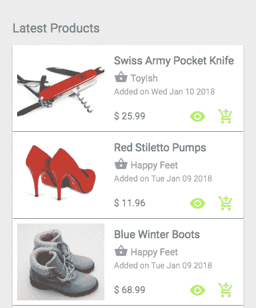

它将从父组件作为 props 接收相关的产品列表，以及列表的标题：

```jsx
<Suggestions  products={this.state.suggestions} title={this.state.suggestionTitle}/>
```

在`Suggestions`组件中，接收到的列表被迭代，并渲染出具体的产品细节，一个指向单个产品页面的链接，以及一个`AddToCart`组件。

`mern-marketplace/client/product/Suggestions.js`：

```jsx
<Typography type="title"> {this.props.title} </Typography>
{this.props.products.map((item, i) => { 
  return <span key={i}> 
           <Card>
             <CardMedia image={'/api/product/image/'+item._id} 
                        title={item.name}/>
                <CardContent>
                   <Link to={'/product/'+item._id}>
                     <Typography type="title" component="h3">
                    {item.name}</Typography>
                   </Link>
                   <Link to={'/shops/'+item.shop._id}>
                     <Typography type="subheading">
                        <Icon>shopping_basket</Icon> {item.shop.name}
                     </Typography>
                   </Link>
                   <Typography component="p">
                      Added on {(new 
                     Date(item.created)).toDateString()}
                   </Typography>
                </CardContent>
                <Typography type="subheading" component="h3">$ 
                 {item.price}</Typography>
 <Link to={'/product/'+item._id}>
                  <IconButton color="secondary" dense="dense">
                    <ViewIcon className={classes.iconButton}/>
                  </IconButton>
                </Link>
                <AddToCart item={item}/>
           </Card>
         </span>})}
```

# 显示一个产品

MERN Marketplace 的访客将能够浏览每个产品，显示在单独的视图中的更多细节。

# 阅读产品 API

在后端，我们将添加一个 GET 路由，用于查询带有 ID 的`Product`集合，并在响应中返回产品。

`mern-marketplace/server/routes/product.routes.js`：

```jsx
router.route('/api/products/:productId')
      .get(productCtrl.read) 
```

`：productId`参数调用`productByID`控制器方法，从数据库中检索产品并将其附加到请求对象。请求对象中的产品由`read`控制器方法使用，以响应`read`请求。

`mern-marketplace/server/controllers/product.controller.js`：

```jsx
const read = (req, res) => {
  req.product.image = undefined
  return res.json(req.product)
}
```

在`api-product.js`中，我们将添加一个 fetch 方法来在前端使用这个 read API。

`mern-marketplace/client/product/api-product.js`：

```jsx
const read = (params) => {
  return fetch('/api/products/' + params.productId, {
    method: 'GET'
  }).then((response) => {
    return response.json()
  }).catch((err) => console.log(err))
}
```

# 产品组件

`Product`组件将呈现产品细节，包括加入购物车选项，并显示相关产品列表：

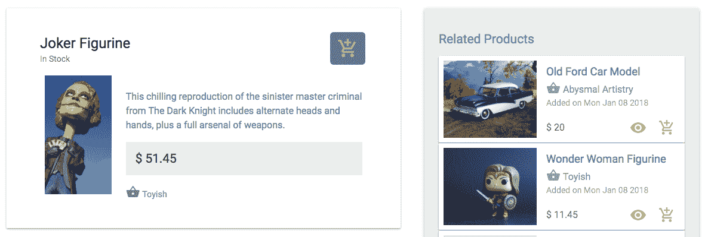

`Product` 组件可以在浏览器中通过 `/product/:productID` 路由访问，该路由在 `MainRouter` 中定义如下。

`mern-marketplace/client/MainRouter.js`:

```jsx
<Route path="/product/:productId" component={Product}/>
```

当组件挂载时，将获取产品详情和相关列表数据，或者在前端路由路径中的 `productId` 更改后，将接收新的 props，用户点击相关列表中的另一个产品时。

`mern-marketplace/client/product/Product.js`:

```jsx
  componentDidMount = () => {
    this.loadProduct(this.match.params.productId)
  }
  componentWillReceiveProps = (props) => {
    this.loadProduct(props.match.params.productId)
  }
```

`loadProduct` 方法调用 `read` 和 `listRelated` 获取产品和相关列表数据，然后将数据设置到状态中。

`mern-marketplace/client/product/Product.js`:

```jsx
loadProduct = (productId) => {
    read({productId: productId}).then((data) => {
      if (data.error) {
        this.setState({error: data.error})
      } else {
        this.setState({product: data})
        listRelated({
          productId: data._id}).then((data) => {
          if (data.error) {
            console.log(data.error)
          } else {
            this.setState({suggestions: data})
          }
        }) 
      }
    }) 
}
```

组件的产品详情部分显示有关产品的相关信息，以及在 Material-UI `Card` 组件中的 `AddToCart` 组件。

`mern-marketplace/client/product/Product.js`:

```jsx
<Card>
  <CardHeader
 action={<AddToCart cartStyle={classes.addCart} 
    item= {this.state.product}/>}
    title={this.state.product.name}
    subheader={this.state.product.quantity > 0? 'In Stock': 'Out of   
   Stock'}
  />
  <CardMedia image={imageUrl} title={this.state.product.name}/>
  <Typography component="p" type="subheading">
    {this.state.product.description}<br/>
 $ {this.state.product.price}
    <Link to={'/shops/'+this.state.product.shop._id}>
      <Icon>shopping_basket</Icon> {this.state.product.shop.name}
    </Link>
  </Typography>
</Card>
...
<Suggestions  products={this.state.suggestions} title='Related Products'/>
```

`Suggestions` 组件添加到产品视图中，相关列表数据作为 prop 传递。

# 编辑和删除产品

在应用程序中编辑和删除产品的实现与编辑和删除商店类似，如前几节所述。这些功能将需要后端中相应的 API、前端中的 fetch 方法，以及带有表单和操作的 React 组件视图。

# 编辑

编辑功能与创建产品非常相似，`EditProduct` 表单组件也只能由经过验证的卖家在 `/seller/:shopId/:productId/edit` 访问。

`mern-marketplace/client/MainRouter.js`:

```jsx
<PrivateRoute path="/seller/:shopId/:productId/edit" component={EditProduct}/>
```

`EditProduct` 组件包含与 `NewProduct` 相同的表单，使用读取产品 API 检索到的产品的填充值，并使用 fetch 方法将多部分表单数据发送到后端的编辑产品 API，位于 `/api/products/by/:shopId`。

`mern-marketplace/server/routes/product.routes.js`:

```jsx
router.route('/api/product/:shopId/:productId')
      .put(authCtrl.requireSignin, shopCtrl.isOwner, productCtrl.update)
```

`update` 控制器类似于产品 `create` 方法和商店 `update` 方法；它使用 `formidable` 处理多部分表单数据，并扩展产品详情以保存更新。

# 删除

`DeleteProduct` 组件添加到 `MyProducts` 组件中，用于列表中的每个产品，如前面讨论的。它从 `MyProducts` 中获取 `product` 对象、`shopID` 和 `loadProducts` 方法作为 prop。该组件类似于 `DeleteShop`，当用户确认删除意图时，它调用删除的 fetch 方法，向服务器发出 DELETE 请求，位于 `/api/product/:shopId/:productId`。

`mern-marketplace/server/routes/product.routes.js`：

```jsx
router.route('/api/product/:shopId/:productId')
      .delete(authCtrl.requireSignin, shopCtrl.isOwner, productCtrl.remove)
```

# 带类别的产品搜索

在 MERN Marketplace 中，访问者将能够按名称和特定类别搜索特定产品。

# 类别 API

为了让用户选择要搜索的特定类别，我们将设置一个 API，该 API 从数据库中的`Product`集合中检索所有不同的类别。对`/api/products/categories`的 GET 请求将返回一个唯一类别的数组。

`mern-marketplace/server/routes/product.routes.js`：

```jsx
router.route('/api/products/categories')
      .get(productCtrl.listCategories)
```

`listCategories`控制器方法通过对`category`字段进行`distinct`调用来查询`Product`集合。

`mern-marketplace/server/controllers/product.controller.js`：

```jsx
const listCategories = (req, res) => {
  Product.distinct('category',{},(err, products) => {
    if (err) {
      return res.status(400).json({
        error: errorHandler.getErrorMessage(err)
      })
    }
    res.json(products)
  })
}
```

这个类别 API 可以在前端使用相应的 fetch 方法来检索不同类别的数组，并在视图中显示。

# 搜索产品 API

搜索产品 API 将在`/api/products?search=value&category=value`处接收 GET 请求，URL 中带有查询参数，用于查询`Product`集合中提供的搜索文本和类别值。

`mern-marketplace/server/routes/product.routes.js`：

```jsx
router.route('/api/products')
      .get(productCtrl.list)
```

`list`控制器方法将首先处理请求中的查询参数，然后查找给定类别中的产品（如果有的话），这些产品的名称部分匹配提供的搜索文本。

`mern-marketplace/server/controllers/product.controller.js`：

```jsx
const list = (req, res) => {
  const query = {}
  if(req.query.search)
    query.name = {'$regex': req.query.search, '$options': "i"}
  if(req.query.category && req.query.category != 'All')
    query.category = req.query.category
  Product.find(query, (err, products) => {
    if (err) {
      return res.status(400).json({
        error: errorHandler.getErrorMessage(err)
      })
    }
    res.json(products)
  }).populate('shop', '_id name').select('-image')
}
```

# 获取视图的搜索结果

为了在前端利用这个搜索 API，我们将设置一个方法来构建带有查询参数的 URL，并调用 API 进行 fetch。

`mern-marketplace/client/product/api-product.js`：

```jsx
import queryString from 'query-string'
const list = (params) => {
  const query = queryString.stringify(params)
  return fetch('/api/products?'+query, {
    method: 'GET',
  }).then(response => {
    return response.json()
  }).catch((err) => console.log(err))
}
```

为了以正确的格式构造查询参数，我们将使用`query-string` npm 模块，它将帮助将参数对象字符串化为可以附加到请求路由的查询字符串。

# 搜索组件

应用类别 API 和搜索 API 的第一个用例是`Search`组件：

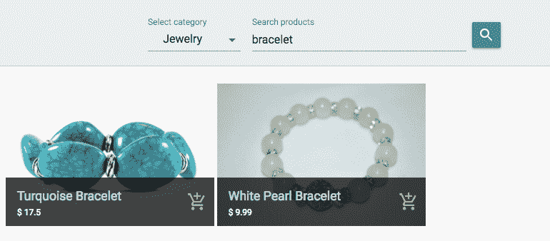

搜索组件为用户提供了一个简单的表单，其中包含一个搜索输入文本字段和一个下拉菜单，该下拉菜单包含从父组件接收的类别选项，父组件将使用不同类别的 API 检索列表。

`mern-marketplace/client/product/Search.js`：

```jsx
<TextField id="select-category" select label="Select category" value={this.state.category}
     onChange={this.handleChange('category')}
     SelectProps={{ MenuProps: { className: classes.menu, } }}>
  <MenuItem value="All"> All </MenuItem>
  {this.props.categories.map(option => (
    <MenuItem key={option} value={option}> {option} </MenuItem>
        ))}
</TextField>
<TextField id="search" label="Search products" type="search" onKeyDown={this.enterKey}
     onChange={this.handleChange('search')}
/>
<Button raised onClick={this.search}> Search </Button>
<Products products={this.state.results} searched={this.state.searched}/>

```

一旦用户输入搜索文本并点击*Enter*，就会调用搜索 API 来检索结果。

`mern-marketplace/client/product/Search.js`：

```jsx
search = () => {
    if(this.state.search){
      list({
        search: this.state.search || undefined, category: 
      this.state.category
      }).then((data) => {
        if (data.error) {
          console.log(data.error) 
        } else {
          this.setState({results: data, searched:true}) 
        }
      }) 
    }
  }
```

然后将结果数组作为 props 传递给“产品”组件，以在搜索表单下方呈现匹配的产品。

# 类别组件

“类别”组件是不同类别和搜索 API 的第二个用例。对于这个组件，我们首先在父组件中获取类别列表，并将其作为 props 发送以显示给用户：

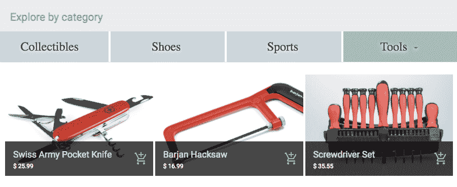

当用户在显示的列表中选择一个类别时，将使用搜索 API 调用一个类别值，并且后端返回所选类别中的所有产品。然后在“产品”组件中呈现返回的产品。

在 MERN Marketplace 的第一个版本中，用户可以成为卖家创建商店和添加产品，访问者可以浏览商店和搜索产品，同时应用程序还会向访问者推荐产品。

# 总结

在这一章中，我们开始使用 MERN 堆栈构建一个在线市场应用程序。MERN 骨架被扩展以向用户添加卖家角色，这样他们就可以创建商店并向每个商店添加产品，以便向其他用户出售。我们还探讨了如何利用堆栈来实现产品浏览、搜索以及对有兴趣购买的普通用户提出建议等功能。但是，一个市场应用程序如果没有购物车用于结账、订单管理和支付处理就是不完整的。

在下一章中，我们将扩展我们的应用程序以添加这些功能，并了解更多关于如何使用 MERN 堆栈来实现电子商务应用程序的核心方面。
