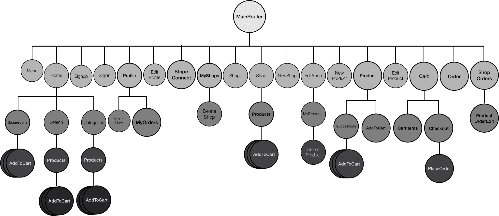
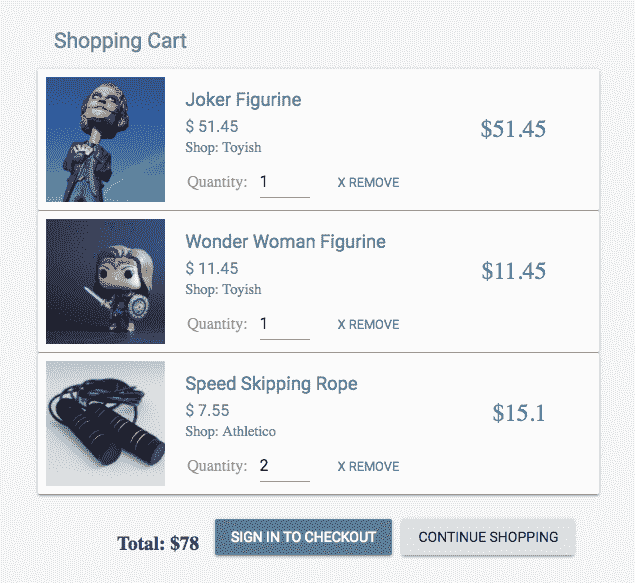
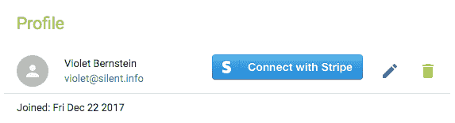
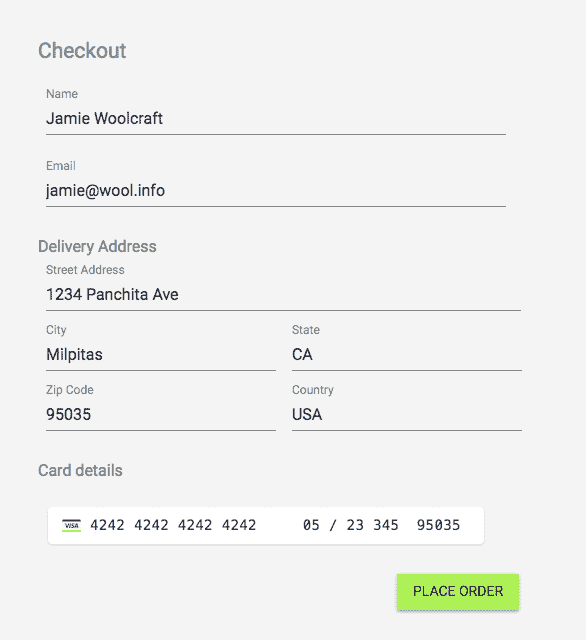
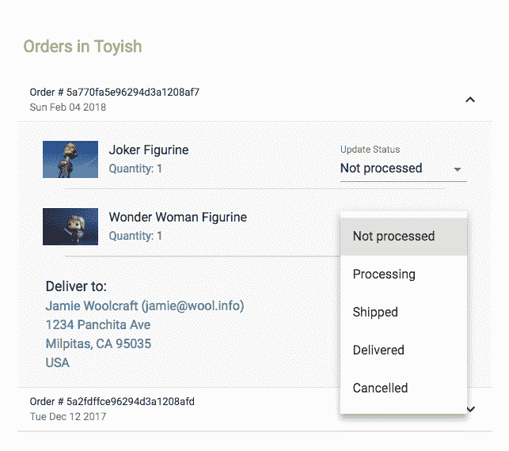
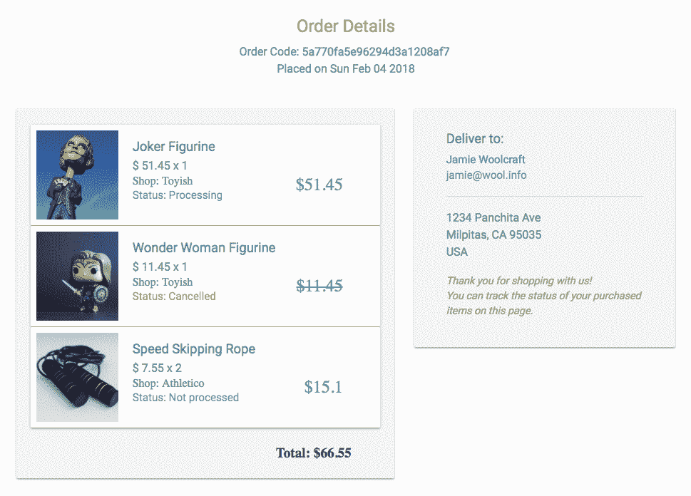
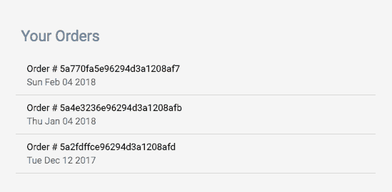

# 第七章：扩展市场以支持订单和付款

处理顾客下订单时的付款，并允许卖家管理这些订单是电子商务应用的关键方面。在本章中，我们将通过引入以下功能来扩展上一章中构建的在线市场：

+   购物车

+   使用 Stripe 进行付款处理

+   订单管理

# 具有购物车、付款和订单的 MERN 市场

在第六章中开发的 MERN 市场应用程序，*通过在线市场锻炼新的 MERN 技能* 将扩展到包括购物车功能、Stripe 集成以处理信用卡付款，以及基本的订单管理流程。以下的实现保持简单，以便作为开发这些功能更复杂版本的起点。

以下的组件树图显示了构成 MERN 市场前端的所有自定义组件。本章讨论的功能修改了一些现有的组件，如`Profile`、`MyShops`、`Products`和`Suggestions`，还添加了新的组件，如`AddToCart`、`MyOrders`、`Cart`和`ShopOrders`：

完整的 MERN 市场应用程序的代码可在 GitHub 上找到[github.com/shamahoque/mern-marketplace](https://github.com/shamahoque/mern-marketplace)。您可以在阅读本章其余部分的代码解释时，克隆此代码并运行应用程序。要使 Stripe 付款的代码工作，您需要创建自己的 Stripe 账户，并在`config/config.js`文件中更新您的测试值，包括 Stripe API 密钥、秘密密钥和 Stripe Connect 客户端 ID。

# 购物车

访问 MERN 市场的访客可以通过点击每个产品上的“加入购物车”按钮将他们想要购买的产品添加到购物车中。菜单中的购物车图标将指示已添加到购物车中的产品数量，当用户继续浏览市场时。他们还可以更新购物车内容，并通过打开购物车视图开始结账。但是，要完成结账并下订单，用户将需要登录。

购物车主要是一个前端功能，因此购物车详情将在客户端本地存储，直到用户在结账时下订单。为了实现购物车功能，我们将在`client/cart/cart-helper.js`中设置辅助方法，以帮助使用相关的 React 组件操纵购物车详情。

# 添加到购物车

`client/Cart/AddToCart.js`中的`AddToCart`组件从父组件中获取`product`对象和 CSS 样式对象作为 props。例如，在 MERN Marketplace 中，它被添加到产品视图中，如下所示：

```jsx
<AddToCart cartStyle={classes.addCart} item={this.state.product}/>
```

`AddToCart`组件本身根据传递的项目是否有库存显示购物车图标按钮：


例如，如果项目数量大于`0`，则显示`AddCartIcon`，否则呈现`DisabledCartIcon`。

`mern-marketplace/client/cart/AddToCart.js`：

```jsx
{this.props.item.quantity >= 0 ? 
    <IconButton color="accent" dense="dense" onClick={this.addToCart}>
      <AddCartIcon className={this.props.cartStyle || 
     classes.iconButton}/>
    </IconButton> : 
    <IconButton disabled={true} color="accent" dense="dense"
      <DisabledCartIcon className={this.props.cartStyle || 
     classes.disabledIconButton}/>
    </IconButton>}
```

当点击`AddCartIcon`按钮时，将调用`addToCart`方法。

`mern-marketplace/client/cart/AddToCart.js`：

```jsx
addToCart = () => {
    cart.addItem(this.props.item, () => {
      this.setState({redirect:true})
    })
}
```

在`cart-helper.js`中定义的`addItem`辅助方法，以`product`项目和更新状态的`callback`函数作为参数，然后将更新后的购物车详情存储在`localStorage`中并执行传递的回调。

`mern-marketplace/client/cart/cart-helper.js`：

```jsx
addItem(item, cb) {
    let cart = []
    if (typeof window !== "undefined") {
      if (localStorage.getItem('cart')) {
        cart = JSON.parse(localStorage.getItem('cart'))
      }
      cart.push({
        product: item,
        quantity: 1,
        shop: item.shop._id
      })
      localStorage.setItem('cart', JSON.stringify(cart))
      cb()
    }
}
```

存储在`localStorage`中的购物车数据包含一个购物车项目对象数组，每个对象包含产品详情，添加到购物车的产品数量（默认为`1`），以及产品所属商店的 ID。

# 菜单上的购物车图标

在菜单中，我们将添加一个链接到购物车视图，并添加一个徽章，显示存储在`localStorage`中的购物车数组的长度，以便直观地通知用户当前购物车中有多少商品：


购物车的链接将类似于菜单中的其他链接，唯一的区别是 Material-UI 的`Badge`组件显示购物车长度。

`mern-marketplace/client/core/Menu.js`：

```jsx
<Link to="/cart">
    <Button color={isActive(history, "/cart")}>
       Cart
       <Badge color="accent" badgeContent={cart.itemTotal()} >
           <CartIcon />
       </Badge>
    </Button>
</Link>
```

`itemTotal`辅助方法在`cart-helper.js`中返回购物车长度，它读取存储在`localStorage`中的购物车数组并返回数组的长度。

`mern-marketplace/client/cart/cart-helper.js`：

```jsx
itemTotal() {
    if (typeof window !== "undefined") {
      if (localStorage.getItem('cart')) {
        return JSON.parse(localStorage.getItem('cart')).length
      }
    }
    return 0
}
```

# 购物车视图

购物车视图将包含购物车项目和结账详情，但最初只会显示购物车详情，直到用户准备结账。

`mern-marketplace/client/cart/Cart.js`：

```jsx
<Grid container spacing={24}>
      <Grid item xs={6} sm={6}>
            <CartItems checkout={this.state.checkout}
 setCheckout={this.setCheckout}/>
      </Grid>
 {this.state.checkout && 
      <Grid item xs={6} sm={6}>
        <Checkout/>
      </Grid>}
</Grid>
```

`CartItems`组件被传递了一个`checkout`布尔值，以及一个用于更新此结账值的状态更新方法，以便基于用户交互来呈现`Checkout`组件和选项。

`mern-marketplace/client/cart/Cart.js`：

```jsx
setCheckout = val =>{
    this.setState({checkout: val})
}
```

`Cart`组件将在`/cart`路由处访问，因此我们需要在`MainRouter`组件中添加一个`Route`，如下所示。

`mern-marketplace/client/MainRouter.js`：

```jsx
<Route path="/cart" component={Cart}/>
```

# CartItems 组件

`CartItems`组件将允许用户查看和更新其购物车中当前的物品。如果用户已登录，还将为他们提供开始结账流程的选项：



如果购物车中包含物品，`CartItems`组件将遍历物品并呈现购物车中的产品。如果没有添加物品，则购物车视图只显示一条消息，说明购物车是空的。

`mern-marketplace/client/cart/CartItems.js`：

```jsx
{this.state.cartItems.length > 0 ? <span>
      {this.state.cartItems.map((item, i) => {
          ...          
            … Product details
              … Edit quantity
              … Remove product option
          ...
        })
      }
     … Show total price and Checkout options … 
    </span> : 
    <Typography type="subheading" component="h3" color="primary">
        No items added to your cart.    
    </Typography>
}
```

每个产品项目显示产品的详细信息和可编辑的数量文本字段，以及删除项目选项。最后，它显示购物车中物品的总价和开始结账的选项。

# 检索购物车详细信息

`cart-helper.js`中的`getCart`辅助方法从`localStorage`中检索并返回购物车详细信息。

`mern-marketplace/client/cart/cart-helper.js`：

```jsx
getCart() {
    if (typeof window !== "undefined") {
      if (localStorage.getItem('cart')) {
        return JSON.parse(localStorage.getItem('cart'))
      }
    }
    return []
}
```

在`CartItems`组件中，我们将使用`componentDidMount`中的`getCart`辅助方法检索购物车项目并将其设置为状态。

`mern-marketplace/client/cart/CartItems.js`：

```jsx
componentDidMount = () => {
    this.setState({cartItems: cart.getCart()})
}
```

然后使用`map`函数迭代从`localStorage`中检索的`cartItems`数组，以呈现每个项目的详细信息。

`mern-marketplace/client/cart/CartItems.js`：

```jsx
<span key={i}>
  <Card>
    <CardMedia image={'/api/product/image/'+item.product._id}
         title={item.product.name}/>
         <CardContent>
                <Link to={'/product/'+item.product._id}>
                    <Typography type="title" component="h3" 
                    color="primary">
                      {item.product.name}</Typography>
                </Link>
                <Typography type="subheading" component="h3" 
               color="primary">
                      $ {item.product.price}
                </Typography>
                <span>${item.product.price * item.quantity}</span>
                <span>Shop: {item.product.shop.name}</span>
         </CardContent>
         <div>
          … Editable quantity …
          … Remove item option ...
         </div>
 </Card>
  <Divider/>
</span> 
```

# 修改数量

为每个购物车项目呈现的可编辑数量`TextField`允许用户更新他们购买的每种产品的数量，并设置最小允许值为`1`。

`mern-marketplace/client/cart/CartItems.js`：

```jsx
Quantity: <TextField
          value={item.quantity}
          onChange={this.handleChange(i)}
          type="number"
          inputProps={{ min:1 }}
          InputLabelProps={{
            shrink: true,
          }}
        />
```

当用户更新此值时，将调用`handleChange`方法来强制执行最小值验证，更新状态中的`cartItems`，并使用辅助方法更新`localStorage`中的购物车。

`mern-marketplace/client/cart/CartItems.js`：

```jsx
handleChange = index => event => {
    let cartItems = this.state.cartItems 
    if(event.target.value == 0){
      cartItems[index].quantity = 1 
    }else{
      cartItems[index].quantity = event.target.value 
    }
    this.setState({cartItems: cartItems}) 
    cart.updateCart(index, event.target.value) 
  } 
```

`updateCart`辅助方法接受要在购物车数组中更新的产品的索引和新的数量值作为参数，并更新`localStorage`中存储的详细信息。

`mern-marketplace/client/cart/cart-helper.js`：

```jsx
updateCart(itemIndex, quantity) {
    let cart = []
    if (typeof window !== "undefined") {
      if (localStorage.getItem('cart')) {
        cart = JSON.parse(localStorage.getItem('cart'))
      }
      cart[itemIndex].quantity = quantity
      localStorage.setItem('cart', JSON.stringify(cart))
    }
}
```

# 删除项目

在购物车中为每个物品呈现的删除选项是一个按钮，当点击时，它将物品的数组索引传递给`removeItem`方法，以便从数组中删除它。

`mern-marketplace/client/cart/CartItems.js`：

```jsx
<Button color="primary" onClick={this.removeItem(i)}>x Remove</Button>
```

`removeItem`点击处理程序方法使用`removeItem`辅助方法从`localStorage`中删除购物车中的物品，然后更新状态中的`cartItems`。该方法还检查购物车是否已清空，因此可以使用从`Cart`组件传递的`setCheckout`函数来隐藏结账。

`mern-marketplace/client/cart/CartItems.js`：

```jsx
removeItem = index => event =>{
    let cartItems = cart.removeItem(index)
    if(cartItems.length == 0){
      this.props.setCheckout(false)
    }
    this.setState({cartItems: cartItems})
}
```

`cart-helper.js`中的`removeItem`辅助方法获取要从数组中删除的产品的索引，然后将其切出，并在返回更新后的`cart`数组之前更新`localStorage`。

`mern-marketplace/client/cart/cart-helper.js`：

```jsx
removeItem(itemIndex) {
    let cart = []
    if (typeof window !== "undefined") {
      if (localStorage.getItem('cart')) {
        cart = JSON.parse(localStorage.getItem('cart'))
      }
      cart.splice(itemIndex, 1)
      localStorage.setItem('cart', JSON.stringify(cart))
    }
    return cart
}
```

# 显示总价

在`CartItems`组件的底部，我们将显示购物车中物品的总价。

`mern-marketplace/client/cart/CartItems.js`：

```jsx
<span className={classes.total}>Total: ${this.getTotal()}</span>
```

`getTotal`方法将计算总价，考虑到`cartItems`数组中每个物品的单价和数量。

`mern-marketplace/client/cart/CartItems.js`：

```jsx
getTotal(){
    return this.state.cartItems.reduce( function(a, b){
        return a + (b.quantity*b.product.price)
    }, 0)
}
```

# 结账选项

用户将看到执行结账的选项，这取决于他们是否已登录以及结账是否已经打开。

`mern-marketplace/client/cart/CartItems.js`：

```jsx
{!this.props.checkout && (auth.isAuthenticated() ? 
    <Button onClick={this.openCheckout}>
        Checkout
    </Button> : 
    <Link to="/signin">
        <Button>Sign in to checkout</Button>
    </Link>)
}
```

当单击结账按钮时，`openCheckout`方法将使用作为属性传递的`setCheckout`方法在`Cart`组件中将结账值设置为`true`：

```jsx
openCheckout = () => {
    this.props.setCheckout(true)
}
```

一旦在购物车视图中将结账值设置为`true`，`Checkout`组件将被呈现，允许用户输入结账详情并下订单。

# 使用条纹进行支付

支付处理需要跨结账、订单创建和订单管理流程的实现。它还涉及对买家和卖家用户数据的更新。在我们深入讨论结账和订单功能的实现之前，我们将简要讨论使用条纹的支付处理选项和考虑事项，以及它在 MERN Marketplace 中的集成方式。

# 条纹

条纹提供了一套必要的工具，可以在任何 Web 应用程序中集成支付。这些工具可以根据应用程序的特定类型和正在实施的支付用例以不同的方式选择和使用。

在 MERN Marketplace 设置的情况下，应用程序本身将在 Stripe 上拥有一个平台，并且希望卖家在平台上连接 Stripe 账户，以便应用程序可以代表卖家对在结账时输入其信用卡详细信息的用户进行收费。在 MERN Marketplace 中，用户可以从不同商店添加产品到其购物车，因此他们的卡上的费用只会由应用程序为特定订购的产品创建，当卖家处理时。此外，卖家将完全控制从其 Stripe 仪表板上代表他们创建的费用。我们将演示如何使用 Stripe 提供的工具来使此付款设置工作。

Stripe 为每个工具提供了完整的文档和指南，并公开了在 Stripe 上设置的账户和平台的测试数据。为了在 MERN Marketplace 中实现付款，我们将使用测试密钥，并让您扩展实现以进行实时付款。

# 每个卖家的 Stripe 连接账户

为了代表卖家创建费用，应用程序将允许作为卖家的用户将其 Stripe 账户连接到其 MERN Marketplace 用户账户。

# 更新用户模型

在成功连接用户的 Stripe 账户后，我们将使用以下字段更新用户模型以存储 Stripe OAuth 凭据。

`mern-marketplace/server/models/user.model.js`：

```jsx
stripe_seller: {}
```

`stripe_seller`字段将存储卖家的 Stripe 账户凭据，并且在需要通过 Stripe 处理他们从商店出售的产品的收费时将使用此字段。

# 连接 Stripe 的按钮

在卖家的用户资料页面上，如果用户尚未连接其 Stripe 账户，我们将显示一个按钮，该按钮将带用户前往 Stripe 进行身份验证并连接其 Stripe 账户：



如果用户已成功连接其 Stripe 账户，我们将显示一个禁用的 STRIPE CONNECTED 按钮：


在`Profile`组件中添加的代码将首先检查用户是否是卖家，然后再渲染任何`STRIPE CONNECTED`按钮。然后，第二个检查将确认给定用户的`stripe_seller`字段中是否已经存在 Stripe 凭据。如果用户已经存在 Stripe 凭据，则显示禁用的`STRIPE CONNECTED`按钮，否则显示一个连接到 Stripe 的 OAuth 链接的链接。

`mern-marketplace/client/user/Profile.js`：

```jsx
{this.state.user.seller &&
   (this.state.user.stripe_seller ?
       (<Button variant="raised" disabled>
            Stripe connected
        </Button>) :
       (<a href={"https://connect.stripe.com/oauth/authorize?response_type=code&client_id="+config.stripe_connect_test_client_id+"&scope=read_write"}}>
           
        </a>)
)}
```

OAuth 链接获取平台的客户端 ID，我们将在`config`变量中设置，并将其他选项值作为查询参数。此链接将用户带到 Stripe，并允许用户连接现有的 Stripe 账户或创建新账户。然后一旦 Stripe 的认证过程完成，它会使用在 Stripe 仪表板上设置的重定向 URL 返回到我们的应用程序的平台连接设置。Stripe 将认证代码或错误消息作为查询参数附加到重定向 URL 上。

MERN Marketplace 重定向 URI 设置为`/seller/stripe/connect`，将呈现`StripeConnect`组件。

`mern-marketplace/client/MainRouter.js`：

```jsx
<Route path="/seller/stripe/connect" component={StripeConnect}/>
```

# `StripeConnect`组件

`StripeConnect`组件将基本上完成与 Stripe 的剩余认证过程步骤，并根据 Stripe 连接是否成功呈现相关消息：


当`StripeConnect`组件加载时，在`componentDidMount`中，我们将首先解析附加到来自 Stripe 重定向的 URL 的查询参数。对于解析，我们使用了之前用于产品搜索的相同`query-string` npm 模块。然后，如果 URL 的`query`参数包含认证代码，我们将在服务器上进行必要的 API 调用，以完成来自 Stripe 的 OAuth。

`mern-marketplace/client/user/StripeConnect.js`：

```jsx
  componentDidMount = () => {
    const parsed = queryString.parse(this.props.location.search)
    if(parsed.error){
      this.setState({error: true})
    }
    if(parsed.code){
      this.setState({connecting: true, error: false})
      const jwt = auth.isAuthenticated()
      stripeUpdate({
        userId: jwt.user._id
      }, {
        t: jwt.token
      }, parsed.code).then((data) => {
        if (data.error) {
          this.setState({error: true, connected: false,
          connecting:false})
        } else {
          this.setState({connected: true, connecting: false, 
          error:false})
        }
      })
    }
 }
```

`stripeUpdate` fetch 方法在`api-user.js`中定义，并将从 Stripe 检索的认证代码传递给我们将在服务器上设置的 API`'/api/stripe_auth/:userId'`。

`mern-marketplace/client/user/api-user.js`：

```jsx
const stripeUpdate = (params, credentials, auth_code) => {
  return fetch('/api/stripe_auth/'+params.userId, {
    method: 'PUT',
    headers: {
      'Accept': 'application/json',
      'Content-Type': 'application/json',
      'Authorization': 'Bearer ' + credentials.t
    },
    body: JSON.stringify({stripe: auth_code})
  }).then((response)=> {
    return response.json()
  }).catch((err) => {
    console.log(err)
  })
}
```

# Stripe 认证更新 API

一旦 Stripe 账户连接成功，为了完成 OAuth 过程，我们需要使用检索到的授权码从我们的服务器向 Stripe OAuth 发出 POST API 调用，并检索凭据以存储在卖家的用户账户中以处理收费。Stripe 授权更新 API 在`/api/stripe_auth/:userId`接收请求，并启动向 Stripe 发出 POST API 调用以检索凭据。

此 Stripe 授权更新 API 的路由将在用户路由中声明如下。

`mern-marketplace/server/routes/user.routes.js`：

```jsx
router.route('/api/stripe_auth/:userId')
   .put(authCtrl.requireSignin, authCtrl.hasAuthorization,   
    userCtrl.stripe_auth, userCtrl.update)
```

对这个路由的请求使用`stripe_auth`控制器方法从 Stripe 检索凭据，并将其传递给现有的用户更新方法以存储在数据库中。

为了从我们的服务器向 Stripe API 发出 POST 请求，我们将使用`request` npm 模块：

```jsx
npm install request --save
```

用户控制器中的`stripe_auth`控制器方法将如下所示。

`mern-marketplace/server/controllers/user.controller.js`：

```jsx
const stripe_auth = (req, res, next) => {
  request({
    url: "https://connect.stripe.com/oauth/token",
    method: "POST",
    json: true,
    body:  
  {client_secret:config.stripe_test_secret_key,code:req.body.stripe, 
  grant_type:'authorization_code'}
  }, (error, response, body) => {
    if(body.error){
      return res.status('400').json({
        error: body.error_description
      })
    }
    req.body.stripe_seller = body
    next()
  })
}
```

向 Stripe 发出的 POST API 调用需要平台的秘钥和检索到的授权码来完成授权，并返回连接账户的凭据，然后将其附加到请求体中，以便用户可以在`next()`方法中更新。

有了这些凭据，应用程序可以代表卖家在客户信用卡上创建收费。

# 用于结账的 Stripe Card Elements

在结账过程中，为了从用户那里收集信用卡详细信息，我们将使用 Stripe 的`Card` `Elements`来在结账表单中添加信用卡字段。为了将`Card` `Elements`与我们的 React 界面集成，我们将利用`react-stripe-elements` npm 模块：

```jsx
npm install --save react-stripe-elements
```

我们还需要在`template.js`中注入`Stripe.js`代码，以便在前端代码中访问 Stripe：

```jsx
<script id="stripe-js" src="https://js.stripe.com/v3/" async></script>
```

对于 MERN Marketplace，Stripe 仅在购物车视图中需要，在那里`Checkout`组件需要它来渲染`Card` `Elements`并处理卡片详细信息。因此，在`Cart`组件挂载后，我们将使用应用程序的 Stripe API 密钥初始化 Stripe 实例，在其`componentDidMount`中。

`mern-marketplace/client/cart/Cart.js`：

```jsx
componentDidMount = () => {
    if (window.Stripe) {
      this.setState({stripe: 
     window.Stripe(config.stripe_test_api_key)})
    } else {
      document.querySelector('#stripe-js')
     .addEventListener('load', () 
     => {
        this.setState({stripe: 
     window.Stripe(config.stripe_test_api_key)})
      })
    }
 }
```

在`Cart.js`中添加的`Checkout`组件应该使用`react-stripe-elements`中的`StripeProvider`组件进行包装，以便`Checkout`中的`Elements`可以访问 Stripe 实例。

`mern-marketplace/client/cart/Cart.js`：

```jsx
<StripeProvider stripe={this.state.stripe}> 
     <Checkout/>
</StripeProvider>
```

然后，在`Checkout`组件中，我们将使用 Stripe 的`Elements`组件。使用 Stripe 的`Card Elements`将使应用程序能够收集用户的信用卡详细信息，并使用 Stripe 实例对卡片信息进行标记，而不是在我们自己的服务器上处理。关于在结账流程中收集卡片详细信息和生成卡片令牌的实现将在*结账*和*创建新订单*部分讨论。

# Stripe 客户记录卡片详细信息

在结账流程结束时下订单时，生成的卡片令牌将被用来创建或更新代表我们用户的 Stripe 客户（[`stripe.com/docs/api#customers`](https://stripe.com/docs/api#customers)），这是一个存储信用卡信息的好方法（[`stripe.com/docs/saving-cards`](https://stripe.com/docs/saving-cards)），以便进一步使用，比如在卖家从他们的商店处理已订购的产品时，仅为购物车中的特定产品创建收费。这消除了在自己的服务器上安全存储用户信用卡详细信息的复杂性。

# 更新用户模型

为了在我们的数据库中跟踪用户对应的 Stripe`Customer`信息，我们将使用以下字段更新用户模型：

```jsx
stripe_customer: {},
```

# 更新用户控制器

当用户在输入信用卡详细信息后下订单时，我们将创建一个新的或更新现有的 Stripe 客户。为了实现这一点，我们将更新用户控制器，添加一个`stripeCustomer`方法，该方法将在我们的服务器收到请求创建订单 API（在*创建新订单*部分讨论）时，在创建订单之前被调用。

在`stripeCustomer`控制器方法中，我们将需要使用`stripe` npm 模块：

```jsx
npm install stripe --save
```

安装`stripe`模块后，需要将其导入到用户控制器文件中，并使用应用程序的 Stripe 秘钥初始化`stripe`实例。

`mern-marketplace/server/controllers/user.controller.js`：

```jsx
import stripe from 'stripe'
const myStripe = stripe(config.stripe_test_secret_key)
```

`stripeCustomer`控制器方法将首先检查当前用户是否已在数据库中存储了相应的 Stripe 客户，然后使用从前端收到的卡片令牌来创建一个新的 Stripe 客户或更新现有的客户。

# 创建一个新的 Stripe 客户

如果当前用户没有相应的 Stripe`客户`，换句话说，`stripe_customer`字段没有存储值，我们将使用 Stripe 的创建客户 API（[`stripe.com/docs/api#create_customer`](https://stripe.com/docs/api#create_customer)）。

`mern-marketplace/server/controllers/user.controller.js`:

```jsx
myStripe.customers.create({
            email: req.profile.email,
            source: req.body.token
      }).then((customer) => {
          User.update({'_id':req.profile._id},
            {'$set': { 'stripe_customer': customer.id }},
            (err, order) => {
              if (err) {
                return res.status(400).send({
                  error: errorHandler.getErrorMessage(err)
                })
              }
              req.body.order.payment_id = customer.id
              next()
        })
})
```

如果 Stripe 客户成功创建，我们将通过将 Stripe 客户 ID 引用存储在`stripe_customer`字段中来更新当前用户的数据。我们还将将此客户 ID 添加到正在下订单的订单中，以便更简单地创建与订单相关的收费。

# 更新现有的 Stripe 客户

对于现有的 Stripe 客户，换句话说，当前用户在`stripe_customer`字段中存储了一个值，我们将使用 Stripe API 来更新 Stripe 客户。

`mern-marketplace/server/controllers/user.controller.js`:

```jsx
 myStripe.customers.update(req.profile.stripe_customer, {
       source: req.body.token
     }, 
       (err, customer) => {
         if(err){
           return res.status(400).send({
             error: "Could not update charge details"
           })
         }
         req.body.order.payment_id = customer.id
         next()
       })
```

一旦 Stripe 客户成功更新，我们将在`next()`调用中将客户 ID 添加到正在创建的订单中。

虽然这里没有涉及，但 Stripe 客户功能可以进一步用于允许用户从应用程序中存储和更新他们的信用卡信息。

# 为每个处理的产品创建一个收费

当卖家通过处理其商店中订购的产品更新订单时，应用程序将代表卖家在客户的信用卡上为产品的成本创建一个收费。为了实现这一点，我们将更新`user.controller.js`文件，使用`createCharge`控制器方法来使用 Stripe 的创建收费 API，并需要卖家的 Stripe 账户 ID 以及买家的 Stripe 客户 ID。

`mern-marketplace/server/controllers/user.controller.js`:

```jsx
const createCharge = (req, res, next) => {
  if(!req.profile.stripe_seller){
    return res.status('400').json({
      error: "Please connect your Stripe account"
    })
  }
  myStripe.tokens.create({
    customer: req.order.payment_id,
  }, {
    stripe_account: req.profile.stripe_seller.stripe_user_id,
  }).then((token) => {
      myStripe.charges.create({
        amount: req.body.amount * 100, //amount in cents
        currency: "usd",
        source: token.id,
      }, {
        stripe_account: req.profile.stripe_seller.stripe_user_id,
      }).then((charge) => {
        next()
      })
  })
}
```

如果卖家尚未连接他们的 Stripe 账户，`createCharge`方法将返回 400 错误响应，以指示需要连接 Stripe 账户。

为了能够代表卖家的 Stripe 账户向 Stripe 客户收费，我们首先需要使用客户 ID 和卖家的 Stripe 账户 ID 生成一个 Stripe 令牌，然后使用该令牌创建一个收费。

当服务器收到请求将产品状态更改为**处理中**的订单更新请求时，将调用`createCharge`控制器方法（关于此订单更新请求的 API 实现将在*按商店排序的订单*部分讨论）。

这涵盖了与 MERN Marketplace 特定用例的支付处理实现相关的所有 Stripe 相关概念。现在我们将继续允许用户完成结账并下订单。

# 结账

已登录并且已将商品添加到购物车的用户将能够开始结账流程。结账表单将收集客户详细信息、送货地址信息和信用卡信息：



# 初始化结账详细信息

在`Checkout`组件中，我们将在收集表单详细信息之前，在状态中初始化`checkoutDetails`对象。

`mern-marketplace/client/cart/Checkout.js`：

```jsx
state = {
    checkoutDetails: {customer_name: '', customer_email:'', 
                      delivery_address: {street: '', city: '', state: 
                        '', zipcode: '', country:''}},
  }
```

组件挂载后，我们将根据当前用户的详细信息预填充客户详细信息，并将当前购物车商品添加到`checkoutDetails`中。

`mern-marketplace/client/cart/Checkout.js`：

```jsx
componentDidMount = () => {
    let user = auth.isAuthenticated().user
    let checkoutDetails = this.state.checkoutDetails
    checkoutDetails.products = cart.getCart()
    checkoutDetails.customer_name = user.name
    checkoutDetails.customer_email = user.email
    this.setState({checkoutDetails: checkoutDetails})
}
```

# 客户信息

在结账表单中，我们将添加文本字段以收集客户姓名和电子邮件。

`mern-marketplace/client/cart/Checkout.js`：

```jsx
<TextField id="name" label="Name" value={this.state.checkoutDetails.customer_name} onChange={this.handleCustomerChange('customer_name')}/>
<TextField id="email" type="email" label="Email" value={this.state.checkoutDetails.customer_email} onChange={this.handleCustomerChange('customer_email')}/><br/>

```

当用户更新值时，`handleCustomerChange`方法将更新状态中的相关详细信息：

```jsx
handleCustomerChange = name => event => {
    let checkoutDetails = this.state.checkoutDetails
    checkoutDetails[name] = event.target.value || undefined
    this.setState({checkoutDetails: checkoutDetails})
}
```

# 送货地址

为了从用户那里收集送货地址，我们将在结账表单中添加以下文本字段以收集街道地址、城市、邮政编码、州和国家。

`mern-marketplace/client/cart/Checkout.js`：

```jsx
<TextField id="street" label="Street Address" value={this.state.checkoutDetails.delivery_address.street} onChange={this.handleAddressChange('street')}/>
<TextField id="city" label="City" value={this.state.checkoutDetails.delivery_address.city} onChange={this.handleAddressChange('city')}/>
<TextField id="state" label="State" value={this.state.checkoutDetails.delivery_address.state} onChange={this.handleAddressChange('state')}/>
<TextField id="zipcode" label="Zip Code" value={this.state.checkoutDetails.delivery_address.zipcode} onChange={this.handleAddressChange('zipcode')}/>
<TextField id="country" label="Country" value={this.state.checkoutDetails.delivery_address.country} onChange={this.handleAddressChange('country')}/>
```

当用户更新这些地址字段时，`handleAddressChange`方法将更新状态中的相关详细信息。

`mern-marketplace/client/cart/Checkout.js`：

```jsx
handleAddressChange = name => event => {
    let checkoutDetails = this.state.checkoutDetails
    checkoutDetails.delivery_address[name] = event.target.value || 
    undefined
    this.setState({checkoutDetails: checkoutDetails})
}
```

# PlaceOrder 组件

将使用来自`react-stripe-elements`的 Stripe 的`CardElement`组件将信用卡字段添加到结账表单中。

`CardElement`组件必须是使用`injectStripe` **higher-order component** (**HOC**)构建的支付表单组件的一部分，并且使用`Elements`组件进行包装。因此，我们将创建一个名为`PlaceOrder`的组件，其中包含`injectStripe`，它将包含 Stripe 的`CardElement`和`PlaceOrder`按钮。

`mern-marketplace/client/cart/PlaceOrder.js`：

```jsx
class **PlaceOrder** extends Component { … } export default **injectStripe**(withStyles(styles)(PlaceOrder))
```

然后我们将在结账表单中添加`PlaceOrder`组件，将`checkoutDetails`对象作为 prop 传递给它，并使用来自`react-stripe-elements`的`Elements`组件进行包装。

`mern-marketplace/client/cart/Checkout.js`：

```jsx
<Elements> <PlaceOrder checkoutDetails={this.state.checkoutDetails} /> </Elements>
```

`injectStripe` HOC 提供了`this.props.stripe`属性，用于管理`Elements`组。这将允许我们在`PlaceOrder`中调用`this.props.stripe.createToken`来提交卡片详情到 Stripe 并获取卡片令牌。

# Stripe CardElement 组件

Stripe 的`CardElement`是自包含的，因此我们只需将其添加到`PlaceOrder`组件中，然后根据需要添加样式，卡片详情输入就会被处理。

`mern-marketplace/client/cart/PlaceOrder.js`：

```jsx
<CardElement className={classes.StripeElement}
      {...{style: {
      base: {
        color: '#424770',
        letterSpacing: '0.025em',
        '::placeholder': {
          color: '#aab7c4',
        },
      },
      invalid: {
        color: '#9e2146',
      },
    }}}/>
```

# 下订单

在`PlaceOrder`组件中的`CardElement`之后，也放置了“下订单”按钮。

`mern-marketplace/client/cart/PlaceOrder.js`：

```jsx
<Button color="secondary" variant="raised" onClick={this.placeOrder}>Place Order</Button>
```

点击“下订单”按钮将调用`placeOrder`方法，该方法将尝试使用`stripe.createToken`对卡片详情进行标记。如果失败，用户将被告知错误，但如果成功，结账详情和生成的卡片令牌将被发送到我们服务器的创建订单 API（在下一节中介绍）。

`mern-marketplace/client/cart/PlaceOrder.js`：

```jsx
placeOrder = ()=>{
  this.props.stripe.createToken().then(payload => {
      if(payload.error){
        this.setState({error: payload.error.message})
      }else{
        const jwt = auth.isAuthenticated()
        create({userId:jwt.user._id}, {
          t: jwt.token
        }, this.props.checkoutDetails, payload.token.id).then((data) => 
        {
          if (data.error) {
            this.setState({error: data.error})
          } else {
            cart.emptyCart(()=> {
              this.setState({'orderId':data._id,'redirect': true})
            })
          }
        })
      }
  })
}
```

在`client/order/api-order.js`中定义了`create` fetch 方法，该方法向后端的创建订单 API 发出 POST 请求。它将结账详情、卡片令牌和用户凭据作为参数，并将其发送到`/api/orders/:userId`的 API。

`mern-marketplace/client/order/api-order.js`：

```jsx
const create = (params, credentials, order, token) => {
  return fetch('/api/orders/'+params.userId, {
      method: 'POST',
      headers: {
        'Accept': 'application/json',
        'Content-Type': 'application/json',
        'Authorization': 'Bearer ' + credentials.t
      },
      body: JSON.stringify({order: order, token:token})
    })
    .then((response) => {
      return response.json()
    }).catch((err) => console.log(err))
}
```

# 购物车为空

如果创建订单 API 成功，我们将使用`cart-helper.js`中的`emptyCart`辅助方法清空购物车。

`mern-marketplace/client/cart/cart-helper.js`：

```jsx
emptyCart(cb) {
  if(typeof window !== "undefined"){
     localStorage.removeItem('cart')
     cb()
  }
}
```

`emptyCart`方法从`localStorage`中移除购物车对象，并通过执行传递的回调来更新视图的状态。

# 重定向到订单视图

下订单并清空购物车后，用户将被重定向到订单视图，该视图将显示刚刚下的订单的详细信息。

`mern-marketplace/client/cart/PlaceOrder.js`：

```jsx
if (this.state.redirect) {
      return (<Redirect to={'/order/' + this.state.orderId}/>)
}
```

这将表明结账过程已经完成，并成功调用了我们在服务器端设置的创建订单 API，用于在数据库中创建和存储订单。

# 创建新订单

当用户下订单时，将使用在结账时确认的订单详情来在数据库中创建新的订单记录，更新或创建用户的 Stripe 客户端，并减少已订购产品的库存数量。

# 订单模型

为了存储订单，我们将为订单模型定义一个 Mongoose 模式，记录客户详细信息以及用户帐户引用，交货地址信息，付款参考，创建和更新时间戳，以及一个订购产品的数组，其中每个产品的结构将在名为`CartItemSchema`的单独子模式中定义。

# 下订单者和客户

为了记录订单面向的客户的详细信息，我们将在`Order`模式中添加`customer_name`和`customer_email`字段。

`mern-marketplace/server/models/order.model.js`：

```jsx
customer_name: { type: String, trim: true, required: 'Name is required' },
customer_email: { type: String, trim: true,
    match: [/.+\@.+\..+/, 'Please fill a valid email address'],
    required: 'Email is required' }
```

为了引用下订单的已登录用户，我们将添加一个`ordered_by`字段。

`mern-marketplace/server/models/order.model.js`：

```jsx
ordered_by: {type: mongoose.Schema.ObjectId, ref: 'User'}
```

# 交货地址

订单的交货地址信息将存储在交货地址子文档中，其中包括`street`，`city`，`state`，`zipcode`和`country`字段。

`mern-marketplace/server/models/order.model.js`：

```jsx
delivery_address: {
    street: {type: String, required: 'Street is required'},
    city: {type: String, required: 'City is required'},
    state: {type: String},
    zipcode: {type: String, required: 'Zip Code is required'},
    country: {type: String, required: 'Country is required'}
  },
```

# 付款参考

付款信息将在订单更新时相关，卖家处理订购产品后需要创建费用时。我们将在`Order`模式的`payment_id`字段中记录与信用卡详细信息相关的 Stripe 客户 ID。

`mern-marketplace/server/models/order.model.js`：

```jsx
payment_id: {},
```

# 订购的产品

订单的主要内容将是订购产品的列表以及每个产品的数量等详细信息。我们将在`Order`模式的一个名为`products`的字段中记录此列表。每个产品的结构将在`CartItemSchema`中单独定义。

`mern-marketplace/server/models/order.model.js`：

```jsx
products: [CartItemSchema],
```

# 购物车项目模式

`CartItem`模式将代表每个订购的产品。它将包含对产品的引用，用户订购的产品数量，产品所属商店的引用以及状态。

`mern-marketplace/server/models/order.model.js`：

```jsx
const CartItemSchema = new mongoose.Schema({
  product: {type: mongoose.Schema.ObjectId, ref: 'Product'},
  quantity: Number,
  shop: {type: mongoose.Schema.ObjectId, ref: 'Shop'},
  status: {type: String,
    default: 'Not processed',
    enum: ['Not processed' , 'Processing', 'Shipped', 'Delivered', 
   'Cancelled']}
}) 
const CartItem = mongoose.model('CartItem', CartItemSchema)
```

产品的`status`只能具有枚举中定义的值，表示卖家更新的产品订购的当前状态。

在这里定义的`Order`模式将记录客户和卖家完成订购产品的购买步骤所需的详细信息。

# 创建订单 API

创建订单 API 路由在`server/routes/order.routes.js`中声明。订单路由将与用户路由非常相似。要在 Express 应用程序中加载订单路由，我们需要在`express.js`中挂载路由，就像我们为 auth 和 user 路由所做的那样。

`mern-marketplace/server/express.js`：

```jsx
app.use('/', orderRoutes)
```

当创建订单 API 在`/api/orders/:userId`接收到 POST 请求时，将按以下顺序执行一系列操作。

+   确保用户已登录

+   使用之前讨论过的`stripeCustomer`用户控制器方法，创建或更新 Stripe`Customer`

+   使用`decreaseQuanity`产品控制器方法，更新所有订购产品的库存数量

+   使用`create`订单控制器方法在订单集合中创建订单

路由将被定义如下。

`mern-marketplace/server/routes/order.routes.js`：

```jsx
router.route('/api/orders/:userId') 
    .post(authCtrl.requireSignin, userCtrl.stripeCustomer, 
          productCtrl.decreaseQuantity, orderCtrl.create)
```

为了检索与路由中的`:userId`参数相关联的用户，我们将使用`userByID`用户控制器方法，该方法从用户集合中获取用户，并将其附加到请求对象中，以便下一个方法访问。我们将在订单路由中添加它。

`mern-marketplace/server/routes/order.routes.js`：

```jsx
router.param('userId', userCtrl.userByID)
```

# 减少产品库存数量

我们将更新产品控制器文件，添加`decreaseQuantity`控制器方法，该方法将更新新订单中购买的所有产品的库存数量。

`mern-marketplace/server/controllers/product.controller.js`：

```jsx
const decreaseQuantity = (req, res, next) => {
  let bulkOps = req.body.order.products.map((item) => {
    return {
        "updateOne": {
            "filter": { "_id": item.product._id } ,
            "update": { "$inc": {"quantity": -item.quantity} }
        }
    }
   })
   Product.bulkWrite(bulkOps, {}, (err, products) => {
     if(err){
       return res.status(400).json({
         error: "Could not update product"
       })
     }
     next()
   })
}
```

在这种情况下，更新操作涉及在与产品数组匹配后对集合中的多个产品进行批量更新，我们将使用 MongoDB 中的`bulkWrite`方法，以便一次性向 MongoDB 服务器发送多个`updateOne`操作。首先使用`map`函数将需要的多个`updateOne`操作列在`bulkOps`中。这将比发送多个独立的保存或更新操作更快，因为使用`bulkWrite()`只需要一次往返到 MongoDB。

# 创建订单控制器方法

在订单控制器中定义的`create`控制器方法接收订单详情，创建新订单，并将其保存到 MongoDB 的订单集合中。

`mern-marketplace/server/controllers/order.controller.js`：

```jsx
const create = (req, res) => {
  req.body.order.user = req.profile
  const order = new Order(req.body.order)
  order.save((err, result) => {
    if (err) {
      return res.status(400).json({
        error: errorHandler.getErrorMessage(err)
      })
    }
    res.status(200).json(result)
  })
}
```

通过这样的实现，任何在 MERN Marketplace 上登录的用户都可以创建并将订单存储在后端。现在我们可以设置 API 来获取用户的订单列表、商店的订单列表，或者读取单个订单并将获取的数据显示在前端视图中。

# 商店的订单

市场的一个重要特性是允许卖家查看和更新他们在商店中收到的订单的状态。为了实现这一点，我们首先将设置 API 来按商店列出订单，然后在卖家更改已购买产品的状态时更新订单。

# 按商店列出 API

我们将实现一个 API 来获取特定商店的订单，这样经过身份验证的卖家可以查看他们每个商店的订单。对于这个 API 的请求将在`'/api/orders/shop/:shopId`接收，路由在`order.routes.js`中定义如下。

`mern-marketplace/server/routes/order.routes.js`：

```jsx
router.route('/api/orders/shop/:shopId') 
    .get(authCtrl.requireSignin, shopCtrl.isOwner, orderCtrl.listByShop)
router.param('shopId', shopCtrl.shopByID)
```

为了检索与路由中的`:shopId`参数相关联的商店，我们将使用`shopByID`商店控制器方法，该方法从商店集合中获取商店并将其附加到请求对象中，以便下一个方法访问。

`listByShop`控制器方法将检索具有与匹配商店 ID 购买的产品的订单，然后按日期从最近到最旧的顺序填充每个产品的 ID、名称和价格字段。

`mern-marketplace/server/controllers/order.controller.js`：

```jsx
const listByShop = (req, res) => {
  Order.find({"products.shop": req.shop._id})
  .populate({path: 'products.product', select: '_id name price'})
  .sort('-created')
  .exec((err, orders) => {
    if (err) {
      return res.status(400).json({
        error: errorHandler.getErrorMessage(err)
      })
    }
    res.json(orders)
  })
}
```

为了在前端获取这个 API，我们将在`api-order.js`中添加一个相应的`listByShop`方法，用于在`ShopOrders`组件中显示每个商店的订单。

`mern-marketplace/client/order/api-order.js`：

```jsx
const listByShop = (params, credentials) => {
  return fetch('/api/orders/shop/'+params.shopId, {
    method: 'GET',
    headers: {
      'Accept': 'application/json',
      'Authorization': 'Bearer ' + credentials.t
    }
  }).then((response) => {
    return response.json()
  }).catch((err) => {
    console.log(err)
  })
}
```

# ShopOrders 组件

卖家将在`ShopOrders`组件中查看他们的订单列表，每个订单只显示与商店相关的已购买产品，并允许卖家使用可能状态值的下拉菜单更改产品的状态：



我们将在`MainRouter`中更新一个`PrivateRoute`，以在`/seller/orders/:shop/:shopId`路由处加载`ShopOrders`组件。

`mern-marketplace/client/MainRouter.js`：

```jsx
<PrivateRoute path="/seller/orders/:shop/:shopId" component={ShopOrders}/>
```

# 列出订单

当`ShopOrders`组件挂载时，我们将使用`listByShop`获取方法加载相关订单，并将检索到的订单设置为状态。

`mern-marketplace/client/order/ShopOrders.js`：

```jsx
 loadOrders = () => {
    const jwt = auth.isAuthenticated()
    listByShop({
      shopId: this.match.params.shopId
    }, {t: jwt.token}).then((data) => {
      if (data.error) {
        console.log(data)
      } else {
        this.setState({orders: data})
      }
    })
 }
```

在视图中，我们将遍历订单列表，并在`Material-UI`的可折叠列表中呈现每个订单，点击时会展开。

`mern-marketplace/client/order/ShopOrders.js`：

```jsx
<Typography type="title"> Orders in {this.match.params.shop} </Typography>
<List dense> {this.state.orders.map((order, index) => { return 
    <span key={index}>
        <ListItem button onClick={this.handleClick(index)}>
           <ListItemText primary={'Order # '+order._id} 
                 secondary={(new Date(order.created)).toDateString()}/>
           {this.state.open == index ? <ExpandLess /> : <ExpandMore />}
        </ListItem>
        <Collapse component="li" in={this.state.open == index} 
       timeout="auto" unmountOnExit>
           <ProductOrderEdit shopId={this.match.params.shopId} 
           order={order} orderIndex={index} 
           updateOrders={this.updateOrders}/>
           <Typography type="subheading"> Deliver to:</Typography>
           <Typography type="subheading" color="primary">
               {order.customer_name} ({order.customer_email})
          </Typography>
           <Typography type="subheading" color="primary">
               {order.delivery_address.street}</Typography>
           <Typography type="subheading" color="primary">
               {order.delivery_address.city}, 
           {order.delivery_address.state}
               {order.delivery_address.zipcode}</Typography>
           <Typography type="subheading" color="primary">
               {order.delivery_address.country}</Typography>
        </Collapse>
    </span>})}
</List>
```

每个展开的订单将显示订单详情和`ProductOrderEdit`组件。`ProductOrderEdit`组件将显示已购买的产品，并允许卖家编辑每个产品的状态。`updateOrders`方法作为属性传递给`ProductOrderEdit`组件，以便在更改产品状态时可以更新状态。

`mern-marketplace/client/order/ShopOrders.js`：

```jsx
updateOrders = (index, updatedOrder) => {
    let orders = this.state.orders 
    orders[index] = updatedOrder 
    this.setState({orders: orders}) 
}
```

# 产品订单编辑组件

`ProductOrderEdit`组件将订单对象作为属性，并遍历订单的产品数组，仅显示从当前商店购买的产品，以及更改每个产品状态值的下拉菜单。

`mern-marketplace/client/order/ProductOrderEdit.js`：

```jsx
{this.props.order.products.map((item, index) => { return <span key={index}> 
     { item.shop == this.props.shopId && 
          <ListItem button>
              <ListItemText primary={ <div>
                      
                     {item.product.name}
                     <p>{"Quantity: "+item.quantity}</p>
              </div>}/>
              <TextField id="select-status" select
                   label="Update Status" value={item.status}
                   onChange={this.handleStatusChange(index)}
                   SelectProps={{
                       MenuProps: { className: classes.menu },
                   }}>
                      {this.state.statusValues.map(option => (
                          <MenuItem key={option} value={option}>
                            {option}
                          </MenuItem>
                      ))}
              </TextField>
          </ListItem>}
```

在加载`ProductOrderEdit`组件时，从服务器获取可能的状态值列表，并设置为`statusValues`状态，以在下拉菜单中呈现为`MenuItem`。

`mern-marketplace/client/order/ProductOrderEdit.js`：

```jsx
loadStatusValues = () => {
    getStatusValues().then((data) => {
      if (data.error) {
        this.setState({error: "Could not get status"})
      } else {
        this.setState({statusValues: data, error: ''})
      }
    })
}
```

当从可能的状态值中选择一个选项时，将调用`handleStatusChange`方法来更新状态中的订单，并根据所选状态的值发送请求到适当的后端 API。

`mern-marketplace/client/order/ProductOrderEdit.js`：

```jsx
handleStatusChange = productIndex => event => {
    let order = this.props.order 
    order.products[productIndex].status = event.target.value 
    let product = order.products[productIndex] 
    const jwt = auth.isAuthenticated() 
    if(event.target.value == "Cancelled"){
       cancelProduct({ shopId: this.props.shopId, 
       productId: product.product._id }, 
       {t: jwt.token}, 
       {cartItemId: product._id, status: 
       event.target.value, 
       quantity: product.quantity
       }).then((data) => { 
       if (data.error) {
       this.setState({error: "Status not updated, 
       try again"})
       } else {
 this.props.updateOrders(this.props.orderIndex, order)      this.setState(error: '') 
       } 
       }) 
       } else if(event.target.value == "Processing"){
       processCharge({ userId: jwt.user._id, shopId: 
       this.props.shopId, orderId: order._id }, 
       { t: jwt.token}, 
       { cartItemId: product._id, 
       amount: (product.quantity *
       product.product.price)
       status: event.target.value }).then((data) => { ... 
       })
       } else {
       update({ shopId: this.props.shopId }, {t: 
       jwt.token}, 
       { cartItemId: product._id, 
       status: event.target.value}).then((data) => { ... })
      }
}
```

在`api-order.js`中定义了`cancelProduct`、`processCharge`和`update`获取方法，以调用后端对应的 API 来更新取消产品的库存数量，在处理产品时在客户的信用卡上创建一个费用，并更新订单以更改产品状态。

# 已订购产品的 API

允许卖家更新产品状态将需要设置四个不同的 API，包括一个用于检索可能状态值的 API。然后实际状态更新将需要处理订单本身的更新 API，因为状态已更改，以启动相关操作，例如增加取消产品的库存数量，并在处理产品时在客户的信用卡上创建一个费用。

# 获取状态值

已订购产品的可能状态值在`CartItem`模式中设置为枚举，并且为了在下拉视图中显示这些值作为选项，我们将在`/api/order/status_values`设置一个 GET API 路由，以检索这些值。

`mern-marketplace/server/routes/order.routes.js`：

```jsx
router.route('/api/order/status_values')
    .get(orderCtrl.getStatusValues)
```

`getStatusValues`控制器方法将从`CartItem`模式的`status`字段返回枚举值。

`mern-marketplace/server/controllers/order.controller.js`：

```jsx
const getStatusValues = (req, res) => {
  res.json(CartItem.schema.path('status').enumValues)
}
```

我们还将在`api-order.js`中设置一个`fetch`方法，这在视图中用于向 API 路由发出请求。

`mern-marketplace/client/order/api-order.js`：

```jsx
const getStatusValues = () => {
  return fetch('/api/order/status_values', {
    method: 'GET'
  }).then((response) => {
    return response.json()
  }).catch((err) => console.log(err))
}
```

# 更新订单状态

当产品的状态更改为除**处理中**和**已取消**之外的任何值时，将直接向`'/api/order/status/:shopId'`发送 PUT 请求，以更新数据库中的订单，假设当前用户是已验证的拥有订购产品的商店的所有者。

`mern-marketplace/server/routes/order.routes.js`：

```jsx
router.route('/api/order/status/:shopId')
    .put(authCtrl.requireSignin, shopCtrl.isOwner, orderCtrl.update)
```

`update`控制器方法将查询订单集合，并找到与更新产品匹配的`CartItem`对象的订单，并设置订单中`products`数组中匹配的`CartItem`的`status`值。

`mern-marketplace/server/controllers/order.controller.js`：

```jsx
const update = (req, res) => {
  Order.update({'products._id':req.body.cartItemId}, {'$set': {
        'products.$.status': req.body.status
    }}, (err, order) => {
      if (err) {
        return res.status(400).send({
          error: errorHandler.getErrorMessage(err)
        })
      }
      res.json(order)
    })
}
```

在`api-order.js`中，我们将添加一个`update` fetch 方法，以使用从视图传递的必需参数调用此更新 API。

`mern-marketplace/client/order/api-order.js`：

```jsx
const update = (params, credentials, product) => {
  return fetch('/api/order/status/' + params.shopId, {
    method: 'PUT',
    headers: {
      'Accept': 'application/json',
      'Content-Type': 'application/json',
      'Authorization': 'Bearer ' + credentials.t
    },
    body: JSON.stringify(product)
  }).then((response) => {
    return response.json()
  }).catch((err) => {
    console.log(err)
  }) 
}
```

# 取消产品订单

当卖家决定取消产品的订单时，将发送一个 PUT 请求到`/api/order/:shopId/cancel/:productId`，以便增加产品库存数量，并在数据库中更新订单。

`mern-marketplace/server/routes/order.routes.js`：

```jsx
router.route('/api/order/:shopId/cancel/:productId')
       .put(authCtrl.requireSignin, shopCtrl.isOwner,
       productCtrl.increaseQuantity, orderCtrl.update)
       router.param('productId', productCtrl.productByID)
```

为了检索与路由中的`productId`参数相关联的产品，我们将使用`productByID`产品控制器方法。

增加数量的控制器方法被添加到`product.controller.js`中。它在产品集合中通过匹配的 ID 找到产品，并将数量值增加到客户订购的数量，现在该产品的订单已被取消。

`mern-marketplace/server/controllers/product.controller.js`：

```jsx
const increaseQuantity = (req, res, next) => {
  Product.findByIdAndUpdate(req.product._id, {$inc: 
  {"quantity": req.body.quantity}}, {new: true})
    .exec((err, result) => {
      if (err) {
        return res.status(400).json({
          error: errorHandler.getErrorMessage(err)
        })
      }
      next()
    })
}
```

从视图中，我们将使用在`api-order.js`中添加的相应 fetch 方法来调用取消产品订单 API。

`mern-marketplace/client/order/api-order.js`：

```jsx
const cancelProduct = (params, credentials, product) => {
  return fetch('/api/order/'+params.shopId+'/cancel/'+params.productId, {
    method: 'PUT',
    headers: {
      'Accept': 'application/json',
      'Content-Type': 'application/json',
      'Authorization': 'Bearer ' + credentials.t
    },
    body: JSON.stringify(product)
  }).then((response) => {
    return response.json()
  }).catch((err) => {
    console.log(err)
  })
}
```

# 为产品处理收费

当卖家将产品的状态更改为**处理中**时，我们将建立一个后端 API，不仅更新订单，还会为产品的价格乘以订购数量在客户的信用卡上创建一个收费。

`mern-marketplace/server/routes/order.routes.js`：

```jsx
router.route('/api/order/:orderId/charge/:userId/:shopId')
            .put(authCtrl.requireSignin, shopCtrl.isOwner,     
            userCtrl.createCharge, orderCtrl.update)
router.param('orderId', orderCtrl.orderByID)
```

为了检索与路由中的`orderId`参数相关联的订单，我们将使用`orderByID`订单控制器方法，该方法从订单集合中获取订单并将其附加到请求对象中，以便由`next`方法访问，如下所示。

`mern-marketplace/server/controllers/order.controller.js:`

```jsx
const orderByID = (req, res, next, id) => {
  Order.findById(id).populate('products.product', 'name price')
       .populate('products.shop', 'name')
       .exec((err, order) => {
          if (err || !order)
            return res.status('400').json({
              error: "Order not found"
            })
          req.order = order
          next()
       })
}
```

此过程收费 API 将在`/api/order/:orderId/charge/:userId/:shopId`接收 PUT 请求，并在成功验证用户后，通过调用`createCharge`用户控制器来创建收费，如前面的*使用 Stripe 进行付款*部分所讨论的，最后使用`update`方法更新订单。

从视图中，我们将在`api-order.js`中使用`processCharge` fetch 方法，并提供所需的路由参数值、凭据和产品详情，包括要收费的金额。

`mern-marketplace/client/order/api-order.js`：

```jsx
const processCharge = (params, credentials, product) => {
  return fetch('/api/order/'+params.orderId+'/charge/'+params.userId+'/'
    +params.shopId, {
    method: 'PUT',
    headers: {
      'Accept': 'application/json',
      'Content-Type': 'application/json',
      'Authorization': 'Bearer ' + credentials.t
    },
    body: JSON.stringify(product)
  }).then((response) => {
    return response.json()
  }).catch((err) => {
    console.log(err)
  })
}
```

卖家可以查看其店铺中收到的产品订单，并可以轻松更新每个产品订单的状态，而应用程序会处理其他任务，例如更新库存数量和发起付款。这涵盖了 MERN Marketplace 应用程序的基本订单管理功能，可以根据需要进一步扩展。

# 查看订单详情

随着订单集合和数据库访问的设置完成，向前推进很容易添加每个用户的订单列表功能，并在单独的视图中显示单个订单的详细信息，用户可以在该视图中跟踪每个已订购产品的状态。



遵循本书中反复出现的步骤，设置后端 API 以检索数据并在前端使用它来构建前端视图，您可以根据需要开发与订单相关的视图，并从 MERN Marketplace 应用程序代码中的这些示例视图的快照中获得灵感：



在本章和第六章中开发的 MERN Marketplace 应用程序，通过在 MERN 骨架应用程序的基础上构建，涵盖了标准在线市场应用程序的关键功能。这反过来展示了 MERN 堆栈如何扩展以包含复杂功能。

# 总结

在本章中，我们扩展了 MERN Marketplace 应用程序，并探讨了如何为买家添加购物车，使用信用卡付款的结账流程，以及在线市场应用程序中卖家的订单管理。

我们发现 MERN 堆栈技术如何与第三方集成良好，因为我们实现了购物车结账流程，并使用 Stripe 提供的工具处理已订购产品的信用卡付款，用于管理在线付款。

我们还解锁了 MERN 的更多可能性，例如在 MongoDB 中进行优化的批量写操作，以响应单个 API 调用更新多个文档。这使我们能够一次性减少多个产品的库存数量，例如当用户从不同商店订购多个产品时。

在 MERN Marketplace 应用程序中开发的市场功能揭示了这种堆栈和结构如何被利用来设计和构建不断增长的应用程序，通过添加可能是简单或更复杂的特性。

在下一章中，我们将借鉴本书迄今为止所学到的经验，通过扩展 MERN 骨架构建媒体流应用程序，探索更高级的可能性。
