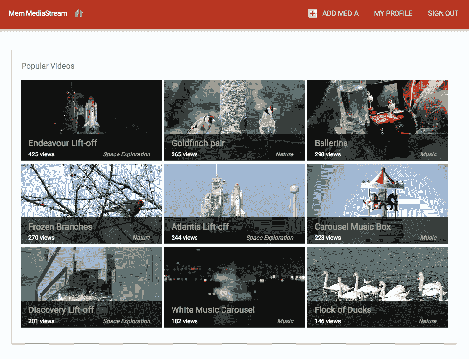
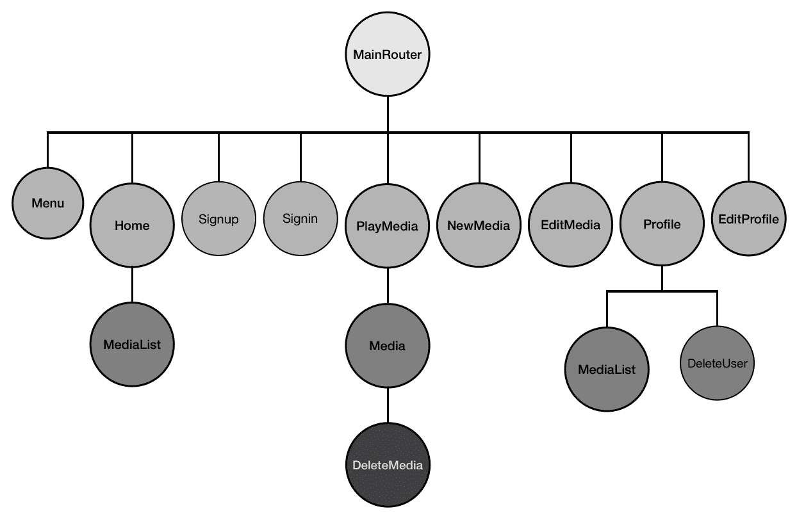
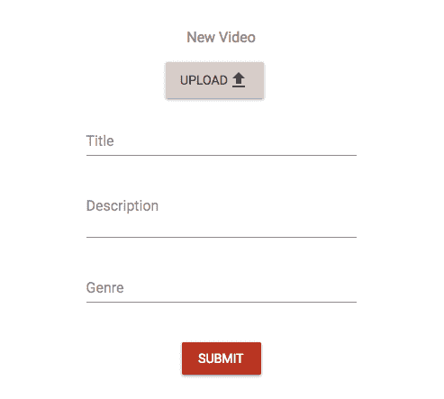
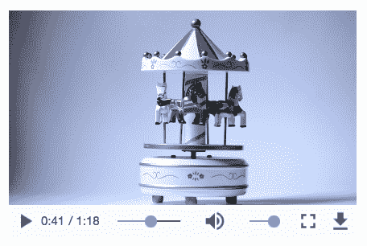
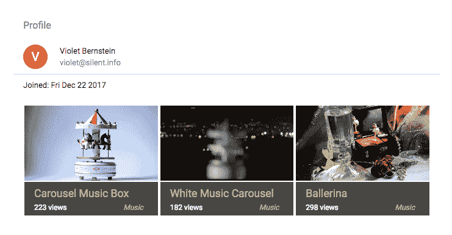
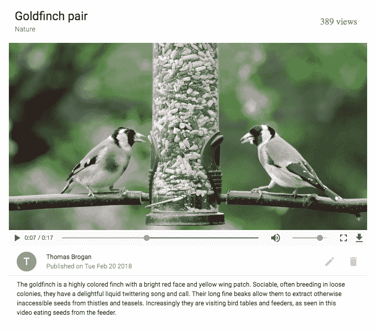
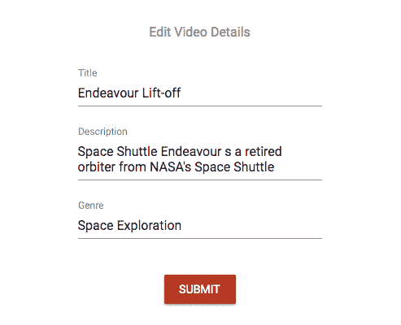
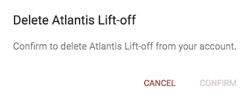

# 第八章：构建媒体流应用程序

上传和流媒体内容，特别是视频内容，已经成为互联网文化的一个日益增长的部分。从个人分享个人视频内容到娱乐行业在在线流媒体服务上发布商业内容，我们都依赖于能够实现平稳上传和流媒体的网络应用程序。MERN 堆栈技术中的功能可以用于构建和集成这些核心流媒体功能到任何基于 MERN 的 Web 应用程序中。

在这一章中，我们将通过扩展 MERN 骨架应用程序来覆盖以下主题，实现基本的媒体上传和流媒体：

+   将视频上传到 MongoDB GridFS

+   存储和检索媒体详情

+   从 GridFS 流式传输到基本媒体播放器

# MERN Mediastream

我们将通过扩展基本应用程序来构建 MERN Mediastream 应用程序。这将是一个简单的视频流应用程序，允许注册用户上传视频，任何浏览应用程序的人都可以观看：

完整的 MERN Mediastream 应用程序的代码可在 GitHub 上找到[github.com/shamahoque/mern-mediastream](https://github.com/shamahoque/mern-mediastream)。本章讨论的实现可以在同一存储库的`simple-mediastream-gridfs`分支中访问。您可以克隆此代码，并在本章的其余部分中阅读代码解释时运行应用程序。

为了实现与媒体上传、编辑和流媒体相关的功能所需的视图，我们将通过扩展和修改 MERN 骨架应用程序中的现有 React 组件来开发。下图显示了构成本章中开发的 MERN Mediastream 前端的所有自定义 React 组件的组件树：



# 上传和存储媒体

在 MERN Mediastream 上注册的用户将能够从其本地文件上传视频，直接在 MongoDB 上使用 GridFS 存储视频和相关详情。

# 媒体模型

为了存储媒体详情，我们将在`server/models/media.model.js`中为媒体模型添加一个 Mongoose 模式，其中包含用于记录媒体标题、描述、流派、观看次数、创建时间、更新时间以及发布媒体的用户的引用字段。

`mern-mediastream/server/models/media.model.js`：

```jsx
import mongoose from 'mongoose'
import crypto from 'crypto'
const MediaSchema = new mongoose.Schema({
  title: {
    type: String,
    required: 'title is required'
  },
  description: String,
  genre: String,
  views: {type: Number, default: 0},
  postedBy: {type: mongoose.Schema.ObjectId, ref: 'User'},
  created: {
    type: Date,
    default: Date.now
  },
  updated: {
    type: Date
  }
})

export default mongoose.model('Media', MediaSchema)
```

# MongoDB GridFS 用于存储大文件

在之前的章节中，我们讨论了用户上传的文件可以直接存储在 MongoDB 中作为二进制数据。但这仅适用于小于 16 MB 的文件。为了在 MongoDB 中存储更大的文件，我们需要使用 GridFS。

GridFS 通过将文件分成最大为 255 KB 的几个块，然后将每个块存储为单独的文档来在 MongoDB 中存储大文件。当需要响应 GridFS 查询检索文件时，根据需要重新组装块。这打开了根据需要获取和加载文件的部分而不是检索整个文件的选项。

在 MERN Mediastream 中存储和检索视频文件时，我们将利用 GridFS 存储视频文件，并根据用户跳转到和开始播放的部分来流式传输视频的部分。

我们将使用`gridfs-stream` npm 模块将 GridFS 功能添加到我们的服务器端代码中：

```jsx
npm install gridfs-stream --save
```

为了将`gridfs-stream`与我们的数据库连接配置，我们将使用 Mongoose 将其链接如下。

`mern-mediastream/server/controllers/media.controller.js`：

```jsx
import mongoose from 'mongoose'
import Grid from 'gridfs-stream'
Grid.mongo = mongoose.mongo
let gridfs = null
mongoose.connection.on('connected', () => {
  gridfs = Grid(mongoose.connection.db)
})
```

`gridfs`对象将提供访问 GridFS 所需的功能，以便在创建新媒体时存储文件，并在需要向用户流回媒体时获取文件。

# 创建媒体 API

我们将在 Express 服务器上设置一个创建媒体 API，该 API 将在`'/api/media/new/:userId'`接收包含媒体字段和上传的视频文件的多部分内容的 POST 请求。

# 创建媒体的路由

在`server/routes/media.routes.js`中，我们将添加创建路由，并利用用户控制器中的`userByID`方法。`userByID`方法处理 URL 中传递的`:userId`参数，并从数据库中检索关联的用户。

`mern-mediastream/server/routes/media.routes.js`：

```jsx
router.route('/api/media/new/:userId')
        .post(authCtrl.requireSignin, mediaCtrl.create)
router.param('userId', userCtrl.userByID)
```

对创建路由的 POST 请求将首先确保用户已登录，然后在媒体控制器中启动`create`方法。

类似于用户和认证路由，我们将不得不在`express.js`中将媒体路由挂载到 Express 应用程序上。

`mern-mediastream/server/express.js`：

```jsx
app.use('/', mediaRoutes)
```

# 处理创建请求的控制器方法

媒体控制器中的`create`方法将使用`formidable` npm 模块解析包含媒体详细信息和用户上传的视频文件的多部分请求体：

```jsx
npm install formidable --save
```

以`formidable`解析的表单数据接收的媒体字段将用于生成新的媒体对象并保存到数据库中。

`mern-mediastream/server/controllers/media.controller.js`：

```jsx
const create = (req, res, next) => {
  let form = new formidable.IncomingForm()
    form.keepExtensions = true
    form.parse(req, (err, fields, files) => {
      if (err) {
        return res.status(400).json({
          error: "Video could not be uploaded"
        })
      }
      let media = new Media(fields)
      media.postedBy= req.profile
      if(files.video){
        let writestream = gridfs.createWriteStream({_id: media._id})
        fs.createReadStream(files.video.path).pipe(writestream)
      }
      media.save((err, result) => {
        if (err) {
          return res.status(400).json({
            error: errorHandler.getErrorMessage(err)
          })
        }
        res.json(result)
      })
    })
}
```

如果请求中有文件，`formidable`将在文件系统中临时存储它，我们将使用媒体对象的 ID 创建一个`gridfs.writeStream`来读取临时文件并将其写入 MongoDB。这将在 MongoDB 中生成关联的块和文件信息文档。当需要检索此文件时，我们将使用媒体 ID 来识别它。

# 在视图中创建 API 获取

在`api-media.js`中，我们将添加一个相应的方法，通过传递视图中的多部分表单数据来向创建 API 发出`POST`请求。

`mern-mediastream/client/user/api-user.js`：

```jsx
const create = (params, credentials, media) => {
  return fetch('/api/media/new/'+ params.userId, {
    method: 'POST',
    headers: {
      'Accept': 'application/json',
      'Authorization': 'Bearer ' + credentials.t
    },
    body: media
  }).then((response) => {
    return response.json() 
  }).catch((err) => {
    console.log(err) 
  }) 
}
```

当用户提交新的媒体表单以上传新视频时，将使用此`create`获取方法。

# 新媒体表单视图

注册用户将在菜单中看到一个链接，用于添加新媒体。这个链接将带他们到新的媒体表单视图，并允许他们上传视频文件以及视频的详细信息。

# 添加媒体菜单按钮

在`client/core/Menu.js`中，我们将更新现有的代码，以添加添加媒体按钮链接的 My Profile 和 Signout 链接：


只有在用户当前已登录时才会在菜单上呈现。

`mern-mediastream/client/core/Menu.js/`：

```jsx
<Link to="/media/new">
     <Button style={isActive(history, "/media/new")}>
        <AddBoxIcon style={{marginRight: '8px'}}/> Add Media
     </Button>
</Link>
```

# NewMedia 视图的 React 路由

当用户点击添加媒体链接时，我们将更新`MainRouter`文件以添加`/media/new` React 路由，这将渲染`NewMedia`组件，将用户带到新的媒体表单视图。

`mern-mediastream/client/MainRouter.js`：

```jsx
<PrivateRoute path="/media/new" component={NewMedia}/>
```

由于这个新的媒体表单只能由已登录用户访问，我们将把它添加为`PrivateRoute`。

# NewMedia 组件

在`NewMedia`组件中，我们将渲染一个表单，允许用户输入标题、描述和流派，并从本地文件系统上传视频文件：



我们将使用 Material-UI 的`Button`和 HTML5 的`file input`元素添加文件上传元素。

`mern-mediastream/client/media/NewMedia.js`：

```jsx
<input accept="video/*" 
       onChange={this.handleChange('video')} 
       id="icon-button-file" 
       type="file"
       style={{display: none}}/>
<label htmlFor="icon-button-file">
    <Button color="secondary" variant="raised" component="span">
       Upload <FileUpload/>
    </Button>
</label> 
<span>{this.state.video ? this.state.video.name : ''}</span>

```

`Title`，`Description`和`Genre`表单字段将添加`TextField`组件。

`mern-mediastream/client/media/NewMedia.js`：

```jsx
<TextField id="title" label="Title" value={this.state.title} 
           onChange={this.handleChange('title')} margin="normal"/><br/>
<TextField id="multiline-flexible" label="Description"
           multiline rows="2"
           value={this.state.description}
           onChange={this.handleChange('description')}/><br/>
<TextField id="genre" label="Genre" value={this.state.genre} 
           onChange={this.handleChange('genre')}/><br/>
```

这些表单字段的更改将通过`handleChange`方法进行跟踪。

`mern-mediastream/client/media/NewMedia.js`：

```jsx
handleChange = name => event => {
    const value = name === 'video'
      ? event.target.files[0]
      : event.target.value
    this.mediaData.set(name, value)
    this.setState({ [name]: value })
}
```

`handleChange`方法使用新值更新状态并填充`mediaData`，这是一个`FormData`对象。`FormData` API 确保要发送到服务器的数据以`multipart/form-data`编码类型所需的正确格式存储。这个`mediaData`对象在`componentDidMount`中初始化。

`mern-mediastream/client/media/NewMedia.js`:

```jsx
componentDidMount = () => {
    this.mediaData = new FormData()
}
```

在表单提交时，将使用必要的凭据调用`create` fetch 方法，并将表单数据作为参数传递：

```jsx
 clickSubmit = () => {
    const jwt = auth.isAuthenticated()
    create({
      userId: jwt.user._id
    }, {
      t: jwt.token
    }, this.mediaData).then((data) => {
      if (data.error) {
        this.setState({error: data.error})
      } else {
        this.setState({redirect: true, mediaId: data._id})
      }
    })
 }
```

在成功创建媒体后，用户可以根据需要重定向到不同的视图，例如，到一个带有新媒体详情的媒体视图。

`mern-mediastream/client/media/NewMedia.js`:

```jsx
if (this.state.redirect) {
      return (<Redirect to={'/media/' + this.state.mediaId}/>)
}
```

为了允许用户流媒体和查看存储在 MongoDB 中的视频文件，接下来我们将实现如何在视图中检索和渲染视频。

# 检索和流媒体

在服务器上，我们将设置一个路由来检索单个视频文件，然后将其用作 React 媒体播放器中的源，以渲染流媒体视频。

# 获取视频 API

我们将在媒体路由中添加一个路由，以在`'/api/medias/video/:mediaId'`接收到 GET 请求时获取视频。

`mern-mediastream/server/routes/media.routes.js`:

```jsx
router.route('/api/medias/video/:mediaId')
        .get(mediaCtrl.video)
router.param('mediaId', mediaCtrl.mediaByID)
```

路由 URL 中的`:mediaId`参数将在`mediaByID`控制器中处理，以从媒体集合中获取关联文档并附加到请求对象中，因此可以根据需要在`video`控制器方法中使用。

`mern-mediastream/server/controllers/media.controller.js`:

```jsx
const mediaByID = (req, res, next, id) => {
  Media.findById(id).populate('postedBy', '_id name').exec((err, media) => {
    if (err || !media)
      return res.status('400').json({
        error: "Media not found"
      })
    req.media = media
    next()
  })
}
```

`media.controller.js`中的`video`控制器方法将使用`gridfs`在 MongoDB 中查找与`mediaId`关联的视频。然后，如果找到匹配的视频并且取决于请求是否包含范围标头，响应将发送回正确的视频块，并将相关内容信息设置为响应标头。

`mern-mediastream/server/controllers/media.controller.js`:

```jsx
const video = (req, res) => {
  gridfs.findOne({
        _id: req.media._id
    }, (err, file) => {
        if (err) {
            return res.status(400).send({
                error: errorHandler.getErrorMessage(err)
            })
        }
        if (!file) {
            return res.status(404).send({
                error: 'No video found'
            })
        }

        if (req.headers['range']) {
            ...
            ... consider range headers and send only relevant chunks in 
           response ...
            ...
        } else {
            res.header('Content-Length', file.length)
            res.header('Content-Type', file.contentType)

            gridfs.createReadStream({
                _id: file._id
            }).pipe(res)
        }
    })
}
```

如果请求包含范围标头，例如当用户拖动到视频中间并从那一点开始播放时，我们需要将范围标头转换为与使用 GridFS 存储的正确块对应的起始和结束位置。然后，我们将这些起始和结束值作为范围传递给 gridfs-stream 的`createReadStream`方法，并且还使用附加文件详情设置响应标头，包括内容长度、范围和类型。

`mern-mediastream/server/controllers/media.controller.js`:

```jsx
let parts = req.headers['range'].replace(/bytes=/, "").split("-")
let partialstart = parts[0]
let partialend = parts[1]

let start = parseInt(partialstart, 10)
let end = partialend ? parseInt(partialend, 10) : file.length - 1
let chunksize = (end - start) + 1

res.writeHead(206, {
    'Accept-Ranges': 'bytes',
 'Content-Length': chunksize,
 'Content-Range': 'bytes ' + start + '-' + end + '/' + file.length,
 'Content-Type': file.contentType
})

gridfs.createReadStream({
        _id: file._id,
        range: {
                 startPos: start,
                 endPos: end
                }
}).pipe(res)
```

最终的`readStream`管道传输到响应中可以直接在前端视图中使用基本的 HTML5 媒体播放器或 React 风格的媒体播放器进行渲染。

# 使用 React 媒体播放器来呈现视频

作为 npm 可用的 React 风格媒体播放器的一个很好的选择是`ReactPlayer`组件，可以根据需要进行自定义：



可以通过安装相应的`npm`模块在应用程序中使用它：

```jsx
npm install react-player --save
```

对于使用浏览器提供的默认控件的基本用法，我们可以将其添加到应用程序中任何具有要呈现的媒体 ID 访问权限的 React 视图中：

```jsx
<ReactPlayer url={'/api/media/video/'+media._id} controls/>
```

在下一章中，我们将探讨使用我们自己的控件自定义这个`ReactPlayer`的高级选项。

要了解有关`ReactPlayer`可能性的更多信息，请访问[cookpete.com/react-player](https://cookpete.com/react-player)。

# 媒体列表

在 MERN Mediastream 中，我们将添加相关媒体的列表视图，并为每个视频提供快照，以便访问者更容易地访问应用程序中的视频概述。我们将在后端设置列表 API 来检索不同的列表，例如单个用户上传的视频以及应用程序中观看次数最多的最受欢迎视频。然后，这些检索到的列表可以在`MediaList`组件中呈现，该组件将从父组件接收一个列表作为 prop，该父组件从特定 API 中获取列表：



在前面的屏幕截图中，`Profile`组件使用用户 API 列表来获取前面配置文件中看到的用户发布的媒体列表，并将接收到的列表传递给`MediaList`组件以呈现每个视频和媒体详细信息。

# 媒体列表组件

`MediaList`组件是一个可重用的组件，它将获取一个媒体列表并在视图中迭代每个项目进行呈现。在 MERN Mediastream 中，我们使用它来在主页视图中呈现最受欢迎的媒体列表，以及在用户配置文件中上传的媒体列表。

`mern-mediastream/client/media/MediaList.js`：

```jsx
<GridList cols={3}>
   {this.props.media.map((tile, i) => (
        <GridListTile key={i}>
          <Link to={"/media/"+tile._id}>
            <ReactPlayer url={'/api/media/video/'+tile._id} 
                         width='100%' height='inherit'/>
          </Link>
          <GridListTileBar 
            title={<Link to={"/media/"+tile._id}>{tile.title}</Link>}
            subtitle={<span>{tile.views} views 
                  <span style={{float: 'right'}}>{tile.genre}</span>}/>
        </GridListTile>
    ))}
</GridList>
```

`MediaList`组件使用 Material-UI 的`GridList`组件，它在 props 中迭代列表，并为列表中的每个项目呈现媒体详细信息，以及一个`ReactPlayer`组件，用于呈现视频 URL 而不显示任何控件。在视图中，这为访问者提供了媒体的简要概述，也可以一瞥视频内容。

# 列出热门媒体

为了从数据库中检索特定的媒体列表，我们需要在服务器上设置相关的 API。对于热门媒体，我们将设置一个路由，接收`/api/media/popular`的 GET 请求。

`mern-mediastream/server/routes/media.routes.js`：

```jsx
 router.route('/api/media/popular')
          .get(mediaCtrl.listPopular)
```

`listPopular`控制器方法将查询媒体集合，以检索具有整个集合中最高`views`的十个媒体文档。

`mern-mediastream/server/controllers/media.controller.js`：

```jsx
const listPopular = (req, res) => {
  Media.find({}).limit(10)
  .populate('postedBy', '_id name')
  .sort('-views')
  .exec((err, posts) => {
    if (err) {
      return res.status(400).json({
        error: errorHandler.getErrorMessage(err)
      })
    }
    res.json(posts)
  })
}
```

为了在视图中使用此 API，我们将在`api-media.js`中设置相应的 fetch 方法。

`mern-mediastream/client/media/api-media.js`：

```jsx
const listPopular = (params) => {
  return fetch('/api/media/popular', {
    method: 'GET',
    headers: {
      'Accept': 'application/json',
      'Content-Type': 'application/json'
    }
  }).then(response => {
    return response.json() 
  }).catch((err) => console.log(err)) 
}
```

当`Home`组件挂载时，将调用此`fetch`方法，以便将列表设置为状态，并传递给视图中的`MediaList`组件。

`mern-mediastream/client/core/Home.js`：

```jsx
componentDidMount = () => {
    listPopular().then((data) => {
      if (data.error) {
        console.log(data.error) 
      } else {
        this.setState({media: data}) 
      }
    })
  }
```

在主页视图中，我们将添加`MediaList`如下，列表作为 prop 提供：

```jsx
<MediaList media={this.state.media}/>
```

# 按用户列出媒体

为了检索特定用户上传的媒体列表，我们将设置一个 API，该 API 在路由上接受`'/api/media/by/:userId'`的 GET 请求。

`mern-mediastream/server/routes/media.routes.js`：

```jsx
router.route('/api/media/by/:userId')
         .get(mediaCtrl.listByUser) 
```

`listByUser`控制器方法将查询媒体集合，以查找`postedBy`值与`userId`匹配的媒体文档。

`mern-mediastream/server/controllers/media.controller.js`：

```jsx
const listByUser = (req, res) => {
  Media.find({postedBy: req.profile._id})
  .populate('postedBy', '_id name')
  .sort('-created')
  .exec((err, posts) => {
    if (err) {
      return res.status(400).json({
        error: errorHandler.getErrorMessage(err)
      })
    }
    res.json(posts)
  })
}
```

为了在前端视图中使用此用户列表 API，我们将在`api-media.js`中设置相应的`fetch`方法。

`mern-mediastream/client/user/api-user.js`：

```jsx
const listByUser = (params) => {
  return fetch('/api/media/by/'+ params.userId, {
    method: 'GET',
    headers: {
      'Accept': 'application/json',
      'Content-Type': 'application/json'
    }
  }).then(response => {
    return response.json() 
  }).catch((err) => console.log(err)) 
}
```

这个 fetch 方法可以在`Profile`组件中使用，类似于在主页视图中使用的`listPopular`fetch 方法，以检索列表数据，设置状态，然后传递给`MediaList`组件。

# 显示、更新和删除媒体

MERN Mediastream 的任何访问者都可以查看媒体详细信息并流式传输视频，而只有注册用户才能在在应用程序上发布后随时编辑详细信息和删除媒体。

# 显示媒体

MERN Mediastream 的任何访问者都可以浏览到单个媒体视图，播放视频并阅读与媒体相关的详细信息。每次在应用程序上加载特定视频时，我们还将增加与媒体相关的观看次数。

# 阅读媒体 API

为了获取特定媒体记录的媒体信息，我们将设置一个路由，接受`'/api/media/:mediaId'`的 GET 请求。

`mern-mediastream/server/routes/media.routes.js`：

```jsx
router.route('/api/media/:mediaId')
    .get( mediaCtrl.incrementViews, mediaCtrl.read)
```

请求 URL 中的`mediaId`将导致执行`mediaByID`控制器方法，并将检索到的媒体文档附加到请求对象。然后，此媒体数据将由`read`控制器方法返回在响应中。

`mern-mediastream/server/controllers/media.controller.js`:

```jsx
const read = (req, res) => {
  return res.json(req.media)
}
```

对此 API 的 GET 请求还将执行`incrementViews`控制器方法，该方法将找到匹配的媒体记录，并将`views`值增加 1，然后将更新后的记录保存到数据库中。

`mern-mediastream/server/controllers/media.controller.js`:

```jsx
const incrementViews = (req, res, next) => {
  Media.findByIdAndUpdate(req.media._id, {$inc: {"views": 1}}, {new: true})
      .exec((err, result) => {
        if (err) {
          return res.status(400).json({
            error: errorHandler.getErrorMessage(err)
          })
        }
        next()
      })
}
```

为了在前端使用此读取 API，我们将在`api-media.js`中设置相应的 fetch 方法。

`mern-mediastream/client/user/api-user.js`:

```jsx
const read = (params) => {
  return fetch(config.serverUrl+'/api/media/' + params.mediaId, {
    method: 'GET'
  }).then((response) => {
    return response.json()
  }).catch((err) => console.log(err))
}
```

读取 API 可用于在视图中呈现单个媒体详细信息，或者预填充媒体编辑表单。

# 媒体组件

`Media`组件将呈现单个媒体记录的详细信息，并在具有默认浏览器控件的基本`ReactPlayer`中流式传输视频。



`Media`组件可以调用读取 API 来获取媒体数据，也可以从调用读取 API 的父组件作为 prop 接收数据。在后一种情况下，父组件将添加`Media`组件，如下所示。

`mern-mediastream/client/media/PlayMedia.js`:

```jsx
<Media media={this.state.media}/>
```

在 MERN Mediastream 中，我们在`PlayMedia`组件中添加了`Media`组件，该组件使用读取 API 从服务器获取媒体内容，并将其作为 prop 传递给 Media。 `Media`组件将获取这些数据并在视图中呈现它们，以显示详细信息并在`ReactPlayer`组件中加载视频。

标题，流派和观看次数可以在 Material-UI`CardHeader`组件中呈现。

`mern-mediastream/client/media/Media.js`:

```jsx
<CardHeader 
   title={this.props.media.title}
   action={<span>
                {this.props.media.views + ' views'}
           </span>}
   subheader={this.props.media.genre}
/>
```

视频 URL，基本上是我们在后端设置的 GET API 路由，将在`ReactPlayer`中加载，并具有默认的浏览器控件。

`mern-mediastream/client/media/Media.js`:

```jsx
const mediaUrl = this.props.media._id
          ? `/api/media/video/${this.props.media._id}`
          : null
            … 
<ReactPlayer url={mediaUrl} 
             controls
             width={'inherit'}
             height={'inherit'}
             style={{maxHeight: '500px'}}
             config={{ attributes: 
                        { style: { height: '100%', width: '100%'} } 
}}/>
```

`Media`组件会渲染发布视频的用户的其他详细信息，媒体描述以及媒体创建日期。

`mern-mediastream/client/media/Media.js`:

```jsx
<ListItem>
    <ListItemAvatar>
      <Avatar>
        {this.props.media.postedBy.name && 
                        this.props.media.postedBy.name[0]}
      </Avatar>
    </ListItemAvatar>
    <ListItemText primary={this.props.media.postedBy.name} 
              secondary={"Published on " + 
                        (new Date(this.props.media.created))
                        .toDateString()}/>
</ListItem>
<ListItem>
    <ListItemText primary={this.props.media.description}/>
</ListItem>
```

如果当前登录的用户也是发布显示的媒体的用户，则`Media`组件还会有条件地显示编辑和删除选项。

`mern-mediastream/client/media/Media.js`:

```jsx
{(auth.isAuthenticated().user && auth.isAuthenticated().user._id) 
    == this.props.media.postedBy._id && (<ListItemSecondaryAction>
        <Link to={"/media/edit/" + this.props.media._id}>
          <IconButton aria-label="Edit" color="secondary">
            <Edit/>
          </IconButton>
        </Link>
        <DeleteMedia mediaId={this.props.media._id} mediaTitle=
       {this.props.media.title}/>
      </ListItemSecondaryAction>)}
```

编辑选项链接到媒体编辑表单，删除选项打开一个对话框，可以启动从数据库中删除特定媒体文档。

# 更新媒体详细信息

注册用户将可以访问其每个媒体上传的编辑表单，更新并提交此表单将保存更改到媒体集合中的文档中。

# 媒体更新 API

为了允许用户更新媒体详细信息，我们将设置一个媒体更新 API，该 API 将在`'/api/media/:mediaId'`处接受 PUT 请求，并在请求正文中包含更新的详细信息。

`mern-mediastream/server/routes/media.routes.js`：

```jsx
router.route('/api/media/:mediaId')
        .put(authCtrl.requireSignin, 
                mediaCtrl.isPoster, 
                    mediaCtrl.update)
```

当收到此请求时，服务器将首先通过调用`isPoster`控制器方法来确保登录用户是媒体内容的原始发布者。

`mern-mediastream/server/controllers/media.controller.js`：

```jsx
const isPoster = (req, res, next) => {
  let isPoster = req.media && req.auth 
  && req.media.postedBy._id == req.auth._id
  if(!isPoster){
    return res.status('403').json({
      error: "User is not authorized"
    })
  }
  next()
}
```

如果用户被授权，将调用`update`控制器方法`next`，以更新现有的媒体文档并将其保存到数据库中。

`mern-mediastream/server/controllers/media.controller.js`：

```jsx
const update = (req, res, next) => {
  let media = req.media
  media = _.extend(media, req.body)
  media.updated = Date.now()
  media.save((err) => {
    if (err) {
      return res.status(400).send({
        error: errorHandler.getErrorMessage(err)
      })
    }
    res.json(media)
  })
}
```

为了在前端访问更新 API，我们将在`api-media.js`中添加相应的获取方法，该方法将以必要的凭据和媒体详细信息作为参数。

`mern-mediastream/client/user/api-user.js`：

```jsx
const update = (params, credentials, media) => {
  return fetch('/api/media/' + params.mediaId, {
    method: 'PUT',
    headers: {
      'Accept': 'application/json',
      'Content-Type': 'application/json',
      'Authorization': 'Bearer ' + credentials.t
    },
    body: JSON.stringify(media)
  }).then((response) => {
    return response.json() 
  }).catch((err) => {
    console.log(err) 
  }) 
}
```

当用户更新并提交表单时，此获取方法将用于媒体编辑表单。

# 媒体编辑表单

媒体编辑表单将类似于新媒体表单，但不包括上传选项，并且字段将预填充现有细节：



包含此表单的`EditMedia`组件只能由登录用户访问，并将呈现在`'/media/edit/:mediaId'`。此私有路由将在`MainRouter`中与其他前端路由一起声明。

`mern-mediastream/client/MainRouter.js`：

```jsx
<PrivateRoute path="/media/edit/:mediaId" component={EditMedia}/>
```

一旦`EditMedia`组件挂载到视图上，将调用获取调用以从读取媒体 API 检索媒体详细信息并设置为状态，以便在文本字段中呈现值。

`mern-mediastream/client/media/EditMedia.js`：

```jsx
  componentDidMount = () => {
    read({mediaId: this.match.params.mediaId}).then((data) => {
      if (data.error) {
        this.setState({error: data.error}) 
      } else {
        this.setState({media: data}) 
      }
    }) 
  }
```

表单字段元素将与`NewMedia`组件中的相同。当用户更新表单中的任何值时，将通过调用`handleChange`方法在状态中注册`media`对象中的更改。

`mediastream/client/media/EditMedia.js`：

```jsx
handleChange = name => event => {
    let updatedMedia = this.state.media
    updatedMedia[name] = event.target.value
    this.setState({media: updatedMedia})
}
```

当用户完成编辑并点击提交时，将调用更新 API，并提供所需的凭据和更改后的媒体值。

`mediastream/client/media/EditMedia.js`:

```jsx
  clickSubmit = () => {
    const jwt = auth.isAuthenticated() 
    update({
      mediaId: this.state.media._id
    }, {
      t: jwt.token
    }, this.state.media).then((data) => {
      if (data.error) {
        this.setState({error: data.error}) 
      } else {
        this.setState({error: '', redirect: true, media: data}) 
      }
    }) 
}
```

这将更新媒体详情，并且与媒体相关的视频文件将保持在数据库中不变。

# 删除媒体

经过身份验证的用户可以完全删除他们上传到应用程序的媒体，包括媒体集合中的媒体文档，以及使用 GridFS 存储在 MongoDB 中的文件块。

# 删除媒体 API

在后端，我们将添加一个 DELETE 路由，允许授权用户删除他们上传的媒体记录。

`mern-mediastream/server/routes/media.routes.js`:

```jsx
router.route('/api/media/:mediaId')
        .delete(authCtrl.requireSignin, 
                    mediaCtrl.isPoster, 
                        mediaCtrl.remove)
```

当服务器在`'/api/media/:mediaId'`接收到 DELETE 请求时，它将首先确保登录用户是需要删除的媒体的原始发布者。然后`remove`控制器方法将从数据库中删除指定的媒体详情。

`mern-mediastream/server/controllers/media.controller.js`:

```jsx
const remove = (req, res, next) => {
  let media = req.media
    media.remove((err, deletedMedia) => {
      if (err) {
        return res.status(400).json({
          error: errorHandler.getErrorMessage(err)
        })
      }
      gridfs.remove({ _id: req.media._id })
      res.json(deletedMedia)
    })
}
```

除了从媒体集合中删除媒体记录外，我们还使用`gridfs`来删除数据库中存储的相关文件详情和块。

我们还将在`api-media.js`中添加一个相应的方法来从视图中获取`delete` API。

`mern-mediastream/client/user/api-user.js`:

```jsx
const remove = (params, credentials) => {
  return fetch('/api/media/' + params.mediaId, {
    method: 'DELETE',
    headers: {
      'Accept': 'application/json',
      'Content-Type': 'application/json',
      'Authorization': 'Bearer ' + credentials.t
    }
  }).then((response) => {
    return response.json() 
  }).catch((err) => {
    console.log(err) 
  }) 
}
```

# 删除媒体组件

`DeleteMedia`组件被添加到`Media`组件中，只对添加了特定媒体的已登录用户可见。该组件以媒体 ID 和标题作为 props：



这个`DeleteMedia`组件基本上是一个图标按钮，点击后会打开一个确认对话框，询问用户是否确定要删除他们的视频。

`mern-mediastream/client/media/DeleteMedia.js`:

```jsx
<IconButton aria-label="Delete" onClick={this.clickButton} color="secondary">
    <DeleteIcon/>
</IconButton>
<Dialog open={this.state.open} onClose={this.handleRequestClose}>
  <DialogTitle>{"Delete "+this.props.mediaTitle}</DialogTitle>
  <DialogContent>
     <DialogContentText>
         Confirm to delete {this.props.mediaTitle} from your account.
     </DialogContentText>
  </DialogContent>
  <DialogActions>
     <Button onClick={this.handleRequestClose} color="primary">
        Cancel
     </Button>
     <Button onClick={this.deleteMedia} 
              color="secondary" 
              autoFocus="autoFocus"
              variant="raised">
        Confirm
     </Button>
  </DialogActions>
</Dialog>
```

当用户确认删除意图时，将调用`delete`获取方法。

`mern-mediastream/client/media/DeleteMedia.js`:

```jsx
deleteMedia = () => {
    const jwt = auth.isAuthenticated() 
    remove({
      mediaId: this.props.mediaId
    }, {t: jwt.token}).then((data) => {
      if (data.error) {
        console.log(data.error) 
      } else {
        this.setState({redirect: true}) 
      }
    }) 
}
```

然后在成功删除后，用户将被重定向到主页。

`mern-mediastream/client/media/DeleteMedia.js`:

```jsx
if (this.state.redirect) {
   return <Redirect to='/'/> 
}
```

本章开发的 MERN Mediastream 应用程序是一个完整的媒体流应用程序，具有将视频文件上传到数据库的功能，将存储的视频流回给观众的功能，支持 CRUD 操作，如媒体创建、更新、读取和删除，以及按上传者或受欢迎程度列出媒体的选项。

# 总结

在本章中，我们通过扩展 MERN 骨架应用程序并利用 MongoDB GridFS 开发了一个媒体流应用程序。

除了为媒体添加基本的添加、更新、删除和列表功能外，我们还研究了基于 MERN 的应用如何允许用户上传视频文件，将这些文件存储到 MongoDB GridFS 中，并根据需要部分或完全地向观看者流式传输视频。我们还介绍了使用默认浏览器控件来流式传输视频文件的`ReactPlayer`的基本用法。

在下一章中，我们将看到如何使用自定义控件和功能定制`ReactPlayer`，以便用户拥有更多选项，比如播放列表中的下一个视频。此外，我们将讨论如何通过实现带有媒体视图数据的服务器端渲染来改善媒体详情的搜索引擎优化。
