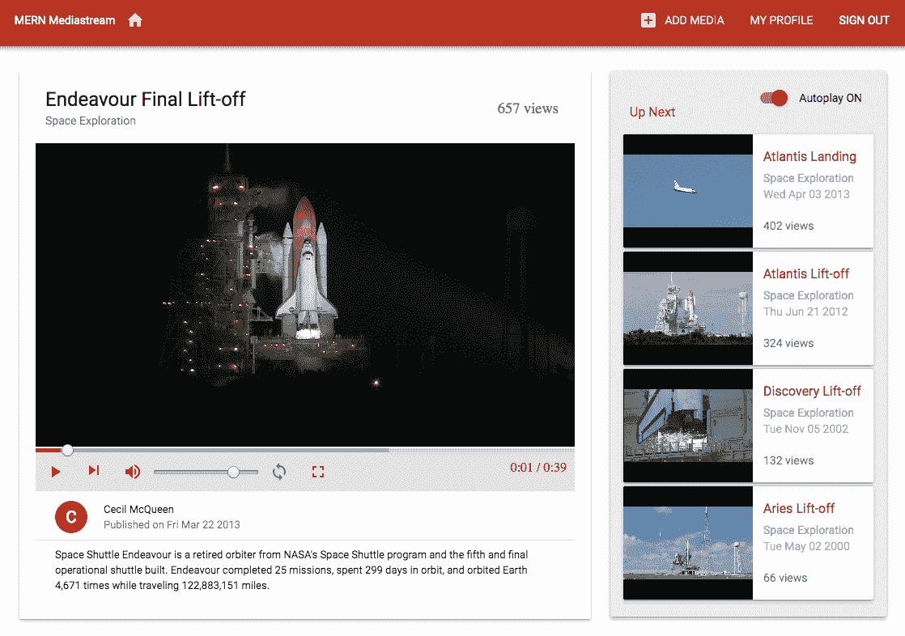
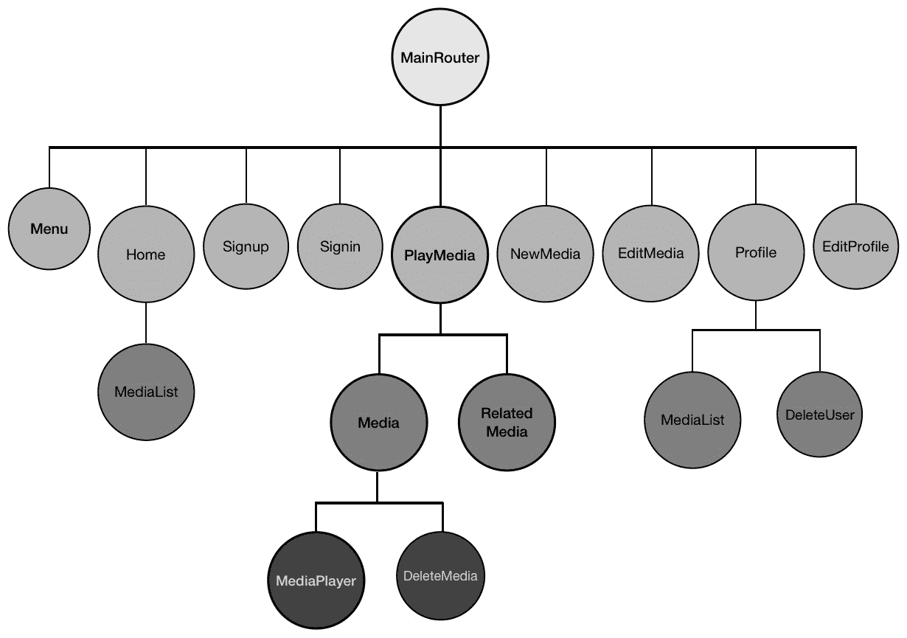
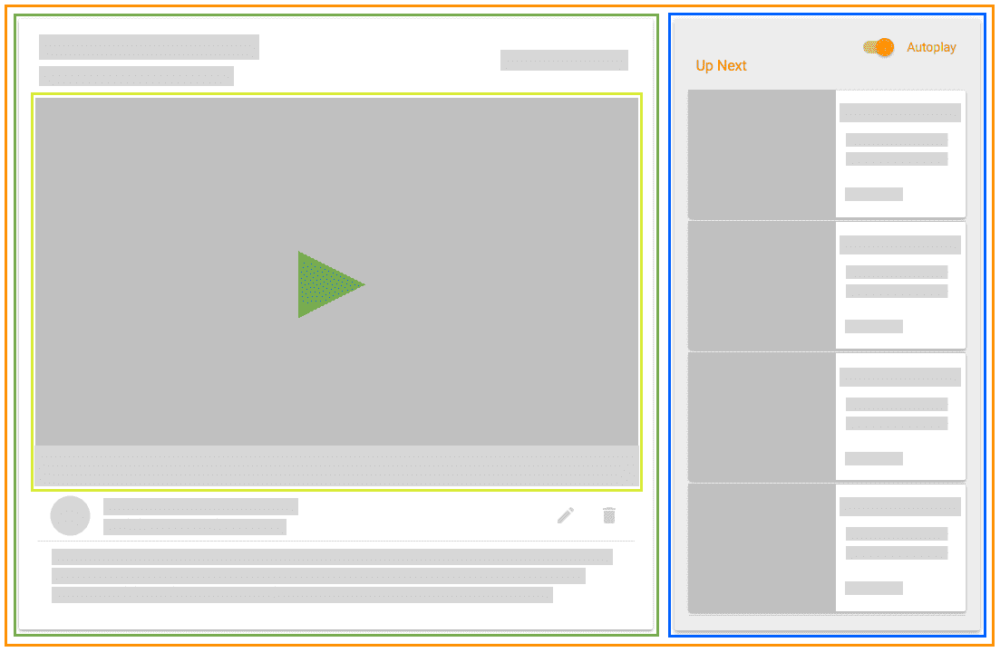
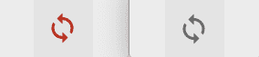
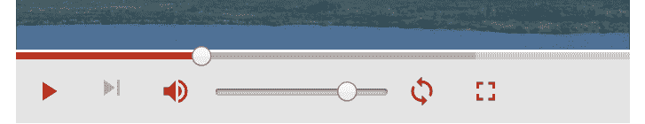
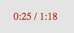
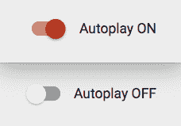
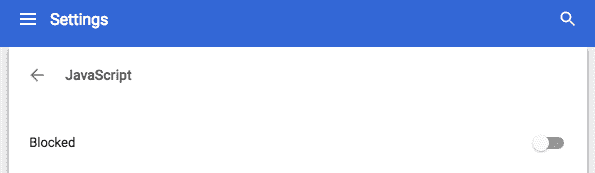
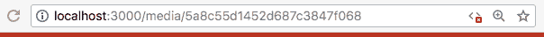
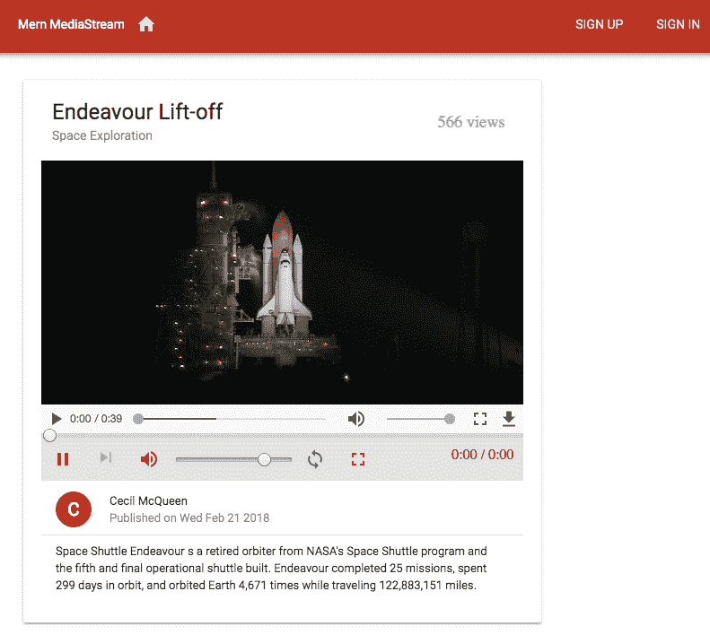

# 第九章：自定义媒体播放器和改善 SEO

用户主要是为了播放媒体和探索其他相关媒体而访问媒体流应用程序。这使得媒体播放器和呈现相关媒体详情的视图对于流媒体应用程序至关重要。

在本章中，我们将专注于为我们在上一章开始构建的 MERN Mediastream 应用程序开发播放媒体页面。我们将讨论以下主题，以加强媒体播放功能，并帮助增加媒体内容在网络上的存在，以便能够触达更多用户：

+   自定义`ReactPlayer`上的控件

+   从相关视频列表中播放下一个视频

+   自动播放相关媒体列表

+   服务器端渲染媒体视图以改善 SEO

# 使用自定义媒体播放器的 MERN Mediastream

在上一章中开发的 MERN Mediastream 应用程序实现了一个简单的媒体播放器，具有默认的浏览器控件，一次只能播放一个视频。在本章中，我们将使用自定义的`ReactPlayer`和相关媒体列表更新播放媒体的视图，可以在当前视频结束时自动播放。更新后的具有自定义播放器和相关播放列表的视图如下图所示：

完整的 MERN Mediastream 应用程序的代码可在 GitHub 上找到，网址为[github.com/shamahoque/mern-mediastream](https://github.com/shamahoque/mern-mediastream)。您可以在阅读本章其余部分的代码解释时，克隆此代码并运行应用程序。

以下组件树图显示了构成 MERN Mediastream 前端的所有自定义组件，突出显示了本章中将改进或添加的组件。



本章中新增的组件包括`MediaPlayer`组件，它添加了带有自定义控件的`ReactPlayer`，以及`RelatedMedia`组件，其中包含相关视频列表。

# 播放媒体页面

当访问者想要在 MERN Mediastream 上观看特定媒体时，他们将被带到播放媒体页面，其中包含媒体详情、用于流媒体视频的媒体播放器，以及可以接下来播放的相关媒体列表。

# 组件结构

我们将以一种允许媒体数据从父组件向内部组件传递的方式构成播放媒体页面的组件结构。在这种情况下，`PlayMedia`组件将是父组件，包含`RelatedMedia`组件和带有嵌套的`MediaPlayer`组件的`Media`组件：



当访问单个媒体链接时，`PlayMedia`组件将挂载并从服务器检索媒体数据和相关媒体列表。然后，相关数据将作为 props 传递给`Media`和`RelatedMedia`子组件。

`RelatedMedia`组件将链接到其他相关媒体的列表，点击每个将重新渲染`PlayMedia`组件和内部组件以显示新数据。

我们将更新我们在第八章中开发的`Media`组件，*构建媒体流应用程序*，以添加一个定制的媒体播放器作为子组件。这个定制的`MediaPlayer`组件还将利用从`PlayMedia`传递的数据来播放当前视频并链接到相关媒体列表中的下一个视频。

在`PlayMedia`组件中，我们将添加一个自动播放切换按钮，让用户选择自动播放相关媒体列表中的视频，一个接着一个。自动播放状态将从`PlayMedia`组件管理，但此功能将需要在`MediaPlayer`中视频结束时重新渲染状态中的数据，这是一个嵌套的子组件，所以下一个视频可以在保持相关列表跟踪的同时自动开始播放。

为了实现这一点，`PlayMedia`组件将需要提供一个状态更新方法作为 prop，该方法将在`MediaPlayer`组件中使用，以更新这些组件之间共享和相互依赖的状态值。

考虑到这种组件结构，我们将扩展和更新 MERN Mediastream 应用程序，以实现一个功能性的播放媒体页面。

# 相关媒体列表

相关媒体列表将包括属于与给定视频相同流派的其他媒体记录，并按观看次数最多的顺序排序。

# 相关列表 API

为了从数据库中检索相关媒体列表，我们将在服务器上设置一个 API，该 API 将在`'/api/media/related/:mediaId'`接收 GET 请求。

`mern-mediastream/server/routes/media.routes.js`：

```jsx
router.route('/api/media/related/:mediaId')
        .get(mediaCtrl.listRelated)
```

`listRelated`控制器方法将查询媒体集合，以找到与提供的媒体具有相同流派的记录，并从返回的结果中排除此媒体记录。返回的结果将按照最高的观看次数进行排序，并限制为前四个媒体记录。返回的结果中的每个`media`对象还将包含发布媒体的用户的名称和 ID。

`mern-mediastream/server/controllers/media.controller.js`：

```jsx
const listRelated = (req, res) => {
  Media.find({ "_id": { "$ne": req.media },
  "genre": req.media.genre}).limit(4)
  .sort('-views')
  .populate('postedBy', '_id name')
  .exec((err, posts) => {
    if (err) {
      return res.status(400).json({
        error: errorHandler.getErrorMessage(err)
      })
    }
    res.json(posts)
  })
}
```

在客户端，我们将设置一个相应的`fetch`方法，该方法将在`PlayMedia`组件中用于使用此 API 检索相关媒体列表。

`mern-mediastream/client/media/api-media.js`：

```jsx
const listRelated = (params) => {
  return fetch('/api/media/related/'+ params.mediaId, {
    method: 'GET',
    headers: {
      'Accept': 'application/json',
      'Content-Type': 'application/json'
    }
  }).then(response => {
    return response.json() 
  }).catch((err) => console.log(err)) 
}
```

# 相关媒体组件

`RelatedMedia`组件从`PlayMedia`组件中以 prop 的形式获取相关媒体列表，并呈现每个视频的详细信息以及视频快照。

我们使用`map`函数遍历媒体列表，以呈现每个媒体项。

`mern-mediastream/client/media/RelatedMedia.js`：

```jsx
{this.props.media.map((item, i) => { 
    return 
      <span key={i}>... video snapshot ... | ... media details ...</span> 
  })
}
```

为了显示视频快照，我们将使用一个基本的`ReactPlayer`，没有控件。

`mern-mediastream/client/media/RelatedMedia.js`：

```jsx

<Link to={"/media/"+item._id}>
  <ReactPlayer url={'/api/media/video/'+item._id} width='160px'    
  height='140px'/>
</Link>
```

单击快照将重新呈现 PlayMedia 视图，以加载链接的媒体详细信息。


除了快照之外，我们还将显示每个视频的详细信息，包括标题、流派、创建日期和观看次数。

`mern-mediastream/client/media/RelatedMedia.js`：

```jsx
<Typography type="title" color="primary">{item.title}</Typography>
<Typography type="subheading"> {item.genre} </Typography>
<Typography component="p">
        {(new Date(item.created)).toDateString()}
</Typography>
<Typography type="subheading">{item.views} views</Typography>
```

为了在视图中使用`RelatedMedia`组件，我们将在`PlayMedia`组件中添加它。

# 播放媒体组件

`PlayMedia`组件由`Media`和`RelatedMedia`子组件以及自动播放切换按钮组成，并在视图加载时向这些组件提供数据。为了在用户访问单个媒体链接时呈现`PlayMedia`组件，我们将在`MainRouter`中添加一个`Route`来在`'/media/:mediaId'`处挂载`PlayMedia`。

`mern-mediastream/client/MainRouter.js`：

```jsx
<Route path="/media/:mediaId" component={PlayMedia}/>
```

当`PlayMedia`组件挂载时，它将使用`loadMedia`函数基于路由链接中的`媒体 ID`参数从服务器获取媒体数据和相关媒体列表。

`mern-mediastream/client/media/PlayMedia.js`：

```jsx
loadMedia = (mediaId) => {
    read({mediaId: mediaId}).then((data) => {
      if (data.error) {
        this.setState({error: data.error})
      } else {
        this.setState({media: data})
          listRelated({
            mediaId: data._id}).then((data) => {
            if (data.error) {
              console.log(data.error)
            } else {
              this.setState({relatedMedia: data})
            }
          })
      }
    })
  }
```

`loadMedia`函数使用媒体 ID 和`read`API 的`fetch`方法从服务器检索媒体详细信息。然后，它使用`listRelated`API 的 fetch 方法从服务器检索相关媒体列表，并将值设置为状态。

当组件挂载时，将使用`mediaId`值调用`loadMedia`函数，也会在接收到 props 时调用。

`mern-mediastream/client/media/PlayMedia.js`：

```jsx
componentDidMount = () => {
    this.loadMedia(this.match.params.mediaId)
}
componentWillReceiveProps = (props) => {
    this.loadMedia(props.match.params.mediaId)
}
```

为了在组件挂载时访问路由 URL 中的`mediaId`参数，我们需要在组件的构造函数中访问 react-router 的`match`对象。

`mern-mediastream/client/media/PlayMedia.js`：

```jsx
constructor({match}) {
    super() 
    this.state = {
      media: {postedBy: {}},
      relatedMedia: [],
      autoPlay: false,
    } 
    this.match = match 
}
```

存储在组件状态中的媒体和相关媒体列表值用于将相关的 props 传递给视图中添加的子组件。例如，只有在相关媒体列表包含任何项目时，才会渲染`RelatedMedia`组件，并将其作为 prop 传递给列表。

`mern-mediastream/client/media/PlayMedia.js`：

```jsx
{this.state.relatedMedia.length > 0 && 
      (<RelatedMedia media={this.state.relatedMedia}/>)}
```

在本章的*自动播放相关媒体*部分，如果相关媒体列表的长度大于零，我们将在`RelatedMedia`组件上方添加自动播放切换组件。我们还将讨论`handleAutoPlay`方法的实现，该方法将作为 prop 传递给`Media`组件，以及媒体详情对象和相关媒体列表中第一个媒体的视频 URL 作为下一个要播放的 URL。

`mern-mediastream/client/media/PlayMedia.js`：

```jsx
const nextUrl = this.state.relatedMedia.length > 0
          ? `/media/${this.state.relatedMedia[0]._id}` : ''
<Media media={this.state.media} 
       nextUrl={nextUrl} 
       handleAutoplay={this.handleAutoplay}/>
```

`Media`组件渲染媒体详情，还有一个媒体播放器，允许观众控制视频的流媒体。

# 媒体播放器

我们将自定义`ReactPlayer`上的播放器控件，以替换默认的浏览器控件，具有自定义外观和功能，如屏幕截图所示：


控件将添加在视频下方，并包括进度查找栏、播放、暂停、下一个、音量、循环和全屏选项，还会显示已播放的持续时间。

# 更新媒体组件

我们将创建一个新的`MediaPlayer`组件，其中包含自定义的`ReactPlayer`。在`Media`组件中，我们将用新的`MediaPlayer`组件替换先前使用的`ReactPlayer`，并将视频源 URL、下一个视频的 URL 和`handleAutoPlay`方法作为 props 从`PlayMedia`组件接收。

`mern-mediastream/client/media/Media.js`：

```jsx
const mediaUrl = this.props.media._id
          ? `/api/media/video/${this.props.media._id}`
          : null
...
<MediaPlayer srcUrl={mediaUrl} 
             nextUrl={this.props.nextUrl} 
             handleAutoplay={this.props.handleAutoplay}/>
```

# 初始化媒体播放器

`MediaPlayer`组件将包含`ReactPlayer`组件，首先使用初始控制值，然后添加自定义控件和处理代码。

首先，我们将将初始控制值设置为`state`。

`mern-mediastream/client/media/MediaPlayer.js`：

```jsx
state = {
      playing: true,
      volume: 0.8,
      muted: false,
      played: 0,
      loaded: 0,
      duration: 0,
      ended:false,
      playbackRate: 1.0,
      loop: false,
      fullscreen: false,
      videoError: false
} 
```

在视图中，我们将使用从`Media`组件发送的 prop 来添加带有控制值和源 URL 的`ReactPlayer`。

`mern-mediastream/client/media/MediaPlayer.js`：

```jsx
const { playing, ended, volume, muted, loop, played, loaded, duration, playbackRate, fullscreen, videoError } = this.state
...
  <ReactPlayer
     ref={this.ref}
     width={fullscreen ? '100%':'inherit'}
     height={fullscreen ? '100%':'inherit'}
     style={fullscreen ? {position:'relative'} : {maxHeight: '500px'}}
     config={{ attributes: { style: { height: '100%', width: '100%'} } }}
     url={this.props.srcUrl}
     playing={playing}
     loop={loop}
     playbackRate={playbackRate}
     volume={volume}
     muted={muted}
     onEnded={this.onEnded}
     onError={this.videoError}
     onProgress={this.onProgress}
     onDuration={this.onDuration}/>
```

我们将获取对此播放器的引用，以便在自定义控件的更改处理代码中使用它。

`mern-mediastream/client/media/MediaPlayer.js`：

```jsx
ref = player => {
      this.player = player
}
```

如果无法加载源视频，我们将捕获错误。

`mern-mediastream/client/media/MediaPlayer.js`：

```jsx
videoError = e => {
  this.setState({videoError: true}) 
}
```

然后我们将在视图中有条件地显示错误消息。

`mern-mediastream/client/media/MediaPlayer.js`：

```jsx
{videoError && <p className={classes.videoError}>Video Error. Try again later.</p>}
```

# 自定义媒体控件

我们将在视频下方添加自定义播放器控件元素，并使用`ReactPlayer` API 提供的选项和事件来操纵它们的功能。

# 播放、暂停和重播

用户将能够播放、暂停和重播当前视频，我们将使用`Material-UI`组件绑定到`ReactPlayer`属性和事件来实现这三个选项：


为了实现播放、暂停和重播功能，我们将有条件地添加一个播放、暂停或重播图标按钮，具体取决于视频是正在播放、暂停还是已结束。

`mern-mediastream/client/media/MediaPlayer.js`：

```jsx
<IconButton color="primary" onClick={this.playPause}>
    <Icon>{playing ? 'pause': (ended ? 'replay' : 'play_arrow')}</Icon>
</IconButton>
```

当用户点击按钮时，我们将更新状态中的 playing 值，以便更新`ReactPlayer`。

`mern-mediastream/client/media/MediaPlayer.js`：

```jsx
playPause = () => {
     this.setState({ playing: !this.state.playing })
}
```

# 播放下一个

用户将能够使用下一个按钮播放相关媒体列表中的下一个视频：


如果相关列表不包含任何媒体，下一个按钮将被禁用。播放下一个图标基本上将链接到从`PlayMedia`传递的下一个 URL 值。

`mern-mediastream/client/media/MediaPlayer.js`：

```jsx
<IconButton disabled={!this.props.nextUrl} color="primary">
    <Link to={this.props.nextUrl}>
       <Icon>skip_next</Icon>
    </Link>
</IconButton>
```

点击此“下一个”按钮将重新加载带有新媒体详情的`PlayMedia`组件并开始播放视频。

# 结束时循环

用户还可以使用循环按钮将当前视频设置为保持循环播放：



我们将设置一个循环图标按钮，以显示不同的颜色，以指示它是设置还是未设置。

`mern-mediastream/client/media/MediaPlayer.js`：

```jsx
<IconButton color={loop? 'primary' : 'default'} 
            onClick={this.onLoop}>
    <Icon>loop</Icon>
</IconButton>
```

当循环图标按钮被点击时，它会更新状态中的`loop`值。

`mern-mediastream/client/media/MediaPlayer.js`：

```jsx
onLoop = () => {
   this.setState({ loop: !this.state.loop })
}
```

我们需要捕获`onEnded`事件，以检查`loop`是否被设置为 true，这样`playing`值可以相应地更新。

`mern-mediastream/client/media/MediaPlayer.js`:

```jsx
onEnded = () => {
    if(this.state.loop){
      this.setState({ playing: true})
    }else{
      this.setState({ ended: true, playing: false })
    }
}
```

因此，如果`loop`设置为 true，当视频结束时，它将重新开始播放，否则它将停止播放并渲染重播按钮。

# 音量控制

为了控制正在播放的视频的音量，用户可以选择增加或减少音量，以及静音或取消静音。渲染的音量控件将根据用户操作和音量的当前值进行更新：

+   如果音量提高，将呈现一个音量增加图标：


+   如果用户将音量减少到零，将呈现一个音量关闭图标：


+   当用户点击图标静音音量时，将显示一个音量静音图标按钮：


为了实现这一点，我们将有条件地在`IconButton`中渲染不同的图标，根据`volume`、`muted`、`volume_up`和`volume_off`的值：

```jsx
<IconButton color="primary" onClick={this.toggleMuted}>
    <Icon> {volume > 0 && !muted && 'volume_up' || 
            muted && 'volume_off' || 
               volume==0 && 'volume_mute'} </Icon>
</IconButton>
```

当点击音量按钮时，它将静音或取消静音。

`mern-mediastream/client/media/MediaPlayer.js`:

```jsx
toggleMuted = () => {
    this.setState({ muted: !this.state.muted })
}
```

为了允许用户增加或减少音量，我们将添加一个`input range`，允许用户设置音量值在`0`和`1`之间。

`mern-mediastream/client/media/MediaPlayer.js`:

```jsx
<input type="range" 
       min={0} 
       max={1} 
       step='any' 
       value={muted? 0 : volume} 
       onChange={this.setVolume}/>
```

更改输入范围上的`value`将相应地设置`volume`值。

`mern-mediastream/client/media/MediaPlayer.js`:

```jsx
  setVolume = e => {
    this.setState({ volume: parseFloat(e.target.value) })
  }
```

# 进度控制

我们将使用 Material-UI 的`LinearProgress`组件来指示视频已缓冲的部分和已播放的部分。然后我们将把这个组件与`range input`结合起来，让用户能够移动时间滑块到视频的不同部分并从那里播放：



`LinearProgress`组件将采用`played`和`loaded`值来显示不同的颜色：

```jsx
<LinearProgress color="primary" variant="buffer" 
                value={played*100} valueBuffer={loaded*100} 
                style={{width: '100%'}} 
                classes={{ colorPrimary: classes.primaryColor,
                           dashedColorPrimary: classes.primaryDashed,
                           dashed: {animation: 'none'} }}
/>
```

为了在视频播放或加载时更新`LinearProgress`组件，我们将使用`onProgress`事件监听器来设置`played`和`loaded`的当前值。

`mern-mediastream/client/media/MediaPlayer.js`:

```jsx
onProgress = progress => {
    if (!this.state.seeking) {
      this.setState({played: progress.played, loaded: progress.loaded})
    }
}
```

对于时间滑动控制，我们将添加`range input`元素，并使用 CSS 样式将其放置在`LinearProgress`组件上。随着`played`值的变化，范围的当前值将更新，因此范围值似乎随着视频的进展而移动。

`mern-mediastream/client/media/MediaPlayer.js`:

```jsx
<input type="range" min={0} max={1}
       value={played} step='any'
       onMouseDown={this.onSeekMouseDown}
       onChange={this.onSeekChange}
       onMouseUp={this.onSeekMouseUp}
       style={{ position: 'absolute',
                width: '100%',
                top: '-7px',
                zIndex: '999',
                '-webkit-appearance': 'none',
                backgroundColor: 'rgba(0,0,0,0)' }}
/>
```

在用户自行拖动并设置范围选择器的情况下，我们将添加代码来处理`onMouseDown`、`onMouseUp`和`onChange`事件，以从所需位置开始播放视频。

当用户按住鼠标开始拖动时，我们将把 seeking 设置为 true，以便进度值不设置为`played`和`loaded`。

`mern-mediastream/client/media/MediaPlayer.js`：

```jsx
onSeekMouseDown = e => {
    this.setState({ seeking: true })
}
```

随着范围值的变化，我们将设置`played`值和`ended`值，并检查用户是否将时间滑块拖到视频的末尾。

`mern-mediastream/client/media/MediaPlayer.js`：

```jsx
onSeekChange = e => {
  this.setState({ played: parseFloat(e.target.value), 
                    ended: parseFloat(e.target.value) >= 1 })
}
```

当用户完成拖动并松开鼠标点击时，我们将把`seeking`设置为`false`，并将播放器的`seekTo`值设置为`range input`中的当前值。

`mern-mediastream/client/media/MediaPlayer.js`：

```jsx
onSeekMouseUp = e => {
  this.setState({ seeking: false })
  this.player.seekTo(parseFloat(e.target.value))
}
```

这样，用户将能够选择视频的任何部分，并获得视频流的时间进度的视觉信息。

# 全屏

用户可以通过单击控件中的全屏按钮在全屏模式下观看视频：


为了为视频实现全屏选项，我们将使用`screenfull` npm 模块来跟踪视图是否处于全屏状态，并使用`react-dom`中的`findDOMNode`来指定哪个 DOM 元素将与`screenfull`一起全屏显示。

要设置“全屏”代码，我们首先安装`screenfull`：

```jsx
npm install screenfull --save
```

然后将`screenfull`和`findDOMNode`导入到`MediaPlayer`组件中。

`mern-mediastream/client/media/MediaPlayer.js`：

```jsx
import screenfull from 'screenfull'
import { findDOMNode } from 'react-dom'
```

当`MediaPlayer`组件挂载时，我们将添加一个`screenfull`更改事件侦听器，以更新状态中的“全屏”值，以指示屏幕是否处于全屏状态。

`mern-mediastream/client/media/MediaPlayer.js`：

```jsx
componentDidMount = () => {
  if (screenfull.enabled) {
     screenfull.on('change', () => {
         let fullscreen = screenfull.isFullscreen ? true : false 
         this.setState({fullscreen: fullscreen}) 
     }) 
  }
}
```

在视图中，我们将在其他控制按钮中添加一个“全屏”图标按钮。

`mern-mediastream/client/media/MediaPlayer.js`：

```jsx
<IconButton color="primary" onClick={this.onClickFullscreen}>
  <Icon>fullscreen</Icon>
</IconButton>
```

当用户点击此按钮时，我们将使用`screenfull`和`findDOMNode`使视频播放器全屏。

`mern-mediastream/client/media/MediaPlayer.js`：

```jsx
onClickFullscreen = () => {
   screenfull.request(findDOMNode(this.player))
}
```

然后用户可以在全屏模式下观看视频，可以随时按*Esc*退出全屏并返回到 PlayMedia 视图。

# 播放持续时间

在媒体播放器的自定义媒体控件部分，我们希望以可读的时间格式显示已经过去的时间和视频的总持续时间：



为了显示时间，我们可以利用 HTML 的`time`元素。

`mern-mediastream/client/media/MediaPlayer.js`:

```jsx
<time dateTime={`P${Math.round(duration * played)}S`}>
      {this.format(duration * played)}
</time> / 
<time dateTime={`P${Math.round(duration)}S`}>
    {this.format(duration)}
</time>
```

我们将通过使用`onDuration`事件获取视频的`duration`值，然后将其设置为状态，以便在时间元素中渲染。

`mern-mediastream/client/media/MediaPlayer.js`:

```jsx
onDuration = (duration) => {
    this.setState({ duration })
}
```

为了使持续时间值可读，我们将使用以下的`format`函数。

`mern-mediastream/client/media/MediaPlayer.js`:

```jsx
format = (seconds) => {
  const date = new Date(seconds * 1000)
  const hh = date.getUTCHours()
  let mm = date.getUTCMinutes()
  const ss = ('0' + date.getUTCSeconds()).slice(-2)
  if (hh) {
    mm = ('0' + date.getUTCMinutes()).slice(-2) 
    return `${hh}:${mm}:${ss}`
  }
  return `${mm}:${ss}`
}
```

`format`函数接受以秒为单位的持续时间值，并将其转换为`hh/mm/ss`格式。

添加到自定义媒体播放器的控件大多基于`ReactPlayer`模块中的一些可用功能，以及其提供的示例作为文档。还有更多选项可用于进一步定制和扩展，具体取决于特定的功能需求。

# 自动播放相关媒体

我们将通过在`PlayMedia`中添加一个切换并实现`handleAutoplay`方法来完成之前讨论的自动播放功能，当相关媒体列表中有媒体时，需要在`MediaPlayer`组件中调用该方法。

# 切换自动播放

除了允许用户设置自动播放外，切换还将指示当前是否已设置自动播放：



对于自动播放切换，我们将使用`Material-UI`的`Switch`组件以及`FormControlLabel`，并将其添加到`PlayMedia`组件中，仅在相关媒体列表中有媒体时进行渲染。

`mern-mediastream/client/media/PlayMedia.js`:

```jsx
<FormControlLabel 
    control={
            <Switch
              checked={this.state.autoPlay}
              onChange={this.handleChange}
              color="primary"
            />
          }
    label={this.state.autoPlay? 'Autoplay ON':'Autoplay OFF'}
/>
```

处理切换并在状态的`autoplay`值中反映这一变化，我们将使用以下的`onChange`处理函数。

`mern-mediastream/client/media/PlayMedia.js`:

```jsx
handleChange = (event) => {
   this.setState({ autoPlay: event.target.checked }) 
} 
```

# 跨组件处理自动播放

`PlayMedia`将`handleAutoPlay`方法作为属性传递给`Media`组件，以便在视频结束时由`MediaPlayer`组件使用。

这里期望的功能是，当视频结束时，如果自动播放设置为 true 并且当前相关媒体列表不为空，则`PlayMedia`应加载相关列表中第一个视频的媒体详情。反过来，`Media`和`MediaPlayer`组件应更新为新的媒体详情，开始播放新视频，并适当地渲染播放器上的控件。`RelatedMedia`组件中的列表也应更新，从列表中移除当前媒体，因此只有剩余的播放列表项可见。

`mern-mediastream/client/media/PlayMedia.js`：

```jsx
handleAutoplay = (updateMediaControls) => {
    let playList = this.state.relatedMedia
    let playMedia = playList[0]

    if(!this.state.autoPlay || playList.length == 0 )
      return updateMediaControls()

    if(playList.length > 1){
      playList.shift()
      this.setState({media: playMedia, relatedMedia:playList})
    }else{
      listRelated({
          mediaId: playMedia._id}).then((data) => {
            if (data.error) {
             console.log(data.error)
            } else {
             this.setState({media: playMedia, relatedMedia: data})
            }
         })
    }
  }
```

`handleAutoplay`方法在`MediaPlayer`组件中视频结束时处理以下内容：

+   它从`MediaPlayer`组件的`onEnded`事件监听器中获取回调函数。如果未设置自动播放或相关媒体列表为空，则将执行此回调，以便在`MediaPlayer`上呈现视频已结束的控件。

+   如果设置了自动播放并且列表中有多个相关媒体，则：

+   将相关媒体列表中的第一项设置为状态中的当前媒体对象，以便进行渲染

+   通过删除将在视图中开始播放的第一个项目来更新相关媒体列表

+   如果设置了自动播放并且相关媒体列表中只有一个项目，则将此最后一个项目设置为媒体，以便开始播放，并调用`listRelated`获取方法来重新填充 RelatedMedia 视图与此最后一个项目的相关媒体。

# 在 MediaPlayer 中视频结束时更新状态

`MediaPlayer`从`PlayMedia`中接收`handleAutoplay`方法作为属性。我们将更新`onEnded`事件的监听器代码，仅当`loop`设置为当前视频的`false`时才执行此方法。

`mern-mediastream/client/media/MediaPlayer.js`：

```jsx
onEnded = () => {
  if(this.state.loop){
    this.setState({ playing: true})
  }else{
    this.props.handleAutoplay(() => {
                              this.setState({ ended: true, 
                                                playing: false })
                            }) 
    }
}
```

回调函数被传递给`handleAutoplay`方法，以便在`PlayMedia`中确定自动播放未设置或相关媒体列表为空后，将播放设置为 false，并渲染重播图标按钮而不是播放或暂停图标按钮。

使用这种实现，自动播放功能将继续播放相关视频。这种实现演示了在值相互依赖时跨组件更新状态的另一种方式。

# 使用数据进行服务器端渲染

搜索引擎优化对于向用户提供内容并希望使内容易于查找的任何 Web 应用程序都很重要。通常，如果网页上的内容对搜索引擎易于阅读，那么该网页上的内容就有更多的机会获得更多的观众。当搜索引擎爬虫访问网址时，它将获取服务器端渲染的输出。因此，为了使内容可发现，内容应该是服务器端渲染输出的一部分。

在 MERN Mediastream 中，我们将使用使媒体详情在搜索引擎结果中受欢迎的案例，以演示如何在 MERN 应用程序中将数据注入到服务器端渲染的视图中。我们将专注于为在`'/media/:mediaId'`路径返回的`PlayMedia`组件实现服务器端渲染并注入数据。这里概述的一般步骤可以用于为其他视图实现带有数据的 SSR。

# 路由配置

为了在服务器上渲染 React 视图时加载数据，我们将使用 React Router Config npm 模块，该模块为 React Router 提供了静态路由配置助手：

```jsx
npm install react-router-config --save
```

我们将创建一个路由配置文件，用于在服务器上匹配路由和传入的请求 URL，以检查在服务器返回渲染标记之前是否必须注入数据。

在 MERN Mediastream 中的路由配置中，我们只会列出渲染`PlayMedia`组件的路由。

`mern-mediastream/client/routeConfig.js`：

```jsx
import PlayMedia from './media/PlayMedia' 
import { read } from './media/api-media.js' 
const routes = [
  {
    path: '/media/:mediaId',
    component: PlayMedia,
    loadData: (params) => read(params)
  }
]
export default routes 
```

对于这个路由和组件，我们将指定来自`api-media.js`的`read`获取方法作为加载数据的方法。然后它将用于在服务器生成标记时检索并注入数据到 PlayMedia 视图中。

# 更新 Express 服务器的 SSR 代码

我们将更新`server/express.js`中现有的基本服务器端渲染代码，以添加用于在服务器端呈现的 React 视图的数据加载功能。

# 使用路由配置加载数据

我们将定义`loadBranchData`来使用`react-router-config`中的`matchRoutes`，以及路由配置文件中定义的路由，以查找与传入请求 URL 匹配的路由。

`mern-mediastream/server/express.js`：

```jsx
import { matchRoutes } from 'react-router-config' 
import routes from './../client/routeConfig' 
const loadBranchData = (location) => {
  const branch = matchRoutes(routes, location) 
  const promises = branch.map(({ route, match }) => {
    return route.loadData
      ? route.loadData(branch[0].match.params)
      : Promise.resolve(null)
  })
  return Promise.all(promises)
}
```

如果找到匹配的路由，则将执行任何相关的`loadData`方法，以返回包含获取的数据的`Promise`，或者如果没有`loadData`方法，则返回`null`。

在这里定义的`loadBranchData`需要在服务器接收到请求时调用，因此如果找到任何匹配的路由，我们可以获取相关数据并在服务器端渲染时将其注入到 React 组件中。

# 同构抓取

我们还将在`express.js`中导入同构抓取，以便可以在服务器上使用`read`抓取方法，或者我们为客户端定义的任何其他抓取。

`mern-mediastream/server/express.js`：

```jsx
import 'isomorphic-fetch'
```

# 绝对 URL

使用`同构抓取`的一个问题是它当前要求抓取 URL 是绝对的。因此，我们需要将在`api-media.js`中定义的`read`抓取方法中使用的 URL 更新为绝对 URL。

我们将在`config.js`中设置一个`config`变量，而不是在代码中硬编码服务器地址。

`mern-mediastream/config/config.js`：

```jsx
serverUrl: process.env.serverUrl || 'http://localhost:3000'
```

然后，我们将更新`api-media.js`中的`read`方法，使其使用绝对 URL 来调用服务器上的读取 API。

`mern-mediastream/client/media/api-media.js`：

```jsx
import config from '../../config/config'
const read = (params) => {
  return fetch(config.serverUrl +'/api/media/' + params.mediaId, {
    method: 'GET'
  }).then((response) => { ... })
```

这将使`read`抓取调用与`同构抓取`兼容，因此在服务器上可以无问题地使用它。

# 将数据注入到 React 应用程序中

在后端现有的服务器端渲染代码中，我们使用`ReactDOMServer`将 React 应用程序转换为标记。我们将在`express.js`中更新此代码，以在使用`loadBranchData`方法获取数据后将数据作为属性注入到`MainRouter`中。

`mern-mediastream/server/express.js`：

```jsx
...
loadBranchData(req.url).then(data => {
    const markup = ReactDOMServer.renderToString(
      <StaticRouter location={req.url} context={context}>
        <JssProvider registry={sheetsRegistry}
      generateClassName={generateClassName}>
      <MuiThemeProvider theme={theme} sheetsManager={new Map()}>
        < MainRouter data={data}/>
      </MuiThemeProvider>
    </JssProvider>
      </StaticRouter>
    ) 
...
}).catch(err => {
 res.status(500).send("Data could not load") 
 }) 
...

```

为了在服务器生成标记时将这些数据添加到渲染的`PlayMedia`组件中，我们需要更新客户端代码以考虑服务器注入的数据。

# 在客户端代码中应用服务器注入的数据

在客户端，我们将访问从服务器传递的数据，并将其添加到 PlayMedia 视图中。

# 从 MainRouter 向 PlayMedia 传递数据属性

在使用`ReactDOMServer.renderToString`生成标记时，我们将预加载的数据传递给`MainRouter`作为属性。我们可以在`MainRouter`的构造函数中访问该数据属性。

`mern-mediastream/client/MainRouter.js`：

```jsx
  constructor({data}) {
    super() 
      this.data = data 
  }
```

为了让`PlayMedia`访问这些数据，我们将更改`PlayMedia`的`Route`组件，以将这些数据作为属性传递。

`mern-mediastream/client/MainRouter.js`：

```jsx
<Route path="/media/:mediaId" 
       render={(props) => (
          <PlayMedia {...props} data={this.data} />
        )} />
```

# 在 PlayMedia 中呈现接收到的数据

在`PlayMedia`组件中，我们将检查从服务器传递的数据并将值设置为状态，以便在视图中呈现媒体详细信息。

`mern-mediastream/client/media/PlayMedia.js`：

```jsx
...
render() {
    if (this.props.data && this.props.data[0] != null) {
      this.state.media = this.props.data[0] 
      this.state.relatedMedia = [] 
    }
...
}
```

这将生成带有媒体数据注入 PlayMedia 视图的服务器生成标记。

# 检查带有数据的 SSR 实现

对于 MERN Mediastream，任何呈现 PlayMedia 的链接现在应该在服务器端生成预加载媒体详情的标记。我们可以通过在关闭 JavaScript 的浏览器中打开应用程序 URL 来验证服务器端渲染数据的实现是否正常工作。我们将研究如何在 Chrome 浏览器中实现这一点，以及结果视图应该向用户和搜索引擎显示什么。

# 在 Chrome 中进行测试

在 Chrome 中测试这个实现只需要更新 Chrome 设置，并在禁用 JS 的标签中加载应用程序。

# 加载启用 JS 的页面

首先，在 Chrome 中打开应用程序，然后浏览到任何媒体链接，并让它以启用 JavaScript 的正常方式呈现。这应该显示已实现的 PlayMedia 视图，其中包括功能齐全的媒体播放器和相关的媒体列表。

# 从设置中禁用 JS

接下来，在 Chrome 上禁用 JavaScript。您可以转到`chrome://settings/content/javascript`的高级设置，并使用切换按钮来阻止 JavaScript：



现在，刷新 MERN Mediastream 标签中的媒体链接，地址 URL 旁边将会显示一个图标，表明 JavaScript 确实已禁用：



# 带有 JS 阻止的 PlayMedia 视图

PlayMedia 视图应该呈现类似于以下图片，只有媒体详情被填充。但是由于 JavaScript 被阻止，用户界面不再具有交互性，只有默认的浏览器控件是可操作的。



这是搜索引擎机器人将读取的媒体内容，以及当浏览器未加载 JavaScript 时用户将看到的内容。

MERN Mediastream 现在拥有完全操作的媒体播放工具，这将允许用户轻松浏览和播放视频。此外，显示单个媒体内容的媒体视图现在经过了服务器端渲染预加载数据的优化，以便搜索引擎优化。

# 摘要

在本章中，我们通过使用`ReactPlayer`提供的选项，完全升级了 MERN Mediastream 上的播放媒体页面，实现了自定义媒体播放器控件，使相关媒体从数据库中检索后，能够启用自动播放功能，并且在服务器渲染视图时，通过从服务器注入数据，使媒体详细信息对搜索引擎可读。

既然我们已经探索了 MERN 堆栈技术的高级功能，比如流媒体和 SEO，在接下来的章节中，我们将通过将虚拟现实元素融入到 Web 应用程序中，进一步测试这个堆栈的潜力。
