# 第十一章：使用 MERN 使 VR 游戏动态化

在本章中，我们将扩展 MERN 骨架应用程序，构建 MERN VR 游戏应用程序，并使用它来使上一章中开发的静态 React 360 游戏动态化，通过直接从 MERN 服务器获取游戏细节来替换示例游戏数据。

为了使 MERN VR 游戏成为一个完整和动态的游戏应用程序，我们将实现以下内容：

+   在 MongoDB 中存储游戏细节的游戏模型模式

+   游戏 CRUD 操作的 API

+   用于游戏创建、编辑、列表和删除的 React 视图

+   更新 React 360 游戏以从 API 获取数据

+   加载具有动态游戏数据的 VR 游戏

# 动态 MERN VR 游戏

在 MERN VR 游戏上注册的用户将能够通过提供游戏世界的等距图像和 VR 对象资源（包括要放置在游戏世界中的每个对象的变换属性值）来制作和修改自己的游戏。任何访问应用程序的访客都可以浏览制作者添加的所有游戏，并玩任何游戏以找到并收集与每个游戏的线索或描述相关的游戏世界中的 3D 对象：

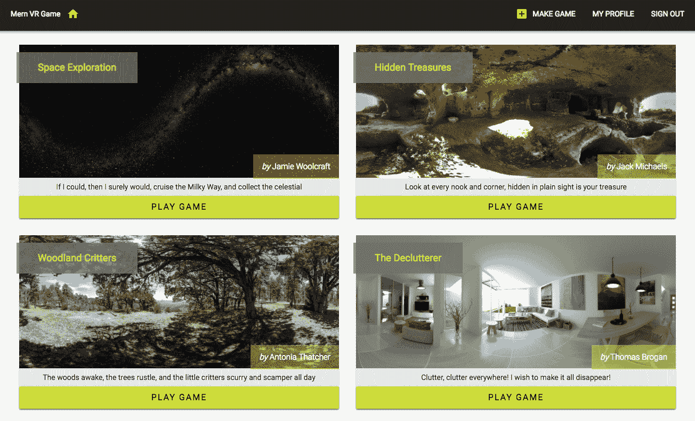完整的 MERN VR 游戏应用程序的代码可在 GitHub 上找到：[github.com/shamahoque/mern-vrgame](https://github.com/shamahoque/mern-vrgame)。您可以克隆此代码，并在阅读本章其余部分的代码解释时运行该应用程序。

为了实现与创建、编辑和列出 VR 游戏相关的功能所需的视图，我们将通过扩展和修改 MERN 骨架应用程序中的现有 React 组件来开发。下图显示了构成本章中开发的 MERN VR 游戏前端的所有自定义 React 组件的组件树：

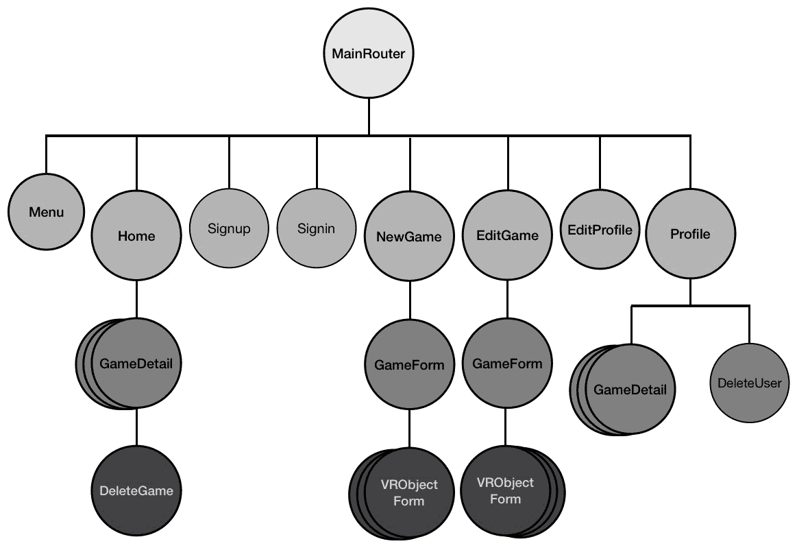

# 游戏模型

在第十章中，《开发基于 Web 的 VR 游戏》，*游戏数据结构*部分详细介绍了为了实现游戏中定义的寻宝功能所需的每个游戏的细节。我们将根据游戏的具体细节、其 VR 对象以及游戏制作者的参考设计游戏模式。

# 游戏模式

在`game.model.js`中为游戏模型定义的 Mongoose 模式中，我们将添加以下字段：

+   游戏的名称

+   世界图像 URL

+   线索文本

+   包含要添加为可收集答案对象的 VR 对象详细信息的数组

+   包含无效对象详细信息的数组，无法收集

+   指示游戏创建和更新的时间戳

+   制作游戏的用户的引用

`GameSchema`将定义如下。

`mern-vrgame/server/models/game.model.js`：

```jsx
const GameSchema = new mongoose.Schema({
  name: {
    type: String,
    trim: true,
    required: 'Name is required'
  },
  world: {
    type: String, trim: true,
    required: 'World image is required'
  },
  clue: {
    type: String,
    trim: true
  },
  answerObjects: [VRObjectSchema],
  wrongObjects: [VRObjectSchema],
  updated: Date,
  created: {
    type: Date,
    default: Date.now
  },
  maker: {type: mongoose.Schema.ObjectId, ref: 'User'}
})
```

# VRObject 模式

游戏模式中的`answerObjects`和`wrongObjects`字段都将是 VRObject 文档的数组，VRObject Mongoose 模式将单独定义，包括存储 OBJ 文件和 MTL 文件的 URL 字段，以及每个 VR 对象的 React 360 `transform`值，`scale`值和`color`值。

`mern-vrgame/server/models/game.model.js`：

```jsx
const VRObjectSchema = new mongoose.Schema({
  objUrl: {
    type: String, trim: true,
    required: 'ObJ file is required'
  },
  mtlUrl: {
    type: String, trim: true,
    required: 'MTL file is required'
  },
  translateX: {type: Number, default: 0},
  translateY: {type: Number, default: 0},
  translateZ: {type: Number, default: 0},
  rotateX: {type: Number, default: 0},
  rotateY: {type: Number, default: 0},
  rotateZ: {type: Number, default: 0},
  scale: {type: Number, default: 1},
  color: {type: String, default: 'white'}
}) 
```

当新的游戏文档保存到数据库时，`answerObjects`和`wrongObjects`数组将填充符合此模式定义的 VRObject 文档。

# 游戏模式中的数组长度验证

在保存到游戏集合中时，游戏文档中的`answerObjects`和`wrongObjects`数组必须至少包含一个 VRObject 文档。为了为游戏模式添加最小数组长度的验证，我们将在`GameSchema`中的`answerObjects`和`wrongObjects`路径中添加以下自定义验证检查。

`mern-vrgame/server/models/game.model.js`：

```jsx
GameSchema.path('answerObjects').validate(function(v) {
  if (v.length == 0) {
    this.invalidate('answerObjects',
   'Must add alteast one VR object to collect')
  }
}, null) 
```

```jsx
GameSchema.path('wrongObjects').validate(function(v) {
  if (v.length == 0) {
    this.invalidate('wrongObjects', 
    'Must add alteast one other VR object') 
  }
}, null) 
```

这些模式定义将满足根据 MERN VR 游戏规范开发动态 VR 游戏的所有要求。

# 游戏 API

MERN VR 游戏中的后端将公开一组 CRUD API，用于在前端应用程序中使用，包括在 React 360 游戏实现中使用 fetch 调用创建、编辑、读取、列出和删除游戏。

# 创建 API

已登录应用程序的用户将能够使用`create`API 在数据库中创建新游戏。

# 路由

在后端，我们将在`game.routes.js`中添加一个`POST`路由，验证当前用户是否已登录并获得授权，然后使用请求中传递的游戏数据创建新游戏。

`mern-vrgame/server/routes/game.routes.js`：

```jsx
router.route('/api/games/by/:userId')
    .post(authCtrl.requireSignin,authCtrl.hasAuthorization, gameCtrl.create)
```

为了处理`:userId`参数并从数据库中检索相关联的用户，我们将利用用户控制器中的`userByID`方法。我们还将在游戏路由中添加以下内容，以便用户在`request`对象中作为`profile`可用。

`mern-vrgame/server/routes/game.routes.js`：

```jsx
router.param('userId', userCtrl.userByID)
```

`game.routes.js`文件将与`user.routes`文件非常相似，并且为了在 Express 应用程序中加载这些新路由，我们需要在`express.js`中挂载游戏路由，就像我们为 auth 和 user 路由所做的那样。

`mern-vrgame/server/express.js`：

```jsx
app.use('/', gameRoutes)
```

# 控制器

当收到`'/api/games/by/:userId'`的 POST 请求并且请求体包含新游戏数据时，将执行`create`控制器方法。

`mern-vrgame/server/controllers/game.controller.js`：

```jsx
const create = (req, res, next) => {
  const game = new Game(req.body)
  game.maker= req.profile
  game.save((err, result) => {
    if(err) {
      return res.status(400).json({
        error: errorHandler.getErrorMessage(err)
      })
    }
    res.status(200).json(result)
  })
}
```

在这个`create`方法中，使用游戏模式创建一个新的游戏文档，并使用从客户端传递的请求体中的数据。然后在将用户引用设置为游戏制造商后，将此文档保存在`Game`集合中。

# 获取

在前端，我们将在`api-game.js`中添加相应的`fetch`方法，通过传递从已登录用户收集的表单数据来向`create`API 发起`POST`请求。

`mern-vrgame/client/game/api-game.js`：

```jsx
const create = (params, credentials, game) => {
  return fetch('/api/games/by/'+ params.userId, {
      method: 'POST',
      headers: {
        'Accept': 'application/json',
        'Content-Type': 'application/json',
        'Authorization': 'Bearer ' + credentials.t
      },
      body: JSON.stringify(game)
    })
    .then((response) => {
      return response.json();
    }).catch((err) => console.log(err)) 
}
```

# 列表 API

可以通过使用列表 API 从后端获取`Game`集合中所有游戏的列表。

# 路由

我们将在游戏路由中添加一个 GET 路由，以检索存储在数据库中的所有游戏。

`mern-vrgame/server/routes/game.routes.js`：

```jsx
router.route('/api/games')
    .get(gameCtrl.list)
```

对`/api/games`的`GET`请求将执行`list`控制器方法。

# 控制器

`list`控制器方法将查询数据库中的`Game`集合，以返回响应给客户端的所有游戏。

`mern-vrgame/server/controllers/game.controller.js`：

```jsx
const list = (req, res) => {
  Game.find({}).populate('maker', '_id name')
 .sort('-created').exec((err, games) => {
    if(err) {
      return res.status(400).json({
        error: errorHandler.getErrorMessage(err)
      })
    }
    res.json(games)

  })
}
```

# 获取

在前端，为了使用这个列表 API 获取游戏，我们将在`api-game.js`中设置一个`fetch`方法。

`mern-vrgame/client/game/api-game.js`：

```jsx
const list = () => {
  return fetch('/api/games', {
    method: 'GET',
  }).then(response => {
    return response.json() 
  }).catch((err) => console.log(err)) 
}
```

# 按制造商列表 API

该应用程序还将允许我们使用制造商列表 API 获取特定用户制作的游戏。

# 路由

在游戏路由中，我们将添加一个`GET`路由，以检索特定用户制作的游戏。

`mern-vrgame/server/routes/game.routes.js`：

```jsx
router.route('/api/games/by/:userId')
    .get(gameCtrl.listByMaker)
```

对这个路由的`GET`请求将执行游戏控制器中的`listByMaker`方法。

# 控制器

`listByMaker`控制器方法将查询数据库中的 Game 集合，以获取匹配的游戏。

`mern-vrgame/server/controllers/game.controller.js`：

```jsx
const listByMaker = (req, res) => {
  Game.find({maker: req.profile._id}, (err, games) => {
    if(err) {
      return res.status(400).json({
        error: errorHandler.getErrorMessage(err)
      })
    }
    res.json(games)
  }).populate('maker', '_id name')
}
```

在对 Game 集合的查询中，我们找到所有制造商字段与`req.profile`中指定的用户匹配的游戏。

# 获取

在前端，为了使用制造商列表 API 获取特定用户的游戏，我们将在`api-game.js`中添加一个`fetch`方法。

`mern-vrgame/client/game/api-game.js`：

```jsx
const listByMaker = (params) => {
  return fetch('/api/games/by/'+params.userId, {
    method: 'GET',
    headers: {
      'Accept': 'application/json'
    }
  }).then((response) => {
    return response.json() 
  }).catch((err) => {
    console.log(err) 
  }) 
}
```

# 读取 API

将使用`'/api/game/:gameId'`的`read` API 从数据库中检索单个游戏数据。

# 路由

在后端，我们将添加一个`GET`路由，查询带有 ID 的`Game`集合，并在响应中返回游戏。

`mern-vrgame/server/routes/game.routes.js`：

```jsx
router.route('/api/game/:gameId')
    .get(gameCtrl.read)
```

路由 URL 中的`:gameId`参数将首先被处理，以从数据库中检索单个游戏。因此，我们还将在游戏路由中添加以下内容：

```jsx
router.param('gameId', gameCtrl.gameByID)
```

# 控制器

对 read API 的请求中的`:gameId`参数将调用`gameByID`控制器方法，该方法类似于`userByID`控制器方法。它将从数据库中检索游戏并将其附加到`request`对象中，以在`next`方法中使用。

`mern-vrgame/server/controllers/game.controller.js`：

```jsx
const gameByID = (req, res, next, id) => {
  Game.findById(id).populate('maker', '_id name').exec((err, game) => {
    if (err || !game)
      return res.status('400').json({
        error: "Game not found"
      })
    req.game = game
    next()
  })
}
```

在这种情况下，`next`方法，即`read`控制器方法，简单地将这个`game`对象返回给客户端的响应。

`mern-vrgame/server/controllers/game.controller.js`：

```jsx
const read = (req, res) => {
  return res.json(req.game)
}
```

# 获取

在前端代码中，我们将添加一个`fetch`方法来利用这个 read API 根据其 ID 检索单个游戏的详细信息。

`mern-vrgame/client/game/api-game.js`：

```jsx
const read = (params, credentials) => {
  return fetch('/api/game/' + params.gameId, {
    method: 'GET'
  }).then((response) => {
    return response.json() 
  }).catch((err) => console.log(err)) 
}
```

这个`read` API 将用于 React 视图获取游戏详情，还将用于 React 360 游戏视图，该视图将呈现游戏界面。

# 编辑 API

已登录并且也是特定游戏的制作者的授权用户将能够使用`edit` API 编辑该游戏的详细信息。

# 路由

在后端，我们将添加一个`PUT`路由，允许授权用户编辑他们的游戏之一。

`mern-vrgame/server/routes/game.routes.js`：

```jsx
router.route('/api/games/:gameId')
    .put(authCtrl.requireSignin, gameCtrl.isMaker, gameCtrl.update)
```

向`'/api/games/:gameId'`发送 PUT 请求将首先执行`gameByID`控制器方法，以检索特定游戏的详细信息。还将调用`requireSignin`身份验证控制器方法，以确保当前用户已登录。然后`isMaker`控制器方法将确定当前用户是否是该特定游戏的制作者，最后运行游戏`update`控制器方法来修改数据库中的游戏。

# 控制器

`isMaker`控制器方法确保已登录用户实际上是正在编辑的游戏的制作者。

`mern-vrgame/server/controllers/game.controller.js`：

```jsx
const isMaker = (req, res, next) => {
  let isMaker = req.game && req.auth && req.game.maker._id == req.auth._id
  if(!isMaker){
    return res.status('403').json({
      error: "User is not authorized"
    })
  }
  next()
}
```

游戏控制器中的`update`方法将获取现有的游戏详情和请求体中接收到的表单数据，合并更改，并将更新后的游戏保存到数据库中的 Game 集合中。

`mern-vrgame/server/controllers/game.controller.js`：

```jsx
const update = (req, res) => {
  let game = req.game
  game = _.extend(game, req.body)
  game.updated = Date.now()
  game.save((err) => {
    if(err) {
      return res.status(400).send({
        error: errorHandler.getErrorMessage(err)
      })
    }
    res.json(game)
  })
}
```

# 获取

在视图中调用`edit` API 时，使用`fetch`方法获取表单数据，并将其与用户凭据一起发送到后端。

`mern-vrgame/client/game/api-game.js`：

```jsx
const update = (params, credentials, game) => {
  return fetch('/api/games/' + params.gameId, {
    method: 'PUT',
    headers: {
      'Accept': 'application/json',
      'Content-Type': 'application/json',
      'Authorization': 'Bearer ' + credentials.t
    },
    body: JSON.stringify(game)
  }).then((response) => {
    return response.json() 
  }).catch((err) => {
    console.log(err) 
  }) 
}
```

# 删除 API

经过身份验证和授权的用户将能够使用`delete`游戏 API 删除他们在应用程序中制作的任何游戏。

# 路由

在后端，我们将添加一个`DELETE`路由，允许授权的制作者删除他们自己的游戏之一。

`mern-vrgame/server/routes/game.routes.js`：

```jsx
router.route('/api/games/:gameId')
    .delete(authCtrl.requireSignin, gameCtrl.isMaker, gameCtrl.remove)
```

在收到`'api/games/:gameId'`的 DELETE 请求后，控制器方法在服务器上的执行流程将类似于编辑 API，最终调用`remove`控制器方法而不是`update`。

# 控制器

当收到`'/api/games/:gameId'`的 DELETE 请求并验证当前用户是给定游戏的原始制作者时，`remove`控制器方法将从数据库中删除指定的游戏。

`mern-vrgame/server/controllers/game.controller.js`：

```jsx
const remove = (req, res) => {
  let game = req.game
  game.remove((err, deletedGame) => {
    if(err) {
      return res.status(400).json({
        error: errorHandler.getErrorMessage(err)
      })
    }
    res.json(deletedGame)
  })
}
```

# 获取

我们将在`api-game.js`中添加相应的`remove`方法，以便向删除 API 发出`delete`请求。

`mern-vrgame/client/game/api-game.js`：

```jsx
const remove = (params, credentials) => {
  return fetch('/api/games/' + params.gameId, {
    method: 'DELETE',
    headers: {
      'Accept': 'application/json',
      'Content-Type': 'application/json',
      'Authorization': 'Bearer ' + credentials.t
    }
  }).then((response) => {
    return response.json() 
  }).catch((err) => {
    console.log(err) 
  }) 
}
```

有了这些游戏 API，我们可以构建应用程序的 React 视图，并更新 React 360 游戏视图代码以获取和呈现动态游戏详情。

# 创建和编辑游戏

在 MERN VR Game 上注册的用户将能够在应用程序内制作新游戏并修改这些游戏。我们将添加 React 组件，允许用户修改每个游戏的游戏详情和 VR 对象详情。

# 创建新游戏

当用户登录应用程序时，他们将在菜单中看到一个 MAKE GAME 链接，该链接将引导他们到包含创建新游戏表单的`NewGame`组件。

# 更新菜单

我们将更新导航菜单，添加 MAKE GAME 按钮，如下截图所示：

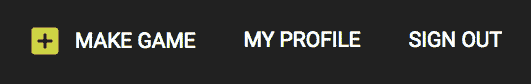

在`Menu`组件中，我们将在用户经过身份验证时渲染的部分中，在 MY PROFILE 链接之前，为`NewGame`组件的路由添加`Link`。

`mern-vrgame/client/core/Menu.js`：

```jsx
<Link to="/game/new">
   <Button style={isActive(history, "/game/new")}>
       <AddBoxIcon color="secondary"/> Make Game
   </Button>
</Link>
```

# NewGame 组件

`NewGame`组件使用`GameForm`组件来渲染用户将填写以创建新游戏的表单元素：

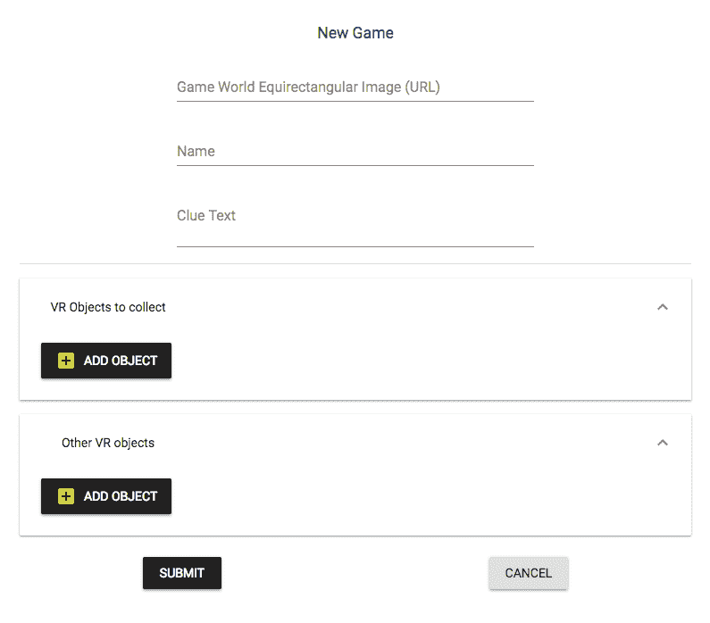

`GameForm`包含所有表单字段，并从`NewGame`组件中获取`onSubmit`方法（用户提交表单时应执行的方法），以及任何服务器返回的错误消息。

`mern-vrgame/client/game/NewGame.js`：

```jsx
<GameForm onSubmit={this.clickSubmit} errorMsg={this.state.error}/>
```

`clickSubmit`方法使用`api-game.js`中的创建`fetch`方法，向`create`API 发出 POST 请求，携带游戏表单数据和用户详情。

`mern-vrgame/client/game/NewGame.js`：

```jsx
  clickSubmit = game => event => {
    const jwt = auth.isAuthenticated() 
    create({
      userId: jwt.user._id
    }, {
      t: jwt.token
    }, game).then((data) => {
      if (data.error) {
        this.setState({error: data.error}) 
      } else {
        this.setState({error: '', redirect: true}) 
      }
    }) 
  }
```

我们将在`MainRouter`中添加一个`PrivateRoute`，以便`NewGame`组件在浏览器中加载，路径为`/game/new`。

`mern-vrgame/client/MainRouter.js`：

```jsx
<PrivateRoute path="/game/new" component={NewGame}/>
```

# 编辑游戏

用户将能够使用`EditGame`组件编辑他们创建的游戏，该组件将呈现预填充现有游戏详情的游戏表单字段。

# EditGame 组件

就像在`NewGame`组件中一样，`EditGame`组件也将使用`GameForm`组件来呈现表单元素，但这次字段将显示游戏字段的当前值，并且用户将能够更新这些值：

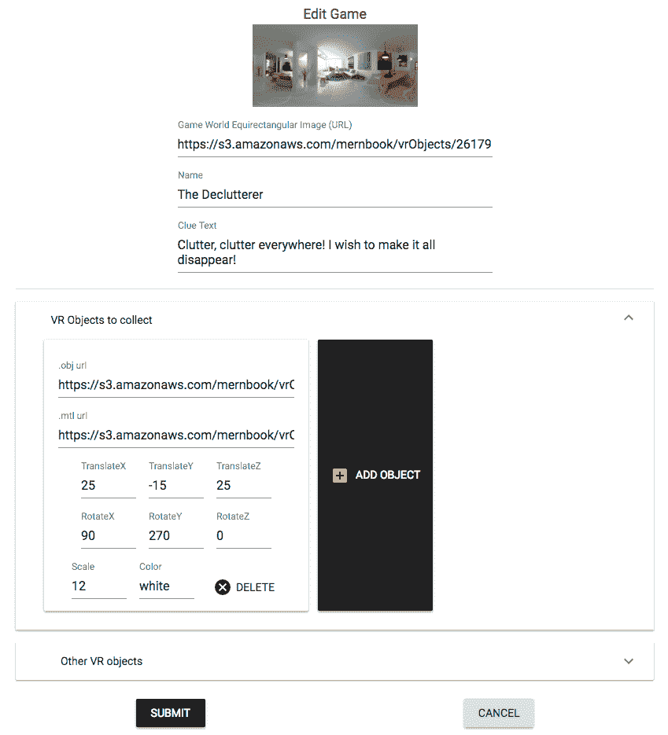

在`EditGame`组件的情况下，`GameForm`将接受给定游戏的 ID 作为属性，以便获取游戏详情，以及`onSubmit`方法和服务器生成的错误消息（如果有）。

`mern-vrgame/client/game/EditGame.js`：

```jsx
<GameForm gameId={this.match.params.gameId} onSubmit={this.clickSubmit} errorMsg={this.state.error}/>
```

编辑表单的`clickSubmit`方法将使用`api-game.js`中的`update`获取方法，向编辑 API 发出 PUT 请求，携带表单数据和用户详情。

`mern-vrgame/client/game/EditGame.js`：

```jsx
clickSubmit = game => event => {
    const jwt = auth.isAuthenticated() 
    update({
      gameId: this.match.params.gameId
    }, {
      t: jwt.token
    }, game).then((data) => {
      if (data.error) {
        this.setState({error: data.error}) 
      } else {
        this.setState({error: '', redirect: true}) 
      }
    }) 
  }
```

`EditGame`组件将在浏览器中加载，路径为`/game/edit/:gameId`，在`MainRouter`中声明为`PrivateRoute`。

`mern-vrgame/client/MainRouter.js`：

```jsx
<PrivateRoute path="/game/edit/:gameId" component={EditGame}/>
```

# GameForm 组件

`GameForm`组件在`NewGame`和`EditGame`组件中都使用，包含允许用户输入游戏详情和单个游戏的 VR 对象详情的元素。它可以从空白游戏对象开始，或在`componentDidMount`中加载现有游戏。

`mern-vrgame/client/game/GameForm.js`：

```jsx
state = {
    game: {name: '', clue:'', world:'', answerObjects:[], wrongObjects:[]},
    redirect: false,
    readError: ''
  }
```

如果`GameForm`组件从父组件（如`EditGame`组件）接收到`gameId`属性，则它将使用读取 API 来检索游戏的详情并将其设置为状态以在表单视图中呈现。

`mern-vrgame/client/game/GameForm.js`：

```jsx
componentDidMount = () => {
    if(this.props.gameId){
      read({gameId: this.props.gameId}).then((data) => {
        if (data.error) {
          this.setState({readError: data.error}) 
        } else {
          this.setState({game: data}) 
        }
      }) 
    }
}
```

`GameForm`组件中的表单视图基本上分为两部分，一部分是接受简单的游戏细节，比如名称、世界图片链接和线索文本作为输入，另一部分允许用户向答案对象数组或错误对象数组中添加可变数量的 VR 对象。

# 输入简单的游戏细节

简单的游戏细节部分将主要是使用 Material-UI 的`TextField`组件添加的文本输入，并传递给`onChange`的更改处理方法。

# 表单标题

表单标题将是“新游戏”或“编辑游戏”，具体取决于是否将现有游戏 ID 作为 prop 传递给`GameForm`。

`mern-vrgame/client/game/GameForm.js`：

```jsx
<Typography type="headline" component="h2">
    {this.props.gameId? 'Edit': 'New'} Game
</Typography>
```

# 游戏世界图片

我们将在顶部的`img`元素中渲染背景图片 URL，以显示用户添加的游戏世界图片 URL。

`mern-vrgame/client/game/GameForm.js`：

```jsx

<TextField id="world" label="Game World Equirectangular Image (URL)" 
value={this.state.game.world} onChange={this.handleChange('world')}/>
```

# 游戏名称

游戏名称将添加在一个默认类型为`text`的单个`TextField`中。

`mern-vrgame/client/game/GameForm.js`：

```jsx
<TextField id="name" label="Name" value={this.state.game.name} onChange={this.handleChange('name')}/>
```

# 线索文本

线索文本将添加到多行`TextField`组件中。

`mern-vrgame/client/game/GameForm.js`：

```jsx
<TextField id="multiline-flexible" label="Clue Text" multiline rows="2" value={this.state.game.clue} onChange={this.handleChange('clue')}/>
```

# 处理输入

所有输入更改将由`handleChange`方法处理，该方法将使用用户输入更新状态中的游戏数值。

`mern-vrgame/client/game/GameForm.js`：

```jsx
handleChange = name => event => {
    const newGame = this.state.game 
    newGame[name] = event.target.value 
    this.setState({game: newGame}) 
}
```

# 修改 VR 对象数组

为了允许用户修改他们希望添加到他们的 VR 游戏中的`answerObjects`和`wrongObjects`数组，`GameForm`将遍历每个数组，并为每个对象渲染一个`VRObjectForm`组件。通过这样做，将可以从`GameForm`组件中添加、删除和修改 VR 对象：

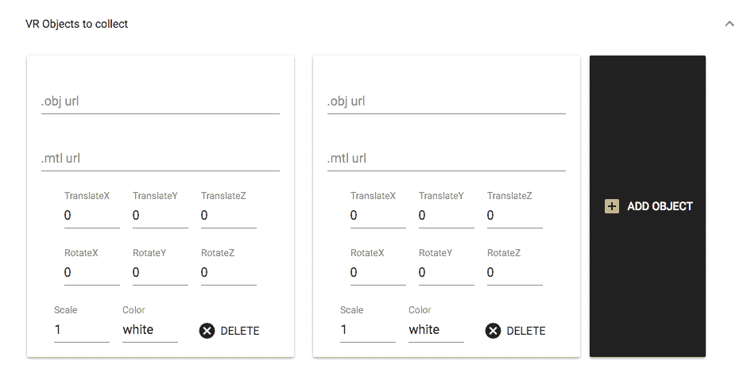

# 迭代和渲染对象细节表单

使用 Material-UI 的`ExpansionPanel`组件，我们将添加先前看到的表单界面，以为给定游戏中的每种类型的 VR 对象数组创建一个可修改的数组。

在`ExpansionPanelDetails`组件中，我们将迭代`answerObjects`数组或`wrongObjects`数组，为每个 VR 对象渲染一个`VRObjectForm`组件。

`mern-vrgame/client/game/GameForm.js`：

```jsx
<ExpansionPanel>
   <ExpansionPanelSummary expandIcon={<ExpandMoreIcon/>}>
      <Typography>VR Objects to collect</Typography>
   </ExpansionPanelSummary>
   <ExpansionPanelDetails>{
      this.state.game.answerObjects.map((item, i) => {
 return <div key={i}>
                  <VRObjectForm index={i} type={'answerObjects'}
 vrObject={item}
 handleUpdate={this.handleObjectChange} 
 removeObject={this.removeObject}/>
               </div> })}
      <Button color="primary" variant="raised" onClick={this.addObject('answerObjects')}>
          <AddBoxIcon color="secondary"/> Add Object
      </Button>
   </ExpansionPanelDetails>
</ExpansionPanel>
```

每个`VRObjectForm`将作为 props 接受`vrObject`本身，数组中的当前`index`，对象数组的类型，以及在`VRObjectForm`组件内部通过更改细节或删除对象时更新`GameForm`状态的两种方法。

# 向数组中添加一个新对象

添加对象的按钮将允许用户添加一个新的`VRObjectForm`组件，以获取新的 VR 对象的细节。

`mern-vrgame/client/game/GameForm.js`：

```jsx
addObject = name => event => {
    const newGame = this.state.game 
    newGame[name].push({}) 
    this.setState({game: newGame}) 
} 
```

这基本上只会向正在迭代的数组中添加一个空对象，并使用名称值中指定的数组类型调用`addObject`方法。

# 从数组中移除对象

每个`VRObjectForm`组件也可以被删除，以从给定数组中移除对象。`GameForm`将会传递一个`removeObject`方法给`VRObjectForm`组件作为属性，这样当用户点击特定`VRObjectForm`上的`delete`时，数组就可以在状态中更新。

`mern-vrgame/client/game/GameForm.js`：

```jsx
removeObject = (type, index) => event => {
    const newGame = this.state.game 
    newGame[type].splice(index, 1) 
    this.setState({game: newGame}) 
}
```

对象将通过在指定名称的数组中的给定`index`处进行切片来从数组中移除。

# 处理对象细节变化

当用户更改任何`VRObjectForm`字段中的输入值时，`VR`对象的细节将在`GameForm`组件状态中更新。为了注册这个更新，`GameForm`将`handleObjectChange`方法传递给`VRObjectForm`组件。

`mern-vrgame/client/game/GameForm.js`：

```jsx
handleObjectChange = (index, type, name, val) => {
    var newGame = this.state.game 
    newGame[type][index][name] = val 
    this.setState({game: newGame}) 
}
```

`handleObjectChange`方法会更新数组中特定对象的字段值，使用给定的`type`和`index`，因此它会在`GameForm`中存储的游戏对象状态中反映出来。

# VRObjectForm 组件

`VRObjectForm`组件将渲染输入字段，以修改单个 VR 对象的细节，该对象被添加到`GameForm`组件中的`answerObjects`和`wrongObjects`数组中：

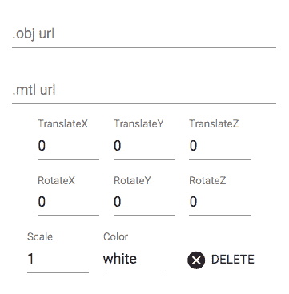

它可以从一个空的 VR 对象开始，或者在`componentDidMount`中加载现有的 VR 对象的细节。

`mern-vrgame/client/game/VRObjectForm.js`：

```jsx
state = {
      objUrl: '', mtlUrl: '',
      translateX: 0, translateY: 0, translateZ: 0, 
      rotateX: 0, rotateY: 0, rotateZ: 0,
      scale: 1, color:'white'
} 
```

在`componentDidMount`中，状态将被设置为从`GameForm`组件传递的`vrObject`的细节。

`mern-vrgame/client/game/VRObjectForm.js`：

```jsx
componentDidMount = () => {
    if(this.props.vrObject && 
    Object.keys(this.props.vrObject).length != 0){
        const vrObject = this.props.vrObject 
        this.setState({
          objUrl: vrObject.objUrl,
          mtlUrl: vrObject.mtlUrl,
          translateX: Number(vrObject.translateX),
          translateY: Number(vrObject.translateY),
          translateZ: Number(vrObject.translateZ),
          rotateX: Number(vrObject.rotateX),
          rotateY: Number(vrObject.rotateY),
          rotateZ: Number(vrObject.rotateZ),
          scale: Number(vrObject.scale),
          color:vrObject.color
        }) 
    }
}
```

使用 Material-UI 的`TextField`组件来添加修改这些值的输入字段。

# 3D 对象文件输入

OBJ 和 MTL 文件链接将作为文本输入添加到每个 VR 对象中，使用`TextField`组件。

`mern-vrgame/client/game/VRObjectForm.js`：

```jsx
<TextField
    id="obj"
    label=".obj url"
    value={this.state.objUrl}
    onChange={this.handleChange('objUrl')}
/><br/>
<TextField
    id="mtl"
    label=".mtl url"
    value={this.state.mtlUrl}
    onChange={this.handleChange('mtlUrl')}
/>
```

# 翻译值输入

VR 对象在 X、Y 和 Z 轴上的翻译值将在`number`类型的`TextField`组件中输入。

`mern-vrgame/client/game/VRObjectForm.js`：

```jsx
<TextField
    value={this.state.translateX}
    label="TranslateX"
    onChange={this.handleChange('translateX')}
    type="number"
/>
<TextField
    value={this.state.translateY}
    label="TranslateY"
    onChange={this.handleChange( 'translateY')}
    type="number"
/>
<TextField
    value={this.state.translateZ}
    label="TranslateZ"
    onChange={this.handleChange('translateZ')}
    type="number"
/>
```

# 旋转值输入

VR 对象围绕 X、Y 和 Z 轴的“旋转”值将在“数字”类型的 TextField 组件中输入。

`mern-vrgame/client/game/VRObjectForm.js`：

```jsx
<TextField
    value={this.state.rotateX}
    label="RotateX"
    onChange={this.handleChange('rotateX')}
    type="number"
/>
<TextField
    value={this.state.rotateY}
    label="RotateY"
    onChange={this.handleChange('rotateY')}
    type="number"
/>
<TextField
    value={this.state.rotateZ}
    label="RotateZ"
    onChange={this.handleChange('rotateZ')}
    type="number"
/>
```

# 比例值输入

VR 对象的“比例”值将在“数字”类型的 TextField 组件中输入。

`mern-vrgame/client/game/VRObjectForm.js`：

```jsx
<TextField
    value={this.state.scale}
    label="Scale"
    onChange={this.handleChange('scale')}
    type="number"
/>
```

# 对象颜色输入

VR 对象的颜色值将在“文本”类型的 TextField 组件中输入：

`mern-vrgame/client/game/VRObjectForm.js`：

```jsx
<TextField
    value={this.state.color}
    label="Color"
    onChange={this.handleChange('color')}
/>
```

# 删除对象按钮

`VRObjectForm`将包含一个“删除”按钮，该按钮将执行从`GameForm`props 表单中接收到的`removeObject`方法：

`mern-vrgame/client/game/VRObjectForm.js`：

```jsx
<Button onClick={this.props.removeObject(this.props.type, this.props.index)}>
     <Icon>cancel</Icon> Delete
</Button>
```

`removeObject`方法将获取对象数组类型的值和要删除的数组索引位置，从`GameForm`状态中删除相关 VR 对象数组中的给定对象。

# 处理输入更改

当输入字段中的任何 VR 对象细节发生更改时，`handleChange`方法将更新`VRObjectForm`组件的状态，并使用从`GameForm`传递的`handleUpdate`方法来更新`GameForm`状态中的 VR 对象的更改值。

`mern-vrgame/client/game/VRObjectForm.js`：

```jsx
handleChange = name => event => {
    this.setState({[name]: event.target.value}) 
    this.props.handleUpdate(this.props.index, 
                            this.props.type, 
                            name, 
                            event.target.value) 
}
```

通过这种实现，创建和编辑游戏表单已经就位，包括用于不同大小数组的 VR 对象输入表单。任何注册用户都可以使用这些表单在 MERN VR 游戏应用程序上添加和编辑游戏。

# 游戏列表视图

访问 MERN VR 游戏的访问者将从主页和个人用户资料页面上呈现的列表中访问应用程序中的游戏。主页将列出应用程序中的所有游戏，特定制作者的游戏将列在其用户资料页面上。列表视图将通过使用“列表”API 获取的游戏数据进行迭代，并在`GameDetail`组件中呈现每个游戏的详细信息。

# 所有游戏

`Home`组件将在组件挂载时使用列表 API 获取游戏集合中所有游戏的列表。

`mern-vrgame/client/core/Home.js`：

```jsx
componentDidMount = () => {
    list().then((data) => {
      if (data.error) {
        console.log(data.error) 
      } else {
        this.setState({games: data}) 
      }
    })
}
```

从服务器检索到的游戏列表将设置为状态，并进行迭代以呈现每个列表中的`GameDetail`组件。

`mern-vrgame/client/core/Home.js`：

```jsx
{this.state.games.map((game, i) => {
     return <GameDetail key={i} game={game} updateGames={this.updateGames}/>
})}
```

`GameDetail`组件将传递游戏详情和`updateGames`方法。

`mern-vrgame/client/core/Home.js`：

```jsx
updateGames = (game) => {
    const updatedGames = this.state.games 
    const index = updatedGames.indexOf(game) 
    updatedGames.splice(index, 1) 
    this.setState({games: updatedGames}) 
}
```

`updateGames`方法将在用户从`GameDetail`组件中删除他们的游戏时更新`Home`组件中的列表，该组件呈现了游戏制作者的`edit`和`delete`选项：

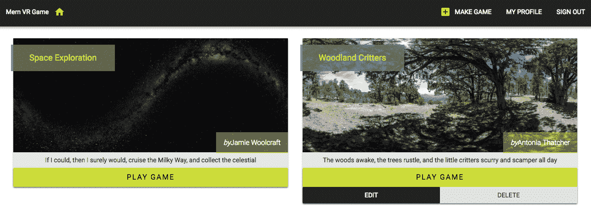

# 制作者的游戏

用户`Profile`组件将使用制作者 API 获取给定用户制作的游戏列表。我们将更新`Profile`组件中的`init`方法，在检索到用户详细信息后调用`listByMaker`获取方法。

`mern-vrgame/client/user/Profile.js`：

```jsx
  init = (userId) => {
    const jwt = auth.isAuthenticated() 
    read({
      userId: userId
    }, {t: jwt.token}).then((data) => {
      if (data.error) {
        this.setState({redirectToSignin: true}) 
      } else {
        this.setState({user: data}) 
 listByMaker({userId: data._id}).then((data) => {
 if (data.error) {
 console.log(data.error) 
 } else {
 this.setState({games: data}) 
 }
 })
      }
    }) 
  }
```

类似于在`Home`组件中呈现游戏列表的方式，我们将在`Profile`组件中将从服务器检索到的游戏列表设置为状态，并在视图中对其进行迭代以呈现`GameDetail`组件，该组件将传递个别游戏详情和`updateGames`方法。

`mern-vrgame/client/user/Profile.js`：

```jsx
{this.state.games.map((game, i) => {
    return <GameDetail key={i} game={game} updateGames={this.updateGames}/>
})}
```

这将为特定用户制作的每个游戏呈现一个`GameDetail`组件：

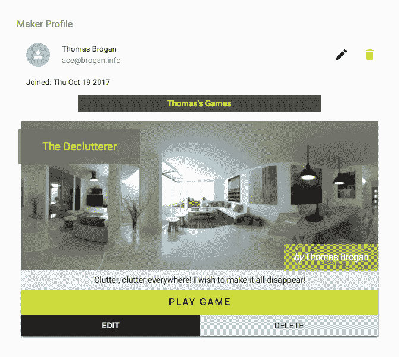

# 游戏详情组件

`GameDetail`组件以游戏对象作为属性，并呈现游戏的详细信息，以及一个链接到 VR 游戏视图的 PLAY GAME 按钮。如果当前用户是游戏制作者，则还会显示`edit`和`delete`按钮：

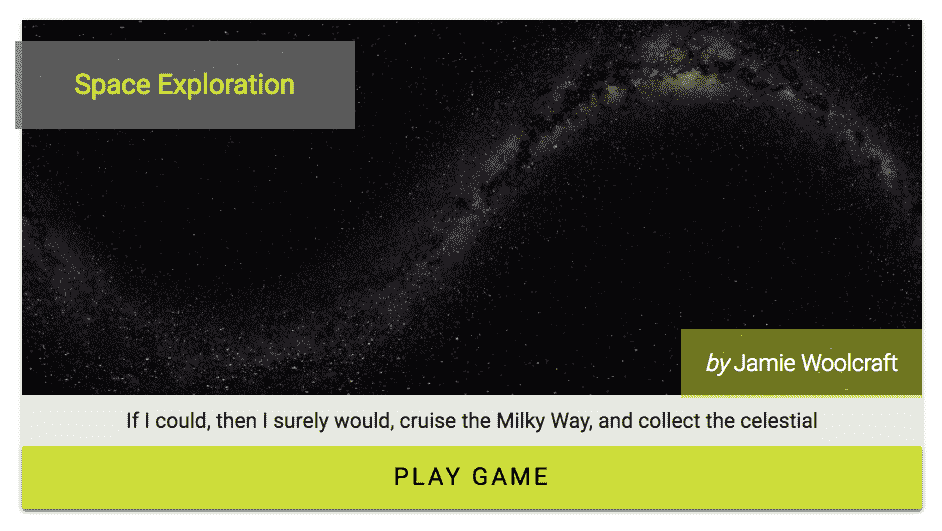

# 游戏详情

游戏详情，如名称、世界图片、线索文本和制作者名称，都会被呈现，以便用户对游戏有一个概览。

`mern-vrgame/client/game/GameDetail.js`：

```jsx
<Typography type="headline" component="h2">
     {this.props.game.name}
</Typography>
<CardMedia image={this.props.game.world} 
           title={this.props.game.name}/>
<Typography type="subheading" component="h4">
     <em>by</em>
     {this.props.game.maker.name}
</Typography>
<CardContent>
     <Typography type="body1" component="p">
          {this.props.game.clue}
     </Typography>
</CardContent>
```

# Play Game 按钮

`GameDetail`组件中的`Play Game`按钮将简单地是一个指向打开 React 360 生成的`index.html`路由的`Link`组件（服务器上此路由的实现在*玩 VR 游戏*部分讨论）。

`mern-vrgame/client/game/GameDetail.js`：

```jsx
<Link to={"/game/play?id=" + this.props.game._id} target='_self'>
   <Button variant="raised" color="secondary">
      Play Game
   </Button>
</Link>
```

游戏视图的路由将以游戏 ID 作为`query`参数。我们在`Link`上设置`target='_self'`，这样 React Router 就会跳过转换到下一个状态，让浏览器处理这个链接。这样做的效果是允许浏览器直接在此路由发出请求，并在响应此请求时渲染服务器发送的`index.html`文件。

# 编辑和删除按钮

`GameDetail`组件只会在当前登录用户也是正在呈现的游戏的制作者时显示`edit`和`delete`选项。

`mern-vrgame/client/game/GameDetail.js`：

```jsx
{auth.isAuthenticated().user 
    && auth.isAuthenticated().user._id == this.props.game.maker._id && 
    (<div>
       <Link to={"/game/edit/" + this.props.game._id}>
          <Button variant="raised" color="primary" 
         className={classes.editbutton}>
              Edit
          </Button>
       </Link>
       <DeleteGame game={this.props.game} 
       removeGame={this.props.updateGames}/>
    </div>)}
```

如果已登录用户的用户 ID 与游戏中的制作者 ID 匹配，则在视图中显示链接到编辑表单视图的`edit`按钮和`DeleteGame`组件。

# 删除游戏

已登录用户将能够通过点击`GameDetail`组件中制作者可见的`delete`按钮来删除他们制作的特定游戏。`GameDetail`组件使用`DeleteGame`组件添加了这个`delete`选项。

# DeleteGame 组件

`DeleteGame`组件添加到每个游戏的`GameDetail`组件中，从`GameDetail`中获取游戏详情和`removeGame`方法作为 props，该方法更新了`GameDetail`所属的父组件。

`mern-vrgame/client/game/GameDetail.js`：

```jsx
<DeleteGame game={this.props.game} removeGame={this.props.updateGames}/>
```

这个`DeleteGame`组件基本上是一个按钮，当点击时，会打开一个确认对话框，询问用户是否确定要删除他们的游戏：

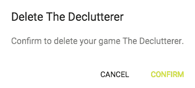

对话框是使用 Material-UI 的`Dialog`组件实现的。

`mern-vrgame/client/game/DeleteGame.js`：

```jsx
<Button variant="raised" onClick={this.clickButton}>
   Delete
</Button>
<Dialog open={this.state.open} onClose={this.handleRequestClose}>
   <DialogTitle>{"Delete "+this.props.game.name}</DialogTitle>
   <DialogContent>
      <DialogContentText>
         Confirm to delete your game {this.props.game.name}.
      </DialogContentText>
   </DialogContent>
   <DialogActions>
      <Button onClick={this.handleRequestClose} color="primary">
         Cancel
      </Button>
      <Button onClick={this.deleteGame} color="secondary" 
      autoFocus="autoFocus">
         Confirm
      </Button>
   </DialogActions>
</Dialog>
```

成功删除后，对话框将关闭，并通过调用作为 prop 传递的`removeGame`方法更新包含`GameDetail`组件的父组件。

`mern-vrgame/client/game/DeleteGame.js`：

```jsx
deleteGame = () => {
    const jwt = auth.isAuthenticated() 
    remove({
      gameId: this.props.game._id
    }, {t: jwt.token}).then((data) => {
      if (data.error) {
        console.log(data.error) 
      } else {
        this.props.removeGame(this.props.game) 
        this.setState({open: false}) 
      }
    }) 
  }
```

在这个`deleteGame`处理程序方法中调用的`removeGame`方法更新了父组件的状态，这可能是`Home`组件或用户`Profile`组件，因此已删除的游戏不再显示在视图中。

# 玩 VR 游戏

MERN VR 游戏上的用户将能够在应用程序内打开和玩任何游戏。为了实现这一点，我们将在服务器上设置一个路由，以在以下路径对 GET 请求的响应中呈现使用 React 360 生成的`index.html`：

```jsx
/game/play?id=<game ID>
```

路径以`query`参数作为游戏 ID 值，该值在 React 360 代码中用于使用读取 API 获取游戏详情。

# API 来渲染 VR 游戏视图

打开 React 360 `index.html`页面的 GET 请求将在`game.routes.js`中声明，如下所示。

`mern-vrgame/server/routes/game.routes.js`：

```jsx
router.route('/game/play')
  .get(gameCtrl.playGame)
```

这将执行`playGame`控制器方法，以响应传入请求返回`index.html`页面。

`mern-vrgame/server/controllers/game.controller.js`：

```jsx
const playGame = (req, res) => {
  res.sendFile(process.cwd()+'/server/vr/index.html')
}
```

`playGame`控制器方法将`/server/vr/`文件夹中放置的`index.html`发送给请求的客户端。

在浏览器中，这将呈现 React 360 游戏代码，它将使用读取 API 从数据库中获取游戏详情，并呈现游戏世界以及用户可以与之交互的 VR 对象。

# 更新 React 360 中的游戏代码

在 MERN 应用程序中设置了游戏后端之后，我们可以更新在第十章中开发的 React 360 项目代码，使其直接从数据库中的游戏集合中呈现游戏。

我们将在打开 React 360 应用程序的链接中使用游戏 ID，以在 React 360 代码内部使用读取 API 获取游戏详情，然后将数据设置为状态，以便游戏加载从数据库中检索的详情，而不是我们在第十章中使用的静态示例数据，*开发基于 Web 的 VR 游戏*。

代码更新后，我们可以再次对其进行打包，并将编译后的文件放在 MERN 应用程序中。

# 从链接中获取游戏 ID

在 React 360 项目文件夹的`index.js`文件中，更新`componentDidMount`方法，从传入的 URL 中检索游戏 ID，并调用读取游戏 API 进行获取。

`/MERNVR/index.js`：

```jsx
componentDidMount = () => {
    let gameId = Location.search.split('?id=')[1]
    read({
          gameId: gameId
      }).then((data) => {
        if (data.error) {
          this.setState({error: data.error});
        } else {
          this.setState({
            vrObjects: data.answerObjects.concat(data.wrongObjects),
            game: data
          });
          Environment.setBackgroundImage(
            {uri: data.world}
          )
        }
    })
}
```

`Location.search`让我们可以访问加载`index.html`的传入 URL 中的查询字符串。检索到的查询字符串被`split`以从 URL 中附加的`id`查询参数中获取游戏 ID 值。我们需要这个游戏 ID 值来使用读取 API 从服务器获取游戏详情，并将其设置为游戏和`vrObjects`值的状态。

# 使用读取 API 获取游戏数据

在 React 360 项目文件夹中，我们将添加一个`api-game.js`文件，其中包含一个读取`fetch`方法，用于使用提供的游戏 ID 调用服务器上的读取游戏 API。

`/MERNVR/api-game.js`：

```jsx
const read = (params) => {
  return fetch('/api/game/' + params.gameId, {
    method: 'GET'
  }).then((response) => {
    return response.json() 
  }).catch((err) => console.log(err)) 
}
export {
  read
} 
```

这个 fetch 方法在 React 360 入口组件的`componentDidMount`中用于检索游戏详情。

这个更新的 React 360 代码可以在 GitHub 仓库的名为'dynamic-game'的分支中找到：[github.com/shamahoque/MERNVR](https://github.com/shamahoque/MERNVR)。

# 打包和集成更新的代码

将 React 360 代码更新为从服务器动态获取和呈现游戏详情后，我们可以使用提供的打包脚本对此代码进行打包，并将新编译的文件放在 MERN VR 游戏项目目录的`dist`文件夹中。

要从命令行打包 React 360 代码，请转到 React 360 `MERNVR`项目文件夹并运行：

```jsx
npm run bundle
```

这将在`build/`文件夹中生成`client.bundle.js`和`index.bundle.js`捆绑文件，其中包含更新的 React 360 代码。这些文件以及`index.html`和`static_assets`文件夹需要根据第十章中讨论的内容添加到 MERN VR 游戏应用程序代码中，*开发基于 Web 的 VR 游戏*，以集成最新的 VR 游戏代码。

完成了这个集成后，如果我们运行 MERN VR 游戏应用程序，并在任何游戏的“播放游戏”链接上点击，它应该会打开游戏视图，并显示特定游戏的详细信息，允许按照游戏玩法规定与 VR 对象进行交互。

# 摘要

在本章中，我们将 MERN 堆栈技术的功能与 React 360 集成，开发了一个用于 Web 的动态 VR 游戏应用程序。

我们扩展了 MERN 骨架应用程序，以构建一个工作的后端，用于存储 VR 游戏的详细信息，并允许我们进行 API 调用来操作这些详细信息。我们添加了 React 视图，让用户可以修改游戏并浏览游戏，还可以选择在特定路由上启动和玩 VR 游戏，由服务器直接呈现。

最后，我们更新了 React 360 项目代码，通过从传入 URL 检索查询参数，并使用 fetch 来检索游戏 API 的数据，在 MERN 应用程序和 VR 游戏视图之间传递数据。

React 360 代码与 MERN 堆栈应用程序的集成产生了一个完全功能且动态的基于 Web 的 VR 游戏应用程序，展示了 MERN 堆栈技术如何被使用和扩展以创建独特的用户体验。

在下一章中，我们将反思本书中构建的 MERN 应用程序，讨论不仅是遵循的最佳实践，还有改进和进一步发展的空间。
