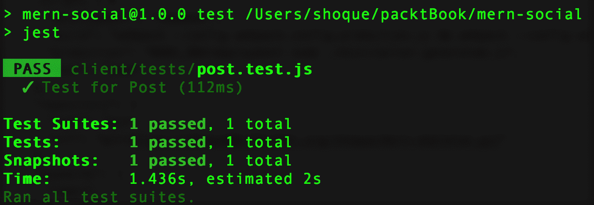
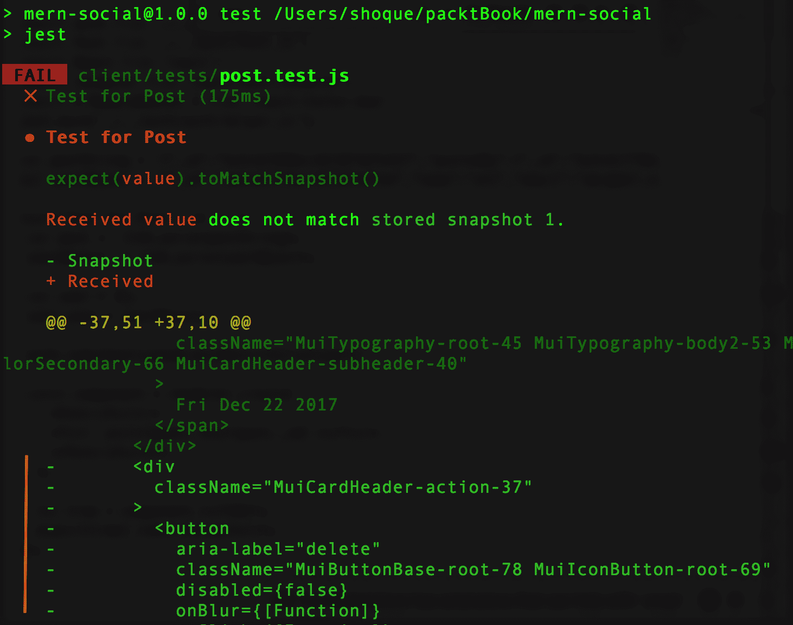

# 第十二章：遵循最佳实践并进一步开发 MERN

在本章中，我们详细阐述了在构建本书中的四个 MERN 应用程序时应用的一些最佳实践，以及本书中未应用的其他实践，但应考虑用于真实世界的应用程序，以确保可靠性和可扩展性随着复杂性的增长。最后，我们提出了增强和扩展构建的应用程序的建议和步骤。

本章涵盖的主题包括以下内容：

+   应用程序结构中的模块化关注点分离

+   考虑 CSS 样式解决方案的选项

+   为选定视图提供数据的服务器端渲染

+   使用 ES6 类来区分有状态和纯函数组件

+   决定使用 Redux 还是 Flux

+   用于存储用户凭据的安全增强功能

+   编写测试代码

+   优化捆绑大小

+   如何向现有应用程序添加新功能

# 模块化的关注点分离

在构建 MERN 堆栈应用程序时，我们遵循了每个应用程序中的常见文件夹结构，根据相关性和常见功能划分和分组了代码。在创建代码中的这些较小和独特的部分的背后思想是确保每个部分都解决了一个单独的问题，因此可以重复使用每个部分，以及独立开发和更新。

# 重新审视应用程序文件夹结构

更具体地说，在应用程序文件夹结构中，我们将客户端和服务器端代码分开，并在这两个部分内进一步划分。这使我们可以自由设计和独立构建应用程序的前端和后端：

```jsx
| mern_application/
  | -- client/
  | -- server/
```

在`client`和`server`部分，我们进一步将代码划分为子文件夹，这些子文件夹映射到唯一的功能，例如在服务器端的模型、控制器和路由，以及在客户端将所有与用户相关的组件分组。

# 服务器端代码

在服务器端，我们根据功能将代码分开，通过将定义业务模型的代码与实现路由逻辑的代码以及在这些路由上响应客户端请求的代码分开：

```jsx
  | -- server/
    | --- controllers/
    | --- models/
    | --- routes/
```

在这种结构中，每个文件夹都包含具有特定目的的代码：

+   **模型**：该文件夹旨在包含所有 Mongoose 模式模型定义的单独文件，每个文件代表一个单独的模型。

+   **routes**：此文件夹包含允许客户端与服务器交互的所有路由 - 放在单独的文件中，其中每个文件可能与模型文件夹中的模型相关联。

+   **controllers**：包含定义逻辑以响应定义路由的传入请求的所有控制器函数，分成相应的模型和路由文件。

正如本书中所示，服务器端代码的这些特定关注点的分离使我们能够通过添加所需的模型、路由和控制器文件来扩展骨架应用程序开发的服务器。

# 客户端代码

MERN 应用程序的客户端代码主要由 React 组件组成。为了以合理和可理解的方式组织组件代码和相关的辅助代码，我们将代码分成与功能实体或独特功能相关的文件夹：

```jsx
  | -- client/
    | --- auth/
    | --- core/
    | --- post/
    | --- user/
    | --- componentFolderN/
```

在前述结构中，我们将所有与认证相关的组件和辅助代码放在`auth`文件夹中，将常见和基本组件，如`Home`和`Menu`组件，放在`core`文件夹中，然后我们为所有与帖子或用户相关的组件在相应的文件夹中创建`post`和`user`文件夹。

这种基于功能的组件的分离和分组使我们能够通过根据需要向客户端文件夹添加新的与功能相关的组件代码文件夹来扩展骨架应用程序的前端视图。

在本章的最后一节中，我们进一步展示了这种模块化方法分离应用程序代码的优势，同时概述了可以采用的一般工作流程，以向本书中开发的任何现有应用程序添加新功能。

# 添加 CSS 样式

在讨论本书中应用程序的用户界面实现时，我们选择不专注于应用的 CSS 样式代码的细节，并主要依赖于默认的 Material-UI 样式。但是，考虑到实现任何用户界面都需要考虑样式解决方案，我们将简要介绍一些可用的选项。

在添加 CSS 样式到前端时，有许多选项，每种都有其优缺点。在本节中，我们将讨论两种最常见的选项，即外部样式表和内联样式，以及在 JavaScript 中编写 CSS 的较新方法，或者更具体地说是 JSS，它用于 Material-UI 组件，因此也用于本书中的应用程序。

# 外部样式表

外部样式表允许我们在单独的文件中定义 CSS 规则，然后将其注入到必要的视图中。以这种方式在外部样式表中放置 CSS 样式曾经被认为是更好的做法，因为它强制执行了样式和内容的分离，允许重用，并且如果为每个组件创建单独的 CSS 文件，则还可以保持模块化。

然而，随着 Web 开发技术的不断发展，对更好的 CSS 组织和性能的需求不再适用于这种方法。例如，在使用 React 组件开发前端视图时，使用外部样式表会限制根据组件状态更新样式的控制。此外，为 React 应用程序加载外部 CSS 需要额外的 Webpack 配置，包括`css-loader`和`style-loader`。

当应用程序增长并共享多个样式表时，也变得不可能避免选择器冲突，因为 CSS 具有单一的全局命名空间。因此，尽管外部样式表可能足够简单和琐碎的应用程序，但随着应用程序的增长，使用 CSS 的其他选项变得更加相关。

# 内联样式

内联 CSS 是直接定义和应用于视图中的单个元素的样式。虽然这解决了外部样式表面临的一些问题，比如消除选择器冲突的问题和允许状态相关样式，但它剥夺了可重用性，并引入了一些自己的问题，比如限制可以应用的 CSS 特性。

对于基于 React 的前端，仅使用内联 CSS 存在重要的限制，例如性能不佳，因为所有内联样式在每次渲染时都会重新计算，并且内联样式本身比类名慢。

内联 CSS 在某些情况下可能看起来是一个简单的解决方案，但并不适合作为整体使用的好选择。

# JSS

JSS 允许我们以声明方式使用 JavaScript 编写 CSS 样式。这也意味着现在可以使用 JavaScript 的所有功能来编写 CSS，从而可以编写可重用和可维护的样式代码。

JSS 作为 JS 到 CSS 编译器工作，它接受 JS 对象，其中键表示类名，值表示相应的 CSS 规则，然后生成带有作用域类名的 CSS。

这样，JSS 在将 JSON 表示编译为 CSS 时默认生成唯一的类名，消除了与外部样式表面临的选择器冲突的可能性。此外，与内联样式不同，使用 JSS 定义的 CSS 规则可以在多个元素之间共享，并且可以在定义中使用所有的 CSS 特性。

Material-UI 使用 JSS 来为其组件设置样式，因此我们使用 JSS 来应用 Material-UI 主题，以及为所有应用程序中开发的前端视图的自定义 CSS。

# 具有数据的选择性服务器端渲染

在我们在第四章中开发了基本骨架应用程序的前端时，*添加 React 前端以完成 MERN*，我们集成了基本的服务器端渲染，以便在请求发送到服务器时能够直接从浏览器地址栏加载客户端路由。在这种 SSR 实现中，当在服务器端渲染 React 组件时，我们没有考虑为显示数据的组件加载来自数据库的数据。只有在服务器端渲染标记的初始加载后，客户端 JavaScript 接管后，这些组件才会加载数据。

我们确实更新了这个实现，以在 MERN Mediastream 应用程序的个别媒体详细页面中添加带有数据的服务器端渲染，该应用程序在第九章中讨论了*自定义媒体播放器和改善 SEO*。在这种情况下，我们决定通过将数据注入到 React 前端的服务器端生成标记中来呈现此特定视图。对于特定视图的选择性服务器端渲染与数据的推理可以基于对所讨论视图的某些期望行为。

# 什么时候使用带有数据的 SSR 是相关的？

在应用程序中为所有 React 视图实现具有数据的服务器端渲染可能会变得复杂，并且在需要考虑具有客户端身份验证或由多个数据源组成的视图时会增加额外的工作。在许多情况下，如果视图不需要服务器端渲染数据，则可能不必解决这些复杂性。为了判断视图是否需要使用数据进行服务器端渲染，请回答以下问题以做出决定：

+   当浏览器中可能无法使用 JavaScript 时，数据在视图的初始加载中显示是否很重要？

+   视图及其数据是否需要对 SEO 友好？

在页面的初始加载中加载数据可能与可用性相关，因此这实际上取决于特定视图的用例。对于 SEO，使用数据进行服务器端渲染将使搜索引擎更容易访问视图中的数据内容，因此如果这对于所讨论的视图至关重要，则添加服务器端渲染数据是一个好主意。

# 使用 ES6 类来定义有状态与纯功能组件

在使用 React 组件构建 UI 时，使用更多无状态功能组件来组合视图可以使前端代码更易管理、清晰，并且更易于测试。但是，一些组件将需要状态或生命周期钩子来超出纯呈现组件。在本节中，我们将看看构建有状态和无状态功能 React 组件需要什么，何时使用其中一个，以及多久使用一次。

# 使用 ES6 类的 React 组件

使用 ES6 类定义的 React 组件可以访问生命周期方法、`this`关键字，并且在构建有状态组件时可以使用`setState`来管理状态。有状态组件允许我们构建交互式组件，可以管理状态中的变化数据，并传播需要应用于 UI 的任何业务逻辑。通常，对于复杂的 UI，有状态组件应该是管理其组成的较小的无状态功能组件的更高级容器组件。

# React 组件作为纯函数

React 组件可以使用 ES6 类语法或纯函数定义为无状态功能组件。主要思想是无状态组件不修改状态并接收 props。

以下代码使用 ES6 类语法定义了一个无状态组件：

```jsx
class Greeting extends React.Component {
  render() {
    return <h1>Hello, {this.props.name}</h1> 
  }
}
```

也可以使用 JavaScript 纯函数来定义相同的内容，如下所示：

```jsx
function Greeting(props) {
  return <h1>Hello, {props.name}</h1> 
}
```

纯函数在给定相同输入时总是给出相同输出，没有任何副作用。将 React 组件建模为纯函数强制创建更小、更明确定义和自包含的组件，强调 UI 而不是业务逻辑，因为这些组件中没有状态操作。这些类型的组件是可组合的、可重用的，易于调试和测试。

# 使用有状态组件和无状态函数组件设计 UI

在考虑 UI 的组件组成时，设计根组件或父组件作为一个有状态的组件，它将包含子组件或只接收 props 且不能操作状态的可组合组件。所有使用 `setState` 进行状态更改的操作和生命周期问题将由根组件或父组件处理。

在本书开发的应用程序中，有一些有状态的高级组件和较小的无状态组件的混合。例如，在 MERN Social 应用程序中，`Profile` 组件修改了无状态子组件的状态，比如 `FollowProfileButton` 和 `FollowGrid` 组件。在将应用程序扩展到包含更多功能之前，应考虑将本书中开发的一些较大组件重构为更小、更自包含的组件。

可以应用于新组件设计或重构现有组件的主要要点是，随着 React 应用程序的增长和复杂性的增加，最好在负责管理其内部组件状态的高级有状态组件中添加更多的无状态函数组件。

# 使用 Redux 或 Flux

当 React 应用程序开始增长并变得更加复杂时，管理组件之间的通信可能会变得棘手。在使用常规 React 时，通信的方式是将值和回调函数作为 props 传递给子组件。但是，如果有许多中间组件必须经过回调传递，这可能会很繁琐。随着 React 应用程序的增长，人们会转向使用 Redux 和 Flux 等库和架构模式来解决这些与状态通信和管理相关的问题。

本书不涉及将 React 与 Redux 库或 Flux 架构集成的细节，但读者可以在考虑这些选项时牢记他们不断增长的 MERN 应用程序。

+   Redux 和 Flux 利用模式来强制从中心位置改变 React 应用程序的状态。在可管理大小的 React 应用程序中避免使用 Redux 或 Flux 的一个技巧是将所有状态更改移到父组件的组件树上。

+   较小的应用程序同样可以在没有 Flux 或 Redux 的情况下运行良好。

您可以在[`redux.js.org/`](https://redux.js.org/)了解有关在 React 中使用 Redux 的更多信息，并在[facebook.github.io/flux/](http://facebook.github.io/flux/)了解有关 Flux 的信息。

# 增强安全性

在为本书开发的 MERN 应用程序中，我们通过使用 JSON Web Tokens 作为身份验证机制，并在用户集合中存储哈希密码，简化了与身份验证相关的安全实现。在本节中，我们将介绍这些选择，并指出可能的增强功能。

# JSON Web Tokens - 客户端或服务器端存储

使用 JWT 身份验证机制，客户端负责维护用户状态。一旦用户登录，服务器发送的令牌将由客户端代码在浏览器存储中存储和维护，例如`sessionStorage`。因此，客户端代码也负责通过在用户退出登录或需要退出登录时删除令牌来使令牌失效。这种机制对于大多数需要最小身份验证以保护资源访问的应用程序非常有效。然而，在某些情况下，可能需要跟踪用户登录、退出登录，并让服务器知道特定令牌不再有效以进行登录，仅仅客户端处理令牌是不够的。

对于这些情况，可以将客户端处理 JWT 令牌的实现扩展到服务器端存储。在跟踪失效令牌的特定情况下，服务器可以维护一个 MongoDB 集合来存储这些失效令牌的引用，类似于在服务器端存储会话数据的方式。

需要谨慎考虑并牢记的是，在大多数情况下，在客户端和服务器端存储和维护与身份验证相关的信息可能过度。因此，完全取决于特定的用例和相关的权衡考虑。

# 保护密码存储

在为用户集合中的身份验证存储用户凭据时，我们确保用户提供的原始密码字符串从未直接存储在数据库中。相反，我们使用 Node 中的`crypto`模块生成密码的哈希值以及盐值。

在我们的应用程序的`user.model.js`中，我们定义了以下函数来生成哈希的`password`和`salt`值：

```jsx
encryptPassword: function(password) {
    if (!password) return '' 
    try {
      return crypto
        .createHmac('sha1', this.salt)
        .update(password)
        .digest('hex') 
    } catch (err) {
      return '' 
    }
  },
  makeSalt: function() {
    return Math.round((new Date().valueOf() * Math.random())) + '' 
  }
```

使用这种实现方式，每当用户输入密码进行登录时，就会使用盐生成一个哈希值。如果生成的哈希值与存储的哈希值匹配，那么密码就是正确的，否则密码就是错误的。因此，为了检查密码是否正确，需要盐，因此它与用户详细信息一起存储在数据库中。

这是为了保护用户身份验证存储的密码的标准做法，但如果特定应用程序的安全要求需要，还可以探索其他高级方法。一些可以考虑的选项包括多次迭代的哈希方法、其他安全的哈希算法、限制每个用户帐户的登录尝试次数，以及具有额外步骤的多级身份验证，例如回答安全问题或输入安全代码。

# 编写测试代码

虽然讨论和编写测试代码不在本书的范围之内，但对于开发可靠的软件来说是至关重要的。在本节中，首先我们将看一下用于测试 MERN 应用程序不同部分的测试工具。然后，为了帮助开始编写本书中开发的 MERN 应用程序的测试代码，我们还将讨论一个真实的例子，即向 MERN Social 应用程序添加客户端测试，该应用程序来自第五章 *从一个简单的社交媒体应用程序开始*。

# 使用 Jest 进行测试

Jest 是一个全面的 JavaScript 测试框架。虽然它更常用于测试 React 组件，但它也可以用于任何 JavaScript 库或框架的通用测试。在 Jest 的许多 JavaScript 测试解决方案中，它提供了对模拟和快照测试的支持，配备了一个断言库，并且 Jest 中的测试是以**行为驱动开发**（**BDD**）风格编写的。除了测试 React 组件外，Jest 也可以根据需要适应编写 Node-Express-Mongoose 后端的测试代码。因此，它是一个可靠的测试选项，可以为 MERN 应用程序添加测试代码。

要了解更多关于 Jest 的信息，请阅读[`facebook.github.io/jest/docs/en/getting-started.html`](https://facebook.github.io/jest/docs/en/getting-started.html)上的文档。

# 向 MERN Social 应用程序添加测试

使用 Jest，我们将向 MERN Social 应用程序添加一个客户端测试，并演示如何开始向 MERN 应用程序添加测试。

在编写测试代码之前，首先我们将通过安装必要的软件包、定义测试运行脚本和创建一个`tests`文件夹来设置测试。

# 安装软件包

为了编写测试代码并运行测试，将需要以下 npm 软件包：

+   **jest**：包括 Jest 测试框架

+   **babel-jest**：用于为 Jest 编译 JS 代码

+   **react-test-renderer**：用于创建 React DOM 渲染的 DOM 树的快照，而无需使用浏览器

要将这些软件包安装为`devDependencies`，请从命令行运行以下`npm install`命令：

```jsx
npm install --save-dev jest babel-jest react-test-renderer
```

# 定义脚本以运行测试

为了运行测试代码，我们将更新`package.json`中定义的运行脚本，以添加一个使用`jest`运行测试的脚本：

```jsx
  "scripts": {
    "test": "jest"
  }
```

在命令行中，如果我们运行`npm run test`，它将提示 Jest 在应用程序文件夹中查找测试代码并运行测试。

# 添加一个 tests 文件夹

要在 MERN Social 应用程序中添加客户端测试，我们将在客户端文件夹中创建一个名为`tests`的文件夹，其中将包含与测试 React 组件相关的测试文件。当运行测试命令时，Jest 将在这些文件中查找测试代码。

此示例的测试用例将是对`Post`组件的测试，并且`Post`组件的测试将添加到`tests`文件夹中的名为`post.test.js`的文件中。

# 测试用例

我们将编写一个测试，以检查帖子上的“删除”按钮是否只在登录用户也是帖子创建者时可见。这意味着只有在认证用户的 `user._id` 与正在渲染的帖子数据的 `postedby` 值相同时，“删除”按钮才会成为帖子视图的一部分。

# 添加测试

为了实现这个测试用例，我们将添加代码来处理以下事项：

+   为帖子和 `auth` 对象定义虚拟数据

+   模拟 `auth-helper.js`

+   定义测试，并在测试定义内部

+   声明 `post` 和 `auth` 变量

+   将模拟的 `isAuthenticated` 方法的返回值设置为虚拟的 `auth` 对象

+   使用 `renderer.create` 创建带有必需虚拟 props 的 `Post` 组件，并包装在 `MemoryRouter` 中以提供与 `react-router` 相关的 props

+   生成并匹配快照

`post.test.js` 中的代码将包括为这个特定测试描述的步骤。

```jsx
import auth from './../auth/auth-helper.js'
import Post from './../post/Post.js'
import React from 'react'
import renderer from 'react-test-renderer'
import { MemoryRouter } from 'react-router-dom'

jest.mock('./../auth/auth-helper.js') 

const dummyPostObject = {"_id":"5a3cb2399bcc621874d7e42f",
                         "postedBy":{"_id":"5a3cb1779bcc621874d7e428",
                         "name":"Joe"}, "text":"hey!",
                         "created":"2017-12-22T07:20:25.611Z",
                         "comments":[], "likes":[]} 
const dummyAuthObject = {user: {"_id":"5a3cb1779bcc621874d7e428",
                                "name":"Joe",
                                "email":"abc@def.com"}} 

test('delete option visible only to authorized user', () => {
  const post = dummyPostObject 
  const auth = dummyAuthObject 

  auth.isAuthenticated.mockReturnValue(auth) 

  const component = renderer.create(
     <MemoryRouter>
         <Post post={post} key={post._id} ></Post>
     </MemoryRouter>
  ) 

  let tree = component.toJSON() 
  expect(tree).toMatchSnapshot() 
}) 
```

# 生成正确的 Post 视图的快照

第一次运行此测试时，我们将为其提供生成正确的帖子视图快照所需的值。此测试用例的正确快照将在 `user._id` 的 auth 对象等于帖子对象的 `postedBy` 值时包含删除按钮。首次运行测试时生成的快照将用于将来的测试执行进行比较。

Jest 中的快照测试基本上记录了渲染组件结构的快照，以便将来进行比较。当记录的快照与当前渲染不匹配时，测试将失败，表示发生了变化。

# 运行并检查测试

在我们刚刚添加到 `post.test.js` 中的代码中，虚拟的 `auth` 对象和 `post` 对象引用同一用户，因此在命令行中运行此测试将提示 Jest 生成一个包含删除选项的快照，并且测试也会通过。

要运行测试，请从命令行进入项目文件夹：

```jsx
npm run test
```

测试输出将显示测试通过：



当此测试首次成功运行时生成的记录快照将自动添加到 `tests` 文件夹中的 `_snapshots_` 文件夹中。此快照代表了在视图中呈现删除按钮的状态，因为认证用户也是帖子的创建者。

现在我们可以检查一下，当组件与一个不是帖子创建者的已认证用户一起渲染时，测试是否实际失败。为了进行这个检查，我们将通过将`user._id`更改为不匹配`postedBy`的值来更新虚拟数据对象，然后再次运行测试。这将导致测试失败，因为当前的渲染将不再有一个在记录的快照中存在的删除按钮。

如下图所示的测试日志中，测试失败并指示渲染树与记录的快照不匹配，因为接收到的值中缺少代表删除按钮的元素：



通过这个屏幕截图，我们可以对客户端进行测试，以检查已登录用户是否可以在他们的帖子上看到`删除`按钮。使用这个设置，可以为利用 Jest 的 MERN 应用程序添加更多的测试。

编写测试代码将使您开发的应用程序更可靠，还有助于确保代码质量。另一个提高和维护代码质量的好方法是在项目中使用一个 linting 工具。Linting 工具对代码进行静态分析，以查找违反指定规则和准则的问题模式或行为。在 JavaScript 项目中进行 linting 可以提高整体代码的可读性，还可以帮助在代码执行之前找到语法错误。对于基于 MERN 的项目，您可以探索 ESLint，它是一个 JavaScript linting 实用程序，允许开发人员创建自己的 linting 规则。

# 优化捆绑大小

随着您开发和扩展 MERN 应用程序，使用 Webpack 生成的捆绑包的大小也会增长，特别是如果使用了大型第三方库。更大的捆绑包大小会影响性能，并增加应用程序的初始加载时间。我们可以在代码中进行更改，以确保我们不会得到大型捆绑包，并且还可以利用 Webpack 4 中打包的功能来帮助优化捆绑。在本节中，我们将重点介绍一些关键概念，这些概念可以让我们控制生成更小的捆绑包，并减少加载时间。

在进入代码以更新其捆绑大小优化之前，您还可以熟悉现在作为 Webpack 4 一部分的默认优化选项。在 MERN 应用程序中，我们使用`mode`配置来利用开发模式和生产模式的默认设置。要了解可用选项的概述，请查看此文章[`medium.com/webpack/webpack-4-mode-and-optimization-5423a6bc597a`](https://medium.com/webpack/webpack-4-mode-and-optimization-5423a6bc597a)。

# 代码拆分

我们可以使用 Webpack 支持的代码拆分功能，而不是一次性加载所有代码在一个捆绑包中，以懒加载用户当前需要的应用程序代码的部分。在我们修改应用程序代码以引入代码拆分之后，Webpack 可以创建多个捆绑包而不是一个大捆绑包。这些捆绑包可以在运行时动态加载，从而可以改善应用程序的性能。

要了解 Webpack 中的代码拆分支持以及如何对设置和配置进行必要更改，请查看文档中的指南[`webpack.js.org/guides/code-splitting/`](https://webpack.js.org/guides/code-splitting/)。

引入应用程序代码的代码拆分有几种方法，但为此目的遇到的最重要的语法是动态`import()`。在下一节中，我们将看看如何在我们的 MERN 应用程序中使用`import()`。

# 动态导入()

动态`import()`是常规导入的新函数版本，它使 JS 模块的动态加载成为可能。使用`import(moduleSpecifier)`将返回所请求模块的模块命名空间对象的 promise。在使用常规静态导入时，我们在代码顶部导入模块，然后在代码中使用它：

```jsx
import {  convert } from './metric'
...
console.log(convert('km', 'miles', 202))
```

如果我们使用动态`import()`而不是在开头添加静态导入，代码将如下所示：

```jsx
import('./metric').then({ convert } => { 
    console.log( convert('km', 'miles', 202) ) 
})
```

这允许在代码需要时导入和加载模块。在捆绑应用程序代码时，Webpack 将调用`import()`视为拆分点，并通过将请求的模块及其子级自动放置到与主捆绑包不同的块中来自动开始代码拆分。

为了通过在给定组件应用代码拆分来优化前端 React 代码的捆绑，我们需要将动态`import()`与 React Loadable 配对——这是一个用于通过 promise 加载组件的高阶组件。例如，我们将看一下在第七章中开发的购物车，*扩展订单和支付的市场*。在构建购物车的界面时，我们通过导入和添加`Checkout`组件到视图中来组成`Cart`组件，如下所示：

```jsx
import Checkout from './Checkout'
class Cart extends Component {
    ...
    render(){
        ...
        <Checkout/>
    }
    ...
}
```

要在此处引入代码拆分并动态导入`Checkout`组件，我们可以将开头的静态导入替换为`Loadable` Checkout，如下面的代码所示：

```jsx
import Loadable from 'react-loadable'
const Checkout = Loadable({
  loader: () => import('./Checkout'),
  loading: () => <div>Loading...</div>,
})
```

进行这种更改并再次使用 Webpack 构建代码将产生一个减小尺寸的`bundle.js`文件，并生成另一个表示拆分代码的较小的 bundle 文件，这将只在渲染`Cart`组件时加载。

使用这种机制，我们可以根据需要在整个应用程序代码中应用代码拆分。要记住的是，有效的代码拆分取决于正确使用它并将其应用于代码中的正确位置——这些位置将从资源加载优先级的优化中受益。

基于路由的代码拆分可以是引入 React 应用程序中使用路由在视图中加载组件的有效方法。要了解更多关于实现代码拆分的信息，特别是使用 React Router，请查看[`tylermcginnis.com/react-router-code-splitting/`](https://tylermcginnis.com/react-router-code-splitting/)上的文章。

# 扩展应用程序

在本书的各章中，当我们开发每个应用程序时，我们通过在一系列常见且可重复的步骤中扩展现有代码来添加功能。在本节中，我们将回顾这些步骤，并为向当前版本的应用程序添加更多功能设定一个指南。

# 扩展服务器代码

对于特定功能，这将需要数据持久性和 API 来允许视图操作数据，我们可以通过扩展服务器代码并添加必要的模型、路由和控制器函数来开始。

# 添加模型

对于功能的数据持久性方面，设计数据模型时要考虑需要存储的字段和值。然后，在`server/models`文件夹中的单独文件中定义并导出此数据模型的 Mongoose 模式。

# 实现 API

接下来，设计与所需功能相关的 API，以便根据模型操作和访问将存储在数据库中的数据。

# 添加控制器

确定了 API 后，在`server/controllers`文件夹中的一个单独文件中添加将响应这些 API 请求的相应控制器函数。此文件中的控制器函数应访问和操作为此功能定义的模型的数据。

# 添加路由

完成服务器端 API 的实现，需要声明相应的路由并挂载到 Express 应用程序上。在`server/routes`文件夹中的一个单独文件中，首先声明并导出这些 API 的路由，分配应该在请求特定路由时执行的相关控制器函数。然后，在`server/express.js`文件中加载这些新路由到 Express 应用程序中，就像应用程序中的其他现有路由一样。

这将产生一个可以从 REST API 客户端应用程序运行和检查的新后端 API 的工作版本，然后再构建和集成正在开发的功能的前端视图。

# 扩展客户端代码

在客户端，首先设计所需的功能视图，并确定这些视图将如何与与功能相关的数据进行用户交互。然后添加获取 API 代码以与新后端 API 集成，定义代表这些新视图的新组件，并更新现有代码以在应用程序的前端中包含这些新组件。

# 添加 API 获取方法

在客户端文件夹中，创建一个新文件夹，用于存放正在开发的功能模块相关的组件和辅助代码。然后，为了集成新的后端 API，添加并导出相应的获取方法到这个新组件文件夹中的一个单独文件中。

# 添加组件

在新文件夹的单独文件中创建和导出代表所需功能的 React 组件，将其视图分离。使用现有的 auth-helper 方法将 auth 集成到这些新组件中。

# 加载新组件

为了将这些新组件整合到前端，这些组件要么需要添加到现有组件中，要么在自己的客户端路由上呈现。

# 更新前端路由

如果这些新组件需要在单独的路由上呈现，更新`MainRouter.js`代码以添加加载这些组件的新路由，以给定的 URL 路径。

# 与现有组件集成

如果新组件将成为现有视图的一部分，请将该组件导入现有组件，以便根据需要将其添加到视图中。新组件也可以与现有组件集成，例如在`Menu`组件中，通过链接到添加了单独路由的新组件。

通过与后端集成和连接组件，新功能实现已经完成。这些步骤可以重复，以向应用程序添加新功能。

# 总结

在本书的最后一章中，我们回顾并详细阐述了构建 MERN 应用程序时使用的一些最佳实践，突出了改进的领域，给出了解决应用程序增长时可能出现的问题的指引，并最终制定了继续向现有应用程序中开发更多功能的准则。

我们看到，模块化应用程序的代码结构有助于轻松扩展应用程序，选择在内联 CSS 和外部样式表之间使用 JSS 保持了样式代码的可控性和易用性，并且只在必要时为特定视图实现服务器端渲染，避免了代码中不必要的复杂性。

我们讨论了创建更少的有状态组件的好处，这些组件由更小、更明确定义的无状态功能组件组成，以及如何在重构现有组件或设计新组件以扩展应用程序时应用这一原则。对于可能遇到跨数百个组件管理和通信状态问题的不断增长的应用程序，我们指出了诸如 Redux 或 Flux 之类的选项，可以考虑解决这些问题。

对于可能对更严格的安全执行有更高要求的应用程序，我们回顾了我们现有的使用 JWT 和密码加密的用户认证实现，并讨论了改进安全性的可能扩展。

我们使用 Jest 演示了如何向 MERN 应用程序添加测试代码，并讨论了良好的实践，比如编写测试代码和使用 linting 工具，可以提高代码质量，同时确保应用程序的可靠性。

我们还研究了捆绑优化功能，例如代码拆分，可以通过减少初始捆绑大小和根据需要延迟加载应用程序的部分来提高性能。

最后，我们回顾并确定了整本书中使用的可重复步骤，并可以作为指导方针，通过添加更多功能来扩展 MERN 应用程序。
