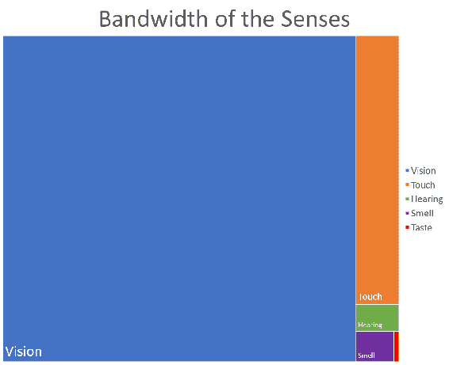
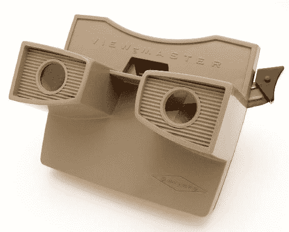
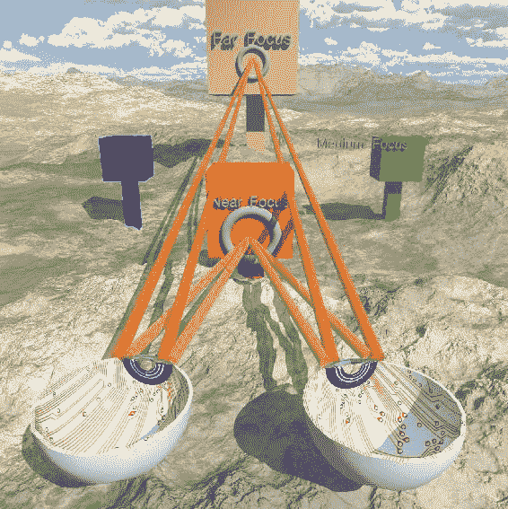
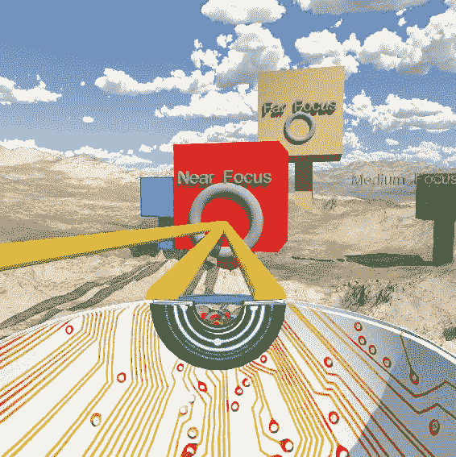
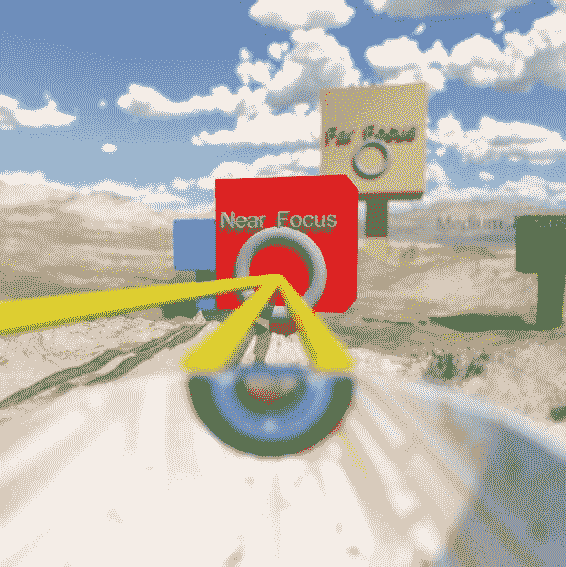
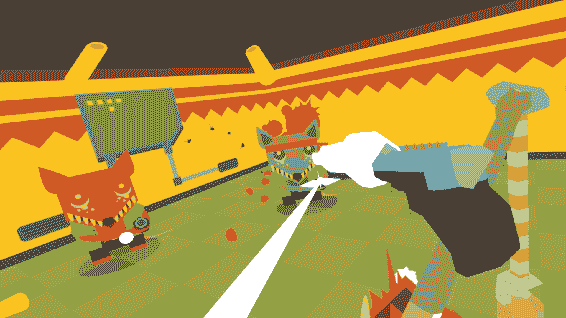
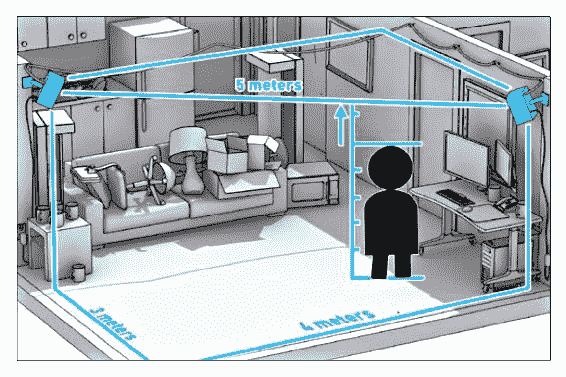
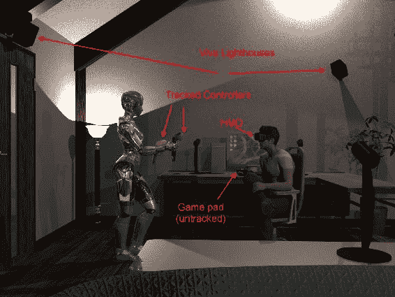
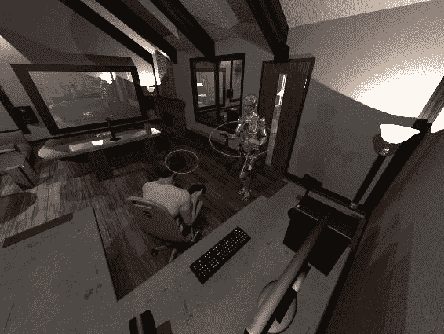
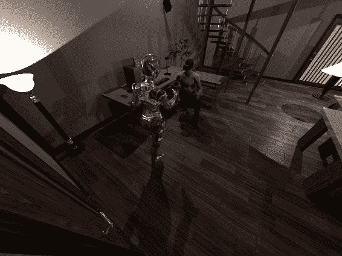

# 第一章：虚拟现实，到底是什么？

你正在阅读这本书来学习制作**虚拟现实**（**VR**），但虚拟现实到底是什么？

这似乎是一个足够简单的问题，但答案却五花八门。大多数人认为 VR 意味着几乎真实或者另一个现实。

这才不是虚拟现实的含义。

我认为这是因为虚拟这个词可以有几种不同的含义。对于计算机科学家来说，虚拟这个词意味着模拟其虚拟化的东西。换句话说，虚拟硬盘假装是一个硬盘。

虚拟对象表现得像是真实的，但实际上并不是——通常情况下，它比物理对象更灵活，更容易控制、修改和支持。在许多方面，它比物理对象更好。例如，虚拟磁盘就像计算机磁盘一样。它可以存储数据。然而，这些数据可能存储在物理旋转磁盘、固态硬盘，甚至内存中。虚拟磁盘可以调整大小，而物理磁盘只能复制到更大（或更小）的磁盘上。虚拟磁盘更加灵活。

有些人认为虚拟意味着几乎。如果特斯拉开过，他们可能会说，“*那几乎是无噪音的！”* 人们知道它并不真的无噪音，但它比大排量 V8 引擎开过要安静得多。或者，*那个人几乎是个圣人*，关于他们喜欢的人。在这种情况下，它的意思是几乎或者几乎可以说是。

虚拟也可以意味着有美德的人。行为端正的人是有美德的，尽管这不是这个词的正常用法（应该是 virtuous）。这就是这个词的起源；在拉丁语中，virtualis 意味着力量或美德。然而，在我们的情况下，我们指的是一些看起来真实，但实际上并不是。

我认为这是关于虚拟现实的误解。人们认为它几乎是真实的。许多人认为 VR 还没有达到那个水平，因为它看起来几乎不像真实世界。在 VR 头盔中看到的景象要像真实世界还需要相当长的时间；其他感官，尤其是触觉和味觉可能需要相当长的时间才能被模拟出来。

然而，这不是重点；虚拟现实的重点不是它几乎真实。重点是，当你在其中时，它*看起来*真实，即使它看起来与现实毫不相似。

我会再次说这个，因为这是一个重要的区别。虚拟现实，或者说增强现实，不需要几乎真实，但当你在其中时，它会*看起来*真实（即使它看起来并不真实）。

在本章结束时，你会学到：

+   虚拟现实是什么以及它是如何工作的

+   一些虚拟现实的历史-它并不新，这项技术已经有 50 多年的历史了！

+   用户代理-通过控制器与世界互动

+   渲染硬件

+   如何观看虚拟现实

+   头戴式耳机的类型

# 虚拟现实是什么以及它是如何工作的

我们有许多感官。为了让我们感觉到另一种现实是真实的，我们需要利用这些感官来愚弄大脑。大多数虚拟现实系统利用了两种：视觉和听觉；触觉也被使用，但不是以完全伸手触摸某人的意义（尽管人们正在研究它！）。

Tor Nørretranders 收集了有关感官及其相对带宽的数据，以计算机术语来说，这有点像比较苹果和机油，尽管有用，但可以看出它如何应用于虚拟现实。

因此，我们可以看到，如果我们让你看到几乎真实的东西，我们可能能够说服大脑它是真实的。然而，简单地将一个视觉屏幕放在我们面前并不是完整的答案。

给予某人深度感知是大部分答案。

这是一个相当复杂的话题，但显示物体深度的主要方法是立体深度感知。还记得那些 ViewMaster 玩具吗？这是一个例子：

你放入一张左眼和右眼图像的光盘。左右眼的图像几乎看起来相同，但它们代表了右眼和左眼在那个位置看到的东西；由于视差，每个图像略有不同。从光盘上，我们可以看到左眼和右眼的图像。前面的 View-Master 中的透镜将你的眼睛聚焦在图像上。

你的大脑会看着这两幅图像，将它们融合成看起来真实的东西。这使用了一种称为**立体深度感知**的深度感知技术。

是的，View-Master 是早期的虚拟现实观看设备！

现在，这里真正发生了什么？立体声是如何工作的？

当你看东西时，透视和你的眼睛之间的距离会使你在看近处的东西和看远处的东西时以不同的方式聚焦你的眼睛。在这个图示中，黄色线显示我们对近处物体的视线，橙色线显示我们对远处物体的视线。请注意，黄色线之间的角度大于橙色线的狭窄角度。

一个友好的机器人借给我们她眼睛的下半部分来制作这张图片（这就是为什么它显示电路板）。你的真实眼睛构造有些类似；出于说明的目的，我省略了光线以及它们落在眼睛背面的位置。

你的大脑会根据黄线和橙线之间的角度差异自动判断你的眼睛是指向近处还是远处的物体。

这只是我们的大脑用来区分深度的一种方法。另一种对虚拟现实同样至关重要的方法是使用*视差*。

视差指的是，不仅左右两个安卓眼睛指向不同（就像你的眼睛，当它们连接在你的头上时一样），而且每只眼睛看到同一物体的略微不同的视图。即使你只有一只眼睛，当你把头向左右移动时，这也会起作用，这是单视觉者感知深度的方式之一。

这是你的左眼看到的场景：

这是右眼看到同一物体的方式：

视差指的是，当用另一只眼睛观看时，更远的物体将比附近的物体更少向右/左移动，或者（一个延伸）当你把头从左到右移动时。我们的大脑（以及动物的大脑）会本能地将这些视为更近/更远。

红色的立方体要么在蓝色的立方体旁边，要么在绿色的立方体旁边，这取决于哪只眼睛看到了这张图片。你的大脑会结合这一点，再加上立方体在你左右移动眼睛时的移动方式，来给你一种深度感。

如果你是那个不感知 3D 电影的人群，不要绝望。它们严格依赖立体深度感知，不考虑视差效应；它们是预先录制的。

使用*真正的*VR（计算机生成或基于光场的 360 度视频），如果你移动头部，你会看到视差效应，VR 看起来就像拥有立体深度感知的人一样真实。

我有单视觉，因为我有一个近视眼和一个远视眼，而且 VR 对我来说效果很好。你的体验可能会有所不同，但如果你不喜欢 3D 电影，可以试试 VR（再说一遍，我真的很喜欢 3D 电影）。

视差深度感知会在你只有一只眼睛时起作用，当你把头从右到左移动时。

你的大脑还有一种额外的方法来确定物体的深度 - 焦点。 （实际上，除了列出的这些方法之外，还有许多其他方法，比如远处物体的蓝色移位，如山脉，以及其他效果）。在现实世界中聚焦于一个物体会使该物体和大致相同距离的其他物体看起来清晰，而更远和更近的物体会显得模糊。有点像这样：

当前的头戴式显示器无法准确显示焦点效果。你看到的是一个小屏幕，通常焦点固定在你前面约 5 英尺处。所有物体，无论远近，看起来都是一样清晰的，因为它们实际上只是显示在屏幕上。这可能会导致轻微的虚拟现实不适，称为住宿-聚合冲突。基本上，如果你聚焦于远处的立方体（鲑鱼色的那个），你的眼睛仍然会聚焦于鲑鱼立方体实际所在的位置，而你的眼球会以立体视觉的方式瞄准它应该在的位置。这种效果在非常近的物体上最为明显。

住宿-聚合冲突在靠近物体时最严重 - 因此尽量不要让任何东西，比如 GUI，位于用户位置太近的地方。这样可以减少晕动病。

这意味着你可能需要将 GUI 元素浮动到房间外，而不是让它们非常靠近。这可能会导致 UI 元素重叠。

虚拟现实设计是具有挑战性的。我期待你的设计！

# 在虚拟现实中使用立体声和视差

早在 1968 年，伊万·E·萨瑟兰就首次观察到具有立体深度知觉的物体，当用户的头部移动时似乎位于空间中（运动视差），看起来是真实的。

他和鲍勃·斯普劳尔开发的系统，通常被称为“达摩克利斯之剑”，只在空中显示了几条发光的线，然而：

“即使是这种相对粗糙的系统，三维幻觉也是真实的。” -伊万·E·萨瑟兰，AFIPS'68（秋季，第一部分）1968 年 12 月 9-11 日秋季联合计算机会议的论文集，第一部分：[`bit.ly/2urAV5e`](http://bit.ly/2urAV5e)

在这种情况下，“真实”意味着尽管缺乏逼真的渲染 - 只是一个发光的立方体 - 人们仍然将其视为真实。这是由于立体渲染和视差效应。人们可以转动头部并稍微左右移动。

他们发明了第一款 VR 头显，或者**头戴式显示器**（**HMD**）。

被广泛认为创造虚拟现实术语的人，贾伦·兰尼尔（Jaron Lanier）说：

“这是一种非常有趣的现实。它绝对和物理世界一样共享。有些人说，嗯，物理世界并不那么真实。这是一个共识世界。但问题是，无论物理世界有多真实 - 我们永远无法真正知道 - 虚拟世界也完全一样真实，并且达到了相同的地位。但与此同时，它还具有无限的可能性，这是物理世界所没有的：在物理世界中，你不能突然把这座建筑变成郁金香；这是不可能的。但在虚拟世界中你可以……[虚拟现实]给了我们这种感觉，让我们能够成为没有限制的自己；让我们的想象力变得客观并与其他人共享。” - 贾伦·兰尼尔（Jaron Lanier），SIGGRAPH Panel 1989，虚拟环境与互动性：未来之窗。[*http://bit.ly/2uIl0ib*](http://bit.ly/2uIl0ib)

一位名叫梅尔·斯莱特的研究人员对这个概念进行了进一步的研究，提出了进一步的术语“存在感”和“可信度”。有些人称这一切为**沉浸**。屏幕上的 3D 图像不如当你戴上 HMD 时，你的视野只能看到构建的 3D 世界那样引人入胜。即使渲染不像真实世界那样，你也会因音频和视觉线索而产生存在感。可信度意味着你所看到的有规则，并且即使不完全像真实世界那样，也能正常运作。

只能看到 HMD 中的东西，加上视差和立体视图，以及任何音频（如果做得好的话，声音非常重要），都会让你沉浸在 VR 世界中。有了所有这些东西，即使图形不真实，你也会感到沉浸其中，它变得真实起来。有关更多学术细节，请参阅[`bit.ly/2vGFso0`](http://bit.ly/2vGFso0)，尽管我将在本节中对此进行更多解释。

这真的很有效。

虚拟现实不必看起来像现实，但它会看起来像是真实的。例如，看看游戏*Quell4D*：

图形像积木一样，图像看起来一点也不像现实。然而，当古老的三根象鼻巨树巫师向你走来时，你会感到恐惧。它们看起来很真实。对你来说，当你玩游戏时，它们实际上是致命的真实，这意味着如果你不认真对待它们，你的（游戏中的）人物将会死亡。

虚拟现实中的火焰模拟会让大约 10%的人因恐慌而离开房间，即使火焰看起来一点也不像真正的火焰。

虚拟现实已经出现了。我们不必等到图形变得更好。很多人都这样说虚拟现实，但这是因为他们还没有尝试过，并且正在对它必须是什么做出假设。

跳进去，水很好！

因此，虚拟现实是一种看起来真实的东西，而不是一定看起来真实的东西（但如果看起来真实会更有帮助！）。

你不必等到更好的图形出现。

# 虚拟现实为什么会起作用，即使它看起来并不 100%真实？

我们的眼睛可能是向我们展示世界构成的最重要的感官。如果我们用这些图像替代图像并让某人沉浸其中，它们会开始变得真实。当你第一次进入虚拟现实时，你的最初反应是，“那看起来并不真实”，但是通过一个良好的虚拟现实设置，你会达到一个程度，你会认为“哇，那是真实的”，即使你知道你看到的基本上是一个电脑游戏。

快速的帧速率（显示速度）和足够的分辨率会欺骗你的大脑，让你认为你所看到的视觉上真的存在。这是一个强大的效果，大多数人在沉浸在这样的图像中时会有，但并非所有人都能看到 3D 电影（即使视力正常的人也不是每个人都能看到）。

事实上，现实感是如此强烈，以至于人们可能因观看 VR 而感到恶心。这是因为你的眼睛可能会说那是真的，但你的其他感官，比如你的内耳，会说我们并没有跳 10 英尺高。如果你的眼睛认为你在空中弹跳，而你的腿部肌肉（本体感觉）说你在地面上，你的皮肤说你感觉不到风，你的内耳说你在向前飞行时没有倾斜，你的大脑会在非常深层次上感到困惑。

当你的感官强烈不一致时，你的身体会有一种防御机制。它会认为你中毒了；因此，你的身体会感到恶心，甚至可能会生病。你的身体担心你的眼睛看到的与身体其他部分感觉到的不一样，所以它可能会试图排除你胃里的一切，以防你吃的东西中毒了。

是的，这并不好玩；不同的人会有不同的反应。

然而，并非所有的 VR 都会产生这种效果！一般来说，制作不良的 VR 会让你有这种感觉。关于这种效果已经有学术论文写成。本书将把这些讨论总结成几条简单的规则，让你的 VR 对人们来说更加舒适。

虚拟现实的另一个重要方面是，它是你可以与之互动的东西（现实本身）。这带来了机械困难；并不是每个人都拥有 3D 控制器。我们在*用户代理-通过控制器与世界互动*部分进行了讨论。真正的虚拟现实可以进行互动，即使只是简单的凝视检测-看着某物（凝视）然后事情发生-移动发生，你被传送，动画播放。

# 其他类型的 VR；AR，XR，SR/FR

还有另一种图像，有时被称为 VR，那就是**360 视频**。有特殊的视频播放器可以记录所有方向。复杂的软件会将不同的摄像头输入拼接在一起，制作成一个视频流，播放软件会将其投影到你周围。当你转头时，你似乎改变了在拍摄的世界内的视角。就好像你在现实世界中，随心所欲地四处张望。

360 视频看起来可能比大多数计算机生成的 VR 更好，但对我来说，它并不是现实，因为在最好的情况下，你只是一个无形的幽灵。当然，世界看起来很棒，但你无法伸手触摸事物，因为它已经被拍摄了。360 视频和类似的系统超出了本书的范围。话虽如此，我认为 360 视频肯定是一种有效的艺术形式，值得追求-只是本书没有涉及。

请理解 - 我并不是贬低 360 度视频，只是因为它不是*真正的*虚拟现实。（像最后一个词加上引号那样发音）。360 度视频可以是非常温暖、激烈、情感丰富的戏剧。你确实会感受到一丝存在感，视觉效果令人惊叹。随着更多人熟悉它并解决细节问题，我们应该看到更多令人惊叹的艺术作品。

我提出一个新术语用于 360 度视频；**拍摄现实**（**FR**）或**环绕现实**（**SR**）。（尽管这些实际上没有人用胶片，但“拍摄”一词仍然意味着通过镜头记录某些东西，但也许 SR 更好。你来选择！）

还有其他类型的虚拟现实。有很多人使用短语**XR**，意思是（任何）现实；主要指增强现实和虚拟现实。什么是增强现实？

头戴式显示器（HMD）由一些小型显示器和复杂的光学器件组成，当你戴上头盔时，可以看到立体的 3D 图像。大多数虚拟现实头盔在你使用时会故意屏蔽其他世界，以进一步让你沉浸在虚拟现实中。虽然这是虚拟现实的一个重要组成部分，但还有一种称为增强现实（AR）的虚拟现实类型，其中虚拟现实物品通过戴一种透明的 HMD 投影到现实世界中。有许多制造商，尽管微软的 Hololens 可能是最知名的。还有游戏*Pokemon Go*，这是一种增强现实。人们举起手机，显示在现实之上叠加的图像。这不是头戴式显示器，但仍然是增强现实。现实世界已经被 Pokemon 世界增强。

虚拟现实系统也可以是**世界之窗**系统，尽管今天通常不被称为虚拟现实。换句话说，一个真实的、持久的 3D 世界，你坐在键盘前通过屏幕观看。在上一波虚拟现实浪潮中，这被称为虚拟现实，尽管今天它已经很普遍，人们不再称之为虚拟现实。你可能听说过**魔兽世界**。

这是一种虚拟现实；虽然它通常不是 3D 的，但它是一个持久存在的世界在另一个现实中。它也是一个完整的 3D 世界，你可以通过屏幕看到；屏幕将你带到一个虚拟现实中，所以它类似于世界之窗系统（尽管没有头部跟踪）。

观看电影可以被视为一种有效的虚拟现实形式；你被带到另一个世界，短暂的时间里，感觉自己沉浸在故事中。电视是一种虚拟现实。

事实上，对 VR 术语的第一次使用是指戏剧。虽然今天许多人会说这不是虚拟现实，但他们大部分时间都在观看其他现实，而不关注坐在他们旁边的人。这难道不是虚拟现实吗？你对《与星共舞》很着迷，但你认识他们吗？他们在虚拟现实中是真实存在的。

然而，这并不是大多数人所认为的。本书将使用现代（2014 年以后）对虚拟现实的解释，即通过 VR 头盔或某种 HMD 查看的东西。如今，VR 这个词通常意味着头盔或 HMD，并且经常与某种形式的手柄配对。现在，对消费者来说，有很多好的、有效的 HMD 可供选择。现在是对 VR 感兴趣的好时机。

WebVR 的好处在于，我们可以在没有头戴式显示器的情况下，通过浏览器仍然可以看到这些虚拟现实世界；这对于测试和没有硬件的人来说非常方便。

WebVR 非常包容。

# 虚拟现实的历史

大多数人也认为 VR 是相当新的，但实际上它已经存在很长时间了，我指的是传统类型的带头盔的 VR。第一个 HMD 是由伊凡·萨瑟兰和鲍勃·斯普劳尔在 1968 年创建的。由于当时的技术，它又大又重，因此悬挂在研究室的天花板上。它只显示线框图像。由于它的大小，它被称为达摩克利斯之剑。它展示了一个简单的线框世界。当时的计算机速度不够快，无法显示比一些发光线更复杂的东西。

在 90 年代末，个人电脑开始足够快，可以显示 3D 世界，于是出现了新一波的 VR。我参与了这些努力；我当时正在为 CompuServe 开发一个 3D 环境，那时是一个热门的地方。

你可以去商场参与，通过昂贵的 HMD，在线上与最多四个人共享虚拟世界。这被称为基于位置的娱乐，因为这些系统又大又昂贵。如今，你也可以去 VR 游乐场，尝试硬件，但如今 VR 的令人兴奋之处在于，许多这些系统对家庭爱好者来说非常实惠。

# 用户代理-通过控制器与世界互动

HMD 并不是一切，尽管它确实是最重要的部分。能够看到虚拟现实世界很棒，但在某个时候，你希望能够与之互动。如果世界是静态的，你会感觉自己像一个游荡的幽灵。只有当你能够与世界互动时，才算是虚拟现实。

最终，类似全身触觉反馈和身体跟踪的东西，再加上复杂的软件，将使我们能够伸手触摸虚拟世界。这是未来值得期待的事情。

目前，我们通常通过各种手持控制器与世界互动。不同的控制器具有截然不同的功能和要求。高端（但仍然面向消费者）VR 设置，如 Rift 和 Vive，控制器的工作方式与移动 VR 控制器大不相同。我们将先讨论高端系统，然后再讨论移动 VR 控制器。

# PC、Mac 和 Linux 的高端控制器

对于 PC VR，比如 HTC Vive 或 Oculus Rift，控制器给予了与虚拟现实世界互动的非常重要的能力。这些控制器在 3D 空间中被跟踪，以便软件知道它们的位置。开发人员可以编写代码，使其看起来像手、枪等。这使你能够伸手触摸周围的世界——这对于使你与之互动的虚拟现实非常重要。

为了实现这一点，Oculus 和 Vive 控制器都需要外部跟踪硬件。对于 Vive 来说，这些是放置在 VR 区域角落的光线或 VR 基站。（这里有一个图表，可以在[`bit.ly/VIVEManual`](http://bit.ly/VIVEManual)找到）。这些小巧的不显眼的立方体发出红外跟踪信号，控制器和头戴设备接收并用于准确定位它们在真实的 3D 世界中的位置。对于 Rift，还有两到三个传感器来跟踪设备，以给出它们在真实世界中的位置：

基站和跟踪硬件对于 HMD 本身也非常重要。

你真实世界位置的跟踪（你的真实头部/手）是使移动、转动头部、移动手/控制器看起来真实的原因，因为头戴设备和控制器在真实的 3D 空间中被如此精确地跟踪，一旦软件向用户显示了 VR 世界，任何头部运动都会看起来真实。

实际上，这意味着 PC 控制器看起来就在你看到它们的地方。我在科技演示中第一次体验 HTC Vive 时感到惊讶——我戴上 HTC Vive 头盔，在虚拟世界中看到控制器在我面前。我以为我会摸索一番，直到控制器在我想象的位置。我伸出手，我的手指确切地感觉到控制器在我眼睛看到的地方——通过 HMD。

我着迷了！虚拟世界真的是虚拟现实！我看到的幻影控制器*真实*，尽管我知道我看到的是我脸前的一个小屏幕。

它们是如何工作的？

# HTC Vive

HTC Vive 使用两个小方块，称为**基站**或**灯塔**，位于它们覆盖的区域的对立面。它们发出红外线束，覆盖 120 度；这意味着如果它们在一个角落，它们可以离角落几英寸远，仍然覆盖墙壁（否则，你就得在墙上挖个洞，把灯塔放在正确的位置！）

通常，你会在房间的对立面安装两个基站，相距约 16 英尺或 5 米，并且在头顶高度上方，大约 2 米或 6 英尺 6 英寸。如果你个子更高，也可以安装得更高！

基站也可以用合适的适配器或自定义支架安装在麦克风架上。并不是每个人都有一个大客厅，所以这些安排可能有助于安装。

Vive 也可以以坐姿配置使用，尽管真正的重点是所谓的**Room Scale**。

Room Scale VR 意味着你可以在虚拟现实世界中四处走动，就像在现实世界中一样。不需要传送或其他技巧。当然，区域需要清空家具，这是虚拟现实的一个问题；并不是每个人都有一个可以清空的大房间。

如果你离得太近，Vive 会通过显示边界或保护来保护你的安全。

如果是墙或其他区域，使你的房间边界略小于实际房间。如果是沙发或椅子，你可以走到椅子的尽头。

我们这样做是为了避免你撞到墙。如果你站在墙边，但在虚拟世界中看不见墙，挥动手臂，你的手不会穿过真实的墙！

靠沙发边缘是不错的，因为你的小腿会碰到沙发，而不是你的手碰到墙。实际上这并不是什么大问题，因为你会在靠近之前看到防护装置。注意 Vive/Steam VR 教程！

HTC Vive 通过一些**惯性测量单元**（**IMU**s）工作，这些单元可以检测 HMD 以及控制器的位置。这些 IMU 会漂移，所以基站有一个红外线束在房间里扫过。当控制器、跟踪器或 HMD 检测到这些光束时，它们会重新校准自己。这种重新校准是完全不可察觉的。这种系统的优势在于，即使一个控制器从一个基站或光房的视线中消失，VR 系统仍然知道该物品的位置和指向。

总体效果是精准和存在感，尽管主要效果是稳定性。如果你交叉双手，一个控制器短暂地从基站的视线中消失，控制器不会失去锁定。

尽量不要把你的 VR 空间放在有很多窗户或镜子的地方。

红外线束可以反射，导致不稳定。

# Oculus Rift

**Rift**最初只是一个头盔，没有控制器。它最初的基站是两个摄像头，你可以把它们放在桌子的左右两侧；它们指向 HMD，并用于将其定位在世界中。

不久之后，Rift 增加了第三个摄像头的功能；有了三个摄像头，你可以进行房间规模的 VR。它们的位置略有不同于 Vive；查看 Rift 文档以获得最佳位置。

小心处理电缆。当我写这本书时，Rift 的电缆直接插在 PC 的后面。如果你绊倒电缆，可能会猛烈地把它们从 PC 上拔出来，导致损坏。

Vive 有一个分机箱，所以如果你绊倒电缆，希望你能把它从盒子里拔出来。

不要绊倒电缆。

这本书的目的不是分析 Vive 或 Rift 比另一个好还是差；它们都大致以相同的方式工作，基站/摄像头帮助控制器和 HMD 跟踪它们的位置和旋转。以下是一个典型的设置：

在其中，Vive 基站安装在墙上；我们有一台台式电脑和一个 VR 用户观看一个 3D 模型，就像它是真实的一样。VR 用户手持两个 Vive 控制器；虚拟图像手持一个类似 Xbox 的游戏控制器。

这张图片还展示了 Oculus Rift 3 摄像头跟踪系统。它们是坐在屏幕左右两侧的浅灰色物品，以及沙发后面的橱柜上（就在我们面前）。

没错，这个人是使用者。她不需要 HMD；系统直接将视频传输到她的眼睛。虚拟对象是一个看起来坐在桌子旁的人。

前面的图是沙发前面的第三人可能看到的场景。

灯塔看到的实际上有点不同，但很有趣。它们实际上有一对红外线条，横扫视野，控制器看到这些线条在跟踪。当他们这样做时，控制器（和 HMD）将重新同步它们的惯性跟踪定位。这意味着即使一个控制器不在基站的视野范围内，它仍然保持跟踪，尽管你不希望控制器长时间隐藏。惯性跟踪系统会漂移。漂移的视觉问题是你的手臂似乎慢慢远离你的身体 - 这显然是非常令人不安的。Vive 灯塔和 Rift 摄像头可以防止漂移发生。Vive 灯塔投射的视角约为 120 度。如果灯塔有这个视野的摄像头，右后方的灯塔将看到以下内容：

你可以通过这个灯塔看到两个控制器和 HMD。然而，有一个问题。注意红色圆圈 - 左侧的大镜子实际上是一个巨大的电视，但它很闪亮。因此，灯塔红外线会反射在上面，控制器会感应到两束光：一束直接，一束反射。

这可能会导致 HMD 和你的视角跳动，或者你的控制器莫名其妙地移动。

在你的 VR 房间里避免闪亮的物体、镜子和窗户。

你可能需要拉上窗帘，甚至在电视、玻璃橱柜等上面铺上床单。

艺术需要牺牲！

从另一个灯塔，一个控制器被阻挡，但仍然通过其内部惯性跟踪和另一个灯塔 100%跟踪。

# 移动 VR

对于**移动 VR**，还有 Google Daydream 和三星 Gear VR 控制器。由于使用了更简单的硬件，使价格更合理，这些控制器并非完全 3D 跟踪。

由于移动 VR 缺少房间跟踪外部传感器，Vive 和 Oculus 都有，VR 控制器的跟踪就不那么精确。实际上它们看起来会一样真实，但会周期性地漂移。就好像你的手在没有你控制的情况下慢慢向右移动。因此，移动 VR 有一个重置控制器的按钮，可以将控制器移动到预定义的位置，比如靠近你的臀部。你的手可能是伸直的，但如果你按下 Home 按钮，VR 显示将会显示你的手现在在你的臀部。

这可能需要一些时间来适应。这种设置有一些优势；它更便宜，需要更少的外部硬件，而且世界上有更多这样的系统。然而，PC 硬件确实提供了更好的 VR 体验。

移动控制器的另一个问题是只有三个**自由度**（**DOF**）。这意味着它们可以跟踪倾斜、偏航和翻滚，但不能跟踪位置；如果你把控制器平放在左边，在游戏中你的控制器根本没有移动。这就是为什么你不能用移动控制器抓东西。Vive 和 Rift 都有 6 个 DOF 控制器，所以你可以移动它们并抓取东西。

# 渲染硬件

为了避免 VR 晕动病，你需要一个**快速的帧速率**。什么是帧速率？这是你的电脑生成屏幕上图像的速度。当然，很多事情取决于场景的复杂性；显示一个立方体和一个盒子比显示洛杉矶市所有建筑物的速度要快得多。

当然，你在设计 VR 世界时可以控制这一点。

每个图像都必须实时生成。大多数 VR 头显都尝试达到 90 赫兹。赫兹指的是频率-每秒循环次数，或者在这种情况下，每秒帧数。

VR 的难点在于没有什么可以减慢这个帧速率。如果有什么东西需要加载，或者需要获取一个网页，如果你稍微减慢帧速率，人们会感到头晕。

加快帧速率有两种方法。一种是减少场景复杂度，另一种是使用快速的电脑。

电影《大白鲨》中的经典台词是当他们发现鲨鱼比他们预期的要大得多，并且撕毁了他们的船时。罗伊·施耐德说：“*你需要一艘更大的船*。”

观看 VR，你需要一台更大的电脑。

幸运的是，电脑变得越来越快。在这里我们构建的世界中，一个相当快的智能手机应该没问题。

场景复杂性有点两难；您希望拥有丰富、详细的虚拟世界，但您也希望该虚拟世界能够快速渲染。快速渲染意味着每秒 90 帧（更新），如前所述。您还需要了解硬件支持的目标受众。他们是否都使用配备数千美元视频卡的高端 PC？（有点过度；我在这里表达一个观点。）还是他们使用去年的手机型号，配备 10 美元的硬纸板盒和一些透镜？如果您了解潜在的目标受众，您可以开发一个能够在其系统上良好运行的 VR 应用程序。

美国海军陆战队有一句话：“训练就像你将要战斗一样。”在二战期间，他们练习了在南加利福尼亚海岸进行两栖登陆的作战行动。当他们在太平洋战争期间不得不执行这项任务时，他们没有计划过珊瑚礁。因此，他们制定了一个原则，即应该在与他们预期要在其中作战的相同或相似的环境中训练人员。

虽然良好的 VR 体验（希望）并非生死攸关，但这仍然是宝贵的建议。如果您认为大多数客户或您的 VR 应用程序的消费者将使用去年的手机，那么请使用去年的手机进行测试。如果您认为他们将使用高端 PC，请使用高端 PC 进行测试。

不要假设，如果您的 VR 应用程序运行缓慢，客户的计算机会好得多，一切都会没问题。获取与他们使用的类似的设备，然后您将在客户之前遭受恶心和眩晕，然后重新编码或简化场景以使其足够快速。

需要多少硬件？为此，您应该咨询您计划针对的头戴式显示器的最低规格。由于这可能会发生变化，我不会在本书中总结它，但不同 VR 制造商提供的指南是很好的建议。

您可能需要更大的 PC（或手机）；这是成为早期采用者所付出的代价！

# 如何查看 VR？

要查看 VR，您需要某种类型的头戴式显示器或 HMD。在过去，VR 还以 2D 屏幕上的 3D 图像为特征。实际上，当时的 VR 意味着使用任何设备查看的任何 3D 程序 - 基本上就像正常情况下坐在 PC 前一样，但这并不是真正沉浸式的体验。今天，VR 意味着使用 HMD/头戴式显示器；因此，要查看 VR，您需要一个头戴式显示器。

具有讽刺意味的是，React VR 在浏览器中作为一个 3D 世界也可以正常运行，并且可以用来制作具有视差效果的网页，尽管这有点过度。

# VR 可能是危险的

你可能会认为，这很安全。然而，一个 VR 头戴设备附带了 33 页的警告。*请阅读它们*。

大多数警告都是常识，例如，如果你在靠近物体或人的地方，不要挥舞你的手。戴上这种类似眼罩的东西，你可能会真的打到自己的手。从哲学上讲，我不相信有人会过分干涉，但你确实可能会在 VR 中受伤。想象一下，如果有人给了你一个眼罩，告诉你戴上它，然后在你家里四处走动。你可能会感到有点不舒服。

这大致是我们在这本书中要做的事情，只是增加了一个你将在一种惊奇和兴奋的状态中四处游荡的细节。有很多 YouTube 视频显示人们撞墙，撞到墙上，打翻灯具等等。他们看起来很傻，但当你戴上头戴式显示器时，你完全沉浸在虚拟世界中，不会想要控制自己的力量。因此，请确保你清空房间，并警告朋友不要进来。

这也包括你的毛茸茸的朋友。很难让宠物远离你的 VR 区域，但这是个好主意，因为它们不会明白 HMD 让你分心，而且你看不见它们。如果可以找到方法，最好防止它们在你脚下乱跑，否则你可能会无意中踩到它们。

VR 是安全的；请负责任地使用。

# VR 头戴设备选项

在 WebVR 中，有一些选择。我将保持这些最简单、最常用的头戴设备。你当然可以使用**开源虚拟现实**（**OSVR**），这实际上是一个硬件平台，但你需要弄清楚要使用什么浏览器等等。一些术语，比如凝视，稍后将在 UI 部分介绍。目前，凝视移动意味着你需要盯着某物才能移动到那里或选择一个对象，通常是这样的。

以下是各种主流的 WebVR 选项（您可以在[`webvr.info/`](https://webvr.info/)上阅读相关信息）：

| **类型** | **控制** | **移动** | **成本** |
| --- | --- | --- | --- |
| Gear VR（移动） | 1 个手持设备，头戴式显示器 | 凝视/触摸板 | 中等 |
| Daydream VR（移动） | 1 个手持设备 | 凝视/触摸板 | 中等 |
| Cardboard/其他头戴设备 | 无（可以点击） | 凝视选择 | 低 |
| HTC Vive | 跟踪，2 个控制器 | 四处走动 | 高 |
| Oculus Rift 2 摄像头 | 键盘/游戏手柄 | 凝视选择 | 高 |
| Oculus Rift 3 摄像头 | 跟踪，2 个控制器 | 可四处走动 | 高 |

# 头盔类型

广义上来说，它们可以是连接 PC 的头盔或移动耳机。一些独立式头盔，如 Hololens 或 Vive 独立式 VR 头盔，包括一个完全工作的 PC，因此它们实际上更像是移动耳机，但不需要 PC。

# 移动耳机

移动耳机实际上只是利用你的手机来显示数据并将你置身于 VR 世界。因此，性能完全取决于你的手机能做什么。

这是一个时候，更大真的更好。

不过有一个限制；有一些头盔使用平板电脑，但它们非常重，并且实际上没有比较小的移动设备更多的优势。

当你使用移动耳机时，你会遇到电池寿命、重量和控制问题。市场上有各种各样的 VR 控制器，还有捆绑选项，如三星 Gear VR 和 Google Daydream，其中包括一个控制器和一个手机壳。

这些捆绑包的好处是，手机通常经过认证可以正常工作，软件也很容易使用。你可以自己组装 VR 头盔/控制器组合。

移动耳机也可以简单到只是一个带有一些镜片的盒子，尽管在光学尺寸和细节方面实际上有很多数学。最常提到的是 Google Cardboard；谷歌不直接销售它们，但公司可以实现 Cardboard 观看器。还有非官方的 Cardboard 以及一些价格合理的更好的支架，可以放入手机。

一般来说，它们大多没有传感器。一些有一个小杠杆会触摸屏幕，除了移动之外还允许一些控制。

你也可以购买单独的蓝牙控制器，尽管它们很可能没有三维定位。我们在第十一章中介绍了不同类型的控制器，*走进未知领域*。

一些 VR 头盔适合戴眼镜，而一些则不适合——很大程度上取决于你的脸部大小、你使用的眼镜大小以及你的视力问题。我一个近视眼和一个远视眼，都不需要戴眼镜（任何一只眼睛都不需要！），但你的情况可能不同。我强烈建议在购买前试戴一下头盔，或者从有良好退货政策的商家购买。

在移动头戴式耳机的高端产品中，有三星 Gear VR 和 Google Daydream。它们提供了一个精心制作的头戴式耳机，你可以把手机放进去，还有一个独立的控制器。

控制器是最重要的部分（尽管头戴式耳机也很值得，因为它们比最好的 Cardboard 观看器舒适得多）。Daydream 和 Gear VR 捆绑包中的控制器都是蓝牙无线的，并且可以进行一定程度的跟踪。

它们内置了传感器来检测运动，但在空间中并不是精确定位的。因此，它们上面有中心按钮。这是因为这些单位中的三维定位传感器类型会随着时间漂移。在虚拟现实世界中，你的手/控制器/枪（或者控制器的任何视觉表示）似乎会从你身边漂移，甚至移动到你的身后！这可能会让人感到非常不安。如果/当这种情况发生时，只需使用适当的按钮重新校准你的控制器。

高端 PC 设置有不同类型的跟踪，通常不需要重新校准。但是，请注意它们需要初始校准/设置，并且也可能出现跟踪问题。

关于 GearVR 的一些注意事项。我在使用 GearVR 时犯了一些小错误。有一个额外的弹性带，我以为是用来松弛的；其实不是。他们告诉你要戴上这些带子，但忽略了这个额外的带子是用来固定控制器的。在戴上头戴式耳机的带子之前，先翻到控制器部分。

实际上，控制器应该是你首先要摆弄的部分。你需要配对它并进行一些下载，而这在戴着头戴式耳机时是做不了的，所以先做这部分。

# PC、Mac 和 Linux 头戴式耳机

大多数人认为选择 PC 头戴式耳机将在 HTC Vive 和 Oculus Rift 之间进行，但实际上有数十甚至数百种 PC 类型的头戴式耳机。

它们的性能都取决于你的 PC 的性能。朋友们，这就是 Mac 有点劣势的地方；你需要一张快速的显卡，而 Mac 通常对于图形和一些游戏来说速度足够快，但不适合虚拟现实。然而，苹果已经推出了准备好虚拟现实的 PC。当你决定用哪个平台进行 React VR 时，请考虑这一点。

就目前而言，Mac 对 Oculus Rift 或 HTC Vive 的支持充其量是试验性的，因此这些步骤和示例将假定您正在使用 PC。Linux 对几款头戴设备承诺提供支持，但就目前而言，这是试验性的。如果您使用 Linux，您需要查阅文档和/或尽量按照 Windows 示例进行操作。

大多数 React VR 演示的几何图形比许多虚拟现实世界简单，因此它们可以在相对较小的硬件上运行。请查看您头戴设备的制造商的最低要求；不要认为您可以用低于最低要求的硬件。否则您会感到不适或体验不舒适。

在整个市场中，我们将在本书中介绍的头戴设备实际上只有两款：HTC Vive 和 Oculus Rift。如果您有其他头戴设备，示例应该可以正常运行，但您可能需要稍微调整一下。

一般来说，PC、Mac 和 Linux 头戴设备将与 Firefox 或实验性浏览器[Servo.org](http://bit.ly/VRServo)兼容。实验性版本的 Chrome（Chromium）也可能可以用于查看 WebVR。请在[webvr.info](http://bit.ly/WebVRInfo)上查看完整的最新列表。

# 总结

在本章中，我们已经涵盖了虚拟现实，为什么它有效，以及它真正是什么（故意的双关语）。我们还介绍了如何通过简要概述虚拟现实硬件和软件进入虚拟现实世界。

请记住，即使您没有昂贵的 HTC Vive 或 Oculus Rift，您仍然可以在台式电脑上查看 WebVR。

接下来，我们将介绍如何在非常高的层面上编程虚拟现实。有许多不同的构建虚拟现实软件应用程序的方法，我们将介绍这些不同的方法，以及它们的优缺点。您将阅读有关不同软件包的概述，以及 WebVR 的优势。由于本书是关于 WebVR 的，我们将介绍安装 React VR、Node.js 和其他工具，开始创造您自己的现实 - 真的！
