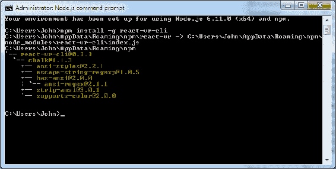
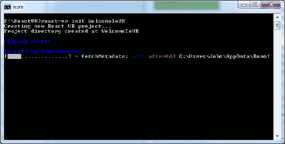
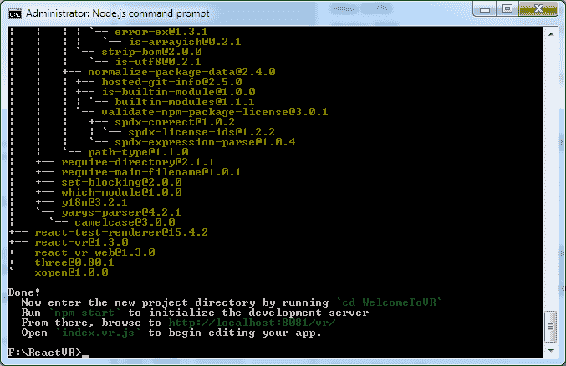
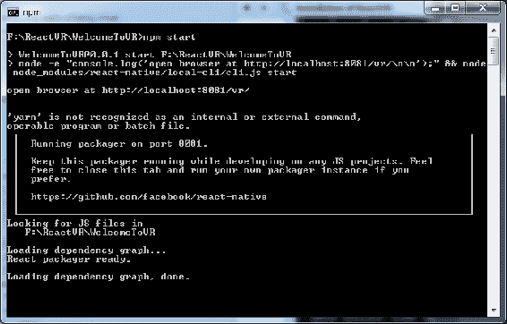
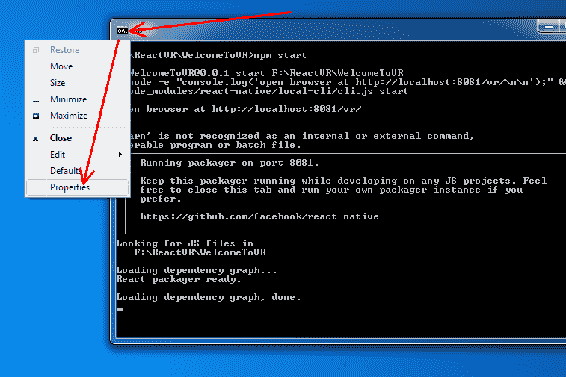
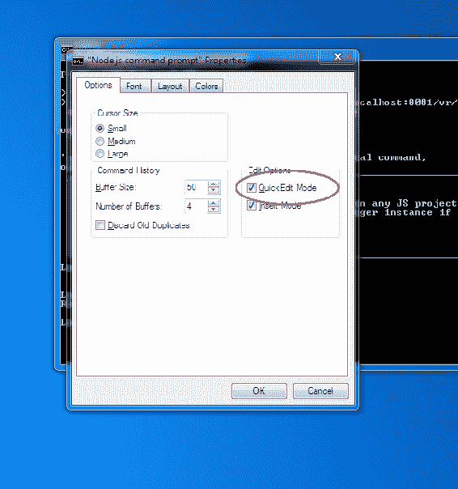
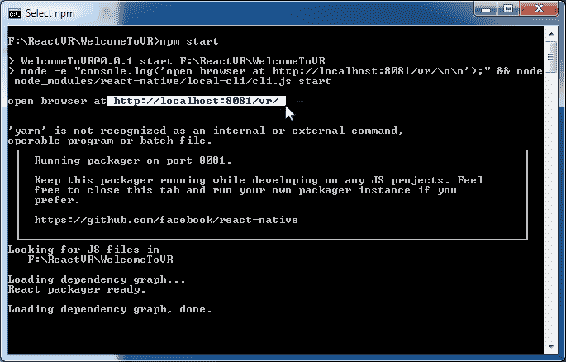
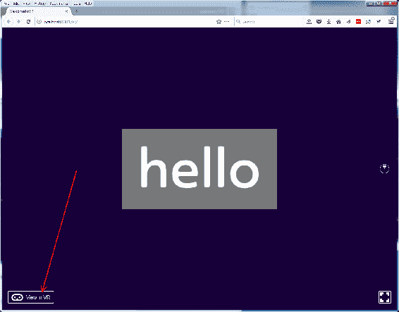
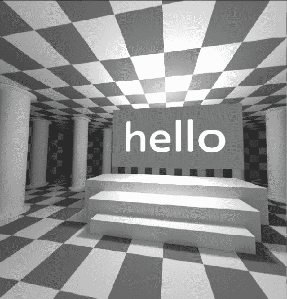
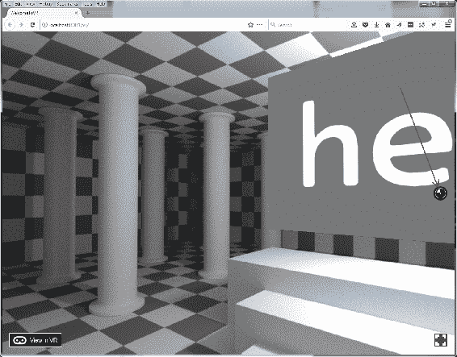

# 第二章：Flatland and Beyond: VR 编程

在上一章中，您了解了 VR 是什么以及它可以成为什么样子。程序员和开发人员（就像你）是如何创建这些虚拟世界的？我们发现这是一件难事。我们必须保持快速的帧率和正确的立体渲染。我们如何快速而轻松地做到这一点？继续阅读，找出答案。

在本章中，我们将涵盖以下主题：

+   HTML 和常见的编程方法，如 Node.js，JavaScript 和游戏引擎

+   React 库

+   图形库，用于显示 2D 和 3D 图像

+   如何安装所有这些软件，以便我们可以开始编程

# HTML 和超越 2D 互联网的方法

在 Web 发展的同时，早期的 HTML 语言发生了巨大变化。一个良好的网页体验通常不仅仅涉及 HTML。增加更多互动性的一种方式是通过 JavaScript。HTML、XML 和 JavaScript 的组合是构建 Web 的重要部分，包括 Google 文档或在线 Microsoft Word 等应用程序（也是免费的）。

然而，这些都是平面的。要进入第三维度通常需要高速软件，通常是用 C++编写的。随着计算机变得越来越快，图形处理单元（GPU）已经接管了实际 3D 生成的大部分工作，用于描述 3D 游戏的语言也在不断发展。

目前有许多编程 VR 的方法。在 Rift 和 Vive 显示的分辨率下生成每秒 90 帧是具有挑战性的，因此大多数 VR 编程是用高速语言进行的，这些语言直接面向硬件或低级，如 C 和 C++。然而，游戏引擎，如 Unity、Unreal 或 Cryengine，可以为你做很多工作。

起初，你可能会想“为什么我要使用游戏引擎？我不是在写游戏”。更普遍地说，这些引擎是为游戏而构建的，但不一定只能构建游戏。现代游戏引擎处理渲染（我们需要的）、物理学（我们需要这个来构建逼真的世界）、地形（用于户外场景）、照明（用于复杂的渲染）、人工智能（用于填充我们的世界）、网络（用于构建多用户环境）和其他代码。这些都不一定是游戏特定的，尽管各种游戏引擎都有更适合游戏而不是企业数据可视化的命名约定。例如，在 Unity 中，一个基本的 3D 对象被称为`GameObject`。所以即使你不是在写游戏，你也会有`GameObject`。

目前，VR 软件的主要竞争者是：

+   Unity（由 Unity3D 制作，更多信息请访问[`bit.ly/UnityForVR`](http://bit.ly/UnityForVR)）

+   Unreal（由 Epic Games 制作，制作了虚幻竞技场；更多信息请访问[`bit.ly/UnrealForVR`](http://bit.ly/UnrealForVR)）

+   Cryengine（由 Crytek 制作，制作了游戏 Crysis；更多信息请访问[`bit.ly/CrytekForVR`](http://bit.ly/CrytekForVR)）

+   Lumberyard（由亚马逊制作；更多信息请访问[`bit.ly/LumberyardForVR`](http://bit.ly/LumberyardForVR)）

许多这些游戏引擎也适用于移动平台。使用游戏引擎的优势在于你可以“一次编写，到处运行”，这意味着大多数游戏引擎都支持移动设备和 PC。基本上，你构建一个 PC 应用程序，然后更改构建设置并构建移动应用程序。现在你有了每个平台的两个或更多不同的应用程序。

使用游戏引擎可能存在相当陡峭的学习曲线，尽管这仍然比编写自己的渲染代码要容易。你确实需要构建一个完整的应用程序，这可能令人望而生畏。

与当前的网络编程技术相比，人们只想描述他们想要看到的东西，而不是编写服务器端代码将网页发送到手机，也不是编写自定义应用程序来下载信息并显示它。

那么，为什么 VR 需要你这样做呢？

使用 React VR，你不需要这样做。

你可以用 JavaScript 构建你的世界，而不是学习游戏编程引擎。你可以使用声明性组件构建 VR 世界和 UI，而不是构建渲染代码。实际上，你可以在更高的层次上描述你的 VR 世界中有什么，而不是一次一个像素地构建这个世界。这听起来不是更有趣吗？

# Node.js 和 JavaScript 的背景

大声说出 Node.js。祝你健康！

Node.js 是一个开源系统，用于在服务器端使用 JavaScript。当然，这是 Web 浏览器执行代码的主要方式。它是在 Web 早期的时候发明的，有几个原因。

React 和 React VR 大量使用 JavaScript。要将 React 网页呈现到浏览器，需要服务器端 JavaScript，这意味着 Web 服务器不仅仅是将文件发送到浏览器，而是在服务器端执行代码。Node.js 允许您使用与浏览器相同的语言编写服务器端代码。对于全栈开发人员来说，这是理想的，因为您可以沉浸在一种语言中。

# 使服务器 React

React VR 基于 React，这是一个允许通过声明而不是编程构建 Web 页面和交互式用户界面的框架。您为应用程序中的每个状态构建视图，然后 React 将使用正确的组件来显示该应用程序。

声明式视图使您的代码更容易、更健壮，更容易修改和调试。

组件使用了封装的面向对象概念，这意味着它们是自给自足的，并管理自己的状态。然后，您可以使用这些组件来创建复杂的用户界面。

React 允许开发人员创建随时间变化的应用程序，而无需不断刷新浏览器页面。它使用了模型-视图-控制器设计模式/模板，并且可以与其他 JavaScript 库（如 Angular.JS）结合使用。

React 首次在 2011 年与 Facebook 的新闻订阅中使用。它在 2015 年 3 月开源。

您可以在[`facebook.github.io/react/`](https://facebook.github.io/react/)找到有关 React 的更多详细信息。

# 图形库-OpenGL 和 WebGL

本节涵盖了一般的 3D 编程，但需要讨论一些不同的事情。

**OpenGL**是一种显示图形的标准。不涉及 PC 与工作站政治（现在已经是古老的历史），它是一个工作站供应商（SGI）开创的标准，用于标准化计算机图形和程序显示图形的能力。

还有其他 API，比如由微软支持的 DirectX，许多 PC 游戏开发人员、CAD 软件和其他 PC 计算机图形都在使用。

OpenGL 严格来说不是开源的；然而，该软件可以在不支付版税的情况下使用，并且有文档和免费提供（公平地说，DirectX 也是如此）。

基本上，OpenGL 是软件显示图形的一种方式。在这种情况下，软件通常指的是 C++（或其他可以调用本地库和操作系统实用程序的语言）。

Vulkan 基本上是 OpenGL 的预期继任者。它比 OpenGL 更低级，并且提供了更多的并行任务处理能力，并直接利用大多数智能手机和 PC 中的 GPU 的能力。由于它是一种低级格式，你会听到更多关于 Vulkan 在计算机图形方面的讨论，而在 Web 图形方面的讨论较少。与 OpenGL 一样，它通常由编译的本地模式软件（C++等）使用。

**WebGL**是一个 JavaScript API，用于在 Web 浏览器中渲染 3D 图形，无需插件。由于 OpenGL 的创建者 SGI 已经不再经营业务，现在由 Khronos 集团支持、定义和推广 OpenGL 和 WebGL，这是一个非盈利的、由成员资助的联盟。WebGL 可以通过 JavaScript 或其他浏览器支持的语言使用。

**three.js**是一系列使 WebGL 编程更容易的 JavaScript 文件。然而，它是一个相当大的下载。

React VR 是基于 three.JS 和 React 构建的。

**A-Frame**是另一个 WebGL 前端；它与 React VR 有类似的概念，意味着它是声明性的、高级的，并且基于 three.js 构建。你不必创建点并将它们连接起来以制作一个立方体；你只需声明一个立方体并给它一个位置、颜色等。虽然本书主要涵盖了 React VR，但它们之间有一些区别。

+   React VR 应用程序是用**JSX**编写的。这是一种允许类似 HTML 的标记混合到 JavaScript 代码中的语法。React VR 基于 React 和 React Native。如果你已经了解 React，你可以很快学会 React VR，底层概念是相同的，所以你会感觉很自然。

+   A-Frame 应用程序使用 HTML，带有自定义 HTML 标记。它是一个强大的框架，为 three.js 提供了一种声明性、可组合、可重用的实体-组件结构。A-Frame 可以从 HTML 中使用，尽管开发人员仍然可以访问 JavaScript、DOM API、three.js、WebVR 和 WebGL。

+   它们都允许自定义 JavaScript 代码并直接与 three.js 和 WebGL 进行交互。

但为什么要做出决定呢？你不必这样做。你可以同时使用两者。让我们安装 React VR。

# 安装 Node.js 和 React VR。

目前大多数桌面 VR 硬件都使用 Windows；因此，以下说明，实际上本书的大部分内容将是 Windows 安装和 GearVR 观看的混合。在撰写本书时，Linux 可以被黑客入侵以适配 HTC Vive 和 Oculus Rift，但这是一条艰难的道路，超出了本书的范围。苹果电脑刚刚具备了添加外部显卡以进行 VR 的功能，因为它们中的大多数根本没有足够的视频处理能力来渲染 Vive 和 Rift 头戴设备使用的分辨率。

然而，React 并不特定于 PC。您可以使用 Linux 或 Mac 构建本书中的所有示例，并跟随使用 Google Daydream、非官方 Cardboard 或三星 Gear VR 来查看所有示例。在这种情况下，一些示例可能使用略有不同的语法。我写这本书是为了让大多数使用 Vive 和 Rift 的用户能够跟上，对于其他用户的平台限制，我在此提前致歉。

为什么我们不能和睦相处呢？

在可能的情况下，我会包含其他平台的链接和信息。

# 安装 Node.js

我们假设您知道自己所在的平台，并且有一台能够安装 Node.js 和 React VR 的计算机（台式 PC）。

首先，我们需要安装 Node.js。如果您已经安装了，那很好，只需确保（在撰写本书时）您至少拥有 4.0 版本。本书是使用 LTS 版本：v6.11.0 和 v8.5.0 构建的，这应该是稳定的，并且在您阅读本书时已经发布。（包括`npm`3.10.10）

1.  您应该能够从以下网址获取 Node.js：[`nodejs.org/en/download/`](https://nodejs.org/en/download/)。下载 64 位的`.msi`预构建安装程序文件。下载完成后，双击该文件或根据您的浏览器运行它。

我们生活在一个保姆国家，所以它会警告你正在下载本地代码。再说，人们经常被利用钓鱼攻击（病毒邮件让你自己感染）而受害。这个应该是安全的。

只有在您下载的程序没有经过数字签名时才会出现这些警告。数字代码签名证书并不难获得；坚持要求公司和非营利组织对其代码进行签名。

这将使互联网更安全。

对于您发布的任何代码都要这样做。

1.  点击“下一步”。

1.  我知道，但你真的应该阅读条款和条件——同意并点击“下一步”。

1.  默认位置没问题。谢天谢地，我们不必担心 Linux 无法处理文件名中的空格（开个玩笑，针对所有 Linux 用户）。

1.  大多数安装选项都没问题。它们不需要太多空间，所以安装一切都没问题。

1.  点击“安装”。

1.  您可能（应该）会收到一条警告，提示正在安装一款软件；告诉 Windows 没问题。

1.  您已经完成了！现在安装其余的 React VR。点击“完成”。

Mac 下的 Node.js：

Node.js 组织建议使用 Homebrew：[`brew.sh/`](https://brew.sh/)。

但是，您也可以通过 Node.js 下载页面安装 Node.js：[`nodejs.org/en/download/`](https://nodejs.org/en/download/)。

安装应该很简单。

Linux 下的 Node.js：

虽然源代码在这里：[`nodejs.org/en/download/,`](https://nodejs.org/en/download/) 您可以从软件包管理器更轻松地下载 Node.js；说明在这里：[`nodejs.org/en/download/package-manager/.`](https://nodejs.org/en/download/package-manager/)

安装应该很简单；这是 Linux，我相信你可以处理任何问题。

# Node.js 安装后 — 安装 React VR

Node.js 软件包括一个名为`npm`的软件包管理器。软件包管理器安装软件以及该软件的依赖项。您将使用它来安装 React VR。它使安装变得非常简单和及时更新。无论您使用哪种平台，您都需要打开命令提示符才能使用本书中的大多数示例。命令提示符是一个被错误地称为 DOS 的窗口。在 Windows 中，这被称为 Node.js**命令行界面**（**CLI**）工具，尽管实际标题是 Node.js 命令提示符。Node.js 安装程序在安装时设置了这一点。您应该使用安装时的 CLI，因为它设置了某些环境变量等。话虽如此，我使用了一种叫做**Take Command Console**（**TCC**）的替代命令行工具，在 Node.js 进行了安装并注册了路径变量（安装的一部分）后，我可以从我的 TCC shell 运行`npm`和其他命令。

安装步骤如下：

1.  打开您首选的 CLI（开始 | `Node.js 命令提示符`）

1.  输入以下命令：

```jsx
npm install -g react-vr-cli
```

您可以从任何位置（文件夹）执行此操作，软件包管理器（`npm`命令）将安装以下内容：



如果你第二次运行这个程序，好处是它会确认已经存在的内容（尽管像很多开源程序一样，它有点简洁）。

`npm`还有很多其他非常有用的选项。例如，你可以使用`npm ls`，它会（就像 linux 中的`ls`一样）给你列出所有已安装的对象。你可以通过运行命令`npm help npm`来获得详尽的文档，它会打开一个网页。

1.  然后，我们想使用相同的 CLI 来安装`WelcomeToVR`示例。首先，进入一个你想要安装示例和代码的地方（文件夹/目录）。我安装了第二个大硬盘作为 F:（你的里程、平台和磁盘配置会有所不同）。所以，在我开始在桌面或我的文档上安装所有东西之前，我切换到了我的数据驱动器：

```jsx
f:
mkdir f:      2;reactVR
cd \reactVR
```

1.  然后，我继续使用 ReactCLI 安装`WelcomeToVR`演示：

```jsx
f:\reactVR>react-vr init WelcomeToVR
```

进程将开始：



这将需要一些时间。在过程结束时，它会完成并告诉你接下来该做什么：



1.  然后，进入工具刚刚创建的`WelcomeToVR`项目目录，并初始化/启动本地开发服务器：

```jsx
cd WelcomeToVR 
npm start
```

这个过程会花一些时间。在运行时，这个命令行界面窗口将忙于运行程序。它不是一个服务。如果你关闭窗口，它会停止。所以，不要关闭窗口。

这个窗口还会在你访问各种网页时显示有用的状态信息：



1.  然后，从你的桌面打开浏览器到`http://localhost:8081/vr/index.html`，就像 CLI 提示的那样。你完成了！

有一个比在 CLI 窗口中打开网页浏览器并输入 URL 更容易的方法。你应该打开*快速编辑模式*。以下是显示这一过程的截图：

1.  点击 CLI 窗口角落的小 C:\窗口。这被称为系统菜单:

1.  完成后，点击属性。在属性中，打开快速编辑模式：



1.  点击确定。现在，快速编辑模式已打开，你可以在窗口中高亮文本并按*Enter*进行选择。然后，你可以直接将 URL 粘贴到你的 WebVR 浏览器中。简单！

1.  如果像我一样，您喜欢使用与 COMMAND.COM 不同的 CLI（我使用 4nt 或 TCC），假设默认安装如我们讨论的那样，您只需将以下内容添加到您的`path`中，假设您将 Node.js 安装在默认位置：`C:\Users\<user>\AppData\Roaming\npm;C:\Program Files\nodejs`。

# 安装 WebVR 浏览器

现在您已经安装了服务器端软件，您需要安装一个能够显示 WebGL、OpenGL 和 WebVR 的 Web 浏览器。这些内容会不断变化，所以我强烈建议去 WebVR 并检查他们的兼容性列表。

Firefox，或者实验性的 Firefox Nightly 可能是最容易使用的浏览器。更多信息，请参考[`bit.ly/WebVRInfo.`](http://bit.ly/WebVRInfo)

好消息是，从 Firefox 55 版本开始，常规的 WebVR 支持已经内置到 Firefox 中，所以只需确保您的 Firefox 是最新的，您就可以查看 WebVR。要查看您刚生成的新的 VR 网站，您需要执行以下步骤：

1.  确保您的浏览器可以运行 JavaScript。这是默认设置，除非您以安全意识的方式锁定了浏览器（这是一件好事）。WebVR 广泛使用 JavaScript。您还可以将本地主机添加到白名单中。

1.  一旦您打开了支持 WebVR 的浏览器（在 PC 上，基本上是 Chromium、Firefox Nightly 或 IE），您将看到 hello。但是，您还没有进入 VR！您需要点击在 VR 中查看。您的 VR 应用程序应该启动。然后您可以戴上头盔，您将看到一个简单的 hello。没有世界？您已经进入了一个 VR 世界！



1.  您将看到一个链接，上面写着在 VR 中查看。在您点击此链接之前（在您的常规桌面上），您的 Vive/Oculus 将无法工作。

1.  一旦您点击在 VR 中查看，并戴上头盔，您将在您的 VR 世界中看到 hello。



恭喜！您已经建立了您的第一个 VR 世界。我敢打赌这比学习 Unity 要快得多。

您也可以使用移动 VR 进行查看，但您需要找出开发机器的 IP 地址，并从移动设备访问该网站，类似于：`http://192.168.1.100/vr`。

在 URL `http://localhost:8081/vr/index.html`中，您将`localhost`替换为服务器的 IP 地址（您的桌面开发 PC）。

请注意，这几乎肯定不是正确的 IP 地址，您需要从开发机器/服务器获取 IP 地址，并将其输入到移动 VR 头戴式显示器中。对于 Windows，可以转到网络属性，或者从 CLI 中输入`ipconfig`。如果您的台式 PC 是 192.168.0.100，那么从移动头戴式显示器中，您可以通过虚拟键盘输入`http://192.168.0.100:8081/vr/index.html`。

清洁您的移动屏幕

如果不清洁屏幕，任何规格、指纹或污垢都会清晰地显示出来。这些规格会分散注意力，因为它们似乎悬浮在一切之前。

恭喜！您已经运行并查看了您的第一个 React VR 世界！

现在，如果您没有头戴式显示器，或者厌倦了频繁戴上和摘下头戴式显示器，并不得不走出您的房间范围以返回到您的 PC，有一个快速的预览世界的方法。在 Firefox Nightly 中，您只需点击小雷达显示器，屏幕上显示的内容将向您展示 VR 头戴式显示器中一个眼睛所看到的内容。这对像您这样的开发者来说非常有用！



# 总结

在本章中，我们介绍了如何实际编程 VR 世界的基础知识，以及使用哪些软件。我们还介绍了安装 React VR 系统，以便开发我们自己的 VR 世界！在下一章中，我们将介绍 3D 基础知识和构建 VR 世界所需的数学知识。

不用担心数学；不会有弹出式测验。

现在要真正创建一个有趣的世界。但首先，我们需要了解世界由什么组成。下一节将描述 React VR 术语，以描述您的虚拟世界。
