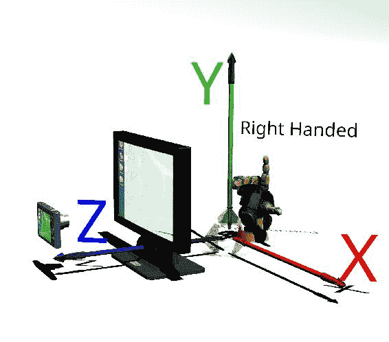
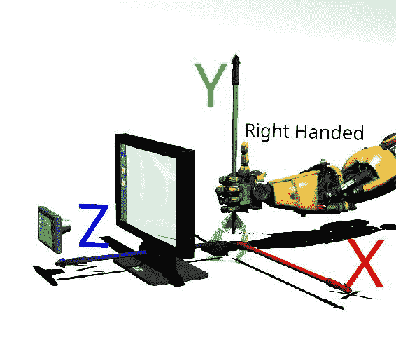
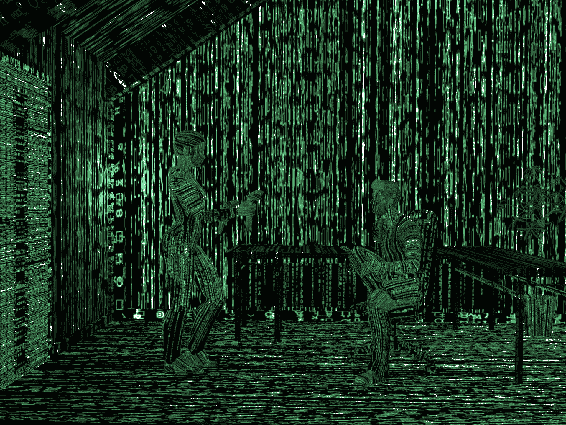
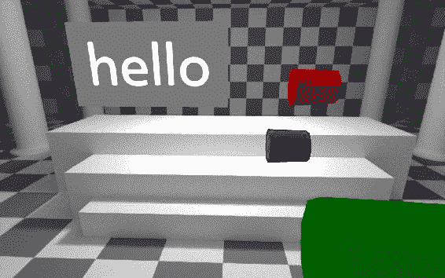
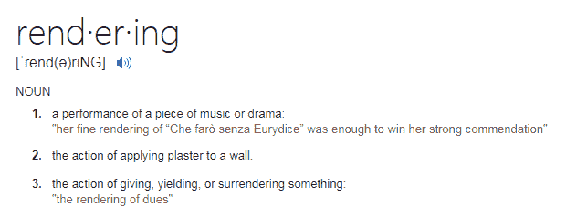

# 第三章：3D 或其他维度中的现实

我们决定进入一个几乎真实的世界。要理解如何绘制这个世界，我们需要准确理解如何描述它。

这一章描述了我们如何在数学意义上做到这一点。别担心，这不是回到高中数学！（好吧，也许是几何。好吧，也许有一点点。好吧，也许有很多。我会尽量让它不那么痛苦。）

描述世界的方式有很多种；不管我们如何描述，它仍然是同一个世界。正如莎士比亚在《罗密欧与朱丽叶》中所说的：

“名字有什么含义？不管我们如何称呼玫瑰，它依然芬芳。”

在我们的情况下，有趣的是，情况并非如此：一个描述错误的盒子看起来会完全不同。你需要学会这种语言。不仅如此，你还需要了解 React VR 如何描述这个世界，因为不同的 3D 图形程序都使用不同的数字（缩放）、方向（向量）和旋转。

对于虚拟世界，不同类型的软件和硬件都需要不同的描述方式。例如，坐标可以是左手系或右手系。如果搞混了，物体会朝着与你预期的方向不同的方向移动！

特别是，在 3D 中，上下有不同的含义；更具体地说，不同的 3D 程序之间通常上方方向是不标准的。在 React VR 中，Y 轴向上。为什么 Y 轴向上？继续阅读了解：

+   坐标：这些是空间中的固定点

+   点：这些是多边形的构建块

+   向量：这些是方向

+   变换：这些是将事物移动到你想要它们的地方

+   渲染：这将把点和变换的讨论转化为真实的东西

# 超越平面 - 3D 概念

为了在 3D 中表示事物，我们必须将所见的东西转化为计算机可以用来生成图像的东西。这些方法将涉及到具有 3D 几何、图片和代码的文件。首先，让我们讨论如何在 3D 中定位事物。

为了在 3D 中表示物体，我们需要它们的位置。像 Excel 这样的电子表格使用 A-Z（横向）和 1-66（实际上是 A-XFD 和 1-1048576）。计算机图形使用数字表示所有三个轴。然而，编码这些坐标的方式有很多种。

这适用于比例（什么是一英寸？一英里？）以及它们移动的方向（是 Y 还是 Z 向上？）。为了弄清楚这一点，我们需要谈论坐标系。

# 坐标

我们都习惯于使用图纸、网格、发光的电子表格，带有*X*和*Y*网格，或者在你使用的任何电子表格程序中的数字和字母，比如 A1 和 B1。进入第三维可能会让人感到困惑，尽管那是我们生活的空间。这就是为什么我将这一部分称为*超越平面*。

我们在二维或一般数学中认为理所当然的数学运算在三维中却是不同的。例如，如果你将*X*和*Y*相乘，你得到的答案与将*Y*和*X*相乘的答案相同。然而在三维中，旋转并不是这样的。要看到这一点，试着拿起这本书的两份副本。（我买了两本，你呢？妈妈，你在读吗？）

好了，认真地，请拿起任意两本书，纸质书。如果你有两个 Kindle，你也可以用它们。

1.  对于第一本书：

1.  物理上将其（合上）向左旋转四分之一圈（朝向你的右手）。

1.  然后，将背边向你翻转（翻过来）。

1.  你现在看到的是背面，侧面。

1.  对于第二本书，以相反的顺序翻转：

1.  将背边向你翻转（翻过来）。

1.  然后将其顺时针向左旋转四分之一圈（朝向你的右手）。

这两本书面对着不同的方向，尽管你两次以相同的方式旋转它们，只是顺序略有不同。

三维数学可能会让人感到困惑。通常，如果你将*A*和*B*相乘，你得到的结果与将*B*乘以*A*的结果相同。

当涉及到平移、旋转和缩放时，这个概念非常重要。你编码的顺序决定了你的物体最终在世界中的位置和它们的外观。

我们将使用三个数字来指定三维空间中的每个位置，具体来说是*X*、*Y*和*Z*。

这被称为**笛卡尔坐标系**。还有其他类型的坐标系，但几乎每个计算机系统都使用笛卡尔坐标系来表示空间位置。旋转和向量有时会使用其他坐标系。这是一个**欧几里得空间**。

为了让三维更加令人困惑，有些人使用*X*和*Y*，*Z*成为新的维度，而其他人则说*Y*是向上的。为什么（它）是向上的？当处理屏幕时，你习惯于使用*X*和*Y*。一张纸类似，尽管纸通常是水平的，而屏幕是垂直的。

这导致了一个有趣的三维转换问题。在三维中，我们使用*X*、*Y*和*Z*。如果你习惯使用*X*和*Y*，那么*Z*就必须成为新的第三维，它将是向上的。然而，如果你习惯将*X*和*Y*看作是一张图纸，那么*Y*已经是向上的，所以*Z*最终会是内部和外部。每个三维系统似乎都有些不同。

基于 WebGL 的 React VR 使用熟悉的*X*和*Y*作为左/右和上/下；所以*Z*必须是内部/外部。然而，一个不同之处是在 React VR 中，*Y*是向上的；在标准的 HTML 中，*Y*是向下的。换句话说，HTML 和 React 使用的坐标是（零乘零）作为左上角。*Y*是向上的吗？大多数三维程序使用*Y*或*Z*作为向上，也就是说在我们的情况下，正的*Y*是向上的。

WebGL 和 HTML 与 React 不同，可能需要一些时间来适应。要将一个物体放在你面前，以便你能看到它，你需要给它一个负的 Z。

在三维中，坐标可以是左手的或右手的。正如我们在*X*、*Y*和*Z*中看到的，有时箭头的方向并不是你所期望的。为什么 React VR（实际上是 OpenGL）没有决定让 Z 进入屏幕呢？那么坐标将是左手的。相反，大多数图形系统使用右手坐标系。

我哥哥是左撇子。

左撇子也没什么不好。

（实际上，他是右撇子，但为什么要用事实来破坏一个好故事呢？）

右手和左手有什么意思？这是一个助记符，有助于箭头的方向和旋转。如果你拿起任何一只手，伸开前三个手指，它们就会拼出*X*、*Y*和*Z*的方向。一个图表会有所帮助；你的前三个手指（拇指、食指、中指）指向正的*X*、*Y*和*Z*：



在这个图表中，有几件事情需要注意。相机代表我们在左边，透明地看着屏幕。因为*Y*是向上的（为什么？），*X*是向右的，OpenGL 使用的坐标系统与 HTML 或一张图纸并不相似，但它更或多或少是网络上的标准。

选择这种方式更容易映射到 3D 模型、计算机辅助设计（CAD）和建模程序（如 Blender、Maya、3DSMax）的构造方式。这与 React 的工作方式相反——*Y*向下为正。这是一个右手坐标系；如果你用左手尝试，*X*、*Y*和*Z*轴的顺序会不同。

# 旋转呢？

在 React VR 和 OpenGL 中，围绕任何轴的旋转也是右手坐标系。这意味着围绕任何轴的正旋转将沿着拇指指向的方向进行，手指弯曲。例如：



你是否在看着你的右手并弯曲手指？没关系，这有助于可视化。是的，那些箭头显示了各自轴上的正方向。

老实说，*Y*朝上和*Z*朝上似乎在 3D CAD 世界中很常见混淆。你的 CAD 系统可能工作方式不同。没关系，我们可以翻转和反转它——只要知道在导入模型时，你可能会发现它们侧倒，甚至是里外颠倒。

在 Blender 中，*Z*朝上，*X*和*Y*在平面上；然而，在导出时，*Y*可以替代朝上。为什么？因为这是正当合法的。

这些数字是无单位的；一个边长为 1 的立方体可以被视为 1 英里或 1 英尺。然而，在 WebVR 和 React VR 中，单位通常被认为是米。

Blender 可以使用无单位、公制或英制，因此在导入物体时需要调整比例。

程序 Poser 使用奇怪的单位——你需要调整从中导入的任何东西的比例。

用于导入模型的 OBJ 文件没有单位信息；它们是无尺寸的：1 就是 1，不是 1 米。

# 点

点是指空间中的 3D 位置，通常通过*X*、*Y*和*Z*位置来确定。在 React VR 中很少直接描述点，除非你正在进行本地渲染，但空间中的位置经常被描述为点。例如，一个变换节点可能会说：

```jsx
  transform: [{
         translate: [0, 400, 700]
         }]
```

应用变换的对象的中心将位于位置*X*=0，*Y*=400，*Z*=700 处。

# 向量

向量指的是方向。在航空中，飞行员谈论向量。从电影《飞机》中的场景中，克拉伦斯·奥弗、罗杰·默多克、维克多·巴斯塔和控制塔讨论航向：([`bit.ly/WhatsOurVector`](http://bit.ly/WhatsOurVector))

罗杰·默多克：2-0-9 号航班，你已获准起飞。

奥弗船长：罗杰！

罗杰·默多克：啊？

塔台声音：L.A.离港频率，123 点 9。

奥维尔船长：罗杰！

罗杰·默多克：啊？

维克多·巴斯塔：请求矢量，结束。

奥维尔船长：什么？

塔台声音：飞行 2-0-9 清除矢量 324。

罗杰·默多克：我们有许可，克拉伦斯。

奥维尔船长：罗杰，罗杰。我们的矢量是多少，维克多？

塔台声音：塔台的无线电许可，结束！

奥维尔船长：那是克拉伦斯·奥维尔。结束。

从我们作为 VR 人的角度来看，他们真的是指航向。在 3D 空间中，你也可以朝上或朝下。这三个方向对我们来说都非常重要。

翻译，严格来说，使用向量；如果你给一个对象的变换属性为[0, 2, 0]，你是在告诉对象在*+Y*方向上移动*2*个单位，而不一定是绝对位置 0,2,0。然而，需要注意的是，如果对象的原点是在 0,0,0，那么它是一样的。在翻译时，考虑你的 3D 对象的原点以及对象是否采用绝对或相对定位是很重要的。

# 变换

这不是一本关于奇异的可折叠机器人的书，所以我们谈论的是变换，而不是变形金刚。

变换是放置、定位、移动和缩放对象的方式，基本上是任何转换对象、点等的*X*、*Y*、*Z*坐标。

在 React VR 中，变换通常是样式的一部分。例如：

```jsx
style={{
    transform: [
      {rotateZ : this.state.rotation},
      {translate: [0, 2, 0]},
      {scale : 0.01 },
    ],
  }
```

变换顺序非常重要。正如我们之前讨论的，在 3D 中，变换不是传递的 - 如果你先平移，然后旋转，你最终会停在一个不同的位置，而不是如果你先旋转，然后平移。记得书上的例子吗？

在 React VR 中，变换是大多数具有物理存在的对象的标准属性节点。（见附录和第四章《React VR 库》。）

变换确实有三个主要参数（和一些已弃用的属性）；一个变换，或矩阵参数。

是的，我说的是矩阵。



矩阵一直是一个数学概念已经有一段时间了。它也是一部很棒的电影。由于版权限制，我不能在这里包含矩阵的图片，但上面是我在矩阵中查看我们的 VR 控制器场景的表示。无论如何，我不是指电影。我们将使用矩阵来创建我们自己的 3D 场景。

矩阵是描述平移（向量）、旋转、缩放和扭曲的数学方式。我的一些朋友在周末会有些扭曲，但扭曲是一个数学术语，意思是移动对象的顶部比底部更多。你可以把它想象成倾斜。

要完全理解矩阵，让我们谈谈非基努·里维斯的做法。

每当有一个物理对象，比如一个盒子、一个模型、一个灯光或一个 VR 按钮，你都有各种样式属性，其中之一就是变换。变换节点可以使用矩阵，或者有时候更容易一些，直接使用平移属性。例如，如果你在 React VR 中定义一个`Cylinder`，你可以这样变换它：

```jsx
<Cylinder
       radiusTop={0} 
       radiusBottom={2.20} 
       dimHeight={2.8} 
       segments={10} 
       style={{
               transform: [
               {rotateX: -45}, 
               {translate: [0,1, -4]}
               {scale: .4}
               ]
            }}
          />
```

变换顺序很重要。这是一个三个圆柱体的例子，除了颜色和变换之外都是相同的：

```jsx
  <Cylinder
    radiusTop={2} 
    radiusBottom={2.20} 
    dimHeight={5} 
    segments={10} 
    lit = {true }
    style={{
      color: 'red',
      transform: [
        {translate: [1,.5, -6]},
        {rotateZ: -90}, 
        {scale: .2}
      ]
    }}
  />
  <Cylinder
    radiusTop={2} 
    radiusBottom={2.20} 
    dimHeight={5} 
    segments={10} 
    lit = {true }
    style={{
      color: 'blue',
      transform: [
        {rotateZ: -90}, 
        {translate: [1,.5, -6]},
        {scale: .2}
      ]
    }}
  />
  <Cylinder
    radiusTop={2} 
    radiusBottom={2.20} 
    dimHeight={5} 
    segments={10} 
    lit = {true }
    style={{
      color: 'green',
      transform: [
        {scale: .2},
        {rotateZ: -90}, 
        {translate: [1,.5, -6]}
      ]
    }}
  />

```

这是生成的 React VR 世界：



# 矩阵怎么样？

矩阵是一个四列四行的数字系列（数组）。

您也可以在变换节点中使用`矩阵`。矩阵数学的完整讨论超出了本书的范围。网上有很多参考资料。基本概念相当简单，但旋转可能有点困难（尽管是确定性的）手工编程。

平移被存储为：

```jsx
[1, 0, 0, 0,
 0, 1, 0, 0,
 0, 0, 1, 0,
 Tx,Ty,Tz,1].
```

缩放由以下表示：

```jsx
[Sx,0, 0, 0, 
 0, Sy,0, 0, 
 0, 0, Sz,0, 
 0, 0, 0, 1].
```

旋转可以用 R 值表示：

```jsx
[R00,R01,R02,0, 
 R10,R11,R12,0, 
 R20,R21,R22,0, 
 0, 0, 0, 1].
```

通过矩阵数学进行的旋转非常精确，但也非常复杂。正如我们之前所看到的，旋转的顺序会改变结果对象的位置。矩阵本身不会有这些问题，因为顺序已经嵌入到矩阵中。计算旋转可能会很混乱。

一般来说，当手动移动对象时，您会希望使用变换样式而不是矩阵数学。

当复制对象的位置和方向或以编程方式移动对象时，您会希望使用矩阵。

通过`矩阵`按比例缩小所有轴十分之一并按[3, 2, 1]进行平移的`矩阵`可以应用如下：

```jsx
style={{
    transform: [
      {matrix : [0.1,0,0,0, 0,0.1,0,0, 0,0,0.1,0, 3,2,1,1]},
    ],
  }}
```

您不能同时使用变换矩阵和变换样式（单独的平移、旋转、缩放）。实际上没有必要，因为您可以通过指定单独的变换来完成矩阵可以完成的一切。如果您使用矩阵，您就是相当专业！无论如何，您创建的任何变换都将在幕后转换为矩阵。

欢迎来到矩阵-现在你可以创建它。

# 渲染

Bing 将渲染定义为：



好吧，那很有趣，但显然不是我们的意思。渲染是指将我们一直在讨论的所有数学描述转化为可视化的东西。

React VR 使用的渲染引擎是 three.js（[`bit.ly/2wHI8S9`](http://bit.ly/2wHI8S9)），通常使用 WebGL 进行渲染（[`bit.ly/2wKoKCe`](http://bit.ly/2wKoKCe)）。WebGL 是一个强大的 JavaScript API，用于生成高性能图形。它将使用系统中的任何高性能图形硬件（GPU），并且在大多数浏览器中是本地的，无需插件即可进行 3D 图形处理。

然而，网络通常是一个狂野的地方。你会认为浏览器制造商会从 20 年前的兼容性问题中吸取教训，但遗憾的是情况并非如此。一些浏览器可能会出现问题或兼容性问题，尤其是在移动设备上。

我们难道不能和平相处吗？

这将影响 React VR 的运行情况。如果你想知道你的浏览器和硬件是否支持 WebGL，请访问[`bit.ly/WebGLTestPage`](http://bit.ly/WebGLTestPage)的 WebGL 测试页面。该页面将显示一个旋转的立方体；如果你使用的浏览器不是百分之百兼容的，它可能还会显示一些警告。WebGL 维基百科页面（[`bit.ly/2wKoKCe`](http://bit.ly/2wKoKCe)）对各种浏览器的功能有很好的描述，但事情会发生变化。

你需要进行测试。

# 测试它的外观

在第二次世界大战中，美国海军陆战队在太平洋战争前对水陆两栖登陆进行了大量测试。他们已经掌握了战术和战略。

他们第一次登陆时，撞上了珊瑚礁。圣迭戈/彭德尔顿营地没有珊瑚礁。因此，尽管这是一次成功的登陆，但比他们预想的更加灾难性。因此，美国海军陆战队有一句话：

"训练就像你将要战斗一样。"

这显然是一个长期存在的说法。罗马军团过去常说：

训练应该是一场无血的战斗，这样在战斗中，就会像血腥的训练一样。-罗马军团训练法则

如果你习惯使用 Firefox，将你的 React VR 解决方案发布到世界上，你的 Petunia 阿姨使用 Orchestra 浏览器查看你的世界，可能不起作用，Petunia 阿姨仍然会认为你是她那个无目标的兄弟的懒散后代。请注意，据我所知，Orchestra 不是一个真正的浏览器，尽管我使用 Opera。

如果这是一个内部公司专用的应用程序，并且你有一个标准（并且可以强制执行！）只使用一个浏览器，那么你可以使用该浏览器进行测试和开发。

然而，如果你希望许多人使用你的 React VR 应用程序，你确实应该使用各种浏览器进行测试。如果你有一台 Mac、一台 PC 和一台 Linux 机器，那就更好了。这些可以是虚拟机（特别是 Windows，带有适当的许可证，和 Linux），否则你需要 Beta 测试人员。

你需要像你期望人们使用它一样测试它，否则你会认为它运行良好，但人们对你的虚拟世界不满意。你需要尽可能多地在各种浏览器和硬件平台上进行测试。当然，这实际上并不现实，但却是必要的。这就是 Beta 测试人员可以派上用场的地方。

# 渲染的工作原理

我们正在谈论渲染。这是将数学模型与表达的属性转化为屏幕上可见的东西的过程。

为了在 VR 中渲染你的模型，React VR 使用了基于 OpenGL 的 WebGL。WebGL 是 JavaScript 的实现，如果浏览器中有一个相当功能的实现，它通常应该在大多数平台上看起来一样。如果你描述一个竖直的红色箭头，那么在所有浏览器中它都应该看起来像一个指向上方的箭头。关于测试的建议通常是确保它能够正常工作，而不是确保一个向上的箭头不会突然指向右边。

在游戏行业，人们通常需要在 DirectX 和 OpenGL 之间做出决定。WebVR 既不使用 DirectX 也不使用 OpenGL，尽管 WebGL 是基于 OpenGL 设计的。与 OpenGL 不同，它还包括 HTML 元素，如 HTML5 画布和 DOM（文档对象模型）。如果你在使用 WebVR，你就是在使用 WebGL。

如果你正在测试的浏览器没有正确显示你的场景，但其他浏览器可以，请务必提交错误报告。这些应用程序中的许多都是像互联网上的大多数酷东西一样处于前沿。

你希望这些错误得到修复-所以告诉人们。程序员无法修复他们不知道的问题。你将为更加理智、更加清洁、更加有效的网络做出贡献。

成为解决方案的一部分！

WebGL 通常会使用高性能的 GPU，通过 OpenGL 或 DirectX。你不需要担心，也无法控制 React VR 使用的内容（除非使用原生应用），尽管这是一个优势。Web 浏览器通常会做正确的事情，并利用手机（手机，平板电脑），笔记本电脑或台式机上可用的任何硬件。

如果你想更精确地控制渲染呢？这是可能的，使用 React VR Native，我们将在以后的章节中更详细地介绍。

# 总结

在本章中，我们学习了描述我们的 VR 世界的重要方法。如果你想这样想，我们正在学习矩阵的语言，甚至涉及到矩阵。我们学习了关于 3D 坐标，点，向量，右手和左手世界以及变换。

我们学习了所有这些概念是如何结合在一起并呈现的，以及不同的网页如何利用这些信息创建一个视觉空间。我们还学会了如何进行测试！

为了进行测试，我们需要在浏览器中有一些东西。为了做到这一点，我们不仅需要知道如何用数字和旋转来描述世界，还需要知道这些数字如何在构建块中使用。下一节将介绍 React VR 用来描述世界的关键词，组件和对象。
