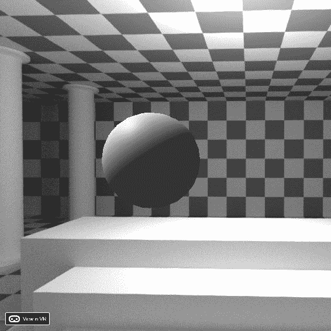
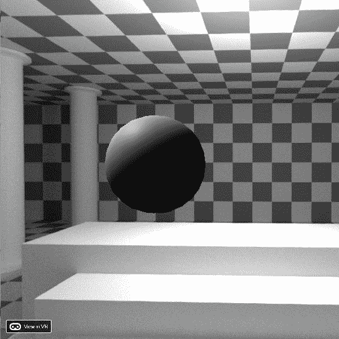

# 第四章：React VR 库

这一章是关于 React VR 库的布局；其中的对象和组件。本章中的许多概念将在后面的章节中引用，所以如果你正在阅读电子版本的这本书，它将被大量超链接以供你享受和愉悦。

React VR 有六个基本元素，并且使用一种新的、但又熟悉的范式 JSX（JavaScript eXtension）进行编码。如果你已经了解 React，那么你对 React VR 也应该很熟悉，尽管有一些重要的区别。我们将涵盖以下内容：

+   JSX，React VR 的语言和语法：

+   React VR 和 React 之间的区别

+   组件和 VR 组件：

+   属性

+   状态

+   事件

+   布局

+   样式

+   所有组件和关键字的细节：

+   对象-可见和不可见

+   灯光

+   多媒体-声音和视频

+   摄像机和视图

我没有涵盖所有可用的 API，因为那基本上是一个冗长的、像字典一样的背诵，最好是使用网站上的文档来探索 API。在后面的章节中，我们将使用关键的 API 来为我们的世界增添生机并在其中导航。要获取完整的、最新的 API 列表，请查看文档（[`facebook.github.io/react-vr/docs/getting-started.html`](https://facebook.github.io/react-vr/docs/getting-started.html)）。

# JSX-React VR 的语法

React VR 看起来很像 HTML；这使得阅读、编辑和部署变得容易。在幕后，React 和 React VR 使用的 UI 语法粘合剂将被编译成 JSX 或 JavaScript eXtension。JSX 是 React 的语法扩展，允许在 HTML 和 JavaScript 的混合中编码。你也可以直接编写 JSX。

React JSX 的一个例子如下：

```jsx
const  element  =  <h1>My title!</h1>; 
```

这不是一个字符串，因为它不在引号内，也不是 JavaScript。它比直接在 JavaScript 中编码更易读、更易用。JSX 使编程更快速、更具声明性。

它很有用，但所有这些易读和易编程的特性也伴随着一些陷阱。其中之一是分号会自动输入。就像 HTML 一样，你可以包含额外的行，但你的代码可能会得到你没有打算的额外的分号。

在你的代码周围加上括号以避免这个问题——我也强烈建议你学习一下 JavaScript 的语法。这本书中的一些内容花费了我比应该更长的时间，因为我是 C++程序员，不是本地的 JavaScript 程序员。

在编译 React VR 之后，JSX 会自动转换为 JavaScript。这意味着你可以在任何需要使用 JavaScript 的地方包含 JSX。

# React VR 和 React 之间的区别

在 React 中，你的大部分思考都围绕着自 JavaScript 诞生以来一直吸引和激怒我们的**文档对象模型**（**DOM**）。在 React VR 中，你需要忘记 DOM；在这方面，React VR 更类似于 React Native。即便如此，也有一些概念你需要忘记。

忘记像素作为一个维度；在 VR 中这个概念是没有意义的。

你可以将一张巨大的照片铺满世界，看起来很模糊，而一张小照片放在一个小物体的一侧，看起来非常清晰。你可以离物体更近或更远（假设你已经编程了移动），这将极大地改变某物的“像素”宽度。相反，一切都以现实世界的米为单位（如果你来自一个坚持使用过时的“英尺”单位的国家，你可以假装单位是码。对于 VR 工作来说足够接近）。

在 React VR 中可能会显得有点奇怪的另一个概念是渲染的速度。在 React 中，你的页面被加载，然后显示，然后页面的元素可以被交互（点击），但整个页面很少重新渲染，除非有人点击*刷新*。当对象的属性发生变化时，`render`方法会被调用。这并不意味着你必须有一个定时器来“刺激”你的页面在 VR 中的渲染。

使用 React VR，整个页面在不到 16 毫秒的时间内被渲染，以实现每秒 60 帧的速度，这现在被认为是 VR 的基本要求。整个页面不会被重新解析。这在某种程度上与常规 HTML 相反。特别是在活跃的网页中，单独的 VR 组件将以每秒 60 帧的速度被渲染（显示），当它们的属性发生变化时，它们将被渲染（到 three.js 代码）以更新该表示。

渲染对象并不等同于页面渲染。这可能会有点令人困惑。即使各种对象的`render()`方法尚未运行，页面在开始加载时就会被渲染，以将它们转换为 three.js 代码。

最终结果是，没有任何额外的编程，当属性在您的世界中更新时，对象将根据这些属性更改适当地显示。这是 React 工作的基石，它在 React VR 中同样适用。这增加了每秒多个帧率的渲染。

既然我们已经讨论了 React VR 不是什么，让我们来看看 React VR 是什么。

# 核心组件

React VR 具有可重用的 UI 元素，您可以在各种地方使用。这些被称为**组件**。有两个内置组件：

+   文本

+   图像

您还可以通过扩展`React.Component`来构建自己的组件。

组件是真实的东西，不仅仅是标签或占位符，因为它们已经以通过`render()`函数在世界中呈现自己的方式构建。这不仅仅是一个函数；像 React VR 的一切一样，`render()`通常有一组子组件，用于呈现或描述其内容。组件的一个示例可能如下：

```jsx
<Greeting/>
```

这将是一个文本组件，一个内置类型。

# VR 组件

VR 对象，您通常会认为是组件，稍后会涉及。React VR 文档在核心组件部分没有提到它们，这有点令人困惑。您可能会想“*只有文本和图像？物体呢？*” VR 组件是我对以下事物的术语：

+   **VR 物理组件**：这些是您可以在世界中“看到”的对象：

+   3D 基元，包括盒子，圆柱体，平面，球体和导入的对象（可以非常详细）

+   UI 元素，如面板和按钮

+   **灯光**：这些照亮前面的对象，可以是几种类型。请注意，在 React VR 中，当前照明不会为实时速度投射阴影。

+   **多媒体**：这包括视频和声音。通过这种方式，您可以为 360 度视频创建移动背景，也可以在您创建的世界中有“电视”。

+   **摄像头和场景**：摄像头控制渲染，场景包含您放置其中的所有对象。

我们将在*下一级-细节*部分中逐个介绍这些关键词。

# 属性

如果组件没有属性，那将会很无聊。我们的问候语的一个属性示例可能如下：

```jsx
<Greeting name='Hello React VR Dude!'/>
```

`name`和其他值如此被称为**props**。属性是名称，有一个值，我设置为一个幽默的字符串。它们可以通过编程访问，例如，`{this.props.name}`。

许多 3D 对象也有属性；这些属性因对象而异。

# 状态

也许我们处于一种困惑的状态，但 React VR 状态非常重要，因为它影响所有组件的显示，因此也影响这些组件的各种属性。如果组件的属性（外部）或状态（内部）发生变化，组件将重新渲染自身。

渲染并不一定指的是“为眼球创建图像”，尽管它可以。在这种情况下，渲染可以指的是通过 React VR/JSX 编译过程构建代码。

React VR 是封装的，根据对象导向的哲学/编程范式，因此可修改的状态位于组件内的`this.state`对象中。它应该只通过一个“set”函数进行修改，具体如下：`this.setState({myStateVariableBeers: 99 })`

请注意，虽然乍看起来这似乎是在扭曲 HTML/JSX 格式，但这正是使 React VR 如此强大和易于使用的原因。

# 事件

**事件**不仅仅是在你的社区里去玩的有趣的事情，它们也是让你的 VR 世界真正活跃起来的方式。事件是当用户通过**用户界面**（**UI**）执行某些操作时生成的。当你将光标移入和移出视图区域时，`View`组件会发送`onEnter`和`onExit`事件。

敏锐的读者可能会感到困惑——我们正在谈论 VR，我刚提到了区域。为什么一个 2D 的概念被讨论为 3D 语言的一个基本组成部分？

事件和布局（下面会讨论）遵循 2D 范例，并且是易于桥接的一个例子，使你能够轻松地过渡到你习惯使用的东西（HTML、CSS 和 JavaScript 以及 VR 世界）。然而，也存在差异，其中一个声明“像素”在任何属性和关键字中根本不被考虑可能看起来基本上很奇怪。这是因为在真正的 3D 世界中，使用像素作为测量单位的概念基本上是没有用的。在你面前一米处的物体将具有比你身后十米处的物体更宽的屏幕表示。因此，尺寸是以世界空间的单位给出的；一个单位是一米（略大于一码）。

React VR 的重点是快速和声明性地构建出色的 3D 世界。这是一种声明性的编程方法。如果你想要构建更复杂的世界，React VR 的强大之处在于你可以使用 React Native 和其他 Node.js 编程方法来扩展 React VR。

# 布局和样式

WebVR 和 React VR 的一些方面仍然遵循浏览器范式。光标被视为 2D 交互，UI 元素通常以 2D 弹性框和布局规则的形式描述，以在 2D 中布置这些组件。这并不意味着我们没有开发 VR 环境；尽管大多数 UI 是以 2D 格式存在，但这些完全存在于 VR 环境中。

布局和样式自然地转移到 3D。您不必为每个项目（内联）描述您的 3D 对象，而是可以设置类似于样式表或 CSS 的东西。它实际上并不类似于样式表，它就是一个样式表，因此您所有的技能都将转移到这里。

样式表可能会很混乱，所以 React VR 使得布局 UI 元素变得更加容易。它使用 Flexbox，通过 YogaLayout（在[`github.com/facebook/yoga`](https://github.com/facebook/yoga)）。React VR 的重点是快速创建现实。React 关注用户界面，因此 React VR 中的 UI 元素非常强大是很自然的。

# 下一个级别 - 细节

尽管 React VR 库很简单，但要真正了解它的全部内容，您需要学习很多语法。您可以略读，但是知道一点而不熟悉所有内容是有危险的。

“一知半解是危险的事情；

深饮，或者不尝试皮耶里亚之泉：

浅浅的饮料会使大脑陶醉，

大口地喝则会使我们清醒。-亚历山大·蒲柏的《批评论文》。

您可能会想“好吧，但是所有的 VR 东西在哪里？你知道，桌子，椅子，灯，人... *等等。”这确实需要深入研究-有相当多的组件。

最好的参考是在线文档，尽管有时可能有点稀疏。请记住在线文档是*实时*的，这意味着您可以提交问题，甚至修改它，如果您发现有错别字或需要澄清。

我强烈建议您将下一节视为参考部分。当然，你可能需要帮助入睡，那么请继续阅读！在说完这些之后，这一部分非常重要，因为您需要使用许多或所有这些组件来实际构建您的 VR 世界。我将尝试使这一部分有趣。我写书是件好事，而不是试图在舞台上谋生。

# 物品（可见或不可见的对象）

世界上大部分有趣的事物都是可见的物体或可以与之交互的物体。大致上，按照复杂性的顺序，它们如下：

+   盒子

+   圆柱体

+   平面

+   球体

+   圆柱面板

+   模型

+   全景

+   VideoControl

+   VrButton

# 基元

盒子，圆柱体，平面和球体都是 3D 基元。它们具有`lit`，`texture`和`wireframe`属性。发光的物体将受到场景中的光线影响。如果指定了纹理（通常是图像文件），您的浏览器将查找（获取或渲染）此图像，并将其用于包裹 3D 基元。UV 映射我们将在第六章中讨论，*与 Poly 和 Gon 家族合作*和第七章中讨论，*与（虚拟）茶壶坐下*，但大多数 3D 基元的映射方式与您期望的方式相同。

请注意，纹理可以是一个`string`（指向图像文件），一个`asset()`调用，或一个`require()`。

# 盒子

`Box`是一个基本的立方体。如果未指定尺寸，它的尺寸将默认为一（单位）。

```jsx
<Box
 dimWidth={4}
 dimDepth={1}
 dimHeight={9}
 lit
/>
```

这将是《2001 太空漫游》中的石碑；尺寸是前三个质数的平方。有关更多信息，请参见[`facebook.github.io/react-vr/docs/box.html`](https://facebook.github.io/react-vr/docs/box.html)。

# 圆柱体

`Cylinder`是一个基本的封闭圆柱体。也可以通过将顶部半径设为零（或底部为封闭漏斗）来制作圆锥体。

`Cylinder`使用半径，而不是直径。不要把你的圆柱体做得比需要的大两倍！

```jsx
// Round cylinder 
//Doric order column
<Cylinder 
   radiusTop={.825} 
   radiusBottom={1} 
   dimHeight={8} 
   segments={20} /> 

// Great Pyramid
<Cylinder 
   radiusTop={0} 
   radiusBottom={2.20} 
   dimHeight={2.8} 
   segments={4} 
/>
```

注意创造性地使用边数来使圆锥体成为金字塔。有关更多信息，请参见[`facebook.github.io/react-vr/docs/cylinder.html`](https://facebook.github.io/react-vr/docs/cylinder.html)。

与所有 3D 基元一样，`Cylinder`具有`lit`，`texture`和`wireframe`属性。

# 平面

这不是一架空中客车，而是一个平坦的表面。虽然它被称为**平面**，但更像是一个平坦的，正方形的二维板。它不是一个立方体板，那将是一个`Box`：

```jsx
//concrete slab using industry norms for size
<Plane
   dimWidth={2.4} dimHeight={2.4}
  />
```

关于平面的一件棘手的事情是它们只能从其主要一侧可见。它们是快速，轻量级的对象，但只能在其上有一个纹理贴图，因此如果使用大平面可能会显得重复。如果你把平面旋转错了，可能什么也看不到；你可能在看背面。在变换时要小心，或者使用`Box`而不是`Plane`。

有关更多信息，请参阅[`facebook.github.io/react-vr/docs/plane.html`](https://facebook.github.io/react-vr/docs/plane.html)。

与所有 3D 基元一样，“圆柱体”具有`lit`、`texture`和`wireframe`属性。

# 球体

跟随弹跳的球，尽管动画稍后会涉及。与“圆柱体”一样，“球体”有一个属性可以改变其分辨率：

```jsx
<Sphere
  radius={0.5}
  widthSegments={20}
  heightSegments={12}
/>
```

与我们做金字塔的方式类似，为宽度和高度输入非常低的段数可以使“球体”看起来像不同类型的固体。有关更多信息，请参阅[`facebook.github.io/react-vr/docs/sphere.html`](https://facebook.github.io/react-vr/docs/sphere.html)

与所有 3D 基元一样，“球体”具有`lit`、`texture`和`wireframe`属性。

# 模型

“模型”组件允许我们做非常有趣的事情。到目前为止，VR 对象一直相当简单，但模型允许您导入任意复杂度的 CAD 模型。

小心使用“模型”：

您可以轻松导入比您的平台处理能力更复杂的对象。请记住，您仍然保持所需的平滑帧速率，以使虚拟现实看起来真实。

在第六章中，*使用 Poly 和 Gon Family*，我们将探讨有效使用“模型”的细节。显示“模型”的基本方法如下：

带有材料文件的“模型”：

```jsx
 <Model
 source={{
 obj: asset('sculpture.obj'),
 mtl: asset('sculpture.mtl'),
 }}
/>
```

没有材料文件的“模型”：

```jsx
<Model
 source={{
 obj: asset('standalone.obj'),
 }}
/>
```

在撰写本书时，“模型”导入 Wavefront OBJ 文件格式，以及 GL 传输格式（glTF）。 OBJ 是最常见的 3D 模型格式。人们可能会想知道为什么 React 不导入 X3D，这是 WebVR 的首选格式。这是我当初对 VRML 和 X3D 投入如此多精力的事情之一，让我感到沮丧。

无论如何，OBJ 文件通常由两个文件组成；`filename.obj`包含对象的几何形状，而伴随的`.MTL`文件（材料）包含颜色、材料和对外部纹理（图像文件）的引用。请注意，这意味着如果 OBJ 文件在材料文件中加载了许多纹理，您可能需要远不止这两个文件。

我们将在第六章中更深入地介绍这一点，*使用 Poly 和 Gon Family*。

请注意，`Model` 有 `lit`、`texture` 和 `wireframe` 属性。纹理属性应用于整个模型，可能有多个 UV 映射。通常最好通过 `.MTL` 文件分配纹理，这可能会自动从建模程序中完成。

不要指望纹理关键字适用于您导入的 `Model`。最好在您使用的 CAD 程序中为模型贴图和映射，而不是在 React VR 中尝试覆盖它。

其次，您可能需要手动编辑 `.MTL` 文件；我的经验是，大多数导出程序无法处理基于节点的着色器的所有复杂性，即使是实时引擎也会大量使用；因此，您的 `.MTL` 文件几乎肯定不会包含所有不同的烘焙贴图。

# CylindricalPanel

`CylindricalPanel` 是一个过渡对象。它旨在拥有子对象，并提供在当前视点上的无形圆柱体上绘制这些对象的能力。它的主要目的是允许将熟悉的 2D 元素放置在 3D 世界中。要能够做到这一点需要一些过时的元素。

当您使用 HTML 时，要精确布局 HTML 元素，您可能需要考虑和编写像素级的代码；例如，某个元素可能有 200 像素宽。这使您能够精确布局图形。

在 3D 中，这些都不适用。月亮宽是 1 个像素、2 个像素还是 10 个像素？世界没有*每英寸点数*。因此，大多数 VR 基元将它们的实际大小，嗯，它们的*虚拟*大小，以米为单位。然后，您的 VR 显示方法将显示正确数量的像素。如果您把头移动到那个立方体旁边，它可能是 2000 像素；如果您在走廊的尽头看到它，它可能只有 10 像素宽。因此，通常不使用像素来确定 React VR 中的大小。

然而，`CylindricalPanel` 对象确实需要一个像素数量的属性。这不是为了对象本身（嗯，有点是），而是为了一个屏幕外缓冲区来保存任何子对象的可见渲染。像网页中的许多东西一样，它有合理的默认值。默认值相当大，但这是为了使它在近距离看起来不那么粗糙。

我强烈建议不要使用 `CylindricalPanel`，而是将您的 UI 重新编码为实际的 3D 对象。这种方式可能会降低分辨率和系统资源使用（主要是 RAM）。

例如：

```jsx
<CylindricalPanel
 layer={{
 width: bufferWidthPx,
 height: bufferHeightPx,
 density: numberOfPxForACompleteTurn,
 radius: distanceFromTheViewer
 }}>
 ... Child components ...
</CylindricalPanel>
```

`Child components`行非常重要--这里是你放置实际的 2D 对象，这些对象将显示在`CylindricalPanel`上。这不是字面上的代码。

# VideoControl

`VideoControl`是一个具有正常`VideoPlayer`功能的物理对象，换句话说，开始、暂停等等。由于它旨在用于播放视频，这里的示例（直接来自文档）将显示它嵌入到一个动画对象中：

```jsx
class VideoPlayer extends React.Component {
constructor(props) {
   super(props);
   this.state = {
   // init with muted, autoPlay
   playerState: new MediaPlayerState({autoPlay: true, muted: true}), 
 };
}
render() {
   return (
   <View>
      <Video
      style={{height: 2.25, width: 4}}
      source={{uri: 'assets/1.webm'}}
      playerState={this.state.playerState} />
   <VideoControl
      style={{height: 0.2, width: 4}}
      playerState={this.state.playerState} />
   </View>
   );
}
}
```

不要局限于其预期用途。你也可以进行实验--也许它是一个不错的火车控制器！

# VrButton

`VrButton`实际上并不是一个真正的按钮（好吧，它都是虚拟的，对吧？），这意味着它没有任何几何形状，但是这是一个你可能会发现非常有用的对象，可以包含在世界中。

`VrButton`主要用于凝视检测。我们将在第十一章 *走在野性的一面*中讨论这个以及其他 VR 移动（运动）技术。现在，让我们只讨论一下`VrButton`是什么：

```jsx
<VrButton
 style={{width: 0.7}}
 onClickSound={{ ogg:  asset('click.ogg'), mp3:  asset('click.mp3'),  }}
 onClick={()=>this._onViewClicked()}>
 <Image style={{width:1, height:1}}
 source={{uri:'../../Assets/Images/gaze_cursor_cross_hi.png'}}
 inset={[0.2,0.2,0.2,0.2]}
 insetSize={[0.05,0.45,0.55,0.15]} >
 </Image>
</VrButton>
```

这个`VrButton`包裹了一个图像并播放声音。我们将在第八章 *给你的世界注入生命*中进一步讨论声音，但在这里简要介绍，文件格式允许浏览器决定在你选择的浏览器中播放哪种声音。

# 灯光

如果没有灯光，世界将会是一个非常黑暗且充满吸血鬼的地方。让我们赶走这些不死族。有四种主要的灯光：

+   AmbientLight

+   DirectionalLight

+   PointLight

+   SpotLight

# 常见灯光属性

所有灯具都有两个共同的属性：

+   `intensity`：这是场景中灯光的亮度。默认值是`{1.0}`，但你可以调高。在实践中，更高的设置会使物体（例如球体）曲边上的阴影更加清晰和更亮（变淡），但实际上不能比白色更白（RGB 255, 255, 255）。

+   `color`：颜色并未列在灯光属性下，但它是所有灯具都具有的样式属性。这是一个 RGB 属性。你甚至可以拥有有颜色的环境光，这可以用于赭色调等，以及模拟来自明亮环境的背景照明。例如，在森林中，也许是浅绿色的环境光。默认值是白色。

其他灯具具有特定于它们所代表的照明类型的属性。

# AmbientLight

`AmbientLight`是使你的场景可见的最简单的方法。实际上它并不是一个真正的光，但它确实照亮了场景中的一切。

现实世界中的照明非常复杂。光子四处反射，反射物体，渗透进物体，甚至使一些物体发光（荧光和发光）。一个有用的技巧是让物体即使没有灯也能发光，或者在房间中添加一些光线以帮助模拟背景光的散射，而不需要计算这个过程的开销。

这被称为环境光。许多 CAD 系统在材料中都有环境作为一个值。 `AmbientLight`让你点亮整个房间。对于喜欢迪斯科、节日的人来说，它甚至可以让你把颜色从白色变成任何你想要的颜色。现在，你可以制作一个看起来像 W 酒店连锁酒店走廊的场景。

奇怪的是，React VR 下载中没有一个示例显示如何使用`AmbientLight`；尽管这并不难，但它很重要。

这是一个环境为`.2`的球体的屏幕截图：



代码如下：

```jsx
<AmbientLight
intensity={.2}
/>
```

注意几件事——我们在最后一张照片中还有一个定向光，所以你可以看到不同之处。球体是来自定向光的白色，然而底部是黑暗的，但不是漆黑。 `AmbientLight`可以在实时中伪造一点全局照明或辐射。GI 是光线从其他物体反射并在现实的、非虚拟的世界中创造“填充光”的数量。Three.js 还有一个`THREE.HemisphereLight`*用于此，*你可以通过本机视图或本机桥将其添加到 React VR 中。

# DirectionalLight

从`AmbientLight`到`DirectionalLight`，我们正在从抽象到稍微不那么抽象。 `DirectionalLight`实际上是用来代替太阳的。太阳的光线总是相互平行的；同样，`DirectionalLight`不像更接近的光源那样扩散。

这是一个`DirectionalLight`和没有`AmbientLight`的情况：



代码如下：

```jsx
<DirectionalLight
  intensity={.9}
  style={{ transform: [{ rotateZ: 35 }] }}
/>
```

在图片中，我们把`DirectionalLight`稍微旋转到一侧；球体看起来很有趣，但与场景的其余部分相比不太对。这是因为全景背景的照明与场景的照明有很大不同。你会想要尝试用适当的变换语句来匹配两者与你的`<DirectionalLight>`。

# PointLight

`Pointlight`就像一个老式的灯泡；光从点上向各个方向扩散。关于点光和聚光灯的一个有趣的事情是，再次简化了我们的 VR 看起来真实的方法。为了避免渲染速度非常慢，大气层并没有严格建模。这意味着通常由于大气层而逐渐消失的光会在数英里之外发光（大气效应可能在我所在的地方比在你所在的地方更严重，除非你住在月球上。如果是的话，给我一张票，我会亲自去给你大声朗读这本书）。

为了避免建模大气效应，如消光（褪色）、雾、云等，`PointLight`和`SpotLight`都采用了衰减和距离属性。

`distance`是光线照射的距离。如果它不为零，光的强度将在那个距离为零。

`decay`是光线消失的频率。这是一个通用的（无量纲）数字；`2`是物理上真实的光线衰减。`0.1`会使光线消失得更快，对艺术效果很有用。

例如：

```jsx
<PointLight 
  intensity={1}
  style={{ transform: [ { translate: [0, 0, -5] }]}}
  distance={10}
  decay={2}
/>
```

为了更好地可视化前面的内容，我构建了一个演示场景三次；第一次距离为 10，第二次距离为 4，第三次距离为 4，衰减为`0.1`而不是 2。你可以看到第三个场景看起来非常不自然。请注意，所有三个场景的强度都是完全一样的。

如果你的点光看起来昏暗，检查一下距离参数。我建议将衰减保持在 2。

# SpotLight

`SpotLight`就像那些在糟糕的黑色电影中对着坏家伙脸上发光的灯罩一样，或者像手电筒。与`PointLight`一样，它也有衰减和距离属性（如前所述）。

`distance`和`decay`属性与`PointLight`相同。`SpotLight`还有`penumbra`和`angle`属性；这两个属性决定了光的扩散范围。`angle`是最大的外部`angle`，而`penumbra`是一个从一到 100 的数字，定义了`SpotLight`的柔和程度。

```jsx
<SpotLight
    intensity={1}
    style={{ transform: [{ translate: [0, 2, -5] }] }}
    distance={25}
    decay={.1}
    penumbra={1}
    angle={40}
  />
```

目前，SpotLight 的位置定义了光线的“发光”位置。光的目标，换句话说，它指向的东西，目前在 React VR 中没有暴露出来。在撰写本书时，这个问题还没有解决。

使用 View 来包装 SpotLight 似乎也不会改变目标。

我建议不要使用 SpotLight，除非你可以安排你的场景让感兴趣的物体位于[0,0,0]。

# 多媒体-声音和视频

如果你听不到任何声音，世界将是一个无聊的地方。视频通常是动态网页的一部分，尽管在 VR 中，我们有一些挑战——视频本身可能不那么吸引人，除非是 360 度视频，有些人称之为 VR（它不能给你更多的超脱感，所以从我的观点来看，它并不是真正的 VR，因为你不能完全沉浸其中，但其他人可能认为它是 VR。在 VR/AR/XR 的这一点上，我们真的需要和平相处！）。

在 VR 世界中，视频可以是提供氛围的重要组成部分。如果你走进一个房间，视频正在播放，它会更像大多数家庭。

# 声音

在 VR 中，`Sound`比起最初听起来要复杂得多（双关语）。`Sound`节点允许将音频源放置到您的 VR 世界中。`Sound`会让你的世界变得生动起来。

从 React VR 手册中，考虑一个`waterfall`的例子：

```jsx
<Image style={{height:  2.0, width:  2.0}} source={uri:  'images/waterfall.jpg'}> <Sound source={uri:  'sounds/waterfall.wav'}  /> </Image>
```

这个例子展示了在 React VR 中声明并添加东西是多么容易。`waterfall`声音简单地附加到`waterfall`图像的位置。如果你在 3D 世界中四处走动，你会*听到*瀑布就好像它就在图像所在的位置；这一切都是通过简单地将`Sound`组件添加为叶节点（在这种情况下是图像的子节点）来完成的。`Sound`节点本身不应该有任何子组件。

如果`Sound`节点没有附加到具有位置的对象上，它将默认为绝对位置，例如`position: absolute`。

`Sound`节点有许多属性。它们如下：

+   `autoPlay`：布尔值

当组件加载时音频自动开始播放。默认值为`true`。

+   `loop`：布尔值

当音频播放完成时自动重复。默认值为`false`。

+   `muted`：布尔值 当音频被静音时。默认值为`false`。

+   `onDurationChange`：（回调函数）

当声音持续时间改变时，调用此函数，带有声音持续时间的参数。

+   `onEnded`：（回调函数）

当音频播放完成时，将调用`onEnded`函数。

+   `onPlayStatusChange`：（回调函数）当播放状态改变时调用此函数。`event.nativeEvent.playStatus`：这是声音的播放状态；字符串之一为`'closed'`、`'loading'`、`'error'`、`'ended'`、`'paused'`、`'playing'`或`'ready'`。

+   `onTimeUpdate`：（`回调`函数）当声音的`currentTime`改变时调用此函数。

+   `event.nativeEvent.currentTime`：音频文件的 `currentTime`。

+   `playControl`：*play*、*pause* 或 *stop*。

这个变量控制播放状态。如果未设置，`autoPlay` 的值将决定组件加载时是否播放音频。

+   `playerState`：（对象）

`playerState` 是一个控制视频播放的 `MediaPlayerState`，具有其内部状态。设置 `playerState` 时，`autoPlay` 的值、静音音量和 `playControl` 属性将被忽略，因为它们将由 `playerState` 而不是自己设置。参见 `MediaPlayerState`。

+   `source`：（对象）

以 {uri: http} 形式的对象源音频。

+   `volume`：0-1.0（实际上没有限制）

音频音量的值。最小值为零，将声音静音，建议的最大值为 1.0，这也是默认值。允许大于 1 的值；这可能会导致剪切/失真，取决于音频硬件。

例如：要将音量降低 50%，设置 `volume={0.5}`。由于不同平台可能具有不同的音频功能（叹息），源可以是几种不同的文件格式，浏览器将选择它可以读取的适当格式。

单声道文件似乎效果最佳；并非所有浏览器都支持立体声音频文件。这是因为浏览器会将声音转换为立体声音，并尝试复制 3D 音频（这可以通过头部相关传输函数仅用两个扬声器完成）。

使用单声道文件以获得最佳兼容性。

# Video

由于 `Video` 只是一个二维（2D）对象，它需要宽度和高度。这不是像你可能习惯的以像素为单位，而是以世界单位，出于前面讨论的原因。如果人们将视角移近或远离你的 2D 视频，它将从每英寸点数的角度改变分辨率。您可能需要尝试不同的大小和视频压缩/存储方式，以找到质量、下载速度和分辨率（颗粒度）的理想平衡。

`Video` 与前面在本章中描述的 `VideoControl` 结合使用效果最佳。

这个例子展示了一个 `Video` 以及一个 `VideoController`：

```jsx
<Video 
   style={{height:  3, width:  4}} source={{uri:  'assets/Video1.webm'}} playerState={this.state.playerState}  /> <VideoControl 
   style={{height:  0.2, width:  4}} playerState= {this.state.playerState}  /> 
```

请注意，`VideoControl` 不是 `Video` 的子级，它是一个独立的对象，有自己的位置。在这个例子中，可能播放一个 4:3 的视频，通过 `this.state.playerState` 协调它们的停止/开始/暂停活动。实际上，你可以将 `VideoControl` 的 `playerState` 视为输出，将 `Video` 的 `playerState` 视为输入。

# 相机和观看

有一个名为`LiveEnvCamera`的相机对象，尽管它不是你通常期望的那样。

在大多数 CAD 系统中，相机设置基本统计数据，如焦距、焦点、相机朝向的方向等。

在 React VR 中，我们在`index.vr.js`的顶层有一个`<View>`；这是构建 VR 视图的方式。

视图的可见性参数实际上由您的物理观看设备控制。如果您的 HMD 水平视野为 110 度，您将看到 110 度的水平视野。

这是传统 3D 艺术家必须适应的事情——VR 是不同的。

同样，镜头眩光和其他效果，尽管在电影中看起来很棒，在 VR 中看起来很糟糕。你的眼睛没有镜头眩光。

不要尝试使用 React Native 添加它们。

您可能会想，我们如何移动相机？答案是您转换`<View>`。如果您想向前移动五米，您将视图向后移动五米，视点将移入场景。请注意，这对于`SpotLight`不起作用。

# LiveEnvCamera

该对象显示面向环境的相机。这可能是您的观看设备的一部分，也可能不是。例如，GearVR 可能有一个面向环境的相机；Vive 有，Google Cardboard 可能没有。

默认情况下，相机是`position: absolute <LiveEnvCamera />`。相机图像显示在距离观看者 1000 米的几何体上。

LiveEnvCamera 可能是为**增强现实**（**AR**）应用而设计的；在 React VR 中使用它充其量是实验性的。

# 视图

`View`对象既是世界中的初始场景或相机，也有助于聚合世界中的对象。在这种方式上，它与传统 CAD 程序中的组节点非常相似。作为分组节点，它对于有效的 React VR 软件非常重要，而不仅仅是主渲染循环。

我们提到视图是相机的原因是它具有布局属性和变换。如果在您的主`render()`循环中，您转换了`<View>`，实际上是在移动相机，您当前的视点所看的位置。

如果您将`<View>`用作分组节点，则变换将应用于其所有子节点。您可以通过适当地公开其属性和变换以此方式构建关节模型，尽管更可能是通过 glTF 文件来实现这一点。

# 总结

在这一章中，我们介绍了 React VR 库的基础知识，其中包括它的组件、API 和编码技术，它们将用于构建您的应用程序。足够的背景知识！现在我们已经做到了，接下来让我们在下一章中创建一个真正的 VR 应用程序。
