# 第五章：您的第一个 VR 应用程序

好吧，四章的背景。希望您刚才浏览了最后一章，尽管我希望您会经常查看它，或者在线文档，因为您构建每个世界时都会用到。既然您已经有了这个背景，我们已经准备好构建第一个 React VR 应用程序了。我们将首先深入研究 React VR 组件、props 和状态。

您将学习以下主题：

+   初始世界创建/建立 React VR 框架

+   设置一个良好的背景图像

+   如何修复背景图像，使其真正等距圆柱形

+   添加 VR 组件

+   创建新的 VR 关键词（类构造）

# 超越“你好，世界”-我们的第一个 VR 世界

这实际上不是我们的第一个 VR 应用程序，尽管我们并没有真正制作第一个应用程序，npm 安装程序做了。在第二章，“平面世界与超越-VR 编程”中，在“安装 Node.JS 之后-安装 React VR”部分，我们安装了一个简单的`Hello World`示例。

我们将首先创建一个新的应用程序（目录）。但首先，让我们谈谈我们正在创建的东西，为此，您将获得特别奖品！

# VR 世界设计-或者，恭喜，你是新的天文博物馆馆长！

任何项目都应该开始，即使不正式地，也应该有一个设计。在这种情况下，您收到了一封电子邮件，告诉您“*恭喜，您已被选为新的欧洲航天局户外博物馆馆长！*”关于您的奖品，您不必担心，这次访问期间不会损坏任何天文学家的夜视。作为博物馆馆长，您可以选择与我不同的艺术品；实际上，您也可以创建一个全新的位置。

如果我们在这方面做得很好，那么我们将进入外太空，并且能够成为轨道上的第一个艺术博物馆。因为我们是第一个，所以我们将是轨道上最好的博物馆。

# 创建基本的 React VR 组件

React VR 有许多基本组件和代码需要安装。将近 19,987 个文件和 8,111 个目录。您不必手动安装所有这些（浏览器也不会下载所有这些，其中许多是可能打包的框架）。那么，我们如何安装所有这些？

安装所有内容只需要一步。我们将打开一个 Node.js 命令提示符，导航到您想要放置应用程序的任何目录，并创建一个新的 React VR 模板。在进入正确的目录后，键入以下代码：

```jsx
react-vr init SpaceGallery
```

这将安装一个名为`SpaceGallery`的新应用程序。它将开始安装东西：

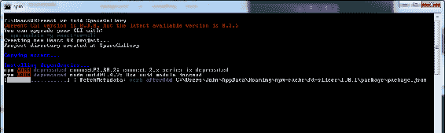

注意这一行：

这些命令通常需要很长时间才能运行，但它们显示的一些信息很重要。

在这种情况下，当我写书时，一些工具升级了，系统告诉了我。我通常建议一旦收到这些通知就立即升级；如果不这样做，您提交的任何错误都不会得到您想要的关注，并且经常会添加新功能和错误修复。

有时，您会收到关于您无法真正控制的东西的警告，比如关于`connect@2.30.2`的提示。

React VR init 命令将处理安装所需的所有内容，包括依赖项（有很多），然后将其全部安装。完成后，它将列出所有内容，然后退出。不用担心，不是所有这些代码都会传送到客户端。实际下载相当小，与 Unity 或 Unreal 等 VR 游戏引擎相比。

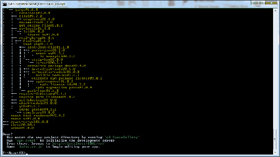

React VR init 命令甚至会告诉您如何启动您的世界。如果我们启动它，我们将看到基本上与我们在第二章中看到的*hello world*应用程序相同，*平面世界与超越-VR 编程*。

首先，确保您已经停止了已经在运行的 hello world 应用程序--使用*Ctrl*+*C*，然后使用`Y`来停止批处理文件。然后，使用`cd`命令（更改目录）进入您创建的新`SpaceGallery`目录。

如果您无论尝试什么都似乎无法改变您的应用程序，很可能您在其他目录中留下了一个 npm 包在运行。终止所有 npm 会话并重新启动它。

继续启动它：

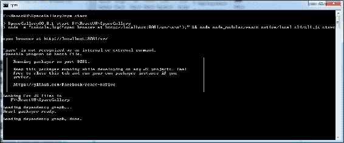如果您收到错误消息`yarn is not recognized as an internal or external command, operable program or batch file`*，*您可以忽略此错误；Yarn 类似于 npm。高级用户可以使用任何一个；由于 React VR 示例中使用了 npm，我将在本书中使用它。

欢迎来到开源世界，有时会有太多的选择。DuckDuckGo 是您的朋友。

让我们改变背景来让我们进入状态。

# 创建更大的世界-背景图像

这是一个*做*章节 - 之前的章节涵盖了 VR 的一般背景。然而，现在我们实际上要改变背景（图像）。

你在 hello world 应用程序中看到的*国际象棋世界*实际上是在`Pano`语句（在`index.vr.js`文件中）中使用的全景图像。当我第一次安装 React VR 时，我以为这是默认世界中包含的一些几何图形。这是我们在`SpaceGallery`应用程序的视图（2D 浏览器视图）：

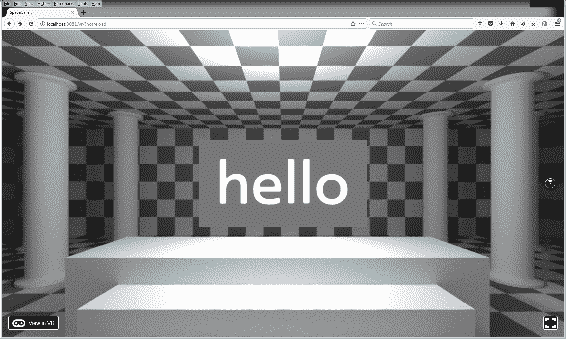

除了 hello 文本框之外，所有内容都来自`<Pano>`对象：

```jsx
 <Pano source={asset('chess-world.jpg')}/>
```

这是一个特别构造的**球形全景**或**等距投影**。它被扭曲以在 360 度左/右和 180 度上/下（就像纬度和经度覆盖+/- 90 和+/- 180 一样，一个 360x180 的球形图像覆盖整个球体）。

这是`chess-world.jpg`，这是每次创建 VR 世界时包含的背景文件：

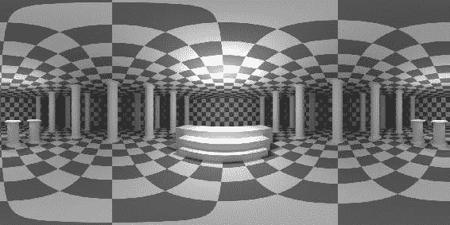

需要注意的几点：

+   这是一个非常大的文件。它是 4096x2048 像素。即使如此，当你在 3D 中四处张望时，它偶尔会显得有点粗糙。这是因为当你在一个 15 英寸的笔记本电脑上看一个物品时，比如说大约 35 厘米宽，离你的眼睛大约半米远，你看到的是一个 1920 像素的图像，看起来很清晰。当你把这个图像 360 度展开时，相当于超过 17,000 像素（2*pi*.5m * 1920 / .35m）。

+   大文件会导致下载速度变慢，即使在今天的世界中也是如此。

+   现在想象一下，如果背景是一个视频。VR 具有非常高的带宽要求。这是入场的价格。

+   文件看起来是扭曲的，但当它在浏览器和你喜欢的 HMD 中显示时，它会看起来是直的。

+   由于直线，这张特定的图像非常适合测试；如果你直视下方或直视上方，一切都会匹配。

你可以在网上找到 360 度全景照片，但要确保它们是球形 360x180 全景照片。如果它们是由相机拍摄的，通常在图像的顶部和底部会出现奇怪的东西；许多人认为你不会直视下方或直视上方。

地图投影也是等距投影图像，所以你可能熟悉它们以及在极点处拉伸的事物。如果你把一个地图投影作为你的背景，它会看起来像你在一个地球仪里面。

可能有点奇怪。

在你的世界中直接在视点下方放置一些几何图形是个好主意，以覆盖你的球形全景图中的任何不连续或畸变。

这也有助于避免漂浮的感觉；因为`Pano`是二维的，而且无限远，立体深度感知无法显示`Pano`有多远。如果你在 VR 世界中改变你的视角，物体看起来会在地板上奇怪地移动。通过在视角下方的基本几何图形或模型语句来避免这种情况，可以使你的世界看起来更加真实。

由于我们正在谈论太空中的一个画廊，在我们进入轨道之前，让我们调查一些新的全景照片，并用它们来准备我们的背景。随意使用你喜欢的搜索引擎在网上搜索更多的全景照片。以下是我遵循的步骤：

1.  让我们去**欧洲空间局**（**ESO**）并从[`bit.ly/PanoESO`](http://bit.ly/PanoESO)复制一个奇妙的太空全景图像。如果你想尝试不同的分辨率，他们在下载页面上有一系列分辨率可供选择。这张图片很棒：

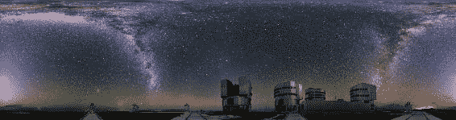

1.  将其下载到我们创建新应用程序的`static_assets`文件夹下，然后打开`index.vr.js`。在那个文件中，对`Pano`语句进行更改：`<Pano source={asset('uhd_vlt_circular_cc_eq.jpg')}/>`

1.  现在刷新你的浏览器，我们已经看到太空了：

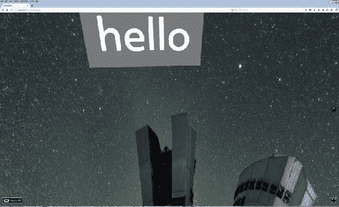

1.  你会注意到建筑物看起来有点奇怪。如果我们继续往下看，背景图片看起来更奇怪：

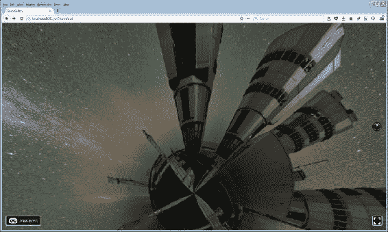

1.  这是因为，如果你仔细看原始背景图片，它实际上不是 360x180 度，而更像是 360x90 度。这在使用手机拍摄全景图像时非常常见；很少有人捕捉顶部和底部使其成为真正的 360x180 度。真正的全景照片在底部和顶部看起来一样扭曲。例如，看看我们之前看到的平面国际象棋世界图像。

1.  这是可以修复的。修复方法就是在原始的 360x90 全景照片底部添加一条黑色条纹（或背景颜色），就像这样：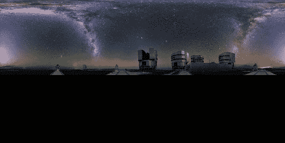使用这种技术，你可以更或多或少地修复任何全景图像，只要它至少是 360x90；即使没有标记，这些也是相当常见的。现在，如果我们把这张全景图像放在我们的`Pano`语句中，或者 VR 应用看起来会好得多：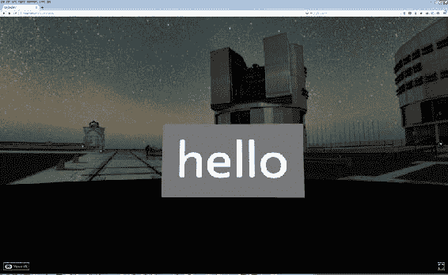为了做到这一点，我使用了一个名为**Irfanview**的免费图像查看/编辑程序，尽管你也可以使用 Photoshop 或任何其他图像编辑软件。我强烈推荐 Inkscape 或 Gimp；它们功能齐全并且是免费/开源的。

1.  当我们在 VR 中查看这个并检查控制台时，我们可以看到一个错误：

```jsx
THREE.WebGLRenderer: image is not power of two (2000x2000). Resized to 2048x2048
```

让我们通过调整大小来修复这个问题。Irfanview 有一个很好且相当快速的调整大小功能，可以保留大部分细节。只需调整大小（*Ctrl*+*R*），使其成为 2048x2048 或 2048x1024。由于我们在底部添加了黑色条纹，我们可以调整图像的大小而不会拉伸它。如果必要的话，你应该裁剪或延伸图像的底部；这些 360 度的投影很难分辨，但如果你改变图像的宽高比，当你查看它时，世界看起来会被挤压。

如果你得到了一个空白或不正确的背景，请检查图像格式和大小。

# 混乱世界-添加我们的第一个 VR 组件

好的，现在让我们开始添加我们的物体。

在本章开头的描述中，我们提到了移动到轨道。你可能会想知道为什么我们没有从太空背景开始。我们会的，在我们在地面上创建一个世界之后。我发现太空图像作为背景可能会让人迷失方向，没有地板，我们需要在漂浮和上下变得毫无意义之前讨论等距投影图像。所以，现在，在我们最终到达太空之前，你必须在地球上做出出色的画廊。

这带来了一个重要的观点。`<Pano>`语句通常被描述为一个背景。更好的方式是把`<Pano>`语句和背景图像看作是*整个世界*或者你无法触摸的世界的一部分。无论你的背景图像是什么，没有任何 VR 对象，它都会把你放在*那里*。`<Pano>`实际上不仅仅是一个背景，它实际上是整个世界，除了你放置的对象之外。

这就是为什么你选择的背景对于存在感很重要。如果你选择了奇怪或者令人迷惑的背景，人们会感到迷失方向。这可能是你想要的，也可能破坏了沉浸感。此外，他们永远无法触摸到“全景”中的物体，所以如果有靠近的物体，可能会让人感到迷失方向。

因此，让我们为室外画廊的地板添加一个“平面”，这样我们就不会漂浮在我们的背景上。在`index.vr.js`中代码生成器生成的第一个`<View>`语句之后，添加以下“平面”和“盒子”元素：

```jsx
export default class SpaceGallery extends React.Component {
    render() {
        return (
            <View>
//the above code is generated automatically, add your code below
//or after the <Pano> statement
<Plane 
    dimWidth={5}
    dimHeight={5}
    texture={asset('DeckPlate.jpg')}
    lit
    style={{
       transform: [
         {translate: [0,-1.8, -5]},
         {rotateX: -90}
         ] }}
/>
<Box 
          dimWidth={5}
          dimDepth={5}
          dimHeight={.1}
          texture={asset('DeckPlate.jpg')}
          lit={true}
          style={{
          transform: [{
            translate: [5.2,-1.8,.1],
          }]
          }}
        />
```

在保存并查看世界之前，我们需要`DeckPlate.jpg`文件。你需要从[`bit.ly/VR_Chap5`](http://bit.ly/VR_Chap5)下载这个文件，放在`static_assets`文件夹里，并将其复制到`SpaceGallery`文件夹内的`static_assets`文件夹中。我使用了一个叫做 Substance Designer 的程序，由 Allegorithmic 公司开发，位于[`bit.ly/AllegSub`](http://bit.ly/AllegSub)上的他们的材料分享网站。我在这里找到了这个材料[`bit.ly/MatSciFi01`](http://bit.ly/MatSciFi01)。由于你可能没有 substance player，我为你导出了这张图片，名为`DeckPlate.jpg`。以后，我们将构建更复杂的模型，并使用其他纹理来构建实际的材料。如果你使用 Photoshop，你也可以使用 Quixel.se 来获得良好的效果。请参阅[`bit.ly/QuixelSuite`](http://bit.ly/QuixelSuite)。

我们这样做之后会发生什么？我们点击刷新，然后得到一个空白屏幕。打开你的网页开发者控制台。如果你使用的是 Firefox，点击工具|Web 开发者|切换工具（或者在 PC 上按 Ctrl+Shift+I）。

控制台将打开，我们会看到很多错误，然后是：

```jsx
Expected a component class, got [object Object]
```

这是我们忘记添加到`import`指令的线索。当我们生成对象时，它会放置我们需要的所有 React VR JSX 导入，以便进行 hello world。每当我们添加新的对象或 API 时，我们需要确保 React VR 知道它。插入以下粗体行：

```jsx
import {
 AppRegistry,
 asset,
 Box,
 Pano,
 Plane,
 Text,
 View,
} from 'react-vr';
```

在一个大型项目中，你可能偶尔会忘记这一点。如果你的场景没有改变，可以在浏览器中检查控制台。我还建议通过按字母顺序或者你使用它们的顺序添加你的`import`声明来进行一些代码组织。按字母顺序更容易快速扫描。你可以直接导入所有内容，但这可能会增加一些你不需要的开销。

# 点亮世界

一旦我们添加了导入语句，我们会注意到世界有些黑暗；可能很难看到我们添加的盒子和平面。为了照亮事物，我们将添加`AmbientLight`和`DirectionalLight`（太阳或月光）到图像中。在这个应用程序中，我们有一个明显的夜间图像背景，但我们的物体将被照亮。添加`AmbientLight`和`DirectionalLight`是伪造自然世界的一种简单方法。在现实世界中，物体会从附近物体反射的光线中获得光照。`AmbientLight`可以模拟这种柔和的发光（在其他渲染系统中，这经常被称为全局照明）。方向光模拟了室内顶部照明（许多灯光，比如在教室中）或太阳或月亮的光线。

将您的照明语句放在应用程序的`render()`语句顶部，这样您就可以轻松找到它们。我会把它们放在顶级`<View>`之后的第一条语句。

如果灯光是物体的一部分，比如一盏台灯，保持灯光靠近物体（或作为物体的子级）。

这将允许您快速修改场景照明。

我们的`AmbientLight`语句很简单；`DirectionalLight`需要更多的思考，但也很简单。按照这种方式编写它们：

```jsx
        <AmbientLight
        intensity = {.3}
        />

        <DirectionalLight
        intensity = {.7}
        style={{
          transform:[{
            rotateZ: 45
          }]
        }}
        /> 
```

现在你应该能看到平台了，尽管它们看起来很小。

不要忘记导入语句！

# 为什么我让你粘贴`Plane`和`Box`？

它们都成为了我们世界的地板，那么为什么我们两者都做了呢？如果你在 VR 视图中向右看，你会发现`Box`的边缘看起来有点奇怪。纹理映射均匀应用于所有六个面，当拉伸到整体尺寸不接近的盒子时可能看起来很奇怪。这是`Box`的一个缺点。`Plane`没有这个问题，但如果你把`Plane`倾斜错了方向，你可能看不到它；`Plane`是单面的，所以如果倾斜离开当前摄像头，它将是看不见的。`Plane`也是无限薄的。我包括了两者，这样你就可以看到它们的样子。

在变换部分，我提到了变换的顺序是多么重要。这对于`Plane`对象尤其重要；如果你先旋转，然后平移，图像可能会完全错位，在`Plane`的情况下，会变得看不见。

要构建整个画廊，我们需要为平台包括几个正方形。在它们之间留下一点间隙。现在，我们可以通过复制和粘贴每个 `Box` 或 `Plane`（使用你喜欢的任何一个！）并更新 `translate` 语句来实现这一点：

```jsx
    {translate: [0,-1.8,-5.1]},
...
    {translate: [0,-1.8,.1]},
...
    {translate: [5.1,-1.8,.1]}

```

然而，有一个更好的方法；React VR 不仅仅是一个硬编码的几何文件，而是一个真正的面向对象的 JSX 文件，我们可以利用它。

让我们定义一个新对象，它是我们的甲板板块之一。我们将除了位置之外的所有内容都放入该对象的组件中。首先（我在这个问题上纠结了一段时间），将代码的第一行从：

```jsx
import React from 'react';
```

到：

```jsx
import React, {Component } from 'react';
```

请注意，这是一个不同的 `import` 语句，不同于我们在第二行使用的（很容易忽视）。

如果你看不到你创建的对象，或者得到一个你知道是有效的关键字但却没有被识别的错误，请不要忘记文件顶部的 `import` 指令！

# 得到类 - 将对象合并为新关键字

一旦我们导入了 React 组件，我们就可以将一个对象定义为 `class`。对于这个版本，我们将使用单独的数字作为 props（就像参数），然后根据需要实例化它们。我们可以将这段代码粘贴到任何地方；现在，你可以将它放在 `index.vr.js` 文件中的 `export default class SpaceGallery extends React.Component` 行之前。你的新 `class` 是：

```jsx
class Platform extends Component {
  render() {
    return ( 
    <Box 
      dimWidth={5}
      dimDepth={5}
      dimHeight={.1} 
      texture={asset('DeckPlate.jpg')}
      style={{
        transform: [
              {
              translate: [ this.props.MyX, -1.8, this.props.MyZ]
              } 
              ]
          }}
    />

    );
  }
}
```

要实例化此对象的副本，在你的 `<View>` 中使用此代码（在你的 `SpaceGallery` 类中）：

```jsx
 <View>
...
 <Platform MyX='0' MyZ='-5.1'/>
 <Platform MyX='0' MyZ='0'/>
 <Platform MyX='0' MyZ='5.1'/>
 <Platform MyX='5.1' MyZ='-5.1'/>
 <Platform MyX='5.1' MyZ='0'/>
 <Platform MyX='5.1' MyZ='5.1'/>
 <Platform MyX='-5.1' MyZ='-5.1'/>
 <Platform MyX='-5.1' MyZ='0'/>

```

这是制作预制件或类的最直接方式，这样你就不必剪切和粘贴无休止的 `Box` 组件声明来制作你的地板。

如果你熟悉 React 中状态的概念，这个时候不要使用状态。你应该为随时间变化的值使用状态；我们将在第七章 *给你的世界注入生命* 中更多地讨论这一点，特别是第十一章 *走进未知领域*。由于这是应用的静态版本，你不需要它。我们将使用 props 在正确的位置构建平台。

你可能会认为，你可以用一个向量来代替两个命名参数，但是 JavaScript 没有向量的概念。但是，你可以使用 `{ }` 运算符，粘贴适当的代码。创建我们的板块地板段的另一种方法如下：

```jsx
class VecPlat extends Component {
  render() {
    return ( 
    <Box 
      dimWidth={5}
      dimDepth={5}
      dimHeight={.1} 
      texture={asset('DeckPlate.jpg')}
      style={{
        transform: [
              {
              translate: this.props.MyPos
              } 
              ]
          }}
    />

    );
  }
}
```

注意`translate`语句中没有方括号围绕`this.props.MyPos`，就像使用文字时那样。然后像这样实例化它：

```jsx
        <VecPlat MyPos={[-5.1, -1.8, -5.1]}/>
```

请注意`translate`语句中额外的`{}`括号和缺少的括号，如前所述。在这种情况下，你需要它来创建向量（数组）。

# 把所有东西放在一起

现在我们有一个基本的平台来放我们的艺术品，你已经学会了如何创建我们可以实例化的对象，我们已经在场景中放置了基本的照明--现在让我们添加一些物体。

你从权威人士那里得知，你做得很棒，现在可以把太空画廊移到太空中。从 GitHub 的链接中，你可以下载一些新文件，包括`BabbageStation_v6_r5.jpg`。一旦我们用这个文件改变`Pano`语句，我们就会直接进入轨道--没有在加速椅子上摇晃的情况。非常安静。

让我们回到建造画廊。首先，让我们巩固并使用`Platform`；一旦你下载了新的`static_assets`，你的新`index.vr.js`文件应该如下：

```jsx
import React, {Component } from 'react';

import {
  AppRegistry,
  asset,
  AmbientLight,
  Box,
  DirectionalLight,
  Div,
  Pano,
  Plane,
  Text,
  Vector,
  View,
  } from 'react-vr';

  class Platform extends Component {
       render() {
          return ( 
             <Box 
              dimWidth={5}
              dimDepth={5}
              dimHeight={.1} 
              texture={asset('DeckPlate.jpg')}
              style={{
                transform: [{ translate: [ this.props.MyX, -1.8, this.props.MyZ] } ]
                }}
             />
          );
      }
   }

export default class SpaceGallery extends React.Component {
    render() {
        return (
          <View>
            <Pano source={asset('BabbageStation_v6_r5.jpg')}/>
            <AmbientLight

    intensity = {.3}

    />
    <DirectionalLight
    intensity = {.7}
    style={{
        transform:[{
            rotateZ: 45
        }]
    }}
         /> 
         <Platform MyX='0' MyZ='-5.1'/>
         <Platform MyX='0' MyZ='0'/>
         <Platform MyX='0' MyZ='5.1'/>
         <Platform MyX='5.1' MyZ='-5.1'/>
         <Platform MyX='5.1' MyZ='0'/>
         <Platform MyX='5.1' MyZ='5.1'/>
         <Platform MyX='-5.1' MyZ='-5.1'/>
         <Platform MyX='-5.1' MyZ='0'/>
         <Platform MyX='-5.1' MyZ='5.1'/>

         <Text
         style={{
             backgroundColor: '#777879',
             fontSize: 0.8,
             fontWeight: '400',
             layoutOrigin: [0.5, 0.5],
             paddingLeft: 0.2,
             paddingRight: 0.2,
             textAlign: 'center',
             textAlignVertical: 'center',
             transform: [{ 
                 translate: [0, 0, -4]}]
         }}>
    Hello
  </Text>
</View>
);
    }
};

AppRegistry.registerComponent('SpaceGallery', () => SpaceGallery);
```

请注意，如果你使用`Platform`或`VecPlat`作为你的对象，你的代码会更短。

请注意，我使用了`MyX='-5.1'`而不是`MyX={5.1}`。这样做是可以的，但实际上是不正确的。`{}`用于将 JS 插入代码中。基本上，如果你想让`MyX`成为一个数字，就在初始化列表中使用`{}`。JavaScript 会进行转换，但有时如果你没有将数字作为数字传递，可能会导致奇怪的行为。

你可能已经注意到，React VR 包含的基本原语有点稀疏。没有建设性的实体几何，通常称为布尔运算，或者本地 three.js，你可以创建的东西是有限的。

幸运的是，你可以从其他 CAD 程序中导入文件。我们将在第六章《与 Poly 和 Gon 家族合作》中更多地介绍这一点，但现在，你可以导入一些我在书中的文件中包含的模型，网址是[`bit.ly/VR_Chap5`](http://bit.ly/VR_Chap5)。

# 添加基座

在我们把艺术品放到世界上之前，我们需要建造一个基座。为了更容易对齐，我们可以像之前一样创建一个对象。让我们制作一个方形基座，并在顶部和底部放一个盖子。

如果你为了胜利而结束了一天的工作，那就重新启动 React VR 服务器吧；为了方便起见，我们可以复制 URL，这样我们就可以将其粘贴到我们的网络浏览器中：

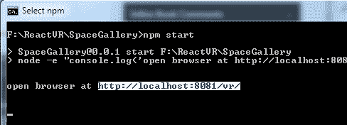

如果您选择了前面的文本粘贴到浏览器中，您将等待很长时间。请注意地址栏中显示的“选择 npm”。

当您使用控制台启动应用程序时，如果“选择”任何文本，并保持其选定状态，可能会阻止 Web 浏览器提供内容。

因此，我们将不再使用简单的立方体作为地板，而是创建一个带有顶部和底部的方形“基座”：

```jsx
class Pedestal extends Component {
    render() {
        return (
          <Box 
          dimWidth={.4}
          dimDepth={.4}
          dimHeight={.5}
          lit
          texture={asset('travertine_striata_vein_cut_honed_filled_Base_Color.jpg')}
          style={{
            transform: [ { translate: [ this.props.MyX, -1.4, this.props.MyZ] } ]
            }}
        />
          <Box 
          dimWidth={.5}
          dimDepth={.5}
          dimHeight={.1}
          lit
          texture={asset('travertine_striata_vein_cut_honed_filled_Base_Color.jpg')}
          style={{
            transform: [ { translate: [ this.props.MyX, -1.1, this.props.MyZ] } ]
            }}
        />
          <Box 
          dimWidth={.5}
          dimDepth={.5}
          dimHeight={.1}
          lit
          texture={asset('travertine_striata_vein_cut_honed_filled_Base_Color.jpg')}
          style={{
            transform: [ { translate: [ this.props.MyX, -1.7, this.props.MyZ] } ]
            }}
          />
    )
     }
     }
```

现在，当您尝试这样做时，您会收到一个错误：

```jsx
Adjacent JSX elements must be wrapped in an enclosing tag (31:10)
```

请记住，这是 React VR；在常规的 React 中，您会将多个标签包含在`<div>`语句中。这在这里行不通，因为我们不处理 HTML；最接近的是 React-Native。因此，对于 VR，我们希望将多个元素/对象包装在`<View>`语句中。因此，正确的代码是这样的：

```jsx
class Pedestal extends Component {
    render() {
        return (
          <View>
              <box etc='...'/>
              <snipped for='brevity'/>
          </View>
     }
     }
```

如果您在 Web 控制台中收到错误`Expected a component class, got [object Object]`，可能是您意外地输入了 view 而不是`View`。

现在我们已经设置了“基座”对象，将其粘贴到您的`index.vr.js`中，放在所有平台的下面：

```jsx
         <Platform MyX={ 0.0} MyZ={-5.1}/>
         <Platform MyX={ 0.0} MyZ={ 0.0}/>
         <Platform MyX={ 0.0} MyZ={ 5.1}/>
         <Platform MyX={ 5.1} MyZ={-5.1}/>
         <Platform MyX={ 5.1} MyZ={ 0.0}/>
         <Platform MyX={ 5.1} MyZ={ 5.1}/>
         <Platform MyX={-5.1} MyZ={-5.1}/>
         <Platform MyX={-5.1} MyZ={ 0.0}/>
         <Platform MyX={-5.1} MyZ={ 5.1}/>

         <Pedestal MyX={ 0.0} MyZ={-5.1}/>
         <Pedestal MyX={ 0.0} MyZ={ 0.0}/>
         <Pedestal MyX={ 0.0} MyZ={ 5.1}/>
         <Pedestal MyX={ 5.1} MyZ={-5.1}/>
         <Pedestal MyX={ 5.1} MyZ={ 0.0}/>
         <Pedestal MyX={ 5.1} MyZ={ 5.1}/>
         <Pedestal MyX={-5.1} MyZ={-5.1}/>
         <Pedestal MyX={-5.1} MyZ={ 0.0}/>
         <Pedestal MyX={-5.1} MyZ={ 5.1}/>
```

现在，我们有一系列漂亮的“基座”。我们所做的另一件事是，通过仔细的缩放，每个物体在二维空间中都位于相同的位置[5.1 ... 0 ... -5.1]。这将使导入各种艺术品更容易。

正如我们在创建其他类或组件时所看到的，React VR 中的项目组合有点困难。它并不打算成为一个完整的 3D 建模工具；它是一个 VR 演示系统。因此，任何真正复杂的对象都应该在 CAD 系统中创建。在那里，您将拥有某种类型的视觉建模，比起尝试估计堆叠时`<Box>`的偏移量要容易得多。

我们将使用 Model 语句。在第四章“React VR 库”中，我们详细介绍了 Model 关键字。现在是使用它的时候了！在主代码中的`<View>`语句内部添加以下行，放在它下面的“基座”上。不要忘记更改`import`行！

```jsx
<Model
  source={{
      obj: asset('teapot2.obj'),
      mtl: asset('teapot2.mtl'),
      }}
      lit
      style={{
        transform: [{ translate: [ -5.1, -1, -5.1 ] }]
        }}
  />

```

我从互联网来源和 Blender 中进行了一些 UV 编辑，创建了一个版本的犹他茶壶，这是`'teapot2.obj'`对象。在 Blender 中创建对象可能是一整本书的主题，也可能是，所以现在，您可以从书中的文件中下载茶壶。它们位于[`bit.ly/VR_Chap5`](http://bit.ly/VR_Chap5)的`static_assets`文件夹中。

这个有点不同，因为它有一个橡胶把手，蓝色珐琅和一个铜龙头。目前，材料文件（.mtl 文件）只有简单的颜色，但在下一章中，我们将学习如何使用纹理贴图使它们丰富多彩。

如果你得到`Model is not defined`，这意味着你忘记在文件顶部的`import`行中添加`Model`。

继续保存，你会看到我们添加了一个茶壶！然而，有一些问题 - 甲板看起来有点无聊，边缘有点奇怪，我们想看到茶壶看起来有点不同。我们可以通过在下一章中创建自己的模型来实现这一点。

# 摘要

恭喜！你的画廊现在完成了，只有一个简单的物体。你已经学会了如何修改我们的世界，改变背景使它看起来像我们想要的任何地方，还学会了如何创建对象组并实例化它们。接下来，你将学会如何用更多的模型来填充它；阅读下一章以了解详情！
