# 第六章：与 Poly 和 Gon 家族合作

当刚开始接触计算机图形的人看到一些最初的 VR 图形时，他们的第一反应是“哦，不是多边形！”我的一个朋友在看到她的第一个大型多人在线角色扮演游戏时，感到恼火时说了这句话。它并不像《Money for Nothing》那样低多边形，但它非常接近。《Money for Nothing》是第一个使用计算机图形并且看起来像这样的音乐视频之一：

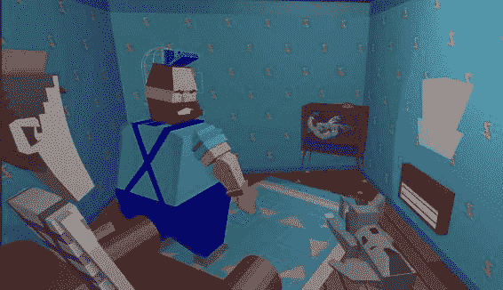

多边形是呈现实时图形的最佳方式。在本节中，我们将不得不制作其中的一些！您可能已经熟悉**计算机辅助**（设计/草图/绘图）（CAD）软件或计算机建模软件；或者您可能是一个完全的新手。有很多不同的 CAD 系统，我们将使用 Blender，一个免费的可用/开源 CAD 系统，来说明带入虚拟现实中一些重要的方式。

在本章中，您将学到：

+   如何执行基本多边形建模

+   如何从 Blender 中以 OBJ 形式导出模型

+   如何应用基本 UV 纹理映射

+   如何导出纹理贴图

+   如何创建 MTL 文件以正确显示实时 OBJ 纹理和材质

# 多边形及我们为什么喜欢它们

我认为对“哦，不是多边形”感到困惑的原因是，多边形，除非它们被提升到艺术形式，如前面的音乐视频中那样，否则可能是一种创建东西的非常粗糙的方式。例如，这看起来并不像一个苹果：

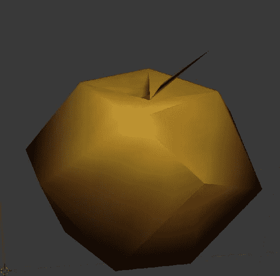

许多 CAD 系统确实有其他表示形式，如**非**均匀有理 B 样条（NURBS），这是一种曲线，或者基本上没有多边形但是它们所代表的原始图形。例如，一个球可能是任意光滑的，没有面或平坦区域。

如果一切都是立方体和球体，世界将会很无聊。除非是 Minecraft，那将会很酷。除了 Minecraft，许多 CAD 系统通过**构造实体几何**（CSG）来构建更有趣的对象，通过在其他原始图形上钻孔和添加基本原始图形来制作更复杂的对象。

# 为什么 VR 不使用一些这些技术？

一般来说，它们很慢。需要有东西将精确、准确的数学模型转换成视频硬件可以显示的东西。一些视频卡和高级 API 可以用其他东西构建对象，计算平滑曲线等等，但迄今为止，在 VR 和游戏行业中最常见的工作流程仍围绕着多边形和纹理。

因此，我们可以将多边形视为一种给定的形式。现代视频卡和高端手机在渲染对象时具有相当多的能力，尽管为了保持 VR 的帧率，我们确实需要注意多边形的数量。

好消息是，你可以用相当低的多边形数量制作出非常好看的 VR 对象。例如，看看我们的苹果。刚刚显示的低分辨率版本只有 44 个面（多边形）和 24 个顶点（点）。如果我们将多边形数量增加到 492 个，它看起来会好得多：

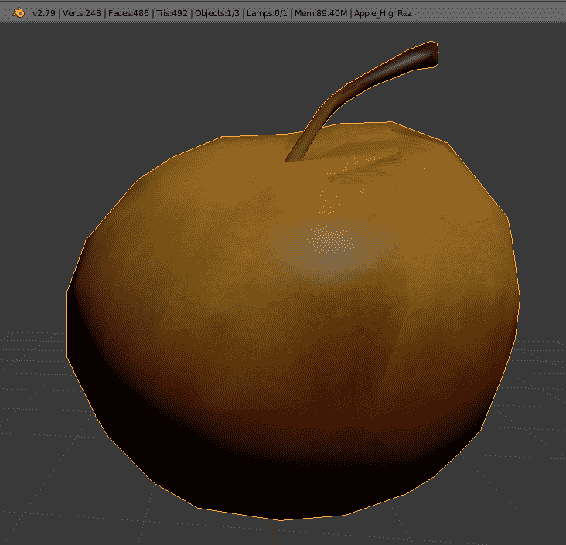在这些例子中，我使用的是 Blender 版本 v2.79。你可以使用任何能读写 OBJ 文件的 CAD 程序，几乎所有的 CAD 程序都可以。我使用 Blender 是因为它是免费的，所以任何读者都可以跟着学习，而不用担心购买昂贵的 CAD 程序。

Blender 非常功能齐全，当然可以用于生产工作，尽管描述每种可能的 CAD 系统并推荐其中一种超出了本书的范围（而且我从不喜欢公开讨论宗教！）。不过从前面的模型中，你可以看到 Blender 的局限性；这个模型有相当奇怪的**纹理映射**，而且分辨率降低太多会在纹理贴图上产生一些奇怪的条纹。

当然，我们可以像在 2030 年的 PC 上运行一样向系统投放多边形，几乎比我们现在拥有的快 512 倍，如果摩尔定律成立的话。我们的苹果会看起来像这样：

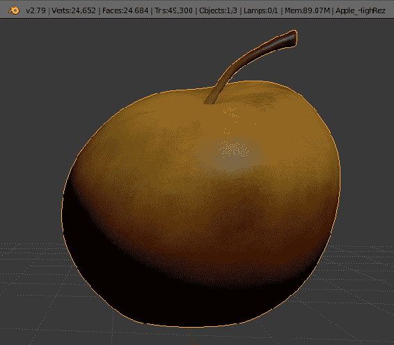

这与中等分辨率的苹果并没有太大的不同，尽管那些奇怪的纹理线已经消失了。看起来相当不错（这不是一个完整的细节渲染）。为了使分辨率更低的多边形，我在 Blender 中进行了快速的减面。减面是 Blender 的一种方式，可以将具有大量多边形的模型减少到更少的多边形，这是一种非常方便的方式，可以将非常复杂的模型制作成虚拟现实准备。手动进行减面，并对模型应用新的纹理，可能会消除接缝。

对于高级建模者，你可以使用你的模型的低多边形版本，结合高多边形版本，制作一个法线贴图，这与凹凸贴图不同，可以让模型看起来比实际多边形更多。

你可能需要尝试一些法线贴图；这真的取决于浏览器和模型。

现在，你可能会想你更愿意使用拥有 25,206 个面的苹果。这可能有效，但这是一个相当大的模型。很多人会问“我可以使用多少多边形？”虽然这是一个很难回答的问题。这就好像问你妈妈她能把多少杂货装进车里一样？很大程度上取决于装的是什么杂货。如果她要带回一包 24 卷的舒适卫生纸，我可以告诉你，根据我的个人经验，一两卷才能装进一辆两座位的跑车里。（放心，我不是在炫耀，我的跑车已经 12 年了。）

将你的多边形预算想象成与你可能拥有的其他物体相比更好。那个高分辨率的苹果？以同样的速度（非常粗略地说），你可以拥有超过 48 个中等分辨率的苹果。

如果你要为你的太空画廊顾客提供茶点，你更愿意提供 1 个还是 48 个？

保持你的物体尽可能低分辨率，并且仍然保持你需要的视觉外观。你可能需要访问低多边形物体或一个可以减少多边形的好 CAD 系统。

说了这些之后，我从之前的模型中得到了一些相当合理的帧速率。我的目标不是给你一个绝对的数字，而是要展示顶点预算有多么重要。

# 什么是多边形？讨论顶点、多边形和边

如果你使用建模程序，你将不必处理这些对象的定义的复杂性。然而，偶尔你可能需要深入了解细节，因此有必要了解一些背景知识。如果你是计算机图形方面的老手，你可能已经了解很多。我确实提供了一些建议，关于如何最好地将它们引入 React VR，所以最好进行复习。

多边形是由顶点（点）、边和面组成的*n*边对象。面可以朝内或朝外，也可以是双面的。对于大多数实时 VR，我们使用单面多边形；当我们首次将平面放置在世界中时，我们注意到这一点，根据方向的不同，你可能看不到它。

为了真正展示这一切是如何运作的，我将展示 OBJ 文件的内部格式。通常情况下，你不会手动编辑这些文件——我们已经超越了由几千个多边形构建的 VR 时代（我的第一个 VR 世界有一个代表下载的火车，它有六个多边形，每个点都是精心手工制作的），因此手动编辑并不是必要的，但你可能需要编辑 OBJ 文件以包含正确的路径或进行模型师无法原生完成的更改——所以让我们深入了解吧！

多边形是通过在 3D 空间中创建点并用面连接它们来构建的。你可以认为顶点是通过线连接的（大多数建模工具都是这样工作的），但在 React VR 所基于的原生 WebGL 中，它实际上只是面。这些点并不是真正存在的，而是更多地“锚定”了多边形的角落。

例如，这是在 Blender 中建模的一个简单三角形：

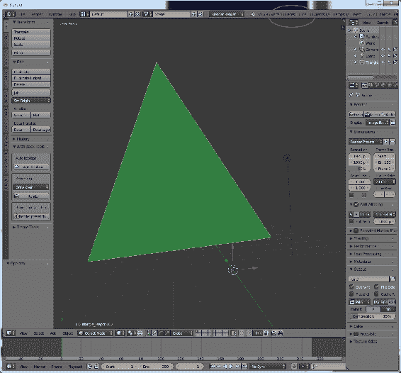

在这种情况下，我用三个顶点和一个面（在这种情况下只是一个纯色，绿色；如果你正在阅读一本实体书或电子墨水阅读器（Kindle），当然会是灰色的一种）构建了一个三角形。边缘以黄色或浅色显示，是为了模型师的方便，不会被显式渲染。

这是我们画廊内三角形的样子：

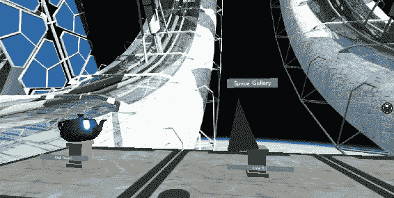

如果你仔细看 Blender 的照片，你会注意到物体并不在世界中心。当导出时，它将以你在 Blender 中应用的平移导出。这就是为什么三角形在基座上略微偏离中心。好消息是我们在外太空中，漂浮在轨道上，因此不必担心重力。（React VR 没有物理引擎，尽管添加一个是很简单的。）

你可能注意到的第二件事是，在 Blender 中三角形周围的黄色线条（在打印中是浅灰色线条）在 VR 世界中并不持续存在。这是因为文件被导出为一个面，连接了三个顶点。

顶点的复数是顶点，不是 vertexes。如果有人问你关于 vertexes，你可以笑话他们，几乎和有人把 Bézier 曲线发音为“bez ee er”一样多。

好吧，公平地说，我曾经那样做过，现在我总是说 Beh zee a。

好了，开玩笑的时间到此为止，现在让我们让它看起来比一个平面绿色三角形更有趣。这是通过通常称为纹理映射的东西来完成的。

老实说，“纹理”和“材质”这个词经常被互换使用，尽管最近它们已经在一定程度上稳定下来，材质指的是物体外观的任何东西，除了它的形状；材质可以是它有多光滑，有多透明等等。**纹理**通常只是物体的颜色 - 瓷砖是红色的，皮肤可能有雀斑 - 因此通常被称为纹理贴图，用 JPG、TGA 或其他图像格式表示。

没有真正的跨软件文件格式用于材料或**着色器**（通常是代表材料的计算机代码）。当渲染时，有一些标准的着色器语言，尽管这些语言并不总是在 CAD 程序中使用。

你需要了解你的 CAD 程序使用的是什么，并熟练掌握它如何处理材料（和纹理贴图）。这远远超出了本书的范围。

OBJ 文件格式（通常是 React VR 使用的）允许使用多种不同的纹理贴图来正确构建材料。它还可以通过文件中编码的参数指示材料本身。首先，让我们看看三角形由什么组成。我们通过`Model`关键字导入 OBJ 文件：

```jsx
<Model
    source={{
        obj: asset('OneTri.obj'),
        mtl: asset('OneTri.mtl'),
        }}
    style={{
            transform: [
                { translate: [ -0, -1, -5\. ] },
                { scale: .1 },
            ]
        }}
/>
```

首先，让我们打开`MTL`（材质）文件（因为.obj 文件使用.mtl 文件）。OBJ 文件格式是由 Wavefront 开发的：

```jsx
# Blender MTL File: 'OneTri.blend'
# Material Count: 1

newmtl BaseMat
Ns 96.078431
Ka 1.000000 1.000000 1.000000
Kd 0.040445 0.300599 0.066583
Ks 0.500000 0.500000 0.500000
Ke 0.000000 0.000000 0.000000
Ni 1.000000
d 1.000000
illum 2
```

其中很多是例行公事，但重要的是以下参数：

+   `Ka`：环境颜色，以 RGB 格式

+   `Kd`：漫反射颜色，以 RGB 格式

+   `Ks`：镜面反射颜色，以 RGB 格式

+   `Ns`：镜面反射指数，从 0 到 1,000

+   `d`：透明度（d 代表*dissolved*）。请注意，WebGL 通常无法显示折射材料，或显示真实的体积材料和光线追踪，所以`d`只是光线被阻挡的百分比。`1`（默认值）是完全不透明的。请注意，.obj 规范中的`d`适用于 illum 模式 2。

透明材料，在撰写本书时，不受 React VR 支持。然而，目前正在开发中，所以也许很快它们会被支持。

+   Tr：透明度的替代表示；0 是完全不透明。

+   `illum` <#>（从 0 到 10 的数字）。并非所有照明模型都受 WebGL 支持。当前的列表是：

1.  颜色开启，环境关闭。

1.  颜色开启，环境开启。

1.  高亮（和颜色）<=这是正常设置。

1.  还有其他照明模式，但目前没有被 WebGL 使用。当然，这可能会改变。

+   `Ni`是光学密度。这对 CAD 系统很重要，但在 VR 中支持它的机会相当低，除非有很多技巧。计算机和显卡的速度一直在不断提高，所以也许光学密度和实时光线追踪最终会得到支持，这要感谢摩尔定律（统计上，计算能力大约每两年翻一番）。

非常重要：确保在所有模型声明中包含“lit”关键字，否则加载程序将假定你只有一个发光的对象，并将忽略材料文件中的大部分参数！

你已经被警告了。它看起来会很奇怪，你会完全困惑。别问我为什么我知道！

OBJ 文件本身包含了几何图形的描述。这些通常不是你可以手动编辑的东西，但是看到整体结构是很有用的。对于之前显示的简单对象，它是相当容易管理的：

```jsx
# Blender v2.79 (sub 0) OBJ File: 'OneTri.blend'
# www.blender.org
mtllib OneTri.mtl
o Triangle
v -7.615456 0.218278 -1.874056
v -4.384528 15.177612 -6.276536
v 4.801097 2.745610 3.762014
vn -0.445200 0.339900 0.828400
usemtl BaseMat
s off
f 3//1 2//1 1//1
```

首先，您会看到一个注释（用`#`标记），告诉您是什么软件制作的，以及原始文件的名称。这可能会有所不同。`mtllib` 是对特定材质文件的调用，我们已经看过了。`o` 行（如果有组，还有`g` 行）定义了对象和组的名称；尽管 React VR 目前并不真正使用这些，但在大多数建模软件中，这将列在对象的层次结构中。`v` 和 `vn` 关键字是有趣的地方，尽管这些仍然不是可见的东西。`v` 关键字在 x、y、z 空间中创建一个顶点。稍后将连接构建的顶点成多边形。`vn` 建立了这些对象的法线，`vt` 将创建相同点的纹理坐标。稍后再详细讨论纹理坐标。

`usemtl BaseMat` 建立了在接下来的面中将使用的材质，该材质在您的.mtl 文件中指定。

`s off` 意味着关闭了平滑。平滑和顶点法线可以使物体看起来光滑，即使它们由很少的多边形制成。例如，看看这两个茶壶；第一个没有平滑。

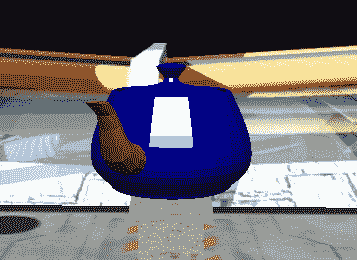

看起来很像计算机图形，对吧？现在，看看在整个文件中指定了“s 1”参数，并且法线包含在文件中的相同茶壶。这是相当正常的（双关语），我的意思是大多数 CAD 软件会为您计算法线。您可以使法线光滑、锐利，并在需要时添加边缘。这可以在不增加多边形的情况下增加细节，并且渲染速度快。

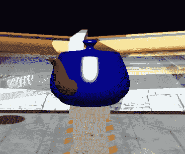

光滑的茶壶看起来更真实，对吧？好吧，我们还没看到最好的！让我们讨论纹理。

我过去不喜欢寿司是因为口感。我们不是在谈论那种口感。

纹理映射很像是用一张圣诞包装纸包裹一个奇形怪状的物体。就像在圣诞节收到那个奇怪的礼物，不太知道该怎么做一样，有时包装并没有明确的正确方式。盒子很容易，但大多数有趣的物体并不总是一个盒子。我在网上找到了这张带有标题“*我希望是 X-Box*.*”*的照片。

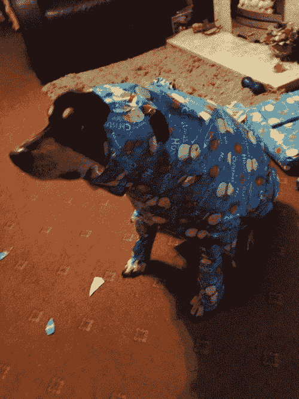

“包裹”是通过 CAD 系统中的 U、V 坐标完成的。让我们来看一个带有正确 UV 坐标的三角形。然后我们去拿我们的包装纸，也就是说，我们拿一张图像文件作为纹理，就像这样：

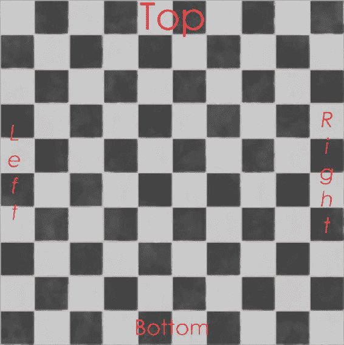

然后我们在 CAD 程序中将其包装起来，指定它作为纹理贴图。然后我们将三角形导出，并放入我们的世界中。

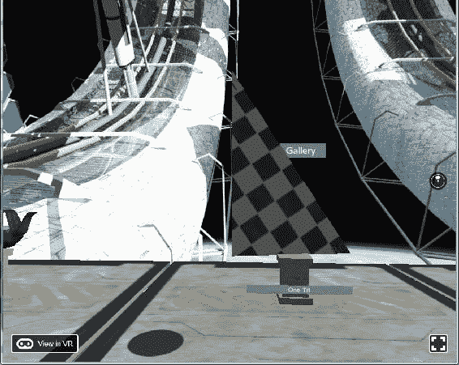

您可能期望在纹理贴图上看到“左侧和底部”。在我们的建模软件（仍然是 Blender）中仔细观察后，我们发现默认的 UV 映射（使用 Blender 的标准工具）尝试尽可能多地使用纹理贴图，但从艺术角度来看，可能并不是我们想要的。

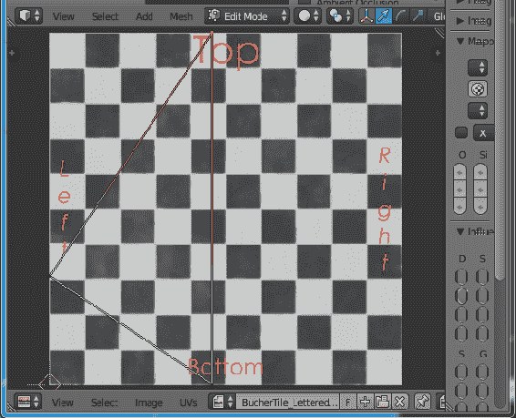

这并不是要表明 Blender 是“你做错了”，而是要说明在导出之前您必须检查纹理映射。此外，如果您尝试导入没有 U、V 坐标的对象，请再次检查它们！

如果您正在手动编辑.mtl 文件，并且您的纹理没有显示出来，请仔细检查.obj 文件，并确保您有`vt`行；如果没有，纹理将不会显示出来。这意味着纹理映射的 U、V 坐标没有设置。

纹理映射并不是一件简单的事情；关于它有很多艺术性的东西，甚至有整本书专门讲述纹理和光照。话虽如此，如果您从互联网上下载了一些东西并希望让它看起来更好一些，您可以通过 Blender 和任何 OBJ 文件来取得相当大的进展。我们将向您展示如何修复它。最终目标是获得一个更可用和高效的 UV 贴图。并非所有的 OBJ 文件导出器都会导出正确的纹理贴图，而且您在网上找到的.obj 文件可能有 UV 设置，也可能没有。

您可以使用 Blender 来修复模型的展开。虽然这不是一个 Blender 教程，但我会在这里向您展示足够的内容，让您可以通过一本关于 Blender 的书（Packt 有几本很好的 Blender 书）来快速入门。您也可以使用您喜欢的 CAD 建模程序，比如 Max、Maya、Lightwave、Houdini 等等。（如果我错过了您喜欢的软件，请原谅我！）。

这很重要，所以我会在信息框中再次提到它。如果您已经使用了不同的多边形建模器或 CAD 页面，您不必学习 Blender；您的程序肯定会正常工作。您可以略过这一部分。

如果你不想学习 Blender，你可以从 Github 链接下载我们构建的所有文件。如果你要通过示例进行工作，你将需要一些图像文件。本章的文件位于：[`bit.ly/VR_Chap7`](http://bit.ly/VR_Chap7)。

# 获取 3D 模型的途径

这就引出了一个简短的分歧。首先，你从哪里得到这些模型？

获取 3D 模型的最佳方式是自己制作。如果你这样做，你可能不会读到这里，因为你已经知道多边形是什么，以及如何给它们贴图。然而，更有可能的是你会去付费或免费的模型网站下载你觉得吸引人的东西，用于你想要创建的世界。这只是为了节省时间。以下是我多年来发现有用的一些网站的简要介绍。其中一些网站可能有非常昂贵的模型，因为它们经常迎合高端图形公司（电视、建筑、电影、设计师），以及高质量但昂贵的游戏艺术。游戏艺术是你要寻找的，以做好 VR；一些网站现在有“低多边形”或 VR/AR 类别。其中一些，特别是 ShareCG 和 Renderosity，在某些地方往往非常业余。网站本身很棒，但上传的文件经常没有编辑控制；因此，你可能会找到侵犯版权的东西（星球大战和星际迷航模型），这是因为律师的明显原因，你在其他网站上找不到这些东西。另一方面，你可能会在这些网站上找到别人正在赚钱的你自己的内容，因此想找到你自己的律师。

说到律师，你需要检查任何你下载的文件的许可证。例如，你可能有权使用这些模型进行渲染，但不能进行分发。这可能允许你在游戏中使用这些模型，或者可能需要额外（更昂贵）的许可证。

一些网站（绝非独家）可以下载模型，包括：

+   [Turbosquid.com](http://Turbosquid.com)

+   [CGStudio.com](http://CGStudio.com)

+   [creativemarket.com/3d](http://creativemarket.com/3d)

+   [CGTrader.com](http://CGTrader.com)

+   [Grabcad.com](http://Grabcad.com)

+   [ShareCG.com](http://ShareCG.com)（本书中的一些模型来自这里）

+   [3dwarehouse.sketchup.com](http://3dwarehouse.sketchup.com)

为什么你会在这些网站上找到这么好的模型？为什么一些模型看起来如此奇怪，艺术性如此之高？许多艺术家有一些不需要排他性的合同，或者人们正在制作一个游戏，但最终没有发布。他们可以上传这些未使用或较少使用的模型，让其他人使用，并甚至从销售中获利。

你可以花上几天的时间在所有这些网站上搜索适合你网站的完美内容。

你已经被警告了！

还有许多旨在用于 3D 打印的 3D 模型网站。这些模型可能非常密集（高多边形），但可能有一些你可以使用的内容。

我喜欢使用一个叫做“Poser”的程序来进行人体建模，尽管许多 CGI 艺术家更喜欢自己制作。DAZ3D 也出售人体模型，其中许多可以与 Poser 一起使用。这两个网站都是廉价、合理质量渲染的良好资源网站（取决于你设置场景的技能）。Poser 程序有许多专门用于对象、场景、模型和纹理的网站可供使用。由于高多边形数量和非常密集的纹理，Poser 人体模型在 VR 中显示效果不佳，但这些网站可能仍然有物体和附加工具，通常价格非常合理。

一些拥有良好 Poser 模型的网站，以及许多其他免费物体的网站是：

+   [my.smithmicro.com/poser-3d-animation-software.html](http://my.smithmicro.com/poser-3d-animation-software.html)

+   [DAZ3D.com](http://DAZ3D.com)

+   [Contentparadise.com](http://Contentparadise.com)

+   [Renderosity.com](http://Renderosity.com)

本书中的几幅图像是用 Poser 和 DAZ Studio 完成的。

# 总结

在这一章中，你学会了使用 Blender 进行多边形建模的基础知识。你已经了解了多边形预算的重要性，如何导出这些模型，以及关于 OBJ/MTL 文件格式的细节。你还学会了我们可以在哪里获取我们世界的 3D 模型。

这些物体看起来可能很普通；然而，在下一节中，你将学会如何在茶壶周围包裹一张纸。这不仅是一种给人们礼物的技能，它对于使我们的虚拟世界看起来真实将是至关重要的。
