# 第七章：坐在（虚拟）茶壶旁

在上一章中，我们了解了很多关于多边形以及如何在实时图形中使用它们的知识。我们将继续使用多边形，并学习更多关于给它们贴图的知识。

在本章中，我们将学习以下内容：

+   如何使用 Blender 的基础知识

+   如何应用基本的 UV 纹理映射

+   如何导出纹理映射

+   如何创建 MTL 文件以正确显示实时 OBJ 纹理和材质

+   为我们的茶壶画廊整合一切

Blender 只是许多多边形建模器之一，您可以使用它来制作用于 WebVR 的虚拟对象。如果您已经熟悉多边形建模的概念，并且创建和编辑 UV 映射，那么您实际上不需要本章的大部分内容。一旦我们完成 UV 映射，我们就将模型导入到世界中。我还将本章的静态文件放在了[`bit.ly/VR_Chap7`](http://bit.ly/VR_Chap7)，这样您就可以下载它们，而不是自己构建它们。

UV 建模可能会很乏味。如果您只是下载文件，我不会介意的。但请浏览以下内容，因为我们构建这些模型时，我们将把它们放在虚拟世界中。

# 在 Blender 中的茶壶

要学习如何 UV 映射，让我们在 Blender 中放一个茶壶。今天，这将运行得相当顺利，但通常茶壶不会适合在 Blender 中。

您可以在[blender.org](http://www.blender.org)下载 Blender。在那里，我强烈推荐网站上的教程[bit.ly/BlendToots](http://bit.ly/BlendToots)。Packt 还有很多关于 Blender 的好书。您可以在[`bit.ly/BlenderBooks`](http://bit.ly/BlenderBooks)找到这些书。如果您还没有通过这些教程，对基本的光标移动和选择可能会感到有些困惑或沮丧；看到光标移动的动画比写作更有帮助。特别是，请观看*入门*下的光标选择教程：[`bit.ly/BlendStart`](http://bit.ly/BlendStart)。

为了开始贴图，我们将使用 Martin Newell 的著名的“犹他州茶壶”。这是计算机图形学中更著名的“测试模型”之一。这是原始的犹他州茶壶，目前在加利福尼亚州山景城的计算机历史博物馆展出（由 Marshall Astor 提供）：

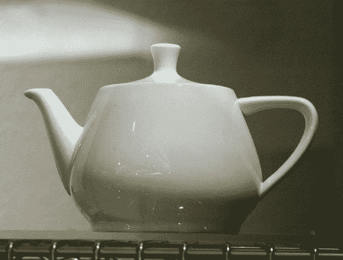

计算机图形学版本被*压扁*在演示中，这种压扁是固定的。您可以在[`bit.ly/DrBlinn`](http://bit.ly/DrBlinn)了解更多信息。

这是 Blender 中的茶壶。您可以通过在首选项中打开额外形状来到这里：

1.  点击菜单文件，然后用户首选项（文件->用户首选项），然后点击额外对象：

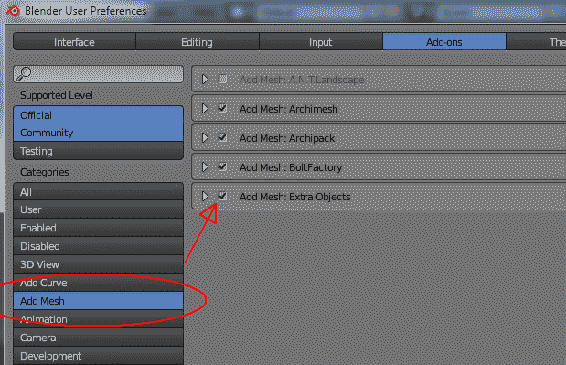

1.  不要忘记然后点击屏幕底部的按钮“保存用户设置”，否则下次进入时对象将不在那里。保存后，关闭 Blender 用户首选项窗口。

1.  然后，在 3D 窗口底部的菜单上，点击“添加->网格->额外->茶壶+”：

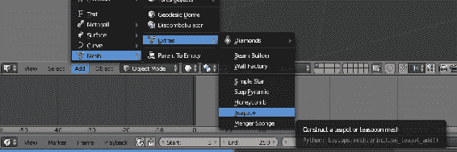

1.  一旦你这样做了，仅供教学目的，选择左下角窗格上的分辨率为 3，如图所示。

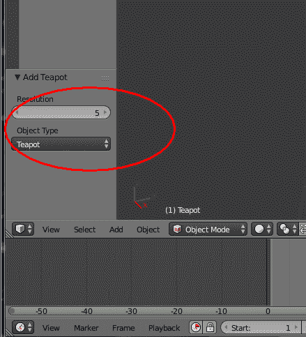

增加茶壶的分辨率是相当不错的；如果我早点注意到这一点，写这一章节时就可以节省我一个小时在互联网上搜索了。我们将其更改为 3，以使多边形更大，这样在进行本教程时更容易点击。

1.  然后，您要在 3D 窗口中点击茶壶（左键）以选择它；然后茶壶将有一个橙色的轮廓。然后通过点击对象菜单旁边的“对象模式”一词，返回到编辑模式，然后选择“编辑模式”：

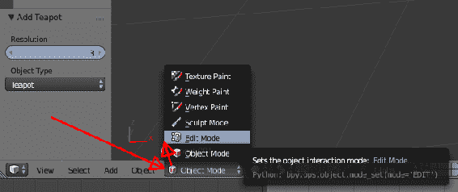

一旦你进入编辑模式，我们需要在选择茶壶的多边形时能够看到 UV 贴图。最初，可能不会有 UV 贴图；继续跟着我们，我们会创建一个。

1.  将鼠标放在时间轴窗口上方的细线上，在屏幕底部的窗口（以下截图中用红色圈出的区域）上拖动窗口*向上*。这将为窗口留出足够的空间。

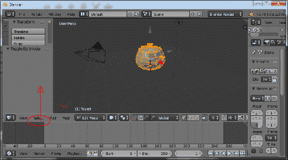

1.  我们不做动画，所以我们不需要那个窗口，我们会把它改成 UV 显示。要做到这一点，点击时间轴显示的小时钟图标（哇，还记得模拟时钟吗？），选择 UV/Image Editor：

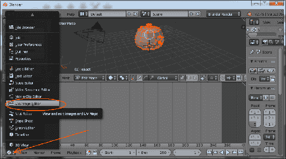这只是改变窗口布局的一种方式。在 Blender 中令人困惑的一点是，你可能会因为不小心点击了一些东西而真正搞乱你的用户界面，但其中一个很棒的地方是你可以通过鼠标点击轻松地创建窗口、子窗口、拉出、架子等等。我刚刚向你展示的方法是教学中最直接的方式，但对于真正的工作，你应该按照自己的意愿自定义窗口。

一旦你改变了这个视图，请注意你可以像其他 Blender 窗口一样放大、平移和移动窗口。关于如何放大、平移等等，你应该观看位于[`bit.ly/BlendStart`](http://bit.ly/BlendStart)的教程视频文件。

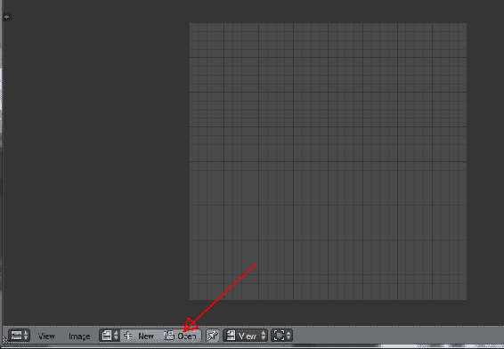

1.  所以，我们可以看到我们的模型使用我们的纹理是什么样子的；点击“打开”并找到一个你想要映射到你的茶壶（或模型）上的纹理文件。我正在使用`ButcherTile_Lettered.jpg`。

1.  完成后，进行第一次 UV 展开！在上窗口的菜单中，点击 Mesh->UV Unwrap->Unwrap，就像这样：

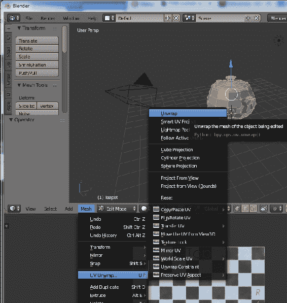

在底部窗口，它会显示出纹理的展开情况。

看起来很糟糕。你的结果可能会因不同的模型而有所不同。

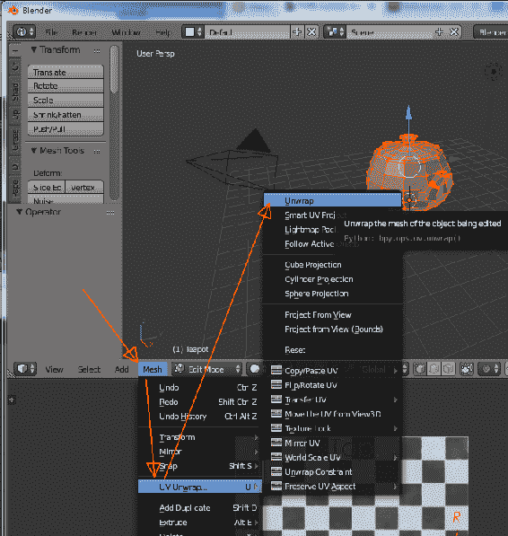

为什么这个 UV 贴图看起来很糟糕？从实时图形的角度来看，它并不糟糕；它将所有多边形都打包到一个纹理贴图上，这将有助于视频卡的内存：

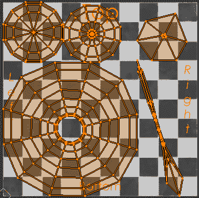

对于一些物体来说，这可能没问题。如果你看右上角和右下角，我们可以看到壶嘴和手柄，它们看起来有点奇怪。渲染出来可能会有点滑稽；让我们看看它的效果。为了做到这一点，我们必须分配一些纹理，然后导出茶壶。（我们稍后会介绍导出；现在，我们只需要看到我们在 Blender 中还有额外的工作要做。）

请注意，你可以通过在 Blender 内部渲染来快速查看，但这可能会让你失望，因为 Blender 几乎肯定会以完全不同的方式渲染你的模型。总体的颜色和纹理将是相同的，但 React VR 和 WebGL 能够实现的更微妙（也更重要）的纹理细节将会丢失（或者更好的是，使用离线、非实时渲染器）；相反，如果你真的在 Blender 中工作或者想要更好的效果，渲染可以产生惊人的作品。

例如，在 Blender 中，使用循环渲染器，渲染我们的茶壶花了 11.03 秒。

在 React VR 中，为了保持至少 60 帧每秒，这必须在不到 0.016 秒内完成。而 Blender 花了 600 多倍的时间来生成相同的图像；难道它不应该看起来更好吗？茶壶看起来并不差，但 UV 映射只是很奇怪。

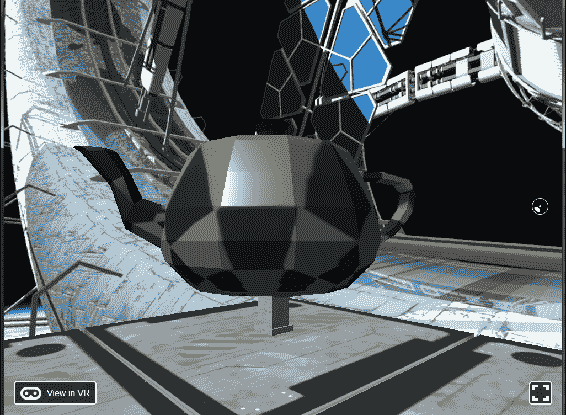

我们可以看到方块在茶壶上有点奇怪地拉长了。（如果你停下来想想我们在做什么，我们只是在茶壶上放了一个瓷砖图案；这就是计算机图形的奇迹。我正在使用棋盘格图案，所以我们可以看到壶上的拉伸。以后，我会用 Substance Designer 制作一个更好的纹理。）

你可以在 Blender 中进行实验，点击多边形（在编辑模式中），看看该多边形在 UV 映射中的位置。为了辩护 Blender，这个映射并不是很糟糕，只是不是我们想要的。有时（几乎总是），需要一个人来真正创作艺术。

# 修复茶壶的 UV 映射

为了更容易地给壶上纹理，首先让我们为壶嘴、手柄和盖子创建单独的材料。这将使我们的纹理地图更大，拉伸得更少。你也可以通过将纹理打包在一个更大的位图中来做到这一点，老实说，有时这对于 VR 来说更好一些；总体方法是相同的，只是更多地打包在一个较小的区域内。

让我们为壶、手柄、壶嘴和盖子创建四种材料（你应该仍然处于编辑模式）。

1.  点击那个看起来有点像闪亮的地球的小图标。然后，点击“+”键四次，如图所示，然后点击“新建”：

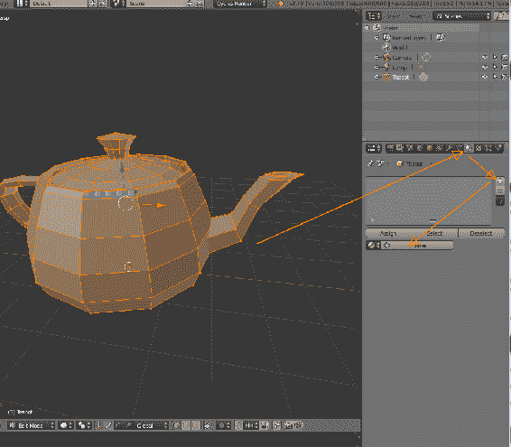

1.  一旦你点击了“+”键四次，你将有四个我们正在创建的材料的插槽。然后你点击“新建”来实际添加一个材料。这似乎有点笨拙，但这就是 Blender 的工作方式：

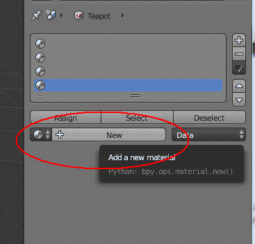

1.  点击“新建”时，你会得到一个 Material.001：

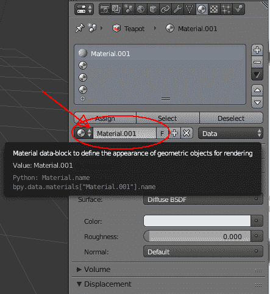

1.  你可以点击红圈中的区域并更改名称。这样，创建四种材料，如下所示：

1.  创建一个壶材料（将是陶瓷涂层金属）。

1.  创建一个盖子材料（和壶一样的纹理）。

1.  创建一个壶嘴材料（让我们把它做成铜制的）。

1.  创建一个手柄材料（让我们把它做成磨损的橡胶）。

我们并不真的需要创建这些材质；你可以在几个 UV 上叠加相同的纹理贴图，但我想对茶壶进行一次新的尝试（正如我们所看到的，它是一个实心的陶瓷制品），看到不同的材质是有益的。

现在这些额外的材质已经创建，你可以移动 UV 以更好地映射对象。UV 映射是一个庞大的主题，需要一定的技术和艺术技能才能做好，或者 PC 可以自动完成。这超出了本书的范围，但我会向你展示一个快速而粗糙的方法来对一些常见的物体进行 UV 映射。你在网上找到的许多文件可能没有应用良好的 UV 映射，所以你可能会发现自己处于这样一种情况，你认为自己不需要学习建模，但会用它来纠正 UV 映射（这在多边形建模时是一个相当高端的活动！）。

一旦你创建了这四种材质，你可以将每个部分独立地映射到自己的 UV 映射上；当我们在 VR 世界中展示时，我们将为每个部分使用不同的纹理贴图。如果你想制作一个单独的陶瓷壶，你可以使用相同的纹理贴图，但我们破旧的金属壶可能看起来更好。

这是艺术；美在于观者的眼中。

一旦你像上面那样确定了四种材质，选择每个主要区域的多边形，然后点击“分配”使它们成为这种材质的一部分：

1.  按下键盘上的“A”键（或选择->（取消）选择所有| A）取消选择所有的多边形。然后我们将选择每个区域的多边形，盖子、把手、壶嘴和壶（主体）。

1.  切换到“多边形选择”。Blender 有不同的选择模式-点、线、多边形。对于这个，你需要切换到选择多边形，点击这个图标：

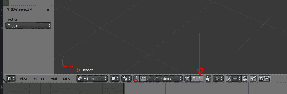

1.  点击主壶多边形，使用*Shift + 点击*选择多个多边形。Blender 拥有丰富的选择工具，如框选等，可以参考教程：[`bit.ly/BlendStart`](http://bit.ly/BlendStart)

1.  一旦你选择了主体的多边形，点击“分配”按钮将该多边形分配给一个材质，比如“壶”材质。

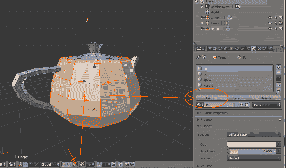

1.  一旦你分配了多边形，点击“视图->前视”，然后点击“网格->UV 展开->圆柱投影”。然后在我们之前设置的图像编辑器中会有一个 UV 映射，尽管它会从你分配的图像上拉伸出来。

1.  要解决这个问题，在屏幕下半部分的菜单中，选择 UVs->Pack Islands：

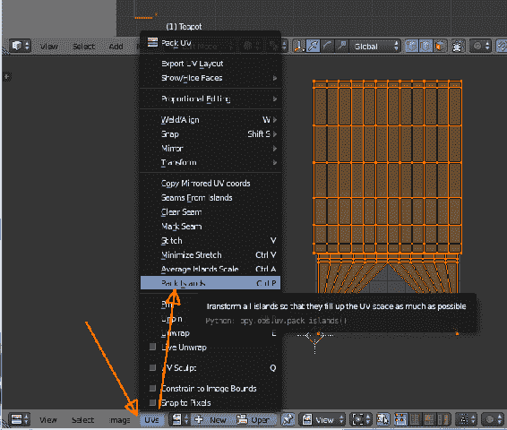

这是基本的纹理映射。你可以对此进行很多调整（这可能会让人沮丧）。Blender 有许多有用的自动 UV 分配工具；在 3D（建模）窗口中，正如我们之前看到的那样，Mesh->UV Unwrap->（选项）提供了许多解包的方法。我发现从视图投影以及圆柱投影，都可以从严格的上/下/左/右视图中很好地展开 UV。在说了这些之后，一些艺术性就会发挥作用。壶嘴、壶盖和手柄比壶身小，所以如果你希望你的纹理与主要的壶和纹理更或多或少地对齐，你可能需要浪费一些 UV 空间并将这些部分缩小。

或者你可以从 GitHub 文件中下载`teapot2.obj`和`teapot2_Mats.mtl`，并节省一些理智：[`bit.ly/VR_Chap7`](http://bit.ly/VR_Chap7)。

这四个 UV 映射不错（但是请随意学习，研究，做得更好！我不是艺术家！）。主体的 UV 映射，壶的材质在这里显示：

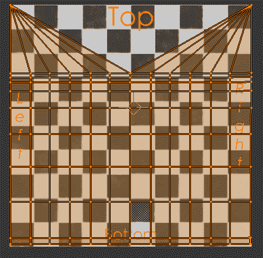

盖子材质的 UV 映射：

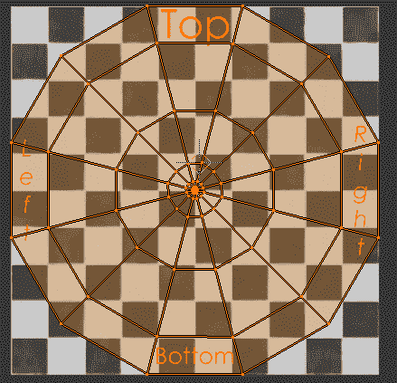

手柄材质的 UV 映射（故意缩小，以使方块与主壶更或多或少对齐）：

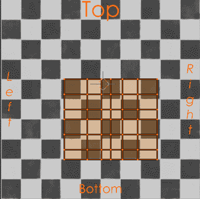

壶嘴材质的 UV 映射（故意缩小，以使方块与主壶更或多或少对齐）：

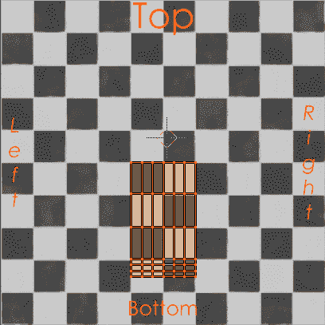

使用这些 UV 分配，我们的茶壶显示两次，在每次之间略微旋转，看起来好多了：

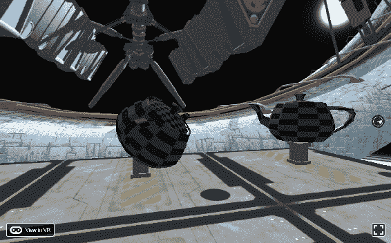

你可以对 UV 进行很多调整。在前面的截图中，如果我们要在壶上映射大部分是瓷砖方块的纹理，我们可以看到，尽管手柄和壶嘴与主体相匹配得很好，但是盖子，虽然看起来没有我们第一张图片那样拉伸，但仍然比其他方块小一点。解决这个问题的方法是进入 3D 面板，仅选择盖子多边形（首先按下"a"直到没有选择任何内容），转到属性选项卡中的材质，点击盖子材质，“选择”以选择所有多边形，然后转到 UV 窗口，将 UV 映射的多边形缩小一点。

然而，在我们的情况下，无论如何，我们都希望为这些物品制作完全不同的材料，所以在这一点上过于担心 UV 可能是错误的。

你的效果可能会有所不同。

# 导入材料

同时，我们可以利用 React VR 在材料方面提供的所有功能。不幸的是，MTL 文件并不总是具有可能的值。如果您使用的是现代材料，具有基本颜色、凹凸贴图或法线贴图、高度、镜面（光泽）或金属（类似于光泽）贴图，我发现您可能需要手动编辑 MTL 文件。

你可能会认为有这么多的计算机图形程序，我们不会到这一步。不幸的是，不同的渲染系统，特别是基于节点的系统，对于 OBJ 导出器来说太复杂，无法真正理解；因此，通常随 OBJ 文件一起使用的大多数 MTL 文件（材料）只有基本颜色作为纹理贴图。

如果您使用 Quixel 或 Substance Designer 等程序，大多数**基于物理的渲染**（**PBR**）材料由以下大部分纹理贴图（图像）组成，这也受到 OBJ 文件格式的支持：

+   **基本颜色**：这通常是材料的外观，几乎总是与大多数 CAD 系统一起导出到 OBJ（MTL）文件中作为`map_Ka`。

+   **漫反射贴图**：通常与基本颜色相同，它是物体的“漫反射”颜色。您可以将其实现为`map_Ka`。

+   **凹凸贴图**：凹凸贴图是“高度”信息，但不会物理变形多边形。它们看起来像是被雕刻的，但如果你仔细看，多边形实际上并没有位移。*这可能会在 VR 中引起问题*。你的一只眼睛会说*这是凹陷的*，但你的立体深度感知会说*不是*。然而，在适当的情况下，凹凸可以让事物看起来非常好。在 MTL 文件中写为*bump*。

+   **高度贴图**：与凹凸贴图非常相似，高度贴图通常会在物体表面上物理位移多边形。然而，在大多数网络渲染中，它只会位移建模的多边形，因此比离线渲染器要不太有用。（游戏引擎可以进行微位移。）

+   **法线贴图**：法线贴图是一种 RGB 表示，比高度或凹凸贴图更复杂，后者是灰度。法线贴图是 RGB 贴图，可以使多边形向*左*或*右*位移，而不仅仅是上下。现代游戏引擎会从高分辨率（数十万到数百万）模型计算法线贴图到低分辨率模型。它使得简单多边形的物体看起来像是由数百万多边形构建而成。它可能会或可能不会在物体上产生物理变形（取决于着色器）。它不受 OBJ/MTL 文件格式直接支持，但受到 WebGL 和 three.js 的支持，尽管实现留给读者自行完成。

+   **高光贴图**：这控制着物体的光泽度。通常是灰色贴图（没有颜色信息）。更具体地说，高光贴图控制着纹理的某个区域是否有光泽。这是 map_Ns。Map_Ks 也是高光贴图，但控制着高光的颜色。例如，可以用于汽车上的“幽灵漆”。

+   **光泽度**：与高光不完全相同，但经常被混淆。光泽度是指高光的亮度；它可以是宽泛但有光泽，如暗橡胶，也可以是紧致而有光泽，如糖苹果或铬。基本上是应用于高光贴图的*值*。通常与 PBR 一起使用，不受 OBJ/MTL 文件格式支持。

+   **粗糙度**：与高光和光泽度贴图非常相似，通常是替代或与前者一起使用。通常与 PBR 一起使用，不受 OBJ/MTL 文件格式支持。

+   反射率：一般来说，OBJ 文件格式用于离线渲染，进行射线追踪反射，近似模拟真实世界的工作方式。出于性能原因，WebGL 并不对所有内容进行射线追踪，但可以使用反射贴图模拟反射。在 OBJ 文件中，反射的程度是静态的；你无法直接制作斑驳的反射。这个贴图在 OBJ 文件中被编码为*refl*，但在 OBJ/MTL 文件格式中，React VR 不模拟它。

+   **透明度**：映射为*d*和*map_d*。（d 在原始 MTL 文件中代表“密度”）。这不是折射透明度；光线要么穿过要么不穿过。对于玻璃瓶之类的物体很有用，但 React VR 不使用。

+   **贴花**：这会在物体顶部应用模板，并且非常有用，可以避免重复的纹理外观，并在顶部添加文字。在 MTL 中，文件被编码为*decal*。这可能非常有用，并且在 React VR 中支持贴花。但是，我发现大多数建模者不会导出它，因此您可能需要手动编辑材质文件以包含贴花。这并不太糟糕，因为通常您的世界中的不同模型将具有不同的贴花（例如标志、污渍等）。

# 修复甲板板

现在我们已经学会了如何进行 UV 映射，让我们修复那些用来表示甲板板的立方体。在对基本的 React VR 对象进行纹理处理时，我们发现，立方体在所有六个面上都表示相同的纹理。因此，当我们制作一个薄的立方体，就像我们为基座的顶部和底部或甲板板所做的那样时，纹理贴图在侧面看起来“挤压”。红色箭头显示了挤压的纹理；这是因为我们有一个高度只有.1，宽度为 5 的盒子，而纹理是正方形的（双重红色箭头），所以看起来被挤压了。

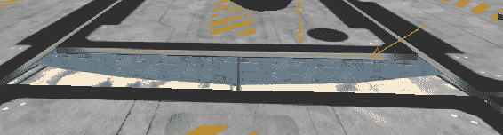

我们可以在 Blender 中用一个立方体来修复这个问题。我们还将添加我们下载的额外纹理贴图。

我有 Substance Designer，这是一个很棒的纹理工具；还有许多其他工具，比如 Quixel。它将根据您的设置输出不同的纹理贴图。您还可以使用各种软件包来烘焙纹理。WebGL 将允许您使用着色器，但这有些复杂。它通过 React Native 支持，但目前有点困难，因此让我们讨论不同材质值的个别纹理贴图的情况。通常在.obj 文件中，这将会分解为这样的情况（.obj 没有现代 GPU 着色器的概念）：

1.  在 Blender 中创建一个立方体，并调整其大小（在编辑模式中），使其比宽或高短得多。这将成为我们的甲板板。在我们的 VR 世界中，我们将其设置为 5x5x.1，因此让 Blender 立方体也设置为 5x5x.1。

1.  然后，我们粗略地对其进行纹理贴图，如下所示：

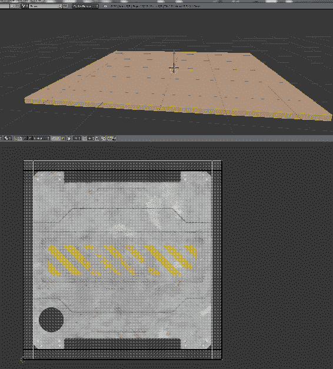

1.  将其导出为 OBJ 并选择以下参数；重要的参数是-Z 向前，Y 向上（Y 向上！）和 Strip Path（否则，它将包括您的物理磁盘位置，显然无法从 Web 服务器中调用）：

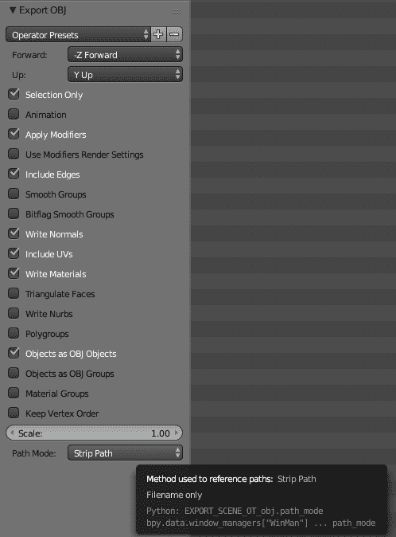

一旦完成这些，我们将以困难但直接的方式来做，即修改甲板板的 MTL 文件，直接包含我们想要的纹理：

```jsx
# Blender MTL File: 'DeckPlate_v1.blend'
# Material Count: 1 newmtl Deck_Plate

Ns 96.078431
Ka 1.000000 1.000000 1.000000
Kd 0.640000 0.640000 0.640000
Ks 0.500000 0.500000 0.500000
Ke 0.000000 0.000000 0.000000
Ni 1.000000
d 1.000000
illum 2
map_Kd 1_New_Graph_Base_Color.jpg
bump -bm 0.01 1_New_Graph_Height.jpg # disp will be mostly ignored, unless you have a high-polygon cube
# disp -mm .1 5 1_New_Graph_Height.png
map_Ks 1_New_Graph_Metallic.jpg
```

位移纹理有点无用；当前的渲染引擎会应用位移贴图，但不会自动细分任何多边形以实现微位移。因此，你必须生成具有尽可能多多边形的几何体来进行位移。

如果你生成了那么多多边形，更好的方法是在建模程序中直接烘烤位移，并导出已经位移的多边形。这样无论如何都是相同数量的多边形，而且你有更多的控制。你也可以选择性地减少多边形数量，并仍然保留你的表面细节。

烘烤位移会显着增加场景中的顶点和多边形数量，所以这是一个权衡。在离线渲染器（非虚拟现实渲染）中使用位移贴图通常是为了减少多边形数量，但并不总是适用于虚拟现实。可能虚拟现实着色器会进行微位移和自适应细分，因为技术不断前进。

如果你得到一个刺眼的白色纹理，或者某些东西看起来不像你期望的那样，双重检查 node.js 控制台，并寻找 404，就像这样：

`Transforming modules 100.0% (557/557), done.`

`::1 - - [20/Sep/2017:21:57:12 +0000] "GET /static_assets/1_New_Graph_Metallic_Color.jpg HTTP/1.1" **404** 57 "http://localhost:8081/vr`

`/?hotreload" "Mozilla/5.0 (Windows NT 6.1; Win64; x64; rv:57.0) Gecko/20100101 Firefox/57.0"`

这意味着你拼错了纹理名称。

然后，我们将使用面向对象的设计编码来修改我们创建的类，这将更新所有的甲板板！将平台调用更改为新的甲板板 OBJ 文件，而不是一个盒子。

# 完成的虚拟现实世界

你的完整代码应该是这样的：

```jsx
import React, {Component } from 'react';

import {
  AppRegistry,
  asset,
  AmbientLight,
  Box,
  DirectionalLight,
  Div,
  Model,
  Pano,
  Plane,
  Text,
  Vector,
  View,
  } from 'react-vr';

class Pedestal extends Component {
    render() {
        return (
          <View>
          <Box 
          dimWidth={.4}
          dimDepth={.4}
          dimHeight={.5}
          lit
          texture={asset('travertine_striata_vein_cut_honed_filled_Base_Color.jpg')}
          style={{
            transform: [ { translate: [ this.props.MyX, -1.4, this.props.MyZ] } ]
            }}
        />
          <Box 
          dimWidth={.5}
          dimDepth={.5}
          dimHeight={.1}
          lit
          texture={asset('travertine_striata_vein_cut_honed_filled_Base_Color.jpg')}
          style={{
            transform: [ { translate: [ this.props.MyX, -1.1, this.props.MyZ] } ]
            }}
        />
          <Box 
          dimWidth={.5}
          dimDepth={.5}
          dimHeight={.1}
          lit
          texture={asset('travertine_striata_vein_cut_honed_filled_Base_Color.jpg')}
          style={{
            transform: [ { translate: [ this.props.MyX, -1.7, this.props.MyZ] } ]
            }}
          />
     </View>
    )
     }
     }

         class Platform extends Component {
             render() {
                 return ( 
                    <Model
                    source={{
                        obj: asset('DeckPlate_v1.obj'),
                        mtl: asset('DeckPlate_v1_AllMats.mtl'),
                        }}
                        lit
                        style={{
                            transform: [ {
                            translate: [ this.props.MyX, -1.8, this.props.MyZ]
                        }] }}
                    /> 

        );
          }
         }

export default class SpaceGallery extends React.Component {
    render() {
        return (
          <View>
            <Pano source={asset('BabbageStation_v6_r5.jpg')}/>
            <AmbientLight

    intensity = {.3}

    />
    <DirectionalLight
    intensity = {.7}
    style={{
        transform:[{
            rotateZ: -45
        }]
    }}
         /> 
         <Platform MyX={ 0.0} MyZ={-5.1}/>
         <Platform MyX={ 0.0} MyZ={ 0.0}/>
         <Platform MyX={ 0.0} MyZ={ 5.1}/>
         <Platform MyX={ 5.1} MyZ={-5.1}/>
         <Platform MyX={ 5.1} MyZ={ 0.0}/>
         <Platform MyX={ 5.1} MyZ={ 5.1}/>
         <Platform MyX={-5.1} MyZ={-5.1}/>
         <Platform MyX={-5.1} MyZ={ 0.0}/>
         <Platform MyX={-5.1} MyZ={ 5.1}/>

         <Pedestal MyX={ 0.0} MyZ={-5.1}/>
         <Pedestal MyX={ 0.0} MyZ={ 0.0}/>
         <Pedestal MyX={ 0.0} MyZ={ 5.1}/>
         <Pedestal MyX={ 5.1} MyZ={-5.1}/>
         <Pedestal MyX={ 5.1} MyZ={ 0.0}/>
         <Pedestal MyX={ 5.1} MyZ={ 5.1}/>
         <Pedestal MyX={-5.1} MyZ={-5.1}/>
         <Pedestal MyX={-5.1} MyZ={ 0.0}/>
         <Pedestal MyX={-5.1} MyZ={ 5.1}/>

         <Model
            source={{
                obj: asset('teapot2.obj'),
                mtl: asset('teapot2.mtl'),
                }}
                lit
                style={{
                    transform: [{ translate: [ -5.1, -1, -5.1 ] }]
                    }}
            />
            <Model
            source={{
                obj: asset('Teapot2_NotSmooth.obj'),
                mtl: asset('teapot2.mtl'),
                }}
                lit
                style={{
                    transform: [{ translate: [ -5.1, -1, 0 ] },
                    { rotateY: -30 },
                    { scale: 0.5} ]

                    }}
            />

            <Model
            source={{
                obj: asset('Chap6_Teapot_V2.obj'),
                mtl: asset('Chap6_Teapot_V2.mtl'),
                }}
                lit
                style={{
                    transform: [{ translate: [ -5.1, -1, 5.2 ] },
                    { rotateY: -30 },
                    { scale: 0.5} ]
                }}
            />

            <Model
            source={{
                obj: asset('Chap6_Teapot_V5_SpoutDone.obj'),
                mtl: asset('Chap6_Teapot_V5_SpoutDone.mtl'),
                }}
                lit
                style={{
                    transform: [{ translate: [ 5.1, -1, 0 ] },
                    { rotateY: -30 },
                    { rotateX: 45 },
                    { scale: 0.5} ]

                    }}
            />

            <Model
            source={{
                obj: asset('Chap6_Teapot_V5_SpoutDone.obj'),
                mtl: asset('Chap6_Teapot_V5_SpoutDone.mtl'),
                }}
                lit
                style={{
                    transform: [{ translate: [ 5.1, -1, 5.1 ] },
                    { rotateY: 46 },
                    { scale: 0.5} ]

                    }}
            />
        <Text
            style={{
                backgroundColor: '#777879',
                fontSize: 0.1,
                fontWeight: '400',
                layoutOrigin: [0.0, 0.5],
                paddingLeft: 0.2,
                paddingRight: 0.2,
                textAlign: 'center',
                textAlignVertical: 'center',
                transform: [ 
                    {translate: [-5.2, -1.4, -4.6] }]
                    }}>
            Utah teapot
        </Text>
        <Text
            style={{
                backgroundColor: '#777879',
                fontSize: 0.1,
                fontWeight: '400',
                layoutOrigin: [0.0, 0.5],
                paddingLeft: 0.2,
                paddingRight: 0.2,
                textAlign: 'center',
                textAlignVertical: 'center',
                transform: [ 
                    {translate: [0, -1.3, -4.6] }]
                    }}>
            One Tri
        </Text>

        &amp;amp;lt;Model
        lit
        source={{
            obj: asset('OneTriSkinnyWUVTexture_1.obj'),
            mtl: asset('OneTriSkinnyWUVTexture_1.mtl'),
            }}
            style={{
                transform: [
                    { translate: [ -0, -.8, -5.2 ] },
                    { rotateY: 10 },
                    { scale: .2 },
]
                }}
        />

         <Text
         style={{
             backgroundColor: '#777879',
             fontSize: 0.2,
             fontWeight: '400',
             layoutOrigin: [0.0, 0.5],
             paddingLeft: 0.2,
             paddingRight: 0.2,
             textAlign: 'center',
             textAlignVertical: 'center',
             transform: [ 
                {translate: [0, 1, -6] }]
         }}>
    Space Gallery
  </Text>
</View>
);
    }
};

AppRegistry.registerComponent('SpaceGallery', () => SpaceGallery);
```

这是一个很多要输入的内容，也是很多 UV 建模。你可以在这里下载所有这些文件：[`bit.ly/VR_Chap7`](http://bit.ly/VR_Chap7)

在上述代码中，我使用了这个：

`<Platform MyX='0' MyZ='-5.1'/>`

这样做是可以的，但更正确的做法是这样的：

`<Platform MyX={0} MyZ={-5.1}/>`

如果你懂 JSX 和 React，这将是一个明显的错误，但不是每个人都会注意到它（老实说，作为 C++程序员，我一开始也没有注意到）。花括号`{}`内的任何内容都是*代码*，而任何带引号的都是文本。文档中说：

*Props - 组件可以接受参数，例如* `<Greeting name='Rexxar'/>`*中的名称。这些参数称为属性或 props，并通过 this.props 变量访问。例如，从这个例子中，名称可以作为`{this.props.name}`访问。您可以在组件、props 和状态下阅读更多关于这种交互的信息。

关于参数的提及仅适用于文本属性。对于数字属性，使用引号语法如`'0.5*'*`似乎可以工作，但会产生奇怪的后果。我们将在第十一章中看到更多内容，*走进野生*，但基本上，对于数字变量，您*应该*使用`{0.5}`（大括号）。

# 总结

在本章中，我们学习了如何使用 Blender 进行多边形建模，以及如何覆盖纹理分配并将纹理包裹在模型周围。我们学会了制作可以使您的世界看起来更真实的纹理。

然而，世界仍然是静态的。在下一章中，您将学习如何使事物移动，真正让您的世界生动起来。
