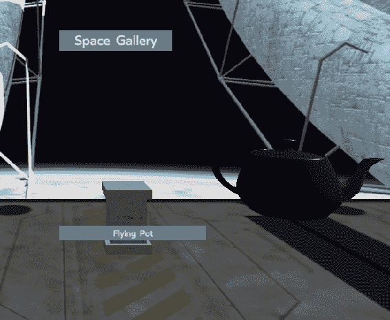
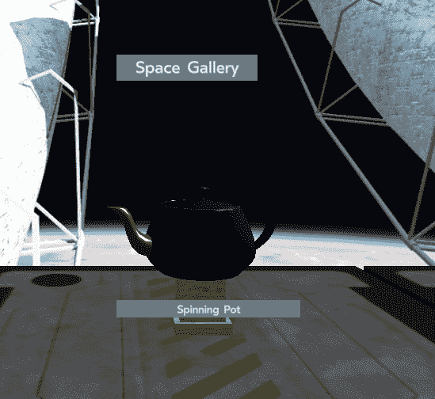

# 第八章：给你的世界注入生命

在上一章中，我们通过材料使物体看起来更真实。我们知道这对于 VR 来说并不是完全必要的，正如我们在第一章中讨论的那样，*虚拟现实到底是什么*，但这确实有所帮助。现在，我们将学习如何通过使它们移动来使事物看起来真实。这样做有两个好处：移动的东西看起来更有生命力，而且还有助于视差深度感知。

React VR 具有许多 API，这将使包含流畅和自然的动画变得非常容易。在大多数传统 CGI 中，使动画流畅并不容易；您必须慢慢开始运动，加速到速度，然后轻轻地减速，否则运动看起来是假的。

我们将在本章中涵盖以下主题：

+   用于动画化对象的`Animated` API

+   一次性动画

+   连续动画

+   生命周期事件，如`componentDidMount()`

+   如何将声音注入到世界中

运动和声音在使世界看起来活跃方面起到了很大作用。让我们来做吧！

# 动画 API

React 和 React VR 使这变得容易，因为动画 API 具有许多动画类型，使这变得简单易懂，无需进行数学计算或使用关键帧，就像传统动画一样。您可以逐渐增加事物，弹跳和停顿。这些属性是 spring，decay 和 timing；有关这些的更多详细信息，请参阅在线文档[`bit.ly/ReactAnims`](http://bit.ly/ReactAnims)。

动画是可以的，但我们需要知道我们要去哪里。为此，动画 API 具有两种值类型：标量（单个值）和矢量的 ValueXY。您可能会想知道为什么在这种情况下，矢量只是*X*和*Y* - ValueXY 是用于 UI 元素的，它们的性质是平的。如果您需要动画化 X，Y 和 Z 位置，您将使用三个标量。

首先，我们将创建一个旋转的动画茶壶。这将特别有助于了解我们的纹理映射是如何工作的。如果您一直在跟着代码，您的`SpaceGallery`应用程序应该已经具备我们开始编写本章所需的大部分内容。如果没有，您可以下载源文件开始：[`bit.ly/VR_Chap7`](http://bit.ly/VR_Chap7)。如果您真的不想输入所有这些，我把最终文件放在了：[`bit.ly/VR_Chap8`](http://bit.ly/VR_Chap8)。

假设你已经下载或完成了上一章，从第七章中拿出`index.vr.js`，*与（虚拟）茶壶一起坐下*，在文件的顶部但在`import`语句下面输入以下新类`TurningPot()`（请注意，我们仍然在`SpaceGallery`应用程序中）。

```jsx
 class TurningPot extends React.Component {
    constructor(props) {
      super(props);
      this.state = {
        yRotation: new Animated.Value(0),
      };
    }
```

这设置了我们的动画值/变量—`yRotation`。我们已经将它创建为一个标量，这是可以的，因为我们将把它映射到`rotateY`。

不要忘记`import`动画关键字。

接下来，我们将使用一个叫做`componentDidMount`的生命周期重写。生命周期重写是在加载和创建（渲染）VR 世界期间特定时间调用的事件；在这种情况下，`componentDidMount`函数在挂载后被调用（根据事件名称中“Did”片段的含义）。挂载意味着对象已加载、可用，并在 three.js 内创建；换句话说，它在世界中。`componentWillMount`函数在该组件即将被挂载但尚不存在时被调用；我们不使用这个函数，因为我们希望对象在实际可见对象时移动，尽管它对加载对象、初始化状态等非常有用。

请注意，我们还没有完成声明，所以最终的闭合`{`括号还没有出现：

```jsx
   componentDidMount() {
        Animated.timing( 
          this.state.yRotation, // Animate variable `yRotation`
          {
            duration: 10000,    // Time
            toValue: 360,       // Spin around a full circle
          }
        ).start();              // Start the animation
      } 
```

`componentDidMount()`是一个重要的对象生命周期 API 调用，用于做像我们正在做的事情；开始动画。

这个事件很可能会在浏览器加载完所有内容之前发生，所以你可能会错过实际的开始。如果这是一个问题，你可以重载一些其他方法来确保它在正确的时间触发，或者引入一个小的延迟。

# 飞行的茶壶

现在是重要的事情，渲染本身。使用`Animated.View`关键字编写以下方法：

```jsx
    render() {
      return (
        <Animated.View // Base: Image, Text, View
          style={{
            flex: 1,
            width: 1,
            height: 1,
            transform: [ 
              {rotateY: this.state.yRotation}, // Map yRotation to rotateY
            ]
          }}
          >
          <Model
          source={{
              obj: asset('teapot2.obj'),
              mtl: asset('teapot2_Mats.mtl'),
              }}
              lit
              style={{
                  transform: [{ translate: [0, -0.7, -5.1 ] }]
                  }}
          />
      </Animated.View>
      );
    }

  }
```

现在保存这个文件。如果你在 URL [`localhost:8081/vr/?hotreload`](http://localhost:8081/vr/?hotreload) 中使用了`?hotreload`，并且输入了一切正确，你会看到茶壶在你面前自动旋转。否则，点击浏览器中的“刷新”按钮。

等等，什么？刚刚发生了什么？为什么壶在飞！



茶壶围绕*我们*，即`<view>`的中心旋转，而不是围绕它自己的轴旋转。为什么会这样？记住翻译顺序很重要。在这种情况下，我们有一个单独的平移和旋转：

```jsx
 render() {
      return (
        <Animated.View 
...
          {rotateY: this.state.yRotation}, // Map yRotation to rotateY
...
          <Model
...
                  transform: [{ translate: [0, -0.7, -5.1 ] }]
...
      </Animated.View>
      );
```

这里发生的是视图在旋转，然后模型在变换。我们希望以相反的顺序进行。一个解决方案是将模型保持在原地，并将`render()`循环更改为以下内容（注意粗体部分）：

```jsx
    render() {
      return (
        <Animated.View // Base: Image, Text, View
          style={{
            transform: [ 
 {translate: [0, -0.7, -5.1 ] },
 {rotateY: this.state.yRotation}, // Map `yRotation' to rotateY 
            ]
          }}
          >
          <Model
          source={{
              obj: asset('teapot2.obj'),
              mtl: asset('teapot2_Mats.mtl'),
              }}
              lit
              // we comment this out because we translate the view above
 // style={{
              // transform: [{ translate: [0, -0.7, -5.1 ] }]
              // }}
          />
      </Animated.View>
      );
    }

```

# 一旦旋转，永远

当我们保存这个文件并在 VR 浏览器中再次查看它时，我们会看到壶转动一次。请注意，我们可能看不到启动，并且当壶完成转动时，它会优雅地完成，而不是计算机动画的“猛然停止”：



这太棒了，但是壶转动然后停止了。我们可能希望它继续转动。所以让我们这样做！

修改组件创建以执行以下操作（是的，我们有点摆脱了所有酷炫的 Animate 关键字）：

```jsx
  class TurningPot extends React.Component {
    constructor(props) {
      super(props);
      this.state = {yRotation: 0};
      this.lastUpdate = Date.now();
      this.rotate = this.rotate.bind(this); 
    }
```

好的，在这部分，注意几件事。我们使用的变量称为`yRotation`；我们还使用了单词`rotate`，这实际上是一个新函数：

```jsx
    rotate() { //custom function, called when it is time to rotate
        const now = Date.now();
        const delta = now - this.lastUpdate;
        this.lastUpdate = now;
        console.log("Spinning the pot");

        //note: the 20 is the rotation speed; bad form to
        //hard code it- this is for instructional purposes only
        this.setState({yRotation: this.state.yRotation + delta / 20} );
        //requestAnimationFrame calls the routine specified, not a variable
        this.frameHandle = requestAnimationFrame(this.rotate);
      } 
```

我们还需要改变对象的加载/卸载例程，既开始旋转，也结束定时器回调：

```jsx
   componentDidMount() { //do the first rotation
        this.rotate();
    } 
    componentWillUnmount() { //Important clean up functions
        if (this.frameHandle) {
          cancelAnimationFrame(this.frameHandle);
          this.frameHandle = null;
        }
      } 
```

`<View>`本身不会改变；它只是像驱动函数一样旋转对象；这一次，我们使用一个名为`render()`的自定义函数来驱动它。

检查经过的时间非常重要，因为不同的平台会有不同的帧率，取决于硬件、GPU 和许多其他因素。为了确保所有类型的计算机和移动设备看到壶以相同的速度旋转，我们使用`now`变量并计算`now`和`this.lastUpdate`之间的差值，得到一个增量时间。我们使用增量来确定实际的旋转速度。

# 最终代码

现在我们已经解决了所有这些问题，我们有一个良好渲染的旋转茶壶。在编码过程中，我们还修复了一个糟糕的编程错误；壶的速度被硬编码为 20 左右。从编程的最大化来看，最好是将其作为`const`，“永远不要将常量嵌入程序主体中”：

```jsx
import React, {Component } from 'react';

import {
  Animated,
  AppRegistry,
  asset,
  AmbientLight,
  Box,
  DirectionalLight,
  Div,
  Model,
  Pano,
  Plane,
  Text,
  Vector,
  View,
  } from 'react-vr';

  class TurningPot extends React.Component {
    constructor(props) {
      super(props);
      this.state = {yRotation: 0};
      this.lastUpdate = Date.now();
      this.rotate = this.rotate.bind(this); 
    }
    rotate() { //custom function, called when it is time to rotate
        const now = Date.now();
        const delta = now - this.lastUpdate;
        const potSpeed = 20;
        this.lastUpdate = now;
        this.setState({yRotation: this.state.yRotation + delta / potSpeed} );
        //requestAnimationFrame calls the routine specified, not a variable
        this.frameHandle = requestAnimationFrame(this.rotate);
      } 
    componentDidMount() { //do the first rotation
        this.rotate();
    } 
    componentWillUnmount() { //Important clean up functions
        if (this.frameHandle) {
          cancelAnimationFrame(this.frameHandle);
          this.frameHandle = null;
        }
      } 
    render() {
      return (
        <Animated.View // Base: Image, Text, View
          style={{
            transform: [ // `transform` is an ordered array
              {translate: [0, -0.5, -5.1 ] },
              {rotateY: this.state.yRotation}, // Map `yRotation' to rotateY 
            ]
          }}
          >
          <Model
          source={{
              obj: asset('teapot2.obj'),
              mtl: asset('teapot2_Mats.mtl'),
              }}
              lit
              //style={{
              // transform: [{ translate: [0, -0.7, -5.1 ] }]
              // }}
          />
      </Animated.View>
      );
    }

  }

class Pedestal extends Component {
    render() {
        return (
          <View>
          <Box 
          dimWidth={.4}
          dimDepth={.4}
          dimHeight={.5}
          lit
          texture={asset('travertine_striata_vein_cut_honed_filled_Base_Color.jpg')}
          style={{
            transform: [ { translate: [ this.props.MyX, -1.4, this.props.MyZ] } ]
            }}
        />
          <Box 
          dimWidth={.5}
          dimDepth={.5}
          dimHeight={.1}
          lit
          texture={asset('travertine_striata_vein_cut_honed_filled_Base_Color.jpg')}
          style={{
            transform: [ { translate: [ this.props.MyX, -1.1, this.props.MyZ] } ]
            }}
        />
          <Box 
          dimWidth={.5}
          dimDepth={.5}
          dimHeight={.1}
          lit
          texture={asset('travertine_striata_vein_cut_honed_filled_Base_Color.jpg')}
          style={{
            transform: [ { translate: [ this.props.MyX, -1.7, this.props.MyZ] } ]
            }}
          />
     </View>
    )
     }
     }

         class Platform extends Component {
             render() {
                 return ( 
                    <Model
                    source={{
                        obj: asset('DeckPlate_v1.obj'),
                        mtl: asset('DeckPlate_v1_AllMats.mtl'),
                        }}
                        lit
                        style={{
                            transform: [ {
                            translate: [ this.props.MyX, -1.8, this.props.MyZ]
                        }] }}
                    /> 

    );
          }
         }

export default class SpaceGallery extends React.Component {
    render() {
        return (
          <View>
            <Pano source={asset('BabbageStation_v6_r5.jpg')}/>
            <AmbientLight

    intensity = {.3}

    />
    <DirectionalLight
    intensity = {.7}
    style={{
        transform:[{
            rotateZ: -45
        }]
    }}
         /> 
         <Platform MyX='0' MyZ='-5.1'/>
         <Platform MyX='0' MyZ='0'/>
         <Platform MyX='0' MyZ='5.1'/>
         <Platform MyX='5.1' MyZ='-5.1'/>
         <Platform MyX='5.1' MyZ='0'/>
         <Platform MyX='5.1' MyZ='5.1'/>
         <Platform MyX='-5.1' MyZ='-5.1'/>
         <Platform MyX='-5.1' MyZ='0'/>
         <Platform MyX='-5.1' MyZ='5.1'/>

         <Pedestal MyX='0' MyZ='-5.1'/>
         <Pedestal MyX='0' MyZ='5.1'/>
         <Pedestal MyX='5.1' MyZ='-5.1'/>

         <Pedestal MyX='5.1' MyZ='5.1'/>
         <Pedestal MyX='-5.1' MyZ='-5.1'/>
         <Pedestal MyX='-5.1' MyZ='0'/>
         <Pedestal MyX='-5.1' MyZ='5.1'/>

         <Model
            source={{
                obj: asset('teapot2.obj'),
                mtl: asset('teapot2_Mats.mtl'),
                }}
                lit
                style={{
                    transform: [{ translate: [ -5.1, -1, -5.1 ] }]
                    }}
            />

        <Text
            style={{
                backgroundColor: '#777879',
                fontSize: 0.1,
                fontWeight: '400',
                layoutOrigin: [0.0, 0.5],
                paddingLeft: 0.2,
                paddingRight: 0.2,
                textAlign: 'center',
                textAlignVertical: 'center',
                transform: [ 
                    {translate: [-5.2, -1.4, -4.6] }]
                    }}>
            Utah Teapot
        </Text>
        <Text
            style={{
                backgroundColor: '#777879',
                fontSize: 0.1,
                fontWeight: '400',
                layoutOrigin: [0.0, 0.5],
                paddingLeft: 0.2,
                paddingRight: 0.2,
                textAlign: 'center',
                textAlignVertical: 'center',
                transform: [ 
                    {translate: [0, -1.3, -4.6] }]
                    }}>
            Spinning Pot
        </Text> 

         <Text
         style={{
             backgroundColor: '#777879',
             fontSize: 0.2,
             fontWeight: '400',
             layoutOrigin: [0.0, 0.5],
             paddingLeft: 0.2,
             paddingRight: 0.2,
             textAlign: 'center',
             textAlignVertical: 'center',
             transform: [ 
                {translate: [0, 1, -6] }]
         }}>
    Space Gallery
  </Text>
  <TurningPot/>

</View>
);
    }
};

AppRegistry.registerComponent('SpaceGallery', () => SpaceGallery);
```

# 声音

VR 中的声音实际上非常复杂。我们的耳朵听到的声音与别人的耳朵听到的声音不同。许多 VR 系统都采用简单的“如果在右边，对我的右耳来说更响”的立体声定位，但这并不是实际声音工作的方式。对于 VR 和它们所需的高帧率，就像我们的光照效果跳过完整的光线追踪一样，这种声音定位是可以的。

更复杂的 VR 系统将使用一种叫做**头部相关传递函数**（HRTF）的东西。HRTF 是指当你转动头部时声音如何变化。换句话说，声音如何根据*你的*头部“传递”？每个人都有自己的 HRTF；它考虑了他们的耳朵形状、头部的骨密度以及鼻子和口腔的大小和形状。我们的耳朵，再加上我们的成长方式，在这个过程中我们训练我们的大脑，让我们能够用 HRTF 做出惊人的事情。例如，人类可以通过只从两个点听到声音来在三维空间中定位某物。这就像只用一只眼睛就能看立体影像一样！HRTF 给了我们视觉所不能给的；它给了我们对周围发生的事情的空间意识，即使我们看不见。

使用 HRTF 进行虚拟现实需要每个在虚拟世界中听到声音的人都将他们的 HRTF 加载到 VR 世界的声音系统中。此外，这个 HRTF 必须在无反射室（墙壁上覆盖有泡沫衬里以消除回声的房间）中进行测量。这显然并不常见。

因此，大多数 VR 声音只是左右平移。

这是 VR 可以取得重大突破的领域。声音非常重要，让我们能够在三维空间中感知事物；这是沉浸的重要方面。许多人认为立体声平移就是 3D；这只是声音在一个耳朵比另一个耳朵更响。在音频系统中，这是*平衡*旋钮。在耳机中，听起来会很奇怪，但实际上并没有定位声音。在现实世界中，你的右耳会在左耳之前（或之后）听到声音，当你转动头部时，你的耳朵的曲线会改变这种延迟，你的大脑会说“啊，声音就在*那里*”。

没有 HRTF 测量，立体声平移是唯一能做的事情，但 HRTF 要好得多。好消息是，现在音频硬件和计算能力非常强大，有了 HRTF 或合理的软件来模拟平均 HRTF，更复杂的声音处理是可能的。期待未来在这个领域的进展。

React VR 的强大再次拯救了我们。我们不必担心这一切；我们只需要把声音放在我们的世界里。

说真的，不要因为所有这些谈话而感到沮丧，只要意识到声音很难（和图形渲染一样重要），但在这一点上，你真正需要做的就是获得一个好的单声道（不是立体声）声音，并在场景文件中描述它。

这就是 React VR 的全部意义。描述你想要的东西；你不需要告诉人们如何做。不过，你需要知道幕后发生了什么。

# 在我们的世界中放置声音

现在，让我们真的发出一些声音。[Freesound.com](http://Freesound.com)是一个获取免费游戏声音的好地方。那里的大部分声音都需要归属。给那些帮助建立你的世界的人以信用是正确的做法。去这个网站下载几个你喜欢的声音文件。我在`freesound.com`找到的一些是这些：

+   通过 Geodylabs 煮沸的锅水（[`bit.ly/BoilingPot1`](http://bit.ly/BoilingPot1)）

+   通过 dobroide（[`bit.ly/Boiling2`](http://bit.ly/Boiling2)）煮沸的水

+   通过 abrez（[`bit.ly/Boiling3`](http://bit.ly/Boiling3)）煮沸的水

我以`.mp3`文件格式下载了这些；这应该是相当跨平台的。把它们复制到`static_assets`目录中一个名为`sounds`的新文件夹中。我只在实际世界中使用了其中一个，但你可以尝试其他的。有时你不知道它是否有效，直到你在世界中听到它。

声音是一个必须附加到视图、图像或文本的节点——React VR 的唯一组件。你可能想把它附加到一个盒子、模型或其他东西上；只需用`<View>`包裹对象，并把`sound`组件放在其中，如下所示：

```jsx
 <View>
    <Model
       source={{
        obj: asset('teapot2.obj'),
        mtl: asset('teapot2_Mats.mtl'),
        }}
        lit
        style={{
            transform: [{ translate: [ -5.1, -1, -5.1 ] }]
            }}
    >
    </Model>
 <Sound 
        loop
        source={{wav: asset('sounds/211491__abrez__boiling-water.mp3') }}
        />
    </View>
```

有一件有趣的事情是，声音并不是来自我们的茶壶所在的地方（当你第一次看到这个世界时，它在左上角）。为什么呢？看看前面的代码；我们只是简单地在`Model`周围包裹了`View`标签；所以它的变换与声音不同。

有些声音比其他的效果更好；你需要进行实验或录制自己的声音。修复变换留给读者作为练习。（实际上，这很容易，但确保你不要把变换粘贴为子 XML 元素。）正确的代码是这样的：

```jsx
<View
    style={{
 transform: [{ translate: [-5.1, -1, -5.1] }]
 }}
>
    <Model
        source={{
            obj: asset('teapot2.obj'),
            mtl: asset('teapot2_Mats.mtl'),
        }}
        lit
    >
    </Model>
    <Sound
        loop
        source={{ wav: asset('sounds/211491__abrez__boiling-water.mp3') }} />
</View>
```

# 总结

我们学会了如何通过程序性地改变对象的位置和使用更高级的方法来构建动画，比如使用定时器和动画 API。我们明显看到了如果使用错误的`<View>`来进行动画会发生什么，并开发了一种让对象永远动画的方法。Energizer 兔会感到自豪。我们还添加了声音，这对虚拟世界来说是非常重要的事情。

定时器可以做很多事情；我强烈建议你研究在线文档并进行实验！

到目前为止，我们一直在 React VR 范围内。有时，有些事情是 React 不允许我们做的。在下一章中，我们将转向原生（即原生 React）！

有人能把那个沸腾的锅炉关掉吗？
