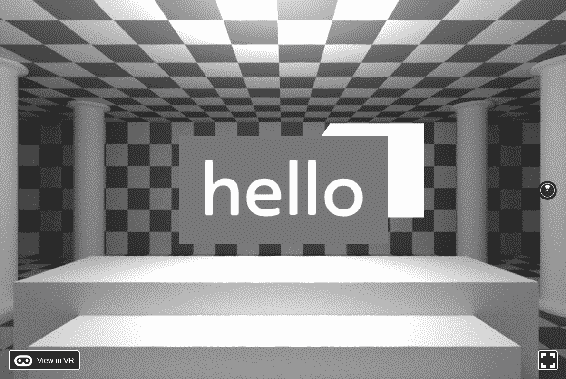
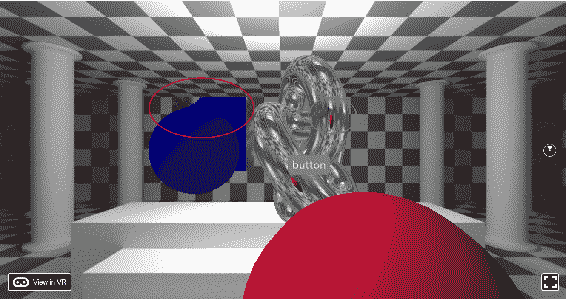

# 第九章：自己动手-本机模块和 Three.js

React VR 使得在不需要了解 three.js 的情况下进行 VR 变得容易。three.js 是帮助实现 WebGL 的包装类，WebGL 本身是一种本机 OpenGL 渲染库的形式。

React VR 相当包容，但像所有 API 一样，它无法做到一切。幸运的是，React VR 预料到了这一点；如果 React VR 不支持某个功能并且您需要它，您可以自己构建该功能。

在本章中，您将涵盖以下主题：

+   从 React VR 代码内部使用 three.js

+   基本的 three.js 程序代码

+   设置 three.js 以与我们的 React VR 组件进行交互

+   使用 three.js 在视觉上执行低级别的操作

# 本机模块和视图

也许您确实了解 three.js 并且需要使用它。**React Native 模块**是您的代码可以直接包含原始的 three.js 编程。如果您需要以编程方式创建本机的 three.js 对象，修改材质属性，或者使用 React VR 没有直接暴露的其他 three.js 代码，这将非常有用。

您可能有一些执行业务逻辑的 JavaScript 代码，并且不想或无法将其重写为 React VR 组件。您可能需要从 React VR 访问 three.js 或 WebVR 组件。您可能需要构建一个具有多个线程的高性能数据库查询，以便主渲染循环不会变慢。所有这些都是可能的，React Native 可以实现。

这是一个相当高级的主题，通常不需要编写引人入胜、有效的 WebVR 演示；但是，了解 React VR 和 React 是如此可扩展，这仍然是令人难以置信的。

# 制作一个 three.js 立方体演示

首先，让我们看一个简单的盒子演示。让我们从一个新生成的站点开始。转到您的 node.js 命令行界面，并关闭任何正在运行的*npm start*窗口，并通过发出以下命令重新创建一个新的、新鲜的站点：

```jsx
f:\ReactVR>React-vr init GoingNative
```

第一个任务是转到`vr`文件夹并编辑`client.js`。到目前为止，我们还没有必须编辑此文件；它包含样板 React VR 代码。今天，我们将编辑它，因为我们不只是在做样板。以下代码中的粗体行是我们将添加到`client.js`中的行：

```jsx
// Auto-generated content.
// This file contains the boilerplate to set up your React app.
// If you want to modify your application, start in "index.vr.js"

// Auto-generated content.
import {VRInstance} from 'react-vr-web';
import {Module} from 'react-vr-web';
import * as THREE from 'three';

function init(bundle, parent, options) {
const scene = new THREE.Scene();
const cubeModule = new CubeModule();
const vr = new VRInstance(bundle, 'GoingNative', parent, {
 // Add custom options here
 cursorVisibility: 'visible',
 nativeModules: [ cubeModule ],
 scene: scene,
 ...options,
 });

 const cube = new THREE.Mesh(
 new THREE.BoxGeometry(1, 1, 1),
 new THREE.MeshBasicMaterial()
 );
 cube.position.z = -4;
 scene.add(cube);
 cubeModule.init(cube);

 vr.render = function(timestamp) {
 // Any custom behavior you want to perform on each frame goes here
//animate the cube
 const seconds = timestamp / 1000;
 cube.position.x = 0 + (1 * (Math.cos(seconds)));
 cube.position.y = 0.2 + (1 * Math.abs(Math.sin(seconds)));
 };
 // Begin the animation loop
 vr.start();
 return vr;
};

window.ReactVR = {init};
```

我们还需要创建 CubeModule 对象。如果它变得复杂，您可以将其放在一个单独的文件中。现在，我们可以将其添加到 client.js 的底部：

```jsx
export default class CubeModule extends Module {
  constructor() {
    super('CubeModule');
  }
  init(cube) {
    this.cube = cube;
  }
  changeCubeColor(color) {
    this.cube.material.color = new THREE.Color(color);
  }
}
```

不需要做其他更改。现在你会看到一个弹跳的纯白色立方体。我们没有改变 index.vr.js，所以它仍然显示着 hello 文本。这表明 React VR 和原生代码，在这种情况下是 three.js，同时运行。



好的，我们放了一个弹跳的立方体。这段代码的好处是它展示了一些高度的集成；然而，这是以一种非常干净的方式完成的。例如，这一行代码——`const scene = new THREE.Scene()`——给你一个可访问的 three.js 场景，所以我们可以用 three.js 做任何我们想做的事情，然而，所有的 React VR 关键词都能正常工作，因为它将使用现有的场景。你不需要从一边导入/导出场景到另一边并维护句柄/指针。这一切都是干净的、声明式的，就像 React VR 应该是的那样。我们在正常的 React VR 语法之外创建了常规场景和对象。

在我们之前的动画中，我们改变了`index.vr.js`。在这种情况下，对于 three.js 对象，我们直接在`client.js`的这部分进行更改；就在代码生成器建议的地方：

`vr.render = function(timestamp) {`

// 在这里执行每帧的自定义行为

# 使原生代码与 React VR 交互

如果我们继续让这个对象与世界其他部分进行交互，你就能真正看到 React VR 的强大之处。为了做到这一点，我们需要改变`index.vr.js`。我们还将第一次使用`VrButton`。

注意 `VrButton` 中的拼写。我在这个问题上纠结了一段时间。我自然地会输入"VR"而不是"Vr"，但它确实遵循了 React VR 的大小写规范。

线索是，在控制台中你会看到 `VRButton is not defined`，这通常意味着你在`import`语句中忘记了它。在这种特殊情况下，你会看到 React 的一个奇怪之处；你可以输入 `import { YoMomma } from 'react-vr';` 而不会出错；试试看。React VR 显然太害怕回答 YoMomma 了。

当我们点击按钮时，沉浸感的一个重要部分是它们发出的点击声音。任何将手机调成静音且没有震动的人都知道我的意思；你按一下手机，什么声音都没有，以为它坏了。所以，让我们去[FreeSound.org](http://FreeSound.org)下载一些点击声音。

我找到了 *IanStarGem* 制作的 *Switch Flip #1*，并且它是根据知识共享许可证授权的。所以，让我们把它放在 `static_assets` 文件夹中：

1.  首先，我们需要包括我们的`NativeModule`的声明；通常，你会在`import`指令之后的顶部这样做，如下所示：

```jsx
// Native Module defined in vr/client.js const  cubeModule  =  NativeModules.CubeModule;
```

请注意，你可以将你的对象称为`CubeModule`，但你可能会在实现与定义之间感到困惑。这样打字会更容易。JavaScript 可能会很宽容。这可能是好事，也可能不是。

1.  无论如何，在`index.vr.js`中，我们需要设置我们的新初始状态，否则会出现黑屏和错误：

```jsx
class GoingNative extends React.Component {
 constructor(props) {
 super(props);
 this.state = { btnColor: 'white', cubeColor: 'yellow' };
 cubeModule.changeCubeColor(this.state.cubeColor);
 }
```

1.  在同一个文件中，在`render()`语句的下面，将`<View>`的定义更改为以下内容（注意我们仍然在视图中，并且尚未关闭它）：

```jsx
      <View
        style={{
          transform:[{translate: [0, 0, -3]}],
          layoutOrigin: [0.5, 0, 0],
          alignItems: 'center',
        }}>
```

我们在这里稍微作弊，也就是说，将视图向后移动，这样物体就在我们面前。

由于 React VR 不是 CAD 系统，你无法进行可视化编辑，因此在编写代码时必须考虑物品的定位。

对于一些复杂的情况，布局图纸也可能有所帮助。

1.  在`<Pano>`语句之后，并在`</View>`结束标记之前，插入以下内容（更改模板生成的 Text 语句）：

```jsx
  <VrButton
    style={{
      backgroundColor: this.state.btnColor,
      borderRadius: 0.05,
      margin: 0.05,
    }}
    onEnter={() => { this.setState({ btnColor: this.state.cubeColor }) }}
    onExit={() => { this.setState({ btnColor: 'white' }) }}
    onClick={() => {
      let hexColor = Math.floor(Math.random() * 0xffffff).toString(16);
      // Ensure we always have 6 digits by padding with leading zeros.
      hexColor = '#' + (('000000' + hexColor).slice(-6));
      this.setState({ cubeColor: hexColor, btnColor: hexColor });
      // Asynchronous call to custom native module; sends the new color.
      cubeModule.changeCubeColor(hexColor);
    }}
    onClickSound={asset('freesound__278205__ianstargem__switch-flip-1.wav')}
  >
    <Text style={{
      fontSize: 0.15,
      paddingTop: 0.025,
      paddingBottom: 0.025,
      paddingLeft: 0.05,
      paddingRight: 0.05,
      textAlign: 'center',
      textAlignVertical: 'center',
    }}>
      button
    </Text>
  </VrButton>
```

当你刷新浏览器时，立方体仍然会四处弹跳，但你可以点击按钮看到立方体变色。当你将鼠标或控制器的光标悬停在按钮上（显示为`<Text>`组件），你会看到按钮变成立方体的当前颜色。

一个很好的做法是在静态变量中预先生成立方体的新颜色（这样它不会像 let 一样消失），然后使鼠标悬停的颜色变成那种颜色。

白色背景上的默认颜色也应该修复。

继续尝试吧；这是一个有趣的练习。

当我们播放声音时，在浏览器的控制台中会出现以下错误：

```jsx
VrSoundEffects: must load sound before playing ../static_assets/freesound__278205__ianstargem__switch-flip-1.wav
```

你可能还会看到以下错误：

```jsx
Failed to fetch audio: ../static_assets/freesound__278205__ianstargem__switch-flip-1.wav
The buffer passed to decodeAudioData contains invalid content which cannot be decoded successfully.
```

1.  解决这个问题的方法是确保你的浏览器有正确的音频格式。正确的格式有：

1.  音频文件需要是单声道；这样它们才能被转换成 3D 空间。

1.  音频文件需要是 48 千赫或更低。这似乎在 Firefox 55 和 59 之间有所改变，但尽可能通用是最安全的。

1.  如果你的文件格式错误，或者你听不到声音，有两种可能的解决方法：

1.  你可以使用 Audacity 或其他音频编辑工具来修复这些问题。

1.  你可以让我来修复它！我已经在书中的文件中下载并转换了文件。但是，如果你不尝试修复，你就学不到。你可以只下载 48 千赫单声道文件，避免转换，但实际上这些相当罕见。使用 Audacity 转换声音很容易和免费，你只需要学一点这个程序就可以了。在 VR 按钮内，我们需要做的就是加载修改后的单声道声音文件：

```jsx
onClickSound={asset('freesound__278205__ianstargem__switch-flip-48kmono.wav')}
```

我在早期的部分提到过这一点，但值得重申的是，如果您遇到无法解释的错误，并且大声说“我知道文件在那里并且可以播放！”，请尝试检查声音文件的格式。

# 总结到目前为止的代码

我们添加了很多代码；让我们总结一下我们的进展。React VR 有时可能会令人困惑，因为它是 JavaScript 和 XML“ish”代码（JSX）的混合，所以这里是完整的`index.vr.js`：

```jsx
import React from 'react';
import {
  AppRegistry,
  Animated,
  asset,
  Easing,
  NativeModules,
  Pano,
  Sound,
  Text,
  View,
  VrButton
} from 'react-vr';

const cubeModule = NativeModules.CubeModule;

class GoingNative extends React.Component {
  constructor(props) {
    super(props);
    this.state = { btnColor: 'white', cubeColor: 'yellow' };
    cubeModule.changeCubeColor(this.state.cubeColor);
  }
  render() {
    return (
      <View
        style={{
          transform: [{ translate: [0, 0, -3] }],
          layoutOrigin: [0.5, 0, 0],
          alignItems: 'center',
        }}>
        <Pano source={asset('chess-world.jpg')} />
        <VrButton
          style={{
            backgroundColor: this.state.btnColor,
            borderRadius: 0.05,
            margin: 0.05,
          }}
          onEnter={() => { this.setState({ btnColor: this.state.cubeColor }) }}
          onExit={() => { this.setState({ btnColor: 'white' }) }}
          onClick={() => {
            let hexColor = Math.floor(Math.random() * 0xffffff).toString(16);
            // Ensure we always have 6 digits by padding with leading zeros.
            hexColor = '#' + (('000000' + hexColor).slice(-6));
            this.setState({ cubeColor: hexColor, btnColor: hexColor });
            // Asynchronous call to custom native module; sends the new color.
            cubeModule.changeCubeColor(hexColor);
          }}
          onClickSound={asset('freesound__278205__ianstargem__switch-flip-48kmono.wav')}
        >
          <Text style={{
            fontSize: 0.15,
            paddingTop: 0.025,
            paddingBottom: 0.025,
            paddingLeft: 0.05,
            paddingRight: 0.05,
            textAlign: 'center',
            textAlignVertical: 'center',
          }}>
            button
    </Text>
        </VrButton>
      </View>
    );
  }
};

AppRegistry.registerComponent('GoingNative', () => GoingNative);
```

在`vr`文件夹（文件夹名称为小写）中的`client.js`文件中将包含以下内容：

```jsx
import {VRInstance} from 'react-vr-web';
import {Module} from 'react-vr-web';
import * as THREE from 'three';

function init(bundle, parent, options) {
const scene = new THREE.Scene();
const cubeModule = new CubeModule();
const vr = new VRInstance(bundle, 'GoingNative', parent, {
    cursorVisibility: 'visible',
    nativeModules: [ cubeModule ],
    scene: scene,
    ...options,
  });

  const cube = new THREE.Mesh(
    new THREE.BoxGeometry(1, 1, 1),
    new THREE.MeshBasicMaterial()
  );
  cube.position.z = -4;
  scene.add(cube);

  cubeModule.init(cube);

  vr.render = function(timestamp) {
    const seconds = timestamp / 1000;
    cube.position.x = 0 + (1 * (Math.cos(seconds)));
    cube.position.y = 0.2 + (1 * Math.abs(Math.sin(seconds)));
  };
  vr.start();
  return vr;
};

window.ReactVR = {init};

export default class CubeModule extends Module {
  constructor() {
    super('CubeModule');
  }
  init(cube) {
    this.cube = cube;
  }
  changeCubeColor(color) {
    this.cube.material.color = new THREE.Color(color);
  }
}

```

# 更多视觉效果

我们做了一些很棒的交互，这是很棒的，尽管直接使用 three.js 的另一个重要原因是在渲染方面做一些 React VR 无法做到的事情。实际上，React VR 可以通过本地方法做一些令人惊叹的事情，所以让我们确切地做到这一点。

首先，让我们将我们的立方体从四处弹跳改为旋转。当我们添加一些视觉效果时，它会看起来更令人印象深刻。

让我们也添加一些球体。我们希望有一些东西可以反射。我选择反射作为一个令人印象深刻的事情，目前在 WebVR 中你实际上不能做到，尽管我们可以通过环境映射做一些非常接近的事情。关于环境映射是什么的讨论比较长，你可以去这里了解：[`bit.ly/ReflectMap`](http://bit.ly/ReflectMap)。

将以下代码添加到您现有的`index.vr.js`中，在`</VrButton>`下方：

```jsx
     <Sphere
      radius={0.5}
      widthSegments={20}
      heightSegments={12}
      style={{
        color: 'blue',
        transform: [{ translate: [-1, 0, -3] }],
      }}
      lit />
    <Sphere
      radius={1.5}
      widthSegments={20}
      heightSegments={12}
      style={{
        color: 'crimson',
        transform: [{ translate: [1, -2, -3] }],
      }}
      lit />
```

我们还将在顶层`<View>`内的`index.vr.js`中添加环境光和定向光：

```jsx
  <AmbientLight  intensity={.3} />
  <DirectionalLight
    intensity={.7}
    style={{ transform: [{
        rotateZ: 45
      }]
    }}
  />
```

继续加载，并确保您看到一个漂亮的蓝色球和一个大红色球。请注意，我编码比平常稍微密集一些，这样这本书就不会消耗更多的树木或光子。我们大部分的更改将在`client.js`中进行。首先，在`init`下初始化我们需要的所有变量：

```jsx
 var materialTorus;
 var materialCube;
 var torusCamera;
 var cubeCamera;
 var renderFrame;
 var torus;
 var texture;
 var cube;
```

然后，我们将为场景设置自定义背景。有趣的是，在我们有`<Pano>`语句时，这并不会显示出来，但这是件好事，因为我们现在正在用`three.js`编码；它不理解 VR，所以背景不太对。这会在图像上显示出来，但最好由读者自行修复。要为`three.js`设置自定义背景，继续按照以下方式添加代码：

```jsx
  var textureLoader = new THREE.TextureLoader();
  textureLoader.load('../static_assets/chess-world.jpg', function (texture) {
    texture.mapping = THREE.UVMapping;
    scene.background = texture;
  });
```

然后，我们将创建一个圆环和之前创建的立方体（记住，这一切仍然在`init`语句中）：

```jsx
  torusCamera = new THREE.CubeCamera(.1, 100, 256);
  torusCamera.renderTarget.texture.minFilter = THREE.LinearMipMapLinearFilter;
  scene.add(torusCamera);

  cubeCamera = new THREE.CubeCamera(.1, 100, 256);
  cubeCamera.renderTarget.texture.minFilter = THREE.LinearMipMapLinearFilter;
  scene.add(cubeCamera);

```

我们在这里做的是创建了一些额外的摄像头。我们将把这些摄像头移动到圆环和我们的弹跳立方体所在的位置，然后将这些摄像头渲染到一个屏幕外的缓冲区（看不见）。现在我们已经创建了这些摄像头，我们可以创建我们的立方体和圆环 three.js 对象；请注意，这对我们之前的立方体有一点改变：

```jsx
  materialTorus = new THREE.MeshBasicMaterial({ envMap: torusCamera.renderTarget.texture });
  materialCube = new THREE.MeshBasicMaterial({ envMap: cubeCamera.renderTarget.texture });

  torus = new THREE.Mesh(new THREE.TorusKnotBufferGeometry(2, .6, 100, 25), materialTorus);
  torus.position.z = -10; torus.position.x = 1;
  scene.add(torus);

  cube = new THREE.Mesh( new THREE.BoxGeometry(1, 1, 1), materialCube);
  cube.position.z = -4;
  scene.add(cube);

  renderFrame = 0;
  cubeModule.init(cube);
```

请注意，`cubeModule.init(cube);`语句应该已经存在。现在，我们只需要真正地将假锡箔包裹在我们的物体周围；我们将在`vr.render`函数中完成这个操作。以下是整个函数：

```jsx
vr.render = function (timestamp) {
    // Any custom behavior you want to perform on each frame goes here
    const seconds = timestamp / 2000;
    cube.position.x = 0 + (1 * (Math.cos(seconds)));
    cube.position.y = 0.2 + (1 * Math.abs(Math.sin(seconds)));
    cube.position.y = 0.2 + (1 * Math.sin(seconds));

    var time = Date.now();
    torus.rotation.x += 0.01;
    torus.rotation.y += 0.02;

    //we need to turn off the reflected objects, 
    //or the camera will be inside.
    torus.visible = false;
    torusCamera.position.copy(torus.position);
    torusCamera.update(vr.player.renderer, scene)
    materialTorus.envMap = torusCamera.renderTarget.texture;
    torus.visible = true;

    cube.visible = false;
    cubeCamera.position.copy(cube.position);
    cubeCamera.update(vr.player.renderer, scene);
    materialCube.envMap = cubeCamera.renderTarget.texture;
    cube.visible = true;

    renderFrame++;

  };
  // Begin the animation loop
  vr.start();
  return vr;
};
```

我稍微改变了盒子，去掉了正弦波周围的`Math.abs(..)`函数，这样它就会在一个完整的圆圈中旋转；这样我们就可以看到反射贴图的优点和缺点。

希望我们已经把所有内容都粘贴进去了。你可以面带微笑地观看显示。漂亮的铬结对象！当你盯着它看时，你会注意到有些地方不太对劲。你可以看到在方框中伪造的反射和真实的反射之间的区别。它看起来有点“不对劲”，但铬结看起来不错。

看看以下图像中红色高亮和绿色的区别：

创建良好的 VR 主要是关于合理的妥协。在反射的情况下，它们看起来可能很棒，就像前面的图像所示的那样，但它们也可能看起来有点不舒服。盒子或平面镜子就是一个不好的例子。曲面物体看起来更自然，正如你所看到的。

游戏和实时编程与仔细的设计一样重要，也是对真实世界的忠实再现。记住，我们不是在创造真实的东西；我们所要做的就是创造一个看起来真实的东西。

在 three.js 中有一个真正的反射器叫做`THREE.Reflector`，如果你想建造一个平面镜子。在 three.js 的示例中有很好的文档记录。

借助这些技术和 React Native 桥接，您可以在不深入常规 three.js 编程的情况下，在 React VR 中做一些令人惊叹的事情。

# 下一步

现在您已经看到了材料的基本 three.js 语法，您可以查看各种 three.js 示例，并复制其中的一些代码。不要只看屏幕上的示例。您还会想在 VR 中尝试它们。一些游戏技巧，比如镜头反射或屏幕空间反射，在 VR 中看起来并不好。一如既往，测试，测试和测试。

我还略微改变了按钮的颜色，当我们切换到 VR 模式时，我们没有光标，所以按钮按下并不总是有效。在下一章中，我将向您展示如何解决这个问题，或者您可以自行调查。

我还在源文件中加载了一个类似金属的反射纹理，名为`static_assets/metal_reflect.jpg`。您不必进行相机渲染来获得看起来闪亮的东西，特别是如果它是一种暗淡的反射，并且可能不希望额外增加帧速率（所有这些相机渲染都需要时间）。如果是这种情况，您可以做一个简单的环境贴图，跳过相机加载和渲染。

# 扩展 React VR — 本机视图

您还可以通过一种称为**本机视图**的东西来扩展 React VR 本身。视图这个词可能让您想到相机渲染，尽管在这种情况下，意思有点不同。把它们看作是本机 three.js 的新 React VR 对象更为合适。它们非常有用。您可以使用我们刚刚介绍的 three.js 代码来混合原始的 three.js 编程，但是以这种方式使用声明式编程的能力有限。有没有更适合 React VR 的方法？您可以通过本机视图来实现这一点。

# 扩展语言

当您实现本机视图时，您可以控制属性和代码与其余运行时代码的交互方式。这些注入通常是视觉的，尽管您也可以注入声音。

您还可以实现新的本机对象。编程方式与我们迄今为止所做的类似；您实现基本属性，将新关键字暴露给运行时，然后将它们编码，就好像它们是 React VR 语言的一部分。还有其他关键字和函数，让您能够根据属性和类型描述您的新 React VR 视图。

要创建本机视图，可以查看文档：[`bit.ly/RCTNativeView.  `](http://bit.ly/RCTNativeView)

你现在已经到了可以用 React VR 做一些令人惊叹的事情的地步了，我完全相信你可以分解我的例子，扩展它们，并且玩得开心。

# 总结

在本章中，我们讨论了如何在 React VR 中使用 three.js 的全部功能。在学习这一点的同时，我们演示了如何放置本地代码和 React VR 本地桥接。我们直接通过 JavaScript 构建了`three.js`网格，并添加了使世界更加生动的声音。我们还使用了 React Native Views 和本地桥接来进行自定义渲染，包括反射贴图 - 我们为 VR 添加了 Chrome（而不是用 Chrome 查看 VR）。我们还展示了如何通过`vr.player.renderer`访问 React VR 相机来进行更多的 three.js 处理。

有了完整的 three.js，我们真的可以用 React VR 做任何我们想做的事情。然而，我们应该在需要的地方使用 React VR，在需要更多细节的地方使用 three.js，否则 React VR 将成为螺栓上的糖霜。它可能会生锈并容易脱落。
