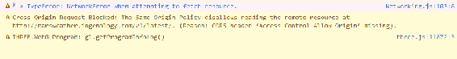
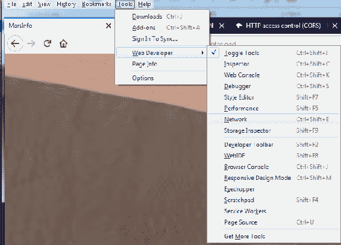
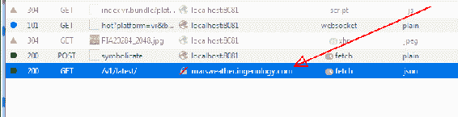
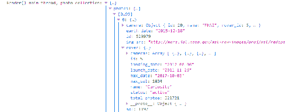
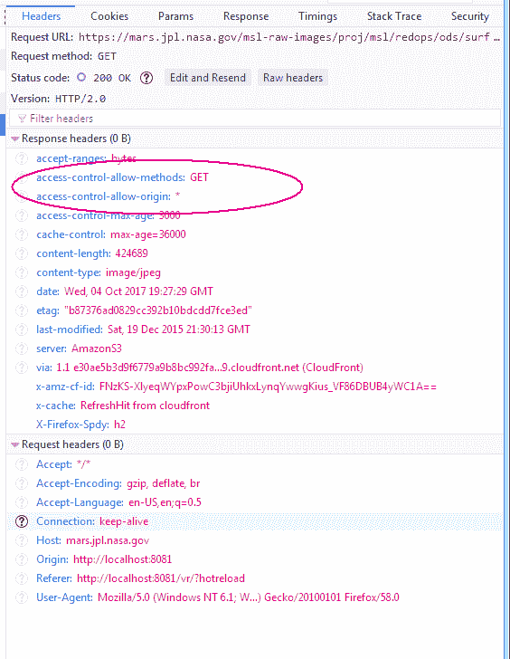
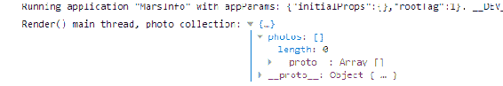
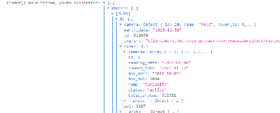
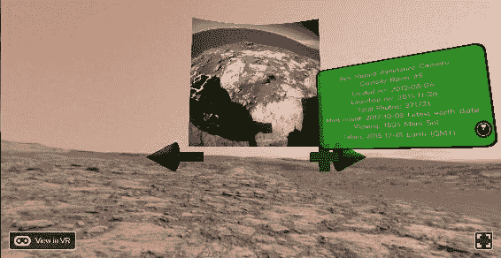

# 第十章：引入真实世界

正如您在上一章第九章中学到的，*自己动手-本地模块和 Three.js*，我们可以将本地代码和 JavaScript 代码包含到我们的世界中。除了通过使其在视觉上更有趣来为我们的世界注入生命外，我们还可以将外部世界引入其中。

在本章中，您将学习如何使用 React 和 JavaScript 将网络带入 VR 世界。您将学习如何在 VR 中使用现有的高性能代码。

首先，我们需要一个 VR 世界来开始。这一次，我们要去火星了！

在本章中，您将学习以下主题：

+   执行 JSON/Web API 调用

+   `Fetch`语句

+   跨域资源共享（CORS）

+   诊断的网络选项卡

+   `Cylindrical Pano`语句

+   类似于 flexbox 的文本对齐（React Native 的一部分）

+   条件渲染

+   样式表

# 前往火星（初始世界创建）

您可能会认为太空中没有天气，但实际上是有的，我们在那里有天气站。我们将前往火星获取我们的天气。这将是一个实时程序，将从火星科学实验室或其名为**好奇号**的探测车获取天气数据。

好奇号是一辆体积为 SUV 大小的火星探测车，于 2011 年 11 月 26 日发射到火星，于 2012 年 8 月 6 日着陆。如果您开着 SUV 去那里，即使您能买到汽油，也需要大约 670 年才能到达那里。火星探测车最初设计为两年的任务，但其任务被延长了，这对我们来说是幸运的。

开着 SUV 去火星获取天气报告将是一件麻烦事。我甚至不知道加油站在哪里。

# 创建初始世界

首先，就像以前做过的那样，转到存储世界的目录并创建一个，如下所示：

```jsx
react-vr init MarsInfo
```

然后，从[`github.com/jgwinner/ReactVRBook/tree/master/Chapter10/MarsInfo`](https://github.com/jgwinner/ReactVRBook/tree/master/Chapter10/MarsInfo)下载资产。

尽管我上传了所有文件来使其工作，而不仅仅是静态资产，但您真的应该尝试自己编写代码。从下载文件并运行它们中，您并不会真正学到任何东西。

犯错误是塑造性格的过程。我上传了文件并将继续维护它们，以防有*太多*的性格。

现在我们有了一个初始世界，我们将开始设置 Web 服务以获取数据。

# Jason 和 JSON

当您听到人们谈论 JSON 时，希望您不会想到这个家伙：


我在网上找到了这张图片，标记为创意共享；这是来自加拿大拉瓦尔的 Pikawil 拍摄的蒙特利尔 Comic-Con 上的 Jason Voorhees 服装（角色扮演）。

认真地说，JSON 是通过 Web 服务引入外部世界的最常见方式；然而，正如我们已经看到包括原生代码和 JavaScript 的方式，您可以以各种方式集成您的系统。

React VR 的另一个巨大优势是它基于 React，因此您可以在 React VR 中常见的事情，也可以在 React VR 中做，只是有一些重要的区别。

# 为什么 JSON 与 React 无关

起初，您可能会想，"在 React VR 中如何进行 AJAX 请求？"

实际上并不是。React VR 和 React Native 对获取数据的方式没有任何忠诚度。事实上，就 React 而言，它甚至不知道图片中有*服务器*。

React 只是使用来自两个地方的数据（props 和 state）简单地渲染组件。

这是学术答案。真实答案要广泛一些。您可以以任何您喜欢的方式获取数据。在说完这些之后，通常大多数 React 程序员将使用这些 API 和/或框架之一：

+   Fetch：几乎是一个标准，它内置在 React 中，因为它通常已经包含；有关用法说明和示例，请参阅[`bit.ly/FetchAPI`](http://bit.ly/FetchAPI)

+   Axios：Axios 围绕着承诺（异步完成 API）展开，尽管它也可以在单线程应用程序中以更简单的方式使用；有关更多详细信息，请参阅[`bit.ly/AxiosReadme`](http://bit.ly/AxiosReadme)

+   Superagent：如果您不喜欢承诺，但喜欢回调；有关更多信息，请参阅[`bit.ly/SuperagentAPI`](http://bit.ly/SuperagentAPI)

在这些示例中，我们将展示 fetch，因为没有必要安装不同的模块和设置回调。在说完这些之后，您可能希望构建一个稍微更具响应性的应用程序，该应用程序使用某种类型的回调或异步完成，以便在等待外部数据时执行某些操作。Fetch 确实通过承诺进行异步完成，因此我们将进行条件渲染以利用这一点，并保持响应性 VR 应用程序。

你可能已经写了很多这样的代码。React VR，正如前面讨论的那样，是一个用于 VR 对象的渲染系统，因此你可以使用各种外部 JavaScript 系统。

# 找到 API——从火星一直到地球

现在，我们将从火星获取天气数据。不，我并不是在开玩笑。参考[`bit.ly/MarsWeatherAPI`](http://bit.ly/MarsWeatherAPI)，如果你感兴趣，这里描述了 API 并提供了一些科学背景。这个 API 被设置为从 XML 数据中获取并以 JSON 或 JSONP 格式返回。以下是结果数据，你也可以参考：[`marsweather.ingenology.com/v1/latest/`](http://marsweather.ingenology.com/v1/latest/)。

```jsx
{
  "report": {
    "terrestrial_date": "2019-04-21",
    "sol": 2250,
    "ls": 66.0,
    "min_temp": -80.0,
    "min_temp_fahrenheit": -112.0,
    "max_temp": -27.0,
    "max_temp_fahrenheit": -16.6,
    "pressure": 878.0,
    "pressure_string": "Higher",
    "abs_humidity": null,
    "wind_speed": null,
    "wind_direction": "--",
    "atmo_opacity": "Sunny",
    "season": "Month 4",
    "sunrise": "2019-04-21T11:02:00Z",
    "sunset": "2019-04-21T22:47:00Z"
  }
}
```

我们可以相当容易地将这转换为我们的 JSON 对象。首先，让我们测试连接性，并对实际返回的 JSON 文本进行合理检查。我们在浏览器中测试了前面的 JSON 数据，但我们需要测试代码以确保它能正常工作。要做到这一点，请按照以下步骤：

1.  在`index.vr.js`中找到 MarsInfo `Component {`的声明，添加以下内容：

```jsx
export default class MarsInfo extends Component {
    componentDidMount() {
        fetch(`http://marsweather.ingenology.com/v1/latest/`,
            {
                method: 'GET'
            })
            .then(console.log(result))
    }

    render() {
```

1.  粘贴这个并运行它。

1.  在浏览器中打开控制台（在 Firefox Nightly 中按*Ctrl*+*Shift*+*K*）。虽然我们刚刚展示的代码非常合理，在浏览器中运行良好，但当我们运行时，会出现错误：



问题是什么？是 CORS。这是一种机制，用于使跨源或不来自同一服务器的 Web 内容安全可靠。基本上，这是 Web 服务器表明“我可以嵌入到另一个网页中”的一种方式。例如，你的银行不希望你的银行详细信息被嵌入到其他网站的网页中；你的支票账户可能会很容易地受到威胁，你会认为自己正在登录真正的银行——而实际上并非如此。

请注意，我本可以使用一个不会出现这些错误的 API，但你可能会遇到自己内容的相同问题，所以我们将讨论如何发现 CORS 问题以及如何解决它。

1.  要找出我们为什么会出现这个错误，我们需要查看协议头；点击工具->Web 开发者->网络，打开网络选项卡：



这个窗口对于解决原生 JSON 请求问题和网站集成非常有价值。

1.  一旦打开控制台，你会看到不同的 HTTP 操作；点击那个没有完成的操作：



然后我们将查看返回的数据。

1.  查看以下截图的右侧；在这里，您可以单击响应和头部来检查数据。我们可以看到网站确实返回了数据；但是，我们的浏览器（Firefox）通过生成 CORS 错误来阻止显示：



代码是正确的，但网站没有包括重要的 CORS 头，因此根据 CORS 安全规则，网站将其阻止。您可以在以下网址了解有关 CORS 的更多信息：[`bit.ly/HTTPCORS`](http://bit.ly/HTTPCORS)。

如果出现此错误，可能可以通过向请求添加头部来解决。要添加头部，您需要修改`fetch`请求；`fetch`请求还允许使用`'cors'`模式。然而，出于某种原因，对于这个特定的网站，`'cors'`选项似乎对我不起作用；对于其他网站，可能效果更好。其语法如下：

```jsx
fetch(`http://marsweather.ingenology.com/v1/latest/`,
    {
        method: 'GET',
        mode: 'cors',
    })
```

为了更好地控制我们的请求，创建一个头部对象并将其传递给`fetch`命令。这也可以用于所谓的**预检查**，即简单地进行两个请求：一个是为了找出 CORS 是否受支持，第二个请求将包括来自第一个请求的值。

1.  要构建请求或预检查请求，请设置如下头部：

```jsx
var myHeaders = new Headers();
myHeaders.append('Access-Control-Request-Method', 'GET');
myHeaders.append('Access-Control-Request-Headers', 'Origin, Content-Type, Accept');

fetch(`http://marsweather.ingenology.com/v1/latest/`,
    {
        headers: myHeaders,
        method: 'GET',
        mode: 'cors',
    })
```

头部值`'Access-Control-Request-Headers'`可以设置为服务器将返回的自定义头部选项（如果支持 CORS），以验证客户端代码是否是有效的 CORS 请求。截至 2016 年，规范已经修改以包括通配符，但并非所有服务器都会更新。如果出现 CORS 错误，您可能需要进行实验并使用网络选项卡来查看发生了什么。

在这种情况下，我们需要使用“预检查”的选项，但即使在修改了 React VR 网络代码之后，这在[marsweather.ingenology.com](http://marsweather.ingenology.com)上也没有起作用，因此他们的服务器很可能还没有升级到现代网络安全标准。

这种情况可能会发生！在我们的情况下，确实没有通用的解决方法。我找到了一个 Firefox 插件，可以让您绕过 CORS 限制（请记住，问题不是来自服务器，而是浏览器在看到服务器*已经*发送的有效负载时关闭您的代码），但这需要人们下载插件并进行调试。

我们需要找到一个更好的 API。NASA 拥有一个出色的 Web API 目录，我们将使用他们的火星探测器相机 API。你可以免费获取数十万张照片中的任何一张。一旦我们使用不同的 Web API，我们将得到我们一直在寻找的正确的 CORS 标头，一切都运行得很好。一旦我们向具有现代安全标准的服务器发出请求，我们会注意到它自动包含了 Firefox 需要的`access-control-allow-origin`（在这里是通配符），如下图所示，取自网络选项卡：



因此，我们将看实际图片，而不是火星上的天气。

# 来自 NASA 的更好的 API

要查看一些很棒的 Web API，你可以访问：[`bit.ly/NasaWebAPI`](http://bit.ly/NasaWebAPI)并查看你可以使用的 API 列表，或者更好的是，使用你已经编写的一些 Web API。React VR 使得通过 React 和 React Native 的强大功能集成这些 API 变得非常容易。我们将使用火星照片 API。要启用它，你可能需要一个开发者密钥。当你发出请求时，你可以将你的 API 密钥添加到 URL 中，或者使用`DEMO_KEY`。这将成为 API 调用的一部分，例如，[`api.nasa.gov/mars-photos/api/v1/rovers/curiosity/photos?sol=1000&api_key=DEMO_KEY`](https://api.nasa.gov/mars-photos/api/v1/rovers/curiosity/photos?sol=1000&api_key=DEMO_KEY)。请注意，URL 末尾没有句号。

如果在开发代码时出现错误，你可能使用了`DEMO_KEY`太多次；获取你自己的开发者 API 非常快速和简单；有关说明可以在我提到的网站上找到：[`bit.ly/NasaWebAPI`](http://bit.ly/NasaWebAPI)。

要从 NASA 获取数据，我们只需稍微更改`fetch`命令，如下所示；事实证明，我们不需要自定义标头：

1.  将`index.vr.js`更改为以下内容，直到`render()`语句：

```jsx
export default class MarsInfo extends Component {
    constructor() {
        super();
        this.state = {
            currentPhoto: 2,
            photoCollection: { photos: []}
        };
    };
    componentDidMount() {
        fetch('https://api.nasa.gov/mars-photos/api/v1/rovers/curiosity/photos?sol=1197&api_key=DEMO_KEY',
            { method: 'GET' })
            .then(response => response.json())
            .then(console.log("Got a response"))
            .then(json => this.setState({ photoCollection:json }))

    };
```

这就是我们从 NASA 获取火星数据并将其放入集合中所需做的一切。太棒了！以下是我们所做的一些注意事项：

+   `photoCollection`对象被初始化为空数组（集合）。这样我们在获取数据之前和之后可以使用类似的代码。

+   但是，你仍然应该检查是否有失败。

+   我们将`currentPhoto`值初始化为`2`，有点像是在“作弊”。这样做的原因是，当我写这本书的时候，如果你让`currentPhoto`默认为第一张图片，你在火星的第一个视图会很无聊。前几张图片都是测试图片，相当普通，所以我让你把`currentPhoto`改成`2`，这样我们就能看到一些有趣的东西。如果你有一个返回特定数据的 API，你也可以做同样的事情。

+   这段代码只是获取数据；它不会渲染它。为此，我们将开发一个单独的对象来保持我们的代码模块化。

1.  出于调试目的，我们还将在`render()`线程中添加一行，以查看我们确切拥有的数据。插入以下`console.log`语句：

```jsx
  render() {
      console.log("Render() main thread, photo collection:", this.state.photoCollection);
      return (
```

这对于解决渲染代码和理解当前状态以及其变化非常有用。运行这段代码，我们可以在控制台中看到返回的对象。首先，我们从`render()`线程中得到一行，显示一个空的`photo collection`：



注意`photo collection`是空的；这是有道理的，因为我们是这样初始化的。几秒钟后——在这段时间内*你可以查看虚拟世界*——你会看到另一个`render()`更新和更改的数据：



在这种特殊情况下（第 1,1197 天），有*很多*图片。JSON 处理这些数据非常出色，同时我们在 VR 世界中四处张望。

另一个需要注意的事情是`render()`循环只被调用了两次。如果你习惯于游戏开发范式，这可能看起来很奇怪，因为正如我们讨论过的，为了建立沉浸感，我们需要超过 60 帧每秒。如果我们只渲染了两次，我们怎么能做到呢？

React VR 并不实际生成图像，而是由 three.js 完成。当 React VR“渲染”时，它只是采用 React VR 语法，并应用任何 props 或状态更改，并为那些已经改变的对象调用`render()`。

为了显示我们检索到的数据，我们将构建一个新对象。

1.  创建一个名为`CameraData`的新文件，并将其作为一个单独的组件。我们还将改变`index.vr.js`中的`render()`方法。

# 每个人都需要一个样式表

样式不仅仅适用于你的头发；在这种情况下，使用样式表将有助于使我们的代码更简单、更清洁、更易于维护。样式重用非常容易。样式不是一种单独的语言；它们像 React 中的其他所有内容一样都是 JavaScript。React VR 中的所有核心对象都接受一个名为`styles`的 prop。我们将在我们的文件中定义这个样式并重用它。

创建以下样式定义，以便我们可以在`CameraData.js`组件中使用它们（请注意，您可以将其放在文件的任何位置）：

```jsx
const styles = StyleSheet.create({
    manifestCard: {
        flex: 1,
        flexDirection: 'column',
        width: 2,
        alignItems: 'center',
        justifyContent: 'center',
        backgroundColor: 'green',
        opacity: 0.8,
        borderRadius: 0.1,
        borderColor: '#000',
        borderWidth: 0.02,
        padding: 0.1,
        layoutOrigin: [-1, 0.3],
        transform: [
            {
                rotateY: -30,
                translate: [1, 0, -2]
            }
        ]
    },

    manifestText: {
        textAlign: 'center',
        fontSize: 0.1
    },
    frontCard: {
        flex: 1,
        flexDirection: 'column',
        width: 2,
        alignItems: 'center',
        justifyContent: 'center',
        backgroundColor: 'green',
        borderRadius: 0.1,
        borderColor: '#000',
        borderWidth: 0.02,
        padding: 0.05,
        transform: [{ translate: [-1, 1, -3] }],
    },
    panoImage: {
        width: 500,
        height: 500,
        layoutOrigin: [-.5, 0],
    },
    baseView: {
        layoutOrigin: [0, 0],
    },
});
```

如果省略`width`样式，对象将以完全不同的方式进行变换和移动。我还不确定这是否是一个错误，还是一种不同类型的布局样式，但请注意，如果您的`transform`语句没有移动文本或视图对象，可能是因为您的文本样式没有`width:`属性。

# 构建图像和状态 UI

接下来，我们需要以两种不同的方式渲染相机数据。第一种是当我们还没有`CameraData`时，换句话说，就是在应用程序启动时，或者如果我们没有互联网连接；第二种是当我们获取数据并需要显示它时。我们还希望保持这些例程相当模块化，以便在启动状态变化时可以轻松地重新绘制需要的对象。

请注意，React VR 自动完成了很多工作。如果一个对象的 props 或状态没有改变，它就不会被告知重新渲染自己。在这种情况下，我们的主线程已经具有了修改更改的 JSON 处理，因此主循环中不需要创建任何内容来重新渲染相机数据。

1.  添加以下代码：

```jsx
export default class CameraData extends Component {
    render() {
        if (!this.props) {
            return this.renderLoadingView();
        }
        var photos = this.props.photoCollection.photos;
        if (!photos) {
            return this.renderLoadingView();
        }
        var photo = photos[this.props.currentPhoto];
        if (!photo) {
            return this.renderLoadingView();
        }
        return this.renderPhoto(photo);
    };

```

请注意，我们还没有完成组件，所以不要输入最终的`};`。让我们讨论一下我们添加了什么。先前的主`render()`循环实质上是检查哪些值是有效的，并调用两个例程中的一个来实际进行渲染，要么是`renderPhoto(photo)`，要么是`renderLoadingView()`。我们可以假设如果我们没有照片，我们正在加载它。前面的代码的好处是在使用之前检查我们的 props 并确保它们是有效的。

许多计算机课程和自助书籍剥离了错误处理以“专注于重要的事情”。

错误处理是你的应用程序中*最*重要的事情。在这种情况下，它特别重要，因为当我们检索数据时，我们还没有加载照片，所以我们没有东西可以显示。如果我们不处理这个问题，我们会得到一个错误。我剥离的是`console.log`语句；如果你下载本书的源代码，你会发现更多的详细注释和跟踪语句。

现在，让我们继续进行实际的渲染。这看起来欺骗性地简单，主要是因为所有序列化、获取和有选择地渲染的辛苦工作已经完成。这就是编程应该努力做到的—清晰、健壮、易于理解和维护。

一些代码示例变得很长，所以我把闭合括号和标签放在它们要关闭的对象的末尾。我建议你买一个大的台式屏幕，以更宽广的方式编码；当你花一个小时追踪丢失或放错的`/>`时，你会感激大尺寸的显示设备。这只会提高生产力。

1.  添加以下代码：

```jsx
renderLoadingView() {
    console.log('CameraData props during renderLoadingView', this.props);
    return (
        <View style={styles.frontCard} >
            <Text style={styles.manifestText}>Loading</Text>
            <Text style={styles.manifestText}>image data</Text>
            <Text style={styles.manifestText}>from NASA</Text>
            <Text style={styles.manifestText}>...</Text>
        </View>
    );
};
renderPhoto(photo) {
return (
   <View style={styles.baseView}>
      <CylindricalPanel
         layer={{
            width: 1000,
            height: 1000,
            density: 4680,
            radius: 20 }}>
         <Image
            source={{ uri: photo.img_src }}
            style={styles.panoImage}>
         </Image>
      </CylindricalPanel>
      <Model
         source={{
            obj: asset('ArrowDown.obj'),
            mtl: asset('ArrowDown.mtl'), }}
         lit
         style={{
            transform: [{ translate: [-2.5, -1, -5.1] }] }} />
      <Model
         source={{
            obj: asset('ArrowUp.obj'),
            mtl: asset('ArrowUp.mtl'), }}
         lit
         style={{
            transform: [{ translate: [1.3, -1, -5.1] }] }} />
      <View style={styles.manifestCard}>
         <Text style={styles.manifestText}>
            {photo.camera.full_name}</Text>
         <Text style={styles.manifestText}>
            {photo.rover.name} Rover #{photo.rover.id}</Text>
         <Text style={styles.manifestText}>
            Landed on: {photo.rover.landing_date}</Text>
         <Text style={styles.manifestText}>
            Launched on: {photo.rover.launch_date}</Text>
         <Text style={styles.manifestText}>
            Total Photos: {photo.rover.total_photos}</Text>
         <Text style={styles.manifestText}>
            Most recent: {photo.rover.max_date} Latest earth date</Text>
         <Text style={styles.manifestText}>
            Viewing: {photo.rover.max_sol} Mars Sol</Text>
         <Text style={styles.manifestText}>
            Taken: {photo.earth_date} Earth (GMT)</Text>
      </View>
   </View>
);
}
}
```

如果你迄今为止已经输入了所有的代码，当世界加载时，你会看到一个绿色的对话框，告诉你它正在接收数据。几秒钟后，它将被照片 2 和来自火星的数据的详细元信息所取代。



如果你想同时打开两个虚拟世界，例如，为了检查一些导入而不产生我们正在编程中的往返网络请求，你可以通过转到设置好的第二个世界，而不是`npm start`，使用`react-native start --port 9091`命令来实现。

我之前简要提到过这一点，但重要的是要注意 React 是多线程的；当它们的 props 或状态改变时，元素会改变它们的渲染，而无需告诉它们。这是多线程的，而不需要改变代码。这使你能够在世界填充数据时移动摄像机并查看。

这使虚拟世界看起来更加“真实”；它对输入做出响应，就像它是现实一样。它就是—我们创造了虚拟现实。

# 如何（不）让人生病

你可能已经注意到，我们把用户界面——图标和屏幕——放得有点远；到目前为止，我们把所有东西都放在至少五米外。为什么呢？

这是因为容纳-聚焦冲突。

当你的眼睛“注视”着某样东西，就像我们在第一章“虚拟现实到底是什么？”中讨论的那样，如果那个东西离你的脸很近，你的眼睛会试图对其进行聚焦。然而，你的头戴式显示器是一个固定焦距的设备，无论物体离你有多近或多远，它总是显示清晰的图像。在现实世界中，比如说，距离小于 3 到 4 英尺的物体会需要你的眼睛进行更多的聚焦，而距离 10 英尺的物体则需要较少的聚焦。

因此，你的眼睛会聚焦在一个你本应该需要更多聚焦的图像上，但你所看到的已经是清晰的（因为一切都是清晰的），所以你期望在现实世界中看到的和在头戴式显示器中看到的有所不同。

这不会导致任何实际的视觉问题——一切都是清晰的和聚焦的。

你可能会感到眼睛疲劳和一种模糊的不适感，这种感觉会随着使用头戴式显示器的时间变得更糟。

避免这种情况的方法是尽量将 UI 元素放得比我们在这个例子中展示的更远。比如不要将浮动屏幕放在眼镜的位置。如果你这样做，人们会看着它们，他们的眼睛会期望对着距离大约六英寸的东西进行聚焦，但从聚焦的角度来看，这个物体的距离已经超过了手臂的长度。这会让你的用户感到疲劳。

这就是为什么大多数虚拟现实让你看着远处的大屏幕进行选择。你可能希望将 UI 元素放在手腕上，甚至那样也有点冒险。

我觉得人们使用虚拟现实的次数越多，他们的眼睛和聚焦就会得到重新训练，然而，我不知道有没有任何医学研究显示这种效果。我之所以提到这一点，是因为我的一只眼睛近视，另一只眼睛远视；当我戴上眼镜时，我的聚焦会发生变化。有趣的是，如果我戴上“没有镜片”的眼镜，我的聚焦仍然会发生变化。我觉得人类大脑是无限适应的，我们可以克服调节-调节冲突。

然而，用户的体验可能会有所不同，所以不要让他们因为把东西放得太近（距离小于一米）而感到疲劳。

# 总结

在本章中，你学到了很多东西。我们通过构建消耗 JSON API 的网络服务调用，使我们的世界真正实现了互动。我们看到了一些获取数据的方法，并使用了更多或更少内置的`fetch`语句。这些 API 调用现在是异步的，所以我们可以环顾四周，欣赏火星，而我们请求的相机数据正在加载。

我们已经看到了如何通过处理跨站脚本问题来构建安全的世界。我们创建了合理的文本并进行了条件渲染。我们还讨论了错误处理。

做所有这些需要一些时间，我们在开发过程中有几次花了几个小时来排列对象。有几次我被关闭，因为我在一个小时内超过了`DEMO_KEY`检索次数。这就是为什么我建议你获取自己的 API 密钥，然后你就可以请求更多的图片。

这一章相当长，虽然检索了真实世界的数据，但世界还不是完全互动的。在下一章中，你将学习如何使你的世界与我们的输入互动。这就是为什么我在前面的视图中加入了+和-箭头。查看下一章，找出如何将它们连接到页面通过我们的火星数据。我会展示一个不同的世界，但展示如何使按钮互动。你可以通过做简单的属性更改来使加号和减号按钮变得真实。
