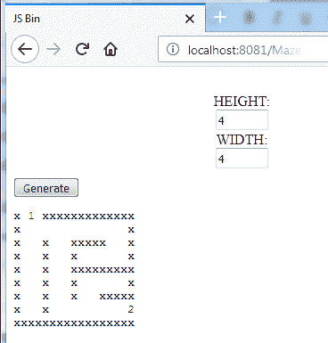
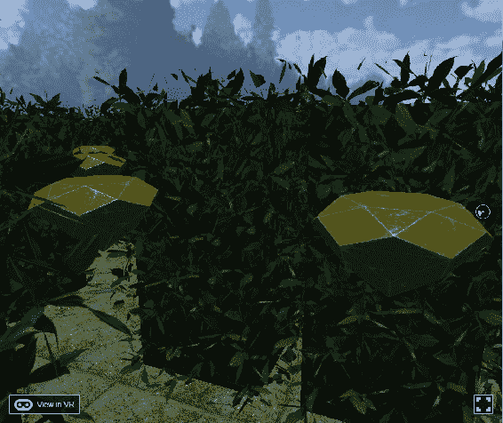
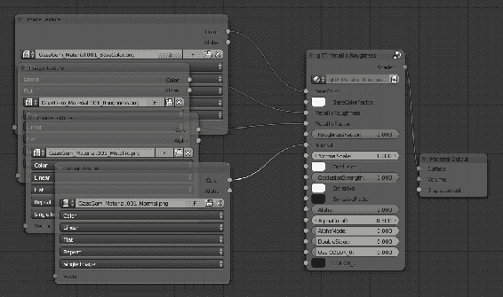
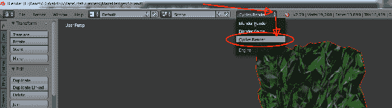
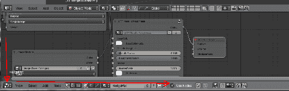
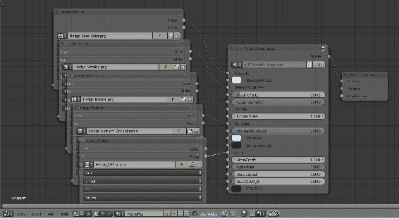
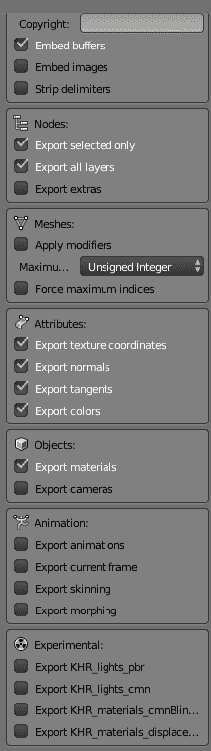

# 第十一章：走在野生的一边

到目前为止，在前面的章节中，我们已经建立了一些真实但小型的世界。

然而，有一些东西一直缺失。一开始，我谈到了 VR 作为一种可以互动的东西——一种现实，即使它看起来并不真实。到目前为止，我们所做的大部分是看和观察事物，但我们无法四处移动。

在本章中，我们将做到这一点。

你将学习以下主题：

+   使用 NPM 添加组件

+   凝视按钮

+   使用凝视按钮触发事件

+   添加 JavaScript 文件

+   将 JavaScript 文件转换为动态构建几何图形

+   在我们创建的世界中移动观点

+   移动使事物看起来更真实

+   更多关于 VR 控制器的信息

# 发疯了——VR 运动方式

我小时候晕车。VR 也会让你晕车——之前在介绍 VR 时已经讨论了这些原因，但这是一个非常重要的话题，所以值得重复。

如果你移动一个观点，独立于用户的行为（用户代理），大脑会知道它没有移动。然而，大脑也会看到世界通过你（VR）的眼睛移动。然后，大脑依赖于一个非常古老、重要的生存特征——你会认为自己中毒了。

当你中毒时，你的身体非常擅长呕吐。用不太临床的术语来说，你会呕吐。你的身体认为有什么东西试图杀死你，所以它只是想尽快摆脱胃里的任何东西，作为一种恐慌反应。

那么，在 VR 中如何移动？如何在不让人发疯的情况下启用 VR 运动方式？

# VR 运动方式的类型

讨论 VR 运动方式，至少要稍微讨论一下 VR 控制器。你手中拿着的东西，脚下的东西，支撑你的东西，或者让你在周围滚动的东西显然会产生巨大的影响。

我们正在讨论 WebVR，虽然对人们来说非常容易上手，但这可能意味着你的用户可能没有各种类型的 VR 装备。如果你确实有装备，你可能会发现对于你的应用程序，更简单的运动方式更好，而且编码速度肯定更快。

在讨论设备时，人们讨论**自由度**(**DOF**)。这实际上与严格考虑自由度有关，但主要是关于被跟踪的内容。

如果您有手持设备，您可能只有**3DOF**；这意味着电子设备可以跟踪您是否围绕其中心旋转。**6DOF**控制器是这样跟踪的，但它也可以检测自己是否在移动，换句话说，是在进行平移。通常，每个都有 3 个度。

6DOF 控制器更加逼真；您可以伸手触摸物体。然而，它们需要某种形式的跟踪，对于目前的行业状态来说，通常意味着外部跟踪器，比如 Vive 灯塔或 Oculus 摄像头。

还有一种称为*内部跟踪*的跟踪方式，这意味着头戴设备本身可以看到控制器并确定它们的位置。它们确实使用摄像头，只是不是散布在房间周围的外部摄像头。

很难将运动类型归类为无控制器的运动方式；它也可能与控制器（传送）一起很好地工作。

我不会真的包括四处移动头部（或四处移动鼠标），尽管那也是移动；没有这个，VR 系统实际上不是真正的 VR（按我的定义）。然而，确实有一些 VR 头戴设备不包括这个功能，或者做得不好。这是高端手机（三星 Gear VR 和 Google Daydream）和 PC 头戴设备 Vive 和 Rift 的真正突破。

考虑以下类型的 VR 运动：

+   **凝视检测**：您看着某物，它会激活一个效果，一个眨眼，或者让您移动

+   **车辆/驾驶舱运动**：您的视野显示墙壁或驾驶舱的细节

+   可以通过凝视检测移动

+   带有控制器（游戏手柄等）

+   定时/人工（按下按钮或在一段时间后移动玩家）

+   只有轻微的生病几率

+   **房间规模**：

+   四处走动（直到边界）

+   生病的几率非常低

+   需要硬件

+   **传送或眨眼**：

+   通常使用凝视或 3DOF 或 6DOF 控制器

+   传送也可以分成小步骤进行——消除运动（视觉加速）；这会让您感觉自己在移动，但不会让您感到恶心

+   **跑步机**：

+   一种您站在上面并移动脚，它会检测您的移动方式

+   还有滑翔伞模拟器和飞行模拟器，您可以躺下或坐下，通过移动身体重量来飞行

+   所有这些都很大且昂贵，通常只限于 VR 游乐场

+   **跟踪的 6DOF 控制器运动范式**：

+   Vive/Rift 通常使用传送，而 6DOF 控制器使其变得容易

+   有许多其他使用 6DOF 控制器的移动方式；一个好的列表可以在[`bit.ly/VRLoco`](http://bit.ly/VRLoco)找到

+   人工运动/轨道：

+   一旦你使用 UI 指示要做什么，VR 系统就会沿着一条路径将你移动。

+   凝视/头部控制的转向属于这一类。

+   很容易让人感到恶心。

+   如果你的头转动，它可能会很烦人；只需改变你的移动方式；即使你不会感到恶心，你也会感觉自己被带走了。不过，通过谨慎的实施，它也可以起作用。

围绕移动的方式当然受到你拥有多少硬件的限制。另一个限制是你想要多大的受众群体。如果你设计你的 VR 应用程序为房间规模（自然四处走动），你就排除了每个手机用户。然而，同样地，如果你决定使用凝视瞬移系统，那些拥有房间规模 VR 的人会感到沮丧，因为他们不能四处走动。

WebVR 目前更多地针对移动 VR，房间规模是一个很大的编程挑战。这是可能的，但在 React-VR 和 WebVR 中并没有内置。从硬件可用性的角度来看：

+   无需设备（Google Cardboard）：

+   自然运动（平移/倾斜）- 仅限少量

+   凝视检测

+   通过定时器或凝视检测的人工运动（'轨道'运动，就像你在轨道上）

+   带控制器的 VR 头盔（Gear VR，Daydream 等）：

+   现在我们有更好的方法，但仍然可以做所有以前的方法：

+   自然运动（平移/倾斜）- 仅限少量

+   凝视检测

+   通过定时器或凝视检测的人工运动（'轨道'运动，就像你在轨道上）

+   驾驶舱运动

+   通过控制器进行瞬间移动

+   操纵杆/控制器

+   PC VR–Vive/Rift：

+   现在我们有更好的方法，但仍然可以做所有以前的方法：

+   自然运动（平移/倾斜）- 仅限少量

+   凝视检测

+   通过定时器或凝视检测的人工运动（'轨道'运动，就像你在轨道上）

+   驾驶舱运动

+   通过控制器进行瞬间移动

+   操纵杆/控制器（在被跟踪的 6DOF 控制器上）

+   被跟踪的 6DOF 控制器运动范式

+   房间规模行走

+   高端设备：

+   全景虚拟跑步机或其他跑步机

# 避免幽灵效应

还有另一个原因，为什么我们希望人们能够在没有某种用户代理的情况下四处移动；没有移动，它真的不是虚拟现实。实际上，我们都在四处移动；猫在潜行时会侧着头。如果你感到好奇，你会歪着头。在 360 度视频中，一个挑战是你只能四处看看；你不能移动。歪着头真的没什么用。

360 度视频会发生什么，尽管它可能非常详细，但你会感觉自己像一个游荡的幽灵。你不能往下看到自己（尽管你可能会看到摄像机支架），你不能四处移动，也不能伸手触摸东西，也不能改变你的视角。如果你歪着头，或者左右移动，就没有视差效果。

我真的很喜欢 360 度视频，但我也觉得它并不真正是虚拟现实，因为最终你会感到游离，本质上是一个被束缚的幽灵。当然，视频可能会移动，但你无法改变它的移动方式；你只是随波逐流。

我对 WebVR 非常印象深刻的一个微妙之处是，如果你歪着头，VR 视图会稍微移动，就好像你在侧头。这是一个微妙的效果；它不是室内尺度的 VR，你不能四处走动，但它是一种 VR。你不会感觉自己像一个游荡的幽灵。

让人们探索他们的环境是很重要的；没有这一点，你真的会感觉自己像一个幽灵。在我们的例子中，我们将使用传送移动的隐喻，让人们探索一个迷宫。

没有与世界互动和移动的能力，你会感觉自己像一个游荡的幽灵。虽然我们几乎用了整本书的篇幅才达到这一点，但与环境和世界互动的能力是虚拟现实中最重要的事情之一。

在这一章中，你将能够使用任何 WebVR 客户端来做到这一点。如果我们知道每个人都有 HTC Vive 或室内尺度的 Oculus Rift，我们可以向你展示在迷宫中四处走动的代码，尽管这会带来一些有趣的用户界面问题——如果有人走过篱笆会怎么样？在我们获得全身触觉套装之前，你可以穿过虚拟墙。有一些使用用户界面来抵消这一点的方法，比如将屏幕短暂地变黑，然后将用户传送回起点，只是允许他们作弊（不好），或者其他有趣的方法来解决这个问题。

现在，我们将简单地允许用户移动到迷宫中的下一个单元格/开放位置，并且仅限于该位置。我们将使用凝视选择，这意味着当您盯着一个 UI 元素时，我们会知道您已经*点击*它。这将适用于市场上所有的 VR 设备，这真的是开始的最佳地点。更复杂的 UI 元素需要检查用户拥有的 VR 控制器和跟踪类型，并根据需要启用适当的移动。这超出了本书的范围。

在讨论如何在我们的世界中移动之前，我们需要有一些有趣的东西可以四处走动。例如，也许我们在森林中漫步，发现迷宫挡住了我们的去路，或者是清晨，我们想去一个小湖看清晨的雾。

让我们来建造那个迷宫。

# 建造迷宫

我们可以建造迷宫的几种方式。最直接的方法是启动我们的 3D 建模软件（比如 Blender）并用多边形创建一个迷宫。这样做效果很好，也可以非常详细。

然而，这也会很无聊。为什么？第一次通过迷宫会很激动，但几次尝试之后，你会知道通往目的地的路。当我们构建 VR 体验时，通常希望人们经常访问并每次都有愉快的时光。

建模的迷宫会很无聊。生命太短暂，没有时间做无聊的事情。

因此，我们希望随机生成一个“迷宫”。这样，您可以每次都改变“迷宫”，使其保持新鲜和不同。为了做到这一点，我们需要通过随机数来确保“迷宫”不会围绕我们移动，所以我们实际上希望用伪随机数来实现。要开始做到这一点，我们需要创建一个基本的应用程序。请转到您的 VR 目录并创建一个名为“WalkInAMaze”的应用程序：

```jsx
react-vr init WalkInAMaze
```

# 几乎随机-伪随机数生成器

为了有机会重播价值或能够比较不同人之间的分数，我们真的需要一个伪随机数生成器。基本的 JavaScript `Math.random()`不是伪随机生成器；它每次都会给你一个完全随机的数字。我们需要一个带有种子值的伪随机数生成器。如果你给随机数生成器相同的种子，它将生成相同的随机数序列。（它们并不是完全随机的，但非常接近。）随机数生成器是一个复杂的话题；例如，它们被用于密码学，如果你的随机数生成器不是完全随机的，有人可能会破解你的代码。

我们不太担心这一点，我们只是想要可重复性。尽管这方面的用户界面可能超出了本书的范围，但以一种点击*刷新*不会生成完全不同的`Maze`的方式创建`Maze`真的是一件好事，会避免用户的沮丧。这也将允许两个用户比较分数；我们可以为`Maze`持续一个*板号*，并显示这个。这可能超出了我们书的范围；然而，拥有可预测的`Maze`在开发过程中将会极大地帮助。如果没有这一点，你可能会在工作中迷失方向。（好吧，可能不会，但这样测试会更容易。）

# 包含来自其他项目的库代码

到目前为止，我已经向你展示了如何在 React VR（或 React）中创建组件。有趣的是，JavaScript 在`include`方面有一个历史问题。在 C++、Java 或 C#中，你可以在另一个文件中`include`一个文件或在项目中引用一个文件。在那之后，那些其他文件中的所有内容，比如函数、类和全局属性（变量），都可以从发出`include`语句的文件中使用。

在浏览器中，“包含”JavaScript 的概念有点不同。在 Node.js 中，我们使用`package.json`来指示我们需要哪些包。要将这些包引入我们的代码中，我们将在.js 文件中使用以下语法：

```jsx
var MersenneTwister = require('mersenne-twister');
```

然后，我们将创建一个新的随机数生成器并传递一个种子，而不是使用`Math.random()`。

```jsx
  var rng = new MersenneTwister(this.props.Seed);
```

从这一点开始，你只需要调用`rng.random()`而不是`Math.random()`。

目前，我们只需使用 `npm install <package>` 和 `require` 语句来正确格式化包。在下一章中，我们将讨论升级并修改 `package.json`，以确保代码正确地发布和更新。执行 `npm` 命令可以为您完成其中的大部分工作：

```jsx
npm install mersenne-twister --save
```

记住，--save 命令用于更新项目中的清单。在此期间，我们还可以安装另一个以后会用到的包：

```jsx
npm install react-vr-gaze-button --save
```

现在我们有一个很好的随机数生成器，让我们用它来复杂化我们的世界。

# 迷宫渲染()

我们如何构建一个 `Maze`？我想开发一些动态生成 `Maze` 的代码；任何人都可以在一个包中对其进行建模，但 VR 世界应该是活生生的。拥有能够动态构建 `Maze` 的代码（在一定程度上）将允许您重复玩您的世界。

有许多用于打印迷宫的 JavaScript 包。我选择了一个似乎无处不在的、公共领域的 GitHub 上的包，并对其进行了 HTML 修改。这个应用程序由两部分组成：`Maze.html` 和 `makeMaze.JS`。它们都不是 React，而是 JavaScript。它运行得相当不错，尽管数字并不真正代表宽度。



首先，我确保只有一个 `x` 在垂直和水平方向上显示。这样打印效果可能不好（行通常比列*高*），但我们正在构建一个虚拟的 `Maze`，而不是纸质的 `Maze`。

我们使用 `Maze.html`（`localhost:8081/vr/maze.html`）和 JavaScript 文件 `makeMaze.js` 生成的 `Maze` 现在看起来是这样的：

```jsx
x1xxxxxxx
x   x   x
xxx x x x
x x   x x
x xxxxx x
x x   x x
x x x x x
x   x   2
xxxxxxxxx
```

这有点难以阅读，但你可以数一下方块和 `x` 的数量。别担心，它会看起来更加花哨。现在我们已经让 HTML 版本的 `Maze` 工作了，我们将开始建造树篱。

这段代码比我预期的要长一些，所以我把它分成了几部分，并将 `Maze` 对象加载到 GitHub 上，而不是在这里粘贴整个代码，因为它太长了。您可以在以下链接找到源代码：[`bit.ly/VR_Chap11`](http://bit.ly/VR_Chap11)

# 添加地板和类型检查

正如我们之前讨论过的，360 全景背景的一个奇怪之处是，你似乎可以“漂浮”在地面上。除了修复原始图像之外，另一个解决方法就是简单地添加一个地板。这就是我们在太空画廊中所做的，看起来相当不错，因为我们假设我们在太空中漂浮。

对于这个版本，让我们`import`一个地面方块。我们可以使用一个大方块来包含整个`Maze`；然后如果`Maze`的大小发生变化，我们就必须调整它的大小。我决定使用一个较小的立方体，并对其进行修改，使其“位于”`Maze`的每个单元格下方。这将使我们在将来有一些余地，可以旋转方块以制作磨损的路径、水陷阱或其他东西。

为了制作地板，我们将使用一个简单的立方体对象，我稍微修改了它，并进行了 UV 映射。我用 Blender 做的这个。我们还`import`了一个`Hedge`模型和一个`Gem`，它将代表我们可以传送到的地方。在`Maze.js`内部，我们添加了以下代码：

```jsx
import Hedge from './Hedge.js';
import Floor from './Hedge.js';
import Gem from './Gem.js';
```

然后，在`Maze.js`内部，我们可以用以下代码实例化我们的地板：

```jsx
<Floor X={-2} Y={-4}/>
```

注意，当我们进行导入时，我们不使用'`vr/components/Hedge.js`'；我们在 Maze.js 内部。然而，在 index.vr.js 中包含 Maze 时，我们确实需要：

```jsx
import Maze from './vr/components/Maze.js';
```

然而，情况稍微复杂一些。在我们的代码中，当属性发生变化时，迷宫会构建数据结构；在移动时，如果迷宫需要重新渲染，它会简单地遍历数据结构并构建一个包含所有地板、传送目标和树篱的集合（mazeHedges）。鉴于此，要创建地板，在`Maze.js`中的代码实际上是：

```jsx
        mazeHedges.push(<Floor {...cellLoc} />);
```

在这里，我遇到了两个大问题，我会告诉你发生了什么，这样你就可以避免这些问题。最初，我一直在试图弄清楚为什么我的地板看起来像树篱。这个问题很容易——我们从`Hedge.js`文件中导入了`Floor`。地板看起来像树篱（你在我的前面的代码中注意到了吗？如果是的话，我是故意这样做的，作为一个学习经验。诚实地说）。

这是一个简单的修复。确保你的代码中有`import Floor from './floor.js';`注意`Floor`没有经过类型检查。（毕竟，这是 JavaScript。）我觉得这很奇怪，因为`hedge.js`文件导出了一个`Hedge`对象，而不是一个`Floor`对象，但请注意，你可以在`import`它们时重命名对象。

我遇到的第二个问题更像是一个简单的失误，如果你没有真正思考 React，很容易发生。你可能也会遇到这个问题。JavaScript 是一种可爱的语言，但有时我会想念一种强类型的语言。这是我做的：

```jsx
<Maze SizeX='4' SizeZ='4' CellSpacing='2.1' Seed='7' />
```

在`maze.js`文件中，我有这样的代码：

```jsx
for (var j = 0; j < this.props.SizeX + 2; j++) {
```

经过一些调试，我发现`j`的值从`0`变成了`42`。为什么会变成`42`而不是`6`呢？原因很简单。我们需要充分理解 JavaScript 才能编写复杂的应用程序。错误在于将 SizeX 初始化为`'4'`；这使它成为一个字符串变量。当从`0`（一个整数）计算`j`时，React/JavaScript 会取`2`，将其加到一个字符串`'4'`上，得到字符串`42`，然后将其转换为整数并赋给`j`。

当这样做时，非常奇怪的事情发生了。

当我们构建 Space Gallery 时，我们可以轻松地使用`'5.1'`的值作为输入到框中：

```jsx
<Pedestal MyX='0.0' MyZ='-5.1'/>
```

然后，在类中使用下面的转换语句：

```jsx
 transform: [ { translate: [ this.props.MyX, -1.7, this.props.MyZ] } ]
```

React/JavaScript 会将字符串值放入`This.Props.MyX`，然后意识到它需要一个整数，然后悄悄地进行转换。然而，当你得到更复杂的对象，比如我们的`Maze`生成时，你就逃不过这一点。

记住，你的代码并不是“真正”的 JavaScript。它是经过处理的。在本质上，这种处理是相当简单的，但其影响可能是致命的。

注意你所编写的代码。在 JavaScript 这样的弱类型语言中，再加上 React，你所犯的任何错误都会悄悄地转换成你意想不到的结果。

你是程序员。要正确编程。

所以，回到`Maze`。`Hedge`和`Floor`基本上是初始`Gem`代码的副本。让我们来看看我们的起始`Gem`，尽管请注意它后来变得更加复杂（以及在你的源文件中）：

```jsx
import React, { Component } from 'react';
import {
    asset,
    Box,
    Model,
    Text,
    View
} from 'react-vr';

export default class Gem extends Component {
    constructor() {
        super();
        this.state = {
            Height: -3 };
    }
    render() {
        return (
            <Model
                source={{
                    gltf2: asset('TeleportGem.gltf'),
                }}
                style={{
                    transform: [{ translate: [this.props.X, this.state.Height, this.props.Z] }]
                }}
            />
        );
    }
}
```

`Hedge`和`Floor`本质上是相同的东西。（我们本可以让一个 prop 成为加载的文件，但我们希望`Gem`有不同的行为，所以我们将大幅编辑这个文件。）

要运行这个示例，首先，我们应该像之前一样创建一个名为`WalkInAMaze`的目录。一旦你这样做了，从本章的 Git 源下载文件（[`bit.ly/VR_Chap11`](http://bit.ly/VR_Chap11)）。一旦你创建了应用程序，复制了文件并启动了它（进入`WalkInAMaze`目录并输入`npm start`），你应该看到类似这样的东西一旦你四处看看——除了有一个 bug。这就是迷宫应该看起来的样子（如果你在`Hedge.js`中使用文件`'MazeHedges2DoubleSided.gltf'`，在`<Model>`语句中）：



那么，我们是如何在游戏中得到那些看起来整洁的树篱的呢？（好吧，它们的多边形确实很低，但仍然可以。）Web 标准改进的速度之一是它们的新功能。现在，React VR 不仅支持.obj 文件格式，还可以加载 glTF 文件。

# 使用 glTF 文件格式进行建模

glTF 文件是一种新的文件格式，与 WebGL 非常自然地配合。有许多不同的 CAD 软件的导出器。我喜欢 glTF 文件的原因是，获得正确的导出相当简单。Lightwave OBJ 文件是行业标准，但在 React 的情况下，并非所有选项都被导入。一个主要的问题是透明度。OBJ 文件格式允许这样做，但在撰写本书时，这并不是一个选项。许多其他现代硬件可以处理的图形着色器无法用 OBJ 文件格式描述。

这就是为什么 glTF 文件是 WebVR 的下一个最佳选择。这是一种现代和不断发展的格式，正在努力增强功能，并在 WebGL 可以显示的内容和 glTF 可以导出的内容之间取得相当好的匹配。

然而，这是一章关于与世界互动的内容，所以我会简要提及如何导出 glTF 文件并提供对象，特别是`Hedge`，作为 glTF 模型。

从建模方面来看，glTF 的好处是，如果您使用它们的材质规范，例如 Blender，那么您就不必担心导出不够准确。今天的**基于物理的渲染**（**PBR**）倾向于使用金属/粗糙模型，这些比尝试将 PBR 材质转换为 OBJ 文件的镜面光照模型更容易导入。这是我用作凝视点的看起来金属质的`Gem`：



使用 glTF 金属粗糙模型，我们可以分配纹理贴图，例如 Substance Designer 等程序计算并轻松导入。结果看起来金属的地方看起来金属，油漆仍然保持的地方看起来暗淡。

我在这里没有使用环境遮挡，因为这是一个非常凸起的模型；表面凹陷更多的东西会与环境遮挡搭配得很棒。例如，对于建筑模型和家具，也会看起来很棒。

要转换您的模型，可以在[`bit.ly/glTFExporting`](http://bit.ly/glTFExporting)找到用户文档。您需要下载并安装 Blender glTF 导出器。或者，您可以直接下载我已经转换过的文件。如果您要进行导出，简而言之，您需要执行以下步骤：

1.  从[`bit.ly/gLTFFiles`](http://bit.ly/gLTFFiles)下载文件。您将需要`gltf2_Principled.blend`文件，假设您使用的是 Blender 的较新版本。

1.  在 Blender 中，打开您的文件，然后链接到新的材质。转到文件->链接，然后选择`gltf2_Principled.blend`文件。一旦您这样做了，进入“NodeTree”，然后选择 glTF 金属粗糙度（用于金属）或其他材质的 glTF 高光光泽。

1.  选择要导出的对象；确保选择 Cycles 渲染器。



1.  在窗口中打开节点编辑器（就像您在之前的章节中处理图像时所做的那样）。向下滚动到节点编辑器窗口的底部，并确保“使用节点”框被选中。



1.  通过节点菜单添加节点，添加->组->glTF 高光光泽或金属粗糙度。

1.  添加节点后，转到添加->纹理->图像纹理。添加与图像地图数量相同的图像纹理，然后将它们连接起来。您应该得到类似于这个图表的东西。



1.  要导出模型，我建议您禁用相机导出并合并缓冲区，除非您认为将要导出共享几何图形或材质的多个模型。我使用的导出选项如下：

现在，要包含导出的 glTF 对象，使用`<Model>`组件，就像使用 OBJ 文件一样，只是没有 MTL 文件。所有材质都在.glTF 文件中描述。要包含导出的 glTF 对象，只需将文件名作为`<Model`中的 gltf2 属性：



```jsx
 <Model
 source={{ gltf2: asset('TeleportGem2.gltf'),}}
...
```

要了解更多关于这些选项和流程的信息，您可以访问 glTF 导出网站：[`bit.ly/WebGLTF`](http://bit.ly/WebGLTF)。该网站还包括主要 CAD 软件的教程以及非常重要的 glTF 着色器（例如，我之前展示的 Blender 模型）。

我已经加载了几个.OBJ 文件和.glTF 文件，您可以在[`bit.ly/VR_Chap11`](http://bit.ly/VR_Chap11)上尝试不同的低多边形和透明度的组合。当在 React VR 版本 2.0.0 中添加了 glTF 支持时，我感到非常兴奋，因为透明度贴图对于许多 VR 模型非常重要，特别是植被；就像我们的树篱一样。然而，事实证明在 WebGL 或 three.js 中存在一个 bug，无法正确渲染透明度。因此，我在 GitHub 网站上的文件中选择了低多边形版本；上面的图片是使用`Hedges.js`文件中的`MazeHedges2DoubleSided.gltf`文件（在 vr/components 中）。

如果您遇到 404 错误，请检查 glTF 文件中的路径。这取决于您使用的导出器——如果您使用的是 Blender，Khronos 组的 gltf2 导出器会正确计算路径，但 Kupoman 的导出器有选项，您可能会导出错误的路径。

# 动画 — VR 按钮

好了！我们想要做一些动画。为了做到这一点，我们将使用 VRButton。当发生以下情况之一时，它会激活：

+   XBox 游戏手柄上的 A 按钮

+   键盘上的空格键

+   用鼠标左键单击

+   屏幕上的触摸

不幸的是，我们的“最低公共分母”是 Google Cardboard，可能有，也可能没有按钮。您不想不得不把手指伸进去尝试触摸屏幕。（说了这些之后，更新的 VR 头盔有一个小杠杆可以戳屏幕，即使是在实际的硬纸板版本中）。我们将使用*凝视按钮*。当鼠标指针或屏幕中心（由一个小点标记）悬停在您的对象上时，事件将被调用，我们的代码将处理这个问题。

凝视按钮也被打包成了`npm`生态系统中的一个漂亮的`<GazeButton>`对象。请参考网页：[`bit.ly/GazeButton`](http://bit.ly/GazeButton)。要使用它，我们需要了解它的功能，以及如何让视图知道一个`Gem`已经被“触摸”（或者被观察了两秒）。我们在本章的前面已经安装了它；如果你到目前为止还没有安装，我们可以通过使用 Node.js 命令提示符并输入以下命令来安装它：

```jsx
npm install react-vr-gaze-button
```

我们可以使用 VR 按钮，但那样我们就必须处理进入对象、离开对象、倒计时等等。`GazeButton`会为我们处理所有这些。请注意，它对子元素的期望方式与我们到目前为止所习惯的方式有些不同。

现在，您的`Gem.js`代码（注意大写）应该如下所示：

```jsx
import GazeButton from 'react-vr-gaze-button'
export default class Gem extends Component {

  constructor() {
    super();
    this.state = {
      Height: -3,
      buttonIsClicked: false
    };
  }
  onGemClicked() {
    this.setState({ buttonIsClicked: true });
    console.log("Clicked on gem " + this.props.X + " x " + this.props.Z);
  }
  render() {
    const { buttonIsClicked } = this.state
    return (
      <GazeButton onClick={() => this.onGemClicked()}
        duration={2000}>
        {time => (

          <Model
            source={{
              gltf2: asset('TeleportGem.gltf'),
            }}
            style={{
              transform: [{ translate: [0, -1, 0] }]
            }}
            style={{
              transform: [{ translate: 
                [this.props.X, this.state.Height, this.props.Z] }]
            }}
          />
        )}
      </GazeButton>
    );
  }
}
```

现在，当我们在桌面上尝试这样做时，似乎可以工作，但在手机上（我尝试了三星 GearVR），没有光标，也没有可以点击的东西。我们需要实现一个射线投射器（即使没有控制）。

正如我们在本章开头简要讨论的那样，有许多不同类型的 VR 控制系统，默认情况下是“没有”VR 输入设备，包括屏幕中心光标。

适当的控制系统的实施在我们手中。

当您使用桌面浏览器进行初始开发时，您会得到一个鼠标光标（包括在跟踪组件上时的*手*光标），这可能意味着内置了注视光标；实际上并没有。只需意识到这是有合理理由的。

# 射线投射器

**射线投射器**向世界发射一条射线并计算它触及了什么。通常您会看到这些作为 VR 控制器发出的发光线。没有控制器时，射线投射器将从屏幕中心发射一条射线；这正是我们需要实现我们的注视按钮的地方。

在这种情况下，就像我们对按钮所做的那样，已经有一个`simple-raycaster`。如果您还没有安装它，您需要通过以下命令从`npm`安装它：

```jsx
npm install --save simple-raycaster
```

在尝试使用软件包时，您可能希望跳过`--save`; 如果您这样做，请记得手动更新您的`package.json`文件，或者通过适当的工具进行更新。

实现`simple-raycaster`非常容易。在`client.js`中，在现有的`import`行（VRInstance）下面，添加以下`import`语句：

```jsx
import * as SimpleRaycaster from "simple-raycaster";
```

在“//在此处添加自定义选项”处，插入以下行：

```jsx
    raycasters: [
         SimpleRaycaster // Add SimpleRaycaster to the options
    ],
    cursorVisibility: "auto", // Add cursorVisibility
```

在您的 PC 上，此时情况会有点奇怪——屏幕中心会激活（并丢弃）宝石，即使您没有点击。这正是整个重点。

如果我们有更多的页面，当你的目光进入宝石时，我们会让宝石旋转。但现在，我们将把这个练习留给读者。

您将希望在`onClick`处理程序中开始动画。

到目前为止，我们已经展示了当注视宝石时如何获得事件。这很好，我们可以使用事件来触发移动，但我们如何移动呢？

有一件有点奇怪的事情是，React VR 没有像许多图形系统那样移动摄像头的方法。要移动当前的视角，你需要在`index.vr.js`的开头将`<View>`向相反方向进行平移；这会使世界中的一切朝相反方向移动，看起来就像你在向前移动。要移动视角，我们需要将点击事件从`Gem`传递给其父级的父级（顶级 View）。

# Props，state 和 events

React，以及 React VR，在其核心，以可预测、确定的方式处理 props、事件和状态，这就是使 React 应用程序保持一致、清晰且易于维护的原因。

当对象声明时创建 props，并且在对象的生命周期内不应更改。如果对象需要更改，例如我们的传送门宝石，那么应将这些值分配给`state`。这强制实现了自顶向下的单向数据流。如果组件在不同区域需要相同的状态，那么该`state`应该被提升到最高级的父级。

这会引发有趣的问题，如果你想让一个子组件告诉父组件有关事件的信息，或者根据较低级别的事件改变其状态。

处理这个问题有几种方法；在 React 世界中，这可能是一个复杂的主题。React VR 在处理状态、props 和事件方面与 React Native 或 React 没有区别。一个很好的起点是 React 文档中的*State and Lifecycle*。

基本上，在 React 应用程序中，应该有一个用于变化的单一真相来源。如果父级不关心，例如`Gem`是更高还是更低（被踩或未被踩），那么你不需要让父级跟踪其子级的高度。将`state`保持在尽可能低的级别是正确的决定。高度可以从“我们是否踩了`Gem`”中计算出来，因此不应该是传递下来的 prop。（尽管在很多书籍文件中，出于简洁起见，我们已经硬编码了值，但你可能会考虑*起始高度*作为一个 prop；良好的编程规范说不要硬编码值。）

在我们的迷宫世界中，我们遇到了一个困境。我们通过改变世界树顶部的`<View>`节点来移动视角。然而，当我们点击每个`<Gem>`时，我们希望视图发生变化。

我们可以用上下文来处理这个问题；许多库，比如 Redux 或 MobX，在内部使用上下文。还有一些使用上下文和其他功能的事件库。然而，上下文是一个有点高级的概念，对于我们正在做的事情来说有点过度。

在这种特殊情况下，我们将简单地将一个“回调”函数传递到子树中。我们这样做的原因如下：

+   此时，从层次结构的角度来看，我们的应用程序相当小，只有三个级别。

+   “迷宫”本身可能需要知道用户何时到达终点（例如，显示烟花或更新高分）。“宝石”不知道这一点。如果“宝石”直接向视图发送通知，那么“迷宫”将永远不知道。

+   我们可以引入额外的库，但这是一个简单的项目，在开源世界中太多外部依赖可能会导致问题。通常这不是一个大问题，如果出了问题，那就是开源的，去修复它。

如果在寻找外部包时出现问题，你需要卸载有问题的包，然后通过运行以下命令重新启动你的 Node.js 服务器：

`npm start -- --reset-cache`

`npm cache clean --force`不会执行此缓存重置。如果你忘记了，你得到的错误消息应该指出这一点。

# 使更新向上流动

尽管更新会传播下来，但我们需要传递信息。我们怎么做？很简单，用一个功能性的“回调”。

在`index.vr.js`中，创建一些例行程序，并将这些例行程序与`WalkInAMaze`组件进行重要的绑定。在这一点上，我只展示了更改的行：

```jsx
constructor(props) {
  super(props);
  this.state = {
    // ... existing member state initialization
  }
  this.handleClickGem = this.handleClickGem.bind(this); 
};

onClickFloor(X, Z) {
  this.setState({ newX: X, newZ: Z });
}

handleClickGem(X, Z) {
  this.setState({ newX: X, newZ: Z });
};
```

在我们的`Gem.js`中，我们已经有一个`onClick`方法。我们只需要添加一些新的`props`：

```jsx
    onGemClicked() {
        this.setState({ buttonIsClicked: true });
        //send it to the parent
        this.props.onClickGem(this.props.X, this.props.Z);
    }
```

现在，这个`this.props.onClickGem`是什么？这是一个从父级传递的函数 prop。在我们创建“宝石”时，我们只需插入以下 prop（加粗的插入行，注意源代码不能加粗）：

```jsx
... 
mazeHedges.push(<Gem {...cellLoc}
 onClickGem={this.handleClickGem}
  />);
```

好的，我们从哪里得到`this.handleClickGem`？在这个（简单）情况下，“迷宫”不会对事件做任何处理，只是将其传递。在`Maze.js`中，我们将添加一个处理程序：

```jsx
constructor(props) {
  super(props);
  // existing code here doesn't change
  // at the bottom:
  this.handleClickGem = this.handleClickGem.bind(this);
}

handleClickGem(X, Z) {
  this.props.onClickGem(X, Z);
}
```

现在，我们注意到这里还有另一个 prop。这当然是由迷宫的父级传递给我们的；所以，在`index.vr.js`中，添加（加粗）这一行：

```jsx
<Maze sizeX={this.state.sizeX} sizeZ={this.state.sizeZ} 
  cellSpacing={this.state.cellSpacing} seed={this.state.seed}
  onClickGem={this.handleClickGem} />
```

基本上就是这样。当`Gem`的 VR 注视按钮检测到点击时会发生什么？它调用了一个函数作为 prop。这会导致迷宫的`handleClickGem`被调用；它反过来调用了`index.vr.js`中的`handleClickGem()`。这个例程（双关语）然后设置内部状态。这个状态导致视图重新渲染：

```jsx
handleClickGem(X, Z) {
        this.setState({ startX: -X, startZ: -Z });
    };
```

就是这样。请注意，你不仅仅通过`this.startX = -X`来设置`state`，你需要像前面的代码中所示调用`this.setState()`。然后这个例程将处理`render()`更新的传递。

这些都是大文件，我们刚刚做了很多改变。我在上面标出了重要的行，但我强烈建议你从[`bit.ly/VR_Chap11`](http://bit.ly/VR_Chap11)下载源文件并看看我们做了什么。在其中，我建立了一个 4x4 的迷宫，应该在大多数 PC 和移动设备上有合理的帧率。你可以尝试一些其他版本的各种对象（看起来像树篱或低多边形树篱）。

# 接下来怎么办？

这是一个相当基础的游戏，但你可以做很多事情。我们之前讨论过的一些东西，很容易包括在内，比如：

+   我们的传送有点突然。我们应该有声音，或者甚至通过改变`HandleClickGem()`例程进行两次更新，以添加一个简短的动画或两步传送。请注意，通常不建议平滑地动画化视图本身；这会让人们感到不适，因为他们的眼睛说他们在移动，但他们的身体说没有。

+   点击的宝石数量可以成为得分。这使我们有优势可以慢慢前进，一步一步地点击所有的宝石。

+   你可以计时到达出口所需的时间，较短的时间可以增加你的得分。这使得快速前进并跳过传送宝石有优势。这两个目标是互斥的，通过平衡可以使游戏变得有趣。

+   你可以在迷宫前面加入按钮来增加/减少大小或生成不同的随机数（并显示它们）。

+   得分和随机数可以加载到高分 API 中。

+   事件传递库，比如`eventing-bus`，使传递`props`变得更容易。我的目标是向你展示 React VR 的做法。

# 总结

在本章中，我们学习了构建完整的网络应用程序和游戏的最后一部分；再加上我们之前学到的知识，我们的旅程几乎已经完成；这实际上只是将现实带到网络的第一步。我们讨论了如何在 VR 世界中移动，包括基本的传送机制。我们讨论了凝视按钮和使用射线投射来实现它们。我们讨论了`props`，`state`和事件的重要机制。为了实现这些流程，我们复习了重要的 React 哲学，即将`state`向上传递并处理下游事件。我们还讨论了使用伪随机数生成器来确保我们的`props`和`state`不会发生混乱性变化。总的来说，我们现在知道如何创建、在其中移动，并使世界对我们做出反应。

在下一章中，我们将讨论接下来该怎么做，如何升级 React VR，以及如何在互联网上发布你的虚拟世界。
