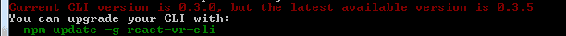
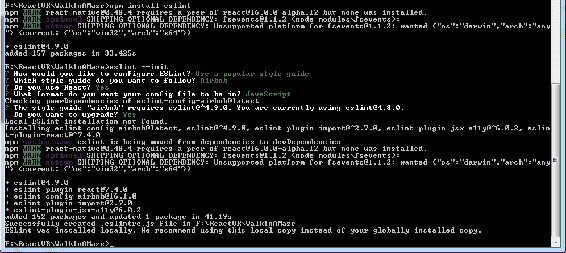
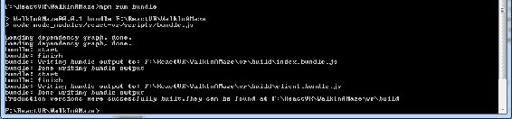

# 第十二章：发布您的应用程序，以及接下来要做什么

在家中开发和体验虚拟世界是很有趣的。但最终，您希望世界能看到您的世界。为了做到这一点，我们需要打包和发布我们的应用程序。在开发过程中，可能会出现对 React 的升级；在发布之前，您需要决定是否需要“冻结代码”并使用稳定版本进行发布，或者升级到新版本。这是一个设计决策。

在某个时候，您将需要升级，并且您将需要发布。本章将解释如何同时做到这两点，以及如何组织您的代码并检查您的干衣机和代码是否有 lint。我们将在这里涵盖以下主题：

+   升级类型：Rip and Replace 或“Facelift”升级，或“现场升级”

+   如何确保您的组件的正确版本存在

+   开发与非开发版本、组件和库

+   分发许可证

+   链接和嵌入 VR 内容

+   发布到常见的 Web 主机和内容交付网络。

+   未来 5 年 VR 的发展方向

# 升级 React VR

其中一个很棒的事情，尽管可能会令人沮丧，是 Web 项目经常会更新。在编写本书时，React VR 已经更新。有几种不同的升级方式：

+   您可以安装/创建一个同名的新应用程序

+   然后您将转到您的旧应用程序并复制所有内容

+   这是一种**facelift**升级或*Rip and Replace*

+   进行更新。主要是对`package.json`进行更新，然后删除`node_modules`并重新构建。这是一种**现场升级**。

您可以选择使用哪种方法，但主要区别在于现场升级有点更容易——无需修改和复制源代码——但可能有效也可能无效。Facelift 升级还取决于您是否使用了正确的`react-vr-cli`。每当您从命令提示符运行 React VR 时，都会有一个通知告诉您它是否过时：

当您从命令提示符运行 React VR 时，关于升级的错误或警告可能会很快地飞过。运行需要一段时间，所以您可能会离开一会儿去喝杯咖啡。

认真关注红线。

要进行就地升级，通常会从 Git 那里收到更新通知，如果您已经订阅了该项目。如果没有，您应该转到：[`bit.ly/ReactVR`](http://bit.ly/ReactVR)，创建一个帐户（如果您还没有），然后单击眼睛图标加入观察列表。然后，每次有升级时，您都会收到一封电子邮件。我们将介绍最简单的升级方式——就地升级，首先。

# 就地升级

您如何知道您安装了哪个版本的 React？从 Node.js 提示符中，键入以下内容：

```jsx
npm list react-vr
```

还要检查`react-vr-web`的版本：

```jsx
npm list react-vr-web
```

检查`react-vr-cli`（命令行界面，实际上只用于创建*hello world*应用程序）的版本。

```jsx
npm list react-vr-cli 
```

检查`ovrui`（open VR 的用户界面）的版本：

```jsx
npm list ovrui
```

您可以根据文档中的版本进行检查。如果您已经在 GitHub 上订阅了 React VR（您应该这样做！），那么您将收到一封电子邮件告诉您有升级。请注意，CLI 还会告诉您是否过时，尽管这仅适用于创建新应用程序（文件夹/网站）时。

发布说明在：[`bit.ly/VRReleases`](http://bit.ly/VRReleases)。在那里，您将找到升级的说明。升级说明通常要求您执行以下操作：

1.  删除您的`node_modules`目录。

1.  打开您的`package.json`文件。

1.  将`react-vr`，`react-vr-web`和`ovrui`更新为"新版本号"，例如 2.0.0。

1.  将`react`更新为"a.b.c"。

1.  将`react-native`更新为"~d.e.f"。

1.  将`three`更新为"^g.h.k"。

1.  运行`npm` install 或 yarn。

请注意~和^符号；~版本表示*大致等于版本*，^版本表示*与版本兼容*。这是一个帮助，因为您可能有其他包可能需要其他版本的`react-native`和`three`。要获取{a...k}的值，请参考发布说明。

我还发现您可能需要在`package.json`的`devDependencies`部分中包含这些模块：

```jsx
"react-devtools": "².5.2",
"react-test-renderer": "16.0.0",
```

您可能会看到此错误：

```jsx
module.js:529
 throw err;
 ^
Error: Cannot find module './node_modules/react-native/packager/blacklist'
```

如果您这样做，请在项目的根目录中进行以下更改

`rncli.config.js`文件。

将`var blacklist = require('./node_modules/react-native/packager/blacklist');`行替换为`var blacklist = require('./node_modules/metro-bundler/src/blacklist');`。

# 第三方依赖

如果你一直在尝试实验并使用`npm install <something>`添加模块，你可能会发现，在升级后，事情不起作用。`package.json`文件也需要知道你在实验过程中安装的所有额外包。这是项目方式（npm 方式）确保 Node.js 知道我们需要特定的软件。如果你遇到这个问题，你需要使用`--save`参数重复`install`，或者编辑你的`package.json`文件中的`dependencies`部分。例如（我加粗的那行），在上一章中我们尝试随机数时，我们可以手动添加这行：

```jsx
{
  "name": "WalkInAMaze",
  "version": "0.0.1",
  "private": true,
  "scripts": {
    "start": "node -e \"console.log('open browser at http://localhost:8081/vr/\\n\\n');\" && node node_modules/react-native/local-cli/cli.js start",
    "bundle": "node node_modules/react-vr/scripts/bundle.js",
    "open": "node -e \"require('xopen')('http://localhost:8081/vr/')\"",
    "devtools": "react-devtools",
    "test": "jest"
  },
  "dependencies": {
    "ovrui": "~2.0.0",
    "react": "16.0.0",
    "react-native": "~0.48.0",
    "three": "⁰.87.0",
    "react-vr": "~2.0.0",
    "react-vr-web": "~2.0.0",
    "mersenne-twister": "¹.1.0"
  },
  "devDependencies": {
    "babel-jest": "¹⁹.0.0",
    "babel-preset-react-native": "¹.9.1",
    "jest": "¹⁹.0.2",
    "react-devtools": "².5.2",
    "react-test-renderer": "16.0.0",
    "xopen": "1.0.0"
  },
  "jest": {
    "preset": "react-vr"
  }
}
```

再次强调，这是手动的方法；更好的方法是使用`npm install <package> -save`。

`-s`限定符将你安装的新包保存在`package.json`中。手动编辑可以确保你得到正确的版本，如果出现版本不匹配的情况。

如果你尝试安装和移除足够多的包，最终会搞乱你的模块。即使删除了`node_modules`后仍然出现错误，可以使用以下命令：

`npm cache clean --force`

`npm start -- --reset-cache`

单独的缓存清理不起作用；你需要`reset-cache`，否则问题包仍然会被保存，即使它们实际上不存在！

# 真的坏掉的升级 - 拆除和替换

然而，即使经过所有这些工作，你的升级*仍然*不起作用，也不是没有希望。我们可以进行*拆除和替换*升级。请注意，这有点像“最后的手段”，但它确实效果相当不错。按照以下步骤操作：

1.  确保你的`react-vr-cli`包是全局最新的：

```jsx
[F:\ReactVR]npm install react-vr-cli -g
C:\Users\John\AppData\Roaming\npm\react-vr -> C:\Users\John\AppData\Roaming\npm\node_modules\react-vr-cli\index.js
+ react-vr-cli@0.3.6
updated 8 packages in 2.83s
```

这很重要，因为当 React 有新版本时，你可能没有最新的`react-vr-cli`。它会在你使用它时告诉你有新版本发布了，但那行经常会滚动过去；如果你感到无聊并且没有注意到，你可能会花费很长时间尝试安装更新的版本，但却毫无结果。

npm 会生成大量的文字，但重要的是要阅读它说了什么，尤其是红色格式的行。

1.  确保所有 CLI（DOS）窗口、编辑会话、Node.js 运行的 CLI 等都已关闭。（但是你不需要重新启动；只需关闭使用旧目录的所有内容）。

1.  将*旧*代码重命名为`MyAppName140`（在旧的`react-vr`目录末尾添加版本号）。

1.  使用`react-vr init MyAppName`创建应用程序，换句话说，就是原始应用程序名称。

1.  下一步最容易使用差异程序（参考[`bit.ly/WinDiff`](http://bit.ly/WinDiff)）。我使用 Beyond Compare，但也有其他选择。选择一个并安装它，如果需要的话。

1.  比较两个目录，`.\MyAppName`（新）和`.\MyAppName140`，看看哪些文件已更改。

1.  从旧应用中移动任何新文件，包括资产（您可能可以复制整个 static_assets 文件夹）。

1.  合并任何已更改的文件，除了`package.json`。通常，您需要合并这些文件：

+   `index.vr.js`

+   `client.js`（如果您已更改）

1.  对于`package.json`，查看已添加了哪些行，并通过 npm `install <missed package> --save`在新应用程序中安装这些包，或者启动应用程序并查看缺少了什么。

1.  删除*hello world*应用程序种子的任何文件，例如`chess-world.jpg`（除非您当然正在使用该背景）。

1.  通常情况下，您不会更改`rn-cli.config.js`文件（除非您修改了种子版本）。

大多数代码将直接移动过来。确保如果更改了目录名称，则更改应用程序名称，但根据前述的指示，您不必这样做。

如果 React VR 有大规模的更改，前述的升级步骤可能会稍微容易一些；这将需要一些对源文件的挑选。源代码非常直接，所以在实践中应该很容易。

我发现如果自动升级没有起作用，这些技术将效果最佳。

# 进行升级的最佳时间

如前所述，进行重大升级的时间可能不是在发布应用程序之前，除非有一些新功能是必需的。您希望充分测试您的应用程序，以确保没有任何错误。

我在这里包括升级步骤，但不是因为您应该在发布之前立即执行。

# 准备好发布您的代码

老实说，您永远不应该推迟整理衣服，直到，哦，等等，我们在谈论代码。您不应该推迟整理代码，直到您想要发布的那天晚上。即使您认为是临时的代码，也可能最终投入生产。从一开始就学习良好的编码习惯和风格。

# 良好的代码组织

从一开始就良好的代码对许多原因非常重要：

+   如果您的代码缩进混乱，那么阅读起来会更加困难。许多代码编辑器，如 Visual Studio Code，Atom 和 Webstorm，都会为您格式化代码，但不要依赖这些工具。

+   糟糕的命名约定可能会隐藏问题。

+   变量的不正确用法可能会隐藏问题，比如使用`this.State`而不是`this.state`。

+   编码的大部分时间，高达 80%，都是在维护。如果你看不懂代码，就无法维护它。当你作为一名初学者程序员时，你经常会认为自己永远能读懂自己的代码，但当几年后你拿起一段代码并说“谁写的这破玩意？”然后意识到是你自己时，你就会停止使用像 a、b、c、d 这样的变量名。

+   大多数软件在某个时候都会被其他人维护、阅读、复制或使用，而不是作者本人。

+   大多数程序员认为代码标准是给“别人”准备的，但却抱怨自己必须写好代码。那么是谁来做呢？

+   大多数程序员会立刻要求代码文档，并在找不到时翻白眼。我通常会要求看他们上一个项目的文档。我雇佣的每个程序员通常都会露出茫然的表情。这就是为什么我通常要求代码中有良好的注释。

+   一个好的注释不是这样的：

```jsx
//count from 99 to 1
for (i=99; i>0; i--)
    ... 
```

+   +   一个好的注释是这样的：

```jsx
//we are counting bottles of beer
for (i=99; i>0; i--)
    ... 
```

# 清理绒毛滤网（检查代码标准）

当你洗衣服时，绒毛会堆积，最终会堵塞你的洗衣机或烘干机，或者引发火灾。在 PC 世界中，旧代码、打字不好的名称等也会堆积起来。

**重构**是清理代码的一种方法。我*强烈*建议你使用某种版本控制，比如 Git 或 bitbucket 来检查你的代码；在重构时，完全有可能彻底搞砸你的代码，如果你不使用版本控制，可能会丢失很多工作。

在发布之前，对你的工作进行代码审查的一个很好的方法是使用**linter**。Linter 会检查你的代码并指出问题（垃圾）、不正确的语法，可能与你意图不同的东西，并且通常会尽力整理你的房间，就像你妈妈一样。虽然你可能不喜欢你妈妈这样做，但这些工具是非常宝贵的。毕竟，计算机非常挑剔，为什么不让它们互相对抗呢？

让软件检查你的 JavaScript 代码的最常见方法之一是一个名为**ESLint**的程序。你可以在这里了解更多信息：[`bit.ly/JSLinter`](http://bit.ly/JSLinter)。要安装 ESLint，你可以像大多数软件包一样通过 npm 来安装——`npm install eslint --save-dev`。

`--save-dev`选项在你开发项目时会对你的项目有要求。一旦你发布了你的应用程序，你就不需要将 ESLint 信息与你的项目一起打包了！

还有一些其他事情你需要做才能让 ESLint 正常工作；阅读配置页面并完成教程。很大程度上取决于你使用的 IDE。例如，你可以在 Visual Studio 中使用 ESLint。

安装了 ESLint 之后，你需要配置一个本地配置文件。使用以下命令完成：

`eslint --init`。

`--init`命令将显示一个提示，询问你如何配置它将遵循的规则。它会问一系列问题，并询问要使用什么样的风格。AirBNB 是相当常见的，尽管你可以使用其他的；没有错误的选择。如果你在公司工作，他们可能已经有标准，所以请向管理层确认。其中一个提示将询问你是否需要 React。

# React VR 编码风格

**编码风格**几乎可以说是宗教，但在 JavaScript 和 React 世界中，一些标准是非常普遍的。AirBNB 在这里有一个很好的、相当受推崇的样式指南：[`bit.ly/JStyle`](http://bit.ly/JStyle)。

对于 React VR，一些要考虑的样式选项如下：

+   变量名的第一个字母使用小写。换句话说，使用 this.props.currentX，而不是 this.props.CurrentX，并且不要使用下划线（这被称为**驼峰命名法**）。

+   只有在命名构造函数或类时才使用**帕斯卡命名法**。

+   由于你在文件中使用帕斯卡命名法，所以文件名要与类名匹配，因此

导入`MyClass from './MyClass'`。

+   小心 0 与{0}。一般来说，学习 JavaScript 和 React。

+   始终使用`const`或`let`声明变量，以避免污染全局命名空间。

+   避免使用++和--。这对我来说很难，因为我是一个 C++程序员。希望在你读到这篇文章时，我已经在源代码示例中修复了它。如果没有，那就照我说的做，而不是照我做的做！

+   学习==和===之间的区别，并正确使用它们，这对于 C++和 C#程序员来说是新的。

总的来说，我强烈建议你仔细研究这些编码风格，并在编写代码时使用一个代码检查工具：



# 第三方依赖

为了使您发布的网站/应用程序真正可靠地工作，我们还需要更新`package.json`；这是一种“项目”方式，确保 Node.js 知道我们需要特定的软件。我们将编辑`"dependencies"`部分以添加最后一行（我加粗的部分，加粗在文本编辑器中不会显示出来，显然！）：

```jsx
{
  "name": "WalkInAMaze",
  "version": "0.0.1",
  "private": true,
  "scripts": {
    "start": "node -e \"console.log('open browser at http://localhost:8081/vr/\\n\\n');\" && node node_modules/react-native/local-cli/cli.js start",
    "bundle": "node node_modules/react-vr/scripts/bundle.js",
    "open": "node -e \"require('xopen')('http://localhost:8081/vr/')\"",
    "devtools": "react-devtools",
    "test": "jest"
  },
  "dependencies": {
    "ovrui": "~2.0.0",
    "react": "16.0.0",
    "react-native": "~0.48.0",
    "three": "⁰.87.0",
    "react-vr": "~2.0.0",
    "react-vr-web": "~2.0.0",
    "mersenne-twister": "¹.1.0"
  },
  "devDependencies": {
    "babel-jest": "¹⁹.0.0",
    "babel-preset-react-native": "¹.9.1",
    "jest": "¹⁹.0.2",
    "react-devtools": "².5.2",
    "react-test-renderer": "16.0.0",
    "xopen": "1.0.0"
  },
  "jest": {
    "preset": "react-vr"
  }
}
```

这是手动的方法；更好的方法是使用`npm install <package> -s`。

`-s` 限定符将安装的新软件包保存在`package.json`中。手动编辑可以确保您拥有正确的版本，如果出现版本不匹配的情况。

如果您尝试安装和删除足够多的软件包，最终会搞乱您的模块。如果删除`node_modules`后仍然出现错误，请发出以下命令：

`npm start -- --reset-cache`

`npm cache clean --force`

仅进行缓存清理是不够的；您需要重置缓存，否则问题软件包仍将被保存，即使它们在物理上不存在！

# 在网络上发布捆绑

假设您已经正确设置了项目依赖项，以便通过 ISP 或服务提供商从 web 服务器运行项目，您需要“捆绑”它。React VR 有一个脚本，可以将所有内容打包成几个文件。

当然，您的台式机也算是“web 服务器”，尽管我不建议您将开发机暴露在网络上。让其他人体验您的新虚拟现实的更好方法是将其捆绑并放在商业网络服务上。

# 为在网站上发布 React VR 进行打包

使用 React VR 提供的脚本，基本流程很容易：

1.  转到通常运行`npm start`的 VR 目录，并运行`npm run bundle`命令：



1.  然后，您将以与通常上传文件相同的方式转到您的网站，并创建一个名为`vr`的目录。

1.  在您的项目目录中，在我们的案例中是`f:\ReactVR\WalkInAMaze`，在`.\VR\Build`中找到以下文件：

`client.bundle.js`

`index.bundle.js`

1.  将它们复制到您的网站上。

1.  创建一个名为`static_assets`的目录。

1.  将您的所有文件（您的应用程序使用的文件）从`AppName\static_assets`复制到新的`static_assets`文件夹。

1.  确保您为所有内容设置了 MIME 映射；特别是，.obj、.mtl 和.gltf 文件可能需要新的映射。请查阅您的 web 服务器文档：

+   对于 gltf 文件，使用`model/gltf-binary`。

+   任何被 gltf 使用的.bin 文件应为`application/octet-stream`

+   对于.obj 文件，我使用了`application/octet-stream`

+   官方列表位于[`bit.ly/MimeTypes`](http://bit.ly/MimeTypes)

+   非常一般地说，`application/octet-stream`将以服务器上的文件的“原样”发送，因此这在某种程度上是一种通用的“捕获所有”

1.  将`index.html`从应用程序的根目录复制到您发布应用程序的网站目录中；在我们的情况下，它将是`vr`目录，因此该文件与两个.js 文件并列。

1.  修改`index.html`的以下行（请注意更改为`./index.vr`）：

```jsx
<html>
  <head>
    <title>WalkInAMaze</title>
    <style>body { margin: 0; }</style>
    <meta name="viewport" content="width=device-width, initial-scale=1, user-scalable=no">
  </head>
  <body>
    <!-- When you're ready to deploy your app, update this line to point to your compiled client.bundle.js -->
 <script src="./client.bundle?platform=vr"></script>
    <script>
      // Initialize the React VR application
      ReactVR.init(
        // When you're ready to deploy your app, update this line to point to
        // your compiled index.bundle.js
 './index.vr.bundle?platform=vr&dev=false',
        // Attach it to the body tag
        document.body
      );
    </script>
  </body>
</html>
```

请注意，对于生产发布，这意味着如果您指向静态 Web 服务器上的预构建捆绑包而不是 React Native 捆绑器，则开发和平台标志实际上不会起作用，因此`dev=true`，`dev=false`或甚至`dev=foobar`之间没有区别。

# 获取发布和归属

如果您从网络上的任何地方使用了任何资产，请确保您拥有适当的发布。例如，许多 Daz3D 或 Poser 模型不包括发布几何信息的权利；将这些信息包含在您的网站上作为 OBJ 或 glTF 文件可能会违反协议。某人可以轻松地下载模型，或者几乎所有的几何信息，然后将其用于其他用途。

我不是律师；您应该与您获取模型的地方核实您是否有权限，并在必要时正确归属。

归属许可在 VR 世界中有点困难，除非您将归属信息嵌入到某个图形中；正如我们所见，添加文本有时可能会分散注意力，并且您总会遇到比例问题。如果您在页面中嵌入了一个带有`<iframe>`的 VR 世界，您可以在 HTML 端始终给予适当的归属。但是，这并不是真正的 VR。

# 检查图像大小并使用内容交付站点

您使用的一些图像，特别是`<pano>`语句中的图像，可能相当大。您可能需要优化这些图像以获得适当的网页速度和响应性。

这是一个相当一般的话题，但可以帮助的一件事是**内容交付网络**（**CDN**），特别是如果您的世界将是高流量的。

将 CDN 添加到您的 Web 服务器很容易。您可以从一个单独的位置托管您的资产文件，并在`ReactVR.init()`调用时将根目录作为 assetRoot 传递。例如，如果您的文件托管在`https://cdn.example.com/vr_assets/`，您可以更改`index.html`中的方法调用以包括以下第三个参数：

```jsx
ReactVR.init(
   './index.bundle.js?platform=vr&dev=false',
   document.body,
   { assetRoot: 'https://cdn.example.com/vr_assets/' }
);
```

# 优化您的模型

在第十章中，*引入真实世界*，我们建立了一个迷宫，迷宫的每个方块都重复使用了相同的*灌木*模型。如果您观察了 Web 控制台，您可能会注意到这个模型一遍又一遍地被加载。这并不一定是最有效的方法。考虑其他技术，比如将模型作为属性传递给各种子组件。

**多边形减少**是另一种在优化 Web 和 VR 模型中非常有价值的技术。使用 glTF 文件格式，您可以使用“法线贴图”，仍然使低多边形模型看起来像高分辨率模型。这些技术在游戏开发领域得到了很好的记录。这些技术确实非常有效。

您还应该优化模型以不显示看不见的几何图形。例如，如果您显示一个有黑色窗户的汽车模型，就没有必要加载发动机细节和内部细节（除非窗户是透明的）。这听起来很明显，尽管我发现我用来说明照明示例的灯几乎比需要的多了两倍的多边形数量；玻璃灯罩内外都有多边形在模型内部。

# 既然我们已经发布了，接下来呢？

一旦我们建立了我们的现实，我们该怎么办？我们该去哪里？

如果您没有某种 VR 体验的想法，您就不会读这本书。我鼓励您去玩耍和尝试。您甚至可以尝试一些您听说过的不好的东西（比如移动视角）。

当 VR 再次爆发时，我曾经感到有些不满；我在之前的 VR 时代所做的大部分事情似乎已经被遗忘了；人们认为“VR 用户界面是新的！”。而与此同时，VR 学术文献实际上已经有几十年的历史，讨论了感知效果和 VR 用户界面，仅仅是 VR 的一个领域。

然而，这并不是一件坏事。如果涌入 VR 的人们能够提出一些新鲜的想法，也许那将是每个人都在寻找的“杀手级应用程序”。

也许你可以成为这样的人！我希望你能。

React VR 是一个轻量级的、支持 VR 的渲染系统。仍然有很多东西可以添加。

# 物理学-使世界相互作用

现实世界中有物体移动并相互作用。编写这种交互可能会变得乏味；这就是一个好的物理包可以胜任的地方。

简而言之，如果您的物体具有真实世界的物理特性，它们看起来会更加*真实*。

我看到的许多物理演示都是*弹跳球*类型的演示，显示物体飞来飞去并撞击物体。我认为对物理的更微妙的方法，尽管准确（基于物理引擎），将在 VR 世界中给人一种逼真感，这是不应该被忽视的。

有几个 JavaScript 物理引擎：**Cannon.JS**和**Oimo.js**。

Cannon.JS 是一个刚体物理引擎，包括简单的碰撞检测、各种物体形状、接触、摩擦和约束。源代码和文档在：[`bit.ly/CannonJS`](http://bit.ly/CannonJS)。

**碰撞检测**算法本身就足以使用这些包之一，即使您不预见编写保龄球游戏或向砖墙射击球体。例如，碰撞检测可用于确定虚拟化身是否可以在 VR 世界中导航到特定位置。

涵盖 React VR 和 Cannon.js 的博客文章在：[`bit.ly/ReactPhysics`](http://bit.ly/ReactPhysics)。

Oimo.js 是一个类似的刚体物理引擎；可以在：[`bit.ly/OmioPhysics`](http://bit.ly/OmioPhysics)找到。

请注意，Oimo.js 的示例显示*本机*的 three.js 单位，比 React VR（通常为 10 到 1,000）小。在 React VR 中，单位更多或少为 1=1 米，因此 Oimo.js 将集成得相当顺畅。

# 游戏引擎-让您与其他人互动

有一些网站可以打包 TCP/IP 代码以启用多人游戏。只要它们使用 JavaScript，React VR 就可以很好地集成到其中。其中一个引擎是**Lance.gg**，位于：[`bit.ly/Lance_gg`](http://bit.ly/Lance_gg)。

这是一个基于节点的游戏服务器。它是为了让 JavaScript 开发人员能够构建实时在线多人游戏而创建的，而不必担心实现网络同步代码。它致力于为开发人员和玩家提供流畅的体验，而不受延迟的影响。它具有以下功能：

+   Lance 负责网络代码，因此我们可以专注于 VR 部分

+   可以支持任何类型的游戏或流派

+   优化网络

+   通过 Websockets 的 TCP

+   通信被打包并序列化为二进制

+   网络尖峰的自动处理和步骤校正

+   用于处理延迟的智能同步策略

+   外推（客户端预测）与步骤重演

+   用于最佳对象运动的插值

+   用于调试和跟踪的工具

# 货币化 VR

有几种方法可以从 VR 中赚钱。这是一种非常新的艺术形式，许多应用程序仍在被发现。像任何新领域一样，那里有很多实验或资助的亏损项目。主要的硬件制造商甚至通过资助开发人员来建立软件生态系统。

目前是“硬件先行还是杀手级应用程序先行”的情况。头戴式显示器的销售额强劲，尽管移动头戴式显示器绝对领先，三星 GearVR、Google Daydream 和 Cardboard 头戴式显示器的销量几乎是 Rift 和 Vive 等高端型号的近十倍。PSVR 是一个不错的系统，但对于不属于游戏工作室的开发人员来说，可能很难获得访问权限。

但是，不要忘记，您甚至不需要 VR 头盔就可以欣赏 React VR。您所编写的大部分代码将在浏览器中查看，而无需进入完整的 VR 模式，许多观众可能也会选择这样做。即使没有 VR 设备，将 VR 窗口嵌入网站仍将为人们带来引人入胜的体验。

在利用 VR 进行货币化方面，React VR 可能具有优势，至少在广告方面是这样。

赚取 VR 的方式如下：

+   **销售应用程序**：要在网站上实现这一点，您可能需要实施某种付费观看系统。大多数人不喜欢网站周围的付费墙，因此这可能最适合完整的 VR 游戏，例如使用 Unity 和 Unreal 构建的游戏。但是，让我们不要忽视这一点。

+   **被付费构建 VR 体验**：大多数搜索 VR 广告的网络搜索结果将显示出这些类型的应用程序。它们几乎总是免费下载，并且通常非常引人入胜。然而，在我看来，这不是 VR 生产者的增长模式；您可以获得相当不错的报酬来开发 VR 应用程序，但一旦完成，您的收入流也就结束了。我认为，发布与电影相关内容的 VR 网站的工作室版本基本上是相同的概念，我认为 React VR 非常适合这个领域。

+   在你的世界中嵌入 VR 广告：React VR 的一个优势是它可以访问 React 本身的所有布局可能性，因此对于 React VR 来说，这可能比任何其他 VR 系统更容易和更直接。一个挑战是，沉浸在 VR 世界中的人不喜欢分心，因此弹出广告可能会产生相反的效果。不过，在你的世界中进行产品放置或者广告牌可能会非常有效，特别是如果你正在构建某种虚拟城市。

+   从 VR 世界内部链接到产品或网站：这对于常规网站来说效果很好，尽管对于 VR 来说，挑战在于你可能需要摘下 VR 头盔才能真正与你在 VR 世界中刚刚点击的内容进行交互。一些广告公司已经讨论过在 VR 广告世界中构建链接，你可以从 VR 世界中跳转到这些链接，尽管到目前为止，大多数都是针对传统游戏引擎的。不过，我们可以期待未来在这一领域的大量发展。

+   出售元数据：在这种模式下，应用本身将是免费的，但 VR 开发者将启用凝视跟踪。VR 世界内的热点区域可以以与更平面的 HTML 模型相同的方式出售给广告商，就像点击或印象一样。这是另一个新兴标准领域。

+   从演示版本到完整版本：你可以使用从完整游戏引擎中获取的模型和资产构建一个 React VR 世界，然后将其放在网页上作为联系或免费赠品，以吸引人们对你的完整 VR 应用感兴趣。拥有行业标准格式，如 OBJ 和 glTF，将有助于实现这一点，尽管很多逻辑将不得不从头开始开发。一个可能更好的方法是在付费墙后面拥有一个免费的网页 URL 和一个付费的 URL。

+   应用内购买：这将是游戏中的事物触发游戏外购买的一种方式。例如，视频播放器可以请求支付特定的视频，然后 React VR 代码将播放该视频。由于 React VR 具有直接集成 JavaScript 的简单方式，应用内购买将会相当简单。

# VR 在未来五年将会走向何方

如果我确切地知道 VR 在未来五年会走向何方，那么五年后我会变得富有，如果你投资我的预测，你也会。让我知道结果如何。

我希望你通过开发令人惊叹的世界来投资 VR，即使不是通过 React VR。我真的相信 VR，并希望这一次它能取得成功。

这就提出了我所说的“这个时候”的意思。我至少经历过一次 VR 的浪潮；那时，每个人都认为 VR 是未来的浪潮。关于 VR 的所有伟大事物，我以前都听过。我大约在 1995 年到 2000 年左右开始接触 VR。VR 遭遇了严重的崩溃。当时有人在制造头戴式显示器、数据手套和整个虚拟世界。

大多数人说当时的图形太粗糙了。这有一些道理，但是那些还没有尝试过 VR 的人，仍然说“我会等到图形更真实”而没有意识到，正如我们已经讨论和看到的，VR 并不需要出色的图形才能显得“真实”。

我们所谓的 VR 也有一些不同。那时，似乎很久以前，在 PC 上的任何 3D 程序都被宽泛地称为 VR。我甚至在 VRML 语言被发明时（现在是 X3D），预测我们需要把所有这些搞对，否则人们会走到来自世界各地的陌生人面前，在美丽的 3D 环境中（虚拟地）杀死他们。

在某种程度上，我是对的；例如，在魔兽世界中，这正是发生的事情。现代 VR 之所以拥有一切，都是因为电脑游戏。所有那些击杀游戏已经创造了对廉价、高质量视频卡的需求。你可能认为高端视频卡并不便宜，但与最初的 VR 硬件相比，它们非常便宜。

屏幕上的 3D 电脑游戏不是我们今天所说的 VR，这是真的。无论电脑游戏看起来多么出色，都不如基于 HMD 的 VR 体验那样沉浸。

我担心 VR 可能会再次崩溃；然而，我不认为这次会发生。这次的不同之处在于，我们都在口袋里拥有高性能的 VR 设备——我们的手机。现代手机和 Silicon Graphics 的 10 万美元的 Reality Engine 一样强大。我们可以把手机放入一个简单、便宜的 VR 头盔中看 VR。它可能不像带有跟踪控制器的设备那样互动，但它可以工作。蓝牙控制器不会消失，手机也不会消失。

因此，VR 是来留下的，但它将走向何方呢？

# 不要等待明年的技术

很久以前，当我买我的第一个音响时，我 20 岁，从大学暑假工作中赚了一大笔钱，我真的很想要一个音响。我花了几个星期研究规格，听力测试，比较功能，总的来说，我对选项有点犹豫不决。

我带着一大堆钱到立体声商店，想买点东西。

我去了一家商店，问销售员他有什么立体声系统。

“哦，我有明年的型号，”他说。

*什么*？我想。*是不是真的有什么很棒的东西要出来*？

“哦，那你在等什么？”我问。“有什么要出来的吗？”

“哦，明年我也会等待明年，”他说。“你看，明年总是明年，所以我从来没有过时的立体声，”他说。他根本就没有买过立体声。

我理解他的观点。你可能会想，*等它变得更好*。

我想说的是，在过去的 30 年里，我听过的音乐比那个销售员听过的要多得多。

你不应该等待购买下一件伟大的 VR 设备，现在就开始。如果有新的东西出来，你会比等待更长时间更享受 VR，并且你会更了解自己喜欢什么。现在没有任何错误的决定。

# 更好的 HMD

我们今天拥有的 HMD，比如 HTC Vive、Oculus Rift、PS VR，以及像三星 Gear VR、Google Daydream 和 Google Cardboard 这样的基于移动设备的 VR 设备，都相当不错，但它们可以做得更好。

人眼实际上无法与像素显示进行比较，尽管我们确切知道我们看到的细节比任何现有的 HMD 都要多。我们还有更宽的视野。

当前的显示屏大致相似；1,080 x 1,200 像素，视野约为 110 度。这给我们大约每度 10 到 15 像素。人眼在十英寸处可以看到从 500 到约 1,000 像素每英寸；这给我们大约 90 到 177 像素每度。这将意味着一个近 20,000 或 40,000 像素的显示屏。我们谈论的不是百万像素，而是十亿像素。

我们能在 5 年内达到那个水平吗？这是一个非常高的分辨率，但我认为我们的分辨率至少会比现在好 4 到 16 倍。

HMD 可能会更舒适。由于光学问题，我不确定它们会变得更小，尽管在 10 到 15 年内，我预计它们的大小将与隐形眼镜或眼镜相同。这只是一个非常粗略的猜测。

# 更好和更逼真的图形

显卡的速度和价格都在不断提高。在五年内，我们将需要每一点处理能力来生成与现在相同视觉复杂度的显示屏，不是更好看的，因为像素增加了。换句话说，随着显示屏像素的增加，使得显示更好更宽，驱动这些显示所需的处理能力也会增加，因此视觉保真度的增加并不像你期望的那样多。这个隧道的尽头有光吗？还是隧道尽头有一列朝着另一个方向行驶的火车？有好消息，那就是凹凸渲染。为此，我们需要眼球追踪，我们稍后会讨论。

无论是眼球追踪和凹凸渲染，我们会看到更加逼真的渲染和更加逼真的人物形象。会有显著的改善吗？会看起来真实吗？如果你还记得我们书的开头，图形不需要看起来像现实生活才能显得真实，所以虽然我期待更好的图形，但我不认为 VR 依赖于它们。

# 更容易的内容创作和更高端的内容

到目前为止，我们只讨论了 VR 中的技术变化。我认为还会发生很多事情，这些事情将对 VR 产生更大的影响。无论图像是如何生成的，声音、外观甚至感觉，我们都需要所谓的“杀手级应用”。现在，大部分赚钱的 VR 都是游戏。一旦更大的游戏开发工作室看到 VR 的未来，他们将开发更多 AAA 游戏（AAA 游戏意味着预算庞大，通常是数十亿或数亿美元，团队庞大，包括艺术家、开发人员、设计师、作者和项目经理）。在这本书出版后不久，将有三款 AAA 游戏推出：《毁灭战士 VR》、《辐射 4 VR》和《上古卷轴 VR》。一旦我们有了数十甚至数百小时的大型游戏，如果它引人入胜（我相信它会非常引人入胜），我们将看到 VR 腾飞。

在接下来的五年里，我认为这肯定会进一步发展。我期待看到大型持久世界，大型多人在线角色扮演游戏（MMORPGS）成为 VR 的主打。你不再是在《魔兽世界》中玩游戏，而是*在*《魔兽世界》中。哇！（双关语）

在内容方面，我们还将看到更多高端的创作软件也在 VR 中。目前，诸如 Max、Maya 和 Blender 等更复杂的创作工具制作了我们在 VR 中看到的最好的模型，但它们本身是传统的应用程序。今天，我们看到一些应用程序，比如*Tilt-brush*，让我们在 VR 中设计物体。我预计更高端的 CAD 也将拥有普遍的 VR 模式。

HMD 在一段时间后可能会变得炎热、沉重和令人疲劳（主要是由于之前讨论的聚散调节冲突）。我并不认为所有的工作都会在 VR 中完成，但它将在初始阶段以及检查模型时有所帮助。

哪种更快：在屏幕上看两个物体并用鼠标拖动它们，还是直接用手抓住它们并移动？想象一下用魔法泥塑塑造物体，而且还有一个“撤销”命令。你无法在真实的黏土上做到这一点，但在 VR 中你将能够做到。

# 眼动追踪

我之前提到的眼动追踪是什么？它是 HMD 内部的传感器，用来追踪你的眼球注视的位置。这种扫描有一些优势，主要是社交和渲染方面。

在我看来，社交优势是巨大的。当你看着别人的头像时，这是另一个人在游戏中的代表，他们可能看起来非常僵硬和没有表情。人类从眼睛中感知到大量的情感；通过眼动追踪，你的头像可以展现出一些这些表情。一个简单的测试显示，通过简单地放置卡通眼球——只是一个白色球中的黑点——并让这些眼睛随着用户的注视而移动，可以显著改善。即使是卡通形象，头像看起来更真实。

眼动追踪的渲染改进，如之前简要提到的，是一种称为凹凸渲染的渲染类型。通过眼动追踪，我们可以只显示你正在注视的部分高清细节，而不是填充每个像素都是高细节对象。眼睛的其余部分通常没有那么多细节。我们眼睛中的视杆和锥体在中心密集分布，在眼睛的外缘密度要低得多。凹凸渲染利用这一点。

这真的很有效，可以显著加快图形处理速度；你不需要计算你不显示的部分。这是在 2016 年的年度**图形专业兴趣小组**（**SIGGRAPH**）会议上首次展示的。

# 音频改进

大多数人在谈到 VR 音频时，担心头戴设备的音效效果如何，或者当你坐在沙发上而不摘下头戴设备时，是否会屏蔽掉猫尖叫的声音。（希望不会！）然而，VR 音频还有很多其他方面；我们的耳朵可以用两个传感器惊人地确定声音来自何处（通常，需要三个传感器才能检测到任何 3D 声源的距离和方向）。我们的耳朵是如何做到的呢？这是通过一种叫做 HRTF 的东西完成的。目前，我们确实有技术可以实时计算 HRTF。然而，确定要计算*哪个*HRTF 并不那么容易。这并不奇怪；人们是独一无二的。

每个人的 HRTF 都是不同的；如果我们播放使用我的 HRTF 生成的声音，我闭上眼睛会听到声音好像直接来自设计者打算的位置。如果你用同样的头戴设备听到同样的声音，你可能会觉得它听起来是假的，或者来自不同的方向。这只是我们处理声音的现实。

目前有一些解决方案——要么在专门设计用于计算这一点的房间里测量你的 HRTF，要么可能使用头戴设备中的额外扬声器。时间会告诉我们这些技术中哪一种会是最好的；这仍然是一个开放的领域。

除了用 HRTF 计算来定位（确定）声音，我们需要更多更好的软件方式来定位那个声音。

我认为在五年内，我们用于虚拟世界的物理系统可能能够产生适当的音效，而不仅仅是播放预先录制的声音。例如，如果你撞到了一堵混凝土墙，也许软件可以生成沉闷的撞击声，位于正确的位置并发出正确的声音，考虑到墙有多厚以及其他参数。目前，我们只是在正确的位置播放预先录制的声音（这仍然很惊人，但可以有所改进）。这是我想要看到的东西。

# 控制 VR

当今的控制器通常由两个手持设备组成，带有多个按钮。大多数都有一种简单的机械方式通过软件来振动。创新的可能性非常巨大。VR 行业已经在几十年里致力于研发复杂的设备，可以实现更好的触觉反馈、更小、更精确的控制器和数据手套。当你可以伸手去抓东西时，为什么还要使用控制器呢？

+   **触觉**是涉及触摸的任何互动。这不仅意味着触摸或握住鼠标；它可以是任何感觉到当你移动控制器时的点击或震动（目前的技术水平），但它也可以是一种在你移动时产生阻力的设备。这些已经被演示多年，也有商用现成产品可以做到让你感受到表面。这些将变得更常见，成为更大规模生产的消费级设备。

+   **数据手套**是您戴在手上的设备，可以跟踪 VR 中每个手指关节和动作。它们已经问世几十年了。甚至有一些系统（Leap Motion 设备）可以让你用真实的手伸出来，并在虚拟世界中进行互动。我相信这是未来几年潜力巨大的领域。

+   **全身**控制器将允许您的整个虚拟身体在 VR 世界中被视觉呈现、准确地跟踪。这是另一个潜力巨大的领域。甚至有一些原型套装可以提供全身触觉。想象一下穿上一套衣服，能够感受和触摸世界，而不仅仅是在图像中挥舞魔杖。

# 社会和法律问题及解决方案

如果你可以把一个虚拟雕像放在公共空间中，那算不算破坏公物？在 AR 或 VR 中在商业建筑的一侧绘画呢？起初，你可能会认为这是完全可以的；我自己可能会想看到一个科幻模型在公园中央，人们可以与之互动。如果那个模型是一个赞成奴隶制的南方战争英雄呢？如果不满的邻居在虚拟空间中用诽谤性的指控标记你的房子呢？

在社交 VR 中，我们可以以一种在现实生活中不可能的方式骚扰人。如果有人进入您的空间，您可以把他们推开，但在 VR 中，不良行为可能会非常容易。VR 环境将需要考虑这些问题。

如果我们有防止虚拟亵渎的保护措施，我们如何决定什么是对的，什么是错的，尤其是在公共空间？VR 可能类似于现实世界——诽谤就是诽谤，但 VR 也提供了一些独特的可能性。如果你是一个南方绅士，你可能想看到叛军雕像，你可以。你旁边的年轻人可能会看到乔治·华盛顿·卡弗。我们都可以和睦相处；或者我们可以吗？如果你旁边的人想展示化学尾迹沉积呢？

我确实认为持久的虚拟世界将蓬勃发展，并且我们将针对先前的问题提出创新和有趣的解决方案。只要记住，许多不喜欢技术或普遍害怕技术的人并不理解它。如果我们可以创造任何我们想要的世界，我们只需要想要创造有价值的世界。

请务必！

# 总结

在本章中，我们学习了如何将我们的现实释放到互联网上。具体来说，我们讨论了如何进行版本升级，以及如果需要的话，如何进行*rip and replace*升级。我们讨论了何时进行升级。我们真的应该更早讨论编码标准，因为现在开始永远不会太早，但首先我们必须掌握一些 React VR 语法，所以在我们将代码发布到世界之前我们先进行了讨论。我们进一步讨论了如何使用 ESLint 和其他代码检查工具来帮助您编写良好的代码。一旦您有了良好的干净代码，我们还讨论了如何将您的开发 React VR 内容打包到网络上，以及如何通过优化和**内容交付网络**（**CDN**）使其快速。

我们讨论了如何通过物理学进一步使您的网站真实（通过物理学），玩游戏以及如何实现盈利。

您现在已经知道了在网络上使用 React VR 所需学习的一切。我期待着看到您创造出什么！
