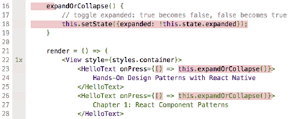

# 第一章：React 组件模式

开发 Android 和 iOS 从未像现在这样简单。React Native 改变了我们开发新应用并向最终用户提供价值的速度。了解这项技术将使你在市场上拥有巨大优势。我是 Matt，很高兴向你展示我在 React Native 生态系统中学到的最佳实践。通过本书，我们将通过示例探索设计模式。仅在本章中，我们将创建超过 10 个小应用程序。在本书的后面，我们将使用我逐渐向你介绍的模式创建更复杂的应用程序。

在本章中，我们将探讨同样适用于 React Native 世界的 React 模式。你需要理解的最关键的模式是无状态和有状态组件。了解如何使用这些模式将使你成为一个更好的 React Native 开发者，并赋予你在每个 React Native 应用程序中使用的标准模式。

在组件方面，使它们尽可能可重用并遵循众所周知的程序员原则——**不要重复自己**（**DRY**）是至关重要的。展示性组件和容器组件就是为了做到这一点。我们将通过几个示例来深入了解它们，学习如何将功能分割成可重用的部分。

更准确地说，在本章中，我们将研究以下主题：

+   无状态和有状态组件，使用简短然后更复杂的示例

+   如何创建可重用且易于配置的展示性组件

+   容器组件及其在功能封装中的作用

+   何时组合组件以及如何创建**高阶组件**（**HOCs**）

是时候采取行动了。**如果你想跟着学习并尝试示例，请立即为 React Native 开发准备好你的环境**。本书中的大部分代码示例都可以在模拟器或真实移动设备上运行和显示。现在，确保你可以在手机或模拟器上启动`Hello World`示例。

代码示例已经提交到 GitHub 上的 Git 存储库中，可以在[`github.com/Ajdija/hands-on-design-patterns-with-react-native`](https://github.com/Ajdija/hands-on-design-patterns-with-react-native)找到。

请按照`readme.md`中的说明设置您的计算机并启动我们的第一个示例。`Hello World`示例可以在以下目录中找到`src/Chapter_1_React_component_patterns/Example_1_Hello_World`。

# 无状态和有状态组件

首先，让我们看看为我们创建的第一个无状态组件。它是由**Create React Native App**（**CRNA**）自动生成的，用于我们的`Hello World`应用程序。这个组件是使用 ECMAScript 2015（ES6）中引入的类语法自动生成的。这样的组件通常被称为**类组件**：

```jsx
// src/ Chapter 1/ Example 1_Hello World/ App.js

**export default class** App extends React.Component {
 render() {
 return (
        <View style={styles.container}>
 <Text>Hands-On Design Patterns with React Native</Text>
 <Text>Chapter 1: React Component Patterns</Text>
 <Text style={styles.text}>You are ready to start the journey. 
          Fun fact is, this text is rendered by class component called 
          App. Check App.js if you want to look it up.</Text>
 </View>  );
  }
}
```

类组件可用于创建有状态组件。

本书提供的代码示例使用具有 Stage 3 功能*类字段声明*的 ECMAScript 2018 语法。 Babel 是支持这样的代码的转换器，相关插件由 CRNA 工具箱预先配置。如果您决定不使用 CRNA，则可能需要自行配置 Babel。

然而，在这种情况下，类组件是不必要的。我们可以安全地使用无状态组件，因为它更简单。让我们看看如何声明**无状态组件**。最常见的方法是使用 ES6 箭头语法。这样的组件称为**功能组件**。查看以下代码，看看我们重写的组件是什么样子的：

```jsx
const App = () => (
    <View style={styles.container}>  <Text>Hands-On Design Patterns with React Native</Text>  <Text>Chapter 1: React Component Patterns</Text>  <Text style={styles.text}>You are ready to start the journey. Fun 
      fact is, this text is rendered by Functional Component called 
      App. Check App.js if you want to look it up.</Text>  </View>  );
export default App;
```

如果您不喜欢箭头语法，您也可以使用常规的`function`语法：

```jsx
// src/ Chapter 1/ Example_2_Functional_Components/ App.js

export default **function** App() {
  return (
      <View style={styles.container}>
  ...
      </View>
  ); }
```

首先弹出的第一个问题是：为什么它是无状态的？答案很简单：它不包含任何内部状态。这意味着我们没有在其中存储任何私有数据。组件需要渲染自身的一切都来自外部世界，而组件并不关心。

在这个小例子中，我们实际上从未将任何外部数据传递给组件。现在让我们来做这件事。为此，我们将创建另一个名为`HelloText`的组件，它消耗一个属性：要显示的文本。将文本传递给这样一个组件的通常约定是将文本放在开放和关闭标签之间，例如`<HelloText>传递的示例文本</HelloText>`。因此，在我们的功能组件中检索这样的属性，我们将需要使用一个名为`children`的特殊键：

```jsx
// src/ Chapter 1/ Example_3_Functional_Components_with_props/ App.js

const HelloText = ({children, ...otherProps}) => (
    <Text {...otherProps}>{children}**</Text>** ); const App = () => (
    <View style={styles.container}>
 <HelloText>  Hands-On Design Patterns with React Native
        </HelloText>
 <HelloText>Chapter 1: React Component Patterns</HelloText>
 <HelloText style={styles.text}>
  You are ready to start the journey. Fun fact is, this text
            is rendered by Functional Component called HelloText.
            Check App.js if you want to look it up.
        </HelloText>
 </View> ); export default App;
```

使用`children`属性使我们的`HelloText`组件更加强大。属性是一种非常灵活的机制。使用属性，您可以发送任何有效的 JavaScript 类型。在这种情况下，我们只发送了文本，但您也可以发送其他组件。

现在是时候为我们的组件添加一些活力了。我们将使其展开第三个文本块，但只有在按下章节或标题文本后才会展开。为了实现这个功能，我们需要存储一个状态，记住组件是展开还是折叠的。

您需要做的是：

1.  将组件更改为类语法。

1.  利用 React 库的状态对象。我们必须在类构造函数中初始化状态，并默认使文本折叠。

1.  在组件的`render`函数中添加条件渲染。

1.  添加按下处理程序，当我们点击标题或章节文本时将改变状态。

解决方案如下所示：

```jsx
// src/ Chapter 1/ Example_4_Stateful_expandable_component/ App.js export default class App extends React.Component {
    constructor() {
        super();
  this.state = {
            // default state on first render
  expanded: **false**
  }
    }

    expandOrCollapse() {
        // toggle expanded: true becomes false, false becomes true
  this.setState({expanded: !this.state.expanded})**;**
  }

    render = () => (
        <View style={styles.container}>
 <HelloText onPress={() => this.expandOrCollapse()}>
  Hands-On Design Patterns with React Native
            </HelloText>
 <HelloText onPress={() => this.expandOrCollapse()}>
  Chapter 1: React Component Patterns
            </HelloText>
  {
                this.state.expanded &&
                <HelloText style={styles.text}>
  You can expand and collapse this text by clicking
                    the Title or Chapter text. Bonus: Check Chapter 4
                    to learn how to animate expanding andcollapsing.
                </HelloText>
  }
        </View>
  );
}
```

恭喜——我们已经创建了我们的第一个无状态和有状态组件！

注意显示组件的`&&`运算符。如果运算符左侧的布尔值为`true`，那么右侧的组件将被显示。整个表达式需要用大括号括起来。我们将在第三章中探索更多功能，样式模式。

现在是时候创建一些更具挑战性的东西：`任务列表`。请重新开始并准备好您的代码。清理`App.js`，使其只包括`App`类组件：

1.  构造函数应该在其状态中初始化任务列表。在我的示例中，任务列表将是一个字符串数组。

1.  迭代任务以为每个任务创建`Text`组件。这应该发生在`App`组件的`render`函数中。请注意，您可以使用`map`函数简化迭代，而不是使用常规的`for`循环。这应该成为第二天性，因为它已经成为几乎每个 JS 项目的标准。

我的解决方案如下所示：

```jsx
// src/ Chapter 1/ Example 5_Task_list/ App.js export default class App extends React.Component {
  constructor() {
    super();
    // Set the initial state, tasks is an array of strings
  this.state = {
 tasks: ['123', '456']
 }
  }

  render = () => (
      <View style={styles.container}>
  {
          this.state.tasks
  .map((task, index) => (
 <Text key={index} style={styles.text}>{task}</Text>
  ))
        }
      </View>
  );
}
```

使用`map`进行迭代是一个很好的功能，但整个组件看起来还不像一个任务列表。别担心，您将学会如何在第三章中为组件添加样式，*样式模式*。

# 无状态组件的优势是什么？

也许只使用有状态的类组件并开发整个应用程序似乎很诱人。为什么我们要费心使用无状态的函数组件呢？答案是性能。无状态的函数组件可以更快地渲染。这样做的原因之一是因为无状态的函数组件不需要一些生命周期钩子。

什么是生命周期钩子？React 组件有生命周期。这意味着它们有不同的阶段，如挂载、卸载和更新。您可以挂钩每个阶段甚至子阶段。请查看官方 React 文档以查看可用生命周期方法的完整列表：[`reactjs.org/docs/state-and-lifecycle.html`](https://reactjs.org/docs/state-and-lifecycle.html)。这些对于触发从 API 获取数据或更新视图非常有用。

请注意，如果您使用的是 React v16 或更高版本，功能组件不会在 React 库内部被包装成类组件。

React 16 中的功能组件与类组件不走相同的代码路径，不像在之前的版本中它们被转换为类并且会有相同的代码路径。类组件有额外的检查和创建实例的开销，而简单函数没有。尽管这些是微优化，不应该在真实应用中产生巨大差异，除非你的类组件过于复杂。- Dominic Gannaway，Facebook React 核心团队的工程师

功能组件更快，但在大多数情况下被扩展`React.PureComponent`的类组件性能更好：

“但要明确的是，当 props 浅相等时，它们不会像 PureComponent 那样退出渲染。”- Dan Abramov，Redux 和 Create React App 的共同作者，Facebook React 核心团队的工程师

功能组件不仅更简洁，而且通常也是纯函数。我们将在《第九章》中进一步探讨这个概念，*函数式编程模式的元素*。纯函数提供了许多好处，如可预测的 UI 和轻松跟踪用户行为。应用程序可以以某种方式实现来记录用户操作。这些数据有助于调试和在测试中重现错误。我们将在本书的后面深入探讨这个话题。

# 组件组合

如果您学习过任何**面向对象**（**OO**）语言，您可能已经广泛使用了继承。在 JavaScript 中，这个概念有点不同。JavaScript 继承是基于原型的，因此我们称之为**原型继承**。功能不是复制到对象本身，而是从对象的原型继承，甚至可能通过原型树中的其他原型继承。我们称之为**原型链**。

然而，在 React 中，使用继承并不是很常见。由于组件，我们可以采用另一种称为**组件组合**的模式。我们将创建一个新的父组件，该组件将使用其子组件使自己更具体或更强大，而不是创建一个新类并从基类继承。让我们看一个例子：

```jsx
// src/ Chapter 1/ Example_6_Component_composition_red_text/ App.js

const WarningText = ({style, ...otherProps}) => (
    <**Text** style={[style, {color: 'orange'}]} {...otherProps} /> );   export default class App extends React.Component {
    render = () => (
        <**View** style={styles.container}>
 <**Text** style={styles.text}>Normal text</**Text**>
 <**WarningText** style={styles.text}>Warning</**WarningText**>
 </**View**>  ); }
```

`App`组件由三个组件构建：`View`，`Text`和`WarningText`。这是一个完美的例子，说明一个组件如何通过组合来重用其他组件的功能。

`WarningText`组件使用组合来强制`Text`组件中的橙色文本颜色。它使通用的`Text`组件更具体。现在，我们可以在应用程序的任何地方重用`WarningText`。如果我们的应用程序设计师决定更改警告文本，我们可以快速适应一个地方的新设计。

注意隐式传递了一个名为 children 的特殊 prop。它代表组件的子元素。在`Example 6_ Component composition *-* red text`中，我们首先将警告文本作为子元素传递给`WarningText`组件，然后使用扩展运算符将其传递给`Text`组件，`WarningText`封装了它。

# 组合应用程序布局

假设我们必须为我们的应用程序创建一个欢迎屏幕。它应该分为三个部分 - 头部，主要内容和页脚。我们希望对已登录和匿名用户都有一致的边距和样式。但是，头部和页脚内容将不同。我们的下一个任务是创建一个支持这些要求的组件。

让我们创建一个欢迎屏幕，它将使用一个通用组件来封装应用程序布局。

按照以下逐步指南操作：

1.  创建`AppLayout`组件，强制一些样式。它应该接受三个 props：`header`，`MainContent`和`Footer`：

```jsx
const AppLayout = ({Header, MainContent, Footer}) => (
    // **These three props can be any component that we pass.**
    // You can think of it as a function that
    // can accept any kind of parameter passed to it.
    <View style={styles.container}>
        <View style={styles.layoutHeader}>{Header}</View>
        <View style={styles.layoutContent}>{MainContent}</View>
        <View style={styles.layoutFooter}>{Footer}</View>
    </View>
);
```

1.  现在是时候为标题、页脚和内容创建占位符了。我们创建了三个组件：`WelcomeHeader`，`WelcomeContent`和`WelcomeFooter`。如果你愿意，你可以将它们扩展为比一个微不足道的文本更复杂的组件：

```jsx
const WelcomeHeader = () => <View><Text>Header</Text></View>;
const WelcomeContent = () => <View><Text>Content</Text></View>;
const WelcomeFooter = () => <View><Text>Footer</Text></View>;
```

1.  我们应该将`AppLayout`与我们的占位符组件连接起来。创建`WelcomeScreen`组件，它将占位符组件（来自*步骤 2*）作为 props 传递给`AppLayout`：

```jsx
const WelcomeScreen = () => (
    <AppLayout
        Header={<WelcomeHeader />}
 MainContent={<WelcomeContent />}
 Footer={<WelcomeFooter />}
    />
);
```

1.  最后一步将是为我们的应用程序创建根组件并添加一些样式：

```jsx
// src/ Chapter 1/ Example_7_App_layout_and_Welcome_screen/ App.js

// root component
export default class App extends React.Component {
 render = () => <WelcomeScreen />; }

// styles
const styles = StyleSheet.create({
 container: {
         flex: 1,
  marginTop: 20
    },
 layoutHeader: {
 width: '100%',
 height: 100,
 backgroundColor: 'powderblue'
    },
 layoutContent: {
 flex: 1,
 width: '100%',
 backgroundColor: 'skyblue'
    },
 layoutFooter: {
 width: '100%',
 height: 100,
 backgroundColor: 'steelblue'
    }
});
```

请注意使用`StyleSheet.create({...})`。这将创建一个表示我们应用程序样式的样式对象。在这种情况下，我们创建了四种不同的样式（`container`，`layoutHeader`，`layoutContent`和`layoutFooter`），可以在我们定义的标记中使用。我们以前使用诸如`width`，`height`和`backgroundColor`之类的键来自定义样式，这些都是微不足道的。然而，在这个例子中，我们还使用了来自术语**flexbox 模式**的`flex`。我们将在第三章中详细解释这种方法，*样式模式*，我们主要关注`StyleSheet`模式。

这很不错。我们为我们的应用程序制作了一个微不足道的布局，然后创建了欢迎屏幕。

# 组件继承怎么样？

“在 Facebook，我们在成千上万的组件中使用 React，并且我们没有发现任何我们建议创建组件继承层次结构的用例。”- React 官方文档（[`reactjs.org/docs/composition-vs-inheritance.html`](https://reactjs.org/docs/composition-vs-inheritance.html)）

我还没有遇到过必须放弃组件组合而选择继承的情况。Facebook 的开发人员也没有（根据前面的引用）。因此，我强烈建议你习惯于组合。

# 在高级模式上测试组件

在创建可靠和稳定的应用程序时，测试是非常重要的。首先，让我们看看你需要编写的最常见的三种测试类型：

+   **琐碎的单元测试：**我不明白，但它是否工作或根本不工作？通常，检查组件是否渲染或函数是否无错误运行的测试被称为琐碎的单元测试。如果你手动进行这些测试，你会称这些测试为冒烟测试。这些测试非常重要。不管你喜不喜欢，你都应该编写琐碎的测试，至少要知道每个功能*某种程度*上是否工作。

+   **单元测试：**代码是否按照我的预期工作？它是否在所有的代码分支中工作？分支指的是代码中的分支位置，例如，if 语句将代码分支到不同的代码路径，这类似于 switch-case 语句。单元测试是指测试单个代码单元。在应用程序的关键特性中，单元测试应该覆盖整个函数代码（原则上：对于关键特性，代码覆盖率达到 100%）。

+   **快照测试：**测试之前和实际版本是否产生相同的结果被称为快照测试。快照测试只是创建文本输出，但一旦输出被证明是正确的（通过开发人员评估和代码审查），它可能会作为比较工具。尽量多使用快照测试。这些测试应该提交到你的代码库并经过审查过程。Jest 中的这个新功能为开发人员节省了大量时间：

+   **图像快照测试：**在 Jest 中，快照测试比较文本（JSON 到 JSON），但是你可能会在移动设备上遇到快照测试的引用，这意味着比较图像和图像。这是一个更高级的话题，但是大型网站通常会使用。拍摄这样的屏幕截图很可能需要构建整个应用程序，而不仅仅是一个单独的组件。构建整个应用程序是耗时的，因此一些公司只在计划发布时运行这种类型的测试，例如在发布候选版本构建上。这种策略可以自动化遵循*持续集成*和*持续交付*原则。

由于我们在本书中使用 CRNA 工具箱，你想要检查的测试解决方案是 Jest（[`facebook.github.io/jest/`](https://facebook.github.io/jest/)）。

如果你来自 React web 开发背景，请注意。React Native，顾名思义，是在本地环境中运行的，因此有许多组件，比如 react-native-video 包，可能需要特殊的测试解决方案。在许多情况下，你需要模拟（创建占位符/模仿行为）这些包。

点击[`facebook.github.io/jest/docs/en/tutorial-react-native.html#mock-native-modules-using-jestmock`](https://facebook.github.io/jest/docs/en/tutorial-react-native.html#mock-native-modules-using-jestmock)了解更多信息。

我们将在第十章中解决其中一些问题，*管理依赖*。

通常有一些测试指标，比如代码覆盖率（测试覆盖的行数）、报告的错误数量和注册的错误数量。

尽管非常有价值，但这些指标可能会产生一个错误的信念，即应用程序经过了充分测试。

在涉及测试模式时，有一些完全错误的做法需要提及：

+   **仅依赖单元测试**：单元测试意味着仅测试单独的代码片段，例如，通过向函数传递参数并检查输出来测试。这很好，可以避免很多错误，但无论你有多高的代码覆盖率，你可能会在集成经过充分测试的组件时遇到问题。我喜欢用的一个现实例子是两扇门放得太靠近，导致它们不断开合。

+   **过分依赖代码覆盖率**：不要过分强调自己或其他开发人员达到 100%或 90%的代码覆盖率。如果你有能力做到，那很好，但通常这会导致开发人员编写价值较低的测试。有时，向函数发送不同的整数值是至关重要的；例如，在测试除法时，仅发送两个正整数是不够的。你还需要检查当除以零时会发生什么。覆盖率无法告诉你这一点。

+   **不追踪测试指标如何影响错误数量**：如果你只依赖于一些指标，无论是代码覆盖率还是其他任何指标，请重新评估这些指标是否反映了真相，例如，指标的增加是否导致了更少的错误。举个例子，我听过许多不同公司的开发人员说，代码覆盖率超过 80%并没有对他们有太大帮助。

如果你是产品所有者，并且已经查看了上面的*不追踪测试指标如何影响错误数量*，请与项目的技术负责人或资深开发人员进行咨询。可能会有一些特定因素影响这个过程，例如，开发进度转向更可重复的代码。请不要过快下结论。

# 快照测试可扩展组件

这一次，我们将展示快照测试的一个棘手部分。

让我们从创建我们的第一个快照测试开始。转到`Chapter_1/Example 4_Stateful_expandable_component`并在命令行中运行`yarn test`。您应该会看到一个测试通过。这是什么样的测试？这是一个位于`App.test.js`文件中的微不足道的单元测试。

是时候创建我们的第一个快照测试了。将`expect(rendered).toBeTruthy();`替换为`expect(rendered).toMatchSnapshot();`。它应该是这样的：

```jsx
it('renders', () => {
  const rendered = renderer.create(<App />).toJSON();
  expect(rendered).toMatchSnapshot(); });
```

完成后，重新运行`yarn test`。将创建一个名为`__snapshots__`的新目录，其中包含`App.test.js.snap`文件。查看其内容。这是您的第一个快照。

是时候测试应用的覆盖率了。您可以使用以下命令来完成：

```jsx
yarn test -- --coverage
```

它产生了一些令人担忧的东西：

```jsx
File |  % Stmts | % Branch |  % Funcs |  % Lines | Uncovered Line #s
All files|    66.67 |       50 |       50 |    66.67
App.js   |    66.67 |       50 |       50 |    66.67 | 18,23,26
```

我们有一个组件有一个分支（`if`），进行快照测试后，覆盖率甚至没有接近 100%。出了什么问题？

显然，依赖状态的分支存在问题，但是否会占据超过 30%的代码行数？让我们看看完整的报告。打开`./coverage/lcov-report/App.js.html`文件：



覆盖率报告文件。您可以看到代码未被覆盖，测试标记为红色。

现在，你看到了问题所在。答案很简单——快照测试不测试属性函数。为什么？首先，这没有太多意义。我们为什么要将一个函数转换为 JSON，这有什么帮助呢？其次，告诉我如何序列化这个函数。我应该将函数代码作为文本返回，还是以其他方式计算输出？

以此例为教训，**快照测试并不足够**。

# 测试驱动开发方法

您经常会听到**测试驱动开发**（**TDD**）方法，基本上意味着先编写测试。为了简化这个过程，让我们总结为以下三个步骤：

1.  编写测试并观察它们失败。

1.  实现功能直到看到测试通过。

1.  重构为最佳实践（可选）。

我必须承认，我真的很喜欢这种方法。然而，事实是大多数开发人员会赞美这种方法，但几乎没有人会使用它。这通常是因为它很耗时，而且很难预测即将测试的东西是什么样子。

更进一步，你会发现测试类型之一是针对 TDD 的。快照测试只能在组件实现后创建，因为它们依赖于其结构。这也是为什么快照测试更多是对你的测试的一种补充，而不是替代品的另一个原因。

这种方法在长期运行的大型应用程序中效果最好，其中一组技术架构师规划要使用的接口和模式。这最有可能出现在后端项目中，你会对所有类和模式如何相互连接有一个大致的了解。然后，你只需拿出接口并编写测试。接下来，你跟进实现。如果你想在 React Native 中创建接口，你需要支持 TypeScript。

有人认为 TDD 在小型项目中很棒，你可能很快就会在 Stack Overflow 上找到这样的讨论。不要误会我的意思；我很高兴有些人很开心。然而，小型项目往往非常不稳定，很可能经常变化。如果你正在构建一个**最小可行产品（MVP）**，它与 TDD 并不很搭配。你最好依赖于你使用的库经过了充分测试，并及时使用快照测试来交付项目。

总结一下：放弃 TDD 不应该意味着写更少的测试。

# 表现组件

现在是时候学习如何使组件可重用了。为了实现这个目标，我们将利用我们手中最好的工具：**表现组件**模式。它将组件与逻辑解耦，并使它们更加灵活。

表现组件是一个模式名称，如果以后你决定使用 Redux 库，你会经常听到。例如，在 Dan Abramov 的 Redux 课程中，表现组件被大量使用。

我喜欢解释，表现组件模式是网站的世界。很长一段时间以来，每个网站都有三个主要的组成部分：CSS、HTML 和 JavaScript。然而，React 引入了一种有点不同的方法，即基于 JavaScript 自动生成 HTML。HTML 变成了虚拟的。因此，你可能听说过**虚拟文档对象模型**（**虚拟 DOM**）。这种关注点的分离——HTML（视图）、CSS（样式）和 JavaScript（逻辑，有时称为控制器）——应该在我们的 JavaScript 世界中保持不变。因此，在我们的 JavaScript 世界中，使用表现组件来模仿 HTML，使用容器组件来处理逻辑。

以与 React Native 应用程序相同的方式解决这个问题。你编写的标记应该与它所消耗的逻辑分离。

让我们看看这个问题。你还记得`Example 4_Stateful expandable component`吗？它已经有一个呈现层组件了：

```jsx
const HelloText = ({children, ...otherProps}) => (
    <Text {...otherProps}>{children}</Text> ); 
```

这个组件不引入任何逻辑，只包含标记，在这种情况下非常简短。任何有用的逻辑都隐藏在 props 中并传递，因为这个组件不需要使用它。在更复杂的例子中，你可能需要解构 props 并将它们传递给正确的组件；例如，当使用上面的展开运算符时，所有未解构的 props 都被传递了。

但是，与其专注于这个简单的例子，不如开始重构`App`组件。首先，我们将把标记移到单独的呈现层组件中：

```jsx
// src/ Chapter_1_React_component_patterns/
// Example_9_Refactoring_to_presentational_component/ App.js
// Text has been replaced with "..." to save space.

**export const** HelloBox = ({ isExpanded, expandOrCollapse }) => (
    <View style={styles.container}>
 <HelloText onPress={() => expandOrCollapse()}>...</HelloText>
 <HelloText onPress={() => expandOrCollapse()}>...</HelloText>
  {
            isExpanded &&
            <HelloText style={styles.text}>...</HelloText>
  }
    </View> );
```

现在，我们需要用以下内容替换`App`组件中的`render`函数：

```jsx
render = () => (
    **<HelloBox**
  isExpanded={this.state.expanded}
        expandOrCollapse={this.expandOrCollapse}
    **/>** );
```

然而，如果你现在运行代码，你会在`HelloText`的按键事件上遇到一个错误。这是由于 JavaScript 处理`this`关键字的方式。在这次重构中，我们将`expandOrCollapse`函数传递给另一个对象，在那里，`this`指的是一个完全不同的对象。因此，它无法访问状态。

有几种解决这个问题的方法，其中一种是使用箭头函数。我将坚持性能最佳的方法。关键是在你的构造函数中添加以下行：

```jsx
this.expandOrCollapse = this.expandOrCollapse.bind(this); 
```

搞定了；应用程序已经完全可用，就像以前一样。我们已经将一个组件重构为两个——一个是呈现层的，一个负责逻辑的。很好。

假设我们只对两个组件进行了浅层单元测试。

我们能否识别出`this`关键字的问题？

也许不记得了。这个简单的陷阱可能会在大型项目中让你陷入困境，到时候你会太忙碌而无法重新思考每一个组件。小心并记住**集成测试**。

# 解耦样式

在前面的例子中，你可能已经注意到样式与呈现层组件紧密耦合。为什么紧密？因为我们通过`style={styles.container}`明确地包含它们，但`styles`对象是不可配置的。我们无法用 props 替换任何样式部分，这使我们与现有的实现紧密耦合。在某些情况下，这是期望的行为，但在其他情况下则不是。

如果您对样式工作感兴趣，我们将深入研究涉及它们的模式，在第三章中，*样式模式*。您还将了解来自 CSS 的 flexbox 模式和许多其他约定。

如果您尝试将代码拆分为单独的文件，您将遇到这个问题。我们该如何解决这个问题？

让样式成为可选属性。如果未提供样式，则我们可以回退到默认值：

```jsx
// src/ Chapter_1/ Example_10_Decoupling_styles/ App.js

export const HelloBox = ({
    isExpanded,
  expandOrCollapse,
  containerStyles,
  expandedTextStyles
}) => (
    <View style={containerStyles || styles.container}>
 <HelloText onPress={() => expandOrCollapse()}>...</HelloText>
 <HelloText onPress={() => expandOrCollapse()}>...</HelloText>
  {
            isExpanded &&
            <HelloText style={expandedTextStyles || styles.text}>
                ...
            </HelloText>
  }
    </View> );
```

注意使用`||`运算符。在上面的例子（`expandedTextStyles || styles.text`）中，它首先检查`expandedTextStyles`是否已定义，如果是，则返回该值。如果`expandedTextStyles`未定义，则返回我们硬编码的默认样式对象`styles.text`。

现在，如果我们希望，在某些地方，我们可以通过传递相应的 props 来覆盖我们的样式：

```jsx
render = () => (
    <HelloBox   isExpanded={this.state.expanded}
        expandOrCollapse={this.expandOrCollapse}
        expandedTextStyles={{ color: 'red' }}
    /> );
```

这就是我们如何分割标记、样式和逻辑。请记住尽可能经常使用表现性组件，以使您的功能在许多屏幕/视图上真正可重用。

如果您来自后端背景，您可能会迅速假设它就像**MVC 模式**：**Model**，**View**和**Controller**。它不一定是 1:1 的关系，但一般来说，您可以简化为以下内容：

+   **View**：这是一个表现性组件。

+   **Model**：这是数据表示，对我们来说，它是在有状态组件中构建的状态，或者使用所谓的存储和 reducers（查看第五章，*存储模式*，了解有关 Redux 是什么以及如何使用它的更多细节）。

+   **Controller**：这是一个负责应用程序逻辑的容器组件，包括事件处理程序和服务。它应该是精简的，并从相应的文件中导入逻辑。

# 容器组件

容器组件模式是很久以前引入的，并在 React 社区中由 Dan Abramov 推广。到目前为止，当我们将 App 组件的内容重构为*表现性组件*时，我们已经创建了一个容器组件。事实证明，`App`组件成为了一个容器组件——它包含了`HelloBox`组件并实现了必要的逻辑。我们从这种方法中获得了什么？我们获得了以下内容：

+   我们可以以不同的方式实现展开和折叠，并重用`HelloBox`组件的标记

+   `HelloBox`不包含逻辑

+   容器组件封装了逻辑，并将其隐藏在其他组件中

我强烈建议阅读 Dan Abramov 在 medium 上的文章。查看[`medium.com/@dan_abramov/smart-and-dumb-components-7ca2f9a7c7d0`](https://medium.com/@dan_abramov/smart-and-dumb-components-7ca2f9a7c7d0)获取更多信息。当涉及到依赖注入模式时，容器组件是非常有用的工具。查看第十章，*管理依赖项*，以了解更多信息。

# HOC

**HOC**是一种模式，用于增强组件的附加属性或功能，例如，如果您想使组件可扩展。我们可以使用 HOC 模式，而不是像之前那样只创建一个有状态的容器。让我们将我们的有状态容器组件重构为 HOC，并将其命名为`makeExpandable`：

```jsx
// src/ Chapter_1/ Example_12_Higher_order_component_makeExpandable/ App.js
 const makeExpandable = (ComponentToEnrich) => (
    class HelloBoxContainer extends React.Component {
        constructor() {
            super();
  this.state = {
                // default state on first render
  expanded: false
  };
  this.expandOrCollapse = this.expandOrCollapse.bind(this);
  }

        expandOrCollapse() {
            // toggle expanded: true becomes false, false becomes true
  this.setState({expanded: !this.state.expanded});
  }

        render = () => (
            <**ComponentToEnrich**
  isExpanded={this.state.expanded}
                expandOrCollapse={this.expandOrCollapse}
            />
  );
  }
);
```

`makeExpandable`组件接受`ComponentToEnrich`。因此，我们可以创建一个根组件（`App`）如下：

```jsx
export default makeExpandable(HelloBox);
```

酷，不是吗？现在，让我们创建一些其他组件，并用我们的 HOC 来丰富它。这将是一个显示文本隐藏或显示的小按钮。如果用户按下按钮，它应该显示或隐藏一个小的彩色框。对于这个任务，你可以使用以下样式：

```jsx
box: {
    width: 100,
  height: 100,
  backgroundColor: 'powderblue', }
```

将它们放在`StyleSheet.create({ ... })`中。我的解决方案非常简单：

```jsx
// src/ Chapter_1/
// Example_13_Higher_order_component_show_hide_button/ App.js

export const SomeSection = ({
    isExpanded,
  expandOrCollapse,
  containerStyles,
  boxStyle
}) => (
    <View style={containerStyles || styles.container}>
 <Button
            onPress={expandOrCollapse}
 title={isExpanded ? "Hide" : "Show"}
 color="#841584"
        />
        {isExpanded && <View style={boxStyle || styles.box} />}
    </View> );

export default makeExpandable(SomeSection);
```

在前面的示例中，`SomeSection`组件被`makeExpandable` HOC 包装，并接收`isExpanded`和`expandOrCollapse`属性。

太棒了！我们刚刚制作了一个可重用的 HOC，它运行得非常完美。

现在，我将向您展示一个相当不为人知但有时很有用的技术，可以使您的 HOC 更加灵活。想象一下，您将增强一个对属性命名要求严格的组件，就像以下示例中一样：

```jsx
export const SomeSection = ({
    showHideBox,
  isVisible,
  containerStyles,
  boxStyle
}) => {...};
```

不幸的是，我们的 HOC，`makeExpandable`，传递了错误的属性名称。让我们来修复一下：

```jsx
// src/ Chapter_1/ Example_14_Flexible_prop_names_in_HOC/ App.js
render = () => {
  const props = {
    [propNames && propNames.isExpanded || 'isExpanded']: this.state.expanded,
  [propNames && propNames.expandOrCollapse || 'expandOrCollapse']: this.expandOrCollapse
  };
  return <ComponentToEnrich {...props} /> }; 
```

这是一个棘手的例子。它提供了重命名由 HOC 传递的属性的能力。要重命名它，我们需要将一个名为`propNames`的配置对象传递给 HOC。如果传递了这样的对象，并且它包含某个键，那么我们将覆盖该名称。如果该键不存在，则我们将回退到默认的属性名称，例如`isExpanded`。

注意对象内部的`[]`的使用。它允许您在对象中动态命名键。在这个例子中，键是根据`propNames`的存在动态选择的。

为了使一切正常工作，我们还需要在`makeExpandable` HOC 中接受可选参数`propNames`：

```jsx
const makeExpandable = (ComponentToEnrich, propNames) => (
    ...
)
```

太棒了！现在我们的 HOC 在处理 prop 名称时更加灵活了！我们可以将其与前面提到的严格的`SomeSection`组件一起使用：

```jsx
export default makeExpandable(SomeSection, {
    isExpanded: 'isVisible',
  expandOrCollapse: **'showHideBox'** }); 
```

在`render`函数内创建变量时要注意性能影响。它会减慢你的应用程序。有时，模式可能会牺牲一点性能，有时则不会。明智地使用它们。你也可以将内联的`propNames`变量作为两个 props。

确保查看下一节以获得更清晰和解耦的方法。

# HOC 组合

创建 HOC 的主要原因是能够组合它们提供的功能。

再次从上一节的问题来看。如果我们可以将工作委托给另一个 HOC 呢？例如，有一个名为`mapPropNames`的 mapper HOC，你可以像这样与我们之前的 HOC 组合：

```jsx
makeExpandable(mapPropNames(SomeSection)); 
```

这是`mapPropNames`的实现：

```jsx
// src/ Chapter_1/ Example_15_HOC_Composition/ App.js

const mapPropNames = (Component) => (props) => (
    <Component
        {...props}
  isVisible={props.isExpanded}
 showHideBox={props.expandOrCollapse}
    />  );
```

很好，很快，不是吗？这是一个常见的模式，也在处理作为 JSON 发送的后端数据时使用。它可以将数据格式适应到前端层的表示。正如你所看到的，我们在处理 HOC 时也可以采用这个好主意！

如果你来自面向对象的背景，请注意 HOC 模式与装饰器模式非常相似。然而，装饰器还依赖继承，并且需要实现它装饰的接口。

请查看[`en.wikipedia.org/wiki/Decorator_pattern`](https://en.wikipedia.org/wiki/Decorator_pattern)以获取示例。

你也可以组合装饰器。它的工作方式类似。

# 有用的 HOC 示例

你需要一个快速的记录器来显示应用程序的行为吗？或者你正在准备一个实时演示，想在屏幕上显示一些动态信息？来吧：

```jsx
// src/ Chapter_1/ Example_16_Useful_HOCs/ App.js

const logPropChanges = Component => props => {
    console.log('[Actual props]:', props)**;**
  return <Component {...props} />; };
// Use: makeExpandable(logPropChanges(mapPropNames(SomeSection))); 
```

好的。现在，假设你正在等待一些数据加载。这里就是加载动画：

```jsx
// src/ Chapter_1/ Example_16_Useful_HOCs/ App.js

import {ActivityIndicator} from 'react-native';
const withSpinner = Component => props => (
    props.shouldSpin
        ? <View style={styles.container}>
 <Text>Your fav spinner f.in. on data load.</Text>
 <**ActivityIndicator** size="large" color="#0000ff" />
 </View>  : <Component {...props} /> );
// Needs a HOC that provides prop shouldSpin (true/false)
```

你可能想要求用户为你的应用打五星。你需要一个模态框来做这个：

```jsx
const withModalOpener = Component => props => (
    // Replace with your favourite Modal box implementation
  <Component {...props} openModal={() => console.log('opening...')} /> );
```

有时，模态框也应该足够智能，以维持它们的可见性。

```jsx
// src/ Chapter_1/ Example_16_Useful_HOCs/ App.js

const withModalOpener = OriginalComponent => (
    class ModalExample extends React.Component {
        // Check this shorter way to init state
        state = {
 modalVisible: true,
        }**;**    setModalVisible(visible) {
            this.setState({modalVisible: visible})**;**
  }

        render() {
            return (
                // Replace with your favourite Modal box implementation
  <View style={styles.container}>
 <OriginalComponent  {...this.props}
                        openModal={() => this.setModalVisible(true)}
                        closeModal={() =>
                     this.setModalVisible(false)}
                    />
 <**Modal**  animationType="slide"
  visible={this.state.modalVisible}
                        onRequestClose={() => {
                            alert('Modal has been closed.');
  }}>
 <View style={styles.container}>
 <Text>Example modal!</Text>   <TouchableHighlight  onPress={() => {
                                    this.setModalVisible(false);
  }}>
 <Text style={{fontSize: 30}}>
  Hide Modal
                                </Text>
 </TouchableHighlight> </View> </**Modal**> </View>  );
  }
    }
); 
```

在这个例子中，我们用`Modal`来丰富组件。`Modal`可以使用名为`openModal`和`closeModal`的 props 打开或关闭。关于模态框是打开还是关闭的信息存储在 HOC 的私有状态中，在这个例子中不会暴露给原始组件。很好的分离，对吧？这个 HOC 也是可重用的。

现在是你的作业时间：我们如何使`Modal`在盒子显示的同时打开？你不能改变`SomeComponent`。

# 总结

在这一章中，你已经学会了如何在 React Native 环境中使用 React 创建基本组件。现在，你应该对无状态和有状态组件感到相当舒适。此外，你还学会了关于展示性和容器性组件。你知道这些模式用于解耦标记和逻辑。你还学会了如何通过使用高阶组件来增强组件功能。希望你也已经在 Git 存储库中玩过我为你收集的可运行示例。

在第二章 *视图模式* 中，我们将更多关注标记。你还将学习一些可以使用的标签。
