# 第三章：样式模式

现在是为我们的应用程序添加一些外观的时候了。在本章中，我们将探索独特的样式解决方案和机制。React Native StyleSheet 可能类似于 Web 层叠样式表（CSS）；然而，原生应用程序的样式是不同的。语法上的相似之处很快就结束了，您应该花一些时间来学习样式的基础知识。在本书的后面，我们将使用一个提供现成样式的外部库。对于您来说，了解如何自己制作这样的组件至关重要，特别是如果您计划在 React Native 团队中专业工作，他们提供定制设计。

在本章中，我们将涵盖以下主题：

+   在 React Native 环境中为组件设置样式

+   处理有限的样式继承

+   使用密度无关像素

+   使用 Flexbox 定位元素

+   处理长文本问题

+   使用 Animated 库制作动画

+   使用每秒帧数（FPS）指标来测量应用程序的速度

# 技术要求

与前几章一样，我已经将每个示例分成一个独立的应用程序，您可以在手机或模拟器上启动。要做这些示例，您将需要以下内容：

+   模拟器或 Android/iOS 智能手机

+   使用 Git 拉取示例：[`github.com/Ajdija/hands-on-design-patterns-with-react-native`](https://github.com/Ajdija/hands-on-design-patterns-with-react-native)。请按照 GitHub 页面上的安装说明进行操作。

# React Native 样式的工作原理”

“React 的核心前提是 UI 只是数据投影到不同形式的数据中。相同的输入产生相同的输出。一个简单的纯函数。”

- React 库自述文件（[`github.com/reactjs/react-basic/blob/master/README.md`](https://github.com/reactjs/react-basic/blob/master/README.md)）。

您将在本书的后面学习纯函数。查看以下示例以了解基础知识：

```jsx
// Code example from React readme. Comments added for clarity.

// JavaScript pure function
// for a given input always returns the same output
function NameBox(name) {
    return { fontWeight: 'bold', labelContent: name };  }

// Example with input
'Sebastian Markbåge' ->
{ fontWeight: 'bold', labelContent: 'Sebastian Markbåge' };
```

回到更实际的例子，让我们看看在 React Native 中如何实现前提。

“使用 React Native，您不需要使用特殊的语言或语法来定义样式。您只需使用 JavaScript 为应用程序设置样式。所有核心组件都接受一个名为`style`的属性。样式名称和值通常与 Web 上的 CSS 工作方式相匹配，只是名称使用驼峰式命名，例如 backgroundColor 而不是 background-color。

样式属性可以是一个普通的 JavaScript 对象。(...) 您还可以传递一个样式数组 - 数组中的最后一个样式具有优先权，因此您可以使用它来继承样式。

随着组件复杂性的增加，通常更清晰的做法是使用 StyleSheet.create 在一个地方定义多个样式。

- React Native 官方文档([`facebook.github.io/react-native/docs/style.html`](https://facebook.github.io/react-native/docs/style.html)).

总之，我们有三种定义组件样式的方式：

+   使用样式属性并传递一个包含键值对的对象，表示样式。

+   使用样式属性并传递一个对象数组。每个对象应包含表示样式的键值对。数组中的最后一个样式具有优先权。可以使用这种机制来继承样式或像阴影函数和变量一样阴影它们。

+   使用 StyleSheet 组件及其 create 函数来创建样式。

在下面的示例中，您可以找到定义样式的三种方式：

```jsx
// src/ Chapter_3/ Example_1_three_ways_to_define_styles/ App.js

export default () => (
    <View>
 <Text style={{ color: 'green' }}>inline object green</Text>
 <Text style={styles.green}>styles.green green</Text>
 <Text style={[styles.green, styles.bigred]}>
  [styles.green, styles.bigred] // big red
        </Text>
 <Text style={[styles.bigred, styles.green]}>
  [styles.bigred, styles.green] // big green
        </Text>
 </View> );   const styles = StyleSheet.create({
    green: {
        color: 'green'
  },
  bigred: {
        color: 'red',
  fontSize: 35
  }
});
```

注意使用对象数组的用例。您可以结合先前学到的技巧来实现条件样式：

```jsx
<View>
 <Text  style={[
            styles.linkStyle,
  this.props.isActive && styles.activeLink
        ]}
    >
  Some link
    </Text> </View> 
```

另外，让我们讨论一下为什么我们使用`StyleSheet`组件而不是内联样式：

+   代码质量：

+   通过将样式从渲染函数中移出，可以使代码更容易理解。

+   给样式命名是向渲染函数中的低级组件添加含义的好方法。

+   性能：

+   将样式对象转换为样式表，可以通过 ID 引用它，而不是每次都创建一个新的样式对象。

+   它还允许您通过桥只发送样式一次。所有后续使用都将引用一个 ID（尚未实现）。

- React Native 官方文档

[`facebook.github.io/react-native/docs/stylesheet.html`](https://facebook.github.io/react-native/docs/stylesheet.html).

在质量和可重用性方面，StyleSheet 将样式和组件标记分离。甚至可以将这些样式提取到一个单独的文件中。此外，正如文档中所述，它可以使您的标记更容易理解。您可以看到一个有意义的名称，比如**`styles.activeLink`**，而不是一个庞大的样式对象。

如果您低估了应用程序中的解耦性，那么请尝试将代码基础扩展到超过 5,000 行。您可能会发现一些紧密耦合的代码需要一些技巧才能重用。不良实践会滚雪球，使代码基础非常难以维护。在后端系统中，它通常与单片结构相辅相成。拯救的惊人主意是微服务。在[`en.wikipedia.org/wiki/Microservices`](https://en.wikipedia.org/wiki/Microservices)了解更多。

# 令人惊讶的样式继承

当我们开始使用样式时，理解 React Native 样式不像网站的 CSS 是至关重要的。特别是在继承方面。

父组件的样式不会被继承，除非它是一个`Text`组件。如果是`Text`组件，它只会从父组件继承，只有父组件是另一个`Text`组件时才会继承：

```jsx
// src/ Chapter_3/ Example_2_Inheritance_of_Text_component/ App.js

export default () => (
    <View style={styles.container}>
 <Text style={styles.green}>
  some green text
            <Text style={styles.big}>
  some big green text
            </Text>
 </Text> </View> );   const styles = StyleSheet.create({
    container: {
        marginTop: 40
    },
    green: {
        color: **'green'**
  },
  big: {
        fontSize: **35**
  }
});
```

如果您运行此代码，您会看到显示的文本是绿色的，后面的部分也很大。具有大样式的`Text`从父`Text`组件继承了绿色。还请注意，整个文本都呈现在具有 40 dp 的顶部边距的`View`组件内，这是密度无关像素。跳转到*学习无单位尺寸*部分以了解更多。

# 有限继承的解决方法

想象一种情况，您希望在整个应用程序中重用相同的字体。鉴于前面提到的继承限制，您将如何做到这一点？

解决方案是我们已经学到的一个机制：组件组合。让我们创建一个满足我们要求的组件：

```jsx
// src/ Chapter_3/ Example_3/ src/ AppText.js

const AppText = ({ children, ...props }) => (
    <Text style={styles.appText} {...props}>
  {children}
    </Text> );  // ... propTypes and defaultProps omitted for clarity   const styles = StyleSheet.create({
    appText: {
        fontFamily: **'Verdana'**
  }
});   export default AppText;
```

`AppText`组件只是包装了`Text`组件并指定了它的样式。在这个简单的例子中，它只是`fontFamily`。

请注意，`style`对象中的`fontFamily`键接受字符串值，并且在平台之间可能不同（在 Android 上接受一些，在 iOS 上接受一些）。为了保持一致性，您可能需要使用自定义字体。设置相当简单，但需要一些时间，因此超出了本书的设计模式主题。要了解更多，请访问[`docs.expo.io/versions/latest/guides/using-custom-fonts`](https://docs.expo.io/versions/latest/guides/using-custom-fonts)。

考虑如何编辑`AppText`以支持自定义样式，以便可以覆盖指定的键。

在这种情况下，样式对象覆盖是最好的解决方案吗？也许不是；您创建此组件是为了统一样式，而不是允许覆盖。但是，您可能会说需要创建另一个组件，比如`HeaderText`或类似的东西。您需要一种重用现有样式并仍然放大文本的方法。幸运的是，您仍然可以在这里使用`Text`继承：

```jsx
// src / Chapter 3 / Example 3 / App.js
export default () => (
    <View style={styles.container}>
 **<AppText>**  some text, Verdana font
            <Text style={styles.big}**>**
  some big text, Verdana font
            </Text>  **</AppText>** <Text style={styles.big}>
  some normal big text
        </Text>
 </View> );
```

因此，`HeaderText`将非常容易实现。请查看以下代码：

```jsx
// src / Chapter 3 / Example 3 / src / HeaderText.js
const HeaderText = ({ children, ...props }) => (
    <**AppText**>
 <Text style={styles.headerText} {...props}>
  {children}
        </Text>
 </**AppText**> );
// ...
const styles = StyleSheet.create({
    headerText: {
        fontSize: 30
  }
});
```

# 学习无单位的尺寸。

在这一部分，我们将学习 React Native 应用程序在屏幕上的尺寸。

"设置组件尺寸的最简单方法是在样式中添加固定的宽度和高度。在 React Native 中，所有尺寸都是无单位的，表示密度无关的像素。"

- React Native 官方文档

[`facebook.github.io/react-native/docs/height-and-width.html`](https://facebook.github.io/react-native/docs/height-and-width.html)。

与 CSS 不同，对于样式属性如`margin`、`bottom`、`top`、`left`、`right`、`height`和`width`，您必须以 dp 或百分比提供值。

文档到此结束。但是在处理屏幕时，您还需要了解以下关键字：

+   **像素**：这些是屏幕上可以控制的最小单元。每个像素通常由三个子像素组成：红色、绿色和蓝色。这些颜色通常被称为 RGB。

+   **尺寸**：这是屏幕或窗口的宽度和高度。

+   **分辨率**：这是每个维度上可以显示的像素数。

+   **DPI**/**PPI**：这是每英寸可以放置的点/像素数。

+   **点数**：这是 iOS 上的一个抽象度量。

+   **密度无关的像素**：这是 Android 上的一个抽象度量。

如果您想检查这些概念在 Java 中是如何实现的，请查看：

[`github.com/facebook/react-native/blob/master/ReactAndroid/src/main/java/com/facebook/react/uimanager/LayoutShadowNode.java`](https://github.com/facebook/react-native/blob/master/ReactAndroid/src/main/java/com/facebook/react/uimanager/LayoutShadowNode.java)。

为了计算这些值，我们将需要`width`、`height`和`scale`。您可以从`Dimensions`对象中获取这些信息：

```jsx
// src/ Chapter 3/ Example 4/ App.js

export default () => {
    const { height, width } = Dimensions.get('window');
  return (
        <View style={{ marginTop: 40 }}>
 <Text>Width: {width}, Height: {height}</Text>
 <View  style={{
                    width: width / 4,
  height: height / 3**,**
  backgroundColor: 'steelblue'
  }}
            />
 <View style={styles.powderblue} />
 </View>  ); };   const styles = StyleSheet.create({
    powderBlueBox: {
        width: Dimensions.get('window').width / 2,
  height: Dimensions.get('window').height / 5,
  backgroundColor: 'powderblue'
  }
});
```

然而，这段代码有问题。你能看出来为什么吗？如果你旋转设备，它就不会更新。

如果尺寸发生变化，我们需要强制重新渲染。我们可以通过注册自己的监听器使用`Dimensions.addEventListener`来检测尺寸变化。然后我们需要在这个监听器中强制重新渲染。通常人们使用`state`来这样做。React 检查`state`的变化并在发生变化时重新渲染：

```jsx
// src/ Chapter_3/ Example_5_Listening_on_dimensions_change/ App.js

export default class LogDimensionChanges extends React.Component {
    state = { window: Dimensions.get('window') };
  componentWillMount() {
        // This lifecycle hook runs before component
        // is render for the first time
        Dimensions.addEventListener('change', this.handler)**;**
  }
    componentWillUnmount() {
        // This lifecycle hook runs after unmount
        // that is when component is removed
        // It is important to remove listener to prevent memory leaks
  Dimensions.removeEventListener('change', this.handler)**;**
  }
    handler = dims => this.setState(dims);    render() {
        const { width, height } = this.state.window**;**
  return (
            ...  <View  style={{
                        width: width / 4,
  height: height / 3,
  backgroundColor: 'steelblue'
  }}
                />
 <View style={styles.powderBlueBox} />
 ...  );
  }
}

const styles = StyleSheet.create({
    powderBlueBox: {
        width: Dimensions.get('window').width / 2,
  height: Dimensions.get('window').height / 5,
  backgroundColor: 'powderblue'
  }
});
```

在结果中，我们有一个适应尺寸变化的工作`View`。这是通过使用我们使用 React 生命周期方法(`componentWillMount`和`componentWillUnmount`)注册的自定义事件监听器完成的。然而，另一个使用`StyleSheet`的`View`没有适应。它无法访问`this.state`。StyleSheet 通常是静态的，以提供优化，例如只通过桥一次发送样式到本机。

如果我们仍然希望我们的`StyleSheet`样式适应？我们可以做以下之一：

+   放弃 StyleSheet 并创建一个返回表示样式的对象的自定义函数，并将它们作为内联样式传递。如果这是目标，它将提供类似的解耦：

```jsx
dynamicStyles(newWidth, newHeight) {
    return {
        // calculate styles using passed newWidth, newHeight
    }
}
...
render = () => (
<View
    style={
        this.dynamicStyles(this.state.window.width, this.state.window.height)
    }
>
...
</View>
)
```

+   使用`styles`来覆盖标记中的语法：

```jsx
<View
  style={[
        styles.powderBlueBox,
  {
            width: this.state.window.width / 2,
  height: this.state.window.height / 5 }
    ]}
/>
```

+   使用`StyleSheet.flatten`来覆盖标记外的`styles`：

```jsx
const powderBlueBox = StyleSheet.flatten([
    styles.powderBlueBox, {
        width: this.state.window.width / 4,
  height: this.state.window.height / 5
  }
]);   return (
    ...  <View style={powderBlueBox} />
 ... );
```

与内联样式一样，要注意性能影响。当涉及到样式缓存时，你将失去优化。很可能，在每次重新渲染时，`styles`将被重新计算并再次通过桥发送。

# 绝对和相对定位

这一部分是关于定位事物的基础知识。在 React Native 中，默认情况下一切都是`relative`的。这意味着如果我把`View`嵌套到另一个具有`marginTop: 40`的`View`中，这个定位也会影响我的嵌套`View`。

在 React Native 中，我们也可以将定位改为`absolute`。然后位置将根据父级的固定像素数计算。在 StyleSheet 中使用`top`/`bottom` *+* `left`/`right`键。记住，其他视图不会考虑这个位置。如果你想让视图重叠，这很方便：

三个框重叠在一起，因为它们是绝对定位的。

查看以下代码，以查看前面三个重叠框的示例：

```jsx
// src/ Chapter 3/ Example_6/ App.js

export default () => (
    <View>
 <View style={[styles.box]}>
 <Text style={styles.text}>B1</Text>
 </View> <View style={[styles.box, {
            left: 80,
  top: 80**,**
  backgroundColor: 'steelblue'
  }]}
        >
 <Text style={styles.text}>B2</Text>
 </View> <View style={[styles.box, {
            left: 120,
  top: 120**,**
  backgroundColor: 'powderblue'
  }]}
        >
 <Text style={styles.text}>B3</Text>
 </View> </View> );   const styles = StyleSheet.create({
    box: {
        position: 'absolute'**,**
  top: 40,
  left: 40**,**
  width: 100,
  height: 100,
  backgroundColor: 'red'
  },
  text: {
        color: '#ffffff',
  fontSize: 80
  }
});
```

组件根据它们在标记中的顺序进行渲染，所以`B3`覆盖`B2`，`B2`覆盖`B1`。

如果需要将一些组件放在顶部，请使用`zIndex`属性。

查看文档以获取更详细的解释：[`facebook.github.io/react-native/docs/layout-props.html#zindex`](https://facebook.github.io/react-native/docs/layout-props.html#zindex)。

由于我们有三个`absolute`盒子，让我们看看如果将`B2`更改为`relative`会发生什么：

```jsx
<View style={[styles.box, {
    position: 'relative'**,**
  backgroundColor: 'steelblue' }]}
>
 <Text style={styles.text}>B2</Text> </View>
```

突然**B1**消失了：

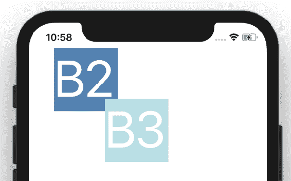

**B2**盒子现在相对于其父`View`。因此，其位置从父位置的左上角开始（因为我们没有填充或边距）。**B1**和**B2**盒子大小相同；**B2**覆盖了**B1**的所有内容。如果我们使用`{ width: 50, height: 50 }`稍微缩小**B2**，我们将看到**B1**在下面。我还将**B2**的文本字体大小更改为`40`以便清晰。查看`src/Chapter 3/Example 7`目录中的`App.js`。结果如下：

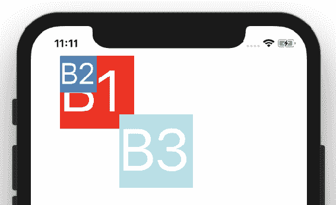

现在我们已经了解了绝对定位和相对定位，是时候学习一个称为 Flexbox 的伟大模式了。

# 使用弹性盒模型

这是我在样式方面学到的最伟大的模式之一。**弹性盒模型**（**Flexbox**）可以使您的盒子变得灵活。

让我们看一个小例子。目标是将您的盒子拉伸以填满屏幕的整个宽度：

```jsx
// src/ Chapter_3/ Example_8/ App.js
export default () => (
    <View style={{ flex: 1 }}>
 <View  style={{ backgroundColor: 'powderblue', height: 50 }}
        />
 </View> );
```

以下是前述代码的结果：

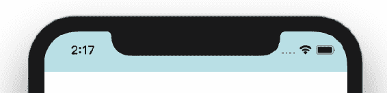由于我们使用了 flex: 1 样式，框延伸到整个屏幕宽度

这并不太花哨，但您不需要使用`Dimensions`。显然这只是一个开始。

您已经知道默认情况下视图是相对于彼此的，因此如果要制作一些条纹，只需将三个`div`堆叠在一起即可：

```jsx
// src/ Chapter_3/ Example_8/ App.js

export default () => (
    <View style={{ flex: 1 }}>
 <**View**  style={{ backgroundColor: 'powderblue', height: 50 }}
        />
 <**View**  style={{ backgroundColor: 'skyblue', height: 50 }}
        />
 <**View**  style={{ backgroundColor: 'steelblue', height: 50 }}
        />
 </View> );  
```

查看以下屏幕截图，看到三个盒子横跨整个屏幕的宽度：

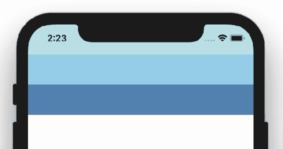三个盒子依次排列，每个盒子都使用从父 View 组件继承的 flex: 1 进行拉伸

现在，让我们使用这个相当简单的概念来创建头部、主要内容和页脚组件。为了实现这一点，让我们拉伸中间的`View`：

```jsx
<View
  style={{ backgroundColor: 'skyblue', flex: 1 }}
/>
```

现在中间的`View`延伸以填充所有可用空间，为头部`View`留下 50 dp，为页脚`View`留下另外 50 dp。

现在是时候向我们分割的屏幕添加一些有用的内容了。

在接下来的章节中，我将尝试使用示例来解释 Flexbox。但请也查看 Flexbox Froggy 游戏，以了解不同情景下的 flexbox。它提供了一个交互式编辑器，你的目标是将青蛙移动到相应的叶子上[`github.com/thomaspark/flexboxfroggy/`](https://github.com/thomaspark/flexboxfroggy/)。

# 使用 Flexbox 定位项目

第一个重要的关键是`flexDirection`。我们可以将其设置为`row`，`row-reverse`，`column`或`column-reverse`。Flex 方向使内容沿着该方向流动。在 React Native 中，默认情况下，flex 方向设置为`column`。这就是为什么在前面的示例中，框以列的形式显示的原因。

让我们使用`flexDirection`在页脚中显示三个小部分：`主页`，`搜索`和`关于`：

```jsx
// src / Chapter 3 / Example 9 / App.js
...
<View
  style={{
        backgroundColor: 'steelblue',
  height: 70,
  flexDirection: **'row'**
  }}
>
 <View><Text style={{ fontSize: 40 }}>Home</Text></View>
 <View><Text style={{ fontSize: 40 }}>Search</Text></View>
 <View><Text style={{ fontSize: 40 }}>About</Text></View> </View>
...
```

好的，现在我们的页脚中有三个单独的文本。我们将学习如何在第七章中切换屏幕的方法，*导航模式*。

我们的页脚看起来几乎没问题：

三个单独的页脚文本

现在是学习如何在 x 轴上均匀分布视图的时候了。如果`flexDirection`设置为`row`或`row-reverse`，我们可以使用`justifyContent`。`justifyContent`接受`flex-start`，`flex-end`，`center`，`space-between`，`space-around`和`space-evenly`值。我们稍后会使用它们。现在，让我们使用`space-between`。它将拉伸`主页`视图，`搜索`视图和`关于`视图，以在它们之间留下均匀的空间：

```jsx
...
    style={{
        backgroundColor: 'steelblue',
  height: 70,
  justifyContent: 'space-between'**,**
  flexDirection: **'row'**
  }}
...
```

结果如下：

页脚中的三个文本现在用均匀的空格分隔开来

虽然与 flexbox 无关，但我们可以添加一些填充使其更美观：

```jsx
paddingLeft: 10, paddingRight: 10
```

这样文本更容易阅读：

右边和左边的填充从屏幕边缘添加空间

如果我们还想垂直定位怎么办？有一个叫做`alignItems`的关键。它接受`flex-start`，`flex-end`，`center`，`stretch`和`baseline`值。

现在让我们把页脚的高度提高：100 个密度无关像素。此外，我们希望文本在垂直方向上居中：

```jsx
// src / Chapter 3 / Example 10 / App.js
...
    style={{
        backgroundColor: 'steelblue',
  height: 100,
  alignItems: 'center'**,**
  justifyContent: 'space-between',
  flexDirection: 'row',
  paddingLeft: 10,
  paddingRight: 10
  }}
...
```

查看结果：

页脚中的文本现在垂直居中

# 样式化 flex 项

当我们构建应用程序时，您可能很快意识到样式有点丑陋。调色板是一个完全的灾难。除非您是设计师，我建议您搜索调色板生成器。我已经将颜色更改为更可接受的：白色，黑色和蓝色。

此外，我已经添加了边距和填充。标题和内容之间通过边框很好地分隔开来。让我们看看在 iPhone 8 和 iPhone X 上的效果如何：

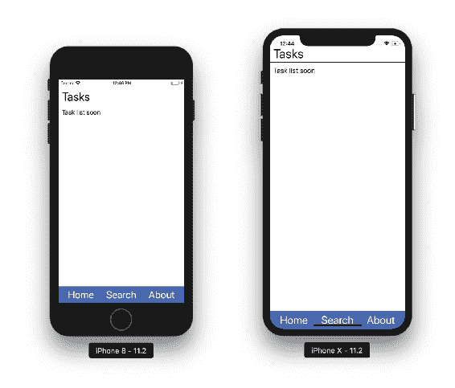

在颜色更改后，iPhone 8 和 iPhone X 模拟器上的完整应用程序外观

有些人可能不了解样式的基础知识，所以让我们快速解释一下边距和填充是什么。**边距**用于在元素周围创建空间。这个空间是从元素的边框创建的。如果您只想在某个地方应用空间，您可以选择顶部、底部、左侧或右侧。**填充**非常类似，但它不是在外部创建空间，而是在内部创建空间。空间是从边框内部创建的。查看元素检查器以直观地理解这一点。我已经检查了我们应用程序的标题，以了解样式是如何工作的：

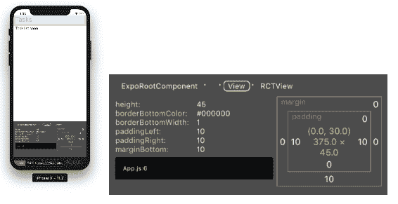

Header box 的边距和填充

在上一张截图中，填充用绿色标记，边距用橙色标记。组件空间是浅蓝色的。有关样式中指定的确切值，请查看图像的右侧部分。

要打开元素检查器，请摇动您的设备，当菜单打开时，选择切换元素检查器。如果您正在使用模拟器，您可以通过从模拟器菜单中选择硬件/摇动手势来模拟摇动。

以下是我用来创建`header`的样式：

```jsx
header: {
    height: 45,
  borderBottomColor: '#000000',
  borderBottomWidth: 1,
  paddingLeft: 10,
  paddingRight: 10,
  marginBottom: 10 },
// All the other styles are available in
// src/ Chapter_3/ Example_11/ App.js
```

接下来，让我们使页脚更具重复使用性。如果在某个时候，我们不需要“关于”链接，而是需要“通知”链接呢？这个词真的很长。它不适合我们的设计。虽然现在是一个问题，但如果我们计划添加翻译，我们也会在那里遇到这个问题。

大多数应用程序使用图标来解决这些问题。让我们试试：

1.  安装图标包：

```jsx
yarn add @expo/vector-icons
```

1.  更改页脚标记：

```jsx
// src/ Chapter_3/ Example_11/ App.js
<View style={styles.footer}>
 <Ionicons name="md-home" size={32} color="white" />
 <Ionicons name="md-search" size={32} color="white" />
 <Ionicons name="md-notifications" size={32} color="white" /> </View> 
```

新增的图标可以在以下截图中观察到：

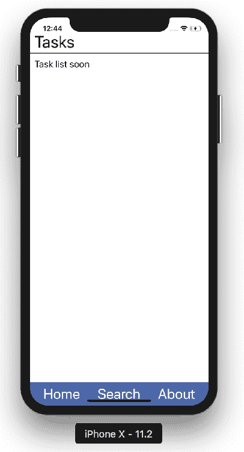应用程序的页脚现在由图标组成

页脚现在是可重复使用的，并支持任何语言。如果您支持他们的语言，请检查其他国家的图标含义。

# 样式内容

我们已经使用方向行定位了页脚。现在是定位主要内容和列的时候了。在之前的章节中，我们创建了一个任务列表。现在是将其与我们的设计整合的时候了。

将`TaskList`组件添加到内容框中。我还添加了`ScrollView`组件，以便在任务占用太多空间无法全部显示时使内容可滚动：

```jsx
import data from './tasks.json';

// ... header
<**ScrollView** style={styles.content}>
 <**TaskList** tasks={data.tasks} /> </**ScrollView**>
// ... footer
```

我的任务模拟在 JSON 文件中呈现如下。在本书的后面，我们将学习如何从后端服务器获取任务以及如何将这样的逻辑与标记分离：

```jsx
{
  "tasks": [
    {
      "name": "Task 1",
  "description": "Task 1 description...",
  "likes": 239
  },
 //... more comma separated tasks here
  ]
}
```

有了模拟，我们可以实现`TaskList`视图：

```jsx
const TaskList = ({ tasks }) => (
    <View>
  {tasks.map(task => (
            <View key={task.name}>
 <Text>{task.name}</Text>
 <Text>{task.description}</Text>
 <LikeCounter likes={task.likes} />
 </View>  ))}
    </View> );
// separate component for each task is not created for book clarity 
```

`LikeCounter`是从`Chapter 2 / Example 8 / src`复制并调整以接受点赞作为 props（替换默认的零）。请注意，它也使用了 Flexbox，并且`flexDirection`设置为行。

现在，我们准备样式内容。这是我们的起点：

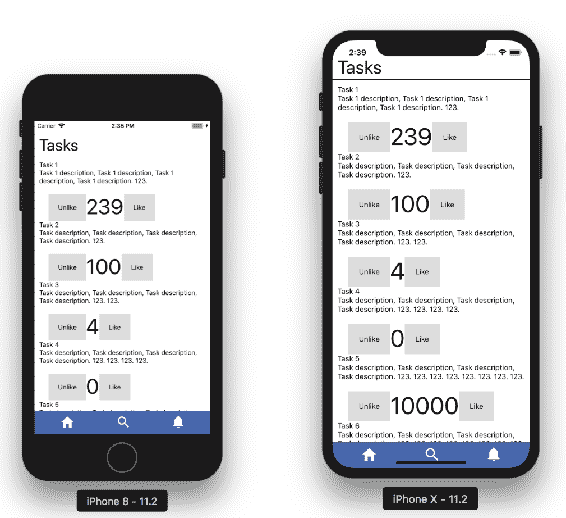

iPhone 8 和 iPhone X 模拟器的当前外观

我们想重新组织每个任务的内容。**点赞**和**取消点赞**小部件应该显示在任务的右侧，并且应该使用图标。任务名称应该比描述稍大，并且应该适合任务宽度的 70%。右侧的点赞/取消点赞小部件应该用细灰色边框分隔。边框也应该分隔任务。在必要的地方添加漂亮的填充和边距：

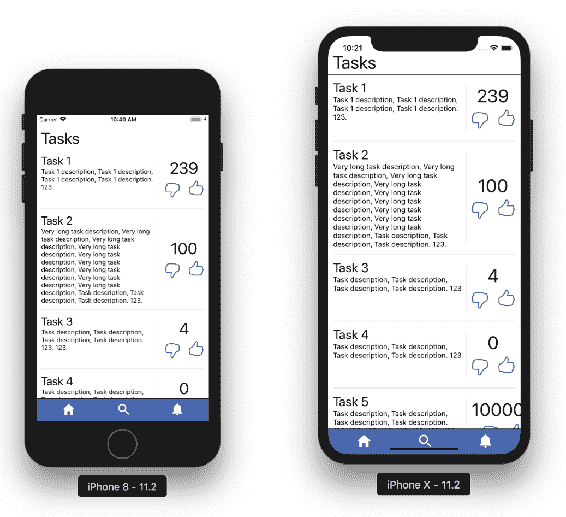

iPhone 8 和 iPhone X 模拟器的期望外观

好的，我们如何开始？我们需要将事情分解成可以分别实现的小块。创建以下内容：

+   具有任务容器样式和顶部边框样式的任务`View`。

+   两个内部`Views` - 一个用于名称和描述，另一个用于点赞计数器。这些应该以行的形式显示。

+   名称和描述`View`内应该有两个`Views`：一个用于名称，一个用于描述。添加样式使名称的`fontSize`更大。

+   点赞计数器`View`容器应该在左边定义边框。容器内应该有两个`Views`：一个用于点赞数量，另一个用于点赞/取消点赞图标。这些`Views`应该使用列作为默认方向。

+   具有点赞/取消点赞图标的`View`应该具有行方向的 flexbox 样式。

有了这个，使用`alignItems`和`justifyContent`来垂直或水平定位元素。请从检查器中查看辅助图像：

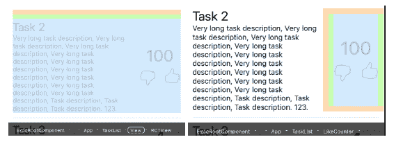

已实现组件的检查器视图。作为实现的提示。

橙色高亮表示`View`边距，绿色高亮表示`View`填充。

尝试自己实现这个。完整的解决方案可以在`src/ Chapter_3/ Example_12/ src/`文件夹中的`App.js`、`TaskList.js`和`LikeCounter.js`文件中找到。

# 解决文本溢出问题

最常见的问题之一是文本溢出。解决这个问题最简单的方法是换行，但有时不可能。例如：

+   按钮文本

+   需要显示的大数字（例如，点赞数）

+   不应该被分解的长单词

问题是：我们如何解决这个问题？有很多解决方案。让我们看看其中一些。

# 缩小字体

这在 iOS 上是可能的。

```jsx
<Text
  style={styles.text}
    numberOfLines={1}
    **adjustsFontSizeToFit** >
  {this.state.likeCount}
</Text>
```

但是，在我们的情况下，结果是完全灾难性的。即使我们在这个缩放解决方案上付出了一些工作，布局仍然感觉非常不一致：

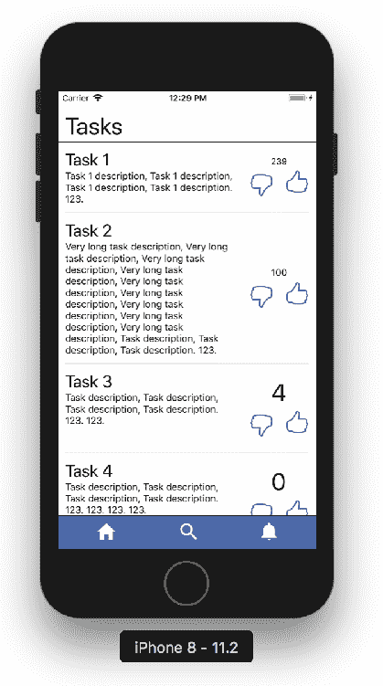使用 iOS 的 adjustsFontSizeToFit 属性进行自动字体调整正如本书前面所示，您可以使用`Dimensions`而不是依赖`adjustsFontSizeToFit`。基于`Dimensions`，您可以创建一个缩放函数来计算`fontSize`。

# 截断文本

另一种方法被称为**截断**。根据文本长度，您可以在某个位置截断它，并用三个点`...`代替。然而，这种方法对我们的用例不好。我们处理的是点赞数，我们想知道数字是多少：

```jsx
<Text style={styles.text}>
  {
        this.state.likeCount.toString().length > 4
  ? `${this.state.likeCount.toString().substring(0, 4)}**...`**
  : this.state.likeCount
  }
</Text>
```

观察以下截断的点赞数：

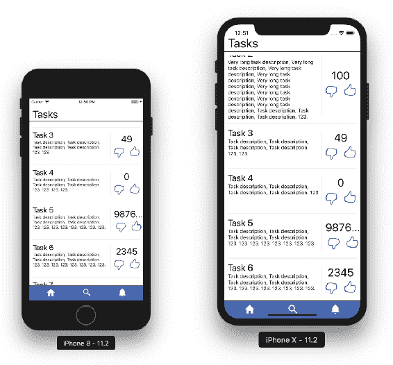

截断的数字是没有意义的，这个解决方案只适用于文本

# 使用千位分隔符社交媒体表示法

您知道 kilo 表示 1,000。社交媒体设计师将这个想法推广到了网络和移动设备。每当一个数字大于 1,000 时，他们用 K 替换最后的 3 位数字。例如 20K 表示 20,000。

微不足道的实现：

```jsx
const likes = this.state.likeCount.toString();
...
<Text style={styles.text}>
  {
        likes.length > 3
  ? `${likes.substring(0, likes.length - 3)}**K`**
  : likes   }
</Text>
```

然而，一个数字如*9,876,543,210*将再次溢出。但 9,876,543K 仍然太长。让我们用一个简单的递归函数来解决这个问题：

```jsx
// src / Chapter 3 / Example 12 / src / LikeCounter.js

kiloText = (nr, nrK = 0) => (nr.length > 3
  ? this.kiloText(nr.substring(0, nr.length - 3), nrK + 1)
    : nr + Array(nrK).fill('K').join(''))
```

该算法的工作原理如下：

该函数接受一个字符串格式的数字和一个可选参数，指示原始数字已经剥离了多少千。

它检查是否可以再减去一千，如果可以，就返回自身的结果，其中数字减去三个数字，千位数增加一。

如果数字长度小于四，计算文本：取数字并附加相应数量的 K 作为后缀。我们使用一个巧妙的技巧来计算 K：创建一个大小等于 K 数量的数组，用 K 字符串填充每个元素，并将所有元素连接成一个长字符串。现在 JSX 简单多了：

```jsx
<Text style={styles.text}>
  {this.kiloText(likes)}
</Text> 
```

检查结果如下。长数字现在使用千位符号显示：

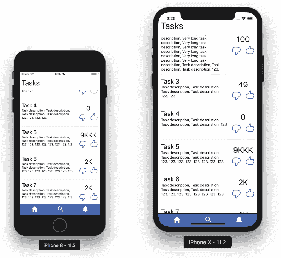

现在使用千（K）符号显示大的点赞数

可以肯定地说，点赞数不会超过 9,000,000,000。如果需要支持更大的数字，请尝试使用**M**或**B**字母。

# React Native 动画

当我们构建应用程序时，我们需要关注**用户体验**（**UX**）。其中一部分是使我们的屏幕更加生动并提供对操作的即时反馈的动画。如果你自己玩过我们的应用程序，你会发现当你点击喜欢/不喜欢图标时，它会有一个小闪烁效果。这种效果是由`TouchableOpacity`自带的。现在是时候学习如何在我们自己的应用程序中实现这样的功能了。

# 什么是动画？

当我第一次阅读 Animated 库的文档时，我吓了一跳。有很多新词汇需要你适应。与其直接深入其中，不如先了解动画到底是什么。

动画是组件样式随时间的变化。

记住：你需要一个样式属性，它的起始值和结束值。动画是当这个值随着时间从起始值到结束值时所看到的。你可以组合许多属性，可能同时对许多组件进行动画处理。

存储随时间变化的变量的常见和推荐方法是组件状态。React Native Animated 提供了一个特殊的类，以非常高效的方式实现了这个功能：`Animated.Value`。例如：

```jsx
state = {
    fadeIn: new Animated.Value(0)
}
```

# 随时间改变属性

在 React Native 中，有三种主要的创建动画的方式：

+   `Animated.timing()`: 以毫秒为单位的时间和期望的结束值，并将它们映射到你的`Animated.Value`。

+   `Animated.decay()`: 从初始速度开始，然后慢慢衰减。

+   `Animated.spring()`: 提供了一个简单的弹簧物理模型。

让我们看看它是如何运作的。我们的目标是在应用程序启动时淡入应用程序。为了实现淡入效果，我们将从 0 到 1 操纵不透明度。动画应该持续两秒：

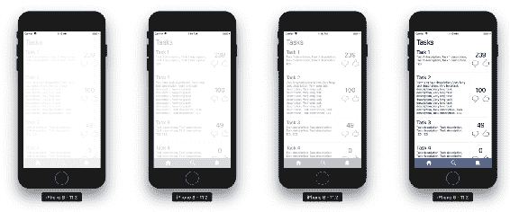

显示随时间推移不透明度动画进度的图像序列

`Animated.timing`需要两个参数：要操作的变量和配置对象。在配置对象中，您需要指定`toValue`键，以告诉函数在毫秒的持续时间后您的变量应该是什么结束值 - 在我们的情况下是 2,000。我选择了两秒只是为了让动画更容易看到。随意尝试：

```jsx
// src/ Chapter_3/ Example_13/ src/ App.js
class App extends React.Component {
    state = {
        fadeIn: new Animated.Value(0)
    }

    componentDidMount() {
        this.fadeInApp();
  }

    fadeInApp() {
        Animated.timing(
 this.state.fadeIn,
  {
 toValue: 1,
  duration: 2000,
  easing: Easing.linear
  }
 ).start()**;**
  }

    render = () => (
        <**Animated.View**
  style={[
                styles.appContainer,
  { opacity: this.state.fadeIn }
            ]}
        >
 ... // rest of render removed for clarity  </**Animated.View**>  )
}
```

我们还引入了一个新组件：`Animated.View`。它使我们通常的`View`组件支持动画。

React Native Animated 提供了可动画化的组件：`Animated.Image`、`Animated.ScrollView`、`Animated.Text`和`Animated.View`，但您也可以使用`createAnimatedComponent()`函数定义自己的组件。

此外，在配置对象中，我们指定了**easing**。缓动是动画应该如何进行的方式。如果它应该随时间线性改变值，那么使用`Easing.linear`。然而线性并不自然。查看下一节以了解更多关于缓动函数的信息。

学习动画需要时间。您可以创建无数不同的场景，应该自己尝试 API。特别是当涉及到`Animated.decay`和`Animated.spring`时。我在书中没有涵盖它们，因为它不是一个非常大的模式，它只是您需要学习的另一个 API。在接下来的章节中，我们将专注于如何链接动画，然后如何使它们性能良好。

想想如何使用`Animated.decay`创建一个可拖动的框。您还需要一个`PanResponder`组件。在触摸事件释放时，它应该保持在相同方向上的速度，并在飞行一段距离后慢慢停止。

第二个练习可能是实现一个带有按钮的红色正方形框。在按下按钮时，正方形框应该通过另外 15 个独立像素来扩展其宽度和高度。所有这些都应该通过弹簧动画完成，因此宽度应该略微超过 15，然后再回到 15。就像弹簧一样。

如果这两个练习听起来很困难，请继续下一节。一旦您了解了缓动函数，它们应该会变得更容易。

# 缓动函数

动画是随时间的变化。这种变化可以以多种方式应用。确定随时间变化的新值的函数称为缓动函数。

为什么我们使用缓动函数而不是线性缓动？我喜欢的常见例子是抽屉的打开。当您在现实世界中打开抽屉时，这是一个线性过程吗？也许不是。

现在让我们看看常见的缓动函数。有几种。选择适合您应用程序的那个：

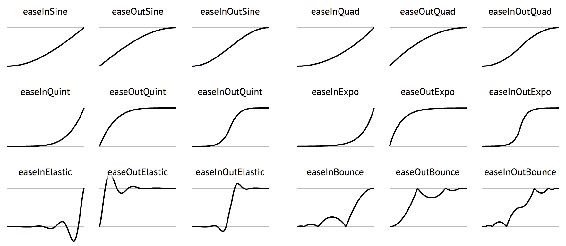许多不同的缓动函数，以及每个函数随时间变化的可视化。

在图表上，灰色线表示起始值和结束值。黑线表示值随时间的变化。最终，黑线达到了上方的灰色线。正如您所见，一些缓动函数会低于起始值或超过结束值。这些可能对突出重要操作很有用。

想看更多缓动函数？查看[`easings.net/`](http://easings.net/)。

大多数这些函数可以使用 RN Easing 模块实现。

回到 React Native 缓动。我为您准备了一个应用程序，让您玩转缓动函数。您可以在`src/ Chapter_3/ Example_14/ App.js`找到源代码：

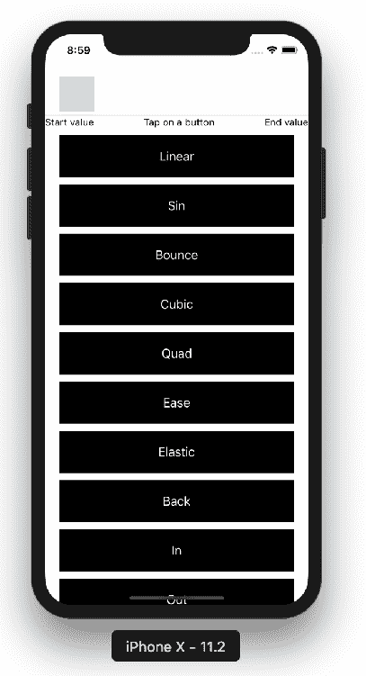缓动函数游乐场应用

当您点击按钮时，您将看到一个框从左到右移动，使用相应的缓动函数。

至于动画，我是通过操纵框的`marginLeft`来实现的。动画从`marginLeft`设置为 20 开始，并应用缓动函数在 2 秒内达到 300：

```jsx
// src/ Chapter_3/ Example_14/ App.js
// ...
animate(easing) {
    this.easeValue.setValue(20);
  Animated.timing(
        this.easeValue,
  {
            toValue: 300,
  duration: 2000,
  easing
        }
    ).start(); }

onPress = easingName => this.animate(Easing[easingName.toLowerCase()]);
// ... 
```

# 调度事件

现在我们知道如何创建动画，现在让我们谈谈如何安排它们。

最简单的方法是延迟动画调度：

+   `Animated.delay()`: 在给定的延迟后开始动画。如果您需要延迟对用户操作的响应，这很有用。但通常情况下并不需要。

让我们谈谈我们想要安排的事件数组。应该分派多个事件。如果我们需要所有事件同时发生，这也很简单：

+   `Animated.parallel()`: 同时开始多个动画。但如果我们需要按顺序进行呢？这就是序列的用处。

+   `Animated.sequence()`: 按顺序开始动画，等待每个动画完成后再开始下一个。还有一个并行的变体，称为 stagger。

+   `Animated.stagger()`: 按顺序和并行启动动画，但具有连续的延迟。

练习时间：用彩色框填满屏幕。行应该以交错的方式一个接一个地出现在屏幕上：

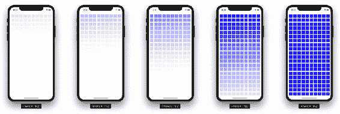

显示随时间变化的交错动画的图像

完整的实现可在`src/ Chapter_3/ Example_15/ App.js`中找到。让我们看一下关键片段：

```jsx
// ...
getFadeInAnimation = animatedVal =>
    Animated.timing(animatedVal, { toValue: 1, duration: 5000 });   componentDidMount() {
    const animations = Boxes.map(box =>
        this.getFadeInAnimation(this.state[box]));
  Animated.stagger(10, animations).start(); }
// ...
```

第一个函数只是一个辅助函数。它生成一个定时动画。我们使用这个辅助函数来生成所有的动画，并将它们收集在`animations`变量中。辅助函数期望`animatedVal`，它将被缓慢到 1。在我的实现中，我为每个框创建了一个单独的`Animated.Value`。最后，我将生成的动画数组传递给`stagger`并立即开始。

很不错的动画，对吧？现在，让我们谈谈性能。

# 测量 FPS

网站和移动应用程序很少使用动画。大多数情况下，这是对用户行为的响应，往往是缓慢的。如果您曾经玩过动态电脑游戏，您可能还记得这是一个不同的世界。是的，当我们深入研究动画时，有一件事来自电脑游戏，您应该记住：**FPS**。

每秒帧数 - 屏幕上的所有内容都以光学幻觉的形式出现在运动中，这是由于以一致的速度快速更改帧而创建的。60 FPS 意味着每秒 60 帧，这意味着您每 16.67 毫秒看到一个新帧。JavaScript 需要在这么短的时间内传递该帧，否则帧将被丢弃。如果是这样，您的 FPS 指标将低于 60。

React Native 以其在大多数应用程序中的惊人性能而闻名：**60 FPS**。但是，当我们开始使用大量动画时，我们很快就会降低性能。在本节中，我想向您展示如何测量应用程序的 FPS。

让我们检查一下我们之前的动画表现如何：

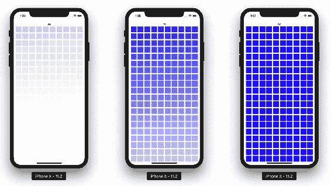

显示随时间变化的交错动画的图像

我们将测量这个动画。在模拟器上，我得到**48** FPS，动画已经进行了一半。接近完成时，FPS 降至**18**。当所有动画完成时，FPS 恢复到正常的 60。我还在我的真实手机（iPhone 7 plus）上进行了检查，结果类似。

这只是开发环境中 FPS 下降的一个例子。然而，您应该在真实的生产版本中测试您的应用程序。在[`facebook.github.io/react-native/docs/performance.html`](https://facebook.github.io/react-native/docs/performance.html)了解更多。

# 如何测量 FPS

现在是时候学习如何检查 FPS 了。有两种主要方法：

+   使用工具，比如 Perf Monitor。它提供了这个功能。它还允许您测量本机环境。

+   编写自定义 JavaScript 代码来测量 FPS。这只会测量 JS 线程的性能。

使用*Create React Native* App 的性能监视器就像摇动您的设备并选择“显示 Perf Monitor”选项一样简单：

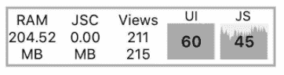显示性能监视器。数字 60 和 45 代表 FPS 测量的最新值

在 JavaScript 中实现自己的解决方案应该依赖于所需的 60FPS 意味着每 16.67ms（1000ms/60）有一帧。我为您创建了一个简单的示例：

```jsx
// src / Chapter 3 / Example 16 / App.js
constructor() {
    // ...   let FPScounter = 0;
 setInterval(() => FPScounter++, 16)**;**
  setInterval(() => {
        this.setState({ fps: FPScounter });
  FPScounter = 0;
  }, 1000); }  // ... render = () => (
    // ...  <Text>FPS: {this.state.fps}</Text>
 // ...  );
// makes sure these measures are only done in dev environment
// and never leak to the production app!
// Beware: This example is not really very accurate and performant
// I have made it to illustrate the idea
```

由于本书致力于教授设计模式，我希望您也能检查您的解决方案是否具有高性能。

# 总结

在本章中，您学会了如何为 React Native 应用程序设置样式。我们介绍了许多不同的元素定位方式，您还学会了我们的设计如何在真实设备上呈现。最后，我们制作了一些动画，并根据 FPS 进行了测量。

到目前为止，我们知道如何使用 React 组件创建可重用的代码，以及如何对它们进行样式设置。我们使用本地 JSON 文件中存储的有限数据进行了工作。现在是时候让我们的应用程序变得更加复杂，并讨论影响大型应用程序的不同场景。在下一章中，您将学习 Flux，这是一种架构模式。
