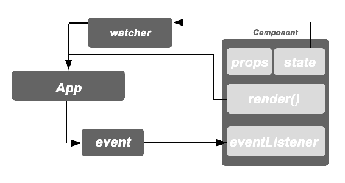
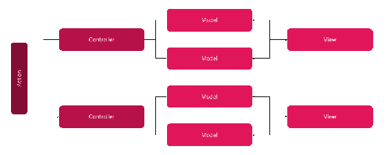
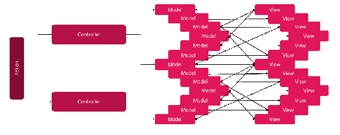
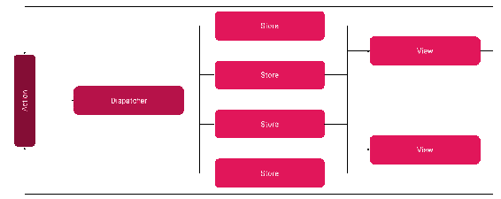
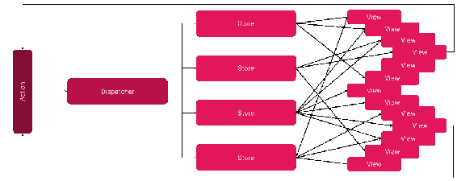
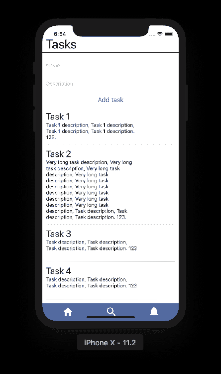
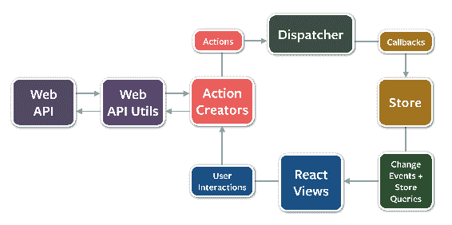

# 第四章：Flux 架构

如果你之前使用过 React，你可能已经听说过 Flux。如果没有，不用担心。Flux 是用于构建 React 用户界面的一种架构模式。我们将从 React 使用的单向数据流模式开始，然后进入 Flux。Flux 的每一个部分都很重要，我强烈建议你在这一章节花一些时间。你至少应该明白如何分离代码以及如何使用 Flux 将应用程序分割成部分。这些相互连接的小服务负责现代移动应用程序所需的一切。

# 单向数据流模式

在我们深入了解 Flux 架构之前，让我们先看看这种模式的历史背景。我希望你能理解为什么要引入它。

当我看到 Facebook 的开发人员谈论 Flux 架构时，我有一种直觉，他们从 **模型-视图-控制器** (**MVC**) 模式转向了 Flux。MVC 模式是将业务模型与视图标记和编码逻辑解耦。逻辑由一个称为控制器的函数封装，并将工作委托给服务。因此，我们说我们的目标是精简控制器。

然而，在像 Facebook 这样的大规模应用中，看起来这种模式还不够。因为它允许双向数据流，很快就变得难以理解，甚至更难追踪。一个事件引起的变化可能会循环回来，并在整个应用程序中产生级联效应。想象一下，如果你必须在这样的架构中找到一个 bug。

# React 的单向数据绑定

React 对上述问题的解决方案始于单向数据绑定。这意味着视图层由组件维护，只有组件才能更新视图。组件的 `render` 函数计算出结果的原生代码，并显示给最终用户。如果视图层需要响应用户的操作，它只能分发由组件处理的事件。它不能直接改变 **state** 或 **props**。

让我们看一下下面的图表，它说明了这个概念：



**App**块代表了原生视图层的状态。在图中，组件被简化为：属性、状态、`render`函数和事件监听器。一旦属性或状态发生变化，观察者就会调用`render`函数来更新原生视图。一旦用户执行操作，相应的事件就会被分派，然后被事件监听器捕获。

在双向数据绑定模式中，**App**层不需要分派事件。它可以直接修改组件的状态。我们也可以用事件监听器来模拟这一点。其中一个例子就是受控输入，我们在第二章中学习过，*视图模式*。

# 事件问题

*"伴随着巨大的自由而来的是巨大的责任。"*

你可能已经听过这句话。这种情绪适用于我们分派和处理的事件。让我们讨论一些问题。

首先，要监听事件，您需要创建一个事件监听器。何时应该创建它？通常情况下，我们在具有标记的组件中创建事件监听器，并使用`onClick={this.someEventListener}`进行注册。如果这个事件需要导致完全不同的组件发生变化呢？在这种情况下，我们需要将监听器提升到组件树中的某个容器中。

当我们这样做时，我们注意到我们将越来越多的组件紧密耦合，将越来越多的监听器传递到属性链中。如果可能的话，这是我们想要避免的噩梦。

因此，Flux 引入了 Dispatcher 的概念。Dispatcher 将事件发送到所有注册的组件。这样，每个组件都可以对与其相关的事件做出反应，而忽略与其无关的事件。我们将在本章后面讨论这个概念。

# 绑定的进一步问题

仅使用单向数据绑定是不够的，正如你所看到的。我们很快就会陷入模拟双向数据绑定的陷阱，或者遇到前面部分提到的事件问题。

一切都归结为一个问题：我们能处理吗？对于大规模应用程序，答案通常是*不行*。我们需要一个可预测的模型，保证我们能够迅速找出发生了什么以及为什么。如果事件在我们的应用程序中随处发生，开发人员显然将不得不花费大量时间找出具体是什么导致了检测到的错误。

我们如何缩小这个问题？答案是限制。我们需要对事件流施加一些限制。这就是 Flux 架构发挥作用的地方。

# Flux 简介

Flux 架构对组件之间的通信创建了一些限制。其主要原则是普遍的动作。应用程序视图层通过向分发器发送动作对象来响应用户动作。分发器的作用是将每个动作发送到订阅的**存储**。您可以拥有许多存储，每个存储都可以根据用户的动作做出不同的反应。

例如，想象一下你正在构建一个基于购物车的应用程序。用户可以点击屏幕将一些项目添加到购物车中，随后相应的动作被分发，您的购物车存储对此做出反应。此外，分析存储可能会跟踪用户已将此类项目添加到购物车中。两者都对同一动作对象做出反应，并根据需要使用信息。最终，视图层会根据新状态进行更新。

# 替换 MVC

为了增强 MVC 架构，让我们回顾一下它的外观：



动作由各自的控制器处理，这些控制器可以访问模型（数据表示）。视图通常与模型耦合，并根据需要对其进行更新。

当我第一次阅读这个架构时，我很难理解它。如果你还没有亲自使用过它，让我给你一些建议：

+   动作：将其视为用户的动作，例如按钮点击、滚动和导航更改。

+   控制器：这是负责处理动作并显示适当的本机视图的部分。

+   模型：这是一个保存信息的数据结构，与视图分离。视图需要模型来根据设计进行视觉显示。

+   视图：这是最终用户所看到的内容。视图描述了所有的标记代码，以后可以进行样式化。视图有时与样式耦合在一起，被称为一个整体。

随着应用程序的增长，小型架构迟早会变成以下的样子：



在这个图表中，我试图通过在模型结构中创建缩进来显示一些模型依赖于其他模型。视图也是类似的情况。这不应被视为不好。一般来说，这种架构在某种程度上是有效的。问题出现在当您发现错误时，却无法确定错误出现的位置和原因。更准确地说，您失去了对信息流的控制。您会发现自己处于一个同时发生许多事情的位置，以至于您无法轻易预测是什么导致了失败，也无法理解为什么会发生。有时，甚至很难重现错误或验证它是否实际上是一个错误。

从图表中可以看出，模型-视图通信存在问题：它是双向的。这是软件多年来一直在做的事情。一些聪明的人意识到，在客户端环境中，我们可以承担单向数据流。这将有效地使架构可预测。如果我们的控制器只有一系列输入数据，然后应该提供视图的新状态，那将会更清晰。单元测试可以提供一系列数据，比如输入，并对输出进行断言。同样，跟踪服务可以记录任何错误并保存输入数据系列。

让我们来看一下 Flux 提出的数据流：



所有操作都通过分发器进行，并且然后发送到注册的存储回调。最终，存储内容被映射到视图。

随着时间的推移，这可能变得复杂，就像下图所示的那样：



您可能会有各种不同的存储库，这些存储库在不同的视图或视图部分中使用。我们的视图组合成用户看到的最终视图。如果发生了变化，另一个操作将被分派到存储库中。这些存储库计算新状态并刷新视图。

这样就简单多了。我们现在可以跟踪操作，并查看哪个操作导致了存储中不需要的更改。

# 以示例说明 Flux

在我们深入研究 Flux 之前，让我们使用 Flux 架构创建一个简单的应用程序。为此，我们将使用 Facebook 提供的 Flux 库。该库包括我们需要的所有组件，以便根据新的 Flux 流使应用程序正常运行。安装 Flux 和`immutable`库。随着我们对 Flux 的了解越来越多，`immutable`也对进一步的优势至关重要：

```jsx
yarn add flux immutable
```

我们在 Flux 中构建的应用程序是一个 Tasks 应用程序。我们已经创建的应用程序需要一些调整。首先要做的是创建`Dispatcher`，Tasks 存储和任务操作。

Flux 包提供了我们架构的基础。例如，让我们为我们的 Tasks 应用程序实例化`Dispatcher`：

```jsx
// src / Chapter 4_ Flux patterns / Example 1 / src / data / AppDispatcher.js
import { Dispatcher } from 'flux';   export default new Dispatcher(); 
```

`Dispatcher`将用于调度操作，但我们需要首先创建操作。我将遵循文档建议，首先创建操作类型：

```jsx
// src / Chapter 4_ Flux patterns / Example 1 / src / data / TasksActionTypes.js
**const** ActionTypes = {
 ADD_TASK: 'ADD_TASK' }**;**   export default ActionTypes; 
```

现在我们已经创建了类型，接下来应该跟进操作创建者本身，如下所示：

```jsx
// src / Chapter 4_ Flux patterns / Example 1 / src / data / TaskActions.js
import TasksActionTypes from './TasksActionTypes'; import AppDispatcher from './AppDispatcher';   const Actions = {
    addTask(task) {
 AppDispatcher.dispatch({
 type: TasksActionTypes.ADD_TASK,
  task
 });
  }
};   export default Actions; 
```

到目前为止，我们有了操作和调度它们的工具。缺失的部分是`Store`，它将对操作做出反应。让我们创建`TodoStore`：

```jsx
// src / Chapter 4_ Flux patterns / Example 1 / src / data / TaskStore.js
import Immutable from 'immutable'; import { ReduceStore } from 'flux/utils'; import TasksActionTypes from './TasksActionTypes'; import AppDispatcher from './AppDispatcher';   class TaskStore extends ReduceStore {
    constructor() {
        super(AppDispatcher)**;**
  }

    getInitialState() {
        return Immutable.List([]);
  }

    reduce(state, action) {
 switch (action.type) {
 case TasksActionTypes.ADD_TASK:
 return state; // <= placeholder, to be replaced!!!   default:
 return state;
  }
 }
}

export default new TaskStore(); 
```

要创建存储，我们从`flux/utils`导入`ReduceStore`。存储类应该扩展以提供必要的 API 方法。我们将在以后的部分中介绍这些。就目前而言，您应该已经注意到您需要在构造函数中使用`super`将`Dispatcher`传递给上层类。

另外，让我们为`ADD_TASK`实现`reduce`情况。相同的流程可以调整到您想要创建的任何其他操作类型：

```jsx
reduce(state, action) {
    switch (action.type) {
    case TasksActionTypes.ADD_TASK:
        if (!action.task.name) {
            return state;
  }
        return state.push({
            name: action.task.name,
  description: action.task.description,
  likes: 0
  });
  default:
        return state;
  }
}
```

现在我们已经拥有了 Flux 架构的所有要素（`Action`，`Dispatcher`，`Store`和`View`），我们可以将它们全部连接起来。为此，flux/utils 提供了一个方便的容器工厂方法。请注意，我将重用我们以前任务应用程序的视图。为了清晰起见，我已经删除了喜欢的计数器：

```jsx
// src / Chapter 4 / Example 1 / src / App.js
import { Container } from 'flux/utils'; import TaskStore from './data/TaskStore'; import AppView from './views/AppView';   const getStores = () => [TaskStore]; const getState = () => ({ tasks: TaskStore.getState() })**;**   export default Container.createFunctional(AppView, getStores, getState);
```

如果您没有从头开始阅读本书，请注意我们在这里使用容器组件。这种模式非常重要，需要理解，我们在第一章中已经介绍过了，*React 组件模式*。在那里，您可以学习如何从头开始创建容器组件。

我们的应用程序现在配备了 Flux 架构工具。我们需要做的最后一件事是重构以遵循我们的新原则。

为此，这是我们的任务：

1.  初始化存储与任务，而不是直接将 JSON 数据传递给视图。

1.  创建一个添加任务表单，当提交时会调度一个`ADD_TASK`操作。

第一个相当简单：

```jsx
// src / Chapter 4_ Flux patterns / Example 1 / src / data / TaskStore.js
import data from './tasks.json';

class TaskStore extends ReduceStore {
// ...
    getInitialState() {
 return Immutable.List([...data.tasks]);
  }
// ...
```

第二个要求我们使用`Input`组件。让我们创建一个负责整个功能的单独文件。在这个文件中，我们将为名称和描述创建状态，一个`handleSubmit`函数，该函数会调度`ADD_TASK`操作，以及一个包含表单视图标记的`render`函数：

```jsx
// src / Chapter 4_ Flux patterns / Example 1 / src / views / AddTaskForm.js

export const INITIAL_ADD_TASK_FORM_STATE = {
    name: '',
  description: '' };   class AddTaskForm extends React.Component {
    constructor(props) {
        super(props);
  this.handleSubmit.bind(this);
  }

    state = INITIAL_ADD_TASK_FORM_STATE**;**    handleSubmit = () => {
 TaskActions.addTask({
 name: this.state.name,
  description: this.state.description
  });
  this.setState(INITIAL_ADD_TASK_FORM_STATE);
  }**;**    render = () => (
        <View style={styles.container}>
 <**TextInput**  style={styles.input}
                placeholder="Name"
  onChangeText={name => this.setState({ name })}
                value={this.state.name}
            />
 <**TextInput**  style={styles.input}
                placeholder="Description"
  onChangeText={d => this.setState({ description: d })}
                value={this.state.description}
            />
 <**Button**  title="Add task"
  onPress={() => this.handleSubmit()}
            />
 </View>  ); }

// ... styles
```

完全功能的应用程序将如下所示：



现在我们已经创建了遵循 Flux 架构的第一个应用程序，是时候深入了解 API 了。

# 详细的 Flux 图

让我们以更正式的方式来看 Flux 架构。这里有一个简化架构的小图表：

官方文档中的 Flux 图：https://github.com/facebook/flux

在前面的图表中，每个部分都有自己在循环链中的目的：

+   调度程序：应用程序中发生的一切都由它来管理。它管理动作并将它们提供给注册的回调函数。所有动作都需要通过调度程序。调度程序必须公开`register`和`unregister`方法来注册/注销回调，并必须公开`dispatch`方法来分发动作。

+   存储：应用程序由多个在调度程序中注册回调的存储组成。每个存储需要公开一个接受`Dispatcher`参数的`constructor`方法。构造函数负责使用给定的调度程序注册此存储实例。

+   React 视图：这个主题在上一章中已经涵盖过了。如果你没有从头开始阅读这本书，请看一下。

+   操作创建者：这些将数据组合成一个动作对象，然后交付给调度程序。这个过程可能涉及数据获取和其他手段来获取必要的数据。操作创建者可能会导致**副作用**。我们将在下一节中涵盖这个主题。操作创建者必须在最后返回一个普通的动作对象。

您可以在以下链接下找到每个部分的完整 API 参考：

[`facebook.github.io/flux/.`](https://facebook.github.io/flux/)

# 什么是副作用？

副作用是在被调用函数之外发生的应用程序状态更改——确切地说，除了其返回值之外的任何状态更改。

这里有一些副作用的例子：

+   修改全局变量

+   修改父作用域链中的变量

+   写入屏幕

+   写入文件

+   任何网络请求，例如，AJAX 请求

这部分关于副作用的内容旨在让你为下一章做好准备，在那里我们将在 Redux 的上下文中讨论纯函数。此外，我们将在《第九章》《函数式编程模式》中进一步推进这些想法，您将学习如何从函数式编程实践中受益，例如可变和不可变对象，高阶函数和单子。

# 为什么要识别副作用？

副作用操纵的是不属于函数属性的状态。因此，当我们孤立地看待函数时，很难评估函数对应用程序是否有任何负面影响。这不仅在单元测试中成立；在进行数学证明时也很麻烦。一些必须安全的大型应用程序可以努力构建一个经得起考验的数学模型。这样的应用程序使用超出本书材料的数学工具进行验证。

副作用，当被隔离时，可以作为我们应用程序的数据提供者。它们可以在最佳时机“注入”流程，从那时起，数据就被视为变量。从一个无副作用的函数到另一个。这样的无副作用函数链更容易调试，并且在某些情况下可以重播。通过重播，我指的是传递完全相同的输入数据来评估输出，并查看是否符合业务标准。

让我们从 MVC 和 Flux 的角度来看这个概念的实际面。

# 在 MVC 中处理副作用

如果我们遵循经典的 MVC 架构，我们将按照以下关注点的分离工作：模型、视图和控制器。此外，视图可能会暴露直接更新模型的函数。如果发生这种情况，可能会触发副作用。

有几个地方可以放置副作用：

+   控制器初始化

+   控制器相关服务（这项服务是一个解耦的专业逻辑部分）

+   视图，使用作为回调暴露的控制器相关服务

+   在某些情况下，对模型进行更新（服务器-客户端双向模型）

我相信你甚至可以想出更多。

这种自由是以巨大的代价为代价的。我们可以有几乎无限数量的与副作用交织在一起的路径，如下所示：

+   副作用 => 控制器 => 模型 => 视图

+   控制器 => 副作用 => 模型 => 视图

+   控制器 => 视图 => 模型 => 副作用

这会破坏我们以无副作用的方式对整个应用程序进行推理的能力。

MVC 通常如何处理这个问题？答案很简单——大部分时间这种架构并不关心它。只要我们能通过单元测试断言应用程序按预期工作，我们就会很满意。

但后来 Facebook 出现了，并声称我们可以在前端做得更好。由于前端的特殊性质，我们可以更有条理地组织和规定流程，而不会有显著的性能损失。

# 在 Flux 中处理副作用

在 Flux 中，我们仍然保留选择触发副作用的自由，但我们必须尊重单向流。

Flux 中可能的副作用示例包括以下内容：

+   在用户点击时下载数据，然后将其发送给分发器

+   分发器在发送数据给注册的回调之前下载数据

+   存储开始同步副作用以保留更新所需的数据

一个好主意是强制副作用只发生在 Flux 架构中的一个地方。我们可以只在操作触发时执行副作用。例如，当用户点击触发`SHOW_MORE`操作时，我们首先下载数据，然后将完整对象发送给分发器。因此，分发器或任何存储都不需要执行副作用。这个好主意在**Redux Thunk**中被使用。我们将在下一章中学习 Redux 和 Redux Thunk。

了解本书中更高级材料的关键在于副作用。现在我们已经了解了副作用，让我们继续阅读本章摘要。

# 摘要

总之，Flux 对于大型应用程序来说是一个非常好的发明。它解决了经典 MVC 模式难以解决的问题。事件是单向的，这使得通信更加可预测。您的应用程序的领域可以很容易地映射到存储，然后由领域专家维护。

所有这些都得益于一个经过深思熟虑的模式，包括一个分发器、存储和操作。在本章中，我们使用了`flux-utils`，这是 Facebook 的官方库，制作了基于 Flux 的小应用程序。

连接了所有这些部分后，我们准备深入研究一个特定的方面——存储。有一些模式可以让你将存储放在另一个层次上。其中一个是 Redux 库。我们将在下一章中探讨 Redux 提供的不同功能。

# 问题

1.  为什么 Facebook 放弃了经典的 MVC 架构？

答：Facebook 在处理 Facebook 所需的大规模时，发现了 MVC 存在的问题。在前端应用程序中，视图和模型紧密耦合。双向数据流使情况变得更糟：很难调试数据在模型和视图之间的转换以及哪些部分负责最终状态。

1.  Flux 架构的主要优势是什么？

答：观看在*进一步阅读*部分提到的视频**Hacker Way: Rethinking Web App Development at Facebook**，或查看*替换 MVC*部分。

1.  你能画出 Flux 架构的图吗？你能详细地用 Web API 绘制并连接到你的图表吗？

答：查看*详细的 flux 图*部分。

1.  调度程序的作用是什么？

答：如果需要再次查看完整的解释，请查看*Flux 介绍*或*详细的 flux 图*。

1.  你能举四个副作用的例子吗？

答：查看*Flux 介绍*。

1.  Flux 架构中如何解耦副作用？

答：查看*在 Flux 中处理副作用*部分。

# 进一步阅读

+   官方 Flux 文档页面可以在[`facebook.github.io/flux/`](https://facebook.github.io/flux/)找到。

+   GitHub 存储库中的 Flux 示例可以在[`github.com/facebook/flux/tree/master/examples`](https://github.com/facebook/flux/tree/master/examples)找到。

+   Facebook 的会议视频（F8 2014）名为**Hacker Way: Rethinking Web App Development at Facebook**，可在[`www.youtube.com/watch?v=nYkdrAPrdcw`](https://www.youtube.com/watch?v=nYkdrAPrdcw)上观看。

+   **React Native 中的 Flux** - **Yoav Amit**，Wix 工程技术讲座可在[`www.youtube.com/watch?v=m-rMK5ZZM5k`](https://www.youtube.com/watch?v=m-rMK5ZZM5k)上观看。
