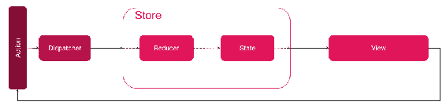

# 第五章：存储模式

围绕 JavaScript 虚拟存储构建的模式包含了决定应用程序中显示什么的一切所需内容。在我看来，这是理解 Flux 的最重要的部分，因此，我专门为存储模式撰写了一个特别的章节，以便通过许多示例并比较替代方案。由于 React Native 应用程序通常需要离线工作，我们还将学习如何将我们的 JavaScript 存储转换为用户移动设备上的持久存储。这将在用户体验方面将我们的应用程序提升到一个新的水平。

在本章中，您将学到以下内容：

+   如何将 Redux 集成到您的 Flux 架构中

+   Redux 与经典 Flux 的不同之处以及新方法的好处

+   Redux 的核心原则

+   如何创建一个将成为唯一真相来源的存储

+   效果模式和副作用是什么

# 使用 Redux 存储

我花了一段时间才弄清楚如何向您宣传 Redux。您很可能期望它是一种在 Flux 中使用的存储实现。这是正确的；但是，Redux 不仅仅是这样。Redux 是一段精彩的代码，是一个很棒的工具。这个工具可以在许多不同的项目中以许多不同的方式使用。在这本书中，我致力于教会您如何在 React 和 Redux 中思考。

这个介绍受到了 Cheng Lou 在 React Conf 2017 上发表的有用演讲*Taming the Meta Language*的启发。

在[`goo.gl/2SkWAj`](https://goo.gl/2SkWAj)观看。

# Redux 应用程序的最小示例

在我向您展示 Redux 架构之前，让我们看看它的实际运行情况。了解 Redux API 的外观至关重要。一旦我们在 Redux 中开发了最简单的 hello world 应用程序，我们将进行更高级的概述。

我们将构建的 hello world 应用程序是一个计数器应用程序，只有两个按钮（增加和减少）和一个显示当前计数的文本。

在我们深入之前，让我们使用以下命令安装两个软件包：

```jsx
yarn add redux react-redux
```

好的，首先，让我们创建一些基本的 Flux 部分，这些部分我们已经知道，但这次使用 Redux API：

+   `ActionTypes`：

```jsx
// Chapter 5 / Example 1 / src / flux / AppActionTypes.js

const ActionTypes = {
    INC_COUNTER: 'INC_COUNTER',
  DEC_COUNTER: 'DEC_COUNTER' };   export default ActionTypes; 
```

+   `Store`：

```jsx
// Chapter 5 / Example 1 / src / flux / AppStore.js

import { combineReducers, createStore } from 'redux'; import counterReducer from '../reducers/counterReducer';   const rootReducer = combineReducers({
    count: counterReducer            // reducer created later on });   const store = createStore(rootReducer);   export default store; 
```

注意两个新词——`Reducer`和`rootReducer`。`rootReducer`将所有其他 reducer 组合成一个。`Reducer`负责根据已发生的操作生成状态的新版本。如果当前操作与特定的`Reducer`不相关，Reducer 也可以返回旧版本的状态。

+   `CounterReducer`：

```jsx
// Chapter 5 / Example 1 / src / reducers / counterReducer.js

import types from '../flux/AppActionTypes';   const counterReducer = (state = 0, action) => {
    switch (action.type) {
    case types.INC_COUNTER:
        return state + 1;
  case types.DEC_COUNTER:
        return state - 1;
  default:
        return state;
  }
};   export default counterReducer; 
```

+   `Dispatcher`：

```jsx
// Chapter 5 / Example 1 / src / flux / AppDispatcher.js
import store from './AppStore';   export default store.dispatch;  
```

很好，我们已经有了所有的 Flux 组件，所以现在可以继续实际的实现了。

让我们先从简单的事情开始，视图。它应该显示两个`Button`和一个`Text`组件。在按钮按下时，计数器应该增加或减少，如下所示：

```jsx
// Chapter 5 / Example 1 / src / views / CounterView.js

const CounterView = ({ inc, dec, count }) => (
    <View style={styles.panel}>
 <Button title="-" onPress={dec} />
 <Text>{count}</Text>
 <Button title="+" onPress={inc} />
 </View> );   const styles = StyleSheet.create({
    panel: {
        // Check chapter 3: "Style patterns" to learn more on styling
        flex: 1,
  marginTop: 40,
  flexDirection: 'row'
  }, });   export default CounterView;
```

现在是时候向视图提供必要的依赖项了：`inc`，`dec`和`counter`属性。前两个非常简单：

```jsx
// Chapter 5 / Example 1 / src / Counter.js const increaseAction = () => dispatch({ type: types.INC_COUNTER }); const decreaseAction = () => dispatch({ type: types.DEC_COUNTER });
```

现在我们将它们传递给视图。在这里，将使用许多特定的 Redux API 组件。`Provider`用于提供`store`以连接调用。这是可选的 - 如果您真的想手动执行此操作，可以直接将`store`传递给`connect`。我强烈建议使用`Provider.Connect`来创建一个围绕分发和状态的 facade。在状态更改的情况下，组件将自动重新渲染。

Facade 是另一种完全不同的模式。它是一种结构设计模式，用于与复杂的 API 进行交互。如果典型用户对所有功能都不感兴趣，提供一个带有一些默认设置的函数对用户来说非常方便。这样的函数被称为`facade`函数，并且也在 API 中公开。最终用户可以更快地使用它，而无需进行复杂和优化项目所需的深入挖掘。

在下面的片段中检查如何使用`Provider`和`Connect`：

```jsx
// Chapter 5 / Example 1 / src / Counter.js
... import { Provider, connect } from 'react-redux'; ...    const mapStateToProps = state => ({
    count: state.count,
  inc: increaseAction,
  dec: decreaseAction });   const CounterContainer = connect(mapStateToProps)(CounterView);   const CounterApp = () => (
    <Provider store={store}><CounterContainer /></Provider> );   export default CounterApp; 
```

就是这样。我们已经完成了第一个 Redux 应用程序。

# Redux 如何适配 Flux

我们执行的步骤创建了一个`Counter`应用程序，涉及连接 Flux 组件。让我们看看我们使用的图表：



首先，我们有**Actions**被分发。然后运行根`Reducer`函数，并且每个 reducer 确定是否需要更改状态。根**Reducer**返回一个新版本的**State**，并且状态传递给**View**根。`connect`函数确定是否应重新渲染特定视图。

请注意，前面的图表遵循 Flux 架构。实际的 Redux 实现，正如您在计数器示例中所看到的，有些不同。分发器由 Store API 封装并作为`store`函数公开。

# 转向 Redux

Redux 不仅可以做简单的状态管理。它也以在具有庞大状态对象和许多业务模型的应用程序中表现出色而闻名。也就是说，让我们将我们的任务应用程序重构为 Redux。

`Tasks`应用程序是在前几章中开发的。如果你直接跳到这一章，请看一下位于 GitHub 存储库中的`src / Chapter 4 / Example 1_ Todo app with Flux`的应用程序。

重构步骤将类似。用 Redux 的部分替换现有的 Flux 部分：

+   `ActionTypes`：实际的实现是可以的：

```jsx
const ActionTypes = {
    ADD_TASK: 'ADD_TASK' };   export default ActionTypes;
```

+   `TaskStore.js`: 重命名为`AppStore.js`。现在，`store`只有一个实例。

此外，我们需要将`reduce`函数移动到一个单独的 reducer 文件中。剩下的部分应该转换为新的语法：

```jsx
// Chapter 5 / Example 2 / src / data / AppStore.js  const rootReducer = combineReducers({ tasks: taskReducer}); const store = createStore(rootReducer); export default store;
```

+   `AppDispatcher.js`：调度程序现在是存储的一部分。

```jsx
// Chapter 5 / Example 2 / src / data / AppDispatcher.js import store from './AppStore';  export default store;
// ATTENTION: To stay consistent with Flux API
// and previous implementation, I return store.
// Store contains dispatch function that is expected. 
```

+   `taskReducer.js`：这是一个我们需要创建的新文件。然而，它的内容是从之前的`reduce`函数中复制过来的：

```jsx
// Chapter 5 / Example 2 / src / reducers / taskReducer.js
...
import data from '../data/tasks.json';

const taskReducer = (state = Immutable.List([...data.tasks]), action) => {
    switch (action.type) {
    case TasksActionTypes.ADD_TASK:
        if (!action.task.name) {
            return state;
  }
        return state.push({
            name: action.task.name,
  description: action.task.description,
  likes: 0
  });
  default:
        return state;
  }
};   export default taskReducer;
```

最后一个必需的步骤是更改应用程序容器，如下所示：

```jsx
// Chapter 5 / Example 2 / src / App.js   const mapStateToProps = state => ({ tasks: state.tasks }); const AppContainer = connect(mapStateToProps)(AppView); const TasksApp = () => (
    <Provider store={store}><AppContainer /></Provider> );   export default TasksApp; 
```

到目前为止，一切顺利。它有效。但这里有一些事情我们跳过了。我会向你展示我们可以做得更好的地方，但首先，让我们学习一些 Redux 的原则。

# Redux 作为一种模式

当 Redux 做得好时，它提供了出色的功能，比如**时间旅行**和**热重载**。时间旅行允许我们根据操作日志看到应用程序随时间的变化。另一方面，热重载允许我们在不重新加载应用程序的情况下替换代码的部分。

在本节中，我们将学习 Redux 的核心原则和一些常见的推荐方法。

请努力阅读 Redux 文档。这是一个很好的免费资源，可以学习如何在 React 和 Redux 中思考。它还将帮助你将 Redux 的使用扩展到 React 生态系统之外，并且可以在以下网址找到：

[`redux.js.org/introduction/examples`](https://redux.js.org/introduction/examples).[ ](https://redux.js.org/introduction/examples)

# Redux 的核心原则

**单一数据源**：整个应用程序的状态存储在单个存储中的对象树中。理想情况下，应该有一个单一的 Redux 存储，可以指导视图渲染整个应用程序。这意味着你应该将所有的状态远离类组件，直接放在 Redux 存储中。这将简化我们在测试中恢复视图的方法，或者当我们进行时间旅行时。

对于一些开发人员来说，有一个单一的存储位置感觉不自然，很可能是因为多年来在后端，我们已经学会了它会导致单片架构。然而，在应用环境中并非如此。不会期望应用窗口在垂直方向上扩展以处理大量用户的负载。也不应该在单个设备上同时被数百名用户使用。

**状态是只读的**：改变状态的唯一方法是发出一个动作——描述发生了什么的对象。我们必须有一个单一的流来影响我们的存储。存储是我们应用状态的表示，不应该被随机代码改变。相反，任何有兴趣改变状态的代码都应该提交一份被称为**动作对象**的**签名文件**。这个动作对象代表了一个已知的在我们库中注册的动作，称为**动作类型**。Reducer 是决定状态变化的逻辑。具有单一流的不可变状态更容易维护和监督。确定是否有变化以及何时发生变化更快。我们可以轻松地创建一个审计数据库。特别是在银行等敏感行业，这是一个巨大的优势。

**通过纯函数进行更改**：为了指定状态树如何通过操作进行转换，您需要编写纯净的 reducer。这是一个我们还没有讨论过的概念。Reducer 需要是纯函数。纯函数保证没有外部情况会影响函数的结果。简而言之，reducer 不能执行 I/O 代码、受时间限制的代码，或者依赖于可变作用域数据的代码。

纯函数是满足两个要求的函数：

+   给定相同的输入参数，它返回相同的输出

+   函数执行不会引起任何副作用

一个很好的例子是常见的数学函数。例如，给定 1 和 3 的加法函数总是返回 4。

这为什么有益并且应该被视为原则可能并不明显。想象一种情况，一个 bug 在开发阶段无意中被引入到你的项目中。或者更糟糕的是，它泄漏到生产环境，并在用户的某个会话期间炸毁了一个关键应用。很可能你有一些错误跟踪，你可以得到异常和堆栈跟踪，显示了一个漫长而模糊的路径通过被压缩的代码。然而，你需要修复它，所以你尝试在你的本地机器上重现完全相同的情况，最终花了连续三天的时间才意识到问题是一些无聊的竞争条件。想象一下，相反，你有一个单一的动作流（没有未跟踪条件的随机交换），你跟踪和记录。此外，你的整个应用依赖于只能根据动作流改变的状态。在失败的情况下，你需要存储的只是动作跟踪，以便回放情况。瞧，我刚刚为你节省了一两天的时间。

当我用类似的例子学习 Redux 时，我仍然很难理解为什么纯函数在这里如此重要。在 Chrome 的 Redux 标签中进行时间旅行的玩耍让我更清楚地看到了实际情况。当你来回进行操作时，一些有状态的组件（即依赖内部状态而不是 Redux 状态的组件）将不会跟随。这是一个巨大的问题，因为它破坏了你的时间旅行，使一些部分处于未来状态。

# 转向单一真相来源

现在是练习的时候了。我们的新目标是重构 Tasks 应用程序，使其具有一个单一的真相来源的存储。

为了做到这一点，我们需要寻找依赖组件状态而不是 Redux 存储的地方。到目前为止，我们有三个视图：

+   `AppView.js`：这个组件相当简单，分为头部、底部和主要内容。

这是一个呈现组件，不持有状态。它的 props 由`AppContainer`提供，后者已经使用了 Redux 存储。`AppView`将主要内容委托给以下两个子视图。

+   `TaskList.js`：这是一个呈现组件，负责在一个简单可滚动的列表中显示待办任务。它的 props 是由`AppView`从`AppContainer`中转发的。

+   `AddTaskForm.js`：这是一个容器组件，基于`TextInput`组件。这个部分使用了内部状态。如果可能的话，我们应该重构这个部分。

如果你曾经读过关于 React 和 Redux 的内容，你可能会发现这个例子与你在网页上找到的内容非常相似，但实际上并不是。如果你在阅读本书的前几章时，可能会有一种直觉；如果没有，我强烈建议你回到“第二章 > 构建表单 > 不受控输入”。

我们的目标是以某种方式将状态从`AddTaskForm`移动到 Redux 存储中。这就是问题开始的地方。你可能已经注意到`TextInput`是 React-Native API 的一部分，我们无法改变它。但`TextInput`是一个有状态的组件。这是在构建 React Native 应用时，你应该意识到的关于 Redux 的第一件事——有些部分需要有状态，你无法绕过它。

幸运的是，`TextInput`的有状态部分只管理焦点。你几乎不太可能需要在 Redux 存储中存储关于它的信息。所有其他状态都属于我们的`AddTaskForm`组件，我们可以解决这个问题。让我们马上做。

在惯用的 Redux 中，你的状态应该被规范化，类似于数据库。在 SQL 数据库中有已知的规范化技术，通常是基于实体之间的 ID 引用。你可以通过使用 Normalizr 库在 Redux 存储中采用这种方法。

首先，我们将重建`AddTaskForm`组件。它需要分派一个新的动作，这将触发一个新的减速器，并改变 Redux 存储中的一个新键（我们将在后面开发后面的部分）：

```jsx
// Chapter 5 / Example 3 / src / views / AddTaskForm.js
class AddTaskForm extends React.Component {
    // ...
    handleSubmit = () => {
        if (this.props.taskForm.name) {
            TaskActions.addTask({
                name: this.props.taskForm.name,
  description: this.props.taskForm.description
  });
  this.nameInput.clear();
  this.descriptionInput.clear()**;**
  }
    };    render = () => (
        <View style={styles.container}>
 <TextInput  style={styles.input}
                placeholder="Name"
  ref={(input) => { this.nameInput = input; }}
                onChangeText={
 name => TaskActions.taskFormChange({
 name,
  description: this.props.taskForm.description
  })
 }
                value={this.props.taskForm.name}
            />
 <TextInput  style={styles.input}
                placeholder="Description"
  ref={(input) => { this.descriptionInput = input; }}
 onChangeText={
 desc => TaskActions.taskFormChange({
 name: this.props.taskForm.name,
  description: desc
 })
 }
 value={this.props.taskForm.description}
            />
 <Button  title="Add task"
  onPress={() => this.handleSubmit()}
            />
 </View>  ); }
```

最困难的部分已经过去了。现在是时候创建一个全新的`taskFormReducer`，如下所示：

```jsx
// Chapter 5 / Example 3 / src / reducers / taskFormReducer.js export const INITIAL_ADD_TASK_FORM_STATE = {
    name: '',
  description: '' };   const taskFormReducer = (
    state = INITIAL_ADD_TASK_FORM_STATE,
  action
) => {
    switch (action.type) {
    case TasksActionTypes.TASK_FORM_CHANGE:
        return action.newFormState;
  default:
        return state;
  }
};   export default taskFormReducer; 
```

接下来，向`TasksActionTypes`添加一个新的动作类型，如下所示：

```jsx
// Chapter 5 / Example 3 / src / data / TasksActionTypes.js
const ActionTypes = {
    ADD_TASK: 'ADD_TASK',
  TASK_FORM_CHANGE: 'TASK_FORM_CHANGE' };
```

然后，添加动作本身，如下所示：

```jsx
// Chapter 5 / Example 3 / src / data / TaskActions.js
const Actions = {
    // ...   taskFormChange(newFormState) {
        AppDispatcher.dispatch({
            type: TasksActionTypes.TASK_FORM_CHANGE,
  newFormState
        });
  }
};
```

接下来，在`AppStore`中注册一个新的减速器，如下所示：

```jsx
// Chapter 5 / Example 3 / src / data / AppStore.js
const rootReducer = combineReducers({
    tasks: taskReducer,
  taskForm: taskFormReducer });
```

最后，我们需要传递新的状态：

```jsx
// Chapter 5 / Example 3 / src / App.js
const mapStateToProps = state => ({
    tasks: state.tasks,
  taskForm: state.taskForm }); 
```

我们将其传递到组件树上的`AppView`，如下所示：

```jsx
// Chapter 5 / Example 3 / src / views / AppView.js
const AppView = props => (
        // ...  <AddTaskForm taskForm={props.taskForm} />
 // ...  );
```

最后，我们连接了所有的部分。享受你的集中式单一真相源 Redux 存储。

或者，看一下`redux-form`库。在写这本书的时候，它是 Redux 中构建表单的行业标准。该库可以在[`redux-form.com`](https://redux-form.com)找到。

# 使用 MobX 创建一个替代方案

在没有强大替代方案的情况下依赖 Redux 是愚蠢的。MobX 就是这样的替代方案之一，它是一个状态管理库，对变化没有那么多意见。MobX 尽可能少地提供样板文件。与 Redux 相比，这是一个巨大的优势，因为 Redux 非常显式，需要大量的样板文件。

在这里，我必须停下来提醒您，React 生态系统倾向于显式性，即构建应用程序而没有太多隐藏的机制。您控制流程，并且可以看到应用程序完成 Flux 的整个周期所需的所有位。毫不奇怪，主流开发人员更喜欢 Redux。有趣的是，Facebook Open Source 支持 MobX 项目。

MobX 更加隐式，可以隐藏一些围绕 Observables 构建的逻辑，并提供整洁的注释，以快速增强您的具有状态的组件与 MobX 流。

一些开发人员可能会发现这是一个更好的方法，最有可能是那些来自面向对象背景并习惯于这些事情的人。我发现 MobX 是一个更容易开始并开发原型或概念验证应用程序的库。然而，由于逻辑被隐藏在我身后，我担心一些开发人员永远不会查看底层。这可能会导致性能不佳，以后很难修复。

让我们看看它在实际操作中的感觉。

# 转向 MobX

在本节中，我们将重构 Tasks 应用程序，以使用 MobX 而不是 vanilla Flux。

任务应用程序是在前几章中开发的。如果您直接跳转到本章，请查看位于 GitHub 存储库中的`src / Chapter 4 / Example 1_ Todo app with Flux`位置的应用程序。

在我们深入之前，使用以下命令安装这两个软件包：

```jsx
yarn add mobx mobx-react
```

好的，首先，让我们清理不需要的部分：

+   `AppDispatcher.js`：MobX 在幕后使用可观察对象进行分发。

+   `TaskActions.js`：操作现在将驻留在`TaskStore`中并在其状态上工作。在 MobX 中，您很可能最终会有许多存储，因此这不是一个大问题-我们将相关的东西放在一起。

+   `TasksActionTypes.js`：没有必要定义这个。MobX 会在内部处理它。

正如您所看到的，在我们开始之前，我们已经去掉了很多开销。这是库的粉丝们提到的 MobX 最大的优势之一。

是时候以 MobX 方式重建存储了。这将需要一些新的关键字，因此请仔细阅读以下代码片段：

```jsx
// Chapter 5 / Example 4 / src / data / TaskStore.js
import { configure, observable, action } from 'mobx'; import data from './tasks.json';   // don't allow state modifications outside actions configure({ enforceActions: true });   export class TaskStore {
    @observable tasks = [...data.tasks]; // default state    @action addTask(task) {
        this.tasks.push({
            name: task.name,
  description: task.description,
  likes: 0
  });
  }
}

const observableTaskStore = new TaskStore(); export default observableTaskStore; 
```

正如您所看到的，有三个新关键字我从 MobX 库中导入：

+   `configure`：这用于设置我们的存储，以便只能通过操作来强制执行变化。

+   `observable`：这用于丰富属性，使其可以被观察到。如果您对流或可观察对象有一些 JavaScript 背景，它实际上是由这些包装的。

+   `action`：这就像任何其他操作一样，但是以装饰器的方式使用。

最后，我们创建了一个存储的实例，并将其作为默认导出传递。

现在我们需要将新的存储暴露给视图。为此，我们将使用 MobX `Provider`，这是 Redux 中找到的类似实用程序：

```jsx
// Chapter 5 / Example 4 / src / App.js
// ... import { Provider as MobXProvider  } from 'mobx-react/native'; // ... const App = () => (
    <MobXProvider store={TaskStore}>
 <AppView /> </MobXProvider> ); export default App; 
```

前面片段的最后一部分涉及重构后代视图。

`AppView`组件向下提供任务到`TaskList`组件。现在让我们从新创建的存储中消耗任务：

```jsx
// Chapter 5 / Example 4 / src / views / AppView.js

import { inject, observer } from 'mobx-react/native'; 
@inject('store') @observer class AppView extends React.Component {
 render = () => (
     // ...
     <AddTaskForm />  <TaskList tasks={this.props.store.tasks} />
     // ...   ); }
```

让我们对`AddTaskForm`做类似的事情，但是不是使用`tasks`，而是使用`addTask`函数：

```jsx
// Chapter 5 / Example 4 / src / views / AddTaskForm.js
// ...

@inject('store') @observer class AddTaskForm extends React.Component {
    // ...   handleSubmit = () => {
        this.props.store.addTask({
            name: this.state.name,
  description: this.state.description
  });
 // ...   };
    // ...  }
```

就是这样！我们的应用程序再次完全可用。

# 使用注释与 PropTypes

如果您跟着做，您可能会感到有点迷茫，因为您的 linter 可能开始抱怨`PropTypes`不足或缺失。让我们来解决这个问题。

对于`AppView`，我们缺少对`tasks`存储的`PropTypes`验证。当类被标注为`@observer`时，这有点棘手-您需要为`wrappedComponent`编写`PropTypes`，如下所示：

```jsx
AppView.wrappedComponent.propTypes = {
    store: PropTypes.shape({
        tasks: PropTypes.arrayOf(PropTypes.shape({
            name: PropTypes.string.isRequired,
  description: PropTypes.string.isRequired,
  likes: PropTypes.number.isRequired
  })).isRequired
    }).isRequired
}; 
```

对于`AddTaskForm`，我们缺少对`addTask`存储操作的`PropTypes`验证。让我们现在来解决这个问题：

```jsx
AddTaskForm.wrappedComponent.propTypes = {
    store: PropTypes.shape({
        addTask: PropTypes.func.isRequired
  }).isRequired
};
```

就是这样，linter 的投诉都消失了。

# 比较 Redux 和 MobX

有一天，我在想如何比较这两者，接下来的想法浮现在脑海中。

这一部分受到了 Preethi Kasireddy 在 React Conf 2017 的演讲的很大影响。请花半个小时观看一下。您可以在[`www.youtube.com/watch?v=76FRrbY18Bs`](https://www.youtube.com/watch?v=76FRrbY18Bs)找到这个演讲。

MobX 就像汽车的道路系统。你创建了一张路线图，让人们开车。有些人会造成事故，有些人会小心驾驶。有些道路可能限制为单向，以限制交通，甚至以某种方式塑造，以便更容易推理汽车流量，就像在曼哈顿一样。另一方面，Redux 就像一辆火车。一次只能有一列火车在轨道上行驶。如果有几列火车同时行驶，前面的火车被阻挡，其他火车就会在后面等待，就像在地铁站一样。有时火车需要把人们送到大陆的另一边，这也是可能的。所有这些火车流量都由一个（分布式）机构管理，规划移动并对火车流量施加限制。

记住这个例子，让我们更加技术性地看看这些库：

+   Redux 使用普通对象，而 MobX 将对象包装成可观察对象。

你可能期待我再次提到一些魔法——不会。残酷的事实是，MobX 是有代价的。它需要包装可观察数据，并为每个对象或集合的每个成员增加一些负担。很容易查看有多少数据：使用`console.log`来查看您的可观察集合。

+   Redux 手动跟踪更新，而 MobX 自动跟踪更新。

+   Redux 状态是只读的，并且可以通过分派操作进行更改，而 MobX 状态可以随时更改，有时只能使用存储 API 公开的操作来更改。此外，在 MobX 中，不需要操作。您可以直接更改状态。

+   在 Redux 中，状态通常是规范化的，或者至少建议这样做。在 MobX 中，您的状态是非规范化的，并且计算值是嵌套的。

+   无状态和有状态组件：这里可能看起来很困难。在前面的信息框中链接的讲座中，Preethi Kasireddy 提到 MobX 只能与智能组件一起使用。在某种程度上，这是正确的，但这与 Redux 没有区别。两者都支持展示组件，因为它们与状态管理库完全解耦！

+   学习曲线——这是非常主观的标准。有些人会发现 Redux 更容易，而其他人会发现 MobX 更容易。普遍的看法是 MobX 更容易学习。我是这方面的例外。

+   Redux 需要更多的样板文件。更加明确，这是非常直接的，但如果您不在乎，也有一些库可以解决这个问题。我不会在这里提供参考资料，因为我建议您进行教育性的使用。

+   Redux 更容易调试。这自然而然地带来了单一流程和消息的轻松重放。这就是 Redux 的亮点。MobX 在这方面更加老派，有点难以预测，甚至对经验丰富的用户来说也不那么明显。

+   当涉及可扩展性时，Redux 胜出。MobX 可能会在大型项目中提出一些可维护性问题，特别是在有很多连接和大型领域的项目中。

+   MobX 在小型、时间受限的项目中更加简洁，发光。如果你参加黑客马拉松，考虑使用 MobX。在大型、长期项目中，你需要在 MobX 的自由基础上采用更有见地的方法。

+   MobX 遵循 Flux 架构，并且不像 Redux 那样对其进行修改。Redux 倾向于一个全局存储（尽管可以与多个一起使用！），而 MobX 在存储的数量上非常灵活，其示例通常展示了与 Flux 早期思想类似的思维方式。

在使用 Redux 时，您需要学习如何处理不同的情况以及如何构建结构。特别是在处理副作用时，您需要学习 Redux Thunk，可能还有 Redux Saga，这将在下一章中介绍。在 MobX 中，所有这些都在幕后神奇地处理，使用响应式流。在这方面，MobX 是有见地的，但却减轻了你的一个责任。

# 在 React Native 中使用系统存储

那些来自原生环境的人习惯于持久存储，比如数据库或文件。到目前为止，每当我们的应用重新启动时，它都会丢失状态。我们可以使用系统存储来解决这个问题。

为此，我们将使用 React Native 附带的`AsyncStorage` API：

“在 iOS 上，AsyncStorage 由存储小值的序列化字典和存储大值的单独文件的本机代码支持。在 Android 上，AsyncStorage 将根据可用的情况使用 RocksDB 或基于 SQLite。”

- 来自 React Native 官方文档，可以在以下网址找到：

[`facebook.github.io/react-native/docs/asyncstorage.html`](https://facebook.github.io/react-native/docs/asyncstorage.html)。

`AsyncStorage` API 非常容易使用。首先，让我们保存数据：

```jsx
import { AsyncStorage } from 'react-native';  try { await AsyncStorage.setItem('@MyStore:key', 'value');
} catch (error) { // Error saving data } 
```

接下来，这是我们如何检索保存的值：

```jsx
try { const  value = await AsyncStorage.getItem('@MyStore:key'); } catch (error) { // Error retrieving data } 
```

然而，文档建议我们在`AsyncStorage`中使用一些抽象：

“建议您在 AsyncStorage 上使用一个抽象，而不是直接使用 AsyncStorage，因为它在全局范围内运行。”

- 可以在 React Native 官方文档中找到：

[`facebook.github.io/react-native/docs/asyncstorage.html`](https://facebook.github.io/react-native/docs/asyncstorage.html)。

因此，让我们遵循标准库`redux-persist`。存储的主题很大，超出了这本书的范围，所以我不想深入探讨这个问题。

让我们使用以下命令安装该库：

```jsx
yarn add redux-persist redux-persist-transform-immutable
```

第一步是通过新的持久性中间件增强我们的`AppStore`定义，如下所示：

```jsx
// Chapter 5 / Example 5 / src / data / AppStore.js
// ... import { persistStore, persistReducer } from 'redux-persist';
import immutableTransform from 'redux-persist-transform-immutable'; import storage from 'redux-persist/lib/storage';   const persistConfig = {
    transforms: [immutableTransform()],
 key: 'root',
  storage }**;**   const rootReducer = combineReducers({
    // ...  }); const persistedReducer = persistReducer(persistConfig, rootReducer)
const store = createStore(persistedReducer); export const persistor = persistStore(store)**;** export default store; 
```

配置完成后，我们需要使用`PersistGate`加载状态。如果有自定义组件，可以将其提供给加载属性：

```jsx
// Chapter 5 / Example 5 / src / App.js
import store, { persistor } from './data/AppStore'; // ... const TasksApp = () => (
    <Provider store={store}>
 <PersistGate loading={null} persistor={persistor}>
 <AppContainer /> </PersistGate> </Provider> ); 
```

看哪！每当重新启动应用程序时，状态将从持久存储加载，并且您将看到上次应用程序启动时的所有任务。

# 效果模式

在处理外部数据时，您需要处理外部因素，如网络或磁盘。这些因素会影响您的代码，因此它需要是异步的。此外，您应该努力将其与可预测的部分解耦，因为网络是不可预测的，可能会失败。我们称这样的事情为副作用，您已经学到了一些关于它们的知识。

为了理解这一点，我想介绍一个大词：效果。

“我们产生纯粹的 JavaScript 对象[...]。我们称这些对象为*效果*。效果就是一个包含一些信息的对象，由中间件解释。您可以将效果视为中间件执行某些操作的指令（例如，调用某些异步函数，向存储分发操作等）。”

- 可以在 Redux Saga 官方文档中找到：

[`redux-saga.js.org/docs/basics/DeclarativeEffects.html`](https://redux-saga.js.org/docs/basics/DeclarativeEffects.html)。

如果在立即范围之外使用这些效果，就会引起所谓的**副作用**，因此得名。最常见的情况是对外部范围变量的改变。

没有副作用是程序正确性的数学证明的关键。我们将在第九章中深入探讨这个话题，*函数式编程模式的要素*。

# 处理副作用

在第四章 *Flux 架构*中，您学会了副作用是什么，以及您可以遵循哪些策略来将其与视图和存储解耦。在使用 Redux 时，您应该坚持这些策略。然而，已经开发了一些很棒的库来解决 Redux 的问题。您将在接下来的章节中了解更多，这些章节专门讨论这个问题:

"我们正在混合两个对人类思维来说非常难以理解的概念：突变和异步性。我称它们为 Mentos 和 Coke。它们分开时都很棒，但一起就会变成一团糟。像 React 这样的库试图通过在视图层中移除异步性和直接 DOM 操作来解决这个问题。然而，管理数据状态留给了你。这就是 Redux 介入的地方。"

- 官方 Redux 文档

# 摘要

在这一章中，我们讨论了存储在我们架构中的重要性。您学会了如何塑造您的应用程序，以满足不同的业务需求，从使用状态和全局状态的混合方法来处理非常脆弱的需求，到允许时间旅行和 UI 重建的复杂需求。

我们不仅关注了 Redux 这一主流解决方案，还探讨了 MobX 库的完全不同的方法。我们发现它在许多领域都非常出色，比如快速原型设计和小型项目，现在您知道在何时以及在哪些项目中选择 MobX 而不是 Redux 是明智的。

# 进一步阅读

+   Redux 官方文档:

[`redux.js.org/`](https://redux.js.org/). [](https://redux.js.org/) 这是文档中特别有用的部分:

[`redux.js.org/faq`](https://redux.js.org/faq).

+   *Redux 时间旅行和热重载介绍* 由 Dan Abramov 在 React Europe 上:

[`www.youtube.com/watch?v=xsSnOQynTHs`](https://www.youtube.com/watch?v=xsSnOQynTHs).

+   Dan Abramov 在 Egghead 上的课程:

[`egghead.io/instructors/dan-abramov`](https://egghead.io/instructors/dan-abramov).

+   Redux GitHub 页面上有已关闭的问题。这包含了大量有用的讨论:

[`github.com/reduxjs/redux/issues?q=is%3Aissue+is%3Aclosed`](https://github.com/reduxjs/redux/issues?q=is%3Aissue+is%3Aclosed).

+   Netflix JavaScript Talks: *RxJS + Redux + React = Amazing*!

[`www.youtube.com/watch?v=AslncyG8whg`](https://www.youtube.com/watch?v=AslncyG8whg).

+   *Airbnb 如何使用 React Native*:

[`www.youtube.com/watch?v=8qCociUB6aQ`](https://www.youtube.com/watch?v=8qCociUB6aQ)。

这不仅仅是关于存储模式，而是说明了如何思考像 Airbnb 这样的大型生产应用程序。

+   您可能需要 Redux：

[`www.youtube.com/watch?v=2iPE5l3cl_s&feature=youtu.be&t=2h7m28s`](https://www.youtube.com/watch?v=2iPE5l3cl_s&feature=youtu.be&t=2h7m28s).

+   最后但并非最不重要的是，Redux 作者为您带来的一个非常重要的话题：

*您可能不需要 Redux*：

[`medium.com/@dan_abramov/you-might-not-need-redux-be46360cf367`](https://medium.com/@dan_abramov/you-might-not-need-redux-be46360cf367).
