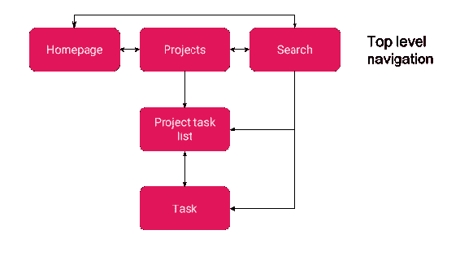
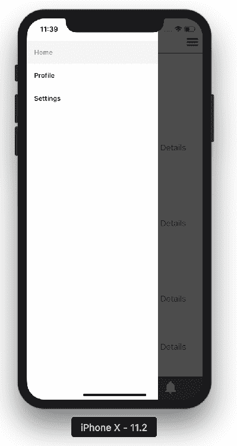
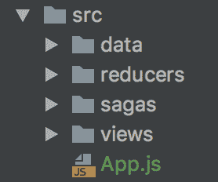
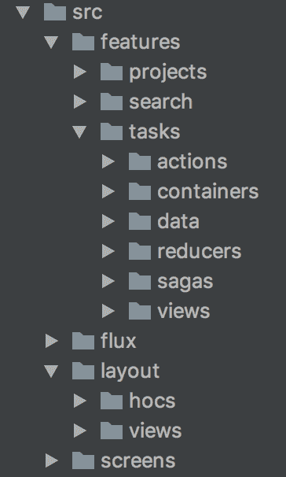
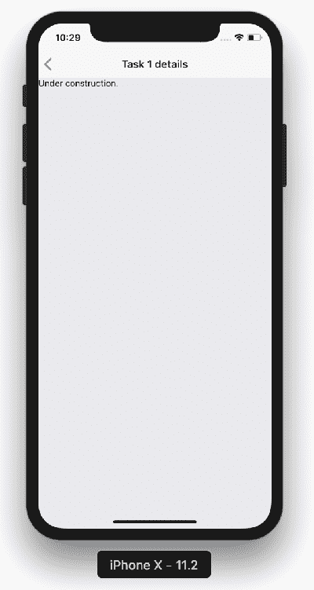
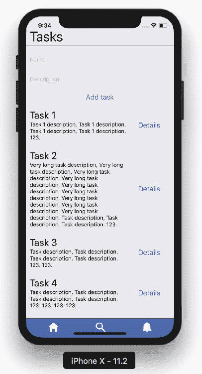
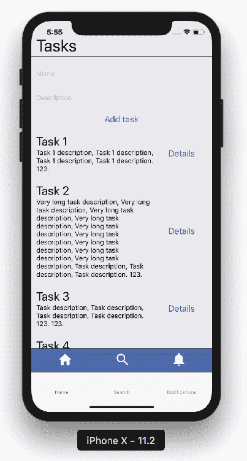
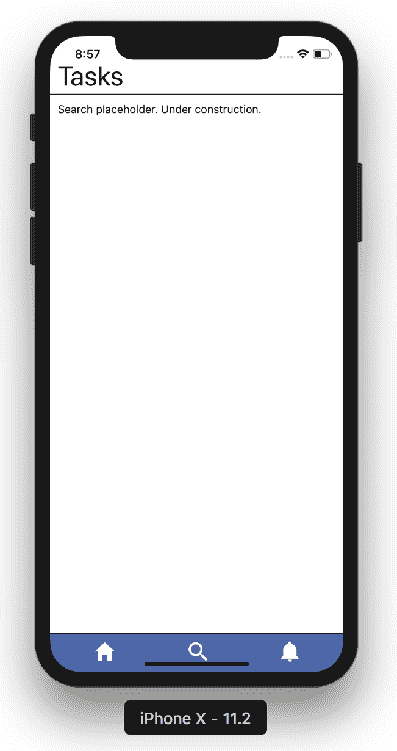
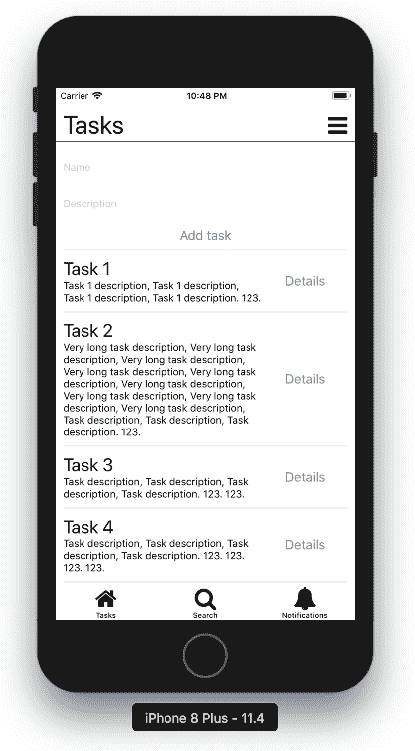

# 第七章：导航模式

几乎每个应用程序的关键部分是导航。直到今天，这个话题仍然让许多 React Native 开发人员头疼。让我们看看有哪些可用的库，以及哪一个适合您的项目。本章从可用库的分解开始。然后，我们将介绍一个新项目并进行操作。我们将一次专注于一个库。完成后，我将带您了解所使用的模式以及这些模式意味着什么，同时您编写导航代码。记得在您的计算机和手机上尝试这些代码。

在本章中，您将了解以下内容：

+   为什么 React Native 有许多替代路由库？

+   导航库面临的挑战是什么？

+   本地导航和 JavaScript 导航有什么区别？

+   如何使用选项卡导航、抽屉导航和堆栈导航。

+   本地解决方案的基础知识：您将首次弹出创建 React Native 应用程序。

# React Native 导航替代方案

通常，如果您是初学者，并尝试在 Google 上搜索*React Native 导航*，您最终会头疼。可用的替代方案数量很多。这是有几个原因的：

+   一些早期的库不再得到维护，因为维护者已经退出

+   一些资源充足的公司开始了一个库，然后将员工的重点转移到其他事情上

+   一些解决方案被证明效率低下，或者实施了更好的解决方案

+   不同方法有架构上的原因，导致需要维护不同的解决方案

我们将在这里专注于最后一点，因为了解哪个库适合您的需求至关重要。我们将讨论解决方案，以便在本章结束时，您将知道为您的项目选择哪个库。

# 设计师的导航模式

在我们深入了解库的世界之前，我想向您展示在应用程序中设计导航的不同方式。通常，这是项目设计师的工作；然而，一旦您了解了权衡，添加代码模式层将会更容易。

移动应用程序由屏幕和过渡组成。总的来说，这些可以用以下图表表示：



这是一个代表任务应用程序屏幕的示例图表

前面图表的主要要点如下：

+   每个应用程序都包括顶层屏幕（**主页**、**项目**和**搜索**）

+   从顶层屏幕，您可以向前导航并深入树中（**项目** => **项目任务列表**）

+   有时，您会向后过渡（**任务** => **项目任务列表**）

有了这个想法，让我们看看将帮助我们进行这些转换的组件。

# 导航到顶层屏幕

通常使用以下三种替代方案之一导航到顶层屏幕：

+   经典底部导航，就像我们已经实现的那样。这通常使用图标或图标和文本的组合。根据所做的选择，这允许我们放置两到五个链接。这在平板设计上通常是避免的：


经典底部导航的一个例子

+   导航抽屉，从屏幕侧边打开。其中包含一个链接列表，可能超过五个。这可能是复杂的，并且可以在顶部包括用户配置文件。这往往是通过位于一个上角的汉堡图标打开的：



抽屉导航的一个例子

+   标签，放置在屏幕顶部，成对出现，至少如此。标签的数量可以超过四个，在这种情况下，标签可以水平滚动。这不仅用于顶层导航，还用于同一深度屏幕之间的任何导航。

# 在图表的不同级别之间导航

一旦到达一定级别，有时我们想进一步探索特定区域。在任务应用程序的情况下，这意味着选择一个项目或在项目内选择特定任务。

通常，为了在图表中向下导航，我们使用以下方法：

+   容器，包括列表、卡片、图像列表和图像卡片

+   简单按钮、文本链接或图标

然而，为了回到图表的上方，通常我们使用以下方法：

+   返回图标，如箭头，通常位于左上角或左下角

+   按钮或链接，文本如返回|取消|重新开始

+   在编辑/创建屏幕的相关部分放置的交叉图标

对于你们中的一些人来说，这些知识是自然而然的；然而，我遇到了一些明显混淆了这些概念的提案或早期设计草案，最终严重影响了用户体验。尝试是好的，但只能在使用标准和众所周知的模式的受控环境中进行，这些模式对大多数用户来说是自然的。

对于设计实验，您应该实施 A/B 测试。这需要能够在生产中为不同的用户子集运行应用程序的不同版本。借助分析，您可以随后评估 A 或 B 哪个选择更好。最终，所有用户都可以迁移到获胜的方案。

# 在图的同一级别上导航

在更复杂的应用程序中，除了顶层导航之外，您还需要在相同深度的不同屏幕之间进行水平过渡。

要在同一级别的屏幕之间进行过渡，您可以使用以下方法：

+   选项卡，类似于顶层导航部分讨论的内容

+   屏幕滑动（字面上在屏幕之间滑动）

+   在容器中滑动（例如，查看任务描述、连接任务或任务评论）可以与选项卡连接

+   左右箭头，或指示您在级别内位置的点

同样，您也可以用这些来处理数据集合。然而，数据集合提供更多自由，可以使用列表或不受限制的容器，利用顶部/底部滑动。

牢记设计师们如何解决导航问题，现在让我们讨论如何使其性能良好以及如何维护导航图。

# 开发者的导航模式

说实话，一切都归结于这一点——JavaScript 实现是否足够好？如果是，让我们为自己的利益使用它（即，跟踪、JavaScript 中的控制、日志等）。随着时间的推移，看起来 React Native 社区设法创建了一个稳定的东西，称为 React Navigation：

“React Navigation 完全由 React 组件组成，并且状态在 JavaScript 中管理，与应用程序的其余部分在同一线程上。这在许多方面使 React Navigation 变得很棒，但这也意味着您的应用逻辑与 React Navigation 竞争 CPU 时间——每帧可用的 JavaScript 执行时间有限。”

- React Navigation 官方文档，可在以下网址找到：

[`reactnavigation.org/docs/en/limitations.html`](https://reactnavigation.org/docs/en/limitations.html)。

然而，正如前面的引用所讨论的，这与您的应用程序竞争 CPU 周期。这意味着它在一定程度上耗尽资源并减慢应用程序的速度。

JavaScript 导航的优点如下：

+   您可以使用 JavaScript 代码调整和扩展解决方案。

+   当前的实现对于中小型应用程序来说性能足够好。

+   状态在 JavaScript 中管理，并且很容易与 Redux 等状态管理库集成。

+   API 与本机 API 解耦。这意味着如果 React Native 最终超越 Android 和 iOS，API 将保持不变，并且一旦由库维护者实施，这将使您能够为另一个平台使用相同的解决方案。

+   易学。

+   适合初学者。

JavaScript 导航的缺点如下：

+   在性能方面实施起来非常困难。

+   对于大型应用程序来说可能仍然太慢。

+   一些动画与本机动画略有不同。

+   某些手势或动画可能与本机的完全不同（例如，如果本机系统更改了默认设置，或者由于历史更改而不一致）。

+   很难与本机代码集成。

+   根据当前文档，路由应该是静态的。

+   某些解决方案，如果您曾经创建过本机导航，可能不可用（例如，与本机生命周期的连接）。

+   有限的国际支持（例如，截至 2018 年 7 月，某些 JavaScript 导航库不支持从右到左，包括 React Navigation）。

另一方面，让我们看看本机导航。

本机导航的优点如下：

+   本机导航可以通过系统库进行优化，例如，容器化导航堆栈

+   本机导航优于 JavaScript 导航

+   它利用了每个系统的独特能力

+   能够利用本机生命周期并通过动画连接到它

+   大多数实现都集成了状态管理库

本机导航的缺点如下：

+   有时它违背了 React Native 的初衷-它使导航在系统之间分歧，而不是统一。

+   很难在各个平台上提供一致的 API，或者根本不一致。

+   单一真相不再成立-我们的状态泄漏到在特定平台内部管理状态的本机代码。这会破坏时间旅行。

+   问题状态同步 - 所选择的库要么根本不承诺立即状态同步，要么实现了不同的锁定，这会使应用程序变慢，通常会破坏其目的。

一些专家认为 NavigatorIOS 库的开发人员（截至 2018 年 7 月，仍在官方 React Native 文档中提到）在开发工作上做得很好，但它的未来是不确定的。

+   它需要使用本地系统的工具和配置。

+   它旨在针对有经验的开发人员。

在选择其中一个之前，你需要考虑所有这些并做出正确的权衡。但在我们深入代码之前，请专注于下一节。

# 重构你的应用程序

没有人喜欢庞大的单片代码库，所有功能都交织在一起。随着应用程序的增长，我们可以做些什么来防止这种情况发生？确保明智地定位代码文件，并且有一种标准化的做法。

一旦超过 10,000 行，会让你头痛的单片代码库的一个例子是：



一个目录结构的例子，对于大型项目来说并不够好

想象一下有 1,200 个减速器的目录。你可能会使用搜索。相信我，这在有 1,200 个减速器的情况下也会变得困难。

相反，更好的做法是按功能对代码进行分组。由此，我们将清楚地了解在调查应用程序的某个独立部分时要查看的文件范围：



一个对于中大型项目可能有好处的目录结构的例子

要查看这种新结构的实际效果，请查看第七章中`src`文件夹中的`Example 1`的代码文件，*导航模式*。

如果你曾经使用过微服务，可以将其想象成你希望你的功能在前端代码库中成为简单的微服务。一个屏幕可能会要求它们通过发送数据来运行，并期望特定的输出。

在某些架构中，每个这样的实体也会创建自己的 Flux 存储。这对于大型项目来说是一个很好的关注点分离。

# React Navigation

浏览器内置了导航解决方案，React Native 需要有自己的解决方案，这其中是有原因的：

“在 Web 浏览器中，您可以使用锚点（<a>）标签链接到不同的页面。当用户点击链接时，URL 将被推送到浏览器历史堆栈中。当用户按下返回按钮时，浏览器将从历史堆栈的顶部弹出项目，因此活动页面现在是先前访问的页面。React Native 没有像 Web 浏览器那样内置全局历史堆栈的概念 - 这就是 React Navigation 进入故事的地方。”

- React Navigation 官方文档，可在以下网址找到：

[`reactnavigation.org/docs/en/hello-react-navigation.html`](https://reactnavigation.org/docs/en/hello-react-navigation.html)。

总之，我们的移动导航不仅可以像在浏览器中看到的那样处理，而且可以按照我们喜欢的任何自定义方式处理。这要归功于历史原因，因为一些屏幕更改通常与特定操作系统的用户所认可的特定动画相关联。因此，尽可能地遵循它们以使其类似于原生感觉是明智的。

# 使用 React Navigation

让我们通过以下命令安装 React Navigation 库开始我们的旅程：

```jsx
yarn add react-navigation
```

一旦库安装完成，让我们尝试最简单的路径，使用一个类似于浏览器中看到的堆栈导航系统。

对于那些不知道或忘记堆栈是什么的人，堆栈这个名字来源于现实生活中一组物品堆叠在一起的类比。物品可以被推到堆栈中（放在顶部），或者从堆栈中弹出（从顶部取出）。

一个特殊的结构，进一步推动这个想法，类似于一个水平堆栈，可以从底部和顶部访问。这样的结构被称为队列；然而，在本书中我们不会使用队列。

在上一节中，我对我们的文件结构进行了重构。作为重构的一部分，我创建了一个新文件，名为`TaskListScreen`，它由我们代码库中的特性组成：

```jsx
// src / Chapter 7 / Example 2 / src / screens / TaskListScreen.js export const TaskListScreen = () => (
    <View>
 **<AddTaskContainer />    // Please note slight refactor** **<TaskListContainer />   // to two separate containers** </View> );   export default withGeneralLayout(TaskListScreen);
```

`withGeneralLayout` HOC 也是重构的一部分，它所做的就是用头部和底部栏包装屏幕。这样包装的 `TaskList` 组件准备好被称为 `Screen` 并直接提供给 React Navigation 设置：

```jsx
// src / Chapter 7 / Example 2 / src / screens / index.js

export default createStackNavigator({
    TaskList: {
        screen: TaskListScrn,
  path: 'project/task/list', // later on: 'project/:projectId/task/list'
  navigationOptions: { header: null }
    },
  ProjectList: {
        screen: () => <View><Text>Under construction.</Text></View>,
  path: 'project/:projectId'
  },
 // ...
}, {
    initialRouteName: 'TaskList',
  initialRouteParams: {}
}); 
```

在这里，我们使用一个期望两个对象的 `createStackNavigator` 函数：

+   代表应该由这个`StackNavigator`处理的所有屏幕的对象。每个屏幕都应该指定一个代表该屏幕和路径的组件。您还可以使用`navigationOptions`来自定义您的屏幕。在我们的情况下，我们不想要默认的标题栏。

+   代表导航器本身的设置对象。您可能想要定义初始路由名称及其参数。

做完这些，我们已经完成了导航的 hello world - 我们有一个屏幕在工作。

# 使用 React Navigation 的多个屏幕

现在是时候向我们的`StackNavigator`添加一个任务屏幕了。使用你新学到的语法，为任务详情创建一个占位符屏幕。以下是我的实现：

```jsx
// src / Chapter 7 / Example 3 / src / screens / index.js
// ...
Task: {
    screen: () => <View><Text>Under construction.</Text></View>,
  path: 'project/task/:taskId',
  navigationOptions: ({ navigation }) => ({
        title: `Task ${navigation.state.params.taskId} details`  })
},
// ...
```

这一次，我还传递了`navigationOptions`，因为我想使用具有特定标题的默认导航器顶部栏：



新任务屏幕可能的样子

要导航到任务详情，我们需要一个单独的链接或按钮，可以带我们到那里。让我们在我们的目录结构的顶部创建一个可重用的链接，如下所示：

```jsx
// src / Chapter 7 / Example 3 / src / components / NavigateButton.js
// ...
export const NavigateButton = ({
    navigation, to, data, text
}) => (
    <Button
  onPress={() => navigation.navigate(to, data)}
        title={text}
    /> );
// ...
export default withNavigation(NavigateButton);
```

前面片段的最后一行使用了`withNavigation` HOC，这是 React Navigation 的一部分。这个 HOC 为`NavigateButton`提供了导航属性。`To`、`data`和`text`需要手动传递给组件：

```jsx
// src / Chapter 7 / Example 3 / src / features / tasks / views / TaskList.js
// ...
<View style={styles.taskText}>
 <Text style={styles.taskName}>
  {task.name}
    </Text>
 <Text>{task.description}</Text> </View> <View style={styles.taskActions}>
 <NavigateButton  data={{ taskId: task.id }}
 to="Task"
  text="Details" **/>** </View>
// ... 
```

就是这样！让我们看看以下的结果。如果你觉得设计需要一点润色，可以使用第三章 *样式模式*中学到的技巧：



每个任务行现在都显示了一个详情链接

现在您可以点击详情按钮导航到任务详情屏幕。

# 标签导航

由于我们已经放置了底部图标控件，使它们工作将非常简单。这是标签导航的一个经典示例：

```jsx
// src / Chapter 7 / Example 4 / src / screens / index.js
export default createBottomTabNavigator(
    {
        Home: createStackNavigator({
            TaskList: {
                // ...
            },
            // ...
        }, {
            // ...
        }),
  Search: () => (
            <View>
 <Text>Search placeholder. Under construction.</Text>
 </View>  ),
  Notifications: () => (
            <View>
 <Text>Notifications placeholder. Under construction.</Text>
 </View>  )
    },
  {
        initialRouteName: 'Home',
  initialRouteParams: {}
    }
); 
```

请注意使用缩写创建屏幕的用法。我直接传递组件，而不是使用对象：



默认情况下，React Navigation 会为我们创建一个底部栏

要禁用标题栏，我们需要传递适当的属性，如下所示：

```jsx
// src / Chapter 7 / Example 4 / src / screens / index.js
// ...
{
    initialRouteName: 'Home',
  initialRouteParams: {},
  navigationOptions: () => ({
 tabBarVisible: false
  })
}
// ...
```

现在，我们需要让我们的图标响应用户的触摸。首先，创建一个`NavigateIcon`组件，你可以在你的应用程序中重用。查看存储库以获取完整的代码示例，但这里提供了一个示例：

```jsx
// src / Chapter 7 / Example 4 / src / components / NavigateIcon.js export const NavigateIcon = ({
    navigation, to, data, ...iconProps
}) => (
    <Ionicons
  {...iconProps}
        onPress={() => navigation.navigate(to, data)}
    /> ); // ... export default withNavigation(NavigateIcon); 
```

用`NavigateIcon`相当简单地替换现有的图标，如下所示：

```jsx
// src / Chapter 7 / Example 4 / src / layout / views / GeneralAppView.js
import NavIonicons from '../../components/NavigateIcon';
<View style={styles.footer}>
 <NavIonicons  to**="Home"**
 // ...   />
 <NavIonicons  to**="Search"**
        // ...   />
 <NavIonicons  to**="Notifications"**
        // ...   /> </View>
```

最后要注意的是一般布局。`Search`和`Notifications`屏幕应该显示我们的自定义底部导航。由于我们学到的 HOC 模式，这 surprisingly 容易：

```jsx
// src / Chapter 7 / Example 4 / src / screens / index.js
// ...
Search: withGeneralLayout(() => (
    <View>
 <Text>Search placeholder. Under construction.</Text>
 </View> )), Notifications: withGeneralLayout(() => (
    <View>
 <Text>Notifications placeholder. Under construction.</Text>
 </View> )) // ...
```

结果显示在以下截图中：



搜索屏幕及其占位符。

请通过向`withGeneralLayout` HOC 添加配置对象来修复标题名称。

# 抽屉导航

现在是时候实现抽屉导航，以便用户访问不常用的屏幕，如下所示：

```jsx
// src / Chapter 7 / Example 5 / src / screens / index.js
// ...
export default createDrawerNavigator({
    Home: TabNavigation,
  Profile: withGeneralLayout(() => (
        <View>
 <Text>Profile placeholder. Under construction.</Text>
 </View>  )),
  Settings: withGeneralLayout(() => (
        <View>
 <Text>Settings placeholder. Under construction.</Text>
 </View>  ))
}); 
```

由于我们的默认抽屉已准备就绪，让我们添加一个图标来显示它。汉堡图标是最受欢迎的，通常放置在标题的一个角落：

```jsx
// src / Chapter 7 / Example 5 / src / layout / views / MenuView.js
const Hamburger = props => (<Ionicons
  onPress={() => props.navigation.toggleDrawer()}
    name="md-menu"
  size={32}
    color="black" />); // ...   const MenuView = withNavigation(Hamburger); 
```

现在，只需将其放在`GeneralAppView`组件的标题部分并适当地进行样式设置：

```jsx
// src / Chapter 7 / Example 5 / src / layout / views / GeneralAppView.js
<View style={styles.header}>
 // ...  <View style={styles.headerMenuIcon}>
 <MenuView /> </View> </View> 
```

就是这样，我们的抽屉功能完全可用。您的抽屉可能看起来像这样：


在 iPhone X 模拟器上打开抽屉菜单。

您可以通过单击右上角的汉堡图标来打开抽屉。

# 重复数据的问题

任务列表组件在成功挂载时获取显示列表所需的数据。然而，没有实现防止数据重复的机制。本书不旨在为常见问题提供解决方案。然而，让我们考虑一些您可以实施的解决方案：

+   更改 API 并依赖于唯一的任务标识符（如 ID、UUID 或 GUID）。确保只允许唯一的标识符。

+   每次请求都清除数据。这很好；然而，在我们的情况下，我们会丢失未保存的（与 API 相关的）任务。

+   保持状态，并且只请求一次。这只适用于我们简单的用例。在更复杂的应用程序中，您将需要更频繁地更新数据。

好的，牢记这一点，让我们最终深入基于本地导航解决方案的库。

# React Native Navigation

在本节中，我们将使用本地解决方案进行导航。React Native Navigation 是 Android 和 iOS 本地导航的包装器。

我们的目标是重新创建我们在上一节中实现的内容，但使用 React Navigation。

# 关于设置的几句话

在本节中，您可能会面临的最大挑战之一是设置库。请遵循最新的安装说明。花点时间——如果您不熟悉工具和生态系统，可能需要超过 8 小时。

按照以下链接中的安装说明进行安装：[`github.com/wix/react-native-navigation`](https://github.com/wix/react-native-navigation)。

本书使用 React Native Navigation 第 2 版的 API。要使用相同的代码示例，您也需要安装第 2 版。

您可能还需要要么退出 Create React Native App，要么使用`react-native init`引导另一个项目并将关键文件复制到那里。如果您在这个过程中遇到困难，请尝试使用`src/Chapter 7/Example 6/`（只是 React Native）或`src/Chapter 7/Example 7/`（整个 React Native Navigation 设置）中的代码。我使用了`react-native init`并将所有重要的东西都复制到那里。

在实现可工作的设置过程中，肯定会出现错误。不要沮丧；在 StackOverflow 上搜索任何错误或在 React Native 和 React Native Navigation 的 GitHub 问题中搜索。

# React Native Navigation 的基础知识

第一个重大变化是缺少`AppRegistry`和`registerComponent`的调用。相反，我们将使用`Navigation.setRoot(...)`来完成工作。只有在确定应用程序成功启动时，才应调用`setRoot`函数，如下所示：

```jsx
// src / Chapter 7 / Example 7 / src / screens / index.js
import { Navigation } from 'react-native-navigation';
// ...
export default () => Navigation.events().registerAppLaunchedListener(() => {
    Navigation.setRoot({
        // ...
    });
});
```

然后，我们的根/入口文件将只调用 React Native Navigation 函数：

```jsx
import start from './src/screens/index';   export default start();
```

好的。更有趣的部分是我们放入`setRoot`函数的内容。基本上，我们在这里有一个选择：堆栈导航或标签导航。根据我们之前的应用程序，顶层应用将是标签导航（抽屉导航在 React Native Navigation 中是解耦的）。

在撰写本书时，使用默认内置的底部栏是保留先前功能的唯一选项。一旦库作者发布 RNN 的第 2 版并修复`Navigation.mergeOptions(...)`，您就可以实现自定义底部栏。

首先，让我们移除默认的顶部栏并自定义底部栏：

```jsx
// src / Chapter 7 / Example 7 / src / screens / index.js
// ...
Navigation.setRoot({
    root: {
        bottomTabs: {
            children: [
            ],
  options: {
                topBar: {
                    visible: false**,**
  drawBehind: true,
  animate: false
  },
  bottomTabs: {   animate: true
  }   }
        }
    }
});
```

完成了这一点，我们准备定义标签。在 React Native Navigation 中要做的第一件事是注册屏幕：

```jsx
// src / Chapter 7 / Example 7 / src / screens / index.js
// ...
Navigation.registerComponent(
    'HDPRN.TabNavigation.TaskList',
  () => TaskStackNavigator, store, Provider
); Navigation.registerComponent(
    'HDPRN.TabNavigation.SearchScreen',
  () => SearchScreen, store, Provider
); Navigation.registerComponent(
    'HDPRN.TabNavigation.NotificationsScreen',
  () => NotificationsScreen, store, Provider
); 
```

当我们注册了所有基本的三个屏幕后，我们可以按照以下方式进行标签定义：

```jsx
// src / Chapter 7 / Example 7 / src / screens / index.js
// ...
children: [
    {
        stack: {
            id: 'HDPRN.TabNavigation.TaskListStack',
            // TODO: Check below, let's handle this separately
        }
    },
  {
        component: {
            id: 'HDPRN.TabNavigation.**SearchScreen**',
  name: 'SearchScreen',
  options: {
                bottomTab: {
                    text: 'Search',
                    // Check sources if you want to know
                    // how to get this icon variable
  icon: search 
                }
            }
        }
    },
 // Notifications config object omitted: similar as for Search
]
```

我们定义了三个单独的标签 - `Tasks`，`Search`和`Notifications`。关于`Tasks`，这是另一个导航器。`Stack`导航器可以配置如下：

```jsx
stack: {
    id: 'HDPRN.TabNavigation.TaskListStack',
  children: [{
        component: {
            id: 'HDPRN.TabNavigation.**TaskList**',
  name: 'HDPRN.TabNavigation.TaskList',
  }
    }],
  options: {
        bottomTab: {
            text: 'Tasks',
  icon: home
        }
    }
}
```

在上面的片段中，`bottomTab`选项设置了底部栏中的文本和图标：



使用 React Native Navigation 的任务选项卡

# 进一步调查

我将把如何实现导航元素（如抽屉或任务详情屏幕）的调查留给那些勇敢的人。在撰写本文时，React Native Navigation v2 相当不稳定，我选择不再发布来自该库的任何片段。对于大多数读者来说，这应该足够让他们对整体感觉有所了解。

# 总结

在这一章中，我们最终扩展了我们的应用程序，比以前有更多的视图。您已经学会了移动应用程序中不同的导航方法。在 React Native 世界中，要么是原生导航，要么是 JavaScript 导航，或者两者的混合。除了学习导航本身，我们还使用了包括`StackNavigation`、`TabNavigation`和`DrawerNavigation`在内的组件。

这是我们第一次将 Create React Native App 弹出，并从原生导航库中安装了原生代码。我们开始深入研究 React Native。现在是时候退后一步，更新我们的 JavaScript 知识了。我们将学习不仅在 React Native 中有益的模式，而且在整个 JavaScript 中都有益的模式。

# 进一步阅读

+   React Navigation 常见错误-来自官方文档，可在以下链接找到：

[`reactnavigation.org/docs/en/common-mistakes.html`](https://reactnavigation.org/docs/en/common-mistakes.html)。

+   Charles Mangwa 的《在 React Native 中导航的千种方式》：

[`www.youtube.com/watch?v=d11dGHVVahk.`](https://www.youtube.com/watch?v=d11dGHVVahk)

+   React Navigation 的导航游乐场：

[`expo.io/@react-navigation/NavigationPlayground`](https://expo.io/@react-navigation/NavigationPlayground)。

+   Expo 关于导航的文档：

[`docs.expo.io/versions/v29.0.0/guides/routing-and-navigation`](https://docs.expo.io/versions/v29.0.0/guides/routing-and-navigation)。

+   标签的 Material Design：

[`material.io/design/components/tabs.html#placement`](https://material.io/design/components/tabs.html#placement)。

+   在 Awesome React Native 存储库中关于导航的部分：

[`github.com/jondot/awesome-react-native#navigation`](https://github.com/jondot/awesome-react-native#navigation)。
