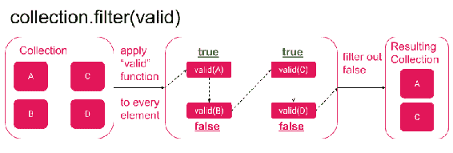
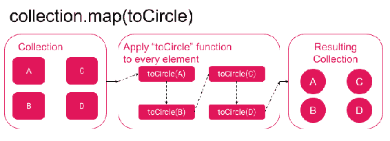

# 第八章：JavaScript 和 ECMAScript 模式

在本章中，我们将回到 JavaScript 语言的核心。这里的一些模式可以在许多不同的语言中重复使用，例如 Java、C++ 和 Python。用这样强大的东西填充您的工具箱是至关重要的。这一次，我们将在 JavaScript 中实现众所周知的设计模式，并看看我们如何从中受益，特别是在 React Native 环境中。作为一个小补充，我们将学习一个名为 Ramda 的新库，它以其出色的功能而闻名，可以帮助我们编写更短、更简洁的代码。您还将了解函数式编程的基础知识，这将是下一章的主题。

在本章中，您将学习以下内容：

+   选择器模式

+   柯里化模式

+   Ramda 库

+   函数式编程基础

# JavaScript 和函数式编程

函数式编程基本上意味着以某种方式使用函数来编写逻辑代码。大多数语言允许函数变得非常复杂和难以理解。然而，函数式编程对函数施加了约束，以便能够组合它们并在数学上证明它们的行为。

其中一个约束是规范与外部世界的通信（例如，副作用，如数据获取）。有人断言，无论我们用相同的参数调用函数多少次，它都会返回完全相同的值。所有这些约束都将给我们带来一定的好处。您已经可以列举一些这些好处，比如时间旅行，它使用纯减速器。

在本章中，我们将学习一些有用的函数，这将使我们更容易进入第九章，*函数式编程模式的要素*。我们还将更详细地阐述确切的约束及其好处。

# ES6 的 map、filter 和 reduce

本节旨在刷新我们对 `map`、`filter` 和 `reduce` 函数的了解。

通常，常见的语言函数需要非常高的性能，这是一个超出本书范围的话题。避免重新实现语言中已有的功能。本章中的一些示例仅用于学习目的。

`reduce` 很可能经常被忽视，因此我们将重点关注它。通常，`reduce`（顾名思义）用于将集合的大小减小到更小的集合，甚至是单个变量。

以下是 reduce 函数的声明：

```jsx
reduce(callback, [initialValue])
```

回调函数接受四个参数：`previousValue`、`currentValue`、`index`和`array`。

为了快速提醒一下`reduce`函数的工作原理，让我们看下面的例子：

```jsx
const sumArrayElements = arr => arr.reduce((acc, elem) => acc+elem, 0);
console.log(sumArrayElements([5,15,20])); // 40
```

`reduce`在集合上进行迭代。在每一步，它调用函数来处理它所在的元素迭代器。然后它记住函数的输出并传递给下一个元素。这个记住的输出是第一个函数参数；在前面的例子中，它是累加器（`acc`）变量。它记住了先前运行函数的结果，应用`reducer`函数并传递到下一步。这与 Redux 库在状态上的操作非常相似。

`reduce`函数的第二个参数是累加器的初始值；在前面的例子中，我们从零开始。

让我们提高难度，使用`reduce`来实现一个`average`函数：

```jsx
const numbers = [1, 2, 5, 7, 13]; const average = numbers.reduce(
    (accumulator, currNumber, indexOfElProcessed, arrayWeWorkOn) => {
        // Sum all numbers so far
        const newAcc = accumulator + currNumber;
  if (indexOfElProcessed === arrayWeWorkOn.length - 1) {
            // if this is the last item, return average
            return newAcc / arrayWeWorkOn.length;
  }
        // if not the last item, pass sum
        return newAcc;
  },
  0 ); // average equals 5.6
```

在这个例子中，我们在`if`语句中做了一个小技巧。如果元素是数组中的最后一个元素，那么我们想要计算`average`而不是`sum`。

# 使用 reduce 重新实现 filter 和 map

现在是一个小挑战的时候了。你知道吗，你可以使用`reduce`来实现`map`和`filter`两个函数吗？

在我们开始之前，让我们快速回顾一下`filter`函数的工作原理：



过滤函数在集合上的工作原理

假设我们有一个`task`集合，想要筛选出`type`等于`1`的任务，如下所示：

```jsx
const onlyType1 = task => task.type === 1
```

使用标准的 filter 函数，你只需要写下面的代码：

```jsx
tasks.filter(onlyType1)
```

但是现在，想象一下如果没有`filter`函数，到目前为止，你的工具箱中只有`reduce`。

你可以这样做：

```jsx
tasks.reduce((acc,t) => onlyType1(t) ? [...acc, t] :acc, [])
```

技巧是将累加器变成一个集合。前一个值始终是一个集合，从空数组开始。一步一步地，我们要么将任务添加到累加器中，要么如果任务未能通过筛选，则简单地返回累加器。

那么如何实现`map`函数呢？`map`只是通过应用传递给它的映射函数，将每个元素转换为一个新元素：



映射函数在集合上的工作原理

让我们使用`reduce`来做，如下所示：

```jsx
const someFunc = x => x+1; const tab = [1, 5, 9, 13]; tab.reduce((acc, elem) => [...acc, someFunc(elem)], []);
// result: [2, 6, 10, 14]
```

在这个例子中，我们只是再次将每个项目收集到相同的集合中，但在将其添加到数组之前，我们对其应用了一个映射函数。在这个例子中，映射函数被定义为`someFunc`。

# 在数组中计算项目数量

我们的下一个例子是关于计算数组中的项数。假设你有一个房屋物品的数组。你需要计算你拥有的每种物品的数量。使用`reduce`函数，预期的结果是一个具有物品作为键和特定物品计数作为值的对象，如下所示：

```jsx
const items = ['fork', 'laptop', 'fork', 'chair', 'bed', 'knife', 'chair']; items.reduce((acc, elem) => ({ ...acc, [elem]: (acc[elem] || 0) + 1 }), {});
// {fork: 2, laptop: 1, chair: 2, bed: 1, knife: 1} 
```

这很棘手：`(acc[elem] || 0)`部分意味着我们要么取`acc[elem]`的值，如果它被定义了，要么取`0`。这样，我们就可以检查其种类的第一个元素。另外，`{ [elem]: something }`是用来定义一个以存储在`elem`变量中的名称为键的语法。

前面的例子在你处理来自外部 API 的序列化数据时很有帮助。有时你需要对其进行转换以进行缓存，以避免不必要的重新渲染。

下一个例子介绍了一个新词—**展开**。当我们展开一个集合时，意味着它是一个嵌套在集合中的集合，我们希望将其变平。

例如，一个集合，比如`[[1, 2, 3], [4, 5, 6], [7, 8, 9]]`在展开后变成了`[1, 2, 3, 4, 5, 6, 7, 8, 9]`。这是通过以下方式完成的：

```jsx
const numCollections = [[1, 2, 3], [4, 5, 6], [7, 8, 9]]; numCollections.reduce((acc, collection) => [...acc, ...collection], []);
// result:[1, 2, 3, 4, 5, 6, 7, 8, 9] 
```

这个例子对于理解我们将在第九章，*函数式编程模式的元素*中使用的更复杂的例子中的展开是至关重要的。

# 迭代器模式

在前面的部分中，我们遍历了许多不同的集合，甚至是嵌套的集合。现在，是时候更多地了解迭代器模式了。如果你打算使用 Redux Saga 库，这种模式尤其闪耀。

如果你直接跳到这一章，我强烈建议你阅读介绍迭代器模式的部分第六章，*数据传输模式*。该章还涵盖了 Redux Saga 库和生成器。

总结一下，在 JavaScript 中，迭代器是一个知道如何逐个遍历集合项的对象。它必须公开`next()`函数，该函数返回集合的下一个项。集合可以是任何想要的东西。它甚至可以是一个无限集合，比如斐波那契数列，就像这里看到的那样：

```jsx
class FibonacciIterator {
    constructor() {
        this.n1 = 1;
  this.n2 = 1;
  }
    next() {
        var current = this.n2;
  this.n2 = this.n1;
  this.n1 = this.n1 + current;
  return current;
  }
}
```

在你使用这个之前，你需要创建一个类的实例：

```jsx
const fibNums = new FibonacciIterator(); fibNums.next(); // 1 fibNums.next(); // 1 fibNums.next(); // 2 fibNums.next(); // 3 fibNums.next(); // 5 
```

这可能很快变得无聊，因为它看起来像一个学术例子。但它并不是。它很有用，可以向你展示我们将使用闭包和`Symbol`迭代器重新创建的算法。

# 定义一个自定义迭代器

快速回顾一下 JavaScript 中的符号：`CallingSymbol()`返回一个唯一的符号值。符号值应该被视为一个 ID，例如，作为一个在对象中用作键的 ID。

要为集合定义一个迭代器，您需要指定特殊的键`Symbol.iterator`。如果定义了这样一个符号，我们说这个集合是可迭代的。看下面的例子：

```jsx
// Array is iterable by default,
// we don't need to create a custom iterator,
// just use the one that is present.
const alpha = ['a','b','c']; const it = alpha[Symbol.iterator]()**;**   it.next(); //{ value: 'a', done: false } it.next(); //{ value: 'b', done: false } it.next(); //{ value: 'c', done: false } it.next(); //{ value: undefined, done: true }
```

现在让我们为斐波那契数列创建一个自定义的`iterator`。斐波那契数列的特点是每个数字都是前两个数字的和（序列的开头是 1, 1, 2, 3, 5, 8, 13, 21, 34, 55, 89, 144, ...）：

```jsx
const fib = {
    [Symbol.iterator]() {
        let n1 = 1;
  let n2 = 1;    return {
            next() {
                const current = n2;
  n2 = n1;
  n1 += current;
  return { value: current, done: false };
  },    return(val) { // this part handles loop break
                // Fibonacci sequence stopped.
  return { value: val, done: true };
  }
        };
  }
};
```

为了轻松遍历可迭代的集合，我们可以使用方便的`for...of`循环：

```jsx
for (const num of fib) {
    console.log(num);
    if (num > 70) break; // We do not want to iterate forever
}
```

# 使用生成器作为迭代器的工厂

我们还需要知道如何使用生成器（例如，对于 Redux Saga），所以我们应该熟练地编写它们。事实证明它们可以像迭代器的工厂一样工作，我们已经学会了如何使用迭代器。

关于生成器的快速回顾——它们是带有`*`和`yield`操作符的函数，比如，`function* minGenExample() { yield "a"; }`。这样的函数执行直到遇到`yield`关键字。然后，函数返回`yield`值。函数可以有多个`yield`，在第一次调用时返回`Generator`。这样的生成器是可迭代的。看下面的例子：

```jsx
const a = function* gen() { yield "a"; }; console.log(a.prototype)
// Generator {}
```

现在我们可以利用这个知识重新实现斐波那契数列作为一个生成器：

```jsx
function* fib() {
    let n1 = 1;
  let n2 = 1;
  while (true) {
        const current = n2;
  n2 = n1;
  n1 += current;    yield current;   }
}
// Pay attention to invocation of fib to get Generator
for (const num of fib()) {
    console.log(num);
  if (num > 70) break; }
```

就是这样。我们使用生成器函数语法来简化自己的事情。生成器函数就像迭代器的工厂。一旦调用，它将为您提供一个新的生成器，您可以像任何其他集合一样对其进行迭代。

处理斐波那契数的代码可以简化。我能写的最简洁的方式如下：

`function* fib() {`

`  let n1 = 1, n2 = 1;`

`  while (true) {`

`    yield n1;`

`    [n1, n2] = [n2, n1 + n2];`

`  }`

`}`

# 使用生成器调用 API 以获取任务详情

我们已经尝试过生成器，并成功使用它们获取了任务。现在，我们将重复这个过程，但目标略有不同：获取单个任务的数据。为了实现这一点，我对代码进行了一些修改，并准备了代码的部分，让你只关注生成器：

```jsx
// src/Chapter 8/Example 1/src/features/tasks/sagas/fetchTask.js
// ^ fully functional example with TaskDetails page
export **function*** fetchTask(action) {
    const task = yield call(apiFetch, `tasks/${action.payload.taskId}`);
  if (task.error) {
        yield put(ActionCreators.fetchTaskError(task.error));
  } else {
        const json = yield call([task.response, 'json']);
  yield put(ActionCreators.fetchTaskComplete(json));
  }
}
```

这个生成器首先处理 API 调用。端点是使用分派的动作的有效负载计算出来的。为了方便起见，使用了字符串模板。然后，根据结果，我们要么分派成功动作，要么分派错误动作：


这是任务详细信息屏幕的示例。请随意处理样式。

请注意生成器中的许多`yield`。每次`yield`都会停止函数执行。在我们的例子中，执行会在完成的`call`效果上恢复。然后，我们可以继续，知道调用的结果。

但为什么我们要停下来呢？有没有这样的用例？首先，它比简单的承诺和异步/等待更强大（在下一节中将会更多介绍）。其次，停下来等待某些事情发生是很方便的。例如，想象一下，我们想等到创建三个任务后才显示祝贺消息，就像这样：

```jsx
function* watchFirstThreeTasksCreation() {
    for (let i = 0; i < 3; i++) {
        const action = yield take(TasksActionTypes.ADD_TASK)
    }
    yield put({type: 'SHOW__THREE_TASKS_CONGRATULATION'})
}
```

这个例子仅用于游乐场目的。请注意任务创建计数器在生成器函数内。因此，它不会保存在任何后端系统中。在应用程序刷新时，计数器将重置。如果您为应用程序构建任何奖励系统，请考虑这些问题。

# 生成器的替代方案

JavaScript 中多年来一直存在的一个流行的替代方案是承诺。承诺使用了与生成器非常相似的概念。语法糖允许您等待承诺。如果您想要这种语法糖，那么您的函数需要是`async`的。您看到了任何相似之处吗？是的，我愿意说承诺是生成器的一个不太强大的变体。

如果您使用承诺，请看一下名为**`for await of`**的新循环。您可能会发现它很方便。另一个值得检查的功能是**异步迭代器**。

# 选择器

在上一节中，我们再次处理了异步数据。这些数据已被推送到应用程序的 Redux 存储中。我们在`mapStateToProps`函数中多次访问它，例如，在任务列表容器中：

```jsx
const mapStateToProps = state => ({
    tasks: state.tasks.get('entities'),
  isLoading: state.tasks.get('isLoading'),
  hasError: state.tasks.get('hasError'),
  errorMsg: state.tasks.get('errorMsg')
});
```

这个看起来并不是很丑陋，但对于任务详细页面来说，它已经有些失控了。考虑以下内容：

```jsx
// On this page we don't know if tasks are already fetched
const mapStateToProps = (state, ownProps) => ({
    task: state.tasks
  ? state.tasks
  .get('entities')
            .find(task => task.id === ownProps.taskId)
        : null }); 
```

我们进行了许多检查和转换。这个流程在每次重新渲染时都会发生。如果数据没有改变，我们是否可以记住计算结果？是的，我们可以——缓存选择器来拯救我们。

# 从 Redux 存储中选择

面对现实吧，到目前为止我们还没有对访问存储进行任何抽象。这意味着每个`mapStateToProps`函数都是单独访问它的。如果存储结构发生变化，所有`mapStateToProps`函数都可能受到影响。第一步是分离关注点，并提供选择器，而不是直接对象访问：

```jsx
// src/Chapter 8/Example 1/src/features/
//                         ./tasks/containers/TaskListContainer.js
const mapStateToProps = state => ({
    tasks: tasksEntitiesSelector(state),
  isLoading: tasksIsLoadingSelector(state),
  hasError: tasksHasErrorSelector(state),
  errorMsg: tasksErrorMsgSelector(state)
}); 
```

实现与之前完全相同，唯一的例外是我们可以在许多地方重用代码：

```jsx
// src/Chapter 8/Example 2/src/features/
//                      ./tasks/state/selectors/tasks.js  export const tasksSelector = state => state.tasks;   export const tasksEntitiesSelector = state =>
 (tasksSelector(state) ? tasksSelector(state).get('entities') : null);   export const tasksIsLoadingSelector = state =>
 (tasksSelector(state) ? tasksSelector(state).get('isLoading') : null);   export const tasksHasErrorSelector = state =>
 (tasksSelector(state) ? tasksSelector(state).get('hasError') : null);   export const tasksErrorMsgSelector = state =>
 (tasksSelector(state) ? tasksSelector(state).get('errorMsg') : null);

// PS: I have refactored the rest of the app to selectors too. 
```

即使在这个小例子中，我们在每个其他选择器中两次访问`tasksSelector`。如果`tasksSelector`很昂贵，那将会非常低效。然而，现在我们将通过缓存选择器来保护自己免受这种情况的影响。

# 缓存选择器

为了缓存选择器，我们将使用**memoization**函数。这样的函数一旦函数的输入引用发生变化就会重新计算值。为了节省时间，我们将使用一个流行的库来为我们实现这个 memoization 函数。这个库叫做`reselect`。在`reselect`中，引用变化是通过强相等性（**===**）来检查的，但如果需要，你可以更改相等函数。使用以下命令添加这个库：

```jsx
yarn add reselect
```

有了这个，我们就准备好缓存了：

```jsx
// src/Chapter 8/Example 2/src/features/
//                                ./tasks/state/selectors/tasks.js
import { createSelector } from 'reselect';   export const tasksSelector = state => state.tasks;   export const tasksEntitiesSelector = createSelector(
    tasksSelector,
  tasks => (tasks ? tasks.get('entities') : null)
); 
// ... rest of the selectors in similar fashion
```

# 从 Ramda 库学习函数

映射，过滤，减少，迭代器，生成器和选择器。不算太多，对吧？不要太害怕，你能用只有 10 个单词的英语说话吗？不行？好吧，那么我们可以继续学习一些新的单词，这些单词将使我们在 JavaScript 编程中更加流利。

# 组合函数

高阶组件（HOCs）最广告的特性之一是它们的可组合性。例如，`withLogger`，`withAnalytics`和`withRouter` HOCs，我们可以以以下方式组合它们：

```jsx
**withLogger**(**withAnalytics**(**withRouter**(SomeComponent))) 
```

Ramda 库将可组合性提升到了一个新的水平。不幸的是，我发现许多开发人员几乎不理解它。让我们看一个等价的例子：

```jsx
R.compose(withLogger,withAnalytics, withRouter)(SomeComponent)
```

大多数人对 Ramda `compose`的难点在于理解它的工作原理。它通常从右到左应用函数，这意味着它首先评估`withRouter`，然后将结果转发给`withAnalytics`，依此类推。函数的最重要的一点是，只有第一个函数（`withRouter`）可以有多个参数。每个后续函数都需要在前一个函数的结果上操作。

Ramda `compose`函数从右到左组合函数。要从左到右组合函数，可以使用 Ramda `pipe`函数。

这个例子对你的 React 或 React Native 代码库的重要性在于，你不需要`reselect`或任何其他库来组合事物。你可以自己做。这在使用`reselect`库等用例中会很方便，该库希望你组合选择器。花一些时间适应它。

# 对抗混乱的代码

我在熟练使用 Ramda 的用户编写的代码中看到的下一个有趣的模式是所谓的**pointfree**代码。这意味着只有一个地方我们传递所有数据。尽管听起来很美好，但我不建议你对此如此严格。但是，我们可以从这种方法中得到一个好处。

考虑将你的代码从这个重构成：

```jsx
const myHoc = SomeComponent => R.compose(withLogger,withAnalytics, withRouter)(SomeComponent)
```

你可以重构成这样：

```jsx
const myHoc = R.compose(withLogger,withAnalytics, withRouter) 
```

这将隐藏明显的部分。最常见的问题是它开始像一个魔盒，只有我们知道如何向它传递数据。如果你使用像 TypeScript 或 Flow 这样的类型系统，当你完全不知道时，很容易快速查找它。但令人惊讶的是，许多开发人员会在这一点上感到恐慌。他们对`compose`的工作方式了解得越少（特别是右到左的函数应用），他们就越有可能不知道要传递什么给这个函数。

考虑这个：

```jsx
const TaskNamesList  = tasks => tasks
    .map({ name }) => (
        <View><Text>{name}</Text></View>   ))
```

现在将上一个例子与这个`compose`的疯狂版本进行比较：

```jsx
const TaskComponent  = name => (<View><Text>{name}</Text></View>)

const TaskNamesList = compose(
    map(TaskComponent),
  map(prop('name')) // prop function maps object to title key
);
```

在第一个例子中，你可能能在不到 30 秒内理解发生了什么。在第二个例子中，一个初学者可能需要超过一分钟才能理解这段代码。这是不可接受的。

# 柯里化函数

好吧，考虑到上一节的挑战，现在让我们关注另一面。在旧应用程序中，我们可能会遇到这样的问题，即修改我们想以不同方式使用的函数非常危险或耗时。

Brownfield 应用程序是过去开发并且完全功能的应用程序。其中一些应用程序可能是使用旧模式或方法构建的。我们通常无法承担将它们重写为最新趋势，比如 React Native。如果它们经过了实战测试，我们为什么还要费心呢？因此，如果我们决定新趋势会给我们带来足够的好处，我们将需要找到一种方法来连接两个世界，以便切换到它的新功能。

想象一个函数，它希望你传递两个参数，但你想先传一个，然后再传另一个：

```jsx
const oldFunc = (x, y) => { // something }

const expected = x => y => { // something }
```

如果您不想修改函数，这可能有些棘手。但是，我们可以编写一个`util`函数来为我们做这件事：

```jsx
const expected = x => y => oldFunc(x, y)
```

太棒了。但为什么要在每种情况下都写一个辅助函数呢？是时候介绍`curry`了：

```jsx
const notCurriedFunc = (x, y, z) => x + y + z;
  const curriedFunc = R.curry(notCurriedFunc);

// Usage: curriedFunc(a)(b)(c)
// or shorter: R.curry(notCurriedFunc)(a)(b)(c)

// So our case with partial application could be:
const first = R.curry(notCurriedFunc)(a)(b);
// ... <pass it somewhere else where c will be present> ...
const final = first(c)
```

就是这样。我们使它的行为就像我们想要的那样，并且甚至没有改变布朗场应用程序函数（`oldFunc`或`notCurriedFunc`）中的一行代码。

如果您的应用程序中只有一两个地方需要使用`curry`，请三思。将来会有更多的用例吗？如果没有，那么使用它可能是过度的。使用辅助箭头函数，如前所示。

# 翻转

我们可以`curry`一个函数，这很好，但如果我们想以不同的顺序传递参数怎么办？对于前两个参数的更改，有一个方便的函数叫做`flip`，在这里演示：

```jsx
const someFunc = x => y => z => x + y + z;

const someFuncYFirst = R.flip(someFunc);
// equivalent to (y => x => z => x + y + z;)
```

如果我们需要颠倒所有参数，遗憾的是没有这样的函数。但是无论如何，我们可以为我们的用例编写它：

```jsx
const someFuncReverseArgs = z => y => x => someFunc(x, y, z);
```

# 总结

在本章中，我们深入探讨了现代 JavaScript 中常见的不同模式，如迭代器、生成器、有用的 reduce 用例、选择器和函数组合。

您还学习了 Ramda 库中的一些函数。 Ramda 值得比几页简单用例更多的关注。请在空闲时间查看它。

在下一章中，我们将运用在这里学到的知识来探讨函数式编程及其好处。

# 进一步阅读

+   Mozilla 指南中的迭代器和生成器文章：

[`developer.mozilla.org/en-US/docs/Web/JavaScript/Guide/Iterators_and_Generators.`](https://developer.mozilla.org/en-US/docs/Web/JavaScript/Guide/Iterators_and_Generators)

+   Reselect 文档常见问题解答：

[`github.com/reduxjs/reselect#faq`](https://github.com/reduxjs/reselect#faq).

+   不仅在 JavaScript 中使用的老式设计模式：

[`medium.com/@tkssharma/js-design-patterns-quick-look-fbc9ebfaf9aa`](https://medium.com/@tkssharma/js-design-patterns-quick-look-fbc9ebfaf9aa).

+   JavaScript 的异步迭代器的 TC39 提案：

[`github.com/tc39/proposal-async-iteration`](https://github.com/tc39/proposal-async-iteration).
