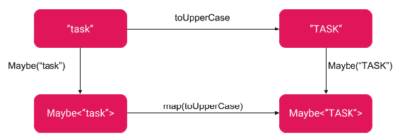
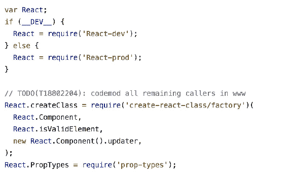

# 第九章：函数式编程模式的元素

这是一个专注于函数式编程范式和设计模式的高级章节，这些设计模式来自函数式编程世界。现在是深入了解为什么我们可以创建无状态和有状态组件的时候了。这归结于理解纯函数是什么，以及不可变对象如何帮助我们预测应用程序的行为。一旦我们搞清楚了这一点，我们将继续讨论高阶函数和高阶组件。你已经多次使用过它们，但这一次我们将从稍微不同的角度来看待它们。

在整本书中，我向你提出了许多概念，在阅读完这一章后，这些概念会变得更加清晰。我希望你能在应用程序中接受它们并明智地使用它们，牢记你的团队的成熟度。这些模式是值得了解的，但对于 React 或 React Native 的开发并非必不可少。然而，当阅读 React 或 React Native 存储库的拉取请求时，你会发现自己经常参考这一章。

在本章中，我们将涵盖以下主题：

+   可变和不可变结构

+   特定函数，如纯函数

+   `Maybe`单子和单子模式

+   函数式编程的好处

+   缓存和记忆

# 可变和不可变对象

这个概念在我的一次编程面试中让我感到惊讶。在我职业生涯的开始，我对可变和不可变对象知之甚少，而这甚至在我没有意识到根本原因的情况下产生了不良后果。

在第五章中，*存储模式*，我解释了可变性和不可变性的基础知识。我们甚至使用了`Immutable.js`库。这部分书重点关注了存储。现在让我们来看看更大的图景。我们为什么需要可变或不可变的对象？

通常，主要原因是能够快速推断我们应用的行为。例如，React 想要快速检查是否应该重新渲染组件。如果你创建了对象*A*并且可以保证它永远不会改变，那么为了确保没有任何更改，你唯一需要做的就是比较对象的引用。如果它与之前相同，那么对象*A*保持不变。如果对象*A*可能会改变，我们需要比较对象*A*中的每个嵌套键，以确保它保持不变。如果对象*A*有嵌套对象，并且我们想知道它们是否没有改变，我们需要为嵌套对象重复这个过程。这是很多工作，特别是当对象*A*增长时。但为什么我们需要以这种方式做呢？

# JavaScript 中的不可变原始数据类型

在 JavaScript 中，原始数据类型（数字、字符串、布尔值、未定义、null 和符号）是不可变的。对象是可变的。此外，JavaScript 是弱类型的；这意味着变量不需要是某种类型。例如，你可以声明变量 A 并将数字 5 赋给它，然后稍后决定将对象赋给它。JavaScript 允许这样做。

为了简化事情，社区创建了两个非常重要的运动：

+   保证对象的不可变性的库

+   JavaScript 的静态类型检查器，如 Flow 或 TypeScript

第一个提供了创建对象的功能，保证它们的不可变性。这意味着，每当你想要改变对象中的某些东西时，它会克隆自身，应用更改，并返回一个全新的不可变对象。

第二个，静态类型检查器，主要解决了开发人员在意外尝试将值分配给与最初预期的不同类型的变量时的人为错误问题。因此，如果你声明`variableA`是一个数字，你永远不能将一个字符串赋给它。对我们来说，这意味着类型的不可变性。如果你想要不同的类型，你需要创建一个新的变量并将`variableA`映射到它。

关于`const`关键字的一个重要说明：`const`在引用级别上运作。它禁止引用更改。常量变量的值不能被重新分配，也不能被重新声明。对于原始的不可变类型，它只是意味着永久冻结它们。你永远不能重新分配一个新值给变量。尝试分配不同的值也会失败，因为原始类型是不可变的，这只是意味着创建一个全新的引用。对于可变类型的对象，它只是意味着冻结对象引用。我们不能将一个新对象重新分配给变量，但我们可以改变对象的内容。这意味着我们可以改变内部的内容。这并不是很有用。

# 不可变性成本解释

当我第一次接触到这个概念时，我开始挠头。这样会更快吗？如果你想修改一个对象，你需要克隆它，这是任何简单改变的严重成本。我认为这是不可接受的。我假设它的成本与我们在每个级别执行相等检查是一样的。我既对也错。

这取决于你使用的工具。特殊的数据结构，比如 Immutable.js，进行了许多优化，以便轻松工作。然而，如果你用`spread`运算符或`Object.assign()`克隆你的对象，那么你会重新创建整个对象，或者在不知不觉中只是克隆一层。

“对于深层克隆，我们需要使用其他替代方案，因为 Object.assign()只会复制属性值。如果源值是对对象的引用，它只会复制该引用值。”

- Mozilla JavaScript 文档

[`developer.mozilla.org/en-US/docs/Web/JavaScript/Reference/Global_Objects/Object/assign`](https://developer.mozilla.org/en-US/docs/Web/JavaScript/Reference/Global_Objects/Object/assign)。“扩展语法在复制数组时有效地进入一层。因此，它可能不适用于复制多维数组[...]（与 Object.assign()和扩展语法相同）。”

- Mozilla JavaScript 文档

[`developer.mozilla.org/pl/docs/Web/JavaScript/Reference/Operators/Spread_syntax`](https://developer.mozilla.org/pl/docs/Web/JavaScript/Reference/Operators/Spread_syntax).

这非常方便，我们在 React 应用程序中经常滥用这一事实。让我们通过一个例子来看看这一点。以下是我们将执行操作的对象：

```jsx
const someObject = {
    x: "1",
  y: 2,
  z: {
        a: 1,
  b: 2,
  c: {
            x1: 1,
  x2: 2
  }
    }
};
```

首先，我们将只克隆一层深，然后在克隆的对象中对两层深的东西进行变异。观察原始对象会发生什么。

```jsx
function naiveSpreadClone(obj) { // objects are passed by reference
    return { ...obj };
    // copy one level deep ( nested z cloned by reference ) }
const someObject2 = naiveSpreadClone(someObject); // invoke func someObject2.z.a = 10; // mutate two levels deep console.log(someObject2.z.a); // logs 10 console.log(someObject.z.a)**; //** **logs 10
// nested object in original someObject mutated too!** 
```

这是变异的一个陷阱。如果您不熟练地理解发生了什么，您可能会产生难以修复的错误。问题是，我们如何克隆两层深？请参见以下内容：

```jsx
function controlledSpreadClone(obj) {
    return { ...obj, z: { ...obj.z } }; // copy 2 levels deep }

const someObject2 = controlledSpreadClone(someObject); someObject2.z.a = 10; // mutation only in copied object console.log(someObject2.z.a); // logs 10 console.log(someObject.z.a)**; // logs 1** 
```

如果需要，您可以使用这种技术来以这种方式复制整个对象。

仅复制一层被称为**浅复制**。

# 读/写操作基准测试

为了更好地理解权衡和决定哪个库适合您的特定用例，请查看读写操作的基准测试。这应该作为一个一般的想法。在最终决定之前，请进行自己的测试。

我使用了由[ImmutableAssign 作者](https://github.com/engineforce/ImmutableAssign/)创建的基准测试。该代码自动比较了许多库和方法来解决 JavaScript 中的不可变性。

首先，让我们看看纯 JavaScript，只使用简单的可变结构。我们不关心任何好处，只是用它们作为基准测试：

| 几乎全新的 MacBook Pro 15''（2018）没有后台任务 | MacBook Pro 15''（2016）有一些后台任务在运行 |
| --- | --- |
| **可变对象和数组** 对象：读取（x500000）：9 毫秒 对象：写入（x100000）：3 毫秒 对象：非常深的读取（x500000）：31 毫秒 对象：非常深的写入（x100000）：9 毫秒 对象：合并（x100000）：17 毫秒 数组：读取（x500000）：4 毫秒 数组：写入（x100000）：3 毫秒 数组：深读（x500000）：5 毫秒 数组：深写（x100000）：2 毫秒 总计经过 49 毫秒（读取）+ **17 毫秒（写入）** + 17 毫秒（合并）= 83 毫秒。 | **可变对象和数组** 对象：读取（x500000）：11 毫秒 对象：写入（x100000）：4 毫秒 对象：非常深的读取（x500000）：42 毫秒 对象：非常深的写入（x100000）：12 毫秒 对象：合并（x100000）：17 毫秒 数组：读取（x500000）：7 毫秒 数组：写入（x100000）：3 毫秒 数组：深读（x500000）：7 毫秒 数组：深写（x100000）：3 毫秒 总计经过 67 毫秒（读取）+ **22 毫秒（写入）** + 17 毫秒（合并）= 106 毫秒。 |

括号中，您可以看到执行的操作次数。这是非常快的。没有不可变的解决方案可以超过这个基准，因为它只使用可变的 JS 对象和数组。

一些要注意的事情是基于我们阅读的深度而产生的差异。例如，读取对象（x500000）需要 11 毫秒，而非常深的对象读取（x500000）需要 42 毫秒，几乎是 4 倍长：

| 几乎全新的 MacBook Pro 15''（2018）没有后台任务 | MacBook Pro 15''（2016）有一些后台任务在运行 |
| --- | --- |
| **不可变对象和数组（Object.assign）** 对象：读取（x500000）：13 毫秒 对象：写入（x100000）：85 毫秒 对象：非常深的读取（x500000）：30 毫秒 对象：非常深的写入（x100000）：220 毫秒 对象：合并（x100000）：91 毫秒 数组：读取（x500000）：7 毫秒 数组：写入（x100000）：402 毫秒 数组：深读（x500000）：9 毫秒 数组：深写（x100000）：400 毫秒 总计经过 59 毫秒（读取）+**1107 毫秒（写入）**+91 毫秒（合并）= 1257 毫秒。 | **不可变对象和数组（Object.assign）** 对象：读取（x500000）：19 毫秒 对象：写入（x100000）：107 毫秒 对象：非常深的读取（x500000）：33 毫秒 对象：非常深的写入（x100000）：255 毫秒 对象：合并（x100000）：136 毫秒 数组：读取（x500000）：11 毫秒 数组：写入（x100000）：547 毫秒 数组：深读（x500000）：14 毫秒 数组：深写（x100000）：504 毫秒 总计经过 77 毫秒（读取）+**1413 毫秒（写入）**+136 毫秒（合并）= 1626 毫秒。 |

`Object.assign`在写操作上创建了一个峰值。现在我们看到了复制不需要的东西的成本。非常深层级的对象写操作接近于比较昂贵。数组深写比可变方式慢 100 到 200 倍：

| 几乎全新的 MacBook Pro 15''（2018）没有后台任务 | MacBook Pro 15''（2016）有一些后台任务在运行 |
| --- | --- |
| **Immutable.js 对象和数组** 对象：读取（x500000）：12 毫秒 对象：写入（x100000）：19 毫秒 对象：非常深的读取（x500000）：111 毫秒 对象：非常深的写入（x100000）：80 毫秒 对象：合并（x100000）：716 毫秒 数组：读取（x500000）：18 毫秒 数组：写入（x100000）：135 毫秒 数组：深读（x500000）：51 毫秒 数组：深写（x100000）：97 毫秒 总计经过 192 毫秒（读取）+**331 毫秒（写入）**+716 毫秒（合并）= 1239 毫秒。 | **Immutable.js 对象和数组** 对象：读取（x500000）：24 毫秒 对象：写入（x100000）：52 毫秒 对象：非常深的读取（x500000）：178 毫秒 对象：非常深的写入（x100000）：125 毫秒 对象：合并（x100000）：1207 毫秒 数组：读取（x500000）：24 毫秒 数组：写入（x100000）：255 毫秒 数组：深读（x500000）：128 毫秒 数组：深写（x100000）：137 毫秒 总计经过 354 毫秒（读取）+**569 毫秒（写入）**+1207 毫秒（合并）= 2130 毫秒。 |

对象写入的速度比可变方式慢 6 倍。非常深的对象写入几乎比可变方式慢 9 倍，并且比`Object.assign()`快 2.75 倍。合并操作，构造作为参数传递的两个对象合并结果的对象，要慢得多（比可变对象慢 42 倍，甚至如果用户正在使用其他程序，可能慢 70 倍）。

请注意所使用的硬件。要么是 2016 年的 MacBook Pro，要么是 2018 年的 MacBook Pro，两者都是速度非常快的机器。将这一点带到移动世界将会使这些基准值更高。本节的目的是让您对数字进行比较有一个大致的了解。在得出结论之前，请在与您的项目相关的特定硬件上运行您自己的测试。

# 纯函数

在本节中，我们将从不同的角度回顾我们已经学过的纯函数。您还记得 Redux 试图尽可能明确吗？这是有原因的。一切隐式的东西通常是麻烦的根源。您还记得数学课上的函数吗？那些是 100%明确的。除了将输入转换为某种输出之外，没有其他事情发生。

然而，在 JavaScript 中，函数可能具有隐式输出。它可能会更改一个值，更改外部系统，以及许多其他事情可能发生在函数范围之外。您已经在第五章 *存储模式*中学到了这一点。所有这些隐式输出通常被称为副作用。

我们需要解决所有不同类型的副作用。不可变性是我们的一种武器，它可以保护我们免受外部对象隐式更改的影响。这就是不可变性的作用——它保证绝对不会发生这种情况。

在 JavaScript 中，我们无法通过引入不可变性等武器来消除所有副作用。有些需要语言级别上的工具，而这些工具在 JavaScript 中是不可用的。在 Haskell 等函数式编程语言中，甚至输入/输出都由称为`IO()`的单独结构控制。然而，在 JavaScript 中，我们需要自己处理这些问题。这意味着我们无法避免一些函数是不纯的——因为这些函数需要处理 API 调用。

另一个例子是随机性。任何使用`Math.random`的函数都不能被认为是纯的，因为这些函数的一部分依赖于随机数生成器，这违背了纯函数的目的。一旦使用特定参数调用函数，就不能保证收到相同的输出。

同样，一切依赖于时间的东西都是不纯的。如果你的函数执行依赖于月份、日期、秒甚至年份，它就不能被认为是一个纯函数。在某个时刻，相同的参数将不会产生相同的输出。

最终，一切都归结为执行链。如果你想说一部分操作是纯净的，那么你需要知道它们每一个都是纯净的。一个最简单的例子是一个消耗另一个函数的函数：

```jsx
const example = someArray => someFunc => someFunc(someArray);
```

在这个例子中，我们不知道`someFunc`会是什么。如果`someFunc`是不纯的，那么`example`函数也将是不纯的。

# Redux 中的纯函数

好消息是我们可以将副作用推到我们应用程序的一个地方，并在真正需要时循环调用它们。这就是 Flux 所做的。Redux 甚至进一步采纯函数作为 reducers。这是可以理解的。当不纯的部分已经完成时，reducers 被调用。从那时起，我们可以保持不可变性，至少在 Redux 存储方面。

有些人可能会质疑这在性能方面是否是一个好选择。相信我，它是的。与状态访问和操作计算状态的选择器相比，我们发生的事件数量非常少（需要被减少，因此影响存储）。

为了保持状态不可变，我们得到了巨大的好处。我们可以知道导致特定状态的函数应用顺序。如果我们真的需要，我们可以追踪它。这是巨大的。我们可以在测试环境中再次应用这些函数，并且我们可以保证输出完全相同。这要归功于函数的纯净性 - 因此不会产生副作用。

# 缓存纯函数

缓存是一种记住计算的技术。如果你可以保证对于某些参数，你的函数总是返回相同的值，你可以安全地计算一次，并且始终返回这些特定参数的计算值。

让我们看看通常用于教学目的的微不足道的实现：

```jsx
const memoize = yourFunction => {
  const cache = {};

  return (...args) => {
    const cacheKey = JSON.stringify(args);
    if (!cache[cacheKey]) {
        cache[cacheKey] = yourFunction(...args);
    }
    return cache[cacheKey];
  };
};
```

这是一种强大的技术，被用于 reselect 库。

# 引用透明度

纯函数是**引用透明**的，这意味着它们的函数调用可以用给定参数的相应结果替换。

现在，看一下引用透明和引用不透明函数的例子：

```jsx
 let globalValue = 0;

 const inc1 = (num) => { // Referentially opaque (has side effects)
   globalValue += 1;
   return num + globalValue;
 }

 const inc2 = (num) => { // Referentially transparent
   return num + 1;
 }
```

让我们想象一个数学表达式：

```jsx
inc(4) + inc(4) * 5

// With referentially transparent function you can simplify to:
inc(4) * ( 1 + 1*5 )
// and even to
inc(4) * 6
```

请注意，如果您的函数不是引用透明的，您需要避免这样的简化。类似前面的表达式或`x() + x() * 0`都是诱人的陷阱。

你是否使用它取决于你自己。另请参阅本章末尾的*进一步阅读*部分。

# 除了单子以外的一切

多年来，术语单子一直臭名昭著。不是因为它是一个非常有用的构造，而是因为它引入的复杂性。人们普遍认为，一旦你理解了单子，你就失去了解释它们的能力。

“为了理解单子，你需要先学习 Haskell 和范畴论。”

我认为这就像说：为了理解墨西哥卷饼，你必须先学习西班牙语。

- Douglas Crockford：单子和性腺体（YUIConf 晚间主题演讲）

[`www.youtube.com/watch?v=dkZFtimgAcM`](https://www.youtube.com/watch?v=dkZFtimgAcM)。

单子是一种组合函数的方式，尽管存在特殊情况，比如可空值、副作用、计算，或者条件执行。这样对单子的定义使它成为一个上下文持有者。这就是为什么 X 的单子不等同于 X。在被视为`monad<X>`之前，这个 X 需要首先被提升，这意味着创建所需的上下文。如果我们不再需要`monad<X>`，我们可以将结构展平为 X，这相当于失去了一个上下文。

这就像打开圣诞礼物一样。你很确定里面有礼物，但这取决于你整年表现如何。在一些罕见的不良行为情况下，你可能最终得到的是一根棍子或一块煤。这就是`Maybe<X>`单子的工作原理。它可能是 X，也可能是空。它与可空 API 值一起使用效果很好。

# 也许给我打电话

我们的代码中有一个地方需要简化。看一下`taskSelector`：

```jsx
export const tasksSelector = state => state.tasks;   export const tasksEntitiesSelector = createSelector(
    tasksSelector,
  tasks => (tasks ? tasks.get('entities') : null)
); 
export const getTaskById = taskId => createSelector(
    tasksEntitiesSelector,
  entities => (entities
        ? entities.find(task => task.id === taskId)
        : null)
);  
```

我们不断担心我们是否收到了某物还是空值。这是一个完美的情况，可以将这样的工作委托给`Maybe`单子。一旦我们实现了`Maybe`，以下代码将是完全功能的：

```jsx
import Maybe from '../../../../utils/Maybe';   export const tasksSelector = state => Maybe(state).map(x => x.tasks);   export const tasksEntitiesSelector = createSelector(
    tasksSelector,
  maybeTasks => maybeTasks.map(tasks => tasks.get('entities'))
);   export const getTaskById = taskId => createSelector(
    tasksEntitiesSelector,
  entities => entities.map(e => e.find(task => task.id === taskId))
);
```

到目前为止，你已经了解了我们需要实现的`Maybe` monad 的一些知识：当`null`/`undefined`时，它需要是 nothing，当`null`或`undefined`时，它需要是`Something`：

```jsx
const Maybe = (value) => {
    const Nothing = {
        // Some trivial implementation   };
  const Something = val => ({
        // Some trivial implementation
    });    return (typeof value === 'undefined' || value === null)
        ? Nothing
        : Something(value); };
```

到目前为止，非常简单。问题是，我们既没有实现`Nothing`也没有实现`Something`。别担心，这很简单，就像我的评论一样。

我们需要它们都对三个函数做出反应：

+   `isNothing`

+   `val`

+   `map`

前两个函数很简单：

+   `isNothing`：`Nothing`返回`true`，`Something`返回`false`

+   `val`：`Nothing`返回`null`，`Something`返回它的值

最后一个是`map`，对于`Nothing`应该什么都不做（返回自身），对于`Something`应该将函数应用于值：



在普通字符串类型和`Maybe<string>` monad 上使用 map 函数对 toUpperCase 进行应用

让我们实现这个逻辑：

```jsx
// src / Chapter 9 / Example 1 / src / utils / Maybe.js
const Maybe = (value) => {
    const Nothing = {
        map: () => this,
  isNothing: () => true,
  val: () => null
  };
  const Something = val => ({
        map: fn => Maybe(fn.call(this, val)),
  isNothing: () => false,
  val: () => val
    });    return (typeof value === 'undefined' || value === null)
        ? Nothing
        : Something(value); };   export default Maybe;
```

我们已经完成了，不到 20 行。我们的选择器现在使用`Maybe` monad。我们需要做的最后一件事是修复最终的用法；在选择器调用之后，它应该要求值，就像下面的例子中那样：

```jsx
// src / Chapter 9 / Example 1
//         src/features/tasks/containers/TaskDetailsContainer.js 
const mapStateToProps = (state, ownProps) => ({
 task: getTaskById(ownProps.taskId)(state).val()
});
```

我们的`Maybe`实现是一个很酷的模式，可以避免空检查的负担，但它真的是一个 monad 吗？

# Monad 接口要求

更正式地说，monad 接口应该定义两个基本运算符：

+   Return（`a -> M a`），一个接受`a`类型并将其包装成 monad（`M a`）的操作

+   Bind（`M a ->（a -> M b）-> M b`），一个接受两个参数的操作：a 类型的 monad 和一个在`a`上操作并返回`M b`（`a -> M b`）monad 的函数

在这些条件下，我们的构造函数是`return`函数。然而，我们的 map 函数不符合`bind`的要求。它接受一个将`a`转换为`b`（`a -> b`）的函数，然后我们的`map`函数自动将`b`包装成`M b`。

除此之外，我们的 monad 需要遵守三个 monad 定律：

+   左单位元：

```jsx
// for all x, fn
Maybe(x).map(fn) == Maybe(fn(x))
```

+   右单位元：

```jsx
// for all x
Maybe(x).map(x => x) == Maybe(x)
```

+   结合律：

```jsx
// for all x, fn, gn
Maybe(x).map(fn).map(gn) == Maybe(x).map(x => gn(fn(x)));
```

数学证明超出了本书的范围。然而，我们可以用这些定律来验证一些随机的例子：

```jsx
// Left identity example
Maybe("randomtext")
.map(str => String.prototype.toUpperCase.call(str))
.val() // RANDOMTEXT
 Maybe(String.prototype.toUpperCase.call("randomtext"))
.val()) // RANDOMTEXT

// Right identity example
Maybe("randomtext").map(str => str).val() // randomtext
Maybe("randomtext").val() // randomtext

// Associativity
const f = str => str.replace('1', 'one'); const g = str => str.slice(1); 
Maybe("1 2 3").map(f).map(g).val() // ne 2 3
Maybe("1 2 3").map(str => g(f(str))).val() // ne 2 3
```

# 高阶函数

我们已经了解了高阶组件，本节我们将看一下更一般的概念，称为高阶函数。

看看这个例子。非常简单。你甚至不会注意到你创建了什么特别的东西：

```jsx
const add5 = x => x + 5; // function
const applyTwice = (f, x) => f(f(x)); // higher order function

applyTwice(add5, 7); // 17
```

那么什么是高阶函数呢？

高阶函数是一个做以下操作之一的函数：

+   将一个或多个函数作为参数

+   返回一个函数

就是这样，很简单。

# 高阶函数的例子

有许多高阶函数，你每天都在使用它们：

+   `Array.prototype.map`：

```jsx
someArray.map(function callback(currentValue, index, array){
    // Return new element
});

// or in the shorter form
someArray.map((currentValue, index, array) => { //... });
```

+   `Array.prototype.filter`：

```jsx
someArray.filter(function callback(currentValue, index, array){
    // Returns true or false
});

// or in the shorter form
someArray.filter((currentValue, index, array) => { //... });
```

+   `Array.prototype.reduce`：

```jsx
someArray.reduce(
    function callback(previousValue, currentValue, index, array){
        // Returns whatever
    },
    initialValue
);

// or in the shorter form
someArray.reduce((previousValue, currentValue, index, array) => {
    // ... 
}, initialValue);

// previousValue is usually referred as accumulator or short acc
// reduce callback is also referred as fold function
```

当然，还有`compose`，`call`或`curry`等函数，我们已经学习过了。

一般来说，任何接受回调的函数都是高阶函数。你在各个地方都使用这样的函数。

你还记得它们是如何很好地组合的吗？请看下面：

```jsx
someArray
    .map(...)
    .filter(...)
    .map(...)
    .reduce(...)
```

但有些不行，比如回调。你听说过回调地狱吗？

回调中的回调中的回调，这就是回调地狱。这就是为什么 Promise 被发明的原因。

然后，突然之间，`Promise`地狱开始了，所以聪明的人为 promise 创建了一种语法糖：`async`和`await`。

# 除了函数式语言

首先，请阅读大卫的这个有趣观点。

“等等，等等。持久数据结构的性能与 JavaScript MVC 的未来有什么关系？

很多。

我们将看到，也许不直观的是，不可变数据允许一个新的库 Om，即使没有用户的手动优化，也能胜过像 Backbone.js 这样性能合理的 JavaScript MVC。Om 本身是建立在 Facebook 绝妙的 React 库之上的。

- JavaScript MVC 框架的未来

大卫·诺伦（swannodette），2013 年 12 月 17 日

[`swannodette.github.io/2013/12/17/the-future-of-javascript-mvcs`](http://swannodette.github.io/2013/12/17/the-future-of-javascript-mvcs)。

在撰写本文时（2018 年 9 月），Backbone 已经停止运营。即使 Angular 的流行程度也难以与 React 竞争。React 迅速占领了市场，一旦它最终将许可证更改为 MIT，甚至加速了这一过程。

有趣的是**requestAnimationFrame**（**rAF**）并不像人们曾经认为的那样重要。

“我们在一个事件处理程序中在不同的 setState()之间进行批处理（当您退出时，所有内容都会被刷新）。对于许多情况来说，这足够好用，并且没有使用 rAF 更新的潜在问题。我们还在默认情况下查看异步渲染。但是，如果渲染树很大，rAF 并不会帮助太多。相反，我们希望使用 rIC 将非关键更新分成块，直到它们准备好被刷新。

(...) 我们使用了“过期”概念。来自交互事件的更新具有非常短的过期时间（必须很快刷新），网络事件具有更长的时间（可以等待）。基于此，我们决定刷新和时间切片的内容。

- Dan Abramov 的推文

[`twitter.com/jaffathecake/status/952861127528124417`](https://twitter.com/jaffathecake/status/952861127528124417).

我希望你从这两个引语中学到的教训是：不要想当然，不要过分美化一种方法，要学会在哪些情况下一种方法比另一种更好。函数式编程也是如此；像我曾经想的那样，简单地放弃这一章是愚蠢的。我有这种感觉：这对 React Native 程序员有用吗？是的，它有用。如果它足够流行，以至于在社区中涌现出许多公共 PR，那么你肯定会接触到这些概念，我希望你做好准备。

# 术语

不要被函子、EndoFunctors、CoMonads 和 CoRoutines 吓到——从理论抽象中获取有用的东西。让理论专家来处理它们。数学极客们一直走在前面，通常这是一件好事，但不要太疯狂。业务就是业务。截止日期不能等待你证明范畴论中最伟大的定律。

专注于理解即时的好处，比如本书中概述的好处。如果你发现自己在一个反对函数式编程模式的团队中，不要强制执行它们。毕竟，在 JavaScript 中它并不像在 Haskell 中那样重要。

“使用花哨的词而不是简单、常见的词会使事情更难理解。如果你坚持使用一个小的词汇表，你的写作会更清晰。”

- Sophie Alpert 的推文（Facebook 的 React 工程经理）

[`twitter.com/sophiebits/status/1033450495069761536`](https://twitter.com/sophiebits/status/1033450495069761536).

# 构建抽象

在本章的开始，我们对不可变库进行了基准测试，并比较了它们的性能。和任何事情一样，我强烈建议你在承诺任何库、模式或做事情的方式之前花一些时间。

大多数采用函数式编程模式的库都是为了真正的好处。如果你不确定，就把它留给别人，坚持你熟悉的命令式模式。事实证明，简单的代码通常在引擎层面上得到更好的优化。

# React 并不迷恋纯函数

当你第一次接触 React 生态系统时，你可能会有些惊讶。有很多例子使用纯函数，并谈论时间旅行，使用 Redux，以及一个存储来统治它们所有。

事实上，React 和 Redux 都不仅仅使用纯函数。实际上，这两个库中有很多函数在外部范围中执行变异：

```jsx
// Redux library code
// redux/src/createStore.js

let currentReducer = reducer
let currentState = preloadedState
let currentListeners = []
let nextListeners = currentListeners
let isDispatching = false

// Check yourself:
[`github.com/reduxjs/redux/blob/1448a7c565801029b67a84848582c6e61822f572/src/createStore.js`](https://github.com/reduxjs/redux/blob/1448a7c565801029b67a84848582c6e61822f572/src/createStore.js) [](https://github.com/reduxjs/redux/blob/1448a7c565801029b67a84848582c6e61822f572/src/createStore.js) 
```

这些变量正在被其他函数修改。

现在，看看 React 如何记住库所警告的内容：

```jsx

let didWarnAboutMaps = false; 
// (...)

if (__DEV__) {   if (iteratorFn === children.entries) {
    warning(
      didWarnAboutMaps,
  'Using Maps as children is unsupported (...)'   );
  didWarnAboutMaps = true**;**
  }
}

// Check yourself
https://github.com/facebook/react/blob/f9358c51c8de93abe3cdd0f4720b489befad8c48/packages/react/src/ReactChildren.js
```

这个小的变异取决于环境。

如果你维护一个带有这些检查的库，当前的构建工具，比如 webpack，在构建生产压缩文件时可以删除这些死代码。所谓的死代码，我指的是因为环境（生产）而永远不会被访问的代码路径（如前面的`if`语句）。

一般来说，Facebook 并不羞于展示他们的代码库在某些地方是棘手的：

Facebook 代码库截图，由 Dan Abramov 在 Twitter 上发布

# 总结

在这一章中，我们深入研究了 JavaScript 编程中最神秘的分支之一。我们学习了单子，如何为了更大的利益使用它们，以及如果我们真的不需要的话，如何不关心数学定律。然后，我们开始使用词汇，比如纯函数，可变/不可变对象和引用透明度。

我们知道如果需要的话，纯函数有一个缓存模式。这种很好的方法在许多 Flux 应用中都很有用。现在你可以有效地使用选择器，并使用 Maybe monad 使它们变得非常简单，这消除了空值检查的负担。

有了所有这些专业知识，现在是时候学习维护依赖和大型代码库的挑战了。在下一章中，你将面临每个大型代码库的主要挑战，相信我，每个大公司在某个时候都会遇到这个问题——无论他们使用了多少编程模式或依赖了多少库。

# 进一步阅读

+   一个关于 JavaScript 函数式编程的大部分合格指南——一本免费的关于 JavaScript 函数式编程的书：

[`github.com/MostlyAdequate/mostly-adequate-guide`](https://github.com/MostlyAdequate/mostly-adequate-guide)。

+   你可能想要与 Reselect 库一起使用的缓存函数的例子：

[`github.com/reduxjs/reselect#q-the-default-memoization-function-is-no-good-can-i-use-a-different-one`](https://github.com/reduxjs/reselect#q-the-default-memoization-function-is-no-good-can-i-use-a-different-one)。

+   关于引用透明性的信息：

[`softwareengineering.stackexchange.com/questions/254304/what-is-referential-transparency`](https://softwareengineering.stackexchange.com/questions/254304/what-is-referential-transparency)。

+   Eric's Elliott 掌握 JavaScript 面试系列的一集，Pure Functions：

[`medium.com/javascript-scene/master-the-javascript-interview-what-is-a-pure-function-d1c076bec976`](https://medium.com/javascript-scene/master-the-javascript-interview-what-is-a-pure-function-d1c076bec976)。

+   一个预测未来的历史帖子，《JavaScript MVCs 的未来》：

[`swannodette.github.io/2013/12/17/the-future-of-javascript-mvcs`](http://swannodette.github.io/2013/12/17/the-future-of-javascript-mvcs)。

+   这是旧的，但仍然值得一读，《反应性的一般理论》：

[`github.com/kriskowal/gtor`](https://github.com/kriskowal/gtor)。

+   关于 JavaScript 中的函数式编程的以下书籍，《JavaScript Allonge》（可免费在线阅读）：

[`leanpub.com/javascriptallongesix/read#leanpub-auto-about-javascript-allong`](https://leanpub.com/javascriptallongesix/read#leanpub-auto-about-javascript-allong)。

+   Monad laws（Haskell Wiki）：

[`wiki.haskell.org/Monad_laws`](https://wiki.haskell.org/Monad_laws)。

+   Douglas Crockford，Monad 和 Gonads：

[`www.youtube.com/watch?v=dkZFtimgAcM`](https://www.youtube.com/watch?v=dkZFtimgAcM)。

+   Immutable.js 如何使用 Trie 图来优化写操作：

[`medium.com/@dtinth/immutable-js-persistent-data-structures-and-structural-sharing-6d163fbd73d2`](https://medium.com/@dtinth/immutable-js-persistent-data-structures-and-structural-sharing-6d163fbd73d2)。

[`en.wikipedia.org/wiki/Trie`](https://en.wikipedia.org/wiki/Trie)。

+   React 是否应默认使用`requestAnimationFrame`：

[`github.com/facebook/react/issues/11171`](https://github.com/facebook/react/issues/11171)。

+   GitHub 上一个很棒的函数式编程收藏：

[`github.com/xgrommx/awesome-functional-programming/blob/master/README.md`](https://github.com/xgrommx/awesome-functional-programming/blob/master/README.md)。

+   如果你迷恋函数式编程，这是一个非常好的资源，

《Learn You a Haskell for Great Good》（需要了解 Haskell）：

[`learnyouahaskell.com/chapters`](http://learnyouahaskell.com/chapters).
