# 第十章：管理依赖关系

本章专门讨论管理依赖关系，即您的移动应用程序所依赖的库。大多数当前的应用程序滥用了单例模式。然而，我坚信，总有一天，JavaScript 开发人员会采用众所周知的**依赖注入**（**DI**）模式。即使他们决定使用单例模式，重构也会更容易。在本章中，我们将重点讨论 React 上下文以及 Redux 等库如何利用 DI 机制。这是您真正想要提升代码并使其易于测试的最安全选择。我们将深入研究 React Redux 库中的代码，该库广泛使用 React 上下文。您还将了解为什么 JavaScript 世界如此迟缓地放弃单例模式。

在本章中，您将学习以下主题：

+   单例模式

+   ECMAScript 中的 DI 模式及其变体

+   storybook 模式，以提高生产力并记录您的组件

+   React 上下文 API

+   如何管理大型代码库

准备好了吗，因为我们将立即开始单例模式。

# 单例模式

单例模式是一个只能有一个实例的类。按照其设计，每当我们尝试创建一个新实例时，它要么首次创建一个实例，要么返回先前创建的实例。

这种模式有什么用？如果我们想要为某些事情有一个单一的管理器，这就很方便，无论是 API 管理器还是缓存管理器。例如，如果您需要授权 API 以获取令牌，您只想这样做一次。第一个实例将启动必要的工作，然后任何其他实例将重用已经完成的工作。这种用例主要被服务器端应用程序滥用，但越来越多的人意识到有更好的选择。

如今，这种用例可以很容易地通过更好的模式来对抗。您可以简单地将令牌存储在缓存中，然后在任何新实例中，验证令牌是否已经在缓存中。如果是，您可以跳过授权并使用令牌。这个技巧利用了一个众所周知的事实，即缓存是存储数据的一个集中的地方。在这种情况下，它为我们提供了一个单例存储。无论是客户端还是云服务器的缓存，它都是完全相同的，唯一的区别是在服务器上调用可能更昂贵。

# 在 ECMAScript 中实现单例模式

尽管如今不鼓励使用单例模式，但学习如何创建这种机制非常有益。在这个代码示例中，我们将使用 ECMAScript 6 类和 ECMAScript 7 静态字段：

```jsx
export default class Singleton {
    static instance;    constructor() {
        if (Singleton.instance) {
            return Singleton.instance;
  }

        this.instance = this;
  }
}
```

我们正在改变构造函数的行为。首先，在返回任何内容之前，我们需要检查实例是否已经被创建。如果是，当前调用将返回该实例。

# 为什么不鼓励使用单例模式

`Singleton`有时被视为`全局`变量。如果您尝试从许多不同的地方导入它，并且您的用例只是共享相同的实例，那么您可能滥用了该模式。这样，您将不同的部分紧密耦合到精确导入的对象上。如果您使用`全局`变量而不是传递它下去，这是**代码异味**的一个重要迹象。

此外，`Singleton`在测试方面非常不可预测。您会收到一个由突变效果产生的东西。它可能是一个新对象，也可能是先前创建的对象。您可能会被诱惑使用它来同步某种状态。例如，让我们看下面的例子：

```jsx
export default class Singleton {
    static instance;    constructor() {
        if (Singleton.instance) {
            return Singleton.instance;
  }

        this.name = 'DEFAULT_NAME';
  this.instance = this;
  }

    getName() {
        return this.name;
  }

    setName(name) {
        this.name = name;
  }
}
```

这使`Singleton`不仅在全局范围内共享，而且在全局范围内可变。如果您想要使其可预测，这是一个可怕的故事。它通常会打败我们在第九章中学到的一切，*函数式编程模式的要素*。

您需要向每个使用单例模式的组件保证它已准备好处理来自单例的任何类型的数据。这需要指数数量的测试，因此会降低生产力。这是不可接受的。

在本章的后面，您将找到一个通过 DI 解决所有这些问题的解决方案。

# JavaScript 中的许多单例模式

说实话，除了之前的实现之外，我们可以看到许多其他变化，以达到相同的目的。让我们讨论一下。

在下面的代码中，单例已经作为`instance`导出：

```jsx
class Singleton {
    static instance;
  constructor() {
        if (Singleton.instance) {
            return Singleton.instance;
  }
   this.instance = this;
  }
}

export default new Singleton();
```

这看起来像是一个很好的改进，除非你的`Singleton`需要参数。如果是这样，`Singleton`被导出的方式也更难测试，并且可能只接受硬编码的依赖项。

有时，你的`Singleton`可能非常小，只需要一个对象就足够了：

```jsx
export default {
    apiRoot: API_URL,
    fetchData() {
        // ...
    },
};
```

重构这种模式可能会导致任何成熟的 JavaScript 开发人员都熟悉的语法：

```jsx
// ./apiSingleton.js
export const apiRoot = API_URL;
export const fetchData = () => {
    // ...
}

// Then import as shown below
import * as API from './apiSingleton'
```

最后一个例子可能会让你开始担心，并且你可能已经开始问自己——我是否在不知不觉中使用单例？我敢打赌你是。但只要你正确地注入它们，这并不是世界末日。让我们来看一下 ECMAScript 和 JavaScript 模块方法的部分。这对于任何 JavaScript 程序员来说都是重要的知识。

要小心，因为一些模块捆绑器不能保证模块只会被实例化一次。像 webpack 这样的工具可能会在内部多次实例化一些模块，以进行优化或兼容性。

# ES6 模块及更高版本

ES6 模块的最大优点之一是导入和导出声明的静态性质。由于这一点，我们可以在编译时检查导入和导出是否正确，执行注入（例如为旧浏览器提供 polyfill），并在必要时将它们捆绑在一起（就像 webpack 一样）。这些都是令人惊叹的积极因素，可以节省我们大量可能会减慢应用程序速度的运行时检查。

然而，有些人滥用了 ES6 模块的工作方式。语法非常简单——你可以在任何地方导入模块并轻松使用它。这是一个陷阱。你可能不想滥用导入。

# DI 模式

在同一文件中导入并使用导入的值会将该文件锁定到具体的实现。例如，看一下以下应用程序代码的实现：

```jsx
import AddTaskContainer from '../path/to/AddTaskContainer'; import TaskListContainer from '../path/to/TaskListContainer';   export const TasksSection = () => (
    <View>
 <AddTaskContainer /> <TaskListContainer /> </View> ); 
```

在这个代码示例中，`TasksSection`组件由两个容器组件`AddTaskContainer`和`TaskListContainer`组成。重要的事实是，如果你是`TasksSection`组件的使用者，你不能修改任何一个容器组件。你需要依赖于导入模块提供的实现。

为了解决这个问题，我们可以使用 DI 模式。我们基本上是将依赖项作为 props 传递给组件。在这个例子中，这将如下所示：

```jsx
export const TasksSection = ({
    AddTaskContainer,
    TaskListContainer
}) => (
    <View>
 <AddTaskContainer /> <TaskListContainer /> </View> );
```

如果有人对传递这些组件不感兴趣，我们可以创建一个容器来提供它们。但是，在我们想要用其他东西替换容器的情况下，这非常方便，例如在测试或 storybook 中！什么是 storybook？继续阅读。

# 使用 DI 模式与 storybook

storybook 是记录您的组件的一种方式。随着应用程序的增长，您可能很快就会拥有数百个组件。如果您构建一个严肃的应用程序，大多数组件都与设计规范对齐，并且所有预期的功能都已实现。诀窍在于知道发送哪些 props 以实现预期的结果。storybook 使这变得简单。当您实现一个组件时，您还为不同的场景创建一个 storybook。查看以下关于“按钮”组件的微不足道的示例：

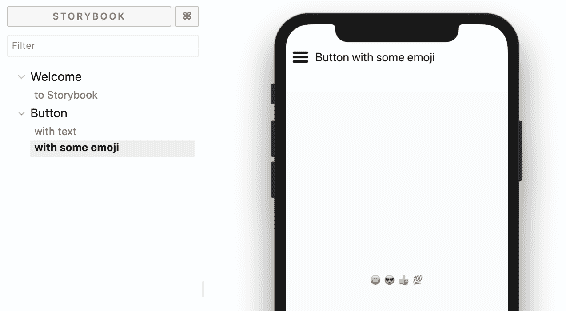

按钮组件的示例 storybook

通过在左侧面板中选择场景，您可以快速查看组件在不同 props 下的外观。

我已经为您安装了 Storybook，可以在`src/Example 10/Exercise 1`中进行操作。您可以通过从该目录运行`yarn run ios:storybook`或`yarn run android:storybook`来启动 Storybook。

如果您想学习如何自己设置 Storybook，请查看官方文档

[`github.com/storybooks/storybook/tree/master/app/react-native`](https://github.com/storybooks/storybook/tree/master/app/react-native)。

您需要添加的大多数配置文件应该放在项目的`storybook`目录中。

Storybook 提供的安装命令行界面为您设置了游乐场故事。这些是在前面的截图中的那些（带有文本和表情符号的“按钮”）。

是时候添加我们自己的故事了。让我们从一些简单的东西开始 - `TaskList`组件。这个组件非常适合用于故事编写，因为它非常完善。它处理错误，并根据加载状态或错误状态显示各种消息。它可以显示 0 个任务，1 个任务和 2 个或更多任务。有很多故事可以看：

```jsx
// src/Chapter_10/Example_1/src/features/tasks/stories/story.js

storiesOf('TaskList', module)
    .addDecorator(getStory => (  <ScrollView style={generalStyles.content}>{getStory()}</ScrollView>   ))
    .add('with one task', () => (
        <TaskList
  tasks={Immutable.List([exampleData.tasks[0]])}
            hasError={false}
            isLoading={false}
        />
  ))
    .add('with 7 tasks', () => (
        <TaskList
  tasks={Immutable.List(exampleData.tasks)}
            hasError={false}
            isLoading={false}
        />
    ));
```

在前面的代码示例中，我们为`TaskList`组件创建了我们的第一个故事。`storiesOf`函数是 storybook 自带的。然后，在装饰器中，我们用可滚动的视图和一般样式包装了每个故事，这些样式适用于左右的填充。最后，我们使用`add`函数创建了两个故事：只有一个故事的`TaskList`和带有`7`个故事的`TaskList`。

不幸的是，我们的代码出现了以下错误：

```jsx
Invariant Violation: withNavigation can only be used on a view hierarchy of a navigator. The wrapped component is unable to get access to navigation from props or context.
 - Runtime error in application
```

问题出在我们实现的`NavButton`组件上。它使用了`withNavigation` HOC，这实际上需要已经存在的上下文：

```jsx
// src/ Chapter_10/ Example_1/ src/ components/ NavigateButton.js

export default withNavigation(NavigateButton);
```

幸运的是，`withNavigation`已经使用了 DI 模式，这要归功于依赖于 React 上下文。我们需要做的是将所需的上下文（导航）注入到我们的故事书示例中。为此，我们需要使用`react-navigation`中的`NavigationProvider`：

```jsx
// src/ Chapter_10/ Example_1/ src/ features/ tasks/ stories/ story.js
storiesOf('TaskList', module)
    .addDecorator(getStory => (
        <**NavigationProvider**
  value={{
                navigate: action('navigate')
            }}
        >
 <ScrollView style={generalStyles.content}>{getStory()}</ScrollView>
 </**NavigationProvider**>  ))
    .add('with one task', () => (
        // ...   ))
    .add('with 7 tasks', () => (
        // ...   ));
```

最后，我们可以欣赏我们新创建的两个故事：

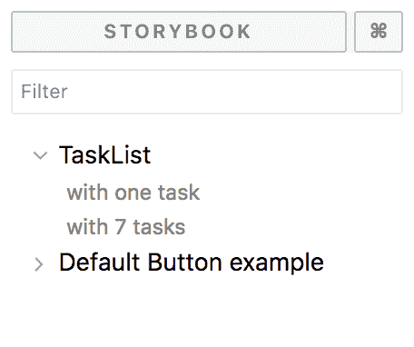

storybook 中的 TaskList 组件故事

当你选择其中一个时，它将显示在模拟器上：

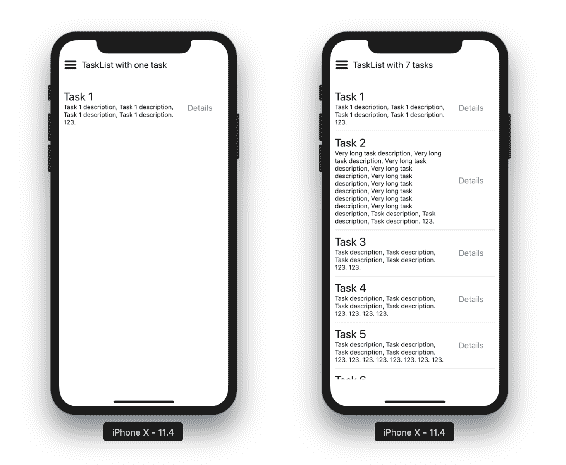

在 iPhone X 模拟器上显示的 TaskList 故事

稍微努力一下，我们可以向这个故事书添加更多的故事。例如，让我们尝试加载一个错误情况：

加载状态和错误状态的 TaskList 故事

我们还可以为组合创建一个故事，就像前面截图中显示的那样：

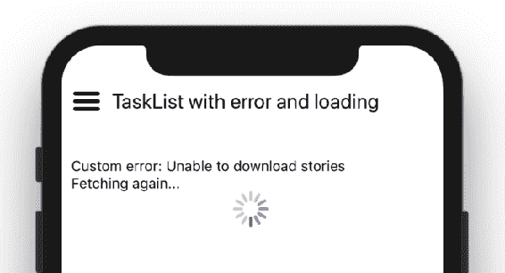带有错误和加载状态的 TaskList 故事

# 带有 DI 的嵌套故事

前面的例子已经足够好了。它创建了一个故事书，是可重用的，每个人都很高兴。然而，随着应用程序的增长和我们添加更多的故事，有时候不可能仅通过`Provider`来修复这个问题，或者`Provider`可能已经在太多的故事中使用了。

在本节中，我们将重构我们的代码，以便能够注入我们自己的组件而不是导入`NavButton`容器。由于我们的目标是保留之前的功能，在故事书中我们将注入一个`NavButton`故事，它将解决导航问题。然而，在正常的应用程序中，我们将像以前一样将`NavButton`容器注入到`TaskList`容器中。这里的优势在于我们根本不需要使用`NavigationProvider`：

```jsx
// src/Chapter_10/Example_1/src/features/tasks/views/TaskList.js

const TaskList = ({
    tasks, isLoading, hasError, errorMsg, NavButton
}) => (
    <View style={styles.taskList}>
        // ...  <View style={styles.taskActions}>
 <**NavButton**  data={{ taskId: task.id }}
                        to="Task"
  text="Details"
  />
 </View>
        // ...
    </View> ); 
```

从现在开始，`TaskList`期望在 props 中有`NavButton`组件。我们需要在容器和 storybook 中遵守这些 props 的期望。以下是第一个容器的代码：

```jsx
// src/Chapter_10/Example_1/src/features/tasks/containers/TaskList.js
import NavButton from '../../../components/NavigateButton';    const mapStateToProps = state => ({
    // ...   NavButton
});   const TasksContainer = connect(mapStateToProps)(fetchTasks(TaskListView));
```

到了有趣的部分了。我们需要解决一个 storybook 的问题。为了实现我们的 DI 目标，我们将为`NavButton`创建一个单独的 storybook。为了修复`TaskList` storybook，我们将导入`NavButton` story 并将其注入为`TaskList`视图的`NavButton`组件。

这可能听起来很复杂，但让我们在以下示例中看看。

要创建`NavButton` story，我们需要将`NavButton`重构为视图和容器：

```jsx
// src/Chapter_10/Example_1/src/components/NavigateButton/index.js

// container for NavButtonView

import { withNavigation } from 'react-navigation'; import NavButtonView from './view';   export default withNavigation(NavButtonView); 
```

视图与以前完全相同-我已将代码移动到`NavigateButton`目录中的`view.js`中，紧邻前一个容器。我们现在可以继续创建 storybook：

```jsx
// src/Chapter_10/Example_1/src/components/NavigateButton/story.js

import {
    withBackText,
  withDetailsText,
  withEmojisText } from './examples';
// ... 
storiesOf('**NavButton**', module)
    .addDecorator(scrollViewDecorator)
    .add('with details text', withDetailsText)
    .add('with back text', withBackText)
    .add('with emojis text', withEmojisText); 
// src/Chapter_10/Example_1/src/components/NavigateButton/examples.js
// ...
export const withDetailsText = () => (
    <NavButton
  navigation={{ navigate: () => action('navigate') }}
        text="Details"
  to=""
  data={{}}
    /> );
```

在这个代码示例中，我引入了一个小的改进。关注点分离的示例放在单独的文件中，这样它们可以在除了 storybook 之外的其他领域中重用，例如快照测试。

现在模拟`navigation`非常简单和直接。我们只需替换`navigation`对象和其中的`navigate`函数。

现在我们准备将该示例作为`TaskList` story 中的`NavButton`组件注入：

```jsx
// src/Chapter_10/Example_2/src/features/tasks/stories/story.js

import NavButtonExample from '../../../components/NavigateButton/examples';   storiesOf('TaskList', module)
    .addDecorator(scrollViewDecorator)
    .add('with one task', () => (
        <TaskList
  tasks={Immutable.List([exampleData.tasks[0]])}
            hasError={false}
            isLoading={false}
            NavButton={NavButtonExample}
        />
  ))
    // ... rest of the TaskList stories
```

同时，我们的`scrollViewDecorator`非常简洁：

```jsx
// src/ Chapter_10/ Example_2/ src/ utils/ scrollViewDecorator.js

const scrollViewDecorator = getStory => (
    <ScrollView style={generalStyles.content}>{getStory()}</ScrollView> ); 
```

# 使用 React context 进行 DI

在前一节中，我们通过简单地注入组件来非常直接地使用了 DI。React 自带了自己的 DI 机制。

React context 可以用于将依赖项注入到距离容器组件非常远的组件中。这使得 React context 非常适合在整个应用程序中重用的全局依赖项。

这样的全局依赖的好例子包括主题配置、日志记录器、调度程序、已登录用户对象或语言选项。

# 使用 React Context API

为了了解 React Context API，我们将使用一个简单的语言选择器。我创建了一个组件，允许我们选择两种语言中的一种，英语或波兰语。它将所选语言存储在 Redux 存储中：


应用程序标题中的语言选择器，左侧图像显示选择了英语；右侧图像显示选择了波兰语

我们的目标是通过 React 上下文 API 来暴露语言。为此，我们需要使用从 React 导入的`createContext`函数。这个函数将返回一个包含`Provider`和`Consumer`组件的对象：

```jsx
// src/ Chapter_10/ Example_3/ src/ features/ language/ context.js
import { createContext } from 'react'; import { LANG_ENGLISH } from './constants';  // First function argument represents default value const { Provider, Consumer } = createContext(LANG_ENGLISH);   export const LanguageProvider = Provider; export const LanguageConsumer = Consumer;
```

`LanguageConsumer`用于获取遍历组件树的值。它遇到的第一个`LanguageProvider`将提供该值；否则，如果没有`LanguageProvider`，将使用`createContext`调用的默认值。

为了确保每个组件都可以访问语言，我们应该在根组件中添加`LanguageProvider`，最好是在屏幕组件中。为了方便使用已经学习的模式，我创建了一个称为`withLanguageProvider`的高阶组件：

```jsx
src/Chapter_10/Example_3/src/features/language/hocs/withLanguageProvider.js

const withLanguageProvider = WrappedComponent => connect(state => ({
    language: languageSelector(state)
}))(({ language, ...otherProps }) => (
    <LanguageProvider value={language}**>**
 <WrappedComponent {...otherProps} />
 **</LanguageProvider>** ));   export default withLanguageProvider;
```

我们可以使用这个实用程序以以下方式包装屏幕组件：

```jsx
withStoreProvider(withLanguageProvider(createDrawerNavigator({
    Home: TabNavigation,
  Profile: ProfileScreen,
  Settings: SettingsScreen
})));
```

请注意重构 - 我们也以相同的方式提供存储。

有了上下文中的语言，我们可以在任何较低级别的组件中进行消费，例如在`TaskList`组件中：

```jsx
// src/Chapter_10/Example_3/src/features/tasks/views/TaskList.js
// ...

**<LanguageConsumer>**
  {language => (
        <Text style={styles.selectedLanguage}>
  Selected language: {language}
        </Text>
  )}
</LanguageConsumer>
```

结果如下截图所示：

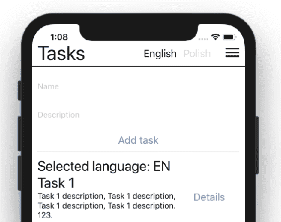

在 TaskList 组件中使用 LanguageConsumer 的示例用法

请注意，这只是一个例子，目的是学习上下文 API。并没有进行实际的翻译。要向应用程序添加翻译，可以使用 Yahoo!的 React Intl 库。它还为您方便地暴露了`Provider`（[`github.com/yahoo/react-intl`](https://github.com/yahoo/react-intl)）。

# React Redux 之外

如果你仔细注意之前的例子，你可能会发现一个有趣的部分 - `withStoreProvider`。这是我创建的一个高阶组件，用来用`react-redux`存储`Provider`包装根组件：

```jsx
import { Provider } from 'react-redux';
// ... <**Provider** store={store}>
 <WrappedComponent {...props} /> </**Provider**>
```

暴露的`Provider`非常类似于 React 上下文 API。上下文在 React 库中已经存在很长时间，还有一个实验性的 API。然而，最新的上下文 API 是在 React 16 中引入的，你可能会注意到旧的库仍然使用他们自己的自定义提供者。例如，看一下 react-redux `Provider`的实现，如下所示：

```jsx
class Provider extends Component {
    getChildContext() {
        return { [storeKey]: this[storeKey], [subscriptionKey]: null }
    }

    constructor(props, context) {
        super(props, context)
        this[storeKey] = props.store**;**
  }

    render() {
        return Children.only(this.props.children)
    }
}

// Full implementation available in react-redux source files
// https://github.com/reduxjs/react-redux/blob/73691e5a8d016ef9490bb20feae8671f3b8f32eb/src/components/Provider.js
```

这就是 react-redux `connect`函数如何访问你的 Redux 存储。与`Consumer` API 不同，这里有`connect`函数，我们用它来访问存储。你可能已经习惯了。把这当作如何使用暴露的提供者或消费者的指南。

# 管理代码库

我们的代码库已经开始增长。我们已经迈出了解决庞大架构问题的第一步，到目前为止，我们的文件结构相当不错：

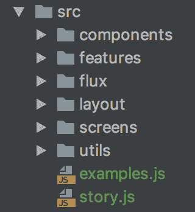

当前 src/目录结构

尽管现在还可以，但如果我们想要扩大这个项目，我们应该重新考虑我们的方法并制定规则。

# 快速成功

当新的开发人员加入项目时，他们可能会对我们的代码库感到有些挑战。让我们解决一些简单的问题。

首先，我们的应用程序的入口文件在哪里？在根目录中。然而，在源代码（`src/`）目录中没有明确的入口点。这没关系，但将它放在靠近故事和示例的地方会很方便。一眼就可以看到示例、故事书和应用程序的根目录。

此外，我们可以重构当前的`ScreenRoot`组件。它作为`AppRoot`，并被包裹在两个 HOC 中。如你所知，这样的耦合不是一件好事。我进行了一点重构。看看新的结构：

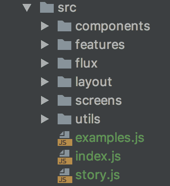

应用程序的入口点现在清晰可见（index.js）

我们已经取得了一个非常快速的成功；现在找到根组件要容易得多。现在，让我们来看看`components`和`features`目录：

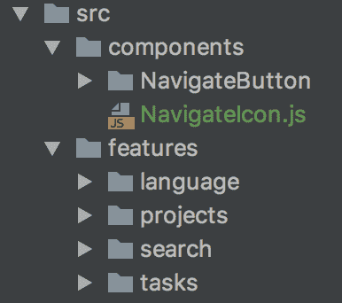组件和特性目录

组件文件夹最初是用来收集无状态组件的。随着应用程序的增长，我们很快意识到仅仅为无状态组件创建一个共享目录是不够的。我们也想要重用有状态的组件。因此，我们应该将`components`目录重命名为`common`。这更好地代表了这个目录的内容：

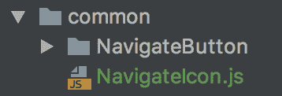

组件目录已重命名为 common

我们很快会注意到的另一个问题是特性下的语言目录只会造成混淆。这主要是`LanguageSwitcher`，而不是一般的`language`。我们把这个放在特性下，只是因为我们想在应用程序特性组件中使用语言。语言上下文是一个特性吗？实际上不是；它是某种特性，但不是在用户体验的上下文中。这会造成混淆。

我们应该做两件事：

1.  将上下文移到 common 目录，因为我们计划在整个应用程序中重用`LanguageConsumer`。

1.  承认我们不会重用`LanguageSwitcher`组件，并将其放在布局目录中，因为它不打算在布局组件之外的任何地方使用。

一旦我们这样做了，我们的应用结构就会再次变得更清晰：

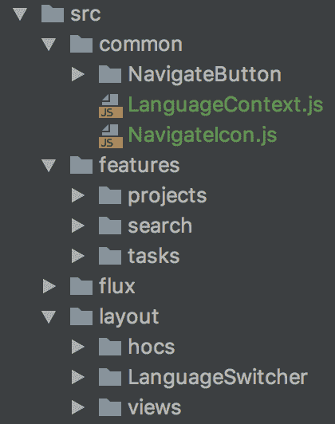

语言目录已分为 LanguageSwitcher 和 LanguageContext

现在很容易找到`LanguageContext`。同样，我们在不改变布局的情况下不需要担心`LanguageSwitcher`的实现。

util 目录创建了类似的混乱，就像最初的语言目录一样。我们可以将其安全地移动到`common`目录：

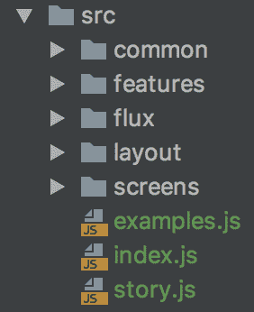

重构后的目录结构

现在，任何新加入项目的开发人员都可以快速了解清楚。`screens`、`layout`、`flux`、`features`和`common`都是非常自解释的名称。

# 建立惯例

每当你构建一个大型项目时，依赖开发者自己的判断，就像在前面的部分中一样，可能是不够的。不同技术负责人采取的方法的不一致可能会迅速升级，并导致在探索代码迷宫上浪费数十个开发小时。

如果这对你来说听起来像一个外国问题，我可以承诺，在每天有数百名开发人员同时工作的代码库中，建立清晰的指南和惯例是非常重要的模式。

让我们看一些例子：

+   **Linter**：负责代码外观指南并自动强制执行它们。它还可以强制执行某些使用模式，并在有备选项列表时偏爱某些选项。

+   **Flux 架构**：连接和构造 JavaScript 代码以解决常见使用模式的一般架构。不会自动强制执行。

+   **纯净的 reducers**：Reducers 需要像 Redux 库的架构决定一样纯净。这在经典的 Flux 架构中并不是强制执行的。这可能会自动执行，也可能不会。

+   **在 JavaScript 中定义的样式**：这是 React Native 默认提供的解决方案。

清单还在继续。我希望这足以说服你，建立惯例是一件好事。它确实会稍微限制可用的功能，但可以让你更快地交付客户价值。React Native 本身就是一个很好的例子，它连接了许多不同的生态系统，提供了一种统一的开发移动应用程序的方式。它已被证明可以显著提高移动开发人员的生产力。

所有大型软件公司都面临类似的惯例问题。其中一些问题是如此普遍，以至于公司投资资金将它们开源，以树立自己的声誉。多亏了这一点，我们有了以下内容：

+   React 和 React Native 来自 Facebook

+   TypeScript，微软的 ECMAScript 上的类型化语言

+   来自 Airbnb 的 eslint 配置

+   来自 Yahoo 的 React 国际化库！

+   来自 Mozilla 的 JavaScript 文档

+   来自 Google 的 Material 设计指南，以及许多其他内容

这正在改变软件世界变得更好。

我希望您将这些智慧应用于未来的项目中。请用它来提高团队和组织的生产力。如果现在过度了，这也是一个很好的迹象，表明您已经发现了这一点。

# 总结

本章解决了应用程序中依赖项的常见问题。当您努力交付牢固的应用程序时，您会发现这些模式在测试中非常有用。除此之外，您还了解了 storybook 是什么，即记录组件用例的东西。现在您可以轻松地组合组件和 storybook。

生态系统也采纳了这些模式，我们已经使用了 React Context API 来将语言上下文传递到组件链中。您还可以一窥`Provider`的 react-redux 实现。

准备好迎接最后一章，介绍如何将类型引入您的应用程序。我们最终将确保传递的变量与消费者函数的期望相匹配。这将使我们能够在应用程序中对所有内容进行类型化，而不仅仅是为 React 视图使用`PropTypes`。

# 进一步阅读

+   由 Atlaskit 开发人员提供的目录结构指南：

这个指南将教你如何维护一个大型的代码库。这是关于如何处理由多个开发人员每天维护的前端代码库的可扩展性的许多例子之一。

（[`atlaskit.atlassian.com/docs/guides/directory-structure`](https://atlaskit.atlassian.com/docs/guides/directory-structure)）。

+   Airbnb 如何使用 React Native：

关于 Airbnb 技术堆栈的技术讨论，需要将其部署到三个不同的平台：浏览器、Android 和 iOS。了解 Airbnb 开发人员所面临的挑战。

（[`www.youtube.com/watch?v=8qCociUB6aQ`](https://www.youtube.com/watch?v=8qCociUB6aQ)）。

+   Rafael de Oleza - 为 React Native 构建 JavaScript 捆绑包：

Rafael 解释了 React Native 中的 metro 捆绑器是如何工作的。

（[`www.youtube.com/watch?v=tX2lg59Wm7g`](https://www.youtube.com/watch?v=tX2lg59Wm7g)）。
