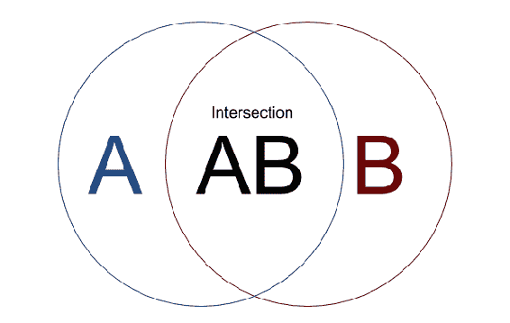

# 第十一章：类型检查模式

为了能够让你的应用程序正常工作并忘记任何麻烦，你需要一种方法来确保应用程序的所有部分相互匹配。建立在 JavaScript 或 ECMAScript 之上的语言，如 Flow 或 TypeScript，为你的应用程序引入了类型系统。由于这些，你将知道没有人会向你的函数或组件发送错误的数据。我们已经在组件中使用了`PropTypes`进行断言。现在我们将把这个概念应用到任何 JavaScript 变量上。

在本章中，您将学习以下内容：

+   类型系统的基础

+   如何为函数和变量分配类型

+   契约测试是什么；例如，Pact 测试

+   泛型和联合类型

+   解决类型问题的技巧

+   类型系统如何使用名义和结构化类型

# 类型介绍

在 ECMAScript 中，我们有七种隐式类型。其中六种是原始类型。

六种原始数据类型如下：

+   布尔值。

+   数字。

+   字符串。

+   空值。

+   未定义。

+   符号——ECMAScript 中引入的唯一标识符。其目的是确保唯一性。这通常用作对象中的唯一键。

第七种类型是对象。

函数和数组也是对象。通常，任何不是原始类型的东西都是对象。

每当你给一个变量赋值时，类型会自动确定。根据类型，会有一些规则适用。

原始函数参数是按值传递的。对象是按引用传递的。

每个变量都以零和一的形式存储在内存中。按值传递意味着被调用的函数参数将被复制。这意味着创建一个具有新引用的新对象。按引用传递意味着只传递对象的引用——如果有人对引用的内存进行更改，那么会影响使用这个引用的所有人。

让我们看一下按值传递机制的例子：

```jsx
// Passing by value

function increase(x) {
    x = x + 1;
    return x;
}

var num = 5;
increase(num);
console.log(num); // prints 5
```

`num`变量没有被改变，因为在函数调用时，该值被复制了。`x`变量引用了内存中的一个全新变量。现在让我们看一个类似的例子，但是使用对象：

```jsx
// Passing by reference

function increase(obj) {
    obj.x = obj.x + 1;
    return obj;
}

var numObj = { x: 5 };
increase(numObj);
console.log(numObj); // prints { x: 6 }
```

这次，我们将`numObj`对象传递给了函数。它是按引用传递的，所以没有被复制。当我们改变`obj`变量时，它会对`numObj`产生外部影响。

然而，当我们调用前面的函数时，我们没有检查类型。默认情况下，我们可以传递任何东西。如果我们的函数无法处理传递的变量，那么它将以某种错误中断。

让我们来看看在使用`increase`函数时可能发生的隐藏和意外行为：

```jsx
function increase(obj) {
    obj.x = obj.x + 1;
    return obj;
}

var numObj = { x: "5" };
increase(numObj);
console.log(numObj); // prints { x: "51" }
```

当我们将`"5"`和`1`相加时，`increase`函数计算出`51`。这就是 JavaScript 的工作原理——它进行隐式类型转换以执行操作。

我们有办法防止这种情况并避免开发人员的意外错误吗？是的，我们可以进行运行时检查，以重新评估变量是否属于某种类型：

```jsx
// Runtime checking if obj.x is a number

function increase(obj) {
 if (**typeof obj.x === 'number'**) {
        obj.x = obj.x + 1;
        return obj;
    } else {
        throw new Error("Obj.x must be a number");
    }
}

var numObj = { x: "5" };
increase(numObj);
console.log(numObj); // do not print, an Error message is shown
// Uncaught Error: Obj.x must be a number
```

运行时检查是在代码评估时执行的检查。它是代码执行阶段的一部分，会影响应用程序的速度。我们将在本章后面更仔细地研究运行时检查，在运行时验证问题解决部分。

当抛出`Error`消息时，我们还需要为组件替换使用错误边界或一些`try{}catch(){}`语法来处理异步代码错误。

如果您没有从头开始阅读本书，那么您可能会发现回到第二章，*查看模式*，以了解有关 React 中错误边界的更多信息。

然而，我们没有检查`obj`变量是否是`Object`类型！可以添加此类运行时检查，但让我们看看更方便的东西——TypeScript，这是建立在 JavaScript 之上的类型检查语言。

# TypeScript 简介

TypeScript 为我们的代码带来了类型。我们可以明确表达函数只接受特定变量类型的要求。让我们看看如何在 TypeScript 的类型中使用上一节的示例：

```jsx
type ObjXType = {
 x: number
}

function increase(obj: ObjXType) {
    obj.x = obj.x + 1;
    return obj;
}

var numObj = { x: "5" };
increase(numObj);
console.log(numObj);
```

这段代码将无法编译。静态检查将以错误退出，因为类型不匹配导致代码库损坏。

将显示以下错误：

```jsx
Argument of type '{ x: string; }' is not assignable to parameter of type 'ObjXType'.
 Types of property 'x' are incompatible.
 **Type 'string' is not assignable to type 'number'.**
```

TypeScript 已经抓住了我们的错误。我们需要修复错误。除非开发人员修复错误，否则这样的代码永远不会到达最终用户。

# 配置 TypeScript

为了您的方便，我已经在我们的存储库中配置了 TypeScript。您可以在代码文件的`src/Chapter 11/Example 1`下查看它。

有几件事我希望您能理解。

TypeScript 有自己的配置文件，称为`tsconfig.json`。在这个文件中，您会发现多个配置属性，控制着 TypeScript 编译器的严格程度。您可以在官方文档中找到属性和解释的详细列表[`www.typescriptlang.org/docs/handbook/compiler-options.html`](https://www.typescriptlang.org/docs/handbook/compiler-options.html)。

在选项中，您可以找到`outDir`。这指定了编译器输出应该保存在哪里。在我们的存储库中，它设置为`"outDir": "build/dist"`。从现在开始，我们的应用程序将从`build/dist`目录运行编译后的代码。因此，我已经将根`App.js`文件更改如下：

```jsx
// src/ Chapter_11/ Example_1_TypeScript_support/ App.js

import StandaloneApp from './build/dist/Root'; import StoryBookApp from './build/dist/storybook';   // ... export default process.env['REACT_NATIVE_IS_STORY_BOOK'] ? StoryBookApp : StandaloneApp; 
```

现在您了解了配置更改，我们现在可以继续学习基本类型。

# 学习基本类型

要充分利用 TypeScript，您应该尽可能多地为代码添加类型。然而，在我们的应用之前并没有类型。对于大型应用程序，显然不能突然在所有地方添加类型。因此，我们将逐渐增加应用程序类型覆盖范围。

TypeScript 的基本类型列表相当长 - 布尔、数字、字符串、数组、元组、枚举、any、void、null、undefined、never 和对象。如果您对其中任何一个不熟悉，请查看以下页面：

[`www.typescriptlang.org/docs/handbook/basic-types.html`](https://www.typescriptlang.org/docs/handbook/basic-types.html)。

首先，让我们看一下我们使用的组件之一：

```jsx
import PropTypes from 'prop-types';   export const NavigateButton = ({
    navigation, to, data, text
}) => (
    // ...  );   NavigateButton.propTypes = {
    // ...
};  
```

我们现在将切换到 TypeScript。让我们从`Prop`类型开始：

```jsx
import {
    NavigationParams, NavigationScreenProp, NavigationState
} from 'react-navigation';   type NavigateButtonProps = {
 to: string,
 data: any,
 text: string,
 **navigation: NavigationScreenProp<NavigationState, NavigationParams>** }; 
```

在这些小例子中，我们已经定义了`NavigationButton` props 的结构。`data` prop 是`any`类型，因为我们无法控制传递的数据是什么类型。

`navigation` prop 使用了`react-navigation`库定义的类型。这对于重用已经暴露的类型至关重要。在项目文件中，我使用`yarn add @types/react-navigation`命令安装了`react-navigation`类型。

我们可以继续为`NavigationButton`添加类型：

```jsx
export const NavigateButton:React.SFC<NavigateButtonProps> = ({
    navigation, to, data, text }) => (
    // ...  );

// Full example available at
// src/ Chapter_11/ Example_1/ src/ common/ NavigateButton/ view.tsx
```

`SFC`类型由 React 库导出。它是一个通用类型，可以接受任何可能的 prop 类型定义。因此，我们需要指定它是什么样的 prop 类型：`SFC<NavigateButtonProps>`。

就是这样 - 我们还需要删除底部的旧`NavigateButton.propTypes`定义。从现在开始，TypeScript 将验证传递给`NavigateButton`函数的类型。

# 枚举和常量模式

在我看到的任何代码库中，都有一个长期受到赞扬的概念：常量。它们节省了很多价值，几乎每个人都同意定义保存特定常量值的变量是必须的。如果我们将它复制到需要它们的每个地方，更新值将会更加困难。

一些常量需要灵活，因此，聪明的开发人员将它们提取到配置文件中。这些文件存储在代码库中，有时以许多不同的风格存储（例如，用于测试：`dev`，质量保证和生产环境）。

在许多情况下，我们定义的常量只允许一组常量有效值。例如，如果我们要定义可用环境，那么我们可以创建一个列表：

```jsx
const ENV_TEST = 'environment_test';
// ...

const availableEnvironments = [ENV_TEST, ENV_DEV, ENV_QA, ENV_PROD]
```

在旧式的 JavaScript 编程中，你可以简单地使用`switch-case`来切换环境，并将相关信息传播给应用程序中的特定对象。如果环境无法识别，那么它会进入一个默认子句，通常会抛出一个错误，说“无法识别的环境”，然后关闭应用程序。

如果你认为在 TypeScript 中，你不需要检查这些东西，那么你是错的。你从外部获取的任何东西都需要运行时验证。你不能允许 JavaScript 自行失败并以不可预测的方式使应用程序崩溃。这是一个经常被忽视的巨大“陷阱”。

你可能遇到的最常见问题之一是 API 的更改。如果你期望`http://XYZ`端点返回带有`tasks`键的 JSON，并且你没有验证实际返回给你的内容，那么你就会遇到麻烦。例如，如果另一个团队决定将键更改为`projectTasks`，并且不知道你对`tasks`的依赖，那么肯定会导致问题。我们该如何解决这个问题？

对 API 的预期返回值很容易强制执行。很久以前，就出现了术语合同测试。这意味着在前端和后端系统中创建合同。合同不能更改，而不确定两个代码库是否准备好。这通常由一些自动化工具强制执行，其中之一可能是 Pact 测试。

“**Pact**（名词）：

个人或团体之间的正式协议。“该国与美国谈判达成了一项贸易协定。

同义词：协议，协议，协议，合同”

- [牛津词典（https://en.oxforddictionaries.com/definition/pact）](https://en.oxforddictionaries.com/definition/pact)。

如果您正在寻找一种以编程方式强制执行此操作的方法，请查看[`github.com/pact-foundation/pact-js`](https://github.com/pact-foundation/pact-js)。这个主题很难，也需要对后端语言有所了解，因此超出了本书的范围。

一旦我们 100%确定外部世界的数据已经得到验证，我们可能希望确保我们自己的计算永远不会导致变量的改变（例如通过不可变性，参见第九章 *函数式编程模式的元素*），或者如果变化是预期的，它将始终保留允许集合的值。

这就是 TypeScript 派上用场的时候。您可以确保您的计算将始终导致允许的状态之一。您将不需要任何运行时验证。TypeScript 将帮助您避免不必要的检查，大量的检查可能会导致您的应用程序减慢几毫秒。让我们看看我们可以如何做到这一点：

```jsx
// src/ Chapter_11/
// Example_2/ src/ features/ tasks/ actions/ TasksActionTypes.ts

enum TasksActionType {
    ADD_TASK = 'ADD_TASK',
  TASKS_FETCH_START = 'TASKS_FETCH_START',
  TASKS_FETCH_COMPLETE = 'TASKS_FETCH_COMPLETE',
  TASKS_FETCH_ERROR = 'TASKS_FETCH_ERROR',
  TASK_FETCH_START = 'TASK_FETCH_START',
  TASK_FETCH_COMPLETE = 'TASK_FETCH_COMPLETE',
  TASK_FETCH_ERROR = 'TASK_FETCH_ERROR' }
```

我们已经定义了一个`enum`类型。如果变量预期是`TasksActionType`类型，它只能被赋予前面`enum TasksActionType`中的值。

现在我们可以定义`AddTaskActionType`：

```jsx
export type TaskAddFormData = {
    name: string,
  description: string }

export type AddTaskActionType = {
 type: TasksActionType.ADD_TASK,
 task: TaskAddFormData
};
```

它将用于`addTask`动作创建者：

```jsx
// src/ Chapter_11/
// Example_2/ src/ features/ tasks/ actions/ TaskActions.ts

const addTask = (task:TaskAddFormData): AddTaskActionType => ({
    type: TasksActionType.ADD_TASK,
  task
});
```

现在我们的动作创建者经过了很好的类型检查。如果任何开发人员错误地将`type`对象键更改为其他任何值，例如`TasksActionType.TASK_FETCH_COMPLETE`，那么 TypeScript 将检测到并显示不兼容错误。

我们有`AddTaskActionType`，但是我们如何将其与我们的 reducer 可能接受的其他动作类型组合起来？我们可以使用联合类型。

# 创建联合类型和交集

联合类型描述了可以是多种类型之一的值。这非常适合我们的`Tasks` reducer 类型：

```jsx
export type TaskReduxActionType =
    AddTaskActionType |
    TasksFetchActionType |
    TasksFetchCompleteActionType |
    TasksFetchErrorActionType |
    TaskFetchActionType |
    TaskFetchCompleteActionType |
    TaskFetchErrorActionType;
```

联合类型是使用`**|**`运算符创建的。它的工作方式就像`|`是`或`。一个类型或另一个类型。

现在我们可以在`Reducer`函数中使用之前的类型：

```jsx
// src/ Chapter_11/ 
// Example_3/ src/ features/ tasks/ state/ reducers/ tasksReducer.ts

const tasksReducer = (
    state = Immutable.Map<string, any>({
        entities: Immutable.List<TaskType>([]),
  isLoading: false,
  hasError: false,
  errorMsg: ''
  }),
  action:TaskReduxActionType
) => {
    // ...
}
```

为了让 TypeScript 满意，我们需要为所有参数添加类型。因此，我已经添加了其余的类型。其中一个仍然缺失：`TaskType`。

在前面的代码示例中，您可能会对`Immutable.List<TaskType>`的表示法感到惊讶，特别是`< >`符号。这些需要使用，因为`List`是一种通用类型。我们将在下一节讨论通用类型。

要创建`TaskType`，我们可以将其类型写成如下形式：

```jsx
type TaskType = {
    name: string,
    description: string
    likes: number,
  id: number }
```

然而，这并不是重用我们已经创建的类型：`TaskAddFormData`。是否要这样做是另一个讨论的话题。让我们假设我们想要这样做。

为了重用现有类型并声明或创建所需形状的`TaskType`，我们需要使用交集：

```jsx

export type TaskAddFormData = {
    name: string,
  description: string }

export type TaskType = TaskAddFormData & {
    likes: number,
  id: number }
```

在这个例子中，我们使用`&`交集运算符创建了一个新类型。创建的类型是`&`运算符左侧和右侧类型的交集：



交集图，其中交集是既在圆 A 中又在圆 B 中的空间。

**A**和**B**的交集具有**A**和**B**的属性。因此，由类型**A**和类型**B**的交集创建的类型必须同时具有类型**A**和类型**B**的类型。总结一下，`TaskType`现在必须具有以下形状：

```jsx
{
    name: string,
    description: string
    likes: number,
  id: number
}
```

如您所见，交集可能很方便。有时，当我们依赖外部库时，我们不希望像前面的例子中那样硬编码键类型。让我们再看一遍：

```jsx
type NavigateButtonProps = {
    to: string,
  data: any,
  text: string,
  navigation: NavigationScreenProp<NavigationState, NavigationParams>
};
```

导航键在我们的类型中是硬编码的。我们可以使用交集来符合外部库形状可能发生的未来变化：

```jsx
// src/ Chapter_11/ 
// Example_3/ src/ common/ NavigateButton/ view.tsx

import { NavigationInjectedProps, NavigationParams } from 'react-navigation';   type NavigateButtonProps = {
    to: string,
  data: any,
  text: string, } & NavigationInjectedProps<NavigationParams>;
```

在这个例子中，我们再次使用`<>`符号。这是因为`NavigationInjectedProps`是一种泛型类型。让我们学习一下泛型类型是什么。

# 泛型类型

泛型允许您编写能够处理任何类型对象的代码。例如，您知道列表是一种泛型类型。您可以创建任何类型的列表。因此，当我们使用`Immutable.List`时，我们必须指定列表将包含哪种类型的对象：

```jsx
Immutable.List<TaskType>
```

任务列表。现在让我们创建我们自己的泛型类型。

在我们的代码库中，有一个工具应该能够处理任何类型。它是一个`Maybe`单子。

如果您已经跳转到本章，则可能会发现在第九章中阅读有关单子模式的信息很有用，*函数式编程模式的元素*。

`Maybe`单子要么是`Nothing`，当变量恰好是`null`、`undefined`时，要么是该类型的`Something`。这非常适合泛型类型：

```jsx
export type MaybeType<T> = Something<T> | Nothing; 
const Maybe = <T>(value: T):MaybeType<T> => {
    // ...  }; 
```

棘手的部分是实现`Something<T>`和`Nothing`。让我们从`Nothing`开始，因为它要容易得多。它应该在值检查时返回`null`，并始终映射到自身：

```jsx
export type Nothing = {
    map: (args: any) => Nothing,
  isNothing: () => true,
  val: () => **null** }
```

`Something<T>`应该映射到`Something<MappingResult>`或`Nothing`。值检查应该返回`T`：

```jsx
export type Something<T> = {
    map: <Z>(fn: ((a:T) => Z)) => MaybeType<Z>,
  isNothing: () => false,
  val: () => T
}
```

通过在`map`函数签名中引入的`Z`泛型类型来保存结果类型的映射。

然而，如果我们尝试使用我们新定义的类型，它们将不起作用。不幸的是，TypeScript 并不总是正确地推断联合类型。当类型的联合导致特定键的不同调用签名时，就会出现这个问题。在我们的情况下，这发生在`map`函数上。它的类型是`(args: any) => Nothing`或`<Z>(fn: ((a:T) => Z)) => MaybeType<Z>`。因此，`map`没有兼容的调用签名。

这个问题的快速解决方法是定义一个独立的`MaybeType`，满足两个冲突的类型定义：

```jsx
export type MaybeType<T> = {
    map: <Z>(fn: ((a:T) => Z)) => (MaybeType<Z> | Nothing),
  isNothing: () => boolean,
  val: () => (T | null)
}
```

有了这样的类型定义，我们可以继续使用新的泛型类型：

```jsx
// src/ Chapter_11/ 
// Example_4/ src/ features/ tasks/ state/ selectors/ tasks.ts

export const tasksSelector =
    (state: TasksState):MaybeType<Immutable.Map<string, any>> =>
        Maybe<TasksState>(state).map((x:TasksState) => x.tasks);
```

选择器函数以`TasksState`作为参数，并且期望返回一个分配给状态中`tasks`键的映射。这可能看起来有点难以理解，因此，我强烈建议你打开前面的文件，仔细看一看。如果你有困难，在本章末尾的“进一步阅读”部分中，我已经包含了一个在 GitHub 上讨论这个问题的参考链接。

# 理解 TypeScript

在前面的部分中，我们遇到了一个问题，如果你从未使用过类型系统，可能很难理解。让我们稍微了解一下 TypeScript 本身，以更好地理解这个问题。

# 类型推断

我想让你明白的第一件事是类型推断。你不需要输入所有的类型。一些类型可以被 TypeScript 推断出来。

想象一种情况，我告诉你，“我只在你桌子上的盒子里放了巧克力甜甜圈。”在这个例子中，我假装是计算机，你可以相信我。因此，当你到达你的桌子时，你百分之百确定这个盒子是`Box<ChocolateDonut[]>`类型。你知道这一点，而不需要打开盒子或者在上面贴上写着“装满巧克力甜甜圈的盒子”的标签。

在实际代码中，它的工作方式非常相似。让我们看下面的最小示例：

```jsx
const someVar = 123; // someVar type is number
```

这很琐碎。现在我们可以看一些我更喜欢的东西，`ChocolateDonuts`，如下：

```jsx
enum FLAVOURS {
    CHOCOLATE = 'Chocolate',
    VANILLA = 'Vanilla',
}
type ChocolateDonut = { flavour: FLAVOURS.CHOCOLATE }

const clone = <T>(sth:T):T => JSON.parse(JSON.stringify(sth));

const produceBox: <T>(recipe: T) => T[] = <T>(recipe: T) => [
    clone(recipe), clone(recipe), clone(recipe)
];

// box type is inferred
const box = produceBox<ChocolateDonut>({ flavour: flavours.CHOCOLATE });

// inferred type correctly contains flavor key within donut object
for (const donut of box) {
    console.log(donut.flavour);
} // compiles and when run prints "Chocolate" three times
```

在这个例子中，我们同时使用了`enum`和泛型类型。`clone`简单地将任何类型克隆成一个全新的类型，并委托给 JSON 函数：`stringify`和`parse`。`ProduceBox`函数简单地接受一个配方，并根据该配方创建一个克隆数组。最后，我们创建了一个巧克力甜甜圈盒子。类型被正确地推断，因为我们为`produceBox`指定了一个泛型类型。

# 结构类型

TypeScript 使用结构类型。为了理解这意味着什么，让我们看下面的例子：

```jsx
interface Donut {
    flavour: FLAVOURS;
}

class ChocolateDonut {
    flavour: FLAVOURS.CHOCOLATE;
}

let p: Donut;

// OK, because of structural typing
p = new ChocolateDonut();
```

在这个例子中，我们首先声明了变量`p`，然后将`ChocolateDonut`的一个新实例赋给它。这在 TypeScript 中是有效的。在 Java 中是行不通的。为什么呢？

我们从未明确指出`ChocolateDonut`实现了`Donut`接口。如果 TypeScript 没有使用结构类型，你需要将前面的代码部分重构为以下内容：

```jsx
class ChocolateDonut implements Donut {
    flavour: FLAVOURS.CHOCOLATE;
}
```

使用结构类型的原因通常被称为鸭子类型：

如果它走起来像鸭子，叫起来像鸭子，那么它一定是鸭子。

因此，在 TypeScript 中不需要`implements Donut`，因为`ChocolateDonut`已经表现得像一个甜甜圈，所以它一定是一个甜甜圈。万岁！

# TypeScript 中的不可变性

在这一部分，我想重申一下不可变性的观点。这个话题在 JavaScript 中非常重要，在某些情况下，TypeScript 可能是比其他任何不可变性路径更好的解决方案。

TypeScript 带有特殊的`readonly`关键字，它强制某个变量是只读的。你不能改变这样的变量。这在编译时强制执行。因此，你没有不可变性的运行时检查。如果这对你来说是一个巨大的胜利，那么你甚至可能不需要任何 API，比如 Immutable.js。当你需要克隆大对象以避免变异时，Immutable.js 就会发光。如果你可以自己使用扩展操作来解决问题，那么这意味着你的对象可能还不够大，不需要 Immutable.js。

# readonly

由于我们的应用程序目前还不是很大，因此作为一个练习，让我们用 TypeScript 的`readonly`来替换 Immutable.js：

```jsx
export type TasksReducerState = {
    readonly entities: TaskType[],
 readonly isLoading: boolean,
 readonly hasError: boolean,
 readonly errorMsg: string }
```

这看起来有很多重复。我们可以使用`Readonly< T >`代替：

```jsx
export type TasksReducerState = Readonly<{
    entities: TaskType[],
  isLoading: boolean,
  hasError: boolean,
  errorMsg: string }>
```

这看起来干净多了。然而，它并不完全不可变。你仍然可以改变`entities`数组。为了防止这种情况，我们需要使用`ReadonlyArray<TaskType>`：

```jsx
export type TasksReducerState = Readonly<{
    entities: ReadonlyArray<TaskType>,
 // ...  }>
```

剩下的工作是在整个应用程序中用`ReadonlyArray<TaskType>`替换每个`TaskType[]`。然后，您需要将 Immutable.js 对象更改为标准的 JavaScript 数组。这样的重构很长，不适合这些书页，但我已经在代码文件中进行了重构。如果您想查看已更改的内容，请转到`src/Chapter_11/Example_5`的代码文件目录。

# 使用 linter 来强制不可变性

您可以使用 TypeScript linter 在 TypeScript 文件中强制使用`readonly`关键字。允许您执行此操作的开源解决方案之一是`tslint-immutable`。

它向`tslint.json`配置文件添加了额外的规则：

```jsx
"no-var-keyword": true,  "no-let": true,  "no-object-mutation": true, "no-delete": true,  "no-parameter-reassignment": true,  "readonly-keyword": true, "readonly-array": true,
```

从现在开始，当您运行 linter 时，如果违反了前述规则，您将看到错误。我已经重构了代码以符合这些规则。在`src/Chapter_11/Example_6`的代码文件目录中检查完整示例。要运行 linter，您可以在终端中使用以下命令：

```jsx
  yarn run lint
```

# 摘要

在本章中，您已经了解了一个非常强大的工具：建立在 JavaScript 之上的类型化语言。类型检查对于任何代码库都有无数的优势。它可以防止您部署违反预期的破坏性更改。您已经学会了如何告诉 TypeScript 什么是允许的。您知道什么是泛型类型，以及如何在类型文件中使用它们以减少代码重复。

新工具带来了新知识，因此您还学会了类型推断和结构类型的基础知识。TypeScript 的这一部分绝对需要反复试验。练习以更好地理解它。

这是本书的最后一章。我希望你已经学到了许多有趣的概念和模式。我在整本书中都在向你挑战；现在是你挑战你的代码库的时候了。看看哪些适合你的应用程序，也许重新思考你和你的团队之前所做的选择。

如果您不理解某些模式，不要担心。并非所有模式都是必需的。有些是通过经验获得的，有些仅适用于大型代码库，有些是偏好问题。

选择能够保证应用程序正确性的模式，以及能够更快地为客户增加价值的模式。祝你好运！

# 进一步阅读

+   *精通 TypeScript（第二版）*，Nathan Rozentals：这是一本深入学习 TypeScript 的好书。它演示了如何对一些非常高级的用例进行类型化。这是我的个人推荐，而不是出版商的。

+   TypeScript 的官方文档可以在[www.typescriptlang.org](http://www.typescriptlang.org)找到。

+   在本章前面提到的调用签名问题的讨论可以在 TypeScript GitHub 存储库的[`github.com/Microsoft/TypeScript/issues/7294`](https://github.com/Microsoft/TypeScript/issues/7294)找到。
