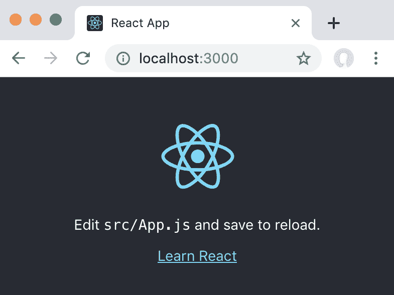
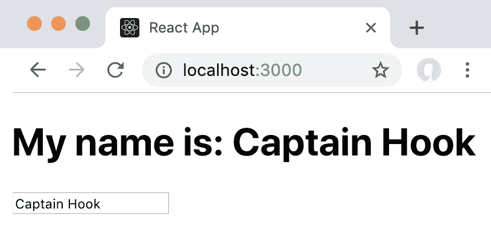

# 第一章：介绍 React 和 React Hooks

React 是一个可以用于构建高效和可扩展 Web 应用程序的 JavaScript 库。React 由 Facebook 开发，并在许多大型 Web 应用程序中使用，如 Facebook、Instagram、Netflix 和 WhatsApp Web。

在本书中，我们将学习如何使用 React 构建复杂和高效的用户界面，同时保持代码简单和可扩展。使用 React Hooks 的新范式，我们可以极大地简化在 Web 应用程序中处理状态管理和副作用，确保以后应用程序的增长和扩展潜力。我们还将学习有关**React 上下文**和**React 悬挂**，以及它们如何与 Hooks 一起使用。之后，我们将学习如何将**Redux**和**MobX**与 React Hooks 集成。最后，我们将学习如何从现有的 React 类组件、Redux 和 MobX Web 应用程序迁移到 React Hooks。

在本书的第一章中，我们将学习 React 和 React Hooks 的基本原则。我们首先学习 React 和 React Hooks 是什么，以及为什么我们应该使用它们。然后，我们继续学习 Hooks 的功能。最后，我们介绍了 React 提供的各种 Hooks 的类型，以及本书中将要学习的一些 Hooks。通过学习 React 和 React Hooks 的基础知识，我们将更好地理解本书中将介绍的概念。

本章将涵盖以下主题：

+   了解 React 的基本原则

+   激发对 React Hooks 的需求

+   开始使用 React Hooks

+   概述各种 Hooks

# 技术要求

应该已经安装了相当新的 Node.js 版本（v11.12.0 或更高）。还需要安装 Node.js 的`npm`包管理器。

本章的代码可以在 GitHub 存储库中找到：[`github.com/PacktPublishing/Learn-React-Hooks/tree/master/Chapter01`](https://github.com/PacktPublishing/Learn-React-Hooks/tree/master/Chapter01)。

查看以下视频以查看代码的实际操作：

[`bit.ly/2Mm9yoC`](http://bit.ly/2Mm9yoC)

请注意，强烈建议您自己编写代码。不要简单地运行之前提供的代码示例。重要的是要自己编写代码，以便正确学习和理解它。但是，如果遇到任何问题，您可以随时参考代码示例。

现在，让我们开始这一章。

# React 的原则

在我们开始学习 React Hooks 之前，我们将学习 React 的三个基本原则。这些原则使我们能够轻松编写可扩展的 Web 应用程序。了解这些基本原则很重要，因为它们将帮助我们理解 Hooks 如何以及为什么适用于 React 生态系统。

React 基于三个基本原则：

+   **声明式**：我们告诉 React 我们想要它做什么，而不是告诉它如何做事情。因此，我们可以轻松设计我们的应用程序，当数据发生变化时，React 将高效地更新和渲染正确的组件。例如，下面的代码是命令式的，它是声明式的相反：

```jsx
const input = ['a', 'b', 'c']
let result = []
for (let i = 0; i < input.length; i++) {
    result.push(input[i] + input[i])
}
console.log(result) // prints: [ 'aa', 'bb', 'cc' ]
```

正如我们所看到的，命令式代码中，我们需要一步一步地告诉计算机要做什么。然而，使用声明式代码，我们只需告诉计算机我们想要什么，如下所示：

```jsx
const input = ['a', 'b', 'c']
let result = input.map(str => str + str)
console.log(result) // prints: [ 'aa', 'bb', 'cc' ]
```

在前面的声明式代码中，我们告诉计算机我们想要将`input`数组的每个元素从`str`映射到`str + str`。如我们所见，声明式代码要简洁得多。

+   **基于组件**：React 封装了管理自己状态和视图的组件，然后允许我们组合它们以创建复杂的用户界面。

+   **学一次，随处编写**：React 不对您的技术栈做出假设，并尽量确保您可以开发应用程序而尽量不重写现有代码。

我们刚提到 React 是基于组件的。在 React 中，有两种类型的组件：

+   **函数组件**：以 props 作为参数的 JavaScript 函数，并返回用户界面（通常通过 JSX）

+   **类组件**：提供`render`方法的 JavaScript 类，该方法返回用户界面（通常通过 JSX）

虽然函数组件更容易定义和理解，但是类组件需要处理状态、上下文和 React 的许多高级功能。然而，使用 React Hooks，我们可以处理 React 的高级功能而不需要类组件！

# 使用 React Hooks 的动机

React 的三个基本原则使得编写代码、封装组件和在多个平台上共享代码变得容易。React 总是尽量利用现有的 JavaScript 特性，而不是重复造轮子。因此，我们将学习软件设计模式，这些模式将适用于许多情况，而不仅仅是设计用户界面。

React 始终努力使开发者体验尽可能顺畅，同时确保保持足够的性能，而开发者不必过多担心如何优化性能。然而，在使用 React 的多年中，已经确定了一些问题。

让我们在接下来的章节中详细看看这些问题。

# 混乱的类

过去，我们必须使用带有特殊函数的类组件，称为生命周期方法，例如`componentDidUpdate`，以及特殊的状态处理方法，例如`this.setState`，以处理状态变化。React 类，尤其是 JavaScript 对象的`this`上下文，对人类和机器来说都很难阅读和理解。

`this`是 JavaScript 中的一个特殊关键字，它总是指向它所属的对象：

+   在方法中，`this`指的是类对象（类的实例）。

+   在事件处理程序中，`this`指的是接收到事件的元素。

+   在函数或独立状态下，`this`指的是全局对象。例如，在浏览器中，全局对象是`Window`对象。

+   在严格模式下，`this`在函数中是`undefined`。

+   此外，`call()`和`apply()`等方法可以改变`this`所指的对象，因此它可以指向任何对象。

对于人类来说，类很难，因为`this`总是指向不同的东西，所以有时（例如在事件处理程序中）我们需要手动重新绑定它到类对象。对于机器来说，类很难，因为机器不知道类中的哪些方法将被调用，以及`this`将如何被修改，这使得优化性能和删除未使用的代码变得困难。

此外，类有时要求我们同时在多个地方编写代码。例如，如果我们想在组件渲染时获取数据，或者数据更新时获取数据，我们需要使用两种方法来做到这一点：一次在`componentDidMount`中，一次在`componentDidUpdate`中。

举个例子，让我们定义一个从**应用程序编程接口**（**API**）获取数据的类组件：

1.  首先，我们通过扩展`React.Component`类来定义我们的类组件：

```jsx
class Example extends React.Component {
```

1.  然后，我们定义`componentDidMount`生命周期方法，在这里我们从 API 中获取数据：

```jsx
        componentDidMount () {
            fetch(`http://my.api/${this.props.name}`)
                .then(...)
        }
```

1.  然而，我们还需要定义`componentDidUpdate`生命周期方法，以防`name`属性发生变化。此外，我们需要在这里添加一个手动检查，以确保只有在`name`属性发生变化时才重新获取数据，而不是在其他属性发生变化时：

```jsx
    componentDidUpdate (prevProps) {
        if (this.props.name !== prevProps.name) {
            fetch(`http://my.api/${this.props.name}`)
                .then(...)
        }
    }
}
```

1.  为了使我们的代码更少重复，我们可以定义一个名为`fetchData`的单独方法，以便获取我们的数据，如下所示：

```jsx
        fetchData () {
            fetch(`http://my.api/${this.props.name}`)
                .then(...)
        }
```

1.  然后，我们可以在`componentDidMount`和`componentDidUpdate`中调用该方法：

```jsx
        componentDidMount () {
            this.fetchData()
        }

        componentDidUpdate (prevProps) {
            if (this.props.name !== prevProps.name) {
                this.fetchData()
```

```jsx
            }
        }
```

然而，即使这样，我们仍然需要在两个地方调用`fetchData`。每当我们更新传递给方法的参数时，我们需要在两个地方更新它们，这使得这种模式非常容易出现错误和未来的 bug。

# 包装地狱

在 Hooks 之前，如果我们想要封装状态管理逻辑，我们必须使用高阶组件和渲染属性。例如，我们创建一个使用上下文来处理用户认证的 React 组件如下：

1.  我们首先通过导入`authenticateUser`函数来包装我们的组件与上下文，以及`AuthenticationContext`组件来访问上下文：

```jsx
import authenticateUser, { AuthenticationContext } from './auth'
```

1.  然后，我们定义了我们的`App`组件，在这里我们使用了`AuthenticationContext.Consumer`组件和`user`渲染属性：

```jsx
const App = () => (
    <AuthenticationContext.Consumer>
        {user =>
```

1.  现在，我们根据用户是否已登录来显示不同的文本：

```jsx
                user ? `${user} logged in` : 'not logged in'
```

在这里，我们使用了两个 JavaScript 概念：

+   +   一个三元运算符，它是`if`条件的内联版本。它看起来如下：`ifThisIsTrue ? returnThis : otherwiseReturnThis`。

+   一个模板字符串，它可以用来将变量插入到字符串中。它用反引号（`` ` ``) 而不是普通的单引号（`'`）。 变量可以通过`${ variableName}`语法插入。我们还可以在`${}`括号内使用任何JavaScript表达式，例如`${someValue + 1}`。

1.  最后，我们在用`authenticateUser`上下文包装后导出我们的组件：

```jsx
        }
    </AuthenticationContext.Consumer>
)

export default authenticateUser(App)
```

在前面的示例中，我们使用了高阶的`authenticateUser`组件来为现有组件添加身份验证逻辑。然后，我们使用`AuthenticationContext.Consumer`通过其渲染属性将`user`对象注入到我们的组件中。

正如您可以想象的那样，使用许多上下文将导致一个庞大的树，其中有许多子树，也称为**包装器地狱**。例如，当我们想使用三个上下文时，包装器地狱看起来如下：

```jsx
<AuthenticationContext.Consumer>
    {user => (
        <LanguageContext.Consumer>
            {language => (
                <StatusContext.Consumer>
                    {status => (
                        ...
                    )}
                </StatusContext.Consumer>
            )}
        </LanguageContext.Consumer>
    )}
</AuthenticationContext.Consumer>
```

这并不容易阅读或编写，如果我们以后需要更改某些内容，它也容易出错。此外，包装器地狱使得调试变得困难，因为我们必须查看一个庞大的组件树，其中许多组件仅作为包装器。

# 钩子来救援！

React 钩子基于与 React 相同的基本原则。它们试图通过使用现有的 JavaScript 功能来封装状态管理。因此，我们不再需要学习和理解专门的 React 功能；我们可以简单地利用我们现有的 JavaScript 知识来使用钩子。

使用钩子，我们可以解决所有前面提到的问题。我们不再需要使用类组件，因为钩子只是可以在函数组件中调用的函数。我们也不再需要为上下文使用高阶组件和渲染属性，因为我们可以简单地使用上下文钩子来获取我们需要的数据。此外，钩子允许我们在组件之间重用有状态的逻辑，而不需要创建高阶组件。

例如，上述生命周期方法的问题可以通过使用钩子来解决，如下所示：

```jsx
function Example ({ name }) {
    useEffect(() => {
        fetch(`http://my.api/${this.props.name}`)
            .then(...)
    }, [ name ])
    // ...
}
```

这里实现的 Effect Hook 将在组件挂载时自动触发，并且每当`name`属性发生变化时。

此外，前面提到的包装器地狱也可以通过使用钩子来解决，如下所示：

```jsx
    const user = useContext(AuthenticationContext)
    const language = useContext(LanguageContext)
    const status = useContext(StatusContext)
```

既然我们知道钩子可以解决哪些问题，让我们开始在实践中使用钩子吧！

# 开始使用 React 钩子

正如我们所见，React 钩子解决了许多问题，尤其是大型 Web 应用程序的问题。钩子是在 React 16.8 中添加的，它们允许我们使用状态以及各种其他 React 功能，而不必编写类。在本节中，我们将首先使用`create-react-app`初始化一个项目，然后我们将定义一个类组件，最后我们将使用钩子将同一组件编写为函数组件。在本节结束时，我们将讨论钩子的优势，以及我们如何着手迁移到基于钩子的解决方案。

# `create-react-app`初始化项目

要初始化 React 项目，我们可以使用`create-react-app`工具，该工具为 React 开发设置了环境，包括以下内容：

+   Babel，以便我们可以使用 JSX 和 ES6 语法

+   它甚至包括超出 ES6 的语言扩展，例如对象展开运算符，我们将在后面使用

+   此外，我们甚至可以使用 TypeScript 和 Flow 语法

此外，`create-react-app`设置了以下内容：

+   自动添加前缀的**层叠样式表**（**CSS**），这样我们就不需要特定浏览器的`-webkit`等前缀

+   一个快速的交互式单元测试运行器，带有代码覆盖报告

+   一个实时开发服务器，它会警告我们常见的错误

+   一个构建脚本，它为生产捆绑 JavaScript、CSS 和图像，包括哈希值和源映射

+   一个离线优先的服务工作者和一个 Web 应用清单，以满足**渐进式 Web 应用**（**PWA**）的所有标准

+   对前面列出的所有工具的无忧更新

正如我们所见，`create-react-app`工具使 React 开发对我们来说变得更加容易。它是我们学习 React 以及部署 React 应用程序到生产环境的完美工具。

# 创建新项目

为了设置一个新项目，我们运行以下命令，该命令创建一个名为`<app-name>`的新目录：

```jsx
> npx create-react-app <app-name>
```

如果你更喜欢使用`yarn`包管理器，你可以运行`yarn create react-app <app-name>`来代替。

我们现在将使用`create-react-app`创建一个新项目。运行以下命令以创建第一个章节中的第一个示例的新 React 项目：

```jsx
> npx create-react-app chapter1_1
```

既然我们已经初始化了项目，让我们继续启动项目。

# 启动项目

为了在开发模式下启动项目，我们必须运行`npm start`命令。运行以下命令：

```jsx
> npm start
```

现在，我们可以通过在浏览器中打开`http://localhost:3000`来访问我们的项目：



我们的第一个 React 应用！

正如我们所见，使用`create-react-app`，设置一个新的 React 项目相当容易！

# 部署项目

为了构建用于生产部署的项目，我们只需运行`build`脚本：

1.  运行以下命令以构建用于生产部署的项目：

```jsx
> npm run-script build
```

使用`yarn`，我们可以简单地运行`yarn build`。实际上，我们可以以这种方式运行任何不与内部`yarn`命令名称冲突的包脚本：`yarn <script-name>`，而不是`npm run-script <script-name>`。

1.  然后，我们可以使用 Web 服务器或使用`serve`工具来提供我们的静态构建文件夹。首先，我们必须安装它：

```jsx
> npm install -g serve
```

1.  然后，我们可以运行以下`serve`命令：

```jsx
> serve -s build
```

`serve`命令的`-s`标志将所有未找到的请求重写为`index.html`，允许客户端路由。

现在，我们可以通过在浏览器中打开`http://localhost:5000`来访问同一个应用。请注意，`serve`工具不会自动在您的浏览器中打开页面。

在了解了`create-react-app`之后，我们现在将用 React 编写我们的第一个组件。

# 从类组件开始

首先，我们从传统的 React 类组件开始，它允许我们输入一个名字，然后我们在我们的应用中显示这个名字。

# 设置项目

如前所述，我们将使用`create-react-app`来初始化我们的项目。如果你还没有这样做，现在运行以下命令：

```jsx
> npx create-react-app chapter1_1
```

接下来，我们将把我们的应用定义为类组件。

# 定义类组件

我们首先将我们的应用编写为传统的类组件，如下所示：

1.  首先，我们从`src/App.js`文件中删除所有代码。

1.  接下来，在`src/App.js`中，我们导入`React`：

```jsx
import React from 'react'     
```

1.  然后，我们开始定义我们自己的类组件——`MyName`：

```jsx
class MyName extends React.Component {
```

1.  接下来，我们必须定义一个`constructor`方法，在其中设置初始的`state`对象，这将是一个空字符串。在这里，我们还需要确保调用`super(props)`，以便让`React.Component`构造函数知道`props`对象：

```jsx
    constructor (props) {
        super(props)
        this.state = { name: '' }
    }
```

1.  现在，我们定义一个方法来设置`name`变量，使用`this.setState`。由于我们将使用这个方法来处理来自文本字段的输入，我们需要使用`evt.target.value`来从输入字段获取值：

```jsx
   handleChange (evt) {
       this.setState({ name: evt.target.value })
   }
```

1.  然后，我们定义`render`方法，在其中我们将显示一个输入字段和名字：

```jsx
   render () {
```

1.  为了从`this.state`对象中获取`name`变量，我们将使用解构：

```jsx
       const { name } = this.state
```

前面的语句等同于做以下操作：

```jsx
       const name = this.state.name
```

1.  然后，我们显示当前输入的`name`状态变量：

```jsx
    return (
        <div>
            <h1>My name is: {name}</h1>
```

1.  我们显示一个`input`字段，将处理方法传递给它：

```jsx
                <input type="text" value={name} onChange={this.handleChange} />
            </div>
        )
    }
}
```

1.  最后，我们导出我们的类组件：

```jsx
export default MyName
```

如果我们现在运行这段代码，当我们输入文本时，我们会得到以下错误，因为将处理方法传递给`onChange`改变了`this`上下文：

未捕获的 TypeError：无法读取未定义的属性'setState'

1.  所以，现在我们需要调整`constructor`方法并重新绑定我们处理方法的`this`上下文到类：

```jsx
    constructor (props) {
        super(props)
        this.state = { name: '' }
        this.handleChange = this.handleChange.bind(this)
    }
```

有可能使用箭头函数作为类方法，以避免重新绑定`this`上下文。然而，为了使用这个特性，我们需要安装 Babel 编译器插件，`@babel/plugin-proposal-class-properties`，因为它还不是已发布的 JavaScript 特性。

最后，我们的组件工作了！如你所见，为了使状态处理在类组件中正常工作，需要编写大量的代码。我们还需要重新绑定`this`上下文，否则我们的处理方法将无法工作。这并不直观，而且在开发过程中很容易忽略，导致令人讨厌的开发体验。

# 示例代码

示例代码可以在`Chapter01/chapter1_1`文件夹中找到。

只需运行`npm install`来安装所有依赖项，并运行`npm start`来启动应用程序；然后在浏览器中访问`http://localhost:3000`（如果它没有自动打开）。

# 使用 Hooks 替代

使用传统的类组件编写我们的应用之后，我们将使用 Hooks 来编写相同的应用。和之前一样，我们的应用将允许我们输入一个名字，然后在我们应用中显示这个名字。

请注意，只有在 React 函数组件中才能使用 Hooks。你不能在 React 类组件中使用 Hooks！

现在，我们开始设置项目。

# 设置项目

再次，我们使用`create-react-app`来设置我们的项目：

```jsx
> npx create-react-app chapter1_2
```

现在让我们开始使用 Hooks 定义函数组件。

# 定义函数组件

现在，我们将同一个组件定义为函数组件：

1.  首先，我们从`src/App.js`文件中删除所有代码。

1.  接下来，在`src/App.js`中，我们导入 React 和**`useState`** Hook：

```jsx
    import React, { useState } from 'react'
```

1.  我们从函数定义开始。在我们的例子中，我们没有传递任何参数，因为我们的组件没有任何 props：

```jsx
    function MyName () {
```

下一步将是从组件状态中获取`name`变量。但是，我们不能在函数组件中使用`this.state`。我们已经了解到 Hooks 只是 JavaScript 函数，但这究竟意味着什么？这意味着我们可以像使用任何其他 JavaScript 函数一样，直接从函数组件中使用 Hooks！

通过 Hooks 使用状态，我们调用`useState()`函数，并将初始状态作为参数传递。该函数返回一个包含两个元素的数组：

+   +   当前状态

    +   设置状态的 setter 函数

1.  我们可以使用解构来将这两个元素分别存储在单独的变量中，如下所示：

```jsx
            const [ name, setName ] = useState('')
```

前面的代码等同于以下代码：

```jsx
            const nameHook = useState('')
            const name = nameHook[0]
            const setName = nameHook[1]
```

1.  现在，我们定义输入处理函数，在其中我们使用`setName` setter 函数：

```jsx
            function handleChange (evt) {
                setName(evt.target.value)
            }
```

由于我们现在不处理类，因此不再需要重新绑定`this`了！

1.  最后，我们通过从函数返回它来渲染我们的用户界面。然后，我们导出函数组件：

```jsx
    return (
        <div>
            <h1>My name is: {name}</h1>
            <input type="text" value={name} onChange={handleChange} />
        </div>
    )
}

export default MyName
```

就这样——我们第一次成功地使用了 Hooks！如您所见，`useState` Hook 是`this.state`和`this.setState`的直接替代品。

让我们通过执行`npm start`来运行我们的应用，并在浏览器中打开`http://localhost:3000`：



我们的第一个使用 Hooks 的 React 应用

在实现同一个应用的类组件和函数组件之后，让我们比较解决方案。

# 示例代码

示例代码可以在`Chapter01/chapter1_2`文件夹中找到。

只需运行`npm install`来安装所有依赖项，然后运行`npm start`来启动应用程序；然后在浏览器中访问`http://localhost:3000`（如果它没有自动打开）。

# 比较解决方案

让我们比较我们的两个解决方案，以便看到类组件和使用 Hooks 的函数组件之间的差异。

# 类组件

类组件使用`constructor`方法来定义状态，并且需要重新绑定`this`以便将处理程序方法传递给`input`字段。完整的类组件代码如下所示：

```jsx
import React from 'react'

class MyName extends React.Component {
    constructor (props) {
        super(props)
        this.state = { name: '' }

        this.handleChange = this.handleChange.bind(this)
    }

    handleChange (evt) {
        this.setState({ name: evt.target.value })
    }

    render () {
        const { name } = this.state
        return (
            <div>
                <h1>My name is: {name}</h1>
                <input type="text" value={name} onChange={this.handleChange} />
            </div>
        )
    }
}

export default MyName
```

正如我们所见，类组件需要大量的样板代码来初始化`state`对象和处理函数。

现在，让我们来看一下函数组件。

# 使用 Hook 的函数组件

函数组件使用`useState` Hook，因此我们不需要处理`this`或`constructor`方法。完整的函数组件代码如下所示：

```jsx
import React, { useState } from 'react'

function MyName () {
    const [ name, setName ] = useState('')

    function handleChange (evt) {
        setName(evt.target.value)
    }

    return (
        <div>
            <h1>My name is: {name}</h1>
            <input type="text" value={name} onChange={handleChange} />
        </div>
    )
}

export default MyName
```

正如我们所见，钩子使我们的代码更加简洁，更容易推理。我们不再需要担心内部工作原理；我们可以简单地通过访问`useState`函数来使用状态！

# 钩子的优势

让我们回顾一下 React 的第一原则：

声明性：我们不是告诉 React 如何做事情，而是告诉它我们想要它做什么。因此，我们可以轻松设计我们的应用程序，而 React 将有效地更新和渲染数据变化时恰好需要的组件。

正如我们在本章中学到的，钩子允许我们编写告诉 React 我们想要什么的代码。然而，使用类组件时，我们需要告诉 React 如何做事情。因此，钩子比类组件更具声明性，使它们更适合 React 生态系统。

钩子因其声明性，使得 React 能够对我们的代码进行各种优化，因为分析函数和函数调用比分析类及其复杂的`this`行为更容易。此外，钩子使得抽象和在组件之间共享常见的有状态逻辑变得更加容易。通过使用钩子，我们可以避免使用渲染属性和高阶组件。

我们可以看到，钩子不仅使我们的代码更加简洁，而且对开发者来说更容易推理，它们还使代码更容易为 React 优化。

# 迁移到钩子

现在，您可能会想：这是否意味着类组件已经过时，我们现在需要将所有内容迁移到钩子？当然不是——钩子是完全可选的。您可以在一些组件中尝试钩子，而不需要重写任何其他代码。React 团队目前也没有计划删除类组件。

现在不必急于将所有内容迁移到钩子。建议您在某些组件中逐步采用钩子，这些组件将最有用。例如，如果您有许多处理类似逻辑的组件，您可以将逻辑提取到钩子中。您还可以在类组件旁边使用带有钩子的函数组件。

此外，钩子是 100%向后兼容的，并提供了一个直接的 API，用于您已经了解的所有 React 概念：**props**、**state**、**context**、**refs**和**生命周期**。此外，钩子提供了新的方式来组合这些概念，并以一种不会导致包装器地狱或类似问题的方式更好地封装它们的逻辑。我们将在本书后面了解更多关于这方面的内容。

# 钩子的思维方式

钩子的主要目标是解耦有状态逻辑和渲染逻辑。它们允许我们在单独的函数中定义逻辑并在多个组件中重用它们。使用钩子，我们不需要为了实现有状态逻辑而改变我们的组件层次结构。不再需要定义一个单独的组件来为多个组件提供状态逻辑，我们可以简单地使用一个钩子！

然而，Hooks 需要与经典 React 开发完全不同的思维方式。我们不应该再考虑组件的生命周期。相反，我们应该考虑数据流。例如，我们可以告诉 Hooks 在某些 props 或其他 Hooks 的值发生变化时触发。我们将在第四章《使用 Reducer 和 Effect Hooks》中学习更多关于这个概念的内容。我们也不应该再根据生命周期来拆分组件。相反，我们可以使用 Hooks 来处理常见的功能，如获取数据或设置订阅。

# Hooks 的规则

Hooks 非常灵活。然而，使用 Hooks 存在一定的限制，我们应该始终牢记：

+   Hooks 只能用于函数组件，不能用于类组件

+   Hook 定义的顺序很重要，需要保持不变；因此，我们不能将 Hooks 放在 `if` 条件语句、循环或嵌套函数中

我们将在本书中更详细地讨论这些限制，以及如何绕过它们。

# 各种 Hooks 的概述

正如我们在上一节中学到的，Hooks 提供了直接访问所有 React 概念的 API。此外，我们可以定义自己的 Hooks，以便在不编写高阶组件的情况下封装逻辑，从而避免包装器地狱。在本节中，我们将概述将在本书中学习的各种 Hooks。

# React 提供的 Hooks

React 已经为不同的功能提供了各种 Hooks。有三个基本 Hooks 和一些额外的 Hooks。

# 基本 Hooks

基本 Hooks 提供了有状态 React 应用中最常用的功能。它们如下：

+   `useState`

+   `useEffect`

+   `useContext`

让我们在接下来的章节中逐一了解这些内容。

# useState

我们已经使用过这个 Hook。它返回一个有状态的值（`state`）和一个设置函数（`setState`）以便更新值。

`useState` Hook 用于处理 React 中的 `state`。我们可以这样使用它：

```jsx
import { useState } from 'react'

const [ state, setState ] = useState(initialState)
```

`useState` Hook 取代了 `this.state` 和 `this.setState()`。

# useEffect

这个 Hook 的工作方式类似于在 `componentDidMount` 和 `componentDidUpdate` 上添加一个函数。此外，Effect Hook 允许从中返回一个清理函数，其工作方式类似于在 `componentWillUnmount` 上添加一个函数。

`useEffect` Hook 用于处理有副作用的代码，如定时器、订阅、请求等。我们可以这样使用它：

```jsx
import { useEffect } from 'react'

useEffect(didUpdate)
```

`useEffect` Hook 取代了 `componentDidMount`、`componentDidUpdate` 和 `componentWillUnmount` 方法。

# useContext

这个 Hook 接受一个上下文对象并返回当前的上下文值。

`useContext` Hook 用于处理 React 中的上下文。我们可以这样使用它：

```jsx
import { useContext } from 'react'

const value = useContext(MyContext)
```

`useContext` Hook 取代了上下文消费者。

# 额外的 Hooks

额外的 Hooks 要么是基本 Hooks 的更通用变体，要么是为某些边缘情况所需的。我们将要查看的额外 Hooks 如下：

+   `useRef`

+   `useReducer`

+   `useMemo`

+   `useCallback`

+   `useLayoutEffect`

+   `useDebugValue`

让我们在以下部分中深入研究这些额外的钩子。

# useRef

此钩子返回一个可变的 `ref` 对象，其中 `.current` 属性被初始化为传入的参数（`initialValue`）。我们可以这样使用它：

```jsx
import { useRef } from 'react'

const refContainer = useRef(initialValue)
```

`useRef` 钩子用于处理 React 中元素和组件的引用。我们可以通过将 `ref` 属性传递给元素或组件来设置引用，如下所示：`<ComponentName ref={refContainer} />`

# useReducer

此钩子是 `useState` 的替代品，与 Redux 库的工作方式类似。我们可以这样使用它：

```jsx
import { useReducer } from 'react'

const [ state, dispatch ] = useReducer(reducer, initialArg, init)
```

`useReducer` 钩子用于处理复杂的状态逻辑。

# useMemo

记忆化是一种优化技术，其中函数调用的结果被缓存，然后在再次出现相同输入时返回。`useMemo` 钩子允许我们计算一个值并将其记忆化。我们可以这样使用它：

```jsx
import { useMemo } from 'react'

const memoizedValue = useMemo(() => computeExpensiveValue(a, b), [a, b])
```

`useMemo` 钩子在避免重新执行昂贵操作时非常有用，有助于优化。

# useCallback

此钩子允许我们传递内联回调函数和依赖项数组，并返回回调函数的记忆化版本。我们可以这样使用它：

```jsx
import { useCallback } from 'react'

const memoizedCallback = useCallback(
    () => {
        doSomething(a, b)
    },
    [a, b]
)
```

`useCallback` 钩子在将回调传递给优化的子组件时非常有用。它与 `useMemo` 钩子类似，但对于回调函数。

# useLayoutEffect

这个钩子与 `useEffect` 相同，但它只在所有 **文档对象模型**（**DOM**）突变后触发。我们可以这样使用它：

```jsx
import { useLayoutEffect } from 'react'

useLayoutEffect(didUpdate)
```

`useLayoutEffect` 钩子可用于读取 DOM 信息。

尽可能使用 `useEffect` 钩子，因为 `useLayoutEffect` 会阻止视觉更新并减慢应用程序速度。

最后，我们将研究在撰写本文时由 React 提供的最后一个钩子。

# useDebugValue

此钩子可用于在创建自定义钩子时在 React DevTools 中显示标签。我们可以这样使用它：

```jsx
import { useDebugValue } from 'react'

useDebugValue(value)
```

确保在自定义钩子中使用此钩子以显示钩子的当前状态，因为它将使调试它们变得更加容易。

# Community Hooks

除了 React 提供的所有钩子之外，社区已经发布了许多库。这些库也提供钩子。我们将要研究的钩子如下：

+   `useInput`

+   `useResource`

+   `useDimensions`

+   Navigation Hooks

+   生命周期钩子

+   Timer Hooks

让我们在以下部分中概述这些钩子是什么。

# useInput

此钩子用于轻松实现输入处理，并将 `input` 字段的状态与变量同步。它可以这样使用：

```jsx
import { useInput } from 'react-hookedup'

function App () {
    const { value, onChange } = useInput('')

    return <input value={value} onChange={onChange} />
}
```

如我们所见，钩子极大地简化了在 React 中处理输入字段的过程。

# useResource

此钩子可用于通过请求在我们的应用程序中实现异步数据加载。我们可以这样使用它：

```jsx
import { useRequest } from 'react-request-hook'

const [profile, getProfile] = useResource(id => ({
    url: `/user/${id}`,
    method: 'GET'
})
```

如我们所见，使用专门处理获取数据的钩子非常简单。

# Navigation Hooks

这些钩子是 Navi 库的一部分，用于在 React 中通过钩子实现路由。Navi 库提供了许多与路由相关的钩子。我们将在本书后面深入学习通过钩子进行路由。我们可以这样使用它们：

```jsx
import { useCurrentRoute, useNavigation } from 'react-navi'

const { views, url, data, status } = useCurrentRoute()
const { navigate } = useNavigation()
```

正如我们所见，钩子使得路由处理变得更加容易。

# 生命周期钩子

`react-hookedup`库提供了各种钩子，包括 React 的所有生命周期监听器。

请注意，在使用钩子开发时不建议从组件生命周期的角度思考。这些钩子只是提供了一种快速重构现有组件到钩子的方法。然而，在开发新组件时，建议你考虑数据流和依赖关系，而不是生命周期。

这里我们列出了两个，但实际上库中提供了更多的钩子，我们将在后面学习。我们可以这样使用`react-hookedup`提供的钩子：

```jsx
import { useOnMount, useOnUnmount } from 'react-hookedup'

useOnMount(() => { ... })
useOnUnmount(() => { ... })
```

正如我们所见，钩子可以直接替换类组件中的生命周期方法。

# 计时器钩子

`react-hookedup`库还提供了用于`setInterval`和`setTimeout`的钩子。这些钩子的工作方式类似于直接调用`setTimeout`或`setInterval`，但作为 React 钩子，它将在重新渲染之间保持持久性。如果我们直接在函数组件中定义计时器而没有使用钩子，我们将在每次组件重新渲染时重置计时器。

我们可以将毫秒数作为第二个参数传递。我们可以这样使用它们：

```jsx
import { useInterval, useTimeout } from 'react-hookedup'

useInterval(() => { ... }, 1000)
useTimeout(() => { ... }, 1000)
```

正如我们所看到的，Hooks 极大地简化了我们在 React 中处理间隔和超时的方式。

# 其他社区 Hooks

正如你可以想象的那样，社区提供了许多其他的 Hooks。我们将深入学习之前提到的社区 Hooks，以及第八章中的其他社区 Hooks：*使用社区 Hooks*。

# 总结

在本书的第一章中，我们首先学习了 React 的基本原则以及它提供的组件类型。然后，我们继续学习了类组件的常见问题，以及如何使用 React 的现有功能，以及它们如何违反基本原则。接下来，我们使用类组件和带有 Hooks 的函数组件实现了一个简单的应用程序，以便能够比较这两种解决方案之间的差异。正如我们所发现的，带有 Hooks 的函数组件更适合 React 的基本原则，因为它们不会遇到类组件的相同问题，并且使我们的代码更加

简洁易懂！最后，我们初次见识了本书中将要学习的各种 Hooks。在本章之后，React 和 React Hooks 的基础知识已经清晰。现在我们可以继续学习更高级的 Hooks 概念。

在下一章中，我们将深入了解 State Hook 的工作原理，通过从头开始重新实现它。通过这样做，我们将了解 Hooks 的内部工作原理以及它们的局限性。之后，我们将使用 State Hook 创建一个小型的博客应用程序！

# 问题

回顾一下我们在本章学到的内容，尝试回答以下问题：

1.  React 的三个基本原则是什么？

1.  React 中有哪两种类型的组件？

1.  React 中类组件存在哪些问题？

1.  在 React 中使用高阶组件的问题是什么？

1.  我们可以使用哪个工具来设置一个 React 项目，我们需要运行什么命令来使用它？

1.  如果我们在类组件中遇到以下错误，我们需要做什么：*TypeError: undefined is not an object (evaluating 'this.setState')*？

1.  我们如何使用 Hooks 访问和设置 React 状态？

1.  使用 Hooks 的函数组件与类组件相比有什么优势？

1.  在更新 React 时，我们是否需要使用 Hooks 替换所有类组件为函数组件？

1.  React 提供的三个基本 Hooks 是什么？

# 进一步阅读

如果您对本章学习的概念感兴趣，可以查看以下阅读材料：

+   在 GitHub 上创建 React 应用程序：[`github.com/facebook/create-react-app#create-react-app--`](https://github.com/facebook/create-react-app#create-react-app--)

+   React Hooks 的 RFC：[`github.com/reactjs/rfcs/blob/master/text/0068-react-hooks.md`](https://github.com/reactjs/rfcs/blob/master/text/0068-react-hooks.md)

+   使用 React 处理输入：[`reactjs.org/docs/forms.html`](https://reactjs.org/docs/forms.html)

+   React 中类组件的状态和生命周期：[`reactjs.org/docs/state-and-lifecycle.html`](https://reactjs.org/docs/state-and-lifecycle.html)

+   解构：[`exploringjs.com/es6/ch_destructuring.html`](http://exploringjs.com/es6/ch_destructuring.html)

+   模板字符串：[`developer.mozilla.org/en-US/docs/Web/JavaScript/Reference/Template_literals`](https://developer.mozilla.org/en-US/docs/Web/JavaScript/Reference/Template_literals)

+   三元运算符：[`developer.mozilla.org/en-US/docs/Web/JavaScript/Reference/Operators/Conditional_Operator`](https://developer.mozilla.org/en-US/docs/Web/JavaScript/Reference/Operators/Conditional_Operator)
