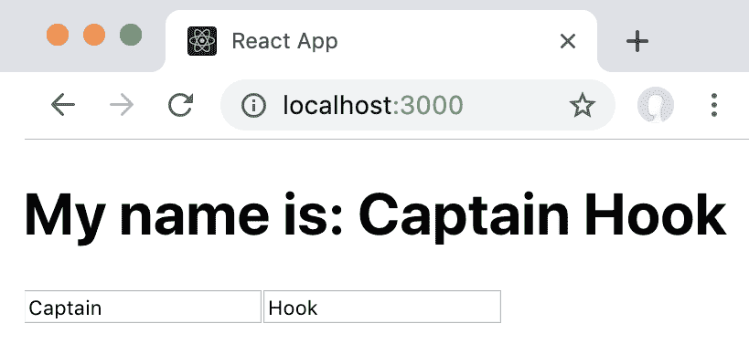

# 第二章：使用 State Hook

现在你已经了解了 React 的原则，并且对 Hooks 有了介绍，我们将深入学习 State Hook。我们将首先通过重新实现来学习 State Hook 的内部工作原理。接下来，我们将了解 Hooks 的一些限制以及它们存在的原因。然后，我们将学习可能的替代 Hook API 及其相关问题。最后，我们将学习如何解决由 Hooks 限制导致的常见问题。通过本章的学习，我们将知道如何使用 State Hook 来实现 React 中的有状态函数组件。

本章将涵盖以下主题：

+   将`useState` Hook 重新实现为一个简单的函数，用于访问全局状态

+   将我们的重新实现与真实的 React Hooks 进行比较，并了解它们之间的区别

+   学习可能的替代 Hook API 及其权衡

+   解决由 Hooks 限制导致的常见问题

+   解决条件 Hooks 的问题

# 技术要求

应该已经安装了一个相当新的 Node.js 版本（v11.12.0 或更高）。还需要安装 Node.js 的`npm`包管理器。

本章的代码可以在 GitHub 仓库中找到：[`github.com/PacktPublishing/Learn-React-Hooks/tree/master/Chapter02`](https://github.com/PacktPublishing/Learn-React-Hooks/tree/master/Chapter02)。

查看以下视频以查看代码的实际运行情况：

[`bit.ly/2Mm9yoC`](http://bit.ly/2Mm9yoC)

请注意，强烈建议您自己编写代码。不要简单地运行之前提供的代码示例。重要的是您自己编写代码，以便正确地学习和理解它。但是，如果遇到任何问题，您可以随时参考代码示例。

现在，让我们开始本章的学习。

# 重新实现 useState 函数

为了更好地理解 Hooks 的内部工作原理，我们将从头开始重新实现`useState` Hook。但是，我们不会将其实现为实际的 React Hook，而是作为一个简单的 JavaScript 函数——只是为了了解 Hooks 实际在做什么。

请注意，这个重新实现并不完全是 React Hooks 内部的工作原理。实际的实现是类似的，因此具有类似的约束。然而，真实的实现要比我们在这里实现的要复杂得多。

我们现在将开始重新实现 State Hook：

1.  首先，我们从`chapter1_2`中复制代码，我们将用我们自己的实现替换当前的`useState` Hook。

1.  打开`src/App.js`并通过删除以下行来移除 Hook 的导入：

```jsx
import  React,  {  useState  }  from  'react' 
```

用以下代码替换它：

```jsx
import  React  from  'react'
import ReactDOM from 'react-dom'
```

我们将需要`ReactDOM`来强制重新渲染我们的`useState` Hook 的组件。如果我们使用实际的 React Hooks，这将在内部处理。

1.  现在，我们定义我们自己的`useState`函数。正如我们已经知道的，`useState`函数将`initialState`作为参数：

```jsx
function useState (initialState) {
```

1.  然后，我们定义一个值，我们将在其中存储我们的状态。起初，这个值将被设置为传递给函数的`initialState`：

```jsx
    let value = initialState
```

1.  接下来，我们定义`setState`函数，我们将在其中将值设置为不同的东西，并强制重新渲染我们的`MyName`组件：

```jsx
    function setState (nextValue) {
        value = nextValue
        ReactDOM.render(<MyName />, document.getElementById('root'))
    }
```

1.  最后，我们将`value`和`setState`函数作为数组返回：

```jsx
    return [ value, setState ]
}
```

我们使用数组而不是对象的原因是，我们通常想要重命名`value`和`setState`变量。使用数组使得通过解构很容易重命名变量：

```jsx
const [ name, setName ] = useState('')
```

正如我们所看到的，Hooks 是处理副作用的简单的 JavaScript 函数，比如设置有状态的值。

我们的 Hook 函数使用闭包来存储当前值。闭包是一个环境，变量存在并被存储在其中。在我们的例子中，函数提供了闭包，`value`变量被存储在闭包中。`setState`函数也在同一个闭包中定义，这就是为什么我们可以在该函数中访问`value`变量。在`useState`函数之外，我们不能直接访问`value`变量，除非我们从函数中返回它。

# 我们简单的 Hook 实现存在的问题

如果我们现在运行我们的 Hook 实现，我们会注意到当我们的组件重新渲染时，状态被重置，所以我们无法在字段中输入任何文本。这是因为每次我们的组件重新渲染时`value`变量的重新初始化，这是因为我们每次渲染组件时都调用`useState`。

在接下来的部分，我们将通过使用全局变量来解决这个问题，然后将简单值转换为数组，从而允许我们定义多个 Hooks。

# 使用全局变量

正如我们所学的，值存储在由 `useState` 函数定义的闭包中。每次组件重新渲染时，闭包都会被重新初始化，这意味着我们的值将被重置。为了解决这个问题，我们需要将值存储在函数之外的全局变量中。这样，`value` 变量将在函数之外的闭包中，这意味着当函数再次被调用时，闭包不会被重新初始化。

我们可以定义一个全局变量如下：

1.  首先，在 `useState` 函数定义之前，我们添加以下行（加粗）。

```jsx
let value

function useState (initialState) {
```

1.  然后，我们用以下代码替换我们函数中的第一行：

```jsx
       if (typeof value === 'undefined') value = initialState
```

现在，我们的 `useState` 函数使用全局 `value` 变量，而不是在其闭包中定义 `value` 变量，因此当函数再次被调用时，它不会被重新初始化。

# 定义多个 Hook

我们的 Hook 函数起作用了！但是，如果我们想要添加另一个 Hook，我们会遇到另一个问题：所有的 Hook 都写入同一个全局 `value` 变量！

让我们通过向我们的组件添加第二个 Hook 来更仔细地研究这个问题。

# 向我们的组件添加多个 Hook

假设我们想要为用户的姓氏创建第二个字段，如下所示：

1.  我们首先在函数开头创建一个新的 Hook，放在当前 Hook 之后：

```jsx
    const [ name, setName ] = useState('')
 const [ lastName, setLastName ] = useState('')
```

1.  然后，我们定义另一个 `handleChange` 函数：

```jsx
    function handleLastNameChange (evt) {
        setLastName(evt.target.value)
    }
```

1.  接下来，我们将 `lastName` 变量放在名字后面：

```jsx
 <h1>My name is: {name} **{lastName}**</h1>
```

1.  最后，我们添加另一个 `input` 字段：

```jsx
            <input type="text" value={lastName} onChange={handleLastNameChange}
   />
```

当我们尝试这样做时，我们会注意到我们重新实现的 Hook 函数同时使用相同的值，所以我们总是同时更改两个字段。

# 实现多个 Hook

为了实现多个 Hook，我们应该有一个 Hook 值的数组，而不是一个单一的全局变量。

现在，我们将 `value` 变量重构为 `values` 数组，以便我们可以定义多个 Hook：

1.  删除以下代码行：

```jsx
let value
```

用以下代码片段替换它：

```jsx
let values = []
let currentHook = 0
```

1.  然后，编辑 `useState` 函数的第一行，我们现在在 `values` 数组的 `currentHook` 索引处初始化值：

```jsx
    if (typeof values[currentHook] === 'undefined') values[currentHook] = initialState
```

1.  我们还需要更新 setter 函数，以便只更新相应的状态值。在这里，我们需要将`currentHook`的值存储在单独的`hookIndex`变量中，因为`currentHook`的值稍后会更改。这确保在`useState`函数的闭包中创建了`currentHook`变量的副本。否则，`useState`函数将访问外部闭包中的`currentHook`变量，该变量在每次调用`useState`时都会被修改。

```jsx
    let hookIndex = currentHook
    function setState (nextValue) {
        values[hookIndex] = nextValue
        ReactDOM.render(<MyName />, document.getElementById('root'))
    }
```

1.  编辑`useState`函数的最后一行，如下所示：

```jsx
        return [ values[currentHook++], setState ]
```

使用`values[currentHook++]`，我们将`currentHook`的当前值作为索引传递给`values`数组，然后将`currentHook`增加一。这意味着在从函数返回后`currentHook`将增加。

如果我们想先增加一个值，然后再使用它，我们可以使用`arr[++indexToBeIncremented]`语法，它首先增加，然后将结果传递给数组。

1.  当我们开始渲染组件时，我们仍然需要重置`currentHook`计数器。在组件定义之后添加以下行（用粗体标出）：

```jsx
function Name () {
    currentHook = 0
```

最后，我们对`useState` Hook 的简单重新实现有效！以下截图突出显示了这一点：



我们的自定义 Hook 重新实现有效

正如我们所看到的，使用全局数组来存储我们的 Hook 值解决了在定义多个 Hook 时遇到的问题。

# 示例代码

简单 Hook 重新实现的示例代码可以在`Chapter02/chapter2_1`文件夹中找到。

只需运行`npm install`以安装所有依赖项，然后运行`npm start`启动应用程序，然后在浏览器中访问`http://localhost:3000`（如果没有自动打开）。

# 我们可以定义条件 Hook 吗？

如果我们想要添加一个复选框来切换使用名字字段，该怎么办？

让我们通过实现这样一个复选框来找出：

1.  首先，我们添加一个新的 Hook 来存储复选框的状态：

```jsx
    const [ enableFirstName, setEnableFirstName ] = useState(false)
```

1.  然后，我们定义一个处理函数：

```jsx
 function  handleEnableChange  (evt)  { setEnableFirstName(!enableFirstName) }
```

1.  接下来，我们渲染一个复选框：

```jsx
            <input type="checkbox" value={enableFirstName} onChange={handleEnableChange} />
```

1.  如果我们不想显示名字，可以编辑以下现有行以添加对`enableFirstName`变量的检查：

```jsx
            <h1>My name is: {enableFirstName ? name : ''} {lastName}</h1>
```

1.  我们是否可以将 Hook 定义放入`if`条件或三元表达式中，就像我们在以下代码片段中所做的那样？

```jsx
    const [ name, setName ] = enableFirstName
        ? useState('')
        : [ '', () => {} ]
```

1.  实际上，最新版本的`react-scripts`在定义条件钩子时会抛出错误，因此我们需要通过运行以下命令来降级库以进行示例：

```jsx
> npm install --save react-scripts@².1.8
```

在这里，我们要么使用钩子，要么如果名字被禁用，我们返回初始状态和一个空的 setter 函数，这样编辑输入字段就不起作用。

如果我们现在尝试运行这段代码，我们会注意到编辑姓氏仍然有效，但编辑名字不起作用，这正是我们想要的。正如我们在以下截图中所看到的，现在只有编辑姓氏有效：

！[](assets/3d7b5e61-a873-4b2d-b8b3-2d7ef07896e6.png)

勾选复选框之前的应用状态

当我们点击复选框时，会发生一些奇怪的事情：

+   复选框已被选中

+   名字输入字段已启用

+   现在姓氏字段的值是名字字段的值

我们可以在以下截图中看到单击复选框的结果：

！[](assets/1796851e-7490-424a-8e4f-8892e2f9babd.png)

勾选复选框后的应用状态

我们可以看到姓氏状态现在在名字字段中。值已经交换，因为钩子的顺序很重要。正如我们从我们的实现中所知，我们使用`currentHook`索引来知道每个钩子的状态存储在哪里。然而，当我们在两个现有钩子之间插入一个额外的钩子时，顺序就会混乱。

在勾选复选框之前，`values`数组如下：

+   `[false, '']`

+   钩子顺序：`enableFirstName`，`lastName`

然后，我们在`lastName`字段中输入了一些文本：

+   `[false, 'Hook']`

+   钩子顺序：`enableFirstName`，`lastName`

接下来，我们切换复选框，激活了我们的新钩子：

+   `[true, 'Hook', '']`

+   钩子顺序：`enableFirstName`，`name`，`lastName`

正如我们所看到的，在两个现有钩子之间插入一个新的钩子会使`name`钩子窃取下一个钩子（`lastName`）的状态，因为它现在具有与`lastName`钩子先前相同的索引。现在，`lastName`钩子没有值，这导致它设置初始值（空字符串）。因此，切换复选框会将`lastName`字段的值放入`name`字段中。

# 示例代码

我们简单的钩子重新实现的条件钩子问题的示例代码可以在`Chapter02/chapter2_2`文件夹中找到。

只需运行`npm install`来安装所有依赖项，然后运行`npm start`来启动应用程序，然后在浏览器中访问`http://localhost:3000`（如果没有自动打开）。

# 将我们的重新实现与真实的 Hooks 进行比较

我们简单的 Hook 实现已经让我们对 Hooks 内部工作原理有了一些了解。然而，在现实中，Hooks 并不使用全局变量。相反，它们在 React 组件内部存储状态。它们还在内部处理 Hook 计数器，因此我们不需要在函数组件中手动重置计数。此外，当状态改变时，真正的 Hooks 会自动触发我们组件的重新渲染。然而，为了能够做到这一点，Hooks 需要从 React 函数组件中调用。React Hooks 不能在 React 之外或在 React 类组件内部调用。

通过重新实现`useState` Hook，我们学到了一些东西：

+   Hooks 只是访问 React 功能的函数

+   Hooks 处理持续存在于重新渲染中的副作用

+   Hook 定义的顺序很重要

最后一点尤其重要，因为这意味着我们不能有条件地定义 Hooks。我们应该始终在函数组件的开头定义所有的 Hook，并且永远不要在`if`或其他结构中嵌套它们。

在这里，我们还学到了以下内容：

+   React Hooks 需要在 React 函数组件内部调用

+   React Hooks 不能有条件地定义，也不能在循环中定义

我们现在将看一下允许有条件 Hooks 的替代 Hook API。

# 替代 Hook API

有时，有条件地或在循环中定义 Hooks 可能会很好，但为什么 React 团队决定这样实现 Hooks 呢？有什么替代方案吗？让我们来看看其中的一些。

# 命名的 Hooks

我们可以给每个 Hook 一个名称，然后将 Hooks 存储在对象中，而不是数组中。然而，这不会产生一个好的 API，并且我们还必须考虑想出唯一的 Hook 名称：

```jsx
// NOTE: Not the actual React Hook API
const [ name, setName ] = useState('nameHook', '')
```

此外，当条件设置为`false`时，或者从循环中移除一个项目时会发生什么？我们会清除 Hook 状态吗？如果我们不清除 Hook 状态，可能会导致内存泄漏。

即使我们解决了所有这些问题，仍然会存在名称冲突的问题。例如，如果我们创建一个自定义钩子，利用了`useState`钩子，并将其命名为`nameHook`，那么我们在组件中就不能再调用任何其他钩子`nameHook`，否则就会造成名称冲突。这甚至适用于来自库的钩子名称，因此我们需要确保避免与库定义的钩子发生名称冲突！

# 钩子工厂

或者，我们也可以创建一个钩子工厂函数，它在内部使用`Symbol`，以便为每个钩子提供一个唯一的键名：

```jsx
function createUseState () {
    const keyName = Symbol()

    return function useState () {
        // ... use unique key name to handle hook state ...
    }
}
```

然后，我们可以按照以下方式使用工厂函数：

```jsx
// NOTE: Not the actual React Hook API
const useNameState = createUseState()

function MyName () {
    const [ name, setName ] = useNameState('')
    // ...
}
```

然而，这意味着我们需要实例化每个钩子两次：一次在组件外部，一次在函数组件内部。这会增加出错的可能性。例如，如果我们创建两个钩子并复制粘贴样板代码，那么我们可能会在使用工厂函数生成的钩子名称时出错，或者在组件内部使用钩子时出错。

这种方法还使得创建自定义钩子变得更加困难，迫使我们编写包装函数。此外，调试这些包装函数比调试简单函数更加困难。

# 其他替代方案

对于 React Hooks，有许多提出的替代 API，但它们每个都遇到了类似的问题：要么使 API 更难使用，更难调试，要么引入了名称冲突的可能性。

最终，React 团队决定，最简单的 API 是通过计算调用它们的顺序来跟踪 Hooks。这种方法也有其缺点，比如不能在条件语句中或循环中调用 Hooks。然而，这种方法使我们非常容易创建自定义 Hooks，并且简单易用易调试。我们也不需要担心命名钩子、名称冲突或编写包装函数。最终的 Hooks 方法让我们可以像使用任何其他函数一样使用 Hooks！

# 解决钩子的常见问题

正如我们发现的那样，使用官方 API 实现 Hooks 也有其自身的权衡和限制。我们现在将学习如何克服这些常见问题，这些问题源于 React Hooks 的限制。

我们将看看可以用来克服这两个问题的解决方案：

+   解决条件钩子

+   在循环中解决钩子

# 解决条件钩子

那么，如何实现条件 Hooks 呢？与其使 Hook 有条件，不如始终定义 Hook 并在需要时使用它。如果这不是一个选择，我们需要拆分我们的组件，这通常也更好！

# 始终定义 Hook

对于简单的情况，比如我们之前提到的名字示例，我们可以始终保持 Hook 的定义，如下：

```jsx
const [ name, setName ] = useState('')
```

始终定义 Hook 通常是一个简单的解决方案。

# 拆分组件

解决条件 Hooks 的另一种方法是将一个组件拆分为多个组件，然后有条件地渲染这些组件。例如，假设我们想在用户登录后从数据库中获取用户信息。

我们不能这样做，因为使用`if`条件可能会改变 Hook 的顺序：

```jsx
function UserInfo ({ username }) {
    if (username) {
        const info = useFetchUserInfo(username)
        return <div>{info}</div>
    }
    return <div>Not logged in</div>
}
```

相反，我们必须为用户登录时创建一个单独的组件，如下所示：

```jsx
function LoggedInUserInfo ({ username }) {
    const info = useFetchUserInfo(username)
    return <div>{info}</div>
}

function UserInfo ({ username }) {
    if (username) {
        return <LoggedInUserInfo username={username} />
    }
    return <div>Not logged in</div>
}
```

为非登录和登录状态使用两个单独的组件总是有意义的，因为我们希望坚持一个组件一个功能的原则。因此，通常情况下，如果我们坚持最佳实践，不能使用条件 Hooks 并不是什么限制。

# 解决循环中的 Hooks

至于循环中的 Hooks，我们可以使用包含数组的单个 State Hook，或者我们可以拆分我们的组件。例如，假设我们想显示所有在线用户。

# 使用数组

我们可以简单地使用包含所有`users`的数组，如下所示：

```jsx
function OnlineUsers ({ users }) {
    const [ userInfos, setUserInfos ] = useState([])
    // ... fetch & keep userInfos up to date ...
    return (
        <div>
            {users.map(username => {
                const user = userInfos.find(u => u.username === username)
                return <UserInfo {...user} />
            })}
        </div>
    )
}
```

然而，这可能并不总是有意义。例如，我们可能不希望通过`OnlineUsers`组件来更新`user`状态，因为我们需要从数组中选择正确的`user`状态，然后修改数组。这可能有效，但相当繁琐。

# 拆分组件

更好的解决方案是在`UserInfo`组件中使用 Hook。这样，我们可以保持每个用户的状态更新，而不必处理数组逻辑：

```jsx
function OnlineUsers ({ users }) {
    return (
        <div>
            {users.map(username => <UserInfo username={username} />)}
        </div>
    )
}

function UserInfo ({ username }) {
    const info = useFetchUserInfo(username)
    // ... keep user info up to date ...
    return <div>{info}</div>
}
```

正如我们所看到的，为每个功能使用一个组件可以使我们的代码简单而简洁，并且避免了 React Hooks 的限制。

# 解决条件 Hooks 的问题

现在我们已经了解了条件 Hooks 的不同替代方案，我们将解决之前在我们的小示例项目中遇到的问题。这个问题的最简单解决方案是总是定义 Hook，而不是有条件地定义它。在这样一个简单的项目中，总是定义 Hook 是最合理的。

编辑`src/App.js`并删除以下条件 Hook：

```jsx
 const  [  name,  setName  ]  =  enableFirstName ?  useState('') : [ '',  ()  =>  {} ]
```

用一个普通的 Hook 替换它，比如以下内容：

```jsx
    const [ name, setName ] = useState('')
```

现在，我们的示例运行良好！在更复杂的情况下，总是定义 Hook 可能不可行。在这种情况下，我们需要创建一个新组件，在那里定义 Hook，然后有条件地渲染组件。

# 示例代码

简单解决条件 Hooks 问题的示例代码可以在`Chapter02/chapter2_3`文件夹中找到。

只需运行`npm install`来安装所有依赖项，然后运行`npm start`来启动应用程序，然后在浏览器中访问`http://localhost:3000`（如果没有自动打开）。

# 总结

在本章中，我们首先通过使用全局状态和闭包重新实现了`useState`函数。然后我们了解到，为了实现多个 Hooks，我们需要使用状态数组。然而，通过使用状态数组，我们被迫保持 Hooks 在函数调用中的顺序一致。这种限制使得条件 Hooks 和循环中的 Hooks 变得不可能。然后我们了解了 Hook API 的可能替代方案，它们的权衡以及为什么选择了最终的 API。最后，我们学会了如何解决由 Hooks 限制引起的常见问题。我们现在对 Hooks 的内部工作原理和限制有了扎实的理解。此外，我们深入了解了 State Hook。

在下一章中，我们将使用 State Hook 创建一个博客应用程序，并学习如何结合多个 Hooks。

# 问题

总结一下我们在本章学到的内容，尝试回答以下问题：

1.  在开发我们自己的`useState` Hook 的重新实现时，我们遇到了什么问题？我们是如何解决这些问题的？

1.  为什么在 React 的 Hooks 实现中条件 Hooks 不可能？

1.  Hooks 是什么，它们处理什么？

1.  在使用 Hooks 时，我们需要注意什么？

1.  替代 API 想法的常见问题是什么？

1.  我们如何实现条件 Hooks？

1.  我们如何在循环中实现 Hooks？

# 进一步阅读

如果您对本章学习的概念想了解更多，请参考以下阅读材料：

+   有关替代 Hook API 缺陷的更多信息：[`overreacted.io/why-do-hooks-rely-on-call-order/`](https://overreacted.io/why-do-hooks-rely-on-call-order/)

+   官方对替代 Hook API 的评论：[`github.com/reactjs/rfcs/pull/68#issuecomment-439314884`](https://github.com/reactjs/rfcs/pull/68#issuecomment-439314884)

+   有关条件 Hooks 不起作用的官方文档：[`reactjs.org/docs/hooks-rules.html#explanation`](https://reactjs.org/docs/hooks-rules.html#explanation)
