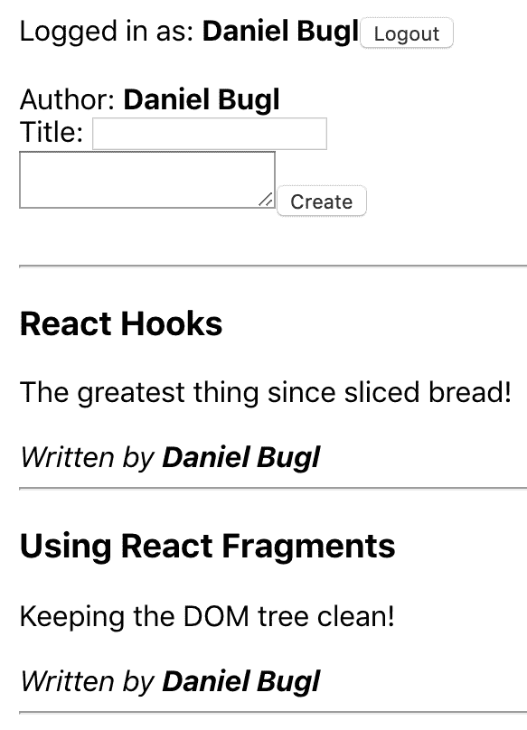
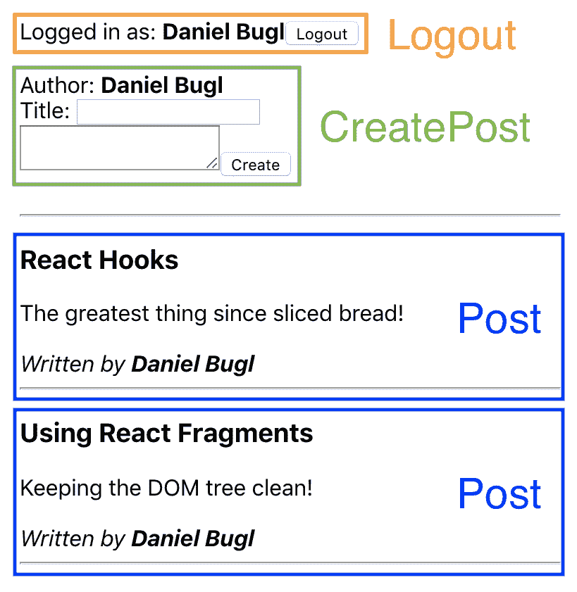
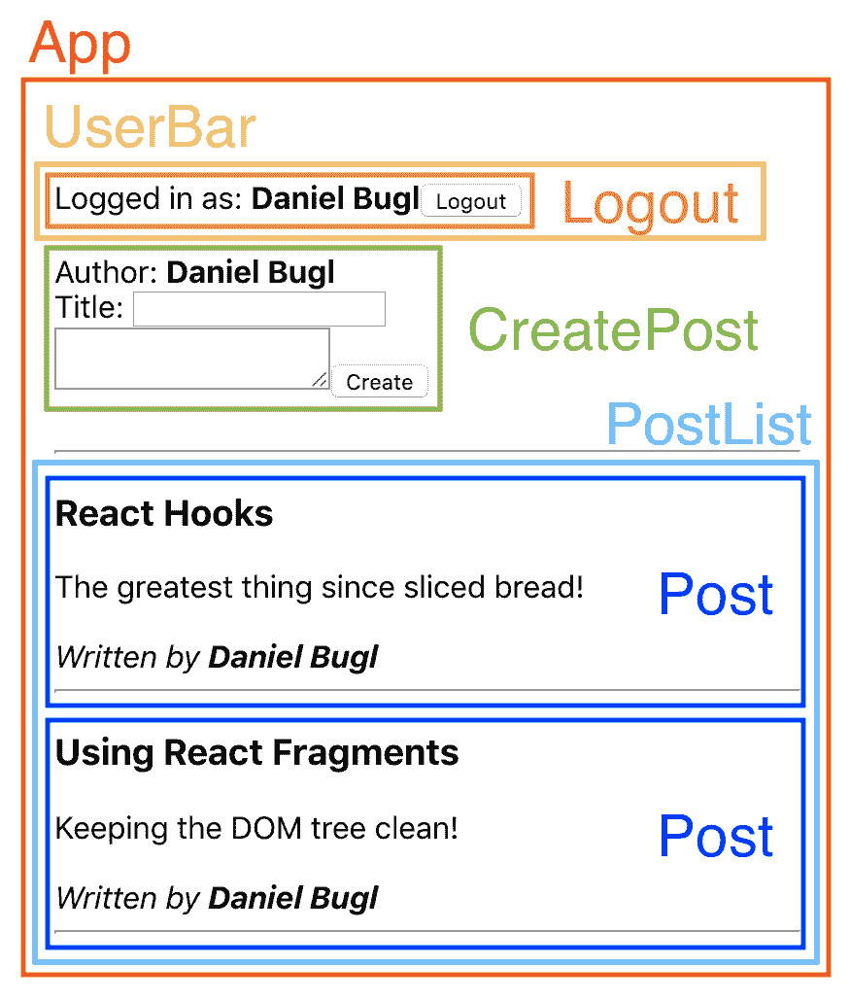
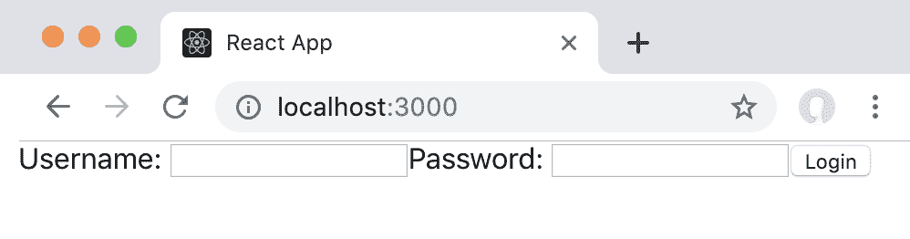
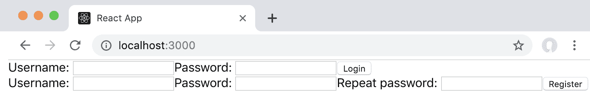
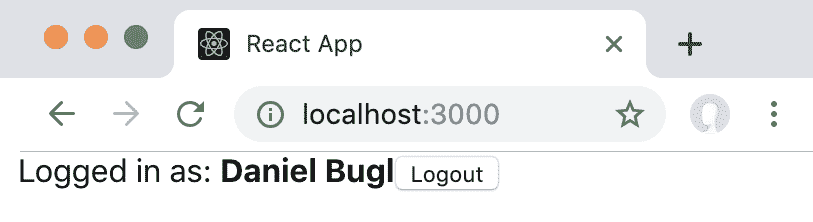
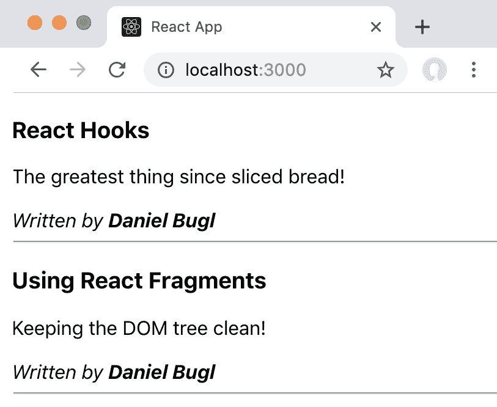
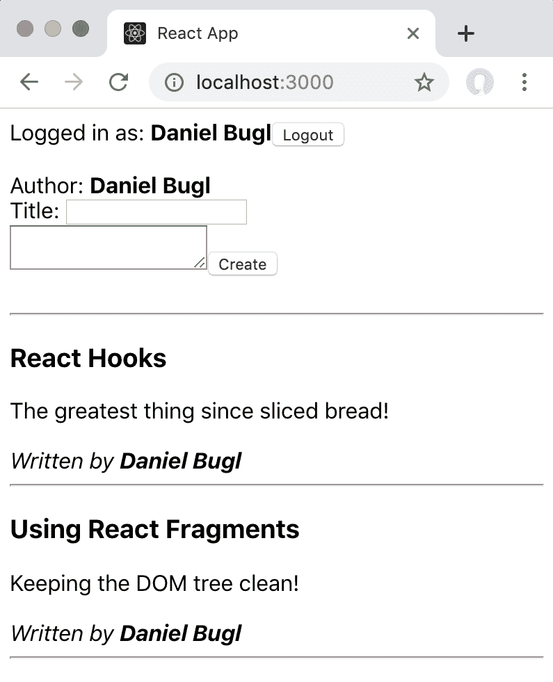
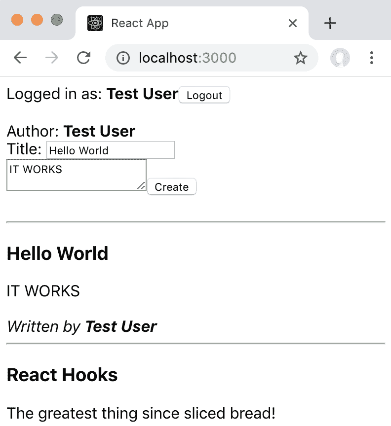

# 第三章：使用 React Hooks 编写您的第一个应用程序

深入了解 State Hook 后，我们现在将利用它从头开始创建一个博客应用程序。在本章中，我们将学习如何以可扩展的方式构建 React 应用程序，如何使用多个 Hooks，如何存储状态以及如何使用 Hooks 解决常见用例。在本章结束时，我们将拥有一个基本的博客应用程序，可以在其中登录、注册和创建帖子。

本章将涵盖以下主题：

+   以可扩展的方式构建 React 项目

+   从模拟中实现静态的 React 组件

+   使用 Hooks 实现有状态的组件

# 技术要求

应该已经安装了相当新的 Node.js 版本（v11.12.0 或更高）。还需要安装 Node.js 的`npm`包管理器。

本章的代码可以在 GitHub 存储库中找到：[`github.com/PacktPublishing/Learn-React-Hooks/tree/master/Chapter03`](https://github.com/PacktPublishing/Learn-React-Hooks/tree/master/Chapter03)。

查看以下视频以查看代码的实际操作：

[`bit.ly/2Mm9yoC`](http://bit.ly/2Mm9yoC)

请注意，强烈建议您自己编写代码。不要简单地运行先前提供的代码示例。重要的是您自己编写代码，以便能够正确学习和理解。但是，如果遇到任何问题，您可以随时参考代码示例。

现在，让我们开始本章。

# 构建 React 项目

在学习了 React 的原则、如何使用`useState` Hook 以及 Hooks 的内部工作原理后，我们现在将利用真正的`useState` Hook 来开发一个博客应用程序。首先，我们将创建一个新项目，并以一种可以在以后扩展项目的方式来构建文件夹结构。然后，我们将定义我们需要的组件，以涵盖博客应用程序的基本功能。最后，我们将使用 Hooks 为我们的应用程序引入状态！在本章中，我们还将学习**JSX**，以及在**ES6**到**ES2018**中引入的新 JavaScript 功能。

# 文件夹结构

项目可以有许多不同的结构方式，不同的结构方式适用于不同的项目。通常，我们创建一个`src/`文件夹，并按功能将文件分组在那里。另一种流行的项目结构方式是按路由进行分组。对于一些项目，此外还可能根据代码的类型进行分离，比如`src/api/`和`src/components/`。然而，对于我们的项目，我们主要关注**用户界面**（**UI**）。因此，我们将按功能在`src/`文件夹中将文件分组。

最好一开始从一个简单的结构开始，只有在实际需要时才进行更深的嵌套。在开始项目时不要花太多时间考虑文件结构，因为通常情况下，你不知道文件应该如何分组。

# 选择功能

我们首先必须考虑在我们的博客应用程序中要实现哪些功能。至少，我们希望实现以下功能：

+   注册用户

+   登录/登出

+   查看单个帖子

+   创建新帖子

+   列出帖子

既然我们已经选择了功能，让我们提出一个初始的文件夹结构。

# 提出一个初始结构

从我们之前的功能中，我们可以抽象出一些功能组：

+   用户（注册，登录/登出）

+   帖子（创建，查看，列出）

现在我们可以保持非常简单，将所有组件创建在`src/`文件夹中，不进行任何嵌套。然而，由于我们已经对博客应用程序需要的功能有了相当清晰的了解，我们现在可以提出一个简单的文件夹结构：

+   `src/`

+   `src/user/`

+   `src/post/`

在定义文件夹结构之后，我们可以继续进行组件结构。

# 组件结构

在 React 中，组件的理念是让每个组件处理单个任务或 UI 元素。我们应该尽量将组件做得细粒度，以便能够重用代码。如果我们发现自己在从一个组件复制和粘贴代码到另一个组件，那么创建一个新组件并在多个其他组件中重用它可能是个好主意。

通常，在开发软件时，我们会从 UI 模拟开始。对于我们的博客应用程序，模拟将如下所示：



我们博客应用程序的初始模拟

在拆分组件时，我们使用单一职责原则，该原则规定每个模块应对功能的一个封装部分负责。

在这个模拟中，我们可以在每个组件和子组件周围画框，并给它们命名。请记住，每个组件应该只负责一个功能。我们从构成这个应用程序的基本组件开始：



从我们的模拟中定义基本组件

我们为注销功能定义了一个`Logout`组件，一个包含创建新帖子表单的`CreatePost`组件，以及一个用于显示实际帖子的`Post`组件。

现在我们已经定义了我们的基本组件，我们将看看哪些组件在逻辑上属于一起，从而形成一个组。为此，我们现在定义容器组件，这样我们就可以将组件组合在一起：



从我们的模拟中定义容器组件

我们定义了一个`PostList`组件来将帖子分组，然后定义了一个`UserBar`组件来处理登录/注销和注册。最后，我们定义了一个`App`组件来将所有内容组合在一起，并定义我们应用程序的结构。

现在我们已经完成了对我们的 React 项目进行结构化，我们可以继续实现静态组件。

# 实现静态组件

在我们开始通过 Hooks 向我们的博客应用程序添加状态之前，我们将模拟应用程序的基本功能作为静态 React 组件。这样做意味着我们必须处理应用程序的静态视图结构。

首先处理静态结构是有意义的，这样可以避免以后将动态代码移动到不同的组件中。此外，首先只处理**超文本标记语言（HTML）**和 CSS 更容易——这有助于我们快速启动项目。然后，我们可以继续实现动态代码和处理状态。

逐步进行这一步，而不是一次实现所有内容，有助于我们快速启动新项目，而不必一次考虑太多，并且让我们避免以后重新构建项目！

# 设置项目

我们已经学会了如何设置一个新的 React 项目。正如我们所学到的，我们可以使用`create-react-app`工具轻松初始化一个新项目。我们现在要这样做：

1.  首先，我们使用`create-react-app`来初始化我们的项目：

```jsx
>npx create-react-app chapter3_1
```

1.  然后，我们为我们的功能创建文件夹：

+   +   **创建文件夹**：`src/user/`

+   **创建文件夹**：`src/post/`

现在我们的项目结构已经设置好，我们可以开始实施组件。

# 实施用户

我们将从静态组件方面最简单的功能开始：实施与用户相关的功能。正如我们从模拟中看到的，我们在这里需要四个组件：

+   一个`Login`组件，当用户尚未登录时我们将展示它

+   一个`Register`组件，当用户尚未登录时我们也会展示它

+   一个`Logout`组件，当用户登录后将显示

+   一个`UserBar`组件，它将有条件地显示其他组件

我们将首先定义前三个组件，它们都是独立的组件。最后，我们将定义`UserBar`组件，因为它依赖于其他组件的定义。

# 登录组件

首先，我们定义`Login`组件，其中我们展示两个字段：用户名字段和密码字段。此外，我们展示一个登录按钮：

1.  我们首先为我们的组件创建一个新文件：`src/user/Login.js`

1.  在新创建的`src/user/Login.js`文件中，我们导入`React`：

```jsx
import  React  from  'react'
```

1.  然后，我们定义我们的函数组件。目前，`Login`组件不会接受任何 props：

```jsx
export  default  function  Login  ()  { 
```

1.  最后，我们通过 JSX 返回两个字段和登录按钮。我们还定义了一个`form`容器元素来包裹它们。为了在提交表单时避免页面刷新，我们必须定义一个`onSubmit`处理程序并在事件对象上调用`e.preventDefault()`：

```jsx
    return (
        <form onSubmit={e => e.preventDefault()}>
            <label htmlFor="login-username">Username:</label>
            <input type="text" name="login-username" id="login-username" />
            <label htmlFor="login-password">Password:</label>
            <input type="password" name="login-password" id="login-password" />
            <input type="submit" value="Login" />
        </form>
    )
}
```

在这里，我们使用匿名函数来定义`onSubmit`处理程序。匿名函数的定义如下，如果它们没有任何参数：`() => { ... }`，而不是`function () { ... }`。有了参数，我们可以写成`(arg1, arg2) => { ... }`，而不是`function (arg1, arg2) { ... }`。如果我们只有一个参数，我们可以省略`()`括号。此外，如果我们的函数中只有一个语句，我们可以省略`{}`括号，就像这样：`e => e.preventDefault()`。

使用语义化的 HTML 元素，如`<form>`和`<label>`，可以使您的应用程序更易于使用辅助功能软件的人导航，例如屏幕阅读器。此外，当使用语义化的 HTML 时，键盘快捷键，例如按回车键提交表单，会自动生效。

我们的`Login`组件已经实现，现在可以进行测试了。

# 测试我们的组件

既然我们已经定义了我们的第一个组件，让我们渲染它并看看它的样子：

1.  首先，我们编辑`src/App.js`，并删除所有内容。

1.  然后，我们首先导入`React`和`Login`组件：

```jsx
import React from 'react'

import Login from './user/Login'
```

将导入分组成属于一起的代码块是一个好主意。在这种情况下，我们通过在外部导入（如 React）和本地导入（如我们的`Login`组件）之间添加空行来分隔它们。这样做可以保持我们的代码可读性，特别是当我们以后添加更多导入语句时。

1.  最后，我们定义`App`组件，并返回`Login`组件：

```jsx
export default function App () {
    return <Login />
}
```

如果我们只返回一个组件，可以在`return`语句中省略括号。而不是写`return (<Login />)`，我们可以简单地写`return <Login />`。

1.  在浏览器中打开`http://localhost:3000`，您应该看到`Login`组件被渲染。如果您已经在浏览器中打开了页面，当您更改代码时，它应该会自动刷新：



我们博客应用的第一个组件：通过用户名和密码登录

正如我们所看到的，静态的`Login`组件在 React 中渲染得很好。现在我们可以继续进行`Logout`组件。

# 登出组件

接下来，我们定义`Logout`组件，它将显示当前登录的用户和一个登出按钮：

1.  创建一个新文件：`src/user/Logout.js`

1.  导入`React`，如下所示：

```jsx
import React from 'react'
```

1.  这次，我们的函数将接受一个`user`属性，我们将使用它来显示当前登录的用户：

```jsx
export default function Logout ({ user }) {
```

在这里，我们使用解构来从`props`对象中提取`user`键。React 将所有组件 props 作为单个对象作为函数的第一个参数传递。在第一个参数上使用解构类似于在类组件中执行`const { user } = this.props`。

1.  最后，我们返回一个文本，显示当前登录的`user`和登出按钮：

```jsx
    return (
        <form onSubmit={e => e.preventDefault()}>
            Logged in as: <b>{user}</b>
            <input type="submit" value="Logout" />
        </form>
    )
}
```

1.  现在，我们可以在`src/App.js`中用`Logout`组件替换`Login`组件，以便看到我们新定义的组件（不要忘记将`user`属性传递给它！）：

```jsx
import React from 'react'

import Logout from './user/Logout'

export default function App () {
    return <Logout user="Daniel Bugl" />
}
```

现在`Logout`组件已经定义，我们可以继续定义`Register`组件。

# 注册组件

静态的`Register`组件将与`Login`组件非常相似，只是多了一个重复密码的字段。如果它们如此相似，您可能会想将它们合并为一个组件，并添加一个 prop 来切换重复密码字段。然而，最好遵循单一职责原则，让每个组件只处理一个功能。稍后，我们将使用动态代码扩展静态组件，然后`Register`和`Login`的代码将大不相同。因此，我们稍后需要再次拆分它们。

尽管如此，让我们开始编写`Register`组件的代码：

1.  首先，我们创建一个新的`src/user/Register.js`文件，并从`Login`组件中复制代码，因为静态组件毕竟非常相似。确保将组件的名称更改为`Register`：

```jsx
import React from 'react'

export default function Register () {
    return (
        <form onSubmit={e => e.preventDefault()}>
            <label htmlFor="register-username">Username:</label>
            <input type="text" name="register-username" id="register-username" />
            <label htmlFor="register-password">Password:</label>
            <input type="password" name="register-password" id="register-password" />
```

1.  接下来，我们在 Password 字段代码下方添加重复密码字段：

```jsx
            <label htmlFor="register-password-repeat">Repeat password:</label>
            <input type="password" name="register-password-repeat" id="register-password-repeat" />
```

1.  最后，我们还将提交按钮的值更改为 Register：

```jsx
            <input type="submit" value="Register" />
        </form>
    )
}
```

1.  同样，我们可以编辑`src/App.js`以类似的方式显示我们的组件，就像我们在`Login`组件中所做的那样：

```jsx
import React from 'react'

import Register from './user/Register'

export default function App () {
    return <Register />
}
```

正如我们所看到的，我们的`Register`组件看起来与`Login`组件非常相似。

# UserBar 组件

现在是时候将我们与用户相关的组件放在一个`UserBar`组件中了。在这里，我们将有条件地显示`Login`和`Register`组件，或者`Logout`组件，这取决于用户是否已经登录。

让我们开始实现`UserBar`组件：

1.  首先，我们创建一个新的`src/user/UserBar.js`文件，并导入`React`以及我们定义的三个组件：

```jsx
import React from 'react'

import Login from './Login'
import Logout from './Logout'
import Register from './Register'
```

1.  接下来，我们定义我们的函数组件，并为`user`定义一个值。现在，我们只是将它保存在一个静态变量中：

```jsx
export default function UserBar () {
    const user = ''
```

1.  然后，我们检查用户是否已登录。如果用户已登录，我们显示`Logout`组件，并将`user`值传递给它：

```jsx
    if (user) {
        return <Logout user={user} />
```

1.  否则，我们展示`Login`和`Register`组件。在这里，我们可以使用`React.Fragment`而不是`<div>`容器元素。这样可以保持我们的 UI 树干净，因为组件将简单地并排渲染，而不是包裹在另一个元素中：

```jsx
    } else {
        return (
            <React.Fragment>
                <Login />
                <Register />
            </React.Fragment>
        )
    }
}
```

1.  再次编辑`src/App.js`，现在我们展示我们的`UserBar`组件：

```jsx
import React from 'react'

import UserBar from './user/UserBar'

export default function App () {
    return <UserBar />
}
```

1.  我们可以看到，它起作用了！我们现在展示`Login`和`Register`组件：



我们的 UserBar 组件，展示了 Login 和 Register 组件

1.  接下来，我们可以编辑`src/user/UserBar.js`文件，并将`user`值设置为一个字符串：

```jsx
        const user = 'Daniel Bugl' 
```

1.  这样做之后，我们的应用程序现在显示`Logout`组件：



我们的应用程序在定义`user`值后显示了 Logout 组件

在本章的后面，我们将向我们的应用程序添加 Hooks，这样我们就可以登录并使状态动态更改，而无需编辑代码！

# 示例代码

与用户相关的组件的示例代码可以在`Chapter03/chapter3_1`文件夹中找到。

只需运行`npm install`来安装所有依赖项，然后运行`npm start`来启动应用程序，然后在浏览器中访问`http://localhost:3000`（如果没有自动打开）。

# 实现帖子

在实现了所有与用户相关的组件之后，我们继续在博客应用中实现帖子。我们将定义以下组件：

+   一个`Post`组件用于显示单个帖子

+   一个`CreatePost`组件用于创建新的帖子

+   一个`PostList`组件用于显示多个帖子

现在让我们开始实现与帖子相关的组件。

# Post 组件

在创建模型时，我们已经考虑了帖子具有哪些元素。帖子应该有一个标题，内容和作者（撰写帖子的用户）。

现在让我们实现`Post`组件：

1.  首先，我们创建一个新文件：`src/post/Post.js`

1.  然后，我们导入`React`，并定义我们的函数组件，接受三个属性：`title`，`content`和`author`：

```jsx
import React from 'react'

export default function Post ({ title, content, author }) {
```

1.  接下来，我们以类似模型的方式呈现所有属性：

```jsx
    return (
        <div>
            <h3>{title}</h3>
            <div>{content}</div>
            <br />
            <i>Written by <b>{author}</b></i>
        </div>
    )
}
```

1.  像往常一样，我们可以通过编辑`src/App.js`文件来测试我们的组件：

```jsx
import React from 'react'

import Post from './post/Post'

export default function App () {
    return <Post title="React Hooks" content="The greatest thing since sliced bread!" author="Daniel Bugl" />
}
```

现在，静态的`Post`组件已经实现，我们可以继续进行`CreatePost`组件。

# CreatePost 组件

接下来，我们实现一个表单来允许创建新的帖子。在这里，我们将`user`值作为属性传递给组件，因为作者应该始终是当前登录的用户。然后，我们显示作者，并为博客帖子的`title`提供一个输入字段，以及一个`<textarea>`元素用于内容。

现在让我们实现`CreatePost`组件：

1.  创建一个新文件：`src/post/CreatePost.js`

1.  定义以下组件：

```jsx
import React from 'react'

export default function CreatePost ({ user }) {
    return (
        <form onSubmit={e => e.preventDefault()}>
            <div>Author: <b>{user}</b></div>
            <div>
                <label htmlFor="create-title">Title:</label>
                <input type="text" name="create-title" id="create-title" />
            </div>
            <textarea />
            <input type="submit" value="Create" />
        </form>
    )
}
```

1.  像往常一样，我们可以通过编辑`src/App.js`文件来测试我们的组件：

```jsx
import React from 'react'

import CreatePost from './post/CreatePost'

export default function App () {
    return <CreatePost />
}
```

正如我们所看到的，`CreatePost`组件渲染正常。我们现在可以继续进行`PostList`组件。

# PostList 组件

在实现其他与文章相关的组件之后，我们现在可以实现博客应用程序最重要的部分：博客文章的动态更新。目前，动态更新只是简单地显示博客文章列表。

让我们现在开始实现`PostList`组件：

1.  我们首先导入`React`和`Post`组件：

```jsx
import React from 'react'

import Post from './Post'
```

1.  然后，我们定义我们的`PostList`函数组件，接受一个`posts`数组作为 prop。如果`posts`未定义，我们将其默认设置为空数组：

```jsx
export default function PostList ({ posts = [] }) {
```

1.  接下来，我们使用`.map`函数和扩展语法来渲染所有`posts`：

```jsx
    return (
        <div>
            {posts.map((p, i) => <Post {...p} key={'post-' + i} />)}
        </div>
    )
}
```

如果我们要渲染一个元素列表，我们必须给每个元素一个唯一的`key` prop。当数据发生变化时，React 使用这个`key` prop 来高效地计算两个列表的差异。

在这里，我们使用`map`函数，它将一个函数应用于数组的所有元素。这类似于使用`for`循环并存储所有结果，但它更加简洁、声明性，并且更容易阅读！或者，我们可以使用`map`函数的替代方法：

```jsx
let renderedPosts = []
let i = 0
for (let p of posts) {
    renderedPosts.push(<Post {...p} key={'post-' + i} />)
    i++
}

return (
    <div>
        {renderedPosts}
    </div>
)
```

然后我们为每篇文章返回`<Post>`组件，并将文章对象`p`的所有键作为 props 传递给组件。我们使用扩展语法来实现这一点，它的效果与手动列出对象中所有键作为 props 相同，如下所示：`<Post title={p.title} content={p.content} author={p.author} />`

1.  在模型中，每篇博客文章之后都有一条水平线。我们可以通过使用`React.Fragment`来实现这一点，而无需额外的`<div>`容器元素：

```jsx
{posts.map((p, i) => (
     <React.Fragment key={'post-' + i} >
          <Post {...p} />
          <hr />
     </React.Fragment>
))}
```

`key` prop 始终必须添加到在`map`函数中渲染的最上层父元素。在这种情况下，我们不得不将`key` prop 从`Post`组件移动到`React.Fragment`组件中。

1.  我们通过编辑`src/App.js`文件来测试我们的组件：

```jsx
import React from 'react'

import PostList from './post/PostList'

const posts = [
 { title: 'React Hooks', content: 'The greatest thing since sliced bread!', author: 'Daniel Bugl' },
 { title: 'Using React Fragments', content: 'Keeping the DOM tree clean!', author: 'Daniel Bugl' }
]

export default function App () {
    return <PostList posts={posts} />
}
```

现在，我们可以看到我们的应用程序列出了我们在`posts`数组中定义的所有文章：



使用 PostList 组件显示多篇文章

正如我们所看到的，通过`PostList`组件列出多篇文章是可以的。现在我们可以继续组合应用程序。

# 组合应用程序

在实现所有组件之后，为了复制模型，我们现在只需要将所有内容放在`App`组件中。然后，我们将成功复制模型！

让我们开始修改`App`组件，并组合我们的应用程序：

1.  编辑`src/App.js`，并删除所有当前代码。

1.  首先，我们导入`React`、`PostList`、`CreatePost`和`UserBar`组件：

```jsx
import React from 'react'

import PostList from './post/PostList'
import CreatePost from './post/CreatePost'
import UserBar from './user/UserBar'
```

1.  然后，我们为我们的应用程序定义一些模拟数据：

```jsx
const user = 'Daniel Bugl'
const posts = [
    { title: 'React Hooks', content: 'The greatest thing since sliced bread!', author: 'Daniel Bugl' },
    { title: 'Using React Fragments', content: 'Keeping the DOM tree clean!', author: 'Daniel Bugl' }
]
```

1.  接下来，我们定义`App`组件，并返回一个`<div>`容器元素，在这里我们设置一些填充：

```jsx
export default function App () {
    return (
        <div style={{ padding: 8 }}>
```

1.  现在，我们插入`UserBar`和`CreatePost`组件，将`user`属性传递给`CreatePost`组件：

```jsx
            <UserBar />
            <br />
            <CreatePost user={user} />
            <br />
            <hr />
```

请注意，您应该始终优先使用 CSS 进行间距设置，而不是使用`<br />`HTML 标记。但是，目前我们专注于 UI，而不是其样式，因此我们尽可能使用 HTML。

1.  最后，我们显示`PostList`组件，列出所有的`posts`：

```jsx
            <PostList posts={posts} />
        </div>
    )
}
```

1.  保存文件后，`http://localhost:3000`应该会自动刷新，现在我们可以看到完整的 UI 了：



根据模拟的静态博客应用程序的完整实现

正如我们所看到的，我们之前定义的所有静态组件都在一个`App`组件中一起呈现。我们的应用程序现在看起来就像模拟一样。接下来，我们可以继续使所有组件都变得动态。

# 示例代码

我们博客应用程序静态实现的示例代码可以在`Chapter03/chapter3_2`文件夹中找到。

只需运行`npm install`来安装所有依赖项，然后运行`npm start`来启动应用程序，然后在浏览器中访问`http://localhost:3000`（如果没有自动打开）。

# 使用 Hooks 实现有状态的组件

现在我们已经实现了应用程序的静态结构，我们将为它添加`useState` Hooks，以便能够处理状态和动态交互！

# 为用户功能添加 Hooks

为了为用户功能添加 Hooks，我们需要用一个 State Hook 替换静态的`user`值。然后，我们需要在登录、注册和注销时调整这个值。

# 调整 UserBar

回想一下，当我们创建`UserBar`组件时，我们静态定义了`user`值。现在我们将用一个 State Hook 替换这个值！

让我们开始修改`UserBar`组件，使其变得动态：

1.  编辑`src/user/UserBar.js`，通过调整`React`导入语句导入`useState` Hook，如下所示：

```jsx
import React, { useState } from 'react'
```

1.  删除以下代码行：

```jsx
    const user = 'Daniel Bugl'
```

用一个空的用户`''`作为默认值替换它：

```jsx
    const [ user, setUser ] = useState('')
```

1.  然后，我们将`setUser`函数传递给`Login`、`Register`和`Logout`组件：

```jsx
    if (user) {
        return <Logout user={user} setUser={setUser} />
    } else {
        return (
            <React.Fragment>
                <Login setUser={setUser} />
                <Register setUser={setUser} />
            </React.Fragment>
        )
    }
```

现在，`UserBar`组件提供了一个`setUser`函数，可以在`Login`、`Register`和`Logout`组件中使用，以设置或取消`user`的值。

# 调整登录和注册组件

在`Login`和`Register`组件中，我们需要使用`setUser`函数来相应地设置`user`的值，当我们登录或注册时。

# 登录

在`Login`组件中，我们现在暂时忽略密码字段，只处理用户名字段。

让我们首先修改`Login`组件以使其动态化：

1.  编辑`src/user/Login.js`，并导入`useState` Hook：

```jsx
import React, { useState } from 'react'
```

1.  然后，调整函数定义以接受`setUser`属性：

```jsx
export default function Login ({ setUser }) {
```

1.  现在，我们为用户名字段的值定义一个新的 State Hook：

```jsx
    const [ username, setUsername ] = useState('')
```

1.  接下来，我们定义一个处理程序函数：

```jsx
    function handleUsername (evt) {
        setUsername(evt.target.value)
    }
```

1.  然后，我们调整`input`字段，以使用`username`的值，并在输入更改时调用`handleUsername`函数：

```jsx
            <input type="text" value={username} onChange={handleUsername} name="login-username" id="login-username" />
```

1.  最后，当按下登录按钮并且表单被提交时，我们需要调用`setUser`函数：

```jsx
            <form onSubmit={e => { e.preventDefault(); setUser(username) }} />
```

1.  此外，当`username`值为空时，我们可以禁用登录按钮：

```jsx
            <input type="submit" value="Login" disabled={username.length === 0} />
```

它起作用了——我们现在可以输入用户名，按下登录按钮，然后我们的`UserBar`组件将改变其状态，并显示`Logout`组件！

# 注册

对于注册，我们还将检查输入的密码是否相同，只有在这种情况下我们才会设置`user`的值。

让我们首先修改`Register`组件以使其动态化：

1.  首先，我们执行与“登录”相同的步骤，以处理“用户名”字段：

```jsx
import React, { useState } from 'react'

export default function Register ({ setUser }) {
 const [ username, setUsername ] = useState('')

 function handleUsername (evt) {
 setUsername(evt.target.value)
 }

    return (
        <form onSubmit={e => { e.preventDefault(); setUser(username) }}>
            <label htmlFor="register-username">Username:</label>
            <input type="text" value={username} onChange={handleUsername} name="register-username" id="register-username" />
            <label htmlFor="register-password">Password:</label>
            <input type="password" name="register-password" id="register-password" />
            <label htmlFor="register-password-repeat">Repeat password:</label>
            <input type="password" name="register-password-repeat" id="register-password-repeat" />
            <input type="submit" value="Register" disabled={username.length === 0} />
        </form>
    )
}
```

1.  现在，我们为`密码`和`重复密码`字段定义了两个新的 State Hooks：

```jsx
    const [ password, setPassword ] = useState('')
    const [ passwordRepeat, setPasswordRepeat ] = useState('')
```

1.  然后，我们为它们定义两个处理程序函数：

```jsx
    function handlePassword (evt) {
        setPassword(evt.target.value)
    }

    function handlePasswordRepeat (evt) {
        setPasswordRepeat(evt.target.value)
    }
```

您可能已经注意到，我们总是为`input`字段编写类似的处理程序函数。实际上，这是创建自定义 Hook 的完美用例！我们将在未来的章节中学习如何做到这一点。

1.  接下来，我们将`value`和`onChange`处理程序函数分配给`input`字段：

```jsx
             <label htmlFor="register-password">Password:</label>
             <input type="password" value={password} onChange={handlePassword} name="register-password" id="register-password" />
             <label htmlFor="register-password-repeat">Repeat password:</label>
             <input type="password" value={passwordRepeat} onChange={handlePasswordRepeat} name="register-password-repeat" id="register-password-repeat" />
```

1.  最后，我们检查密码是否匹配，如果不匹配，我们保持按钮处于禁用状态：

```jsx
             <input type="submit" value="Register" disabled={username.length === 0 || password.length === 0 || password !== passwordRepeat} />
```

现在我们成功地实现了检查密码是否相等，并且我们实现了注册！

# 调整登出

对于用户功能，还有一件事情还缺少——我们还不能注销。

现在让我们使`Logout`组件动态化：

1.  编辑`src/user/Logout.js`，并添加`setUser`属性：

```jsx
export default function Logout ({ user, setUser }) {
```

1.  然后，调整`form`的`onSubmit`处理程序并将用户设置为`''`：

```jsx
            <form onSubmit={e => { e.preventDefault(); setUser('') }} />
```

由于我们在这里不创建新的 Hook，所以不需要从 React 中导入`useState` Hook。我们可以简单地使用传递给`Logout`组件的`setUser`函数作为 prop。

现在，当我们点击注销按钮时，`Logout`组件将`user`值设置为`''`。

# 将用户传递给 CreatePost

你可能已经注意到，`CreatePost`组件仍然使用硬编码的用户名。为了能够在那里访问`user`值，我们需要将 Hook 从`UserBar`组件移动到`App`组件。

现在让我们重构`user` State Hook 的定义：

1.  编辑`src/user/UserBar.js`，并删除那里的 Hook 定义：

```jsx
    const [ user, setUser ] = useState('')
```

1.  然后，我们编辑函数定义，并接受这两个值作为 props：

```jsx
export default function UserBar ({ user, setUser }) {
```

1.  现在，我们编辑`src/App.js`，并在那里导入`useState` Hook：

```jsx
import React, { useState } from 'react'
```

1.  接下来，我们删除静态的`user`值定义：

```jsx
    const user = 'Daniel Bugl'
```

1.  然后，我们将之前剪切的`user` State Hook 插入`App`组件函数中：

```jsx
    const [ user, setUser ] = useState('')
```

1.  现在，我们可以将`user`和`setUser`作为 props 传递给`UserBar`组件：

```jsx
            <UserBar user={user} setUser={setUser} />
```

`user`状态是全局状态，因此我们需要在应用程序中的许多组件中使用它。目前，这意味着我们需要将`user`值和`setUser`函数传递给每个需要它的组件。在未来的章节中，我们将学习关于 React Context Hooks，它解决了必须以这种方式传递 props 的问题。

1.  最后，只有在用户登录时才显示`CreatePost`组件。为了做到这一点，我们使用一种模式，它允许我们根据条件显示组件：

```jsx
 {user && <CreatePost user={user} />}
```

现在，用户功能已经完全实现了——我们可以使用`Login`和`Register`组件，并且`user`值也传递给了`CreatePost`组件！

# 为帖子功能添加 Hooks

实现用户功能后，我们现在要实现动态创建帖子。我们首先调整`App`组件，然后修改`CreatePost`组件，以便能够插入新帖子。

让我们开始调整 App 组件。

# 调整 App 组件

正如我们从用户功能中所知道的，帖子也将是全局状态，因此我们应该在`App`组件中定义它。

现在让我们将`posts`值作为全局状态实现：

1.  编辑`src/App.js`，并将当前的`posts`数组重命名为`defaultPosts`：

```jsx
const defaultPosts = [
    { title: 'React Hooks', content: 'The greatest thing since sliced bread!', author: 'Daniel Bugl' },
    { title: 'Using React Fragments', content: 'Keeping the DOM tree clean!', author: 'Daniel Bugl' }
]
```

1.  然后，为`posts`状态定义一个新的 State Hook：

```jsx
    const [ posts, setPosts ] = useState(defaultPosts)
```

1.  现在，我们将`posts`值和`setPosts`函数作为 props 传递给`CreatePost`组件：

```jsx
            {user && <CreatePost user={user} posts={posts} setPosts={setPosts} />}
```

现在，我们的`App`组件为`CreatePost`组件提供了`posts`数组和`setPosts`函数。让我们继续调整 CreatePost 组件。

# 调整 CreatePost 组件

接下来，我们需要使用`setPosts`函数来在按下 Create 按钮时插入一个新的帖子。

让我们开始修改`CreatePost`组件，以使其动态化：

1.  编辑`src/posts/CreatePost.js`，并导入`useState` Hook：

```jsx
import React, { useState } from 'react'
```

1.  然后，调整函数定义以接受`posts`和`setPosts`属性：

```jsx
export default function CreatePost ({ user, posts, setPosts }) {
```

1.  接下来，我们定义两个新的 State Hooks——一个用于`title`值，一个用于`content`值：

```jsx
    const [ title, setTitle ] = useState('')
    const [ content, setContent ] = useState('')
```

1.  现在，我们定义了两个处理函数——一个用于`input`字段，一个用于`textarea`：

```jsx
    function handleTitle (evt) {
        setTitle(evt.target.value)
    }

    function handleContent (evt) {
        setContent(evt.target.value)
    }
```

1.  我们还为 Create 按钮定义了一个处理函数：

```jsx
    function handleCreate () {
```

1.  在这个函数中，我们首先从`input`字段的值创建一个`newPost`对象：

```jsx
        const newPost = { title, content, author: user }
```

在较新的 JavaScript 版本中，我们可以将以下对象赋值缩短为`{ title: title }`，变为`{ title }`，并且会产生相同的效果。因此，我们可以简单地使用`{ title, contents }`来代替`{ title: title, contents: contents }`。

1.  然后，我们通过首先将`newPost`添加到数组中，然后使用扩展语法列出所有现有的`posts`来设置新的`posts`数组：

```jsx
        setPosts([ newPost, ...posts ])
    }
```

1.  接下来，我们将`value`和处理函数添加到`input`字段和`textarea`元素中：

```jsx
             <div>
                 <label htmlFor="create-title">Title:</label>
                 <input type="text" value={title} onChange={handleTitle} name="create-title" 
                        id="create-title" />
             </div>
             <textarea value={content} onChange={handleContent} />
```

通常在 HTML 中，我们将`textarea`的值放在其子元素中。然而，在 React 中，`textarea`可以像任何其他`input`字段一样处理，通过使用`value`和`onChange`属性。

1.  最后，我们将`handleCreate`函数传递给`form`元素的`onSubmit`处理程序：

```jsx
         <form onSubmit={e => { e.preventDefault(); handleCreate() }}>
```

1.  现在，我们可以登录并创建一个新的帖子，它将被插入到动态源的开头：



使用 Hooks 插入新博客帖子后的博客应用程序的第一个版本

正如我们所看到的，现在我们的应用程序是完全动态的，我们可以使用它的所有功能！

# 示例代码

使用 Hooks 实现我们的博客应用程序的动态示例代码可以在`Chapter03/chapter3_3`文件夹中找到。

只需运行`npm install`来安装所有依赖项，然后运行`npm start`来启动应用程序，然后在浏览器中访问`http://localhost:3000`（如果没有自动打开）。

# 总结

在本章中，我们从头开始开发了自己的博客应用程序！我们从一个模型开始，然后创建了静态组件来模拟它。之后，我们实现了 Hooks，以实现动态行为。在整个章节中，我们学会了如何使用 Hooks 处理本地和全局状态。此外，我们学会了如何使用多个 Hooks，以及在哪些组件中定义 Hooks 和存储状态。我们还学会了如何解决常见用例，比如使用 Hooks 处理输入字段。

在下一章中，我们将学习`useReducer` Hook，它使我们能够更轻松地处理特定状态变化。此外，我们将学习`useEffect` Hook，它使我们能够运行具有副作用的代码。

# 问题

为了总结我们在本章学到的内容，试着回答以下问题：

1.  在 React 中，文件夹结构的最佳实践是什么？

1.  在拆分 React 组件时应该使用哪个原则？

1.  `map`函数是做什么的？

1.  解构是如何工作的，我们什么时候使用它？

1.  展开运算符是如何工作的，我们什么时候使用它？

1.  我们如何使用 React Hooks 处理输入字段？

1.  本地状态 Hook 应该在哪里定义？

1.  什么是全局状态？

1.  全局状态 Hook 应该在哪里定义？

# 进一步阅读

如果您对本章学到的概念更感兴趣，可以查看以下阅读材料：

+   *React 思维*的官方文档：[`reactjs.org/docs/thinking-in-react.html`](https://reactjs.org/docs/thinking-in-react.html)

+   使用 React 处理输入字段：[`reactjs.org/docs/forms.html`](https://reactjs.org/docs/forms.html)
