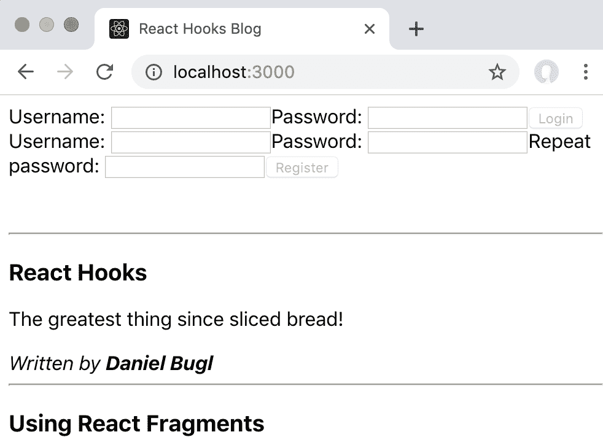
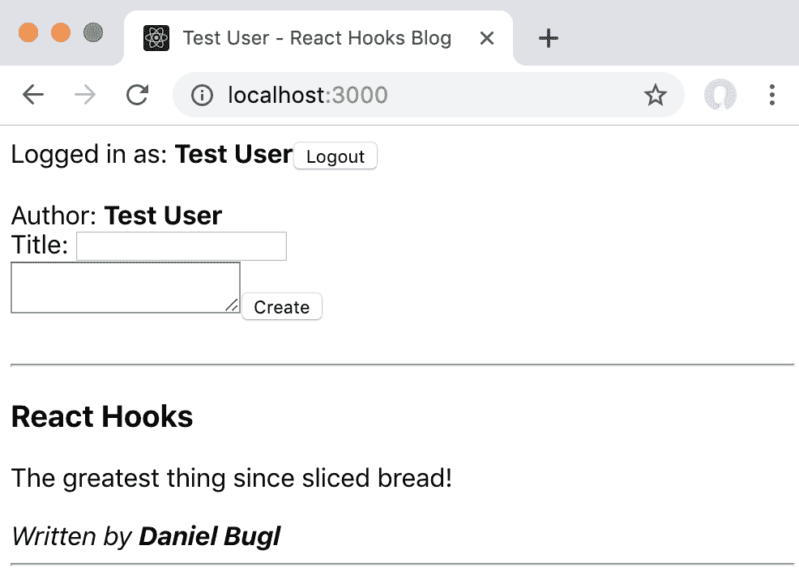

# 第四章：在我们的博客应用中使用 Reducer 和 Effect Hooks

在使用 State Hook 开发我们自己的博客应用之后，我们现在要学习 React 提供的另外两个非常重要的 Hooks：**Reducer**和**Effect** Hooks。我们首先要学习何时应该使用 Reducer Hook 而不是 State Hook。然后，我们学习如何将现有的 State Hook 转换为 Reducer Hook，以便在实践中掌握这个概念。接下来，我们将学习 Effect Hooks 以及它们的用途。最后，我们将在我们的博客应用中实现它们。

本章将涵盖以下主题：

+   学习有关 Reducer Hooks 和 State Hooks 之间的区别

+   在我们的博客应用中实现 Reducer Hooks

+   在我们的博客应用中使用 Effect Hooks

# 技术要求

应该已经安装了相当新的 Node.js 版本（v11.12.0 或更高）。还需要安装 Node.js 的`npm`包管理器。

本章的代码可以在 GitHub 存储库中找到：[`github.com/PacktPublishing/Learn-React-Hooks/tree/master/Chapter04`](https://github.com/PacktPublishing/Learn-React-Hooks/tree/master/Chapter04)[.](https://github.com/PacktPublishing/Learn-React-Hooks/tree/master/Chapter04)

查看以下视频以查看代码的实际运行情况：

[`bit.ly/2Mm9yoC`](http://bit.ly/2Mm9yoC)

请注意，强烈建议您自己编写代码。不要简单地运行提供的代码示例。重要的是您自己编写代码，以便能够正确学习和理解。但是，如果遇到任何问题，您可以随时参考代码示例。

现在，让我们开始本章。

# Reducer Hooks 与 State Hooks

在上一章中，我们学习了如何处理本地和全局状态。我们对两种情况都使用了 State Hooks，这对于简单的状态更改是可以的。然而，当我们的状态逻辑变得更加复杂时，我们需要确保保持状态一致。为了做到这一点，我们应该使用 Reducer Hook 而不是多个 State Hooks，因为很难在彼此依赖的多个 State Hooks 之间保持同步。作为替代方案，我们可以将所有状态保存在一个 State Hook 中，但然后我们必须确保不会意外地覆盖我们状态的部分。

# State Hook 的问题

State Hook 已经支持向其传递复杂对象和数组，并且可以很好地处理它们的状态变化。然而，我们总是需要直接改变状态，这意味着我们需要使用大量的扩展语法，以确保我们不会覆盖状态的其他部分。例如，想象一下，我们有一个这样的状态对象：

```jsx
const [ config, setConfig ] = useState({ filter: 'all', expandPosts: true })
```

现在，我们想要改变过滤器：

```jsx
setConfig({ filter: { byAuthor: 'Daniel Bugl', fromDate: '2019-04-29' } })
```

如果我们简单地运行前面的代码，我们将删除状态的`expandPosts`部分！所以，我们需要做以下操作：

```jsx
setConfig({ ...config, filter: { byAuthor: 'Daniel Bugl', fromDate: '2019-04-29' } })
```

现在，如果我们想要将`fromDate`过滤器更改为不同的日期，我们需要两次使用扩展语法，以避免删除`byAuthor`过滤器：

```jsx
setConfig({ ...config, filter: { ...config.filter, fromDate: '2019-04-30' } })
```

但是，如果我们在`filter`状态仍然是字符串时这样做会发生什么？我们将得到以下结果：

```jsx
{ filter: { '0': 'a', '1': 'l', '2': 'l', fromDate: '2019-04-30' },
  expandPosts: true }
```

什么？为什么突然出现了三个新键—`0`、`1`和`2`？这是因为扩展语法也适用于字符串，它们以这样的方式扩展，即每个字母根据其在字符串中的索引获得一个键。

正如你所想象的那样，对于较大的状态对象，使用扩展语法和直接改变状态对象会变得非常繁琐。此外，我们总是需要确保我们不会引入任何错误，并且需要在应用程序的各个地方检查错误。

# 操作

而不是直接改变状态，我们可以创建一个处理状态变化的函数。这样的函数只允许通过特定操作来改变状态，比如`CHANGE_FILTER`或`TOGGLE_EXPAND`操作。

操作只是具有`type`键的对象，告诉我们我们正在处理哪个操作，并且更详细地描述操作的其他键。

`TOGGLE_EXPAND`操作非常简单。它只是一个定义了`type`的对象：

```jsx
{ type: 'TOGGLE_EXPAND' }
```

`CHANGE_FILTER`操作可以处理我们之前遇到的复杂状态变化问题，如下所示：

```jsx
{ type: 'CHANGE_FILTER', all: true }
{ type: 'CHANGE_FILTER', fromDate: '2019-04-29' }
{ type: 'CHANGE_FILTER', byAuthor: 'Daniel Bugl' }
{ type: 'CHANGE_FILTER', fromDate: '2019-04-30' }
```

第二、第三和第四个操作将把`filter`状态从字符串更改为对象，然后设置相应的键。如果对象已经存在，我们只需调整在操作中定义的键。每个操作后，状态将如下更改：

+   `{ expandPosts: true, filter: 'all' }`

+   `{ expandPosts: true, filter: **{** fromDate: '2019-04-29' **}** }`

+   `{ expandPosts: true, filter: { fromDate: '2019-04-29', byAuthor: 'Daniel Bugl' } }`

+   { expandPosts: true, filter: { fromDate: '2019-04-30', byAuthor: 'Daniel Bugl' } }

现在，看一下以下代码：

```jsx
{ type: 'CHANGE_FILTER', all: true }
```

如果我们分派了另一个 action，就像前面的代码一样，那么状态将回到初始状态中的`all`字符串。

# Reducers

现在，我们仍然需要定义处理这些状态变化的函数。这样的函数被称为 reducer 函数。它以当前的`state`和`action`作为参数，并返回一个新的 state。

如果您熟悉 Redux 库，您可能已经非常熟悉状态、actions 和 reducers 的概念。

现在，我们要定义我们的`reducer`函数：

1.  我们从我们的`reducer`的函数定义开始：

```jsx
function reducer (state, action) {
```

1.  然后，我们使用`switch`语句检查`action.type`：

```jsx
    switch (action.type) {
```

1.  现在，我们要处理`TOGGLE_EXPAND`动作，我们只是切换当前的`expandPosts`状态：

```jsx
        case 'TOGGLE_EXPAND':
            return { ...state, expandPosts: !state.expandPosts }
```

1.  接下来，我们要处理`CHANGE_FILTER`动作。在这里，我们首先需要检查`all`是否设置为`true`，在这种情况下，只需将我们的`filter`设置为`'all'`字符串：

```jsx
        case 'CHANGE_FILTER':
            if (action.all) {
                return { ...state, filter: 'all' }
            }
```

1.  现在，我们必须处理其他`filter`选项。首先，我们检查`filter`变量是否已经是一个`object`。如果不是，我们创建一个新的。否则，我们使用现有的对象：

```jsx
            let filter = typeof state.filter === 'object' ? state.filter : {}
```

1.  然后，我们定义各种过滤器的处理程序，允许同时设置多个过滤器，而不是立即返回新的`state`：

```jsx
            if (action.fromDate) {
                filter = { ...filter, fromDate: action.fromDate }
            }
            if (action.byAuthor) {
                filter = { ...filter, byAuthor: action.byAuthor }
            }
```

1.  最后，我们返回新的`state`：

```jsx
            return { ...state, filter }
```

1.  对于`default`情况，我们抛出错误，因为这是一个未知的动作：

```jsx
        default:
            throw new Error()
    }
}
```

在默认情况下抛出错误与 Redux reducers 的最佳实践不同，在那里我们只会在默认情况下返回当前状态。因为 React Reducer Hooks 不会将所有状态存储在一个对象中，我们只会处理特定状态对象的某些动作，所以我们可以对未知的动作抛出错误。

现在，我们的`reducer`函数已经定义，我们可以继续定义 Reducer Hook。

# Reducer Hook

现在我们已经定义了 actions 和`reducer`函数，我们可以从`reducer`创建一个 Reducer Hook。`useReducer` Hook 的签名如下：

```jsx
const [ state, dispatch ] = useReducer(reducer, initialState)
```

我们唯一还需要定义的是`initialState`；然后我们可以定义一个 Reducer Hook：

```jsx
const initialState = { all: true }
```

现在，我们可以通过使用从 Reducer Hook 返回的`state`对象来访问状态，并通过`dispatch`函数分派 actions，如下所示：

```jsx
dispatch({ type: 'TOGGLE_EXPAND' })
```

如果我们想要向 action 添加其他选项，我们只需将它们添加到 action 对象中：

```jsx
dispatch({ type: 'CHANGE_FILTER', fromDate: '2019-04-30' })
```

正如我们所看到的，使用操作和减速器处理状态变化比直接调整状态对象要容易得多。

# 实现 Reducer Hooks

在了解了操作、减速器和 Reducer Hook 之后，我们将在我们的博客应用程序中实现它们。当状态对象或状态变化变得太复杂时，任何现有的 State Hook 都可以转换为 Reducer Hook。

如果有多个`setState`函数总是同时调用，这是它们应该在一个单独的 Reducer Hook 中分组的一个很好的提示。

全局状态通常是使用 Reducer Hook 的一个很好的候选，而不是 State Hook，因为全局状态的变化可以发生在应用程序的任何地方。然后，在一个地方处理操作并仅更新状态变化逻辑会更容易。将所有状态变化逻辑放在一个地方使得更容易维护和修复错误，而不会因忘记在所有地方更新逻辑而引入新错误。

现在，我们将一些现有的 State Hooks 在我们的博客应用程序中转换为 Reducer Hooks。

# 将 State Hook 转换为 Reducer Hook

在我们的博客应用程序中，我们有两个全局 State Hooks，我们将用 Reducer Hooks 替换它们：

+   `user`状态

+   `posts`状态

我们首先替换`user` State Hook。

# 替换用户 State Hook

我们将从`user` State Hook 开始，因为它比`posts` State Hook 更简单。以后，`user`状态将包含复杂的状态变化，因此在这里使用 Reducer Hook 是有意义的。

首先，我们将定义我们的操作，然后我们将定义减速器函数。最后，我们将用 Reducer Hook 替换 State Hook。

# 定义操作

我们首先定义我们的操作，因为在定义减速器函数时，这些操作将很重要。

现在让我们定义操作：

1.  首先，我们需要一个操作来允许用户通过提供`username`值和`password`值来登录：

```jsx
{ type: 'LOGIN', username: 'Daniel Bugl', password: 'notsosecure' }
```

1.  然后，我们还需要一个`REGISTER`操作，在我们的情况下，它将类似于`LOGIN`操作，因为我们还没有实现任何注册逻辑：

```jsx
{ type: 'REGISTER', username: 'Daniel Bugl', password: 'notsosecure', passwordRepeat: 'notsosecure' }
```

1.  最后，我们将需要一个`LOGOUT`操作，它只是简单地注销当前登录的用户：

```jsx
{ type: 'LOGOUT' }
```

现在，我们已经定义了所有必需的与用户相关的操作，我们可以继续定义减速器函数了。

# 定义减速器

接下来，我们为`user`状态定义一个减速器函数。现在，我们将把我们的减速器放在`src/App.js`文件中。

以后，创建一个单独的`src/reducers.js`文件，甚至是一个单独的`src/reducers/`目录，为每个 reducer 函数创建单独的文件可能是有意义的。

让我们开始定义`userReducer`函数：

1.  在`src/App.js`文件中，在`App`函数定义之前，为`user`状态创建一个`userReducer`函数：

```jsx
function userReducer (state, action) {
```

1.  再次，我们对动作类型使用`switch`语句：

```jsx
    switch (action.type) {
```

1.  然后，我们处理`LOGIN`和`REGISTER`动作，将`user`状态设置为给定的`username`值。在我们的情况下，我们暂时只是从`action`对象中返回`username`值：

```jsx
        case 'LOGIN':
        case 'REGISTER':
            return action.username
```

1.  接下来，我们处理`LOGOUT`动作，将状态设置为空字符串：

```jsx
        case 'LOGOUT':
            return ''
```

1.  最后，当遇到未处理的动作时，我们会抛出一个错误：

```jsx
        default:
            throw new Error()
    }
}
```

现在，`userReducer`函数已经定义，我们可以继续定义 Reducer Hook。

# 定义 Reducer Hook

定义完动作和 reducer 函数后，我们将定义 Reducer Hook，并将其状态和 dispatch 函数传递给需要它的组件。

让我们开始实现 Reducer Hook：

1.  首先，我们需要通过调整`src/App.js`中的以下`import`语句来导入`useReducer` Hook：

```jsx
import React, { useState, useReducer } from 'react'
```

1.  编辑`src/App.js`，移除以下 State Hook：

```jsx
    const [ user, setUser ] = useState('')
```

用 Reducer Hook 替换前面的 State Hook——初始状态是一个空字符串，就像以前一样：

```jsx
    const [ user, dispatchUser ] = useReducer(userReducer, '')
```

1.  现在，将`user`状态和`dispatchUser`函数作为`dispatch`属性传递给`UserBar`组件：

```jsx
            <UserBar user={user} dispatch={dispatchUser} />
```

1.  我们不需要修改`CreatePost`组件，因为我们只是将`user`状态传递给它，而这部分没有改变。

1.  接下来，我们编辑`src/user/UserBar.js`中的`UserBar`组件，并用`dispatch`函数替换`setUser`属性：

```jsx
export default function UserBar ({ user, dispatch }) {
    if (user) {
        return <Logout user={user} dispatch={dispatch} />
    } else {
        return (
            <React.Fragment>
                <Login dispatch={dispatch} />
                <Register dispatch={dispatch} />
            </React.Fragment>
        )
    }
}
```

1.  现在，我们可以编辑`src/user/Login.js`中的`Login`组件，并用`dispatch`函数替换`setUser`函数：

```jsx
export default function Login ({ dispatch }) {
```

1.  然后，我们用`dispatch`函数替换了对`setUser`的调用，派发一个`LOGIN`动作：

```jsx
            <form onSubmit={e => { e.preventDefault(); dispatch({ type: 'LOGIN', username }) }}>
```

我们还可以创建返回动作的函数，即所谓的动作创建者。我们可以简单地调用`loginAction('username')`，而不是每次手动创建动作对象，它会返回相应的`LOGIN`动作对象。

1.  我们在`src/user/Register.js`中的`Register`组件中重复相同的过程：

```jsx
export default function Register ({ dispatch }) {
    // ...
            <form onSubmit={e => { e.preventDefault(); dispatch({ type: 'REGISTER', username }) }}>
```

1.  最后，我们也在`src/user/Logout.js`中的`Logout`组件中重复相同的过程：

```jsx
export default function Logout ({ user, dispatch }) {
    // ...
            <form onSubmit={e => { e.preventDefault(); dispatch({ type: 'LOGOUT' }) }}>
```

现在，我们的应用应该和以前一样工作，但是它使用了 Reducer Hook 而不是简单的 State Hook！

# 替换 posts State Hook

使用 Reducer Hook 来处理`posts`状态也是有道理的，因为以后我们会有一些功能可以用来删除和编辑帖子，所以将这些复杂的状态变化封装起来是很有意义的。现在让我们开始用 Reducer Hook 替换 posts State Hook。

# 定义操作

同样，我们首先定义操作。目前，我们只考虑`CREATE_POST`操作：

```jsx
{ type: 'CREATE_POST', title: 'React Hooks', content: 'The greatest thing since sliced bread!', author: 'Daniel Bugl' }
```

这是我们目前需要的唯一操作。

# 定义 reducer

接下来，我们将以与`user`状态相似的方式定义 reducer 函数：

1.  我们首先编辑`src/App.js`，在那里定义 reducer 函数。以下代码定义了`postsReducer`函数：

```jsx
function postsReducer (state, action) {
    switch (action.type) {
```

1.  在这个函数中，我们将处理`CREATE_POST`操作。我们首先创建一个`newPost`对象，然后使用扩展语法将其插入到当前`posts`状态的开头，类似于我们之前在`src/post/CreatePost.js`组件中所做的方式：

```jsx
        case 'CREATE_POST':
            const newPost = { title: action.title, content: action.content, author: action.author }
            return [ newPost, ...state ]
```

1.  目前，这将是我们在这个 reducer 中处理的唯一操作，所以我们现在可以定义`default`语句：

```jsx
        default:
            throw new Error()
    }
}
```

现在，`postsReducer`函数已经定义，我们可以继续创建 Reducer Hook。

# 定义 Reducer Hook

最后，我们将定义并使用`posts`状态的 Reducer Hook：

1.  我们首先在`src/App.js`中删除以下 State Hook：

```jsx
       const [ posts, setPosts ] = useState(defaultPosts)
```

我们用以下 Reducer Hook 替换它：

```jsx
       const [ posts, dispatchPosts ] = useReducer(postsReducer, defaultPosts)
```

1.  然后，我们将`dispatchPosts`函数作为`dispatch`属性传递给`CreatePost`组件：

```jsx
            {user && <CreatePost user={user} posts={posts} dispatch={dispatchPosts} />}
```

1.  接下来，我们编辑`src/post/CreatePost.js`中的`CreatePost`组件，并用`dispatch`函数替换`setPosts`函数：

```jsx
export default function CreatePost ({ user, posts, dispatch }) {
```

1.  最后，在`handleCreate`函数中使用`dispatch`函数：

```jsx
    function handleCreate () {
        dispatch({ type: 'CREATE_POST', title, content, author: user })
    }
```

现在，`posts`状态也使用 Reducer Hook 而不是 State Hook，并且与以前的方式一样工作！然而，如果以后我们想要添加更多逻辑来管理帖子，比如搜索、过滤、删除和编辑，那么这将更容易做到。

# 示例代码

在我们的博客应用程序中使用 Reducer Hook 的示例代码可以在`Chapter04/chapter4_1`文件夹中找到。

只需运行`npm install`来安装所有依赖项，然后运行`npm start`来启动应用程序；然后在浏览器中访问`http://localhost:3000`（如果没有自动打开）。

# 合并 Reducer Hook

目前，我们有两个不同的 dispatch 函数：一个用于`user`状态，一个用于`posts`状态。在我们的情况下，将这两个 reducers 合并成一个是有意义的，然后调用进一步的 reducers 来处理子状态。

这种模式类似于 Redux 中 reducer 的工作方式，其中我们只有一个包含整个应用程序状态树的对象，在全局状态的情况下是有意义的。然而，对于复杂的局部状态更改，将 reducers 保持分开可能更有意义。

让我们开始将我们的 reducer 函数合并成一个 reducer 函数。在此过程中，让我们将所有 reducers 重构到`src/reducers.js`文件中，以使`src/App.js`文件更易读：

1.  创建一个新的`src/reducers.js`文件。

1.  从`src/App.js`文件中剪切以下代码，并粘贴到`src/reducers.js`文件中：

```jsx
function userReducer (state, action) {
    switch (action.type) {
        case 'LOGIN':
        case 'REGISTER':
            return action.username

        case 'LOGOUT':
            return ''

        default:
            throw new Error()
    }
}

function postsReducer (state, action) {
    switch (action.type) {
        case 'CREATE_POST':
            const newPost = { title: action.title, content: action.content, author: action.author }
            return [ newPost, ...state ]

        default:
            throw new Error()
    }
}
```

1.  编辑`src/reducers.js`，并在现有的 reducer 函数下面定义一个新的 reducer 函数，名为`appReducer`：

```jsx
export default function appReducer (state, action) {
```

1.  在这个`appReducer`函数中，我们将调用另外两个 reducer 函数，并返回完整的状态树：

```jsx
    return {
        user: userReducer(state.user, action),
        posts: postsReducer(state.posts, action)
    }
}
```

1.  编辑`src/App.js`，并在那里导入`appReducer`：

```jsx
import  appReducer  from  './reducers'
```

1.  然后，我们移除以下两个 Reducer Hook 定义：

```jsx
            const [ user, dispatchUser ] = useReducer(userReducer,
             '')
            const [ posts, dispatchPosts = useReducer(postsReducer, 
         defaultPosts)
```

用`appReducer`的单一 Reducer Hook 定义替换前面的 Reducer Hook 定义：

```jsx
    const [ state, dispatch ] = useReducer(appReducer, { user: '', posts: defaultPosts })
```

1.  接下来，我们使用解构从我们的`state`对象中提取`user`和`posts`的值：

```jsx
    const { user, posts } = state
```

1.  现在，我们仍然需要用`dispatch`函数替换我们传递给其他组件的`dispatchUser`和`dispatchPosts`函数：

```jsx
            <UserBar user={user} dispatch={dispatch} />
            <br />
            {user && <CreatePost user={user} posts={posts} dispatch={dispatch} />}
```

我们可以看到，现在只有一个`dispatch`函数和一个单一的状态对象。

# 忽略未处理的 actions

然而，如果我们现在尝试登录，我们将会看到来自`postsReducer`的错误。这是因为我们仍然在未处理的 actions 上抛出错误。为了避免这种情况，我们必须忽略未处理的 actions，简单地返回当前状态：

编辑`src/reducers.js`中的`userReducer`和`postsReducer`函数，并移除以下代码：

```jsx
        default:
            throw new Error()
```

用一个`return`语句替换前面的代码，该语句返回当前的`state`：

```jsx
            default:
                return state
```

我们可以看到，现在我们的应用程序仍然以与以前完全相同的方式工作，但我们正在使用一个单一的 reducer 来处理整个应用程序状态！

# 示例代码

我们博客应用程序中使用单一 Reducer Hook 的示例代码可以在`Chapter04/chapter4_2`文件夹中找到。

只需运行`npm install`以安装所有依赖项，然后运行`npm start`启动应用程序，然后在浏览器中访问`http://localhost:3000`（如果没有自动打开）。

# 使用 Effect Hooks

我们将经常使用的最后一个重要 Hook 是 Effect Hook。 使用 Effect Hook，我们可以从我们的组件执行副作用，例如在组件挂载或更新时获取数据。

在我们的博客案例中，我们将实现一个功能，当我们登录时更新我们网页的标题，以便包含当前登录用户的用户名。

# 记得 componentDidMount 和 componentDidUpdate 吗？

如果您以前使用过 React，您可能已经使用了`componentDidMount`和`componentDidUpdate`生命周期方法。 例如，我们可以使用 React 类组件将文档`title`设置为给定的 prop，如下所示。 在下面的代码部分中，生命周期方法用粗体标出：

```jsx
import React from 'react'

class App extends React.Component {
 componentDidMount () {
 const { title } = this.props document.title = title
 }

    render () {
        return (
            <div>Test App</div>
        )
    }
}
```

这很好。 但是，当`title`prop 更新时，更改不会反映在我们网页的标题中。 为了解决这个问题，我们需要定义`componentDidUpdate`生命周期方法（新代码用粗体标出），如下所示：

```jsx
import React from 'react'

class App extends React.Component {
    componentDidMount () {
        const { title } = this.props
        document.title = title
    }

 componentDidUpdate (prevProps) {
 const { title } = this.props
        if (title !== prevProps.title) {
 document.title = title
        }
 }

    render () {
        return (
            <div>Test App</div>
        )
    }
}
```

您可能已经注意到我们几乎写了相同的代码两次；因此，我们可以创建一个新方法来处理`title`的更新，然后从两个生命周期方法中调用它。 在下面的代码部分中，更新的代码用粗体标出：

```jsx
import React from 'react'

class App extends React.Component {
 updateTitle () {
 const { title } = this.props
 document.title = title
 }

    componentDidMount () {
        this.updateTitle()
    }

    componentDidUpdate (prevProps) {
        if (this.props.title !== prevProps.title) {
 this.updateTitle()
        }
    }

    render () {
        return (
            <div>Test App</div>
        )
    }
}
```

但是，我们仍然需要两次调用`this.updateTitle()`。 当我们稍后更新代码时，例如，向`this.updateTitle()`传递参数时，我们始终需要记住在两次调用方法时传递它。 如果我们忘记更新其中一个生命周期方法，可能会引入错误。 此外，我们需要在`componentDidUpdate`中添加一个`if`条件，以避免在`title`prop 未更改时调用`this.updateTitle()`。

# 使用 Effect Hook

在 Hooks 的世界中，`componentDidMount`和`componentDidUpdate`生命周期方法在`useEffect`Hook 中合并在一起，当不指定依赖数组时，会在组件中的任何 prop 更改时触发。

因此，我们现在可以使用 Effect Hook 定义一个带有 Effect Hook 的函数组件，它与以前的功能相同。 传递给 Effect Hook 的函数称为“effect 函数”：

```jsx
import React, { useEffect } from 'react'

function App ({ title }) {
    useEffect(() => {
        document.title = title
    })

    return (
        <div>Test App</div>
    )
}
```

这就是我们需要做的一切！ 我们定义的 Hook 将在任何 prop 更改时调用我们的 effect 函数。

# 仅在某些 props 更改时触发效果

如果我们想要确保我们的效果函数只在`title` prop 发生变化时才被调用，例如出于性能原因，我们可以指定应该触发更改的值，作为`useEffect` Hook 的第二个参数：

```jsx
    useEffect(() => {
        document.title = title
    }, [title])
```

而且这不仅限于 props，我们可以在这里使用任何值，甚至来自其他 Hooks 的值，比如 State Hook 或 Reducer Hook：

```jsx
    const [ title, setTitle ] = useState('')
    useEffect(() => {
        document.title = title
    }, [title])
```

正如我们所看到的，使用 Effect Hook 比使用生命周期方法处理变化的值要简单得多。

# 仅在挂载时触发效果

如果我们想要复制仅添加`componentDidMount`生命周期方法的行为，而不在 props 更改时触发，我们可以通过将空数组作为`useEffect` Hook 的第二个参数来实现这一点：

```jsx
    useEffect(() => {
        document.title = title
    }, [])
```

传递一个空数组意味着我们的效果函数只会在组件挂载时触发一次，并且不会在 props 更改时触发。然而，与其考虑组件的挂载，使用 Hooks，我们应该考虑效果的依赖关系。在这种情况下，效果没有任何依赖关系，这意味着它只会触发一次。如果一个效果有指定的依赖关系，当任何依赖关系发生变化时，它将再次触发。

# 清理效果

有时效果在组件卸载时需要清理。为此，我们可以从 Effect Hook 的效果函数中返回一个函数。这个返回的函数类似于`componentWillUnmount`生命周期方法：

```jsx
    useEffect(() => {
        const updateInterval = setInterval(() => console.log('fetching update'), updateTime)

        return () => clearInterval(updateInterval)
    }, [updateTime])
```

上面加粗的代码被称为清理函数。清理函数将在组件卸载时调用，并在再次运行效果之前调用。这可以避免 bug，例如`updateTime` prop 发生变化。在这种情况下，先前的效果将被清理，并且将使用更新的`updateTime`值定义一个新的间隔。

# 在我们的博客应用程序中实现一个 Effect Hook

现在我们已经学会了 Effect Hook 的工作原理，我们将在我们的博客应用程序中使用它，以在登录/注销时实现标题更改（当`user`状态发生变化时）。

让我们开始在我们的博客应用程序中实现一个 Effect Hook：

1.  编辑`src/App.js`，并导入`useEffect` Hook：

```jsx
import React, { useReducer, useEffect } from 'react'
```

1.  在定义了我们的`useReducer` Hook 和状态解构之后，定义一个`useEffect` Hook，根据`username`值调整`document.title`变量：

```jsx
    useEffect(() => {
```

1.  如果用户已登录，我们将`document.title`设置为`<username> - React Hooks Blog`。我们使用模板字符串，允许我们通过`${ }`语法在字符串中包含变量或 JavaScript 表达式。模板字符串使用`` ` ``定义：

```jsx
        if (user) {
            document.title = `${user} - React Hooks Blog`
```

4.  否则，如果用户没有登录，我们只需将`document.title`设置为`React Hooks Blog`即可：

```jsx
        } else {
        document.title = 'React Hooks Blog'
        }
```

5.  最后，我们将`user`值作为第二个参数传递给效果挂钩，以确保每当`user`值更新时，我们的效果函数都会再次触发:

```jsx
    }, [user])
```

如果我们现在启动我们的应用程序，我们可以看到`document.title`被设置为`React Hooks Blog`，因为 Effect Hook 在`App`组件挂载时触发，而`user`值尚未定义：



我们的 Effect Hook 的效果：改变网页标题

在使用`Test User`登录后，我们可以看到`document.title`更改为`Test User - React Hooks Blog`：



我们的 Effect Hook 重新触发的效果，用户值更改后

正如我们所看到的，我们的 Effect Hook 在`user`值更改后成功重新触发！

# 示例代码

在我们的博客应用程序中实现 Effect Hooks 的示例代码可以在`Chapter04/chapter4_3`文件夹中找到。

只需运行`npm install`来安装所有依赖项，然后运行`npm start`来启动应用程序，然后在浏览器中访问`http://localhost:3000`（如果没有自动打开）。 

# 总结

在本章中，我们首先学习了 actions、reducers 和 Reducer Hooks。我们还学习了何时应该使用 Reducer Hooks 而不是 State Hooks。然后，我们用两个 Reducer Hooks 替换了现有的全局 State Hooks，用于`user`和`posts`状态。接下来，我们将两个 Reducer Hooks 合并为一个单一的 app Reducer Hook。最后，我们学习了 Effect Hooks，以及它们如何可以代替`componentDidMount`和`componentDidUpdate`。

在下一章中，我们将学习关于 React context，以及如何在 Hooks 中使用它。然后，我们将向我们的应用程序添加 Context Hooks，以避免在多个组件层中传递 props。

# 问题

为了回顾本章学到的内容，请尝试回答以下问题：

1.  State Hooks 有哪些常见问题？

1.  什么是 actions？

1.  什么是 reducer？

1.  何时应该使用 Reducer Hook 而不是 State Hook？

1.  将 State Hook 转换为 Reducer Hook 需要哪些步骤？

1.  我们如何更轻松地创建 actions？

1.  何时应该合并 Reducer Hooks？

1.  在合并 Reducer Hooks 时需要注意什么？

1.  在类组件中，等效于 Effect Hook 的是什么？

1.  使用 Effect Hook 与类组件相比有哪些优势？

# 进一步阅读

如果您对本章探讨的概念更感兴趣，可以查阅以下阅读材料：

+   有关 Reducer Hook 的官方文档：[`reactjs.org/docs/hooks-reference.html#usereducer`](https://reactjs.org/docs/hooks-reference.html#usereducer)

+   官方文档和使用 Effect Hooks 的技巧：[`reactjs.org/docs/hooks-effect.html`](https://reactjs.org/docs/hooks-effect.html)

+   *Learning Redux* 由 *Pa**ckt* 出版，提供有关操作、减速器和管理应用状态的更深入信息：[`www.packtpub.com/web-development/learning-redux`](https://www.packtpub.com/web-development/learning-redux)
