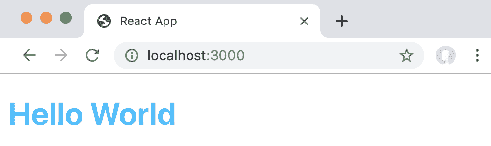
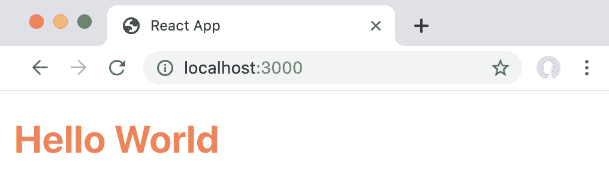
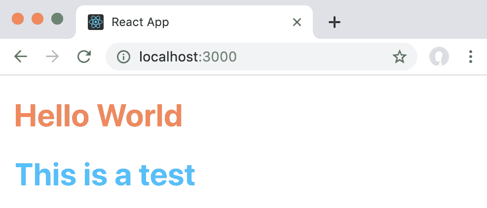
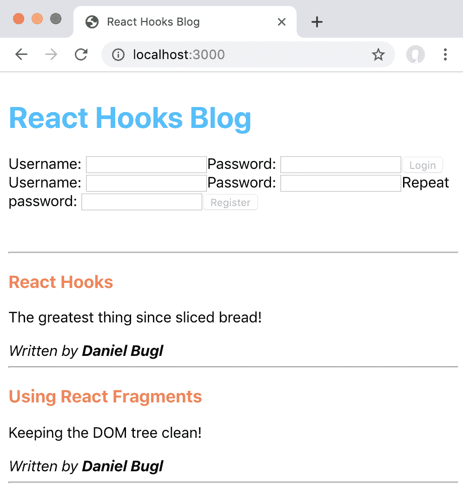
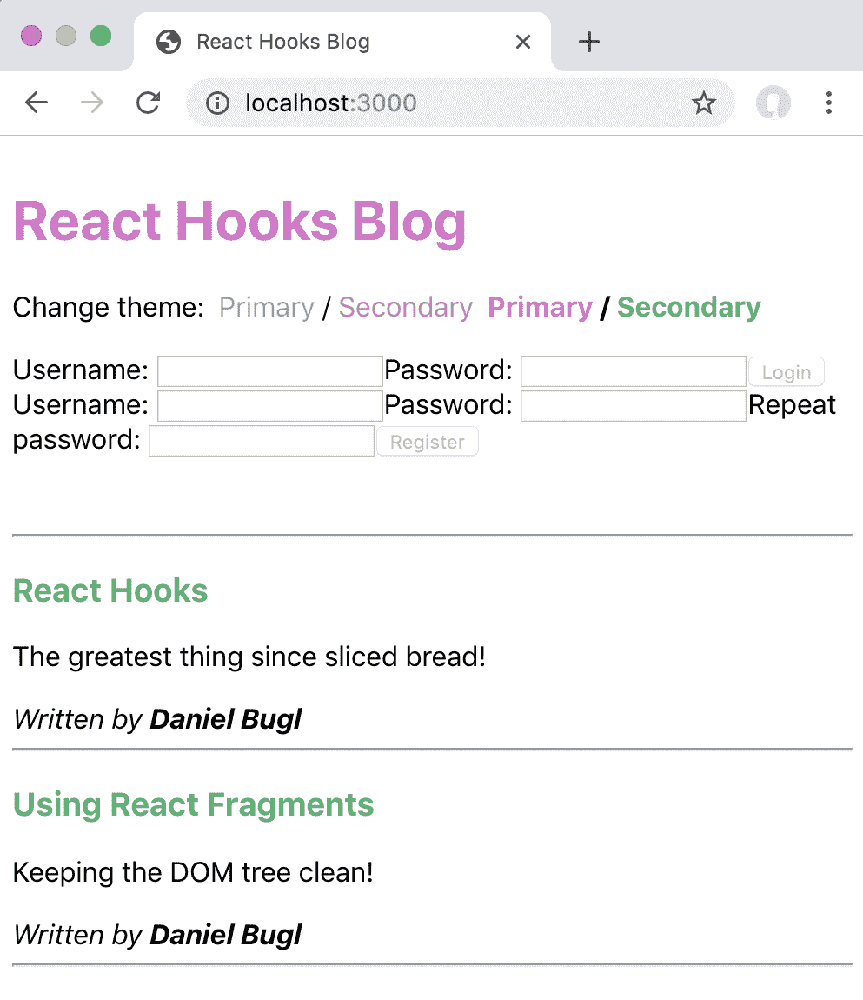

# 第五章：实现 React 上下文

在之前的章节中，我们学习了最基本的 Hooks，比如 State Hook、Reducer Hook 和 Effect Hook。我们使用这些 Hooks 开发了一个小型的博客应用程序。在开发博客应用程序的过程中，我们注意到我们不得不从`App`组件传递`user`状态到`UserBar`组件，然后从`UserBar`组件传递到`Login`、`Register`和`Logout`组件。为了避免这样传递状态，我们现在要学习关于 React 上下文和上下文 Hooks。

我们将首先学习什么是 React 上下文，提供者和消费者是什么。然后，我们将使用上下文 Hooks 作为上下文消费者，并讨论何时应该使用上下文。最后，我们将通过上下文实现主题和全局状态。

本章将涵盖以下主题：

+   引入 React 上下文作为传递 props 的替代方法

+   通过上下文实现主题

+   利用上下文来管理全局状态

# 技术要求

应该已经安装了相当新的 Node.js 版本（v11.12.0 或更高）。还需要安装 Node.js 的`npm`包管理器。

本章的代码可以在 GitHub 存储库中找到：[`github.com/PacktPublishing/Learn-React-Hooks/tree/master/Chapter05`](https://github.com/PacktPublishing/Hands-On-Web-Development-with-Hooks/tree/master/Chapter05)

查看以下视频以查看代码的实际操作：

[`bit.ly/2Mm9yoC`](http://bit.ly/2Mm9yoC)

请注意，强烈建议您自己编写代码。不要简单地运行提供的代码示例。重要的是您自己编写代码，以便能够正确学习和理解。但是，如果遇到任何问题，您可以随时参考代码示例。

现在，让我们开始本章。

# 介绍 React 上下文

在之前的章节中，我们从`App`组件传递了`user`状态和`dispatch`函数到`UserBar`组件；然后从`UserBar`组件传递到`Logout`、`Login`和`Register`组件。React 上下文提供了解决这种繁琐的跨多个组件级别传递 props 的方法，它允许我们在组件之间共享值，而无需通过 props 显式传递它们。正如我们将看到的，React 上下文非常适合在整个应用程序中共享值。

首先，我们将更仔细地看一下传递 props 的问题。然后，我们将介绍 React 上下文作为解决方案。

# 传递 props

在深入学习 React 上下文之前，让我们回顾一下我们在之前章节中实现的内容，以便对上下文解决的问题有所了解：

1.  在`src/App.js`中，我们定义了`user`状态和`dispatch`函数：

```jsx
 const  [  state,  dispatch  ]  =  useReducer(appReducer,  { user:  '', posts:  defaultPosts  })
 const  {  user,  posts  }  =  state
```

1.  然后，我们将`user`状态和`dispatch`函数传递给`UserBar`组件（以及`CreatePost`组件）：

```jsx
    return ( <div  style={{ padding: 8 }}> <UserBar  user={user} dispatch={dispatch**}** /> <br /> {user  && <CreatePost  user={user} posts={posts} dispatch={dispatch**}** />} <br /> <hr /> <PostList  posts={posts} /> </div> )
```

1.  在`src/user/UserBar.js`组件中，我们将`user`状态作为 prop，并将其传递给`Logout`组件。我们还将`dispatch`函数作为 prop，并将其传递给`Logout`、`Login`和`Register`组件：

```jsx
export  default  function  UserBar  ({  user,  dispatch  })  { if (user) { return  <Logout  user={user} dispatch={dispatch**}** /> }  else  { return ( <React.Fragment> <Login  dispatch={dispatch**}** /> <Register  dispatch={dispatch**}** /> </React.Fragment>
        ) } }
```

1.  最后，我们在`Logout`、`Login`和`Register`组件中使用了`dispatch`和`user`props。

React 上下文允许我们跳过步骤 2 和 3，直接从步骤 1 跳到步骤 4。可以想象，对于更大的应用程序，上下文变得更加有用，因为我们可能需要在许多级别上传递 props。

# 介绍 React 上下文

React 上下文用于在 React 组件树中共享值。通常，我们希望共享全局值，例如`user`状态和`dispatch`函数，应用程序的主题或所选择的语言。

React 上下文由两部分组成：

+   提供者，提供（设置）值

+   消费者，消耗（使用）值

首先，我们将看一下上下文是如何工作的，使用一个简单的例子，然后在下一节中，我们将在我们的博客应用中实现它们。我们使用`create-react-app`工具创建一个新项目。在我们的简单示例中，我们将定义一个主题上下文，其中包含应用程序的主要颜色。

# 定义上下文

首先，我们必须定义上下文。自从引入 Hooks 以来，这种工作方式并没有改变。

我们只需使用`React.createContext(defaultValue)`函数创建一个新的上下文对象。我们将默认值设置为`{ primaryColor: 'deepskyblue' }`，因此当没有提供者定义时，我们的默认主要颜色将是`'deepskyblue'`。

在`src/App.js`中，在`App`函数之前添加以下定义：

```jsx
export const ThemeContext = React.createContext({ primaryColor: 'deepskyblue' })
```

请注意，我们在这里导出`ThemeContext`，因为我们将需要导入它作为消费者。

这就是我们使用 React 定义上下文所需做的一切。现在我们只需要定义消费者。

# 定义消费者

现在，我们必须在我们的`Header`组件中定义消费者。现在我们将以传统方式做这个，然后在下一步中使用 Hooks 来定义消费者：

1.  创建一个新的`src/Header.js`文件

1.  首先，我们必须从`App.js`文件中导入`ThemeContext`：

```jsx
import React from 'react'
import { ThemeContext } from './App'
```

1.  现在，我们可以定义我们的组件，在这里我们使用`ThemeContext.Consumer`组件和一个`render`函数作为`children`属性，以便利用上下文值：

```jsx
const Header = ({ text }) => (
    <ThemeContext.Consumer>
        {theme => (
```

1.  在`render`函数中，我们现在可以利用上下文值来设置我们的`Header`组件的`color`样式：

```jsx

            <h1 style={{ color: theme.primaryColor }}>{text}</h1>
        )}
    </ThemeContext.Consumer>
)

export default Header
```

1.  现在，我们仍然需要在`src/App.js`中导入`Header`组件，通过添加以下`import`语句：

```jsx
import Header from './Header'
```

1.  然后，我们用以下代码替换当前的`App`函数：

```jsx
const App = () => (
    <Header text="Hello World" />
)

export default App
```

像这样使用上下文是有效的，但是，正如我们在第一章中学到的那样，以这种方式使用带有`render`函数 props 的组件会使我们的 UI 树混乱，并使我们的应用程序更难以调试和维护。

# 使用 Hooks

使用上下文的更好方法是使用`useContext` Hook！这样，我们可以像使用`useState` Hook 一样使用上下文值：

1.  编辑`src/Header.js`。首先，我们从 React 中导入`useContext` Hook，以及从`src/App.js`中导入`ThemeContext`对象：

```jsx
import React, { useContext } from 'react'
import { ThemeContext } from './App'
```

1.  然后，我们创建我们的`Header`组件，现在我们定义`useContext` Hook：

```jsx
const Header = ({ text }) => {
 const theme = useContext(ThemeContext)
```

1.  我们组件的其余部分将与以前相同，只是现在，我们可以简单地返回我们的`Header`组件，而不需要使用额外的组件来作为消费者：

```jsx
    return <h1 style={{ color: theme.primaryColor }}>{text}</h1>
}

export default Header
```

正如我们所看到的，使用 Hooks 使我们的上下文消费者代码更加简洁。此外，它将更容易阅读，维护和调试。

我们可以看到标题现在的颜色是`deepskyblue`：



一个使用上下文 Hook 的简单应用程序！

正如我们所看到的，我们的主题上下文成功为标题提供了主题。

# 定义提供程序

当没有定义提供程序时，上下文使用传递给`React.createContext`的默认值。当组件没有嵌入在应用程序中时，这对于调试组件非常有用。例如，我们可以调试单个组件作为独立组件。在应用程序中，我们通常希望使用提供程序来提供上下文的值，我们现在将定义它。

编辑`src/App.js`，在我们的`App`函数中，我们简单地用`<ThemeContext.Provider>`组件包装`Header`组件，其中我们将`coral`作为`primaryColor`传递：

```jsx
const App = () => (
    <ThemeContext.Provider value={{ primaryColor: 'coral' }}>
        <Header text="Hello World" />
    </ThemeContext.Provider>
)

export default App
```

我们现在可以看到我们的标题颜色从 `deepskyblue` 变为 `coral`：



我们的提供者改变了标题的颜色

如果我们想要更改上下文的值，我们可以简单地调整传递给`Provider`组件的`value`属性。

请注意，当我们在没有将`value`属性传递给它的情况下定义提供者时，上下文的默认值不会被使用！如果我们定义一个没有`value`属性的提供者，那么上下文的值将是`undefined`。

现在我们已经为我们的上下文定义了单个提供者，让我们继续定义多个嵌套提供者。

# 嵌套提供者

使用 React 上下文，还可以为同一上下文定义多个提供者。使用这种技术，我们可以在应用程序的某些部分覆盖上下文值。让我们考虑之前的例子，并向其添加第二个标题：

1.  编辑 `src/App.js`，并添加第二个 `Header` 组件：

```jsx
const App = () => (
    <ThemeContext.Provider value={{ primaryColor: 'coral' }}>
        <Header text="Hello World" />
 <Header text="This is a test" />
    </ThemeContext.Provider>
)

export default App
```

1.  现在，使用不同的`primaryColor`定义第二个`Provider`组件：

```jsx
const App = () => (
    <ThemeContext.Provider value={{ primaryColor: 'coral' }}>
        <Header text="Hello World" />
 <ThemeContext.Provider value={{ primaryColor: 'deepskyblue' }}> <Header text="This is a test" />
        </ThemeContext.Provider>
    </ThemeContext.Provider>
)

export default App
```

如果我们在浏览器中打开应用程序，第二个标题现在与第一个标题的颜色不同：



使用嵌套提供者覆盖上下文值

正如我们所看到的，我们可以通过定义提供者来覆盖 React 上下文的值。提供者也可以嵌套，因此可以覆盖组件树中较高提供者的值。

# 示例代码

小主题上下文示例的示例代码可以在`Chapter05/chapter5_1`文件夹中找到。

只需运行`npm install`以安装所有依赖项，然后运行`npm start`启动应用程序；然后在浏览器中访问`http://localhost:3000`（如果没有自动打开）。

# 上下文的替代方案

但是，我们应该小心，不要经常使用 React 上下文，因为这会使组件的重用变得更加困难。我们只应在需要在许多不同嵌套级别的组件中访问数据时使用上下文。此外，我们需要确保只使用上下文来存储不经常更改的数据。上下文频繁更改的值可能导致整个组件树重新渲染，从而导致性能问题。因此，对于频繁更改的值，我们应该使用 Redux 或 MobX 等状态管理解决方案。

如果我们只想避免传递 props，我们可以传递渲染的组件而不是数据。例如，假设我们有一个`Page`组件，它渲染一个`Header`组件，后者又渲染一个`Profile`组件，然后渲染一个`Avatar`组件。我们在`Page`组件中得到一个`headerSize`属性，我们需要在`Header`组件中使用它，但也需要在`Avatar`组件中使用它。我们可以这样做，而不是通过多个级别传递 props：

```jsx
function Page ({ headerSize }) {
    const profile = (
        <Profile>
            <Avatar size={headerSize} />
        </Profile>
    )
    return <Header size={headerSize} profile={profile} />
}
```

现在，只有`Page`组件需要知道`headerSize`属性，而且不需要在树中进一步传递。在这种情况下，上下文是不必要的。

这种模式被称为**控制反转**，它可以使您的代码比传递 props 或使用上下文更清晰。然而，我们也不应该总是使用这种模式，因为它会使高级组件变得更加复杂。

# 实现主题

在学习了如何在一个小例子中实现主题之后，我们现在要在我们的博客应用程序中使用 React 上下文和钩子来实现主题。

# 定义上下文

首先，我们必须定义上下文。在我们的博客应用程序中，我们将创建一个单独的文件来定义上下文，而不是在`src/App.js`文件中定义它。将上下文放在单独的文件中可以更容易地在以后进行维护。此外，我们总是知道从哪里导入上下文，因为文件名清晰明了。

让我们开始定义一个主题上下文：

1.  创建一个新的`src/contexts.js`文件。

1.  然后，我们导入`React`：

```jsx
import React from 'react'
```

1.  接下来，我们定义`ThemeContext`。与我们在小例子中一样，我们将默认的`primaryColor`设置为`deepskyblue`。此外，我们将`secondaryColor`设置为`coral`：

```jsx
export const ThemeContext = React.createContext({
    primaryColor: 'deepskyblue',
    secondaryColor: 'coral'
})
```

现在我们已经定义了上下文，我们可以继续定义上下文钩子。

# 定义上下文钩子

在定义上下文之后，我们将使用上下文钩子来定义我们的消费者。我们首先创建一个新的头部组件，然后为现有的`Post`组件定义一个上下文钩子。

# 创建头部组件

首先，我们创建一个新的`Header`组件，它将在我们应用程序的`primaryColor`中显示`React Hooks Blog`。

现在让我们创建`Header`组件：

1.  创建一个新的`src/Header.js`文件。

1.  在这个文件中，我们导入`React`和`useContext`钩子：

```jsx
import React, { useContext } from 'react'
```

1.  接下来，我们从先前创建的`src/contexts.js`文件中导入`ThemeContext`：

```jsx
import { ThemeContext } from `'./contexts'
```

1.  然后，我们定义我们的`Header`组件和上下文钩子。我们不再将上下文值存储在`theme`变量中，而是使用解构直接提取`primaryColor`值：

```jsx
const Header = ({ text }) => {
    const { primaryColor } = useContext(ThemeContext)
```

1.  最后，我们返回`h1`元素，就像我们在我们的小例子中做的那样，并`export` `Header`组件：

```jsx
    return <h1 style={{ color: primaryColor }}>{text}</h1>
}

export default Header
```

现在我们已经定义了`Header`组件，我们可以使用它了。

# 使用`Header`组件

创建`Header`组件后，我们将在`App`组件中使用它，如下所示：

1.  编辑`src/App.js`，并导入`Header`组件：

```jsx
import Header from './Header'
```

1.  然后，在`UserBar`组件之前呈现`Header`组件：

```jsx
    return (
        <div style={{ padding: 8 }}>
            <Header text="React Hooks Blog" />
            <UserBar user={user} dispatch={dispatch} />
```

您可能希望将`React Hooks Blog`值重构为传递给`App`组件的 prop（应用程序配置），因为我们在这个组件中已经使用了三次。

现在，我们的`Header`组件将在应用程序中呈现，我们可以继续在`Post`组件中实现上下文钩子。

# 实现`Post`组件的上下文钩子

接下来，我们希望用辅助颜色显示`Post`标题。为此，我们需要为`Post`组件定义一个上下文钩子，如下所示：

1.  编辑`src/post/Post.js`，并调整`import`语句以导入`useContext`钩子：

```jsx
import React, { useContext } from 'react'
```

1.  接下来，我们导入`ThemeContext`：

```jsx
import { ThemeContext } from '../contexts'
```

1.  然后，在`Post`组件中定义一个上下文钩子，并通过解构从主题中获取`secondaryColor`值：

```jsx
export  default  function  Post  ({  title,  content,  author  })  {
    **const { secondaryColor } = useContext(ThemeContext)** 
```

1.  最后，我们使用`secondaryColor`值来设置我们的`h3`元素的样式：

```jsx
    return (
        <div>
            <h3 style={{ color: secondaryColor }}>{title}</h3>
```

如果我们现在查看我们的应用程序，我们可以看到`ThemeContext`中两种颜色都被正确使用：



我们的 ThemeContext 在行动

正如我们所看到的，我们的应用程序现在使用主标题的主要颜色，以及帖子标题的辅助颜色。

# 定义提供程序

现在，我们的上下文钩子使用上下文指定的默认值，当没有定义提供程序时。为了能够更改值，我们需要定义一个提供程序。

让我们开始定义提供程序：

1.  编辑`src/App.js`，并导入`ThemeContext`：

```jsx
import { ThemeContext } from './contexts'
```

1.  用`ThemeContext.Provider`组件包装整个应用程序，提供与我们之前设置为默认值的相同主题：

```jsx
    return (
 <ThemeContext.Provider value={{ primaryColor: 'deepskyblue', secondaryColor: 'coral' }}> <div style={{ padding: 8 }}>
                <Header text="React Hooks Blog" />
                ...
                <PostList posts={posts} />
            </div>
 </ThemeContext.Provider>
    )
```

我们的应用程序应该看起来和以前完全一样，但现在我们正在使用提供程序中的值！

# 动态更改主题

现在我们已经定义了一个提供程序，我们可以使用它来动态改变主题。我们将不再向提供程序传递静态值，而是使用一个 State Hook 来定义当前主题。然后，我们将实现一个改变主题的组件。

# 使用上下文提供程序的 State Hook

首先，我们将定义一个新的 State Hook，我们将使用它来设置上下文提供程序的值。

让我们定义一个 State Hook，并在上下文提供程序中使用它：

1.  编辑`src/App.js`，并导入`useState` Hook：

```jsx
import React, { useReducer, useEffect, useState } from 'react'
```

1.  在`App`组件的开头定义一个新的 State Hook；在这里，我们将默认值设置为我们的默认主题：

```jsx
export default function App () {
 const [ theme, setTheme ] = useState({
 primaryColor: 'deepskyblue',
 secondaryColor: 'coral'
 })
```

1.  然后，我们将`theme`值传递给`ThemeContext.Provider`组件：

```jsx
    return (
        <ThemeContext.Provider value={theme}>
```

我们的应用程序看起来仍然与以前一样，但现在我们已经准备好动态改变我们的主题了！

# 实现 ChangeTheme 组件

我们主题功能的最后部分是一个组件，可以通过利用我们之前定义的 State Hook 来动态改变主题。State Hook 将重新渲染`App`组件，这将改变传递给`ThemeContext.Provider`的值，进而重新渲染所有使用`ThemeContext` Context Hook 的组件。

让我们开始实现`ChangeTheme`组件：

1.  创建一个新的`src/ChangeTheme.js`文件。

1.  和往常一样，我们必须先导入`React`，然后才能定义一个组件：

```jsx
import React from 'react'
```

1.  为了能够轻松地以后添加新的主题，我们将创建一个常量`THEMES`数组，而不是手动复制和粘贴不同主题的代码。这将使我们的代码更加简洁，更易于阅读：

```jsx
const THEMES = [
    { primaryColor: 'deepskyblue', secondaryColor: 'coral' },
    { primaryColor: 'orchid', secondaryColor: 'mediumseagreen' }
]
```

给硬编码的常量值一个特殊的名称是个好主意，比如用大写字母写整个变量名。以后，将所有这些可配置的硬编码值放在一个单独的`src/config.js`文件中可能是有意义的。

1.  接下来，我们定义一个组件来渲染单个`theme`：

```jsx
function ThemeItem ({ theme, active, onClick }) {
```

1.  在这里，我们渲染一个链接，并显示主题的小预览，显示主要颜色和次要颜色：

```jsx
    return (
        <span onClick={onClick} style={{ cursor: 'pointer', paddingLeft: 8, fontWeight: active ? 'bold' : 'normal' }}>
            <span style={{ color: theme.primaryColor }}>Primary</span> / <span style={{ color: theme.secondaryColor }}>Secondary</span>
        </span>
    )
}
```

在这里，我们将光标设置为`pointer`，以使元素看起来可点击。我们也可以使用`<a>`元素；但是，如果我们没有有效的链接目标，比如一个单独的页面，这是不推荐的。

1.  然后，我们定义`ChangeTheme`组件，它接受`theme`和`setTheme` props：

```jsx
export default function ChangeTheme ({ theme, setTheme }) {
```

1.  接下来，我们定义一个函数来检查一个主题对象是否是当前活动的主题：

```jsx
    function isActive (t) {
        return t.primaryColor === theme.primaryColor && t.secondaryColor === theme.secondaryColor
    }
```

1.  现在，我们使用`.map`函数来渲染所有可用的主题，并在点击它们时调用`setTheme`函数：

```jsx
    return (
        <div>
            Change theme:
            {THEMES.map((t, i) =>
                <ThemeItem key={'theme-' + i} theme={t} active={isActive(t)} onClick={() => setTheme(t)} />
            )}
        </div>
    )
}
```

1.  最后，在`src/App.js`中的`Header`组件之后导入并渲染`ChangeTheme`组件：

```jsx
import ChangeTheme from './ChangeTheme'
// ...
    return (
        <ThemeContext.Provider value={theme}>
            <div style={{ padding: 8 }}>
                <Header text="React Hooks Blog" />
                <ChangeTheme theme={theme} setTheme={setTheme} />
                <br /> 
```

我们可以看到，我们现在有一种方法可以在我们的应用程序中更改主题：



我们在更改主题后，使用上下文钩子与状态钩子相结合

现在，我们有一个通过 Hooks 消耗的上下文，也可以通过 Hooks 进行更改！

# 示例代码

我们的博客应用程序中主题功能的示例代码可以在`Chapter05/chapter5_2`文件夹中找到。

只需运行`npm install`以安装所有依赖项，然后运行`npm start`启动应用程序；然后在浏览器中访问`http://localhost:3000`（如果没有自动打开）。

# 使用上下文进行全局状态

在学习了如何使用 React 上下文在我们的博客应用程序中实现主题之后，我们现在将使用上下文来避免手动传递`state`和`dispatch` props 以用于全局应用程序状态。

# 定义 StateContext

我们首先在我们的`src/contexts.js`文件中定义上下文。

在`src/contexts.js`中，我们定义了`StateContext`，它将存储`state`值和`dispatch`函数：

```jsx
export const StateContext = React.createContext({
    state: {},
    dispatch: () => {}
})
```

我们将`state`值初始化为空对象，并将`dispatch`函数初始化为空函数，当没有提供程序时将使用它。

# 定义上下文提供程序

现在，我们将在我们的`src/App.js`文件中定义上下文提供程序，该提供程序将从现有的 Reducer Hook 中获取值。

现在让我们为全局状态定义上下文提供程序：

1.  在`src/App.js`中，通过调整现有的`import`语句导入`StateContext`：

```jsx
import  {  ThemeContext**, StateContext**  }  from  './contexts'
```

1.  然后，我们通过从我们的`App`函数中返回它来定义一个新的上下文提供程序：

```jsx
    return (
 <StateContext.Provider value={{ state, dispatch }}>
            <ThemeContext.Provider value={theme}>
                ...
            </ThemeContext.Provider>
 </StateContext.Provider>
    )
```

现在，我们的上下文提供程序为我们的整个应用程序提供了`state`对象和`dispatch`函数，我们可以继续使用上下文值。

# 使用 StateContext

现在，我们已经定义了我们的上下文和提供程序，我们可以在各种组件中使用`state`对象和`dispatch`函数。

我们首先删除在`src/App.js`中手动传递给组件的 props。删除以下用粗体标记的代码段：

```jsx
        <div style={{ padding: 8 }}>
            <Header text="React Hooks Blog" />
            <ChangeTheme theme={theme} setTheme={setTheme} />
            <br />
            <UserBar user={user} dispatch={dispatch} />
            <br />
            {user && <CreatePost user={user} posts={posts} dispatch={dispatch} />}
            <br />
            <hr />
            <PostList posts={posts} />
        </div>
```

由于我们正在使用上下文，因此不再需要手动传递 props。我们现在可以继续重构组件。

# 重构用户组件

首先，我们重构用户组件，然后再转向帖子组件。

现在让我们重构与用户相关的组件：

1.  编辑`src/user/UserBar.js`，并且移除那里的 props（加粗标记的代码应该被移除），因为我们不再需要手动传递它们了：

```jsx
export  default  function  UserBar  (**{** user,  dispatch **}**)  {
 if (user) { return  <Logout  user={user} dispatch={dispatch**}** /> }  else  { return ( <React.Fragment> <Login  dispatch={dispatch**}** /> <Register  dispatch={dispatch**}** /> </React.Fragment> ) } } 
```

1.  然后，我们在`src/user/UserBar.js`中导入`useContext` Hook 和`StateContext`，以便能够判断用户是否已登录：

```jsx
import React, { useContext } from 'react'
import { StateContext } from '../contexts'
```

1.  现在，我们可以使用 Context Hook 从我们的`state`对象中获取`user`状态：

```jsx
export default function UserBar () {
 const { state } = useContext(StateContext)
 const { user } = state
```

1.  同样地，我们在`src/user/Login.js`中导入`useContext`和`StateContext`：

```jsx
import React, { useState, useContext } from 'react'
import { StateContext } from '../contexts'
```

1.  然后，我们移除`dispatch` prop，并使用 Context Hook 代替：

```jsx
export default function Login () {
 const { dispatch } = useContext(StateContext)
```

1.  我们在`src/user/Register.js`组件中重复相同的过程：

```jsx
import React, { useState, useContext } from 'react'
import { StateContext } from '../contexts' export default function Register () { const { dispatch } = useContext(StateContext) 
```

1.  在`src/user/Logout.js`组件中，我们做同样的事情，但也从`state`对象中获取`user`状态：

```jsx
import React, { useContext } from 'react'
import { StateContext } from '../contexts' export default function Logout () { const { state, dispatch } = useContext(StateContext)
    const { user } = state 
```

我们的与用户相关的组件现在使用上下文而不是 props。让我们继续重构与帖子相关的组件。

# 重构帖子组件

现在，唯一剩下的就是重构帖子组件；然后我们整个应用程序都将使用 React 上下文来管理全局状态：

1.  我们从`src/post/PostList.js`组件开始，导入`useContext`和`StateContext`，移除 props，并使用 Context Hook 代替：

```jsx
import React, { useContext } from 'react'
import { StateContext } from '../contexts'

import Post from './Post'

export default function PostList () {
 const { state } = useContext(StateContext)
 const { posts } = state
```

1.  我们对`CreatePost`组件做同样的事情，这是我们需要重构的最后一个组件：

```jsx
import React, { useState, useContext } from 'react'
import { StateContext } from '../contexts'

export default function CreatePost () {
 const { state, dispatch } = useContext(StateContext)
 const { user } = state
```

我们的应用程序的工作方式与以前相同，但现在我们使用上下文来管理全局状态，这使我们的代码更清晰，并避免了必须传递 props！

# 示例代码

我们博客应用程序中全局状态上下文的示例代码可以在`Chapter05/chapter5_3`文件夹中找到。

只需运行`npm install`以安装所有依赖项，然后运行`npm start`启动应用程序；然后在浏览器中访问`http://localhost:3000`（如果没有自动打开）。

# 总结

在本章中，我们首先学习了 React 上下文作为在多个级别的 React 组件之间传递 props 的替代方法。然后，我们学习了上下文提供者和消费者，以及通过 Hooks 定义消费者的新方法。接下来，我们学习了何时不应该使用上下文，以及何时应该使用控制反转。然后，我们通过在博客应用程序中实现主题来实践所学的知识。最后，我们在博客应用程序中使用 React 上下文进行全局状态管理。

在下一章中，我们将学习如何使用 React 和 Hooks 从服务器请求数据。然后，我们将学习`React.memo`来防止组件不必要地重新渲染，以及 React Suspense 来在需要时延迟加载组件。

# 问题

为了总结本章学到的知识，请尝试回答以下问题：

1.  上下文避免了哪些问题？

1.  上下文由哪两部分组成？

1.  使用上下文时，两部分都必须定义吗？

1.  使用 Hooks 而不是传统上下文消费者的优势是什么？

1.  上下文的替代方案是什么，何时应该使用它？

1.  我们如何实现动态更改上下文？

1.  何时使用上下文来管理状态是有意义的？

# 进一步阅读

如果您对本章中探讨的概念感兴趣，可以查看以下阅读材料：

+   React 上官方文档关于上下文：[`reactjs.org/docs/context.html`](https://reactjs.org/docs/context.html)

+   有关组合与继承的更多信息：[`reactjs.org/docs/composition-vs-inheritance.html`](https://reactjs.org/docs/composition-vs-inheritance.html)

+   HTML 颜色代码列表（如果您想定义新主题）：[`www.rapidtables.com/web/color/html-color-codes.html.`](https://www.rapidtables.com/web/color/html-color-codes.html)
