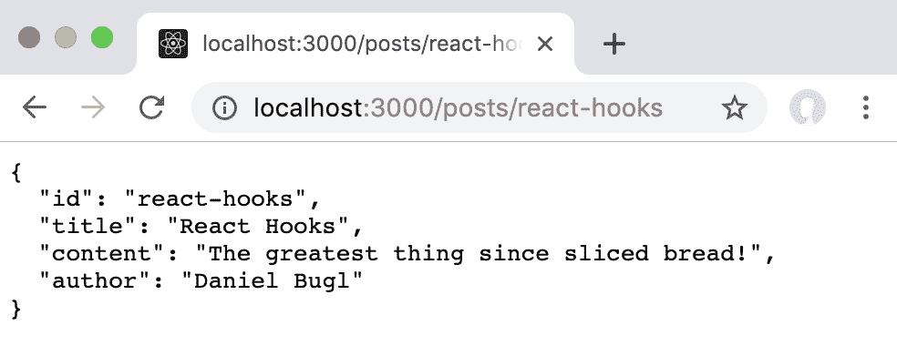
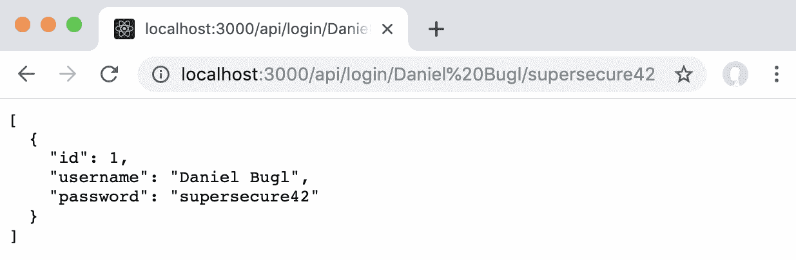
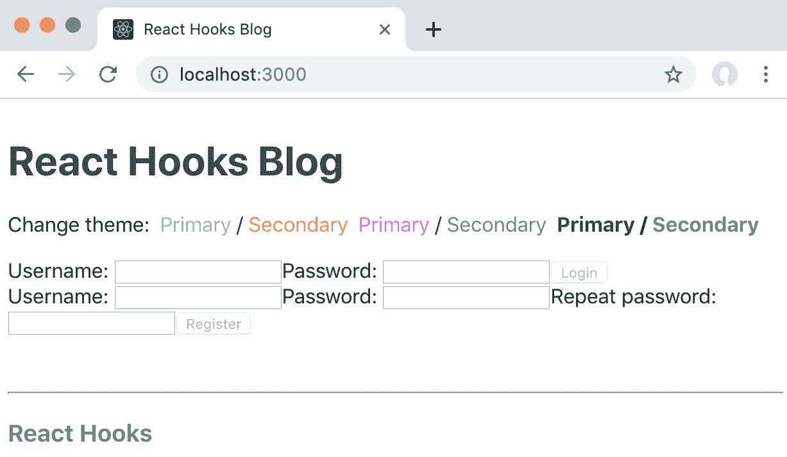
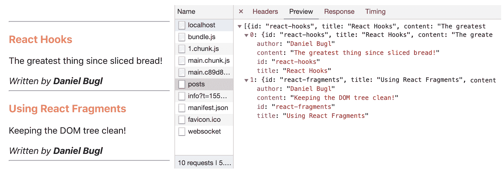
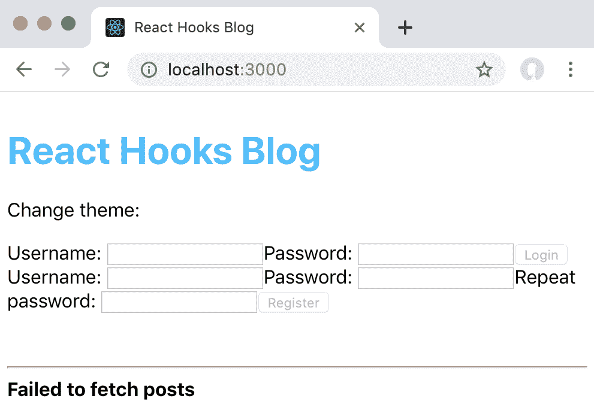
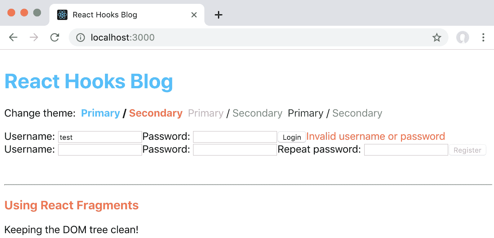
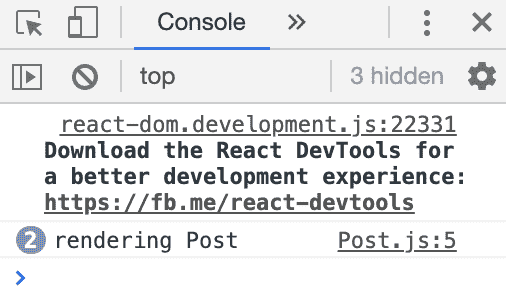
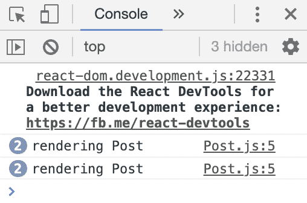
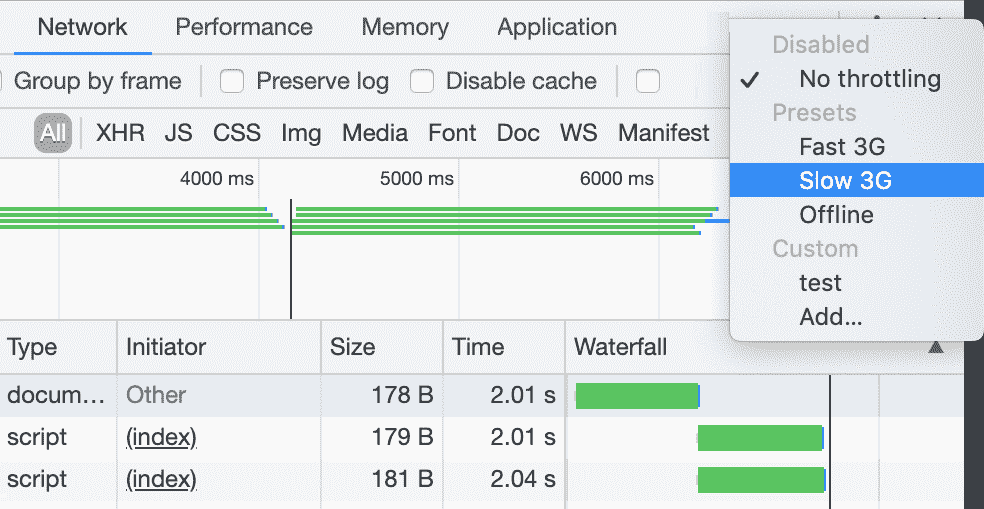
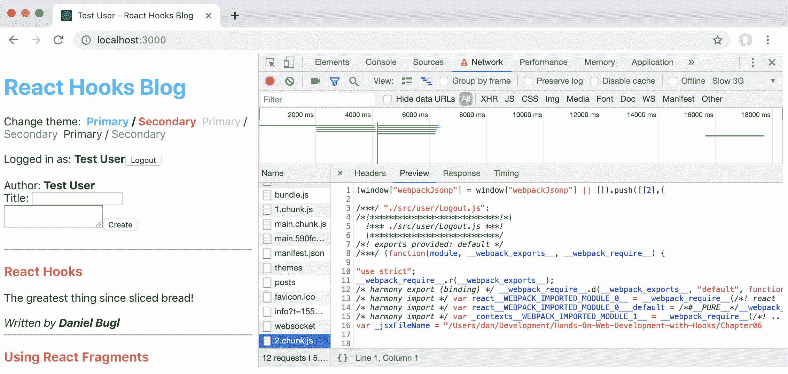

# 第六章：实现请求和 React Suspense

在之前的章节中，我们学习了如何使用 React 上下文作为手动传递 props 的替代方法。我们了解了上下文提供者、消费者以及如何使用 Hooks 作为上下文消费者。接下来，我们学习了作为上下文替代方法的控制反转。最后，我们在博客应用程序中使用上下文实现了主题和全局状态。

在本章中，我们将设置一个简单的后端服务器，该服务器将从**JavaScript 对象表示**（**JSON**）文件中生成，使用`json-server`工具。然后，我们将通过使用 Effect Hook 结合 State Hook 来实现请求资源。接下来，我们将使用`axios`和`react-request-hook`库做同样的事情。最后，我们将通过使用`React.memo`来防止不必要的重新渲染，并通过 React Suspense 来懒加载组件。

本章将涵盖以下主题：

+   使用 Hooks 请求资源

+   使用`React.memo`防止不必要的重新渲染

+   使用 React Suspense 实现延迟加载

# 技术要求

应该已经安装了相当新的 Node.js 版本（v11.12.0 或更高）。还需要安装 Node.js 的`npm`包管理器。

本章的代码可以在 GitHub 存储库中找到：[`github.com/PacktPublishing/Learn-React-Hooks/tree/master/Chapter06`](https://github.com/PacktPublishing/Learn-React-Hooks/tree/master/Chapter06)[.](https://github.com/PacktPublishing/Learn-React-Hooks/tree/master/Chapter06)

查看以下视频，了解代码的运行情况：

[`bit.ly/2Mm9yoC`](http://bit.ly/2Mm9yoC)

请注意，强烈建议您自己编写代码。不要简单地运行提供的代码示例。重要的是您自己编写代码，以便您能够正确学习和理解。但是，如果遇到任何问题，您可以随时参考代码示例。

现在，让我们开始本章。

# 使用 Hooks 请求资源

在本节中，我们将学习如何使用 Hooks 从服务器请求资源。首先，我们将只使用 JavaScript 的`fetch`函数和`useEffect`/`useState` Hooks 来实现请求。然后，我们将学习如何使用`axios`库结合`react-request-hook`来请求资源。

# 设置虚拟服务器

在我们实现请求之前，我们需要创建一个后端服务器。由于我们目前专注于用户界面，我们将设置一个虚拟服务器，这将允许我们测试请求。我们将使用`json-server`工具从 JSON 文件创建一个完整的**表述状态转移**（**REST**）API。

# 创建 db.json 文件

为了能够使用`json-server`工具，首先我们需要创建一个`db.json`文件，其中将包含服务器的完整数据库。`json-server`工具将允许您执行以下操作：

+   `GET`请求，用于从文件中获取数据

+   `POST`请求，用于将新数据插入文件中

+   `PUT`和`PATCH`请求，用于调整现有数据

+   删除请求，用于删除数据

对于所有修改操作（`POST`，`PUT`，`PATCH`和`DELETE`），更新后的文件将由工具自动保存。

我们可以使用我们为帖子定义的默认状态作为帖子减速器的现有结构。但是，我们需要确保提供一个`id`值，以便稍后可以查询数据库：

```jsx
[ { **"id": "react-hooks",** "title": "React Hooks", "content":  "The greatest thing since sliced bread!", "author":  "Daniel Bugl"  }, { **"id": "react-fragments",** "title":  "Using React Fragments", "content":  "Keeping the DOM tree clean!", "author":  "Daniel Bugl"  } ]
```

至于用户，我们需要想出一种存储用户名和密码的方法。为简单起见，我们只是以明文形式存储密码（在生产环境中不要这样做！）。在这里，我们还需要提供一个`id`值：

```jsx
[
    { "id": 1, "username": "Daniel Bugl", "password": "supersecure42" }
]
```

此外，我们将在我们的数据库中存储主题。为了调查是否正确地从我们的数据库中提取主题，我们现在将定义第三个主题。和往常一样，每个主题都需要一个`id`值：

```jsx
[
    { "id": 1, "primaryColor": "deepskyblue", "secondaryColor": "coral" },
    { "id": 2, "primaryColor": "orchid", "secondaryColor": "mediumseagreen" },
    { "id": 3, "primaryColor": "darkslategray", "secondaryColor": "slategray" }
]
```

现在，我们只需要将这三个数组合并成一个单独的 JSON 对象，将帖子数组存储在`posts`键下，将用户数组存储在`users`键下，将主题数组存储在`themes`键下。

让我们开始创建用作后端服务器数据库的 JSON 文件：

1.  在我们应用程序文件夹的根目录中创建一个新的`server/`目录。

1.  创建一个`server/db.json`文件，其中包含以下内容。我们可以使用 Reducer Hook 中的现有状态。但是，由于这是一个数据库，我们需要为每个元素提供一个`id`值（用粗体标记）：

```jsx
{
    "posts": [ { **"id": "react-hooks",** "title": "React Hooks", "content":  "The greatest thing since sliced bread!", "author":  "Daniel Bugl"  }, { **"id": "react-fragments",** "title":  "Using React Fragments", "content":  "Keeping the DOM tree clean!", "author":  "Daniel Bugl"  }
 ],
    "users": [
        { "id": 1, "username": "Daniel Bugl", "password": "supersecure42" }
    ],
    "themes": [
        { "id": 1, "primaryColor": "deepskyblue", "secondaryColor": "coral" },
        { "id": 2, "primaryColor": "orchid", "secondaryColor": "mediumseagreen" },
        { "id": 3, "primaryColor": "darkslategray", "secondaryColor": "slategray" }
    ]
}
```

对于`json-server`工具，我们只需要一个 JSON 文件作为数据库，该工具将为我们创建一个完整的 REST API。

# 安装 json-server 工具

现在，我们将通过使用`json-server`工具安装并启动我们的后端服务器：

1.  首先，我们将通过`npm`安装`json-server`工具：

```jsx
> npm install --save json-server
```

1.  现在，我们可以通过调用以下命令启动我们的后端服务器：

```jsx
>npx json-server --watch server/db.json
```

`npx`命令执行在项目中本地安装的命令。我们需要在这里使用`npx`，因为我们没有全局安装`json-server`工具（通过`npm install -g json-server`）。

我们执行了`json-server`工具，并让它监视我们之前创建的`server/db.json`文件。`--watch`标志意味着它将监听文件的更改，并自动刷新。

现在，我们可以转到`http://localhost:3000/posts/react-hooks`来查看我们的帖子对象：



我们简单的 JSON 服务器正在工作并提供帖子！

正如我们所看到的，这个工具为我们从数据库 JSON 文件创建了一个完整的 REST API！

# 配置 package.json

接下来，我们需要调整我们的`package.json`文件，以便启动服务器，以及我们的客户端（通过`webpack-dev-server`运行）。

让我们开始调整`package.json`文件：

1.  首先，我们通过将其插入到`package.json`文件的`scripts`部分中来创建一个名为`start:server`的新包脚本。我们还确保更改端口，以便它不在与我们的客户端相同的端口上运行：

```jsx
    "scripts": {
        "start:server": "npx json-server --watch server/db.json --port 4000",
        "start": "react-scripts start",
```

1.  然后，我们将`start`脚本重命名为`start:client`：

```jsx
    "scripts": {
        "start:server": "npx json-server --watch server/db.json",
        "start:client": "react-scripts start",
```

1.  接下来，我们安装一个名为`concurrently`的工具，它可以让我们同时启动服务器和客户端：

```jsx
> npm install --save concurrently
```

1.  现在，我们可以使用`concurrently`命令定义一个新的`start`脚本，然后将服务器和客户端命令作为参数传递给它：

```jsx
    "scripts": {
 "start": "npx concurrently \"npm run start:server\" \"npm run start:client\"",
```

现在，运行`npm start`将运行客户端，以及后端服务器。

# 配置代理

最后，我们必须定义一个代理，以确保我们可以从与客户端相同的**统一资源定位符（URL）**请求我们的 API。这是必需的，否则，我们将不得不处理跨站点请求，这更加复杂。我们将定义一个代理，将从`http://localhost:3000/api/`转发请求到`http://localhost:4000/`。

现在，让我们配置代理：

1.  首先，我们必须安装`http-proxy-middleware`包：

```jsx
> npm install --save http-proxy-middleware
```

1.  然后，我们创建一个新的`src/setupProxy.js`文件，内容如下：

```jsx
const proxy = require('http-proxy-middleware')

module.exports = function (app) {
    app.use(proxy('/api', {
```

1.  接下来，我们必须定义代理的目标，即后端服务器，运行在`http://localhost:4000`上：

```jsx
        target: 'http://localhost:4000',
```

1.  最后，我们必须定义一个路径重写规则，它在转发请求到我们的服务器之前移除了`/api`前缀：

```jsx
        pathRewrite: { '^/api': '' }
    }))
}
```

前面的代理配置将`/api`链接到我们的后端服务器；因此，我们现在可以通过以下命令同时启动服务器和客户端：

```jsx
> npm start
```

然后，我们可以通过打开`http://localhost:3000/api/posts/react-hooks`来访问 API！

# 定义路由

默认情况下，`json-server`工具定义了以下路由：[`github.com/typicode/json-server#routes`](https://github.com/typicode/json-server#routes)。

我们还可以通过创建一个`routes.json`文件来定义自己的路由，我们可以将现有路由重写为其他路由：[`github.com/typicode/json-server#add-custom-routes`](https://github.com/typicode/json-server#add-custom-routes)。

对于我们的博客应用程序，我们将定义一个单独的自定义路由：`/login/:username/:password`。我们将把这个路由链接到一个`/users?username=:username&password=:password`查询，以便找到具有给定用户名和密码组合的用户。

现在我们将为我们的应用程序定义自定义登录路由：

1.  创建一个新的`server/routes.json`文件，内容如下：

```jsx
{
    "/login/:username/:password": "/users?username=:username&password=:password"
}
```

1.  然后，调整`package.json`文件中的`start:server`脚本，并添加`--routes`选项，如下所示：

```jsx
        "start:server": "npx json-server --watch server/db.json --port 4000 --routes server/routes.json",
```

现在，我们的服务器将为我们提供自定义登录路由，我们将在本章后面使用它！我们可以尝试通过在浏览器中打开以下 URL 来登录：`http://localhost:3000/api/login/Daniel%20Bugl/supersecure42`。这将返回一个用户对象；因此，登录成功了！

我们可以在浏览器中看到用户对象以文本形式返回：



直接在浏览器中访问我们的自定义路由

正如我们所看到的，访问我们的自定义路由是有效的！我们现在可以使用它来登录用户。

# 示例代码

示例代码可以在`Chapter06/chapter6_1`文件夹中找到。

只需运行`npm install`来安装所有依赖项，然后运行`npm start`来启动应用程序；然后在浏览器中访问`http://localhost:3000`（如果没有自动打开）。

# 使用 Effect 和 State/Reducer Hooks 实现请求

在我们使用库来使用 Hooks 实现请求之前，我们将手动实现它们，使用 Effect Hook 来触发请求，使用 State/Reducer Hooks 来存储结果。

# 使用 Effect 和 State Hooks 进行请求

首先，我们将从服务器请求主题，而不是硬编码主题列表。

让我们使用 Effect Hook 和 State Hook 来实现请求主题：

1.  在`src/ChangeTheme.js`文件中，调整 React 的`import`语句，以便导入`useEffect`和`useState` Hooks：

```jsx
import React, { useEffect, useState } from 'react'
```

1.  删除`THEMES`常量，即以下所有代码：

```jsx
const  THEMES  = [ { primaryColor:  'deepskyblue', secondaryColor:  'coral'  }, { primaryColor:  'orchid', secondaryColor:  'mediumseagreen'  } ] 
```

1.  在`ChangeTheme`组件中，定义一个新的`useState` Hook 来存储主题：

```jsx
export default function ChangeTheme ({ theme, setTheme }) {
 const [ themes, setThemes ] = useState([])
```

1.  然后定义一个`useEffect` Hook，我们将在其中进行请求：

```jsx
    useEffect(() => {
```

1.  在这个 Hook 中，我们使用`fetch`来请求一个资源；在这种情况下，我们请求`/api/themes`：

```jsx
        fetch('/api/themes')
```

1.  Fetch 利用了 Promise API；因此，我们可以使用`.then()`来处理结果。首先，我们必须将结果解析为 JSON：

```jsx
            .then(result => result.json())
```

1.  最后，我们使用来自我们请求的主题数组调用`setThemes`：

```jsx
            .then(themes => setThemes(themes))
```

我们还可以将前面的函数缩短为`.then(setThemes)`，因为我们只传递了从`.then()`中获取的`themes`参数。

1.  目前，这个 Effect Hook 应该只在组件挂载时触发，所以我们将空数组作为第二个参数传递给`useEffect`。这确保了 Effect Hook 没有依赖项，因此只会在组件挂载时触发：

```jsx
    }, [])
```

1.  现在，唯一剩下的事情就是用我们从 Hook 中获取的`themes`值替换`THEMES`常量：

```jsx
            {themes.map(t =>
```

正如我们所看到的，现在有三个主题可用，都是通过我们的服务器从数据库加载的：



使用 Hooks 从我们的服务器加载了三个主题！

我们的主题现在是从后端服务器加载的，我们可以继续通过 Hooks 请求帖子。

# 使用 Effect 和 Reducer Hooks 进行请求

现在，我们将使用后端服务器来请求帖子数组，而不是将其硬编码为`postsReducer`的默认值。

让我们使用 Effect Hook 和 Reducer Hook 来请求帖子：

1.  **删除**`src/App.js`中的`defaultPosts`常量定义，即以下所有代码：

```jsx
const  defaultPosts  = [ { title:  'React Hooks', content:  'The greatest thing since sliced bread!', author:  'Daniel Bugl'  }, { title:  'Using React Fragments', content:  'Keeping the DOM tree clean!', author:  'Daniel Bugl'  } ]
```

1.  用一个空数组替换`useReducer`函数中的`defaultPosts`常量：

```jsx
 const  [  state,  dispatch  ]  =  useReducer(appReducer,  { user:  '', posts:  []  })
```

1.  在`src/reducers.js`中，在`postsReducer`函数中定义一个新的动作类型，称为`FETCH_POSTS`。这个动作类型将用新的帖子数组替换当前状态：

```jsx
function postsReducer (state, action) {
    switch (action.type) {
 case 'FETCH_POSTS':
 return action.posts
```

1.  在`src/App.js`中，定义一个新的`useEffect` Hook，位于当前的 Hook 之前：

```jsx
    useEffect(() => {
```

1.  在这个 Hook 中，我们再次使用`fetch`来请求一个资源；在这种情况下，我们请求`/api/posts`：

```jsx
        fetch('/api/posts')
            .then(result => result.json())
```

1.  最后，我们使用来自我们请求的`posts`数组分派了一个`FETCH_POSTS`动作：

```jsx
            .then(posts => dispatch({ type: 'FETCH_POSTS', posts }))
```

1.  目前，这个 Effect Hook 应该只在组件挂载时触发，所以我们将空数组作为第二个参数传递给`useEffect`：

```jsx
    }, [])
```

正如我们所看到的，现在帖子是从服务器请求的！我们可以查看 DevTools Network 标签以查看请求：



从我们的服务器请求帖子！

现在从后端服务器请求帖子。在下一节中，我们将使用`axios`和`react-request-hook`从服务器请求资源。

# 示例代码

示例代码可以在`Chapter06/chapter6_2`文件夹中找到。

只需运行`npm install`以安装所有依赖项，然后运行`npm start`启动应用程序；然后在浏览器中访问`http://localhost:3000`（如果没有自动打开）。

# 使用 axios 和 react-request-hook

在上一节中，我们使用 Effect Hook 触发请求，并使用 Reducer/State Hook 从请求的结果更新状态。与手动实现请求不同，我们可以使用`axios`和`react-request-hook`库轻松地使用 Hooks 来实现请求。

# 设置这些库

在我们开始使用`axios`和`react-request-hook`之前，我们必须设置一个`axios`实例和一个`RequestProvider`组件。

让我们开始设置这些库：

1.  首先，我们安装这些库：

```jsx
>npm install --save react-request-hook axios
```

1.  然后，在`src/index.js`中导入它们：

```jsx
import { RequestProvider } from 'react-request-hook'
import axios from 'axios'
```

1.  现在，我们定义一个`axios`实例，其中我们将`baseURL`设置为`http://localhost:3000/api/`—我们的后端服务器：

```jsx
const axiosInstance = axios.create({
    baseURL: 'http://localhost:3000/api/'
})
```

在我们的`axios`实例配置中，我们还可以定义其他选项，例如请求的默认超时时间或自定义标头。有关更多信息，请查看`axios`文档：[`github.com/axios/axios#axioscreateconfig`](https://github.com/axios/axios#axioscreateconfig)。

1.  最后，我们用`<RequestProvider>`组件包装我们的`<App />`组件。删除以下代码行：

```jsx
ReactDOM.render(<App />, document.getElementById('root'));
```

用以下代码替换它：

```jsx
ReactDOM.render(
    <RequestProvider value={axiosInstance}>
        <App />
    </RequestProvider>,
    document.getElementById('root')
)
```

现在，我们的应用程序已准备好使用 Resource Hooks！

# 使用 useResource Hook

处理请求的更强大的方法是使用`axios`和`react-request-hook`库。使用这些库，我们可以访问可以取消单个请求甚至清除所有待处理请求的功能。此外，使用这些库可以更容易地处理错误和加载状态。

现在我们将实现`useResource` Hook 以从服务器请求主题：

1.  在`src/ChangeTheme.js`中，从`react-request-hook`库中导入`useResource` Hook：

```jsx
import { useResource } from 'react-request-hook'
```

1.  删除先前定义的 State 和 Effect Hooks。

1.  然后，在`ChangeTheme`组件中定义一个`useResource` Hook。该 Hook 返回一个值和一个 getter 函数。调用 getter 函数将请求资源：

```jsx
export default function ChangeTheme ({ theme, setTheme }) {
 const [ themes, getThemes ] = useResource(() => ({
```

在这里，我们使用了`() => { return { } }`的简写语法，即`() => ({ })`。使用这种简写语法可以简洁地编写只返回对象的函数。

1.  在这个 Hook 中，我们传递一个函数，该函数返回有关请求的信息的对象：

```jsx
        url: '/themes',
        method: 'get'
    }))
```

使用`axios`，我们只需要将`/themes`作为`url`传递，因为我们已经定义了包含`/api/`的`baseURL`。

1.  Resource Hook 返回一个带有`data`值、`isLoading`布尔值、`error`对象和`cancel`函数的对象，用于取消挂起的请求。现在，我们从`themes`对象中提取出`data`值和`isLoading`布尔值：

```jsx
    const { data, isLoading } = themes
```

1.  然后，我们定义一个`useEffect` Hook 来触发`getThemes`函数。我们只希望它在组件挂载时触发一次，因此我们将空数组作为第二个参数传递：

```jsx
    useEffect(getThemes, [])
```

1.  此外，我们使用`isLoading`标志在等待服务器响应时显示加载消息：

```jsx
            {isLoading && ' Loading themes...'}
```

1.  最后，我们将`themes`值重命名为从`useResource` Hook 返回的`data`值，并添加条件检查以确保`data`值已经可用：

```jsx
            {data && data.map(t =>
```

如果我们现在看一下我们的应用程序，我们会发现“加载主题…”的消息会在很短的时间内显示，然后从我们的数据库中显示主题！现在我们可以继续使用 Resource Hook 请求帖子。

# 使用 Reducer Hook 与 useResource

`useResource` Hook 已经处理了我们请求结果的状态，所以我们不需要额外的`useState` Hook 来存储状态。然而，如果我们已经有一个现有的 Reducer Hook，我们可以将其与`useResource` Hook 结合使用。

现在我们将在我们的应用程序中实现`useResource` Hook 与 Reducer Hook 的组合使用：

1.  在`src/App.js`中，从`react-request-hook`库中导入`useResource` Hook：

```jsx
import { useResource } from 'react-request-hook'
```

1.  删除先前使用`fetch`请求`/api/posts`的`useEffect` Hook。

1.  定义一个新的`useResource` Hook，在其中请求`/posts`：

```jsx
    const [ posts, getPosts ] = useResource(() => ({
        url: '/posts',
        method: 'get'
    }))
```

1.  定义一个新的`useEffect` Hook，简单地调用`getPosts`：

```jsx
    useEffect(getPosts, [])
```

1.  最后，定义一个`useEffect` Hook，在检查数据是否已经存在后，触发`FETCH_POSTS`动作：

```jsx
    useEffect(() => {
        if (posts && posts.data) {
            dispatch({ type: 'FETCH_POSTS', posts: posts.data })
        }
```

1.  我们确保这个 Effect Hook 在`posts`对象更新时触发：

```jsx
    }, [posts])
```

现在，当我们获取新的帖子时，将会触发`FETCH_POSTS`动作。接下来，我们将处理请求期间的错误。

# 处理错误状态

我们已经在`ChangeTheme`组件中处理了加载状态。现在，我们将实现帖子的错误状态。

让我们开始处理帖子的错误状态：

1.  在`src/reducers.js`中，使用新的动作类型`POSTS_ERROR`定义一个新的`errorReducer`函数：

```jsx
function errorReducer (state, action) {
    switch (action.type) {
        case 'POSTS_ERROR':
            return 'Failed to fetch posts'

        default:
            return state
    }
}
```

1.  将`errorReducer`函数添加到我们的`appReducer`函数中：

```jsx
export default function appReducer (state, action) {
    return {
        user: userReducer(state.user, action),
        posts: postsReducer(state.posts, action),
 error: errorReducer(state.error, action)
    }
}
```

1.  在`src/App.js`中，调整我们的 Reducer Hook 的默认状态：

```jsx
    const [ state, dispatch ] = useReducer(appReducer, { user: '', posts: [], error: '' })
```

1.  从`state`对象中取出`error`值：

```jsx
    const { user, error } = state
```

1.  现在，我们可以调整处理来自`posts`资源的新数据的现有 Effect Hook，在出现错误的情况下分派`POSTS_ERROR`动作：

```jsx
    useEffect(() => {
 if (posts && posts.error) {
 dispatch({ type: 'POSTS_ERROR' })
 }
        if (posts && posts.data) {
            dispatch({ type: 'FETCH_POSTS', posts: posts.data })
        }
    }, [posts])
```

1.  最后，在`PostList`组件之前显示错误消息：

```jsx
 {error && <b>{error}</b>}
                 <PostList />
```

如果现在只启动客户端（通过`npm run start:client`），将显示错误：



在请求失败时显示错误！

如我们所见，由于服务器未运行，我们的应用程序中显示了无法获取帖子的错误。现在我们可以继续通过请求实现帖子创建。

# 实现帖子创建

现在我们已经很好地掌握了如何从 API 请求数据，我们将使用`useResource` Hook 来创建新数据。

让我们开始使用 Resource Hook 实现帖子创建：

1.  编辑`src/post/CreatePost.js`，并导入`useResource` Hook：

```jsx
import { useResource } from 'react-request-hook'
```

1.  然后，在其他 Hooks 之后但在处理程序函数定义之前，定义一个新的 Resource Hook。在这里，我们将方法设置为`post`（创建新数据），并将数据从`createPost`函数传递给请求配置：

```jsx
    const [ , createPost ] = useResource(({ title, content, author }) => ({
        url: '/posts',
        method: 'post',
        data: { title, content, author }
    }))
```

在这里，我们使用了数组解构的简写语法：我们通过不指定值名称来忽略数组的第一个元素。我们不写`const [ post, createPost ]`，然后不使用`post`，而是直接写一个逗号，如下所示：`const [  , createPost ]`。

1.  现在，我们可以在`handleCreate`处理程序函数中使用`createPost`函数。我们确保保留对`dispatch`函数的调用，以便在等待服务器响应的同时立即在客户端插入新帖子。添加的代码已用粗体标出：

```jsx
    function handleCreate () {
 createPost({ title, content, author: user })
        dispatch({ type: 'CREATE_POST', title, content, author: user })
    }
```

请注意，在这个简单的例子中，我们不期望或处理帖子创建的失败。在这种情况下，我们甚至在请求完成之前就分派了动作。然而，在实施登录时，我们将处理来自请求的错误状态，以检查用户是否成功登录。在真实世界的应用程序中，始终处理错误状态是最佳实践。

1.  请注意，现在插入帖子时，帖子将首先出现在列表的开头；然而，刷新后，它将出现在列表的末尾。不幸的是，我们的服务器将新帖子插入到列表的末尾。因此，在从服务器获取帖子后，我们将颠倒顺序。编辑`src/App.js`，并调整以下代码：

```jsx
        if (posts && posts.data) {
            dispatch({ type: 'FETCH_POSTS', posts: posts.data.reverse() })
        }
```

现在，通过服务器插入新帖子运行良好，我们可以继续实施注册！

# 实施注册

接下来，我们将实施注册，这将与创建帖子的方式非常相似。

让我们开始实施注册：

1.  首先，在`src/user/Register.js`中导入`useEffect`和`useResource`钩子：

```jsx
import React, { useState, useContext, useEffect } from 'react'
import { useResource } from 'react-request-hook'
```

1.  然后，在其他钩子下面和处理程序函数之前定义一个新的`useResource`钩子。与我们在创建帖子时所做的不同，我们现在还希望存储生成的`user`对象：

```jsx
    const [ user, register ] = useResource((username, password) => ({
        url: '/users',
        method: 'post',
        data: { username, password }
    }))
```

1.  接下来，在`useResource`钩子下面定义一个新的`useEffect`钩子，当请求完成时将分派一个`REGISTER`动作：

```jsx
    useEffect(() => {
        if (user && user.data) {
            dispatch({ type: 'REGISTER', username: user.data.username })
        }
    }, [user])
```

请注意，在这个简单的例子中，我们不期望或处理注册的失败。在这种情况下，我们只在用户成功创建后分派动作。然而，在实施登录时，我们将处理来自请求的错误状态，以检查用户是否成功登录。在真实世界的应用程序中，始终处理错误状态是最佳实践。

1.  最后，我们调整表单提交处理程序，以调用`register`函数，而不是直接分派动作：

```jsx
        <form onSubmit={e => { e.preventDefault(); register(username, password) }}>
```

现在，如果我们输入用户名和密码，然后点击注册，一个新用户将被插入到我们的`db.json`文件中，就像以前一样，我们将登录。我们现在继续通过资源钩子实施登录。

# 实施登录

最后，我们将通过使用我们的自定义路由来实施登录。这样做后，我们的博客应用程序将完全连接到服务器。

让我们开始实施登录：

1.  首先，编辑`src/user/Login.js`并导入`useEffect`和`useResource`钩子：

```jsx
import React, { useState, useContext, useEffect } from 'react'
import { useResource } from 'react-request-hook'
```

1.  我们定义了一个新的 State Hook，它将存储一个布尔值，用于检查登录是否失败：

```jsx
    const [ loginFailed, setLoginFailed ] = useState(false)
```

1.  然后，我们为密码字段定义一个新的 State Hook，因为之前我们没有处理它：

```jsx
    const [ password, setPassword ] = useState('')
```

1.  现在，我们为密码字段定义一个处理函数，放在`handleUsername`函数下面：

```jsx
    function handlePassword (evt) {
        setPassword(evt.target.value)
    }
```

1.  接下来，我们处理`input`字段中的值更改：

```jsx
            <input type="password" value={password} onChange={handlePassword} name="login-username" id="login-username" />
```

1.  现在，我们可以在 State Hooks 下面定义我们的 Resource Hook，在这里我们将`username`和`password`传递给`/login`路由。由于我们将它们作为 URL 的一部分传递，我们需要确保首先正确地对它们进行编码：

```jsx
    const [ user, login ] = useResource((username, password) => ({
        url: `/login/${encodeURI(username)}/${encodeURI(password)}`,
        method: 'get'
    }))
```

请注意，通过 GET 请求以明文发送密码是不安全的。我们之所以这样做，只是为了简化配置我们的虚拟服务器。在真实世界的应用程序中，应该使用 POST 请求进行登录，并将密码作为 POST 数据的一部分发送。还要确保使用**超文本传输安全协议（HTTPS）**，以便对 POST 数据进行加密。

1.  接下来，我们定义一个 Effect Hook，如果请求成功完成，它将分派`LOGIN`动作：

```jsx
    useEffect(() => {
        if (user && user.data) {
```

1.  因为登录路由返回的要么是一个空数组（登录失败），要么是一个包含单个用户的数组，所以我们需要检查数组是否至少包含一个元素：

```jsx
            if (user.data.length > 0) {
                setLoginFailed(false)
                dispatch({ type: 'LOGIN', username: user.data[0].username })
            } else {
```

1.  如果数组为空，我们将`loginFailed`设置为`true`：

```jsx
                setLoginFailed(true)
            }
        }
```

1.  如果我们从服务器获得错误响应，我们还将登录状态设置为失败：

```jsx
        if (user && user.error) {
            setLoginFailed(true)
        }
```

1.  我们确保 Effect Hook 在 Resource Hook 更新`user`对象时触发：

```jsx
    }, [user])
```

1.  然后，我们调整`form`的`onSubmit`函数，以调用`login`函数：

```jsx
 <form onSubmit={e => { e.preventDefault(); login(username, password**)** }}>
```

1.  最后，在提交按钮下面，我们显示“用户名或密码无效”的消息，以防`loginFailed`被设置为`true`：

```jsx
            {loginFailed && <span style={{ color: 'red' }}>Invalid username or password</span>}
```

正如我们所看到的，输入错误的用户名或密码（或没有密码）将导致错误，而输入正确的用户名/密码组合将使我们登录：



在登录失败时显示错误消息

现在，我们的应用程序已完全连接到后端服务器！

# 示例代码

示例代码可以在`Chapter06/chapter6_3`文件夹中找到。

只需运行`npm install`来安装所有依赖项，然后运行`npm start`来启动应用程序；然后在浏览器中访问`http://localhost:3000`（如果没有自动打开）。

# 使用 React.memo 防止不必要的重新渲染

在类组件中，我们有`shouldComponentUpdate`，它可以防止组件在 props 没有改变时重新渲染。

使用函数组件，我们可以使用`React.memo`来做同样的事情，这是一个高阶组件。`React.memo`会记住上次渲染的结果，如果 props 没有改变，它将跳过重新渲染组件：

```jsx
const SomeComponent = () => ...

export default React.memo(SomeComponent)
```

默认情况下，`React.memo`将像`shouldComponentUpdate`的默认定义一样，它只会浅层比较 props 对象。如果我们想要进行特殊比较，可以将函数作为第二个参数传递给`React.memo`：

```jsx
export default React.memo(SomeComponent, (prevProps, nextProps) => {
    // compare props and return true if the props are equal and we should not update
})
```

与`shouldComponentUpdate`不同，传递给`React.memo`的函数在 props 相等时返回`true`，因此它不应该更新，这与`shouldComponentUpdate`的工作方式相反！学习了`React.memo`之后，让我们尝试在实践中实现`React.memo`来为 Post 组件。

# 在 Post 组件中实现 React.memo

首先，让我们找出`Post`组件何时重新渲染。为此，我们将向`Post`组件添加一个`console.log`语句，如下所示：

1.  编辑`src/post/Post.js`，并在组件渲染时添加以下调试输出：

```jsx
export default function Post ({ title, content, author }) {
 console.log('rendering Post')
```

1.  现在，打开`http://localhost:3000`的应用程序，并打开 DevTools（在大多数浏览器上：右键单击|在页面上检查）。转到控制台选项卡，您应该看到输出两次，因为我们正在渲染两篇文章：



渲染两篇文章时的调试输出

1.  到目前为止，一切顺利。现在，让我们尝试登录，并看看会发生什么：



登录后重新渲染文章

正如我们所看到的，登录后，文章组件不必要地重新渲染，尽管它们的 props 没有改变。我们可以使用`React.memo`来防止这种情况，如下所示：

1.  编辑`src/post/Post.js`，并删除函数定义的 export default 部分（用粗体标记）：

```jsx
export default function Post ({ title, content, author }) {
```

1.  然后，在文件底部，将 Post 组件包装在`React.memo()`中后导出：

```jsx
export default React.memo(Post)
```

1.  现在，刷新页面并重新登录。我们可以看到两篇文章被渲染，这产生了初始的调试输出。然而，现在登录不再导致文章组件重新渲染了！

如果我们想要对文章是否相等进行自定义检查，我们可以比较`title`，`content`和`author`，如下所示：

```jsx
export  default  React.memo(Post, (prev,  next)  =>  prev.title ===  next.title && prev.content === next.content && prev.author === next.author ) 
```

在我们的情况下，这样做将产生相同的效果，因为 React 默认已经对所有 props 进行了浅比较。当我们有深层对象需要比较，或者当我们想要忽略某些 props 的更改时，这个函数才会变得有用。请注意，我们不应该过早地优化我们的代码。重新渲染可能没问题，因为 React 是智能的，如果没有变化，它就不会在浏览器中绘制。因此，除非已经确定某种情况是性能瓶颈，否则优化所有重新渲染可能有些过度。

# 示例代码

示例代码可以在`Chapter06/chapter6_4`文件夹中找到。

只需运行`npm install`来安装所有依赖项，然后运行`npm start`来启动应用程序；然后在浏览器中访问`http://localhost:3000`（如果没有自动打开）。

# 使用 React Suspense 实现懒加载

React Suspense 允许我们在渲染之前让组件等待。目前，React Suspense 只允许我们使用`React.lazy`动态加载组件。将来，Suspense 将支持其他用例，比如数据获取。

`React.lazy`是另一种性能优化的形式。它让我们动态加载组件以减少捆绑包大小。有时我们希望在初始渲染时避免加载所有组件，只在需要时请求特定组件。

例如，如果我们的博客有一个会员区域，我们只需要在用户登录后加载它。这样做将减少那些只访问我们博客阅读博文的访客的捆绑包大小。为了了解 React Suspense，我们将在我们的博客应用程序中懒加载`Logout`组件。

# 实现 React.Suspense

首先，我们必须指定一个加载指示器，在我们的懒加载组件加载时显示。在我们的示例中，我们将使用 React Suspense 包装`UserBar`组件。

编辑`src/App.js`，并用以下代码替换`<UserBar />`组件：

```jsx
                    <React.Suspense fallback={"Loading..."}>
                        <UserBar />
                    </React.Suspense>
```

现在，我们的应用程序已准备好实现懒加载。

# 实现 React.lazy

接下来，我们将通过使用`React.lazy()`来实现`Logout`组件的懒加载：

1.  编辑 `src/user/UserBar.js`，并删除`Logout`组件的导入语句：

```jsx
import Logout from './Logout'
```

1.  然后，通过懒加载定义`Logout`组件：

```jsx
const Logout = React.lazy(() => import('./Logout'))
```

`import()`函数动态加载`Logout`组件从`Logout.js`文件中。与静态的`import`语句相反，这个函数只有在`React.lazy`触发时才会被调用，这意味着只有在需要组件时才会被导入。

如果我们想看到延迟加载的效果，可以在 Google Chrome 中将网络节流设置为 Slow 3G：



在 Google Chrome 中将网络节流设置为 Slow 3G，在 Firefox 中，我们可以通过将网络节流设置为 GPRS 来实现相同的效果。

不幸的是，Safari 目前还没有这样的功能，但我们可以使用苹果的“硬件 IO 工具”中的 Network Link Conditioner 工具：[`developer.apple.com/download/more/`](https://developer.apple.com/download/more/)

如果我们现在刷新页面，然后登录，我们首先可以看到“加载中…”的消息，然后会显示`Logout`组件。如果我们查看网络日志，我们可以看到`Logout`组件是通过网络请求的：



通过网络加载的注销组件

正如我们所看到的，`Logout`组件现在是懒加载的，这意味着只有在需要时才会被请求。

# 示例代码

示例代码可以在`Chapter06/chapter6_5`文件夹中找到。

只需运行`npm install`以安装所有依赖项，然后运行`npm start`启动应用程序；然后在浏览器中访问`http://localhost:3000`（如果没有自动打开）。

# 总结

在本章中，我们首先学习了如何从 JSON 文件设置 API 服务器。然后，我们学习了如何使用 Effect 和 State/Reducer Hooks 请求资源。接下来，我们学习了如何使用`axios`和`react-request-hook`库请求资源。最后，我们学习了如何使用`React.memo`来防止不必要的重新渲染，以及如何使用 React Suspense 来懒加载组件。

在下一章中，我们将为我们的应用程序添加路由，并学习如何使用 Hooks 进行路由。

# 问题

为了总结本章学到的知识，请尝试回答以下问题：

1.  我们如何可以轻松地从简单的 JSON 文件创建一个完整的 REST API？

1.  使用代理访问后端服务器在开发过程中有哪些优势？

1.  我们可以使用哪些 Hooks 组合来实现请求？

1.  我们可以使用哪些库来实现请求？

1.  我们如何使用`react-request-hook`处理加载状态？

1.  我们如何使用`react-request-hook`处理错误？

1.  我们如何防止组件不必要的重新渲染？

1.  我们如何减少应用程序的捆绑大小？

# 进一步阅读

如果您对我们在本章中探讨的概念更感兴趣，可以查阅以下阅读材料：

+   `json-server`的官方文档：[`github.com/typicode/json-server`](https://github.com/typicode/json-server).

+   `concurrently`的官方文档：[`github.com/kimmobrunfeldt/concurrently`](https://github.com/kimmobrunfeldt/concurrently).

+   `axios`的官方文档：[`github.com/axios/axios`](https://github.com/axios/axios).

+   `react-request-hook`的官方文档：[`github.com/schettino/react-request-hook`](https://github.com/schettino/react-request-hook).

+   Create React App 关于配置代理的文档：[`facebook.github.io/create-react-app/docs/proxying-api-requests-in-development#configuring-the-proxy-manually`](https://facebook.github.io/create-react-app/docs/proxying-api-requests-in-development#configuring-the-proxy-manually).

+   使用 React Hooks 获取数据：[`www.robinwieruch.de/react-hooks-fetch-data`](https://www.robinwieruch.de/react-hooks-fetch-data)

+   何时使用`useMemo`：[`kentcdodds.com/blog/usememo-and-usecallback`](https://kentcdodds.com/blog/usememo-and-usecallback)
