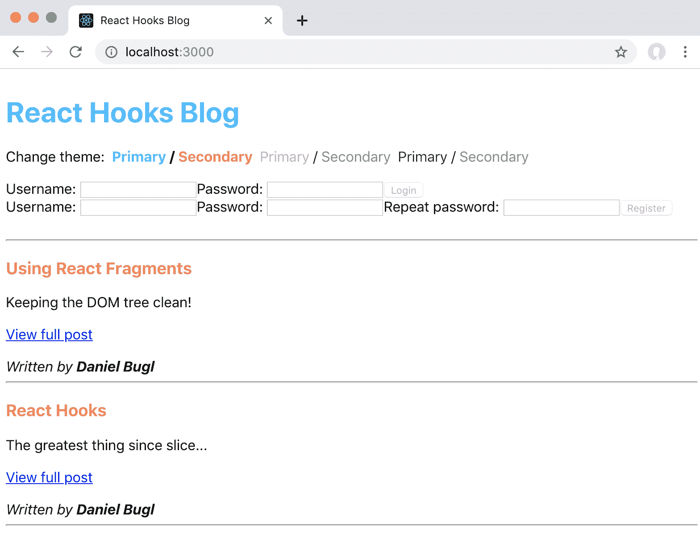
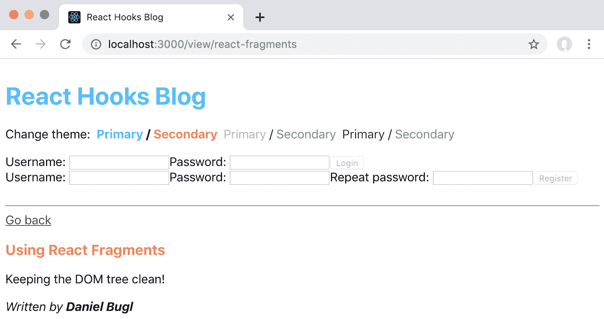
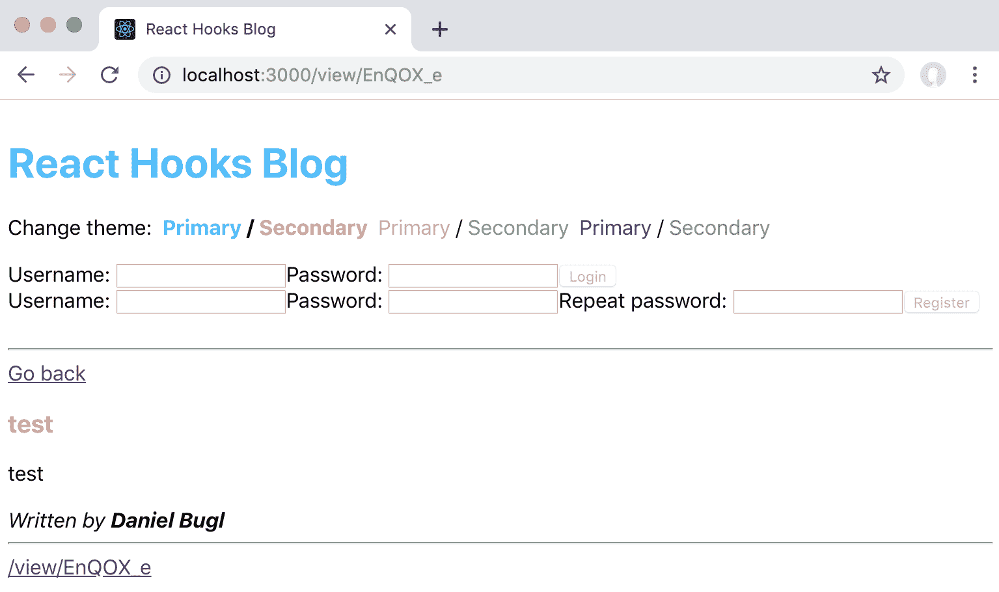

# 第七章：使用 Hooks 进行路由

在上一章中，我们学习了如何使用 Hooks 请求资源。我们首先使用 State/Reducer 和 Effect Hooks 实现了请求资源，然后学习了`axios`和`react-request-hook`库。

在本章中，我们将创建多个页面，并在我们的应用程序中实现路由。路由在几乎每个应用程序中都很重要。为了实现路由，我们将学习如何使用 Navi 库，这是一个基于 Hook 的导航系统。最后，我们还将学习动态链接以及如何使用 Hooks 访问路由信息。

本章将涵盖以下主题：

+   创建多个页面

+   实现路由

+   使用路由 Hooks

# 技术要求

应该已经安装了相当新的 Node.js 版本（v11.12.0 或更高）。还需要安装 Node.js 的`npm`包管理器。

本章的代码可以在 GitHub 存储库上找到：[`github.com/PacktPublishing/Learn-React-Hooks/tree/master/Chapter07`](https://github.com/PacktPublishing/Learn-React-Hooks/tree/master/Chapter07)[.](https://github.com/PacktPublishing/Learn-React-Hooks/tree/master/Chapter07)

查看以下视频以查看代码的运行情况：

[`bit.ly/2Mm9yoC`](http://bit.ly/2Mm9yoC)

请注意，强烈建议您自己编写代码。不要简单地运行提供的代码示例。重要的是您自己编写代码，以便能够正确学习和理解。但是，如果遇到任何问题，您可以随时参考代码示例。

现在，让我们开始这一章。

# 创建多个页面

目前，我们的博客应用是所谓的单页面应用程序。然而，大多数较大的应用程序由多个页面组成。在博客应用中，我们至少希望为每篇博客文章创建一个单独的页面。

在设置路由之前，我们需要创建我们想要渲染的各种页面。在我们的博客应用中，我们将定义以下页面：

+   主页将显示所有帖子的列表

+   帖子页面，将显示单个帖子

所有页面都将显示`HeaderBar`，其中包括`Header`、`UserBar`、`ChangeTheme`和`CreatePost`组件。我们现在将开始创建`HeaderBar`组件。之后，我们将实现页面组件。

# 创建 HeaderBar 组件

首先，我们将重构`App`组件的一些内容到`HeaderBar`组件中。`HeaderBar`组件将包含我们想要在每个页面上显示的所有内容：`Header`、`UserBar`、`ChangeTheme`和`CreatePost`组件。

让我们开始创建`HeaderBar`组件：

1.  创建一个新文件夹：`src/pages/`。

1.  创建一个新文件`src/pages/HeaderBar.js`，导入`React`（使用`useContext`钩子），并在那里定义组件。它将接受`setTheme`函数作为 prop：

```jsx
import React, { useContext } from 'react'

export default function HeaderBar ({ setTheme }) {
   return (
        <div>
        </div>
    )
}
```

1.  现在，从`src/App.js`组件中剪切以下代码，并将其插入到`HeaderBar`组件的`<div>`标签之间：

```jsx
  <Header  text="React Hooks Blog" />  <ChangeTheme  theme={theme} setTheme={setTheme} /> <br /> <React.Suspense  fallback={"Loading..."}> <UserBar /> </React.Suspense> <br /> {user  && <CreatePost />} 
```

1.  此外，从`src/App.js`中剪切以下导入语句（并调整路径），并将它们插入到`src/pages/HeaderBar.js`文件的开头，放在`import React from 'react'`语句之后：

```jsx
import  CreatePost  from  '**../**post/CreatePost' import  UserBar  from  '**../**user/UserBar' import  Header  from  '**../**Header' import  ChangeTheme  from  '**../**ChangeTheme'
```

1.  另外，导入`ThemeContext`和`StateContext`：

```jsx
import { ThemeContext, StateContext } from '../contexts'
```

1.  然后，在`src/pages/HeaderBar.js`中为`theme`和`state`定义两个 Context Hooks，并从`state`对象中提取`user`变量，因为我们需要它进行条件检查，以确定是否应该渲染`CreatePost`组件：

```jsx
export default function HeaderBar ({ setTheme }) { const theme = useContext(ThemeContext)

    const { state } = useContext(StateContext)
    const { user } = state 
    return (
```

1.  现在，在`src/App.js`中导入`HeaderBar`组件：

```jsx
import HeaderBar from './pages/HeaderBar'
```

1.  最后，在`src/App.js`中渲染`HeaderBar`组件：

```jsx
        <div style={{ padding: 8 }}>
            <HeaderBar setTheme={setTheme} />
            <hr />
```

现在，我们有一个独立的`HeaderBar`组件，它将显示在所有页面上。接下来，我们继续创建`HomePage`组件。

# 创建 HomePage 组件

现在，我们将从`PostList`组件和与帖子相关的 Resource Hook 中创建`HomePage`组件。同样，我们将重构`src/App.js`，以创建一个新的组件。

让我们开始创建`HomePage`组件：

1.  创建一个新文件`src/pages/HomePage.js`，导入`React`和`useEffect`和`useContext`钩子，并在那里定义组件。我们还定义了一个 Context Hook，并提取了`state`对象和`dispatch`函数：

```jsx
import React, { useEffect, useContext } from 'react'
import { StateContext } from '../contexts'

export default function HomePage () {
    const { state, dispatch } = useContext(StateContext)
    const { error } = state

    return (
        <div>
        </div>
    )
}
```

1.  然后，从`src/App.js`中剪切以下导入语句（并调整路径），并在`src/pages/HomePage.js`的`import React from 'react'`语句之后添加它们：

```jsx
import  {  useResource  }  from  'react-request-hook'
import PostList from '**../**post/PostList'
```

1.  接下来，从`src/App.js`中剪切以下 Hook 定义，并在`HomePage`函数的`return`语句之前插入它们：

```jsx
 const  [  posts,  getPosts  ]  =  useResource(()  => ({ url:  '/posts', method:  'get' })) useEffect(getPosts, []) useEffect(()  =>  { if (posts  &&  posts.error) { dispatch({ type:  'POSTS_ERROR'  }) } if (posts  &&  posts.data) { dispatch({ type:  'FETCH_POSTS', posts:  posts.data.reverse() }) } }, [posts])
```

1.  现在，从`src/App.js`中剪切以下渲染的代码，并将其插入到`src/pages/HomePage.js`的`<div>`标签之间：

```jsx
            {error && <b>{error}</b>}
            <PostList />
```

1.  然后，在`src/App.js`中导入`HomePage`组件：

```jsx
import HomePage from './pages/HomePage'
```

1.  最后，在`<hr />`标签下方渲染`HomePage`组件：

```jsx
            <hr />
            <HomePage />
```

现在，我们已经成功地将当前的代码重构为`HomePage`组件。接下来，我们将继续创建`PostPage`组件。

# 创建 PostPage 组件

现在，我们将定义一个新的页面组件，我们将从我们的 API 中仅获取单个帖子并显示它。

现在让我们开始创建`PostPage`组件：

1.  创建一个新的`src/pages/PostPage.js`文件。

1.  导入`React`、`useEffect`和`useResource` Hooks 以及`Post`组件：

```jsx
import React, { useEffect } from 'react'
import { useResource } from 'react-request-hook'

import Post from '../post/Post'
```

1.  现在，定义`PostPage`组件，它将接受帖子`id`作为 prop：

```jsx
export default function PostPage ({ id }) {
```

1.  在这里，我们定义了一个 Resource Hook，它将获取相应的`post`对象。我们将`id`作为依赖项传递给 Effect Hook，以便在`id`更改时重新获取我们的资源：

```jsx
    const [ post, getPost ] = useResource(() => ({
        url: `/posts/${id}`,
        method: 'get'
    }))
    useEffect(getPost, [id])
```

1.  最后，我们渲染`Post`组件：

```jsx
    return (
        <div>
            {(post && post.data)
                ? <Post {...post.data} />
                : 'Loading...'
            }
            <hr />
        </div>
    )
}
```

现在我们也有了一个单独的页面用于单个帖子。

# 测试 PostPage

为了测试新页面，我们将在`src/App.js`中用`PostPage`组件替换`HomePage`组件，如下所示：

1.  在`src/App.js`中导入`PostPage`组件：

```jsx
import PostPage from './pages/PostPage'
```

1.  现在，用`PostPage`组件替换`HomePage`组件：

```jsx
            <PostPage id={'react-hooks'} />
```

正如我们所看到的，现在只有一个帖子，即 React Hooks 帖子，被渲染。

# 示例代码

示例代码可以在`Chapter07/chapter7_1`文件夹中找到。

只需运行`npm install`以安装所有依赖项，然后运行`npm start`启动应用程序，然后在浏览器中访问`http://localhost:3000`（如果没有自动打开）。

# 实现路由

我们将使用 Navi 库进行路由。Navi 原生支持 React Suspense、Hooks 和 React 的错误边界 API，这使得它非常适合通过 Hooks 实现路由。为了实现路由，我们首先要从上一节中定义的页面中定义路由。最后，我们将从主页面定义链接到相应的帖子页面，以及从这些页面返回到主页面。

在本章末尾，我们将通过实现路由 Hooks 来扩展我们的路由功能。

# 定义路由

在实现路由时的第一步是安装`navi`和`react-navi`库。然后，我们定义路由。按照给定的步骤来做：

1.  首先，我们必须使用`npm`安装这些库：

```jsx
>npm install --save navi react-navi
```

1.  然后，在`src/App.js`中，我们从 Navi 库导入`Router`和`View`组件以及`mount`和`route`函数：

```jsx
import { Router, View } from 'react-navi'
import { mount, route } from 'navi'
```

1.  确保导入了`HomePage`组件：

```jsx
import HomePage from './pages/HomePage'
```

1.  现在，我们可以使用`mount`函数来定义`routes`对象：

```jsx
const routes = mount({
```

1.  在这个函数中，我们定义了我们的路由，从主路由开始：

```jsx
    '/': route({ view: <HomePage /> }),
```

1.  接下来，我们定义单个帖子的路由，这里我们使用 URL 参数（`:id`），并且一个函数来动态创建`view`：

```jsx
    '/view/:id': route(req => {
        return { view: <PostPage id={req.params.id} /> }
    }),
})
```

1.  最后，我们用`<Router>`组件包装我们渲染的代码，并用`<View>`组件替换`<PostPage>`组件，以便动态渲染当前页面：

```jsx
 <Router routes={routes}>
            <div style={{ padding: 8 }}>
                <HeaderBar setTheme={setTheme} />
                <hr />
 <View />
            </div>
 </Router>
```

现在，如果我们去`http://localhost:3000`，我们可以看到所有帖子的列表，当我们去`http://localhost:3000/view/react-hooks`，我们可以看到一个单独的帖子：React Hooks 帖子。

# 定义链接

现在，我们将从每篇帖子定义链接到相应单独帖子的页面，然后从帖子页面返回到主页。这些链接将用于访问我们应用程序中定义的各种路由。首先，我们将从主页定义链接到单独的帖子页面。接下来，我们将从单独的帖子页面定义链接返回到主页。

# 定义到帖子的链接

我们首先在列表中缩短帖子的`content`，并且定义从`PostList`到相应帖子页面的链接。为此，我们必须在主页上从`PostList`定义静态链接到特定的帖子页面。

现在让我们定义这些链接：

1.  编辑`src/post/Post.js`，并从`react-navi`导入`Link`组件：

```jsx
import { Link } from 'react-navi'
```

1.  接下来，我们将向`Post`组件添加两个新的 props：`id`和`short`，当我们想要显示帖子的缩短版本时，将其设置为`true`。稍后，我们将在`PostList`组件中将`short`设置为`true`：

```jsx
function Post ({ id, title, content, author, short = false }) {
```

1.  接下来，当列出帖子时，我们将添加一些逻辑来将帖子的`content`修剪为`30`个字符：

```jsx
    let processedContent = content
    if (short) {
        if (content.length > 30) {
            processedContent = content.substring(0, 30) + '...'
        }
    }
```

1.  现在，我们可以显示`processedContent`值而不是`content`值，并且添加一个`Link`来查看完整的帖子：

```jsx
            <div>{processedContent}</div>
 {short &&
 <div>
 <br />
 <Link href={`/view/${id}`}>View full post</Link>
 </div>
 }
```

1.  最后，在`PostList`组件中将`short`属性设置为`true`。编辑`src/post/PostList.js`，并调整以下代码：

```jsx
                <Post {...p} short={true} />
```

现在我们可以看到主页上的每篇帖子都被修剪为`30`个字符，并且有一个链接到相应的单独帖子页面：



在 PostList 中显示链接

正如我们所看到的，路由非常简单。现在，每篇帖子都有一个链接到其对应的完整帖子页面。

# 定义到主页的链接

现在，我们只需要一种方法从单个帖子页面返回到主页面。我们将重复类似的过程，就像我们之前所做的那样。现在让我们定义返回主页面的链接：

1.  编辑`src/pages/PostPage.js`，并在那里导入`Link`组件：

```jsx
import { Link } from 'react-navi'
```

1.  然后，在显示帖子之前，插入一个返回主页面的新链接：

```jsx
    return (
        <div>
            <div><Link href="/">Go back</Link></div>
```

1.  进入页面后，我们现在可以使用返回链接返回到主页面：



在单个帖子页面上显示链接

现在，我们的应用程序还提供了返回主页的方法。

# 调整 CREATE_POST 动作

以前，当创建新帖子时，我们会调度`CREATE_POST`动作。但是，此操作不包含帖子`id`，这意味着对新创建的帖子的链接将无法工作。

我们现在要调整代码，将帖子`id`传递给`CREATE_POST`动作：

1.  编辑`src/post/CreatePost.js`，并导入`useEffect` Hook：

```jsx
import React, { useState, useContext, useEffect } from 'react'
```

1.  接下来，调整现有的 Resource Hook，在创建帖子完成后提取`post`对象：

```jsx
    const [ post, createPost ] = useResource(({ title, content, author }) => ({
```

1.  现在，我们可以在 Resource Hook 之后创建一个新的 Effect Hook，并在创建帖子请求的结果可用时调度`CREATE_POST`动作：

```jsx
    useEffect(() => {
        if (post && post.data) {
            dispatch({ type: 'CREATE_POST', ...post.data })
        }
    }, [post])
```

1.  接下来，我们在`handleCreate`处理程序函数中删除对`dispatch`函数的调用：

```jsx
    function handleCreate () {
        createPost({ title, content, author: user })
 dispatch({ type: 'CREATE_POST', title, content, author: user })
    }
```

1.  最后，我们编辑`src/reducers.js`，并调整`postsReducer`如下：

```jsx
function postsReducer (state, action) {
    switch (action.type) {
        case 'FETCH_POSTS':
            return action.posts

        case 'CREATE_POST':
            const newPost = { title: action.title, content: action.content, author: action.author, id: action.id }
            return [ newPost, ...state ]
```

现在，对新创建的帖子的链接正常工作，因为`id`值已添加到插入的`post`对象中。

# 示例代码

示例代码可以在`Chapter07/chapter7_2`文件夹中找到。

只需运行`npm install`以安装所有依赖项，然后运行`npm start`启动应用程序，然后在浏览器中访问`http://localhost:3000`（如果没有自动打开）。

# 使用路由钩子

在使用`navi`和`react-navi`实现基本路由之后，我们现在将使用路由钩子来实现更高级的用例，这些路由钩子由`react-navi`提供。路由钩子可用于使路由更加动态。例如，通过允许从其他 Hooks 导航到不同的路由。此外，我们可以使用 Hooks 在组件内访问所有与路由相关的信息。

# Navi 的 Hooks 概述

首先，我们将看一下 Navi 库提供的三个 Hooks：

+   `useNavigation`钩子

+   `useCurrentRoute`钩子

+   `useLoadingRoute`钩子

# useNavigation Hook

`useNavigation`钩子具有以下签名：

```jsx
const navigation = useNavigation()
```

它返回 Navi 的`navigation`对象，其中包含以下函数来管理应用程序的导航状态：

+   `extractState()`：返回`window.history.state`的当前值；在处理服务器端渲染时很有用。

+   `getCurrentValue()`: 返回与当前 URL 对应的`Route`对象。

+   `getRoute()`：返回一个 promise，该 promise 对应于当前 URL 的完全加载的`Route`对象。只有在`Route`对象完全加载后才会解析该 promise。

+   `goBack()`: 返回上一页；这类似于按下浏览器返回按钮的操作。

+   `navigate(url, options)`: 使用提供的选项(`body`, `headers`, `method`, `replace`, 和 `state`)导航到提供的 URL。有关选项的更多信息可以在官方 Navi 文档中找到：[`frontarm.com/navi/en/reference/navigation/#navigationnavigate.`](https://frontarm.com/navi/en/reference/navigation/#navigationnavigate)

# useCurrentRoute Hook

`useCurrentRoute` Hook 具有以下签名：

```jsx
const route = useCurrentRoute()
```

它返回最新的非忙碌路由，其中包含 Navi 对当前页面的所有了解：

+   数据：包含所有`data`块的合并值。

+   标题：包含应设置在`document.title`上的`title`值。

+   `url`: 包含有关当前路由的信息，例如`href`、`query`和`hash`。

+   视图：包含将在路由视图中呈现的组件或元素的数组。

# useLoadingRoute Hook

`useLoadingRoute` Hook 具有以下签名：

```jsx
const loadingRoute = useLoadingRoute()
```

它返回当前正在获取的页面的`Route`对象。如果当前没有获取页面，则输出`undefined`。该对象与`useCurrentRoute` Hook 的`Route`对象看起来相同。

# 程序化导航

首先，我们将使用`useNavigation` Hook 来实现程序化导航。我们希望在创建新帖子后自动重定向到相应的帖子页面。

让我们使用 Hooks 在`CreatePost`组件中实现程序化导航：

1.  编辑`src/post/CreatePost.js`，并在那里导入`useNavigation` Hook：

```jsx
import { useNavigation } from 'react-navi'
```

1.  现在，在现有的 Resource Hook 之后定义一个 Navigation Hook：

```jsx
    const navigation = useNavigation()
```

1.  最后，我们调整 Effect Hook 以调用`navigation.navigate()`，一旦创建帖子请求的结果可用：

```jsx
    useEffect(() => {
        if (post && post.data) {
            dispatch({ type: 'CREATE_POST', ...post.data })
            navigation.navigate(`/view/${post.data.id}`)
        }
    }, [post])
```

如果我们现在创建一个新的`post`对象，我们会发现在按下创建按钮后，我们会自动被重定向到相应帖子的页面。现在我们可以继续使用 Hooks 来访问路由信息。

# 访问路由信息

接下来，我们将使用`useCurrentRoute` Hook 来访问有关当前路由/URL 的信息。我们将使用此 Hook 来实现一个页脚，它将显示当前路由的`href`值。

让我们开始实现页脚：

1.  首先，我们为页脚创建一个新组件。创建一个新的`src/pages/FooterBar.js`文件，并从`react-navi`中导入`React`以及`useCurrentRoute` Hook：

```jsx
import React from 'react'
import { useCurrentRoute } from 'react-navi'
```

1.  然后，我们定义一个新的`FooterBar`组件：

```jsx
export default function FooterBar () {
```

1.  我们使用`useCurrentRoute` Hook，并提取`url`对象以便在页脚中显示当前的`href`值：

```jsx
    const { url } = useCurrentRoute()
```

1.  最后，在页脚中呈现当前`href`值的链接：

```jsx
    return (
        <div>
            <a href={url.href}>{url.href}</a>
        </div>
    )
}
```

现在，当我们打开一个帖子页面时，我们可以在页脚中看到当前帖子的`href`值：



显示当前 href 值的页脚

正如我们所看到的，我们的页脚正常工作——它始终显示当前页面的`href`值。

# 示例代码

示例代码可以在`Chapter07/chapter7_3`文件夹中找到。

只需运行`npm install`以安装所有依赖项，然后运行`npm start`启动应用程序，然后在浏览器中访问`http://localhost:3000`（如果没有自动打开）。

# 总结

在本章中，我们首先为我们的博客定义了两个页面：主页和单个帖子页面。我们还为`HeaderBar`创建了一个组件。之后，我们通过定义路由、链接到单个帖子以及返回主页的链接来实现了路由。最后，我们在创建新帖子时使用路由 Hooks 来实现动态导航，并实现了一个显示当前 URL 的页脚。

路由非常重要，在几乎每个应用程序中都会使用。我们现在知道如何定义单独的页面以及如何在它们之间进行链接。此外，我们学会了如何使用 Hooks 在页面之间进行动态导航。我们还学会了如何使用 Hooks 访问路由信息以进行更高级的用例。

Navi 库可以做很多其他事情。但是，本书侧重于 Hooks，因此大多数 Navi 的功能都不在讨论范围之内。例如，我们可以使用 Navi 获取数据，实现错误页面（例如 404 页面），延迟加载和组合路由。请随意阅读官方 Navi 文档中关于这些功能的内容。

在下一章中，我们将学习由 React 社区提供的各种 Hooks：用于输入处理、响应式设计、实现撤销/重做，以及使用 Hooks 实现各种数据结构和 React 生命周期方法。我们还将学习在哪里可以找到社区提供的更多 Hooks。

# 问题

为了回顾本章学到的内容，请尝试回答以下问题：

1.  为什么我们需要定义单独的页面？

1.  我们如何使用 Navi 库定义路由？

1.  我们如何使用 URL 参数定义路由？

1.  如何使用 Navi 定义静态链接？

1.  我们如何实现动态导航？

1.  哪个 Hook 用于访问当前路由的路由信息？

1.  哪个 Hook 用于访问当前加载路由的路由信息？

# 进一步阅读

如果您对本章学到的概念感兴趣，可以查看 Navi 库的官方文档：[`frontarm.com/navi/en/`](https://frontarm.com/navi/en/)。
