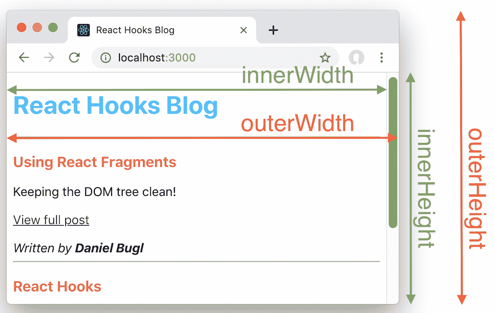
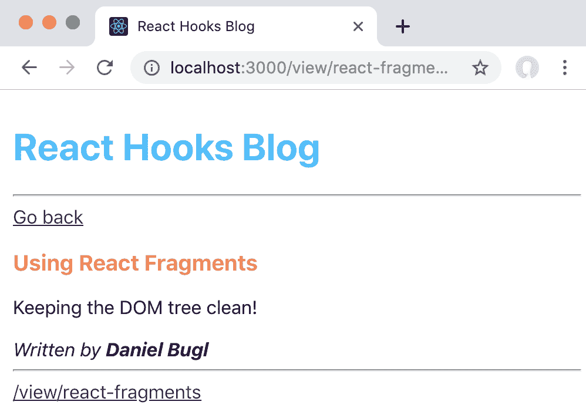
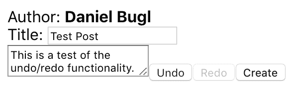
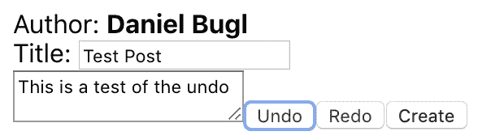

# 第八章：使用社区 Hooks

在上一章中，我们使用 Navi 库实现了路由。我们首先实现了页面，然后定义了路由和静态链接。最后，我们实现了动态链接，并使用 Hooks 访问了路由信息。

在本章中，我们将学习由 React 社区提供的各种 Hooks。这些 Hooks 可以用于简化输入处理，并实现 React 生命周期，以简化从 React 类组件迁移。此外，还有一些实现各种行为的 Hooks，例如定时器、检查客户端是否在线、悬停和焦点事件以及数据操作。最后，我们将学习响应式设计，并使用 Hooks 实现撤销/重做功能。

本章将涵盖以下主题：

+   使用 Input Hook 简化输入处理

+   使用 Hooks 实现 React 生命周期

+   学习各种有用的 Hooks（`usePrevious`、定时器、在线、焦点、悬停和数据操作 Hooks）

+   使用 Hooks 实现响应式设计

+   使用 Hooks 实现撤销/重做功能和去抖动

+   学习在哪里找到其他的 Hooks

# 技术要求

应该已经安装了一个相当新的 Node.js 版本（v11.12.0 或更高）。还需要安装 Node.js 的`npm`包管理器。

本章的代码可以在 GitHub 存储库中找到：[`github.com/PacktPublishing/Learn-React-Hooks/tree/master/Chapter08`](https://github.com/PacktPublishing/Learn-React-Hooks/tree/master/Chapter08)[.](https://github.com/PacktPublishing/Hands-On-Web-Development-with-Hooks/tree/master/Chapter08)

查看以下视频以查看代码的运行情况：

[`bit.ly/2Mm9yoC`](http://bit.ly/2Mm9yoC)

请注意，强烈建议您自己编写代码。不要简单地运行提供的代码示例。重要的是您自己编写代码，以便能够正确地学习和理解。但是，如果遇到任何问题，您可以随时参考代码示例。

现在，让我们开始这一章。

# 探索输入处理 Hook

在处理 Hooks 时，一个非常常见的用例是使用 State 和 Effect Hooks 存储`input`字段的当前值。在本书中，我们已经多次这样做了。

`useInput` Hook 极大地简化了这种用例，通过提供一个处理`input`字段的`value`变量的单个 Hook。它的工作方式如下：

```jsx
import React from 'react'
import { useInput } from 'react-hookedup'

export default function App () {
    const { value, onChange } = useInput('')

    return <input value={value} onChange={onChange} />
}
```

这段代码将绑定一个`onChange`处理函数和`value`到`input`字段。这意味着每当我们在`input`字段中输入文本时，`value`将自动更新。

另外，还有一个函数可以清除`input`字段。这个`clear`函数也是从 Hook 中返回的：

```jsx
    const { clear } = useInput('')
```

调用`clear`函数将把`value`设置为空值，并清除`input`字段中的所有文本。

此外，该 Hook 提供了两种绑定`input`字段的方式：

+   `bindToInput`：将`value`和`onChange`属性绑定到`input`字段，使用`e.target.value`作为`onChange`函数的`value`参数。在处理 HTML`input`字段时非常有用。

+   `bind`：将`value`和`onChange`属性绑定到`input`字段，仅使用`e`作为`onChange`函数的值。这对于直接将值传递给`onChange`函数的 React 组件非常有用。

`bind`和`bindToInput`对象可以与扩展运算符一起使用，如下所示：

```jsx
import React from 'react'
import { useInput } from 'react-hookedup'

const ToggleButton = ({ value, onChange }) => { ... } // custom component that renders a toggle button

export default function App () {
    const { bind, bindToInput } = useInput('')

    return (
        <div>
            <input {...bindToInput} />
            <ToggleButton {...bind} />
        </div>
    )
}
```

正如我们所看到的，对于`input`字段，我们可以使用`{...bindToInput}`属性来分配`value`和`onChange`函数。对于`ToggleButton`，我们需要使用`{...bind}`属性，因为这里我们不处理输入事件，并且值直接传递给 change 处理程序（而不是通过`e.target.value`）。

现在我们已经了解了 Input Hook，我们可以继续在我们的博客应用中实现它。

# 在我们的博客应用中实现 Input Hooks

现在我们已经了解了 Input Hook，以及它如何简化处理`input`字段状态，我们将在我们的博客应用中实现 Input Hooks。

首先，我们必须在我们的博客应用项目中安装`react-hookedup`库。

```jsx
> npm install --save react-hookedup
```

我们现在将在以下组件中实现 Input Hooks：

+   `Login`组件

+   `Register`组件

+   `CreatePost`组件

让我们开始实现 Input Hooks。

# `Login`组件

在`Login`组件中有两个`input`字段：用户名和密码字段。我们现在将用 Input Hooks 替换 State Hooks。

现在让我们开始在`Login`组件中实现 Input Hooks：

1.  在`src/user/Login.js`文件的开头导入`useInput` Hook：

```jsx
import { useInput } from 'react-hookedup'
```

1.  然后，我们移除以下`username` State Hook：

```jsx
    const [ username, setUsername ] = useState('')
```

它被替换为 Input Hook，如下所示：

```jsx
    const { value: username, bindToInput: bindUsername } = useInput('')
```

由于我们使用了两个输入钩子，为了避免名称冲突，我们在对象解构中使用重命名语法（`{ from: to }`）将`value`键重命名为`username`，将`bindToInput`键重命名为`bindUsername`。

1.  我们还移除以下`password`状态钩子：

```jsx
    const [ password, setPassword ] = useState('')
```

它被输入钩子替换，如下所示：

```jsx
    const { value: password, bindToInput: bindPassword } = useInput('')
```

1.  现在我们可以移除以下处理函数：

```jsx
    function handleUsername (evt) {
        setUsername(evt.target.value)
    }

    function handlePassword (evt) {
        setPassword(evt.target.value)
    }
```

1.  最后，我们不再手动传递`onChange`处理程序，而是使用输入钩子中的绑定对象：

```jsx
            <input type="text" value={username} {...bindUsername} name="login-username" id="login-username" />
            <input type="password" value={password} {...bindPassword} name="login-password" id="login-password" />
```

登录功能仍然与以前完全相同，但现在我们使用更简洁的输入钩子，而不是通用状态钩子。我们也不再需要为每个`input`字段定义相同类型的处理函数。正如我们所看到的，使用社区钩子可以极大地简化常见用例的实现，比如输入处理。现在我们将重复相同的过程用于`Register`组件。

# 注册组件

`Register`组件的工作方式类似于`Login`组件。但是，它有三个`input`字段：用户名、密码和重复密码。

现在让我们在`Register`组件中实现输入钩子：

1.  在`src/user/Register.js`文件的开头导入`useInput`钩子：

```jsx
import { useInput } from 'react-hookedup'
```

1.  然后，我们移除以下状态钩子：

```jsx
    const [ username, setUsername ] = useState('')
    const [ password, setPassword ] = useState('')
    const [ passwordRepeat, setPasswordRepeat ] = useState('')
```

它们被相应的输入钩子替换：

```jsx
    const { value: username, bindToInput: bindUsername } = useInput('')
    const { value: password, bindToInput: bindPassword } = useInput('')
    const { value: passwordRepeat, bindToInput: bindPasswordRepeat } = useInput('')
```

1.  同样，我们可以移除所有处理函数：

```jsx
 function  handleUsername  (evt)  { setUsername(evt.target.value)
 } function  handlePassword  (evt)  { setPassword(evt.target.value)
 } function  handlePasswordRepeat  (evt)  { setPasswordRepeat(evt.target.value)
 }
```

1.  最后，我们用相应的绑定对象替换所有的`onChange`处理程序：

```jsx
 <input  type="text"  value={username} **{...bindUsername****}** name="register-username" id="register-username" /> <input  type="password"  value={password} **{...bindPassword****}** name="register-password" id="register-password" /> <input  type="password"  value={passwordRepeat} **{...bindPasswordRepeat}** name="register-password-repeat" id="register-password-repeat/>
```

注册功能仍然以相同的方式工作，但现在使用输入钩子。接下来是`CreatePost`组件，我们也将在其中实现输入钩子。

# 创建帖子组件

`CreatePost`组件使用两个`input`字段：一个用于`title`，一个用于`content`。我们将用输入钩子替换它们。

现在让我们在`CreatePost`组件中实现输入钩子：

1.  在`src/user/CreatePost.js`文件的开头导入`useInput`钩子：

```jsx
import { useInput } from 'react-hookedup'
```

1.  然后，我们移除以下状态钩子：

```jsx
    const [ title, setTitle ] = useState('')
    const [ content, setContent ] = useState('')
```

我们用相应的输入钩子替换它们：

```jsx
    const { value: title, bindToInput: bindTitle } = useInput('')
    const { value: content, bindToInput: bindContent } = useInput('')
```

1.  同样，我们可以移除以下输入处理函数：

```jsx
 function  handleTitle  (evt)  { setTitle(evt.target.value)
 } function  handleContent  (evt)  { setContent(evt.target.value)
 }
```

1.  最后，我们用相应的绑定对象替换所有的`onChange`处理程序：

```jsx
 <input  type="text"  value={title} **{...bindTitle}** name="create-title" id="create-title" />
        </div>
 <textarea  value={content} **{...bindContent}** />
```

创建帖子功能也将以相同的方式与输入钩子一起工作。

# 示例代码

示例代码可以在`Chapter08/chapter8_1`文件夹中找到。

只需运行 `npm install` 以安装所有依赖项，然后运行 `npm start` 启动应用程序，然后在浏览器中访问 [`localhost:3000`](http://localhost:3000) （如果没有自动打开）。

# React 生命周期与 Hooks

正如我们在之前的章节中学到的，我们可以使用 `useEffect` Hook 来模拟大部分 React 的生命周期方法。然而，如果你更喜欢直接处理 React 生命周期，而不是使用 Effect Hooks，有一个名为 `react-hookedup` 的库，它提供了各种 Hooks，包括各种 React 生命周期的 Hooks。此外，该库还提供了一个合并状态的 Hook，它的工作方式类似于 React 类组件中的 `this.setState()`。

# useOnMount Hook

`useOnMount` Hook 与 `componentDidMount` 生命周期有类似的效果。它的使用方法如下：

```jsx
import React from 'react'
import { useOnMount } from 'react-hookedup'

export default function UseOnMount () {
    useOnMount(() => console.log('mounted'))

    return <div>look at the console :)</div>
}
```

当组件挂载时（当 React 组件首次渲染时），上述代码将在控制台输出 mounted。例如，由于 prop 更改而导致组件重新渲染时，它不会再次被调用。

或者，我们可以使用带有空数组作为第二个参数的 `useEffect` Hook，它将产生相同的效果：

```jsx
import React, { useEffect } from 'react'

export default function OnMountWithEffect () {
    useEffect(() => console.log('mounted with effect'), [])

    return <div>look at the console :)</div>
}
```

正如我们所看到的，使用带有空数组作为第二个参数的 Effect Hook 会产生与 `useOnMount` Hook 或 `componentDidMount` 生命周期方法相同的行为。

# useOnUnmount Hook

`useOnUnmount` Hook 与 `componentWillUnmount` 生命周期有类似的效果。它的使用方法如下：

```jsx
import React from 'react'
import { useOnUnmount } from 'react-hookedup'

export default function UseOnUnmount () {
    useOnUnmount(() => console.log('unmounting'))

    return <div>click the "unmount" button above and look at the console</div>
}
```

当组件卸载时（在 React 组件从 DOM 中移除之前），上述代码将在控制台输出 unmounting。

如果你还记得第四章中所学到的，我们可以从 `useEffect` Hook 中返回一个清理函数，当组件卸载时将被调用。这意味着我们可以使用 `useEffect` 来实现 `useOnMount` Hook，如下所示：

```jsx
import React, { useEffect } from 'react'

export default function OnUnmountWithEffect () {
    useEffect(() => {
        return () => console.log('unmounting with effect')
    }, [])

    return <div>click the "unmount" button above and look at the console</div>
}
```

正如我们所看到的，从 Effect Hook 返回的清理函数，带有空数组作为第二个参数，具有与 `useOnUnmount` Hook 或 `componentWillUnmount` 生命周期方法相同的效果。

# useLifecycleHooks Hook

`useLifecycleHooks` Hook 将前两个 Hook 结合为一个。我们可以将 `useOnMount` 和 `useOnUnmount` Hooks 结合如下：

```jsx
import React from 'react'
import { useLifecycleHooks } from 'react-hookedup'

export default function UseLifecycleHooks () {
    useLifecycleHooks({
        onMount: () => console.log('lifecycle mounted'),
        onUnmount: () => console.log('lifecycle unmounting')
    })

    return <div>look at the console and click the button</div>
}
```

或者，我们可以分别使用这两个 Hooks：

```jsx
import React from 'react'
import { useOnMount, useOnUnmount } from 'react-hookedup'

export default function UseLifecycleHooksSeparate () {
    useOnMount(() => console.log('separate lifecycle mounted'))
    useOnUnmount(() => console.log('separate lifecycle unmounting'))

    return <div>look at the console and click the button</div>
}
```

然而，如果你有这种模式，我建议简单地使用`useEffect` Hook，如下所示：

```jsx
import React, { useEffect } from 'react'

export default function LifecycleHooksWithEffect () {
    useEffect(() => {
        console.log('lifecycle mounted with effect')
        return () => console.log('lifecycle unmounting with effect')
    }, [])

    return <div>look at the console and click the button</div>
}
```

使用`useEffect`，我们可以将整个效果放入一个函数中，然后简单地返回一个清理函数。当我们在下一章学习如何制作自己的 Hooks 时，这种模式尤其有用。

效果让我们以不同的方式思考 React 组件。我们根本不必考虑组件的生命周期。相反，我们考虑效果、依赖关系和效果的清理。

# useMergeState Hook

`useMergeState` Hook 的工作方式类似于`useState` Hook。但是，它不会替换当前状态，而是将当前状态与新状态合并，就像在 React 类组件中的`this.setState()`一样。

Merge State Hook 返回以下对象：

+   `state`：当前状态

+   `setState`：一个函数，用于将当前状态与给定的状态对象合并

例如，让我们考虑以下组件：

1.  首先，我们导入`useState` Hook：

```jsx
import React, { useState } from 'react'
```

1.  然后，我们定义我们的应用组件和一个包含`loaded`值和`counter`值的对象的 State Hook：

```jsx
export default function MergeState () {
    const [ state, setState ] = useState({ loaded: true, counter: 0 })
```

1.  接下来，我们定义一个`handleClick`函数，在其中设置新的`state`，将当前的`counter`值增加`1`：

```jsx
    function handleClick () {
        setState({ counter: state.counter + 1 })
    }
```

1.  最后，我们渲染当前的`counter`值和一个+1 按钮，以便将`counter`值增加`1`。如果`state.loaded`为`false`或`undefined`，按钮将被禁用：

```jsx
    return (
        <div>
            Count: {state.counter}
            <button onClick={handleClick} disabled={!state.loaded}>+1</button>
        </div>
    )
}
```

正如我们所看到的，我们有一个简单的计数器应用，显示当前计数和一个+1 按钮。只有当`loaded`值设置为`true`时，+1 按钮才会启用。

如果我们现在点击+1 按钮，`counter`将从`0`增加到`1`，但按钮将被禁用，因为我们已经用新的`state`对象覆盖了当前的`state`对象。

为了解决这个问题，我们需要调整`handleClick`函数如下：

```jsx
    function handleClick () {
        setState({ ...state, counter: state.counter + 1 })
    }
```

或者，我们可以使用`useMergeState` Hook，以避免这个问题，并获得与在类组件中使用`this.setState()`相同的行为：

```jsx
import React from 'react'
import { useMergeState } from 'react-hookedup'

export default function UseMergeState () {
    const { state, setState } = useMergeState({ loaded: true, counter: 0 })
```

正如我们所看到的，通过使用`useMergeState` Hook，我们可以复制在类组件中使用`this.setState()`时的相同行为。因此，我们不再需要使用扩展语法。然而，通常最好简单地使用多个 State Hooks 或 Reducer Hook。

# 示例代码

示例代码可以在`Chapter08/chapter8_2`文件夹中找到。

只需运行`npm install`以安装所有依赖项，然后运行`npm start`启动应用程序，然后在浏览器中访问`http://localhost:3000`（如果没有自动打开）。

# 各种有用的 Hooks

除了生命周期 Hooks 之外，`react-hookedup`还提供了用于计时器、检查网络状态以及处理其他有用的 Hooks，例如数组和输入字段的 Hooks。我们现在将介绍`react-hookedup`提供的其余 Hooks。

这些 Hooks 如下：

+   `usePrevious` Hook，用于获取 Hook 或 prop 的先前值

+   计时器 Hooks，用于实现间隔和超时

+   `useOnline` Hook，用于检查客户端是否有活动的互联网连接

+   用于处理布尔值、数组和计数器的各种数据操作 Hooks

+   处理焦点和悬停事件的 Hooks

# `usePrevious` Hook

`usePrevious` Hook 是一个简单的 Hook，让我们获取 prop 或 Hook 值的先前值。它将始终存储并返回任何给定变量的先前值，并且工作方式如下：

1.  首先，我们导入`useState`和`usePrevious` Hooks：

```jsx
import React, { useState } from 'react'
import { usePrevious } from 'react-hookedup'
```

1.  然后，我们定义我们的`App`组件，并在其中存储当前`count`状态的 Hook：

```jsx
export default function UsePrevious () {
    const [ count, setCount ] = useState(0)
```

1.  现在，我们定义`usePrevious` Hook，将 State Hook 中的`count`值传递给它：

```jsx
    const prevCount = usePrevious(count)
```

`usePrevious` Hook 适用于任何变量，包括组件 props 和其他 Hooks 的值。

1.  接下来，我们定义一个处理函数，它将通过`1`增加`count`：

```jsx
    function handleClick () {
        setCount(count + 1)
    }
```

1.  最后，我们渲染`count`的先前值，`count`的当前值以及一个增加`count`的按钮：

```jsx
    return (
        <div>
            Count was {prevCount} and is {count} now.
            <button onClick={handleClick}>+1</button>
        </div>
    )
}
```

先前定义的组件将首先显示 Count was and is 0 now.，因为 Previous Hook 的默认值是`null`。单击按钮一次后，将显示以下内容：Count was 0 and is 1 now.。

# 计时器 Hooks

`react-hookedup`库还提供了用于处理计时器的 Hooks。如果我们在组件中简单地使用`setTimeout`或`setInterval`创建计时器，那么每次组件重新渲染时都会重新实例化。这不仅会导致错误和不可预测性，而且如果旧的计时器没有正确释放，还可能导致内存泄漏。使用计时器 Hooks，我们可以完全避免这些问题，并轻松地使用间隔和超时。

该库提供以下计时器 Hooks：

+   `useInterval` Hook，用于在 React 组件中定义`setInterval`计时器（多次触发的计时器）

+   `useTimeout` Hook 用于定义`setTimeout`定时器（在一定时间后仅触发一次的定时器）

# `useInterval` Hook

`useInterval` Hook 可以像`setInterval`一样使用。我们现在将实现一个小计数器，用于计算自组件挂载以来的秒数：

1.  首先，导入`useState`和`useInterval` Hooks：

```jsx
import React, { useState } from 'react'
import { useInterval } from 'react-hookedup'
```

1.  然后，我们定义我们的组件和一个 State Hook：

```jsx
export default function UseInterval () {
    const [ count, setCount ] = useState(0)
```

1.  接下来，我们定义`useInterval` Hook，它将每 1000 毫秒增加`1`，相当于`1`秒：

```jsx
    useInterval(() => setCount(count + 1), 1000)
```

1.  最后，我们显示当前的`count`值：

```jsx
    return <div>{count} seconds passed</div>
}
```

或者，我们可以使用 Effect Hook 与`setInterval`结合，而不是`useInterval` Hook，如下所示：

```jsx
import React, { useState, useEffect } from 'react'

export default function IntervalWithEffect () {
    const [ count, setCount ] = useState(0)
    useEffect(() => {
        const interval = setInterval(() => setCount(count + 1), 1000)
        return () => clearInterval(interval)
    })

    return <div>{count} seconds passed</div>
}
```

正如我们所看到的，`useInterval` Hook 使我们的代码更加简洁和易读。

# `useTimeout` Hook

`useTimeout` Hook 可以像`setTimeout`一样使用。现在我们将实现一个在经过`10`秒后触发的组件：

1.  首先，导入`useState`和`useTimeout` Hooks：

```jsx
import React, { useState } from 'react'
import { useTimeout } from 'react-hookedup'
```

1.  然后，我们定义我们的组件和一个 State Hook：

```jsx
export default function UseTimeout () {
    const [ ready, setReady ] = useState(false)
```

1.  接下来，我们定义`useTimeout` Hook，它将在`10000`毫秒（`10`秒）后将`ready`设置为`true`：

```jsx
    useTimeout(() => setReady(true), 10000)
```

1.  最后，我们显示我们是否准备好了：

```jsx
    return <div>{ready ? 'ready' : 'waiting...'}</div>
}
```

或者，我们可以使用 Effect Hook 与`setTimeout`结合，而不是`useTimeout` Hook，如下所示：

```jsx
import React, { useState, useEffect } from 'react'

export default function TimeoutWithEffect () {
    const [ ready, setReady ] = useState(false)
    useEffect(() => {
        const timeout = setTimeout(() => setReady(true), 10000)
        return () => clearTimeout(timeout)
    })

    return <div>{ready ? 'ready' : 'waiting...'}</div>
}
```

正如我们所看到的，`useTimeout` Hook 使我们的代码更加简洁和易读。

# 在线状态 Hook

在一些 Web 应用中，实现离线模式是有意义的；例如，如果我们希望能够在本地编辑和保存帖子草稿，并在再次在线时将它们同步到服务器。为了实现这种用例，我们可以使用`useOnlineStatus` Hook。

在线状态 Hook 返回一个带有`online`值的对象，如果客户端在线则包含`true`；否则包含`false`。它的工作原理如下：

```jsx
import React from 'react'
import { useOnlineStatus } from 'react-hookedup'

export default function App () {
    const { online } = useOnlineStatus()

    return <div>You are {online ? 'online' : 'offline'}!</div>
}
```

前面的组件将在有网络连接时显示“您在线！”，否则显示“您离线！”。

然后，我们可以使用 Previous Hook，结合 Effect Hook，以便在我们再次在线时将数据同步到服务器：

```jsx
import React, { useEffect } from 'react'
import { useOnlineStatus, usePrevious } from 'react-hookedup'

export default function App () {
    const { online } = useOnlineStatus()
    const prevOnline = usePrevious(online)

    useEffect(() => {
        if (prevOnline === false && online === true) {
            alert('syncing data')
        }
    }, [prevOnline, online])

    return <div>You are {online ? 'online' : 'offline'}!</div>
}
```

现在，我们有一个 Effect Hook，每当`online`的值发生变化时触发。然后它检查先前的`online`值是否为`false`，当前值是否为`true`。如果是这种情况，这意味着我们先前是离线的，现在又在线了，所以我们需要将更新的数据同步到服务器。

因此，当我们离线然后再次在线时，我们的应用将显示一个显示同步数据的警报。

# 数据操作 Hook

`react-hookedup`库提供了处理数据的各种实用 Hook。这些 Hook 简化了处理常见数据结构，并提供了对 State Hook 的抽象。

提供了以下数据操作 Hook：

+   `useBoolean` Hook：处理切换布尔值

+   `useArray` Hook：处理数组

+   `useCounter` Hook：处理计数器

# useBoolean Hook

`useBoolean` Hook 用于处理切换布尔值（`true`/`false`），并提供了将值设置为`true`/`false`的函数，以及一个`toggle`函数来切换值。

该 Hook 返回一个具有以下内容的对象：

+   `value`：布尔值的当前值

+   `toggle`：一个用于切换当前值的函数（如果当前为`false`，则设置为`true`，如果当前为`true`，则设置为`false`）

+   `setTrue`：将当前值设置为`true`

+   `setFalse`：将当前值设置为`false`

布尔值 Hook 的工作方式如下：

1.  首先，我们从`react-hookedup`中导入`useBoolean` Hook：

```jsx
import React from 'react'
import { useBoolean } from 'react-hookedup'
```

1.  然后，我们定义我们的组件和布尔值 Hook，它返回一个具有`toggle`函数和`value`的对象。我们将`false`作为默认值传递：

```jsx
export default function UseBoolean () {
    const { toggle, value } = useBoolean(false)
```

1.  最后，我们渲染一个按钮，可以打开/关闭：

```jsx
    return (
        <div>
            <button onClick={toggle}>{value ? 'on' : 'off'}</button>
        </div>
    )
}
```

按钮最初将以文本“关闭”呈现。单击按钮时，它将显示文本“打开”。再次单击时，它将再次关闭。

# useArray Hook

`useArray` Hook 用于轻松处理数组，而无需使用其余/扩展语法。

Array Hook 返回一个具有以下内容的对象：

+   `value`：当前数组

+   `setValue`：将新数组设置为值

+   `add`：将给定元素添加到数组中

+   `clear`：从数组中移除所有元素

+   `removeIndex`：通过索引从数组中移除元素

+   `removeById`：通过其`id`（假设数组中的元素是具有`id`键的对象）从数组中移除元素

它的工作方式如下：

1.  首先，我们从`react-hookedup`中导入`useArray` Hook：

```jsx
import React from 'react'
import { useArray } from 'react-hookedup'
```

1.  然后，我们定义组件和 Array Hook，并将默认值设置为`['one', 'two', 'three']`：

```jsx
export default function UseArray () {
    const { value, add, clear, removeIndex } = useArray(['one', 'two', 'three'])
```

1.  现在，我们将当前数组显示为 JSON：

```jsx
    return (
        <div>
            <p>current array: {JSON.stringify(value)}</p>
```

1.  然后，我们显示一个`add`按钮来添加一个元素：

```jsx
            <button onClick={() => add('test')}>add element</button>
```

1.  接下来，我们显示一个通过索引删除第一个元素的按钮：

```jsx
            <button onClick={() => removeIndex(0)}>remove first element</button>
```

1.  最后，我们添加一个`clear`按钮来清除所有元素：

```jsx
            <button onClick={() => clear()}>clear elements</button>
        </div>
    )
}
```

正如我们所看到的，使用`useArray` Hook 使处理数组变得更简单。

# useCounter Hook

`useCounter` Hook 可以用来定义各种类型的计数器。我们可以定义下限/上限，指定计数器是否应该循环，以及指定我们增加/减少计数器的步长。此外，Counter Hook 提供了函数来增加/减少计数器。

它接受以下配置选项：

+   `upperLimit`：定义计数器的上限（最大值）

+   `lowerLimit`：定义计数器的下限（最小值）

+   `loop`：指定计数器是否应该循环（例如，当达到最大值时，我们回到最小值）

+   `step`：设置增加和减少函数的默认步长

它返回以下对象：

+   `value`：我们计数器的当前值。

+   `setValue`：设置计数器的当前值。

+   `increase`：按给定的步长增加值。如果未指定数量，则使用默认步长。

+   `decrease`：按给定的步长减少值。如果未指定数量，则使用默认步长。

Counter Hook 可以如下使用：

1.  首先，我们从`react-hookedup`中导入`useCounter` Hook：

```jsx
import React from 'react'
import { useCounter } from 'react-hookedup'
```

1.  然后，我们定义我们的组件和 Hook，指定`0`作为默认值。我们还指定`upperLimit`，`lowerLimit`和`loop`：

```jsx
export default function UseCounter () {
    const { value, increase, decrease } = useCounter(0, { upperLimit: 3, lowerLimit: 0, loop: true })
```

1.  最后，我们渲染当前值和两个按钮来`increase`/`decrease`值：

```jsx
    return (
        <div>
            <b>{value}</b>
            <button onClick={increase}>+</button>
            <button onClick={decrease}>-</button>
        </div>
    )
}
```

正如我们所看到的，Counter Hook 使得实现计数器变得更加简单。

# 焦点和悬停 Hooks

有时，我们想要检查用户是否悬停在元素上或者聚焦在`input`字段上。为了做到这一点，我们可以使用`react-hookedup`库提供的 Focus 和 Hover Hooks。

该库为这些特性提供了两个 Hooks：

+   `useFocus` Hook：处理焦点事件（例如，选择的`input`字段）

+   `useHover` Hook：处理悬停事件（例如，当鼠标指针悬停在一个区域上时）

# useFocus Hook

为了知道一个元素当前是否聚焦，我们可以使用`useFocus` Hook 如下：

1.  首先，我们导入`useFocus` Hook：

```jsx
import React from 'react'
import { useFocus } from 'react-hookedup'
```

1.  然后，我们定义我们的组件和 Focus Hook，它返回`focused`值和一个`bind`函数，将 Hook 绑定到一个元素：

```jsx
export default function UseFocus () {
    const { focused, bind } = useFocus()
```

1.  最后，我们渲染一个`input`字段，并将 Focus Hook 绑定到它：

```jsx
    return (
        <div>
            <input {...bind} value={focused ? 'focused' : 'not focused'} />
        </div>
    )
}
```

正如我们所看到的，Focus Hook 使得处理焦点事件变得更加容易。不再需要定义我们自己的处理函数了。

# useHover Hook

为了知道用户当前是否悬停在元素上，我们可以使用`useHover` Hook，如下所示：

1.  首先，我们导入`useHover` Hook：

```jsx
import React from 'react'
import { useHover } from 'react-hookedup'
```

1.  然后，我们定义我们的组件和 Hover Hook，它返回`hovered`值和一个`bind`函数，将 Hook 绑定到元素：

```jsx
export default function UseHover () {
    const { hovered, bind } = useHover()
```

1.  最后，我们渲染一个元素，并将 Hover Hook 绑定到它：

```jsx
    return (
        <div {...bind}>Hover me {hovered && 'THANKS!!!'}</div>
    )
}
```

正如我们所看到的，Hover Hook 使处理悬停事件变得更加容易。不再需要定义自己的处理程序函数。

# 示例代码

示例代码可以在`Chapter08/chapter8_3`文件夹中找到。

只需运行`npm install`来安装所有依赖项，然后运行`npm start`启动应用程序，然后在浏览器中访问`http://localhost:3000`（如果不会自动打开）。

# 使用 Hooks 实现响应式设计

在 Web 应用程序中，拥有响应式设计通常很重要。响应式设计使您的 Web 应用程序在各种设备和窗口/屏幕尺寸上呈现良好。我们的博客应用可能在桌面上、手机上、平板上，甚至可能在非常大的屏幕上（如电视）上查看。

通常，对于响应式设计，最合理的方法是简单地使用 CSS 媒体查询。然而，有时这是不可能的，例如，当我们在画布或 Web 图形库（WebGL）中渲染元素时。有时，我们还希望根据窗口大小决定是否加载组件，而不是简单地渲染它，然后通过 CSS 隐藏它。

`@rehooks/window-size`库提供了`useWindowSize` Hook，返回以下值：

+   `innerWidth`：等同于`window.innerWidth`的值

+   `innerHeight`：等同于`window.innerHeight`的值

+   `outerWidth`：等同于`window.outerWidth`的值

+   `outerHeight`：等同于`window.outerHeight`的值

为了显示`outerWidth`/`outerHeight`和`innerWidth`/`innerHeight`之间的区别，请查看以下图表：



窗口宽度/高度属性的可视化

正如我们所看到的，`innerHeight`和`innerWidth`指定了浏览器窗口的最内部部分，而`outerHeight`和`outerWidth`指定了浏览器窗口的完整尺寸，包括 URL 栏、滚动条等。

现在，我们将根据博客应用中的窗口大小隐藏组件。

# 响应式隐藏组件

在我们的博客应用中，当屏幕尺寸非常小时，我们将完全隐藏`UserBar`和`ChangeTheme`组件，这样在手机上阅读文章时，我们可以专注于内容。

让我们开始实现 Window Size Hook：

1.  首先，我们必须安装`@rehooks/window-size`库：

```jsx
> npm install --save @rehooks/window-size
```

1.  然后，在`src/pages/HeaderBar.js`文件的开头导入`useWindowSize` Hook：

```jsx
import useWindowSize from '@rehooks/window-size'
```

1.  接下来，在现有的 Context Hooks 之后，我们定义以下 Window Size Hook：

```jsx
            const { innerWidth } = useWindowSize()
```

1.  如果窗口宽度小于`640`像素，我们假设设备是手机：

```jsx
            const mobilePhone = innerWidth < 640
```

1.  最后，只有在不是手机上时，我们才显示 ChangeTheme 和 UserBar 组件：

```jsx
 {!mobilePhone && <ChangeTheme theme={theme} setTheme={setTheme} />}
             {!mobilePhone && <br />}
             {!mobilePhone && <React.Suspense fallback={"Loading..."}>
                 <UserBar />
             </React.Suspense>}
             {!mobilePhone && <br />} 
```

如果我们现在调整浏览器窗口的宽度小于`640`像素，我们可以看到`ChangeTheme`和`UserBar`组件将不再被渲染：



在较小的屏幕尺寸上隐藏 ChangeTheme 和 UserBar 组件

使用 Window Size Hook，我们可以避免在较小的屏幕尺寸上渲染元素。

# 示例代码

示例代码可以在`Chapter08/chapter8_4`文件夹中找到。

只需运行`npm install`以安装所有依赖项，然后运行`npm start`启动应用程序，然后在浏览器中访问`http://localhost:3000`（如果没有自动打开）。

# 使用 Hooks 进行撤消/重做

在一些应用中，我们希望实现撤消/重做功能，这意味着我们可以在应用的状态中前进和后退。例如，如果我们在博客应用中有一个文本编辑器，我们希望提供撤消/重做更改的功能。如果你了解 Redux，你可能已经熟悉这种功能。由于 React 现在提供了 Reducer Hook，我们可以只使用 React 重新实现相同的功能。`use-undo`库正好提供了这种功能。

`useUndo` Hook 接受默认的`state`对象作为参数，并返回一个包含以下内容的数组：`[ state, functions ]`。

`state`对象如下所示：

+   `present`：当前状态

+   `past`：过去状态的数组（当我们撤消时，我们会回到这里）

+   `future`：未来状态的数组（撤消后，我们可以重做到这里）

`functions`对象返回与 Undo Hook 交互的各种函数：

+   `set`：设置当前状态，并为`present`分配一个新值。

+   `reset`：重置当前状态，清除`past`和`future`数组（撤消/重做历史记录），并为`present`分配一个新值。

+   `undo`：撤销到先前的状态（遍历`past`数组的元素）。

+   `redo`：重做到下一个状态（遍历`future`数组的元素）。

+   `canUndo`：如果可以执行撤销操作（`past`数组不为空），则为`true`。

+   `canRedo`：如果可以执行重做操作（`future`数组不为空），则为`true`。

我们现在将在我们的文章编辑器中实现撤销/重做功能。

# 在我们的文章编辑器中实现撤销/重做

在我们博客应用的简单文章编辑器中，我们有一个`textarea`，我们可以在其中编写博客文章的内容。现在我们将在那里实现`useUndo` Hook，这样我们就可以撤销/重做对文本所做的任何更改：

1.  首先，我们必须通过`npm`安装`use-undo`库：

```jsx
> npm install --save use-undo
```

1.  然后，我们在`src/post/CreatePost.js`中从库中导入`useUndo` Hook：

```jsx
import useUndo from 'use-undo'
```

1.  接下来，通过替换当前的`useInput` Hook 来定义 Undo Hook。删除以下代码行：

```jsx
    const { value: content, bindToInput: bindContent } = useInput('')
```

用`useUndo` Hook 替换它，如下所示。我们将默认状态设置为`''`。我们还将状态保存到`undoContent`，并获取`setContent`、`undo`和`redo`函数，以及`canUndo`和`canRedo`值：

```jsx
    const [ undoContent, {
        set: setContent,
        undo,
        redo,
        canUndo,
        canRedo
    } ] = useUndo('')
```

1.  现在，我们将`undoContent.present`状态分配给`content`变量：

```jsx
    const content = undoContent.present
```

1.  接下来，我们定义一个新的处理函数，以便使用`setContent`函数更新`content`值：

```jsx
    function handleContent (e) {
        setContent(e.target.value)
    }
```

1.  然后，我们必须用`handleContent`函数替换`bindContent`对象，如下所示：

```jsx
            <textarea value={content} onChange={handleContent} />
```

1.  最后，在`textarea`元素之后定义按钮来撤销/重做我们的更改：

```jsx
            <button type="button" onClick={undo} disabled={!canUndo}>Undo</button>
            <button type="button" onClick={redo} disabled={!canRedo}>Redo</button>
```

在`<form>`元素中，`<button>`元素具有定义的`type`属性是很重要的。如果未定义`type`属性，则假定按钮的`type`为`"submit"`，这意味着当点击时它们将触发`onSubmit`处理函数。

现在，在输入文本后，我们可以按 Undo 逐个删除一个字符，然后按 Redo 再次添加字符。接下来，我们将实现去抖动，这意味着我们的更改只会在一定时间后添加到撤销历史记录中，而不是在每输入一个字符后。

# 使用 Hooks 进行去抖动

正如我们在前一节中所看到的，当我们按下 Undo 时，它会逐个撤销一个字符。有时，我们不希望将每个更改都存储在我们的撤销历史记录中。为了避免存储每个更改，我们需要实现去抖动，这意味着将我们的`content`存储到撤销历史记录的函数只在一定时间后才会被调用。

`use-debounce`库提供了`useDebounce` Hook，可以用于简单值，如下所示：

```jsx
const [ text, setText ] = useState('')
const [ value ] = useDebounce(text, 1000)
```

现在，如果我们通过`setText`更改文本，`text`值将立即更新，但`value`变量将在`1000`毫秒（`1`秒）后更新。

然而，对于我们的用例来说，这还不够。我们需要去抖动回调来结合`use-undo`实现去抖动。`use-debounce`库还提供了`useDebouncedCallback` Hook，可以如下使用：

```jsx
const [ text, setText ] = useState('')
const [ debouncedSet, cancelDebounce ] = useDebouncedCallback(
    (value) => setText(value),
    1000
)
```

现在，如果我们调用`debouncedSet('text')`，`text`值将在`1000`毫秒（`1`秒）后更新。如果多次调用`debouncedSet`，超时时间将每次重置，因此只有在`1000`毫秒内没有进一步调用`debouncedSet`函数时，才会调用`setText`函数。接下来，我们将继续实现帖子编辑器中的去抖动。

# 在我们的帖子编辑器中去抖动变化

现在我们已经了解了去抖动，我们将在帖子编辑器中与撤销 Hook 结合实现它，如下所示：

1.  首先，我们必须通过`npm`安装`use-debounce`库：

```jsx
> npm install --save use-debounce
```

1.  在`src/post/CreatePost.js`中，首先确保导入`useState` Hook，如果尚未导入： 

```jsx
import React, { useState, useContext, useEffect } from 'react'
```

1.  接下来，从`use-debounce`库中导入`useDebouncedCallback` Hook：

```jsx
import { useDebouncedCallback } from 'use-debounce'
```

1.  现在，在撤销 Hook 之前，定义一个新的 State Hook，我们将用它来更新`input`字段的非去抖动值：

```jsx
    const [ content, setInput ] = useState('')
```

1.  在撤销 Hook 之后，我们移除`content`值的赋值。移除以下代码：

```jsx
    const content = undoContent.present
```

1.  现在，在撤销 Hook 之后，定义去抖动回调 Hook：

```jsx
    const [ setDebounce, cancelDebounce ] = useDebouncedCallback(
```

1.  在去抖动回调 Hook 中，我们定义一个函数来设置撤销 Hook 的内容：

```jsx
        (value) => {
            setContent(value)
        },
```

1.  我们在`200`毫秒后触发`setContent`函数：

```jsx
        200
    )
```

1.  接下来，我们必须定义一个 Effect Hook，每当撤销状态改变时触发。在这个 Effect Hook 中，我们取消当前的去抖动，并将`content`值设置为当前的`present`值：

```jsx
    useEffect(() => {
        cancelDebounce()
        setInput(undoContent.present)
    }, [undoContent])
```

1.  最后，我们调整`handleContent`函数以触发`setInput`函数和`setDebounce`函数：

```jsx
    function handleContent (e) 
        const { value } = e.target
        setInput(value)
        setDebounce(value)
    }
```

因此，我们立即设置输入的`value`，但我们还没有将任何内容存储到撤销历史中。在去抖回调触发后（`200`毫秒后），我们将当前值存储到撤销历史中。每当撤销状态更新时，例如当我们按下撤销/重做按钮时，我们取消当前的去抖以避免在撤销/重做后覆盖值。然后，我们将`content`值设置为撤销 Hook 的新`present`值。

如果我们现在在编辑器中输入一些文本，我们会看到撤销按钮只有在一段时间后才会激活。然后它看起来像这样：



在输入一些文本后激活撤销按钮

如果我们现在按下撤销按钮，我们会看到我们不是逐个字符地撤销，而是一次撤销更多的文本。例如，如果我们按三次撤销，我们会得到以下结果：



使用撤销按钮回到过去

我们可以看到，撤销/重做和去抖现在都运行得很好！

# 示例代码

示例代码可以在`Chapter08/chapter8_5`文件夹中找到。

只需运行`npm install`来安装所有依赖项，然后运行`npm start`启动应用程序，然后在浏览器中访问`http://localhost:3000`（如果不会自动打开）。

# 查找其他 Hooks

还有许多其他由社区提供的 Hooks。您可以在以下页面上找到各种 Hooks 的可搜索列表：[`nikgraf.github.io/react-hooks/.`](https://nikgraf.github.io/react-hooks/)

为了让你了解其他还有哪些 Hooks，以下功能由社区提供的 Hooks 提供。我们现在列出了社区提供的一些更有趣的 Hooks。当然，还有很多其他的 Hooks 可以找到：

+   `use-events` ([`github.com/sandiiarov/use-events`](https://github.com/sandiiarov/use-events))：各种 JavaScript 事件已经转换为 Hooks，例如鼠标位置、触摸事件、点击外部等。

+   `react-apollo-hooks` ([`github.com/trojanowski/react-apollo-hooks`](https://github.com/trojanowski/react-apollo-hooks))：使用 React Hooks 与 Apollo Client（一个缓存**GraphQL**客户端）。

+   `react-use` ([`github.com/streamich/react-use`](https://github.com/streamich/react-use))：处理传感器（`useBattery`，`useIdle`，`useGeolocation`等），UI（`useAudio`，`useCss`，`useFullscreen`等），动画（`useSpring`，`useTween`，`useRaf`等），以及副作用（`useAsync`，`useDebounce`，`useFavicon`等）的各种 Hooks。

+   `react-use-clipboard` ([`github.com/danoc/react-use-clipboard`](https://github.com/danoc/react-use-clipboard))：复制文本的剪贴板功能。

# 总结

在本章中，我们首先了解了`react-hookedup`库。我们在博客应用中使用这个库来简化使用 Hooks 处理输入。然后，我们看了一下如何使用 Hooks 实现各种 React 生命周期。接下来，我们介绍了各种有用的 Hooks，比如`usePrevious` Hook，Interval/Timeout Hooks，Online Status Hook，数据操作 Hooks，以及 Focus 和 Hover Hooks。之后，我们使用 Hooks 实现了响应式设计，不在手机上渲染某些组件。最后，我们学习了如何使用 Hooks 实现撤销/重做功能和防抖。

使用社区 Hooks 是一项非常重要的技能，因为 React 只提供了一小部分 Hooks。在实际应用中，你可能会使用许多由社区提供的 Hooks，来自各种库和框架。我们还学习了一些社区提供的 Hooks，这些 Hooks 在编写 React 应用时会让我们的生活变得更加轻松。

在下一章中，我们将深入了解 Hooks 的规则，这些规则在我们开始编写自己的 Hooks 之前是很重要的。

# 问题

为了回顾本章学到的内容，请尝试回答以下问题：

1.  我们可以使用哪个 Hook 来简化输入字段处理？

1.  如何使用 Effect Hooks 来实现`componentDidMount`和`componentWillUnmount`生命周期？

1.  我们如何使用 Hooks 来实现`this.setState()`的行为？

1.  为什么我们应该使用定时器 Hooks 而不是直接调用`setTimeout`和`setInterval`？

1.  我们可以使用哪些 Hooks 来简化处理常见数据结构？

1.  何时应该使用 Hooks 来实现响应式设计，而不是简单地使用 CSS 媒体查询？

1.  我们可以使用哪个 Hook 来实现撤销/重做功能？

1.  什么是防抖？为什么我们需要这样做？

1.  我们可以使用哪些 Hooks 来实现防抖？

# 进一步阅读

如果您对本章学习的概念更多信息感兴趣，请查看以下阅读材料：

+   `react-hookedup`库文档：[`github.com/zakariaharti/react-hookedup`](https://github.com/zakariaharti/react-hookedup)

+   `window-size`库文档：[`github.com/rehooks/window-size`](https://github.com/rehooks/window-size)

+   `use-undo`库文档：[`github.com/xxhomey19/use-undo`](https://github.com/xxhomey19/use-undo)

+   `use-debounce`库文档：[`github.com/xnimorz/use-debounce.`](https://github.com/xnimorz/use-debounce)

+   React Hooks 集合：[`nikgraf.github.io/react-hooks/`](https://nikgraf.github.io/react-hooks/)

+   由*Packt*出版的*Learning Redux*书籍，提供有关撤消/重做功能的更深入信息：[`www.packtpub.com/web-development/learning-redux`](https://www.packtpub.com/web-development/learning-redux)
