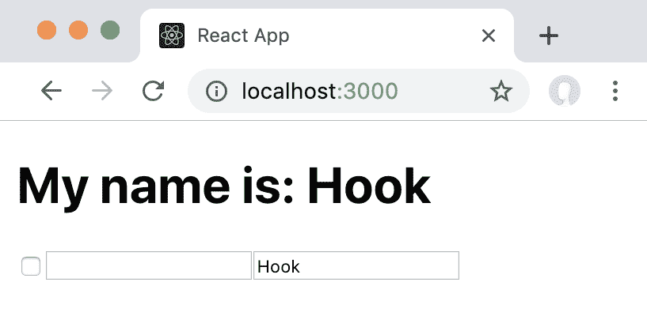
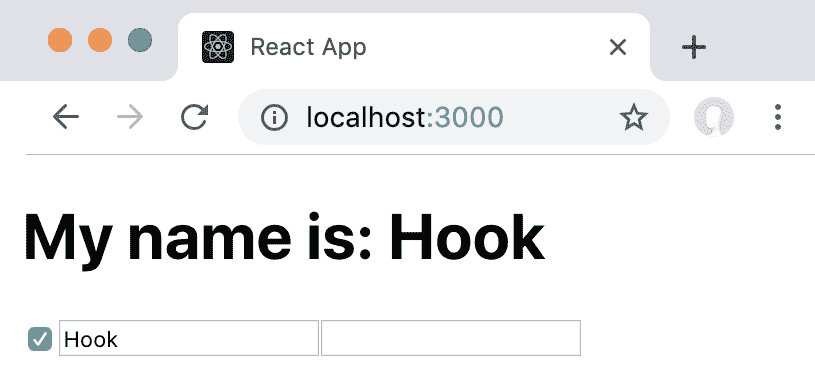
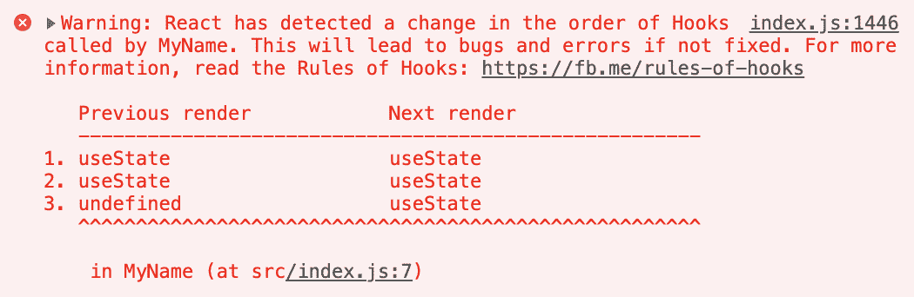
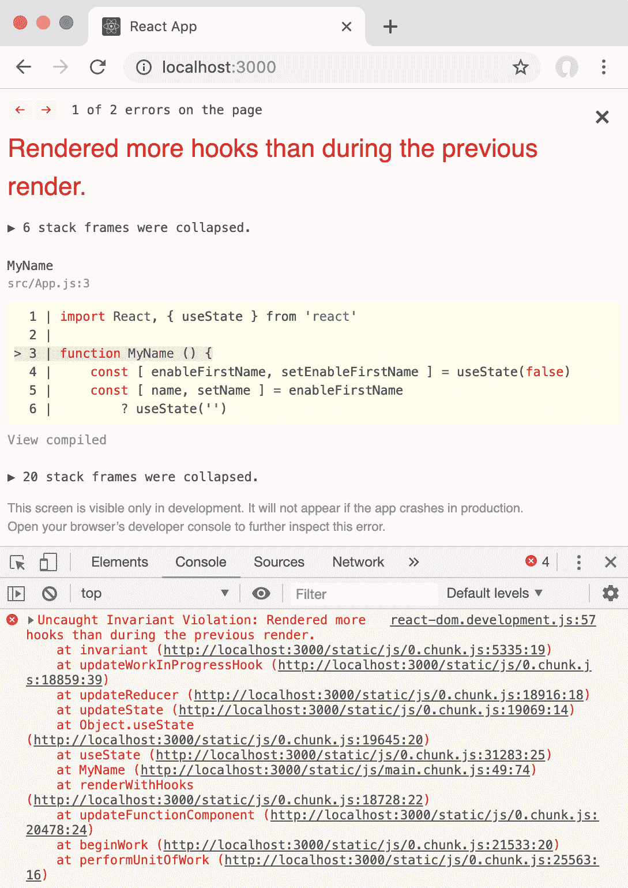
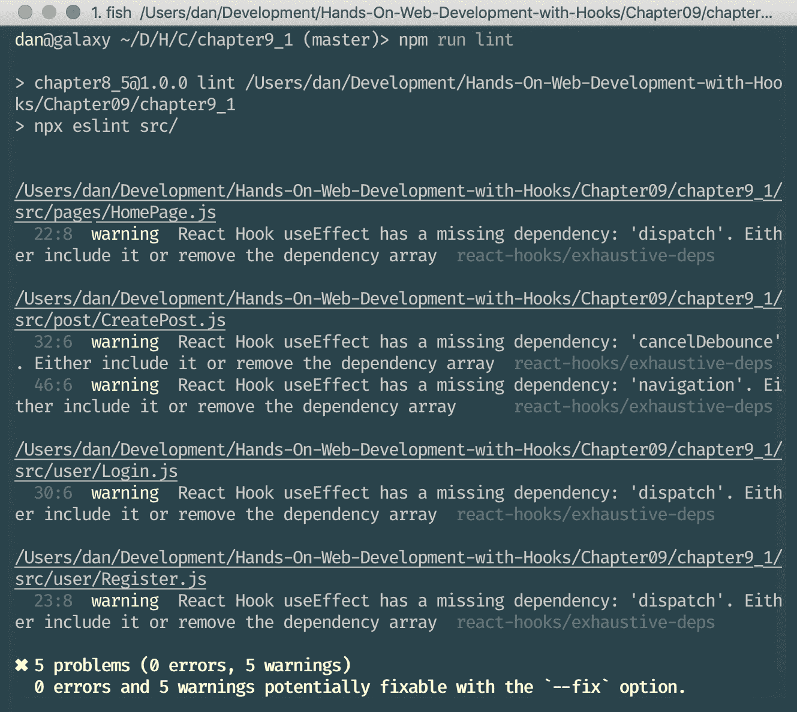
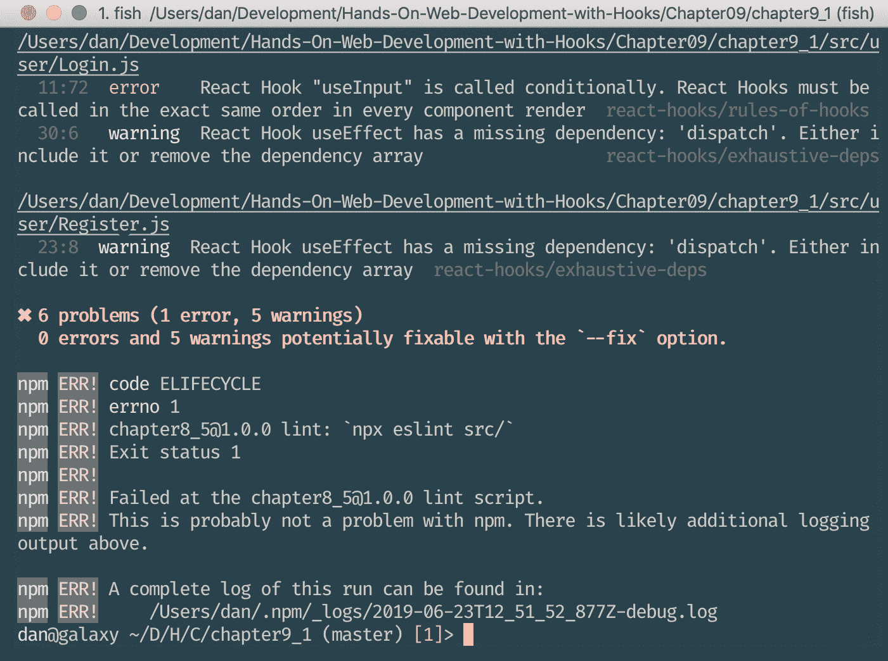
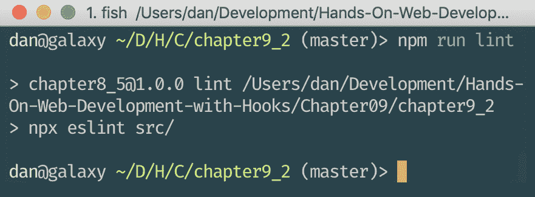

# 第九章：Hooks 的规则

在上一章中，我们学习了如何使用由 React 社区开发的各种 Hooks，以及在哪里找到更多的 Hooks。我们学习了如何用 Hooks 替换 React 生命周期方法，使用实用程序和数据管理 Hooks，使用 Hooks 进行响应式设计，以及使用 Hooks 实现撤销/重做功能。最后，我们学习了在哪里找到其他 Hooks。

在本章中，我们将学习有关使用 Hooks 的一切知识，以及在使用和开发自己的 Hooks 时需要注意的事项。Hooks 在调用顺序方面有一定的限制。违反 Hooks 的规则可能会导致错误或意外行为，因此我们需要确保学习并强制执行规则。

本章将涵盖以下主题：

+   调用 Hooks

+   Hooks 的顺序

+   Hooks 的名称

+   强制执行 Hooks 的规则

+   处理`useEffect`的依赖关系

# 技术要求

应该已经安装了相当新的 Node.js 版本（v11.12.0 或更高）。还需要安装 Node.js 的`npm`包管理器。

本章的代码可以在 GitHub 存储库中找到：[`github.com/PacktPublishing/Learn-React-Hooks/tree/master/Chapter09`](https://github.com/PacktPublishing/Learn-React-Hooks/tree/master/Chapter09)。

查看以下视频以查看代码的运行情况：

[`bit.ly/2Mm9yoC`](http://bit.ly/2Mm9yoC)

请注意，强烈建议您自己编写代码。不要简单地运行提供的代码示例。重要的是要自己编写代码以便正确学习和理解。但是，如果遇到任何问题，您可以随时参考代码示例。

现在，让我们开始本章。

# 调用 Hooks

Hooks 应该只在*React 函数组件*或*自定义 Hooks*中调用。它们不能在类组件或常规 JavaScript 函数中使用。

Hooks 可以在以下顶层调用：

+   React 函数组件

+   自定义 Hooks（我们将在下一章学习如何创建自定义 Hooks）

正如我们所看到的，Hooks 大多是普通的 JavaScript 函数，只是它们依赖于在 React 函数组件中定义。当然，使用其他 Hooks 的自定义 Hooks 可以在 React 函数组件之外*定义*，但是在*使用*Hooks 时，我们总是需要确保在 React 函数组件内调用它们。接下来，我们将学习有关 Hooks 顺序的规则。

# Hooks 的顺序

只在函数组件或自定义 Hooks 的**顶层**/**开头**调用 Hooks。

不要在条件、循环或嵌套函数中调用 Hooks——这样会改变 Hooks 的顺序，导致错误。我们已经学到改变 Hooks 的顺序会导致多个 Hooks 之间的状态混乱。

在第二章中，*使用 State Hook*，我们学到不能做以下事情：

```jsx
const [ enableFirstName, setEnableFirstName ] = useState(false)
const [ name, setName ] = enableFirstName
 ? useState('')
 : [ '', () => {} ] const [ lastName, setLastName ] = useState('')
```

我们渲染了一个复选框和两个输入字段用于`firstName`和`lastName`，然后在`lastName`字段中输入了一些文本：



重新查看我们在第二章“使用 State Hook”中的示例

目前，Hooks 的顺序如下：

1.  `enableFirstName`

1.  `lastName`

接下来，我们点击复选框以启用`firstName`字段。这样做改变了 Hooks 的顺序，因为现在我们的 Hook 定义如下：

1.  `enableFirstName`

1.  `firstName`

1.  `lastName`

由于 React 仅依赖于 Hooks 的顺序来管理它们的状态，`firstName`字段现在是第二个 Hook，因此它从`lastName`字段获取状态：



从第二章“使用 State Hook”中改变 Hooks 的问题

如果我们在第二章的示例 2“我们能定义条件 Hooks 吗？”中使用 React 中真正的`useState` Hook，我们可以看到 React 会自动检测 Hooks 的顺序是否改变，并显示警告：



React 在检测到 Hooks 的顺序已改变时打印警告

在开发模式下运行 React 时，如果渲染的 Hooks 数量比上一次渲染多，它还会崩溃并显示一个 Uncaught Invariant Violation 错误消息：



在开发模式下，当 Hooks 的数量改变时，React 会崩溃

正如我们所看到的，改变 Hooks 的顺序或有条件地启用 Hooks 是不可能的，因为 React 在内部使用 Hooks 的顺序来跟踪哪些数据属于哪个 Hook。

# Hooks 的命名

有一个约定，即 Hook 函数应始终以`use`为前缀，后面跟着以大写字母开头的 Hook 名称；例如：`useState`、`useEffect`和`useResource`。这很重要，因为否则我们将不知道哪些 JavaScript 函数是 Hooks，哪些不是。特别是在强制执行 Hooks 的规则时，我们需要知道哪些函数是 Hooks，以便确保它们不会在条件语句或循环中被调用。

正如我们所看到的，命名约定在技术上并不是必需的，但对开发人员来说会大大简化生活。知道普通函数和 Hooks 之间的区别使得自动执行 Hooks 的规则变得非常容易。在下一节中，我们将学习如何使用`eslint`工具自动执行规则。

# 强制执行 Hooks 的规则

如果我们遵循在 Hook 函数前加上`use`的约定，我们可以自动执行另外两条规则：

+   只从 React 函数组件或自定义 Hooks 中调用 Hooks

+   只在顶层调用 Hooks（不在循环、条件或嵌套函数内部）

为了自动执行规则，React 提供了一个名为`eslint-plugin-react-hooks`的`eslint`插件，它将自动检测何时使用了 Hooks，并确保规则不被违反。ESLint 是一个代码检查工具，它分析源代码并找出样式错误、潜在的 bug 和编程错误等问题。

将来，`create-react-app`将默认包含此插件。

# 设置 eslint-plugin-react-hooks

我们现在要设置 React Hooks `eslint`插件，自动执行 Hooks 的规则。

让我们开始安装和启用`eslint`插件：

1.  首先，我们必须通过`npm`安装插件：

```jsx
> npm install --save-dev eslint-plugin-react-hooks
```

我们在这里使用`--save-dev`标志，因为在部署应用程序时不需要安装`eslint`及其插件。我们只在开发应用程序时需要它们。

1.  然后，在项目文件夹的根目录下创建一个新的`.eslintrc.json`文件，内容如下。我们首先从`react-app`的 ESLint 配置中扩展：

```jsx
{
    "extends": "react-app",
```

1.  接下来，我们包括之前安装的`react-hooks`插件。

```jsx
    "plugins": [
        "react-hooks"
    ],
```

1.  现在我们启用了两个规则。首先，我们告诉 `eslint` 在违反 `rules-of-hooks` 规则时显示错误。此外，我们将 `exhaustive-deps` 规则设置为警告：

```jsx
    "rules": {
        "react-hooks/rules-of-hooks":  "error",
        "react-hooks/exhaustive-deps":  "warn"
    }
}
```

1.  最后，我们调整 `package.json` 来定义一个新的 `lint` 脚本，它将调用 `eslint`：

```jsx
    "scripts": {
 "lint": "npx eslint src/",
```

现在，我们可以执行 `npm run lint`，然后我们会看到有 5 个警告和 0 个错误：



使用 react-hooks 插件执行 ESLint

现在我们将尝试违反 Hooks 规则；例如，通过编辑 `src/user/Login.js` 并使第二个 Input Hook 有条件：

```jsx
 const  {  value:  password,  bindToInput:  bindPassword  }  =  loginFailed  ? useInput('') : [ '',  ()  =>  {} ]
```

再次执行 `npm run lint` 时，我们可以看到现在有一个错误：



在违反 Hooks 规则后执行 ESLint

正如我们所看到的，`eslint` 通过强制我们遵守 Hooks 规则来帮助我们。当我们违反任何规则时，linter 会抛出错误，并在 Effect Hooks 缺少依赖项时显示警告。听从 `eslint` 将帮助我们避免错误和意外行为，因此我们永远不应该忽略它的错误或警告。

# 示例代码

示例代码可以在 `Chapter09/chapter9_1` 文件夹中找到。

只需运行 `npm install` 来安装所有依赖项，并执行 `npm run lint` 来运行 linter。

# 处理 useEffect 依赖关系

除了强制执行 Hooks 规则之外，我们还检查了在 Effect Hook 中使用的所有变量是否都传递给了它的依赖数组。这个 *详尽的依赖* 规则确保每当 Effect Hook 中使用的东西发生变化（函数、值等），Hook 就会再次触发。

正如我们在前一节中看到的，当使用 `npm run lint` 运行 linter 时，会有一些与详尽的依赖规则相关的警告。通常，这与 `dispatch` 函数或其他函数不在依赖数组中有关。通常情况下，这些函数不应该改变，但我们永远不能确定，所以最好将它们添加到依赖项中。

# 使用 eslint 自动修复警告

由于详尽的依赖规则相当简单且容易修复，我们可以让 `eslint` 自动修复它。

为此，我们需要向 `eslint` 传递 `--fix` 标志。使用 `npm run`，我们可以通过使用额外的 `--` 作为分隔符来传递标志，如下所示：

```jsx
> npm run lint -- --fix
```

在运行了上述命令之后，我们可以再次运行 `npm run lint`，然后我们会看到所有警告都已经自动修复了：



让 eslint 修复后没有警告

正如我们所看到的，`eslint`不仅警告我们有问题，甚至可以自动为我们修复其中一些问题！

# 示例代码

示例代码可以在`Chapter09/chapter9_2`文件夹中找到。

只需运行`npm install`来安装所有依赖项，并执行`npm run lint`来运行 linter。

# 摘要

在本章中，我们首先了解了 Hooks 的两个规则：我们应该只从 React 函数组件中调用 Hooks，并且我们需要确保 Hooks 的顺序保持不变。此外，我们还了解了 Hooks 的命名约定，它们应该始终以`use`前缀开头。然后，我们学习了如何使用`eslint`强制执行 Hooks 的规则。最后，我们学习了关于`useEffect`依赖项，以及如何使用`eslint`自动修复缺少的依赖项。

了解 Hooks 的规则，并强制执行它们，对于避免错误和意外行为非常重要。在创建我们自己的 Hooks 时，这些规则将特别重要。现在我们对 Hooks 的工作原理有了很好的理解，包括它们的规则和约定，在下一章中，我们将学习如何创建我们自己的 Hooks！

# 问题

为了总结本章学到的知识，请尝试回答以下问题：

1.  Hooks 可以在哪里调用？

1.  我们可以在 React 类组件中使用 Hooks 吗？

1.  关于 Hooks 的顺序，我们需要注意什么？

1.  Hooks 可以在条件、循环或嵌套函数中调用吗？

1.  Hooks 的命名约定是什么？

1.  我们如何自动强制执行 Hooks 的规则？

1.  什么是完整的依赖规则？

1.  我们如何自动修复 linter 警告？

# 进一步阅读

如果您对本章学到的概念感兴趣，可以查看以下阅读材料：

+   官方 React 文档中的 Hooks 规则：[`reactjs.org/docs/hooks-rules.html`](https://reactjs.org/docs/hooks-rules.html)。

+   ESLint 的官方网站：[`eslint.org/`](https://eslint.org/)。
