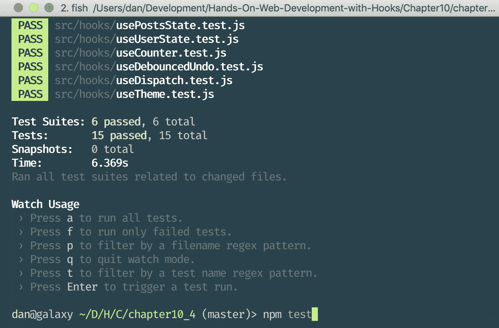

# 第十章：构建自己的 Hooks

在上一章中，我们了解了 Hooks 的限制和规则。我们了解了在哪里调用 Hooks，为什么 Hooks 的顺序很重要，以及 Hooks 的命名约定。最后，我们学习了如何强制执行 Hooks 的规则以及处理`useEffect`的依赖关系。

在本章中，我们将学习如何通过从组件中提取现有代码来创建自定义 Hooks。我们还将学习如何使用自定义 Hooks 以及 Hooks 如何相互交互。然后，我们将学习如何为我们的自定义 Hooks 编写测试。最后，我们将学习有关完整的 React Hooks API。

本章将涵盖以下主题：

+   提取自定义 Hooks

+   使用自定义 Hooks

+   Hooks 之间的交互

+   测试 Hooks

+   探索 React Hooks API

# 技术要求

应该已经安装了相当新的 Node.js 版本（v11.12.0 或更高）。还需要安装 Node.js 的`npm`包管理器。

本章的代码可以在 GitHub 上找到：[`github.com/PacktPublishing/Learn-React-Hooks/tree/master/Chapter10`](https://github.com/PacktPublishing/Learn-React-Hooks/tree/master/Chapter10)。

查看以下视频，以查看代码的实际运行情况：

[`bit.ly/2Mm9yoC`](http://bit.ly/2Mm9yoC)

请注意，强烈建议您自己编写代码。不要简单地运行之前提供的代码示例。重要的是要自己编写代码，以便正确学习和理解。但是，如果遇到任何问题，您可以随时参考代码示例。

现在让我们开始本章。

# 提取自定义 Hooks

通过学习 State 和 Effect Hooks、community Hooks 以及 Hooks 的规则，我们对 Hooks 的概念有了很好的理解，现在我们将构建自己的 Hooks。我们首先从我们的博客应用程序的现有功能中提取自定义 Hooks。通常情况下，如果我们注意到我们在多个组件中使用类似的代码，那么首先编写组件，然后稍后从中提取自定义 Hook 是最合理的。这样做可以避免过早地定义自定义 Hooks，并使我们的项目变得不必要地复杂。

在本节中，我们将提取以下 Hooks：

+   `useTheme` Hook

+   `useUserState`和`usePostsState` Hooks

+   `useDispatch` Hook

+   API Hooks

+   `useDebouncedUndo` Hook

# 创建一个 useTheme Hook

在许多组件中，我们使用 `ThemeContext` 来为我们的博客应用程序设置样式。通常在多个组件中使用的功能通常是创建自定义 Hook 的好机会。正如你可能已经注意到的，我们经常做以下事情：

```jsx
import { ThemeContext } from '../contexts'

export default function SomeComponent () {
    const theme = useContext(ThemeContext)

    // ...
```

我们可以将这个功能抽象成一个 `useTheme` Hook，它将从 `ThemeContext` 中获取 `theme` 对象。

让我们开始创建一个自定义的 `useTheme` Hook：

1.  创建一个新的 `src/hooks/` 目录，这是我们将放置自定义 Hooks 的地方。

1.  创建一个新的 `src/hooks/useTheme.js` 文件。

1.  在这个新创建的文件中，我们首先导入 `useContext` Hook 和 `ThemeContext` 如下：

```jsx
import { useContext } from 'react'
import { ThemeContext } from '../contexts'
```

1.  接下来，我们导出一个名为 `useTheme` 的新函数；这将是我们的自定义 Hook。记住，Hooks 只是以 `use` 关键字为前缀的函数：

```jsx
export default function useTheme () {
```

1.  在我们的自定义 Hook 中，我们现在可以使用 React 提供的基本 Hooks 来构建我们自己的 Hook。在我们的情况下，我们只是返回 `useContext` Hook：

```jsx
    return useContext(ThemeContext)
}
```

我们可以看到，自定义 Hooks 可以非常简单。在这种情况下，自定义 Hook 只返回一个传递给它的 `ThemeContext` 的 Context Hook。然而，这使我们的代码更简洁，以后更容易更改。此外，通过使用 `useTheme` Hook，我们清楚地表明我们想要访问主题，这意味着我们的代码将更容易阅读和理解。

# 创建全局状态 Hooks

我们经常做的另一件事是访问全局状态。例如，一些组件需要 `user` 状态，一些需要 `posts` 状态。为了抽象这个功能，这也将使以后更容易调整状态结构，我们可以创建自定义 Hooks 来获取状态的特定部分：

+   `useUserState`：获取 `state` 对象的 `user` 部分

+   `usePostsState`：获取 `state` 对象的 `posts` 部分

# 定义 useUserState Hook

重复类似于我们为 `useTheme` Hook 所做的过程，我们从 React 中导入 `useContext` Hook 和 `StateContext`。然而，我们现在不返回 Context Hook 的结果，而是通过解构提取 `state` 对象，然后返回 `state.user`。

创建一个新的 `src/hooks/useUserState.js` 文件，内容如下：

```jsx
import { useContext } from 'react'
import { StateContext } from '../contexts'

export default function useUserState () {
    const { state } = useContext(StateContext)
    return state.user
}
```

与 `useTheme` Hook 类似，`useUserState` Hook 使我们的代码更简洁，以后更容易更改，并提高了可读性。

# 定义 usePostsState Hook

我们对 `posts` 状态重复相同的过程。创建一个新的 `src/hooks/usePostsState.js` 文件，内容如下：

```jsx
import { useContext } from 'react'
import { StateContext } from '../contexts'

export default function usePostsState () {
    const { state } = useContext(StateContext)
    return state.posts
}
```

与`useTheme`和`useUserState` Hooks 类似，`usePostsState` Hook 使我们的代码更简洁，更容易以后更改，并提高了可读性。

# 创建一个 useDispatch Hook

在许多组件中，我们需要`dispatch`函数来执行某些操作，所以我们经常需要做以下操作：

```jsx
import { StateContext } from '../contexts'

export default function SomeComponent () {
    const { dispatch } = useContext(StateContext)

    // ...
```

我们可以将这个功能抽象成一个`useDispatch` Hook，它将从全局状态上下文中获取`dispatch`函数。这样做也会使以后更容易替换状态管理实现。例如，以后我们可以用 Redux 或 MobX 等状态管理库来替换我们简单的 Reducer Hook。

让我们现在按照以下步骤定义`useDispatch` Hook：

1.  创建一个新的`src/hooks/useDispatch.js`文件。

1.  从 React 中导入`useContext` Hook 和`StateContext`如下：

```jsx
import { useContext } from 'react'
import { StateContext } from '../contexts'
```

1.  接下来，我们定义并导出`useDispatch`函数；在这里，我们允许传递不同的`context`作为参数，以使 Hook 更通用（以防以后我们想要从本地状态上下文中使用`dispatch`函数）。然而，我们将`context`参数的默认值设置为`StateContext`，如下所示：

```jsx
export default function useDispatch (context = StateContext) {
```

1.  最后，我们通过解构从 Context Hook 中提取`dispatch`函数，并使用以下代码返回它：

```jsx
    const { dispatch } = useContext(context)
    return dispatch
}
```

正如我们所看到的，创建自定义 Dispatch Hook 使我们的代码更容易以后更改，因为我们只需要在一个地方调整`dispatch`函数。

# 创建 API Hooks

我们还可以为各种 API 调用创建 Hooks。将这些 Hooks 放在一个单独的文件中可以让我们以后更容易调整 API 调用。我们将用`useAPI`前缀来命名我们的自定义 API Hooks，这样很容易区分哪些函数是 API Hooks。

让我们现在按照以下步骤为我们的 API 创建自定义 Hooks：

1.  创建一个新的`src/hooks/api.js`文件。

1.  从`react-request-hook`库中导入`useResource` Hook 如下：

```jsx
import { useResource } from 'react-request-hook'
```

1.  首先，我们定义一个`useAPILogin` Hook 来登录用户；我们只需从`src/user/Login.js`文件中剪切并粘贴现有的代码如下：

```jsx
export function useAPILogin () {
    return useResource((username, password) => ({
        url: `/login/${encodeURI(username)}/${encodeURI(password)}`,
        method: 'get'
    }))
}
```

1.  接下来，我们定义一个`useAPIRegister` Hook；我们只需从`src/user/Register.js`文件中剪切并粘贴现有的代码如下：

```jsx
export function useAPIRegister () {
    return useResource((username, password) => ({
        url: '/users',
        method: 'post',
        data: { username, password }
    }))
}
```

1.  现在我们定义一个`useAPICreatePost` Hook，从`src/post/CreatePost.js`文件中剪切并粘贴现有的代码如下：

```jsx
export function useAPICreatePost () {
    return useResource(({ title, content, author }) => ({
        url: '/posts',
        method: 'post',
        data: { title, content, author }
    }))
}
```

1.  最后，我们定义一个`useAPIThemes` Hook，从`src/ChangeTheme.js`文件中剪切并粘贴现有的代码如下：

```jsx
export function useAPIThemes () {
    return useResource(() => ({
        url: '/themes',
        method: 'get'
    }))
}
```

正如我们所看到的，将所有与 API 相关的功能放在一个地方，可以更容易地在以后调整我们的 API 代码。

# 创建一个 useDebouncedUndo Hook

现在我们将创建一个稍微更高级的用于防抖撤销功能的 Hook。我们已经在`CreatePost`组件中实现了这个功能。现在，我们将把这个功能提取到一个自定义的`useDebouncedUndo` Hook 中。

让我们按照以下步骤创建`useDebouncedUndo` Hook：

1.  创建一个新的`src/hooks/useDebouncedUndo.js`文件。

1.  从 React 中导入`useState`、`useEffect`和`useCallback` Hooks，以及`useUndo` Hook 和`useDebouncedCallback` Hook：

```jsx
import { useState, useEffect, useCallback } from 'react'
import useUndo from 'use-undo'
import { useDebouncedCallback } from 'use-debounce'
```

1.  现在我们将定义`useDebouncedUndo`函数，它接受一个用于防抖回调的`timeout`参数：

```jsx
export default function useDebouncedUndo (timeout = 200) {
```

1.  在这个函数中，我们从先前的实现中复制了`useState` Hook，如下所示：

```jsx
    const [ content, setInput ] = useState('')
```

1.  接下来，我们复制`useUndo` Hook；但是，这一次，我们将所有其他与撤销相关的函数存储在一个`undoRest`对象中：

```jsx
    const [ undoContent, { set: setContent, ...undoRest } ] = useUndo('')
```

1.  然后，我们复制`useDebouncedCallback` Hook，用我们的`timeout`参数替换固定的`200`值：

```jsx
    const [ setDebounce, cancelDebounce ] = useDebouncedCallback(
        (value) => {
            setContent(value)
        },
        timeout
    )
```

1.  现在我们复制 Effect Hook，如下所示的代码：

```jsx
    useEffect(() => {
        cancelDebounce()
        setInput(undoContent.present)
    }, [cancelDebounce, undoContent])
```

1.  然后，我们定义一个`setter`函数，它将设置一个新的输入`value`并调用`setDebounce`。我们可以在这里使用`useCallback` Hook 来包装`setter`函数，以返回函数的记忆版本，并避免在使用 Hook 的组件重新渲染时每次重新创建函数。与`useEffect`和`useMemo` Hook 类似，我们还将一个依赖数组作为`useCallback` Hook 的第二个参数传递：

```jsx
    const setter = useCallback(function setterFn (value) {
        setInput(value)
        setDebounce(value)
    }, [ setInput, setDebounce ])
```

1.  最后，我们返回`content`变量（包含当前输入`value`）、`setter`函数和`undoRest`对象（其中包含`undo`/`redo`函数和`canUndo`/`canRedo`布尔值）：

```jsx
    return [ content, setter, undoRest ]
}
```

创建一个用于防抖撤销的自定义 Hook 意味着我们可以在多个组件中重用该功能。我们甚至可以将此 Hook 提供为公共库，让其他人轻松实现防抖撤销功能。

# 导出我们的自定义 Hooks

在创建了所有我们的自定义 Hooks 之后，我们将在我们的 Hooks 目录中创建一个`index.js`文件，并在那里重新导出我们的 Hooks，这样我们就可以按照以下方式导入我们的自定义 Hooks：`import { useTheme } from './hooks'`

现在让我们按照以下步骤导出所有我们的自定义 Hooks：

1.  创建一个新的`src/hooks/index.js`文件。

1.  在这个文件中，我们首先导入我们的自定义 Hooks 如下：

```jsx
import useTheme from './useTheme'
import useDispatch from './useDispatch'
import usePostsState from './usePostsState'
import useUserState from './useUserState'
import useDebouncedUndo from './useDebouncedUndo'
```

1.  然后，我们使用以下代码重新导出这些导入的 Hooks：

```jsx
export { useTheme, useDispatch, usePostsState, useUserState, useDebouncedUndo }
```

1.  最后，我们从`api.js`文件中重新导出所有的 Hooks，如下所示：

```jsx
export * from './api'
```

现在我们已经导出了所有自定义的 Hooks，我们可以直接从`hooks`文件夹中导入 Hooks，这样可以更容易地一次导入多个自定义的 Hooks。

# 示例代码

示例代码可以在`Chapter10/chapter10_1`文件夹中找到。

只需运行`npm install`来安装所有的依赖项，然后运行`npm start`来启动应用程序，然后在浏览器中访问`http://localhost:3000`（如果没有自动打开）。

# 使用我们的自定义 Hooks

创建了我们的自定义 Hooks 之后，我们现在可以开始在整个博客应用程序中使用它们。使用自定义 Hooks 非常简单，因为它们类似于社区 Hooks。就像所有其他 Hooks 一样，自定义 Hooks 只是 JavaScript 函数。

我们创建了以下的 Hooks：

+   `useTheme`

+   `useDispatch`

+   `usePostsState`

+   `useUserState`

+   `useDebouncedUndo`

+   `useAPILogin`

+   `useAPIRegister`

+   `useAPICreatePost`

+   `useAPIThemes`

在这一部分，我们将重构我们的应用程序来使用所有自定义的 Hooks。

# 使用 useTheme Hook

现在，我们可以直接使用`useTheme` Hook，而不是使用`ThemeContext`的`useContext` Hook！如果以后我们改变了主题系统，我们只需修改`useTheme` Hook，新系统就会在整个应用程序中实现。

让我们重构我们的应用程序来使用`useTheme` Hook：

1.  编辑`src/Header.js`，并用`useTheme` Hook 的导入替换现有的导入。`ThemeContext`和`useContext`的导入可以被移除：

```jsx
import { useTheme } from './hooks'
```

1.  然后，将当前的 Context Hook 定义替换为`useTheme` Hook，如下所示：

```jsx
    const { primaryColor } = useTheme()
```

1.  现在编辑`src/post/Post.js`，并在那里进行类似的导入调整：

```jsx
import { useTheme } from './hooks'
```

1.  然后，将`useContext` Hook 替换为以下的`useTheme` Hook：

```jsx
    const { secondaryColor } = useTheme()
```

正如我们所看到的，使用自定义 Hook 使我们的代码更加简洁和易于阅读。现在我们继续使用全局状态的 Hooks。

# 使用全局状态的 Hooks

与我们对`ThemeContext`所做的类似，我们也可以用`usePostsState`、`useUserState`和`useDispatch` Hook 替换我们的状态 Context Hooks。如果以后我们想要更改状态逻辑，这是最佳的选择。例如，如果我们的状态增长并且我们想要使用更复杂的系统，比如 Redux 或 MobX，那么我们只需调整现有的 Hooks，一切都会像以前一样工作。

在这一部分，我们将调整以下组件：

+   `UserBar`

+   `Login`

+   `Register`

+   `Logout`

+   `CreatePost`

+   `PostList`

# 调整`UserBar`组件

首先，我们将调整`UserBar`组件。在这里，我们可以按照以下步骤使用`useUserState` Hook：

1.  编辑`src/user/UserBar.js`并导入`useUserState` Hook：

```jsx
import { useUserState } from '../hooks'
```

1.  然后，我们移除以下 Hook 定义：

```jsx
    const { state } = useContext(StateContext)
    const { user } = state
```

1.  我们用我们自定义的`useUserState` Hook 替换它：

```jsx
    const user = useUserState()
```

现在`UserBar`组件使用我们的自定义 Hook，而不是直接访问`user`状态。

# 调整`Login`组件

接下来，我们将调整`Login`组件，这里我们可以使用`useDispatch` Hook。具体步骤如下所述：

1.  编辑`src/user/Login.js`并导入`useDispatch` Hook，如下所示：

```jsx
import { useDispatch } from '../hooks'
```

1.  然后移除以下 Context Hook：

```jsx
    const { dispatch } = useContext(StateContext)
```

1.  用我们自定义的`useDispatch` Hook 替换它：

```jsx
    const dispatch = useDispatch()
```

现在`Login`组件使用我们的自定义 Hook，而不是直接访问`dispatch`函数。接下来，我们将调整`Register`组件。

# 调整`Register`组件

与`Login`组件类似，我们也可以在`Register`组件中使用`useDispatch` Hook，具体步骤如下所示：

1.  编辑`src/user/Register.js`并导入`useDispatch` Hook：

```jsx
import { useDispatch } from '../hooks'
```

1.  然后，用我们自定义的 Dispatch Hook 替换当前的 Context Hook，如下所示：

```jsx
    const dispatch = useDispatch()
```

现在`Register`组件也使用我们的自定义 Hook，而不是直接访问`dispatch`函数。

# 调整`Logout`组件

然后，我们将调整`Logout`组件，以使用`useUserState`和`useDispatch` Hooks，具体步骤如下：

1.  编辑`src/user/Logout.js`并导入`useUserState`和`useDispatch` Hooks：

```jsx
import { useDispatch, useUserState } from '../hooks'
```

1.  然后，用以下内容替换当前的 Hook 定义：

```jsx
    const dispatch = useDispatch()
    const user = useUserState()
```

现在`Logout`组件使用我们的自定义 Hooks，而不是直接访问`user`状态和`dispatch`函数。

# 调整`CreatePost`组件

接下来，我们将调整`CreatePost`组件，这与我们对`Logout`组件所做的类似。具体步骤如下所述：

1.  编辑`src/post/CreatePost.js`并导入`useUserState`和`useDispatch` Hooks：

```jsx
import { useUserState, useDispatch } from '../hooks'
```

1.  然后，用以下内容替换当前的 Context Hook 定义：

```jsx
    const user = useUserState()
    const dispatch = useDispatch()
```

现在`CreatePost`组件使用我们的自定义 Hooks，而不是直接访问`user`状态和`dispatch`函数。

# 调整`PostList`组件

最后，我们将使用`usePostsState` Hook 来渲染`PostList`组件，如下所示：

1.  编辑`src/post/PostList.js`并导入`usePostsState` Hook：

```jsx
import { usePostsState } from '../hooks'
```

1.  然后用以下内容替换当前的 Hook 定义：

```jsx
    const posts = usePostsState()
```

现在`PostList`组件使用我们自定义的 Hook 而不是直接访问`posts`状态。

# 使用 API Hooks

接下来，我们将用我们自定义的 API Hooks 替换所有`useResource` Hooks。这样做可以让我们将所有 API 调用放在一个文件中，以便以后可以轻松调整它们，以防 API 发生变化。

在本节中，我们将调整以下组件：

+   `ChangeTheme`

+   `Register`

+   `Login`

+   `CreatePost`

让我们开始吧。

# 调整 ChangeTheme 组件

首先，我们将调整`ChangeTheme`组件，并用我们自定义的`useAPIThemes` Hook 替换访问`/themes`的 Resource Hook，步骤如下：

1.  在`src/ChangeTheme.js`中，删除以下`useResource` Hook 导入语句：

```jsx
import { useResource } from 'react-request-hook'
```

用我们自定义的`useAPIThemes` Hook 替换它：

```jsx
import { useAPIThemes } from './hooks'
```

1.  然后，用以下自定义 Hook 替换`useResource` Hook 定义：

```jsx
    const [ themes, getThemes ] = useAPIThemes()
```

现在`ChangeTheme`组件使用我们自定义的 API Hook 从 API 中获取主题。

# 调整注册组件

接下来，我们将通过以下步骤调整`Register`组件：

1.  编辑`src/user/Register.js`并调整导入语句以导入`useAPIRegister` Hook：

```jsx
import { useDispatch, useAPIRegister } from '../hooks'
```

1.  然后，用以下内容替换当前的 Resource Hook：

```jsx
    const [ user, register ] = useAPIRegister()
```

现在`Register`组件使用我们自定义的 API Hook 通过 API“注册”用户。

# 调整登录组件

与`Register`组件类似，我们还将调整`Login`组件：

1.  编辑`src/user/Login.js`并调整导入语句以导入`useAPILogin` Hook：

```jsx
import { useDispatch, useAPILogin } from '../hooks'
```

1.  然后，用以下内容替换当前的 Resource Hook：

```jsx
    const [ user, login ] = useAPILogin()
```

现在`Login`组件使用我们自定义的 API Hook 通过 API 登录用户。

# 调整 CreatePost 组件

最后，我们将通过以下步骤调整`CreatePost`组件：

1.  编辑`src/post/CreatePost.js`并调整导入语句以导入`useAPICreatePost` Hook：

```jsx
import { useUserState, useDispatch, useAPICreatePost } from '../hooks'
```

1.  然后，用以下内容替换当前的 Resource Hook：

```jsx
    const [ post, createPost ] = useAPICreatePost()
```

现在`CreatePost`组件使用我们自定义的 API Hook 通过 API 创建新帖子。

# 使用 useDebouncedUndo Hook

最后，我们将在`src/post/CreatePost.js`文件中用我们自定义的`useDebouncedUndo` 钩子替换所有防抖撤销逻辑。这样做将使我们的组件代码更加清晰和易于阅读。此外，我们以后可以在其他组件中重用相同的防抖撤销功能。

让我们通过以下步骤在`CreatePost`组件中开始使用 Debounced Undo 钩子：

1.  编辑`src/post/CreatePost.js`并导入`useDebouncedUndo` 钩子：

```jsx
import { useUserState, useDispatch, useDebouncedUndo, useAPICreatePost } from '../hooks'
```

1.  然后，移除与防抖撤销处理相关的以下代码：

```jsx
    const [ content, setInput ] = useState('')
    const [ undoContent, {
        set: setContent,
        undo,
        redo,
        canUndo,
        canRedo
    } ] = useUndo('')

    const [ setDebounce, cancelDebounce ] = useDebouncedCallback(
        (value) => {
            setContent(value)
        },
        200
    )
    useEffect(() => {
        cancelDebounce()
        setInput(undoContent.present)
    }, [cancelDebounce, undoContent])
```

用我们自定义的`useDebouncedUndo` 钩子替换它，如下所示：

```jsx
    const [ content, setContent, { undo, redo, canUndo, canRedo } ] = useDebouncedUndo()
```

1.  最后，在我们的`handleContent`函数中移除以下设置函数（用粗体标记）：

```jsx
    function handleContent (e) {
        const { value } = e.target
 setInput(value)
 setDebounce(value)
    }
```

现在我们可以使用我们自定义钩子提供的`setContent`函数：

```jsx
    function handleContent (e) {
        const { value } = e.target
        setContent(value)
    }
```

如您所见，我们的代码现在更加清晰、简洁和易于阅读。此外，我们以后可以在其他组件中重用 Debounced Undo 钩子。

# 示例代码

示例代码可以在`Chapter10/chapter10_2`文件夹中找到。

只需运行`npm install`来安装所有依赖项，然后运行`npm start`来启动应用程序，然后在浏览器中访问`http://localhost:3000`（如果没有自动打开）。

# 钩子之间的交互

我们整个博客应用现在的工作方式与以前相同，但它使用我们自定义的钩子！到目前为止，我们一直有封装整个逻辑的钩子，只有常量值作为参数传递给我们的自定义钩子。然而，我们也可以将其他钩子的值传递给自定义钩子！

由于钩子只是 JavaScript 函数，所有钩子都可以接受任何值作为参数并与它们一起工作：常量值、组件 props，甚至来自其他钩子的值。

我们现在要创建本地钩子，这意味着它们将放在与组件相同的文件中，因为它们在其他地方都不需要。但是，它们仍然会使我们的代码更易于阅读和维护。这些本地钩子将接受来自其他钩子的值作为参数。

以下本地钩子将被创建：

+   本地注册效果钩子

+   本地登录效果钩子

让我们看看如何在以下小节中创建它们。

# 创建本地注册效果钩子

首先，我们将从我们的`Login`组件中提取 Effect Hook 到一个单独的`useRegisterEffect` 钩子函数中。这个函数将接受来自其他钩子的以下值作为参数：`user`和`dispatch`。

现在让我们使用以下步骤为`Register`组件创建一个本地 Effect Hook：

1.  编辑`src/user/Register.js`并在组件函数之外定义一个新函数，在导入语句之后：

```jsx
function useRegisterEffect (user, dispatch) {
```

1.  对于函数的内容，从`Register`组件中剪切现有的 Effect Hook，并将其粘贴在这里：

```jsx
    useEffect(() => {
        if (user && user.data) {
            dispatch({ type: 'REGISTER', username: user.data.username })
        }
    }, [dispatch, user])
}
```

1.  最后，定义我们的自定义`useLoginEffect` Hook，在其中剪切出先前的 Effect Hook，并将其他 Hooks 的值传递给它：

```jsx
    useRegisterEffect(user, dispatch)
```

正如我们所看到的，将效果提取到一个单独的函数中使我们的代码更易于阅读和维护。

# 创建一个本地登录效果钩子

重复类似的过程到本地`Register` Effect Hook，我们还将从`Login`组件中提取 Effect Hook 到一个单独的`useLoginEffect` Hook 函数。这个函数将接受来自其他 Hooks 的以下值作为参数：`user`，`dispatch`和`setLoginFailed`。

现在让我们使用以下步骤为`Login`组件创建一个本地 Hook：

1.  编辑`src/user/Login.js`并在组件函数之外定义一个新函数，在导入语句之后：

```jsx
function useLoginEffect (user, dispatch, setLoginFailed) {
```

1.  对于函数的内容，从`Login`组件中剪切现有的 Effect Hook，并将其粘贴在这里：

```jsx
    useEffect(() => {
        if (user && user.data) {
            if (user.data.length > 0) {
                setLoginFailed(false)
                dispatch({ type: 'LOGIN', username: user.data[0].username })
            } else {
                setLoginFailed(true)
            }
        }
        if (user && user.error) {
            setLoginFailed(true)
        }
    }, [dispatch, user, setLoginFailed])
}
```

在这里，我们还将`setLoginFailed`添加到 Effect Hook 的依赖项中。这是为了确保每当`setter`函数发生变化时（在使用 Hook 时可能会发生），Hook 会再次触发。始终传递 Effect Hook 的所有依赖项，包括函数，可以防止以后出现错误和意外行为。

1.  最后，定义我们的自定义`useLoginEffect` Hook，在其中剪切出先前的 Effect Hook，并将其他 Hooks 的值传递给它：

```jsx
    useLoginEffect(user, dispatch, setLoginFailed)
```

正如我们所看到的，将效果提取到一个单独的函数中使我们的代码更易于阅读和维护。

# 示例代码

示例代码可以在`Chapter10/chapter10_3`文件夹中找到。

只需运行`npm install`来安装所有依赖项，然后运行`npm start`来启动应用程序，然后在浏览器中访问`http://localhost:3000`（如果没有自动打开）。

# 测试 Hooks

现在我们的博客应用程序充分利用了 Hooks！我们甚至为各种功能定义了自定义 Hooks，使我们的代码更具可重用性，简洁和易于阅读。

在定义自定义 Hooks 时，编写测试对它们进行测试是有意义的，以确保它们能够正常工作，即使以后我们对它们进行更改或添加更多选项。

为了测试我们的 Hooks，我们将使用 Jest 测试运行器，它包含在我们的`create-react-app`项目中。然而，由于 Hooks 的规则，我们不能从测试函数中调用 Hooks，因为它们只能在函数组件的主体内部调用。

因为我们不想为每个测试专门创建一个组件，我们将使用 React Hooks 测试库直接测试 Hooks。该库实际上创建一个测试组件，并提供各种实用函数来与 Hook 交互。

# 使用 React Hooks 测试库

除了 React Hooks 测试库，我们还需要一个专门的 React 渲染器。我们使用`react-dom`将 React 组件渲染到 DOM 中，而在测试中，我们可以使用`react-test-renderer`。现在我们将通过`npm`安装 React Hooks 测试库和`react-test-renderer`：

```jsx
> npm install --save-dev @testing-library/react-hooks react-test-renderer
```

应在以下情况下使用 React Hooks 测试库：

+   在编写定义 Hooks 的库时

+   当您有 Hooks 在多个组件中使用时（全局 Hooks）

然而，当一个 Hook 只在单个组件中定义和使用时（局部 Hooks），不应该使用该库。

在这种情况下，我们应该直接使用 React Testing Library 测试组件。然而，测试 React 组件超出了本书的范围。有关测试组件的更多信息可以在库网站上找到：[`testing-library.com/docs/react-testing-library/intro`](https://testing-library.com/docs/react-testing-library/intro)。

# 测试简单的 Hooks

首先，我们将测试一个非常简单的 Hook，它不使用上下文或异步代码，比如超时。为了做到这一点，我们将创建一个名为`useCounter`的新 Hook。然后，我们将测试 Hook 的各个部分。

本节将涵盖以下任务：

+   创建`useCounter` Hook

+   测试结果

+   测试 Hook 动作

+   测试初始值

+   测试重置和强制重新渲染

现在让我们开始吧。

# 创建`useCounter` Hook

`useCounter` Hook 将提供当前的`count`和用于`增加`和`重置`计数器的函数。

现在让我们使用以下步骤创建`useCounter` Hook：

1.  创建一个新的`src/hooks/useCounter.js`文件。

1.  从 React 中导入`useState`和`useCallback` Hooks 如下：

```jsx
import { useState, useCallback } from 'react'
```

1.  我们使用一个参数`initialCount`来定义一个新的`useCounter` Hook 函数：

```jsx
export default function useCounter (initialCount = 0) {
```

1.  然后，我们使用以下代码为`count`值定义一个新的 State Hook：

```jsx
    const [ count, setCount ] = useState(initialCount)
```

1.  接下来，我们定义增加和重置`count`的函数，如下所示：

```jsx
    const increment = useCallback(() => setCount(count + 1), [])
    const reset = useCallback(() => setCount(initialCount), [initialCount])
```

1.  最后，我们返回当前的`count`和两个函数：

```jsx
    return { count, increment, reset }
}
```

现在我们已经定义了一个简单的 Hook，我们可以开始测试它。

# 测试 useCounter Hook 结果

现在让我们按照以下步骤为我们创建的`useCounter` Hook 编写测试：

1.  创建一个新的`src/hooks/useCounter.test.js`文件。

1.  从 React Hooks 测试库中导入`renderHook`和`act`函数，因为我们将在稍后使用它们：

```jsx
import { renderHook, act } from '@testing-library/react-hooks'
```

1.  还要导入要测试的`useCounter` Hook，如下所示：

```jsx
import useCounter from './useCounter'
```

1.  现在我们可以编写我们的第一个测试。要定义一个测试，我们使用 Jest 的`test`函数。第一个参数是测试的名称，第二个参数是要作为测试运行的函数：

```jsx
test('should use counter', () => {
```

1.  在这个测试中，我们使用`renderHook`函数来定义我们的 Hook。这个函数返回一个带有`result`键的对象，其中将包含我们 Hook 的结果：

```jsx
    const { result } = renderHook(() => useCounter())
```

1.  现在我们可以使用 Jest 的`expect`来检查`result`对象的值。`result`对象包含一个`current`键，其中将包含来自 Hook 的当前结果：

```jsx
    expect(result.current.count).toBe(0)
    expect(typeof result.current.increment).toBe('function')
})
```

正如我们所看到的，为 Hook 结果编写测试非常简单！创建自定义 Hook 时，特别是当它们将被公开使用时，我们应该始终编写测试以确保它们正常工作。

# 测试 useCounter Hook 操作

使用 React Hooks 测试库中的`act`函数，我们可以执行 Hook 中的函数，然后检查新的结果。

现在让我们测试我们的 Counter Hook 的操作：

1.  按照以下代码编写一个新的`test`函数：

```jsx
test('should increment counter', () => {
    const { result } = renderHook(() => useCounter())
```

1.  在`act`函数内调用 Hook 的`increment`函数：

```jsx
    act(() => result.current.increment())
```

1.  最后，我们检查新的`count`现在是否为`1`：

```jsx
    expect(result.current.count).toBe(1)
})
```

正如我们所看到的，我们可以简单地使用`act`函数来触发我们的 Hook 中的操作，然后像以前一样测试值。

# 测试 useCounter 初始值

我们还可以在调用`act`之前和之后检查结果，并将初始值传递给我们的 Hook。

现在让我们测试我们的 Hook 的初始值：

1.  定义一个新的`test`函数，将初始值`123`传递给 Hook：

```jsx
test('should use initial value', () => {
    const { result } = renderHook(() => useCounter(123))
```

1.  现在我们可以检查`current`值是否等于初始值，调用`increment`，并确保`count`从初始值增加：

```jsx
    expect(result.current.count).toBe(123)
    act(() => result.current.increment())
    expect(result.current.count).toBe(124)
})
```

正如我们所看到的，我们可以简单地将初始值传递给 Hook，并检查值是否相同。

# 测试重置和强制重新渲染

现在我们要模拟组件的 props 发生变化。假设我们 Hook 的初始值是一个 prop，最初是`0`，然后后来变成了`123`。如果我们现在重置计数器，它应该重置为`123`而不是`0`。然而，为了做到这一点，我们需要在改变值后强制重新渲染我们的测试组件。

现在让我们测试重置并强制组件重新渲染：

1.  定义`test`函数和一个`initial`值的变量：

```jsx
test('should reset to initial value', () => {
    let initial = 0
```

1.  接下来，我们将渲染我们的 Hook，但这次，我们还通过解构赋值取出`rerender`函数：

```jsx
    const { result, rerender } = renderHook(() => useCounter(initial))
```

1.  现在我们设置一个新的`initial`值并调用`rerender`函数：

```jsx
    initial = 123
    rerender()
```

1.  我们的`initial`值现在应该已经改变了，所以当我们调用`reset`时，`count`将被设置为`123`：

```jsx
    act(() => result.current.reset())
    expect(result.current.count).toBe(123)
})
```

正如我们所看到的，测试库创建了一个虚拟组件，用于测试 Hook。我们可以强制这个虚拟组件重新渲染，以模拟在真实组件中 props 发生变化时会发生什么。

# 测试上下文 Hooks

使用 React Hooks 测试库，我们也可以测试更复杂的 Hooks，比如使用 React 上下文的 Hooks。我们为博客应用程序创建的大多数自定义 Hooks 都使用了上下文，所以我们现在要测试这些。要测试使用上下文的 Hooks，我们首先必须创建一个上下文包装器，然后我们可以测试这个 Hook。

在这一部分，我们将执行以下操作：

+   创建一个`ThemeContextWrapper`组件

+   测试`useTheme` Hook

+   创建一个`StateContextWrapper`组件

+   测试`useDispatch` Hook

+   测试`useUserState` Hook

+   测试`usePostsState` Hook

让我们开始吧。

# 创建 ThemeContextWrapper

为了能够测试 Theme Hook，我们首先必须设置上下文并为 Hook 的测试组件提供一个包装器组件。

现在让我们创建`ThemeContextWrapper`组件：

1.  创建一个新的`src/hooks/testUtils.js`文件。

1.  导入`React`和`ThemeContext`，如下所示：

```jsx
import React from 'react'
import { ThemeContext } from '../contexts'
```

1.  定义一个名为`ThemeContextWrapper`的新函数组件；它将接受`children`作为 props：

```jsx
export function ThemeContextWrapper ({ children }) {
```

`children`是 React 组件的一个特殊 prop。它将包含作为`children`传递给它的所有其他组件；例如，`<ThemeContextWrapper>{children}</ThemeContextWrapper>`。

1.  我们返回一个带有默认主题的`ThemeContext.Provider`，然后将`children`传递给它：

```jsx
    return (
        <ThemeContext.Provider value={{ primaryColor: 'deepskyblue', secondaryColor: 'coral' }}>
            {children}
        </ThemeContext.Provider>
    )
}
```

正如我们所看到的，上下文包装器简单地返回一个上下文提供者组件。

# 测试 useTheme Hook

现在我们已经定义了`ThemeContextWrapper`组件，我们可以在测试`useTheme` Hook 时使用它。

现在让我们按照以下步骤测试`useTheme` Hook：

1.  创建一个新的`src/hooks/useTheme.test.js`文件。

1.  导入`renderHook`函数以及`ThemeContextWrapper`和`useTheme` Hook。

```jsx
import { renderHook } from '@testing-library/react-hooks'
import { ThemeContextWrapper } from './testUtils'
import useTheme from './useTheme'
```

1.  接下来，使用`renderHook`函数定义`test`，并将`wrapper`作为第二个参数传递给它。这样做将使用定义的`wrapper`组件包装测试组件，这意味着我们将能够在 Hook 中使用提供的上下文。

```jsx
test('should use theme', () => {
    const { result } = renderHook(
        () => useTheme(),
        { wrapper: ThemeContextWrapper }
    )
```

1.  现在我们可以检查我们的 Hook 的结果，它应该包含在`ThemeContextWrapper`中定义的颜色。

```jsx
    expect(result.current.primaryColor).toBe('deepskyblue')
    expect(result.current.secondaryColor).toBe('coral')
```

正如我们所看到的，提供上下文包装器后，我们可以测试使用上下文的 Hook，就像我们测试简单的 Counter Hook 一样。

# 创建`StateContextWrapper`

对于其他使用`StateContext`的 Hook，我们必须定义另一个包装器来向 Hook 提供`StateContext`。

现在让我们按照以下步骤定义`StateContextWrapper`组件：

1.  编辑`src/hooks/testUtils.js`并调整导入语句以导入`useReducer` Hook，`StateContext`和`appReducer`函数。

```jsx
import React, { useReducer } from 'react'
import { StateContext, ThemeContext } from '../contexts'
import appReducer from '../reducers' 
```

1.  定义一个名为`StateContextWrapper`的新函数组件。在这里，我们将使用`useReducer` Hook 来定义应用程序状态，这与我们在`src/App.js`文件中所做的类似。

```jsx
export function StateContextWrapper ({ children }) {
    const [ state, dispatch ] = useReducer(appReducer, { user: '', posts: [], error: '' })
```

1.  接下来，定义并返回`StateContext.Provider`，这与我们为`ThemeContextWrapper`所做的类似。

```jsx
    return (
        <StateContext.Provider value={{ state, dispatch }}>
            {children}
        </StateContext.Provider>
    )
}
```

正如我们所看到的，创建上下文包装器总是类似的。然而，这一次，我们还在我们的包装器组件中定义了一个 Reducer Hook。

# 测试`useDispatch` Hook

现在我们已经定义了`StateContextWrapper`，我们可以使用它来测试`useDispatch` Hook。

让我们按照以下步骤测试`useDispatch` Hook：

1.  创建一个新的`src/hooks/useDispatch.test.js`文件。

1.  导入`renderHook`函数，`StateContextWrapper`组件和`useDispatch` Hook。

```jsx
import { renderHook } from '@testing-library/react-hooks'
import { StateContextWrapper } from './testUtils'
import useDispatch from './useDispatch'
```

1.  然后，定义`test`函数，将`StateContextWrapper`组件传递给它。

```jsx
test('should use dispatch', () => {
    const { result } = renderHook(
        () => useDispatch(),
        { wrapper: StateContextWrapper }
    )
```

1.  最后，检查 Dispatch Hook 的结果是否是一个函数（`dispatch`函数）：

```jsx
    expect(typeof result.current).toBe('function')
})
```

正如我们所看到的，使用`wrapper`组件总是以相同的方式工作，即使我们在`wrapper`组件中使用其他 Hook。

# 测试`useUserState` Hook

使用`StateContextWrapper`和 Dispatch Hook，我们现在可以通过派发`LOGIN`和`REGISTER`动作并检查结果来测试`useUserState` Hook。要派发这些动作，我们使用测试库中的`act`函数。

让我们测试`useUserState` Hook：

1.  创建一个新的`src/hooks/useUserState.test.js`文件。

1.  导入必要的函数，`useDispatch`和`useUserState` Hooks，以及`StateContextWrapper`：

```jsx
import { renderHook, act } from '@testing-library/react-hooks'
import { StateContextWrapper } from './testUtils'
import useDispatch from './useDispatch'
import useUserState from './useUserState'
```

1.  接下来，我们编写一个测试，检查初始的`user`状态：

```jsx
test('should use user state', () => {
    const { result } = renderHook(
        () => useUserState(),
        { wrapper: StateContextWrapper }
    )

    expect(result.current).toBe('')
})
```

1.  然后，我们编写一个测试，派发一个`LOGIN`动作，然后检查新的状态。现在我们不再返回单个 Hook，而是返回一个包含两个 Hook 结果的对象：

```jsx
test('should update user state on login', () => {
    const { result } = renderHook(
        () => ({ state: useUserState(), dispatch: useDispatch() }),
        { wrapper: StateContextWrapper }
    )

    act(() => result.current.dispatch({ type: 'LOGIN', username: 'Test User' }))
    expect(result.current.state).toBe('Test User')
})
```

1.  最后，我们编写一个测试，派发一个`REGISTER`动作，然后检查新的状态：

```jsx
test('should update user state on register', () => {
    const { result } = renderHook(
        () => ({ state: useUserState(), dispatch: useDispatch() }),
        { wrapper: StateContextWrapper }
    )

    act(() => result.current.dispatch({ type: 'REGISTER', username: 'Test User' }))
    expect(result.current.state).toBe('Test User')
})
```

正如我们所看到的，我们可以从我们的测试中访问`state`对象和`dispatch`函数。

# 测试`usePostsState` Hook

与我们测试`useUserState` Hook 的方式类似，我们也可以测试`usePostsState` Hook。

现在让我们测试`usePostsState` Hook：

1.  创建一个新的`src/hooks/usePostsState.test.js`文件。

1.  导入必要的函数，`useDispatch`和`usePostsState` Hooks，以及`StateContextWrapper`：

```jsx
import { renderHook, act } from '@testing-library/react-hooks'
import { StateContextWrapper } from './testUtils'
import useDispatch from './useDispatch'
import usePostsState from './usePostsState'
```

1.  然后，我们测试`posts`数组的初始状态：

```jsx
test('should use posts state', () => {
    const { result } = renderHook(
        () => usePostsState(),
        { wrapper: StateContextWrapper }
    )

    expect(result.current).toEqual([])
})
```

1.  接下来，我们测试一个`FETCH_POSTS`动作是否替换了当前的`posts`数组：

```jsx
test('should update posts state on fetch action', () => {
    const { result } = renderHook(
        () => ({ state: usePostsState(), dispatch: useDispatch() }),
        { wrapper: StateContextWrapper }
    )

    const samplePosts = [{ id: 'test' }, { id: 'test2' }]
    act(() => result.current.dispatch({ type: 'FETCH_POSTS', posts: samplePosts }))
    expect(result.current.state).toEqual(samplePosts)
})
```

1.  最后，我们测试一个新的帖子是否在`CREATE_POST`动作中被插入：

```jsx
test('should update posts state on insert action', () => {
    const { result } = renderHook(
        () => ({ state: usePostsState(), dispatch: useDispatch() }),
        { wrapper: StateContextWrapper }
    )

    const post = { title: 'Hello World', content: 'This is a test', author: 'Test User' }
    act(() => result.current.dispatch({ type: 'CREATE_POST', ...post }))
    expect(result.current.state[0]).toEqual(post)
})
```

正如我们所看到的，`posts`状态的测试与`user`状态类似，但派发的动作不同。

# 测试异步 Hooks

有时，我们需要测试执行异步操作的 Hooks。这意味着我们需要等待一段时间，直到检查结果。为了实现这种类型的 Hooks 的测试，我们可以使用 React Hooks Testing Library 中的`waitForNextUpdate`函数。

在我们测试异步 Hooks 之前，我们需要了解一个叫做`async`/`await`的新 JavaScript 结构。

# `async`/`await`结构

普通函数定义如下：

```jsx
function doSomething () {
    // ...
}
```

普通匿名函数定义如下：

```jsx
() => {
    // ...
}
```

通过添加`async`关键字来定义异步函数：

```jsx
async function doSomething () {
    // ...
}
```

我们也可以使匿名函数异步：

```jsx
async () => {
    // ...
}
```

在`async`函数中，我们可以使用`await`关键字来解决承诺。我们不再需要做以下操作：

```jsx
() => {
    fetchAPITodos()
        .then(todos => dispatch({ type: FETCH_TODOS, todos }))
}
```

相反，我们现在可以这样做：

```jsx
async () => {
    const todos = await fetchAPITodos()
    dispatch({ type: FETCH_TODOS, todos })
}
```

正如我们所看到的，`async`函数使我们的代码更加简洁易读！现在我们已经了解了`async`/`await`结构，我们可以开始测试`useDebouncedUndo` Hook 了。

# 测试 useDebouncedUndo Hook

我们将使用`waitForNextUpdate`函数来测试我们的`useDebouncedUndo` Hook 中的去抖动，按照以下步骤：

1.  创建一个新的`src/hooks/useDebouncedUndo.test.js`文件。

1.  导入`renderHook`和`act`函数以及`useDebouncedUndo` Hook：

```jsx
import { renderHook, act } from '@testing-library/react-hooks'
import useDebouncedUndo from './useDebouncedUndo'
```

1.  首先，我们测试 Hook 是否返回正确的`result`，包括`content`值、`setter`函数和`undoRest`对象：

```jsx
test('should use debounced undo', () => {
    const { result } = renderHook(() => useDebouncedUndo())
    const [ content, setter, undoRest ] = result.current

    expect(content).toBe('')
    expect(typeof setter).toBe('function')
    expect(typeof undoRest.undo).toBe('function')
    expect(typeof undoRest.redo).toBe('function')
    expect(undoRest.canUndo).toBe(false)
    expect(undoRest.canRedo).toBe(false)
})
```

1.  接下来，我们测试`content`值是否立即更新：

```jsx
test('should update content immediately', () => {
    const { result } = renderHook(() => useDebouncedUndo())
    const [ content, setter ] = result.current

    expect(content).toBe('')
    act(() => setter('test'))
    const [ newContent ] = result.current
    expect(newContent).toBe('test')
})
```

请记住，我们可以使用解构从数组中提取出的变量赋予任何名称。在这种情况下，我们首先将`content`变量命名为`content`，然后稍后将其命名为`newContent`。

1.  最后，我们使用`waitForNextUpdate`来等待去抖动效果触发。去抖动后，我们现在应该能够撤销我们的更改：

```jsx
test('should debounce undo history update', async () => {
    const { result, waitForNextUpdate } = renderHook(() => useDebouncedUndo())
    const [ , setter ] = result.current

    act(() => setter('test'))

    const [ , , undoRest ] = result.current
    expect(undoRest.canUndo).toBe(false)

    await act(async () => await waitForNextUpdate())

    const [ , , newUndoRest ] = result.current
    expect(newUndoRest.canUndo).toBe(true)
})
```

正如我们所看到的，我们可以结合`waitForNextUpdate`函数和`async`/`await`来轻松处理 Hooks 中的异步操作。

# 运行测试

要运行测试，只需执行以下命令：

```jsx
> npm test
```

正如我们从以下截图中所看到的，所有的测试都成功通过了：



所有 Hook 测试都成功通过了

测试套件实际上会监视我们文件的更改并自动重新运行测试。我们可以使用各种命令手动触发测试重新运行，我们可以按*Q*退出测试运行器。

# 示例代码

示例代码可以在`Chapter10/chapter10_4`文件夹中找到。

只需运行`npm install`来安装所有依赖项，然后运行`npm start`来启动应用程序，然后在浏览器中访问`http://localhost:3000`（如果没有自动打开）。

# 探索 React Hooks API

官方的 React 库提供了一些内置的 Hooks，可以用来创建自定义 Hooks。我们已经了解了 React 提供的三个基本 Hooks：

+   `useState`

+   `useEffect`

+   `useContext`

此外，React 提供了更高级的 Hooks，在某些用例中非常有用：

+   `useReducer`

+   `useCallback`

+   `useMemo`

+   `useRef`

+   `useImperativeHandle`

+   `useLayoutEffect`

+   `useDebugValue`

# useState Hook

`useState` Hook 返回一个值，该值将在重新渲染时保持不变，并返回一个更新它的函数。可以将一个值作为 `initialState` 的参数传递给它：

```jsx
const [ state, setState ] = useState(initialState)
```

调用 `setState` 更新值并使用更新后的值重新渲染组件。如果值没有改变，React 将不会重新渲染组件。

也可以将一个函数传递给 `setState` 函数，第一个参数是当前值。例如，考虑以下代码：

```jsx
setState(val => val + 1)
```

此外，如果初始状态是复杂计算的结果，可以将一个函数传递给 Hook 的第一个参数。在这种情况下，该函数只会在 Hook 初始化期间被调用一次：

```jsx
const [ state, setState ] = useState(() => {
    return computeInitialState()
})
```

State Hook 是 React 提供的最基本和普遍的 Hook。

# `useEffect` Hook

`useEffect` Hook 接受一个包含具有副作用的代码的函数，例如定时器和订阅。传递给 Hook 的函数将在渲染完成并且组件在屏幕上时运行：

```jsx
useEffect(() => {
    // do something
})
```

一个清除函数可以从 Hook 中返回，它将在组件卸载时被调用，并且用于清除定时器或订阅等操作：

```jsx
useEffect(() => {
    const interval = setInterval(() => {}, 100)
    return () => {
        clearInterval(interval)
    }
})
```

当 effect 的依赖项更新时，清除函数也将在触发 effect 之前被调用。

为了避免在每次重新渲染时触发 effect，我们可以将一个值数组作为 Hook 的第二个参数进行指定。只有当这些值中的任何一个发生变化时，effect 才会再次触发：

```jsx
useEffect(() => {
    // do something when state changes
}, [state])
```

这个数组作为第二个参数传递被称为 effect 的依赖数组。如果你希望 effect 只在挂载期间触发，并且清除函数在卸载期间触发，我们可以将一个空数组作为第二个参数传递。

# `useContext` Hook

`useContext` Hook 接受一个上下文对象，并返回上下文的当前值。当上下文提供程序更新其值时，Hook 将使用最新的值触发重新渲染：

```jsx
const value = useContext(NameOfTheContext)
```

需要注意的是，上下文对象本身需要传递给 Hook，而不是消费者或提供者。

# `useReducer` Hook

`useReducer` Hook 是 `useState` Hook 的高级版本。它接受一个 `reducer` 作为第一个参数，这是一个带有两个参数的函数：`state` 和 `action`。然后 `reducer` 函数返回从当前状态和操作计算出的更新状态。如果 reducer 返回与上一个状态相同的值，React 将不会重新渲染组件或触发 effect：

```jsx
const [ state, dispatch ] = useReducer(reducer, initialState, initFn)
```

当处理复杂的 `state` 变化时，我们应该使用 `useReducer` Hook 而不是 `useState` Hook。此外，处理全局 `state` 更容易，因为我们可以简单地传递 `dispatch` 函数，而不是多个 setter 函数。

`dispatch` 函数是稳定的，在重新渲染时不会改变，因此可以安全地从 `useEffect` 或 `useCallback` 的依赖中省略它。

我们可以通过设置 `initialState` 值或指定 `initFn` 函数作为第三个参数来指定初始 `state`。当计算初始 `state` 需要很长时间，或者我们想要通过 `action` 重用函数来重置 `state` 时，指定这样的函数是有意义的。

# useMemo Hook

`useMemo` Hook 接受一个函数的结果并对其进行记忆化。这意味着它不会每次重新计算。这个 Hook 可以用于性能优化：

```jsx
const memoizedVal = useMemo(
    () => computeVal(a, b, c),
    [a, b, c]
)
```

在前面的例子中，`computeVal` 是一个性能消耗较大的函数，它从 `a`、`b` 和 `c` 计算出一个结果。

`useMemo` 在渲染期间运行，因此确保计算函数不会引起任何副作用，比如资源请求。副作用应该放在 `useEffect` Hook 中。

作为第二个参数传递的数组指定了函数的依赖项。如果这些值中的任何一个发生变化，函数将被重新计算；否则，将使用存储的结果。如果不提供数组，每次渲染都会计算一个新值。如果传递一个空数组，该值将只计算一次。

不要依赖 `useMemo` 只计算一次。如果长时间不使用，React 可能会忘记一些先前记忆化的值，例如为了释放内存。只用于性能优化。

`useMemo` Hook 用于 React 组件的性能优化。

# useCallback Hook

`useCallback` Hook 的工作方式类似于 `useMemo` Hook。然而，它返回的是一个记忆化的回调函数，而不是一个值：

```jsx
const memoizedCallback = useCallback(
    () => doSomething(a, b, c),
    [a, b, c]
)
```

前面的代码类似于以下的 `useMemo` Hook：

```jsx
const memoizedCallback = useMemo(
    () => () => doSomething(a, b, c),
    [a, b, c]
)
```

返回的函数只有在第二个参数的数组中传入的依赖值发生变化时才会被重新定义。

# useRef Hook

`useRef` Hook 返回一个 ref 对象，可以通过 `ref` 属性分配给组件或元素。Refs 可以用来处理 React 中元素和组件的引用：

```jsx
const refContainer = useRef(initialValue)
```

将 ref 分配给元素或组件后，可以通过 `refContainer.current` 访问 ref。如果设置了 `InitialValue`，则在分配之前 `refContainer.current` 将设置为此值。

以下示例定义了一个 `input` 字段，当渲染时将自动聚焦：

```jsx
function AutoFocusField () {
    const inputRef = useRef(null)
    useEffect(() => inputRef.current.focus(), [])
    return <input ref={inputRef} type="text" />
}
```

重要的是要注意，改变 ref 的当前值不会导致重新渲染。如果需要这样做，我们应该使用 `useCallback` 来使用 `ref` 回调，如下所示：

```jsx
function WidthMeasure () {
    const [ width, setWidth ] = useState(0)

    const measureRef = useCallback(node => {
        if (node !== null) {
            setWidth(node.getBoundingClientRect().width)
        }
    }, [])

    return <div ref={measureRef}>I am {Math.round(width)}px wide</div>
}
```

Refs 可以用于访问 DOM，也可以用于保持可变的值，比如存储间隔的引用：

```jsx
function Timer () {
    const intervalRef = useRef(null)

    useEffect(() => {
        intervalRef.current = setInterval(doSomething, 100)
        return () => clearInterval(intervalRef.current)
    })

    // ...
}
```

像前面的例子中使用 refs 使它们类似于类中的实例变量，比如 `this.intervalRef`。

# `useImperativeHandle` Hook

`useImperativeHandle` Hook 可以用于自定义向其他组件暴露的实例值，当将 `ref` 指向它时。然而，应尽量避免这样做，因为它会紧密耦合组件，从而损害可重用性。

`useImperativeHandle` Hook 的签名如下：

```jsx
useImperativeHandle(ref, createHandle, [dependencies])
```

我们可以使用这个 Hook，例如暴露一个 `focus` 函数，其他组件可以通过对组件的 `ref` 触发。这个 Hook 应该与 `forwardRef` 结合使用，如下所示：

```jsx
function FocusableInput (props, ref) {
    const inputRef = useRef()
    useImperativeHandle(ref, () => ({
        focus: () => inputRef.current.focus()
    }))
    return <input {...props} ref={inputRef} />
}
FocusableInput = forwardRef(FocusableInput)
```

然后，我们可以按如下方式访问 `focus` 函数：

```jsx
function AutoFocus () {
    const inputRef = useRef()
    useEffect(() => inputRef.current.focus(), [])
    return <FocusableInput ref={inputRef} />
}
```

正如我们所看到的，使用 refs 意味着我们可以直接访问元素和组件。

# `useLayoutEffect` Hook

`useLayoutEffect` Hook 与 `useEffect` Hook 相同，但在所有 DOM 变化完成后同步触发，并在组件在浏览器中渲染之前。它可以用于在渲染之前从 DOM 中读取信息并调整组件的外观。此 Hook 中的更新将在浏览器渲染组件之前同步处理。

除非真的需要，否则不要使用这个 Hook，这只在某些边缘情况下才需要。`useLayoutEffect` 会阻止浏览器的视觉更新，因此比 `useEffect` 更慢。

这里的规则是首先使用 `useEffect`。如果您的变化会改变 DOM 节点的外观，可能会导致闪烁，那么应该使用 `useLayoutEffect`。

# `useDebugValue` Hook

`useDebugValue` Hook 对于开发共享库中的自定义 Hook 非常有用。它可以用于在 React DevTools 中显示调试的特定值。

例如，在我们的 `useDebouncedUndo` 自定义 Hook 中，我们可以这样做：

```jsx
export default function useDebouncedUndo (timeout = 200) {
    const [ content, setInput ] = useState('')
    const [ undoContent, { set: setContent, ...undoRest } ] = useUndo('')

    useDebugValue('init')

    const [ setDebounce, cancelDebounce ] = useDebouncedCallback(
        (value) => {
            setContent(value)
            useDebugValue('added to history') },
        timeout
    )
useEffect(() => {
        cancelDebounce()
        setInput(undoContent.present)
        useDebugValue(`waiting ${timeout}ms`)
    }, [cancelDebounce, undoContent])

    function setter (value) {
        setInput(value)
        setDebounce(value)
    }

    return [ content, setter, undoRest ]
}
```

添加这些`useDebugValue` Hook 将在 React DevTools 中显示以下内容：

+   当 Hook 初始化时：DebouncedUndo：初始化

+   当输入值时：DebouncedUndo：等待 200 毫秒

+   防抖后（`200`毫秒后）：DebouncedUndo：添加到历史记录

# 总结

在本章中，我们首先学习了如何从我们的博客应用程序中的现有代码中提取自定义 Hooks。我们将各种上下文 Hooks 提取为自定义 Hooks，然后创建 API Hooks 和用于防抖撤消功能的更高级的 Hook。接下来，我们了解了 Hooks 之间的交互以及如何在自定义 Hooks 中使用其他 Hooks 的值。然后，我们为我们的博客应用程序创建了本地 Hooks。然后，我们学习了如何使用 Jest 和 React Hooks 测试库测试各种 Hooks。最后，我们了解了在撰写时由 React Hooks API 提供的所有 Hooks。

知道何时以及如何从现有代码中提取自定义 Hooks 是 React 开发中非常重要的技能。在一个更大的项目中，我们可能会定义许多特定于项目需求的自定义 Hooks。自定义 Hooks 还可以使我们更容易地维护我们的应用程序，因为我们只需要在一个地方调整功能。测试自定义 Hooks 非常重要，因为如果以后重构我们的自定义 Hooks，我们希望确保它们仍然正常工作。现在我们知道了完整的 React Hooks API，我们可以利用 React 提供的所有 Hooks 来创建我们自己的自定义 Hooks。

在下一章中，我们将学习如何从 React 类组件迁移到基于 Hook 的系统。我们将首先使用类组件创建一个小项目，然后我们将用 Hook 替换它们，仔细研究两种解决方案之间的差异。

# 问题

为了总结我们在本章学到的内容，试着回答以下问题：

1.  我们如何从现有代码中提取自定义 Hook？

1.  创建 API Hooks 的优势是什么？

1.  何时应该将功能提取为自定义 Hook？

1.  我们如何使用自定义 Hooks？

1.  何时应该创建本地 Hooks？

1.  哪些钩子之间的交互是可能的？

1.  我们可以使用哪个库来测试 Hooks？

1.  我们如何测试 Hook 动作？

1.  我们如何测试上下文？

1.  我们如何测试异步代码？

# 进一步阅读

如果您对本章学到的概念更多信息感兴趣，请查看以下阅读材料：

+   创建自定义 Hooks：[`reactjs.org/docs/hooks-custom.html`](https://reactjs.org/docs/hooks-custom.html)

+   React Hooks 测试库：[`react-hooks-testing-library.com/`](https://react-hooks-testing-library.com/)

+   React Testing Library（用于测试组件）：[`testing-library.com/react`](https://testing-library.com/react)

+   React Hooks API 参考：[`reactjs.org/docs/hooks-reference.html`](https://reactjs.org/docs/hooks-reference.html)

+   使用`useCallback`的时机：[`kentcdodds.com/blog/usememo-and-usecallback`](https://kentcdodds.com/blog/usememo-and-usecallback)
