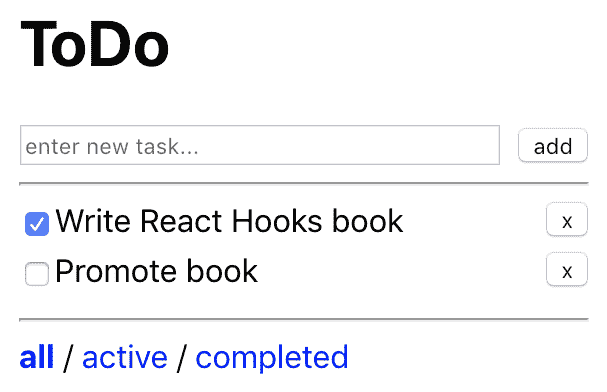
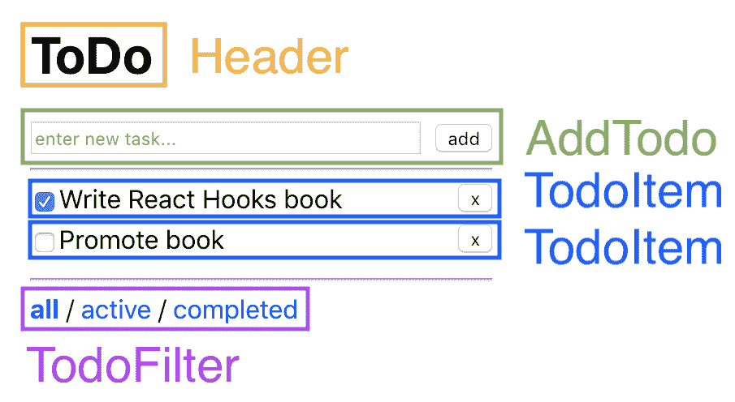
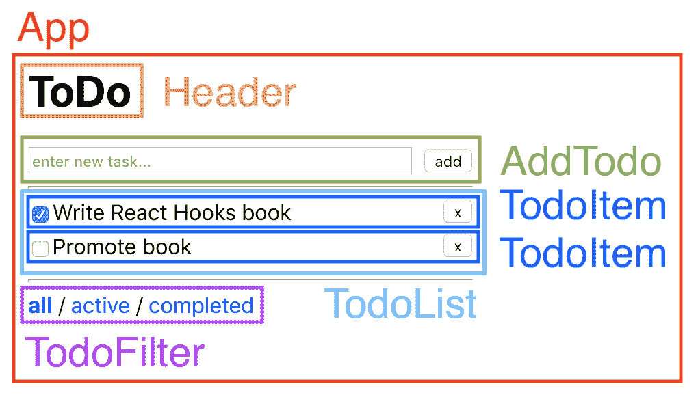

# 第十一章：从 React 类组件迁移

在上一章中，我们学习了如何通过从现有代码中提取自定义 Hooks 来构建我们自己的 Hooks。然后，我们在博客应用程序中使用了我们自己的 Hooks，并学习了本地 Hooks 和 Hooks 之间的交互。最后，我们学习了如何使用 React Hooks 测试库为 Hooks 编写测试，并为我们的自定义 Hooks 实现了测试。

在本章中，我们将首先使用 React 类组件实现一个待办事项应用程序。接下来，我们将学习如何将现有的 React 类组件应用程序迁移到 Hooks。在实践中看到使用 Hooks 的函数组件和类组件之间的差异将加深我们对使用任一解决方案的权衡的理解。此外，到本章结束时，我们将能够将现有的 React 应用程序迁移到 Hooks。

本章将涵盖以下主题：

+   使用类组件处理状态

+   从类组件迁移应用程序到 Hooks

+   了解类组件与 Hooks 的权衡

# 技术要求

应该已经安装了相当新的 Node.js 版本（v11.12.0 或更高版本）。还需要安装 Node.js 的`npm`包管理器。

本章的代码可以在 GitHub 存储库中找到：[`github.com/PacktPublishing/Learn-React-Hooks/tree/master/Chapter11`](https://github.com/PacktPublishing/Learn-React-Hooks/tree/master/Chapter11)。

观看以下视频以查看代码的实际操作：

[`bit.ly/2Mm9yoC`](http://bit.ly/2Mm9yoC)

请注意，强烈建议您自己编写代码。不要简单地运行提供的代码示例。重要的是您自己编写代码，以便能够正确学习和理解。但是，如果遇到任何问题，您可以随时参考代码示例。

现在，让我们开始本章。

# 使用类组件处理状态

在我们开始从类组件迁移到 Hooks 之前，我们将使用 React 类组件创建一个小型的待办事项列表应用程序。在下一节中，我们将使用 Hooks 将这些类组件转换为函数组件。最后，我们将比较这两种解决方案。

# 设计应用程序结构

与我们之前在博客应用程序中所做的一样，我们将首先考虑我们应用程序的基本结构。对于这个应用程序，我们将需要以下功能：

+   一个标题

+   添加新待办事项的方法

+   以列表的方式显示所有待办事项

+   待办事项的筛选器

从模拟开始总是一个好主意。所以，让我们开始吧：

1.  我们首先绘制一个 ToDo 应用程序界面的模拟：



我们的 ToDo 应用程序的模拟

1.  接下来，我们以类似的方式定义基本组件，就像我们在博客应用程序中所做的那样：



在我们应用程序的模拟中定义基本组件

1.  现在我们可以定义容器组件：



在我们应用程序的模拟中定义容器组件

正如我们所看到的，我们将需要以下组件：

+   `App`

+   标题

+   添加待办事项

+   `TodoList`

+   `TodoItem`

+   `TodoFilter（+ TodoFilterItem）`

`TodoList`组件使用`TodoItem`组件，用于显示一个带有复选框完成和删除按钮的项目。`TodoFilter`组件内部使用`TodoFilterItem`组件来显示各种筛选器。

# 初始化项目

我们将使用`create-react-app`来创建一个新项目。让我们现在初始化项目：

1.  运行以下命令：

```jsx
> npx create-react-app chapter11_1
```

1.  然后，删除`src/App.css`，因为我们不需要它。

1.  接下来，编辑`src/index.css`，并调整边距如下：

```jsx
    margin: 20px;
```

1.  最后，删除当前的`src/App.js`文件，因为我们将在下一步创建一个新的文件。

现在，我们的项目已经初始化，我们可以开始定义应用程序结构。

# 定义应用程序结构

我们已经从模拟中知道了我们的应用程序的基本结构，所以让我们从定义`App`组件开始：

1.  创建一个新的`src/App.js`文件。

1.  导入`React`和`Header`，`AddTodo`，`TodoList`和`TodoFilter`组件：

```jsx
import React from 'react'

import Header from './Header'
import AddTodo from './AddTodo'
import TodoList from './TodoList'
import TodoFilter from './TodoFilter'
```

1.  现在将`App`组件定义为类组件。现在，我们只会定义`render`方法：

```jsx
export default class App extends React.Component {
    render () {
        return (
            <div style={{ width: 400 }}>
                <Header />
                <AddTodo />
                <hr />
                <TodoList />
                <hr />
                <TodoFilter />
            </div>
        )
    }
}
```

`App`组件定义了我们应用程序的基本结构。它将包括一个标题，一种添加新待办事项的方法，待办事项列表和一个筛选器。

# 定义组件

现在，我们将定义组件作为静态组件。在本章的后面，我们将为它们实现动态功能。现在，我们将实现以下静态组件：

+   标题

+   添加待办事项

+   `TodoList`

+   `TodoItem`

+   `TodoFilter`

现在让我们开始实现这些组件。

# 定义标题组件

我们将从`Header`组件开始，因为它是所有组件中最简单的：

1.  创建一个新的`src/Header.js`文件。

1.  导入`React`并定义带有`render`方法的类组件：

```jsx
import React from 'react'

export default class Header extends React.Component {
    render () {
        return <h1>ToDo</h1>
    }
}
```

现在，我们已经定义了应用程序的`Header`组件。

# 定义 AddTodo 组件

接下来，我们将定义`AddTodo`组件，它渲染一个`input`字段和一个按钮。

现在让我们实现`AddTodo`组件：

1.  创建一个新的`src/AddTodo.js`文件。

1.  导入`React`并定义类组件和`render`方法：

```jsx
import React from 'react'

export default class AddTodo extends React.Component {
    render () {
        return (
```

1.  在`render`方法中，我们返回一个包含`input`字段和添加按钮的`form`：

```jsx
            <form>
                <input type="text" placeholder="enter new task..." style={{ width: 350, height: 15 }} />
                <input type="submit" style={{ float: 'right', marginTop: 2 }} value="add" />
            </form>
        )
    }
}
```

正如我们所看到的，`AddTodo`组件由一个`input`字段和一个按钮组成。

# 定义 TodoList 组件

现在，我们定义了`TodoList`组件，它将使用`TodoItem`组件。目前，我们将在这个组件中静态地定义两个待办事项。

让我们开始定义`TodoList`组件：

1.  创建一个新的`src/TodoList.js`文件。

1.  导入`React`和`TodoItem`组件：

```jsx
import React from 'react'

import TodoItem from './TodoItem'
```

1.  然后，定义类组件和`render`方法：

```jsx
export default class TodoList extends React.Component {
    render () {
```

1.  在这个`render`方法中，我们静态地定义了两个待办事项：

```jsx
        const items = [
            { id: 1, title: 'Write React Hooks book', completed: true },
            { id: 2, title: 'Promote book', completed: false }
        ]
```

1.  最后，我们将使用`map`函数来渲染项目：

```jsx
        return items.map(item =>
            <TodoItem {...item} key={item.id} />
        )
    }
}
```

正如我们所看到的，`TodoList`组件渲染了一系列`TodoItem`组件。

# 定义 TodoItem 组件

在定义了`TodoList`组件之后，我们现在将定义`TodoItem`组件，以便渲染单个项目。

让我们开始定义`TodoItem`组件：

1.  创建一个新的`src/TodoItem.js`组件。

1.  导入`React`，并定义组件，以及`render`方法：

```jsx
import React from 'react'

export default class TodoItem extends React.Component {
    render () {
```

1.  现在，我们将使用解构来获取`title`和`completed`属性：

```jsx
        const { title, completed } = this.props
```

1.  最后，我们将渲染一个包含`checkbox`、`title`和`button`的`div`元素来删除项目：

```jsx
        return (
            <div style={{ width: 400, height: 25 }}>
                <input type="checkbox" checked={completed} />
                {title}
                <button style={{ float: 'right' }}>x</button>
            </div>
        )
    }
}
```

`TodoItem`组件由一个复选框、`title`和一个删除项目的`button`组成。

# 定义 TodoFilter 组件

最后，我们将定义`TodoFilter`组件。在同一个文件中，我们将为`TodoFilterItem`定义另一个组件。

让我们开始定义`TodoFilterItem`和`TodoFilter`组件：

1.  创建一个新的`src/TodoFilter.js`文件。

1.  为`TodoFilterItem`定义一个类组件：

```jsx
class TodoFilterItem extends React.Component {
    render () {
```

1.  在这个`render`方法中，我们使用解构来获取`name`属性：

```jsx
        const { name } = this.props
```

1.  接下来，我们将为`style`定义一个对象：

```jsx
        const style = {
            color: 'blue',
            cursor: 'pointer'
        }
```

1.  然后，我们返回一个带有过滤器`name`值的`span`元素，并使用定义的`style`对象：

```jsx
        return <span style={style}>{name}</span>
    }
}
```

1.  最后，我们可以定义实际的`TodoFilter`组件，它将呈现三个`TodoFilterItem`组件，如下所示：

```jsx
export default class TodoFilter extends React.Component {
    render () {
        return (
            <div>
                <TodoFilterItem name="all" />{' / '}
                <TodoFilterItem name="active" />{' / '}
                <TodoFilterItem name="completed" />
            </div>
        )
    }
}
```

现在，我们有一个列出三种不同过滤可能性的组件：`all`，`active`和`completed`。

# 实现动态代码

现在我们已经定义了所有静态组件，我们的应用程序应该看起来像模拟一样。下一步是使用 React 状态、生命周期和处理程序方法实现动态代码。

在本节中，我们将执行以下操作：

+   定义模拟 API

+   定义一个`StateContext`

+   使`App`组件动态化

+   使`AddTodo`组件动态化

+   使`TodoList`组件动态化

+   使`TodoItem`组件动态化

+   使`TodoFilter`组件动态化

让我们开始。

# 定义 API 代码

首先，我们将定义一个 API，用于获取待办事项。在我们的情况下，我们将简单地在短暂延迟后返回一个待办事项数组。

让我们开始实现模拟 API：

1.  创建一个新的`src/api.js`文件。

1.  我们将定义一个函数，根据**通用唯一标识符**（**UUID**）函数生成我们待办事项的随机 ID：

```jsx
export const generateID = () => {
    const S4 = () =>(((1+Math.random())*0x10000)|0).toString(16).substring(1)
    return (S4()+S4()+"-"+S4()+"-"+S4()+"-"+S4()+"-"+S4()+S4()+S4())
}
```

1.  然后，我们定义了`fetchAPITodos`函数，它返回一个`Promise`，在短暂延迟后解析：

```jsx
export const fetchAPITodos = () =>
    new Promise((resolve) =>
        setTimeout(() => resolve([
            { id: generateID(), title: 'Write React Hooks book', completed: true },
            { id: generateID(), title: 'Promote book', completed: false }
        ]), 100)
    )
```

现在，我们有一个函数，模拟从 API 获取待办事项，通过在`100`毫秒延迟后返回一个数组。

# 定义 StateContext

接下来，我们将定义一个上下文，用于保存我们当前的待办事项列表。我们将称此上下文为`StateContext`。

让我们现在开始实现`StateContext`：

1.  创建一个新的`src/StateContext.js`文件。

1.  导入`React`，如下所示：

```jsx
import React from 'react'
```

1.  现在，定义`StateContext`并将空数组设置为回退值：

```jsx
const StateContext = React.createContext([])
```

1.  最后，导出`StateContext`：

```jsx
export default StateContext
```

现在，我们有一个上下文，可以在其中存储我们的待办事项数组。

# 使 App 组件动态化

现在，我们将通过添加功能来获取、添加、切换、过滤和删除待办事项，使`App`组件动态化。此外，我们将定义一个`StateContext`提供程序。

让我们开始使`App`组件动态化：

1.  在`src/App.js`中，在其他导入语句之后导入`StateContext`：

```jsx
import StateContext from './StateContext'
```

1.  然后，从`src/api.js`文件导入`fetchAPITodos`和`generateID`函数：

```jsx
import { fetchAPITodos, generateID } from './api'
```

1.  接下来，我们将修改我们的`App`类代码，实现一个`constructor`，它将设置初始状态：

```jsx
export default class App extends React.Component {
 constructor (props) {
```

1.  在这个`constructor`中，我们需要首先调用`super`，以确保父类（`React.Component`）的构造函数被调用，并且组件得到正确初始化：

```jsx
        super(props)
```

1.  现在，我们可以通过设置`this.state`来设置初始状态。最初，没有待办事项，`filter`值将设置为`'all'`：

```jsx
        this.state = { todos: [], filteredTodos: [], filter: 'all' }
    }
```

1.  然后，我们定义`componentDidMount`生命周期方法，该方法将在组件首次渲染时获取待办事项：

```jsx
    componentDidMount () {
        this.fetchTodos()
    }
```

1.  现在，我们将定义实际的`fetchTodos`方法，在我们的情况下，它只是设置状态，因为我们不打算将这个简单的应用程序连接到后端。我们还将调用`this.filterTodos()`来在获取待办事项后更新`filteredTodos`数组：

```jsx
    fetchTodos () {
        fetchAPITodos().then((todos) => {
            this.setState({ todos })
            this.filterTodos()
        })
    }
```

1.  接下来，我们定义`addTodo`方法，它创建一个新项目，并将其添加到状态数组中，类似于我们在博客应用中使用 Hooks 所做的操作：

```jsx
    addTodo (title) {
        const { todos } = this.state

        const newTodo = { id: generateID(), title, completed: false }

        this.setState({ todos: [ newTodo, ...todos ] })
        this.filterTodos()
    }
```

1.  然后，我们定义`toggleTodo`方法，该方法使用`map`函数来查找和修改特定的待办事项：

```jsx
    toggleTodo (id) {
        const { todos } = this.state

        const newTodos = todos.map(t => {
            if (t.id === id) {
                return { ...t, completed: !t.completed }
            }
            return t
        }, [])

        this.setState({ todos: newTodos })
        this.filterTodos()
    }
```

1.  现在，我们定义`removeTodo`方法，该方法使用`filter`函数来查找并删除特定的待办事项：

```jsx
    removeTodo (id) {
        const { todos } = this.state

        const newTodos = todos.filter(t => {
            if (t.id === id) {
                return false
            }
             return true
        })

        this.setState({ todos: newTodos })
        this.filterTodos()
    }
```

1.  然后，我们定义一个方法来对我们的待办事项应用特定的`filter`：

```jsx
    applyFilter (todos, filter) {
        switch (filter) {
            case 'active':
                return todos.filter(t => t.completed === false)

            case 'completed':
                return todos.filter(t => t.completed === true)

            default:
            case 'all':
                return todos
        }
    }
```

1.  现在，我们可以定义`filterTodos`方法，该方法将调用`applyFilter`方法，并更新`filteredTodos`数组和`filter`值：

```jsx
    filterTodos (filterArg) {
        this.setState(({ todos, filter }) => ({
            filter: filterArg || filter,
            filteredTodos: this.applyFilter(todos, filterArg || filter)
        }))
    }
```

我们使用`filterTodos`来在添加/删除项目以及更改过滤器后重新过滤待办事项，为了使这两个功能都能正常工作，我们需要检查是否传递了`filter`参数`filterArg`。如果没有，我们将退回到`state`中的当前`filter`参数。

1.  然后，我们调整`render`方法，以使用状态为`StateContext`提供一个值，并将某些方法传递给组件：

```jsx
    render () {
 const { filter, filteredTodos } = this.state

        return (
 <StateContext.Provider value={filteredTodos}>
                <div style={{ width: 400 }}>
                    <Header />
                    <AddTodo addTodo={this.addTodo} />
                    <hr />
                    <TodoList toggleTodo={this.toggleTodo} removeTodo={this.removeTodo} />
                    <hr />
                    <TodoFilter filter={filter} filterTodos={this.filterTodos} />
                </div>
 </StateContext.Provider>
        )
    }
```

1.  最后，我们需要重新绑定`this`到类，以便我们可以将方法传递给我们的组件，而不会改变`this`上下文。调整`constructor`如下：

```jsx
            constructor () {
                super(props)

                this.state = { todos: [], filteredTodos: [], filter: 
                  'all' }

 this.fetchTodos = this.fetchTodos.bind(this)
 this.addTodo = this.addTodo.bind(this)
 this.toggleTodo = this.toggleTodo.bind(this)
 this.removeTodo = this.removeTodo.bind(this)
 this.filterTodos = this.filterTodos.bind(this)
            }
```

现在，我们的`App`组件可以动态地获取、添加、切换、删除和过滤待办事项。正如我们所看到的，当我们使用类组件时，我们需要重新绑定处理程序函数的`this`上下文到类。

# 使 AddTodo 组件动态化

在使我们的`App`组件动态化之后，现在是时候使我们的所有其他组件也动态化了。我们将从顶部开始，从`AddTodo`组件开始。

现在让`AddTodo`组件动态化：

1.  在`src/AddTodo.js`中，我们首先定义了一个`constructor`，它为`input`字段设置了初始`state`：

```jsx
export default class AddTodo extends React.Component {
    constructor (props) {
        super(props)

        this.state = {
            input: ''
        }
    }
```

1.  然后，我们定义一个处理`input`字段变化的方法：

```jsx
    handleInput (e) {
        this.setState({ input: e.target.value })
    }
```

1.  现在，我们将定义一个可以处理添加新待办事项的方法：

```jsx
    handleAdd () {
        const { input } = this.state
        const { addTodo } = this.props

        if (input) {
            addTodo(input)
            this.setState({ input: '' })
        }
    }
```

1.  接下来，我们可以将状态值和处理程序方法分配给`input`字段和按钮：

```jsx
    render () {
        const { input } = this.state

        return (
            <form onSubmit={e => { e.preventDefault(); this.handleAdd() }}>
                <input
                    type="text"
                    placeholder="enter new task..."
                    style={{ width: 350, height: 15 }}
 value={input}
 onChange={this.handleInput} />
                <input
                    type="submit"
                    style={{ float: 'right', marginTop: 2 }}
 disabled={!input}                    value="add"
                />
            </form>
        )
    }
```

1.  最后，我们需要调整`constructor`以重新绑定所有处理程序方法的`this`上下文：

```jsx
    constructor () {
        super(props)

        this.state = {
            input: ''
        }

 this.handleInput = this.handleInput.bind(this)
 this.handleAdd = this.handleAdd.bind(this)
    }
```

现在，我们的`AddTodo`组件将在没有输入文本时显示禁用的按钮。激活后，单击按钮将触发从`App`组件传递下来的`handleAdd`函数。

# 使 TodoList 组件动态

我们 ToDo 应用程序中的下一个组件是`TodoList`组件。在这里，我们只需要从`StateContext`中获取待办事项。

现在让我们让`TodoList`组件变得动态起来：

1.  在`src/TodoList.js`中，我们首先导入`StateContext`，在`TodoItem`导入语句下面：

```jsx
import StateContext from './StateContext'
```

1.  然后，我们将`contextType`设置为`StateContext`，这将允许我们通过`this.context`访问上下文：

```jsx
export default class TodoList extends React.Component {
 static contextType = StateContext
```

使用类组件，如果我们想要使用多个上下文，我们必须使用`StateContext.Consumer`组件，如下所示：`<StateContext.Consumer>{value => <div>State is: {value}</div>}</StateContext.Consumer>`。

正如你所想象的那样，像这样使用多个上下文将导致非常深的组件树（包装器地狱），我们的代码将很难阅读和重构。

1.  现在，我们可以从`this.context`中获取项目，而不是静态定义它们：

```jsx
    render () {
 const items = this.context
```

1.  最后，我们将所有 props 传递给`TodoItem`组件，以便我们可以在那里使用`removeTodo`和`toggleTodo`方法：

```jsx
        return items.map(item =>
            <TodoItem {...item} {...this.props} key={item.id} />
        )
    }
```

现在，我们的`TodoList`组件从`StateContext`中获取项目，而不是静态定义它们。

# 使 TodoItem 组件动态

现在我们已经将`removeTodo`和`toggleTodo`方法作为 props 传递给了`TodoItem`组件，我们可以在那里实现这些功能。

现在让`TodoItem`组件变得动态起来：

1.  在`src/TodoItem.js`中，我们首先定义了`toggleTodo`和`removeTodo`函数的处理程序方法：

```jsx
    handleToggle () {
        const { toggleTodo, id } = this.props
        toggleTodo(id)
    }

    handleRemove () {
        const { removeTodo, id } = this.props
        removeTodo(id)
    }
```

1.  然后，我们分别将处理程序方法分配给`checkbox`和`button`：

```jsx
    render () {
        const { title, completed } = this.props
        return (
            <div style={{ width: 400, height: 25 }}>
                <input type="checkbox" checked={completed} onChange={this.handleToggle} />
                {title}
                <button style={{ float: 'right' }} onClick={this.handleRemove}>x</button>
            </div>
        )
    }
```

1.  最后，我们需要重新绑定处理程序方法的`this`上下文。创建一个新的`constructor`，如下所示：

```jsx
export default class TodoItem extends React.Component {
 constructor (props) {
 super(props)

 this.handleToggle = this.handleToggle.bind(this)
 this.handleRemove = this.handleRemove.bind(this)
 }
```

现在，`TodoItem`组件触发了切换和删除处理程序函数。

# 使 TodoFilter 组件动态

最后，我们将使用`filterTodos`方法动态过滤我们的待办事项列表。

让我们开始使`TodoFilter`组件动态：

1.  在`src/TodoFilter.js`中，在`TodoFilter`类中，我们将所有 props 传递给`TodoFilterItem`组件：

```jsx
export default class TodoFilter extends React.Component {
    render () {
        return (
            <div>
                <TodoFilterItem {...this.props} name="all" />{' / '}
                <TodoFilterItem {...this.props} name="active" />{' / '}
                <TodoFilterItem {...this.props} name="completed" />
            </div>
        )
    }
}
```

1.  在`src/TodoFilter.js`中，在`TodoFilterItem`类中，我们首先定义一个用于设置过滤器的处理方法：

```jsx
    handleFilter () {
        const { name, filterTodos } = this.props
        filterTodos(name)
    }
```

1.  然后，我们从`TodoFilter`中获取`filter` prop：

```jsx
    render () {
        const { name, filter = 'all' } = this.props
```

1.  接下来，我们使用`filter` prop 来以`bold`显示当前选定的过滤器：

```jsx
        const style = {
            color: 'blue',
            cursor: 'pointer',
            fontWeight: (filter === name) ? 'bold' : 'normal'
        }
```

1.  然后，我们通过`onClick`将处理方法绑定到过滤器项：

```jsx
        return <span style={style} onClick={this.handleFilter}>{name}</span>
    }
```

1.  最后，我们为`TodoFilterItem`类创建一个新的`constructor`，并重新绑定处理方法的`this`上下文：

```jsx
class TodoFilterItem extends React.Component {
 constructor (props) {
 super(props)

 this.handleFilter = this.handleFilter.bind(this)
 }
```

现在，我们的`TodoFilter`组件触发`handleFilter`方法以更改过滤器。现在我们的整个应用程序是动态的，我们可以使用其所有功能。

# 示例代码

示例代码可以在`Chapter11/chapter11_1`文件夹中找到。

只需运行`npm install`来安装所有依赖项，然后运行`npm start`启动应用程序，然后在浏览器中访问`http://localhost:3000`（如果没有自动打开）。

# 从 React 类组件迁移

在使用 React 类组件设置示例项目之后，我们现在将把这个项目迁移到 React Hooks。我们将展示如何迁移副作用，比如在组件挂载时获取待办事项，以及我们用于输入的状态管理。

在本节中，我们将迁移以下组件：

+   `TodoItem`

+   `TodoList`

+   `TodoFilterItem`

+   ``TodoFilter``

+   `AddTodo`

+   `App`

# 迁移 TodoItem 组件

最简单的组件之一要迁移的是`TodoItem`组件。它不使用任何状态或副作用，因此我们可以简单地将其转换为函数组件。

让我们开始迁移`TodoItem`组件：

1.  编辑`src/TodoItem.js`并删除类组件代码。现在我们将定义一个函数组件。

1.  我们首先定义一个函数，它接受五个 props——`title`值、`completed`布尔值、`id`值、`toggleTodo`函数和`removeTodo`函数：

```jsx
export default function TodoItem ({ title, completed, id, toggleTodo, removeTodo }) {
```

1.  接下来，我们定义我们的两个处理函数：

```jsx
    function handleToggle () {
        toggleTodo(id)
    }

    function handleRemove () {
        removeTodo(id)
    }
```

1.  最后，我们返回 JSX 代码以渲染我们的组件：

```jsx
    return (
        <div style={{ width: 400, height: 25 }}>
            <input type="checkbox" checked={completed} onChange={handleToggle} />
            {title}
            <button style={{ float: 'right' }} onClick={handleRemove}>x</button>
        </div>
    )
}
```

尝试保持函数组件的规模较小，并通过创建包装它们的新函数组件来组合它们。拥有许多小组件而不是一个大组件总是一个好主意。它们更容易维护、重用和重构。

正如我们所看到的，函数组件不需要我们重新绑定`this`，或者根本不需要定义构造函数。此外，我们不需要多次从`this.props`中解构。我们可以简单地在函数的头部定义所有 props。

# 迁移 TodoList 组件

接下来，我们要迁移包裹`TodoItem`组件的`TodoList`组件。在这里，我们使用了一个上下文，这意味着我们现在可以使用上下文 Hook。

现在让我们迁移`TodoList`组件：

1.  编辑`src/TodoList.js`并从 React 中导入`useContext` Hook：

```jsx
import React, { useContext } from 'react'
```

1.  移除类组件代码。我们现在要定义一个函数组件。

1.  我们首先定义函数的头部。在这种情况下，我们不解构 props，而是简单地将它们存储在一个`props`对象中：

```jsx
export default function TodoList (props) {
```

1.  现在我们定义 Context Hook：

```jsx
    const items = useContext(StateContext)
```

1.  最后，我们返回渲染的`items`列表，使用解构将`item`和`props`对象传递给它：

```jsx
    return items.map(item =>
        <TodoItem {...item} {...props} key={item.id} />
    )
}
```

我们最后定义`key`属性，以避免在解构`item`和`props`对象时覆盖它。

正如我们所看到的，使用 Hooks 与上下文更加直接。我们可以简单地调用一个函数，并使用返回值。当使用多个上下文时，不需要魔术赋值`this.context`或包装地狱！

此外，我们可以逐步将组件迁移到 React Hooks，并且我们的应用仍然可以工作。没有必要一次性将所有组件迁移到 Hooks。React 类组件可以很好地与使用 Hooks 的函数组件一起工作。唯一的限制是我们不能在类组件中使用 Hooks。因此，我们需要一次迁移一个完整的组件。

# 迁移 TodoFilter 组件

接下来是`TodoFilter`组件，它不会使用任何 Hooks。然而，我们将用两个函数组件替换`TodoFilterItem`和`TodoFilter`组件：一个用于`TodoFilterItem`，一个用于`TodoFilter`组件。

# 迁移 TodoFilterItem

首先，我们要迁移`TodoFilterItem`组件。现在让我们开始迁移组件：

1.  编辑`src/TodoFilter.js`并移除类组件代码。我们现在要定义一个函数组件。

1.  为`TodoFilterItem`组件定义一个函数，它将接受三个 props——`name`值，`filterTodos`函数和`filter`值：

```jsx
function TodoFilterItem ({ name, filterTodos, filter = 'all' }) {
```

1.  在这个函数中，我们定义了一个处理器函数来改变过滤器：

```jsx
    function handleFilter () {
        filterTodos(name)
    }
```

1.  接下来，我们为我们的`span`元素定义一个`style`对象：

```jsx
    const style = {
        color: 'blue',
        cursor: 'pointer',
        fontWeight: (filter === name) ? 'bold' : 'normal'
    }
```

1.  最后，我们返回并渲染`span`元素：

```jsx
    return <span style={style} onClick={handleFilter}>{name}</span>
}
```

正如我们所看到的，函数组件比相应的类组件需要更少的样板代码。

# 迁移 TodoFilter

现在我们已经迁移了`TodoFilterItem`组件，我们可以迁移`TodoFilter`组件。让我们现在迁移它：

1.  编辑`src/TodoFilter.js`并删除类组件代码。我们现在要定义一个函数组件。

1.  为`TodoFilter`组件定义一个函数。我们这里不会在 props 上使用解构：

```jsx
export default function TodoFilter (props) {
```

1.  在这个组件中，我们只返回和渲染三个`TodoFilterItem`组件 - 将 props 传递给它们：

```jsx
    return (
        <div>
            <TodoFilterItem {...props} name="all" />{' / '}
            <TodoFilterItem {...props} name="active" />{' / '}
            <TodoFilterItem {...props} name="completed" />
        </div>
    )
}
```

现在，我们的`TodoFilter`组件已成功迁移。

# 迁移 AddTodo 组件

接下来，我们将迁移`AddTodo`组件。在这里，我们将使用 State Hook 来处理`input`字段状态。

让我们现在迁移`AddTodo`组件：

1.  编辑`src/AddTodo.js`并调整导入语句以从 React 导入`useState` Hook：

```jsx
import React, { useState } from 'react'
```

1.  删除类组件代码。我们现在要定义一个函数组件。

1.  首先，我们定义一个函数，它只接受一个 prop - `addTodo`函数：

```jsx
export default function AddTodo ({ addTodo }) {
```

1.  接下来，我们为`input`字段状态定义一个 State Hook：

```jsx
    const [ input, setInput ] = useState('')
```

1.  现在，我们可以为`input`字段和添加按钮定义处理函数：

```jsx
    function handleInput (e) {
        setInput(e.target.value)
    }

    function handleAdd () {
        if (input) {
            addTodo(input)
            setInput('')
        }
    }
```

1.  最后，我们返回并渲染`input`字段和添加按钮：

```jsx
    return (
        <form onSubmit={e => { e.preventDefault(); handleAdd() }}>
            <input
                type="text"
                placeholder="enter new task..."
                style={{ width: 350, height: 15 }}
                value={input}
                onChange={handleInput}
            />
            <input
                type="submit"
                style={{ float: 'right', marginTop: 2 }}
                disabled={!input}
                value="add"
            />
        </form>
    )
}
```

正如我们所看到的，使用 State Hook 使状态管理变得更加简单。我们可以为每个状态值定义一个单独的值和 setter 函数，而不是不断处理一个状态对象。此外，我们不需要一直从`this.state`中解构。因此，我们的代码更加清晰简洁。

# 迁移 App 组件

最后，剩下的就是迁移`App`组件。然后，我们整个待办事项应用程序将被迁移到 React Hooks。在这里，我们将使用 Reducer Hook 来管理状态，Effect Hook 在组件挂载时获取待办事项，以及 Memo Hook 来存储过滤后的待办事项列表。

在本节中，我们将做以下事情：

+   定义动作

+   定义 reducers

+   迁移`App`组件

# 定义动作

我们的应用将接受五个动作：

+   `FETCH_TODOS`：获取新的待办事项列表 - `{ type: 'FETCH_TODOS', todos: [] }`

+   `ADD_TODO`：插入新的待办事项 - `{ type: 'ADD_TODO', title: 'Test ToDo app' }`

+   `TOGGLE_TODO`：切换待办事项的`completed`值 - `{ type: 'TOGGLE_TODO', id: 'xxx' }`

+   `REMOVE_TODO`：移除一个待办事项—`{ type: 'REMOVE_TODO', id: 'xxx' }`

+   `FILTER_TODOS`：过滤待办事项—`{ type: 'FILTER_TODOS', filter: 'completed' }`

在定义完动作之后，我们可以继续定义 reducers。

# 定义 reducers

现在我们要为我们的状态定义 reducers。我们需要一个 app reducer 和两个子 reducer：一个用于 todos，一个用于 filter。

过滤后的待办事项列表将由`App`组件动态计算。我们可以稍后使用 Memo Hook 来缓存结果，避免不必要地重新计算过滤后的待办事项列表。

# 定义 filter reducer

我们将首先定义`filter`值的 reducer。现在让我们定义 filter reducer：

1.  创建一个新的`src/reducers.js`文件，并从`src/api.js`文件中导入`generateID`函数：

```jsx
import { generateID } from './api'
```

1.  在`src/reducers.js`文件中，定义一个新函数，它将处理`FILTER_TODOS`动作，并相应地设置值：

```jsx
function filterReducer (state, action) {
    if (action.type === 'FILTER_TODOS') {
        return action.filter
    } else {
        return state
    }
}
```

现在，`filterReducer`函数已经定义，我们可以正确处理`FILTER_TODOS`动作了。

# 定义 todos reducer

接下来，我们将为待办事项定义一个函数。在这里，我们将处理`FETCH_TODOS`、`ADD_TODO`、`TOGGLE_TODO`和`REMOVE_TODO`动作。

现在让我们定义`todosReducer`函数：

1.  在`src/reducers.js`文件中，定义一个新函数，它将处理这些动作：

```jsx
function todosReducer (state, action) {
    switch (action.type) {
```

1.  对于`FETCH_TODOS`动作，我们只需用新的`todos`数组替换当前状态：

```jsx
        case 'FETCH_TODOS':
            return action.todos
```

1.  对于`ADD_TODO`动作，我们将在当前状态数组的开头插入一个新项目：

```jsx
        case 'ADD_TODO':
            const newTodo = {
                id: generateID(),
                title: action.title,
                completed: false
            }
            return [ newTodo, ...state ]
```

1.  对于`TOGGLE_TODO`动作，我们将使用`map`函数来更新单个待办事项：

```jsx
        case 'TOGGLE_TODO':
            return state.map(t => {
                if (t.id === action.id) {
                    return { ...t, completed: !t.completed }
                }
                return t
            }, [])
```

1.  对于`REMOVE_TODO`动作，我们将使用`filter`函数来移除单个待办事项：

```jsx
        case 'REMOVE_TODO':
            return state.filter(t => {
                if (t.id === action.id) {
                    return false
                }
                return true
            })
```

1.  默认情况下（对于所有其他动作），我们只需返回当前的`state`：

```jsx
        default:
            return state
    }
}
```

现在，todos reducer 已经定义，我们可以处理`FETCH_TODOS`、`ADD_TODO`、`TOGGLE_TODO`和`REMOVE_TODO`动作了。

# 定义 app reducer

最后，我们需要将其他 reducers 组合成一个单一的 app 状态的 reducer。现在让我们定义`appReducer`函数：

1.  在`src/reducers.js`文件中，为`appReducer`定义一个新函数：

```jsx
export default function appReducer (state, action) {
```

1.  在这个函数中，我们返回一个包含其他 reducers 值的对象。我们只需将子状态和动作传递给其他 reducers：

```jsx
    return {
        todos: todosReducer(state.todos, action),
        filter: filterReducer(state.filter, action)
    }
}
```

现在，我们的 reducers 已经分组在一起。所以，我们只有一个`state`对象和一个`dispatch`函数。

# 组件迁移

现在我们已经定义了我们的 reducers，我们可以开始迁移`App`组件。让我们现在迁移它：

1.  编辑`src/App.js`并调整导入语句，从`React`中导入`useReducer`、`useEffect`和`useMemo`：

```jsx
import React, { useReducer, useEffect, useMemo } from 'react'
```

1.  从`src/reducers.js`中导入`appReducer`函数：

```jsx
import appReducer from './reducers'
```

1.  删除类组件代码。现在我们要定义一个函数组件。

1.  首先，我们定义一个不接受任何 props 的函数：

```jsx
export default function App () {
```

1.  现在，我们使用`appReducer`函数定义一个 Reducer Hook：

```jsx
    const [ state, dispatch ] = useReducer(appReducer, { todos: [], filter: 'all' })
```

1.  接下来，我们定义一个 Effect Hook，它将通过 API 函数获取`todos`，然后将会派发一个`FETCH_TODOS`动作：

```jsx
    useEffect(() => {
        fetchAPITodos().then((todos) =>
            dispatch({ type: 'FETCH_TODOS', todos })
        )
    }, [])
```

1.  然后，我们使用 Memo Hook 实现过滤机制，以优化性能并避免在没有变化时重新计算过滤后的 todos 列表：

```jsx
    const filteredTodos = useMemo(() => {
        const { filter, todos } = state
        switch (filter) {
            case 'active':
                return todos.filter(t => t.completed === false)

            case 'completed':
                return todos.filter(t => t.completed === true)

            default:
            case 'all':
                return todos
        }
    }, [ state ])
```

1.  现在，我们定义各种函数，这些函数将派发动作并改变状态：

```jsx
    function addTodo (title) {
        dispatch({ type: 'ADD_TODO', title })
    }

    function toggleTodo (id) {
        dispatch({ type: 'TOGGLE_TODO', id })
    }

    function removeTodo (id) {
        dispatch({ type: 'REMOVE_TODO', id })
    }

    function filterTodos (filter) {
        dispatch({ type: 'FILTER_TODOS', filter })
    }
```

1.  最后，我们返回并渲染所有需要的 ToDo 应用程序组件：

```jsx
    return (
        <StateContext.Provider value={filteredTodos}>
            <div style={{ width: 400 }}>
                <Header />
                <AddTodo addTodo={addTodo} />
                <hr />
                <TodoList toggleTodo={toggleTodo} removeTodo={removeTodo} />
                <hr />
                <TodoFilter filter={state.filter} filterTodos={filterTodos} />
            </div>
        </StateContext.Provider>
    )
}
```

正如我们所看到的，使用 reducer 来处理复杂的状态变化使我们的代码更加简洁和易于维护。我们的应用现在完全迁移到了 Hooks！

# 示例代码

示例代码可以在`Chapter11/chapter11_2`文件夹中找到。

只需运行`npm install`来安装所有依赖项，并运行`npm start`来启动应用程序，然后在浏览器中访问`http://localhost:3000`（如果没有自动打开）。

# 类组件的权衡

现在我们已经完成了从类组件到 Hooks 的迁移，让我们回顾和总结我们学到的东西。

通过计算代码行数，我们可以看到，总共有 392 行 JavaScript 代码的函数组件与 Hooks 比起需要 430 行 JavaScript 代码的类组件更加简洁。此外，函数组件与 Hooks 更容易理解和测试，因为它们只是使用 JavaScript 函数而不是复杂的 React 构造。此外，我们能够将所有的状态改变逻辑重构到一个单独的`reducers.js`文件中，从而将其与`App`组件解耦，并使其更容易重构和测试。这将`App.js`文件的大小从 109 行减少到 64 行，并在`reducers.js`文件中增加了 50 行。

我们可以在下表中看到减少的代码行数：

| **比较：JavaScript 代码行数** |
| --- |
| **类组件** | **使用 Hooks 的函数组件** |

| `36  ./TodoFilter.js` `15  ./TodoList.js`

`59  ./AddTodo.js`

`12  ./index.js`

`7   ./Header.js`

`5   ./StateContext.js`

`9   ./App.test.js`

`135 ./serviceWorker.js`

`12  ./api.js`

`109 ./App.js`

`31  ./TodoItem.js` | `25  ./TodoFilter.js` `12  ./TodoList.js`

`42  ./AddTodo.js`

`12  ./index.js`

`7   ./Header.js`

`50  ./reducers.js`

`5   ./StateContext.js`

`9   ./App.test.js`

`135 ./serviceWorker.js`

`12  ./api.js`

`64  ./App.js`

`19  ./TodoItem.js` |

| `430 总计` | `392 总计` |
| --- | --- |

使用函数组件和 Hooks，以下几点不需要考虑：

+   不需要处理构造函数

+   没有混淆的 `this` 上下文（`this` 重新绑定）

+   不需要一遍又一遍地解构相同的值

+   在处理上下文、props 和状态时没有魔法

+   如果我们想在 props 改变时重新获取数据，就不需要定义 `componentDidMount` 和 `componentDidUpdate`

此外，函数组件具有以下优势：

+   鼓励创建小而简单的组件

+   更容易重构

+   更容易测试

+   需要更少的代码

+   对初学者更容易理解

+   更具声明性

然而，在以下情况下，类组件可能是可以的：

+   遵循某些约定时。

+   使用最新的 JavaScript 特性来避免 `this` 重新绑定。

+   可能更容易理解，因为团队已经掌握了相关知识。

+   许多项目仍在使用类。对于库来说，这不是什么问题，因为它们可以很好地与函数组件一起工作。在工作中，你可能需要使用类。

+   根据 React 团队的说法，类不会很快从 React 中移除。

最后，这是一个偏好的问题，但是 Hooks 确实比类有很多优势！如果你正在开始一个新项目，一定要选择 Hooks。如果你正在处理一个现有项目，考虑是否有必要重构某些组件为基于 Hook 的组件，以使它们更简单。然而，你不应该立即将所有项目都转换为 Hooks，因为重构总是可能引入新的 bug。采用 Hooks 的最佳方式是在适当的时候，慢慢但确定地用基于 Hook 的函数组件替换旧的类组件。例如，如果你已经在重构一个组件，你可以将其重构为使用 Hooks！

# 总结

在本章中，我们首先使用 React 类组件构建了一个 ToDo 应用程序。我们首先设计了应用程序结构，然后实现了静态组件，最后使它们变得动态。在接下来的部分，我们学习了如何将使用类组件的现有项目迁移到使用 Hooks 的函数组件。最后，我们学习了类组件的权衡，何时应该使用类组件或 Hooks，以及如何迁移现有项目到 Hooks。

我们现在已经实际看到了 React 类组件与使用 Hooks 的函数组件的不同之处。Hooks 使我们的代码更加简洁，更易于阅读和维护。我们还学到了应该逐步将我们的组件从类组件迁移到使用 Hooks 的函数组件——没有必要立即迁移整个应用程序。

在下一章中，我们将学习如何使用 Redux 处理状态，使用 Redux 与仅使用 Hooks 的函数组件相比的权衡，如何在 Hooks 中使用 Redux，以及如何将现有的 Redux 应用程序迁移到基于 Hook 的设置。

# 问题

为了总结本章学到的知识，请尝试回答以下问题：

1.  React 类组件是如何定义的？

1.  在使用类组件的`constructor`时，我们需要调用什么？为什么？

1.  我们如何在类组件中设置初始状态？

1.  我们如何在类组件中改变状态？

1.  为什么我们需要重新绑定类组件方法的`this`上下文？

1.  我们如何重新绑定`this`上下文？

1.  我们如何在类组件中使用 React 上下文？

1.  在迁移到 Hooks 时，我们可以用什么替代状态管理？

1.  使用 Hooks 与类组件相比有什么权衡之处？

1.  何时以及如何迁移现有项目到 Hooks？

# 进一步阅读

如果您对本章学到的概念更多信息感兴趣，请查看以下阅读材料：

+   ES6 类：[`developer.mozilla.org/en/docs/Web/JavaScript/Reference/Classes`](https://developer.mozilla.org/en/docs/Web/JavaScript/Reference/Classes)

+   React 类组件：[`www.robinwieruch.de/react-component-types/#react-class-components`](https://www.robinwieruch.de/react-component-types/#react-class-components)
