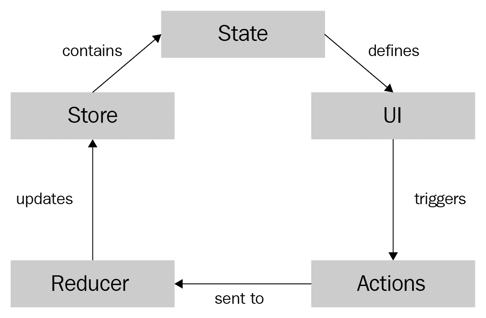
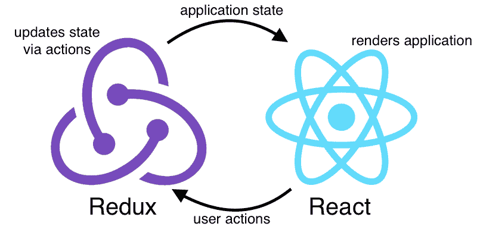

# 第十二章：Redux 和 Hooks

在上一章中，我们学习了关于 React 类组件，以及如何从现有的基于类组件的项目迁移到基于 Hook 的项目。然后，我们了解了两种解决方案之间的权衡，并讨论了现有项目应该何时以及如何迁移。

在本章中，我们将把上一章中创建的 ToDo 应用程序转换为 Redux 应用程序。首先，我们将学习 Redux 是什么，包括 Redux 的三个原则。我们还将学习在应用程序中何时使用 Redux 是有意义的，以及它并不适用于每个应用程序。此外，我们将学习如何使用 Redux 处理状态。之后，我们将学习如何在 Hooks 中使用 Redux，以及如何将现有的 Redux 应用程序迁移到 Hooks。最后，我们将学习 Redux 的权衡，以便能够决定哪种解决方案对于特定用例最合适。通过本章结束时，您将完全了解如何使用 Hooks 编写 Redux 应用程序。

本章将涵盖以下主题：

+   Redux 是什么，以及何时以及为什么应该使用它

+   使用 Redux 处理状态

+   使用 Hooks 与 Redux

+   迁移 Redux 应用程序

+   学习 Redux 的权衡

# 技术要求

应该已经安装了相当新的 Node.js 版本（v11.12.0 或更高）。还需要安装 Node.js 的`npm`包管理器。

本章的代码可以在 GitHub 存储库上找到：[`github.com/PacktPublishing/Learn-React-Hooks/tree/master/Chapter12`](https://github.com/PacktPublishing/Learn-React-Hooks/tree/master/Chapter12)。

查看以下视频以查看代码运行情况：

[`bit.ly/2Mm9yoC`](http://bit.ly/2Mm9yoC)

请注意，强烈建议您自己编写代码。不要简单地运行提供的代码示例。重要的是您自己编写代码，以便您能够正确学习和理解。但是，如果遇到任何问题，您可以随时参考代码示例。

现在，让我们开始本章。

# Redux 是什么？

正如我们之前学到的，应用程序中有两种状态：

+   **本地** **状态**：例如，处理输入字段数据

+   **全局** **状态**：例如，存储当前登录的用户

在本书中，我们使用 State Hook 处理本地状态，使用 Reducer Hook 处理更复杂的状态（通常是全局状态）。

Redux 是一种可以用来处理 React 应用程序中各种状态的解决方案。它提供了一个包含所有应用程序状态的单个状态树对象。这与我们在博客应用程序中使用的 Reducer Hook 类似。传统上，Redux 也经常用于存储本地状态，这使得状态树非常复杂。

Redux 本质上由五个元素组成：

+   **存储**：包含状态的对象，描述了我们应用程序的完整状态—`{ todos: [], filter: 'all' }`

+   **动作**：描述状态修改的对象—``{ type: 'FILTER_TODOS', filter: 'completed' }``

+   **动作创建者**：创建动作对象的函数—`(filter) => ({ type: 'FILTER_TODOS', filter })`

+   **减速器**：接受当前 `state` 值和一个 `action` 对象，并返回一个新状态的函数—`(state, action) => { ... }`

+   **连接器**：将现有组件连接到 Redux 的高阶组件，通过将 Redux 状态和动作创建者注入为 props—`connect(mapStateToProps, mapDispatchToProps)(Component)`

在 Redux 生命周期中，**存储** 包含定义 UI 的状态。UI 通过 **连接器** 连接到 Redux 存储。用户与 UI 的交互触发 **动作**，然后发送到 **减速器**。**减速器** 然后更新 **存储** 中的状态。

我们可以在下图中看到 Redux 生命周期的可视化：



Redux 生命周期的可视化

正如你所看到的，我们已经了解了这些组件中的三个：store（状态树）、动作和减速器。Redux 就像是 Reducer Hook 的更高级版本。不同之处在于，使用 Redux，我们总是将状态分派给单个减速器，因此只改变一个状态。Redux 不应该有多个实例。通过这种限制，我们可以确保整个应用程序状态都包含在一个对象中，这使我们能够仅从 Redux 存储中重建整个应用程序状态。

由于只有一个包含所有状态的存储，我们可以通过在崩溃报告中保存 Redux 存储，或者在调试过程中自动重放某些操作来轻松调试错误的状态，这样我们就不需要手动输入文本和点击按钮，一遍又一遍。此外，Redux 提供了简化我们处理异步请求的中间件，例如从服务器获取数据。现在我们了解了 Redux 是什么，在下一节中，我们将学习 Redux 的三个基本原则。

# Redux 的三个原则

Redux 的 API 非常小，实际上只包含少数几个函数。Redux 如此强大的原因在于在使用该库时应用于代码的一套规则。这些规则允许编写可扩展、易于扩展、测试和调试的应用程序。

Redux 基于三个基本原则：

+   真相的单一来源

+   只读状态

+   状态更改通过纯函数处理

# 真相的单一来源

这个 Redux 原则指出数据应该始终有一个单一的真相来源。这意味着全局数据来自单一的 Redux 存储，本地数据来自，例如，某个 State Hook。每种数据只有一个来源。因此，应用程序变得更容易调试，更不容易出错。

# 只读状态

使用 Redux，不可能直接修改应用程序状态。只能通过分派动作来改变状态。这个原则使状态变化可预测：如果没有动作发生，应用程序状态将不会改变。此外，动作是逐个处理的，因此我们不必处理竞争条件。最后，动作是纯粹的 JavaScript 对象，这使它们易于序列化、记录、存储或重放。因此，调试和测试 Redux 应用程序变得非常容易。

# 状态更改通过纯函数处理

纯函数是指，给定相同的输入，将始终返回相同的输出。Redux 中的 Reducer 函数是纯的，因此，给定相同的状态和动作，它们将始终返回相同的新状态。

例如，以下的 reducer 是一个不纯的函数，因为多次使用相同的输入调用该函数会产生不同的输出：

```jsx
let i = 0
function counterReducer (state, action) {
    if (action.type === 'INCREMENT') {
        i++
    }
    return i
}

console.log(counterReducer(0, { type: 'INCREMENT' })) // prints 1
console.log(counterReducer(0, { type: 'INCREMENT' })) // prints 2
```

要将这个 reducer 转变为纯函数，我们必须确保它不依赖于外部状态，只使用其参数进行计算：

```jsx
function counterReducer (state, action) {
    if (action.type === 'INCREMENT') {
        return state + 1
    }
    return state
}

console.log(counterReducer(0, { type: 'INCREMENT' })) // prints 1
console.log(counterReducer(0, { type: 'INCREMENT' })) // prints 1
```

使用纯函数进行减速器使它们可预测，易于测试和调试。使用 Redux 时，我们需要小心始终返回新状态，而不是修改现有状态。因此，例如，我们不能在数组状态上使用`Array.push()`，因为它会修改现有数组；我们必须使用`Array.concat()`来创建一个新数组。对于对象也是一样，我们必须使用 rest/spread 语法来创建新对象，而不是修改现有对象。例如，`{ ...state, completed: true }`。

现在我们已经了解了 Redux 的三个基本原则，我们可以开始在我们的 ToDo 应用程序中实践使用 Redux 来实现状态处理。

# 使用 Redux 处理状态

使用 Redux 进行状态管理实际上与使用 Reducer Hook 非常相似。我们首先定义状态对象，然后操作，最后是我们的减速器。Redux 中的另一个模式是创建返回操作对象的函数，即所谓的操作创建者。此外，我们需要用`Provider`组件包装整个应用程序，并连接组件到 Redux 存储，以便能够使用 Redux 状态和操作创建者。

# 安装 Redux

首先，我们必须安装 Redux，React Redux 和 Redux Thunk。让我们分别看看每个库的作用：

+   Redux 本身只处理 JavaScript 对象，因此它提供存储，处理操作和操作创建者，并处理减速器。

+   React Redux 提供连接器，以便将 Redux 连接到我们的 React 组件。

+   Redux Thunk 是一个中间件，允许我们在 Redux 中处理异步请求。

在**React**中与**Redux**结合使用**Redux**可以将全局状态管理转移到**Redux**，而**React**处理应用程序的渲染和本地状态：



React 和 Redux 如何一起工作的示例

要安装 Redux 和 React Redux，我们将使用`npm`。执行以下命令：

```jsx
> npm install --save redux react-redux redux-thunk
```

现在所有必需的库都已安装好，我们可以开始设置我们的 Redux 存储。

# 定义状态、操作和减速器

开发 Redux 应用程序的第一步是定义状态，然后是将改变状态的操作，最后是执行状态修改的减速器函数。在我们的 ToDo 应用程序中，我们已经定义了状态，操作和减速器，以便使用 Reducer Hook。在这里，我们只是简单地回顾了我们在上一章中定义的内容。

# 状态

我们 ToDo 应用程序的完整状态对象由两个键组成：一个 todo 项目数组和一个字符串，用于指定当前选择的`filter`值。初始状态如下：

```jsx
{
    "todos": [
        { "id": 1, "title": "Write React Hooks book", "completed": true },
        { "id": 2, "title": "Promote book", "completed": false }
    ],
    "filter": "all"
}
```

正如我们所看到的，在 Redux 中，状态对象包含了对我们应用程序重要的所有状态。在这种情况下，应用程序状态由一个`todos`数组和一个`filter`字符串组成。

# 动作

我们的应用程序接受以下五个动作：

+   `FETCH_TODOS`：获取新的 todo 项目列表——`{ type: 'FETCH_TODOS', todos: [] }`

+   `ADD_TODO`：插入新的 todo 项目——`{ type: 'ADD_TODO', title: 'Test ToDo app' }`

+   `TOGGLE_TODO`：切换 todo 项目的`completed`值——`{ type: 'TOGGLE_TODO', id: 'xxx' }`

+   `REMOVE_TODO`：移除 todo 项目——`{ type: 'REMOVE_TODO', id: 'xxx' }`

+   `FILTER_TODOS`：过滤 todo 项目——`{ type: 'FILTER_TODOS', filter: 'completed' }`

# Reducers

我们定义了三个 reducer——分别用于我们状态的每个部分，并且定义了一个 app reducer 来合并其他两个 reducer。filter reducer 等待`FILTER_TODOS`动作，然后相应地设置新的过滤器。todos reducer 监听其他与 todo 相关的动作，并通过添加、删除或修改元素来调整 todos 数组。然后 app reducer 合并这两个 reducer，并将动作传递给它们。在定义了创建 Redux 应用所需的所有元素之后，我们现在可以设置 Redux 存储。

# 设置 Redux 存储

为了最初保持简单，并展示 Redux 的工作原理，我们现在不会使用连接器。我们只是简单地用 Redux 替换了之前由 Reducer Hook 提供的`state`对象和`dispatch`函数。

现在让我们设置 Redux 存储：

1.  编辑`src/App.js`，并从 Redux 库中导入`useState` Hook 和`createStore`函数：

```jsx
import React, { useState, useEffect, useMemo } from 'react'
import { createStore } from 'redux' 
```

1.  在导入语句之后，并在`App`函数定义之前，我们将初始化 Redux 存储。我们首先定义初始状态：

```jsx
const initialState = { todos: [], filter: 'all' }
```

1.  接下来，我们将使用`createStore`函数来定义 Redux 存储，通过使用现有的`appReducer`函数并传递`initialState`对象：

```jsx
const store = createStore(appReducer, initialState)
```

请注意，在 Redux 中，通过将其传递给`createStore`来初始化状态并不是最佳实践。然而，在 Reducer Hook 中，我们需要以这种方式进行。在 Redux 中，我们通常通过在 reducer 函数中设置默认值来初始化状态。我们将在本章后面学习更多关于通过 Redux reducer 初始化状态的内容。

1.  现在，我们可以从存储中获取`dispatch`函数：

```jsx
const { dispatch } = store
```

1.  下一步是在`App`函数中删除以下 Reducer Hook 定义：

```jsx
    const [ state, dispatch ] = useReducer(appReducer, { todos: [], filter: 'all' })
```

它被一个简单的 State Hook 替换，它将存储我们的 Redux 状态：

```jsx
    const [ state, setState ] = useState(initialState)
```

1.  最后，我们定义一个 Effect Hook，以便将 State Hook 与 Redux 存储状态同步：

```jsx
    useEffect(() => {
        const unsubscribe = store.subscribe(() => setState(store.getState()))
        return unsubscribe
    }, [])
```

正如我们所看到的，应用程序仍然以与以前完全相同的方式运行。Redux 的工作方式与 Reducer Hook 非常相似，但具有更多的功能。然而，在如何定义动作和减速器方面有轻微的差异，我们将在接下来的章节中学习。

# 示例代码

示例代码可以在`Chapter12/chapter12_1`文件夹中找到。

只需运行`npm install`以安装所有依赖项，然后运行`npm start`启动应用程序，然后在浏览器中访问`http://localhost:3000`（如果没有自动打开）。

# 定义动作类型

创建完整的 Redux 应用程序的第一步是定义所谓的动作类型。它们将用于在动作创建者中创建动作，并在减速器中处理动作。这里的想法是避免在定义或比较动作的`type`属性时出现拼写错误。

现在让我们定义动作类型：

1.  创建一个新的`src/actionTypes.js`文件。

1.  在新创建的文件中定义并导出以下常量：

```jsx
export const FETCH_TODOS = 'FETCH_TODOS'
export const ADD_TODO = 'ADD_TODO'
export const TOGGLE_TODO = 'TOGGLE_TODO'
export const REMOVE_TODO = 'REMOVE_TODO'
export const FILTER_TODOS = 'FILTER_TODOS'
```

现在我们已经定义了我们的动作类型，我们可以开始在动作创建者和减速器中使用它们。

# 定义动作创建者

在定义动作类型之后，我们需要定义动作本身。这样做，我们将定义返回动作对象的函数。这些函数被称为动作创建者，有两种类型：

+   **同步** **动作创建者**：这些只是返回一个动作对象

+   **异步** **动作创建者**：这些返回一个`async`函数，稍后将调度一个动作

我们将首先定义同步动作创建者，然后我们将学习如何定义异步动作创建者。

# 定义同步动作创建者

我们已经在`src/App.js`中早些时候定义了动作创建者函数。现在我们可以从我们的`App`组件中复制它们，确保我们调整`type`属性以使用动作类型常量，而不是静态字符串。

现在让我们定义同步动作创建者：

1.  创建一个新的`src/actions.js`文件。

1.  导入我们将需要创建动作的所有动作类型：

```jsx
import {
    ADD_TODO, TOGGLE_TODO, REMOVE_TODO, FILTER_TODOS
} from './actionTypes'
```

1.  现在，我们可以定义并导出我们的动作创建者函数：

```jsx
export function addTodo (title) {
    return { type: ADD_TODO, title }
}

export function toggleTodo (id) {
    return { type: TOGGLE_TODO, id }
}

export function removeTodo (id) {
    return { type: REMOVE_TODO, id }
}

export function filterTodos (filter) {
    return { type: FILTER_TODOS, filter }
}
```

正如我们所看到的，同步动作创建者只是创建并返回动作对象。

# 定义异步动作创建者

下一步是为`fetchTodos`动作定义一个异步动作创建者。在这里，我们将使用`async`/`await`结构。

现在我们将使用`async`函数来定义`fetchTodos`动作创建者：

1.  在`src/actions.js`中，首先导入`FETCH_TODOS`动作类型和`fetchAPITodos`函数：

```jsx
import {
    FETCH_TODOS, ADD_TODO, TOGGLE_TODO, REMOVE_TODO, FILTER_TODOS
} from './actionTypes'
import { fetchAPITodos } from './api'
```

1.  然后，定义一个新的动作创建者函数，该函数将返回一个获取`dispatch`函数作为参数的`async`函数：

```jsx
export function fetchTodos () {
    return async (dispatch) => {
```

1.  在这个`async`函数中，我们现在将调用 API 函数，并`dispatch`我们的动作：

```jsx
        const todos = await fetchAPITodos()
        dispatch({ type: FETCH_TODOS, todos })
    }
}
```

正如我们所看到的，异步动作创建者返回一个函数，该函数将在以后的时间调度动作。

# 调整存储

为了我们能够在 Redux 中使用异步动作创建者函数，我们需要加载`redux-thunk`中间件。此中间件检查动作创建者是否返回一个函数，而不是一个普通对象，如果是这种情况，它会执行该函数，并将`dispatch`函数作为参数传递给它。

现在让我们调整存储以允许异步动作创建者：

1.  创建一个新的`src/configureStore.js`文件。

1.  从 Redux 中导入`createStore`和`applyMiddleware`函数：

```jsx
import { createStore, applyMiddleware } from 'redux'
```

1.  接下来，导入`thunk`中间件和`appReducer`函数：

```jsx
import thunk from 'redux-thunk'

import appReducer from './reducers'
```

1.  现在，我们可以定义存储并将`thunk`中间件应用于它：

```jsx
const store = createStore(appReducer, applyMiddleware(thunk))
```

1.  最后，我们导出`store`：

```jsx
export default store
```

使用`redux-thunk`中间件，我们现在可以调度稍后调度动作的函数，这意味着我们的异步动作创建者现在将正常工作。

# 调整 reducers

如前所述，Redux reducers 与 Reducer Hooks 不同，它们具有某些约定：

+   每个 reducer 需要通过在函数定义中定义默认值来设置其初始状态

+   每个 reducer 需要返回未处理动作的当前状态

现在我们将调整现有的 reducers，使它们遵循这些约定。第二个约定已经实现了，因为我们之前定义了一个单一的应用程序 reducer，以避免有多个 dispatch 函数。

# 在 Redux reducers 中设置初始状态

因此，我们将专注于第一个约定-通过在函数参数中定义默认值来设置初始状态，如下所示：

1.  编辑`src/reducers.js`并从 Redux 中导入`combineReducers`函数：

```jsx
import { combineReducers } from 'redux'
```

1.  然后，将`filterReducer`重命名为`filter`，并设置默认值：

```jsx
function filter (state = 'all', action) {
```

1.  接下来，在`todosReducer`中进行相同的编辑和重复相同的过程：

```jsx
function todos (state = [], action) {
```

1.  最后，我们将使用`combineReducers`函数来创建我们的`appReducer`函数。现在我们可以这样做，而不是手动创建函数：

```jsx
const appReducer = combineReducers({ todos, filter })
export default appReducer
```

正如我们所看到的，Redux reducers 非常类似于 Reducer Hooks。Redux 甚至提供了一个函数，允许我们将多个 reducer 函数组合成一个单一的应用 reducer！

# 连接组件

现在是时候介绍连接器和容器组件了。在 Redux 中，我们可以使用`connect`高阶组件将现有的组件连接到 Redux，通过将状态和动作创建者作为 props 注入到它们中。

Redux 定义了两种不同类型的组件：

+   **表示性** **组件**：就像我们一直定义的 React 组件

+   **容器** **组件**：连接表示性组件到 Redux 的 React 组件

容器组件使用连接器将 Redux 连接到表示性组件。这个连接器接受两个函数：

+   `mapStateToProps(state)`: 获取当前的 Redux 状态，并返回一个要传递给组件的 props 对象；用于将状态传递给组件

+   `mapDispatchToProps(dispatch)`: 从 Redux 存储中获取`dispatch`函数，并返回一个要传递给组件的 props 对象；用于将动作创建者传递给组件

我们现在将为现有的表示性组件定义容器组件：

1.  首先，为所有我们的表示性组件创建一个新的`src/components/`文件夹。

1.  然后，我们将所有现有的组件文件复制到`src/components/`文件夹，并调整以下文件的导入语句：`AddTodo.js`，`App.js`，`Header.js`，`TodoFilter.js`，`TodoItem.js`和`TodoList.js`。

# 连接 AddTodo 组件

我们现在将开始连接我们的组件到 Redux 存储。表示性组件可以保持与以前相同。我们只创建新的组件—容器组件—将表示性组件包装起来，并向它们传递特定的 props。

现在让我们连接`AddTodo`组件：

1.  为所有我们的容器组件创建一个新的`src/containers/`文件夹。

1.  创建一个新的`src/containers/ConnectedAddTodo.js`文件。

1.  在这个文件中，我们从`react-redux`中导入`connect`函数，从`redux`中导入`bindActionCreators`函数：

```jsx
import { connect } from 'react-redux'
import { bindActionCreators } from 'redux'
```

1.  接下来，我们导入`addTodo`动作创建者和`AddTodo`组件：

```jsx
import { addTodo } from '../actions'
import AddTodo from '../components/AddTodo'
```

1.  现在，我们将定义`mapStateToProps`函数。由于这个组件不涉及 Redux 中的任何状态，我们可以在这里简单地返回一个空对象：

```jsx
function mapStateToProps (state) {
    return {}
}
```

1.  然后，我们定义`mapDispatchToProps`函数。在这里，我们使用`bindActionCreators`将动作创建者与`dispatch`函数包装起来：

```jsx
function mapDispatchToProps (dispatch) {
    return bindActionCreators({ addTodo }, dispatch)
}
```

这段代码本质上与手动包装动作创建者是一样的，如下所示：

```jsx
function mapDispatchToProps (dispatch) {
    return {
        addTodo: (...args) => dispatch(addTodo(...args))
    }
}
```

1.  最后，我们使用`connect`函数将`AddTodo`组件连接到 Redux：

```jsx
export default connect(mapStateToProps, mapDispatchToProps)(AddTodo)
```

现在，我们的`AddTodo`组件成功连接到了 Redux 存储。

# 连接 TodoItem 组件

接下来，我们将连接`TodoItem`组件，以便在下一步中在`TodoList`组件中使用它。

现在让我们连接`TodoItem`组件：

1.  创建一个新的`src/containers/ConnectedTodoItem.js`文件。

1.  在这个文件中，我们从`react-redux`中导入`connect`函数，从`redux`中导入`bindActionCreators`函数：

```jsx
import { connect } from 'react-redux'
import { bindActionCreators } from 'redux'
```

1.  接下来，我们导入`toggleTodo`和`removeTodo`动作创建者，以及`TodoItem`组件：

```jsx
import { toggleTodo, removeTodo } from '../actions'
import TodoItem from '../components/TodoItem'
```

1.  同样，我们只从`mapStateToProps`中返回一个空对象：

```jsx
function mapStateToProps (state) {
    return {}
}
```

1.  这一次，我们将两个动作创建者绑定到`dispatch`函数：

```jsx
function mapDispatchToProps (dispatch) {
    return bindActionCreators({ toggleTodo, removeTodo }, dispatch)
}
```

1.  最后，我们连接组件，并导出它：

```jsx
export default connect(mapStateToProps, mapDispatchToProps)(TodoItem)
```

现在，我们的`TodoItem`组件成功连接到了 Redux 存储。

# 连接 TodoList 组件

连接`TodoItem`组件之后，我们现在可以在`TodoList`组件中使用`ConnectedTodoItem`组件。

现在让我们连接`TodoList`组件：

1.  编辑`src/components/TodoList.js`，并调整导入语句如下：

```jsx
import ConnectedTodoItem from '../containers/ConnectedTodoItem'
```

1.  然后，将从函数返回的组件重命名为`ConnectedTodoItem`：

```jsx
    return filteredTodos.map(item =>
        <ConnectedTodoItem {...item} key={item.id} />
    )
```

1.  现在，创建一个新的`src/containers/ConnectedTodoList.js`文件。

1.  在这个文件中，我们只从`react-redux`中导入`connect`函数，因为这一次我们不打算绑定动作创建者：

```jsx
import { connect } from 'react-redux'
```

1.  接下来，我们导入`TodoList`组件：

```jsx
import TodoList from '../components/TodoList'
```

1.  现在，我们定义`mapStateToProps`函数。这一次，我们使用解构从`state`对象中获取`todos`和`filter`，然后返回它们：

```jsx
function mapStateToProps (state) {
    const { filter, todos } = state
    return { filter, todos }
}
```

1.  接下来，我们定义`mapDispatchToProps`函数，在这里我们只返回一个空对象，因为我们不打算将任何动作创建者传递给`TodoList`组件：

```jsx
function mapDispatchToProps (dispatch) {
    return {}
}
```

1.  最后，我们连接并导出连接的`TodoList`组件：

```jsx
export default connect(mapStateToProps, mapDispatchToProps)(TodoList)
```

现在，我们的`TodoList`组件成功连接到了 Redux 存储。

# 调整 TodoList 组件

现在我们已经连接了`TodoList`组件，我们可以将`App`组件中的过滤逻辑移动到`TodoList`组件中，如下所示：

1.  在`src/components/TodoList.js`中导入`useMemo` Hook：

```jsx
import  React,  {  useMemo  }  from  'react'
```

1.  编辑`src/components/App.js`，并删除以下代码：

```jsx
    const filteredTodos = useMemo(() => {
        const { filter, todos } = state
        switch (filter) {
            case 'active':
                return todos.filter(t => t.completed === false)

            case 'completed':
                return todos.filter(t => t.completed === true)

            default:
            case 'all':
                return todos
        }
    }, [ state ])
```

1.  现在，编辑`src/components/TodoList.js`，并在这里添加`filteredTodos`代码。请注意，我们从状态对象中删除了解构，因为组件已经以 props 接收了`filter`和`todos`值。我们还相应地调整了依赖数组：

```jsx
    const filteredTodos = useMemo(() => {
        switch (filter) {
            case 'active':
                return todos.filter(t => t.completed === false)

            case 'completed':
                return todos.filter(t => t.completed === true)

            default:
            case 'all':
                return todos
        }
    }, [ filter, todos ])
```

现在，我们的过滤逻辑在`TodoList`组件中，而不是`App`组件中。让我们继续连接其余的组件。

# 连接`TodoFilter`组件

接下来是`TodoFilter`组件。在这里，我们将使用`mapStateToProps`和`mapDispatchToProps`。

现在让我们连接`TodoFilter`组件：

1.  创建一个新的`src/containers/ConnectedTodoFilter.js`文件。

1.  在这个文件中，我们从`react-redux`中导入`connect`函数，从`redux`中导入`bindActionCreators`函数：

```jsx
import { connect } from 'react-redux'
import { bindActionCreators } from 'redux'
```

1.  接下来，我们导入`filterTodos`动作创建者和`TodoFilter`组件：

```jsx
import { filterTodos } from '../actions'
import TodoFilter from '../components/TodoFilter'
```

1.  我们使用解构从我们的`state`对象中获取`filter`，然后返回它：

```jsx
function mapStateToProps (state) {
    const { filter } = state
    return { filter }
}
```

1.  接下来，我们绑定并返回`filterTodos`动作创建者：

```jsx
function mapDispatchToProps (dispatch) {
    return bindActionCreators({ filterTodos }, dispatch)
}
```

1.  最后，我们连接组件并导出它：

```jsx
export default connect(mapStateToProps, mapDispatchToProps)(TodoFilter)
```

现在，我们的`TodoFilter`组件已成功连接到 Redux 存储。

# 连接 App 组件

现在唯一还需要连接的组件是`App`组件。在这里，我们将注入`fetchTodos`动作创建者，并更新组件以使用所有其他组件的连接版本。

现在让我们连接`App`组件：

1.  编辑`src/components/App.js`，并调整以下导入语句：

```jsx
import ConnectedAddTodo from '../containers/ConnectedAddTodo'
import ConnectedTodoList from '../containers/ConnectedTodoList'
import ConnectedTodoFilter from '../containers/ConnectedTodoFilter'
```

1.  还要调整从函数返回的以下组件：

```jsx
            return (
                <div style={{ width: 400 }}>
                    <Header />
                    <ConnectedAddTodo />
                    <hr />
                    <ConnectedTodoList />
                    <hr />
                    <ConnectedTodoFilter />
                </div>
            )
```

1.  现在，我们可以创建连接的组件。创建一个新的`src/containers/ConnectedApp.js`文件。

1.  在这个新创建的文件中，我们从`react-redux`中导入`connect`函数，从`redux`中导入`bindActionCreators`函数：

```jsx
import { connect } from 'react-redux'
import { bindActionCreators } from 'redux'
```

1.  接下来，我们导入`fetchTodos`动作创建者和`App`组件：

```jsx
import { fetchTodos } from '../actions'
import App from '../components/App'
```

1.  我们已经在其他组件中处理了状态的各个部分，因此无需将任何状态注入我们的`App`组件中：

```jsx
function mapStateToProps (state) {
    return {}
}
```

1.  然后，我们绑定并返回`fetchTodos`动作创建者：

```jsx
function mapDispatchToProps (dispatch) {
    return bindActionCreators({ fetchTodos }, dispatch)
}
```

1.  最后，我们连接`App`组件并导出它：

```jsx
export default connect(mapStateToProps, mapDispatchToProps)(App)
```

现在，我们的`App`组件已成功连接到 Redux 存储。

# 设置 Provider 组件

最后，我们必须设置一个`Provider`组件，它将为 Redux 存储提供上下文，这将被连接器使用。

现在让我们设置`Provider`组件：

1.  编辑`src/index.js`，并从`react-redux`中导入`Provider`组件：

```jsx
import { Provider } from 'react-redux'
```

1.  现在，从`containers`文件夹中导入`ConnectedApp`组件，并导入由`configureStore.js`创建的 Redux 存储：

```jsx
import ConnectedApp from './containers/ConnectedApp'
import store from './configureStore'
```

1.  最后，通过将`ConnectedApp`组件与`Provider`组件包装起来，调整`ReactDOM.render`的第一个参数，如下所示：

```jsx
ReactDOM.render(
 <Provider store={store}>
 <ConnectedApp />
 </Provider>,
    document.getElementById('root')
)
```

现在，我们的应用程序将以与以前相同的方式工作，但一切都连接到 Redux 存储！正如我们所看到的，Redux 需要比仅仅使用 React 更多的样板代码，但它带来了许多优势：

+   更容易处理异步操作（使用`redux-thunk`中间件）

+   集中的操作处理（无需在组件中定义操作创建者）

+   用于绑定操作创建者和组合减速器的有用函数

+   减少错误的可能性（例如，通过使用操作类型，我们可以确保没有拼写错误）

然而，也有以下缺点：

+   需要大量的样板代码（操作类型、操作创建者和连接组件）

+   在单独的文件中映射状态/操作创建者（而不是在需要它们的组件中）

第一点既是优点又是缺点；操作类型和操作创建者确实需要更多的样板代码，但它们也使得以后更容易更新与操作相关的代码。第二点，以及连接组件所需的样板代码，可以通过使用 Hooks 来连接我们的组件到 Redux 来解决。我们将在本章的下一节中使用 Redux 与 Hooks。

# 示例代码

示例代码可以在`Chapter12/chapter12_2`文件夹中找到。

只需运行`npm install`来安装所有依赖项，然后运行`npm start`来启动应用程序，然后在浏览器中访问`http://localhost:3000`（如果没有自动打开）。

# 使用 Hooks 与 Redux

将我们的待办事项应用程序转换为基于 Redux 的应用程序后，我们现在使用高阶组件而不是 Hooks 来访问 Redux 状态和动作创建者。这是开发 Redux 应用程序的传统方式。但是，在 Redux 的最新版本中，可以使用 Hooks 代替高阶组件！我们现在将用 Hooks 替换现有的连接器。

即使使用了 Hooks，`Provider`组件仍然需要，以便向其他组件提供 Redux 存储。当从`connect()`重构到 Hooks 时，存储和提供程序的定义可以保持不变。

最新版本的 React Redux 提供了各种 Hooks 作为`connect()`高阶组件的替代方案。使用这些 Hooks，您可以订阅 Redux 存储，并且无需包装组件即可分派动作。

# 使用 dispatch Hook

`useDispatch` Hook 返回 Redux 存储提供的`dispatch`函数的引用。它可以用于分派从动作创建者返回的动作。其 API 如下所示：

```jsx
const dispatch = useDispatch()
```

现在，我们将使用 Dispatch Hook 来替换现有的容器组件。

您不需要一次性迁移整个 Redux 应用程序以使用 Hooks。可以有选择性地重构某些组件，这意味着它们将使用 Hooks，同时仍然使用`connect()`来处理其他组件。

学会如何使用 Dispatch Hook 后，让我们继续迁移现有组件，使它们使用 Dispatch Hook。

# 使用 Hooks 为 AddTodo 组件

现在我们已经了解了 Dispatch Hook，让我们通过在`AddTodo`组件中实现它来看看它的作用。

现在让我们将`AddTodo`组件迁移到 Hooks：

1.  首先删除`src/containers/ConnectedAddTodo.js`文件。

1.  现在，编辑`src/components/AddTodo.js`文件并从`react-redux`中导入`useDispatch` Hook：

```jsx
import { useDispatch } from 'react-redux'
```

1.  另外，导入`addTodo`动作创建者：

```jsx
import { addTodo } from '../actions'
```

1.  现在，我们可以从函数定义中删除 props：

```jsx
export default function AddTodo () {
```

1.  然后，定义 Dispatch Hook：

```jsx
    const dispatch = useDispatch()
```

1.  最后，调整处理程序函数并调用`dispatch()`：

```jsx
    function handleAdd () {
        if (input) {
            dispatch(addTodo(input))
            setInput('')
        }
    }
```

1.  现在，唯一剩下的事情就是在`src/components/App.js`中用`AddTodo`组件替换`ConnectedAddTodo`组件。首先，调整导入语句：

```jsx
import AddTodo from './AddTodo'
```

1.  然后，调整渲染的组件：

```jsx
    return (
        <div style={{ width: 400 }}>
            <Header />
            <AddTodo />
```

如您所见，我们的应用程序仍然以与以前相同的方式工作，但现在我们正在使用 Hooks 来连接组件到 Redux！

# 使用 Hooks 为 App 组件

接下来，我们将更新我们的`App`组件，以便直接调度`fetchTodos`动作。现在让我们将`App`组件迁移到 Hooks：

1.  首先删除`src/containers/ConnectedApp.js`文件。

1.  现在，编辑`src/components/App.js`文件，并从`react-redux`导入`useDispatch` Hook：

```jsx
import { useDispatch } from 'react-redux'
```

1.  另外，导入`fetchTodos`动作创建者：

```jsx
import { fetchTodos } from '../actions'
```

1.  现在，我们可以从函数定义中删除 props：

```jsx
export default function App () {
```

1.  然后，定义 Dispatch Hook：

```jsx
    const dispatch = useDispatch()
```

1.  最后，调整 Effect Hook 并调用`dispatch()`：

```jsx
    useEffect(() => {
        dispatch(fetchTodos())
    }, [ dispatch ])
```

1.  现在，剩下的就是在`src/index.js`中用`App`组件替换`ConnectedApp`组件。首先，调整导入语句：

```jsx
import App from './components/App'
```

1.  然后，调整渲染的组件：

```jsx
ReactDOM.render(
    <Provider store={store}>
        <App />
    </Provider>,
    document.getElementById('root')
)
```

正如我们所看到的，使用 Hooks 比定义一个单独的容器组件更简单和更简洁。

# 使用 Hooks 为 TodoItem 组件

现在，我们将升级`TodoItem`组件以使用 Hooks。让我们现在迁移它：

1.  首先删除`src/containers/ConnectedTodoItem.js`文件。

1.  现在，编辑`src/components/TodoItem.js`文件，并从`react-redux`导入`useDispatch` Hook：

```jsx
import { useDispatch } from 'react-redux'
```

1.  另外，导入`toggleTodo`和`removeTodo`动作创建者：

```jsx
import { toggleTodo, removeTodo } from '../actions'
```

1.  现在，我们可以从函数定义中删除与动作创建者相关的 props。新代码应如下所示：

```jsx
export default function TodoItem ({ title, completed, id }) {
```

1.  然后，定义 Dispatch Hook：

```jsx
    const dispatch = useDispatch()
```

1.  最后，调整处理函数以调用`dispatch()`：

```jsx
    function handleToggle () {
        dispatch(toggleTodo(id))
    }

    function handleRemove () {
        dispatch(removeTodo(id))
    }
```

1.  现在，剩下的就是在`src/components/TodoList.js`中用`TodoItem`组件替换`ConnectedTodoItem`组件。首先，调整导入语句：

```jsx
import TodoItem from './TodoItem'
```

1.  然后，调整渲染的组件：

```jsx
    return filteredTodos.map(item =>
        <TodoItem {...item} key={item.id} />
    )
```

现在，`TodoItem`组件使用 Hooks 而不是容器组件。接下来，我们将学习有关 Selector Hook 的内容。

# 使用 Selector Hook

Redux 提供的另一个非常重要的 Hook 是 Selector Hook。它允许我们通过定义选择器函数从 Redux 存储状态中获取数据。该 Hook 的 API 如下：

```jsx
const result = useSelector(selectorFn, equalityFn)
```

`selectorFn`是一个类似于`mapStateToProps`函数的函数。它将完整的状态对象作为唯一参数。当组件渲染时，选择器函数将被执行，以及当动作被调度时（并且状态与先前状态不同）。

重要的是要注意，从一个选择器 Hook 返回多个状态部分的对象将在每次分派动作时强制重新渲染。如果需要请求存储中的多个值，我们可以这样做：

+   使用多个 Selector Hooks，每个返回状态对象中的单个字段

+   使用`reselect`或类似的库创建一个记忆化选择器（我们将在下一节中介绍）

+   使用`react-redux`中的`shallowEqual`函数作为`equalityFn`

现在，我们将在我们的 ToDo 应用程序中实现选择器 Hook，特别是在`TodoList`和`TodoFilter`组件中。

# 使用 Hooks 为 TodoList 组件

首先，我们将实现一个选择器 Hook 来获取`TodoList`组件的所有`todos`，如下所示：

1.  首先删除`src/containers/ConnectedTodoList.js`文件。

1.  现在，编辑`src/components/TodoList.js`文件，并从`react-redux`中导入`useSelector` Hook：

```jsx
import { useSelector } from 'react-redux'
```

1.  现在，我们可以从函数定义中删除所有的 props：

```jsx
export default function TodoList () {
```

1.  然后，我们定义两个 Selector Hooks，一个用于`filter`值，一个用于`todos`值：

```jsx
    const filter = useSelector(state => state.filter)
    const todos = useSelector(state => state.todos)
```

1.  现在，剩下的就是在`src/components/App.js`中用`TodoList`组件替换`ConnectedTodoList`组件。首先，调整导入语句：

```jsx
import TodoList from './TodoList'
```

1.  然后，调整渲染的组件：

```jsx
    return (
        <div style={{ width: 400 }}>
            <Header />
            <AddTodo />
            <hr />
            <TodoList />
```

组件的其余部分可以保持不变，因为我们存储状态部分的值与以前的名称相同。

# 使用 Hooks 为 TodoFilter 组件

最后，我们将在`TodoFilter`组件中实现选择器和 Dispatch Hooks，因为我们需要突出显示当前的过滤器（来自选择器 Hook 的状态）并分派一个动作来改变过滤器（Dispatch Hook）。

现在让我们为`TodoFilter`组件实现 Hooks：

1.  首先，删除`src/containers/ConnectedTodoFilter.js`文件。

1.  我们还可以删除`src/containers/`文件夹，因为现在它是空的。

1.  现在，编辑`src/components/TodoFilter.js`文件，并从`react-redux`中导入`useSelector`和`useDispatch` Hooks：

```jsx
import { useSelector, useDispatch } from 'react-redux'
```

1.  另外，导入`filterTodos`动作创建者：

```jsx
import { filterTodos } from '../actions'
```

1.  现在，我们可以从函数定义中删除所有的 props：

```jsx
export default function TodoFilter () {
```

1.  然后，定义 Dispatch 和 Selector Hooks：

```jsx
    const dispatch = useDispatch()
    const filter = useSelector(state => state.filter)
```

1.  最后，调整处理函数以调用`dispatch()`：

```jsx
    function handleFilter () {
        dispatch(filterTodos(name))
    }
```

1.  现在，剩下的就是在`src/components/App.js`中用`TodoFilter`组件替换`ConnectedTodoFilter`组件。首先，调整导入语句：

```jsx
import TodoFilter from './TodoFilter'
```

1.  然后，调整渲染的组件：

```jsx
    return (
        <div style={{ width: 400 }}>
            <Header />
            <AddTodo />
            <hr />
            <TodoList />
            <hr />
            <TodoFilter />
        </div>
    )
```

现在，我们的 Redux 应用程序完全使用 Hooks 而不是容器组件！

# 示例代码

示例代码可以在`Chapter12/chapter12_3`文件夹中找到。

只需运行`npm install`以安装所有依赖项，然后运行`npm start`启动应用程序，然后在浏览器中访问`http://localhost:3000`（如果没有自动打开）。

# 创建可重用的选择器

在定义选择器时，我们一直以来都是在每次组件渲染时创建选择器的新实例。这是可以的，如果选择器函数不执行任何复杂操作并且不维护内部状态。否则，我们需要使用可重用的选择器，现在我们将学习有关它们的知识。

# 设置 reselect

为了创建可重用的选择器，我们可以使用`reselect`库中的`createSelector`函数。首先，我们必须通过`npm`安装该库。执行以下命令：

```jsx
> npm install --save reselect
```

现在，`reselect`库已经安装，我们可以使用它来创建可重用的选择器。

# 对仅依赖于状态的选择器进行记忆化

如果我们想要记忆化选择器，并且选择器仅依赖于状态（而不是 props），我们可以在组件外部声明选择器，如下所示：

1.  编辑`src/components/TodoList.js`文件，并从`reselect`中导入`createSelector`函数：

```jsx
import { createSelector } from 'reselect'
```

1.  然后，在组件定义之前，我们为状态的`todos`和`filter`部分定义选择器：

```jsx
const todosSelector = state => state.todos
const filterSelector = state => state.filter
```

如果选择器被许多组件使用，将它们放在单独的`selectors.js`文件中并从那里导入可能是有意义的。例如，我们可以将`filterSelector`放在一个单独的文件中，然后在`TodoList.js`以及`TodoFilter.js`中导入它。

1.  现在，在定义组件之前，我们为过滤后的 todos 定义一个选择器，如下所示：

```jsx
const selectFilteredTodos = createSelector(
```

1.  首先，我们指定要重用的另外两个选择器：

```jsx
    todosSelector,
    filterSelector,
```

1.  现在，我们指定一个过滤选择器，从`useMemo` Hook 中复制代码：

```jsx
    (todos, filter) => {
        switch (filter) {
            case 'active':
                return todos.filter(t => t.completed === false)

            case 'completed':
                return todos.filter(t => t.completed === true)

            default:
            case 'all':
                return todos
        }
    }
)
```

1.  最后，在选择器钩子中使用我们定义的选择器：

```jsx
export default function TodoList () {
    const filteredTodos = useSelector(selectFilteredTodos)
```

现在我们已经为过滤后的 todos 定义了一个可重用的选择器，过滤 todos 的结果将被记忆化，如果状态没有改变，将不会重新计算。

# 示例代码

示例代码可以在`Chapter12/chapter12_4`文件夹中找到。

只需运行`npm install`以安装所有依赖项，然后运行`npm start`启动应用程序，然后在浏览器中访问`http://localhost:3000`（如果没有自动打开）。

# 使用 store Hook

React Redux 还提供了一个`useStore` Hook，它返回对 Redux 存储本身的引用。这是传递给`Provider`组件的相同`store`对象。其 API 如下：

```jsx
const store = useStore()
```

最好的做法是避免直接使用 Store Hook。通常更有意义的是使用 Dispatch 或 Selector Hooks。但是，也有特殊情况，比如替换 reducer，可能需要使用这个 Hook。

在本节中，我们已经学会了如何在现有的 Redux 应用程序中用 Hooks 替换连接器。现在，我们将学习一种策略，可以有效地将现有的 Redux 应用程序迁移到 Hooks。

# 迁移 Redux 应用程序

在一些 Redux 应用程序中，本地状态也存储在 Redux 状态树中。在其他情况下，React 类组件状态用于存储本地状态。在任何情况下，迁移现有的 Redux 应用程序的方法如下：

+   用状态钩子替换**简单的本地状态**，比如输入字段的值

+   用 Reducer Hooks 替换**复杂的本地状态**

+   将**全局状态**（在多个组件中使用的状态）存储在 Redux 存储中

在上一章中，我们已经学会了如何迁移 React 类组件。在上一节中，我们学会了如何从 Redux 连接器迁移到使用 Selector 和 Dispatch Hooks。现在，我们将展示一个将 Redux 本地状态迁移到基于 Hook 的方法的示例。

假设我们现有的待办事项应用程序将输入字段状态存储在 Redux 中，如下所示：

```jsx
{
    "todos": [],
    "filter": "all",
    "newTodo": ""
}
```

现在，每当输入文本时，我们需要分派一个动作，通过调用所有的 reducer 来计算新的状态，然后更新 Redux 存储状态。可以想象，如果有很多输入字段，这可能会导致性能问题。 我们应该使用状态钩子来存储这个本地状态，因为它只在一个组件内部使用。在我们的示例应用程序中，我们在实现`AddTodo`组件时已经正确地做到了这一点。

现在我们已经学会了如何将现有的 Redux 应用程序迁移到 Hooks，我们可以继续讨论 Redux 的权衡。

# Redux 的权衡

总结一下，让我们总结一下在 Web 应用程序中使用 Redux 的利弊。首先，让我们从积极的方面开始：

+   提供了一定的项目结构，使我们可以轻松地扩展和修改代码

+   我们的代码中出错的可能性较少

+   比使用 React Context 进行状态管理性能更好

+   使 `App` 组件更简单（将状态管理和操作创建者卸载到 Redux）

Redux 是处理复杂状态变化和在许多组件中使用的状态的较大项目的完美选择。

但是，使用 Redux 也有缺点：

+   需要编写样板代码

+   项目结构变得更加复杂

+   Redux 需要一个包装组件（`Provider`）来连接应用程序到存储

因此，Redux 不应该用于简单的项目。在这些情况下，Reducer Hook 可能就足够了。使用 Reducer Hook，我们无需包装组件来连接我们的应用程序到状态存储。此外，如果我们使用多个 Reducer Hook，向特定的 reducer 发送操作稍微更有效，而不是全局应用程序 reducer。然而，缺点在于必须处理多个 dispatch 函数，并保持各种状态同步。我们也不能使用中间件，包括对 Reducer Hook 的异步操作的支持。如果状态变化复杂但仅局限于某个组件，可能使用 Reducer Hook 是有意义的，但如果状态在多个组件中使用，或者对整个应用程序都很重要，我们应该将其存储在 Redux 中。

如果您的组件不执行以下操作，则可能不需要 Redux：

+   使用网络

+   保存或加载状态

+   与其他非子组件共享状态

在这种情况下，使用状态或 Reducer Hook 而不是 Redux 是有意义的。

# 总结

在本章中，我们首先学习了 Redux 是什么，以及何时以及为什么应该使用它。然后，我们学习了 Redux 的三个原则。接下来，我们在实践中使用 Redux 处理我们的 ToDo 应用程序中的状态。我们还学习了同步和异步操作创建者。然后，我们学习了如何使用 Hooks 使用 Redux，以及如何将现有的 Redux 应用程序迁移到基于 Hook 的解决方案。最后，我们了解了使用 Redux 和 Reducer Hook 的权衡。

在下一章中，我们将学习如何使用 MobX 处理状态。我们将学习 MobX 是什么，以及如何以传统方式与 React 一起使用它。然后，我们将学习如何使用 Hooks 使用 MobX，并且我们还将了解如何将现有的 MobX 应用程序迁移到基于 Hook 的解决方案。

# 问题

为了总结本章学到的内容，请尝试回答以下问题：

1.  Redux 应该用于哪种状态？

1.  Redux 由哪些元素组成？

1.  Redux 的三大原则是什么？

1.  为什么我们要定义动作类型？

1.  我们如何将组件连接到 Redux？

1.  我们可以使用哪些 Hooks 与 Redux？

1.  为什么我们应该创建可重用的选择器？

1.  我们如何迁移 Redux 应用程序？

1.  Redux 的权衡是什么？

1.  我们什么时候应该使用 Redux？

# 进一步阅读

如果您对本章学习的概念更多信息感兴趣，请查看以下阅读材料：

+   *学习 Redux*，由*Packt*出版：[`www.packtpub.com/web-development/learning-redux`](https://www.packtpub.com/web-development/learning-redux)

+   官方 Redux 文档：[`redux.js.org`](https://redux.js.org)

+   官方 React-Redux 文档：[`react-redux.js.org/`](https://react-redux.js.org/)

+   关于 Hooks 和 Redux 的信息：[`react-redux.js.org/next/api/hooks`](https://react-redux.js.org/next/api/hooks)

+   GitHub 上的 Reselect 库：[`github.com/reduxjs/reselect`](https://github.com/reduxjs/reselect)
