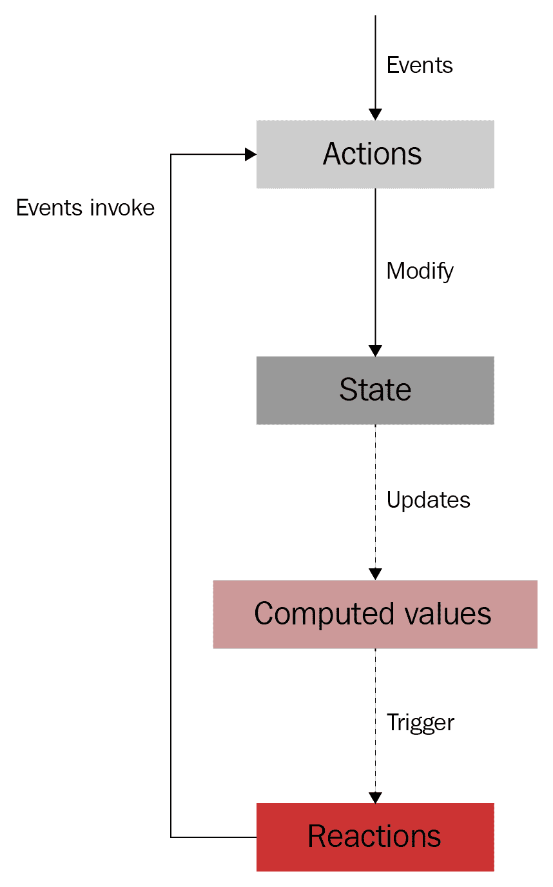

# 第十三章：MobX 和 Hooks

在上一章中，我们学习了 Redux 以及如何将 Redux 与 Hooks 结合使用。我们还学习了如何将现有的 Redux 应用迁移到基于 Hook 的解决方案。此外，我们还了解了使用 Reducer Hooks 与 Redux 的权衡，以及何时使用其中之一。

在本章中，我们将学习如何将 MobX 与 Hooks 结合使用。我们将首先学习如何使用 MobX 处理状态，然后转而使用 Hooks 与 MobX。此外，我们还将学习如何将现有的 MobX 应用迁移到 Hooks。最后，我们将讨论使用 MobX 的利弊。通过本章的学习，您将完全了解如何使用 Hooks 编写 MobX 应用程序。

本章将涵盖以下主题：

+   了解 MobX 是什么以及它是如何工作的

+   使用 MobX 处理状态

+   使用 Hooks 与 MobX

+   迁移 MobX 应用

+   了解 MobX 的权衡

# 技术要求

应该已经安装了相当新的 Node.js 版本（v11.12.0 或更高）。还需要安装 Node.js 的`npm`包管理器。

本章的代码可以在 GitHub 存储库中找到：[`github.com/PacktPublishing/Learn-React-Hooks/tree/master/Chapter13`](https://github.com/PacktPublishing/Learn-React-Hooks/tree/master/Chapter13)。

查看以下视频以查看代码的实际操作：

[`bit.ly/2Mm9yoC`](http://bit.ly/2Mm9yoC)

请注意，强烈建议您自己编写代码。不要简单地运行提供的代码示例。重要的是您自己编写代码，以便能够正确学习和理解它。但是，如果遇到任何问题，您可以随时参考代码示例。

现在，让我们开始本章。

# 什么是 MobX？

MobX 采用了与 Redux 不同的方法。它不是施加限制以使状态变化可预测，而是旨在自动更新从应用程序状态派生的任何内容。与分派动作不同，在 MobX 中，我们可以直接修改状态对象，MobX 将负责更新使用状态的任何内容。

MobX 的生命周期如下：

1.  事件（如`onClick`）调用动作，这是唯一可以修改状态的东西：

```jsx
@action onClick = () => {
    this.props.todo.completed = true
}
```

1.  状态是可观察的，不应包含冗余或可推导的数据。状态非常灵活 - 它可以包含类、数组、引用，甚至可以是图：

```jsx
@observable todos = [
    { title: 'Learn MobX', completed: false }
]
```

1.  计算值是通过纯函数从状态派生出来的。这些将被 MobX 自动更新：

```jsx
@computed get activeTodos () {
    return this.todos.filter(todo => !todo.completed)
}
```

1.  反应就像计算值，但它们也可以产生副作用，而不是一个值，比如在 React 中更新用户界面：

```jsx
const TodoList = observer(({ todos }) => (
    <div>
        {todos.map(todo => <TodoItem {...todo} />)}
    </div>
)
```

我们可以在以下图表中看到 MobX 的生命周期可视化：



MobX 生命周期的可视化

MobX 和 React 非常搭配。每当 MobX 检测到状态已经改变，它将导致适当的组件重新渲染。

与 Redux 不同，使用 MobX 并不需要学习很多限制。我们只需要了解一些核心概念，比如可观察值、计算值和反应。

现在我们知道了 MobX 的生命周期，让我们继续实践中使用 MobX 处理状态。

# 使用 MobX 处理状态

了解 MobX 最好的方法是在实践中使用它并看看它是如何工作的。所以，让我们从第十一章的 ToDo 应用程序开始，*从 React 类组件迁移*到 MobX。我们首先要做的是从`Chapter11/chapter11_2/`复制代码示例。

# 安装 MobX

第一步是通过`npm`安装 MobX 和 MobX React。执行以下命令：

```jsx
> npm install --save mobx mobx-react
```

现在 MobX 和 MobX React 都安装好了，我们可以开始设置存储了。

# 设置 MobX 存储

安装完 MobX 后，现在是时候设置我们的 MobX 存储了。存储将存储所有状态，以及相关的计算值和操作。通常使用类来定义。

现在让我们定义 MobX 存储：

1.  创建一个新的`src/store.js`文件。

1.  从 MobX 导入`observable`、`action`和`computed`装饰器，以及`decorate`函数。这些将用于标记存储中的各种函数和值：

```jsx
import { observable, action, computed, decorate } from 'mobx'
```

1.  还要从我们的 API 代码中导入`fetchAPITodos`和`generateID`函数：

```jsx
import { fetchAPITodos, generateID } from './api'
```

1.  现在，我们通过使用一个类来定义存储：

```jsx
export default class TodoStore {
```

1.  在这个存储中，我们存储了一个`todos`数组和`filter`字符串值。这两个值都是可观察的。我们将在稍后将它们标记为这样：

```jsx
    todos = []
    filter = 'all'
```

通过特殊的项目设置，我们可以使用一个实验性的 JavaScript 特性，称为**装饰器**，通过编写`@observable todos = []`来将我们的值标记为可观察的。然而，这种语法不受`create-react-app`支持，因为它还不是 JavaScript 标准的一部分。

1.  接下来，我们定义一个计算值，以便从我们的 store 中获取所有经过过滤的`todos`。该函数将类似于我们在`src/App.js`中的函数，但现在我们将使用`this.filter`和`this.todos`。同样，我们必须稍后将该函数标记为`computed`。MobX 将在需要时自动触发此函数，并存储结果，直到它所依赖的状态发生变化。

```jsx
    get filteredTodos () {
        switch (this.filter) {
            case 'active':
                return this.todos.filter(t => t.completed === false)

            case 'completed':
                return this.todos.filter(t => t.completed === true)

            default:
            case 'all':
                return this.todos
        }
    }
```

1.  现在，我们定义我们的动作。我们从`fetch`动作开始。与以前一样，我们必须稍后使用`action`装饰器标记我们的动作函数。在 MobX 中，我们可以通过设置`this.todos`直接修改我们的状态。因为`todos`值是可观察的，对它的任何更改都将被 MobX 自动跟踪：

```jsx
    fetch () {
        fetchAPITodos().then((fetchedTodos) => {
            this.todos = fetchedTodos
        })
    }
```

1.  然后，我们定义了`addTodo`动作。在 MobX 中，我们不使用不可变的值，因此不应创建新数组。相反，我们总是修改现有的`this.todos`值：

```jsx
    addTodo (title) {
        this.todos.push({ id: generateID(), title, completed: false })
    }
```

正如您所看到的，MobX 采用更加命令式的方法，直接修改值，MobX 会自动跟踪更改。我们不需要使用 rest/spread 语法来创建新数组；相反，我们直接修改现有状态数组。

1.  接下来是`toggleTodo`动作。在这里，我们循环遍历所有的`todos`并修改具有匹配`id`的项目。请注意，我们可以修改数组中的项目，并且更改仍将被 MobX 跟踪。事实上，MobX 甚至会注意到数组中只有一个值已经改变。结合 React，这意味着列表组件不会重新渲染；只有更改的项目组件将重新渲染。请注意，为了实现这一点，我们必须适当地拆分组件，例如制作单独的列表和项目组件：

```jsx
    toggleTodo (id) {
        for (let todo of this.todos) {
            if (todo.id === id) {
                todo.completed = !todo.completed
                break
            }
        }
    }
```

`for (let .. of ..) {`结构将循环遍历数组的所有项目，或任何其他可迭代的值。

1.  现在，我们定义了`removeTodo`动作。首先，我们找到要删除的`todo`项目的`index`：

```jsx
    removeTodo (id) {
        let index = 0
        for (let todo of this.todos) {
            if (todo.id === id) {
                break
            } else {
                index++
            }
        }
```

1.  然后，我们使用`splice`来删除一个元素——从找到的元素的`index`开始。这意味着我们从数组中剪切具有给定`id`的项目：

```jsx
        this.todos.splice(index, 1)
    }
```

1.  我们定义的最后一个动作是`filterTodos`动作。在这里，我们只需将`this.filter`值设置为新的过滤器：

```jsx
    filterTodos (filterName) {
        this.filter = filterName
    }
}
```

1.  最后，我们必须使用我们之前提到的各种装饰器来装饰我们的 store。我们通过在我们的 store 类上调用`decorate`函数并传递一个将值和方法映射到装饰器的对象来实现这一点：

```jsx
decorate(TodoStore, {
```

1.  我们从可观察的`todos`和`filter`值开始：

```jsx
    todos: observable,
    filter: observable,
```

1.  然后，我们装饰`computed`值*—*`filteredTodos`：

```jsx
    filteredTodos: computed,
```

1.  最后但并非最不重要的是，我们装饰我们的动作：

```jsx
    fetch: action,
    addTodo: action,
    toggleTodo: action,
    removeTodo: action,
    filterTodos: action
})
```

现在，我们的 MobX 存储已经正确装饰并准备好使用！

# 定义 Provider 组件

现在我们可以在`App`组件中初始化存储，并将其传递给所有其他组件。然而，更好的做法是使用 React Context。这样，我们可以在应用程序的任何地方访问存储。MobX React 提供了一个`Provider`组件，它在上下文中提供存储。

现在让我们开始使用`Provider`组件：

1.  编辑`src/index.js`，并从`mobx-react`中导入`Provider`组件：

```jsx
import { Provider } from 'mobx-react'
```

1.  然后，从我们的`store.js`文件中导入`TodoStore`：

```jsx
import TodoStore from './store'
```

1.  现在，我们创建`TodoStore`类的一个新实例：

```jsx
const store = new TodoStore()
```

1.  最后，我们必须调整`ReactDOM.render()`的第一个参数，以便用`Provider`组件包装`App`组件：

```jsx
ReactDOM.render(
    <Provider todoStore={store}>
        <App />
    </Provider>,
    document.getElementById('root')
)
```

与 Redux 不同，使用 MobX 可以在我们的应用程序中提供多个存储。然而，在这里，我们只提供一个存储，并将其称为`todoStore`。

现在，我们的存储已经初始化并准备在所有其他组件中使用。

# 连接组件

现在我们的 MobX 存储作为上下文可用，我们可以开始将我们的组件连接到它。为此，MobX React 提供了`inject`高阶组件，我们可以用它将存储注入到我们的组件中。

在这一部分，我们将把以下组件连接到我们的 MobX 存储中：

+   `App`

+   `TodoList`

+   `TodoItem`

+   `AddTodo`

+   `TodoFilter`

# 连接 App 组件

我们将从连接我们的`App`组件开始，在那里我们将使用`fetch`动作从我们的 API 中获取所有`todos`。

现在让我们连接`App`组件：

1.  编辑`src/App.js`，并从`mobx-react`中导入`inject`函数：

```jsx
import { inject } from 'mobx-react'
```

1.  然后，用`inject`包装`App`组件。`inject`函数用于将存储（或多个存储）作为 props 注入到组件中：

```jsx
export default inject('todoStore')(function App ({ todoStore }) {
```

在`inject`函数中可以指定多个存储，如下所示：`inject('todoStore', 'otherStore')`。然后，将注入两个 props：`todoStore`和`otherStore`。

1.  现在我们有了`todoStore`，我们可以在 Effect Hook 中调用`fetch`动作：

```jsx
    useEffect(() => {
 todoStore.fetch()
    }, [ todoStore ])
```

1.  现在，我们可以删除`filteredTodos` Memo Hook、处理函数、`StateContext.Provider`组件以及我们传递给其他组件的所有 props：

```jsx
    return (
        <div style={{ width: 400 }}>
            <Header />
            <AddTodo />
            <hr />
            <TodoList />
            <hr />
            <TodoFilter />
        </div>
    )
})
```

现在，我们的`App`组件将从 API 获取`todos`，然后它们将被存储在`TodoStore`中。

# 连接 TodoList 组件

在将`todos`存储在我们的存储中后，我们可以从存储中获取它们，然后我们可以在`TodoList`组件中列出所有的待办事项。

现在让我们连接`TodoList`组件：

1.  编辑`src/TodoList.js`并导入`inject`和`observer`函数：

```jsx
import { inject, observer } from 'mobx-react'
```

1.  删除所有与上下文相关的导入和 Hooks。

1.  与以前一样，我们使用`inject`函数来包装组件。此外，我们现在用`observer`函数包装我们的组件。`observer`函数告诉 MobX，当存储更新时，这个组件应该重新渲染：

```jsx
export default inject('todoStore')(observer(function TodoList ({ todoStore }) {
```

1.  我们现在可以使用存储中的`filteredTodos`计算值，以列出所有应用了过滤器的待办事项。为了确保 MobX 仍然可以跟踪`item`对象发生的更改，我们在这里*不*使用扩展语法。如果我们使用了扩展语法，所有的待办事项都会重新渲染，即使只有一个发生了变化：

```jsx
    return todoStore.filteredTodos.map(item =>
        <TodoItem key={item.id} item={item} />
    )
}))
```

现在，我们的应用程序已经列出了所有的待办事项。但是，我们还不能切换或删除待办事项。

# 连接 TodoItem 组件

为了能够切换或删除待办事项，我们必须连接`TodoItem`组件。我们还将`TodoItem`组件定义为观察者，以便 MobX 知道它将在`item`对象更改时重新渲染组件。

现在让我们连接`TodoItem`组件：

1.  编辑`src/TodoItem.js`，并从`mobx-react`中导入`inject`和`observer`函数：

```jsx
import { inject, observer } from 'mobx-react'
```

1.  然后，用`inject`和`observer`包装`TodoItem`组件：

```jsx
export default inject('todoStore')(observer(function TodoItem ({ item, todoStore }) {
```

1.  我们现在可以在组件内部使用`item`对象的解构。由于它被定义为观察者，MobX 将能够在解构后跟踪`item`对象的更改：

```jsx
    const { title, completed, id } = item
```

1.  现在我们有了`todoStore`，我们可以使用它来调整我们的处理函数，并调用相应的动作：

```jsx
    function handleToggle () {
        todoStore.toggleTodo(id)
    }

    function handleRemove () {
        todoStore.removeTodo(id)
    }
```

现在，我们的`TodoItem`组件将调用`todoStore`中的`toggleTodo`和`removeTodo`动作，所以我们现在可以切换和删除待办事项！

# 连接 AddTodo 组件

为了能够添加新的待办事项，我们必须连接`AddTodo`组件。

现在让我们连接`AddTodo`组件：

1.  编辑`src/AddTodo.js`并从`mobx-react`中导入`inject`函数：

```jsx
import { inject } from 'mobx-react'
```

1.  然后，用`inject`包装`AddTodo`组件：

```jsx
export default inject('todoStore')(function AddTodo ({ todoStore }) {
```

1.  现在我们有了`todoStore`，我们可以使用它来调整我们的处理函数，并调用`addTodo`动作：

```jsx
    function handleAdd () {
        if (input) {
            todoStore.addTodo(input)
            setInput('')
        }
    }
```

现在，我们的`AddTodo`组件将调用我们的`todoStore`中的`addTodo`动作，所以我们现在可以添加新的待办事项！

# 连接 TodoFilter 组件

最后，我们必须连接`TodoFilter`组件，以便能够选择不同的过滤器。我们还希望显示当前选定的过滤器，因此这个组件需要是一个`observer`。

让我们现在连接`TodoFilter`组件：

1.  编辑`src/TodoFilter.js`并导入`inject`和`observer`函数：

```jsx
import { inject, observer } from 'mobx-react'
```

1.  我们使用`inject`和`observer`函数来包装组件：

```jsx
const TodoFilterItem = inject('todoStore')(observer(function TodoFilterItemWrapped ({ name, todoStore }) {
```

1.  现在我们调整我们的处理函数，以调用存储中的`filterTodos`动作：

```jsx
    function handleFilter () {
        todoStore.filterTodos(name)
    }
```

1.  最后，我们调整`style`对象，以使用`todoStore`中的`filter`值，以检查过滤器当前是否被选中：

```jsx
    const style = {
        color: 'blue',
        cursor: 'pointer',
        fontWeight: (todoStore.filter === name) ? 'bold': 'normal'
    }
```

1.  此外，我们现在可以摆脱在`FilterItem`组件中传递 props。删除以下用粗体标记的部分：

```jsx
export  default  function  TodoFilter  (props)  {
  return ( <div> <TodoFilterItem {...props} name="all" />{' / '} <TodoFilterItem {...props} name="active" />{' / '} <TodoFilterItem {...props} name="completed" /> </div> ) }
```

现在，我们可以选择新的过滤器，它们将被标记为选定，并以粗体显示。待办事项列表也将自动过滤，因为 MobX 检测到`filter`值的变化，导致`filteredTodos`计算值更新，并且`TodoList`观察者组件重新渲染。

# 示例代码

示例代码可以在`Chapter13/chapter13_1`文件夹中找到。

只需运行`npm install`以安装所有依赖项，然后运行`npm start`启动应用程序，然后在浏览器中访问`http://localhost:3000`（如果没有自动打开）。

# 使用 MobX 和 Hooks

在上一节中，我们学习了如何在 React 中使用 MobX。正如我们所见，为了能够将我们的组件连接到 MobX 存储，我们需要使用`inject`函数将它们包装起来，并且在某些情况下，还需要使用`observer`函数。自从`mobx-react`的 v6 版本发布以来，我们可以使用 Hooks 来连接我们的组件到 MobX 存储，而不是使用这些高阶组件来包装我们的组件。我们现在要使用 MobX 和 Hooks！

# 定义一个存储 Hook

首先，我们必须定义一个 Hook 以便访问我们自己的存储。正如我们之前学到的，MobX 使用 React Context 来提供和注入状态到各种组件中。我们可以从`mobx-react`中获取`MobXProviderContext`并创建我们自己的自定义上下文 Hook 以便访问所有存储。然后，我们可以创建另一个 Hook，专门访问我们的`TodoStore`。

所以，让我们开始定义一个存储 Hook：

1.  创建一个新的`src/hooks.js`文件。

1.  从`react`中导入`useContext` Hook，以及从`mobx-react`中导入`MobXProviderContext`：

```jsx
import { useContext } from 'react'
import { MobXProviderContext } from 'mobx-react'
```

1.  现在，我们定义并导出一个`useStores` Hook，它返回一个用于`MobXProviderContext`的 Context Hook：

```jsx
export function useStores () {
    return useContext(MobXProviderContext)
}
```

1.  最后，我们定义一个`useTodoStore` Hook，它从我们之前的 Hook 中获取`todoStore`，然后返回它：

```jsx
export function useTodoStore () {
    const { todoStore } = useStores()
    return todoStore
}
```

现在，我们有一个通用的 Hook，可以访问 MobX 的所有 stores，以及一个特定的 Hook 来访问`TodoStore`。如果需要的话，我们也可以在以后定义更多的 Hooks 来访问其他 stores。

# 升级组件到 Hooks

创建一个 Hook 来访问我们的 store 后，我们可以使用它来代替用`inject`高阶组件函数包装我们的组件。在接下来的部分中，我们将看到如何使用 Hooks 来升级我们的各种组件。

# 为 App 组件使用 Hooks

我们将从升级我们的`App`组件开始。逐渐重构组件，使其使用 Hooks 是可能的。我们不需要一次性重构每个组件。

现在让我们为`App`组件使用 Hooks：

1.  编辑`src/App.js`并删除以下`import`语句：

```jsx
import { inject } from 'mobx-react'
```

1.  然后，从我们的`hooks.js`文件中导入`useTodoStore` Hook：

```jsx
import { useTodoStore } from './hooks'
```

1.  现在，删除包装`App`组件的`inject`函数，并删除所有 props。`App`函数定义现在应该如下所示：

```jsx
export default function App () {
```

1.  最后，使用我们的 Todo Store Hook 来获取`todoStore`对象：

```jsx
    const todoStore = useTodoStore()
```

如你所见，我们的应用程序仍然以与以前相同的方式工作！然而，我们现在在`App`组件中使用 Hooks，这使得代码更加清晰和简洁。

# 为`TodoList`组件使用 Hooks

接下来，我们将升级我们的`TodoList`组件。此外，我们还将使用`useObserver` Hook，它替换了`observer`高阶组件。

现在让我们为`TodoList`组件使用 Hooks：

1.  编辑`src/TodoList.js`，并删除以下导入语句：

```jsx
import { inject, observer } from 'mobx-react'
```

1.  然后，从`mobx-react`中导入`useObserver` Hook，以及从我们的`hooks.js`文件中导入`useTodoStore` Hook：

```jsx
import { useObserver } from 'mobx-react'
import { useTodoStore } from './hooks'
```

1.  现在，删除包装`TodoList`组件的`inject`和`observer`函数，并且也删除所有 props。`TodoList`函数定义现在应该如下所示：

```jsx
export default function TodoList () {
```

1.  再次，我们使用 Todo Store Hook 来获取`todoStore`对象：

```jsx
    const todoStore = useTodoStore()
```

1.  最后，我们用`useObserver` Hook 包装返回的元素。在 Observer Hook 中的所有内容将在 Hook 中使用的状态发生变化时重新计算：

```jsx
    return useObserver(() =>
        todoStore.filteredTodos.map(item =>
            <TodoItem key={item.id} item={item} />
        )
    )
}
```

在我们的情况下，MobX 将检测到通过`useObserver` Hook 定义的观察者依赖于`todoStore.filteredTodos`，而`filteredTodos`依赖于`filter`和`todos`值。因此，每当`filter`值或`todos`数组发生更改时，列表将重新渲染。

# 为`TodoItem`组件使用 Hooks

接下来，我们将升级`TodoItem`组件，这将是与`TodoList`组件相似的过程。

现在让我们为`TodoItem`组件使用 Hooks：

1.  编辑`src/TodoItem.js`并删除以下`import`语句：

```jsx
import { inject, observer } from 'mobx-react'
```

1.  然后，从`mobx-react`中导入`useObserver` Hook，从我们的`hooks.js`文件中导入`useTodoStore` Hook：

```jsx
import { useObserver } from 'mobx-react'

import { useTodoStore } from './hooks'
```

1.  现在，删除包裹`TodoItem`组件的`inject`和`observer`函数，也删除`todoStore`属性。`TodoItem`函数定义现在应该如下所示：

```jsx
export default function TodoItem ({ item }) {
```

1.  接下来，我们必须删除解构（粗体代码），因为我们整个组件不再被定义为可观察的，因此 MobX 将无法跟踪`item`对象的更改：

```jsx
 const { title, completed, id } = item
```

1.  然后，使用 Todo Store Hook 来获取`todoStore`对象：

```jsx
    const todoStore = useTodoStore()
```

1.  现在，我们必须调整处理函数，使其直接使用`item.id`而不是`id`。请注意，我们假设`id`不会改变，因此它不会被包裹在 Observer Hook 中：

```jsx
    function handleToggle () {
        todoStore.toggleTodo(item.id)
    }

    function handleRemove () {
        todoStore.removeTodo(item.id)
    }
```

1.  最后，我们用 Observer Hook 包裹`return`语句并在那里进行解构。这确保了 MobX 会跟踪`item`对象的更改，并且当对象的属性更改时，组件将相应地重新渲染：

```jsx
    return useObserver(() => {
 const { title, completed } = item
        return (
            <div style={{ width: 400, height: 25 }}>
                <input type="checkbox" checked={completed} onChange={handleToggle} />
                {title}
                <button style={{ float: 'right' }} onClick={handleRemove}>x</button>
            </div>
        )
    })
}
```

现在，我们的`TodoItem`组件已经正确连接到 MobX 存储。

如果`item.id`属性发生更改，我们将不得不将处理函数和`return`函数包裹在单个`useObserver` Hook 中，如下所示：

```jsx
    return useObserver(() => {
        const { title, completed, id } = item

        function handleToggle () {
            todoStore.toggleTodo(id)
        }

        function handleRemove () {
            todoStore.removeTodo(id)
        }

        return (
            <div style={{ width: 400, height: 25 }}>
                <input type="checkbox" checked={completed} onChange={handleToggle} />
                {title}
                <button style={{ float: 'right' }} onClick={handleRemove}>x</button>
            </div>
        )
    })
```

请注意，我们不能将处理函数和`return`语句分别包裹在单独的 Observer Hooks 中，因为这样处理函数将只在第一个 Observer Hook 的闭包内定义。这意味着我们将无法从第二个 Observer Hook 内访问处理函数。

接下来，我们将继续通过使用 Hooks 来升级`AddTodo`组件的组件。

# 为`AddTodo`组件使用 Hooks

我们重复与`App`组件中相同的升级过程，用于`AddTodo`组件，如下所示：

1.  编辑`src/AddTodo.js`并删除以下`import`语句：

```jsx
import { inject } from 'mobx-react'
```

1.  然后，从我们的`hooks.js`文件中导入`useTodoStore` Hook：

```jsx
import { useTodoStore } from './hooks'
```

1.  现在，删除包装`AddTodo`组件的`inject`函数，也删除所有 props。`AddTodo`函数定义现在应该如下所示：

```jsx
export default function AddTodo () {
```

1.  最后，使用 Todo Store Hook 来获取`todoStore`对象：

```jsx
    const todoStore = useTodoStore()
```

现在，我们的`AddTodo`组件已连接到 MobX 存储，我们可以继续升级`TodoFilter`组件。

# 使用 Hooks 来处理`TodoFilter`组件

对于`TodoFilter`组件，我们将使用类似于我们用于`TodoList`组件的过程。我们将使用我们的`useTodoStore` Hook 和`useObserver` Hook。

现在让我们为`TodoFilter`组件使用 Hooks：

1.  编辑`src/TodoFilter.js`并删除以下`import`语句：

```jsx
import { inject, observer } from 'mobx-react'
```

1.  然后，从`mobx-react`导入`useObserver` Hook，以及从我们的`hooks.js`文件中导入`useTodoStore` Hook：

```jsx
import { useObserver } from 'mobx-react'
import { useTodoStore } from './hooks'
```

1.  现在，删除包装`TodoFilterItem`组件的`inject`和`observer`函数，也删除`todoStore` prop。`TodoFilterItem`函数定义现在应该如下所示：

```jsx
function TodoFilterItem ({ name }) {
```

1.  再次，我们使用 Todo Store Hook 来获取`todoStore`对象：

```jsx
    const todoStore = useTodoStore()
```

1.  最后，我们使用`useObserver` Hook 将`style`对象包装起来。请记住，Observer Hook 内的所有内容都将在 Hook 中使用的状态发生变化时重新计算：

```jsx
    const style = useObserver(() => ({
        color: 'blue',
        cursor: 'pointer',
        fontWeight: (todoStore.filter === name) ? 'bold' : 'normal'
    }))
```

在这种情况下，当`todoStore.filter`值发生变化时，`style`对象将被重新计算，这将导致元素重新渲染，并在选择不同的过滤器时更改字体加粗。

# 示例代码

示例代码可以在`Chapter13/chapter13_2`文件夹中找到。

只需运行`npm install`以安装所有依赖项，然后运行`npm start`启动应用程序，然后在浏览器中访问`http://localhost:3000`（如果没有自动打开）。

# 使用本地存储 Hook

除了提供全局存储以存储应用程序范围的状态外，MobX 还提供了本地存储以存储本地状态。要创建本地存储，我们可以使用`useLocalStore` Hook。

现在，我们将在`AddTodo`组件中实现 Local Store Hook：

1.  编辑`src/AddTodo.js`并导入`useLocalStore` Hook，以及从`mobx-react`导入`useObserver` Hook：

```jsx
import { useLocalStore, useObserver } from 'mobx-react'
```

1.  然后，删除以下 State Hook：

```jsx
    const [ input, setInput ] = useState('')
```

用本地存储 Hook 替换它：

```jsx
    const inputStore = useLocalStore(() => ({
```

在这个本地存储中，我们可以定义状态值、计算值和动作。`useLocalStore` Hook 将自动将值装饰为可观察的，getter 函数（`get`前缀）作为计算值，普通函数作为动作。

1.  我们从`input`字段的`value`状态开始：

```jsx
        value: '',
```

1.  然后，我们定义一个计算值，它将告诉我们添加按钮是否应该被`disabled`：

```jsx
        get disabled () {
            return !this.value
        },
```

1.  接下来，我们定义动作。第一个动作从输入事件更新`value`：

```jsx
        updateFromInput (e) {
            this.value = e.target.value
        },
```

1.  然后，我们定义另一个动作来更新`value`，从一个简单的字符串：

```jsx
        update (val) {
            this.value = val
        }
    }))
```

1.  现在，我们可以调整输入处理函数，并调用`updateFromInput`动作：

```jsx
    function handleInput (e) {
        inputStore.updateFromInput(e)
    }
```

1.  我们还需要调整`handleAdd`函数：

```jsx
    function handleAdd () {
        if (inputStore.value) {
            todoStore.addTodo(inputStore.value)
            inputStore.update('') }}
```

1.  最后，我们用`useObserver` Hook 包装元素，以确保`input`字段的值在更改时得到更新，并调整`disabled`和`value`属性：

```jsx
    return useObserver(() => (
        <form onSubmit={e => { e.preventDefault(); handleAdd() }}>
            <input
                type="text"
                placeholder="enter new task..."
                style={{ width: 350, height: 15 }}
                value={inputStore.value}
                onChange={handleInput}
            />
            <input
                type="submit"
                style={{ float: 'right', marginTop: 2 }}
                disabled={inputStore.disabled}
                value="add"
            />
        </form>
    ))
}
```

现在，我们的`AddTodo`组件使用一个本地 MobX 存储来处理其输入值，并禁用/启用按钮。如你所见，使用 MobX，可以使用多个存储，用于本地和全局状态。难点在于决定如何分割和分组你的存储，以使其对给定应用程序有意义。

# 示例代码

示例代码可以在`Chapter13/chapter13_3`文件夹中找到。

只需运行`npm install`来安装所有依赖项，然后运行`npm start`启动应用程序，然后在浏览器中访问`http://localhost:3000`（如果没有自动打开）。

# 迁移 MobX 应用程序

在上一节中，我们学习了如何用 Hooks 替换现有 MobX 应用程序中的 MobX 高阶组件，如`inject`和`observer`。现在，我们将学习如何将现有 MobX 应用程序中的本地状态迁移到 Hooks 中。

通过以下三个步骤，可以将现有的 MobX 应用程序迁移到基于 Hook 的解决方案：

+   使用 State Hook 处理简单的本地状态

+   使用`useLocalState` Hook 处理复杂的本地状态

+   将全局状态保留在单独的 MobX 存储中

我们已经学习了如何在本书的早期章节中使用 State Hook。State Hooks 对于简单的状态，比如复选框的当前状态，是有意义的。

我们已经在本章中学习了如何使用`useLocalState` Hook。我们可以使用本地状态 Hook 处理复杂的本地状态，比如多个字段相互交互的复杂表单。然后，我们可以用单个本地状态 Hook 替换多个 State 和 Effect Hooks 以及计算值和动作。

最后，全局状态应该存储在单独的 MobX 存储中，例如在本章中定义的`TodoStore`。在 MobX 中，可以创建多个存储并使用`Provider`组件传递给组件。然后我们可以为每个存储创建一个单独的自定义 Hook。

# MobX 的权衡取舍

总之，让我们总结在 Web 应用程序中使用 MobX 的利弊。首先，让我们从积极方面开始：

+   它提供了一种简单的处理状态变化的方式

+   需要更少的样板代码

+   它提供了灵活性，可以结构化我们的应用程序代码

+   可以使用多个全局和本地存储

+   它使`App`组件更简单（它将状态管理和操作转移到 MobX）

MobX 非常适合处理复杂状态变化和在许多组件中使用的状态的小型和大型项目。

然而，使用 MobX 也有缺点：

+   状态变化可能发生在任何地方，不仅仅是在单个存储中

+   它的灵活性意味着可能以不好的方式构建项目，这可能会导致错误或缺陷

+   MobX 需要一个包装组件（`Provider`）来连接应用程序到存储，如果我们想要获得所有功能（我们可以直接导入和使用 MobX 存储，但这将破坏诸如服务器端渲染之类的功能）

如果状态变化很简单，并且只需要组件内部的本地状态，就不应该使用 MobX。在这种情况下，状态或 Reducer Hook 可能足够了。使用 Reducer 和 State Hooks，我们不需要包装组件来连接我们的应用程序到存储。

灵活性是一件好事，但它也可能导致我们不好地构建项目。然而，MobX 提供了一个名为`mobx-state-tree`的项目，它允许我们使我们的 MobX 应用程序更有结构并强制执行某种类型的架构。更多信息可以在以下 GitHub 存储库的项目页面中找到：[`github.com/mobxjs/mobx-state-tree`](https://github.com/mobxjs/mobx-state-tree)。

# 总结

在本章中，我们首先学习了 MobX 是什么，它由哪些元素组成，以及它们如何一起工作。然后，我们学习了如何在实践中使用 MobX 进行状态管理。我们还学习了如何将 MobX 存储与 React 组件连接起来，使用`inject`和`observer`高阶组件。接下来，我们用 Hooks 替换了高阶组件，使我们的代码更加清晰简洁。我们还学习了如何使用 Local Store Hook 处理 MobX 中复杂的本地状态。最后，我们学习了如何将现有的 MobX 应用迁移到 Hooks，并总结了使用 MobX 的权衡。

本章标志着本书的结束。在本书中，我们从动机开始使用 Hooks。我们了解到在 React 应用中有一些常见问题，如果没有 Hooks，很难解决。然后，我们使用 Hooks 创建了我们的第一个组件，并将其与基于类的组件解决方案进行了比较。接下来，我们深入学习了各种 Hooks，从最常见的 State Hook 开始。我们还学习了如何使用 Hooks 解决常见问题，例如条件性 Hooks 和循环中的 Hooks。

在深入学习了 State Hook 之后，我们使用 Hooks 开发了一个小型博客应用。然后，我们学习了 Reducer Hooks、Effect Hooks 和 Context Hooks，以便能够在我们的应用中实现更多功能。接下来，我们学习了如何使用 Hooks 有效地请求资源。此外，我们学习了如何使用`React.memo`防止不必要的重新渲染，以及如何使用 React Suspense 实现延迟加载。然后，我们在我们的博客应用中实现了路由，并学习了 Hooks 如何使动态路由变得更加容易。

我们还学习了社区提供的各种 Hooks，这些 Hooks 使处理输入字段、各种数据结构、响应式设计和撤销/重做功能变得更加容易。此外，我们学习了 Hooks 的规则，如何创建我们自己的自定义 Hooks，以及 Hooks 之间的交互方式。最后，我们学习了如何有效地从现有的基于类的应用迁移到基于 Hooks 的解决方案。最后，我们学习了如何将 Hooks 与 Redux 和 MobX 一起使用，以及如何将现有的 Redux 和 MobX 应用迁移到 Hooks。

现在我们已经深入了解了 Hooks，我们准备在我们的应用程序中使用它们！我们还学会了如何将现有项目迁移到 Hooks，所以我们现在可以开始做这个。我希望你喜欢学习 React Hooks，并且期待在你的应用程序中实现 Hooks！我相信使用 Hooks 会让编码对你来说更加愉快，就像对我一样。

# 问题

为了回顾我们在本章学到的内容，请尝试回答以下问题：

1.  哪些元素构成 MobX 生命周期？

1.  MobX 提供哪些装饰器？

1.  我们如何将组件连接到 MobX？

1.  MobX 提供哪些 Hooks？

1.  我们如何使用 Hooks 访问 MobX 存储？

1.  我们可以使用 MobX 存储本地状态吗？

1.  我们应该如何将现有的 MobX 应用程序迁移到 Hooks？

1.  使用 MobX 的优点是什么？

1.  使用 MobX 有哪些缺点？

1.  何时不应该使用 MobX？

# 进一步阅读

如果您对本章学习的概念更多信息感兴趣，请查看以下阅读材料：

+   来自官方 MobX 文档的 MobX 简介：[`mobx.js.org/getting-started.html`](https://mobx.js.org/getting-started.html)

+   官方 MobX 文档：[`mobx.js.org`](https://mobx.js.org)

+   关于 MobX 基础知识的视频课程：[`egghead.io/lessons/react-sync-the-ui-with-the-app-state-using-mobx-observable-and-observer-in-react`](https://egghead.io/lessons/react-sync-the-ui-with-the-app-state-using-mobx-observable-and-observer-in-react)

+   官方 MobX React 文档：[`mobx-react.js.org/`](https://mobx-react.js.org/)

+   GitHub 上的`mobx`项目：[`github.com/mobxjs/mobx`](https://github.com/mobxjs/mobx)

+   GitHub 上的`mobx-react`项目：[`github.com/mobxjs/mobx-react`](https://github.com/mobxjs/mobx-react)

+   GitHub 上的`mobx-state-tree`项目：[`github.com/mobxjs/mobx-state-tree`](https://github.com/mobxjs/mobx-state-tree)
