# 第一章：TypeScript 基础知识

Facebook 已经成为一个非常受欢迎的应用程序。随着其受欢迎程度的增加，对新功能的需求也在增加。React 是 Facebook 的答案，可以帮助更多的人在代码库上工作并更快地交付功能。React 对 Facebook 来说效果非常好，他们最终将其开源。如今，React 是一个成熟的用于构建基于组件的前端的库，非常受欢迎，并拥有庞大的社区和生态系统。

TypeScript 也是一个受欢迎的成熟库，由一家大公司——微软维护。它允许用户向他们的 JavaScript 代码添加强类型，帮助他们在大型代码库中更加高效。

本书将教您如何使用这两个令人惊叹的库来构建易于维护的强大前端。本书的前几章将专注于 TypeScript。然后，您将开始学习 React 以及如何使用具有强类型的 TypeScript 组件来构建强大的前端。

在本章中，我们将介绍 TypeScript 与 JavaScript 的关系以及它带来的好处。因此，基本的 JavaScript 理解是必需的。我们还将介绍您在编写面向浏览器的代码时通常会使用的 TypeScript 基础知识。

您将了解到在构建前端时使用 TypeScript 的必要性，以及 TypeScript 真正擅长的项目类型。您还将了解如何将您的 TypeScript 代码转译为 JavaScript，以便在浏览器中运行。最后但同样重要的是，您将学习如何对您的 TypeScript 代码执行额外的检查，使其更易读和易维护。

在本章结束时，您将准备好开始学习如何使用 TypeScript 构建具有 React 的前端。

在本章中，我们将涵盖以下主题：

+   理解 TypeScript 的好处

+   理解基本类型

+   创建接口、类型别名和类

+   将代码结构化为模块

+   配置编译

+   TypeScript 代码检查

+   代码格式化

# 技术要求

在本章中，我们将使用以下技术：

+   **TypeScript playground**：这是一个网站，网址为[`www.typescriptlang.org/play/`](https://www.typescriptlang.org/play/)，允许您在不安装 TypeScript 的情况下玩耍并了解其特性。

+   **Node.js**和**npm**：TypeScript 和 React 依赖于这些。您可以在[`nodejs.org/en/download/`](https://nodejs.org/en/download/)安装它们。如果您已经安装了这些，请确保 Node.js 至少是 8.2 版本，`npm`至少是 5.2 版本。

+   **TypeScript**：可以通过`npm`安装这个。在终端中输入以下命令：

```jsx
npm install -g typescript
```

+   **Visual Studio Code**：我们需要一个编辑器来编写 TypeScript 代码。可以从[`code.visualstudio.com/`](https://code.visualstudio.com/)安装这个编辑器。其他可用的编辑器可以在[`github.com/Microsoft/TypeScript/wiki/TypeScript-Editor-Support`](https://github.com/Microsoft/TypeScript/wiki/TypeScript-Editor-Support)找到。

本章中的所有代码片段都可以在以下网址找到：[`github.com/carlrip/LearnReact17WithTypeScript/tree/master/01-TypeScriptBasics`](https://github.com/carlrip/LearnReact17WithTypeScript/tree/master/01-TypeScriptBasics)

# 理解 TypeScript 的好处

当 JavaScript 代码库增长时，阅读和维护可能变得困难。TypeScript 是 JavaScript 的扩展，添加了静态类型。TypeScript 编译器读取包含类型信息的 TypeScript 代码，并生成干净、可读的 JavaScript，其中包含转换和删除的类型信息。编译后的代码可以在我们喜爱的浏览器和 Node.js 中运行。

TypeScript 相对于 JavaScript 提供了几个优点：

+   编码错误可以在开发过程中更早地被捕捉到

+   静态类型允许构建工具，提高开发者的体验和生产力

+   尚未在所有浏览器中实现的 JavaScript 功能实际上可以在针对这些浏览器的应用程序中使用

我们将在接下来的章节中详细介绍这些要点。

# 早期捕捉编码错误

类型信息帮助 TypeScript 编译器在用户遇到错误之前捕捉到错误和拼写错误。在诸如 Visual Studio Code 之类的代码编辑器中，用户一旦出错，错误就会立即用红色下划线标出。例如，创建一个名为`utils.js`的文件，并粘贴以下代码，用于计算订单行上的总价：

```jsx
function calculateTotalPrice(product, quantity, discount) {
  var priceWithoutDiscount = product.price * quantity;
  var discountAmount = priceWithoutDiscount * discount;
  return priceWithoutDiscount - discountAmount;
}
```

代码中存在一个错误，可能很难发现。如果我们在 Visual Studio Code 中打开文件，不会有错误被突出显示。如果我们将文件扩展名更改为`.ts`，Visual Studio Code 会立即用红色下划线标出需要我们注意的代码部分：

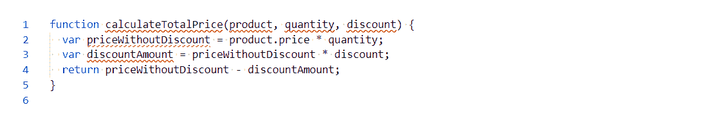

大多数错误都是 TypeScript 要求一些类型信息。因此，让我们为我们的代码添加一些类型：

```jsx
interface IProduct {
 name: string;
 unitPrice: number;
}

function calculateTotalPrice(product: IProduct, quantity: number, discount: number): number {
  var priceWithoutDiscount: number = product.price * quantity;
  var discountAmount: number = priceWithoutDiscount * discount;
  return priceWithoutDiscount - discountAmount;
}
```

如果你不理解我们刚刚添加的内容，不要担心；我们将在下一节中介绍类型。关键点是，我们现在有一个突出显示的错误，实际上就是 bug：

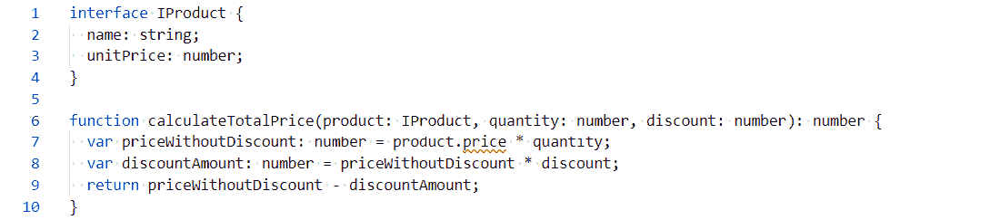

bug 是我们的函数引用了产品对象中不存在的`price`属性。我们应该引用的属性是`unitPrice`。

# 更好的开发者体验和生产力

让我们通过将`price`重命名为`unitPrice`来修复上一节中的错误。请注意，Visual Studio Code 给我们提供了智能感知列表`unitPrice`作为一个选项，因为它查看了我们的类型定义：

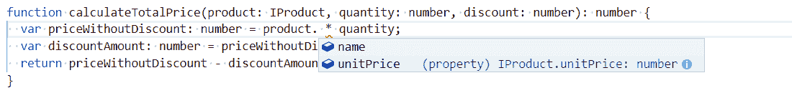

在这里，TypeScript 和 Visual Studio Code 使用类型为我们提供更好的编写体验。除了智能感知外，我们还提供了代码导航功能，以及在多个文件中安全重命名函数和变量。这些功能提高了我们的生产力，特别是当代码库很大并且有一个团队在上面工作时。

# 使用未来的 JavaScript 功能

TypeScript 还有另一个重要的好处需要理解。TypeScript 允许我们使用一些 JavaScript 中尚未被所有浏览器采用的功能，但仍然可以针对这些浏览器。TypeScript 通过将这些功能的使用转译为目标浏览器支持的 JavaScript 代码来实现这一点。

例如，让我们看一下 ES7 中的幂运算符（`**`），它在 IE 中不受支持。让我们创建一个名为`future.ts`的文件，并输入以下代码：

```jsx
var threeSquared: number = 3 ** 2;
console.log(threeSquared);
```

当我们在浏览器中运行程序时，它应该将`9`放入控制台。在这之前，让我们运行代码对 TypeScript 编译器进行转译成 JavaScript。在与`future.ts`相同的目录中的终端中运行以下命令：

```jsx
tsc future
```

这应该生成一个名为`future.js`的文件，内容如下：

```jsx
var threeSquared = Math.pow(3, 2);
console.log(threeSquared);
```

因此，TypeScript 将幂运算符转换为对`Math.pow`函数的调用，这在 IE 中是支持的。为了确认这一点，将生成的 JavaScript 代码粘贴到 IE 的控制台中，输出应该是`9`。

这个例子故意简单，但可能并不那么有用。`Async/await`、**spread**操作符、**rest**参数和**箭头函数**是远比 IE 不支持但 TypeScript 允许使用的更有用的功能。如果你不知道上一句中的功能是什么，不要担心，因为我们需要时会介绍它们。

# 理解基本类型

我们在上一节中提到了类型。在本节中，我们将介绍在 TypeScript 中常用的基本类型，以便开始理解我们应该在每种类型中使用哪些情况。我们将大量使用在线 TypeScript 播放器，所以确保准备好。

# 基本类型

在理解我们如何在 TypeScript 中声明带有类型的变量和函数之前，让我们简要地看一下基本类型，这些是最基本的类型。基本类型是没有属性的简单值。TypeScript 与 JavaScript 共享以下基本类型：

+   `string`：表示 Unicode 字符序列

+   `number`：表示整数和浮点数

+   布尔值：表示逻辑真或假

+   `undefined`：表示尚未初始化的值

+   `null`：表示没有值

# 类型注释

JavaScript 变量的类型是在运行时确定的。JavaScript 变量的类型也可以在运行时更改。例如，一个保存数字的变量可以后来被替换为字符串。通常，这是不希望的行为，可能导致我们应用程序中的错误。

TypeScript 注释允许我们在编写代码时声明具体类型的变量。这允许 TypeScript 编译器在代码执行运行时检查代码是否遵守这些类型。简而言之，类型注释允许 TypeScript 在我们编写代码时更早地捕捉到代码使用错误类型的错误。

TypeScript 注释允许我们使用`:Type`语法声明带有类型的变量。

1.  让我们浏览到 TypeScript 播放器，并将以下变量声明输入到左侧窗格中：

```jsx
let unitPrice: number;
```

1.  转译后的 JavaScript 将显示在右侧，如下所示：

```jsx
var unitPrice;
```

`let`已被转换为`var`。这是因为播放器使用的编译器设置为针对广泛的浏览器，其中一些不支持`let`。另外，请注意类型注释已经消失。这是因为 JavaScript 中不存在类型注释。

1.  让我们在我们的程序中添加第二行：

```jsx
unitPrice = "Table";
```

注意到`unitPrice`下面出现了一条红线，如果你将鼠标悬停在上面，你会得到正确的信息，即存在类型错误：

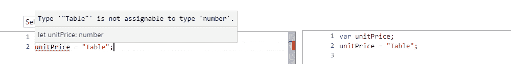

1.  您还可以使用相同的`:Type`语法为返回值的函数参数添加类型注释。让我们在 playground 中输入以下函数：

```jsx
function getTotal(unitPrice: number, quantity: number, discount: number): number {
  const priceWithoutDiscount = unitPrice * quantity;
  const discountAmount = priceWithoutDiscount * discount;
  return priceWithoutDiscount - discountAmount;
}
```

我们已经声明了`unitPrice`，`quantity`和`discount`参数，都是数字。`return`类型注释在函数的括号后面，前面的例子中也是一个数字。

我们在不同的例子中使用了`const`和`let`来声明变量。`let`允许变量在声明后改变值，而`const`变量则不能改变。在前面的函数中，`priceWithoutDiscount`和`discountAmount`在初始赋值后不会改变值，所以我们使用了`const`。

1.  让我们用一个不正确的类型调用我们的函数，并将结果赋给一个不正确的类型的变量：

```jsx
let total: string = getTotal(500, "one", 0.1);
```

我们发现`one`被红色下划线标出，突出显示存在类型错误：

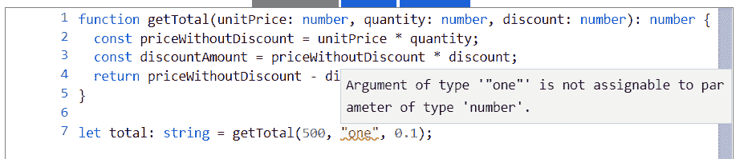

1.  如果我们将`one`更正为`1`，`total`应该被红色下划线标出，突出显示存在类型问题：

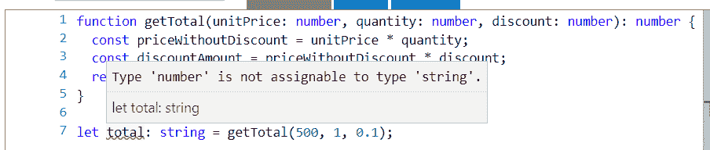

TypeScript 编译器使用类型注释来检查分配给变量和函数参数的值是否对其类型有效。

这种强类型检查是 JavaScript 中所没有的，它在大型代码库中非常有用，因为它帮助我们立即检测到类型错误。

# 类型推断

我们已经看到类型注释是非常有价值的，但它们涉及大量额外的输入。幸运的是，TypeScript 强大的类型推断系统意味着我们不必一直提供注释。当我们立即设置变量值时，我们可以使用类型推断。

让我们看一个例子：

1.  让我们在 TypeScript playground 中添加以下变量赋值：

```jsx
let flag = false;
```

1.  如果我们将鼠标悬停在`flag`变量上，我们可以看到 TypeScript 已经推断出类型为`boolean`：


1.  如果我们在下面再添加一行，错误地将`flag`设置为`Table`，我们会得到一个类型错误：

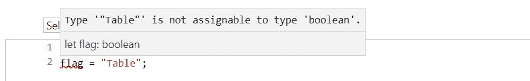

因此，当我们声明一个变量并立即设置其类型时，我们可以使用类型推断来节省一些按键。

# 任意

如果我们声明一个没有类型注释和没有值的变量会怎么样？TypeScript 会推断出什么类型？让我们在 TypeScript playground 中输入以下代码并找出：

```jsx
let flag;
```

如果我们将鼠标悬停在`flag`上，我们会看到它被赋予了`any`类型：


因此，TypeScript 编译器给了一个没有类型注释和没有立即赋值的变量，`any`类型。`any`类型是特定于 TypeScript 的；它在 JavaScript 中不存在。这是一种选择不对特定变量进行类型检查的方式。它通常用于动态内容或来自第三方库的值。然而，TypeScript 日益强大的类型系统意味着我们这些天需要更少地使用`any`。

# Void

`void`是另一种在 JavaScript 中不存在的类型。它通常用于表示一个不返回任何东西的函数。

让我们来看一个例子：

1.  让我们在 TypeScript playground 中输入以下函数：

```jsx
function logText(text: string): void {
  console.log(text);
}
```

该函数只是简单地将一些文本记录到控制台中，并且不返回任何东西。因此，我们将返回类型标记为`void`。

1.  如果我们删除返回类型注释并悬停在函数名`logText`上，我们会看到 TypeScript 已经推断出类型为`void`：

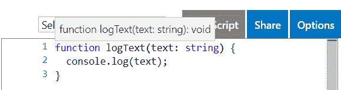

这在编写不返回任何东西的函数时为我们节省了一些按键。

# Never

`never`类型表示永远不会发生的事情，通常用于指定代码中不可达的区域。同样，这在 JavaScript 中不存在。

现在是一个例子的时间：

1.  在 TypeScript playground 中输入以下代码：

```jsx
function foreverTask(taskName: string): never {
  while (true) {
    console.log(`Doing ${taskName} over and over again ...`);
  }
}
```

该函数调用一个无限循环并且永远不会返回，因此我们给它一个`never`类型的类型注释。这与`void`不同，因为 void 表示它将返回，但没有值。

在前面的例子中，我们使用了 JavaScript 模板文字来构造要记录到控制台的字符串。模板文字由反引号括起来。

function foreverTask(taskName: string): never {

while (true) {

console.log(`一遍又一遍地做${taskName}...`);

break;

}

}

```jsx

The TypeScript compiler quite rightly complains:

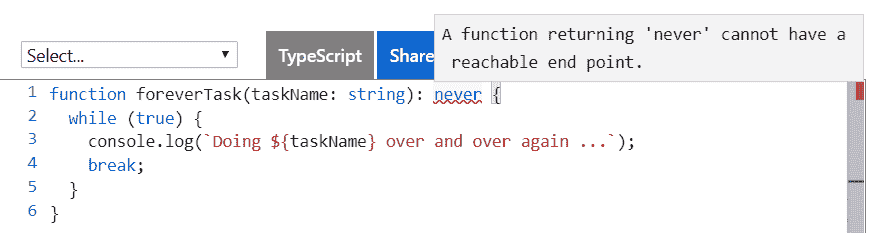

3.  Let's now remove the `break` statement and the `never` type annotation. If we hover over the `foreverTask` function name with our mouse, we see that TypeScript has inferred the type to be `void`, which is not what we want in this example:

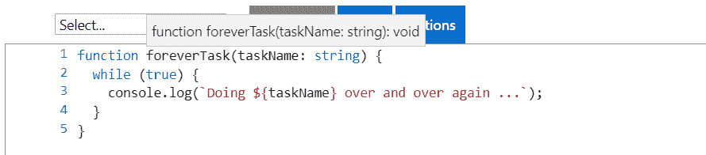

The `never` type is useful in places where the code never returns. However, we will probably need to explicitly define the `never` type annotation because the TypeScript compiler isn't smart enough yet to infer that.

# Enumerations

Enumerations allow us to declare a meaningful set of friendly names that a variable can be set to. We use the `enum` keyword, followed by the name we want to give to it, followed by the possible values in curly braces.

Here's an example:

1.  Let's declare an `enum` for order statuses in the TypeScript playground:

```

枚举 OrderStatus {

已支付，

已发货，

已完成，

取消

}

```jsx

2.  If we look at the transpiled JavaScript, we see that it looks very different:

```

var OrderStatus;

(function (OrderStatus) {

OrderStatus[OrderStatus["Paid"] = 1] = "Paid";

OrderStatus[OrderStatus["Shipped"] = 2] = "Shipped";

OrderStatus[OrderStatus["Completed"] = 3] = "Completed";

OrderStatus[OrderStatus["Cancelled"] = 4] = "Cancelled";

})(OrderStatus || (OrderStatus = {}));

```jsx

This is because enumerations don't exist in JavaScript, so the TypeScript compiler is transpiling the code into something that does exist.

3.  Let's declare a `status` variable, setting the value to the `shipped` status:

```

让状态 = OrderStatus.Shipped;

```jsx

Notice how we get nice IntelliSense when typing the value:

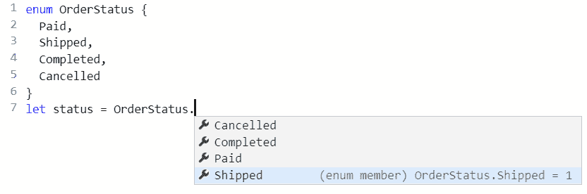

4.  By default, the numerical values start from `0` and increment. However, the starting value can be explicitly declared in the `enum`, as in the following example, where we set `Paid` to `1`:

```

枚举订单状态 {

已付款 = 1,

已发货,

完成，

取消

}

```jsx

5.  Let's set our `status` variable to the shipped status and log this to the console:

```

让状态 = OrderStatus.Shipped;

console.log(status);

```jsx

If we run the program, we should see 2 output in the console:

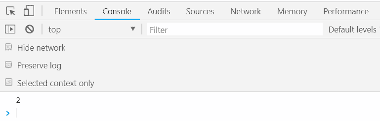

6.  In addition, all the values can be explicitly declared, as in the following example:

```

枚举订单状态 {

已付款 = 1，

已发货 = 2，

完成 = 3，

取消 = 0

}

```jsx

Enumerations are great for data such as a status that is stored as a specific set of integers but actually has some business meaning. They make our code more readable and less prone to error.

# Objects

The object type is shared with JavaScript and represents a non-primitive type. Objects can contain typed properties to hold bits of information.

Let's work through an example:

1.  Let's enter the following code into the TypeScript playground, which creates an object with several properties of information:

```

const customer = {

名称："灯具有限公司",

营业额：2000134，

活跃：true

};

```jsx

If we hover over `name`, `turnover`, and `active`, we'll see that TypeScript has smartly inferred the types to be `string`, `number`, and `boolean` respectively.

2.  If we hover over the `customer` variable name, we see something interesting:

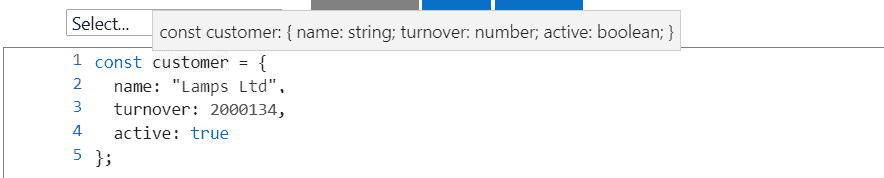

3.  Rather than the type being `object`, it is a specific type with `name`, `turnover`, and `active` properties. On the next line, let's set the `turnover` property to some other value:

```

客户营业额 = 500000;

```jsx

As we type the turnover property, IntelliSense provides the properties that are available on the object:


We used `const` to declare the `customer` variable and then was able to change one of its property values later in the program. Shouldn't this have thrown an error? Well, the customer variable reference hasn't changed — just some properties within it. So, this is fine with the TypeScript compiler.

4.  This line of code is perfectly fine, so we don't get any complaints from the compiler. If we set the `turnover` to a value that has an incorrect type, we'll be warned as we would expect:

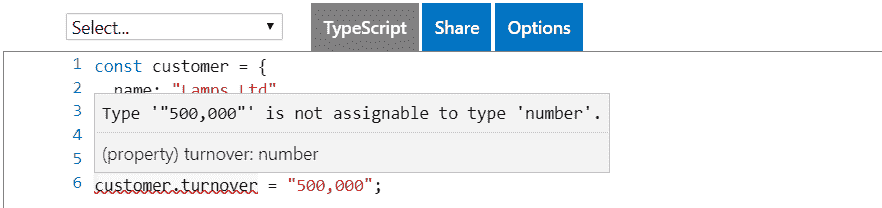

5.  Now let's set a property on `customer` that doesn't exist yet:

```

客户利润 = 10000;

```jsx

We'll see that TypeScript complains:

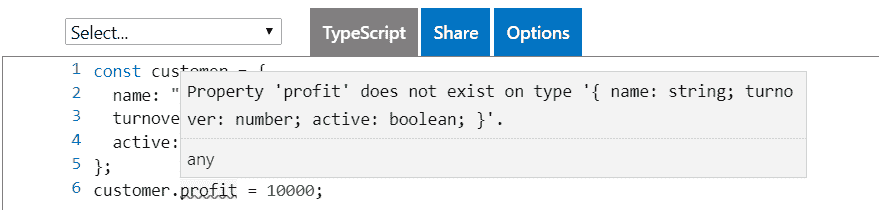

This makes sense if we think about it. We've declared `customer` with `name`, `turnover`, and `active` properties, so setting a `profit` property should cause an error. If we wanted a `profit` property, we should have declared it in the original declaration.

In summary, the `object` type is flexible because we get to define any properties we require, but TypeScript will narrow down the type to prevent us incorrectly typing a property name.

# Arrays

Arrays are structures that TypeScript inherits from JavaScript. We add type annotations to arrays as usual, but with square brackets at the end to denote that this is an array type.

Let's take a look at an example:

1.  Let's declare the following array of numbers in the TypeScript playground:

```

const numbers: number[] = [];

```jsx

Here, we have initialized the array as empty.

2.  We can add an item to the array by using the array's `push` function. Let's add the number `1` to our array:

```

numbers.push(1);

```jsx

We used `const` to declare the `numbers` variable and was able to change its array elements later in the program. The array reference hasn't changed – just the elements within it. So, this is fine with the TypeScript compiler.

3.  If we add an element with an incorrect type, the TypeScript compiler will complain, as we would expect:

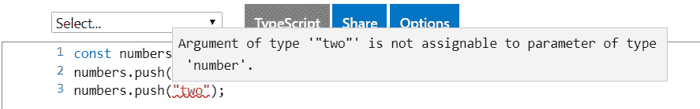

4.  We can use type inference to save a few keystrokes if we declare an array with some initial values. As an example, if we type in the following declaration and hover over the `numbers` variable, we'll see the type has been inferred as `number[]`.

```

const numbers = [1, 3, 5];

```jsx

5.  We can access an element in an array by using the element number in square brackets. Element numbers start at `0`.

Let's take an example:

1.  Let's log out the number of elements under the numbers variable declaration, as follows:

```

console.log(numbers[0]);

console.log(numbers[1]);

console.log(numbers[2]);

```jsx

2.  Let's now click the Run option on the right-hand side of the TypeScript playground to run our program. A new browser tab should open with a blank page. If we press *F12* to open the Developer tools and go to the console section, we'll see 1, 3, and 5 output to the console.

3.  There are several ways to iterate through elements in an array. One option is to use a `for` loop, as follows:

```

对于（让 i 在数字中）{

console.log(numbers[i]);

}

```jsx

If we run the program, we'll see 1, 3, and 5 output to the console again.

4.  Arrays also have a useful function for iterating through their elements, called `forEach`. We can use this function as follows:

```

numbers.forEach(function (num) {

console.log(num);

});

```jsx

5.  `forEach` calls a nested function for each array element, passing in the array element. If we hover over the `num` variable, we'll see it has been correctly inferred as a `number`. We could have put a type annotation here, but we have saved ourselves a few keystrokes:

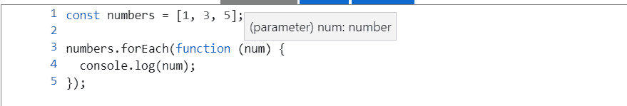

Arrays are one of the most common types we'll use to structure our data. In the preceding examples, we've only used an array with elements having a number type, but any type can be used for elements, including objects, which in turn have their own properties.

# Creating interfaces, types aliases, and classes

In the *Understanding basic types* section, we introduced ourselves to objects, which are types that can have their own properties. Interfaces, type aliases, and classes are ways that we can define an object structure before we start using it.

Following here is the `customer` object we worked with, where we declared the `customer` variable with an initial object value:

```

const customer = {

名称："灯具有限公司",

营业额：2000134，

活跃：true

};

```jsx

1.  Let's try to declare the customer variable and set its value on a subsequent line:

```

让客户：对象;

客户 = {

名称："灯具有限公司",

营业额：2000134，

活跃：true

};

```jsx

2.  So far, so good. However, let's see what happens when we try to change the customers `turnover` value:

```

客户营业额 = 2000200;

```jsx

3.  The lack of IntelliSense when we type `turnover` isn't what we are used to. When we've finished typing the line, we get a compiler error:

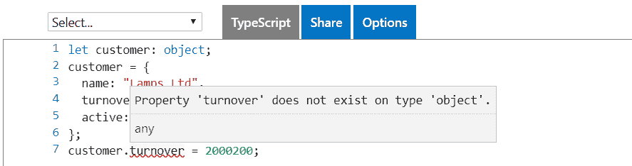

The TypeScript compiler doesn't know about the properties in the `customer` object and so thinks there's a problem.

So, we need another way of defining an object structure with the ability to set property values later in the program. That's where interfaces, type aliases, and classes come in; they let us define the structure of an object by letting us define our own types.

# Interfaces

An interface is a contract that defines a type with a collection of property and method definitions without any implementation. Interfaces don't exist in JavaScript, so they are purely used by the TypeScript compiler to enforce the contract by type checking.

We create an interface with the `interface` keyword, followed by its name, followed by the bits that make up the `interface` in curly braces:

```

产品接口 {

...

}

```jsx

# Properties

Properties are one of the elements that can be part of an interface. Properties can hold values associated with an object. So, when we define a property in an interface, we are saying that objects that implement the interface must have the property we have defined.

Let's start to play with an interface in the TypeScript playground:

1.  Enter the following interface:

```

产品接口 {

名称：字符串;

单价：数字;

}

```jsx

2.  The preceding example creates a `Product` interface with `name` and `unitPrice` properties. Let's go on to use this interface by using it as the type for a `table` variable:

```

const table: 产品 = {

名称："桌子",

单价：500

}

```jsx

3.  Let's try to set a property that doesn't exist in the interface:

```

const chair: 产品 = {

产品名称："桌子",

价格：70

}

```jsx

As expected, we get a type error:

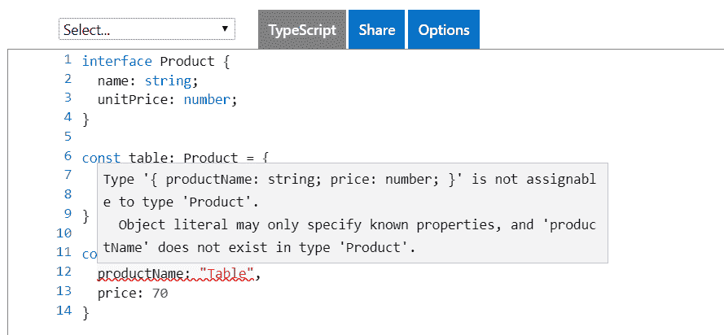

4.  Properties on an interface can reference another interface because an interface is just a type. The following example shows an `OrderDetail` interface making use of a `Product` interface:

```

产品接口 {

名称：字符串;

单价：数字;

}

订单详情接口 {

产品：产品;

数量：数字;

}

const table: 产品 = {

名称："桌子",

单价：500

}

const tableOrder: 订单详情 = {

产品：桌子，

数量：1

};

```jsx

This gives us the flexibility to create complex object structures, which is critical when writing large, complex apps.

# Method signatures

Interfaces can contain method signatures as well. These won't contain the implementation of the method; they define the contracts for when interfaces are used in an implementation.

Let's look at an example:

1.  Let's add a method to the `OrderDetail` interface we just created. Our method is called `getTotal` and it has a `discount` parameter of type `number` and returns a `number`:

```

订单详情接口 {

产品：产品;

数量：数字;

获取总数（折扣：数字）：数字;

}

```jsx

Notice that the `getTotal` method on the interface doesn't specify anything about how the total is calculated – it just specifies the method signature that should be used.

2.  Having adjusted our `OrderDetail` interface, our `tableOrder` object, which implemented this interface, will now be giving a compilation error. So, let's resolve the error by implementing `getTotal`:

```

const tableOrder: 订单详情 = {

产品：桌子，

数量：1，

获取总数（折扣：数字）：数字 {

const priceWithoutDiscount = this.product.unitPrice *

这个数量;

const discountAmount = priceWithoutDiscount * discount;

返回 priceWithoutDiscount - discountAmount;

}

};

```jsx

Notice that the implemented method has the same signature as in the `OrderDetail` interface.

The method implementation uses the `this` keyword to get access to properties on the object. If we simply referenced `product.unitPrice` and `quantity` without `this`, we would get a compilation error, because TypeScript would assume these variables are local within the method.

3.  Let's tweak the method signature to discover what we can and can't do. We'll start by changing the parameter name:

```

获取总数（折扣百分比：数字）：数字 {

const priceWithoutDiscount = this.product.unitPrice *

这个数量;

const discountAmount = priceWithoutDiscount *

折扣百分比;

返回 priceWithoutDiscount - discountAmount;

}

```jsx

4.  We'll see that we don't get a compilation error. Let's change the method name now:

```

总数（折扣百分比：数字）：数字 {

const priceWithoutDiscount = this.product.unitPrice * this.quantity;

const discountAmount = priceWithoutDiscount * discountPercentage;

返回 priceWithoutDiscount - discountAmount;

}

```jsx

5.  This does cause an error because a `total` method doesn't exist on the `OrderDetail` interface:

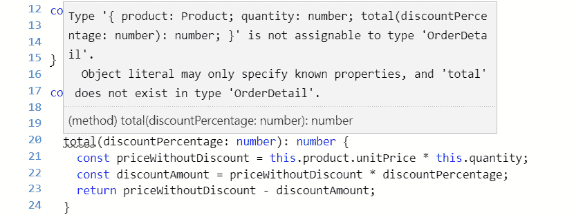

6.  We could try changing the return type:

```

const tableOrder: 订单详情 = {

产品：桌子,

数量：1，

获取总数（折扣百分比：数字）：字符串 {

const priceWithoutDiscount = this.product.unitPrice * this.quantity;

const discountAmount = priceWithoutDiscount * discountPercentage;

返回（priceWithoutDiscount - discountAmount）。toString();

}

};

```jsx

This actually doesn't produce a compilation error in the TypeScript playground, but it should do!

7.  So, let's use Visual Studio Code for this example. After we've opened Visual Studio Code in a folder of our choice, let's create a file called `interfaces.ts` and paste in the interface definitions for the `Product` and `OrderDetail` interfaces, along with the `table` variable declaration.
8.  We can then enter the preceding implementation of the `OrderDetail` interface. As expected, we get a compilation error:

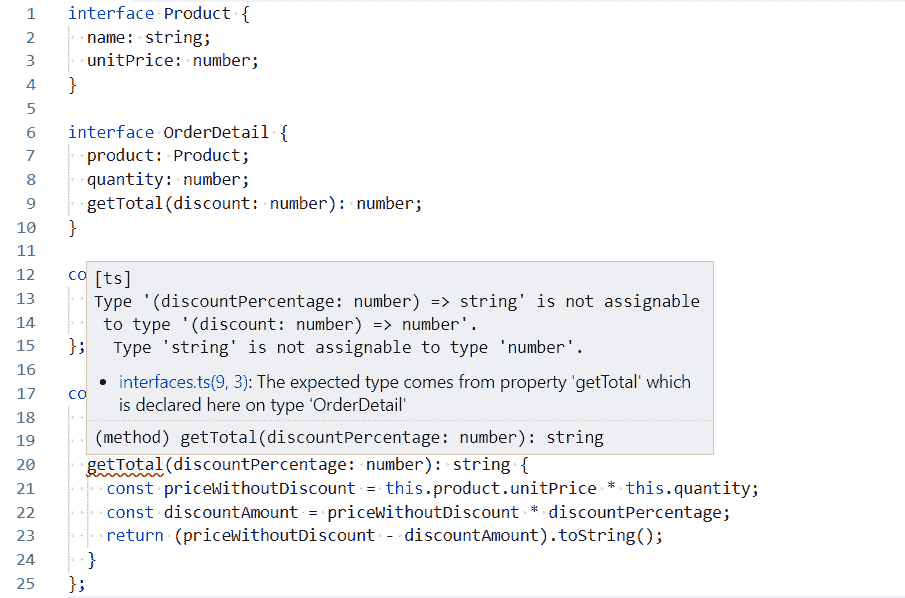

9.  Changing the parameter type also results in a compilation error:

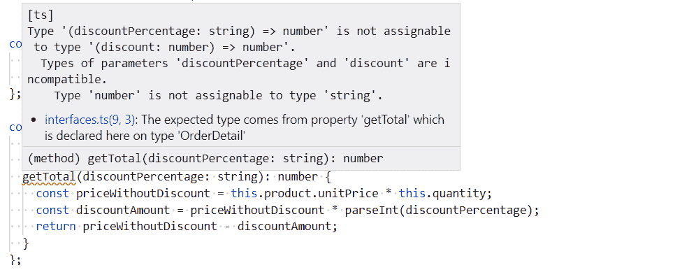

The errors provided by TypeScript are fantastic—they are very specific about where the problem is, allowing us to quickly correct our mistakes.

10.  So, when implementing a method from an interface, the parameter names aren't important, but the other parts of the signature are. In fact, we don't even need to declare the parameter names in the interface:

```

订单详情接口 {

...

获取总数（数字）：数字;

}

```jsx

However, omitting the parameter names arguably makes the interface harder to understand—how do we know exactly what the parameter is for?

# Optional properties and parameters

We might want to make a property optional because not every situation where the interface is implemented requires it. Let's take the following steps in our `OrderDetail` interface:

1.  Let's create an optional property for the date it was added. We specify an optional value by putting a `?` at the end of the property name but before the type annotation:

```

订单详情接口 {

产品：产品;

数量：数字;

dateAdded？：日期，

getTotal（折扣：数字）：数字;

}

```jsx

We'll see that our implementation of this interface, `tableOrder`, isn't broken. We can choose to add `dateAdded` to `tableOrder` but it isn't required.

2.  We might also want to make a method parameter optional. We do this in a similar way by putting a `?` after the parameter name. In our example, let's make `discount` optional in the `OrderDetail` interface:

```

接口 OrderDetail {

产品：产品;

数量：数字;

dateAdded？：日期，

getTotal（折扣？：数字）：数字;

}

```jsx

3.  We can change the method implementation signature as well:

```

getTotal（折扣？：数字）：数字{

const priceWithoutDiscount = this.product.unitPrice * this.quantity;

const discountAmount = priceWithoutDiscount *（折扣|| 0）;

返回无折扣价格 - 折扣金额;

}

```jsx

We've also dealt with the case when a discount isn't passed into the method by using `(discount || 0)` in the `discountAmount` variable assignment.

`x || y` is shorthand for *if x is* truthy *then use x, otherwise, use y*. The following values are falsy values: `false`, `0`, `""`, `null`, `undefined`, and `NaN`. All other values are truthy.

4.  With our optional parameter in place, we can call `getTotal` without passing a value for the discount parameter:

```

tableOrder.getTotal（）

```jsx

The preceding line doesn't upset the TypeScript compiler.

# Readonly properties

We can stop a property from being changed after it has initially been set by using the `readonly` keyword before the property name.

1.  Let's give this a try on our `Product` interface by making the `name` property `readonly`:

```

接口产品{

只读名称：字符串;

单价：数字;

}

```jsx

2.  Let's also make sure we have an instance of the `Product` interface in place:

```

const table：产品= {

名称："桌子"，

单价：500

};

```jsx

3.  Let's change the `name` property `table` now on the next line:

```

table.name = "更好的桌子";

```jsx

As expected, we get a compilation error:

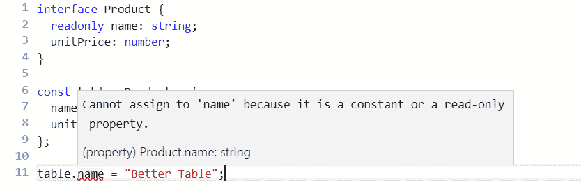

`readonly` properties are a simple way of freezing their values after being initially set. A common use case is when you want to code in a functional way and prevent unexpected mutations to a property.

# Extending interfaces

Interfaces can *extend* other interfaces so that they inherit all the properties and methods from its parent. We do this using the `extends` keyword after the new interface name and before the interface name that is being extended.

Let's look at the following example:

1.  We create a new interface, taking `Product` as a base, and add information about discount codes:

```

接口产品{

名称：字符串;

单价：数字；

}

接口折扣码 {

代码：字符串;

百分比：数字;

}

带折扣码的产品接口扩展产品 {

折扣码：DiscountCode[];

}

```jsx

2.  We can create an instance of the interface in the usual way, filling in properties from the base interface as well as the child interface:

```

const table：带折扣码的产品= {

名称："桌子"，

单价：500，

折扣码：[

{代码："SUMMER10"，百分比：0.1}，

{代码："BFRI"，百分比：0.2}

]

};

```jsx

Interfaces allow us to create complex but flexible structured types for our TypeScript program to use. They are a really important feature that we can use to create a robust, strongly-typed TypeScript program.

# Type aliases

In simple terms, a type alias creates a new name for a type. To define a type alias, we use the `type` keyword, followed by the alias name, followed by the type that we want to alias.

We'll explore this with the following example:

1.  Let's create a type alias for the `getTotal` method in the `OrderDetail` interface we have been working with. Let's try this in the TypeScript playground:

```

类型获取总数=（折扣：数字）=> 数字;

接口 OrderDetail {

产品：产品;

数量：数字;

getTotal：GetTotal;

}

```jsx

Nothing changes with objects that implement this interface – it is purely a way we can structure our code. It arguably makes the code a little more readable.

2.  Type aliases can also define the shape of an object. We could use a type alias for our `Product` and `OrderDetail` types that we previously defined with an interface:

```

类型产品= {

名称：字符串;

单价：数字;

};

类型 OrderDetail = {

产品：产品;

数量：数字;

getTotal：（折扣：数字）=> 数字;

};

```jsx

3.  We use these types in exactly the same way as we used our interface-based types:

```

const table：产品= {

名称："桌子"，

单价：500

};

const orderDetail：OrderDetail = {

产品：桌子，

数量：1，

getTotal（折扣：数字）：数字{

const priceWithoutDiscount = this.product.unitPrice * this.quantity;

const discountAmount = priceWithoutDiscount *折扣;

返回无折扣价格 - 折扣金额;

}

};

```jsx

So, type aliases seem very similar to interfaces. What is the difference between a type alias and an interface? The main difference is that type aliases can't be extended or implemented from like you can with interfaces. So, for a simple structure that doesn't require inheritance, should we use an interface or should we use a type alias? There isn't strong reasoning to prefer either approach. However, we should be consistent with whichever approach we choose to improve the readability of our code.

# Classes

Classes feature in many programming languages, including JavaScript. They let us shape objects with type annotations in a similar way to interfaces and type aliases. However, classes have many more features than interfaces and type aliases, which we'll explore in the following sections.

# Basic classes

Classes have lots of features. So, in this section we'll look at the basic features of a class. We use the `class` keyword followed by the class name, followed by the definition of the class.

Let's look at this in more depth with the following example:

1.  We could use a class to define the `Product` type we previously defined as an interface and as a type alias:

```

类产品{

名称：字符串;

单价：数字；

}

```jsx

2.  We create an instance of our `Product` class by using the `new` keyword followed by the class name and parentheses. We then go on to interact with the class, setting property values or calling methods:

```

const table = new Product();

table.name = "桌子";

table.unitPrice = 500;

```jsx

Notice that when we use this approach we don't need a type annotation for the table variable because the type can be inferred.

Classes have many more features than type aliases and interfaces though. One of these features is the ability to define the implementation of methods in a class.

Let's explore this with an example:

1.  Let's change the `OrderDetail` type we have been working within previous sections to a class. We can define the implementation of the `getTotal` method in this class:

```

类 OrderDetail {

产品：产品;

数量：数字;

getTotal（折扣：数字）：数字{

const priceWithoutDiscount = this.product.unitPrice * this.quantity;

const discountAmount = priceWithoutDiscount *折扣;

返回无折扣价格 - 折扣金额;

}

}

```jsx

2.  We can create an instance of `OrderDetail`, specifying a `product` and `quantity`, and then calling the `getTotal` method with a `discount` to get the total price:

```

const table = new Product();

table.name = "桌子";

table.unitPrice = 500;

const orderDetail = new OrderDetail();

orderDetail.product = table;

orderDetail.quantity = 2;

总数= orderDetail.getTotal（0.1）;

console.log（总数）;

```jsx

If we run this and look at the console, we should see an output of `900`.

# Implementing interfaces

We can use classes and interfaces together by defining the contract in an interface and then implementing the class as per the interface. We specify that a class is implementing a particular interface using the `implements` keyword.

As an example, we can define an interface for the order detail and then a class that implements this interface:

```

接口 IOrderDetail {

产品：产品;

数量：数字;

getTotal（折扣：数字）：数字;

}

类 OrderDetail 实现 IOrderDetail {

产品：产品;

数量：数字;

getTotal（折扣：数字）：数字{

const priceWithoutDiscount = this.product.unitPrice *

这个数量;

const discountAmount = priceWithoutDiscount * discount;

return priceWithoutDiscount - discountAmount;

}

}

```jsx

In the preceding example, we've prefixed the interface with `I` so that readers of the code can quickly see when we are referencing interfaces.

Why would we use this approach? It seems like more code than we need to write. So, what's the benefit? This approach allows us to have multiple implementations of an interface, which can be useful in certain situations.

# Constructors

Constructors are functions that perform the initialization of new instances of a class. In order to implement a constructor, we implement a function called `constructor`. It's common to set property values in the constructor to simplify consumption of the class.

Let's look at the following example:

1.  Let's create a constructor in the `OrderDetail` class that allows us to set the `product` and `quantity`:

```

class OrderDetail implements IOrderDetail {

product: Product;

quantity: number;

constructor(product: Product, quantity: number) {

this.product = product;

this.quantity = quantity;

}

getTotal(discount: number): number {

...

}

}

```jsx

2.  If we create an instance of the class, we are forced to pass in the `product` and `quantity`:

```

const orderDetail = new OrderDetail(table, 2);

```jsx

3.  This is nice because we've reduced three lines of code to one line. However, we can make our class even nicer to work with by making the default `quantity` parameter `1` if nothing is passed in:

```

constructor(product: Product, quantity: number = 1) {

this.product = product;

this.quantity = quantity;

}

```jsx

4.  We now don't have to pass in a `quantity` if it is `1`:

```

const orderDetail = new OrderDetail(table);

```jsx

5.  We can save ourselves a few keystrokes and let the TypeScript compiler implement the `product` and `quantity` properties by using the `public` keyword before the parameters in the constructor:

```

class OrderDetail implements IOrderDetail {

constructor(public product: Product, public quantity: number = 1) {

this.product = product;

this.quantity = quantity;

}

getTotal(discount: number): number {

...

}

}

```jsx

# Extending classes

Classes can extend other classes. This is the same concept as interfaces extending other interfaces, which we covered in the *Extending interfaces* section. This is a way for class properties and methods to be shared with child classes.

As with interfaces, we use the `extends` keyword followed by the class we are extending. Let's look at an example:

1.  Let's create a `ProductWithDiscountCodes` from our `Product` class:

```

class Product {

name: string;

unitPrice: number;

}

interface DiscountCode {

code: string;

percentage: number;

}

class ProductWithDiscountCodes extends Product {

discountCodes: DiscountCode[];

}

```jsx

2.  We can then consume the `ProductWithDiscountCodes` class as follows, leveraging properties from the base class as well as the child class:

```

const table = new ProductWithDiscountCodes();

table.name = "Table";

table.unitPrice = 500;

table.discountCodes = [

{ code: "SUMMER10", percentage: 0.1 },

{ code: "BFRI", percentage: 0.2 }

];

```jsx

3.  If the parent class has a constructor, then the child class will need to pass the constructor parameters using a function called `super`:

```

class Product {

constructor(public name: string, public unitPrice: number) {

}

}

interface DiscountCode {

code: string;

percentage: number;

}

class ProductWithDiscountCodes extends Product {

constructor(public name: string, public unitPrice: number) {

super(name, unitPrice);

}

discountCodes: DiscountCode[];

}

```jsx

# Abstract classes

Abstract classes are a special type of class that can only be inherited from and not instantiated. They are declared with the `abstract` keyword, as in the following example:

1.  We can define a base `Product` class as follows:

```

abstract class Product {

name: string;

unitPrice: number;

}

```jsx

2.  If we try to create an instance of this, the compiler will complain, as we would expect:

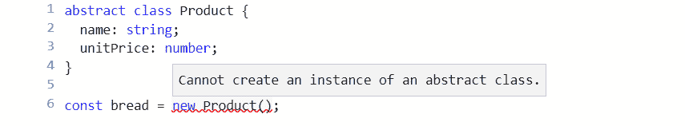

3.  We can create a more specific usable class for food products by extending `Product`:

```

class Food extends Product {

constructor(public bestBefore: Date) {

super();

}

}

```jsx

4.  Here, we are adding a `bestBefore` date in our `Food` class. We can then create an instance of `Food`, passing in the `bestBefore` date:

```

const bread = new Food(new Date(2019, 6, 1));

```jsx

Abstract classes can have `abstract` methods that child classes must implement. Abstract methods are declared with the `abstract` keyword in front of them, as in the following example:

1.  Let's add an `abstract` method to our base `Product` class:

```

abstract class Product {

name: string;

unitPrice: number;

abstract delete(): void;

}

```jsx

2.  After we add the `abstract` method, the compiler immediately complains about our `Food` class because it doesn't implement the `delete` method:

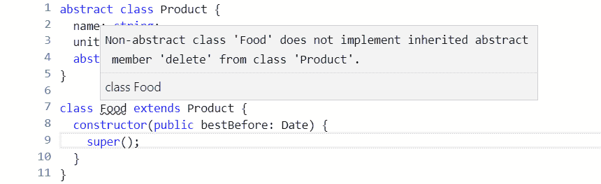

3.  So, let's fix this and implement the `delete` method:

```

class Food extends Product {

deleted: boolean;

constructor(public bestBefore: Date) {

super();

}

delete() {

this.deleted = false;

}

}

```jsx

# Access modifiers

So far, all our class properties and methods have automatically had the `public` access modifier. This means they are available to interact with class instances and child classes. We can explicitly set the `public` keyword on our class properties and methods immediately before the property or method name:

```

class OrderDetail {

public product: Product;

public quantity: number;

public getTotal(discount: number): number {

const priceWithoutDiscount = this.product.unitPrice * this.quantity;

const discountAmount = priceWithoutDiscount * discount;

return priceWithoutDiscount - discountAmount;

}

}

```jsx

As you might have guessed, there is another access modifier, called `private`**,** which allows the member to only be available to interact with inside the class and not on class instances or child classes.

Let's look at an example:

1.  Let's add a `delete` method in our `OrderDetail` class, which sets a private `deleted` property:

```

class OrderDetail {

public product: Product;

public quantity: number;

private deleted: boolean;

public delete(): void {

this.deleted = true;

}

...

}

```jsx

2.  Let's create an instance of `OrderDetail` and try to access the `deleted` property:

```

const orderDetail = new OrderDetail();

orderDetail.deleted = true;

```jsx

As expected, the compiler complains:

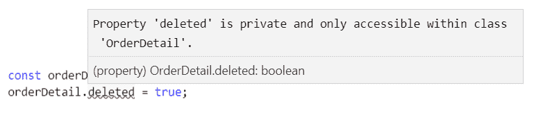

There is a third access modifier, `protected`, which allows the member to be available to interact with inside the class and on child classes, but not on class instances.

# Property setters and getters

Our classes so far have had simple property declarations. However, for more complex scenarios, we can implement a property with a `getter` and a `setter`. When implementing `getters` and `setters`, generally, you'll need a private property to hold the property value:

*   `getter` is a function with the property name and the `get` keyword at the beginning and no parameters. Generally, this will return the value of the associated private property.
*   `setter` is a function with the same name with the `set` keyword at the beginning and a single parameter for the value. This will set the value of the associated private property.
*   The `private` property is commonly named the same as the `getter` and `setter` with an underscore in front.

Let's take a look at an example:

1.  Let's create `getters` and `setters` for the `unitPrice` property in our `Product` class. The `setter` ensures the value is not less than `0`. The `getter` ensures `null` or `undefined` is never returned:

```

class Product {

name: string;

private _unitPrice: number;

get unitPrice(): number {

return this._unitPrice || 0;

}

set unitPrice(value: number) {

如果（值 < 0）{

值 = 0;

}

this._unitPrice = 值;

}

}

```jsx

2.  Let's consume the `Product` class and try this out:

```

const 表 = 新产品（）;

表.名称 = "桌子";

console.log（表.单价）;

表.单价 = -10;

console.log（表.单价）;

```jsx

If we run this, we should see two 0's in the console.

# Static

Static properties and methods are held in the class itself and not in class instances. They can be declared using the `static` keyword before the property or method name.

Let's look at the following example:

1.  Let's make the `getTotal` method static on the `OrderDetail` class we have been using:

```

类订单明细{

产品：产品；

数量：数字；

静态获取总计（折扣：数字）：数字{

const 无折扣价格 = this.product.unitPrice * this.quantity;

const 折扣金额 = 无折扣价格 * 折扣;

返回无折扣价格 - 折扣金额;

}

}

```jsx

2.  We get compilation errors where we try to reference the properties on the class. This is because the `static` method isn't in the class instance and therefore can't access these properties:

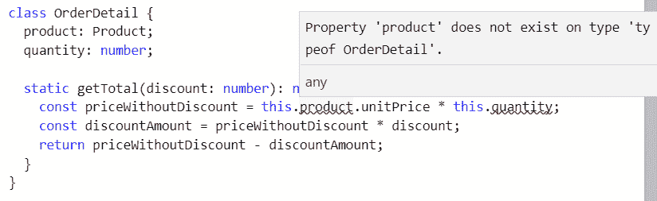

3.  To make the `static` method work, we can move its dependencies on the class instance to parameters in the function:

```

静态获取总计（单价：数字，数量：数字，折扣：数字）：数字{

const 无折扣价格 = 单价 * 数量;

const 折扣金额 = 无折扣价格 * 折扣;

返回无折扣价格 - 折扣金额;

}

```jsx

4.  We can now call the static method on the class type itself, passing in all the parameter values:

```

const 总计 = 订单明细.获取总计（500，2，0.1）;

console.log（总计）;

```jsx

If we run the preceding program, we should get an output of `900` in the console.

# Structuring code into modules

By default, TypeScript generated JavaScript code that executes in what is called the global scope. This means code from one file is automatically available in another file. This in turn means that the functions we implement can overwrite functions in other files if the names are the same, which can cause our applications to break.

Let's look at an example in Visual Studio Code:

1.  Let's create a file called `product.ts` and enter the following interface for a product:

```

接口产品{

名称：字符串；

单价：数字；

}

```jsx

2.  Let's create another file, called `orderDetail.ts`, with the following content:

```

类订单明细{

产品：产品；

数量：数字；

获取总计（折扣：数字）：数字{

const 无折扣价格 = this.product.unitPrice * this.quantity;

const 折扣金额 = 无折扣价格 * 折扣;

返回无折扣价格 - 折扣金额;

}

}

```jsx

The compiler doesn't give us any complaints. In particular, the reference to the `Product` interface in the `OrderDetail` class is able to be resolved, even though it's in a different file. This is because both `Product` and `OrderDetail` are in the global scope.

Operating in the global scope is problematic because item names can conflict across different files, and as our code base grows, this is harder to avoid. Modules resolve this issue and help us write well organized and reusable code.

# Module formats

Modules feature in JavaScript as part of ES6, which is great. However, lots of code exists in other popular module formats that came before this standardization. TypeScript allows us to write our code using ES6 modules, which can then transpile into another module format if specified.

Here is a brief description of the different module formats that TypeScript can transpile to:

*   **Asynchronous Module Definition** (**AMD**): This is commonly used in code targeted for the browser and uses a `define` function to define modules.
*   **CommonJS**: This format is used in Node.js programs. It uses `module.exports` to define modules and `require` to define dependencies.
*   **Universal Module Definition** (**UMD**): This can be used in both browser apps and Node.js programs.
*   **ES6**: This is the native JavaScript module format and uses the `export` keyword to define modules and `import` to define dependencies.

In the following sections (and, in fact, this whole book), we'll write our code using ES6 modules.

# Exporting

Exporting code from a module allows it to be used by other modules. In order to export from a module, we use the `export` keyword. We can specify that an item is exported using `export` directly before its definition. Exports can be applied to interfaces, type aliases, classes, functions, constants, and so on.

Let's start to adjust our example code from the previous section to operate in modules rather than the global scope:

1.  Firstly, let's export the `Product` interface:

```

导出接口产品{

名称：字符串；

单价：数字；

}

```jsx

2.  After we make this change, the compiler will complain about the reference to the `Product` interface in the `OrderDetail` class:

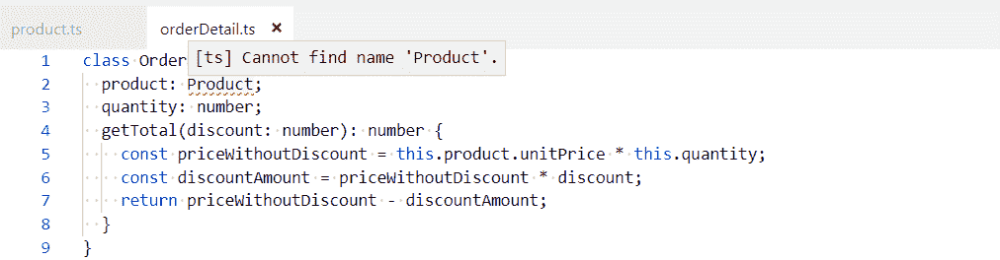

This is because `Product` is no longer in the global scope but `OrderDetail` still is. We'll resolve this in the next section, but let's look at alternative ways we can export the `Product` interface first.

3.  We can use an `export` statement beneath the item declarations. We use the `export` keyword followed by a comma-delimited list of item names to export in curly braces:

```

接口产品{

名称：字符串；

单价：数字；

}

导出{产品}

```jsx

4.  With this approach, we can also rename exported items using the `as` keyword:

```

接口产品{

名称：字符串；

单价：数字；

}

导出{产品作为库存}

```jsx

# Importing

Importing allows us to import items from an exported module. We do this using an `import` statement that includes the item names to import in curly braces and the file path to get the items from (excluding the `ts` extension). We can only import items that are exported in the other module file.

1.  Let's resolve the issue with our `OrderDetail` class by importing the `Product` interface:

```

导入{产品}从“产品”；

类订单明细{

产品：产品；

数量：数字；

获取总计（折扣：数字）：数字{

const 无折扣价格 = this.product.unitPrice * this.quantity;

const 折扣金额 = 无折扣价格 * 折扣;

返回无折扣价格 - 折扣金额;

}

}

```jsx

2.  We can rename imported items using the `as` keyword in an `import` statement. We then reference the item in our code using the new name:

```

导入{产品作为库存}从“产品”；

类订单明细{

产品：库存；

数量：数字；

获取总计（折扣：数字）：数字{

const 无折扣价格 = this.product.unitPrice * this.quantity;

const 折扣金额 = 无折扣价格 * 折扣;

返回无折扣价格 - 折扣金额;

}

}

```jsx

# Default exports

We can specify a single item that can be exported by default using the `default` keyword:

```

默认导出接口{

名称：字符串；

单价：数字；

}

```jsx

Notice that we don't need to name the interface. We can then import a default exported item using an `import` statement without the curly braces with a name of our choice:

```

导入产品从“产品”；

```jsx

# Configuring compilation

We need to compile our TypeScript code before it can be executed in a browser. We do this by running the TypeScript compiler, `tsc`, on the files we want to compile. TypeScript is very popular and is used in many different situations:

*   It is often introduced into large existing JavaScript code bases
*   It comes by default in an Angular project
*   It is often used to add strong types to a React project
*   It can even be used in Node.js projects

All these situations involve slightly different requirements for the TypeScript compiler. So, the compiler gives us lots of different options to hopefully meet the requirements of our particular situation.

1.  Let's give this a try by opening Visual Studio Code in a new folder and creating a new file, called `orderDetail.ts`, with the following content:

```

导出接口产品{

名称：字符串；

单价：数字；

}

导出类订单明细{

产品：产品；

数量：数字；

获取总计（折扣：数字）：数字{

const 无折扣价格 = this.product.unitPrice * this.quantity;

const 折扣金额 = 无折扣价格 * 折扣;

返回无折扣价格 - 折扣金额;

}

}

```jsx

2.  We can open a Terminal in Visual Studio Code by going to the View menu and choosing Terminal. Let's enter the following command in the Terminal:

```

tsc 订单明细

```jsx

3.  Hopefully, no errors should be output from the compiler and it should generate a file called `orderDetail.js`, containing the following transpiled JavaScript:

```

"use strict";

exports.__esModule = true;

var 订单明细 =（function（）{

函数订单明细（）{

}

OrderDetail.prototype.getTotal = function (discount) {

var priceWithoutDiscount = this.product.unitPrice * this.quantity;

var discountAmount = priceWithoutDiscount * discount;

return priceWithoutDiscount - discountAmount;

};

return OrderDetail;

}());

exports.OrderDetail = OrderDetail;

```jsx

We'll continue to use `orderDetail.ts` in the following sections as we explore how the compiler can be configured.

# Common options

As mentioned earlier, there are lots of configuration options for the TypeScript compiler. All the configuration options can be found at [`www.typescriptlang.org/docs/handbook/compiler-options.html`](https://www.typescriptlang.org/docs/handbook/compiler-options.html). The following sections detail some of the more common options that are used.

# --target

This determines the ECMAScript version the transpiled code will be generated in.

The default is `ES3`, which will ensure the code works in a wide range of browsers and their different versions. However, this compilation target will generate the most amount of code because the compiler will generate polyfill code for features that aren't supported in `ES3`.

The `ESNext` option is the other extreme, which compiles to the latest supported proposed ES features. This will generate the least amount of code, but will only work on browsers that have implemented the features we have used.

As an example, let's compile `orderDetail.ts` targeting `ES6` browsers. Enter the following in the terminal:

```

tsc orderDetail --target es6

```jsx

Our transpiled JavaScript will be very different from the last compilation and much closer to our source TypeScript because classes are supported in `es6`:

```

export class OrderDetail {

getTotal(discount) {

const priceWithoutDiscount = this.product.unitPrice * this.quantity;

const discountAmount = priceWithoutDiscount * discount;

return priceWithoutDiscount - discountAmount;

}

}

```jsx

# --outDir

By default, the transpiled JavaScript files are created in the same directory as the TypeScript files. `--outDir` can be used to place these files in a different directory.

Let's give this a try and output the transpiled `orderDetail.js` to a folder called `dist`. Let's enter the following in the terminal:

```

tsc orderDetail --outDir dist

```jsx

A `dist` folder will be created containing the generated `orderDetail.js` file.

# --module

This specifies the module format that the generated JavaScript should use. The default is the **CommonJS** module format if ES3 or ES5 are targeted. `ES6` and `ESNext` are common options today when creating a new project.

# --allowJS

This option tells the TypeScript compiler to process JavaScript files as well as TypeScript files. This is useful if we've written some of our code in JavaScript and used features that haven't been implemented yet in all browsers. In this situation, we can use the TypeScript compiler to transpile our JavaScript into something that will work with a wider range of browsers.

# --watch

This option makes the TypeScript compiler run indefinitely. Whenever a source file is changed, the compiling process is triggered automatically to generate the new version. This is a useful option to switch on during our developments:

1.  Let's give this a try by entering the following in a terminal:

```

tsc orderDetail --watch

```jsx

2.  The compiler should run and, when completed, give the message `Watching for file changes`. Let's change the `getTotal` method in the `OrderDetail` class to handle situations when `discount` is undefined:

```

getTotal(discount: number): number {

const priceWithoutDiscount = this.product.unitPrice * this.quantity;

const discountAmount = priceWithoutDiscount * (discount || 0);

return priceWithoutDiscount - discountAmount;

}

```jsx

3.  When we save `orderDetail.ts`, the compiler will say `File change detected. Starting incremental compilation...` and carry out the compilation.

To exit the watch mode, we can kill the terminal by clicking the bin icon in the Terminal.

# --noImplicitAny

This forces us to explicitly specify the `any` type where we want to use it. This forces us to think about our use of `any` and whether we really need it.

Let's explore this with an example:

1.  Let's add a `doSomething` method to our `OrderDetail` class that has a parameter called `input` with no type annotation:

```

export class OrderDetail {

...

doSomething(input) {

input.something();

return input.result;

}

}

```jsx

2.  Let's do a compilation with the `--noImplicitAny` flag in the Terminal:

```

tsc orderDetail --noImplicitAny

```jsx

The compiler outputs the following error message because we haven't explicitly said what type the `input` parameter is:

```

orderDetail.ts(14,15): 错误 TS7006: 参数 'input' 隐含地具有 'any' 类型。

```jsx

3.  We can fix this by adding a type annotation with `any` or, better still, something more specific:

```

doSomething(input: {something: () => void, result: string}) {

input.something();

return input.result;

}

```jsx

If we do a compilation with `--noImplicitAny` again, the compiler is happy.

# --noImplicitReturns

This ensures we return a value in all branches of a function if the return type isn't `void`.

Let's see this in action with an example:

1.  In our `OrderDetail` class, let's say we have the following implementation for our `getTotal` method:

```

getTotal(discount: number): number {

if (discount) {

const priceWithoutDiscount = this.product.unitPrice * this.quantity;

const discountAmount = priceWithoutDiscount * discount;

return priceWithoutDiscount - discountAmount;

} else {

// 我们忘记了这个分支！

}

}

```jsx

2.  We've forgotten to implement the branch of code that deals with the case where there is no discount. If we compile the code without the `--noImplicitReturns` flag, it compiles fine:

```

tsc orderDetail

```jsx

3.  However, let's see what happens if we compile the code with the `--noImplicitReturns` flag:

```

tsc orderDetail --noImplicitReturns

```jsx

We get the following error, as expected:

```

orderDetail.ts(9,31): 错误 TS7030: 不是所有的代码路径都返回一个值。

```jsx

# --sourceMap

When this is set, `*.map` files are generated during the transpilation process. This will allow us to debug the TypeScript version of the program (rather than the transpiled JavaScript). So, this is generally switched on during development.

# --moduleResolution

This tells the TypeScript compiler how to resolve modules. This can be set to `classic` or `node`. If we are using ES6 modules, this defaults to `classic`, which means the TypeScript compiler struggles to find third-party packages such as Axios. So, we can explicitly set this to `node` to tell the compiler to look for modules in `"node_modules"`.

# tsconfig.json

As we have seen, there are lots of different switches that we can apply to the compilation process, and repeatedly specifying these on the command line is a little clunky. Luckily, we can specify these options in a file called `tsconfig.json`. The compiler options we have looked at in previous sections are defined in a `compilerOptions` field without the `"--"` prefix.

Let's take a look at an example:

1.  Let's create a `tsconfig.json` file with the following content:

```

{

"compilerOptions": {

"target": "esnext",

"outDir": "dist",

"module": "es6",

"moduleResolution": "node",

"sourceMap": true,

"noImplicitReturns": true,

"noImplicitAny": true

}

}

```jsx

2.  Let's run a compile without specifying the source file and any flags:

```

tsc

```jsx

The compilation will run fine, with the transpiled JavaScript being output to the `dist` folder along with a source map file.

# Specifying files for compilation

There are several ways to tell the TypeScript compiler which files to process. The simplest method is to explicitly list the files in the `files` field:

```

{

"compilerOptions": {

...

},

"files": ["product.ts", "orderDetail.ts"]

}

```jsx

However, that approach is difficult to maintain as our code base grows. A more maintainable approach is to define file patterns for what to include and exclude with the `include` and `exclude` fields.

The following example looks at the use of these fields:

1.  Let's add the following `include` fields, which tell the compiler to compile TypeScript files found in the `src` folder and its subfolders:

```

{

"compilerOptions": {

...

},

"include": ["src/**/*"]

}

```jsx

2.  At the moment, our source files aren't in a folder called `src`, but let's run a compile anyway:

```

tsc

```jsx

3.  As expected, we get `No inputs were found in the config file...` from the compiler.

Let's create an `src` folder and move `orderDetail.ts` into this folder. If we do a compile again, it will successfully find the files and do a compilation.

So, we have lots of options for adapting the TypeScript compiler to our particular situation. Some options, such as `--noImplicitAny`, force us to write good TypeScript code. We can take the checks on our code to the next level by introducing linting into our project, which we'll look at in the next section.

# TypeScript linting

As we have seen, the compiler does lots of useful checks against our TypeScript code to help us write error-free code. We can take this a step further and lint the code to help us make our code even more readable and maintainable. TSLint is a linter that is very popular in TypeScript projects, and we will explore it in this section.

The home page for TSLint is at [`palantir.github.io/tslint/`](https://palantir.github.io/tslint/).

We'll install TSLint in the next section.

# Installing TSLint

We'll install TSLint in this section, along with a Visual Studio Code extension that will highlight linting problems right in the code:

1.  Let's install TSLint globally via `npm`, as follows:

```

npm install -g tslint

```jsx

2.  Now, we can open Visual Studio Code and go to the extensions area (*Ctrl + Shift + X*) and type `tslint` in the search box at the top-left. The extension is called TSLint and was published by egamma:

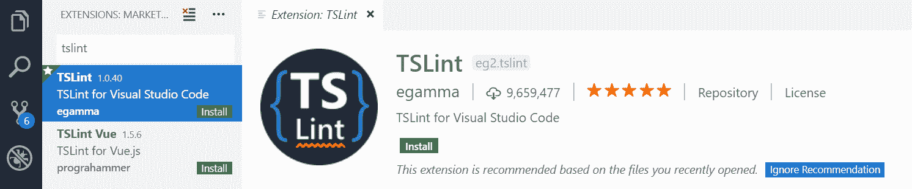

3.  We need to click the Install option to install the extension.
4.  After it has been installed, we'll need to reload Visual Studio Code for the extension to become enabled.

Now that this extension is installed, along with TSLint globally, linting errors will be highlighted right in our code, as we'll see in the following sections.

# Configuring rules

The rules that `tslint` uses when checking our code are configurable in a file called `tslint.json`. In order to explore some of the rules, we first need a TypeScript file:

1.  So, let's create a file called `orderDetail.ts` with the following content in Visual Studio Code:

```

export interface Product {

name: string;

unitPrice: number;

}

export class OrderDetail {

product: Product;

quantity: number;

getTotal(discount: number): number {

const priceWithoutDiscount = this.product.unitPrice * this.quantity;

const discountAmount = priceWithoutDiscount * discount;

返回 priceWithoutDiscount - discountAmount;

}

}

```jsx

2.  Let's now create a `tslint.json` file. We define the rules we want to implement in a `rules` field. Let's add the following rule:

```

{

"rules": {

"member-access": true

}

}

```jsx

3.  A full list of the rules can be found at: [`palantir.github.io/tslint/rules/`](https://palantir.github.io/tslint/rules/). The `member-access` rule forces us to explicitly declare the access modifier for classes. We haven't explicitly defined the property and method access modifiers in the `OrderDetail` class because they are `public` by default. So, with our linting rule in place, Visual Studio Code will highlight the lack of access modifiers to us:

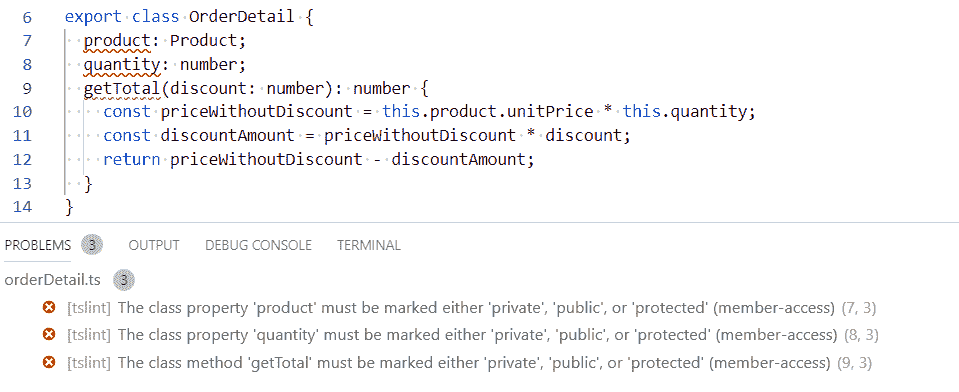

4.  As we put a `public` access modifier in front of the properties and method, the warnings go away:

```

export class OrderDetail {

public product: Product;

public quantity: number;

public getTotal(discount: number): number {

const priceWithoutDiscount = this.product.unitPrice * this.quantity;

const discountAmount = priceWithoutDiscount * discount;

return priceWithoutDiscount - discountAmount;

}

}

```jsx

The `member-access` rule forces us to write more code – how can this be a good thing? The rule is useful if you're reading the code and don't know TypeScript well enough to understand that class members without access modifiers are public. So, it's great if our team consists of developers who don't know TypeScript that well yet, but not necessarily for an experienced team of TypeScript developers.

Lots of the `tslint` rules are like `member-access` – in some teams, they will work well and in others, they don't really add value. This is why rules are configurable!

# Built-in rules

`tslint` has a handy collection of built-in rulesets that can be used. We can use these by specifying the ruleset name in the `extends` field. We can use multiple rulesets by putting all their names in the array:

1.  Let's adopt the opinionated set of rules that `tslint` ships with, called `"tslint:recommended"`. So, in our `tslint.json` file, let's remove the `rules` field and add an `extends` field, as follows:

```

{

“extends”: [“tslint:recommended”]

}

```jsx

We immediately get lint errors when `tslint.json` is saved. The error is complaining about the lack of an `I` prefix on our `Product` interface. The logic behind the rule is that, while reading code, if a type starts with an `I`, we immediately know that it is an interface.

2.  Let's pretend that this rule isn't valuable to us. We can override this rule from `"tslint:recommended"` in the `"rules"` field. The rule is called `"interface-name"`. So, let's override this to `false`:

```

{

“extends”: [“tslint:recommended”],

“rules”: {

“interface-name”: false

}

}

```jsx

When `tslint.json` is saved, the linting errors immediately go away.

# Excluding files

We can exclude files from the linting process. This is useful for excluding third-party code. We do this by specifying an array of files in an `exclude` field in the `linterOptions` field:

```

{

“extends”: [“tslint:recommended”],

“linterOptions”: {

“exclude”: [“node_modules/**/*.ts”]

}

}

```jsx

The preceding configuration excludes third-party `node` packages from the linting process.

Now that we've added TSLint to our tool belt, we are going to add another tool that will automatically format our code for us. This will help our code adhere to some of the code formattings TSLint rules.

# Code formatting

In this section, we are going to install another extension in Visual Studio Code, called Prettier, which will automatically format our code. As well as putting a stop to all the ongoing debates over styles, it will help us adhere to some of the TSLint rules:

1.  Let's open Visual Studio Code, go to the Extensions area, and type prettier in the search box. The extension is called Prettier - Code formatter and was published by Esben Petersen:

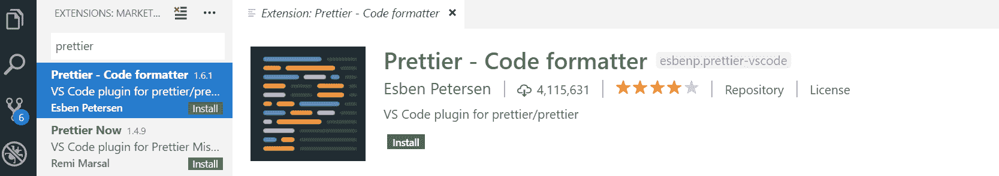

2.  We need to click the Install option to install the extension.
3.  After it has been installed, we'll need to reload Visual Studio Code for the extension to become enabled.
4.  The last step is to make sure the Format on Save option is ticked in User Settings. Press *Ctrl* +*,* (comma) to open the settings screen and type Format On Save in the search box to find the setting. If the setting isn't ticked, then tick it:

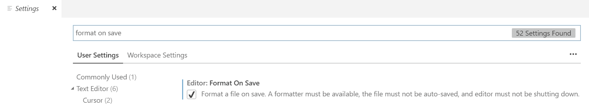

Now that this extension is installed, when we save our TypeScript code, it will automatically be formatted nicely for us.

# Summary

At the start of this chapter, there was a section on why we would use TypeScript to build a frontend. We now have first-hand experience of TypeScript catching errors early and giving us productivity features such as IntelliSense. We learned that TypeScript is just an extension of JavaScript. So, we get to use all of the features in JavaScript plus additional stuff from TypeScript. One of these additional things is type annotations, which help the compiler spot errors and light up features such as code navigation in our code editor.

We haven't covered everything about types yet, but we have enough knowledge to build fairly complex TypeScript programs now. Classes, in particular, allow us to model complex real-world objects nicely. We learned about modules and how they keep us out of that dangerous global scope. Modules allow us to structure code nicely and make it reusable. We can even use these if we need to support IE, because of that magical TypeScript compiler.

We learned a fair bit about the TypeScript compiler and how it can work well in different use cases because it is very configurable. This is going to be important for when we start to use TypeScript with React later in the book.

`TSLint` and `Prettier` were the icings on the cake. It's down to us and our team to debate and decide the TSLint rules we should go with. The benefit of both these tools is that they force consistency across our code base, which makes it more readable.

Now that we understand the basics of TypeScript, we'll dive into the new features that have been added in TypeScript 3.

# Questions

Here are some questions to test what you have learned in this first chapter. The answers can be found in the appendix.

Good luck!

1.  What are the 5 primitive types?
2.  What would the inferred type be for the `flag` variable be in the following code?

```

const flag = false;

```jsx

3.  What's the difference between an interface and a type alias?
4.  What is wrong with the following code? How could this be resolved?

```

class Product {

constructor(public name: string, public unitPrice: number) {}

}

let table = new Product();

table.name = "Table";

table.unitPrice = 700;

```

1.  如果我们希望我们的 TypeScript 程序支持 IE11，编译器的 `--target` 选项应该是什么？

1.  是否可能让 TypeScript 编译器转译 ES6 `.js` 文件？如果可以，如何做？

1.  我们如何防止 `console.log()` 语句进入我们的代码？

# 进一步阅读

[`www.typescriptlang.org`](http://www.typescriptlang.org) 在 TypeScript 上有很好的文档。值得查看这个网站的以下页面来巩固你的知识，或者将它们用作快速参考指南：

+   **基本类型**: [`www.typescriptlang.org/docs/handbook/basic-types.html`](https://www.typescriptlang.org/docs/handbook/basic-types.html)

+   **接口**: [`www.typescriptlang.org/docs/handbook/interfaces.html`](https://www.typescriptlang.org/docs/handbook/interfaces.html)

+   **类**: [`www.typescriptlang.org/docs/handbook/classes.html`](https://www.typescriptlang.org/docs/handbook/classes.html)

+   **模块**: [`www.typescriptlang.org/docs/handbook/modules.html`](https://www.typescriptlang.org/docs/handbook/modules.html)

+   **编译器选项**: [`www.typescriptlang.org/docs/handbook/compiler-options.html`](https://www.typescriptlang.org/docs/handbook/compiler-options.html)

完整的 `tslint` 规则列表可以在 [`palantir.github.io/tslint/rules/`](https://palantir.github.io/tslint/rules/) 找到。
