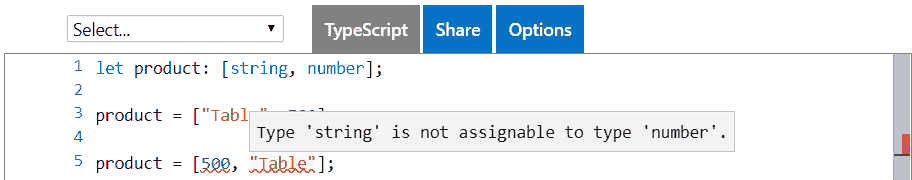
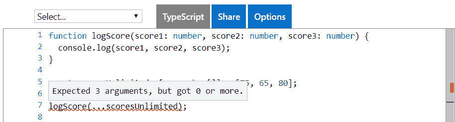
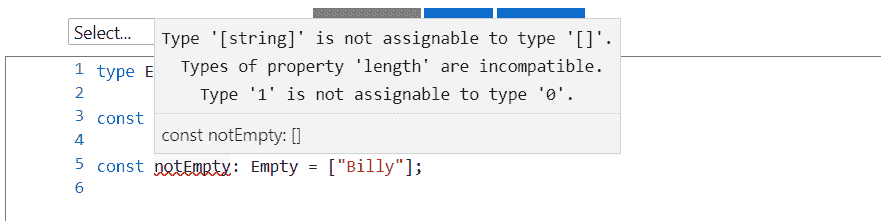
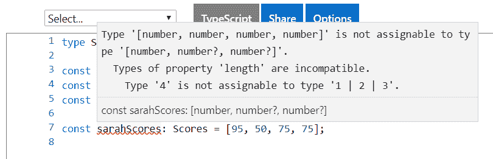
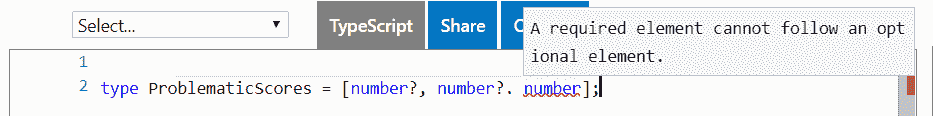
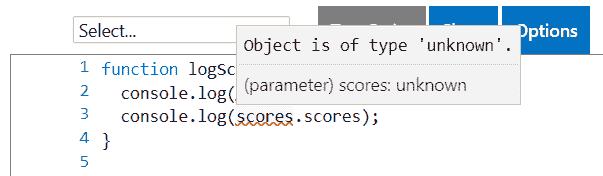
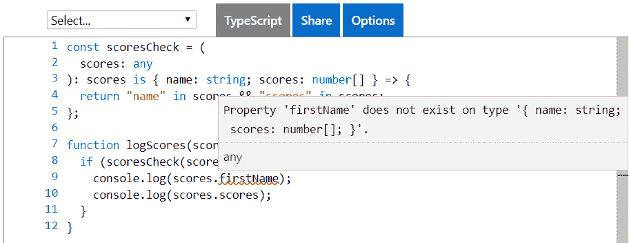
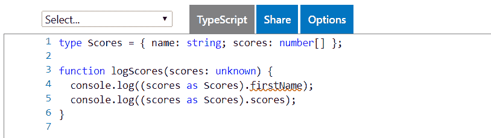
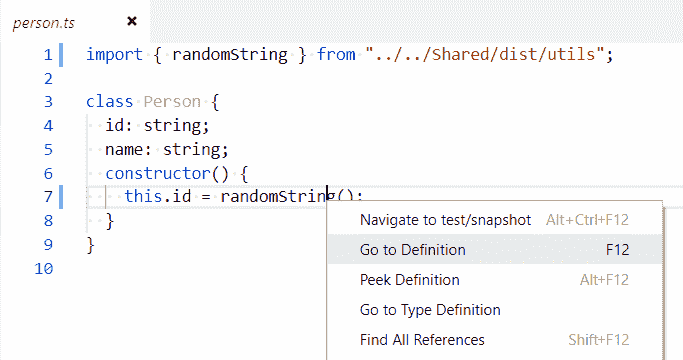
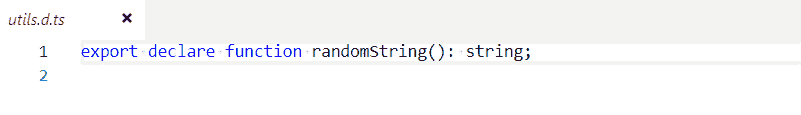

# 第二章：TypeScript 3 中的新功能

在其六年的存在中，TypeScript 一直在不断前进并成熟。TypeScript 3 对 React 开发人员来说是一个重要的发布吗？在 TypeScript 3 中我们必须添加到我们的工具包中的新功能是什么？这些问题将在本章中得到解答，首先是`tuple`类型以及它如何可以成功地与 React 社区中非常流行的**rest**和**spread** JavaScript 语法一起使用。然后，我们将介绍新的`unknown`类型以及它如何作为`any`类型的替代。此外，我们将使用 TypeScript 中的新项目引用将 TypeScript 项目分解为较小的项目。最后，我们将介绍在 TypeScript 3 中改进的强类型 React 组件中定义默认属性的方法。

在本章结束时，我们将准备好开始学习如何使用 TypeScript 3 来构建具有 React 的前端。在本章中，我们将涵盖以下主题：

+   元组

+   未知类型

+   项目引用

+   默认 JSX 属性

# 技术要求

在本章中，我们将使用与第一章中相同的技术，*TypeScript Basics*：

+   TypeScript playground：这是一个网站，位于[`www.typescriptlang.org/play/`](https://www.typescriptlang.org/play/)，允许我们在不安装它的情况下玩转和理解 TypeScript 中的功能。

+   Node.js 和`npm`：TypeScript 和 React 依赖于这些。您可以从[`nodejs.org/en/download/`](https://nodejs.org/en/download/)安装它们。如果您已经安装了这些，请确保`npm`至少是 5.2 版本。

+   TypeScript：这可以通过`npm`安装，输入以下命令在终端中：

```jsx
npm install -g typescript
```

+   在本章中使用 TypeScript 3 非常重要。您可以使用以下命令在终端中检查您的 TypeScript 版本：

```jsx
tsc -v
```

如果您需要升级到最新版本，可以运行以下命令：

```jsx
npm install -g typescript@latest
```

+   Visual Studio Code：我们需要一个编辑器来编写我们的 React 和 TypeScript 代码。这可以从[`code.visualstudio.com/`](https://code.visualstudio.com/)安装。我们还需要在 Visual Studio Code 中安装 TSLint（由 egamma 提供）和 Prettier（由 Estben Petersen 提供）扩展程序。

本章中的所有代码片段都可以在[`github.com/carlrip/LearnReact17WithTypeScript/tree/master/02-WhatsNewInTS3`](https://github.com/carlrip/LearnReact17WithTypeScript/tree/master/02-WhatsNewInTS3)找到。

# 元组

元组在 TypeScript 3 中有了一些增强，因此它们可以与流行的`rest`和`spread` JavaScript 语法一起使用。在我们进入具体的增强之前，我们将介绍元组是什么，以及`rest`和`spread`语法是什么。元组类似于数组，但元素的数量是固定的。这是一种简单的方式来结构化数据并使用一些类型安全性。

让我们来玩玩元组：

1.  在 TypeScript playground 中，让我们输入以下元组变量的示例：

```jsx
let product: [string, number];
```

我们已经将`product`变量初始化为具有两个元素的元组类型。第一个元素是一个字符串，第二个是一个数字。

1.  我们可以在下一行的`product`变量中存储产品名称和单位价格，如下所示：

```jsx
product = ["Table", 500];
```

1.  让我们尝试以另一种方式存储产品名称和单位价格：

```jsx
product = [500, "Table"];
```

毫不奇怪，我们会得到一个编译错误。如果我们悬停在`500`上，编译器会正确地抱怨它期望一个字符串。如果我们悬停在`"Table"`上，编译器会抱怨它期望一个数字：



所以，我们确实获得了类型安全性，但元组并没有告诉我们元素中应该是什么。因此，它们适用于小型结构或元素明显的结构。

1.  以下示例可以说是相当可读的：

```jsx
let flag: [string, boolean];
flag = ["Active", false]

let last3Scores: [string, number, number, number]
last3Scores = ["Billy", 60, 70, 75];

let point: [number, number, number];
point = [100, 200, 100];
```

1.  然而，以下示例不太可读：

```jsx
let customer: [string, number, number];
customer = ["Tables Ltd", 500100, 10500];
```

那最后两个数字到底代表什么？

1.  我们可以像数组一样使用元组中的元素索引来访问元组中的项目。因此，在 TypeScript playground 中让我们访问`product`变量中的产品名称和单位价格：

```jsx
let product: [string, number];
product = ["Table", 500];
console.log(product[0]);
console.log(product[1]);
```

如果我们运行程序，将会在控制台输出"Table"和 500。

1.  我们可以像使用`for`循环或数组`forEach`函数一样迭代元组中的元素：

```jsx
let product: [string, number];
product = ["Table", 500];

for (let element in product) {
 console.log(product[element]); 
}

product.forEach(function(element) {
 console.log(element); 
});
```

运行程序，将会在控制台两次输出`Table`和`500`。请注意，我们不需要为`element`变量添加类型注释，因为 TypeScript 编译器聪明地推断出了这一点。

所以，这就是元组类型，但是 TypeScript 3 中有什么新东西呢？这些增强主要是受 JavaScript 的`rest`和`spread`语法的流行驱动的，所以让我们在下一节简要介绍一下这个。

# JavaScript 的 rest 和 spread 语法

在 JavaScript 中，`rest`参数收集多个参数并将它们压缩成一个单一参数。它被称为`rest`，因为它将剩余的参数收集到一个参数中。

`rest`参数与**表述性状态转移协议**（**REST**）无关。

这种语法是在 ES6 中引入的，允许我们很好地实现具有不确定数量参数的函数。

我们使用三个点在参数名之前定义一个`rest`参数。

让我们通过一个快速示例：

1.  让我们创建一个`logScores`函数，它接受一个`scores rest`参数，只是将参数输出到控制台：

```jsx
function logScores(...scores) {
  console.log(scores);
}
```

这是纯 JavaScript - 当我们查看 TypeScript 3 中的新功能时，我们将为`rest`参数引入类型。

1.  我们可以这样调用`logScores`：

```jsx
logScores(50, 85, 75);
```

如果我们运行这个，我们将得到一个包含我们传入的三个元素的数组输出到控制台。因此，我们的`scores`参数已将所有参数收集到一个数组中。

`spread`语法与`rest`参数相反。它允许可迭代的对象，如`array`，扩展为函数参数。

让我们看一个例子：

1.  让我们重新定义我们的`logScore`函数，具有特定的参数：

```jsx
function logScore(score1, score2, score3) {
  console.log(score1, score2, score3);
}
```

请注意，这仍然是纯 JavaScript - 还没有类型！

1.  让我们定义一个`scores`数组：

```jsx
const scores = [75, 65, 80];
```

1.  最后，让我们使用`spread`语法将我们的`scores`变量传递给我们的`logScore`函数：

```jsx
logScore(...scores);
```

如果您正在使用 TypeScript playground，您将收到编译错误，`期望 3 个参数，但得到 0 个或更多`。尽管如此，程序仍然运行，因为这是完全有效的 JavaScript。如果我们运行它，`75, 65, 80`将被输出到控制台。

在接下来的章节中，我们将看到 TypeScript 3 中的新功能如何帮助我们更好地帮助编译器理解我们在使用`rest`和`spread`时要做的事情。这将允许我们解决前面示例中看到的编译错误。

# 开放式元组

在 TypeScript 3 之前，元组必须具有固定数量的元素。TypeScript 3 为`rest`元素提供了更多的灵活性。`rest`元素类似于上一节中描述的`rest`参数，但它们与元组元素类型一起工作。`rest`元素允许我们定义一个开放式元组。

时间来通过一个例子：

1.  在 TypeScript playground 中，让我们创建一个元组，第一个元素是字符串，后续元素是数字：

```jsx
type Scores = [string, ...number[]];
```

1.  我们应该能够使用这种结构来存储某人的名字和无限数量的分数。让我们为`Billy`和三个分数试一试：

```jsx
const billyScores: Scores = ["Billy", 60, 70, 75];
```

1.  让我们继续尝试`Sally`和四个分数：

```jsx
const sallyScores: Scores = ["Sally", 60, 70, 75, 70];
```

这两个变量都可以正常编译，因为我们已经将数字定义为开放式的。

# 元组函数参数

TypeScript 3 中的元组`function`参数允许我们创建强类型的`rest`参数。

举个例子：

1.  当我们第一次看到`rest`参数时，我们创建了一个纯 JavaScript 版本的`logScores`，它在`scores`变量中收集了无限数量的参数：

```jsx
function logScores(...scores) {
  console.log(scores);
}
```

1.  在 TypeScript 3 中，我们现在可以使用元组`rest`参数来使这个例子具有强类型。让我们在 TypeScript playground 中试一试：

```jsx
function logScores(...scores: [...number[]]) {
  console.log(scores);
}
```

1.  让我们用一些分数调用我们的函数：

```jsx
logScores(50, 85, 75);
```

我们不会得到编译错误，如果我们运行程序，控制台会输出包含`50, 85, 75`的数组。

我们可以创建一个增强版本的函数，它使用*开放元组*部分的`Scores`类型。

1.  `function`将接受名字以及无限数量的分数：

```jsx
type Scores = [string, ...number[]];

function logNameAndScores(...scores: Scores) {
  console.log(scores);
}
```

1.  让我们尝试用`Sally`的一些分数调用我们的函数：

```jsx
logNameAndScores("Sally", 60, 70, 75, 70);
```

如果我们运行程序，`Sally`和她的分数数组将被输出到控制台。

# 扩展表达式

TypeScript 3 允许我们使用带有扩展表达式的元组。

让我们看一个例子：

1.  让我们回到我们之前使用`spread`语法的有问题的纯 JavaScript 示例：

```jsx
function logScore(score1, score2, score3) {
  console.log(score1 + ", " + score2 + ", " + score3);
}

const scores = [75, 65, 80];

logScore(...scores);
```

TypeScript 编译器引发了错误`预期 3 个参数，但得到了 0 个或更多个`。

1.  让我们在 TypeScript 3 中使用增强元组来解决这个问题。我们将首先为`function`参数添加类型：

```jsx
function logScore(score1: number, score2: number, score3: number) {
  console.log(score1, score2, score3);
}
```

还没有什么新东西，我们仍然得到编译错误。

1.  让我们将`scores`变量改为固定元组：

```jsx
 const scores: [number, number, number] = [75, 65, 80];
```

就是这样 - 编译错误消失了！我们所需要做的就是告诉编译器`scores`中有多少项，它就可以成功地传递到**`logScore`**函数中。

因此，在 TypeScript 3 中，我们可以扩展固定元组。那么开放元组呢？让我们试试看：

```jsx
const scoresUnlimited: [...number[]] = [75, 65, 80];

logScore(...scoresUnlimited);
```

不幸的是，编译器还不够聪明，不允许我们这样做。我们得到了编译错误`预期 3 个参数，但得到了 0 个或更多个`。



# 空元组

在 TypeScript 3 中，我们现在可以定义一个空元组类型。让我们在 TypeScript playground 中玩一下这个：

1.  让我们为一个空元组创建以下类型别名：

```jsx
 type Empty = [];
```

1.  让我们声明一个这种类型的变量，并将其赋值为空数组：

```jsx
  const empty: Empty = [];
```

1.  现在，让我们尝试声明一个这种类型的变量，并将其赋值为一个非空数组：

```jsx
  const notEmpty: Empty = ["Billy"];
```

正如预期的那样，我们得到了一个编译错误：



然而，空元组类型有什么用呢？单独来看，它可能并不那么有用，但它可以作为联合类型的一部分使用，我们将在本书的后面详细介绍。现在，举个快速的例子，我们可以创建一个类型，表示最多三个分数，其中零个分数也是可以接受的：

```jsx
type Scores = [] | [number] | [number, number] | [number, number, number]

const benScores: Scores = [];
const samScores: Scores = [55];
const bobScores: Scores = [95, 75];
const jayneScores: Scores = [65, 50, 70];
const sarahScores: Scores = [95, 50, 75, 75];
```

所有分数都是有效的，除了 Sarah 的，因为`Scores`类型不允许四个分数。

# 可选元组元素

TypeScript 3 中的最终元组增强功能是具有可选元素的能力。可选元素使用元素类型的末尾加上`?`来指定。

让我们看看另一个使用我们分数主题的例子：

1.  让我们创建一个类型，表示一到三个分数：

```jsx
   type Scores = [number, number?, number?];
```

1.  因此，我们应该能够创建变量来保存一到三个分数：

```jsx
const samScores: Scores = [55];
const bobScores: Scores = [95, 75];
const jayneScores: Scores = [65, 50, 70];
```

正如预期的那样，这个编译得很好。

1.  四个元素呢？让我们试试：

```jsx
 const sarahScores: Scores = [95, 50, 75, 75];
```

正如我们所期望的那样，我们得到了一个编译错误：



1.  如果我们尝试没有元素，我们再次得到了一个编译错误：

```jsx
  const benScores: Scores = [];
```

在元组中定义可选元素时，它们被限制在元组的末尾。让我们尝试在可选元素之后定义一个必需元素：

```jsx
 type ProblematicScores = [number?, number?, number];
```

正如预期的那样，我们得到了一个编译错误：



可选元素在函数`rest`参数中也起作用。让我们试试这个：

1.  让我们在我们之前的部分中使用的`scores`类型在我们的`logScores`函数中使用：

```jsx
type Scores = [number, number?, number?];

function logScores(...scores: Scores) {
  console.log(scores);
}
```

1.  如果我们尝试传递两个分数，代码将编译得很好，因为最后一个参数是可选的：

```jsx
logScores(45, 80);
```

1.  正如预期的那样，如果我们传递了四个分数，我们会收到`Expected 1-3 arguments, but got 4`：

```jsx
logScores(45, 70, 80, 65);
```

当我们有可选参数时，很可能我们的函数实现需要知道哪些参数已经传递。我们可以使用元组的`length`属性来做到这一点：

1.  让我们创建一个增强版本的分数记录器，称为`logScoresEnhanced`，如果我们记录了所有`3`个分数，它会感谢我们：

```jsx
type Scores = [number, number?, number?];

function logScoresEnhanced(...scores: Scores) {
  if (scores.length === 3) {
    console.log(scores, "Thank you for logging all 3 scores");
  } else {
    console.log(scores);
  }
}
```

1.  现在，让我们用不同的参数调用这个函数：

```jsx
logScoresEnhanced(60, 70, 75); 
logScoresEnhanced(45, 80); 
logScoresEnhanced(95); 
```

如果我们运行程序，只有在第一次调用时传递了所有三个分数时才会得到感谢。

在 TypeScript 3 中对元组的所有增强允许我们以强类型的方式使用`rest`和`spread`语法。在本书的后面，当我们使用 React 组件时，我们将利用这个特性。

# 未知类型

`unknown`是在 TypeScript 3 中添加的新类型。在 TypeScript 3 之前，当我们不确定第三方库中对象的所有属性和方法时，可能会使用`any`类型。然而，当我们用`any`类型声明变量时，TypeScript 编译器不会对其进行任何类型检查。在这些情况下，可以使用`unknown`类型使我们的代码更加类型安全。这是因为`unknown`类型是经过类型检查的。因此，`unknown`通常可以作为`any`的替代。

在 TypeScript playground 中，让我们通过一个使用`any`的函数和一个使用`unknown`的改进版本的例子来进行演示：

1.  首先，让我们创建一个以`any`类型参数的`logScores`函数。它会将参数的`name`和`scores`属性记录到控制台中：

```jsx
function logScores(scores: any) {
  console.log(scores.firstName); 
  console.log(scores.scores); 
}
```

1.  让我们使用以下函数调用：

```jsx
logScores({
  name: "Billy",
  scores: [60, 70, 75]
});
```

如果我们运行程序，控制台中会先显示`undefined`，然后是`[60, 70, 75]`。我们传入了一个正确的对象参数，但是我们的函数将`firstName`而不是`name`记录到了控制台中。程序编译得很好，并且在运行时没有产生错误，但是没有得到我们想要的结果。这都是因为我们告诉编译器不要使用`any`类型进行任何类型检查。

1.  让我们开始创建一个更好的版本，使用`unknown`类型：

```jsx
function logScoresBetter(scores: unknown) {
  console.log(scores.firstName);
  console.log(scores.scores);
}
```

我们立即在引用`scores`中的属性时得到编译器警告：



因此，编译器现在正在检查我们的`scores`变量，这很好，甚至在`firstName`属性上警告我们。然而，`scores`属性也会产生一个复杂的错误，但是是有效的。那么，我们如何告诉编译器呢？我们需要在我们的代码中明确进行一些类型检查。我们将在接下来的几节中介绍几种方法。

# 使用类型断言进行类型检查

我们可以在函数中使用另一个具有类型断言返回类型的函数来执行类型检查。让我们探索一下，并最终创建一个新版本的`logScores`函数：

1.  首先，我们将定义一个名为`scoresCheck`的新函数来进行必要的类型检查：

```jsx
const scoresCheck = (
  scores: any
): scores is { name: string; scores: number[] } => {
  return "name" in scores && "scores" in scores;
};
```

这个函数接受一个带有类型谓词的`scores`参数，`scores is { name: string; scores: number[] }`，确保它包含正确类型的`name`和`scores`属性。该函数只是返回`scores`参数是否包含`name`和`scores`属性。

1.  让我们在我们的`logScores`函数中使用这个函数：

```jsx
function logScores(scores: unknown) {
  if (scoresCheck(scores)) {
    console.log(scores.firstName);
    console.log(scores.scores);
  }
}
```

我们立即得到了我们想要的编译错误：



类型断言，`scores is { name: string, scores: number[] }`，允许 TypeScript 编译器在`if`块中缩小类型，以便将属性记录到控制台。这导致`scores.scores`编译正常，但`scores.firstName`出现错误，这正是我们想要的。

类型谓词是关键部分。没有它，TypeScript 编译器仍然会在有效的`scores.scores`引用上抛出错误。尝试删除类型谓词，自己看看。

请注意，我们可以使用类型别名使谓词更易读：

```jsx
type Scores = { name: string; scores: number[] }

const scoresCheck = (
  scores: any
): scores is Scores => {
  return "name" in scores && "scores" in scores;
};
```

以这种方式使用类型谓词称为类型保护。我们将在本书后面介绍其他实现类型保护的方法。

# 使用类型断言进行类型缩小

在使用`unknown`时进行类型检查的另一种方法是使用类型断言。类型断言让我们使用`as`关键字告诉编译器类型是什么。

让我们创建另一个版本的`logScores`函数作为示例：

1.  首先，让我们为我们想要函数参数的结构创建一个类型别名：

```jsx
type Scores = { 
  name: string; 
  scores: number[] 
};
```

1.  在我们的`logScores`函数中，我们现在可以使用`as`关键字告诉编译器期望的类型：

```jsx
function logScores(scores: unknown) {
  console.log((scores as Scores).firstName);
  console.log((scores as Scores).scores);
}
```

这足以让编译器准确定位问题：



`unknown`类型允许我们减少对`any`类型的使用，并创建更强类型和健壮的 TypeScript 程序。但是，当引用`unknown`类型时，我们需要编写更多的代码。我们需要编写额外的代码来检查`unknown`变量的类型，以便 TypeScript 编译器可以确保我们正在访问其中的有效成员。

# 项目引用

TypeScript 3 允许 TypeScript 项目依赖于其他 TypeScript 项目，通过允许`tsconfig.json`引用其他`tsconfig.json`文件。

这样可以更容易地将我们的代码拆分成较小的项目。我们的前端代码可能是 TypeScript，除了我们的后端也是 TypeScript。有了 TypeScript 3，我们可以有一个前端 TypeScript 项目，一个后端 TypeScript 项目，以及一个共享的 TypeScript 项目，其中包含在前端和后端都使用的代码。将我们的代码拆分成较小的项目也可以让我们构建更快，因为它们可以逐步工作。

# 设置示例

为了探索这一点，我们将通过一个在 Visual Studio Code 中引用另一个项目的 TypeScript 项目的示例来进行工作：

1.  首先，让我们创建一个名为`Shared`的新文件夹。这将是一个用于共享代码的项目，可能会在许多其他项目中使用。

1.  在我们的`Shared`文件夹中，让我们创建以下`tsconfig.json`作为起点：

```jsx
{
  "compilerOptions": {
    "target": "es5",
    "outDir": "dist",
    "module": "es6",
    "sourceMap": true,
    "noImplicitReturns": true,
    "noImplicitAny": true,
    "rootDir": "src"
  },
  "include": ["src/**/*"]
}
```

1.  让我们创建一个包含名为`utils.ts`的 TypeScript 文件的`src`文件夹，并包含以下函数`randomString`：

```jsx
export function randomString() {
  return Math.floor((1 + Math.random()) * 0x10000).toString(16);
}
```

这是一个创建随机字符的函数，正如其名称所示。我们将在另一个项目中使用这个函数。

1.  现在让我们开始创建我们的第二个项目，所以回到我们解决方案的根目录，创建一个名为`ProjectA`的文件夹。

1.  在`ProjectA`中，让我们创建以下`tsconfig.json`作为起点：

```jsx
{
  "compilerOptions": {
    "target": "es5",
    "outDir": "dist",
    "module": "es6",
    "sourceMap": true,
    "noImplicitReturns": true,
    "noImplicitAny": true
  },
  "include": ["src/**/*"]
}
```

1.  让我们还在`ProjectA`中创建一个名为`person.ts`的 TypeScript 文件的`src`文件夹，并包含以下代码：

```jsx
import { randomString } from "../../Shared/dist/utils";

class Person {
  id: string;
  name: string;
  constructor() {
    this.id = randomString();
  }
}
```

该代码定义了一个关于人的简单信息类。人的唯一标识符在构造函数中使用来自我们`Shared`项目的`randomString`函数设置为随机字符串。

1.  让我们打开终端，转到我们的`Shared`文件夹，并编译我们的`Shared`项目：

```jsx
cd Shared
tsc
```

`Shared`项目编译得很好。

1.  现在让我们尝试编译`ProjectA`：

```jsx
cd ..
cd ProjectA
tsc
```

我们得到了一个编译错误：

```jsx
error TS7016: Could not find a declaration file for module '../../Shared/dist/utils'. '.../Shared/dist/utils.js' implicitly has an 'any' type.
```

因此，我们创建了两个依赖项目，但它们还不彼此理解，这就是我们出错的原因。我们将在接下来的部分中解决这个问题，使用 TypeScript 3 的新功能来处理多个项目。

# 引用项目

设置 TypeScript 3 的多项目功能的第一步是使用`tsconfig.json`中的新字段`references`引用项目。这个字段是一个指定要引用的项目的对象数组。

在我们的工作示例中，让`ProjectA`开始理解`Shared`项目：

1.  让我们更改`ProjectA`中的`tsconfig.json`以引用`Shared`项目：

```jsx
{
  "compilerOptions": {
    ...
  },
  "references": [
 { "path": "../shared" }
 ]
}
```

如果我们希望依赖项目生成的 JavaScript 代码包含在当前项目的同一文件中，我们可以在依赖项上将`prepend`设置为`true`。

```jsx
"references": [
  { "path": "../shared", "prepend": true }
]
```

不过，在我们的示例中，我们不会使用`prepend`。

1.  如果我们再次编译`ProjectA`，会出现不同的错误：

```jsx
error TS6306: Referenced project '.../shared' must have setting "composite": true
```

错误提示了问题出在哪里。我们将在下一节中通过缺少的`composite`设置来解决这个问题。

# 编译器选项的添加

仅仅引用另一个项目对于 TypeScript 编译器来说并不足以正确处理多个项目。我们需要在依赖项目中添加一些额外的编译器选项。

`compilerOptions`字段有一个新字段叫做`composite`，如果我们使用多个项目，必须将其设置为`true`。这样可以确保启用某些选项，以便可以对依赖于它的任何项目进行引用和增量构建。

当`composite`为`true`时，`declaration`也必须设置为`true`，强制生成相应的`.d.ts`文件，其中包含项目的类型。这使得 TypeScript 只在类型更改时构建依赖项目，而不是一直重新构建所有依赖项目。

让我们对我们的工作示例进行以下更改：

1.  让我们打开`Shared`项目中的`tsconfig.json`并进行以下更改：

```jsx
{
  "compilerOptions": {
    "composite": true,
 "declaration": true,
    ...
  },
}
```

1.  在终端中，让我们进入`Shared`项目目录并编译我们的`Shared`项目：

```jsx
cd ..
cd Shared
tsc
```

项目编译正常。现在让我们尝试在终端中再次编译`ProjectA`：

```jsx
cd ..
cd ProjectA
tsc
```

这次，`ProjectA`编译得很好。

因此，我们成功地使用了 TypeScript 3 的多项目功能将两个项目联系在一起。在下一节中，我们将进一步改进我们项目的设置。

# 跨项目 Go to Definition

为了使 Visual Studio Code 中的 Go to Definition 功能跨项目工作，我们需要在`tsconfig.json`中设置`declarationMap`设置。

让我们继续进行我们的多项目示例：

1.  让我们在`ProjectA`中打开`person.ts`，右键单击`randomString`引用，然后选择 Go to Definition：



我们被带到了声明文件而不是源文件：



1.  我们可以通过在`Shared`项目的`tsconfig.json`中设置`declarationMap`来解决这个问题：

```jsx
{
  "compilerOptions": {
    "composite": true,
    "declaration": true,
    "declarationMap": true,
    ...
  },
}
```

如果我们编译`Shared`项目并再次尝试“转到定义”功能，我们会被带到源文件，这正是我们想要的。

因此，通过在依赖项目中将`declarationMap`设置为`true`，以及`composite`和`declaration`，我们可以获得对多个 TypeScript 项目的出色支持。

# 构建模式

TypeScript 3 编译器包括使用`--build`标志执行智能增量构建的能力。让我们在我们的示例多项目解决方案中试一试：

1.  首先，让我们进入解决方案的根目录，打开终端，然后输入以下内容：

```jsx
tsc --build ProjectA --verbose
```

`--verbose`标志告诉编译器告诉我们它正在做什么的细节。消息确认它已经选择了`Shared`项目以及`ProjectA`：

```jsx
Projects in this build: 
  * Shared/tsconfig.json
  * ProjectA/tsconfig.json
```

然后编译器会检查每个项目是否是最新的。如果项目是最新的，我们会得到以下内容：

```jsx
Project 'Shared/tsconfig.json' is up to date because newest input 'Shared/src/utils.ts' is older than oldest output 'Shared/dist/utils.js'
```

1.  让我们在`Shared`项目的`utils.ts`文件中进行更改，添加一个空格，然后删除它，然后保存文件。

1.  让我们再次构建`ProjectA`：

```jsx
tsc --build ProjectA --verbose
```

正如预期的那样，我们会收到一条消息，指示`Shared`项目已过时，并将被重新构建：

```jsx
Project 'Shared/tsconfig.json' is out of date because oldest
output 'Shared/dist/utils.js' is older than newest input 'Shared/src/utils.ts

Building project '.../Shared/tsconfig.json'
```

1.  如果我们想要强制重新构建，即使项目是最新的，我们可以使用`--force`标志。让我们试一试：

```jsx
tsc --build ProjectA --force --verbose
```

当我们这样做时，编译器仍然会检查项目是否是最新的（并告诉我们），然后继续构建每个项目。

因此，除了出色的多项目支持外，我们还可以使用`--build`标志加快解决方案的构建速度。随着时间的推移，随着解决方案的增长，这变得越来越有价值。如果我们想要强制重新构建一个项目，我们可以使用`--force`标志以及`--build`。

# 默认的 JSX 属性

TypeScript 3 还改进了我们如何使用`--strictNullChecks`在 React 组件上设置默认属性。在 TypeScript 3 之前，我们必须将具有默认值的属性设置为可选的，并在引用它们时执行`null`检查。在本书中我们还没有介绍 React，所以在这一点上我们只会简要提及。

让我们通过一个示例来感受一下改进：

1.  以下是一个在 TypeScript 2.9 中具有一些默认属性的 React 组件。该组件名为`SplitText`，它接受一些文本，将其拆分，并在列表中呈现已拆分的部分：

```jsx
interface IProps {
  text: string;
  delimiter?: string;
}

class SplitText extends Component<IProps> {
  static defaultProps = {
    delimiter: ","
  };
  render() {
    const bits = this.props.text.split(this.props.delimiter!); 
    return (
      <ul>
        {bits.map((bit: string) => (
          <li key={bit}>{bit}</li>
        ))}
      </ul>
    );
  }
}

const App = () => (
  <div>
    <SplitText text="Fred,Jane,Bob" />
  </div>
);

export default App;
```

该组件有一个`delimiter`属性，默认值为`,`。在 TypeScript 2.9 中，我们需要将`delimiter`设为可选属性，否则如果在调用组件中没有指定它，就会得到编译器错误（即使有默认值）。

还要注意，在`bits`变量声明中引用`delimiter`后面需要加上`!`。这是告诉编译器这绝对不会是未定义的。

1.  这是调用`SplitText`的组件：

```jsx
const App = () => (
  <div>
    <SplitText text="Fred,Jane,Bob" />
  </div>
);
```

渲染时的效果如下：


1.  现在，让我们来看一下 TypeScript 3 中的组件：

```jsx
interface IProps {
  text: string;
  delimiter: string;
}

class SplitText extends React.Component<IProps> {
  static defaultProps = {
    delimiter: ","
  };
  render() {
    const bits = this.props.text.split(this.props.delimiter);
    return (
      <ul>
        {bits.map((bit: string) => (
          <li key={bit}>{bit}</li>
        ))}
      </ul>
    );
  }
}
```

请注意，我们不需要将`delimiter`属性设为可选。还要注意，我们不需要告诉编译器`this.props.delimiter`不会是未定义的。

总之，在 TypeScript 3 中，我们不必费力使默认属性在代码中正常工作！

这是我们第一次接触 React。如果此时代码示例并不太有意义，不要担心。我们将在第三章中开始学习有关 React 组件的知识，*使用 React 和 TypeScript 入门*。

# 总结

在构建 React 应用程序时，使用`rest`和`spread`语法非常常见。我们已经看到，TypeScript 3 通过元组的增强，允许我们以强类型的方式使用`rest`和`spread`。

我们还看到了如何使用`unknown`类型来减少对`any`类型的使用。`unknown`类型需要我们编写更多的代码，但也允许我们创建一个更强类型、更易维护的代码库。

TypeScript 一直让处理大型代码库变得更容易。引入项目引用后，我们现在可以更轻松地将解决方案分割成更小的项目。这种方法使得大型解决方案更易维护和灵活，并且使用新的`--build`标志可以获得更快的构建时间。

我们简要介绍了在 React 组件中使用`defaultprops`的改进。在接下来的章节中，我们将经常使用这个功能来学习如何构建强类型的 React 组件。

现在，我们开始逐渐熟悉 TypeScript，下一章中我们将开始学习 React。我们将首先学习如何创建 React 和 TypeScript 项目，然后再学习如何创建 React 和 TypeScript 组件。

# 问题

为了巩固我们对 TypeScript 3 的学习，试着回答以下问题：

1.  我们有以下绘制点的函数：

```jsx
function drawPoint(x: number, y: number, z: number) {
  ...
}
```

我们还有以下`point`变量：

```jsx
const point: [number, number, number] = [100, 200, 300];
```

我们如何以简洁的方式调用`drawPoint`函数？

1.  我们需要创建`drawPoint`函数的另一个版本，可以通过传递*x*、*y*和*z*点值作为参数来调用它：

```jsx
drawPoint(1, 2, 3);
```

在`drawPoint`的实现内部，我们从元组类型`[number, number, number]`中绘制点。我们如何定义具有所需元组的方法参数？

1.  在你的`drawPoint`实现中，你如何使点中的`z`是可选的？

1.  我们有一个名为`getData`的函数，它调用 web API 来获取一些数据。不同的 API 资源数量仍在增长，所以我们选择使用`any`作为返回类型：

```jsx
function getData(resource: string): any {
  const data = ... // call the web API
  if (resource === "person") {
    data.fullName = `${data.firstName} ${data.surname}`;
  }
  return data;
}
```

我们如何通过利用`unknown`类型使`getData`更加类型安全？

1.  我们可以使用哪个`build`标志来确定哪些项目已过时并需要重新构建而无需重新构建？

# 进一步阅读

以下链接是关于 TypeScript 3.0 更多信息的好资源：

+   值得一读的是微软博客发布的 TypeScript 3.0 版本的文章：[`blogs.msdn.microsoft.com/typescript/2018/07/30/announcing-typescript-3-0/`](https://blogs.msdn.microsoft.com/typescript/2018/07/30/announcing-typescript-3-0/)

+   TypeScript 文档中有关项目引用的信息很全面，值得一看：[`www.typescriptlang.org/docs/handbook/project-references.html`](https://www.typescriptlang.org/docs/handbook/project-references.html)
