# 第三章：开始学习 React 和 TypeScript

React 是一个帮助我们构建应用程序前端的 JavaScript 库。它允许我们使用强大且可重用的组件来构建应用程序的结构。它帮助我们以结构化的方式管理组件使用的数据和它们的状态。它使用一种叫做虚拟 DOM 的东西来高效地渲染我们的前端。

TypeScript 可以与 React 完美配合，使我们能够为我们的 React 组件添加静态类型。这些类型帮助我们的代码编辑器在编写 React 组件时发现问题，并为我们提供安全重构的工具。

在本章中，我们将介绍创建 React 和 TypeScript 项目的两种不同方式。我们将创建我们的第一个 React 组件，这将是一个确认对话框。我们将首先涵盖 JSX 和强类型 props。我们将讨论如何处理对话框的按钮点击事件。

然后，我们将学习声明和与强类型状态交互，这将用于隐藏和显示对话框。我们将讨论组件的生命周期方法，并涉及在 React 17 中已删除的方法。

最后，我们将学习函数组件以及它们的使用场景。

在本章中，我们将涵盖以下主题：

+   创建 React 和 TypeScript 项目

+   创建类组件

+   处理类组件事件

+   类组件状态

+   类组件的生命周期方法

+   创建函数组件

# 技术要求

本章中我们使用以下技术：

+   **Node.js 和** `npm`：TypeScript 和 React 依赖于这些。可以从以下链接安装它们：[`nodejs.org/en/download/`](https://nodejs.org/en/download)。如果您已经安装了这些，请确保`npm`至少是 5.2 版本。

+   **Visual Studio Code**：我们需要一个编辑器来编写我们的 React 和 TypeScript 代码，可以从[`code.visualstudio.com/`](https://code.visualstudio.com/)安装。我们还需要由 egamma 开发的 TSLint 扩展和由 Estben Petersen 开发的 Prettier 扩展。

+   **Babel Repl**：我们将简要使用这个在线工具来探索 JSX。它可以在[`babeljs.io/repl`](https://babeljs.io/repl)找到。

本章中的所有代码片段都可以在以下网址找到：[`github.com/carlrip/LearnReact17WithTypeScript/tree/master/03-GettingStartedWithReactAndTypeScript`](https://github.com/carlrip/LearnReact17WithTypeScript/tree/master/03-GettingStartedWithReactAndTypeScript)。

# 创建 React 和 TypeScript 项目

有几种方法可以创建一个 React 和 TypeScript 项目。我们将首先使用一个名为`create-react-app`的流行工具快速创建一个项目。

然后，我们将以更加手动的方式创建一个项目，帮助我们理解所有不同的部分。

# 使用 create-react-app

`create-react-app`是一个命令行工具，我们可以使用它快速创建一个带有许多有用部分的 React 和 TypeScript 应用程序。

在您选择的空文件夹中打开 Visual Studio Code。让我们使用这个工具创建一个应用程序：

1.  我们使用`create-react-app` `npm`包来创建一个 React 和 TypeScript 项目，输入以下命令：

```jsx
npx create-react-app my-react-ts-app --typescript
```

`npx`工具会临时安装`create-react-app` `npm`包，并使用它来创建我们的项目。

我们选择将项目命名为`my-react-ts-app`。我们还指定了`--typescript`，这是告诉工具使用 TypeScript 设置项目的部分。

工具将花费一分钟左右的时间来创建您的项目。

请注意，我们使用的 React 版本至少需要是`16.7.0-alpha.0`版本。我们可以在`package.json`文件中检查这一点。如果`package.json`中的 React 版本小于`16.7.0-alpha.0`，那么我们可以使用以下命令安装此版本：

```jsx
npm install react@16.7.0-alpha.0
npm install react-dom@16.7.0-alpha.0
```

1.  项目创建完成后，将 TSLint 作为开发依赖项添加到项目中，并添加一些与 React 和 Prettier 兼容的规则：

```jsx
cd my-react-ts-app
npm install tslint tslint-react tslint-config-prettier --save-dev
```

1.  现在添加一个包含一些规则的`tslint.json`文件：

```jsx
{
  "extends": ["tslint:recommended", "tslint-react", "tslint-
   config-prettier"],
  "rules": {
    "ordered-imports": false,
    "object-literal-sort-keys": false,
    "no-debugger": false,
    "no-console": false,
  },
  "linterOptions": {
    "exclude": [
      "config/**/*.js",
      "node_modules/**/*.ts",
      "coverage/lcov-report/*.js"
    ]
  }
}
```

在这里，我们将一般推荐的规则与 React 和 Prettier 的特定规则合并在一起。我们已经启用了`debugger`和`console`语句的使用，这在开发应用程序时会偶尔派上用场。

我们还抑制了关于`import`语句和对象字面量键排序的规则，以使我们从本书中复制代码的生活更轻松。

1.  现在我们可以通过输入以下命令来启动开发服务器中的应用程序：

```jsx
npm start
```

几秒钟后，一个浏览器窗口打开，我们的应用程序正在运行：

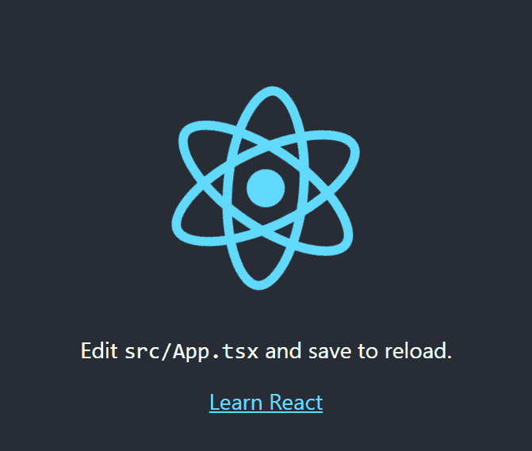

我们的 React 代码在`src`文件夹中。

1.  在我们的应用程序仍在运行时，打开`App.tsx`文件。您将立即看到`render`方法上的一个 linting 错误，因为我们没有指定修饰符：

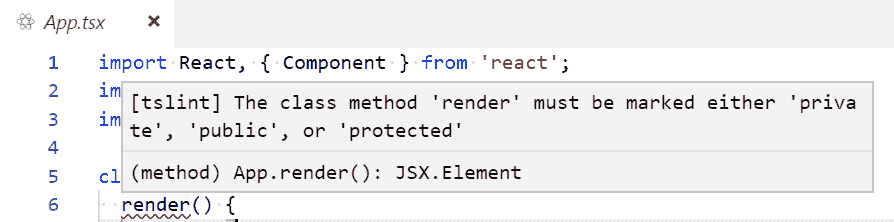

因此，让我们通过添加`public`作为修饰符来修复这个问题：

```jsx
class App extends Component {
  public render() {
    return ( ... );
  }
}
```

1.  当我们仍然在`App.tsx`中时，让我们将锚点标签更改为以下内容：

```jsx
<a className="App-link" href="https://reactjs.org" target="_blank" rel="noopener noreferrer">
 Learn React and TypeScript
</a>
```

1.  保存文件，然后返回浏览器中的应用程序。应用程序已自动更改，显示新内容。不错！

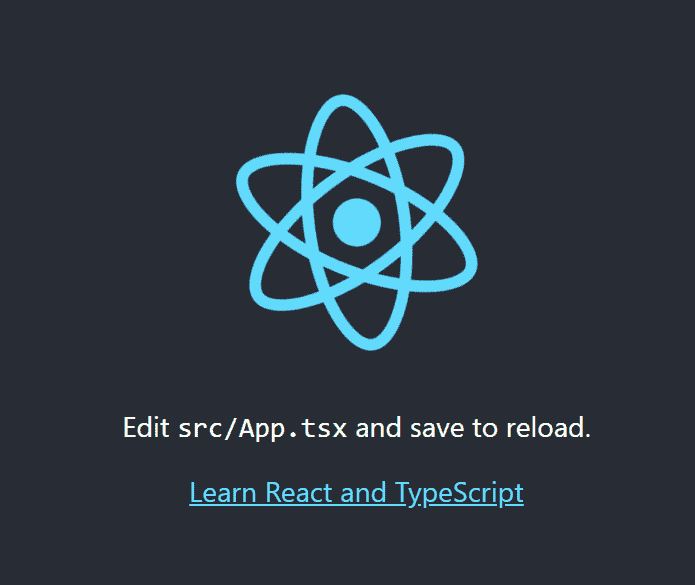

`create-react-app`已经为我们的项目配置了很多很棒的东西。如果我们只是想快速开始学习 React，并跳过 React 和 TypeScript 代码如何打包以便从 web 服务器提供的部分，这很棒。

在下一节中，我们将手动执行一些`create-react-app`自动为我们执行的操作。这将开始让我们了解当 React 和 TypeScript 应用程序打包时需要发生什么。

# 手动创建项目

在本节中，我们将逐步手动创建一个 React 和 TypeScript 项目。我们将从创建我们的文件夹结构开始。

# 创建我们的文件夹结构

我们需要一个文件夹结构，可以在项目的配置文件、源代码和要分发到我们的 web 服务器的文件之间提供良好的分离。

我们所有的配置文件都将放在我们项目的根目录中：

1.  在您选择的空文件夹中打开 Visual Studio Code，并创建一个名为`src`的文件夹。这将保存我们的源代码。

1.  让我们还创建一个名为`dist`的文件夹。这将保存要分发到我们的 web 服务器的文件。

# 创建 package.json

`package.json`文件定义了我们的项目名称、描述、构建命令、依赖的`npm`模块等等。

打开一个终端窗口，并运行以下命令：

```jsx
npm init
```

这将提示您输入有关项目的各种信息，然后创建一个包含该信息的`package.json`文件。

# 添加 TypeScript

我们在第一章中全局安装了 TypeScript，*TypeScript 基础*。在本节中，我们将在我们的项目中本地安装它。在本地拥有 TypeScript 可以简化构建过程。

我们可以通过在终端中运行以下命令来在我们的项目中安装 TypeScript：

```jsx
npm install typescript --save-dev
```

`--save-dev`命令将 TypeScript 依赖标记为仅用于开发目的。

# 创建 tsconfig.json

如第一章中所述，*TypeScript 基础*，`tsconfig.json`指定了我们的 TypeScript 代码如何编译和转译。

让我们在项目的根目录中创建一个名为`tsconfig.json`的新文件，并输入以下内容：

```jsx
{ 
  "compilerOptions": { 
    "target": "es5", 
    "module": "es6", 
    "moduleResolution": "node", 
    "lib": ["es6", "dom"],
    "sourceMap": true, 
    "jsx": "react", 
    "strict": true, 
    "noImplicitReturns": true,
    "rootDir": "src",
    "outDir": "dist",
  },
  "include": ["**/*.ts", "**/*.tsx"],
  "exclude": ["node_modules"]
}
```

# 添加 TSLint

在[第一章](https://cdp.packtpub.com/learn_react_17_with_typescript_3/wp-admin/post.php?post=24&action=edit#post_24)，*TypeScript Linting*中，我们介绍了 TSLint。按照以下步骤将其添加到您的项目中：

1.  通过在终端中输入以下命令来安装 TSLint：

```jsx
 npm install tslint --save-dev
```

1.  在我们的项目的根目录下添加一个基本的`tslint.json`文件，并输入以下内容：

```jsx
{
  "extends": ["tslint:recommended", "tslint-react", "tslint-config-prettier"],
  "linterOptions": {
    "exclude": ["node_modules/**/*.ts"]
  }
}
```

# 添加带有类型的 React

让我们通过在终端中运行以下命令来将 React 库添加到我们的项目中：

```jsx
npm install react react-dom
```

我们还希望为 React 添加 TypeScript 类型。因此，将这些作为开发依赖项添加到我们的项目中，如下所示：

```jsx
npm install @types/react @types/react-dom --save-dev
```

# 创建一个根网页

我们需要一个 HTML 页面来托管我们的 React 应用程序。在我们的`dist`文件夹中创建一个名为`index.html`的文件，并输入以下内容：

```jsx
<!DOCTYPE html>
<html>
<head>
  <meta charset="utf-8"/>
</head>
<body>
  <div id="root"></div>
  <script src="bundle.js"></script>
</body>
</html>
```

来自我们的 React 应用程序的 HTML 将被注入到具有`id ="root"`的`div`中。所有应用程序的 JavaScript 代码最终将捆绑在一起，形成一个名为`bundle.js`的文件，位于`dist`文件夹中。

当然，目前这两者都不存在-我们将在以后的部分中进行这样做。

# 创建一个简单的 React 组件

让我们创建一个非常简单的 React 组件。在您的`src`文件夹中创建一个名为`index.tsx`的文件，并输入以下内容：

```jsx
import * as React from "react";

const App: React.SFC = () => {
  return <h1>My React App!</h1>;
};
```

我们的组件简单地在`h1`标签中返回`My React App!`。

`tsx`扩展名将 TypeScript React 组件与普通 JavaScript React 组件区分开来，后者具有`jsx`扩展名。`React.SFC`是我们可以用于没有任何内部状态的 React 组件的 TypeScript 类型。我们将在本书的后面学到更多关于这些组件的知识，并且我们将在本章的后面看到状态。

下一步是将我们的 React 组件注入到`index.html`中。我们可以通过使用`ReactDOM.render`函数来实现。`ReactDOM.render`将我们的组件作为第一个参数，要注入的 HTML 元素作为下一个元素。

让我们将突出显示的行添加到`index.tsx`中：

```jsx
import * as React from "react";
import * as ReactDOM from "react-dom";

const App: React.SFC = () => {
  return <h1>My React App!</h1>;
};

ReactDOM.render(<App />, document.getElementById("root") as HTMLElement);
```

现在我们已经有了一个小型的应用程序，我们需要打包它。我们将在下一节中介绍这个。

# 添加 webpack

Webpack 是一个流行的工具，我们可以使用它将所有 JavaScript 代码捆绑成`bundle.js`文件，这是我们的`index.html`所期望的。

1.  通过在终端中输入以下命令，将 webpack 及其命令行界面安装到我们的项目中作为开发依赖项：

```jsx
npm install webpack webpack-cli --save-dev
```

1.  Webpack 还有一个方便的 Web 服务器，我们可以在开发过程中使用。因此，让我们也通过终端安装它：

```jsx
npm install webpack webpack-dev-server --save-dev
```

1.  在我们开始配置 webpack 之前，还有一个最后的任务要完成。这就是安装一个名为`ts-loader`的 webpack 插件，它将帮助加载我们的 TypeScript 代码。按照以下方式安装：

```jsx
npm install ts-loader --save-dev
```

1.  现在我们在项目中有了所有这些 webpack 的东西，是时候配置它了。在项目根目录中创建一个名为`webpack.config.js`的文件，并输入以下内容：

```jsx
const path = require("path");

module.exports = {
  entry: "./src/index.tsx",
  module: {
    rules: [
      {
        test: /\.tsx?$/,
        use: "ts-loader",
        exclude: /node_modules/
      }
    ]
  },
  resolve: {
    extensions: [".tsx", ".ts", ".js"]
  },
  output: {
    path: path.resolve(__dirname, "dist"),
    filename: "bundle.js"
  },
  devServer: {
    contentBase: path.join(__dirname, "dist"),
    compress: true,
    port: 9000
  }
};
```

这里有很多事情要做，让我们来分解一下：

+   `module.exports`是我们的 webpack 配置对象。

+   `entry`字段告诉 webpack 从哪里开始查找要捆绑的模块。在我们的项目中，这是`index.tsx`。

+   `module`字段告诉 webpack 如何处理不同的模块。我们的项目告诉 webpack 使用`ts-loader`来处理带有`ts`和`tsx`扩展名的文件。

+   `resolve`字段告诉 webpack 如何解析模块。在我们的项目中，我们需要处理`tsx`和`.ts`文件，以及标准的`.js`文件。

+   `output`字段告诉 webpack 在哪里捆绑我们的代码。在我们的项目中，这是`dist`文件夹中名为`bundle.js`的文件。

+   `devServer`字段配置 webpack 开发服务器。我们告诉它 web 服务器的根目录是`dist`文件夹，并在`9000 端口`上提供文件。

# 项目文件夹和文件

现在我们应该有以下文件夹，并且其中有以下文件：

```jsx
├─ dist/
  ├─ bundle.js
  ├─ index.html
├─ node_modules/
├─ src/
  ├─ index.tsx 
├─ package.json
├─ tsconfig.json
├─ tslint.json
├─ webpack.config.js
```

现在我们几乎可以运行我们的应用程序了，只剩下一件事要做，我们将在下一节讨论。

# 创建启动和构建脚本

我们将利用`npm`脚本来启动我们的应用程序以开发模式运行，并构建我们应用程序的生产版本：

1.  让我们打开`package.json` - 现在里面应该有相当多的内容。我们需要找到`scripts`部分，其中可能只有一个名为`test`的脚本。添加`start`和`build`的突出显示脚本：

```jsx
{
  ...
  "scripts": {
    "test": "echo \"Error: no test specified\" && exit 1"
    "start": "webpack-dev-server --env development",
 "build": "webpack --env production"
  },
  ..
}
```

1.  运行以下命令，生成我们应用程序的生产版本：

```jsx
npm run build
```

现在，webpack 将开始并执行其操作。如果我们查看`dist`文件夹，最终会出现一个名为`bundle.js`的文件。此文件包含所有 JavaScript 压缩代码，包括来自 React 库和我们简单的 React 组件的代码。

1.  现在，输入以下命令：

```jsx
npm start
```

webpack 开发服务器将启动。

1.  如果我们浏览到`http://localhost:9000/`，我们会看到我们的 Web 应用程序：

！[](assets/31fcd5ee-d43e-4ac6-9043-883e5e2fc4ad.png)

1.  在我们的应用程序仍在运行时，在`index.tsx`中，让我们将我们的`App`组件更改为以下内容：

```jsx
const App: React.SFC = () => {
  return <h1>My React and TypeScript App!</h1>;
};
```

1.  如果我们保存`index.tsx`并转到浏览器，我们会看到我们的应用程序会自动更新新内容：

！[](assets/d6eaae2c-cbff-47d2-8df0-d95baab0d1f9.png)

我们将保留我们手动配置的项目。它不像`create-react-app`项目那样功能强大，但我们已经开始了解 React 和 TypeScript 项目是如何打包的。

# 创建一个类组件

到目前为止，我们已经创建了一些非常简单的组件。在本节中，我们将构建一个稍微复杂一些的组件，并开始更熟悉组件的一些不同部分。

一起，我们将开始构建一个名为`Confirm`的组件，该组件将允许用户继续进行操作或停止。

当我们完成时，我们的组件将看起来像以下截图：

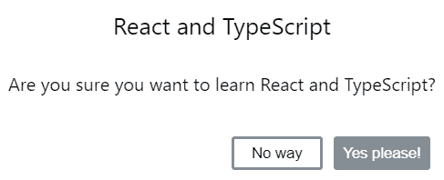

我们将使用`create-react-app`快速启动一个项目，如下所示：

1.  在您选择的文件夹中打开 Visual Studio Code，并在终端中输入以下内容：

```jsx
npx create-react-app my-components --typescript
```

这次我们选择将项目命名为`my-components`。

1.  让我们将 TSLint 与一些规则作为开发依赖项添加到我们的项目中：

```jsx
cd my-components
npm install tslint tslint-react tslint-config-prettier --save-dev
```

1.  现在添加一个包含以下规则的`tslint.json`文件：

```jsx
{
  "extends": ["tslint:recommended", "tslint-react", "tslint-config-prettier"],
  "rules": {
    "ordered-imports": false,
    "object-literal-sort-keys": false,
    "no-debugger": false,
    "no-console": false,
  },
  "linterOptions": {
    "exclude": [
      "config/**/*.js",
      "node_modules/**/*.ts",
      "coverage/lcov-report/*.js"
    ]
  }
}
```

1.  通过在`App.tsx`中为`render`方法添加缺少的访问修饰符来修复 linting 错误：

```jsx
class App extends Component {
  public render() {
    return ( ... );
  }
}
```

1.  现在我们可以启动开发服务器并启动我们的应用程序：

```jsx
npm start
```

1.  接下来，我们将缩小并修复应用程序标题，以便为我们的确认组件留出足够的空间。更改`app.css`中的突出显示的行：

```jsx
.App-logo {
  animation: App-logo-spin infinite 20s linear;
  height: 80px;
}

.App-header {
  background-color: #282c34;
  height: 200px;
  display: flex;
  flex-direction: column;
  align-items: center;
  justify-content: center;
  font-size: 16px;
  color: white;
} 
```

应用程序标题现在应该会短一点。

在接下来的几节中，我们将继续开发我们的组件，同时保持应用程序运行。

# 创建一个基本的类组件

让我们看一下为我们创建的`App.tsx`。这是一个类组件的示例。现在我们将创建我们自己的类组件。按照以下步骤进行：

1.  在`src`文件夹中创建一个名为`Confirm.tsx`的文件，并输入以下内容：

```jsx
import * as React from "react";

class Confirm extends React.Component {

}

export default Confirm;
```

我们在第一章中学习了有关类的所有内容，*TypeScript Basics**.* 在这里，我们正在创建一个扩展自 React 标准`Component`类的类。请注意，我们已经在文件顶部导入了 React，并且我们还在文件底部使用默认导出导出了我们的类组件。

1.  现在让我们开始实现我们的`Confirm`类组件，通过创建一个`render`方法：

```jsx
class Confirm extends React.Component {
  public render() {
 return (
 );
 }
}
```

`render`方法确定组件需要显示什么。我们使用 JSX 定义需要显示的内容。简单来说，JSX 是 HTML 和 JavaScript 的混合。我们将在下一节中更详细地探讨它。

1.  暂时，让我们在我们的`render`方法中输入以下内容：

```jsx
public render() {
  return (
    <div className="confirm-wrapper confirm-visible">
 <div className="confirm-container">
 <div className="confirm-title-container">
 <span>This is where our title should go</span>
 </div>
 <div className="confirm-content-container">
 <p>This is where our content should go</p>
 </div>
 <div className="confirm-buttons-container">
 <button className="confirm-cancel">Cancel</button>
 <button className="confirm-ok">Okay</button>
 </div>
 </div>
 </div>
  );
}
```

目前，我们的`render`方法看起来更像 HTML 而不是 JavaScript，除了那个有趣的`className`属性——那不应该是`class`吗？

我们将在下一节中更详细地介绍这一点和 JSX，但在此之前，让我们在`App`组件中使用我们的`Confirm`组件。

1.  在`App.tsx`中，我们需要导入我们的`Confirm`组件类，如下所示：

```jsx
import Confirm from "./Confirm";
```

1.  我们的`Confirm`组件可以在 JSX 中被引用为`<Confirm />`。因此，让我们将其添加到`App.tsx`中的 JSX 中：

```jsx
<div className="App">
  <header className="App-header">
    ...
  </header>
  <Confirm />
</div>
```

如果我们查看我们应用程序运行的浏览器页面，现在应该看起来像下面这样：

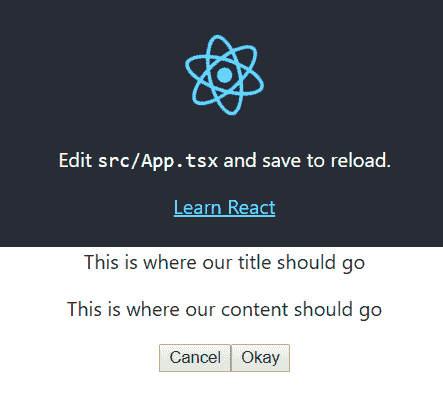

1.  我们将使用 CSS 使我们的组件看起来更像一个对话框。让我们创建一个名为`Confirm.css`的文件，并将以下内容输入其中：

```jsx
.confirm-wrapper {
  position: fixed;
  left: 0;
  top: 0;
  width: 100%;
  height: 100%;
  background-color: gray;
  opacity: 0;
  visibility: hidden;
  transform: scale(1.1);
  transition: visibility 0s linear 0.25s, opacity 0.25s 0s, transform 0.25s;
  z-index: 1;
}
.confirm-visible {
  opacity: 1;
  visibility: visible;
  transform: scale(1);
  transition: visibility 0s linear 0s, opacity 0.25s 0s, transform 0.25s;
}
.confirm-container {
  background-color: #fff;
  position: absolute;
  top: 50%;
  left: 50%;
  transform: translate(-50%, -50%);
  border-radius: 0.2em;
  min-width: 300px;
}
.confirm-title-container {
  font-size: 1.3em;
  padding: 10px;
  border-top-left-radius: 0.2em;
  border-top-right-radius: 0.2em;
}
.confirm-content-container {
  padding: 0px 10px 15px 10px;
}
.confirm-buttons-container {
  padding: 5px 15px 10px 15px;
  text-align: right;
}
.confirm-buttons-container button {
  margin-left: 10px;
  min-width: 80px;
  line-height: 20px;
  border-style: solid;
  border-radius: 0.2em;
  padding: 3px 6px;
  cursor: pointer;
}
.confirm-cancel {
  background-color: #fff;
  border-color: #848e97;
}
.confirm-cancel:hover {
  border-color: #6c757d;
}
.confirm-ok {
  background-color: #848e97;
  border-color: #848e97;
  color: #fff;
}
.confirm-ok:hover {
  background-color: #6c757d;
  border-color: #6c757d;
}
```

1.  现在让我们在`Confirm.tsx`中导入我们的 CSS：

```jsx
import  "./Confirm.css";
```

我们浏览器页面中的组件现在应该看起来像下面这样：

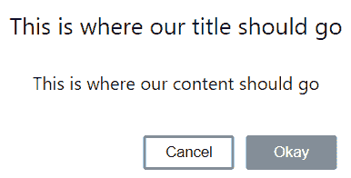

因此，React 类组件有一个称为`render`的特殊方法，在其中我们定义了组件在 JSX 中显示的内容。

在下一节中，我们将暂时离开我们的确认组件，同时学习更多关于 JSX 的知识。

# JSX

如前一节所述，JSX 看起来有点像 HTML。我们可以在我们的 JavaScript（或 TypeScript）代码中使用 JSX，就像我们在上一节的`render`函数中所做的那样。不过，JSX 并不是有效的 JavaScript——我们需要一个预处理步骤将其转换为 JavaScript。

我们将使用在线的 Babel REPL 来玩转 JSX：

1.  打开浏览器，转到[`babeljs.io/repl`](https://babeljs.io/repl)，并在左侧窗格中输入以下 JSX：

```jsx
<span>This is where our title should go</span>
```

右侧窗格中显示的是我们的 JSX 编译后的内容：

```jsx
React.createElement(
  "span",
  null,
  "This is where our title should go"
);
```

我们可以看到它编译为对`React.createElement`的调用，它有三个参数：

+   元素类型，可以是 HTML 标签名称字符串（例如`"span"`），React 组件类型或 React 片段类型

+   包含要应用于元素的 props 的对象

+   元素的子元素

1.  让我们通过在我们的`span`周围放置`div`标签来扩展我们的示例：

```jsx
<div className="confirm-title-container">
  <span>This is where our title should go</span>
</div>
```

现在，它编译为两个对`React.createElement`的调用，其中`span`作为子元素传递给`div`：

```jsx
React.createElement(
  "div",
  { className: "confirm-title-container" },
  React.createElement(
    "span",
    null,
    "This is where our title should go"
  )
);
```

1.  现在开始有点意义了，但到目前为止，我们的 JSX 只包含 HTML。现在让我们通过声明一个 props 对象文字来添加一些 JavaScript。我们还可以使用大括号在`span`中引用`title`属性：

```jsx
const props = {
 title: "React and TypeScript"
};
<div className="confirm-title-container">
  <span>{props.title}</span>
</div>
```

现在更有趣了。它编译成了这样：

```jsx
var props = {
 title: "React and TypeScript"
};
React.createElement(
 "div",
 { className: "confirm-title-container" },
 React.createElement(
 "span",
 null,
 props.title
 )
);
```

关键点是我们可以通过使用大括号将 JavaScript 注入 HTML 中。

1.  为了进一步说明这一点，让我们清空`props`对象文字，并在`span`中使用 JavaScript 三元表达式：

```jsx
const props = {};
<div className="confirm-title-container">
  <span>{props.title ? props.title : "React and TypeScript"}</span>
</div>
```

我们看到嵌套调用`React.createElement`使用我们的三元表达式作为`span`的子元素：

```jsx
React.createElement(
  "span",
  null,
  props.title ? props.title : "React and TypeScript"
)
```

那么，为什么我们使用`className`属性而不是`class`？嗯，我们现在明白了 JSX 编译成 JavaScript，而`class`是 JavaScript 中的关键字，在 JSX 中有一个`class`属性会产生冲突。因此，React 使用`className`来代替 CSS 类引用。

现在我们对 JSX 有了更多的了解，让我们回到我们的`Confirm`组件。

# 组件 props

目前，我们的`Confirm`组件的标题和内容文本是硬编码的。让我们将这些更改为引用组件接受的属性（props）。

1.  首先，我们需要为我们的 props 定义一个 TypeScript 类型。我们将在`Confirm.tsx`中的`Confirm`类之前使用接口：

```jsx
interface IProps {
  title: string;
  content: string;
}
```

1.  然后，在类定义中引用`React.Component`之后，我们可以在尖括号中引用`IProps`类型：

```jsx
class Confirm extends React.Component<IProps>
```

`React.Component`是所谓的通用类。通用类允许在类内使用的类型被传递进来。在我们的情况下，我们已经传入了我们的`IProps`接口。如果这一点目前还不太明白，不要担心，我们将在本书的后面介绍通用类。

1.  我们可以使用`this.props.propName`在我们的类中访问 props。在我们的 JSX 中，我们现在可以引用 props 而不是硬编码标题和内容：

```jsx
...
<div className="confirm-title-container">
  <span>{this.props.title}</span>
</div>
<div className="confirm-content-container">
  <p>{this.props.content}</p>
</div>
...
```

请注意，当我们在`App.tsx`中引用我们的`Confirm`组件时，现在会有一个 TypeScript 编译错误。这是因为我们的组件现在期望`title`和`content`属性，如下所示：

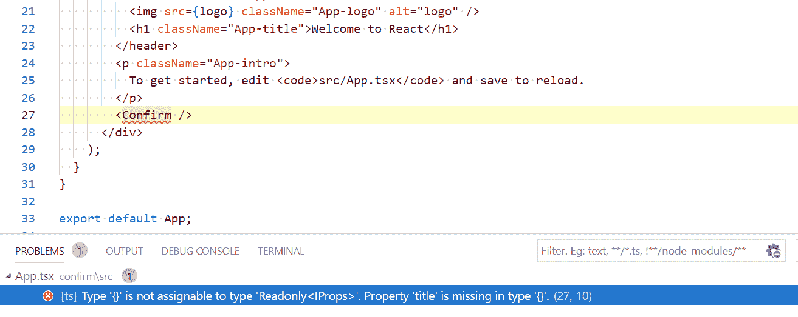

1.  让我们添加`title`和`content`属性：

```jsx
<Confirm 
 title="React and TypeScript" 
  content="Are you sure you want to learn React and TypeScript?" 
/>
```

编译错误现在消失了，如果我们查看浏览器，我们的组件呈现方式与我们实现 props 之前完全相同。

# 可选的 props

接口 props 可以是可选的，正如我们在第一章中发现的那样，*TypeScript 基础*。因此，我们也可以使用这种机制向 React 组件添加可选的 props。

让我们添加一些可选的 props，以允许确认组件上的按钮标题可配置：

1.  在我们的接口中添加一些额外的可选 props，称为`cancelCaption`和`okCaption`：

```jsx
interface IProps {
  title: string;
  content: string;
  cancelCaption?: string;
 okCaption?: string;
}
```

我们在类型注释之前放一个`?`来表示该 prop 是可选的。还要注意，在我们引用`Confirm`的`App.tsx`中，我们没有得到编译错误，因为我们不需要在`Confirm`上输入这些属性。

1.  现在让我们在 JSX 中引用这些 props，替换硬编码的标题：

```jsx
<div className="confirm-buttons-container">
  <button className="confirm-cancel">
 {this.props.cancelCaption}
 </button>
 <button className="confirm-ok">
 {this.props.okCaption}
 </button>
</div>
```

如果我们现在查看浏览器，我们在我们正在运行的应用程序中没有按钮标题：

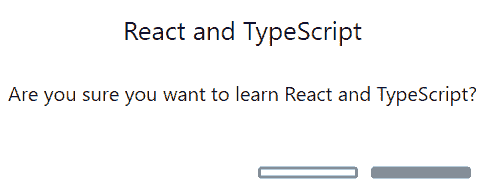

这是因为当我们在`App.tsx`中引用`Confirm`时，我们没有提供这些值。

在下一节中，我们将通过为`cancelCaption`和`okCaption`添加一些默认值来解决这个问题。

# 默认属性值

当组件初始化时，可以向组件 props 添加默认值。这可以使用一个名为`defaultProps`的静态对象文字来实现。

让我们在我们的`Confirm`组件中利用这个特性，如下所示：

1.  在我们的类中为`cancelCaption`和`okCaption`创建一些默认值：

```jsx
class Confirm extends React.Component<IProps> {
  public static defaultProps = {
 cancelCaption: "Cancel",
 okCaption: "Okay"
 };
  public render() { ... }
}
```

如果我们再次查看我们正在运行的应用程序，我们再次有了按钮标题。

1.  让我们通过覆盖默认值，并在`App.tsx`中提供这些标题的特定属性来完成本节：

```jsx
<Confirm
  title="React and TypeScript"
  content="Are you sure you want to learn React and TypeScript?"
  cancelCaption="No way"
 okCaption="Yes please!"
/>
```

我们正在运行的应用程序现在应该看起来像下面这样：


具有默认值的可选 props 可以使组件更容易消耗，因为最常见的配置可以自动设置，而无需指定任何内容。

因此，我们的`Confirm`组件现在很灵活，但按钮还没有做任何事情。我们将在接下来的几节中解决这个问题。

# 处理类组件事件

事件存在于许多编程语言中。它们允许我们指定逻辑，根据用户与我们的应用程序的交互方式执行。

# 基本事件处理程序

所有原生的 JavaScript 事件都可以在 JSX 中处理。JSX 允许我们使用调用函数的 props 来做到这一点。prop 名称是通过在原生事件名称前加上`on`并使用驼峰命名法来派生的。因此，在 JSX 中，`click`事件的 prop 名称是`onClick`。

我们可以在`node_modules/@types/react`文件夹中的`index.d.ts`文件中看到所有可用事件及其相应类型的列表。

我们需要能够控制我们的`Confirm`组件中按钮的行为。按照以下步骤进行：

1.  第一步是处理这些按钮的`click`事件。让我们在确定按钮上设置`onClick`属性，如下所示：

```jsx
<button className="confirm-ok" onClick={this.handleOkClick}>...</button>
```

因此，我们告诉按钮在被点击时调用`Confirm`类中的`handleOkClick`方法。

1.  接下来，让我们创建`handleOkClick`方法：

```jsx
private handleOkClick() {
  console.log("Ok clicked");
}
```

切换到运行我们应用的浏览器，并点击“是的，请！”按钮。如果我们查看控制台，应该会看到“Ok clicked”显示：

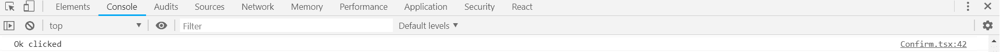

正如我们所看到的，使用我们已经熟悉的机制处理事件非常简单。不过，我们的`handleOkClick`方法实际上存在问题。我们将在下一节详细讨论并解决这个问题。

# 这个问题

我们的事件处理程序遭受 JavaScript 经典的`this`问题。我们目前在事件处理程序中没有引用`this`，这就是为什么问题还没有浮出水面的原因。

让我们暴露`handleOkClick`方法的问题，以便更好地理解发生了什么：

1.  将组件的 props 记录到控制台：

```jsx
private handleOkClick() {
  console.log("Ok clicked", this.props);
}
```

现在，再次尝试点击“是的，请！”按钮。将出现以下错误：

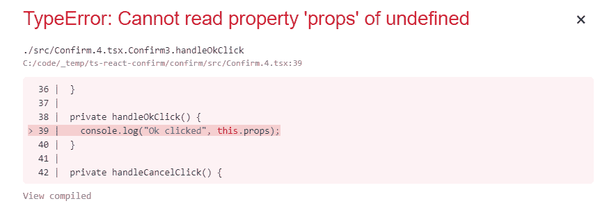

问题在于`this`在事件处理程序中不引用我们的类，而是`undefined`。

一个解决方案是将`handleOkClick`方法更改为箭头函数。

箭头函数表达式比函数表达式的语法更短。它们也不会创建自己的`this`，所以它们是解决`this`问题的一个很好的解决方案。

1.  让我们将我们的方法转换为箭头函数，如下所示：

```jsx
private handleOkClick = () => {
 console.log("Ok clicked", this.props);
};
```

现在再次尝试点击“是的，请！”按钮。我们应该看到成功将 props 输出到控制台。

1.  继续，现在让我们在取消按钮上实现一个点击处理程序。首先，我们需要在`Cancel`按钮的`onClick`属性上引用一个处理程序：

```jsx
<button className="confirm-cancel" onClick={this.handleCancelClick}>...</button>
```

1.  现在我们将创建`handleCancelClick`箭头函数：

```jsx
private handleCancelClick = () => {
  console.log("Cancel clicked", this.props);
};
```

总之，为了避免`this`问题，我们可以使用箭头函数来实现事件处理程序。

接下来，我们希望组件的使用者能够在按钮被点击时执行一些逻辑。我们将在下一节中介绍如何做到这一点。

# 函数 props

在上一节中，我们看到了如何为具有我们的`onClick`事件处理程序的函数设置 props。在本节中，我们将实现自己的函数 props，以便我们组件的消费者在按下确定和取消按钮时可以执行一些逻辑。

1.  让我们在我们的接口上实现这两个额外的 props。该函数不接受任何参数，也不返回任何内容。因此，类型为`() => void`，如下所示：

```jsx
interface IProps {
 title: string;
 content: string;
 cancelCaption?: string;
 okCaption?: string;
 onOkClick: () => void;
 onCancelClick: () => void;
}
```

这些 props 是必需的，所以当我们引用`Confirm`组件时，我们立即在`App.tsx`中得到编译错误。我们稍后会修复这个问题。

1.  接下来，让我们在按钮被点击时调用我们的函数 props，而不是将消息记录到控制台中：

```jsx
private handleCancelClick = () => {
  this.props.onCancelClick();
};

private handleOkClick = () => {
  this.props.onOkClick();
};
```

1.  现在我们将通过在`App.tsx`中实现箭头函数处理程序来修复编译错误。首先让我们创建箭头函数处理程序：

```jsx
private handleCancelConfirmClick = () => {
 console.log("Cancel clicked");
};

private handleOkConfirmClick = () => {
 console.log("Ok clicked");
};
```

1.  现在我们可以引用这些函数，我们在其中使用`Confirm`组件：

```jsx
<Confirm
  ...
  onCancelClick={this.handleCancelConfirmClick}
 onOkClick={this.handleOkConfirmClick}
/>
```

如果我们回到我们的应用程序，我们会看到编译错误已经解决。如果我们单击确定和取消按钮，我们会得到预期的消息输出到控制台：

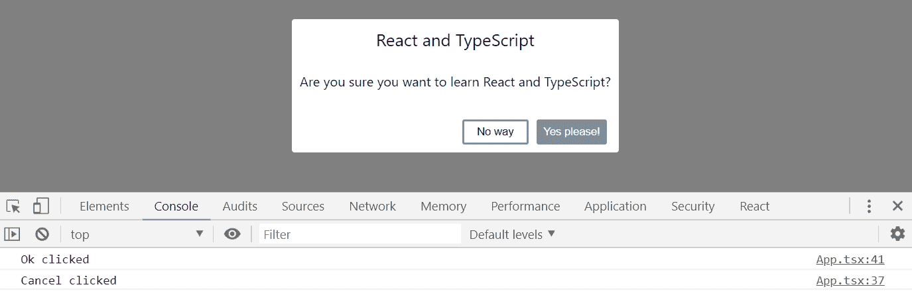

目前，我们的按钮除了将消息记录到控制台外什么都不做。我们希望确认对话框在单击任一按钮时关闭。我们将在下一节中实现这一点。

# 类组件状态

状态是一个确定组件行为和渲染方式的对象。我们需要在我们的应用程序中引入状态，以便管理我们的确认对话框是打开还是关闭。

这种特定的状态将存在并由`App`组件中进行管理，并作为一个 prop 传递给`Confirm`组件。

1.  首先，在`Confirm`组件中创建一个`open`属性，将其添加到其 props 接口中：

```jsx
interface IProps {
  open: boolean;
  title: string;
  content: string;
  cancelCaption?: string;
  okCaption?: string;
  onOkClick: () => void;
  onCancelClick: () => void;
}
```

1.  我们将在`render`函数中使用`open`属性来确定对话框是否可见。`confirm-visible` CSS 类使对话框可见。

因此，在最外层的`div`中，让我们在`className`属性中使用 JavaScript 三元表达式，只有在`open`属性为`true`时才包含`confirm-visible`，如下所示：

```jsx
public render() {
  return (
    <div
      className={
 this.props.open
 ? "confirm-wrapper confirm-visible"
 : "confirm-wrapper"
 }
    >
      ...
    </div>
  );
}
```

我们现在在`App.tsx`中有一个编译错误，因为我们在使用`Confirm`时没有指定`open`属性。

1.  在开始在`App.tsx`中创建和管理状态之前，让我们在`Confirm`中的`open`属性中简单地传递`false`：

```jsx
<Confirm
  open={false}
  title="React and TypeScript"
  content="Are you sure you want to learn React and TypeScript?"
  cancelCaption="No way"
  okCaption="Yes please!"
  onCancelClick={this.handleCancelConfirmClick}
  onOkClick={this.handleOkConfirmClick}
/>
```

如果我们现在在浏览器中查看应用程序，编译错误将消失，我们的确认对话框将关闭。

# 定义状态类型

让我们在`App.tsx`中创建一个状态，并正确地管理确认对话框是打开还是关闭：

1.  首先，让我们在`App`类上面创建一个状态的接口：

```jsx
interface IState {
 confirmOpen: boolean;
}
```

1.  然后我们告诉`App`组件关于状态类型，我们可以使用`React.Component`的第二个泛型参数来做到这一点：

```jsx
class App extends React.Component<{}, IState>
```

我们使用`{}`作为 props 类型，因为这个组件没有 props。

# 初始化状态

现在我们已经指定了我们的组件有一个状态，我们需要初始化它。我们在类构造函数中初始化组件状态。

1.  让我们创建一个构造函数，并将`confirmOpen`状态初始化为`true`：

```jsx
constructor(props: {}) {
 super(props);
 this.state = {
  confirmOpen: true,
 };
}
```

我们调用`super`因为我们的类扩展了`React.Component`。

状态保存在组件类的私有属性中。在构造函数中，我们可以将状态设置为我们所需的对象字面量，我们的情况下`confirmOpen`设置为`true`。

1.  当我们引用`Confirm`组件时，我们可以使用这个状态：

```jsx
<Confirm
  open={this.state.confirmOpen}
  ...
/>
```

如果我们在运行的应用中查看，确认对话框应该再次打开。

因此，私有状态属性给了我们访问组件状态的权限，并且我们可以在类构造函数中初始化它。

# 改变状态

当确认对话框按钮被点击时，我们希望关闭对话框。因此，我们希望在按钮被点击时将`confirmOpen`的状态改为 false。

我们已经有了箭头函数处理按钮点击事件，也许我们可以在那里改变状态：

1.  让我们尝试在`handleOkConfirmClick`中做到这一点，替换`console.log`：

```jsx
private handleOkConfirmClick = () => {
  this.state.confirmOpen = false;
};
```

我们得到了一个编译错误，如下所示：

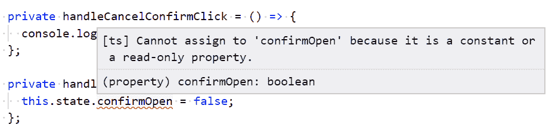

错误消息表明状态是只读的！为什么会这样，我们如何改变状态？

我们需要在组件类中使用一个叫做`setState`的方法来改变状态。这有助于确保我们稳健和高效地管理状态。`setState`接受一个参数，这个参数是一个包含我们想要改变的状态的对象字面量。

1.  让我们改变我们的代码来使用`setState`：

```jsx
private handleOkConfirmClick = () => {
  this.setState({ confirmOpen: false });
};
```

编译错误消失了，如果我们在运行的应用中点击 Yes please!，确认对话框现在将关闭。我们成功地改变了状态。

1.  改变`handleCancelConfirmClick`的实现以关闭对话框：

```jsx
private handleCancelConfirmClick = () => {
  this.setState({ confirmOpen: false });
};
```

在我们关闭确认对话框之后，我们没有办法再次打开它。

1.  那么，让我们在`App.tsx`中添加一个名为 Confirm 的按钮：

```jsx
<button onClick={this.handleConfirmClick}>Confirm</button>
<Confirm ... />
```

1.  我们需要创建刚刚引用的处理程序：

```jsx
private handleConfirmClick = () => {
  this.setState({ confirmOpen: true });
};
```

现在，我们可以点击确认按钮，在确认对话框关闭后重新打开它。

1.  让我们在`App.tsx`中的 Confirm 按钮上方添加一段文本，根据确认对话框是取消还是确认而变化。我们将定义一个额外的状态来驱动这段文本：

```jsx
interface IState {
  confirmOpen: boolean;
  confirmMessage: string;
}
```

1.  现在，让我们在构造函数中初始化消息：

```jsx
constructor(props: {}) {
  super(props);
  this.state = {
    confirmMessage: "Please hit the confirm button",
    confirmOpen: true,
  };
}
```

1.  当确认对话框被确认或取消时，状态现在已经改变：

```jsx
private handleOkConfirmClick = () => {
  this.setState({
    confirmMessage: "Cool, carry on reading!",
    confirmOpen: false
  });
};

private handleCancelConfirmClick = () => {
  this.setState({
    confirmMessage: "Take a break, I'm sure you will later ...",
    confirmOpen: false
  });
};
```

1.  最后，我们可以在确认按钮上方呈现消息：

```jsx
<p>{this.state.confirmMessage}</p>
<button onClick={this.handleConfirmClick}>Confirm</button>
<Confirm ... />
```

如果我们现在运行应用程序，我们会看到应用程序中的消息根据我们确认或取消确认对话框而改变。

虽然我们可以在构造函数中直接设置状态属性，但在类组件的其他地方却不能。相反，状态应该通过在组件类中调用`setState`方法来改变。

# 类组件生命周期方法

类组件中的生命周期方法允许我们在过程中的特定点运行代码。以下是组件过程的高级图表，显示了不同方法何时被调用：

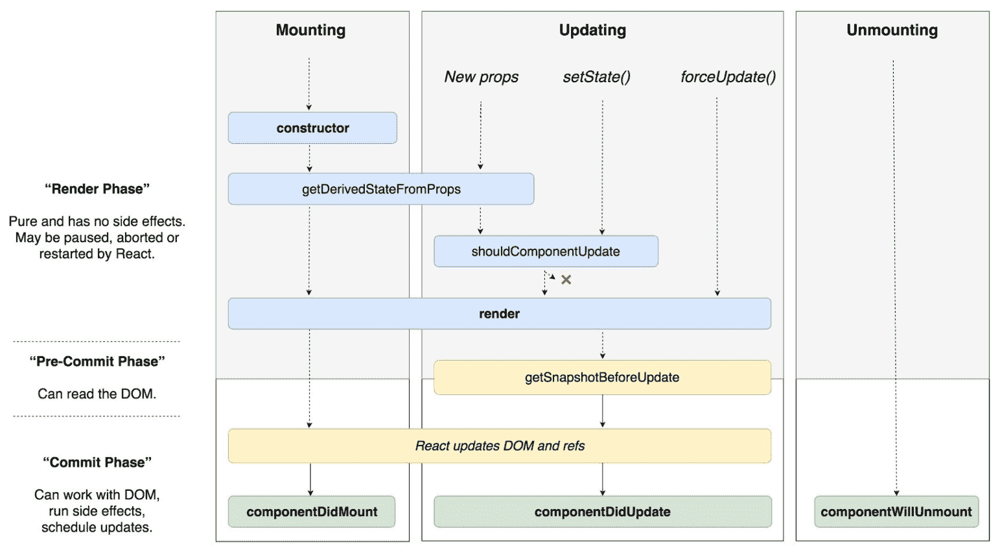

现代 React 生命周期方法的图表，来自 React 文档

# componentDidMount

`componentDidMount`在组件被插入 DOM 时被调用。以下是该方法的一些常见用例：

+   调用 web 服务以获取一些数据

+   添加事件监听器

+   初始化计时器

+   初始化第三方库

我们将改变我们一直在构建的应用程序，为用户提供 10 秒的时间来确认他们是否想要学习 React 和 TypeScript。为了做到这一点，我们需要利用`componentDidMount`方法：

1.  让我们首先在`App.tsx`中使确认对话框在应用程序加载时关闭：

```jsx
constructor(props: {}) {
  super(props);
  this.state = {
    confirmMessage: "Please hit the confirm button",
    confirmOpen: false
  };
}
```

1.  我们将从`10`开始倒计时到`0`，然后在达到`0`时隐藏确认按钮。让我们在`App.tsx`中添加和初始化这两个状态：

```jsx
interface IState {
  confirmOpen: boolean;
  confirmMessage: string;
 confirmVisible: boolean; countDown: number;
}

constructor(props: {}) {
  super(props);
  this.state = {
    confirmMessage: "Please hit the confirm button",
    confirmOpen: false,
    confirmVisible: true,
 countDown: 10
  };
}
```

1.  我们将在`App`类中使用`timer`从`10`倒数到`1`。让我们在构造函数上方创建一个名为`timer`的私有属性：

```jsx
private timer: number = 0;
```

1.  现在，让我们使用`componentDidMount`方法来初始化我们的`timer`：

```jsx
public componentDidMount() {
  this.timer = window.setInterval(() => this.handleTimerTick(), 1000);
}
```

1.  计时器将每秒调用一个名为`handleTimerTick`的方法。实现该方法如下：

```jsx
private handleTimerTick() {
  this.setState(
    {
      confirmMessage: `Please hit the confirm button ${
        this.state.countDown
      } secs to go`,
      countDown: this.state.countDown - 1
    }
  );
}
```

我们也在减少计数器，更新用户在此方法中显示的消息。但是，我们需要在这里做更多的工作：我们需要停止计时器，隐藏确认按钮，并告诉用户他们来得太迟了！

1.  我们的自然本能可能是写出这样的东西：

```jsx
private handleTimerTick() {
  this.setState(
    {
      confirmMessage: `Please hit the confirm button ${
        this.state.countDown
      } secs to go`,
      countDown: this.state.countDown - 1
    }
  );
  if (this.state.countDown <= 0) {
 clearInterval(this.timer);
 this.setState({
 confirmMessage: "Too late to confirm!",
 confirmVisible: false
 });
 }
}
```

然而，这是不正确的，因为状态是异步更新的，所以在`setState`调用中更新后，`this.state.countDown`可能还没有更新下一行。

1.  相反，我们需要将此代码移动到`setState`的回调中：

```jsx
private handleTimerTick() {
  this.setState(
    {
      confirmMessage: `Please hit the confirm button ${
        this.state.countDown
      } secs to go`,
      countDown: this.state.countDown - 1
    },
 () => {
 if (this.state.countDown <= 0) {
 clearInterval(this.timer);
 this.setState({
 confirmMessage: "Too late to confirm!",
 confirmVisible: false
 });
 }
 }
  );
}
```

1.  如果点击确认、确定或取消按钮，我们也要停止计时器：

```jsx
private handleConfirmClick = () => {
  this.setState({ confirmOpen: true });
  clearInterval(this.timer);
};

private handleCancelConfirmClick = () => {
  this.setState(...);
  clearInterval(this.timer);
};

private handleOkConfirmClick = () => {
  this.setState(...;
  clearInterval(this.timer);
};
```

1.  我们的最后一项工作是在确认按钮周围加上条件，只有在`confirmVisible`状态为`true`时才显示它：

```jsx
<p>{this.state.confirmMessage}</p>
{this.state.confirmVisible && (
 <button onClick={this.handleConfirmClick}>Confirm</button>
)}
<Confirm ... />
```

`x && y`允许我们用单个分支简洁地表达条件。基本上，如果左操作数为假，那么`&&`的右操作数不会被评估和渲染。

现在，是时候试一试了。当应用程序首次运行时，我们会看到倒计时：

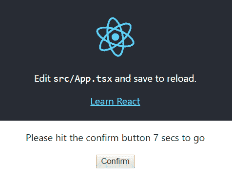

如果我们在十秒内不确认，就太迟了：

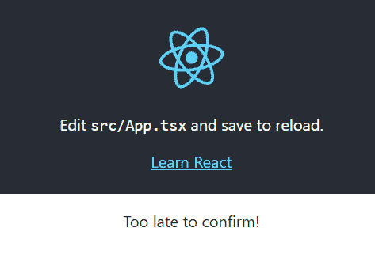

# componentWillUnmount

`componentWillUnmount`在组件从 DOM 中移除之前被调用。以下是此方法的一些常见用例：

+   移除事件监听器

+   取消活动网络请求

+   移除计时器

我们将在我们的应用程序中使用`componentWillUnmount`来确保我们的`timer`被停止和移除。让我们在`componentDidMount`方法之后的`App`类中添加以下内容：

```jsx
public componentWillUnmount() {
  clearInterval(this.timer);
}
```

# 从 props 获取派生状态

`getDerivedStateFromProps`在每次组件渲染时被调用。它可以用于在某些 props 更改时更改状态。这是组件类中的静态方法，返回更改后的状态，如果状态没有更改则返回 null。

让我们在我们的应用程序中查看这个生命周期方法。在`App`类的顶部添加以下内容：

```jsx
public static getDerivedStateFromProps(props: {}, state: IState) {
  console.log("getDerivedStateFromProps", props, state);
  return null;
}
```

如果我们在应用程序运行时查看控制台，我们会发现我们的方法在倒计时递减时被调用：

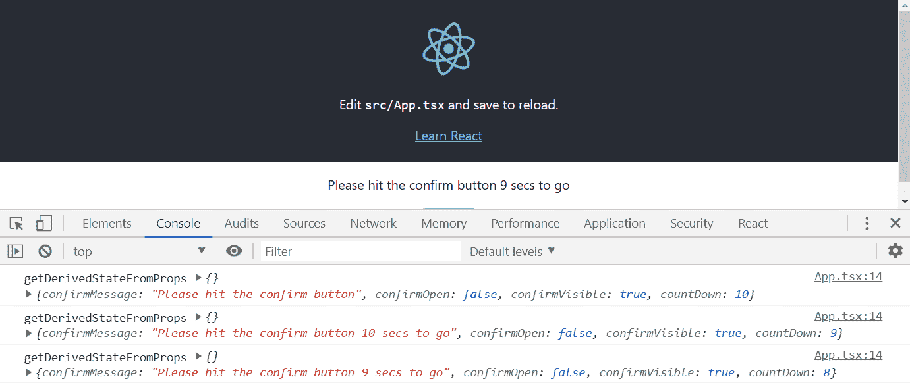

# 在更新之前获取快照和更新后获取快照

`getSnapshotBeforeUpdate`在更新 DOM 之前调用。从`getSnapshotBeforeUpdate`返回的值会传递给`componentDidUpdate`。

`componentDidUpdate`在 DOM 更新后立即被调用。在渲染期间调整窗口大小是`getSnapshotBeforeUpdate`有用的示例。

让我们来看看我们应用中的这些生命周期方法：

1.  让我们在`App`类的顶部附近，在`timer`变量声明下面添加以下内容：

```jsx
private renderCount = 0;
```

1.  现在，让我们添加生命周期方法：

```jsx
public getSnapshotBeforeUpdate(prevProps: {}, prevState: IState) {
  this.renderCount += 1;
  console.log("getSnapshotBeforeUpdate", prevProps, prevState, {
    renderCount: this.renderCount
  });
  return this.renderCount;
}

public componentDidUpdate(prevProps: {}, prevState: IState, snapshot: number) {
  console.log("componentDidUpdate", prevProps, prevState, 
  snapshot, {
    renderCount: this.renderCount
  });
}
```

查看正在运行的应用程序：

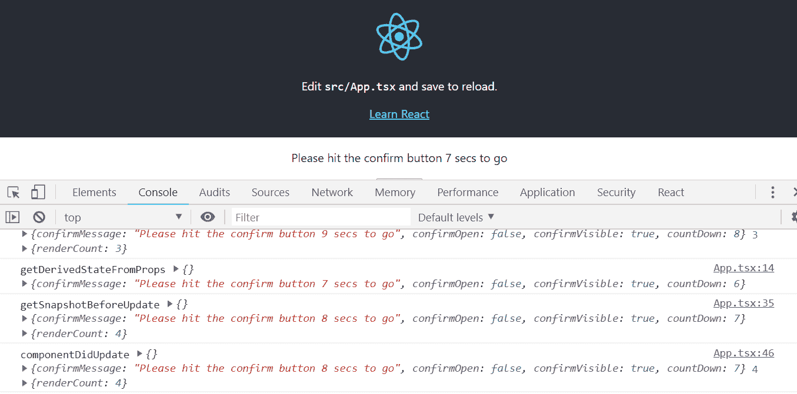

我们看到方法按照我们期望的顺序被调用，并且`componentDidUpdate`成功地从`getSnapshotBeforeUpdate`中获取了渲染计数。

# shouldComponentUpdate

`shouldComponentUpdate`在渲染发生之前被调用。它返回一个布尔值，用于确定是否应该进行渲染。它可以用于优化性能，防止不必要的渲染周期。

1.  让我们通过添加以下方法来查看我们应用中的这个生命周期方法：

```jsx
public shouldComponentUpdate(nextProps: {}, nextState: IState) {
  console.log("shouldComponentUpdate", nextProps, nextState);
  return true;
}
```

如果我们查看正在运行的应用程序，我们会发现`shouldComponentUpdate`发生在`getDerivedStateFromProps`和`getSnapshotBeforeUpdate`之间，正如我们所期望的那样。

1.  现在让我们通过返回`false`来阻止渲染：

```jsx
public shouldComponentUpdate(nextProps: {}, nextState: IState) {
  console.log("shouldComponentUpdate", nextProps, nextState);
  return false;
}
```

我们看到`getSnapshotBeforeUpdate`和`componentDidUpdate`没有被调用，因为在初始渲染之后没有发生渲染：

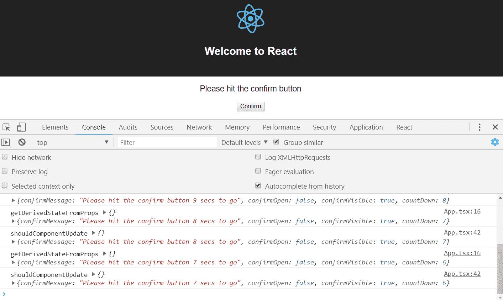

1.  在进入下一节之前，让我们通过将此标志设置回`true`来允许我们的组件再次渲染：

```jsx
public shouldComponentUpdate(nextProps: {}, nextState: IState) {
  console.log("shouldComponentUpdate", nextProps, nextState);
  return true;
}
```

`shouldComponentUpdate`可以通过阻止不必要的渲染来提高性能，但应谨慎使用。它可能引入难以解决的错误。此外，我们需要添加的额外代码来检查是否应该进行渲染实际上可能会减慢应用程序的速度。

# 已弃用的生命周期方法

在 React 17 中，有一些生命周期方法已被弃用并更名。我们不再需要使用这些方法——`getDerivedStateFromProps`和`getSnapshotBeforeUpdate`基本上取代了它们。然而，以下是这些方法的简要描述，以防您在现有代码库中遇到它们：

+   `componentWillMount`（现在是`UNSAFE_componentWillMount`）：在初始渲染期间，在组件被添加到 DOM 之前调用

+   `componentWillReceiveProps`（现在是`UNSAFE_componentWillReceiveProps`）：在组件属性更改时调用

+   `componentWillUpdate`（现在是`UNSAFE_componentWillUpdate`）：在组件更新之前调用

# 创建一个函数组件

顾名思义，函数组件是使用 JavaScript 函数实现的。这些组件有时被称为*功能无状态组件*，这可能有点令人困惑，因为它们在 React 的较新版本中可以包含状态。

# 创建一个基本的函数组件

让我们重构我们的`Confirm`组件为一个函数组件，以学习如何实现这些：

1.  打开`Confirm.tsx`并用以下内容替换类签名：

```jsx
const Confirm: React.SFC<IProps> = (props) => {
...
}
```

我们使用箭头函数来定义一个函数组件，将 props 类型作为泛型参数传递进去。

我们将在本书的后面学习泛型函数，所以如果现在还不太明白，不用担心。

我们使用**无状态功能组件**（**SFC**）`React.SFC`来表示这些类型的组件。

我们的组件现在出现了几个编译错误。我们将在接下来的步骤中解决这些问题。

1.  函数组件没有渲染方法。相反，函数本身返回应该被渲染的 JSX。所以，让我们通过删除`render`签名来改变我们函数的这部分，并保留返回语句：

```jsx
return (
  <div
    className={
      this.props.open
        ? "confirm-wrapper confirm-visible"
        : "confirm-wrapper"
    }
  >
      ...
  </div>
);
```

1.  我们需要将事件处理程序更改为箭头函数常量，并直接访问 props，而不是通过`this`。我们还应该将这些处理程序移到`return`语句之上：

```jsx
const handleCancelClick = () => {
 props.onCancelClick();
};

const handleOkClick = () => {
 props.onOkClick();
}; 

return ( ... )
```

1.  然后我们直接引用 props 和事件处理程序，而不是通过`this`在我们的 JSX 中：

```jsx
<div
  className={
    props.open
      ? "confirm-wrapper confirm-visible"
      : "confirm-wrapper"
  }
>
  <div className="confirm-container">
    <div className="confirm-title-container">
      <span>{props.title}</span>
    </div>
    <div className="confirm-content-container">
      <p>{props.content}</p>
    </div>
    <div className="confirm-buttons-container">
      <button className="confirm-cancel" onClick=
       {handleCancelClick}>
        {props.cancelCaption}
      </button>
      <button className="confirm-ok" onClick={handleOkClick}>
        {props.okCaption}
      </button>
    </div>
  </div>
</div>
```

1.  我们还有一个关于静态`defaultProps`变量的问题。我们将这个移出我们的函数，并将其放在函数下面的对象文字中，如下所示：

```jsx
Confirm.defaultProps = {
  cancelCaption: "Cancel",
  okCaption: "Okay"
}
```

如果我们查看正在运行的应用程序，所有的编译错误应该都已经解决了，应用程序应该像以前一样工作。

以下代码是一个函数组件的模板。我们的`Confirm`组件现在应该有类似于这样的结构：

```jsx
import * as React from "react";

const ComponentName: React.SFC<IProps> = props => {
 const handler = () => {
 ...
 };

 return (
 <div>Our JSX</div>
 );
};
ComponentName.defaultProps = {
 ...
};

export default ComponentName;
```

因此，函数组件是创建组件的另一种方式。在下一节中，我们将看看如何向函数组件添加状态。

# 有状态的函数组件

我们已经提到函数组件可以有状态。在本节中，我们将向我们的函数`Confirm`组件添加状态，以强制用户在关闭之前点击取消按钮两次，如下所示：

1.  我们将首先通过添加下面突出显示的行来定义和初始化取消按钮被点击的次数状态：

```jsx
const Confirm: React.SFC<IProps> = props => {

  const [cancelClickCount, setCancelClickCount] = 
  React.useState(0); 
  const handleOkClick = () => {
    props.onOkClick();
  };
  ...
}
```

这行代码看起来有点奇怪，让我们来分解一下：

+   `React.useState`是一个 React 函数，它让我们创建状态，将默认值作为参数传递。在我们的例子中，我们将其传递一个默认值为 0。

+   `useState`函数返回一个包含两个元素的数组：

+   第一个数组元素包含状态的当前值

+   第二个数组元素包含将状态设置为不同值的函数。

+   我们解构数组并将第一个数组元素（状态值）存储在`cancelClickCount`中，将第二个数组元素（设置状态的函数）存储在`setCancelClickCount`中。

+   函数的其余部分现在可以通过`cancelClickCount`变量访问取消点击计数。该函数还能够通过`setCancelClickCount`变量增加取消点击计数。

1.  让我们重构`handleCancelClick`箭头函数以增加`cancelClickCount`，并且只在计数达到`2`时调用`onCancelClick`属性：

```jsx
const handleCancelClick = () => {
  const newCount = cancelClickCount + 1;
 setCancelClickCount(newCount);
 if (newCount >= 2) {
 props.onCancelClick();
 }
};
```

现在，设置状态的函数将新状态作为其参数。

1.  接下来，我们将更改取消按钮的标题，在第一次点击后显示"真的吗？"：

```jsx
<button className="confirm-cancel" onClick={handleCancelClick}>
  {cancelClickCount === 0 ? props.cancelCaption : "Really?"}
</button>
```

因此，我们通过在定义状态时解构的变量在 JSX 中访问状态值。

如果我们在运行的应用程序中尝试这样做，我们应该会发现取消按钮文本在第一次点击后更改为"真的吗？"，并且确认对话框在第二次点击后关闭。

在我们理解了定义状态所需的代码之后，访问和设置状态就变得非常简单和优雅。

让我们继续到下一部分，并了解如何钩入函数组件的生命周期事件。

# 函数组件生命周期钩子

我们可以在函数组件的生命周期的某些时刻调用代码。让我们从`Confirm`组件开始探索这一点，从组件首次渲染开始，如下所示：

1.  让我们在定义状态的下面添加高亮显示的代码行：

```jsx
const [cancelClickCount, setCancelClickCount] = React.useState(0);

React.useEffect(() => {
 console.log("Confirm first rendering");
}, []);
```

+   我们使用 React 的`useEffect`函数来钩入组件的生命周期。

+   该函数接受一个箭头函数，当组件首次渲染时执行。

+   该函数接受第二个参数，确定何时调用我们的箭头函数。该参数是一个值的数组，当更改时，将调用箭头函数。在我们的例子中，我们传入一个空数组，因此我们的箭头函数在第一次渲染后永远不会被调用。

+   如果我们现在尝试运行应用程序并打开控制台，我们会看到确认第一次渲染只出现一次。

1.  现在让我们将`useEffect`的第二个参数移除：

```jsx
React.useEffect(() => {
  console.log("Confirm rendering");
});
```

如果我们查看运行中的应用程序和控制台，我们会看到每次`Confirm`被渲染时都会出现`确认渲染`。

1.  让我们再次将其更改为以下内容：

```jsx
React.useEffect(
  () => {
    console.log("open changed");
  },
  [props.open]
);
```

如果我们查看运行中的应用程序和控制台，我们会看到每次`Confirm`组件的`open`属性值发生变化时都会出现`open changed`。

1.  那么如何在组件卸载时进行挂钩呢？让我们尝试以下内容：

```jsx
React.useEffect(() => {
  console.log("Confirm first rendering");
  return () => {
 console.log("Confirm unmounted");
 };
}, []);
```

因此，我们的箭头函数可以返回一个在组件卸载时执行的函数。

1.  我们的`Confirm`组件目前不会卸载，因此在`App.tsx`中，让我们在倒计时达到`0`时不再渲染它：

```jsx
{this.state.countDown > 0 && (
  <Confirm
    ...
  />
)}
```

如果我们查看运行中的应用程序和控制台，当倒计时达到`0`时，我们会看到`确认卸载`出现。

因此，当函数组件首次渲染、当它们的 props 改变以及当它们被卸载时，我们可以执行逻辑。

在下一节中，我们将看一种可以用来优化函数组件渲染周期的方法。

这部分关于 hooks 的内容是基于 React v16.6.0 编写的。当新版本发布时，我们将分享更新的代码。

# 优化函数组件渲染

我们的`Confirm`组件实际上被渲染得比它需要的更多。在本节中，我们将对此进行优化，以便它仅在其 props 发生变化时才进行渲染：

1.  首先，让我们在函数组件的顶部添加一行，这样我们就可以看到它何时被渲染：

```jsx
console.log("Confirm rendering");
```

如果我们查看运行中的应用程序和控制台，我们会看到每次`App`组件倒计时时都会发生渲染。倒计时是在`App`组件状态中的，状态的改变意味着组件将被重新渲染，以及任何子组件。这就是为什么，没有任何优化的情况下，我们的`Confirm`组件在每次倒计时时都会被渲染。

1.  接下来是优化。实际上非常简单：

```jsx
const ConfirmMemo = React.memo(Confirm);
export default ConfirmMemo;
```

因此，我们用来自 React 的`memo`函数包装我们的组件。然后导出这个包装函数。`memo`函数只在组件的 props 发生变化时才会渲染组件。

如果我们查看运行中的应用程序和控制台，我们会看到我们的组件不再在每次倒计时时被渲染。

因此，考虑到这是多么简单，我们是否应该用`memo`包装所有的函数组件呢？不！当`memo`确定组件是否发生变化时，会有性能成本。如果组件实际上没有进行任何不必要的渲染，使用`memo`会导致组件变慢。

`memo`应该谨慎使用，只用于需要多次渲染的组件。

鉴于类组件和函数组件的特性相似，我们应该使用哪种类型？实际上并没有直接的答案。如果我们的团队习惯于面向对象的代码，也许基于类的组件会更容易学习。如果我们的团队习惯于更多的函数式编程技术，那么基于函数的组件可能会使他们更加高效。

这两种方法都是创建 React 组件的好方法——选择权在你手中！

# 总结

在本章中，我们学习了几种不同的方法来创建 React 和 TypeScript 项目。更加手动的方法教会了我们有多少个组成部分。在本书中，我们将经常使用`create-react-app`来快速创建我们的应用程序。

我们学习了所有的 React 类组件都有一个返回 JSX 的`render`方法，告诉 React 要显示什么。JSX 非常灵活和强大，因为 JavaScript 表达式可以与 HTML 混合在一起。

我们学习了如何使用 props 配置组件，以及如何向 props 添加 TypeScript 类型，以帮助在使用组件时防止错误。

接下来，我们学习了组件如何管理渲染的内容以及它们如何使用状态。与 props 一样，在 React 和 TypeScript 应用程序中，状态是强类型的。我们在构造函数中初始化状态，并通过`setState`方法进行更改。

我们还学习了事件处理程序，它们允许我们对用户与我们的组件的交互做出反应。JSX 为我们提供了方便的`onEventName`属性来处理事件。

接下来，我们了解了可以实现的各种生命周期方法，以在过程的各个阶段执行逻辑。最常用的生命周期方法是`componentDidMount`，它在组件刚刚添加到 DOM 时发生。

最后，我们学习了函数组件，这是一种实现组件的替代方法。在 React 的最新版本中，我们可以在其中使用状态，访问常见的生命周期钩子，甚至优化渲染周期。

在第三章中，*开始使用 React 和 TypeScript*，我们将学习如何高效地构建具有多个页面的 React 和 TypeScript 应用程序。

# 问题

根据我们刚刚学到的知识，回答以下问题：

1.  在开发过程中，允许调试器语句和向控制台输出日志的 TSLint 设置是什么？

1.  在 JSX 中，我们如何在类组件中显示一个带有来自名为`buttonLabel`的 prop 的标签的按钮？

1.  我们如何使`buttonLabel` prop 成为可选的，并默认为 Do It？

1.  在 JSX 中，我们如何只在`doItVisible`状态为`true`时显示这个按钮？（假设我们已经声明了一个包含`doItVisible`的状态类型，并且它已经在构造函数中初始化。）

1.  我们如何为这个按钮创建一个点击处理程序？

1.  我们声明了一个包含`doItDisabled`的状态类型。它也已经在构造函数中初始化。我们如何在点击后将这个状态设置为禁用 Do it 按钮？

1.  如果按钮在禁用状态下被点击，点击处理程序是否仍然被执行？

1.  在类组件中，我们将使用哪个生命周期方法来向我们的 React 组件中的非 React 网络组件添加事件处理程序？

1.  我们将使用哪个生命周期方法来移除这个事件处理程序？

1.  我们有一个名为`Counter`的函数组件。它需要包含一个名为`count`的状态片段，以及一个用于更新它的函数`setCount`。我们如何定义这个状态并将初始计数默认为 10？

1.  在前面的`Counter`组件中，我们有一个需要将`count`减少 1 的`decrement`函数。

```jsx
const decrement = () => {
  // TODO - reduce count by 1
};
```

这如何实现？

# 进一步阅读

+   官方的 React 入门教程值得一读：[`reactjs.org/tutorial/tutorial.html`](https://reactjs.org/tutorial/tutorial.html)

+   `create-react-app`文档也值得收藏：[`facebook.github.io/create-react-app/docs/getting-started`](https://facebook.github.io/create-react-app/docs/getting-started)
